# Russian Offensive Campaign Assessment, August 24, 2024

**Riley Bailey, Grace Mappes, Nicole Wolkov, Davit Gasparyan, and George Barros**

**August 24, 2024, 8:20pm ET**

**Click** [**here**](https://storymaps.arcgis.com/stories/36a7f6a6f5a9448496de641cf64bd375) **to see ISW’s interactive map of the Russian invasion of Ukraine. This map is updated daily alongside the static maps present in this report.**

**Click** [**here**](https://storymaps.arcgis.com/stories/83a2f24901c941d581c0c523ecd2619b) **to see ISW’s interactive map of Ukraine’s offensive in Kursk Oblast.**

**Click** [**here**](https://understandingwar.maps.arcgis.com/apps/instant/3dviewer/index.html?appid=1602762dbcde419bb957dea358449580) **to see ISW’s 3D control of terrain topographic map of Ukraine. Use of a computer (not a mobile device) is strongly recommended for using this data-heavy tool.**

**Click** [**here**](https://storymaps.arcgis.com/stories/733fe90805894bfc8562d90b106aa895) **to access ISW’s archive of interactive time-lapse maps of the Russian invasion of Ukraine. These maps complement the static control-of-terrain map that ISW produces daily by showing a dynamic frontline. ISW will update this time-lapse map archive monthly.**

**Note: The data cut-off for this product was 1pm ET on August 24. ISW will cover subsequent reports in the August 25 Russian Offensive Campaign Assessment.**

**Ukrainian long-range strikes against Russian military targets within Russia’s rear are crucial for degrading Russian military capabilities throughout the theater, and the lifting of restrictions on Ukraine’s use of Western-provided weapons would allow Ukrainian forces to strike a wide range of significant targets undergirding Russia’s war effort. An unnamed senior Biden administration national security official reportedly stated that Ukrainian strikes with Western-provided weapons against targets within Russia would not be effective because the Russian military has redeployed military aircraft from Russian airbases near Ukraine — but this assessment ignores how Russian forces are leveraging sanctuary space in deep rear areas within Russia for a wide array of infrastructure besides airfields to support military operations against Ukraine.***Politico*reported on August 23 that an unnamed senior Biden administration national security official stated that Russian officials have moved some targets out of range of Western-provided Storm Shadow and ATACMS missiles and that Ukrainian forces only have a limited supply of these missiles.[1] An unnamed administration official also reportedly stated that Russian forces have moved 90 percent of the aircraft that conduct glide bomb strikes from Russian airspace away from airfields within range of Storm Shadow and ATACMS missiles.[2] ISW has observed confirmation of redeployments of Russian aircraft to airfields out of range of Western-provided long-range weapons; and the reported decreased Russian aviation activity throughout the theater is consistent with reports that Russian forces have been redeploying aviation assets.[3]

**The redeployment of Russian air assets from Russian air bases in range of ATACMS does not remove the utility of using ATACMS against other Russian military targets, however.** ISW assesses that there are at least 250 military and paramilitary objects in Russia within range of ATACMS missiles that the United States has provided Ukraine. The United States currently prohibits Ukrainian forces from using ATACMS missiles to strike military targets in Russia, however, and only allows strikes using US-provided HIMARS equipped with GMLRS — at maximum permitting Ukraine to strike only 20 out of the 250 objects it could strike with ATACMS. Only 17 of these 250 objects are airfields, and it is unlikely that the Russian military has redeployed assets away from all the other 233 objects to the same degree as it has reportedly done with aviation assets.

US officials’ comments centered on Russia’s redeployment of air assets have so far largely ignored the majority of targets in range of ATACMS that Ukrainian forces could strike if US prohibitions were lifted. Many of the 233 military and paramilitary objects in range of ATACMS are large military bases, communications stations, logistics centers, repair facilities, fuel depots, ammunition warehouses, and permanent headquarters that would be extremely difficult or impossible to quickly redeploy assets from or rapidly harden. ISW has not collected open-source evidence of redeployments of military assets from the majority of Russia’s rear areas. The mass redeployment of assets away from such facilities would present significant challenges to Russian logistics throughout the theater, and open sources and US officials have not indicated that Russian forces have engaged in such logistical upheavals. Such disruptions to Russian logistics throughout the deep rear would have also constrained ongoing Russian offensive operations throughout the frontline, and ISW has not observed evidence of such widespread logistical constraints. The 233 Russian military and paramilitary objects within ranges of ATACMS missiles that are not airfields support Russian command and control (C2), intelligence, reconnaissance, logistical, and repair support for Russian forces fighting in Ukraine and in Kursk Oblast, and the assessment that there is no utility in granting Ukraine the ability to use ATACMS in Russia on the basis of limited redeployments of air assets from some airfields ignores these facilities. Any assessment that argues that there is no point in allowing Ukraine to strike targets in Russia on the exclusive basis of air asset redeployments is incomplete without also accounting for the hundreds of other facilities supporting Russia’s war against Ukraine and would thus be incorrect.

ISW presents satellite imagery of some of these facilities below to illustrate the intrinsic difficulty in either adequately protecting or redeploying assets away from such facilities at scale.

[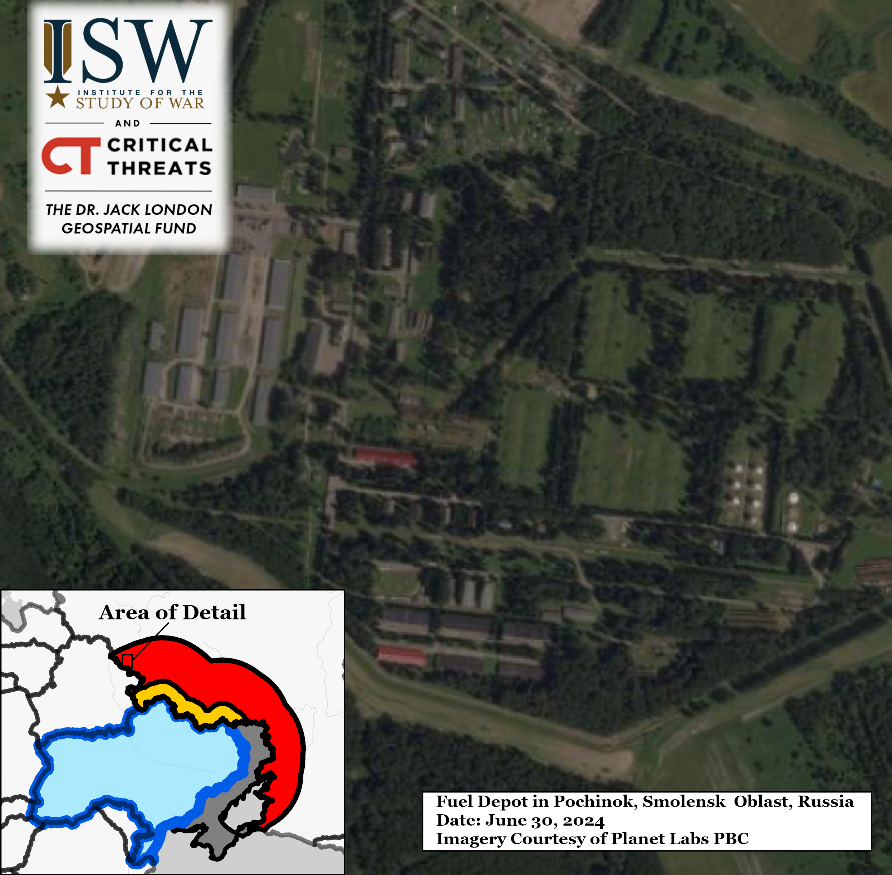](https://understandingwar.org/map/fuel-depot-in-pochinok-smolensk-oblast-russia-date-june-30-2024/)

[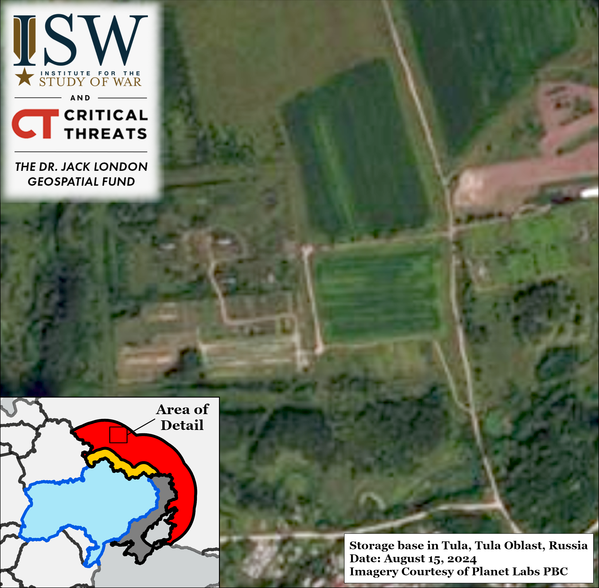](https://understandingwar.org/map/storage-base-in-tula-tula-oblast-russia-date-august-15-2024/)

[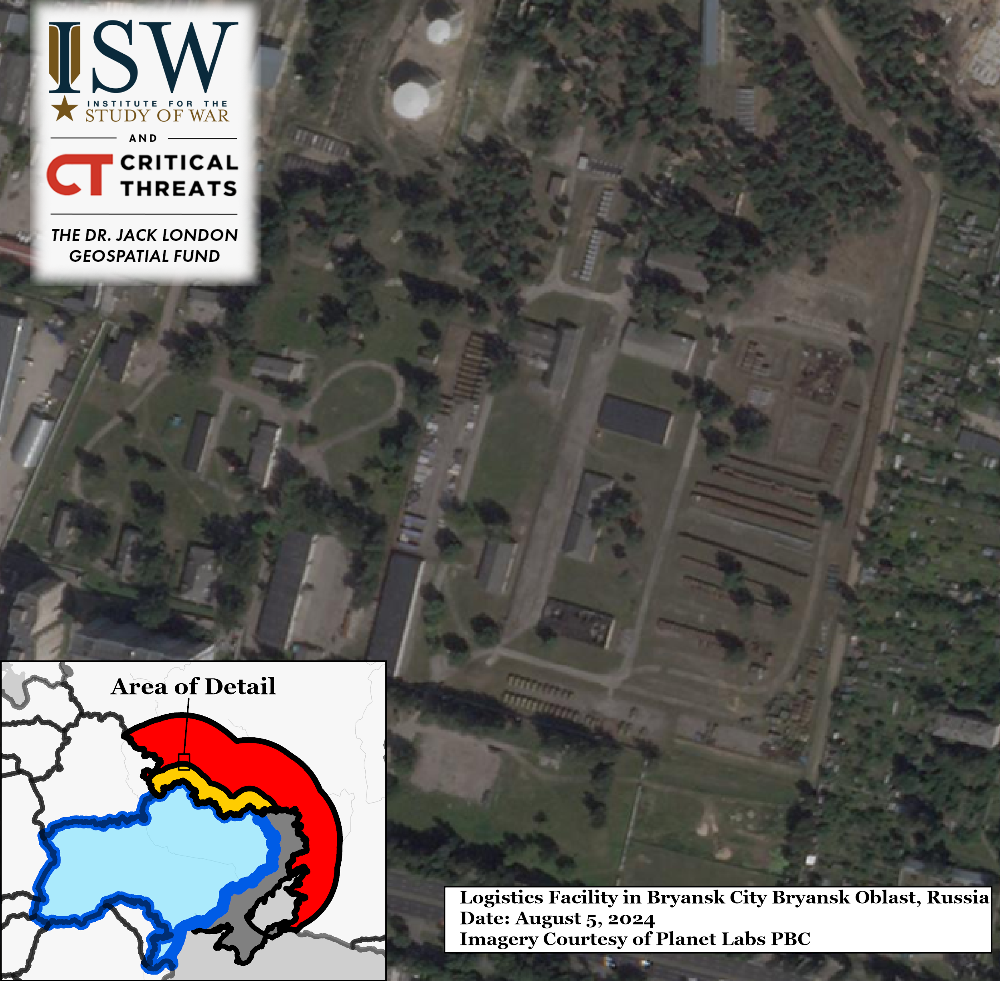](https://understandingwar.org/map/logistics-facility-in-bryansk-city-bryansk-oblast-russia-date-august-5-2024-imagery-courtesy-of-planet-labs-pbc/)

[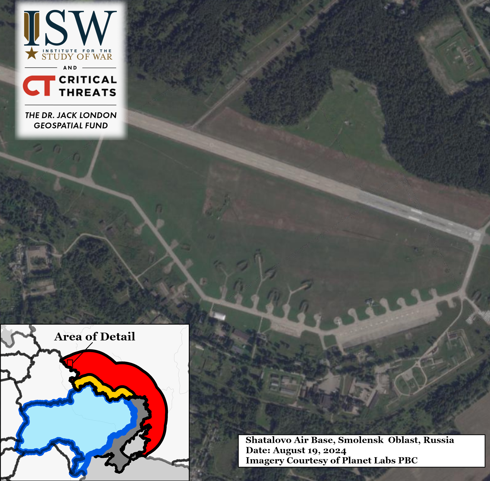](https://understandingwar.org/map/shatalovo-air-base-smolensk-oblast-russia-date-august-19-2024/)

[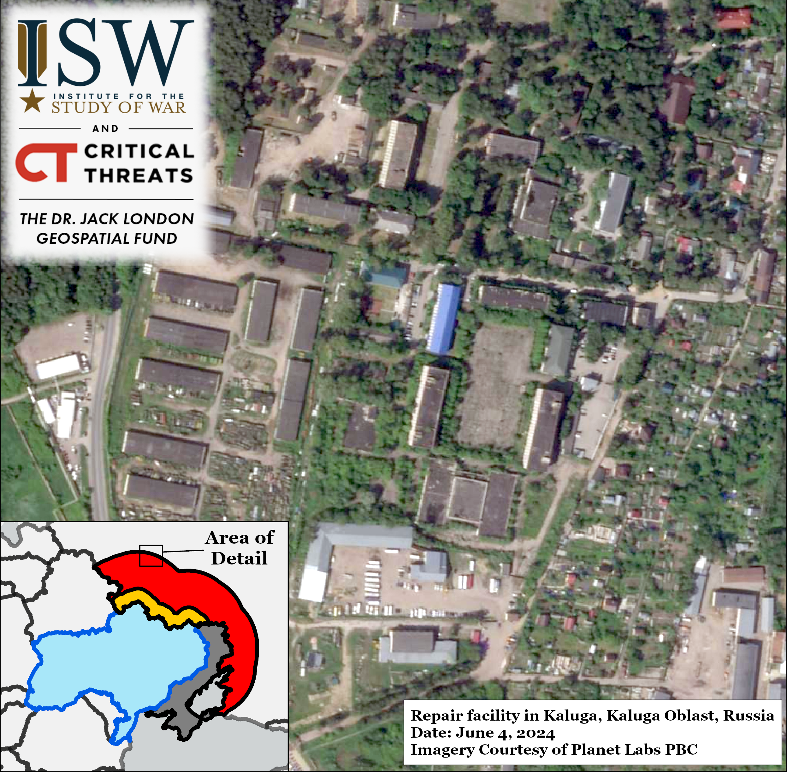](https://understandingwar.org/wp-content/uploads/2025/05/KalugaRepairFacility.png)

**Ukrainian forces do not have to strike every single Russian military and paramilitary object in Russia within range of Western-provided weapons to start generating significant operational pressures on the Russian military.** The lifting of the current Western restrictions would generate a serious Ukrainian long-range strike threat that would force a decision point on the Kremlin and likely prompt the Russian military command to significantly reconfigure assets throughout the deep rear to protect against Ukrainian strikes. Ukraine’s successful use of HIMARS against Russian logistics, C2, and aviation facilities in occupied Ukraine in Summer and Fall 2022 eventually forced the Russian military to disperse many of these assets, causing disruptions to Russian operations throughout the theater and significantly contributing to Russia’s pace of advance grinding to a halt by late 2022.[4] Russian forces have since appeared adapted many of their logistics systems in occupied Ukraine to protect against Ukraine’s long-range strike capabilities at the expense of sacrificing logistical efficiency in part by offloading many requirements to military and paramilitary facilities out of range of HIMARS and within sanctuary space in Russia.[5] Russia also deployed air defense and electronic warfare assets to protect vulnerable targets against Ukrainian precision fires, degrading the effectiveness of those fires. It is unlikely that Russian forces have been hardening all facilities in Russia against potential Ukrainian strikes or dispersing assets throughout the deep rear at scale without a pressing threat to do so. Persistent Ukrainian drone strikes into the Russian rear have threatened some of these facilities but not to the extent that would compel the Russian military command to consider the highly disruptive process of redeploying logistics and support systems at scale. Bringing Russia’s rear areas under threat would likely also prompt the Russian military command to make decisions about how to allocate its limited air defense and electronic warfare assets to protect a largest geographic area.

The Russian military could seek to avoid such redeployments in the event of lifted Western restrictions by heavily concentrating air defense and electronic warfare assets to protect military and paramilitary facilities in the rear, although it is not clear if Russian forces have the available air defense assets to do so. Ukraine’s drone strike campaign against Russia has illustrated that many rear areas within Russia have poor air defense coverage or none at all.[6] Russian forces would likely have to redeploy air defense and electronic warfare assets from all over Russia as well as from the frontline in Ukraine to generate the necessary protection coverage for rear areas in Russia within range of Western-provided weapons, possibly setting conditions for Ukraine to scale up aviation operations of its own along the frontline. **The lifting of the restrictions would therefore allow Ukraine to start striking significant Russian military targets while also immediately forcing a decision point on Russian President Vladimir Putin and the Russian military command about the allocation of limited air defense and electronic warfare assets and the configuration of Russian military logistics and support systems across the theater and the deep rear.**

**Recent successful Ukrainian strikes against Russian military targets within ATACMS range with Ukraine’s own domestically produced precision weapons demonstrate that Ukraine still has a requirement to conduct strikes that lifting the US restrictions could help fill.**Ukrainian forces have been able to develop deep-strike capability throughout two and a half years of war primarily with long-range strike drones and partially with modified Neptune anti-ship missiles. Ukrainian strike campaigns with domestically-produced weapons pushed the Black Sea Fleet (BSF) out of the western Black Sea and most recently, Ukrainian strikes against Russian oil refineries compelled the Kremlin to entertain negotiations for a possible moratorium against strikes on Ukraine’s own energy infrastructure. Ukrainian forces conducted a drone strike against a Russian ammunition depot near Ostrogozhsk, Voronezh Oblast on August 24, sparking fires in the area and reportedly causing at least three explosions. [7] The Ukrainian Main Military Intelligence Directorate (GUR) reported that this large depot contained artillery and tank shells, small arms rounds, and surface-to-air missiles for the Russian Western Grouping of Forces (responsible for the Kupyansk-Svatove-Kreminna line).[8] This facility is within range of ATACMS fired from Ukrainian-controlled areas of Kharkiv Oblast. Ukrainian President Volodymyr Zelensky announced on August 24 that Ukraine has produced and successfully fielded the “Palyanytsia missile-drone” for the first time, and Ukrainian Strategic Industries Minister Oleksandr Kamyshin stated that Ukrainian forces used this “missile-drone” to hit an unspecified Russian military facility in occupied Ukraine.[9] Ukrainian officials have not provided details on the drone’s range or technical specifications but did confirm that this weapon meets the technical specifications of both a drone and missile, and Zelensky called it a “new class of weapon.”[10]

**Some US officials assess that the Russian military will likely need to redeploy significant forces from Ukraine and/or operational reserves to repel Ukrainian forces from Russian territory.** The *New York Times* (NYT) reported on August 23 that unspecified US officials assess that Russia likely needs 15 to 20 brigades — at least 50,000 troops — to push Ukrainian forces out of Kursk Oblast.[11] The US assess that the Russian military would likely need to redeploy significant elements from Ukraine or draw on operational reserves accumulated for its planned summer 2024 offensive effort to Kursk Oblast, or both, to successfully retake territory. ISW has already observed reports that the Russian military has redeployed elements of several Russian battalions, regiments, and brigades mostly from lower priority sectors of the frontline to Kursk Oblast.[12] The*Wall Street Journal* (WSJ) reported on August 17 that a source familiar with the Ukrainian operation in Kursk Oblast stated that Russian forces have redeployed roughly 5,000 personnel from unspecified areas in Ukraine to Kursk Oblast by August 14 and assessed that Russian forces would likely need over 20,000 properly trained personnel to retake territory in the area.[13]

**Ukrainian forces continued offensive operations within their salient in Kursk Oblast on August 24, and neither Russian nor Ukrainian forces made any significant claimed advances.**Some milbloggers claimed that Russian forces recaptured Borki (southeast of Sudzha), but a prominent Kremlin-affiliated milblogger claimed that these reports are unconfirmed.[14] A milblogger claimed that fighting also continued southeast of Borki near Spalnoye, Krupets, and Kamyshnoye.[15] Russian milbloggers claimed that Ukrainian forces are attempting to bypass Korenevo by attacking near Olgovka and that Russian forces also repelled attacks near Komarovka (southwest of Korenevo) and Snagost.[16]Russian milbloggers claimed that Ukrainian forces are attacking near Malaya Loknya (north of Sudzha) Cherkasskoye Porechnoye (northeast of Sudzha), and Russkaya Konopelka (east of Sudzha).[17] Elements of the Russian 810th Naval Infantry Brigade (Black Sea Fleet [BSF]), Chechen “Akhmat” Spetsnaz, and likely elements of the 30th Motorized Rifle Regiment (72nd Motorized Rifle Division, 22nd Army Corps [AC], Leningrad Military District [LMD]) are reportedly defending Martynovka (northeast of Sudzha) from Ukrainian assaults with small infantry groups and armored vehicle support.[18] A Russian milblogger claimed that Russian forces repelled a Ukrainian sabotage and reconnaissance group near Kamyshevka (northeast of Malaya Loknya).[19]

[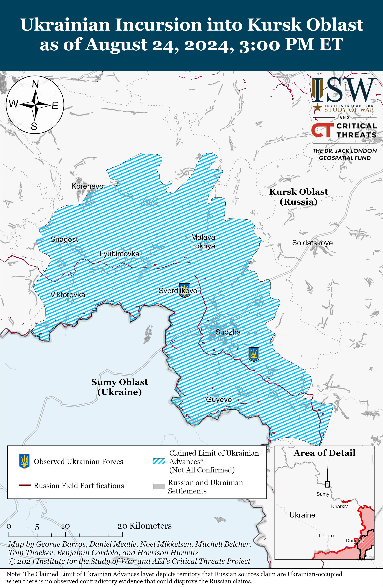](https://understandingwar.org/map/ukrainian-incursion-into-kursk-oblast-as-of-august-24-2024-300-pm-et/)

Ukrainian open-source intelligence project *Frontelligence Insight* published satellite imagery on August 24 indicating that Russian forces are rapidly building field fortification defensive lines south and southwest of Kurchatov (west of Kursk City).[20] The satellite imagery captured on August 14 and 18 indicates that Russian forces rapidly developed and began reinforcing a trench line near Dolgiy (south of Kurchatov) between August 14 and 18.[21] *Frontelligence Insight* also reported that Russian forces may be extending these defensive lines into windbreaks that would conceal these defensive lines from view in satellite imagery.[22]

**Ukrainian President Volodymyr Zelensky commented on some of the objectives of the Ukrainian operation into Kursk Oblast on August 24.**Zelensky characterized the Ukrainian operation into Kursk Oblast as a spoiling attack that successfully prevented Russian forces from attempting to encircle part of Sumy Oblast and seize Sumy City.[23] A Russian attack into Sumy Oblast would likely have been part of the ongoing Russian theater-wide attempt to stretch Ukrainian forces across the entire frontline to pressure overall weakened Ukrainian defenses.[24] Russian forces attempted to divert and fix Ukrainian forces by launching an offensive operation into Kharkiv Oblast on May 10 while maintaining the existing tempo of offensive operations in eastern Ukraine, and the Russian military may have assessed that opening a new front in Sumy Oblast would further weaken Ukrainian forces defending throughout the theater.[25] A Russian attack into Sumy Oblast would have allowed Russian forces to maintain the theater-wide initiative, would have forced the Ukrainian military to defend in an additional sector of the frontline, and could have forced the Ukrainian military command to reassess their defensive prioritization. Ukrainian forces instead conducted a spoiling attack into Kursk Oblast and seized the battlefield initiative in this sector of the frontline.[26]

**Ukraine and Russia conducted their first prisoner of war (POW) exchange since the Ukrainian incursion into Kursk Oblast.**Russian and Ukrainian sources announced on August 24 the 55th official POW exchange between the two countries since the beginning of Russia’s full-scale invasion of Ukraine.[27] The United Arab Emirates mediated the exchange that reportedly occurred at a border checkpoint in Belarus, which saw Russia and Ukraine return 115 POWs each.[28] The Ukrainian POWs primarily included servicemembers who fought in Mariupol, while Russian milbloggers claimed that all the Russian POWs were conscripts that the Ukrainian forces captured during the recent Ukrainian incursion into Kursk Oblast.[29]

**Key Takeaways:**

- **Ukrainian long-range strikes against Russian military targets within Russia’s rear are crucial for degrading Russian military capabilities throughout the theater, and the lifting of restrictions on Ukraine’s use of Western-provided weapons would allow Ukrainian forces to strike a wide range of significant targets undergirding Russia’s war effort.**
- **An unnamed senior Biden administration national security official reportedly stated that Ukrainian strikes with Western-provided weapons against targets within Russia would not be effective because the Russian military has redeployed military aircraft from Russian airbases near Ukraine — but this assessment ignores how Russian forces are leveraging sanctuary space in deep rear areas within Russia for a wide array of infrastructure besides airfields to support military operations against Ukraine.**
- **The redeployment of Russian air assets from Russian air bases in range of ATACMS does not remove the utility of using ATACMS against other Russian military targets, however.**
- **Ukrainian forces do not have to strike every single Russian military and paramilitary object in Russia within range of Western-provided weapons to start generating significant operational pressures on the Russian military.**
- **Recent successful Ukrainian strikes against Russian military targets within ATACMS range with Ukraine’s own domestically produced precision weapons demonstrate that Ukraine still has a requirement to conduct strikes that lifting the US restrictions could help fill.**
- **Some US officials assess that the Russian military will likely need to redeploy significant forces from Ukraine and/or operational reserves to repel Ukrainian forces from Russian territory.**
- **Ukrainian forces continued offensive operations within their salient in Kursk Oblast on August 24, and neither Russian nor Ukrainian forces made any significant claimed advances.**
- **Ukrainian President Volodymyr Zelensky commented on some of the objectives of the Ukrainian operation into Kursk Oblast on August 24.**
- **Ukraine and Russia conducted their first prisoner of war (POW) exchange since the Ukrainian incursion into Kursk Oblast.**
- **Russian forces recently advanced near Toretsk and Pokrovsk.**
- **Kursk Oblast officials announced the creation of the BARS-Kursk volunteer detachment on August 24 and stated that the detachment will fight solely within Kursk Oblast.**

[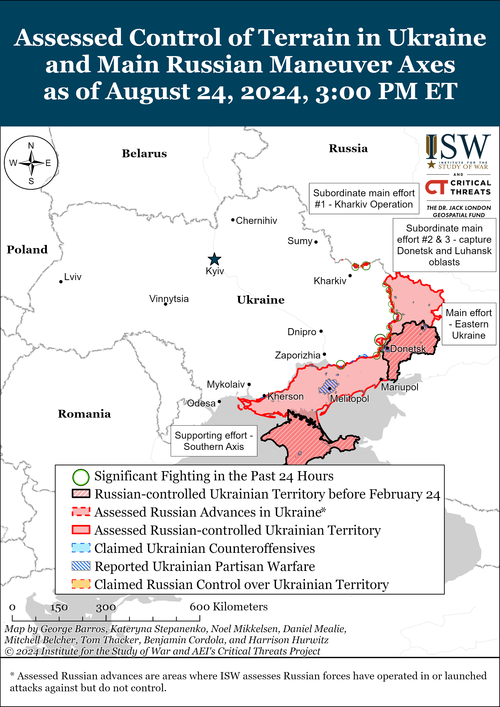](https://understandingwar.org/map/assessed-control-of-terrain-in-ukraine-and-main-russian-maneuver-axes-as-of-august-24-2024-300-pm-et/)

***We do not report in detail on Russian war crimes because these activities are well-covered in Western media and do not directly affect the military operations we are assessing and forecasting. We will continue to evaluate and report on the effects of these criminal activities on the Ukrainian military and the Ukrainian population and specifically on combat in Ukrainian urban areas. We utterly condemn Russian violations of the laws of armed conflict and the Geneva Conventions and crimes against humanity even though we do not describe them in these reports.***

- Russian Main Effort — Eastern Ukraine (comprised of three subordinate main efforts)
- Russian Subordinate Main Effort #1 — Push Ukrainian forces back from the international border with Belgorod Oblast and approach to within tube artillery range of Kharkiv City
- Russian Subordinate Main Effort #2 — Capture the remainder of Luhansk Oblast and push westward into eastern Kharkiv Oblast and encircle northern Donetsk Oblast
- Russian Subordinate Main Effort #3 — Capture the entirety of Donetsk Oblast
- Russian Supporting Effort — Southern Axis
- Russian Air, Missile, and Drone Campaign
- Russian Mobilization and Force Generation Efforts
- Russian Technological Adaptations
- Activities in Russian-occupied areas
- Ukrainian Defense Industrial Base Efforts
- Russian Information Operations and Narratives
- Significant Activity in Belarus

**Russian Main Effort — Eastern Ukraine**

**Russian Subordinate Main Effort #1 — Kharkiv Oblast (Russian objective: Push Ukrainian forces back from the international border with Belgorod Oblast and approach to within tube artillery range of Kharkiv City)**

Fighting continued north of Kharkiv City near Hlyboke and Lyptsi and northeast of Kharkiv City in Vovchansk on August 23 and 24, but there were no confirmed changes to the frontline.[30] A Russian milblogger claimed that Ukrainian forces conducted counterattacks northwest of Vovchansk near Hatyshche and Ohirtseve but that Russian forces repelled the attacks.[31] The Ukrainian Kharkiv Group of Forces reported that Russian forces near Hlyboke have intensified drone reconnaissance operations and reinforced their forward positions.[32] Elements of the “Yary” heavy sniper group of the 155th Naval Infantry Brigade (Pacific Fleet, Eastern Military District [EMD]) reportedly continue operating in the Kharkiv direction.[33]

[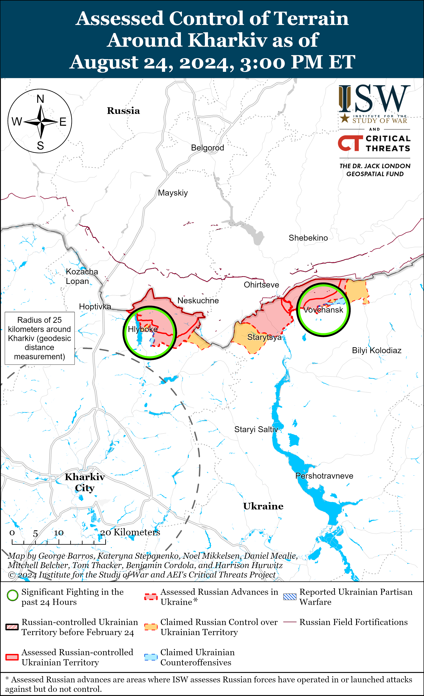](https://understandingwar.org/map/assessed-control-of-terrain-around-kharkiv-as-of-august-24-2024-300-pm-et/)

**Russian Subordinate Main Effort #2 — Luhansk Oblast (Russian objective: Capture the remainder of Luhansk Oblast and push westward into eastern Kharkiv Oblast and northern Donetsk Oblast)**

Russian forces continued offensive operations on the Kupyansk-Svatove-Kreminna line on August 24 but did not make confirmed advances. Russian forces continued attacks northeast of Kupyansk near Synkivka; east of Kupyansk near Petropavlivka; southeast of Kupyansk near Stepova Novoselivka, Kurylivka, and Stelmakhivka; northwest of Kreminna near Makiivka, Druzhelyubivka, Novosadove, and Nevske; and west of Kreminna near Terny and Torske on August 23 and 24.[34] A Russian milblogger claimed that Ukrainian forces conducted localized counterattacks near Novovodyane (northwest of Kreminna) and seized some positions in the past week, and a Ukrainian brigade operating on the Svatove-Kreminna line recently reported that it conducted a counterattack and advanced two kilometers deep to degrade the offensive capability of elements of the Russian 20th Combined Arms Army ([CAA], Moscow Military District [MMD]) operating in the area.[35]

[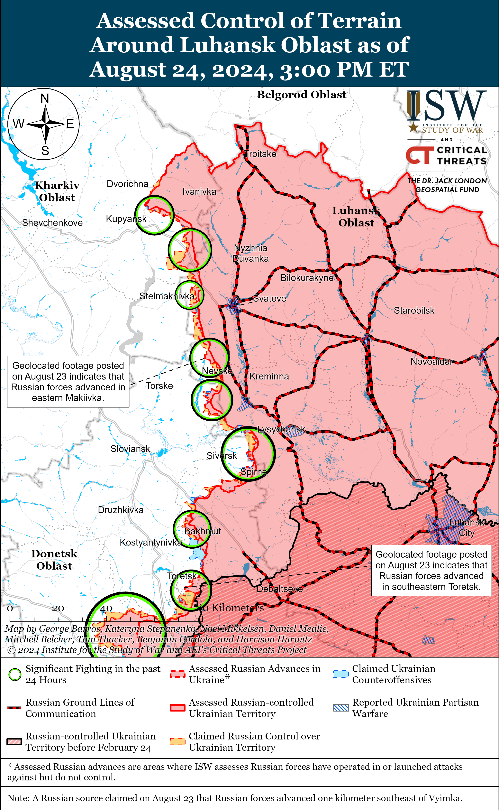](https://understandingwar.org/map/assessed-control-of-terrain-around-luhansk-oblast-as-of-august-24-2024-300-pm-et/)

**Russian Subordinate Main Effort #3 — Donetsk Oblast (Russian objective: Capture the entirety of Donetsk Oblast, the claimed territory of Russia’s proxies in Donbas)**

Russian forces continued offensive operations in the Siversk direction on August 24, but there were no confirmed changes to the frontline. The Ukrainian General Staff reported that Russian forces conducted offensive operations northeast of Siversk near Bilohorivka; east of Siversk near Verkhnokamyanske; and southeast of Siversk near Vyimka and Spirne on August 23 and 24.[36] Elements of the Russian ”Sumrak” Battalion are reportedly operating in the Siversk direction.[37]

[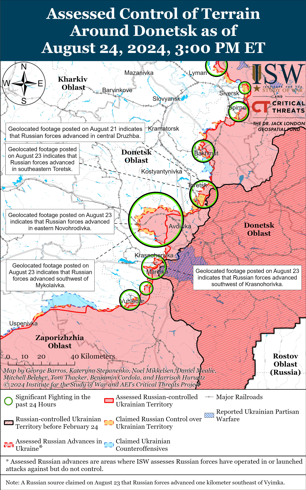](https://understandingwar.org/map/assessed-control-of-terrain-around-donetsk-as-of-august-24-2024-300-pm-et/)

Russian forces continued offensive operations near Chasiv Yar on August 24, but there were no confirmed changes the frontline. Russian milbloggers continued to claim that Russian forces advanced near Kalynivka (northeast of Chasiv Yar) and within Zhovtnevyi Microraion (eastern Chasiv Yar), but ISW has not observed confirmation of these claims.[38] Russian forces continued offensive operations northeast of Chasiv Yar near Kalynivka; east of Chasiv Yar near Ivanivske; south of Chasiv Yar near Stupochky; and near Chasiv Yar itself on August 23 and 24.[39] Elements of the Russian 98th Airborne (VDV) Division are operating near Chasiv Yar, and elements of the Russian 200th Motorized Rifle Brigade (14th Army Corps [AC], Leningrad Military District [LMD]) and Volunteer Corps are operating just north of Chasiv Yar in the Orlove forest area.[40]

[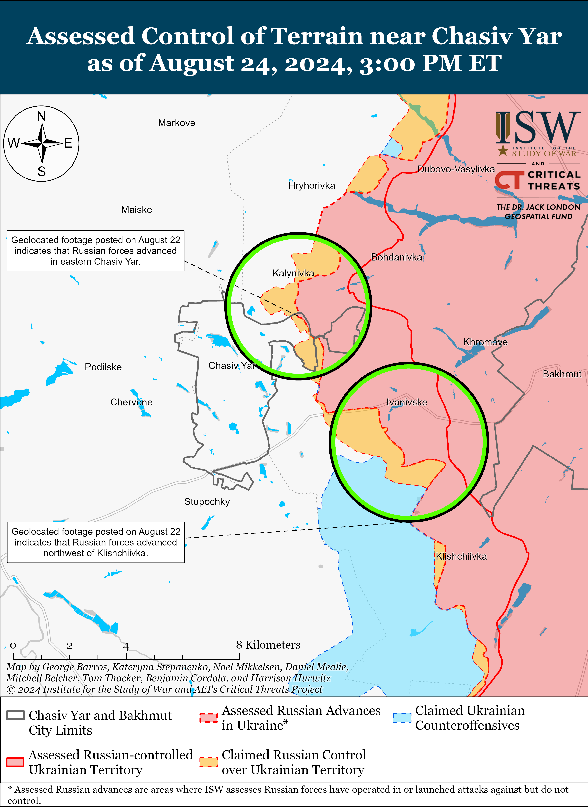](https://understandingwar.org/map/assessed-control-of-terrain-near-chasiv-yar-as-of-august-24-2024-300-pm-et/)

Russian forces recently advanced near Toretsk amid continued offensive operations in the area on August 24. Geolocated footage published on August 21 indicates that Russian forces recently advanced to the eastern outskirts of Toretsk.[41] Russian forces conducted offensive operations near Toretsk; northeast of Toretsk near Dyliivka; and south of Toretsk near Nelipivka and Niu York on August 23 and 24.[42] Elements of the Russian 9th Motorized Rifle Brigade (1st Donetsk People’s Republic [DNR] Army Corps [AC]) reportedly continue to operate near Niu York.[43]

[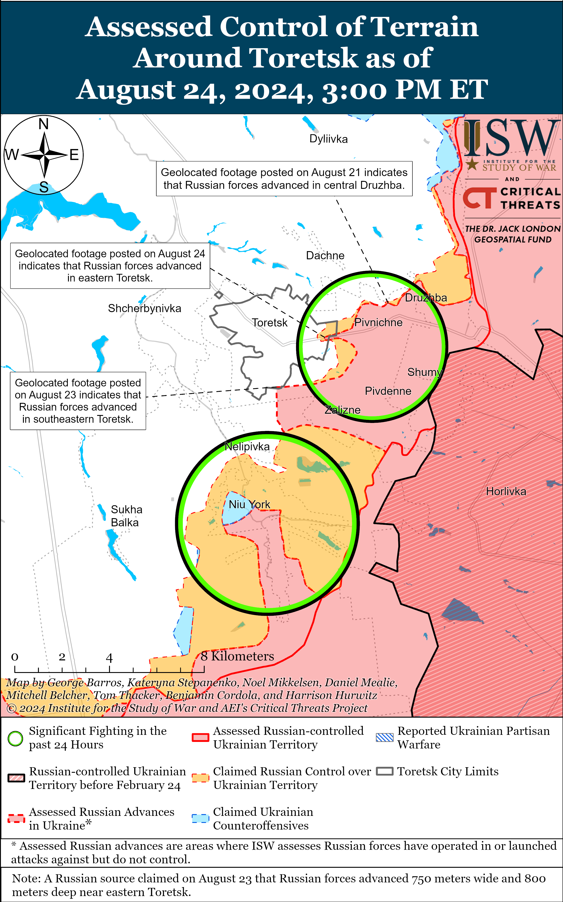](https://understandingwar.org/map/assessed-control-of-terrain-around-toretsk-as-of-august-24-2024-300-pm-et/)

Russian forces recently advanced near Pokrovsk amid continued Russian offensive operations in the area on August 24. Geolocated footage published on August 23 indicates that Russian forces advanced into eastern Karlivka (southeast of Pokrovsk) and northeast of Mykolaivka (southeast of Pokrovsk).[44] Additional geolocated footage published on August 24 indicates that Russian forces advanced in the southeastern outskirts of Novohrodivka (southeast of Pokrovsk).[45] Russian milbloggers claimed on August 24 that Russian forces advanced to and seized the Novohrodivka City Council in the center of the town.[46] Russian milbloggers claimed that Russian forces advanced east of Novohrodivka and south of Hrodivka (east of Pokrovsk) and seized Krasnyi Yar (immediately southwest of Hrodivka) .[47] ISW has not observed confirmation of these claims, however. Russian forces continued offensive operations east of Pokrovsk near Vozdvyzhenka, Myrolyubivka, Zelene Pole, and Hrodivka and southeast of Pokrovsk near Kalynove, Krutyi Yar, Novohrodivka, Ptyche, Mykolaivka, Mykhailivka, and Karlivka on August 23 and 24.[48] Elements of the Russian 1st “Slavic” Brigade (1st DNR AC) are reportedly operating in the Pokrovsk direction.[49]

[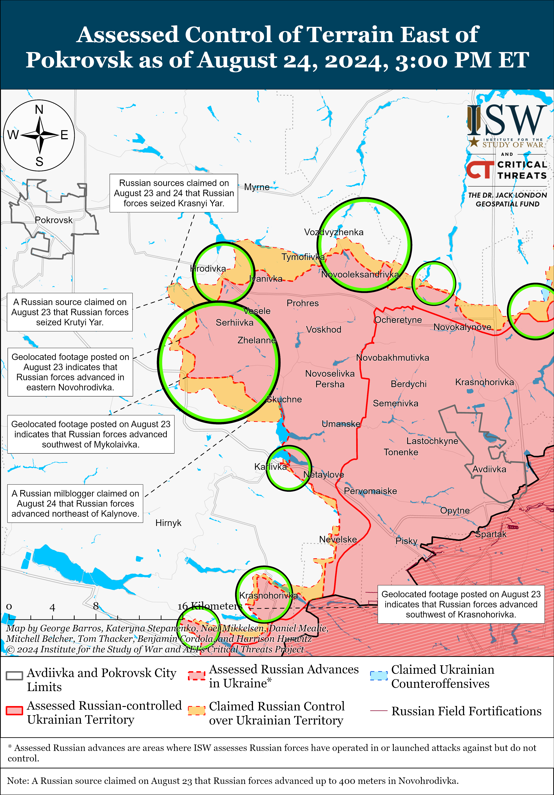](https://understandingwar.org/map/assessed-control-of-terrain-east-of-pokrovsk-as-of-august-24-2024-300-pm-et/)

Fighting continued west of Donetsk City on August 24, but there were no confirmed changes to the front in this area. Fighting continued near Krasnohorivka and Heorhiivka on August 23 and 24.[50] Elements of the Russian 110th Motorized Rifle Brigade (1st DNR AC) are reportedly operating near Krasnohorivka.[51]

Russian forces continued offensive operations southwest of Donetsk City on August 24, but there were no confirmed changes to the frontline. A Russian milblogger claimed on August 24 that Russian forces advanced in Kostyantynivka (southwest of Donetsk City), but ISW has not observed confirmation of this claim.[52] Russian forces continued offensive operations near Kostyantynivka, Vodyane, Katerynivka, and Vuhledar on August 23 and 24.[53]

Neither Russian nor Ukrainian sources reported ground attacks in the Donetsk-Zaporizhia Oblast border area on August 24. Elements of the Russian 11th Air Force and Air Defense Army (Eastern Military District [EMD] and Russian Aerospace Forces [VKS]) continue to operate in the Donetsk-Zaporizhia Oblast border area near Razliv (north of Velyka Novosilka).[54]

**Russian Supporting Effort — Southern Axis (Russian objective: Maintain frontline positions and secure rear areas against Ukrainian strikes)**

Positional engagements continued in western Zaporizhia Oblast on August 24, but there were no confirmed changes to the frontline. Fighting continued northwest of Robotyne near Novoandriivka and Shcherbaky on August 24.[55]

[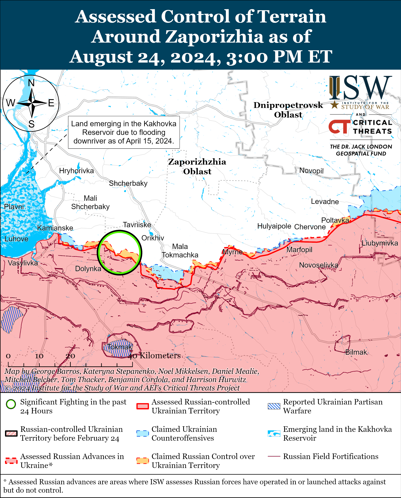](https://understandingwar.org/map/assessed-control-of-terrain-around-zaporizhia-as-of-august-24-2024-300-pm-et/)

Neither Russian nor Ukrainian sources reported fighting in the Kherson direction on August 24.

[**[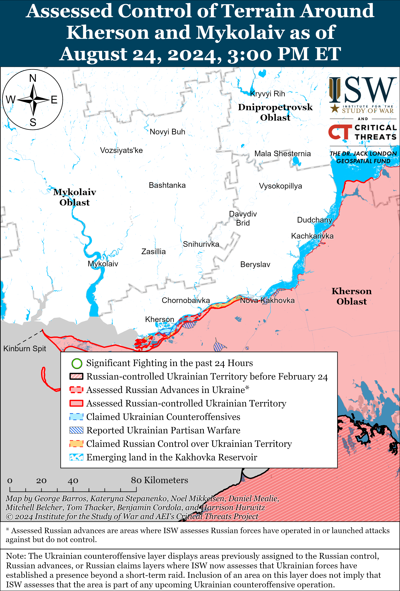](https://understandingwar.org/map/assessed-control-of-terrain-around-kherson-and-mykolaiv-as-of-august-24-2024-300-pm-et/)**](https://understandingwar.org/wp-content/uploads/2025/05/Kherson-Mykolaiv20Battle20Map20Draft20August20242C202024.png)

**Russian Air, Missile, and Drone Campaign (Russian Objective: Target Ukrainian military and civilian infrastructure in the rear and on the frontline)**

Russian forces conducted limited missile strikes against southern Ukraine on the night of August 23 to 24. The Ukrainian Air Force reported that Russian forces launched four Kh-22 cruise missiles at Snake Island (northwestern Black Sea).[56] A Russian milblogger claimed that Russian forces launched an unspecified number of Onyx cruise missiles against Odesa Oblast, although ISW has not observed confirmation of this claim.[57]

**Russian Mobilization and Force Generation Efforts (Russian objective: Expand combat power without conducting general mobilization)**

Kursk Oblast officials announced the creation of the BARS-Kursk volunteer detachment on August 24 and stated that the detachment will fight solely within Kursk Oblast.[58] The Kursk Oblast Administration published an advertisement for the volunteer detachment promising recruits that they will only perform tasks within Kursk Oblast, sign a six-month contract, and receive salaries similar to Russian personnel serving in Ukraine.[59] Russian officials likely aim to use the Ukrainian incursion into Kursk Oblast as a recruitment tool and may hope to offset pressures for additional redeployments to Kursk Oblast by committing newly generated forces to defensive operations.

**Russian Technological Adaptations (Russian objective: Introduce technological innovations to optimize systems for use in Ukraine)**

Nothing significant to report.

**Ukrainian Defense Industrial Efforts (Ukrainian objective: Develop its defense industrial base to become more self-sufficient in cooperation with US, European, and international partners)**

*ISW is suspending publishing coverage of Ukrainian defense industrial efforts until further notice.*

**Activities in Russian-occupied areas (Russian objective: Consolidate administrative control of annexed areas; forcibly integrate Ukrainian citizens into Russian sociocultural, economic, military, and governance systems)**

*ISW is not publishing coverage of activities in Russian-occupied areas today.*

**Russian Information Operations and Narratives**

Nothing significant to report.

**Significant activity in Belarus (Russian efforts to increase its military presence in Belarus and further integrate Belarus into Russian-favorable frameworks and Wagner Group activity in Belarus)**

Nothing significant to report.

**Note: ISW does not receive any classified material from any source, uses only publicly available information, and draws extensively on Russian, Ukrainian, and Western reporting and social media as well as commercially available satellite imagery and other geospatial data as the basis for these reports. References to all sources used are provided in the endnotes of each update.**

---

[1] https://www.politico.com/news/2024/08/23/ukraine-biden-weapons-restrictions-00176210

[2] https://www.politico.com/news/2024/08/23/ukraine-biden-weapons-restrictions-00176210

[3] https://x.com/Tatarigami\_UA/status/1816561523210191258 ; https://understandingwar.org/backgrounder/russian-offensive-campaign-assessment-august-22-2024

[4] https://understandingwar.org/backgrounder/russian-offensive-campaign-assessment-october-29; https://understandingwar.org/backgrounder/russian-offensive-campaign-assessment-april-15-2024; https://understandingwar.org/wp-content/uploads/2024/08/Feb20320Russian20Offensive20Campaign20Assessment20PDF.pdf; https://understandingwar.org/backgrounder/russian-offensive-campaign-assessment-october-17-2023; https://understandingwar.org/backgrounder/russian-offensive-campaign-assessment-february-28-2024 ; https://understandingwar.org/backgrounder/russian-offensive-campaign-assessment-may-12-2024

[5] https://isw.pub/UkrWar101723 ; https://understandingwar.org/backgrounder/russian-offensive-campaign-assessment-april-24-2024

[6] https://isw.pub/UkrWar071624 ; https://isw.pub/UkrWar040324 ; https://understandingwar.org/backgrounder/russian-offensive-campaign-assessment-march-30-2024 ; https://understandingwar.org/backgrounder/russian-offensive-campaign-assessment-january-21-2024

[7] https://understandingwar.org/backgrounder/russian-offensive-campaign-assessment-august-17-2024; https://understandingwar.org/backgrounder/special-edition-campaign-assessment-ukraine%E2%80%99s-strike-campaign-against-crimea; https://understandingwar.org/backgrounder/ukrainian-strikes-have-changed-russian-naval-operations-black-sea

[8] https://x.com/KOvsianyi/status/1827357077649416427; https://x.com/KOvsianyi/status/1827357081516519732; https://x.com/KOvsianyi/status/1827357084683251799; https://t.me/gusev\_36/2670; https://t.me/gusev\_36/2671; https://t.me/gusev\_36/2673; https://t.me/kiber\_boroshno/9690; https://armyinform dot com.ua/2024/08/24/voyiny-gur-mou-pidirvaly-u-rosiyi-sklad-boyeprypasiv-z-raketamy-i-snaryadamy/; https://t.me/DIUkraine/4305; https://t.me/DIUkraine/4306; https://gur.gov dot ua/content/sviatkovyi-hurkit-rozvidnyky-pidirvaly-velykyi-sklad-boieprypasiv-na-rosii.html; https://www.facebook.com/GeneralStaff.ua/posts/pfbid02xgeUrWHNgSKBXncVbGZRvQ2CkXkrh71rMDY28APCBzjByVseT6jZb5LP4wink93Ml?\_\_cft\_\_[0]=AZVyVu7jWQQy6p1\_9ouL9Dn47M9uJCcUqfUo5z8zT3y0n2pg35NFSyuTl5b7jVTx9Zi6lM7FNlk\_19eSq8gRQkaGfZzA83wql-dI5bkp4Cpt9Rk-c\_xfn9bJ2ohcEmpcP0f0DqFiCjsNXqicR1Tfq0s5l3mHvSv2Tnh\_60IdsgRxtV-wWhX8s08mD15kzlwCwOBYBQAGM1MmPEVWel3hAt3I&\_\_tn\_\_=%2CO%2CP-R

[9] https://t.me/DIUkraine/4305

[10] https://mil dot in.ua/uk/news/v-ukrayini-rozrobyly-raketu-dron-palyanytsya/; https://t.me/zalizni\_zminy/2404; https://armyinform dot com.ua/2024/08/24/ukrayina-vpershe-zastosuvala-svoyu-novu-zbroyu-raketu-dron-palyanyczya/

[11] https://armyinform dot com.ua/2024/08/24/ukrayina-vpershe-zastosuvala-svoyu-novu-zbroyu-raketu-dron-palyanyczya/

[12] https://www.nytimes.com/2024/08/23/us/politics/ukraine-incursion-russia-buffer-zone.html

[13] https://isw.pub/UkrWar082224 ; https://isw.pub/UkrWar082024 ; https://understandingwar.org/backgrounder/russian-offensive-campaign-assessment-august-18-2024

[14] https://www.wsj.com/world/behind-ukraines-russia-invasion-secrecy-speed-and-electronic-jamming-188fcc22 ; https://understandingwar.org/backgrounder/russian-offensive-campaign-assessment-august-18-2024

[15] https://t.me/rybar/63017; https://t.me/DnevnikDesantnika/14458; https://t.me/warhistoryalconafter/181131; https://t.me/motopatriot/26621

[16] https://t.me/dva\_majors/50528

[17] https://t.me/RVvoenkor/75494; https://t.me/dva\_majors/50528; https://t.me/rosich\_russia/65683;

[18] https://t.me/voenkorKotenok/58486; https://t.me/NgP\_raZVedka/18806; https://t.me/DnevnikDesantnika/14467; https://t.me/RVvoenkor/75494; https://t.me/dva\_majors/50528

[19] https://t.me/voenkorKotenok/58486; https://t.me/NgP\_raZVedka/18806; https://t.me/DnevnikDesantnika/14467; https://t.me/RVvoenkor/75494; https://t.me/dva\_majors/50528

[20] https://t.me/rosich\_russia/65683

[21] https://x.com/Tatarigami\_UA/status/1827080166297973186

[22] https://x.com/Tatarigami\_UA/status/1827080166297973186

[23] https://x.com/Tatarigami\_UA/status/1827080166297973186

[24] https://t.me/uniannet/142968

[25] https://understandingwar.org/backgrounder/how-delays-western-aid-gave-russia-initiative-ukrainian-counteroffensive-kharkiv

[26] https://isw.pub/UkrWar051824

[27] https://understandingwar.org/backgrounder/russian-offensive-campaign-assessment-august-11-2024

[28] https://t.me/osirskiy/821; https://armyinform dot com.ua/2024/08/24/ukrayina-povernula-z-rosijskogo-polonu-115-zahysnykiv/; https://t.me/V\_Zelenskiy\_official/11439; https://t.me/tass\_agency/268189 ; https://t.me/mod\_russia/42539 ; https://t.me/mod\_russia/42542 ; https://t.me/mod\_russia/42547; https://t.me/tass\_agency/268189 ; https://t.me/mod\_russia/42539 ; https://t.me/mod\_russia/42542 ;https://t.me/mod\_russia/42547 ; https://t.me/DnevnikDesantnika/14460; https://abcnews.go.com/International/wireStory/moscow-kyiv-exchange-attacks-ukraine-marks-independence-anniversary-113119381

[29] https://t.me/NeoficialniyBeZsonoV/38989; https://t.me/tass\_agency/268189 ; https://t.me/mod\_russia/42539 ; https://t.me/mod\_russia/42542 ; https://t.me/mod\_russia/42547

[30] https://www.upi.com/Top\_News/World-News/2024/08/24/world-ukraine-russia-prisoner-exchange/8731724513394/; https://www.reuters.com/world/europe/russia-ukraine-set-swap-115-prisoners-uae-official-says-2024-08-24/; https://t.me/milinfolive/129112; https://t.me/DnevnikDesantnika/14460 ;

[31] https://www.facebook.com/GeneralStaff.ua/posts/pfbid0RRyiXr6H2yQ1RVqCbjpu9EAVrDxUDwqAV77oQiQMcUL2SuUF3aWcgAVdEuj7VJ7fl; https://www.facebook.com/GeneralStaff.ua/posts/pfbid0RKkfiJ587uhpvZVLY3BfywwCLda4MyydfGnUZcLK9tR5C1phuxSsSTpFbzqzEZEHl; https://www.facebook.com/GeneralStaff.ua/posts/pfbid0gkHzGM76Pkx2yDQouisV88cThoejgAMChLCLvQzVKhVFnEc6vvpx61JVryxV7Dwvl; https://t.me/otukharkiv/900; https://t.me/wargonzo/21722

[32] https://t.me/DnevnikDesantnika/14442

[33] https://t.me/otukharkiv/900

[34] https://t.me/milinfolive/129105

[35] https://www.facebook.com/GeneralStaff.ua/posts/pfbid0RKkfiJ587uhpvZVLY3BfywwCLda4MyydfGnUZcLK9tR5C1phuxSsSTpFbzqzEZEHl; https://www.facebook.com/GeneralStaff.ua/posts/pfbid0RRyiXr6H2yQ1RVqCbjpu9EAVrDxUDwqAV77oQiQMcUL2SuUF3aWcgAVdEuj7VJ7fl; https://www.facebook.com/GeneralStaff.ua/posts/pfbid0gkHzGM76Pkx2yDQouisV88cThoejgAMChLCLvQzVKhVFnEc6vvpx61JVryxV7Dwvl; https://t.me/notes\_veterans/19089

[36] https://t.me/notes\_veterans/19089; https://suspilne dot media/kharkiv/819571-treta-sturmova-brigada-zaavila-pro-kontrnastup-na-harkivsini-so-vidomo/; https://understandingwar.org/backgrounder/russian-offensive-campaign-assessment-august-22-2024

[37]https://www.facebook.com/GeneralStaff.ua/posts/pfbid0RKkfiJ587uhpvZVLY3BfywwCLda4MyydfGnUZcLK9tR5C1phuxSsSTpFbzqzEZEHl ; https://www.facebook.com/GeneralStaff.ua/posts/pfbid0RRyiXr6H2yQ1RVqCbjpu9EAVrDxUDwqAV77oQiQMcUL2SuUF3aWcgAVdEuj7VJ7fl; https://www.facebook.com/GeneralStaff.ua/posts/pfbid0gkHzGM76Pkx2yDQouisV88cThoejgAMChLCLvQzVKhVFnEc6vvpx61JVryxV7Dwvl

[38] https://t.me/wargonzo/21734

[39] https://t.me/DnevnikDesantnika/14465; https://t.me/motopatriot/26633

[40]https://www.facebook.com/GeneralStaff.ua/posts/pfbid0RKkfiJ587uhpvZVLY3BfywwCLda4MyydfGnUZcLK9tR5C1phuxSsSTpFbzqzEZEHl ; https://www.facebook.com/GeneralStaff.ua/posts/pfbid0RRyiXr6H2yQ1RVqCbjpu9EAVrDxUDwqAV77oQiQMcUL2SuUF3aWcgAVdEuj7VJ7fl; https://www.facebook.com/GeneralStaff.ua/posts/pfbid0gkHzGM76Pkx2yDQouisV88cThoejgAMChLCLvQzVKhVFnEc6vvpx61JVryxV7Dwvl

[41] https://t.me/rusich\_army/16737; https://t.me/milinfolive/129125

[42] https://www.facebook.com/watch/?v=946360087257909; https://x.com/AudaxonX/status/1827366209945301199; https://t.me/creamy\_caprice/6508

[43]https://www.facebook.com/GeneralStaff.ua/posts/pfbid0RKkfiJ587uhpvZVLY3BfywwCLda4MyydfGnUZcLK9tR5C1phuxSsSTpFbzqzEZEHl ; https://www.facebook.com/GeneralStaff.ua/posts/pfbid0RRyiXr6H2yQ1RVqCbjpu9EAVrDxUDwqAV77oQiQMcUL2SuUF3aWcgAVdEuj7VJ7fl; https://www.facebook.com/GeneralStaff.ua/posts/pfbid0gkHzGM76Pkx2yDQouisV88cThoejgAMChLCLvQzVKhVFnEc6vvpx61JVryxV7Dwvl

[44] ttps://t.me/wargonzo/21728;

[45] https://t.me/creamy\_caprice/6505; https://t.me/Kyiv11obmp/71; https://t.me/jagers68/99; https://x.com/Bielitzling/status/1827143109441884567; https://t.me/creamy\_caprice/6507

[46] https://x.com/Bielitzling/status/1827403444145061954; https://t.me/shershni68/212

[47] https://t.me/voenkorKotenok/58491;

[48] https://t.me/z\_arhiv/27759; https://t.me/divgen/53262; https://t.me/shershni68/212; https://x.com/Bielitzling/status/1827403444145061954 ; https://t.me/boris\_rozhin/134704 ; https://t.me/epoddubny/20831

[49] https://www.facebook.com/GeneralStaff.ua/posts/pfbid0RKkfiJ587uhpvZVLY3BfywwCLda4MyydfGnUZcLK9tR5C1phuxSsSTpFbzqzEZEHl ; https://www.facebook.com/GeneralStaff.ua/posts/pfbid0RRyiXr6H2yQ1RVqCbjpu9EAVrDxUDwqAV77oQiQMcUL2SuUF3aWcgAVdEuj7VJ7fl; https://www.facebook.com/GeneralStaff.ua/posts/pfbid0gkHzGM76Pkx2yDQouisV88cThoejgAMChLCLvQzVKhVFnEc6vvpx61JVryxV7Dwvl

[50] https://t.me/mod\_russia/42544

[51]https://www.facebook.com/GeneralStaff.ua/posts/pfbid0RKkfiJ587uhpvZVLY3BfywwCLda4MyydfGnUZcLK9tR5C1phuxSsSTpFbzqzEZEHl ; https://www.facebook.com/GeneralStaff.ua/posts/pfbid0RRyiXr6H2yQ1RVqCbjpu9EAVrDxUDwqAV77oQiQMcUL2SuUF3aWcgAVdEuj7VJ7fl; https://www.facebook.com/GeneralStaff.ua/posts/pfbid0gkHzGM76Pkx2yDQouisV88cThoejgAMChLCLvQzVKhVFnEc6vvpx61JVryxV7Dwvl

[52] https://t.me/boris\_rozhin/134723

[53] https://t.me/wargonzo/21722

[54]https://www.facebook.com/GeneralStaff.ua/posts/pfbid0RKkfiJ587uhpvZVLY3BfywwCLda4MyydfGnUZcLK9tR5C1phuxSsSTpFbzqzEZEHl ; https://www.facebook.com/GeneralStaff.ua/posts/pfbid0RRyiXr6H2yQ1RVqCbjpu9EAVrDxUDwqAV77oQiQMcUL2SuUF3aWcgAVdEuj7VJ7fl; https://www.facebook.com/GeneralStaff.ua/posts/pfbid0gkHzGM76Pkx2yDQouisV88cThoejgAMChLCLvQzVKhVFnEc6vvpx61JVryxV7Dwvl

[55] https://t.me/voin\_dv/10438

[56] https://www.facebook.com/GeneralStaff.ua/posts/pfbid0RKkfiJ587uhpvZVLY3BfywwCLda4MyydfGnUZcLK9tR5C1phuxSsSTpFbzqzEZEHl ; https://t.me/wargonzo/21722

[57] https://t.me/kpszsu/18152

[58] https://t.me/dva\_majors/50548

[59] https://t.me/astrapress/62667 ; https://t.me/horizontal\_russia/39367
