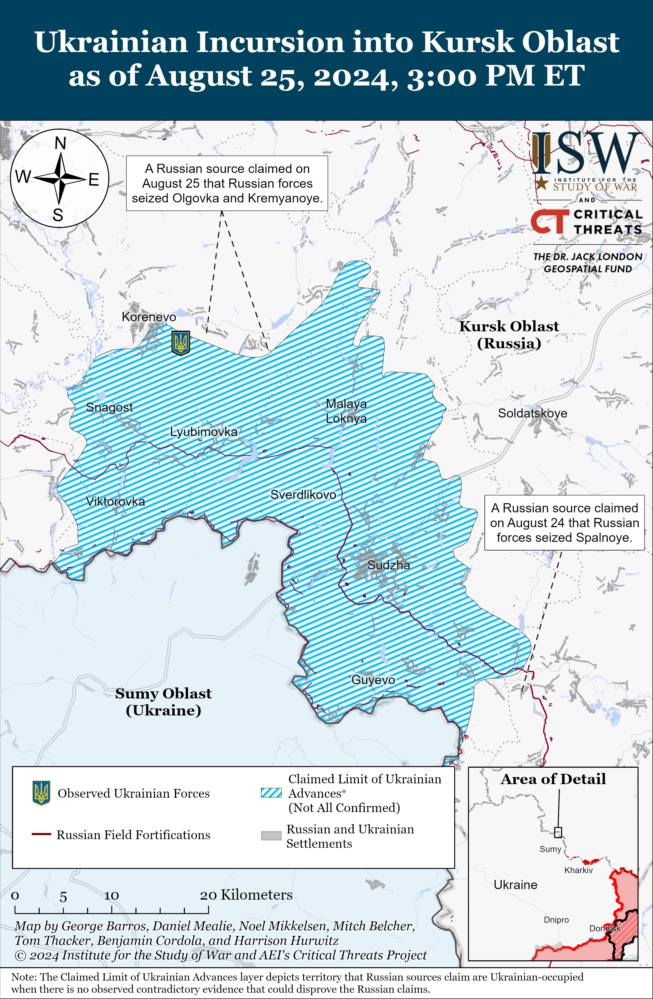
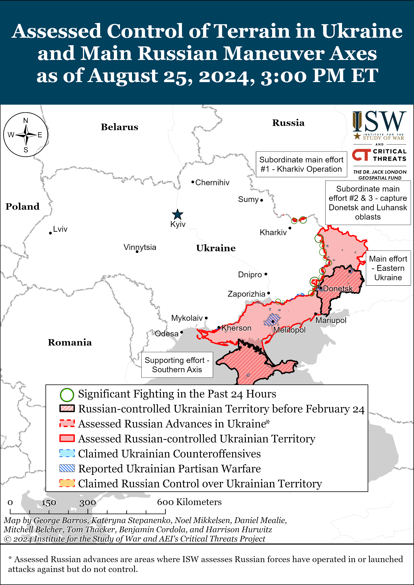
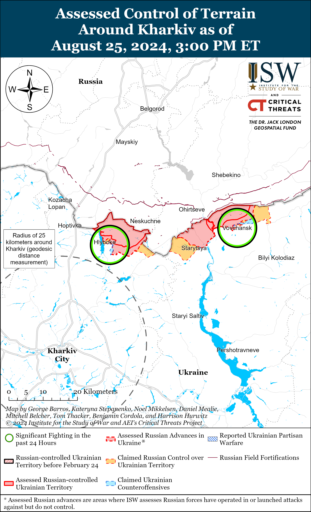
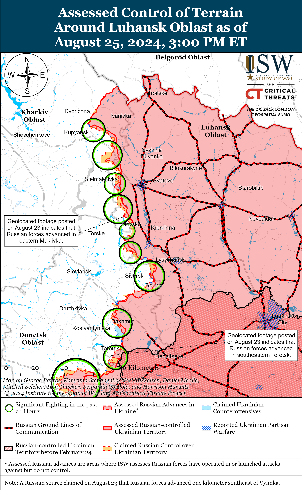
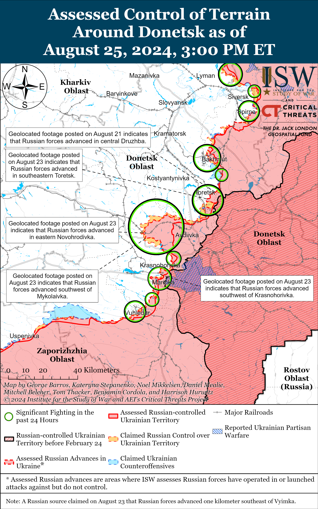
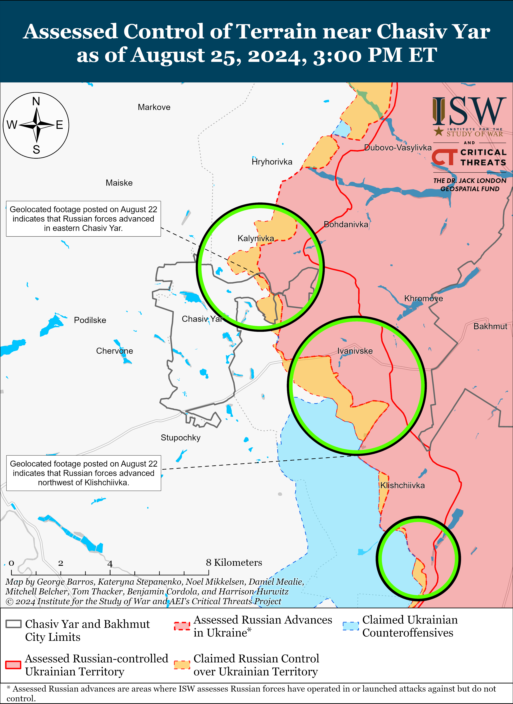
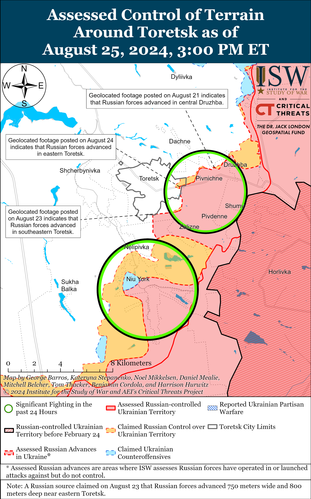
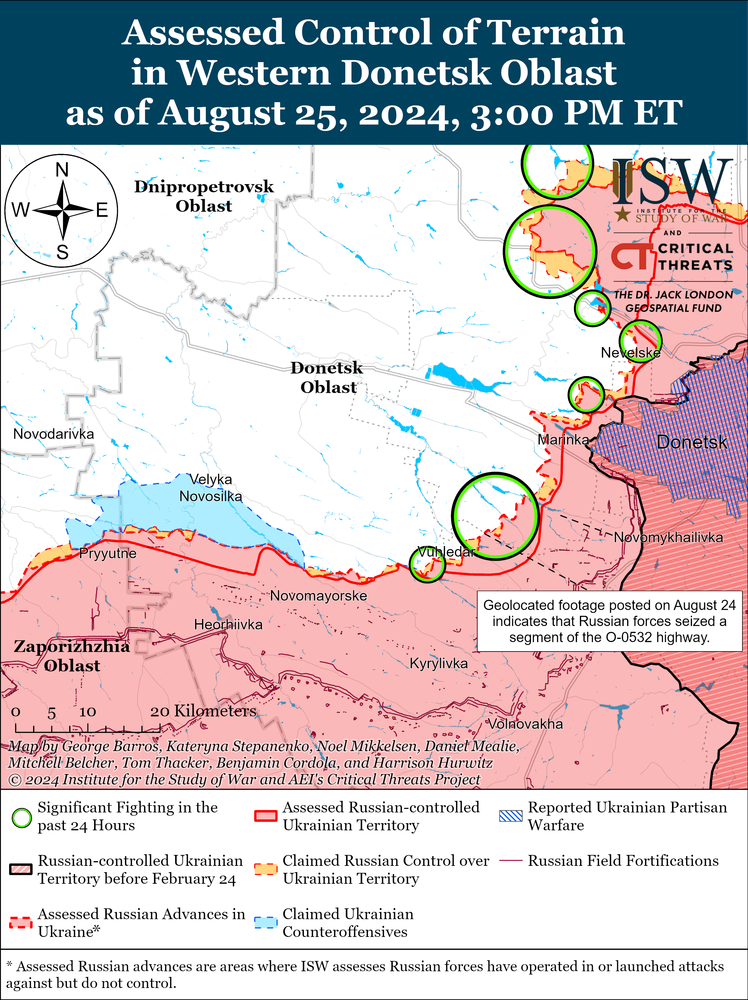
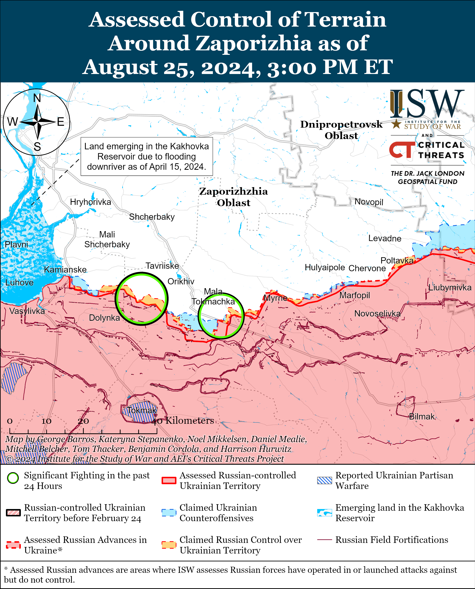
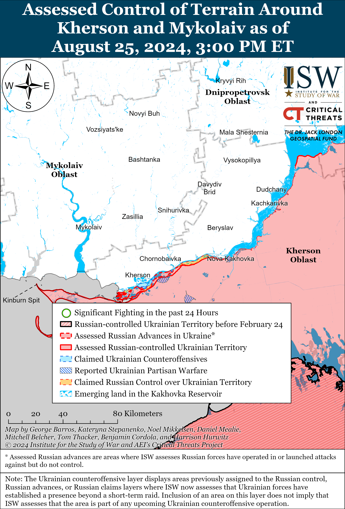

# Russian Offensive Campaign Assessment, August 25, 2024

**Russian Offensive Campaign Assessment, August 25, 2024**

**Grace Mappes, Nicole Wolkov, Riley Bailey, Davit Gasparyan, and George Barros**

**August 25, 2024, 5:35pm ET**

**Click** [**here**](https://storymaps.arcgis.com/stories/36a7f6a6f5a9448496de641cf64bd375) **to see ISW’s interactive map of the Russian invasion of Ukraine. This map is updated daily alongside the static maps present in this report.**

**Click** [**here**](https://storymaps.arcgis.com/stories/83a2f24901c941d581c0c523ecd2619b) **to see ISW’s interactive map of Ukraine’s offensive in Kursk Oblast.**

**Click** [**here**](https://understandingwar.maps.arcgis.com/apps/instant/3dviewer/index.html?appid=1602762dbcde419bb957dea358449580) **to see ISW’s 3D control of terrain topographic map of Ukraine. Use of a computer (not a mobile device) is strongly recommended for using this data-heavy tool.**

**Click** [**here**](https://storymaps.arcgis.com/stories/733fe90805894bfc8562d90b106aa895) **to access ISW’s archive of interactive time-lapse maps of the Russian invasion of Ukraine. These maps complement the static control-of-terrain map that ISW produces daily by showing a dynamic frontline. ISW will update this time-lapse map archive monthly.**

**Note: The data cut-off for this product was 12:45pm ET on August 25. ISW will cover subsequent reports in the August 26 Russian Offensive Campaign Assessment.**

**Russian milbloggers claimed that Russian forces recently regained lost positions in Kursk Oblast amid reports of continued Ukrainian attacks in the area on August 25.** A Russian milblogger claimed on August 25 that Russian forces regained lost positions in Komarovka (southwest of Korenevo) and are repelling small Ukrainian attacks in the area.[1] Several Russian milbloggers claimed on August 25 that Russian forces recaptured Olgovka and Kremyanoye (both east of Korenevo) and that Russian forces are advancing west of Kremyanoye.[2] Another Russian milblogger claimed that Ukrainian forces still control Kremyanoye, however.[3] Several Russian milbloggers claimed that Ukrainian forces encircled elements of the Russian 18th Motorized Rifle Division (11th Army Corps [AC], Leningrad Military District [LMD]) in Malaya Loknya (north of Sudzha) and that elements of either the Russian 810th Naval Infantry Brigade (Black Sea Fleet [BSF]) or 1427th Motorized Rifle Regiment (Territorial Troops) broke through the Ukrainian encirclement and allowed the personnel of the 18th Motorized Rifle Division to withdraw.[4] Russian milbloggers claimed that fighting continues within Malaya Loknya, although fighting in the settlement does not preclude Ukrainian forces from operating deeper into Kursk Oblast in the area.[5] Russian forces likely continue to operate within select areas of the Ukrainian salient in Kursk Oblast as Ukrainian forces likely do not control all of the territory within the maximalist extent of claims about Ukrainian advances in Kursk Oblast. Chechen Republic Head Ramzan Kadyrov similarly claimed on August 25 that elements of the Russian 14th Motorized Rifle Battalion of the Akhmat-Chechnya Regiment under the Russian Ministry of Defense (MoD) successfully evacuated 51 conscripts from combat near Ulanok (southeast of Sudzha).[6] Russian milbloggers claimed that Ukrainian forces continued attacking near Russkoye Porechnoye, Cherkasskoye Porechnoye, and Martynovka (all northeast of Sudzha).[7] A Russian milblogger claimed on August 24 that Russian forces retook and cleared Spalnoye (southeast of Sudzha), following similar claims from August 23 that Russian forces retook the settlement.[8] The Russian MoD claimed that Russian forces repelled Ukrainian attacks in the direction of Borki and Spalnoye on August 25.[9] Russian opposition outlets reported that conscripts of the Russian 217th Airborne (VDV) Regiment (98th VDV Division) deployed from Ivanovo City – where the regiment’s and division’s garrison is located – to Kursk Oblast.[10]

[](https://understandingwar.org/map/ukrainian-incursion-into-kursk-oblast-as-of-august-25-2024-300-pm-et/)

**The Russian military likely continues to redeploy forces from lower priority sectors of the frontline in Ukraine to the frontline in Kursk Oblast.**Commanders of the Russian 810th Naval Infantry Brigade, 155th Naval Infantry Brigade (Pacific Fleet, Eastern Military District [EMD], 11th Airborne (VDV) Brigade, 56th VDV Regiment (7th VDV Division), and 51st VDV Regiment (106th VDV Division) briefed Russian President Vladimir Putin on combat missions in Russian territories bordering Ukraine (likely referring to Kursk Oblast) on August 24.[11] Earlier in the day, Putin met with Russian Chief of the General Staff Army General Valery Gerasimov and Chief of the General Staff’s Main Operations Directorate Colonel General Sergei Rudskoy to discuss the Russian response to the Ukrainian incursion into Kursk Oblast.[12] ISW has observed elements of the 810th Naval Infantry Brigade, 155th Naval Infantry Brigade, and 11th VDV Brigade fighting in Kursk Oblast and has observed evidence that the Russian military command recently redeployed elements of the 56th VDV Regiment from the Robotyne area in western Zaporizhia Oblast to Kursk Oblast.[13] ISW has not yet observed reports of elements of the 51st VDV Regiment fighting in Kursk Oblast, but the fact that the 51st VDV Regiment commander briefed Putin alongside the commanders of other units that have recently redeployed elements to Kursk Oblast suggests that the elements of the 51st VDV Regiment have also likely redeployed to the area. Elements of the 51st VDV Regiment have been fighting in the Siversk direction in recent months alongside other units of the 106th VDV Division.[14] Russia appears to have redeployed elements of the 810th and 155th naval infantry brigades from the frontline in northern Kharkiv Oblast and likely redeployed elements of the 11th VDV Brigade from the wider Chasiv Yar area.[15] The Russian military command is resisting operational pressures to redeploy forces away from its high priority offensive effort to seize Pokrovsk in Donetsk Oblast and will likely continue to draw forces from lower priority offensive operations elsewhere throughout the theater to defend in Kursk Oblast.[16]

**French authorities arrested Telegram founder Pavel Durov on August 24, prompting concern among Russian ultranationalist milbloggers about their ability to report freely on the war in Ukraine. ISW has not observed any direct evidence indicating that Durov’s arrest will affect Telegram operations in the near term, however.**Western media reported citing sources in French law enforcement that French authorities arrested Durov (who has French citizenship) at the Le Bourget Airport near Paris as part of a preliminary investigation into multiple crimes involving inadequate Telegram moderation and lack of Telegram’s cooperation with law enforcement.[17] The Russian Embassy in France claimed that it immediately demanded that French authorities explain the reasons for Durov’s arrest but that French authorities have not responded.[18] Russian milbloggers broadly reacted by expressing fear about their continued ability to communicate on Telegram, with some worried about Telegram’s ability to continue operating without its head, while others expressed concern that Russian federal censor Roskomnadzor will block domestic access to Telegram.[19] Some milbloggers advertised newly-created or existing pages on Kremlin-controlled social media site Vkontakte (VK) as an alternative method to access their war reporting if Telegram suddenly stopped functioning or if Roskomnadzor suddenly blocked Telegram.[20] The Kremlin has long sought to compel Durov and Telegram into complying with Russian censorship efforts and to strengthen its control over Russian ultranationalist milbloggers.[21] Russian President Vladimir Putin and Durov were both in Baku, Azerbaijan on August 20, and Putin reportedly refused an invitation to meet with Durov for unspecified reasons.[22] Durov’s arrest does not necessarily portend significant changes to Telegram’s content moderation or access to Telegram in Russia and Ukraine, and ISW has not yet observed any changes in how Russian sources use Telegram to report on the war in Ukraine following Durov’s arrest.

The potential loss of Telegram within Russia would further hamper Russian milbloggers’ ability to speak relatively freely under the Putin regime. Russian ultranationalist milbloggers and other groups have routinely used Telegram to levy complaints about the Russian conduct of the war in Ukraine, Russian government policies, and even specific officials without being subject to direct censorship on Telegram.[23] Russian authorities have resorted to public arrests of prominent information space figures, quietly fostering a culture of self-censorship, and creating a group of Kremlin-loyal milbloggers to exert control over the ultranationalist information space on Telegram.[24] An exodus of Russian milbloggers and other groups from Telegram to VK would allow the Kremlin more direct control to censor such voices on the platform itself, as VK – though founded by Durov – is currently headed by Vladimir Kiriyenko, son of Presidential Office Deputy Head Sergei Kiriyenko.[25]

**Russian milbloggers reacted to Durov’s arrest by focusing on how Russian soldiers rely on ad-hoc communications, including Telegram, for organizing operations in Ukraine and called on the Russian military command to establish an adequate official communication system.**Milbloggers widely characterized Telegram as the main alternative to official communications for Russian military personnel in Ukraine and argued that it is now vital for the Russian military command to establish an official communications system.[26] The Russian milbloggers could not agree, however, whether the Russian military command has already created such a centralized communications system and that it is just poorly implemented or if there is no such system.[27] Russian forces have broadly struggled with effective communications throughout the war. Russian milbloggers have previously described official communications systems as overcentralized to the point of inhibiting Russian indirect fire operations, and more recently Russian forces have failed to establish adequate command and control (C2) structures to support their offensive in northern Kharkiv Oblast and defense in Kursk Oblast.[28] Russian forces have largely compensated for this lack of adequate official communications by relying on their insecure personal devices to organize frontline C2, logistics, and combat operations, and the Kremlin has recently temporarily sought to criminalize Russian forces’ use of these devices without offering a meaningful alternative.[29] The sudden uncertainty around Telegram’s continued ability to operate within Russia and any falter in Telegram operations will likely impact Russian frontline operations, and if blocked completely, degrade these operations in the near term. Russian military Telegram users may start migrating from Telegram, anyway, out of fear of the system being compromised while Durov is under arrest, and Russian forces may start decoupling from Telegram communications even if Telegram’s operations are not ostensibly or actually impacted by Durov’s arrest.[30]

**Key Takeaways:**

- **Russian milbloggers claimed that Russian forces recently regained lost positions in Kursk Oblast amid reports of continued Ukrainian attacks in the area on August 25.**
- **The Russian military likely continues to redeploy forces from lower priority sectors of the frontline in Ukraine to the frontline in Kursk Oblast.**
- **French authorities arrested Telegram founder Pavel Durov on August 24, prompting concern among Russian ultranationalist milbloggers about their ability to report freely on the war in Ukraine. ISW has not observed any direct evidence indicating that Durov’s arrest will affect Telegram operations in the near term, however.**
- **Russian milbloggers reacted to Durov’s arrest by focusing on how Russian soldiers rely on ad-hoc communications, including Telegram, for organizing operations in Ukraine and called on the Russian military command to establish an adequate official communication system.**
- **Russian forces recently advanced near and within Toretsk and southwest of Donetsk City.**

[](https://understandingwar.org/map/assessed-control-of-terrain-in-ukraine-and-main-russian-maneuver-axes-as-of-august-25-2024-300-pm-et/)

***We do not report in detail on Russian war crimes because these activities are well-covered in Western media and do not directly affect the military operations we are assessing and forecasting. We will continue to evaluate and report on the effects of these criminal activities on the Ukrainian military and the Ukrainian population and specifically on combat in Ukrainian urban areas. We utterly condemn Russian violations of the laws of armed conflict and the Geneva Conventions and crimes against humanity even though we do not describe them in these reports.***

- Russian Main Effort – Eastern Ukraine (comprised of three subordinate main efforts)
- Russian Subordinate Main Effort #1 – Push Ukrainian forces back from the international border with Belgorod Oblast and approach to within tube artillery range of Kharkiv City
- Russian Subordinate Main Effort #2 – Capture the remainder of Luhansk Oblast and push westward into eastern Kharkiv Oblast and encircle northern Donetsk Oblast
- Russian Subordinate Main Effort #3 – Capture the entirety of Donetsk Oblast
- Russian Supporting Effort – Southern Axis
- Russian Air, Missile, and Drone Campaign
- Russian Mobilization and Force Generation Efforts
- Russian Technological Adaptations
- Activities in Russian-occupied areas
- Ukrainian Defense Industrial Base Efforts
- Russian Information Operations and Narratives
- Significant Activity in Belarus

**Russian Main Effort – Eastern Ukraine**

**Russian Subordinate Main Effort #1 – Kharkiv Oblast (Russian objective: Push Ukrainian forces back from the international border with Belgorod Oblast and approach to within tube artillery range of Kharkiv City)**

Fighting continued north of Kharkiv City near Hlyboke and Lyptsi and northeast of Kharkiv City in Vovchansk on August 24 and 25, but there were no confirmed changes to the frontline.[31] Ukraine’s Kharkiv Group of Forces Spokesperson Colonel Vitaly Sarantsev stated that Ukrainian forces have prevented Russian forces from resupplying and evacuating a reduced Russian infantry company from the Vovchansk Aggregate Plant for several months, although ISW has not observed evidence that Ukrainian forces currently encircle Russian positions at the plant.[32] Sarantsev added that Russian forces are using Russian infantry groups near Hlyboke and Lyptsi as “bait” to correct Russian counterbattery fire against Ukrainian artillery positions.[33] Elements of the Russian 11th Tank Regiment (18th Motorized Rifle Division, 11th Army Corps [AC], Leningrad Military District [LMD]) reportedly continue to operate near Hlyboke, while elements of the Russian 7th Motorized Rifle Regiment (11th AC, LMD) are reportedly operating near Lukyantsi (north of Kharkiv City).[34]

[](https://understandingwar.org/map/assessed-control-of-terrain-around-kharkiv-as-of-august-25-2024-300-pm-et/)

**Russian Subordinate Main Effort #2 – Luhansk Oblast (Russian objective: Capture the remainder of Luhansk Oblast and push westward into eastern Kharkiv Oblast and northern Donetsk Oblast)**

Russian forces continued offensive operations on the Kupyansk-Svatove-Kreminna line on August 25 but did not make confirmed advances. Russian forces continued attacks northeast of Kupyansk near Synkivka; east of Kupyansk near Petropavlivka; southeast of Kupyansk near Hlushkivka, Kolisnykivka, Stepova Novoselivka, and Stelmakhivka; west of Svatove near Pershotravneve; southwest of Svatove near Proletarske; northwest of Kreminna near Hrekivka, Makiivka, Druzhelyubivka, Novosadove, and Nevske; west of Kreminna near Torske; and southwest of Kreminna near Dibrova on August 24 and 25.[35] Elements of the Russian 144th Motorized Rifle Division (20th Combined Arms Army [CAA], Moscow Military District [MMD]) are reportedly operating in the Kupyansk direction.[36] Elements of the Russian 24th Spetsnaz Brigade (Main Intelligence Directorate of the Russian General Staff [GRU]) are reportedly operating near Kreminna.[37]

[](https://understandingwar.org/map/assessed-control-of-terrain-around-luhansk-oblast-as-of-august-25-2024-300-pm-et/)

**Russian Subordinate Main Effort #3 – Donetsk Oblast (Russian objective: Capture the entirety of Donetsk Oblast, the claimed territory of Russia’s proxies in Donbas)**

Russian forces continued offensive operations northeast of Siversk near Bilohorivka, east of Siversk near Verkhnokamyanske, and southeast of Siversk near Vyimka and Spirne on August 24 and 25.[38]

[](https://understandingwar.org/map/assessed-control-of-terrain-around-donetsk-as-of-august-25-2024-300-pm-et/)

Russian forces continued offensive operations near Chasiv Yar on August 23, but did not make any confirmed advances. Russian milbloggers claimed that Russian forces advanced further in eastern Chasiv Yar and northwest of Klishchiivka, but ISW has not observed confirmation of these claims.[39] Russian forces continued offensive operations near Chasiv Yar, north of Chasiv Yar near Kalynivka and Hryhorivka, south of Chasiv Yar near Stupochky and Predtechyne, and southeast of Chasiv Yar near Andriivka on August 24 and 25.[40] Elements of the Russian 4th Motorized Rifle Brigade (2nd Luhansk People’s Republic Army Corps [LNR AC]) are reportedly operating near Klishchiivka.[41]

[](https://understandingwar.org/map/assessed-control-of-terrain-near-chasiv-yar-as-of-august-25-2024-300-pm-et/)

Russian forces recently advanced northeast and south of Toretsk and within Toretsk’s eastern outskirts. Geolocated footage published on August 25 indicates that Russian forces recently advanced further along the eastern outskirts of Toretsk.[42] Geolocated footage published on August 24 indicates that Russian forces recently advanced west across the Siverskyi-Donets Donbas Canal south of Ozaryanivka (northeast of Toretsk) and further within eastern and central Niu York (south of Toretsk).[43] A Russian milblogger claimed that Russian forces continue to advance into eastern Toretsk but that Ukrainian defensive positions and terrain features are slowing Russian advances.[44] Russian forces continued offensive operations near Toretsk, north of Toretsk near Dyliivka, east of Toretsk near Druzhba and Pivnichne, and south of Toretsk near Niu York and Nelipivka on August 24 and 25.[45]

[](https://understandingwar.org/map/assessed-control-of-terrain-around-toretsk-as-of-august-25-2024-300-pm-et/)

Russian forces reportedly continued to advance southeast of Pokrovsk on August 25, but there were no confirmed changes to the frontline near Pokrovsk. Russian milbloggers claimed that Russian forces advanced further within southern and eastern Novohrodivka (southeast of Pokrovsk) and that Russian forces control over half of the settlement.[46] Russian milbloggers claimed that Russian forces advanced up to the outskirts of Marynivka (immediately south of Novohrodivka), advanced up to 5.45 kilometers wide and 1.7 kilometers deep north of Kalynove (southeast of Pokrovsk), and advanced along the Karlivske reservoir east of Kalynove.[47] ISW has not observed confirmation of these Russian claims, however. Russian forces continued offensive operations east of Pokrovsk near Vozdvyzhenka, Zelene Pole, Myrolyubivka, Hrodivka, Krutyi Yar, and Krasnyi Yar and southeast of Pokrovsk near Kalynove, Novohrodivka, Marynivka, Ptyche, and Karlivka on August 24 and 25.[48]

Russian forces continued offensive operations west of Donetsk City near Krasnohorivka and Heorhiivka on August 25 but did not make any confirmed advances.[49]

Russian forces recently advanced southwest of Donetsk City amid continued offensive operations in the area on August 25. Geolocated footage published on August 25 showing likely elements of the Russian 68th Army Corps (Eastern Military District [EMD]) planting a Russian flag in southern Kostyantynivka indicates that Russian forces recently advanced in the area.[50] Additional geolocated footage published on August 24 indicates that Russian forces recently advanced up to a section of the O-0532 (T-0524) Kostyantynivka-Vuhledar highway southeast of Vodyane.[51] Russian forces also attacked near Katerynivka, Vodyane, and Vuhledar on August 24 and 25.[52]

Neither Russian nor Ukrainian sources reported ground attacks in the Donetsk-Zaporizhia Oblast border area on August 25.

[](https://understandingwar.org/map/assessed-control-of-terrain-in-western-donetsk-oblast-as-of-august-25-2024-300-pm-et/)

**Russian Supporting Effort – Southern Axis (Russian objective: Maintain frontline positions and secure rear areas against Ukrainian strikes)**

Fighting continued in western Zaporizhia Oblast near Novoandriivka and Shcherbaky (both northwest of Robotyne) and Mala Tokmachka (northeast of Robotyne) on August 24 and 25, but there were no confirmed changes to the frontline.[53] Russian occupation authorities claimed that Ukrainian forces conducted an airstrike against Vasylivka (southwest of Robotyne).[54] Elements of the Russian 150th Anti-Tank Artillery Battalion (42nd Motorized Rifle Division, 58th Combined Arms Army [CAA], Southern Military District [SMD]) reportedly operate in the Zaporizhia direction.[55]

[](https://understandingwar.org/map/assessed-control-of-terrain-around-zaporizhia-as-of-august-25-2024-300-pm-et/)

Neither Russian nor Ukrainian sources reported fighting in east (left) bank Kherson Oblast on August 25. Elements of the Russian 31st Airborne (VDV) Brigade and 18th CAA (SMD) are reportedly operating in the Kherson direction.[56]

[](https://understandingwar.org/map/assessed-control-of-terrain-around-kherson-and-mykolaiv-as-of-august-25-2024-300-pm-et/)

**Russian Air, Missile, and Drone Campaign (Russian Objective: Target Ukrainian military and civilian infrastructure in the rear and on the frontline)**

Russian forces conducted a limited series of drone and missile strikes against Ukraine overnight on August 24 to 25. Ukrainian Air Force Commander Lieutenant General Mykola Oleshchuk reported that Russian forces launched nine Shahed drones from occupied Cape Chauda, Crimea, and an unspecified number of missiles at Chernihiv, Sumy, Kharkiv, and Donetsk oblasts, including: Iskander-K cruise missiles from Voronezh and Rostov oblasts, Iskander-M ballistic missiles and six Kh-59/69 cruise missiles from airspace over Kursk and Belgorod oblasts.[57] Oleshchuk stated that Ukrainian forces downed eight of the Shahed drones and “most” of the Russian missiles.[58] Ukrainian officials reported that an Iskander-M missile hit a residential area in Kramatorsk, Donetsk Oblast overnight and injured multiple international journalists.[59]

**Russian Mobilization and Force Generation Efforts (Russian objective: Expand combat power without conducting general mobilization)**

Nothing significant to report.

**Russian Technological Adaptations (Russian objective: Introduce technological innovations to optimize systems for use in Ukraine)**

Nothing significant to report.

**Ukrainian Defense Industrial Efforts (Ukrainian objective: Develop its defense industrial base to become more self-sufficient in cooperation with US, European, and international partners)**

*ISW is suspending publishing coverage of Ukrainian defense industrial efforts until further notice.*

**Activities in Russian-occupied areas (Russian objective: Consolidate administrative control of annexed areas; forcibly integrate Ukrainian citizens into Russian sociocultural, economic, military, and governance systems)**

*ISW is not publishing coverage of activities in Russian-occupied areas today.*

**Russian Information Operations and Narratives**

A prominent, Kremlin-affiliated milblogger claimed on August 25 to have visited Iraq and met with former Iraqi Prime Minister Ayad Allawi.[60] The milblogger argued for Russia to pursue greater cooperation with Iraq and other countries in the Middle East and the “Global South.”

**Significant activity in Belarus (Russian efforts to increase its military presence in Belarus and further integrate Belarus into Russian-favorable frameworks and Wagner Group activity in Belarus)**

Nothing significant to report.

**Note: ISW does not receive any classified material from any source, uses only publicly available information, and draws extensively on Russian, Ukrainian, and Western reporting and social media as well as commercially available satellite imagery and other geospatial data as the basis for these reports. References to all sources used are provided in the endnotes of each update.**

[1] https://t.me/rusich\_army/16758

[2] https://t.me/rybar/63044; https://t.me/rybar/63025 ; https://t.me/motopatriot/26681; https://t.me/DnevnikDesantnika/14496

[3] https://t.me/yurasumy/17476

[4] .https://t.me/rusich\_army/16758 ; https://t.me/wargonzo/21738 ; https://t.me/RVvoenkor/75601 ; https://t.me/zvizdecmanhustu/1409

[5] https://t.me/dva\_majors/50629 ; https://t.me/rusich\_army/16743 ; https://t.me/yurasumy/17476 ; https://t.me/motopatriot/26674 ; https://t.me/motopatriot/26680

[6] https://t.me/RKadyrov\_95/5042

[7] https://t.me/rybar/63025 ; https://t.me/dva\_majors/50639 ; https://t.me/iamsniper/6722 ; https://t.me/RVvoenkor/75601 ; https://t.me/rybar/63044

[8] https://t.me/rusich\_army/16743 ; https://isw.pub/UkrWar082324

[9] https://t.me/mod\_russia/42566

[10] https://t.me/vottaktv/53950 ; https://t.me/mobilizationnews/19956 ; https://www.severreal.org/a/srochnikov-iz-ivanova-i-kostromy-perebrasyvayut-v-kurskuyu-oblast/33091865.html

[11] http://kremlin dot ru/events/president/news/74932

[12] http://kremlin dot ru/events/president/news/74930

[13] https://understandingwar.org/backgrounder/russian-offensive-campaign-assessment-august-22-2024 ; https://understandingwar.org/backgrounder/russian-offensive-campaign-assessment-august-21-2024-0 ; https://isw.pub/UkrWar082424 ;

[14] https://understandingwar.org/backgrounder/russian-offensive-campaign-assessment-june-19-2024 ; https://understandingwar.org/backgrounder/russian-offensive-campaign-assessment-may-8-2024

[15] https://understandingwar.org/backgrounder/russian-offensive-campaign-assessment-may-1-2024 ; https://understandingwar.org/backgrounder/russian-offensive-campaign-assessment-august-22-2024

[16] https://isw.pub/UkrWar081124 ; https://isw.pub/UkrWar082224 ; https://understandingwar.org/backgrounder/russian-offensive-campaign-assessment-august-17-2024

[17] https://www.bbc.com/news/articles/ckg2kz9kn93o ; https://www.reuters.com/world/europe/telegram-messaging-app-ceo-pavel-durov-arrested-france-tf1-tv-says-2024-08-24/ ; https://www.bloomberg.com/news/articles/2024-08-25/telegram-ceo-pavel-durov-arrested-at-paris-airport-afp-reports ; https://www.bloomberg.com/news/articles/2024-08-25/telegram-ceo-pavel-durov-arrested-at-paris-airport-afp-reports ; https://www.tf1info dot fr/justice-faits-divers/info-tf1-lci-le-fondateur-et-pdg-de-la-messagerie-cryptee-telegram-interpelle-en-france-2316072.html

[18] https://t.me/ambrusfrance/5436

[19] https://t.me/dva\_majors/50583; https://t.me/motopatriot/26658; https://t.me/motopatriot/26660; https://t.me/motopatriot/26661; https://t.me/motopatriot/26662; https://vk dot com/club227097623; https://t.me/motopatriot/26665; https://t.me/motopatriot/26664; https://t.me/boris\_rozhin/134816; https://www.severreal.org/a/bumazhnye-samolyotiki-i-snaryady-kak-v-rossii-reagiruyut-na-zaderzhanie-durova/33091812.html

[20] https://t.me/motopatriot/26658; https://t.me/motopatriot/26660; https://t.me/motopatriot/26661; https://t.me/motopatriot/26662; https://vk dot com/club227097623; https://t.me/boris\_rozhin/134825;

[21] https://isw.pub/UkrWar120523; https://understandingwar.org/backgrounder/russian-offensive-campaign-assessment-august-21-2024-0; https://isw.pub/UkrWar081324; https://isw.pub/UkrWar071924

[22] https://t.me/bazabazon/30440 ; https://eadaily dot com/en/news/2024/08/20/putin-refused-to-meet-with-durov-base ; https://turan dot az/en/politics/putin-refused-to-meet-with-pavel-durov-in-baku-783760

[23] https://time.com/6290378/yevgeny-prigozhin-wagner-telegram/; https://isw.pub/UkrWar090123; https://isw.pub/UkrWar083123; https://en.zona dot media/article/2023/12/07/putdomoi

[24] https://isw.pub/UkrWar072924; https://isw.pub/UkrWar072624; https://isw.pub/UkrWar072224; https://isw.pub/UkrWar081924; https://isw.pub/UkrWar073024; https://understandingwar.org/backgrounder/russian-offensive-campaign-assessment-august-31-2023; https://understandingwar.org/backgrounder/russian-offensive-campaign-assessment-july-21-2023

[25] https://en.thebell dot io/russias-vk-could-be-about-to-get-a-new-ceo/

[26] https://t.me/MedvedevVesti/18388; https://t.me/Sladkov\_plus/11241; https://t.me/rybar/63029; https://t.me/rybar/63029; https://t.me/dva\_majors/50583; https://t.me/dva\_majors/50637 ; https://www.gazeta dot ru/army/news/2024/08/25/23769607.shtml;

[27] https://t.me/MedvedevVesti/18388; https://t.me/Sladkov\_plus/11241; https://t.me/rybar/63029; https://t.me/rybar/63029; https://t.me/dva\_majors/50583; https://t.me/dva\_majors/50637 ; https://www.gazeta dot ru/army/news/2024/08/25/23769607.shtml;

[28] https://isw.pub/UkrWar082224; https://isw.pub/UkrWar082024; https://understandingwar.org/backgrounder/russian-offensive-campaign-assessment-august-15-2024; https://isw.pub/UkrWar081224; https://isw.pub/UkrWar111023; https://isw.pub/UkrWar092823

[29] https://isw.pub/UkrWar072424; https://understandingwar.org/backgrounder/russian-offensive-campaign-assessment-august-2-2024: https://understandingwar.org/backgrounder/russian-offensive-campaign-assessment-july-31-2024; https://isw.pub/UkrWar072324

[30] https://t.me/sashakots/48589 ; https://t.me/sotaproject/85924

[31]https://www.facebook.com/GeneralStaff.ua/posts/pfbid023oNaGr5QAtttruKwmTkovUKMrK2NJq4aB5mB6tN6c4LuiTwSxHoTrYRhVkEa59Avl ; https://www.facebook.com/GeneralStaff.ua/posts/pfbid03718xxMysu3Mw6oXbeYsGsVLYDcJbiguqabyRospMskRcKsZ93WtuyCUXRRu7Wjbrl ; https://www.facebook.com/GeneralStaff.ua/posts/pfbid0y68R4Y6BYvV5CcWG9iRkmtyvcupPM3dwJh61udaWjnYyytikiZS7zRkxDiaz72zTl

[32] https://armyinform dot com.ua/2024/08/25/pro-stan-zablokovanyh-na-zavodi-u-vovchansku-okupantiv-povidomyly-v-otu-harkiv/

[33] https://armyinform dot com.ua/2024/08/25/shturmuvaty-hodyachymy-merczyamy-nova-ubyvcha-taktyka-rosiyan-na-harkivskomu-napryamku/

[34] https://t.me/otukharkiv/908

[35]https://www.facebook.com/GeneralStaff.ua/posts/pfbid023oNaGr5QAtttruKwmTkovUKMrK2NJq4aB5mB6tN6c4LuiTwSxHoTrYRhVkEa59Avl ; https://www.facebook.com/GeneralStaff.ua/posts/pfbid03718xxMysu3Mw6oXbeYsGsVLYDcJbiguqabyRospMskRcKsZ93WtuyCUXRRu7Wjbrl ; https://www.facebook.com/GeneralStaff.ua/posts/pfbid0y68R4Y6BYvV5CcWG9iRkmtyvcupPM3dwJh61udaWjnYyytikiZS7zRkxDiaz72zTl

[36] https://t.me/vysokygovorit/17053 ; https://t.me/vysokygovorit/17054 ; https://t.me/epoddubny/20847

[37] https://t.me/motopatriot/26695

[38] https://www.facebook.com/GeneralStaff.ua/posts/pfbid023oNaGr5QAtttruKwmTkovUKMrK2NJq4aB5mB6tN6c4LuiTwSxHoTrYRhVkEa59Avl ; https://www.facebook.com/GeneralStaff.ua/posts/pfbid03718xxMysu3Mw6oXbeYsGsVLYDcJbiguqabyRospMskRcKsZ93WtuyCUXRRu7Wjbrl ; https://www.facebook.com/GeneralStaff.ua/posts/pfbid0y68R4Y6BYvV5CcWG9iRkmtyvcupPM3dwJh61udaWjnYyytikiZS7zRkxDiaz72zTl

[39] https://t.me/wargonzo/21739 ; https://t.me/motopatriot/26685

[40] https://www.facebook.com/GeneralStaff.ua/posts/pfbid023oNaGr5QAtttruKwmTkovUKMrK2NJq4aB5mB6tN6c4LuiTwSxHoTrYRhVkEa59Avl ; https://www.facebook.com/GeneralStaff.ua/posts/pfbid03718xxMysu3Mw6oXbeYsGsVLYDcJbiguqabyRospMskRcKsZ93WtuyCUXRRu7Wjbrl ; https://www.facebook.com/GeneralStaff.ua/posts/pfbid0y68R4Y6BYvV5CcWG9iRkmtyvcupPM3dwJh61udaWjnYyytikiZS7zRkxDiaz72zTl

[41] https://t.me/motopatriot/26685

[42] https://x.com/AudaxonX/status/1827733444723396954; https://www.facebook.com/150ombr/videos/3644724069172606/

[43] https://www.facebook.com/53brigade/videos/820765756880379/?mibextid=rS40aB7S9Ucbxw6v; https://t.me/creamy\_caprice/6515 ; https://t.me/ombr\_28/1251; https://t.me/creamy\_caprice/6518

[44] https://t.me/dva\_majors/50602

[45] https://www.facebook.com/GeneralStaff.ua/posts/pfbid023oNaGr5QAtttruKwmTkovUKMrK2NJq4aB5mB6tN6c4LuiTwSxHoTrYRhVkEa59Avl ; https://www.facebook.com/GeneralStaff.ua/posts/pfbid03718xxMysu3Mw6oXbeYsGsVLYDcJbiguqabyRospMskRcKsZ93WtuyCUXRRu7Wjbrl ; https://www.facebook.com/GeneralStaff.ua/posts/pfbid0y68R4Y6BYvV5CcWG9iRkmtyvcupPM3dwJh61udaWjnYyytikiZS7zRkxDiaz72zTl ; https://t.me/RVvoenkor/75568 ; https://t.me/dva\_majors/50602 ;

[46] https://t.me/RVvoenkor/75544 ; https://t.me/RVvoenkor/75568 ; https://t.me/z\_arhiv/27765 ; https://t.me/motopatriot/26693 ; https://t.me/wargonzo/21739 ; https://t.me/boris\_rozhin/134874 ;

[47] https://t.me/RVvoenkor/75568 ; https://t.me/z\_arhiv/27772 ; https://t.me/motopatriot/26676

[48] https://t.me/voenkorKotenok/58508 ; https://t.me/DnevnikDesantnika/14501 ; https://t.me/boris\_rozhin/134874 ; https://t.me/wargonzo/21739 ; https://t.me/RVvoenkor/75544 ; https://t.me/RVvoenkor/75568 ; https://www.facebook.com/GeneralStaff.ua/posts/pfbid023oNaGr5QAtttruKwmTkovUKMrK2NJq4aB5mB6tN6c4LuiTwSxHoTrYRhVkEa59Avl ; https://www.facebook.com/GeneralStaff.ua/posts/pfbid03718xxMysu3Mw6oXbeYsGsVLYDcJbiguqabyRospMskRcKsZ93WtuyCUXRRu7Wjbrl ; https://www.facebook.com/GeneralStaff.ua/posts/pfbid0y68R4Y6BYvV5CcWG9iRkmtyvcupPM3dwJh61udaWjnYyytikiZS7zRkxDiaz72zTl

[49] https://t.me/RVvoenkor/75568 ; https://t.me/voenkorKotenok/58508 ; https://www.facebook.com/GeneralStaff.ua/posts/pfbid0y68R4Y6BYvV5CcWG9iRkmtyvcupPM3dwJh61udaWjnYyytikiZS7zRkxDiaz72zTl ; https://www.facebook.com/GeneralStaff.ua/posts/pfbid023oNaGr5QAtttruKwmTkovUKMrK2NJq4aB5mB6tN6c4LuiTwSxHoTrYRhVkEa59Avl

[50] https://t.me/voin\_dv/10453; https://t.me/creamy\_caprice/6516 ; https://t.me/z\_arhiv/27780; https://t.me/DnevnikDesantnika/14502

[51] https://x.com/Bielitzling/status/1827516863573586170; https://t.me/ugledar2024/4; https://t.me/RVvoenkor/75568; https://t.me/z\_arhiv/27768

[52] https://www.facebook.com/GeneralStaff.ua/posts/pfbid023oNaGr5QAtttruKwmTkovUKMrK2NJq4aB5mB6tN6c4LuiTwSxHoTrYRhVkEa59Avl ; https://www.facebook.com/GeneralStaff.ua/posts/pfbid03718xxMysu3Mw6oXbeYsGsVLYDcJbiguqabyRospMskRcKsZ93WtuyCUXRRu7Wjbrl ; https://www.facebook.com/GeneralStaff.ua/posts/pfbid0y68R4Y6BYvV5CcWG9iRkmtyvcupPM3dwJh61udaWjnYyytikiZS7zRkxDiaz72zTl

[53] https://www.facebook.com/GeneralStaff.ua/posts/pfbid023oNaGr5QAtttruKwmTkovUKMrK2NJq4aB5mB6tN6c4LuiTwSxHoTrYRhVkEa59Avl; https://www.facebook.com/GeneralStaff.ua/posts/pfbid03718xxMysu3Mw6oXbeYsGsVLYDcJbiguqabyRospMskRcKsZ93WtuyCUXRRu7Wjbrl; https://www.facebook.com/GeneralStaff.ua/posts/pfbid0y68R4Y6BYvV5CcWG9iRkmtyvcupPM3dwJh61udaWjnYyytikiZS7zRkxDiaz72zTl; https://t.me/wargonzo/21739

[54] https://t.me/BalitskyEV/3790; https://t.me/vrogov/17229

[55] https://t.me/dva\_majors/50635

[56] https://t.me/mod\_russia/42555; https://t.me/boris\_rozhin/134844

[57] https://www.facebook.com/ComAFUA/posts/pfbid0QMwu6jQHitswV2bdT8wLAxYJ5cq7AB6TCAezcvWonDKTHFNhgUCCn5BzsfWMyRdJl ; https://armyinform dot com.ua/2024/08/25/syly-oborony-vnochi-zbyly-visim-shahediv/; https://t.me/ComAFUA/400

[58] https://www.facebook.com/ComAFUA/posts/pfbid0QMwu6jQHitswV2bdT8wLAxYJ5cq7AB6TCAezcvWonDKTHFNhgUCCn5BzsfWMyRdJl ; https://armyinform dot com.ua/2024/08/25/syly-oborony-vnochi-zbyly-visim-shahediv/; https://t.me/ComAFUA/400

[59] https://armyinform dot com.ua/2024/08/25/raketnyj-udar-rf-po-kramatorsku-poraneno-dvoh-zhurnalistiv/; https://www.facebook.com/pgo.gov.ua/posts/pfbid02i4xXXQ2igCTgY6mw8ykTY9NrBBRSS9Si55PQwiwfUxxcwmRLv9bEzMXzmKNEz4Sil; https://t.me/astrapress/62706; https://www.reuters.com/world/europe/reuters-staff-hit-strike-hotel-ukraines-kramatorsk-2024-08-25/

[60] https://t.me/rybar/63041
