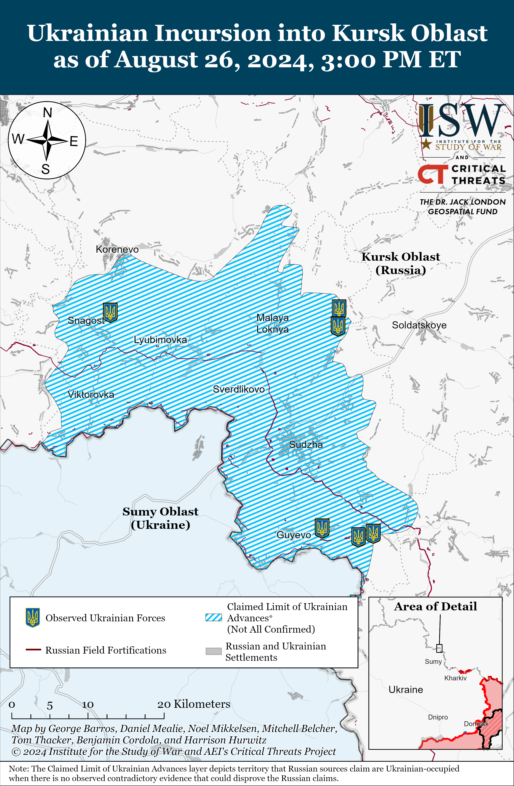
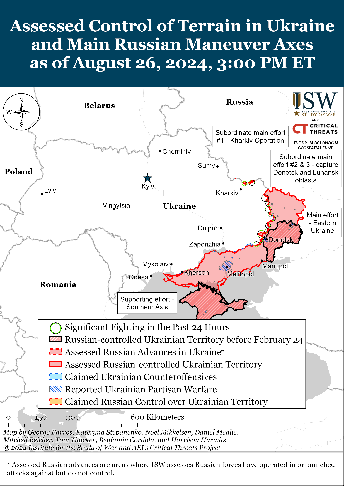
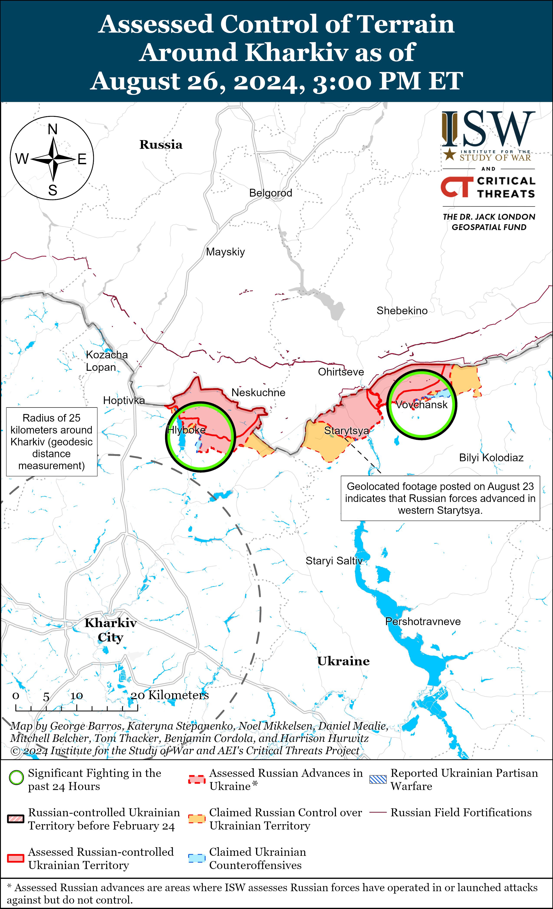
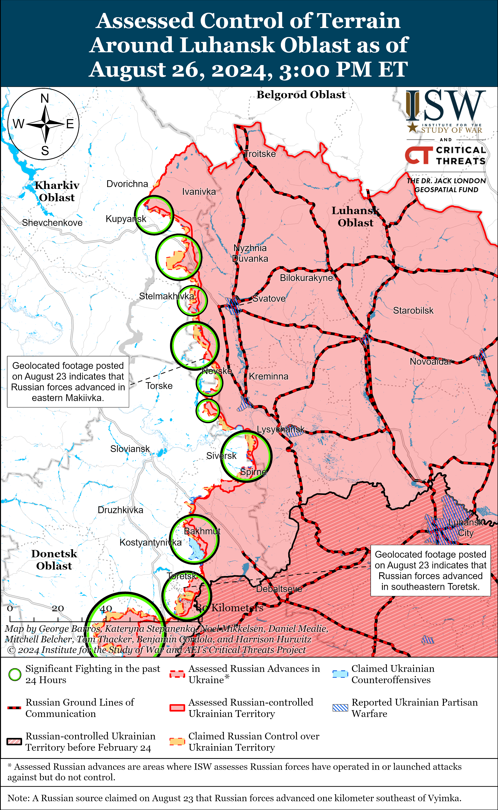
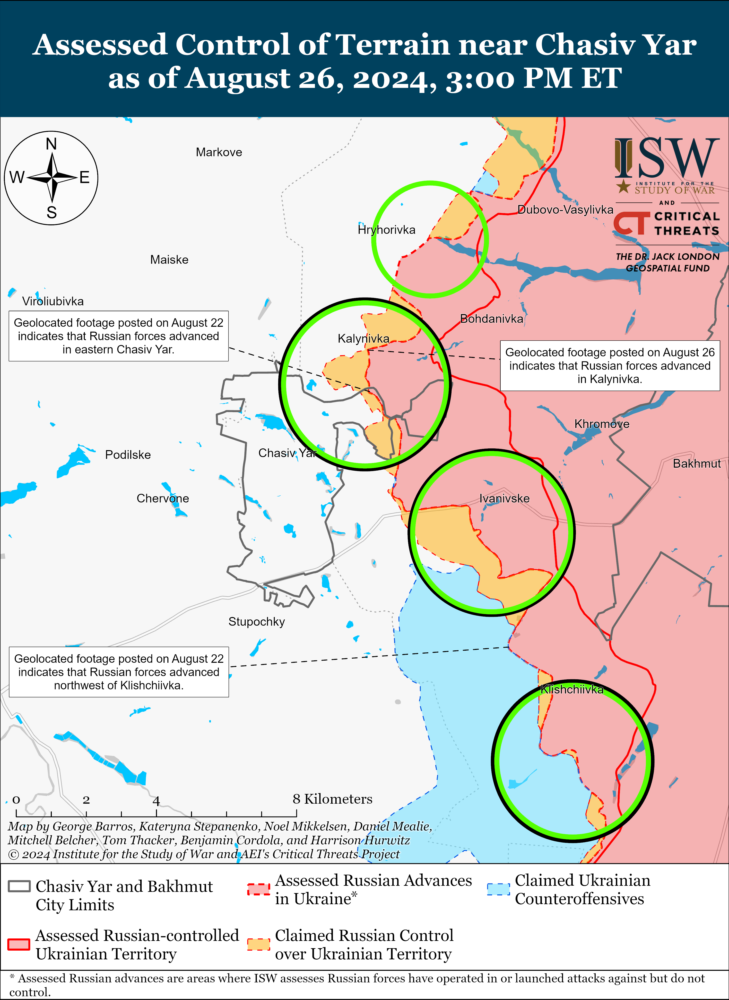
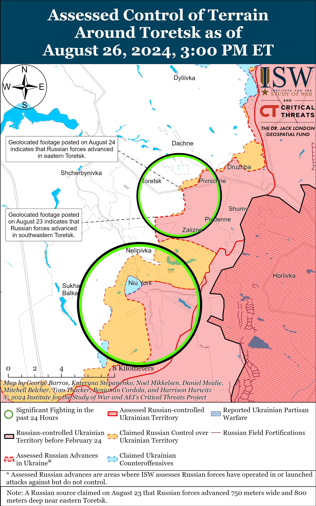
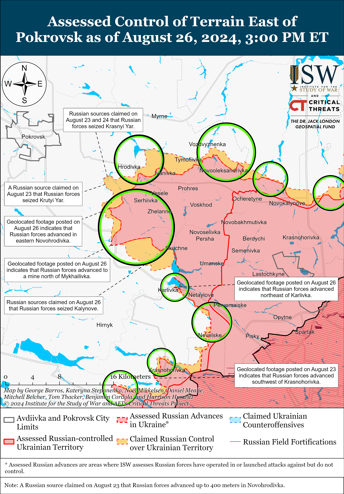
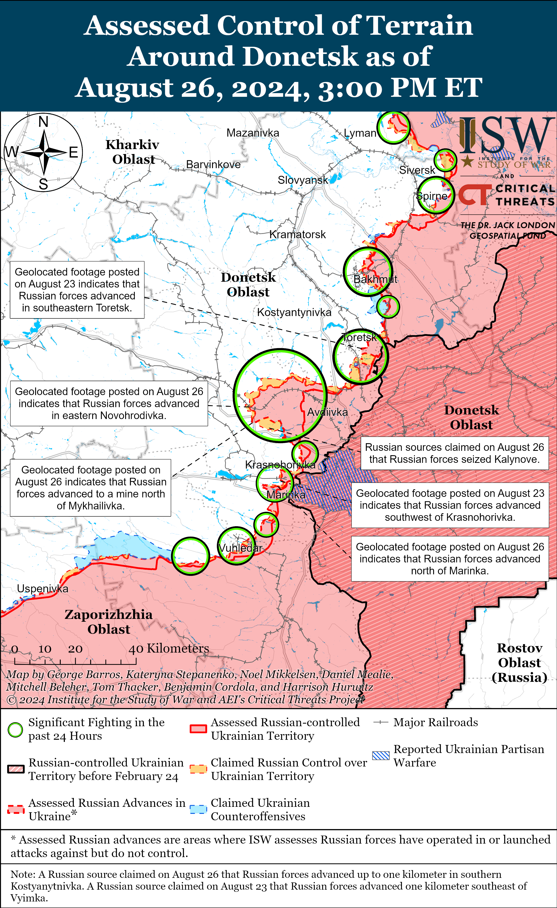
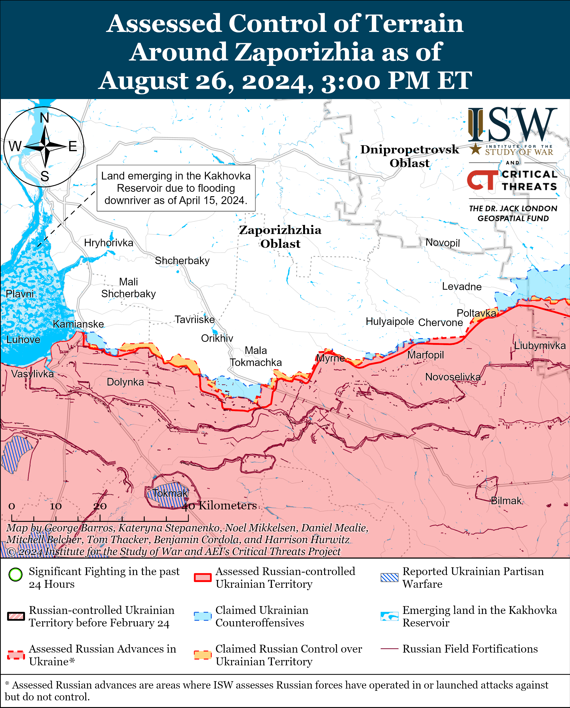
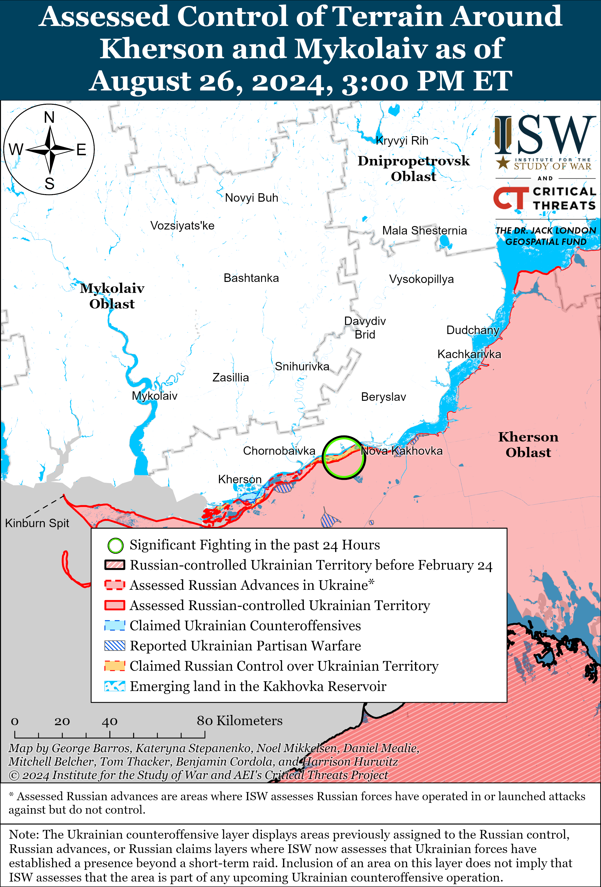

# Russian Offensive Campaign Assessment, August 26, 2024

**Nicole Wolkov, Davit Gasparyan, Karolina Hird, Grace Mappes, and George Barros**

**August 26, 2024, 7:30pm ET**

**Click**[**here**](https://storymaps.arcgis.com/stories/36a7f6a6f5a9448496de641cf64bd375)**to see ISW’s interactive map of the Russian invasion of Ukraine. This map is updated daily alongside the static maps present in this report.**

**Click**[**here**](https://storymaps.arcgis.com/stories/83a2f24901c941d581c0c523ecd2619b)**to see ISW’s interactive map of Ukraine’s offensive in Kursk Oblast.**

**Click**[**here**](https://understandingwar.maps.arcgis.com/apps/instant/3dviewer/index.html?appid=1602762dbcde419bb957dea358449580)**to see ISW’s 3D control of terrain topographic map of Ukraine. Use of a computer (not a mobile device) is strongly recommended for using this data-heavy tool.**

**Click**[**here**](https://storymaps.arcgis.com/stories/733fe90805894bfc8562d90b106aa895)**to access ISW’s archive of interactive time-lapse maps of the Russian invasion of Ukraine. These maps complement the static control-of-terrain map that ISW produces daily by showing a dynamic frontline. ISW will update this time-lapse map archive monthly.**

**Note: The data cut-off for this product was 1:30pm ET on August 26. ISW will cover subsequent reports in the August 27 Russian Offensive Campaign Assessment.**

**Russia conducted one of the largest combined series of drone and missile strikes against Ukrainian critical infrastructure to date on August 26.**Ukrainian Air Force Commander Lieutenant General Mykola Oleshchuk reported that Russian forces launched three Kh-47M2 “Kinzhal” aeroballistic missiles from Ryazan and Lipetsk oblasts; six Iskander-M or North Korean KN-23 ballistic missiles from Kursk and Voronezh oblasts and occupied Crimea; 77 Kh-101 cruise missiles from Tu-95MS strategic bombers from Volgograd Oblast and the Caspian Sea; 28 Kalibr cruise missiles from both surface and underwater missile carriers in the eastern Black Sea; three Kh-22 cruise missiles from Voronezh Oblast; 10 Kh-59/69 cruise missiles from an unspecified number of Su-57 fighter aircraft and Su-34 fighter-bombers in airspace over Belgorod Oblast and occupied Mariupol; and 109 Shahed drones from Yeysk and Primorsk-Akhtarsk, Krasnodar Krai, Kursk Oblast, and occupied Cape Chauda, Crimea.[1] Oleshchuk noted that Ukrainian forces shot down one Kh-47 “Kinzhal,” one Iskander-M, one Kh-22, 99 total Kh-101s, Kalibrs, and Kh-59s, and 99 Shaheds, and that an unspecified number of Shaheds missed their targets and crashed elsewhere in Ukraine, while two more crossed into Belarusian airspace. Polish Armed Forces Commander Major General Maciej Klisz noted that at least one drone temporarily crossed into Polish airspace during the Russian strike series.[2] The massive Russian strike series damaged objects in 15 Ukrainian oblasts, largely targeting Ukrainian critical infrastructure and causing significant damage to Ukraine’s energy grid.[3] Geolocated footage published on August 26 shows the aftermath of a likely Russian missile strike against the Kyiv Hydroelectric Power Plant (HPP) dam in Vyshhorod (just north of Kyiv City), although Kyiv Oblast Head Ruslan Kravchenko noted that the strike on the dam did not cause significant damage to Kyiv HPP infrastructure.[4] Ukrainian officials reported additional damage to critical infrastructure and energy disruptions as a result of Russian strikes in Lviv, Odesa, Volyn, Khmelnytskyi, Vinnytsia, Zhytomyr, and Zaporizhia oblasts.[5]

Russian milbloggers largely responded gleefully to the August 26 strikes, framing them as a Russian “retaliation” for Ukraine’s offensive into Kursk Oblast.[6] One milblogger noted, however, that such massive and devastating strikes should not be a one-off, calling for Russian military commanders to conduct such strikes on a regular basis to accomplish strategic and systemic impacts of Ukraine — echoing similar milblogger calls for sustained Russian strike series following larger strikes targeting Ukrainian infrastructure.[7] Russia likely lacks the defense-industrial capacity to sustain such massive strikes at a similar scale with regularity, but Ukrainian officials emphasized that this strike series shows the exigent need for Ukraine to receive more air defense systems from its partners, and for Ukraine’s partners to remove limitations on Ukraine’s ability to conduct long-range strikes into Russia with Western provided weapons.[8] ISW recently assessed that there are at least 250 military and paramilitary objects in Russia within range of US-provided ATACMS missiles, which US policy prevents Ukraine from using to strike inside of Russia.[9]

**Ukraine issued a warning to Belarus amid the recent buildup of Belarusian forces at the Ukrainian border in Belarus’ Gomel Oblast.** Ukrainian intelligence services reported on August 25 that Belarus amassed forces in Gomel Oblast (which shares a border with northern Ukraine) and has deployed a significant number of personnel, including special operations forces (likely in reference to Spetsnaz units), weapons, military equipment, and fighters from the former Wagner Group.[10] The Ukrainian Ministry of Foreign Affairs (MFA) reported on August 25 that the Belarusian forces deployed under the pretext of a military exercise near the border with Ukraine and are particularly close to the Chernobyl Nuclear Power Plant, which raises security concerns for Ukraine.[11] A Belarusian milblogger claimed on August 25 that the Ukrainian reports were correct and confirmed that Belarusian forces are amassing at the border.[12] The Ukrainian MFA urged Belarus to withdraw its troops from the border and warned that any violation of the Ukrainian state border would prompt Ukraine to take necessary defensive measures in accordance with international law.[13] The Ukrainian MFA also cautioned Belarus against succumbing to Russian pressure and supporting Russia’s war efforts against Ukraine. Ukraine’s State Border Service Spokesperson Andriy Demchenko announced on August 26 that Ukrainian forces are fortifying the border area with Belarus in response.[14]

**The current Belarusian build-up along the Ukrainian border is likely intended to divert and stretch Ukrainian forces along a wider frontline, as ISW continues to assess that Belarusian forces remain unlikely to invade Ukraine due to constraints facing Belarusian President Alexander Lukashenko.**An analysis by Ukraine-based open-source intelligence organization Frontelligence Insight and Rochan Consulting suggests that Belarusian combat units typically operate at only 30 to 40 percent of their total end strength and rely on mobilization to staff units, indicating that serious preparations for a major Belarusian invasion of Ukraine would be more apparent as Belarus has not announced general mobilization.[15] The Fronttelligence investigation stated the scale of a hypothetical Belarusian attack into Ukraine would likely be limited and suggested that the Belarusian forces could be conducting this operation to distract Ukrainian forces from their efforts elsewhere along the frontline, consequently supporting Russian forces committed throughout Ukraine and Kursk Oblast. Andriy Demchenko reported on August 26 that the current number of Russian forces in Belarus is insufficient for a significant coordinated invasion of Ukraine from the Gomel Oblast border.[16] A Belarusian invasion of Ukraine, or even Belarus’ military involvement in the war, would degrade Belarusian President Alexander Lukashenko‘s ability to defend his regime (and be very unpopular domestically), and ISW has previously assessed that Lukashenko is extremely unlikely to risk combat with Ukraine that could weaken his regime or drastically increase Belarusian domestic discontent.[17] Belarusian presidential elections are approaching in February 2025, and Lukashenko likely desires to retain control over public sentiment, as well as access to his military to crack down on any protests surrounding the elections, as he did in late 2020. Lukashenko leveraged his military to crack down against previous mass protests against Lukashenko’s staged presidential elections in 2020, and a loss of capabilities among the Belarusian military that could result from combat operations in Ukraine would degrade Lukashenko’s ability to crush future protests. Lukashenko likely also seeks to avoid being dragged into Russia’s war with Ukraine to avoid the domestic political costs that such involvement would incur. Possible Belarusian mobilization expected battlefield casualties, Belarus’ further international isolation, and negative economic ramifications would likely increase public discontent and undo Lukashenko’s efforts to restore his regime’s stability since 2020. Additionally, Lukashenko has worked to maintain some level of Belarusian autonomy and sovereignty vis-a-vis Russia while portraying Belarus as Russia‘s equal partner in order to safeguard his power from the Kremlin’s increased desire to subordinate Belarus to Moscow through the Union State.[18] Belarus directly joining Russia’s war would indicate that Moscow has succeeded in eliminating Lukashenko’s maneuvering space and established suzerainty over Belarus. ISW has previously observed Belarus deploy personnel to the Ukrainian border at the end of 2022 and early 2023 in a similar manner to current deployments and assessed that these efforts served primarily to stretch Ukrainian forces along the theater of war and disrupt their operations thereby supporting Russian operations.[19] Belarus may be once again conducting such activity to fix Ukraine’s limited forces near Ukraine’s international border with Belarus in support of a Russian campaign design that seeks to stretch Ukrainian forces thin throughout the theater. Belarus’ support of Russian efforts is a strong indicator of the extent to which the Kremlin has been consolidating its control over Belarus since 2020.

**Ukrainian forces reportedly attempted to strike Engels Air Base in Saratov Oblast and an oil refinery in Yaroslavl Oblast with drones on the morning of August 26.**The Russian Ministry of Defense (MoD) claimed on August 26 that Russian forces intercepted nine drones over Saratov Oblast, three over Kursk Oblast, two each over Belgorod, Bryansk, and Tula oblasts, and one each over Oryol and Ryazan oblasts on the night of August 25 to 26.[20] Geolocated footage published on August 26 shows a fixed-wing drone striking a building in Saratov City.[21] Saratov Oblast Governor Roman Busargin claimed that Russian air defenses destroyed all of the drones near Saratov City and Engels (just across the Volga River southeast of Saratov City), but that falling drone debris damaged infrastructure in both cities.[22] A prominent Kremlin-affiliated source speculated that Ukrainian forces attempted to strike the Engels Air Base, which Ukrainian forces have struck previously – most recently in March and April 2024.[23] Yaroslavl Oblast Governor Mikhail Yevrayev claimed on August 26 that Russian forces shot down a drone attempting to strike an oil refinery in Yaroslavl City.[24] Oryol Oblast Governor Andrei Klychkov claimed that Russian forces destroyed three Ukrainian drones over Oryol Oblast on the morning of August 26.[25] Volgograd Oblast Governor Andrei Bocharov claimed that Russian forces downed several drones over Yelansky Raion but that falling drone debris damaged several buildings.[26] ISW has not observed any official Ukrainian sources commenting on the strikes.

**Ukrainian forces continued offensive operations within their salient in Kursk Oblast on August 26, but neither Russian nor Ukrainian forces made any significant confirmed or claimed advances.** The Russian Ministry of Defense (MoD) and other Russian sources claimed that Russian forces repelled Ukrainian attacks near Komarovka (southwest of Korenevo).[27] Several Russian sources claimed on August 26 that fighting is ongoing in Olgovka and Kremyanoye (both east of Korenevo) despite claims on August 25 that Russian forces had recaptured these settlements.[28] One Russian source claimed that Ukrainian forces previously seized Matveevka (east of Korenevo), although ISW has not observed other Russian or Ukrainian sources making a similar claim within the past several days.[29] Several Russian milbloggers claimed that fighting is ongoing near Malaya Loknya (north of Sudzha), although one Russian source claimed that Ukrainian forces are advancing in the area.[30] Geolocated footage published on August 26 shows Ukrainian forces operating just west of Nechayev (northeast of Sudzha), and Russian claims of fighting near the settlement also indicate that Ukrainian forces continue operating near Nechayev.[31] Geolocated footage published on August 25 shows Ukrainian forces operating in Borki (southeast of Sudzha), and Russian sources claimed on August 26 that fighting is ongoing near the settlement.[32] Elements of the Russian 810th Naval Infantry Brigade (Pacific Fleet, Eastern Military District [EMD]) and 11th Airborne (VDV) Brigade are reportedly counterattacking in the Plekhovo-Borki-Spalnoye area (south to southeast of Sudzha).[33] Another Russian milblogger claimed that elements of the Russian 83rd VDV Brigade are operating in Kursk Oblast, which ISW most recently observed operating in the Kharkiv direction.[34]

**The Kremlin may be leveraging the leadership of the prominent Kremlin-linked *Rybar*Telegram channel to set cultivate increased Russian influence in Iraq.**The *Rybar*channel claimed on August 26 that members of the *Rybar*team – likely including its founder Mikhail Zvinchuk – met with Iraqi Prime Minister Mohammad Shia al Sudani on August 25 in Baghdad, marking the team’s first engagement with a current leader of a foreign country.[35] *Rybar*claimed that al Sudani emphasized the importance of allowing foreign journalists to report from Iraq to boost Iraq’s global image, and *Rybar* assessed that Iraqi officials understand the importance of Telegram in the “modern information war” given that they are inviting Russian media representatives to the country. Members of the *Rybar*team also claimed on August 25 that they met with former Iraqi Prime Minister Ayad Allawi and argued that Russia should pursue cooperation with Iraq and other countries in the Middle East and the “Global South.”[36] This is the first time ISW has observed reports of a Russian milblogger meeting with a senior foreign official. ISW-CTP previously assessed that Russia may be setting conditions to supplant the United States as a security partner in Iraq in anticipation of the United States possibly reducing its military presence there.[37] An increased Kremlin-affiliated media presence in Iraq may be part of a Russian effort to deepen non-security related relations with Iraq as Russia is likely wary of complex Iran-Iraq relations, given Russia’s increasing alignment with Iran. Russia has continued efforts to court Iranian-backed proxies within Iraq, notably.[38]

**Russian Presidential Administration Deputy Head Sergei Kiriyenko was reportedly in charge of a Kremlin think tank that tried and failed to establish rhetorical justifications for Russia’s full-scale invasion of Ukraine after the fact, underscoring the Kremlin’s rhetorical failures in the first months of the war and Russian President Vladimir Putin’s continued prioritization of loyalty over competency in officials.** Russian-language opposition outlet *Meduza*reported on August 26 that Kiriyenko established and appointed political strategists to the Expert Institute for Social Research (EISI), a think tank that was supposed to take responsibility for the Kremlin’s informational justifications for the Kremlin’s political decisions and establish the “image of the future” of Russia, in 2017 but that EISI has largely failed in this mission.[39] *Meduza*assessed that EISI instead managed to eliminate challengers to Putin’s regime, monitor alleged “stability” amid regional elections, and praise Putin.[40] *Meduza*cited several sources affiliated with the Russian presidential administration and noted that creating EISI was not Kiriyenko’s “idea” but a precedent set by then-Presidential Administration first deputy heads Vladislav Surkov and Vyacheslav Volodin, who each established separate think tanks responsible for the Kremlin’s “public and private” political “steps.”[41] *Meduza*noted that the EISI did not have advance notice for Russia’s full-scale invasion of Ukraine in 2022 and had to develop informational justifications for the invasion after the Kremlin realized it could not rapidly conquer Ukraine.[42] *Meduza*‘s sources claimed that Russians failed to understand Russian President Vladimir Putin’s concepts of “denazification” and “demilitarization.”[43] *Meduza*reported that the EISI did develop rhetorical lines to justify the war, including portraying the war as Russia’s struggle against Western colonialism, framing Russia as “fated” to lead a coalition of several “friendly” states, and Russia as the “guardian” of “correct” European culture and values – but*Meduza’*s sources stated that the EISI realized it was “impossible” to completely justify the war, much less incorporate the war into EISI’s vision for Russia’s future.[44] ISW is unable to confirm this report, but if true, this Kremlin messaging failure coheres with ISW’s observations about Russian information operations and Kremlin information space incompetence throughout the war. The Kremlin largely failed to establish coherent messaging about the war in Ukraine in 2022 and throughout much of 2023, and Putin has prioritized leaders who are personally loyal to Putin over those who are competent.[45] Kiriyenko has a prominent role in Kremlin information operations and oversees Kremlin information operations to undermine support for Ukraine and NATO outside of EISI, so it is feasible that Kiriyenko has prioritized these other efforts over rehabilitating EISI following the onset of the full-scale invasion.[46]

**Key Takeaways:**

- **Russia conducted one of the largest combined series of drone and missile strikes against Ukrainian critical infrastructure to date on August 26.**
- **Ukraine issued a warning to Belarus amid the recent buildup of Belarusian forces at the Ukrainian border in Belarus’ Gomel Oblast.**
- **The current Belarusian build-up along the Ukrainian border is likely intended to divert and stretch Ukrainian forces along a wider frontline, as ISW continues to assess that Belarusian forces remain unlikely to invade Ukraine due to constraints facing Belarusian President Alexander Lukashenko.**
- **Ukrainian forces reportedly attempted to strike Engels Air Base in Saratov Oblast and an oil refinery in Yaroslavl Oblast with drones on the morning of August 26.**
- **Ukrainian forces continued offensive operations within their salient in Kursk Oblast on August 26, but neither Russian nor Ukrainian forces made any significant confirmed or claimed advances.**
- **The Kremlin may be leveraging the leadership of the prominent Kremlin-linked Rybar Telegram channel to set cultivate increased Russian influence in Iraq.**
- **Russian Presidential Administration Deputy Head Sergei Kiriyenko was reportedly in charge of a Kremlin think tank that tried and failed to establish rhetorical justifications for Russia’s full-scale invasion of Ukraine after the fact, underscoring the Kremlin’s rhetorical failures in the first months of the war and Russian President Vladimir Putin’s continued prioritization of loyalty over competency in officials.**
- **Russian forces recently advanced northeast of Kharkiv City, north of Chasiv Yar, southeast of Pokrovsk, and west of Donetsk City.**
- **The Russian Ministry of Defense (MoD) continues to recruit foreigners to fight with the Russian military in Ukraine.**

***We do not report in detail on Russian war crimes because these activities are well-covered in Western media and do not directly affect the military operations we are assessing and forecasting. We will continue to evaluate and report on the effects of these criminal activities on the Ukrainian military and the Ukrainian population and specifically on combat in Ukrainian urban areas. We utterly condemn Russian violations of the laws of armed conflict and the Geneva Conventions and crimes against humanity even though we do not describe them in these reports.***

- Russian Main Effort – Eastern Ukraine (comprised of three subordinate main efforts)
- Russian Subordinate Main Effort #1 – Push Ukrainian forces back from the international border with Belgorod Oblast and approach to within tube artillery range of Kharkiv City
- Russian Subordinate Main Effort #2 – Capture the remainder of Luhansk Oblast and push westward into eastern Kharkiv Oblast and encircle northern Donetsk Oblast
- Russian Subordinate Main Effort #3 – Capture the entirety of Donetsk Oblast
- Russian Supporting Effort – Southern Axis
- Russian Air, Missile, and Drone Campaign
- Russian Mobilization and Force Generation Efforts
- Russian Technological Adaptations
- Activities in Russian-occupied areas
- Ukrainian Defense Industrial Base Efforts
- Russian Information Operations and Narratives
- Significant Activity in Belarus

**Russian Main Effort – Eastern Ukraine**

**Russian Subordinate Main Effort #1 – Kharkiv Oblast (Russian objective: Push Ukrainian forces back from the international border with Belgorod Oblast and approach to within tube artillery range of Kharkiv City)**

Russian forces recently advanced northeast of Kharkiv City and continued fighting north of Kharkiv City near Lyptsi and Hlyboke and northeast of Kharkiv City in Vovchansk on August 26.[47] Geolocated footage published on August 23 shows that Russian forces marginally advanced within Starytsya (northeast of Kharkiv City).[48] Ukraine’s Kharkiv Group of Forces reported that Russian forces may be preparing to resume assaults in Vovchansk to unblock the small contingent of Russian troops that are currently in the Vovchansk Aggregate Plant.[49] Elements of the 3rd Battalion of the Russian 7th Motorized Rifle Regiment (11th Army Corps (AC), Leningrad Military District [LMD]) are reportedly operating near Lyptsi, elements of the 11th Tank Regiment (18th Motorized Rifle Division, 11th AC, LMD) are reportedly operating near Hlyboke, and elements of the 41st Motorized Rifle Regiment (72nd Motorized Rifle Division, 44th AC, LMD) are reportedly operating between Starytsya and Ohirtseve..[50]

**Russian Subordinate Main Effort #2 – Luhansk Oblast (Russian objective: Capture the remainder of Luhansk Oblast and push westward into eastern Kharkiv Oblast and northern Donetsk Oblast)**

Russian forces continued offensive operations along the Kupyansk-Svatove-Kreminna line on August 26 but did not make any confirmed advances. Russian forces attacked northeast of Kupyansk near Synkivka; east of Kupyansk near Petropavlivka; southeast of Kupyansk near Hlushkivka, Kolisnykivka, Stelmakhivka, and Lozova; west of Svatove near Andriivka; southwest of Svatove near Proletarske, northwest of Kreminna near Hrekivka, Makiivka, Druzhelyubivka, Novosadove, and Nevske; west of Kreminna near Terny and Torske; and south of Kreminna in the Serebryanske forest area.[51] Elements of the Russian 144th Motorized Rifle Division (20th Combined Arms Army [CAA], Moscow Military District [MMD]) reportedly continue operating in the Svatove-Kreminna direction.[52]

**Russian Subordinate Main Effort #3 – Donetsk Oblast (Russian objective: Capture the entirety of Donetsk Oblast, the claimed territory of Russia’s proxies in Donbas)**

Russian forces continued offensive operations in the Siversk direction on August 26, but there were no confirmed changes to the frontline. The Ukrainian General Staff reported that Russian forces attacked northeast of Siversk near Bilohorivka; east of Siversk near Verkhnokamyanske; and southeast of Siversk near Ivano-Darivka, Vyimka, and Spirne on August 25 and 26.[53] Elements of the Russian 106th Airborne (VDV) Division’s 137th VDV Regiment are reportedly operating in the Siversk direction.[54]

Russian forces made marginal advances north of Chasiv Yar amid continued offensive operations in the area on August 26. Geolocated footage published on August 26 indicates that Russian forces advanced along Lisova Street in central Kalynivka (north of Chasiv Yar).[55] A Russian milblogger claimed on August 25 that Russian forces advanced north of Kalynivka, but ISW has not observed confirmation of this claim.[56] Russian forces continued offensive operations north of Chasiv Yar near Hryhorivka; east of Chasiv Yar near Ivanivske; south of Chasiv Yar near Stupochky; southeast of Chasiv Yar near Andriivka and Klishchiivka; and near Chasiv Yar itself on August 25 and 26.[57]

Russian forces recently advanced east of Toretsk amid continued Russian offensive operations in the area on August 26. Geolocated footage published on August 21 indicates that Russian forces recently advanced in central Druzhba (east of Toretsk).[58] A Russian milblogger claimed on August 26 that Russian forces advanced within Toretsk.[59] Another Russian milblogger claimed on August 25 that Russian forces advanced in Toretsk, Niu York (south of Toretsk), and between Zalizne (southeast of Toretsk) and Pivnichne (east of Toretsk).[60] ISW has not observed confirmation of these claims, however. Russian forces also continued ground attacks near and in Toretsk; east of Toretsk near Druzhba; and south of Toretsk near Nelipivka on August 25 and 26.[61]

Russian forces recently made additional advances southeast of Pokrovsk as intense fighting continued in the Pokrovsk direction on August 26. Geolocated footage published on August 26 indicates that Russian forces have advanced to Lomonsova Street in the Kishlak neighborhood of eastern Novohrodivka (southeast of Pokrovsk).[62] A Russian milblogger claimed that Russian forces have advanced northward into central Novohrodivka, although ISW has not yet observed visual evidence of Russian troops within central Novohrodivka.[63] Russian milbloggers also claimed that Russian forces advanced up to Shevchenko Street in eastern Hrodivka (east of Pokrovsk and northeast of Novohrodivka), as well as in fields northeast of Hrodivka, although ISW has not observed visual confirmation of these claimed advances.[64] One milblogger alleged that Russian forces control 60 percent of Novohrodivka and 20 percent of Hrodivka, although ISW has only collected geolocated visual evidence to confirm that Russian forces have seized 2.5 percent of Novohrodivka and about 5 percent of Hrodivka, though Russian forces may have seized more.[65] Additional geolocated footage published on August 26 shows that Russian forces have also advanced further southeast of Pokrovsk in the Kotlyarevska mine just north of Mykhailivka (just south of Novohrodivka) and in the dacha area north of Karlivka (about 15km southeast of Novohrodivka).[66] Several Russian milbloggers claimed that Russian forces have seized Kalynove (also southeast of Pokrovsk and just northwest of Karlivka), but ISW has not observed visual confirmation of Russian forces either in or near Kalynove and has only observed evidence that can confirm that Russian forces are around one kilometer from Kalynove at their closest observed point.[67] The Ukrainian General Staff reported that Russian forces conducted ground attacks northeast of Pokrovsk near Myrolyubivka, Panteleymonivka, and Zelene Pole; east of Pokrovsk near Vozdvyzhenka, Hrodivka, Novooleksandrivka; and southeast of Pokrovsk near Kalynove, Memryk, Mykhailivka, and Marynivka.[68]

Russian forces recently made a marginal advance west of Donetsk City. Geolocated footage published on August 26 indicates that Russian forces advanced in fields north of Marinka (just west of Donetsk City).[69] A Russian milblogger claimed that Russian forces are continuing to clear the private sector of northern Krasnohorivka (also west of Donetsk City).[70] The Ukrainian General Staff reported Russian ground attacks west of Donetsk City near Krasnohorivka, Hostre, and Heorhiivka.[71]

Russian forces reportedly advanced in the Vuhledar direction (southwest of Donetsk City) amid continued offensive operations in this area on August 26. Several Russian milbloggers claimed that elements of the Russian 68th Army Corps (Eastern Military District [EMD]) have advanced up to one kilometer on the southern outskirts of Kostyantynivka (northeast of Vuhledar) and have reached Shevchenka Street in central Kostyantynivka, although ISW has not seen visual evidence of these claims.[72] Fighting continued northeast of Vuhledar near Vodyane, Kostyantynivka, and Paraskoviivka; near Vuhledar itself; and west of Vuhledar near Prechystivka and Novoukraiinka.[73] Elements of the Russian 11th Air Force and Air Defense Army (Russian Aerospace Forces [VKS] and EMD) are conducting strikes on Ukrainian positions near Vodyane, while elements of the 39th Motorized Rifle Brigade (68th Army Corps, EMD) are operating in the general south Donetsk (southwest of Donetsk City) area.[74]

Russian forces reportedly continued limited ground attacks in the Donetsk-Zaporizhia Oblast border area east of Urozhaine on August 26.[75] Elements of the Russian 36th Combined Arms Army (EMD) are reportedly operating near Velyka Novosilka.[76]

**Russian Supporting Effort – Southern Axis (Russian objective: Maintain frontline positions and secure rear areas against Ukrainian strikes)**

Neither Russian nor Ukrainian sources reported fighting in western Zaporizhia Oblast on August 26. Russian forces from the 4th Military Base (58th Combined Arms Army [CAA], Southern Military District [SMD]) reportedly continue operating near Orikhiv.[77]

The Ukrainian General Staff reported that Ukrainian forces repelled Russian attacks in the Dnipro direction (Kherson Oblast), including on the Dnipro River Delta islands, on August 26.[78]

**Russian Air, Missile, and Drone Campaign (Russian Objective: Target Ukrainian military and civilian infrastructure in the rear and on the frontline)**

See topline text.

**Russian Mobilization and Force Generation Efforts (Russian objective: Expand combat power without conducting general mobilization)**

The Russian Ministry of Defense (MoD) continues to recruit foreigners to fight with the Russian military in Ukraine. The Russian “Arbat” Special Purpose Battalion of the “Pyatnashka” International Volunteer Brigade announced on August 24 that it has begun recruiting volunteers from Indonesia, some of whom are already training in occupied Donetsk Oblast.[79] The “Arbat” Special Purpose Battalion is reportedly fighting in Kursk Oblast, and these international recruits may deploy to Kursk Oblast after completing their training.[80]

**Russian Technological Adaptations (Russian objective: Introduce technological innovations to optimize systems for use in Ukraine)**

Russian holding company “Roselectronics,” a subordinate entity of Russian state-owned defense conglomerate Rostec, reported on August 25 that it has modernized the “Chistulya” portable anti-drone system, which Russian assault units have tested in anti-drone operations on the battlefield in Ukraine.[81]

**Ukrainian Defense Industrial Efforts (Ukrainian objective: Develop its defense industrial base to become more self-sufficient in cooperation with US, European, and international partners)**

*ISW is suspending publishing coverage of Ukrainian defense industrial efforts until further notice.*

**Activities in Russian-occupied areas (Russian objective: Consolidate administrative control of annexed areas; forcibly integrate Ukrainian citizens into Russian sociocultural, economic, military, and governance systems)**

*ISW is not publishing coverage of activities in Russian-occupied areas today.*

**Russian Information Operations and Narratives**

The Kremlin continues to promote information operations aimed at spoiling Ukraine’s international reputation. Russian state media amplified claims from unspecified sources that Ukraine is supporting “terrorists” and conducting destabilization operations in Cote d’Ivoire.[82] Cote d’Ivoire is a strong supporter of Ukraine on the African continent, and the Kremlin likely seeks to drive a wedge in this relationship in the wake of several Sahelian states severing relations with Ukraine following an attack on Wagner forces in Mali.[83]

The Kremlin continues to set informational conditions to justify its destabilization efforts within Georgia. The Russian Foreign Intelligence Service (SVR) claimed on August 26 that the US is attempting to weaken the ruling Georgia Dream Party ahead of the Georgian presidential election by preparing a “color revolution” in Georgia and sanctioning Georgian Dream Party leaders.[84] Georgian Dream actors have largely amplified Kremlin information operations, and ISW continues to assess that these actors likely intend to purposefully derail long-term Georgian efforts for Euro-Atlantic integration.[85]

**Significant activity in Belarus (Russian efforts to increase its military presence in Belarus and further integrate Belarus into Russian-favorable frameworks and Wagner Group activity in Belarus)**

See topline text.

**Note: ISW does not receive any classified material from any source, uses only publicly available information, and draws extensively on Russian, Ukrainian, and Western reporting and social media as well as commercially available satellite imagery and other geospatial data as the basis for these reports. References to all sources used are provided in the endnotes of each update.**

---

[1] https://www.facebook.com/GeneralStaff.ua/posts/pfbid02BibrQJNoodsULzQbKY9S6fRR3RV8bxCNNgNKMmrja8BLnxn2s4njh1D7WLxitPGEl; https://t.me/ComAFUA/402

[2] https://www.rmf24 dot pl/fakty/polska/news-polskie-wojsko-obiekt-znad-ukrainy-wlecial-na-nasze-terytori,nId,7764114#crp\_state=1 ; https://www.pap dot pl/ua/ukrainian/news/u-polschi-trivae-operaciya-z-poshuku-rosiyskogo-povitryanogo-obekta-yakiy-vranci

[3] . https://t.me/V\_Zelenskiy\_official/11458 ; https://t.me/V\_Zelenskiy\_official/11459 ; https://suspilne dot media/821611-rosia-zapustila-po-ukraini-ponad-100-raket-riznih-tipiv-ta-blizko-sotni-sahediv-zelenskij; https://t.me/kyivoda/19763 ; https://t.me/kyivoda/19765 ; https://t.me/kyivoda/19774

[4] https://x.com/ThomasVLinge/status/1828012169373368370; https://x.com/Wolltigerhueter/status/1828018936375333031; https://x.com/GeoConfirmed/status/1828025953311719458; https://x.com/wartranslated/status/1828006382051758546; https://suspilne dot media/821339-bilorus-stague-vijska-do-kordonu-zelenskij-zbirae-naradu-sodo-vtikaciv-udar-po-kramatorsku-915-den-vijni-onlajn/?anchor=live\_1724682111&utm\_source=copylink&utm\_medium=ps; https://t.me/RVvoenkor/75691; https://t.me/RVvoenkor/75680 ; https://t.me/dva\_majors/50755; https://t.me/dva\_majors/50739; https://t.me/z\_arhiv/27792; https://t.me/belta\_telegramm/265260 ; https://t.me/DnevnikDesantnika/14549 ; https://t.me/voenkorKotenok/58537 ; https://t.me/vchkogpu/50390 ; https://t.me/vchkogpu/50379 ; https://t.me/bbcrussian/69524

[5] https://suspilne dot media/zhytomyr/821469-vibuhi-na-zitomirsini-26-serpna-u-zitomiri-vnaslidok-masovanoi-ataki-rosii-zniklo-elektro-ta-vodopostacanna/; https://suspilne dot media/vinnytsia/821461-dvoe-poranenih-ta-vlucanna-v-obekti-kriticnoi-infrastrukturi-naslidki-rosijskoi-ataki-na-vinniccini/; https://suspilne dot media/khmelnytskiy/821839-zemla-hodila-hodunom-naslidki-rankovih-obstriliv-hmelnickoi-gromadi-26-serpna/; https://suspilne dot media/khmelnytskiy/821577-hmelnickoblenergo-pracue-nad-vidnovlennam-elektriki-pisla-rankovoi-ataki-na-oblast/; https://t.me/ivan\_fedorov\_zp/10779 ; https://t.me/ivan\_fedorov\_zp/10783; https://t.me/mayorpolishchuk/1388 ; https://t.me/volynskaODA/5437; https://t.me/dva\_majors/50717; https://t.me/odeskaODA/6360 ; https://t.me/odeskaODA/6361; https://suspilne dot media/lviv/821661-urazeni-tilki-obekti-kriticnoi-infrastrukturi-zastupnik-nacalnika-lvivskoi-ova-pro-naslidki-obstrilu/

[6] https://t.me/rybar/63073; https://t.me/voenkorKotenok/58533

[7] https://t.me/voenkorKotenok/58533

[8] https://t.me/V\_Zelenskiy\_official/11458 ; https://t.me/V\_Zelenskiy\_official/11459 ; https://suspilne dot media/821611-rosia-zapustila-po-ukraini-ponad-100-raket-riznih-tipiv-ta-blizko-sotni-sahediv-zelenskij/; https://t.me/Denys\_Smyhal/8348; https://www.facebook.com/rustemumerov.ua/posts/pfbid02tUtejrdi5VAyVbtxLCkXAq4wJM6ufZm2orGBhoxj4ktwgq4xRwSJYGRhNy52ojMXl

[9] https://understandingwar.org/backgrounder/russian-offensive-campaign-assessment-august-24-2024

[10] https://mfa dot gov.ua/en/news/zayava-mzs-ukrayini-shchodo-nedruzhnih-dij-respubliki-bilorus; https://suspilne dot media/821295-ukraina-vimagae-vid-bilorusi-vidvesti-vid-kordonu-z-ukrainou-armiu-ta-vagnerivciv/

[11] https://mfa dot gov.ua/en/news/zayava-mzs-ukrayini-shchodo-nedruzhnih-dij-respubliki-bilorus

[12] https://t.me/dva\_majors/50661; https://t.me/belarusian\_silovik/39850

[13] https://mfa.gov dot ua/news/zayava-mzs-ukrayini-shchodo-nedruzhnih-dij-respubliki-bilorus

[14] https://armyinform.com dot ua/2024/08/26/obstanovku-na-derzhrubezhi-z-bilorussyu-prokomentuvaly-u-dpsu/

[15] https://x.com/Tatarigami\_UA/status/1827801600070488169 ; https://frontelligence dot substack.com/p/lingering-menace-military-transformations

[16] https://armyinform.com dot ua/2024/08/26/obstanovku-na-derzhrubezhi-z-bilorussyu-prokomentuvaly-u-dpsu/

[17] https://www.pbs.org/newshour/world/belarusians-wary-of-being-drawn-into-russias-war-in-ukraine; https://understandingwar.org/backgrounder/russian-offensive-campaign-assessment-december-11

[18] https://understandingwar.org/backgrounder/belarus-warning-update-forced-integration-russia%E2%80%94not-protest-movement%E2%80%94-lukashenko%E2%80%99s

[19] https://isw.pub/UkrWar12232022

[20] https://t.me/mod\_russia/42586

[21] https://x.com/PierreDavideB/status/1827966062979109282; https://x.com/GeoConfirmed/status/1828036629526622470; https://t.me/bazabazon/30651; https://x.com/99Dominik\_/status/1827963982252048427

[22] https://t.me/busargin\_r/6814

[23] https://t.me/rybar/63065 ; https://isw.pub/UkrWar040524 ; https://isw.pub/UkrWar032024

[24] https://t.me/evraevmikhail/6455

[25] https://t.me/Klychkov\_Andrey/3880

[26] ; https://t.me/rgn\_34/6984

[27] https://t.me/mod\_russia/42598 ; https://t.me/dva\_majors/50685

[28] https://t.me/rusich\_army/16774 ; https://t.me/NgP\_raZVedka/18823 ; https://t.me/mod\_russia/42598 ; https://t.me/rybar/63077 ; https://understandingwar.org/backgrounder/russian-offensive-campaign-assessment-august-25-2024

[29] https://t.me/rybar/63077

[30] https://t.me/rybar/63077 ; https://t.me/mod\_russia/42598 ; https://t.me/dva\_majors/50685 ; https://t.me/belarusian\_silovik/40015 ; https://t.me/motopatriot/26736

[31] https://t.me/creamy\_caprice/6535; https://t.me/napravleniespravedlivosti/261 ; https://t.me/mod\_russia/42598 ; https://t.me/rybar/63077 ; https://t.me/rybar/63077

[32] https://t.me/creamy\_caprice/6524; https://t.me/zogrussia1/714; https://x.com/MilitarySummary/status/1827983071313789023 ; https://t.me/mod\_russia/42598 ; https://t.me/rybar/63077 ; https://t.me/RVvoenkor/75636

[33] https://t.me/RVvoenkor/75636

[34] https://t.me/rusich\_army/16764 ; https://t.me/rusich\_army/16776 ; https://understandingwar.org/backgrounder/russian-offensive-campaign-assessment-august-16-2024 ; https://understandingwar.org/backgrounder/russian-offensive-campaign-assessment-august-2-2024

[35] https://t.me/rybar/63068

[36] https://t.me/rybar/63041 ; https://understandingwar.org/backgrounder/russian-offensive-campaign-assessment-august-25-2024

[37] https://understandingwar.org/backgrounder/iran-update-february-20-2024 ; https://understandingwar.org/backgrounder/iran-update-february-21-2024

[38] https://understandingwar.org/backgrounder/russian-offensive-campaign-assessment-february-3-2024

[39] https://meduza dot io/feature/2024/08/26/institut-imeni-kirienko

[40] https://meduza dot io/feature/2024/08/26/institut-imeni-kirienko

[41] https://meduza dot io/feature/2024/08/26/institut-imeni-kirienko

[42] https://meduza dot io/feature/2024/08/26/institut-imeni-kirienko

[43] https://meduza dot io/feature/2024/08/26/institut-imeni-kirienko

[44] https://meduza dot io/feature/2024/08/26/institut-imeni-kirienko

[45] https://isw.pub/UkrWar12312022; https://isw.pub/UkrWar12232022; https://isw.pub/UkrWar120822; https://isw.pub/RusCampaignSept29; https://understandingwar.org/backgrounder/russian-offensive-campaign-assessment-december-24-2023; https://isw.pub/UkrWar110423;

[46] https://isw.pub/UkrWar123023; https://isw.pub/UkrWar120323; https://isw.pub/UkrWar112823; https://isw.pub/UkrWar112723; https://isw.pub/UkrWar093023

[47] https://www.facebook.com/GeneralStaff.ua/posts/pfbid0325SjYBbTHLLgADd7bqmsSTgBAv4xucBfKTKHoQhC1ZTvCw1ANU44DChwftHrZYzWl; https://www.facebook.com/GeneralStaff.ua/posts/pfbid02UXQmt5W2bWKNAXQthz4aBRB1THtUiKkWoXp94adSLQudJcDQcCuyn4RvvMFDJWRwl; https://www.facebook.com/GeneralStaff.ua/posts/pfbid02h3YoarNdAMUVYeUnUFGktmcD1YhRa7emo5ajsqxgPa7Rf7ZJYyRzPpVJiarQ4raGl; https://t.me/DnevnikDesantnika/14509; https://t.me/voenkorKotenok/58515;

[48] https://t.me/creamy\_caprice/6523; https://t.me/PERUN\_42/76

[49] https://t.me/otukharkiv/914

[50] https://t.me/ButusovPlus/13080; https://t.me/otukharkiv/914

[51] https://www.facebook.com/GeneralStaff.ua/posts/pfbid0325SjYBbTHLLgADd7bqmsSTgBAv4xucBfKTKHoQhC1ZTvCw1ANU44DChwftHrZYzWl ; https://www.facebook.com/GeneralStaff.ua/posts/pfbid02UXQmt5W2bWKNAXQthz4aBRB1THtUiKkWoXp94adSLQudJcDQcCuyn4RvvMFDJWRwl ; https://www.facebook.com/GeneralStaff.ua/posts/pfbid02h3YoarNdAMUVYeUnUFGktmcD1YhRa7emo5ajsqxgPa7Rf7ZJYyRzPpVJiarQ4raGl ; https://t.me/voenkorKotenok/58515

[52] https://t.me/vysokygovorit/17067

[53]https://www.facebook.com/GeneralStaff.ua/posts/pfbid0325SjYBbTHLLgADd7bqmsSTgBAv4xucBfKTKHoQhC1ZTvCw1ANU44DChwftHrZYzWl ; https://www.facebook.com/GeneralStaff.ua/posts/pfbid02UXQmt5W2bWKNAXQthz4aBRB1THtUiKkWoXp94adSLQudJcDQcCuyn4RvvMFDJWRwl ; https://www.facebook.com/GeneralStaff.ua/posts/pfbid02h3YoarNdAMUVYeUnUFGktmcD1YhRa7emo5ajsqxgPa7Rf7ZJYyRzPpVJiarQ4raGl

[54] https://t.me/RVvoenkor/75628

[55] https://x.com/small10space/status/1828013185078608303; https://x.com/AlmgtAphrodite/status/1828108784725881036

[56] https://t.me/voenkorKotenok/58515

[57]https://www.facebook.com/GeneralStaff.ua/posts/pfbid0325SjYBbTHLLgADd7bqmsSTgBAv4xucBfKTKHoQhC1ZTvCw1ANU44DChwftHrZYzWl ; https://www.facebook.com/GeneralStaff.ua/posts/pfbid02UXQmt5W2bWKNAXQthz4aBRB1THtUiKkWoXp94adSLQudJcDQcCuyn4RvvMFDJWRwl ; https://www.facebook.com/GeneralStaff.ua/posts/pfbid02h3YoarNdAMUVYeUnUFGktmcD1YhRa7emo5ajsqxgPa7Rf7ZJYyRzPpVJiarQ4raGl

[58] https://t.me/WarArchive\_ua/19275; https://t.me/kurt\_compani\_group/422

[59] https://t.me/z\_arhiv/27788

[60] https://t.me/voenkorKotenok/58515

[61]https://www.facebook.com/GeneralStaff.ua/posts/pfbid0325SjYBbTHLLgADd7bqmsSTgBAv4xucBfKTKHoQhC1ZTvCw1ANU44DChwftHrZYzWl ; https://www.facebook.com/GeneralStaff.ua/posts/pfbid02UXQmt5W2bWKNAXQthz4aBRB1THtUiKkWoXp94adSLQudJcDQcCuyn4RvvMFDJWRwl ; https://www.facebook.com/GeneralStaff.ua/posts/pfbid02h3YoarNdAMUVYeUnUFGktmcD1YhRa7emo5ajsqxgPa7Rf7ZJYyRzPpVJiarQ4raGl ; https://t.me/voenkorKotenok/58515

[62] https://t.me/creamy\_caprice/6537; https://t.me/BRODIAHY\_UKR/226

[63] https://t.me/z\_arhiv/27790

[64] https://t.me/z\_arhiv/27800 https://t.me/motopatriot/26746

[65] https://t.me/voenkorKotenok/58515

[66] https://x.com/Bielitzling/status/1828126237304512530; https://t.me/Kyiv11obmp/73; https://t.me/creamy\_caprice/6533; https://t.me/vysokygovorit/17066;

[67] https://t.me/z\_arhiv/27796; https://t.me/voenkorKotenok/58541; https://t.me/z\_arhiv/27801

[68] https://www.facebook.com/GeneralStaff.ua/posts/pfbid0325SjYBbTHLLgADd7bqmsSTgBAv4xucBfKTKHoQhC1ZTvCw1ANU44DChwftHrZYzWl; https://www.facebook.com/GeneralStaff.ua/posts/pfbid02UXQmt5W2bWKNAXQthz4aBRB1THtUiKkWoXp94adSLQudJcDQcCuyn4RvvMFDJWRwl

[69] https://x.com/MikiValbuena/status/1828081146565169159; https://x.com/PuenteUribarri/status/1828075897796120920

[70] https://t.me/voenkorKotenok/58515

[71] https://www.facebook.com/GeneralStaff.ua/posts/pfbid0325SjYBbTHLLgADd7bqmsSTgBAv4xucBfKTKHoQhC1ZTvCw1ANU44DChwftHrZYzWl; https://www.facebook.com/GeneralStaff.ua/posts/pfbid02UXQmt5W2bWKNAXQthz4aBRB1THtUiKkWoXp94adSLQudJcDQcCuyn4RvvMFDJWRwl

[72] https://t.me/RVvoenkor/75672; https://t.me/dva\_majors/50685; https://t.me/mod\_russia/42596; https://t.me/RVvoenkor/75712; https://t.me/RVvoenkor/75673https://t.me/voenkorKotenok/58515

[73] https://www.facebook.com/GeneralStaff.ua/posts/pfbid0325SjYBbTHLLgADd7bqmsSTgBAv4xucBfKTKHoQhC1ZTvCw1ANU44DChwftHrZYzWl; https://t.me/voenkorKotenok/58515

[74] https://t.me/milinfolive/129194; https://t.me/voin\_dv/10456; https://t.me/voin\_dv/10467

[75] https://t.me/voenkorKotenok/58515

[76] https://t.me/voin\_dv/10469

[77] https://t.me/RVvoenkor/75715

[78] https://www.facebook.com/GeneralStaff.ua/posts/pfbid0325SjYBbTHLLgADd7bqmsSTgBAv4xucBfKTKHoQhC1ZTvCw1ANU44DChwftHrZYzWl ; https://www.facebook.com/GeneralStaff.ua/posts/pfbid02UXQmt5W2bWKNAXQthz4aBRB1THtUiKkWoXp94adSLQudJcDQcCuyn4RvvMFDJWRwl

[79] https://t.me/arbat\_pyatnashka/801

[80] https://t.me/astrapress/62747

[81] https://t.me/tass\_agency/268374

[82] https://www.rt dot com/news/603053-ivory-coast-ukraine-terrorism/; https://ria dot ru/20240824/podgotovka-1968265859.html

[83] https://www.criticalthreats.org/analysis/africa-file-august-8-2024-mali-ukraine-dispute-turkey-prepares-to-ship-out-to-somalia; https://www.jeuneafrique dot com/1579841/politique/face-a-la-russie-alassane-ouattara-veritable-ami-de-lukraine-en-afrique/ ; https://defence24 dot com/geopolitics/cote-divoire-ukraines-ally-in-africa; https://www.cnn.com/2024/07/29/africa/russian-mercenaries-wagner-killed-mali-intl-latam/index.html

[84] https://t.me/tass\_agency/268411

[85] https://understandingwar.org/backgrounder/russian-offensive-campaign-assessment-june-12-2024; https://understandingwar.org/backgrounder/russian-offensive-campaign-assessment-august-14-2024
