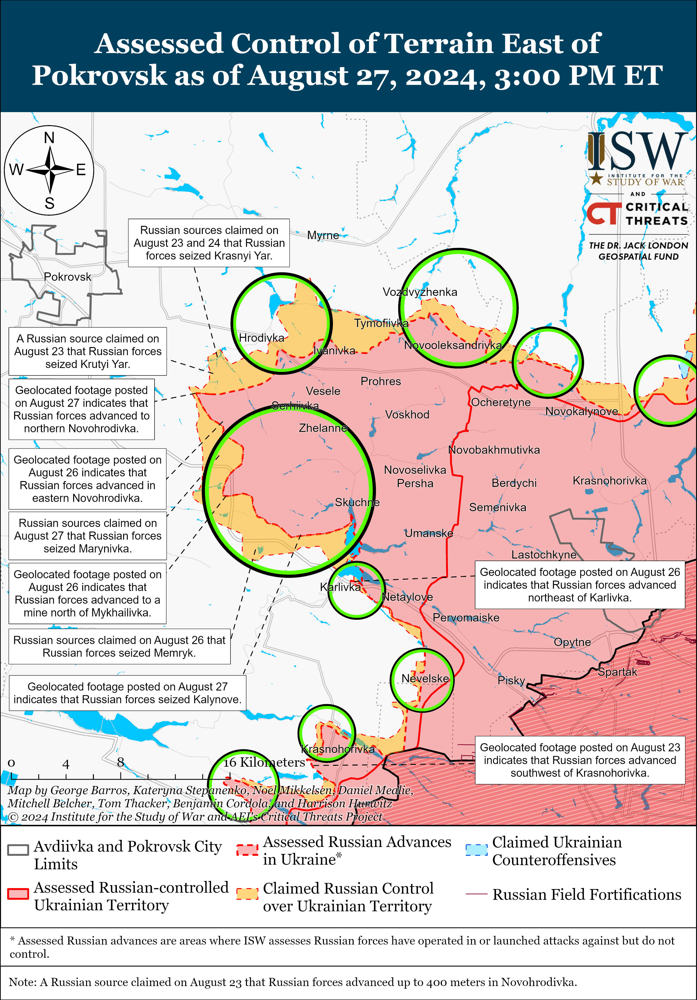
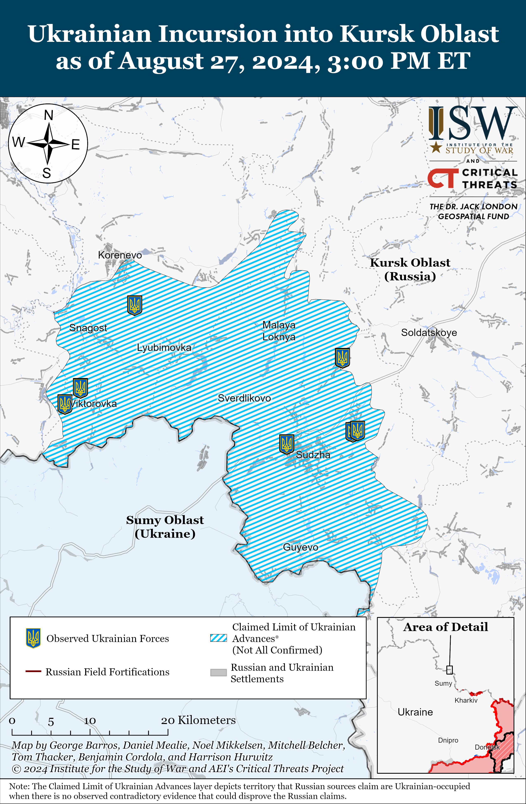
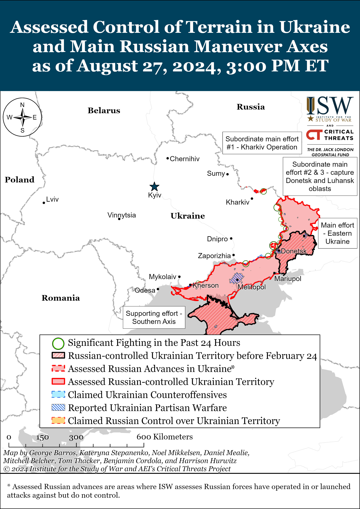
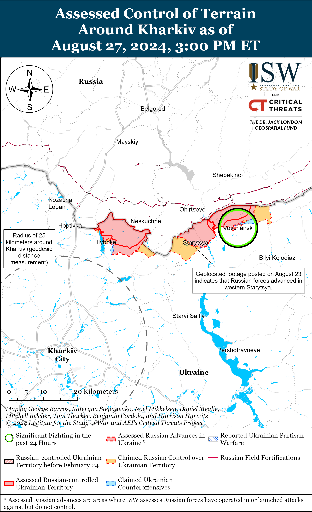
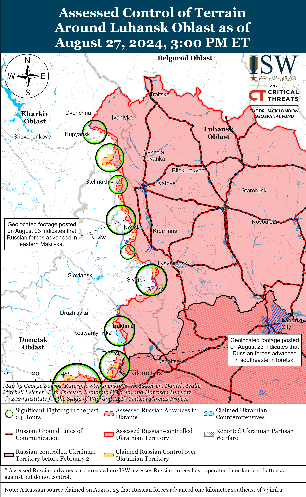
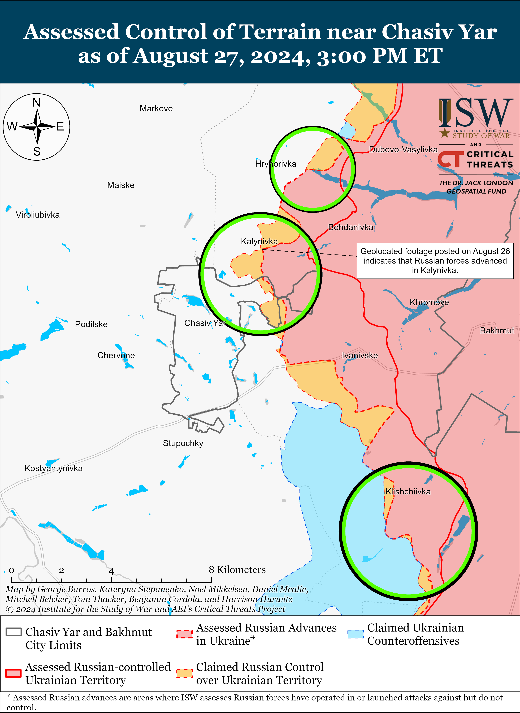
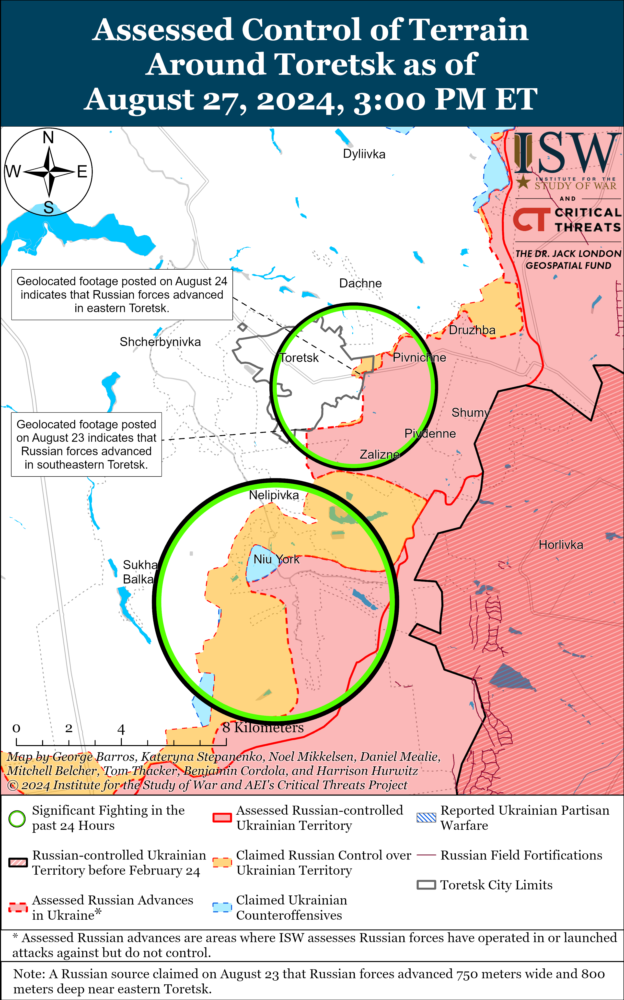
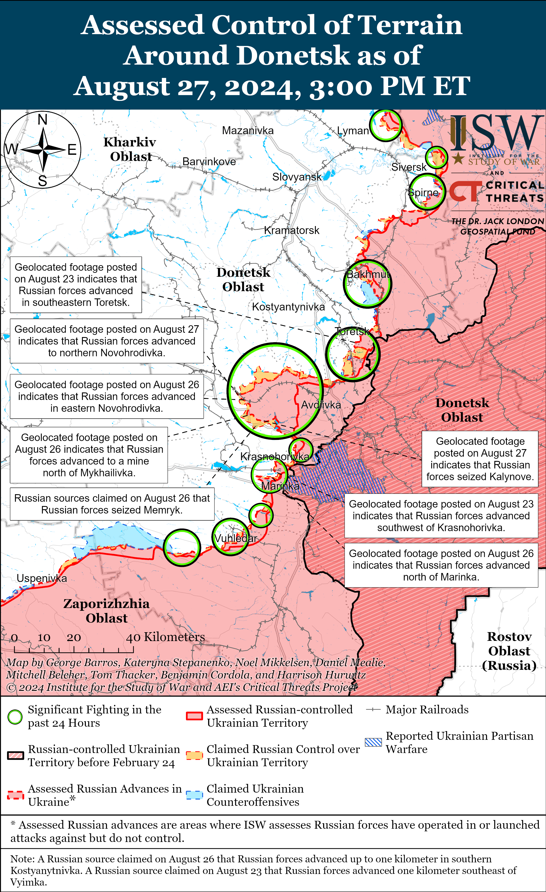
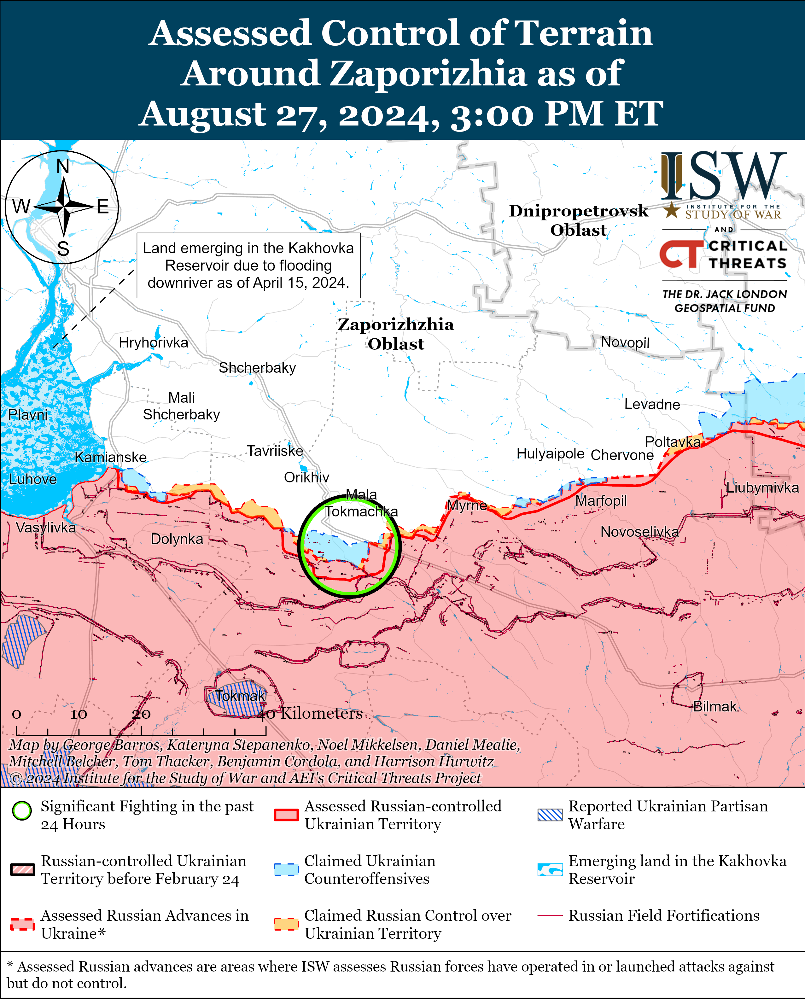
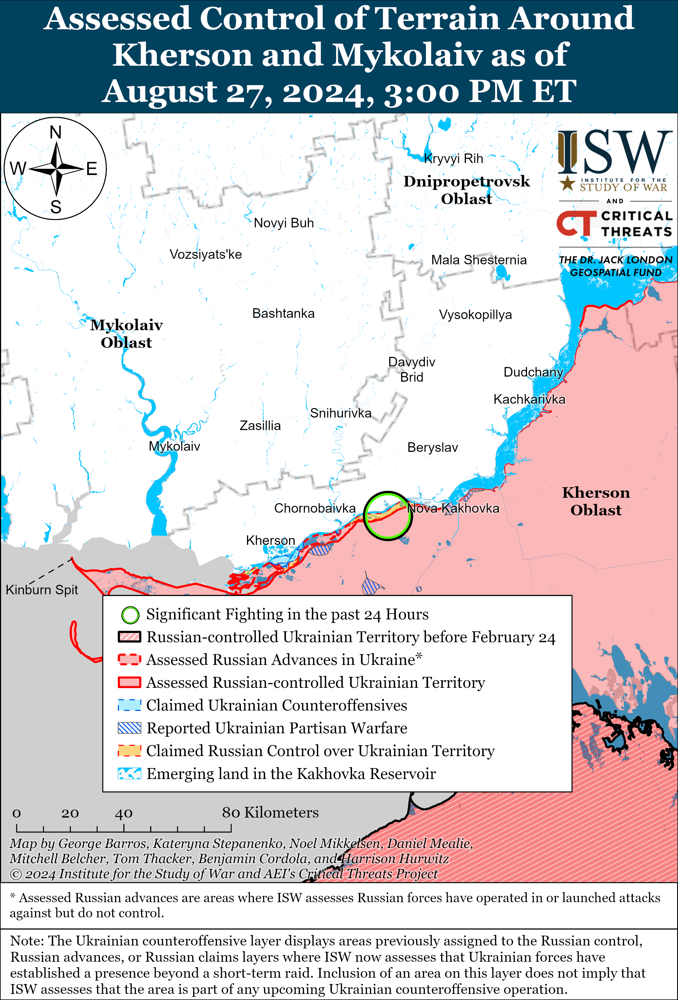

# Russian Offensive Campaign Assessment, August 27, 2024

**Karolina Hird, Nicole Wolkov, Angelica Evans, Davit Gasparyan, and George Barros**

**August 27, 2024, 8:45pm ET**

**Click** [**here**](https://storymaps.arcgis.com/stories/36a7f6a6f5a9448496de641cf64bd375) **to see ISW’s interactive map of the Russian invasion of Ukraine. This map is updated daily alongside the static maps present in this report.**

**Click** [**here**](https://storymaps.arcgis.com/stories/83a2f24901c941d581c0c523ecd2619b) **to see ISW’s interactive map of Ukraine’s offensive in Kursk Oblast.**

**Click** [**here**](https://understandingwar.maps.arcgis.com/apps/instant/3dviewer/index.html?appid=1602762dbcde419bb957dea358449580) **to see ISW’s 3D control of terrain topographic map of Ukraine. Use of a computer (not a mobile device) is strongly recommended for using this data-heavy tool.**

**Click** [**here**](https://storymaps.arcgis.com/stories/733fe90805894bfc8562d90b106aa895) **to access ISW’s archive of interactive time-lapse maps of the Russian invasion of Ukraine. These maps complement the static control-of-terrain map that ISW produces daily by showing a dynamic frontline. ISW will update this time-lapse map archive monthly.**

**Note: The data cut-off for this product was 12:00pm ET on August 27. ISW will cover subsequent reports in the August 28 Russian Offensive Campaign Assessment.**

**Russian forces have made significant tactical advances in the Pokrovsk direction amid reports that Ukrainian forces have withdrawn from select areas southeast of Pokrovsk.**Geolocated footage published on August 27 confirms that Russian forces have advanced over two kilometers from their last confirmed position into northwestern Novohrodivka (southeast of Pokrovsk) along Dubinina Street, suggesting that Russian forces additionally hold positions within the central part of the town.[1] A Ukrainian soldier reported in a now-deleted Telegram post that Ukrainian forces withdrew from Novohrodivka, which Russian state media and several Russian milbloggers amplified and used to claim that Russian forces control the majority of the settlement.[2] Additional geolocated footage published on August 27 indicates that Russian forces have marginally advanced in southeastern Hrodivka (east of Pokrovsk and northeast of Novohrodivka) and have seized Kalynove (further southeast of Pokrovsk and southeast of Novohrodivka).[3] Russian milbloggers also claimed that Ukrainian forces “lost” Marynivka (directly south of Novohrodivka) and that elements of the 228th Motorized Rifle Regiment (90th Tank Division, 41st Combined Arms Army [CAA], Central Military District [CMD]) seized Memryk (southeast of Novohrodivka), although ISW has not yet observed visual evidence of Russian forces operating in these settlements.[4] Some Russian sources also claimed that Russian forces advanced into southern Mykhailivka (south of Novohrodivka) and are attacking into northeastern Selydove (southwest of Novohrodivka).[5]

 

The recent rate of Russian advance in the Pokrovsk direction has been relatively rapid, and Russian forces have advanced through most of Novohrodivka in a matter of days. Russian forces appear to be prioritizing advancing along the railway line in Novohrodivka toward Pokrovsk instead of fighting through the entire urban area of the settlement. The comparatively rapid Russian advance into Novohrodivka over the past 24 hours is likely in part enabled by apparent Ukrainian withdrawals from Novohrodivka. Russian forces in theory could advance with relative ease through Novohrodivka despite its relative urban build-up if there are no Ukrainian defenders receiving their advances. ISW previously assessed that it would take Russian forces longer to seize Novohrodivka, but that assessment has been proven as incorrect and was premised on Ukrainian forces maintaining a positional defense within the urbanized areas of Novohrodivka—which does not appear to currently be the case.[6] Urbanized areas without sufficient defending forces are not inherent battlefield obstacles, and the Ukrainian command likely deemed that defending Novohrodivka was not worth the potential losses. Novohrodivka is not an operationally significant town in isolation—its potential capture would in theory open the road to Pokrovsk (Russia’s articulated operational objective on this sector of the front), but Pokrovsk is larger, more fortified, and ultimately more significant than Novohrodivka due to its central position as a key logistics node in western Donetsk Oblast, and Ukrainian forces are unlikely to withdraw from Pokrovsk without defending the city.[7] The Russian military command will likely be forced to expend significant manpower and materiel in order to seize the more defendable and significant town of Pokrovsk if the Ukrainian military command chooses to reinforce this direction. Advancing Russian forces are therefore unlikely to be able to sustain the current rate of gains indefinitely, especially if they begin assaults on Pokrovsk itself.

**Russia’s most combat-capable troops are currently sustaining Russian advances towards Pokrovsk, and Russia’s offensive operations are emblematic of the wider Russian theory of victory in Ukraine, premised on seemingly indefinite grinding tactical advances. Russia’s continuous and complete prioritization of the Pokrovsk direction will likely impact Russia’s overall combat capabilities in Ukraine in the aftermath of any Pokrovsk scenario, especially as the Kremlin tries to balance gains in Pokrovsk with defending against the Ukrainian incursion into Kursk Oblast.**Ukrainian Commander-in-Chief Colonel General Oleksandr Syrskyi stated during a press conference on August 27 that one of Ukraine’s main goals in launching the Kursk incursion was to divert Russian forces from critical areas of the front, and that Russia anticipated this goal and is instead concentrating its main efforts and strengthening its presence in the Pokrovsk direction.[8] Syrskyi also reported that Russia has redeployed over 30,000 troops from other unspecified sectors of the frontline in Ukraine to Kursk Oblast and forecasted that this number will continue to grow while noting that Russia is simultaneously intensifying its efforts in the Pokrovsk direction. Syrskyi’s observations cohere with ISW’s current assessment that the Russian military command continues to prioritize the Pokrovsk front over pushing Ukrainian forces from Kursk Oblast. ISW has previously noted that ISW has not observed evidence of Russia redeploying units currently engaged near Pokrovsk to Kursk Oblast but has observed evidence of Russia instead deploying reserve units and units from non-critical sectors of the front, which likely accounts for the bulk of the 30,000 troops redeployed to Kursk Oblast that Syrskyi noted.[9] Syrskyi’s statements suggest that the Russian military command remains unwilling to redeploy troops currently fighting near Pokrovsk and will continue to prioritize using these relatively more combat-capable troops to secure tactical gains and maintain the initiative in Donetsk Oblast. The apparent continued Russian prioritization of territorial gains near Pokrovsk is consistent with Russian President Vladimir Putin’s articulated theory of victory in Ukraine, which assumes that Russian forces maintain the initiative and pursue a constant grinding war of attrition to outlast Ukraine and Ukraine’s partners.

The Russian offensive effort around Pokrovsk will eventually culminate, although the timeline for which Russian forces will reach culmination remains unclear. ISW is not prepared to forecast an imminent culmination, especially as Russian forces escalate the rate of advances in this area and Ukrainian forces retreat to prepared defensive positions west of Hrodivka that in principle should be more advantageous to defend. The redeployment of 30,000 Russian troops to Kursk Oblast could eventually degrade Russian capabilities in the Ukrainian theater writ large, however, following the culmination of the Pokrovsk offensive. ISW has previously assessed that Ukraine’s operations in Kursk Oblast have already had theater-wide operational and strategic effects on Russian forces, and Ukraine’s incursion into Kursk Oblast has challenged Putin’s theory of victory by seizing the initiative in a new area of operations while degrading Russia’s ability to maintain the long-term initiative in certain sectors of the front within Ukraine.[10] The Russian command is clearly currently prioritizing Pokrovsk, but that calculus will likely change depending on when Russian forces culminate in the area, and the command will eventually need to fully reckon with reorienting its priorities to repelling Ukrainian troops from Kursk Oblast. Russian forces have notably advanced fewer than 10 km west of Bakhmut following Russia’s pyrrhic seizure of Bakhmut in May 2023 and Russian forces that expend themselves in the Pokrovsk direction may face similar exhaustion following their culmination. ISW maintains that it is too early to draw definitive conclusions on the long-term effects of the Kursk operation but offers an assessment of the implications of Syrskyi’s statements to provide an analysis of how and to what effect Russian battlefield priorities may impact their future offensive capacity.

**Ukrainian President Volodymyr Zelensky reported that Ukraine’s incursion into Kursk Oblast was in part an effort to preempt a Russian offensive operation into Sumy or Chernihiv oblasts and noted that the incursion is an aspect of Ukraine’s wider efforts to achieve a just and lasting diplomatic solution to the war based on the principles of international law and the inviolability of Ukraine’s territorial integrity.**Zelensky stated on August 27 that Ukraine’s incursion into Kursk Oblast stalled Russia’s ongoing offensive operations in northern Kharkiv Oblast and preempted an apparent Russian plan to conduct cross-border attacks into either Sumy or Chernihiv oblasts.[11] Zelensky stated that Ukrainian forces have defeated a large number of Russian troops during the incursion into Kursk Oblast. Zelensky added that Ukraine’s incursion into Kursk Oblast is one aspect of Ukraine’s plan to resolve the war and that Ukraine’s plan also includes aspects of “Ukraine’s strategic place in the global security architecture,” “powerful coercion” against Russia, and unspecific economic policies aimed at bringing Russia to the negotiating table. Zelensky stated that he will present Ukraine’s plan to US policymakers in September 2024. Pentagon Spokesperson Major General Patrick Ryder reiterated US support for the Ukrainian incursion into Kursk Oblast during a press conference on August 26 and noted that Ukraine has the right to conduct its own operations and hold its own calculus regarding the incursion.[12]

**Ukrainian forces reportedly attempted to advance into two areas of Belgorod Oblast on August 27 amid continued Ukrainian offensive operations in Kursk Oblast.**Belgorod Oblast Governor Vyacheslav Gladkov claimed on August 27 that Russian authorities restricted access to Vyazovoye (less than two kilometers from the Sumy Oblast border and northwest of Grayvoron) due to an unspecified “difficult operational situation” in the area and later claimed that Ukrainian forces attempted to cross the international border into Belgorod Oblast.[13] Russian sources claimed that Russian forces also repelled several Ukrainian attacks near Nekhoteevka and Zhuravlyovka (both southeast of Grayvoron and south of Belgorod City), although Russian sources issued competing claims about the size of these attacks.[14] Select Russian sources claimed that Ukrainian forces also attacked near the Shebekino border checkpoint (south of Belgorod City), which is currently behind ISW’s assessed Russian forward line of owned troops (FLOT) in northern Kharkiv Oblast.[15] Geolocated footage published on August 26 and 27 indicates that Ukrainian forces continue to operate immediately southeast of Korenevo and near Viktorovka (south of Koreveno); near Sudzha; and north of Sudzha within Cherkasskoye Porechnoye and Mikhailovka.[16] Russian sources claimed that Russian forces re-took Nizhnyaya Parovaya and Nechayev (both northeast of Sudzha) in Bolshesoldatsky Raion, suggesting that Ukrainian forces were recently operating in the area.[17] Russian sources claimed that Russian forces, possibly elements of the 1009th Motorized Rifle Regiment (a mobilized unit reportedly subordinated to the 6th Combined Arms Army [CAA], Leningrad Military District [LMD]), repelled several Ukrainian attacks near Malaya Loknya (northwest of Sudzha) and are preparing defensive positions near a penal colony in the settlement.[18]

**Russian officials attempted to use International Atomic Energy Agency (IAEA) Director General Rafael Mariano Grossi’s visit to the Kursk Nuclear Power Plant (KNPP) to falsely portray Ukraine as threatening a radiological incident, likely to undermine Western support for Ukraine by stoking unfounded fears about Ukraine’s incursion into Kursk Oblast.**Grossi stated on X (formerly Twitter) on August 27 that the situation at the KNPP is “serious” and that “attacking any NPP is unacceptable, no matter the location.”[19] Grossi reportedly stated that the KNPP is particularly vulnerable because its reactor has no containment vessel and is located in an “ordinary building,” leaving it vulnerable to shelling or drone strikes.[20] Russian government-affiliated news outlets claimed that Grossi stated that he saw evidence of “nearby” combat operations including drones and drone debris.[21] Russian State Atomic Energy Corporation Rosatom CEO Alexei Likhachev claimed that Russian authorities presented evidence of Ukrainian strikes against the KNPP and claimed that “there can be no ambiguity about who conducted these strikes.”[22] Kremlin newswire *TASS* also purposefully misrepresented Grossi’s previous statement about his plans to visit the KNPP, claiming that Grossi stated that Ukrainian forces’ actions endangered the KNPP.[23] The IAEA acknowledged that Russia informed the IAEA that it found drone debris at the KNPP, but the IAEA did not provide any assessments from where the drone came or verifications of Russia’s claim.[24] ISW previously noted that Ukrainian forces have consistently demonstrated capabilities to conduct rear area strikes within Russia and occupied Ukraine at distances exceeding the roughly 60 kilometers between the KNPP and the international border or the roughly 30-40 kilometers from the current Ukrainian FLOT within Kursk Oblast, suggesting that the Ukrainian military command has deliberatively avoided striking the KNPP.[25]

The Kremlin routinely attempts to portray Ukraine as endangering the Russian-occupied Zaporizhzhia Nuclear Power Plant (ZNPP) and extended this information operation to the KNPP shortly after Ukraine’s incursion into Kursk Oblast.[26] Russian government-affiliated media has also purposefully misrepresented IAEA statements to cohere with Russian information operations aimed at portraying Ukraine as threatening the ZNPP and legitimizing Russia’s occupation of the ZNPP.[27] The Kremlin likely also attempting to obfuscate its own routine endangerment of the Russian-occupied ZNPP – through its routine militarization of the ZNPP – by drawing focus onto Ukraine’s alleged endangerment of the KNPP. Russian forces fired at the ZNPP during their seizure of the ZNPP in March 2022 and have since stored and operated military equipment within the territory of the plant.[28]

**Indian Prime Minister Narendra Modi emphasized India’s commitment to ending the war in Ukraine to Russian President Vladimir Putin following Modi’s recent visit to Ukraine.**In a call with Putin on August 27, Modi informed Putin about his visit to Ukraine on August 23 and emphasized India’s commitment to supporting a swift, abiding, and peaceful solution to the war.[29] The Kremlin’s readout reported that Putin provided Modi with a detailed assessment of the West’s and Ukrainian authorities’ “destructive” actions while outlining Russia’s approaches to the solution to the war.[30] The Indian government readouts did not emphasize Putin’s accusations against the West and Ukraine, instead using neutral language focusing on bilateral relations. The two leaders also discussed the enhancement of economic ties and cooperation within the BRICS framework.[31] ISW previously reported on the importance of Modi’s visit to Ukraine and highlighted Modi’s emphasis on principles of international law in discussions of peace with Ukrainian President Volodymyr Zelensky, and assessed that enhanced Ukraine-India bilateral relations could indicate an inflection point in Indian foreign policy that has traditionally featured close relations with Russia.[32] Putin was likely hoping to further court Modi following Modi’s visit to Russia in early July, and Modi’s visit and positive impressions of Ukraine may be challenging Putin’s perception of Indian-Russian relations.

**Ukrainian President Volodymyr Zelensky confirmed on August 27 that Ukrainian forces used F-16 fighter jets to down missiles during Russia’s most recent massive drone and missile strike against Ukraine.[33]**Zelensky previously noted that Ukraine intended to use F-16s are part of a combined air defense and fighter aircraft system to protect Ukrainian positions and cities from Russian air, drone, and missile strikes.[34]

**Key Takeaways:**

- **Russian forces have made significant tactical advances in the Pokrovsk direction amid reports that Ukrainian forces have withdrawn from select areas southeast of Pokrovsk.**
- **Russia’s most combat-capable troops are currently sustaining Russian advances towards Pokrovsk, and Russia’s offensive operations are emblematic of the wider Russian theory of victory in Ukraine, premised on seemingly indefinite grinding tactical advances. Russia’s continuous and complete prioritization of the Pokrovsk direction will likely impact Russia’s overall combat capabilities in Ukraine in the aftermath of any Pokrovsk scenario, especially as the Kremlin tries to balance gains in Pokrovsk with defending against the Ukrainian incursion into Kursk Oblast.**
- **Ukrainian President Volodymyr Zelensky reported that Ukraine’s incursion into Kursk Oblast was in part an effort to preempt a Russian offensive operation into Sumy or Chernihiv oblasts and noted that the incursion is an aspect of Ukraine’s wider efforts to achieve a just and lasting diplomatic solution to the war based on the principles of international law and the inviolability of Ukraine’s territorial integrity.**
- **Ukrainian forces reportedly attempted to advance into two areas of Belgorod Oblast on August 27 amid continued Ukrainian offensive operations in Kursk Oblast.**
- **Russian officials attempted to use International Atomic Energy Agency (IAEA) Director General Rafael Mariano Grossi’s visit to the Kursk Nuclear Power Plant (KNPP) to falsely portray Ukraine as threatening a radiological incident, likely to undermine Western support for Ukraine by stoking unfounded fears about Ukraine’s incursion into Kursk Oblast.**
- **Indian Prime Minister Narendra Modi emphasized India’s commitment to ending the war in Ukraine to Russian President Vladimir Putin following Modi’s recent visit to Ukraine.**
- **Ukrainian forces recently advanced near Kreminna and Russian forces recently advanced near Toretsk, Pokrovsk, and Donetsk City.**
- **The Ukrainian incursion into Kursk Oblast has reportedly heightened willingness among Russian citizens to sign military service contracts with the Russian Ministry of Defense (MoD).**

[******](https://understandingwar.org/wp-content/uploads/2025/05/DraftUkraineCoT20August20272C202024.png) 

***We do not report in detail on Russian war crimes because these activities are well-covered in Western media and do not directly affect the military operations we are assessing and forecasting. We will continue to evaluate and report on the effects of these criminal activities on the Ukrainian military and the Ukrainian population and specifically on combat in Ukrainian urban areas. We utterly condemn Russian violations of the laws of armed conflict and the Geneva Conventions and crimes against humanity even though we do not describe them in these reports.***

- Russian Main Effort – Eastern Ukraine (comprised of three subordinate main efforts)
- Russian Subordinate Main Effort #1 – Push Ukrainian forces back from the international border with Belgorod Oblast and approach to within tube artillery range of Kharkiv City
- Russian Subordinate Main Effort #2 – Capture the remainder of Luhansk Oblast and push westward into eastern Kharkiv Oblast and encircle northern Donetsk Oblast
- Russian Subordinate Main Effort #3 – Capture the entirety of Donetsk Oblast
- Russian Supporting Effort – Southern Axis
- Russian Air, Missile, and Drone Campaign
- Russian Mobilization and Force Generation Efforts
- Russian Technological Adaptations
- Activities in Russian-occupied areas
- Ukrainian Defense Industrial Base Efforts
- Russian Information Operations and Narratives
- Significant Activity in Belarus

**Russian Main Effort – Eastern Ukraine**

**Russian Subordinate Main Effort #1 – Kharkiv Oblast (Russian objective: Push Ukrainian forces back from the international border with Belgorod Oblast and approach to within tube artillery range of Kharkiv City)**

Russian forces continued offensive operations in northern Kharkiv Oblast on August 27 but did not make any confirmed advances. Fighting continued north of Kharkiv City near Hlyboke and northeast of Kharkiv City near Vovchansk on August 26 and 27.[35] The Ukrainian Kharkiv Group of Forces reported that Russian forces are using drones to remotely mine the area near Hlyboke, are conducting rotations and logistical support measures near Starytsya (southwest of Vovchansk) and Ohirtseve (west of Vovchansk), and are restaffing assault groups of the 128th Motorized Rifle Brigade (44th Army Corps [AC], Leningrad Military District [LMD]) and 4th Volunteer Reconnaissance and Assault Brigade (6th Combined Arms Army [CAA], LMD) in Vovchansk.[36]

[****](https://understandingwar.org/wp-content/uploads/2025/05/Kharkiv20Battle20Map20Draft20August20272C202024.png) 

**Russian Subordinate Main Effort #2 – Luhansk Oblast (Russian objective: Capture the remainder of Luhansk Oblast and push westward into eastern Kharkiv Oblast and northern Donetsk Oblast)**

Ukrainian forces recently regained lost positions southwest of Kreminna amid continued Russian offensive operations along the Kupyansk-Svatove-Kreminna line on August 27. Geolocated footage published on August 21 indicates that Ukrainian forces have marginally advanced in the Serebryanske forest area southwest of Kreminna.[37] The Ukrainian General Staff reported continued fighting northeast of Kupyansk near Synkivka; southeast of Kupyansk near Stepova Novoselivka, Kolisnykivka, Hlushkivka, and Novoosynove; west of Svatove near Andriivka and Stelmakhivka; and northwest of Kreminna near Druzhelyubivka, Makiivka, Hrekivka, Nevske, and Novosadove; and west of Kreminna near Torske.[38]

 

**Russian Subordinate Main Effort #3 – Donetsk Oblast (Russian objective: Capture the entirety of Donetsk Oblast, the claimed territory of Russia’s proxies in Donbas)**

Russian forces continued offensive operations in the Siversk direction on August 26 and 27, but there were no confirmed changes to the frontline. Russian forces continued offensive operations east of Siversk near Vekhnokamyanske and southeast of Siversk near Vyimka and Spirne.[39]

Russian forces continued offensive operations near Chasiv Yar itself, north of Chasiv Yar near Hryhorivka, and southeast of Chasiv Yar near Andriivka and Klishchiivka on August 26 and 27, but there were no confirmed changes to the frontline.[40] Elements of the Russian Sever-V Brigade (Russian Volunteer Corps) reportedly continue to operate near Hryhorivka.[41]

 

Russian forces recently marginally advanced in the Toretsk direction amid continued offensive operations in the area on August 27. Geolocated footage published on August 26 and 27 indicates that Russian forces recently marginally advanced in forest areas on the western outskirts of Pivnichne (east of Toretsk) and on the southeastern outskirts of Toretsk.[42] Russian forces continued offensive operations south of Toretsk near Niu York and Panteleymonivka on August 26 and 27.[43]

[****](https://understandingwar.org/wp-content/uploads/2025/05/Toretsk20Battle20Map20Draft20August20272C202024.png) 

See topline text for updates on the Pokrovsk direction.

Russian forces reportedly recently conducted a mechanized assault west of Donetsk City amid continued assaults in the area on August 27. A Ukrainian brigade operating in the area published footage on August 26 showing Ukrainian forces repelling a platoon-sized Russian mechanized assault in an unspecified area of the Kurakhove (west of Donetsk City) direction and stated that Russian forces are conducting daily attacks in the area.[44] Russian forces continued ground attacks west of Donetsk City near Krasnohorivka, Hostre, and Heorhiivka on August 26 and 27.[45]

Russian forces recently marginally advanced southwest of Donetsk City amid continued fighting in the area on August 27. Geolocated footage published on August 26 and 27 indicates that Russian forces marginally advanced during an infantry assault along Berehova Street in central Kostyantynivka and marginally advanced further southeast of Vodyane (both southwest of Donetsk City) along the O-0532 (T-0524) Vuhledar-Kostyantynivka highway.[46] Geolocated footage published on August 24 indicated that Russian forces previously seized a larger section of the highway in this area.[47] Russian forces continued ground attacks near Vuhledar (southwest of Donetsk City) on August 26 and 27.[48]

 

The Ukrainian General Staff reported that Russian forces conducted armored assaults near Prechystivka (southeast of Velyka Novosilka) on August 26 and 27 in the Donetsk-Zaporizhia Oblast border area, but there were no confirmed changes to the frontline in the area.[49]

**Russian Supporting Effort – Southern Axis (Russian objective: Maintain frontline positions and secure rear areas against Ukrainian strikes)**

Russian forces continued offensive operations in western Zaporizhia Oblast on August 27, but there were no confirmed changes to the frontline in the area. The Ukrainian General Staff reported that Russian forces attacked in Robotyne and northeast of Robotyne near Mala Tokmachka on August 27.[50] Artillery crews of the Russian ”Dnepr” Grouping of Forces are reportedly operating in the Orikhiv direction.[51]

 

The Ukrainian General Staff reported that Ukrainian forces repelled Russian attacks in the Dnipro direction (Kherson Oblast), including on the Dnipro River Delta islands, on August 26 and 27.[52] The Russian MoD claimed that elements of an unspecified Russian Airborne (VDV) unit repelled a Ukrainian landing attempt on the Kinburn Spit, Mykolaiv Oblast.[53] Elements of the Russian ”Dnepr“ Grouping of Forces are reportedly operating in the Kakhovka direction (in east [left] bank Kherson Oblast).[54]

 

**Russian Air, Missile, and Drone Campaign (Russian Objective: Target Ukrainian military and civilian infrastructure in the rear and on the frontline)**

Russian forces conducted a large series of missile and drone strikes against Ukraine on the night of August 26 to 27. Ukrainian Air Force Commander Lieutenant General Mykola Oleshchuk reported that Russian forces launched three Kh-47 “Kinzhal” aeroballistic missiles from aircraft over Lipetsk Oblast, an Iskander-M ballistic missile from occupied Crimea, an Iskander-K cruise missile from Voronezh Oblast, five Kh-101 cruise missiles from aircraft over Volgograd Oblast, and 81 Shahed-136/131 drones from Yeysk, Krasnodar Krai and Kursk Oblast.[55] Oleshchuk reported that Ukrainian forces shot down all five Kh-101 missiles and 60 Shahed drones over Kyiv, Khmelnytskyi, Rivne, Vinnytsia, Cherkasy, Kherson, Mykolaiv, Zaporizhia, Kharkiv, Dnipropetrovsk, Poltava, Zhytomyr, Sumy, Chernihiv and Kirovohrad oblasts. Oleshchuk additionally stated that 10 Shahed drones likely crashed in unspecified areas of Ukraine, one drone crossed the border into Belarusian airspace, and the remaining 10 drones were still operating in Ukrainian airspace at the time of his reporting. Ukrainian officials reported that Shahed drones damaged civilian infrastructure and killed and wounded civilians in Kyiv City, Kryvyi Rih, and Zaporizhzhia City.[56]

The Russian MoD posted footage on August 27 purportedly showing Russian forces conducting an Iskander-M strike against Ukrainian forces in Stepanivka, Sumy Oblast.[57] ISW has not observed visual confirmation of this claim.

Ukrainian Navy Spokesperson Captain Third Rank Dmytro Pletenchuk stated that Ukrainian forces downed all of the Kalibr cruise missiles that Russia launched against Ukraine during one of Russia’s largest combined strikes on the night of August 25 to 26.[58] Pletenchuk stated that Russian forces only launch sea-based Kalibr missiles during combined strikes in order to overwhelm the Ukrainian air defense umbrella. Pletenchuk stated that the Russian military currently has four submarines and five surface vessels that carry Kalibr missiles in the Black Sea and Sea of Azov.

**Russian Mobilization and Force Generation Efforts (Russian objective: Expand combat power without conducting general mobilization)**

The Ukrainian incursion into Kursk Oblast has reportedly heightened willingness among Russian citizens to sign military service contracts with the Russian MoD. The Russian Southern Military District (SMD) press service claimed on August 27 that the number of people willing to sign military service contracts in Rostov Oblast increased by 20 percent following the Ukrainian incursion and recent salary increases for contract servicemembers from Rostov Oblast.[59] The SMD press service insinuated that Ukraine’s recent law banning the Ukrainian Orthodox Church Moscow Patriarchate (UOC MP) is another motivating factor for prospective volunteers. Russian Major Igor Minyukov, deputy head of a military service selection point in Rostov-on-Don, estimated that between 30 and 35 people applied for military service contracts (likely meaning per day) in the last month and that recently this number has increased to roughly 50 people per day. Russian opposition outlet *Verstka,* citing evidence obtained from the Moscow Mayor’s office,reported on August 27 that the number of people willing to sign military service contracts in Moscow City doubled in recent weeks after the Ukrainian incursion into Kursk Oblast — from 97 people per day on average to 213 people per day. *Verstka’s* source estimated that half of Moscow’s recent volunteers cited the Ukrainian incursion as their motivation to join the Russian Armed Forces.[60] *Verstka’s* source claimed that Muscovites who are more financially secure, and as a result less desperate for the financial incentives associated with military service, are also increasingly volunteering for military service following the Ukrainian incursion into Kursk Oblast.

Russian authorities are reportedly offering land in occupied Crimea to Russian citizens in exchange for military service. The Crimean occupation administration announced on August 27 that they would issue free land plots in occupied Crimea to Russian citizens who sign a military service contract with the Russian MoD regardless of the Russian citizen’s place of residence.[61] Such incentives were previously offered only to Russian citizens living in Crimea. [62]

The Russian MoD reported on August 27 that Lieutenant General Mikhail Nosulev fulfilled the role of acting Eastern Military District (EMD) Commander during an official visit to Mongolia.[63] The Kremlin reported in May 2024 that Lieutenant General Alexander Sanchik was acting EMD Commander, and the Russian MoD later reported in July 2024 that Sanchik is the Commander of the Russian Eastern Grouping of Forces in Ukraine, suggesting that Sanchik was reassigned from serving as acting EMD commander to the Eastern Grouping of Forces commander.[64]

Russian Prime Minister Mikhail Mishustin stated on August 27 that Russia should increase the domestic production of drones fivefold by 2030 in a meeting dedicated to new national projects.[65] Mishustin also emphasized the need to increase the share of Russian produced hi-tech goods and services by 50 percent.[66]

**Russian Technological Adaptations (Russian objective: Introduce technological innovations to optimize systems for use in Ukraine)**

Nothing significant to report.

**Ukrainian Defense Industrial Efforts (Ukrainian objective: Develop its defense industrial base to become more self-sufficient in cooperation with US, European, and international partners)**

*ISW is suspending publishing coverage of Ukrainian defense industrial efforts until further notice.*

**Activities in Russian-occupied areas (Russian objective: Consolidate administrative control of annexed areas; forcibly integrate Ukrainian citizens into Russian sociocultural, economic, military, and governance systems)**

*ISW is not publishing coverage of activities in Russian-occupied areas today.*

**Russian Information Operations and Narratives**

Russian officials continue to seize on the Ukrainian incursion into Kursk Oblast as part of a long-standing Kremlin information operation that falsely portrays Ukraine as unwilling to engage in legitimate, good-faith negotiations and places the onus for peace negotiations on Ukraine. Russian Foreign Intelligence Service (SVR) Director Sergei Naryshkin claimed that negotiations between Russia and Ukraine are impossible due to Ukraine’s incursion into Kursk Oblast.[67] Russian Foreign Minister Sergei Lavrov also attempted to portray Ukraine’s negotiating positions — which are based on and backed by international law — as ultimatums.[68] ISW continues to assess that the Kremlin is only interested in a negotiated settlement that results in complete Ukrainian capitulation and that any Russian statements to the contrary are intended to delude the West into making pre-emptive concessions on Ukraine’s sovereignty and territory integrity.[69]

Russian officials are re-surfacing a long-term Kremlin information operation aimed at discrediting the Ukrainian government and military by falsely accusing Ukraine of planning to use chemical weapons on the battlefield. Russian Chief of the Radiation, Chemical, and Biological Protection (CBRN) Forces Lieutenant General Igor Kirillov and the Russian MoD claimed on August 27 that Ukrainian forces are planning to use ammunition equipped with chemical agents against Russian forces in Ukraine.[70] Kirillov baselessly claimed that Ukraine is violating the Chemical Weapons Convention (CWC) and is trying to make and use a dirty bomb against Russian forces.[71] The Kremlin recently revived its “dirty bomb” narrative amid Ukraine’s incursion into Kursk Oblast in hopes of undermining Western support for Ukraine amid Russian battlefield setbacks in Kursk Oblast.[72]

People’s Republic of China (PRC) Special Representative for Eurasian Affairs Li Hui amplified a long-standing Russian information operation aimed at obfuscating blame for Russia’s full-scale invasion of Ukraine. Li claimed on August 27 that the PRC, Brazil, Indonesia, and South Africa assess that the defense industries in some unspecified countries are protracting the war in Ukraine.[73] Russian President Vladimir Putin sent a telegram to the 9th Eastern Economic Forum on August 27 in which he advocated for strengthening cooperation between the Asia-Pacific region and the Eurasian Economic Union (EAEU), Shanghai Cooperation Organization (SCO), and BRICS.[74] Russia is likely attempting to coerce Asian, African, and Latin American officials into making statements supporting Russia against Ukraine in an effort to portray Russia as garnering wide support from non-Western countries.

**Significant activity in Belarus (Russian efforts to increase its military presence in Belarus and further integrate Belarus into Russian-favorable frameworks and Wagner Group activity in Belarus)**

Ukraine’s State Border Service Spokesperson Andriy Demchenko reported on August 27 that Belarusian forces are likely building up near the Ukrainian border in order to stretch and divert Ukrainian forces, consistent with ISW’s August 26 assessment about the intentions of the reported Belarusian build-up.[75] Demchenko noted that Belarus conducted similar exercises for informational effect before, and that Belarus is likely doing this “under pressure from Russia.” Belarusian President Alexander Lukashenko stated on August 27 that unspecified actors are trying to turn Belarus away from Russia and towards Ukraine but that Belarus cannot pursue such policies—suggesting that Lukashenko is aware of the need to publicly posture continued alignment with Russia via rhetorical and military means and is likely conducting exercises on the border with Ukraine to appease the Kremlin without entirely conceding on Belarus’ sovereignty.[76] ISW continues to assess that it is extremely unlikely that Belarus will invade Ukraine or enter the war on Russia’s behalf.[77]

**Note: ISW does not receive any classified material from any source, uses only publicly available information, and draws extensively on Russian, Ukrainian, and Western reporting and social media as well as commercially available satellite imagery and other geospatial data as the basis for these reports. References to all sources used are provided in the endnotes of each update.**

---

[1] https://t.me/BRODIAHY\_UKR/227; https://t.me/creamy\_caprice/6555

[2] https://t.me/datsik5/258 (now deleted); https://t.me/RVvoenkor/75753; https://t.me/z\_arhiv/27813; https://t.me/dva\_majors/50820; https://t.me/smotri\_z/33979 ; https://t.me/sashakots/48637; https://t.me/boris\_rozhin/135110; https://t.me/voenkorKotenok/58573; https://t.me/notes\_veterans/19142; https://t.me/tass\_agency/268699 ; https://t.me/tass\_agency/268701

[3] https://t.me/RtrDonetsk/26664; https://t.me/creamy\_caprice/6550; https://t.me/RVvoenkor/75769

[4] https://t.me/z\_arhiv/27815; https://t.me/rusich\_army/16808; https://t.me/rusich\_army/16803; https://t.me/RVvoenkor/75735; https://t.me/boris\_rozhin/135132; https://t.me/boris\_rozhin/135112

[5] https://t.me/z\_arhiv/27813; https://t.me/z\_arhiv/27805; https://t.me/RVvoenkor/75735;

[6] https://understandingwar.org/backgrounder/russian-offensive-campaign-assessment-august-1-2024

[7] https://x.com/Tatarigami\_UA/status/1828490940450746723

[8] https://www.youtube.com/watch?v=B25lLFhM-kc; https://www.unian dot ua/war/rosiya-perekinula-na-kurskiy-napryamok-30-tisyach-viyskovosluzhbovciv-sirskiy-12739791.html; https://www.rbc dot ua/rus/news/zavdyaki-kurskiy-operatsiyi-zsu-rosiyani-1724755730.html; https://t.me/RBC\_ua\_news/108558; https://armyinform.com dot ua/2024/08/27/oleksandr-syrskyj-rosiya-perekynula-na-kurskyj-napryamok-30-tysyach-vijskovyh/

[9] https://understandingwar.org/backgrounder/russian-offensive-campaign-assessment-august-21-2024-0; https://understandingwar.org/backgrounder/assessing-significance-current-russian-and-ukrainian-operations-course-war; https://understandingwar.org/backgrounder/russian-offensive-campaign-assessment-august-15-2024

[10] https://understandingwar.org/backgrounder/assessing-significance-current-russian-and-ukrainian-operations-course-war

[11] https://suspilne dot media/822711-kurska-operacia-e-odnim-iz-punktiv-planu-peremogi-ukraini-zelenskij/ ; https://president.gov dot ua/news/kurska-operaciya-ye-odnim-iz-punktiv-planu-peremogi-ukrayini-92857; https://armyinform.com dot ua/2024/08/27/kurska-ofenzyva-ye-krokom-do-peremogy-ukrayiny-u-vijni-prezydent-ukrayiny/

[12] https://www.defense.gov/News/Transcripts/Transcript/Article/3885076/pentagon-press-secretary-air-force-maj-gen-pat-ryder-holds-an-off-camera-press/

[13] https://t.me/tass\_agency/268638 ; https://t.me/tass\_agency/268670 ; https://t.me/vvgladkov/9426

[14] https://t.me/belarusian\_silovik/40050 ; https://t.me/dva\_majors/50798 ; https://t.me/dva\_majors/50800 ; https://t.me/rusich\_army/16801 ; https://t.me/brussinf/7964 ; https://t.me/epoddubny/20863 ; https://t.me/notes\_veterans/19140 ; https://t.me/notes\_veterans/19141 ; https://t.me/Sladkov\_plus/11261 ; https://t.me/mash/57092

[15] https://t.me/milinfolive/129312 ; https://t.me/mash/57092

[16] https://t.me/warhistoryalconafter/181582; https://t.me/creamy\_caprice/6553 ; https://t.me/rustroyka1945/17844; https://t.me/creamy\_caprice/6542 ; https://x.com/Asia\_Intel/status/1828152522298523770; https://t.me/dva\_majors/50782 ; https://x.com/AudaxonX/status/1828481473990611171; https://t.me/VARVARGROUP/334 ; https://t.me/warriorofnorth/2345; https://x.com/moklasen/status/1828434186136355282;

[17] https://t.me/dva\_majors/50790 ; https://t.me/tass\_agency/268612 ; https://t.me/belarusian\_silovik/40079; https://t.me/boris\_rozhin/135158

[18] https://t.me/tass\_agency/268630 ; https://t.me/mod\_russia/42625 ; https://t.me/RVvoenkor/75718; https://t.me/RVvoenkor/75740; https://t.me/RVvoenkor/75743

[19] https://x.com/rafaelmgrossi/status/1828462199251063191

[20] https://meduza dot io/news/2024/08/27/zdes-voznikla-opasnost-yadernogo-intsidenta-glava-magate-posle-posescheniya-kurskoy-aes

[21] https://www.vedomosti dot ru/politics/articles/2024/08/27/1058320-chto-grossi-uvidel ; https://ria dot ru/20240827/grossi–1968826545.html

[22] https://t.me/tass\_agency/268804

[23] https://tass dot ru/mezhdunarodnaya-panorama/21696403%20

[24] https://www.iaea.org/newscenter/pressreleases/iaea-informed-of-drone-at-kursk-nuclear-power-plant-director-general-grossi-to-assess-site

[25] https://understandingwar.org/backgrounder/russian-offensive-campaign-assessment-august-15-2024; https://understandingwar.org/backgrounder/russian-offensive-campaign-assessment-july-27-2024; https://understandingwar.org/backgrounder/russian-offensive-campaign-assessment-july-14-2024; https://understandingwar.org/backgrounder/russian-offensive-campaign-assessment-july-16-2024; https://understandingwar.org/backgrounder/russian-offensive-campaign-assessment-may-19-2024; https://understandingwar.org/backgrounder/russian-offensive-campaign-assessment-may-31-2024; https://understandingwar.org/backgrounder/russian-offensive-campaign-assessment-april-5-2024; https://understandingwar.org/backgrounder/russian-offensive-campaign-assessment-march-9-2024;

[26] https://understandingwar.org/backgrounder/russian-offensive-campaign-assessment-august-17-2024

[27] https://understandingwar.org/backgrounder/russian-offensive-campaign-assessment-june-17-2024

[28] https://understandingwar.org/backgrounder/russian-offensive-campaign-assessment-august-17-2024

[29] https://x.com/narendramodi/status/1828360552181113041

[30] kremlin dot ru/events/president/news/74943 ; https://t.me/tass\_agency/268707 ; https://t.me/tass\_agency/268710 ; https://t.me/MID\_Russia/44492

[31] http://www.kremlin dot ru/events/president/news/74943

[32] https://understandingwar.org/backgrounder/russian-offensive-campaign-assessment-august-23-2024

[33] https://suspilne dot media/822149-masovana-ataka-po-ukraini-vidklucenna-svitla-grossi-ide-na-kursku-aes-916-den-vijni-onlajn/?anchor=live\_1724758141&utm\_source=copylink&utm\_medium=ps

[34] https://understandingwar.org/backgrounder/russian-offensive-campaign-assessment-april-6-2024 ; https://understandingwar.org/backgrounder/russian-offensive-campaign-assessment-april-19-2024

[35] https://www.facebook.com/GeneralStaff.ua/posts/pfbid02FzcpBo25yXT6fbfEpkyXtYw8gaa2m3oKEWjKRqACdUVwpLCxMf93f1zCNmPvnMzql ; https://www.facebook.com/GeneralStaff.ua/posts/pfbid02ZnYYJoWY8ukHJ6xvfidSWsatVa5aXsFqAWqkMVymS666jkXwuuXbG7nfejQKNDbzl ; https://www.facebook.com/GeneralStaff.ua/posts/pfbid02LDo4anQ8AS5KTQYCAB3VvZH98c6F6KQyXi4Ha76PwuCdAj9R7LYeydZLtJD2AfH7l ; https://t.me/wargonzo/21771 ; https://t.me/tass\_agency/268722

[36] https://t.me/otukharkiv/926

[37] https://t.me/AptiAlaudinovAKHMAT/5377; https://x.com/Ryan72101/status/1828181753766232106

[38] https://www.facebook.com/GeneralStaff.ua/posts/pfbid02FzcpBo25yXT6fbfEpkyXtYw8gaa2m3oKEWjKRqACdUVwpLCxMf93f1zCNmPvnMzql; https://www.facebook.com/GeneralStaff.ua/posts/pfbid02ZnYYJoWY8ukHJ6xvfidSWsatVa5aXsFqAWqkMVymS666jkXwuuXbG7nfejQKNDbzl

[39] https://www.facebook.com/GeneralStaff.ua/posts/pfbid02FzcpBo25yXT6fbfEpkyXtYw8gaa2m3oKEWjKRqACdUVwpLCxMf93f1zCNmPvnMzql ; https://www.facebook.com/GeneralStaff.ua/posts/pfbid02ZnYYJoWY8ukHJ6xvfidSWsatVa5aXsFqAWqkMVymS666jkXwuuXbG7nfejQKNDbzl ; https://www.facebook.com/GeneralStaff.ua/posts/pfbid02LDo4anQ8AS5KTQYCAB3VvZH98c6F6KQyXi4Ha76PwuCdAj9R7LYeydZLtJD2AfH7l ; https://t.me/DnevnikDesantnika/14613

[40] https://www.facebook.com/GeneralStaff.ua/posts/pfbid02FzcpBo25yXT6fbfEpkyXtYw8gaa2m3oKEWjKRqACdUVwpLCxMf93f1zCNmPvnMzq ; https://www.facebook.com/GeneralStaff.ua/posts/pfbid02ZnYYJoWY8ukHJ6xvfidSWsatVa5aXsFqAWqkMVymS666jkXwuuXbG7nfejQKNDbzl ; https://t.me/DnevnikDesantnika/14619

[41] https://t.me/boris\_rozhin/135116

[42] https://t.me/skalabatalion/245; https://t.me/voron1OO/58; https://t.me/creamy\_caprice/6556

[43] https://www.facebook.com/GeneralStaff.ua/posts/pfbid02ZnYYJoWY8ukHJ6xvfidSWsatVa5aXsFqAWqkMVymS666jkXwuuXbG7nfejQKNDbzl ; https://www.facebook.com/GeneralStaff.ua/posts/pfbid02LDo4anQ8AS5KTQYCAB3VvZH98c6F6KQyXi4Ha76PwuCdAj9R7LYeydZLtJD2AfH7l ; https://www.facebook.com/GeneralStaff.ua/posts/pfbid02ZnYYJoWY8ukHJ6xvfidSWsatVa5aXsFqAWqkMVymS666jkXwuuXbG7nfejQKNDbzl ; https://www.facebook.com/GeneralStaff.ua/posts/pfbid02FzcpBo25yXT6fbfEpkyXtYw8gaa2m3oKEWjKRqACdUVwpLCxMf93f1zCNmPvnMzql

[44] https://t.me/odshbr79/311 ; https://t.me/ButusovPlus/13099

[45] https://www.facebook.com/GeneralStaff.ua/posts/pfbid02ZnYYJoWY8ukHJ6xvfidSWsatVa5aXsFqAWqkMVymS666jkXwuuXbG7nfejQKNDbzl ; https://www.facebook.com/GeneralStaff.ua/posts/pfbid02LDo4anQ8AS5KTQYCAB3VvZH98c6F6KQyXi4Ha76PwuCdAj9R7LYeydZLtJD2AfH7l

[46] https://t.me/odshbr79/312; https://t.me/creamy\_caprice/6557 ; https://t.me/ugledar2024/5; https://t.me/creamy\_caprice/6544; https://t.me/RVvoenkor/75757

[47] https://understandingwar.org/backgrounder/russian-offensive-campaign-assessment-august-25-2024

[48] https://www.facebook.com/GeneralStaff.ua/posts/pfbid02LDo4anQ8AS5KTQYCAB3VvZH98c6F6KQyXi4Ha76PwuCdAj9R7LYeydZLtJD2AfH7l ; https://www.facebook.com/GeneralStaff.ua/posts/pfbid02ZnYYJoWY8ukHJ6xvfidSWsatVa5aXsFqAWqkMVymS666jkXwuuXbG7nfejQKNDbzl

[49] https://www.facebook.com/GeneralStaff.ua/posts/pfbid02LDo4anQ8AS5KTQYCAB3VvZH98c6F6KQyXi4Ha76PwuCdAj9R7LYeydZLtJD2AfH7l ; https://www.facebook.com/GeneralStaff.ua/posts/pfbid02FzcpBo25yXT6fbfEpkyXtYw8gaa2m3oKEWjKRqACdUVwpLCxMf93f1zCNmPvnMzql ; https://www.facebook.com/GeneralStaff.ua/posts/pfbid02ZnYYJoWY8ukHJ6xvfidSWsatVa5aXsFqAWqkMVymS666jkXwuuXbG7nfejQKNDbzl

[50]https://www.facebook.com/GeneralStaff.ua/posts/pfbid02FzcpBo25yXT6fbfEpkyXtYw8gaa2m3oKEWjKRqACdUVwpLCxMf93f1zCNmPvnMzql

[51] https://t.me/NeoficialniyBeZsonoV/39106

[52]https://www.facebook.com/GeneralStaff.ua/posts/pfbid02FzcpBo25yXT6fbfEpkyXtYw8gaa2m3oKEWjKRqACdUVwpLCxMf93f1zCNmPvnMzql; https://www.facebook.com/GeneralStaff.ua/posts/pfbid02ZnYYJoWY8ukHJ6xvfidSWsatVa5aXsFqAWqkMVymS666jkXwuuXbG7nfejQKNDbzl; https://www.facebook.com/GeneralStaff.ua/posts/pfbid02LDo4anQ8AS5KTQYCAB3VvZH98c6F6KQyXi4Ha76PwuCdAj9R7LYeydZLtJD2AfH7l

[53] https://t.me/mod\_russia/42647

[54] https://t.me/mod\_russia/42644

[55] https://t.me/ComAFUA/403

[56] https://suspilne dot media/dnipro/822153-u-krivomu-rozi-prolunali-vibuhi-so-vidomo-3/; https://t.me/evgendoberman/4464; https://t.me/vilkul/7637; https://t.me/vilkul/7638 ; https://t.me/ivan\_fedorov\_zp/10805 ; https://t.me/ivan\_fedorov\_zp/10807 ; https://t.me/VA\_Kyiv/7613 ; https://t.me/VA\_Kyiv/7610

[57] https://t.me/mod\_russia/42643

[58] https://armyinform.com dot ua/2024/08/27/u-vms-zsu-poyasnyly-rol-rosijskyh-raket-z-chornogo-morya-pid-chas-kombinovanyh-udariv/

[59] https://tass dot ru/obschestvo/21695915

[60] https://t.me/svobodnieslova/5516 ; https://meduza dot io/news/2024/08/27/verstka-v-moskve-posle-nastupleniya-vsu-v-kurskoy-oblasti-v-dva-raza-chasche-stali-zaklyuchat-kontrakt-s-minoborony ; https://t.me/sotaproject/86021

[61] https://t.me/tass\_agency/268788

[62] https://t.me/luhanskaVTSA/20917

[63] https://t.me/mod\_russia/42646

[64] http://kremlin dot ru/supplement/6129 ; https://t.me/mod\_russia/41088

[65] https://tass.com/defense/1834769

[66] http://government.ru/en/news/52477/

[67] https://tass dot ru/politika/21697729

[68] https://t.me/tass\_agency/268728 ; https://t.me/tass\_agency/268731

[69] https://isw.pub/UkrWar081324 ; https://isw.pub/UkrWar072524 ; https://isw.pub/UkrWar072424 ; https://isw.pub/UkrWar071924

[70] https://t.me/tass\_agency/268640 ; https://t.me/tass\_agency/268641 ; https://t.me/tass\_agency/268642 ; https://t.me/tass\_agency/268643 ; https://t.me/tass\_live/6562 ; https://t.me/mod\_russia/42636 ; https://t.me/mod\_russia/42637 ; https://t.me/mod\_russia/42638

[71] https://t.me/mod\_russia/42639 ; https://t.me/mod\_russia/42640 ; https://t.me/mod\_russia/42641

[72] https://understandingwar.org/backgrounder/russian-offensive-campaign-assessment-august-17-2024 ; https://understandingwar.org/backgrounder/russian-offensive-campaign-assessment-october-24

[73] https://tass dot com/world/1834203 ; https://en.ypagency dot net/333582 ; https://ria dot ru/20240827/vpk-1968649400.html

[74] http://www.kremlin dot ru/events/president/letters/74940 ; https://t.me/tass\_agency/268689 ; https://t.me/MID\_Russia/44489

[75] https://armyinform.com dot ua/2024/08/27/navishho-bilorus-postijno-musuye-temu-kordonu-poyasnyly-v-dpsu/; https://isw.pub/UkrWar082624

[76] https://t.me/tass\_agency/268691 ; https://www.gazeta dot ru/politics/news/2024/08/27/23783599.shtml

[77] https://isw.pub/UkrWar082624
