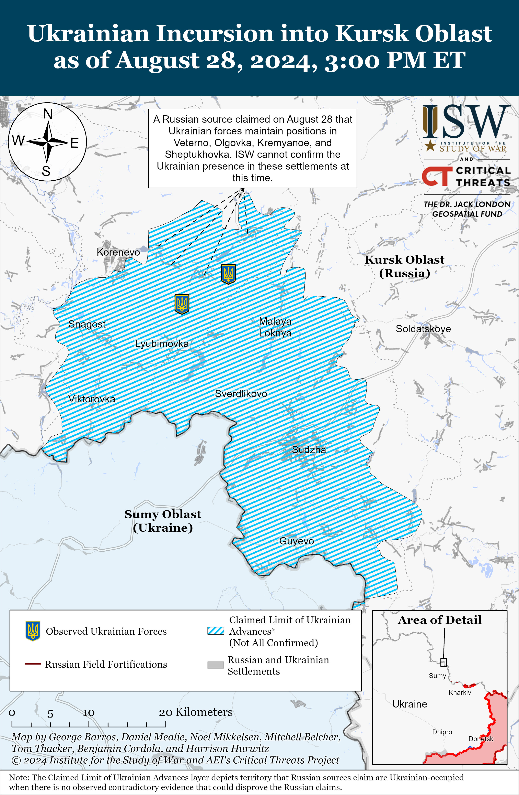
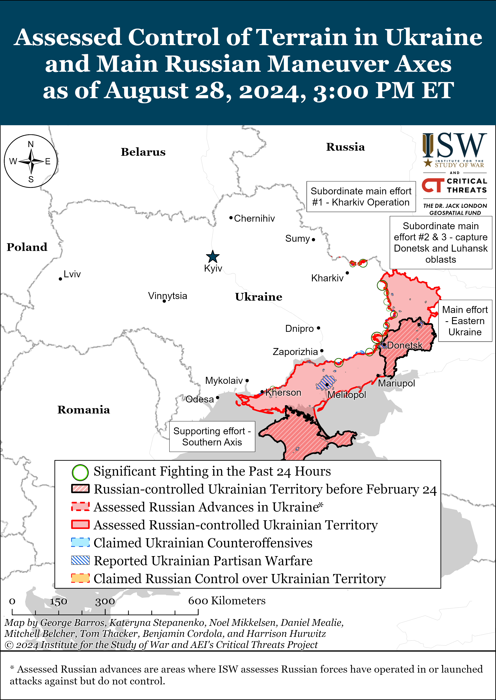
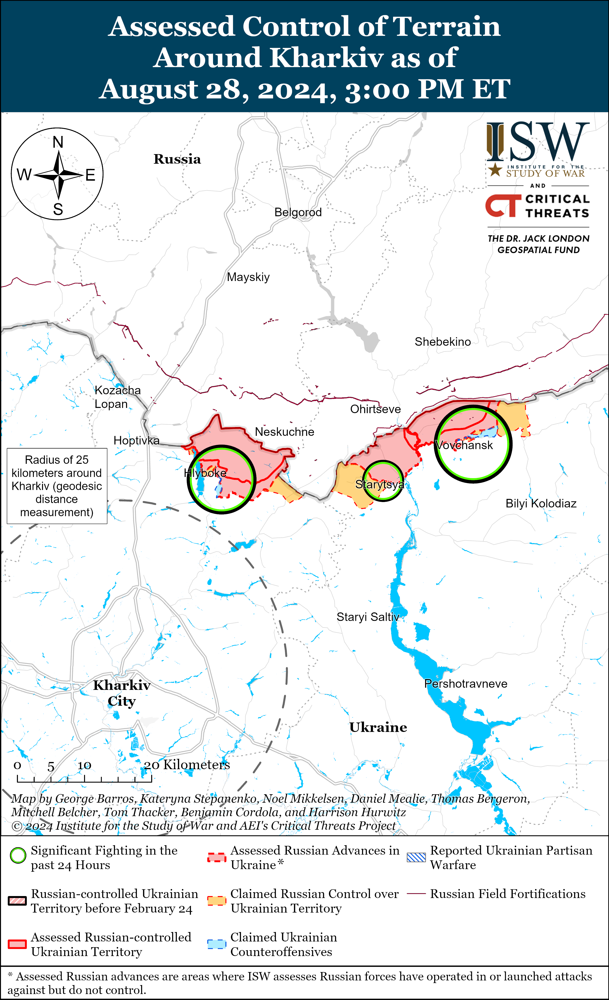
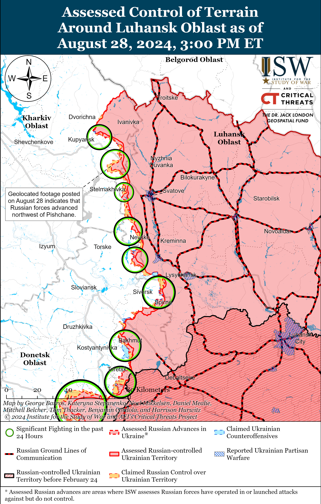
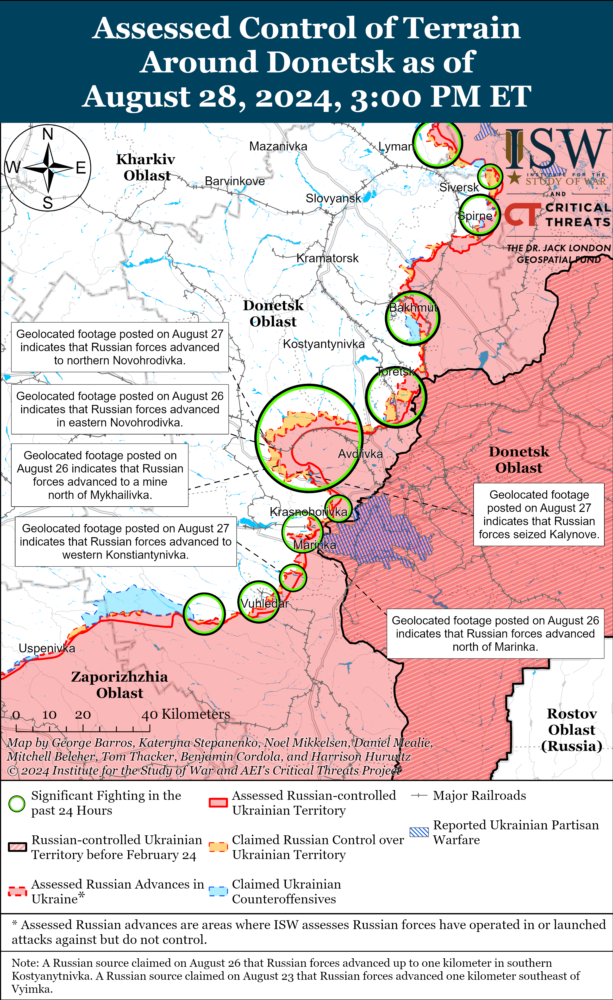
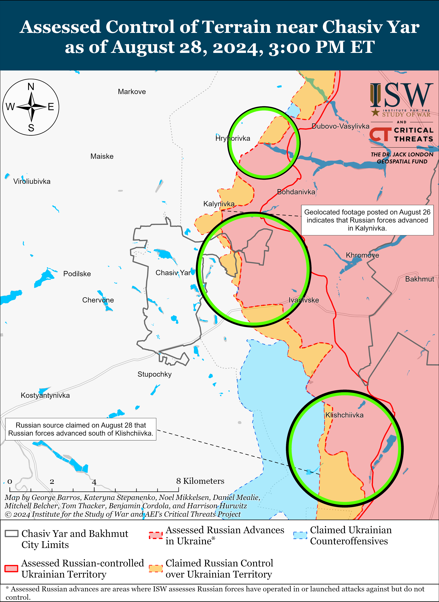
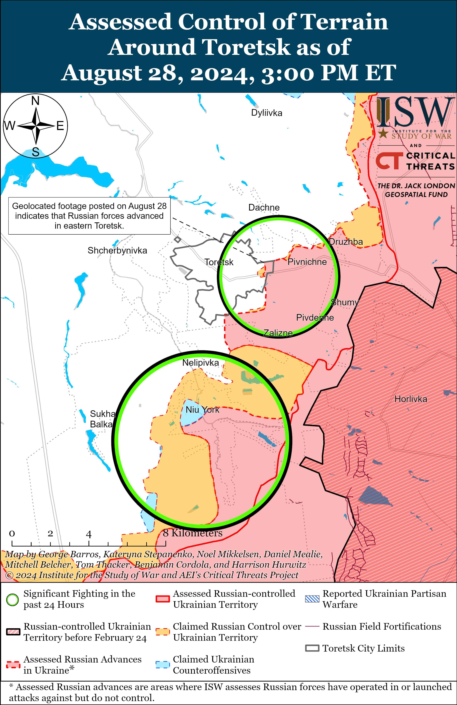
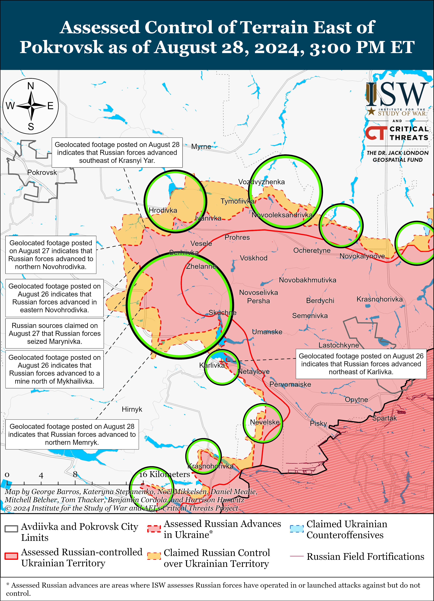
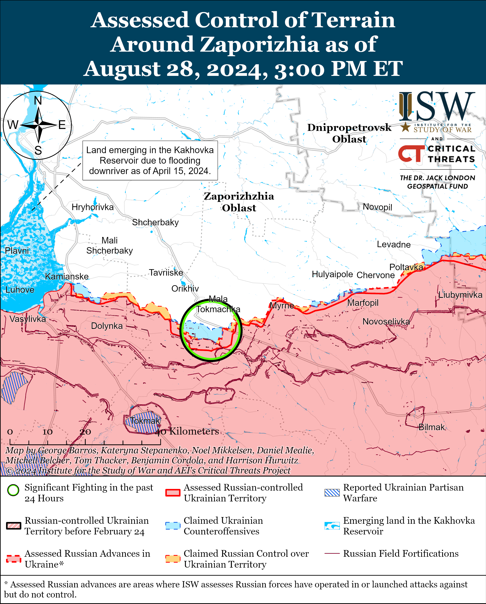
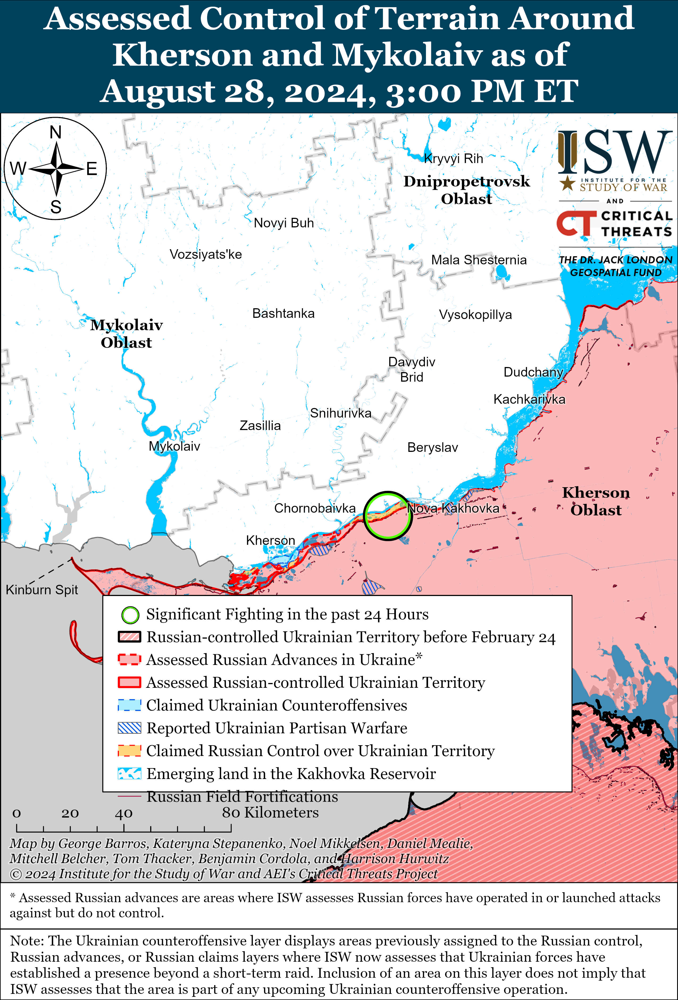

# Russian Offensive Campaign Assessment, August 28, 2024

**Christina Harward, Nicole Wolkov, Angelica Evans, Karolina Hird, and George Barros**

**August 28, 2024, 7pm ET**

**Note: The data cut-off for this product was 12:30pm ET on August 28. ISW will cover subsequent reports in the August 29 Russian Offensive Campaign Assessment.**

**Multiple reports from Western media indicate that the US government is prohibiting the United Kingdom (UK) from allowing Ukraine to use Storm Shadow missiles to strike military targets in Russia.**The *Financial Times*(FT)reported on August 27 that a source familiar with the matter stated that Ukraine’s use of British and French Storm Shadows may require access to American intelligence, surveillance, and reconnaissance in areas where Russian forces are jamming the GPS signals that the missiles use for targeting.[1] *FT* reported that “well-placed” sources stated that the UK government sent a request to both the US and France earlier in summer 2024 to grant Ukraine permission to use Western-provided weapons to strike military targets in Russia, and French President Emmanuel Macron stated in May 2024 that Ukraine should be allowed to strike military sites in Russia from which Russian forces attack Ukraine. The *Telegraph*reported on August 27 that the UK government supports Ukraine’s ability to strike military targets in Russia with Storm Shadow missiles but that the missiles also use unspecified, classified American systems, whose use requires US permission.[2] The *Telegraph*stated in a since-deleted section of its original web article that the UK has not formally asked the US to allow Ukraine to use Storm Shadows to strike military targets within Russia, and that a White House source stated that the US is concerned about how the use of the missiles — even without US approval — could escalate the situation and draw the US into the war in Ukraine. The *Telegraph*reported that British Prime Minister Keir Starmer is taking a “consultative approach” to negotiations with the US and does not want to spark a disagreement over the issue. A source in the UK government reportedly stated that Russia is aware that Ukraine is asking for permission to strike military targets in Russia, so Russia has moved its “most critical assets” out of range of long-range missile systems. ISW continues to assess that although Russian forces have moved aircraft out of range of Western-provided Storm Shadow and ATACMS missiles, a significant number of Russian military objects remain within striking distance of Western weapons, which is allowing Russian forces to leverage sanctuary space in deep rear areas within Russia to support military operations against Ukraine.[3]

**Several Russian milbloggers claimed on August 28 that the tempo of Ukrainian attacks in Kursk Oblast has slowed and that Ukrainian forces are now attempting to dig in and hold select areas they recently seized.** These milbloggers claimed the intensity of Ukrainian attacks within Kursk Oblast has decreased and that Ukrainian forces are attempting to hold and fortify select areas, amid continued Ukrainian offensive operations within the salient in Kursk Oblast.[4] Other milbloggers claimed that Russian forces are gradually stabilizing the situation in Kursk Oblast.[5] Geolocated footage published on August 28 showing Russian forces operating in eastern Korenevo indicates that Ukrainian forces likely recently withdrew from the area and that Russian forces regained some lost positions.[6] A Russian milblogger claimed on August 28 that Ukrainian forces advanced past Vetreno, Kremyanskoye, and Sheptukhovka (all east and northeast of Korenevo); within eastern Nechayev and Cherkasskoye Porechnoye (both northeast of Sudzha); and in the fields south of Spalnoye (southeast of Sudzha).[7] Russian milbloggers claimed that elements of the Russian 810th Naval Infantry Brigade (Pacific Fleet, Eastern Military District [EMD]) cleared Spalnoye and that Russian forces have regained control of the settlement.[8] The Russian Ministry of Defense (MoD) and other Russian sources claimed that Ukrainian forces also attacked east of Korenevo near Olgovka, north of Sudzha near Malaya Loknya, east of Sudzha near Russkaya Konopelka, and southeast of Sudzha near Borki.[9] A Russian milblogger claimed on August 28 that Russian forces repelled Ukrainian attempts to cross the international border near Zhuravlevka, Belgorod Oblast (southwest of Belgorod City and north of Kharkiv City).[10]

Kremlin Spokesperson Dmitry Peskov denied reports on August 28 that Russian conscripts are fighting in Kursk Oblast and called such reports a “distortion of reality,” despite a plethora of evidence, including Russian evidence and admissions, to the contrary.[11] Chechen Republic Head Ramzan Kadyrov, Chechen Akhmat Spetsnaz Commander Apty Alaudinov, and other Russian sources have notably acknowledged that Russian conscripts are fighting in Kursk Oblast.[12] Russian opposition outlet *Horizontal 7×7*reported on August 28 that Kremlin-controlled social media site *VKontakte* (VK) removed a local Ivanovo Oblast news outlet’s post claiming that the Russian military is sending Airborne Forces (VDV) conscripts to Kursk oblast.[13] *Horizontal 7×7* noted that the Ivanovo Oblast Human Rights Ombudsman previously stated that a conscript from Ivanovo Oblast returned to Russia during a prisoner-of-war exchange.[14] Russian opposition outlet*Mobilization News* reported that the Russian military plans to deploy Russian conscripts from the 290th Missile Regiment (7th Missile Corps, 27th Missile Army, Strategic Missile Forces) and 2187th VDV Regiment (98th VDV Brigade) to Kursk Oblast.[15]

**Ukrainian forces conducted drone strikes against oil infrastructure in Rostov and Kirov oblasts and reportedly conducted a drone strike against Voronezh Oblast overnight on August 27 to 28.**Ukrainian outlet *Suspilne*reported that sources within the Ukrainian special services stated that Ukraine’s Main Military Directorate (GUR) and Special Operations Forces conducted a strike with Ukrainian-made drones against the Atlas oil depot in Rostov Oblast.[16] *Suspilne*reported that the Atlas oil depot is part of the Russian defense industrial base (DIB) and supplies Russian forces. Rostov Oblast Governor Vasily Golubev claimed that a drone strike caused a fire at a fuel depot in Kamensky Raion.[17] A prominent Russian milblogger claimed that wreckage of one of the downed drones fell near the oil depot, starting a fire in one of the technical buildings that spread to tanks containing flammable materials.[18]*Suspilne*also reported that GUR conducted a strike with Ukrainian-made drones against the “Zenit” oil depot near Kotelnich, Kirov Oblast — the first time Ukrainian drones have struck Kirov Oblast, which is more than 1,200 kilometers from the Ukrainian border.[19] *Suspilne*stated that the “Zenit” oil depot provides fuel to the Russian military. Kirov Oblast Governor Alexander Sokolov claimed that Russian forces shot down two drones but that a third drone fell on a plant in Kotelnich and started a fire.[20] Russian state news outlet *RIA Novosti*reported that regional dispatch services stated that there was a small fire at the “Vyatka” Federal State Institution in Kotelnich that stores oil and refined products.[21] Voronezh Oblast Governor Alexander Gusev claimed that Russian forces destroyed a drone in Rossoshansky Raion and that falling drone debris caused a fire near explosive objects but there was no detonation.[22] A prominent milblogger claimed that Ukrainian forces were likely targeting the Minudobreniya agricultural chemical manufacturing plant south of Rossosh.[23] The Russian Ministry of Defense (MoD) claimed that Russian forces destroyed eight drones over Voronezh Oblast and four over Rostov Oblast overnight.[24] Russian sources denied claims on August 28 that there was also a fire at the Ryazan State District Power Plant in Pronsky Raion, Ryazan Oblast, alleging that dry grass caught fire on August 27.[25]

**The prominent Kremlin-linked *Rybar* Telegram project’s continued meetings with Iraqi officials appear to be supporting Iranian-backed Iraqi efforts to gain greater control of their information and media space.**The *Rybar* team announced on August 28 that they met with the head of the media service of Iraq’s Popular Mobilization Forces (PMF) Muhhanad al Aqaabi to discuss the role of foreign media organizations in Iraq’s information environment.[26] Iran has notably co-opted the PMF and uses the organization to covertly enable its objectives in Iraq.[27]*Rybar*claimed that al Aqaabi spoke about Western media “propaganda” and information space manipulations during the war against the Islamic State of Iraq and al Sham (ISIS), particularly in 2015 to 2017, and praised Russian and Chinese media for reporting “impartially” on the war with ISIS. The Iraqi Communications and Media Commission (controlled by Iranian-aligned factions within Iraq), has taken efforts over the past year to institute media and information space controls to stifle opposition voices.[28] Russia has undertaken its own multifaceted and multidomain efforts to similarly restrict and control domestic media and information space, including by co-opting well-known media voices such as the *Rybar* project.[29] Iranian-backed Iraqi political actors may seek to learn similar tactics from *Rybar*and other Russian sources as they continue efforts to crack down on opposition in the information space.

**Kremlin newswire *TASS* will soon open an office in Iran, supporting Moscow’s efforts to deepen its partnership with Tehran.**[30]*TASS* Director General Andrei Kondrashov announced on August 28 that *TASS*plans to open a correspondent office in an unspecified location in Iran, adding to the 62 international offices that *TASS* has in 57 countries.[31] Russia and Iran have deepened their military, economic, financial, technical, industrial, and political control over the backdrop of Russia’s full-scale invasion of Ukraine, and *TASS*‘s expansion into Iran is likely intended in part to extend that cooperation into the media sphere.[32] *TASS*‘s expansion into Iran indicates growing media cooperation between Moscow and Tehran as well.

**Russia’s allies appear to be increasingly restricting their transactions with Russian companies and financial institutions amid ongoing concern about the impact of secondary US sanctions.**Kremlin-affiliated business outlet *Kommersant*reported on August 28 that “market participants” stated that banks in the United Arab Emirates (UAE), specifically in Dubai, began blocking payments for electronic components and equipment from Russian companies in August 2024.[33] *Kommersant*noted that the UAE has previously served as a payment point between Russian importers and electronics companies in the People’s Republic of China (PRC), but that UAE banks are growing increasingly concerned about the risk of secondary sanctions. General Director of Russian Beshtau Electronics company Oleg Osipov confirmed to *Kommersant* that the issues with the banks in Dubai began roughly at the end of July to the beginning of August 2024 and claimed that the “PRC side” is initiating the blocking, but did not provide additional details. Another source told *Kommersant* that Russian companies previously paid for PRC electronics via banks in the UAE, although the goods themselves were immediately sent to Russia, and that the UAE banks were accepting a commission of only 1–3 percent on the transactions. UAE electronic company Jacky’s Electronics founder Guseyn Imanov told *Kommersant* that he is also aware of issues with paying for consumer electronics and components through banks in Dubai and claimed that Russian companies have found an unspecified alternative way to conduct financial transactions at an increased commission. Russian and Kyrgyz media recently reported that at least 12 Kyrgyz commercial banks have suspended personal monetary transfers through Russian banks, including Sberbank, T-Bank, and MTS Bank, for an indefinite period.[34] Kyrgyzstan’s National Bank told Kyrgyz outlet *24.kg* that commercial banks in Kyrgyzstan are taking measures to prevent negative consequences of international sanctions.[35] The US Department of Treasury’s Office of Foreign Assets Control (OFAC) issued a series of additional sanctions on August 23 against Russian and Chinese companies and actors accused of being involved in Russia’s war effort and supporting Russia’s defense industry.[36] Russia’s allies appear to be responding more strongly to these more recent sanctions, and additional foreign banks may take steps to avoid the wider risk of secondary US sanctions in the coming weeks and months.

**The Russian Federal Security Service (FSB) reportedly prevented a terrorist attack in the Republic of Ingushetia on August 28.**The FSB detained six residents of the Republic of Ingushetia on August 28 for preparing sabotage and terrorist attacks on law enforcement officers and a Russian Orthodox church in Sunzha.[37] The FSB claimed that “supporters of international terrorist organizations” contacted one of the suspects, who received orders from a militant in Syria to attack the church.[38] The Investigative Committee for the Republic of Ingushetia opened a criminal case against three residents for participating in a terrorist organization and organizing a terrorist act and against three other locals for illegal possession of explosives.[39] ISW is unable to verify the FSB’s claims.

**Key Takeaways:**

- **Multiple reports from Western media indicate that the US government is prohibiting the United Kingdom (UK) from allowing Ukraine to use Storm Shadow missiles to strike military targets in Russia.**
- **Several Russian milbloggers claimed on August 28 that the tempo of Ukrainian attacks in Kursk Oblast has slowed and that Ukrainian forces are now attempting to dig in and hold select areas they recently seized.**
- **Ukrainian forces conducted drone strikes against oil infrastructure in Rostov and Kirov oblasts and reportedly conducted a drone strike against Voronezh Oblast overnight on August 27 to 28.**
- **The prominent Kremlin-linked *Rybar* Telegram project’s continued meetings with Iraqi officials appear to be supporting Iranian-backed Iraqi efforts to gain greater control of their information and media space.**
- **Kremlin newswire *TASS* will soon open an office in Iran, supporting Moscow’s efforts to deepen its partnership with Tehran.**
- **Russia’s allies appear to be increasingly restricting their transactions with Russian companies and financial institutions amid ongoing concern about the impact of secondary US sanctions.**
- **The Russian Federal Security Service (FSB) reportedly prevented a terrorist attack in the Republic of Ingushetia on August 28.**
- **Ukrainian forces recently regained positions in the Siversk direction.**
- **Russian forces recently advanced southeast of Kupyansk, within Toretsk, southeast of Pokrovsk, and northeast of Vuhledar.**
- **The Russian Ministry of Defense (MoD) is reportedly supporting the creation of a new type of combat unit that will specialize in using and countering drones, unmanned systems, and other electronic equipment in occupied Zaporizhia Oblast.**

***We do not report in detail on Russian war crimes because these activities are well-covered in Western media and do not directly affect the military operations we are assessing and forecasting. We will continue to evaluate and report on the effects of these criminal activities on the Ukrainian military and the Ukrainian population and specifically on combat in Ukrainian urban areas. We utterly condemn Russian violations of the laws of armed conflict and the Geneva Conventions and crimes against humanity even though we do not describe them in these reports.***

- Russian Main Effort — Eastern Ukraine (comprised of three subordinate main efforts)
- Russian Subordinate Main Effort #1 — Push Ukrainian forces back from the international border with Belgorod Oblast and approach to within tube artillery range of Kharkiv City
- Russian Subordinate Main Effort #2 — Capture the remainder of Luhansk Oblast and push westward into eastern Kharkiv Oblast and encircle northern Donetsk Oblast
- Russian Subordinate Main Effort #3 — Capture the entirety of Donetsk Oblast
- Russian Supporting Effort — Southern Axis
- Russian Air, Missile, and Drone Campaign
- Russian Mobilization and Force Generation Efforts
- Russian Technological Adaptations
- Activities in Russian-occupied areas
- Ukrainian Defense Industrial Base Efforts
- Russian Information Operations and Narratives
- Significant Activity in Belarus

**Russian Main Effort — Eastern Ukraine**

**Russian Subordinate Main Effort #1 — Kharkiv Oblast (Russian objective: Push Ukrainian forces back from the international border with Belgorod Oblast and approach to within tube artillery range of Kharkiv City)**

Russian forces continued offensive operations in northern Kharkiv Oblast on August 28, but there were no confirmed changes the frontline. Russian forces continued offensive operations north of Kharkiv City near Lyptsi and Hlyboke and northeast of Kharkiv City near Vovchansk on August 27 and 28.[40] A Russian milblogger claimed that Ukrainian forces unsuccessfully counterattacked near Lyptsi and Vovchansk.[41] Ukraine’s Kharkiv Group of Forces stated that Russian forces are preparing to move elements of the 11th Tank Regiment (18th Motorized Rifle Division, 11th Army Corps [AC], Leningrad Military District [LMD]) to forward positions near Hlyboke and are moving small groups of the 7th Motorized Rifle Regiment (11th AC) near Lukyantsi (north of Kharkiv City) to conduct logistical support and improve Russian communications systems.[42] Ukraine’s Kharkiv Group of Forces also stated that elements of the Russian 82nd Motorized Rifle Regiment (69th Motorized Rifle Division, 6th Combined Arms Army [CAA], LMD) are preparing for assault operations in Vovchansk and that elements of the 136th Motorized Rifle Brigade (58th CAA, Southern Military District [SMD]) are conducting a relief in place for elements of the 83rd Airborne (VDV) Brigade near Tykhe (east of Vovchansk). ISW observed reports in early August 2024 that elements of the 136th Motorized Rifle Brigade were operating in western Zaporizhia Oblast.[43] The spokesperson of a Ukrainian brigade operating in the Kharkiv direction stated that Russian forces have very few armored vehicles and are conducting assaults mostly on foot, motorcycles, or buggies.[44] The spokesperson stated that the intensity of Russian assaults in the Kharkiv direction has decreased since the start of the Ukrainian incursion in Kursk Oblast from up to 10 attacks per day to one or two attacks per day.[45]

**Russian Subordinate Main Effort #2 — Luhansk Oblast (Russian objective: Capture the remainder of Luhansk Oblast and push westward into eastern Kharkiv Oblast and northern Donetsk Oblast)**

Russian forces recently advanced southeast of Kupyansk amid continued offensive operations along the Kupyansk-Svatove-Kreminna line on August 28. Geolocated footage published on August 28 indicates that Russian forces advanced northwest of Pishchane (southeast of Kupyansk).[46] Russian forces continued attacking northeast of Kupyansk near Synkivka; southeast of Kupyansk near Stelmakhivka, Stepova Novoselivka, Kolisnykivka, and Kruhlyakivka; southwest of Svatove near Druzhelyubivka; northwest of Kreminna near Novosadove, Nevske, and Makiivka; and west of Kreminna near Terny on August 27 and 28.[47]

**Russian Subordinate Main Effort #3 — Donetsk Oblast (Russian objective: Capture the entirety of Donetsk Oblast, the claimed territory of Russia’s proxies in Donbas)**

Ukrainian forces recently regained lost positions in the Siversk direction amid continued Russian offensive operations in the area on August 28. Geolocated footage published on August 27 indicates that Ukrainian forces recently regained lost positions southwest of Ivano-Darivka (southeast of Siversk).[48] Russian forces attacked west of Siversk near Verkhnokamyanske and southeast of Siversk near Vyimka, Ivano-Darivka, and Spirne on August 27 and 28.[49] A Russian battalion commander from the 123rd Motorized Rifle Brigade (2nd Luhansk People’s Republic Army Corps [LNR AC]) operating in the Siversk direction told Kremlin newswire *TASS*in an August 28 article that Russian forces in the area first conduct artillery and first-person view (FPV) drone strikes against Ukrainian positions and then conduct ground attacks in small infantry groups.[50]

Russian forces continued offensive operations in the Chasiv Yar direction on August 28 but did not make any confirmed advances. Russian state news outlet *RIA Novosti* claimed as of August 28 that Russian forces advanced west of Andriivka and Kurdyumivka (both southeast of Chasiv Yar).[51] Russian forces attacked within eastern Chasiv Yar; north of Chasiv Yar near Hryhorivka; southeast of Chasiv Yar near Ivanivske, Klishchiivka, and Andriivka; and south of Chasiv Yar near Bila Hora on August 27 and 28.[52]

[****](https://understandingwar.org/wp-content/uploads/2025/05/Chasiv20Yar20Battle20Map20Draft20August20282C202024.png)

Ukrainian military officials reported that Ukrainian forces shot down a Russian Su-35 fighter jet with man-portable air-defense systems (MANPADS) near Ozaryanivka (southeast of Chasiv Yar) on August 28.[53] A representative of the Ukrainian brigade that downed the Russian Su-35 stated that the brigade is unable to confirm the status of the Russian crew or sufficiently conduct a battle damage assessment since the aircraft fell into Russian-occupied Ukraine.[54]

Russian forces recently advanced within Toretsk amid continued Russian offensive operations in the area on August 28. Geolocated footage published on August 28 indicates that Russian forces recently advanced within eastern Toretsk along 91 Dyvizyi Street.[55] Russian forces continued attacking near Toretsk; east of Toretsk near Druzhba; southeast of Toretsk near Pivnichne; and south of Toretsk near Niu York and Nelipivka.[56]

Russian forces continue to make significant tactical advances southeast of Pokrovsk. Geolocated footage published on August 28 indicates that Russian forces have advanced into central Memryk (southeast of Pokrovsk) as Russian milbloggers continued to claim that Russian forces have completely seized the settlement.[57] Additional geolocated footage published on August 28 indicates that Russian forces have advanced southeast of Krasnyi Yar (also southeast of Pokrovsk) along Artema (Vyshneva) Street, which runs from Krasnyi Yar into Hrodivka (east of Pokrovsk).[58] Russian milbloggers claimed that Russian forces have also advanced up to the Zhuravka River in central Hrodivka and reached the southern outskirts of Myrnohrad (due east of Pokrovsk) via Krasnyi Yar and Mykolaivka.[59] Russian milbloggers continued to claim that Russian forces are advancing in and near Novohrodivka (southeast of Pokrovsk), and Ukrainian military observer Kostyantyn Mashovets noted that elements of the 27th Motorized Rifle Division (2nd Combined Arms Army [CAA], Central Military District [CMD]) with support from the 114th Motorized Rifle Brigade (1st Donetsk People’s Republic Army Corps [DNR AC]) are pushing along the railway in eastern Novohrodivka.[60] Russian and some Ukrainian sources reported that Russian forces have reached the eastern outskirts of Selydove (further southeast of Pokrovsk) and are advancing into the town following Ukrainian withdrawals from some positions in eastern Selydove.[61] ISW has not yet observed visual confirmation of Russian forces operating in Selydove, but Mashovets reported on August 28 that elements of the 90th Tank Division (41st CAA, CMD), with support of elements of the 27th Motorized Rifle Division managed to break through towards Selydove from the north along the E50 Selydove-Karlivka route, which is consistent with recent Russian claims of Russian advances into Selydove via Mykhailivka (just east of Selydove).[62] The Ukrainian General Staff reported a high rate of Russian attacks northeast, east, and southeast of Pokrovsk on August 27 and 28, and noted that over half of the Russian ground attacks in the Pokrovsk direction on August 28 were concentrated near Selydove and Novohrodivka.[63] Russian Defense Minister Andrei Belousov congratulated the Russian 589th and 433rd motorized rifle regiments (27th Motorized Rifle Division, 2nd CAA, CMD) for their recent gains southeast of Pokrovsk.[64] Elements of the Russian “White Wolves” Battalion reportedly recently seized Komyshivka (about 20km southeast of Pokrovsk).[65]

Russian forces continued offensive operations west of Donetsk City on August 28 but did not make any confirmed advances. The Ukrainian General Staff reported that Russian forces continued ground attacks near Krasnohorivka and Heorhiivka (both west of Donetsk City) on August 27 and 28.[66]

Russian forces recently advanced in the Vuhledar direction (southwest of Donetsk City) amid continued offensive operations along the T05024 Marinka-Vuhledar highway on August 28. Geolocated footage published on August 27 shows Russian forces, reportedly of the Republic of Tatarstan volunteer-based 1st “Timer” Battalion of the 57th Motorized Rifle Regiment (6th Motorized Rifle Division, 3rd AC), planting a flag in western Kostyantynivka (northeast of Vuhledar) at a position along Shakhtarska Street, indicating that Russian forces have likely seized the whole settlement.[67] Several Russian milbloggers claimed that Russian forces have completely seized Kostyantynivka, although one Russian milblogger noted that reports of Kostyantynivka’s capture may be premature because some of the settlement remains a contested grey zone.[68] A prominent Kremlin-affiliated milblogger claimed that Russian forces have also crossed the T05024 road southwest of Vodyane (just northeast of Vuhledar), although ISW has not yet seen visual evidence of this claim.[69] Unspecified Russian security forces told Kremlin newswire *TASS* on August 28 that Russian forces have interdicted two main ground lines of communication (GLOCS) into Vuhledar, likely in reference to the T05024 and T0509 Vuhledar-Velyka Novosilka road, both of which geolocated footage confirms that Russian forces have crossed in limited areas.[70] The Ukrainian General Staff reported Russian ground attacks northeast of Vuhledar near Kostyantynivka and Vodyane; near Vuhledar itself; and west of Vuhledar near Prechystivka.[71]

Neither Russian nor Ukrainian sources reported offensive operations in the Donetsk-Zaporizhia Oblast border area near Velyka Novosilka on August 28.

**Russian Supporting Effort — Southern Axis (Russian objective: Maintain frontline positions and secure rear areas against Ukrainian strikes)**

Positional engagements continued in western Zaporizhia Oblast near Robotyne, Novodanylivka (north of Robotyne), and Mala Tokmachka (northeast of Robotyne) on August 27 and 28.[72] Elements of the Russian “Gnom” drone detachment are reportedly operating in the Zaporizhia direction.[73]

Positional engagements continued in the Kherson direction on August 27 and 28.[74]

**Russian Air, Missile, and Drone Campaign (Russian Objective: Target Ukrainian military and civilian infrastructure in the rear and on the frontline)**

Russian forces conducted limited missile strikes against Ukraine on the night of August 27 and the morning of August 28. The Ukrainian Ministry of Internal Affairs reported that Russian forces launched two Kh-59 cruise missiles strikes against Izyum, Kharkiv Oblast on the night of August 27.[75] Dnipropetrovsk Oblast Military Administration Head Serhii Lysak reported that Russian forces struck Kryvyi Rih with an unspecified munition on the morning of August 28, injuring nine civilians.[76]

**Russian Mobilization and Force Generation Efforts (Russian objective: Expand combat power without conducting general mobilization)**

The Russian Ministry of Defense (MoD) is reportedly supporting the creation of a new type of combat unit that will specialize in using and countering drones, unmanned systems, and other electronic equipment in occupied Zaporizhia Oblast. Former Roscosmos (Russian space agency) head and Zaporizhia Oblast occupation senator Dmitry Rogozin announced on August 28 that the Russian MoD is sponsoring the creation of the “BARS-SARMAT” Detachment, which Rogozin characterized as a volunteer detachment specializing in robotic electronic complexes and systems.[77] Rogozin encouraged his subscribers to amplify this news and stated that the detachment will test and use new drones, robotic systems, electronic reconnaissance and combat systems, counter-battery systems, and control and communications equipment in combat conditions. Rogozin stated that the detachment wants to recruit software developers, cybersecurity specialists, technicians, drone manufacturers and designers, and other specialists to support the detachment’s work. Rogozin noted that the BARS-SARMAT Detachment also wants to recruit women as well as students from technical universities who are willing to take academic leave. Rogozin supervises several BARS units, including the Russian BARS-10 Battalion of the “Tsarskiye Volki” Brigade, and has recently advocated for the Russian MoD to encourage greater competition and variety among Russian technological innovation and drone production initiatives.[78] Several Russian sources amplified Rogozin’s announcement on August 28 and noted that the “BARS-SARMAT” Detachment is forming in occupied Zaporizhia Oblast and will provide feedback on the battlefield utility of new technology to the Russian MoD and Russian weapons developers.[79]

**Russian Technological Adaptations (Russian objective: Introduce technological innovations to optimize systems for use in Ukraine)**

A Russian milblogger insinuated that Russian forces are attempting to bypass Ukrainian electronic warfare (EW) systems by flying their drones at higher altitudes. The milblogger amplified footage on August 28 purportedly showing a Russian drone operator flying a drone at an altitude of roughly 107-108 meters before diving the drone to strike a nearby Ukrainian artillery system.[80] The milblogger claimed that the drone operator was able to overcome Ukrainian EW interference by operating the drone at a high altitude and then quickly causing the drone to plummet and strike the Ukrainian system.

Russian milbloggers expressed concern on August 28 that recent Ukrainian efforts to target Russian reconnaissance drones with first-person view (FPV) drones will impact Russia’s reconnaissance and strike capabilities in Ukraine.[81]

**Ukrainian Defense Industrial Efforts (Ukrainian objective: Develop its defense industrial base to become more self-sufficient in cooperation with US, European, and international partners)**

*ISW is suspending publishing coverage of Ukrainian defense industrial efforts until further notice.*

**Activities in Russian-occupied areas (Russian objective: Consolidate administrative control of annexed areas; forcibly integrate Ukrainian citizens into Russian sociocultural, economic, military, and governance systems)**

*ISW is not publishing coverage of activities in Russian-occupied areas today.*

**Russian Information Operations and Narratives**

Russian officials continued to blame Ukraine for threatening nuclear security in Kursk Oblast, including by misrepresenting recent statements by International Atomic Energy Agency (IAEA) Director General Rafael Mariano Grossi’s after his August 27 visit to the Kursk Nuclear Power Plant (KNPP).[82] Ukraine’s Kharkiv Group of Forces stated that Ukraine does not pose a threat to the KNPP and that Ukrainian forces are taking a responsible approach to nuclear and radiation safety.[83]

Ukraine’s Kharkiv Group of Forces responded to Russian Foreign Minister Sergei Lavrov’s August 27 claim that Russia is reviewing its nuclear doctrine, noting that multiple high-ranking Russian officials, including Russian President Vladimir Putin, have voiced similar claims in recent months.[84] The Kharkiv Group of Forces stated that these Russian claims are meant to intimidate the West so that the West continues to restrict Ukraine’s ability to strike military targets within Russia with Western-provided weapons.

**Significant activity in Belarus (Russian efforts to increase its military presence in Belarus and further integrate Belarus into Russian-favorable frameworks and Wagner Group activity in Belarus)**

Russian Ministry of Foreign Affairs (MFA) Spokesperson Maria Zakharova claimed on August 28 that Ukrainian calls for Belarus to withdraw forces from the international border area are “unacceptable” and that Belarus is simply fulfilling its obligations to help Russia defend itself from foreign attacks.[85] Ukraine’s State Border Service Spokesperson Andriy Demchenko reported on August 27 that Belarusian forces are likely building up near the Ukrainian border in order to stretch and divert Ukrainian forces, consistent with ISW’s August 26 assessment about the intentions of the reported Belarusian build-up.[86] ISW continues to assess that it is very unlikely that Belarus will invade Ukraine or enter the war on Russia’s behalf.[87]

**Note: ISW does not receive any classified material from any source, uses only publicly available information, and draws extensively on Russian, Ukrainian, and Western reporting and social media as well as commercially available satellite imagery and other geospatial data as the basis for these reports. References to all sources used are provided in the endnotes of each update.**

---

[1] https://www.ft.com/content/274d8994-c0fb-4f9b-8572-0ffb00b5de23

[2] https://www.telegraph.co.uk/news/2024/08/27/uk-backs-ukraine-use-storm-shadow-missiles-russia/; https://archive dot ph/VQaIf

[3] https://isw.pub/UkrWar082424; https://understandingwar.org/backgrounder/interactive-map-hundreds-known-russian-military-objects-are-range-atacms

[4] https://t.me/smotri\_z/34020; https://t.me/sashakots/48661 ; https://t.me/rusich\_army/16823 ; https://t.me/dva\_majors/50878

[5] https://t.me/sashakots/48660; https://t.me/epoddubny/20879 ; https://t.me/DnevnikDesantnika/14650

[6] https://t.me/black\_swan\_ukraine/183; https://x.com/EjShahid/status/1828803134417957344; https://x.com/EjShahid/status/1828803389154803745

[7] https://t.me/z\_arhiv/27835

[8] https://t.me/rusich\_army/16823 ; https://t.me/rybar/63113 ; https://t.me/dva\_majors/50878

[9] https://t.me/mod\_russia/42686 ; https://t.me/dva\_majors/50878 ; https://t.me/rusich\_army/16823 ; https://t.me/wargonzo/21790

[10] https://t.me/dva\_majors/50856

[11] https://t.me/tass\_agency/268942

[12] https://isw.pub/UkrWar082524 ; https://isw.pub/UkrWar082424 ; https://isw.pub/UkrWar082524 ; https://isw.pub/UkrWar081924

[13] https://t.me/IvanovoNovosti/25483 ; https://t.me/horizontal\_russia/39454 ; https://t.me/astrapress/62952

[14] https://t.me/horizontal\_russia/39454 ; https://t.me/IvanovoNovosti/25483 ; https://t.me/astrapress/62952

[15] https://t.me/mobilizationnews/19990

[16] https://suspilne dot media/822993-ekstrenne-zasidanna-radi-ukraina-nato-ukraina-stvorila-vlasnu-balisticnu-raketu-917-den-vijni-onlajn/?anchor=live\_1724834944&utm\_source=copylink&utm\_medium=ps

[17] https://t.me/golubev\_vu/1507

[18] https://t.me/rybar/63112

[19] https://suspilne dot media/823573-gur-mo-vperse-vrazilo-dronami-naftobazu-u-kirovskij-oblasti-rf-dzerela/

[20] https://t.me/tass\_agency/268952

[21] https://ria dot ru/20240828/kotelnich-1968954199.html

[22] https://t.me/gusev\_36/2692

[23] https://t.me/rybar/63112

[24] https://t.me/mod\_russia/42668

[25] https://t.me/dva\_majors/50885; https://t.me/tass\_agency/268966

[26] https://t.me/rybar/63111

[27] https://understandingwar.org/backgrounder/leadership-and-purpose-iraq%E2%80%99s-popular-mobilization-forces

[28] https://www.washingtoninstitute.org/policy-analysis/iraqs-resistance-factions-shift-major-crackdown-media-spaces; https://www.washingtoninstitute.org/policy-analysis/iraqi-cmc-draft-regulation-digital-content-iraq

[29] https://isw.pub/UkrWar073024; https://isw.pub/UkrWar071224; https://isw.pub/UkrWar061124

[30] https://t.me/tass\_agency/268855

[31] https://rg dot ru/2024/08/28/novosti-so-znakom-kachestva.html; https://tass dot ru/obschestvo/21703425

[32] https://understandingwar.org/backgrounder/russian-offensive-campaign-assessment-june-26-2024; https://isw.pub/UkrWar070624; https://isw.pub/UkrWar070924; https://isw.pub/UkrWar071324

[33] https://www.kommersant dot ru/doc/6919850?from=top\_main\_3

[34] https://www.forbes dot ru/finansy/519570-perevody-cerez-rossijskie-banki-prekratili-osusestvlat-12-bankov-kirgizii ; https://24 dot kg/ekonomika/302630\_sanktsii\_udarili\_poperevodam\_kakie\_bankikr\_vse\_esche\_otpravlyayut\_dengi\_vrossiyu\_/ ; https://www.vedomosti dot ru/finance/news/2024/08/19/1056584-kirgizskii-mbank ; https://t.me/tass\_agency/267816 ; https://m.business-gazeta dot ru/news/645383 ;

[35] https://24 dot kg/ekonomika/302630\_sanktsii\_udarili\_poperevodam\_kakie\_bankikr\_vse\_esche\_otpravlyayut\_dengi\_vrossiyu\_/

[36] https://ofac.treasury.gov/recent-actions/20240823

[37] https://t.me/tass\_agency/268913; https://t.me/tass\_agency/268906; https://t.me/tass\_agency/268903

[38] https://t.me/tass\_agency/268909

[39] https://ingushetia.sledcom dot ru/news/item/1909904/

[40] https://www.facebook.com/GeneralStaff.ua/posts/pfbid02hvYvDy7aPcowjP6Tsya7omtQuMduZK4BxRneMhrCoeGS3QAt7hqV1imtW95tbpMhl ; https://www.facebook.com/GeneralStaff.ua/posts/pfbid0ZQNnW7qYx5knBHTJJEMhKw5Pv7uasPG8q3kCjpbFVJCyBTcvZbRe1rmXEpKtL8Sql ; https://www.facebook.com/GeneralStaff.ua/posts/pfbid02qUUyqRxjK1MKSTh5hjknbf7xGDXZtrB7U2H3AL28KceNo6rYyFVjy4RaN3ia8QU9l; https://t.me/wargonzo/21791

[41] https://t.me/Sladkov\_plus/11273

[42] https://t.me/otukharkiv/941

[43] https://understandingwar.org/backgrounder/russian-offensive-campaign-assessment-august-5-2024

[44] https://armyinform.com dot ua/2024/08/28/u-dshv-zsu-rozpovily-pro-zminu-taktyky-protyvnyka-na-harkivshhyni/

[45] https://armyinform dot com.ua/2024/08/28/u-dshv-zsu-rozpovily-pro-zminu-taktyky-protyvnyka-na-harkivshhyni/ ; https://www.youtube.com/watch?v=j5TqaWCCdUg

[46] https://t.me/creamy\_caprice/6565; https://www.facebook.com/RDTerritorialDefenseForcesNorth/videos/544194034604539/?mibextid=rS40aB7S9Ucbxw6v

[47] https://www.facebook.com/GeneralStaff.ua/posts/pfbid02hvYvDy7aPcowjP6Tsya7omtQuMduZK4BxRneMhrCoeGS3QAt7hqV1imtW95tbpMhl ; https://www.facebook.com/GeneralStaff.ua/posts/pfbid0ZQNnW7qYx5knBHTJJEMhKw5Pv7uasPG8q3kCjpbFVJCyBTcvZbRe1rmXEpKtL8Sql ; https://www.facebook.com/GeneralStaff.ua/posts/pfbid02qUUyqRxjK1MKSTh5hjknbf7xGDXZtrB7U2H3AL28KceNo6rYyFVjy4RaN3ia8QU9l

[48] https://x.com/AudaxonX/status/1828734164188713195; https://t.me/BattalionSIGIRIYA/87

[49] https://www.facebook.com/GeneralStaff.ua/posts/pfbid02hvYvDy7aPcowjP6Tsya7omtQuMduZK4BxRneMhrCoeGS3QAt7hqV1imtW95tbpMhl ; https://www.facebook.com/GeneralStaff.ua/posts/pfbid0ZQNnW7qYx5knBHTJJEMhKw5Pv7uasPG8q3kCjpbFVJCyBTcvZbRe1rmXEpKtL8Sql ; https://www.facebook.com/GeneralStaff.ua/posts/pfbid02qUUyqRxjK1MKSTh5hjknbf7xGDXZtrB7U2H3AL28KceNo6rYyFVjy4RaN3ia8QU9l

[50] https://tass dot ru/armiya-i-opk/21704051

[51] https://ria dot ru/20240828/spetsoperatsiya-1968946235.html

[52] https://www.facebook.com/GeneralStaff.ua/posts/pfbid02hvYvDy7aPcowjP6Tsya7omtQuMduZK4BxRneMhrCoeGS3QAt7hqV1imtW95tbpMhl ; https://www.facebook.com/GeneralStaff.ua/posts/pfbid0ZQNnW7qYx5knBHTJJEMhKw5Pv7uasPG8q3kCjpbFVJCyBTcvZbRe1rmXEpKtL8Sql ; https://www.facebook.com/GeneralStaff.ua/posts/pfbid02qUUyqRxjK1MKSTh5hjknbf7xGDXZtrB7U2H3AL28KceNo6rYyFVjy4RaN3ia8QU9l ; https://t.me/DnevnikDesantnika/14635 ; https://t.me/wargonzo/21791

[53] https://t.me/Pavliuk\_KSV/5569 ; https://t.me/Khortytsky\_wind/980 ; https://armyinform.com dot ua/2024/08/28/lyczari-rozkryly-podrobyczi-zbyttya-rosijskogo-su-25/

[54] https://armyinform.com dot ua/2024/08/28/lyczari-rozkryly-podrobyczi-zbyttya-rosijskogo-su-25/

[55] https://t.me/skalabatalion/246; https://x.com/MikiValbuena/status/1828863805620695520

[56] https://www.facebook.com/GeneralStaff.ua/posts/pfbid02hvYvDy7aPcowjP6Tsya7omtQuMduZK4BxRneMhrCoeGS3QAt7hqV1imtW95tbpMhl ; https://www.facebook.com/GeneralStaff.ua/posts/pfbid0ZQNnW7qYx5knBHTJJEMhKw5Pv7uasPG8q3kCjpbFVJCyBTcvZbRe1rmXEpKtL8Sql ; https://www.facebook.com/GeneralStaff.ua/posts/pfbid02qUUyqRxjK1MKSTh5hjknbf7xGDXZtrB7U2H3AL28KceNo6rYyFVjy4RaN3ia8QU9l ; https://t.me/wargonzo/21791

[57] https://x.com/AudaxonX/status/1828729455960809718; https://t.me/warhistoryalconafter/181731; https://t.me/dva\_majors/50856; https://t.me/DnevnikDesantnika/14656; https://t.me/wargonzo/21791; https://t.me/RVvoenkor/75827; https://t.me/RVvoenkor/75837 ; https://t.me/boris\_rozhin/135227 ; https://t.me/SolovievLive/276743 ; https://t.me/milinfolive/129399; https://t.me/notes\_veterans/19153

[58] https://x.com/NOELreports/status/1828735672586219550; https://x.com/vosintt/status/1828741998884409714; https://www.facebook.com/71brigade/videos/499752789440715/?mibextid=jmPrMh&rdid=m3nShiGF0hDjtjGQ; https://t.me/creamy\_caprice/6562

[59] https://t.me/voenkorKotenok/58605; https://t.me/motopatriot/26829; https://t.me/voenkorKotenok/58609; https://t.me/boris\_rozhin/135242; https://t.me/z\_arhiv/27829; https://t.me/z\_arhiv/27824

[60] https://t.me/zvizdecmanhustu/2144

[61] https://t.me/tass\_agency/268925; https://t.me/RVvoenkor/75794; https://t.me/RVvoenkor/75827; https://t.me/dva\_majors/50848; https://t.me/RVvoenkor/75839 ; https://t.me/boris\_rozhin/135227; https://t.me/z\_arhiv/27824; https://t.me/z\_arhiv/27839; https://t.me/boris\_rozhin/135176; https://t.me/voenkorKotenok/58597; https://t.me/boris\_rozhin/135242

[62] https://t.me/zvizdecmanhustu/2144

[63] https://www.facebook.com/GeneralStaff.ua/posts/pfbid02hvYvDy7aPcowjP6Tsya7omtQuMduZK4BxRneMhrCoeGS3QAt7hqV1imtW95tbpMhl; https://www.facebook.com/GeneralStaff.ua/posts/pfbid0ZQNnW7qYx5knBHTJJEMhKw5Pv7uasPG8q3kCjpbFVJCyBTcvZbRe1rmXEpKtL8Sql; https://www.facebook.com/GeneralStaff.ua/posts/pfbid02qUUyqRxjK1MKSTh5hjknbf7xGDXZtrB7U2H3AL28KceNo6rYyFVjy4RaN3ia8QU9l

[64] https://t.me/mod\_russia/42664

[65] https://t.me/RVvoenkor/75834 ; https://t.me/btr80/19894 ; https://t.me/boris\_rozhin/135245

[66] https://www.facebook.com/GeneralStaff.ua/posts/pfbid02hvYvDy7aPcowjP6Tsya7omtQuMduZK4BxRneMhrCoeGS3QAt7hqV1imtW95tbpMhl; https://www.facebook.com/GeneralStaff.ua/posts/pfbid0ZQNnW7qYx5knBHTJJEMhKw5Pv7uasPG8q3kCjpbFVJCyBTcvZbRe1rmXEpKtL8Sql; https://www.facebook.com/GeneralStaff.ua/posts/pfbid02qUUyqRxjK1MKSTh5hjknbf7xGDXZtrB7U2H3AL28KceNo6rYyFVjy4RaN3ia8QU9l

[67] https://t.me/krylataya\_pehota\_z/1877; https://t.me/creamy\_caprice/6559; ; https://t.me/voin\_dv/10499

[68] https://t.me/krylataya\_pehota\_z/1877; https://t.me/creamy\_caprice/6559; https://t.me/rybar/63104; https://t.me/NgP\_raZVedka/18858; https://t.me/DnevnikDesantnika/14632; https://t.me/z\_arhiv/27821; https://t.me/RVvoenkor/75805; https://x.com/JulianRoepcke/status/1828753966454472744; https://t.me/motopatriot/26838; https://t.me/motopatriot/26839

[69] https://t.me/rybar/63104

[70] https://t.me/tass\_agency/268889

[71] https://www.facebook.com/GeneralStaff.ua/posts/pfbid02hvYvDy7aPcowjP6Tsya7omtQuMduZK4BxRneMhrCoeGS3QAt7hqV1imtW95tbpMhl; https://www.facebook.com/GeneralStaff.ua/posts/pfbid0ZQNnW7qYx5knBHTJJEMhKw5Pv7uasPG8q3kCjpbFVJCyBTcvZbRe1rmXEpKtL8Sql

[72] https://www.facebook.com/GeneralStaff.ua/posts/pfbid02hvYvDy7aPcowjP6Tsya7omtQuMduZK4BxRneMhrCoeGS3QAt7hqV1imtW95tbpMhl; https://www.facebook.com/GeneralStaff.ua/posts/pfbid02qUUyqRxjK1MKSTh5hjknbf7xGDXZtrB7U2H3AL28KceNo6rYyFVjy4RaN3ia8QU9l; https://www.facebook.com/GeneralStaff.ua/posts/pfbid0ZQNnW7qYx5knBHTJJEMhKw5Pv7uasPG8q3kCjpbFVJCyBTcvZbRe1rmXEpKtL8Sql

[73] https://t.me/voin\_dv/10501

[74] https://www.facebook.com/GeneralStaff.ua/posts/pfbid02qUUyqRxjK1MKSTh5hjknbf7xGDXZtrB7U2H3AL28KceNo6rYyFVjy4RaN3ia8QU9l; https://www.facebook.com/GeneralStaff.ua/posts/pfbid0ZQNnW7qYx5knBHTJJEMhKw5Pv7uasPG8q3kCjpbFVJCyBTcvZbRe1rmXEpKtL8Sql ; https://www.facebook.com/OperationalCommandSouth/posts/pfbid0Qq9EbNXg5qVq7Fx1RzSwwBBHN4LKfCmCivGE9yu6kRAN7CaGxVvsXdwhjPWFnsqTl ; https://t.me/SJTF\_Odes/11146

[75] https://t.me/police\_kh\_region/30583 ; https://t.me/mvs\_ukraine/41155

[76] https://t.me/dnipropetrovskaODA/15592 ; https://t.me/dnipropetrovskaODA/15593 ; https://t.me/dnipropetrovskaODA/15594 ; https://t.me/dnipropetrovskaODA/15597

[77] https://t.me/rogozin\_do/6348

[78] https://understandingwar.org/backgrounder/russian-offensive-campaign-assessment-may-22-2024 ; https://ria dot ru/20221111/rogozin-1830870951.html ; https://isw.pub/UkrWar061523 ; https://isw.pub/UkrWar070423 ; https://isw.pub/UkrWar080223 ; https://understandingwar.org/backgrounder/russian-offensive-campaign-assessment-november-7 ; https://understandingwar.org/backgrounder/russian-offensive-campaign-assessment-october-24 ; https://www.bbc.com/russian/news-67454788 ; https://understandingwar.org/backgrounder/russian-offensive-campaign-assessment-july-14-2024 ; https://understandingwar.org/backgrounder/russian-offensive-campaign-assessment-august-2-2024

[79] https://t.me/tass\_agency/268936 ; https://t.me/dva\_majors/50871 ; https://t.me/BalitskyEV/3803 ; https://t.me/dva\_majors/50881

[80] https://t.me/voin\_dv/10501

[81] https://t.me/bayraktar1070/2636 ; https://t.me/vysokygovorit/17101 ; https://t.me/milinfolive/129407

[82] https://t.me/tass\_agency/268819; https://t.me/tass\_agency/268890; https://t.me/tass\_agency/268911 ; https://t.me/tass\_agency/268921; https://t.me/tass\_agency/268943

[83] https://t.me/otukharkiv/942

[84] https://t.me/otukharkiv/960; https://www.rbc dot ru/rbcfreenews/66cdbaea9a7947f9c51ad6ca

[85] https://tass dot ru/politika/21708225 ; https://t.me/tass\_agency/269011

[86] https://understandingwar.org/backgrounder/russian-offensive-campaign-assessment-august-27-2024 ; https://armyinform.com dot ua/2024/08/27/navishho-bilorus-postijno-musuye-temu-kordonu-poyasnyly-v-dpsu/; https://isw.pub/UkrWar082624

[87] https://understandingwar.org/backgrounder/russian-offensive-campaign-assessment-august-27-2024
