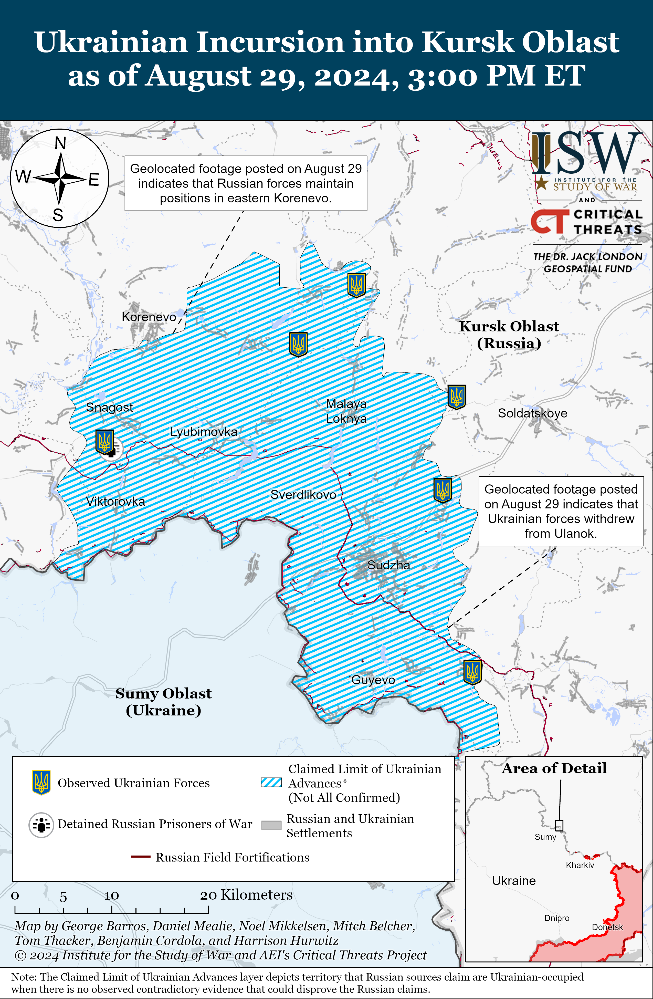
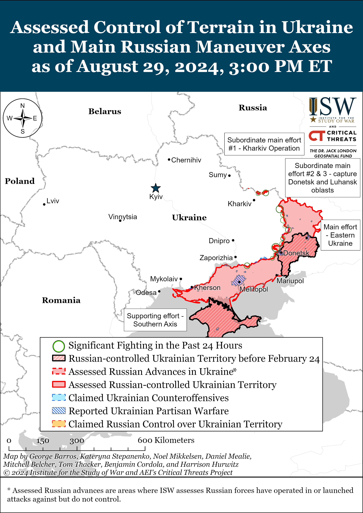
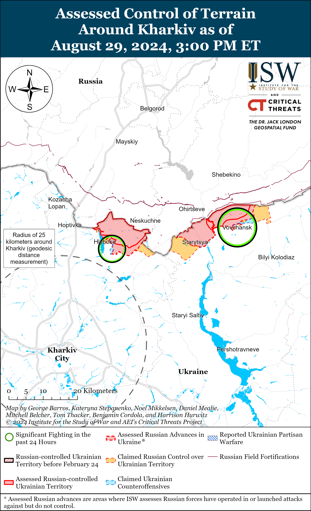
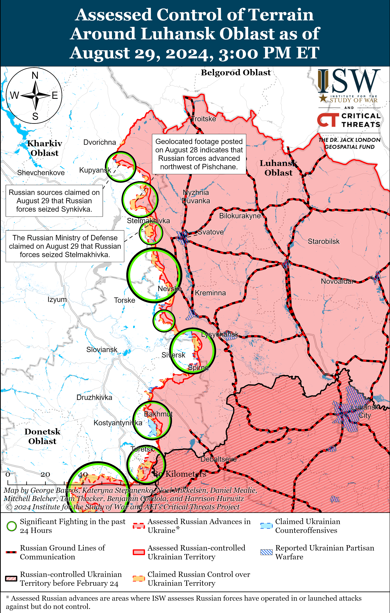
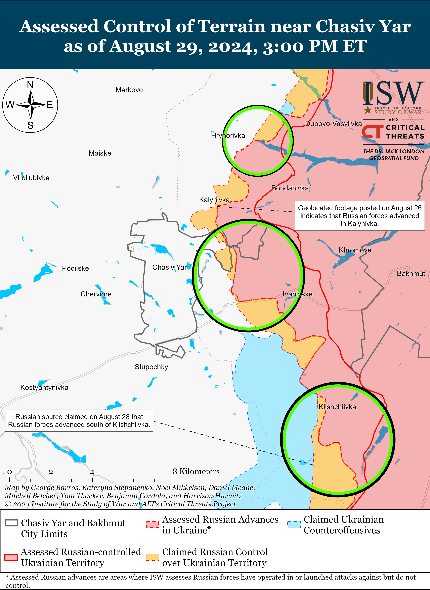
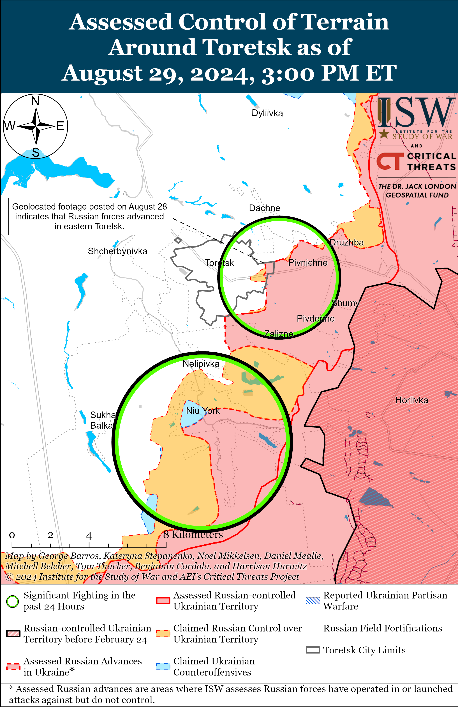
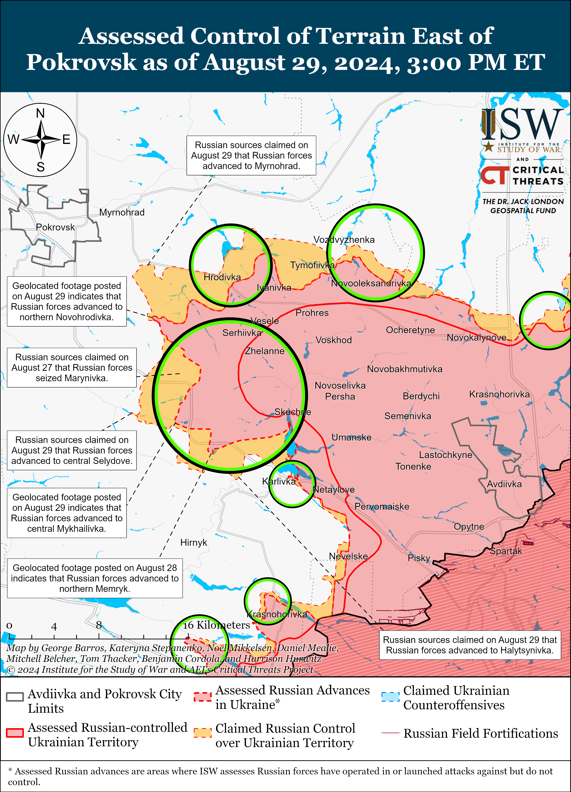
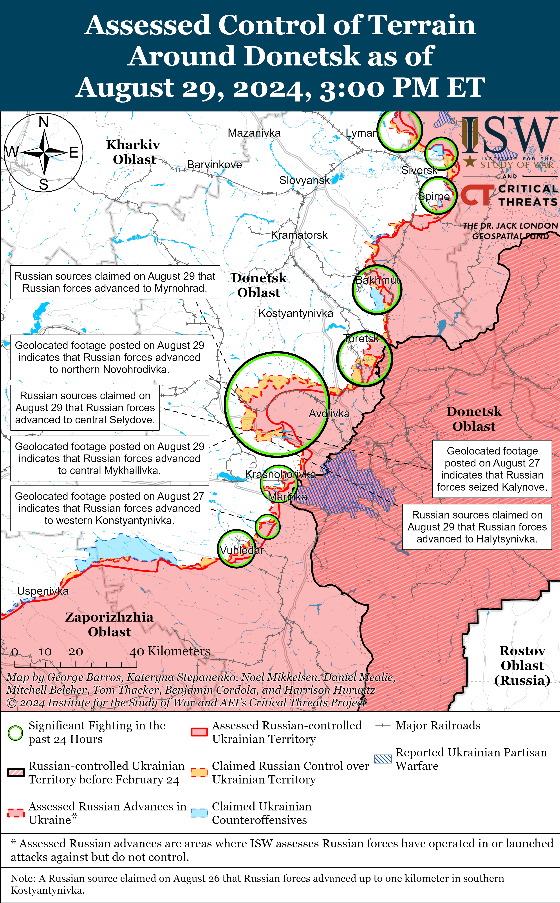

# Russian Offensive Campaign Assessment, August 29, 2024

**Riley Bailey, Angelica Evans, Grace Mappes, Davit Gasparyan, and George Barros**

**August 29, 2024, 8:50pm ET**

**Click** [**here**](https://storymaps.arcgis.com/stories/36a7f6a6f5a9448496de641cf64bd375) **to see ISW’s interactive map of the Russian invasion of Ukraine. This map is updated daily alongside the static maps present in this report.**

**Click** [**here**](https://storymaps.arcgis.com/stories/83a2f24901c941d581c0c523ecd2619b) **to see ISW’s interactive map of Ukraine’s offensive in Kursk Oblast.**

**Click** [**here**](https://understandingwar.maps.arcgis.com/apps/instant/3dviewer/index.html?appid=1602762dbcde419bb957dea358449580) **to see ISW’s 3D control of terrain topographic map of Ukraine. Use of a computer (not a mobile device) is strongly recommended for using this data-heavy tool.**

**Click** [**here**](https://storymaps.arcgis.com/stories/733fe90805894bfc8562d90b106aa895) **to access ISW’s archive of interactive time-lapse maps of the Russian invasion of Ukraine. These maps complement the static control-of-terrain map that ISW produces daily by showing a dynamic frontline. ISW will update this time-lapse map archive monthly.**

**Note: The data cut-off for this product was 1pm ET on August 29. ISW will cover subsequent reports in the August 30 Russian Offensive Campaign Assessment.**

**Russian forces are currently pursuing two immediate tactical efforts as part of their ongoing offensive operation to seize Pokrovsk — a tactical effort along the Novohrodivka-Hrodivka line east of Pokrovsk to seize Myrnohrad and advance up to Pokrovsk’s outskirts, and another tactical effort along the Selydove-Ukrainsk-Hirnyk line southeast of Pokrovsk aimed at widening Russia’s salient in the Pokrovsk direction and eliminating vulnerabilities to Ukrainian counterattacks. The Russian military command likely views both of these tactical efforts as desired prerequisites for launching an intensified offensive effort against Pokrovsk itself.** Ukrainian Commander-in-Chief General Oleksandr Syrskyi stated on August 29 that the most intense battles in the Pokrovsk direction are ongoing on the eastern outskirts of Hrodivka (east of Pokrovsk), southwest of Hrodivka near Krasnyi Yar, within Novohrodivka (southeast of Pokrovsk), and immediately east of Selydove near Mykhailivka (southeast of Pokrovsk).[1] ISW has observed Russian gains in these areas in recent days, but Russian milbloggers have claimed that Russian forces have made more significant tactical gains in the Pokrovsk direction than what observed visually confirmed evidence currently supports.[2] Russian milbloggers claimed that Russian forces advanced up to the southeastern outskirts of Myrnohrad (immediately east of Pokrovsk) and have begun small arms battles with Ukrainian forces in the town, although a Ukrainian military observer described the Russian forces operating in the town as sabotage and reconnaissance groups.[3] Russian milbloggers claimed that Russian forces have advanced in much of eastern Selydove and have reached the center of the town.[4] Russian milbloggers also claimed that Russian forces are fighting on the northeastern outskirts of Ukrainsk (southeast of Pokrovsk), seized Memryk (immediately northeast of Ukrainsk), and entered Halitsynivka (immediately east of Ukrainsk).[5]

**Russian forces appear to be attempting to maintain their rate of advance along the Novohrodivka-Hrodivka line to quickly seize Myrnohrad and reach the outskirts of Pokrovsk**. The reported Russian advance from Novohrodivka to Myrnohrad’s outskirts likely aims to bypass what Russian sources have characterized as major Ukrainian defensive positions northwest and west of Hrodivka.[6] Russian forces recently enveloped Ukrainian positions southeast of Pokrovsk along the Karlivske Reservoir and prompted Ukrainian forces to withdraw from limited positions in the area.[7] Russian forces likely hope to achieve a similar effect by trying to envelop Ukrainian positions between Myrnohrad and Hrodivka, although it remains unclear if Russian forces can maintain their relatively rapid rate of advance through the comparatively larger town of Myrnohrad and its surroundings. Russian forces may attempt to fight directly through Ukrainian defensive positions along the Novohrodivka-Hrodivka line, despite the higher costs, in order to maintain their rate of advance and try to seize Myrnohrad more quickly. Russian efforts to seize Myrnohrad do not preclude Russian forces from advancing up to the eastern outskirts of Pokrovsk, and the Russian military will likely pursue these tactical goals in tandem.

**Reported Russian advances into Selydove and in the direction of Ukrainsk and Hirnyk likely aim to eliminate a relatively large Ukrainian salient on the southern edge of the wider Russian salient in the Pokrovsk direction that could threaten Russia’s offensive effort in the area**. Ukrainian positions east of the Selydove-Ukrainsk-Hirnyk line offer Ukrainian forces opportunities to threaten the Russian rear in the Pokrovsk direction, and the Russian military command is likely concerned about Ukrainian counterattacks and fires disrupting Russian offensive efforts as Russian forces deploy logistics, artillery elements, and force concentrations westward into the forward part of the salient to support the intensified effort on Pokrovsk itself. The Russian military command also likely aims to expand and stabilize the southern flank of the Russian salient in the area in order to prevent Ukrainian forces from threatening the gains Russia has made in its 2024 offensive effort once Russian offensive operations in the Pokrovsk direction culminate.[8] The Russian salient is roughly 21 kilometers wide at its base from the Ukrainian salient east of the Selydove-Ukrainsk-Hirnyk line to Ukrainian positions north of Avdiivka along the H-20 (Avdiivka-Kostyantynivka) highway. Russian positions along the E-50 (Donetsk City-Pokrovsk) highway southwest of Avdiivka are roughly 13 kilometers from Avdiivka, whereas the current line of Russian advance along the Novohrodivka-Hrodivka line is 30 kilometers from Avdiivka. Significant Ukrainian counterattacks from the base of the salient towards Avdiivka could threaten to encircle the Russian force grouping deployed forward in the salient, and the Russian military command likely aims to preempt this possibility by eliminating the Ukrainian salient on the southern flank of the Pokrovsk direction.

Russian forces likely hope that advances in the direction of Ukrainsk and Hirnyk will mutually support ongoing offensive operations west of Donetsk City and that offensive pressure from both directions will overwhelm Ukrainian forces or prompt Ukraine to withdraw from the limited positions in the rural open areas east of Ukrainsk and Hirnyk. The area north of Krasnohorivka (west of Donetsk City) is mainly comprised of open fields with limited cover or concealment from relatively few windbreaks, and Russian advances through this terrain would likely require significant successful mechanized assaults, which Russian forces have routinely struggled to conduct.[9] Russian forces have proven more adept at advancing from settlement to settlement with small infantry groups in the Pokrovsk direction, although it remains to be seen if Russian infantry groups can maintain their rate of advance as they approach Ukrainsk and Hirnyk.[10]

**The Russian military command likely aims to achieve both of these tactical efforts before launching the more resource-intensive effort to seize Pokrovsk itself, although Russian forces may begin urban combat in Pokrovsk regardless, if progress stalls on these preparatory efforts.** It remains unclear if the Russian military command intends for Russian forces to fight their way entirely through Pokrovsk in frontal urban combat, as they have through the smaller towns east and southeast of Pokrovsk, or aims to envelop or encircle the city as Russian forces previously attempted and failed to do against Bakhmut and Avdiivka.[11] The Russian military command’s calculus about what preparatory actions are required for launching offensive operations on the city of Pokrovsk and how Russian forces will attempt to seize the city will likely depend on where Ukrainian forces decide to engage in significant defensive efforts. ISW will not speculate or forecast about future Ukrainian defensive efforts, however.

**Russian authorities are creating new volunteer territorial defense units in response to the Ukrainian incursion into Kursk Oblast, highlighting Russian President Vladimir Putin’s unwillingness to counter the incursion more seriously with a mobilization due to the risks of societal discontent or with large-scale redeployments due to possible disruptions to Russia’s ongoing offensive operations in eastern Ukraine.** Acting Kursk Oblast Governor Alexei Smirnov publicly announced on August 29 the creation of the “BARS-Kursk” volunteer detachment and stated that the detachment’s main function will be to “ensure security” in Kursk Oblast during the incursion and the re-settlement of border settlements in Kursk Oblast at an unspecified later date.[12] Smirnov stated that the detachment will cooperate with the Russian military and the counterterrorism operational headquarters — which are overseeing the ongoing Russian response in Kursk Oblast — and will also provide humanitarian support for residents of border settlements. Smirnov stated that volunteers will sign six-month contracts, undergo training, and receive any “necessary” weapons to perform their duties. Kursk Oblast officials published a recruitment ad for the detachment on August 24.[13] Ukrainian Kharkiv Group of Forces Spokesperson Colonel Vitaly Sarantsev reported that Russian authorities are also forming “BARS-Bryansk” and “BARS-Belgorod” detachments and that the three detachments will support the Russian Northern Grouping of Forces.[14] Sarantsev estimated that the three detachments will be comprised of 4,921 volunteers in total.

The formation of these new BARS (Russian Army Combat Reserve) volunteer detachments is consistent with the Kremlin’s apparent strategy to avoid re-deploying experienced or combat effective units engaged in fighting in the Pokrovsk or Toretsk directions to Kursk Oblast due to concerns about slowing the tempo of Russian offensive operations in these higher priority directions. ISW previously noted that the Kremlin appears to be largely relying on conscripts and irregular forces redeployed from lower-priority directions in Ukraine to defend against the Ukrainian incursion into Kursk Oblast.[15] Putin indicated a possible desire to continue relying on Russian volunteer servicemembers (*dobrovoltsy*) to address the Ukrainian incursion during his August 12 meeting with Russian military, security, and civilian officials by alluding to increased willingness to sign military service contracts among prospective *dobrovoltsy*.[16] Putin has consistently relied on volunteer and irregular formations to alleviate Russia’s manpower constraints during the war and has avoided declaring general mobilization or another round of partial mobilization, both of which would be incredibly unpopular among Russian society.[17] Putin almost certainly remains extremely averse to declaring general mobilization and will likely continue to rely on irregular formations to address the ongoing Ukrainian incursion into Kursk Oblast until Russian offensive operations culminate in eastern Ukraine — at which point Putin may consider re-deploying more combat effective Russian forces from these directions to push Ukrainian units back across the border.

****

**Ukrainian forces recently marginally advanced north of Sudzha as Russian forces recaptured some areas of Kursk Oblast on August 29.** Geolocated footage published on August 29 shows that Ukrainian forces have reached Nizhnyaya Parovaya (north of Sudzha) and advanced into the northwestern part of the settlement.[18] Additional geolocated footage published on August 29 shows that Russian forces have likely recaptured Ulanok (southeast of Sudzha) and eastern Korenevo.[19] Ukrainian forces continued attacking near Korenevo, Komarovka (southwest of Korenevo), Kremyanoye (east of Korenevo), Lyubimovka (southeast of Korenevo), Leonidovka (northwest of Sudzha), Malaya Loknya and Russkoye Porechnoye (both north of Sudzha), Martynovka (northeast of Sudzha), and within Borki (southeast of Sudzha).[20] Russian sources claimed that Ukrainian forces are continuing to storm Korenevo to try to create a route to Rylsk (northwest of Korenevo).[21] Elements of the Russian “Kaskad” Operational Combat Tactical Formation (formerly of the Donetsk People’s Republic [DNR] Ministry of Internal Affairs [MVD], reportedly since subordinated to Rosgvardia) are reportedly fighting near Korenevo, though the Russian military command reportedly previously dissolved the formation.[22]

**The Ukrainian General Staff reported on August 29 that a Ukrainian F-16 fighter jet recently crashed while defending against a large-scale Russian drone and missile strike.[23]** An unnamed US official told Western media on August 29 that the jet crashed on August 26, and the Ukrainian Ministry of Defense (MoD) appointed a special commission to determine the cause of the crash.[24] The loss of equipment and aircraft during combat operations is not particularly novel, and it is expected that Ukraine will lose some Western-provided military equipment during combat. However, any loss among Ukraine’s already limited allotment of Western-provided F-16s and trained pilots will have an outsized impact on Ukraine’s fledging ability to operate F-16s in the near term as part of its combined air defense umbrella or in an air-to-ground support role.

**Russian authorities arrested and charged former Russian Deputy Defense Minister Army General Pavel Popov with large-scale fraud on August 29.** The Russian Investigative Committee charged Popov with embezzling money meant for the maintenance of the Russian Ministry of Defense’s (MoD) Patriot Park, a Russian military exhibition in Moscow.[25] Russian authorities did not disclose how much money Popov is suspected of embezzling personally but noted his case is connected to the large-scale fraud cases of the Patriot Park Head Vyacheslav Akhmedov and MoD Directorate for Innovative Development Deputy Head Major General Vladimir Shesterov, whom Russian authorities arrested on August 5 for embezzling over 40 million rubles (roughly $471,000).[26] Russian state news outlet *TASS* reported, citing Russian law enforcement sources, that Akhmedov testified against Popov.[27] A Russian source that has previously correctly preemptively reported several command changes within the Russian MoD assessed on August 5 that Popov could be the next high-ranking MoD official to be arrested.[28] Russian sources have previously theorized that the arrests of high-ranking MoD officials who served under former Defense Minister Sergei Shoigu may be part of an effort to “clean house” of Shoigu’s affiliates within the MoD, which the sources claimed indicates that Shoigu’s influence within the Kremlin may be declining.[29]

**Russian President Vladimir Putin will conduct an official visit to Mongolia despite Mongolia’s status as a signatory to the Rome Statue and Mongolia’s legal obligation to enforce an arrest warrant for Putin from the International Criminal Court (ICC).** The Kremlin press service announced on August 29 that Putin will travel to Mongolia on September 3, marking his first visit to a state party to the Rome Statute since the ICC issued the arrest warrant in March 2023 for Putin’s role in the illegal deportation of Ukrainian children to Russia.[30] Putin notably avoided traveling to South Africa for a BRICS summit in August 2023 on similar grounds.[31] Putin’s upcoming visit to Mongolia for negotiations on a “strategic partnership” suggests that Mongolian authorities likely will not enforce the ICC arrest warrant.[32] This visit also follows the annual “Selenga” bilateral Russian–Mongolian military exercises which began on August 15, further highlighting the strong bilateral relations between the two countries.[33] Russia has previously stated that it does not recognize the ICC’s jurisdiction, and Russian officials have not yet commented on the possibility of Putin’s arrest in Mongolia. [34]

**The Ukrainian General Staff confirmed on August 29 that Ukrainian forces struck the Atlas Oil Refinery in Rostov Oblast and the Zenit Oil Depot in Kirov Oblast on the night of August 27 to 28.[35]** The Ukrainian General Staff reported that members of Ukraine’s Special Operations Forces, Ukraine’s Main Military Intelligence Directorate (GUR), and Ukrainian forces struck the Atlas Oil Refinery, causing a fire at the refinery’s vertical reservoirs. The Ukrainian General Staff also reported that Ukrainian forces also struck the Zenit Oil Depot and a field artillery warehouse of the Russian Western Grouping of Forces in Voronezh Oblast and are clarifying the effect of these strikes. Russian and Ukrainian sources stated on August 28 that Ukrainian forces struck targets in Rostov, Kirov, and Voronezh oblasts.[36]

**Key Takeaways:**

- **Russian forces are currently pursuing two immediate tactical efforts as part of their ongoing offensive operation to seize Pokrovsk — a tactical effort along the Novohrodivka-Hrodivka line east of Pokrovsk to seize Myrnohrad and advance up to Pokrovsk’s outskirts, and another tactical effort along the Selydove-Ukrainsk-Hirnyk line southeast of Pokrovsk aimed at widening Russia’s salient in the Pokrovsk direction and eliminating vulnerabilities to Ukrainian counterattacks.**
- **The Russian military command likely aims to achieve both of these tactical efforts before launching the more resource-intensive effort to seize Pokrovsk itself, although Russian forces may begin urban combat in Pokrovsk regardless, if progress stalls on these preparatory efforts.**
- **Russian authorities are creating new volunteer territorial defense units in response to the Ukrainian incursion into Kursk Oblast, highlighting Russian President Vladimir Putin’s unwillingness to counter the incursion more seriously with a mobilization due to the risks of societal discontent or with large-scale redeployments due to possible disruptions to Russia’s ongoing offensive operations in eastern Ukraine.**
- **Ukrainian forces recently marginally advanced north of Sudzha as Russian forces recaptured some areas of Kursk Oblast on August 29.**
- **The Ukrainian General Staff reported on August 29 that a Ukrainian F-16 fighter jet recently crashed while defending against a large-scale Russian drone and missile strike.**
- **Russian authorities arrested and charged former Russian Deputy Defense Minister Army General Pavel Popov with large-scale fraud on August 29.**
- **Russian President Vladimir Putin will conduct an official visit to Mongolia despite Mongolia’s status as a signatory to the Rome Statue and Mongolia’s legal obligation to enforce an arrest warrant for Putin from the International Criminal Court (ICC).**
- **The Ukrainian General Staff confirmed on August 29 that Ukrainian forces struck the Atlas Oil Refinery in Rostov Oblast and the Zenit Oil Depot in Kirov Oblast on the night of August 27 to 28.**
- **Russian forces recently advanced near Kupyansk, Toretsk, Pokrovsk, and Donetsk City.**
- **The Russian government continues to expand pathways for accused criminals to sign military service contracts.**

******

***We do not report in detail on Russian war crimes because these activities are well-covered in Western media and do not directly affect the military operations we are assessing and forecasting. We will continue to evaluate and report on the effects of these criminal activities on the Ukrainian military and the Ukrainian population and specifically on combat in Ukrainian urban areas. We utterly condemn Russian violations of the laws of armed conflict and the Geneva Conventions and crimes against humanity even though we do not describe them in these reports.***

- Russian Main Effort – Eastern Ukraine (comprised of three subordinate main efforts)
- Russian Subordinate Main Effort #1 – Push Ukrainian forces back from the international border with Belgorod Oblast and approach to within tube artillery range of Kharkiv City
- Russian Subordinate Main Effort #2 – Capture the remainder of Luhansk Oblast and push westward into eastern Kharkiv Oblast and encircle northern Donetsk Oblast
- Russian Subordinate Main Effort #3 – Capture the entirety of Donetsk Oblast
- Russian Supporting Effort – Southern Axis
- Russian Air, Missile, and Drone Campaign
- Russian Mobilization and Force Generation Efforts
- Russian Technological Adaptations
- Activities in Russian-occupied areas
- Ukrainian Defense Industrial Base Efforts
- Russian Information Operations and Narratives
- Significant Activity in Belarus

**Russian Main Effort – Eastern Ukraine**

**Russian Subordinate Main Effort #1 – Kharkiv Oblast** **(Russian objective: Push Ukrainian forces back from the international border with Belgorod Oblast and approach to within tube artillery range of Kharkiv City)**

Fighting continued north of Kharkiv City near Lyptsi and Hlyboke and northeast of Kharkiv City in Vovchansk on August 29, but there were no confirmed changes to the frontline.[37] The spokesperson of a Ukrainian brigade operating in the Kharkiv direction stated that Russian forces operating in this direction are conducting assaults without armored vehicle support.[38] Ukrainian Kharkiv Group of Forces Spokesperson Colonel Vitaly Sarantsev stated that the tempo of Russian offensive operations near Starytsya (northeast of Kharkiv City) is decreasing and that Russian forces are beginning to transition to defensive operations in the area but are still pressuring Ukrainian forces elsewhere on this front.[39] The Ukrainian Kharkiv Group of Forces reported that elements of the Russian 7th Motorized Rifle Regiment (11th Army Corps [AC], Leningrad Military District [LMD]) are operating near Lukyantsi (north of Kharkiv City), and that elements of the Russian 136th Motorized Rifle Brigade (58th Combined Arms Army [CAA], Southern Military District [SMD]) continued conducting a relief in place for elements of the 83rd Airborne (VDV) Brigade near Tykhe (northeast of Kharkiv City and east of Vovchansk).[40]

****

**Russian Subordinate Main Effort #2 – Luhansk Oblast** **(Russian objective: Capture the remainder of Luhansk Oblast and push westward into eastern Kharkiv Oblast and northern Donetsk Oblast)**

Russian forces recently advanced northeast of Kupyansk and reportedly seized Synkivka (northeast of Kupyansk) amid continued fighting along the Kupyansk-Svatove-Kreminna line on August 29. Geolocated footage published on August 29 indicates that Russian forces advanced in central Synkivka.[41] Russian sources claimed that Russian forces seized Synkivka, and the Russian Ministry of Defense (MoD) claimed that Russian forces seized Stelmakhivka (southeast of Kupyansk).[42]A Kremlin-affiliated Russian milblogger also claimed that Russian forces advanced southeast of Kupyansk near Pishchane and Tabaivka.[43]ISW has not observed confirmation of these claims, however. Fighting continued near Synkivka; southeast of Kupyansk near Stelmakhivka, Stepova Novoselivka, Kolisnykivka, and Kruhlyakivka and towards Lozova; west of Svatove near Myasozharivka; southwest of Svatove near Tverdokhlibove and towards Cherneshchyna and Druzhelyubivka; northwest of Kreminna near Novosadove, Novoyehorivka, Hrekivka, Nevske, and Makiivka; west of Kreminna near Torske; and south of Kreminna near the Serebryanske forest area on August 28 and 29.[44] A Ukrainian officer operating in the Lyman direction reported that Russian forces are attacking daily in small squad-sized assault groups of two to four people and have recently been using equipment after not using equipment for an unspecified amount of time.[45]

**Russian Subordinate Main Effort #3 – Donetsk Oblast** **(Russian objective: Capture the entirety of Donetsk Oblast, the claimed territory of Russia’s proxies in Donbas)**

Russian forces continued offensive operations northeast of Siversk near Bilohorivka, east of Siversk near Verkhnokamyanske, and southeast of Siversk near Vyimka and Spirne on August 28 and 29, but there were no changes to the frontline.[46]

Russian forces continued offensive operations near Chasiv Yar; north of Chasiv Yar near Hryhorivka; east of Chasiv Yar near Ivanivske; and southeast of Chasiv Yar near Klishchiivka, Andriivka, and Bila Hora on August 28 and 29.[47] Elements of the Russian Sever-V Brigade (Russian Volunteer Corps) are reportedly operating near Hryhorivka.[48]

Russian forces recently advanced east of Toretsk and reportedly advanced further within eastern Toretsk on August 29. Geolocated footage published on August 28 indicates that Russian forces recently advanced along Chapaieva Street in northwestern Druzhba (east of Toretsk).[49] Russian milbloggers claimed that Russian forces advanced up to 500 meters in eastern Toretsk on August 29, although ISW has not observed confirmation of this claim.[50] Russian forces continued offensive operations near Toretsk, east of Toretsk near Pivnichne and Druzhba, south of Toretsk near Niu York and Nelipivka, and southwest of Toretsk near Sukha Balka on August 28 and 29.[51]

Russian forces recently advanced east and southeast of Pokrovsk and continued offensive operations in the Pokrovsk direction on August 29. Geolocated footage published on August 29 indicates that Russian forces advanced to a windbreak northwest of Svyrydonivka (east of Pokrovsk), northwards in fields east of Hordivka (east of Pokrovsk), up to the Novohrodivska Mine No. 1/3 in northwestern Novohrodivka (southeast of Pokrovsk), and westward up to the Rosiia Mine slag heap north of Mykhailivka (southeast of Pokrovsk).[52] A Russian milblogger claimed that Russian forces advanced further within northwestern Novohrodivka, although ISW has not observed confirmation of this claim.[53] Russian forces continued offensive operations east of Pokrovsk near Vozdvyzhenka, Zelene Pole, Myrolubivka, and Hrodivka and southeast of Pokrovsk near Novohrodivka, Marynivka, Mykhailivka, Selydove, Karlivka, Halitsynivka, and Ukrainsk on August 28 and 29.[54]

Russian forces continued offensive operations west of Donetsk City near Heorhiivka and Krasnohorivka on August 29, but did not make any confirmed gains.[55] Elements of the Russian 5th Motorized Rifle Brigade (1st Donetsk People’s Republic [DNR] Army Corps [AC]) and 238th Artillery Brigade (8th Combined Arms Army [CAA], Southern Military District [SMD]) are reportedly operating near Krasnohorivka.[56]

Russian forces recently advanced southwest of Donetsk City and continued offensive operations in the area on August 29. Geolocated footage published on August 28 indicates that Russian forces recently advanced in fields south of Pobieda.[57] Russian milbloggers claimed that Russian forces advanced northward past the T-05-09 highway west of Pavlivka and advanced along a front up to 2.5 kilometers wide and a kilometer deep northeast of Vuhledar.[58] ISW has not observed confirmation of these claims, however. Russian forces continued offensive operations near Kostyantynivka, Vodyane, and Vuhledar on August 29.[59]

Russian and Ukrainian forces did not report fighting in the Donetsk-Zaporizhia Oblast border area on August 29.

**Russian Supporting Effort – Southern Axis** **(Russian objective: Maintain frontline positions and secure rear areas against Ukrainian strikes)**

A Russian milblogger claimed on August 29 that positional fighting continued in western Zaporizhia Oblast on August 29.[60] Another Russian milblogger claimed on August 29 that elements of the Russian 70th and 71st motorized rifle regiments (both of the (42nd Motorized Rifle Division, 58th Combined Arms Army [CAA], Southern Military District [SMD]) advanced north and east of Robotyne, although ISW has not observed confirmation of this claim.[61] The Ukrainian General Staff reported that Russian forces attacked in Robotyne, north of Robotyne near Novodanylivka, and northeast of Robotyne near Mala Tokmachka on August 28 and 29.[62]

Sevastopol occupation head Mikhail Razvozhaev claimed on August 29 that Russian forces repelled a Ukrainian aerial and naval drone strike on Sevastopol and destroyed four aerial drones over the Black Sea and three naval drones in the area.[63] ISW has not observed additional evidence confirming this claim.

**Russian Air, Missile, and Drone Campaign** **(Russian Objective: Target Ukrainian military and civilian infrastructure in the rear and on the frontline)**

Russian forces conducted a large series of drone and missile strikes against Ukraine on the night of August 28 to 29. Ukrainian Air Force Commander Lieutenant General Mykola Oleshchuk reported on August 29 that Russian forces launched three Kh-59/69 cruise missiles and two missiles of an unspecified type from airspace over Kursk and Belgorod oblasts and 74 Shahed-136/131 drones from Primorsk-Akhtarsk and Yeysk, Krasnodar Krai and Kursk Oblast.[64] Oleshchuk reported that Ukranian forces downed two Kh-59/69 missiles and 60 Shahed drones over Kharkiv, Cherkasy, Kirovohrad, Kyiv, Poltava, Dnipropetrovsk, Kherson, Sumy, and Donetsk oblasts and that the other 14 drones did not strike their intended targets.

**Russian Mobilization and Force Generation Efforts** **(Russian objective: Expand combat power without conducting general mobilization)**

The Russian government continues to expand pathways for accused criminals to sign military service contracts. Kremlin newswire *TASS* reported on August 29 that a group of State Duma deputies submitted a bill proposing to allow accused criminals to sign military service contracts during mobilization, martial law, and wartime.[65] Russian State Duma State Building and Legislation Committee Head Pavel Krasheninnikov and Defense Committee Head Andrei Kartapolov and Russian Federation Council Constitutional Legislation and State Building Committee Head Andrei Klishas authored the bill and noted that the bill does not apply to criminals accused of violence against minors. The author’s explanatory note states that the bill also allows for people with a criminal record, who have previously been imprisoned, or who have expunged criminal records to sign military service contracts. It is unclear how the proposed process is legally different from the current mechanisms through which Russia has had convict recruits sign military contracts, although the new law may no longer require the immediate pardons that the Kremlin appeared to be offering convicts in exchange for signing contracts.[66] Russian authorities have previously relied on penal and convict recruits to supplant Russia’s manpower needs in Ukraine.[67]

Kremlin officials continue to project confidence about the state of Russia’s domestic drone production capabilities. Kremlin Spokesperson Dmitri Peskov claimed on August 29 that Russia is developing its high-tech industry and that Russian drone production industry is moving towards using a higher percentage of import-substituted component parts and machine building equipment.[68] Russia has previously relied on the People’s Republic of China (PRC) to evade sanctions and offset limitations in its domestic technology and production capacities, particularly regarding drones, and the PRC is set to limit the export of an unspecified number of radio and drone production components to Russia beginning on September 1.[69]

**Russian Technological Adaptations** **(Russian objective: Introduce technological innovations to optimize systems for use in Ukraine)**

Nothing significant to report.

**Ukrainian Defense Industrial Efforts** **(Ukrainian objective: Develop its defense industrial base to become more self-sufficient in cooperation with US, European, and international partners)**

*ISW is suspending publishing coverage of Ukrainian defense industrial efforts until further notice.*

**Activities in Russian-occupied areas** **(Russian objective: Consolidate administrative control of annexed areas; forcibly integrate Ukrainian citizens into Russian sociocultural, economic, military, and governance systems)**

*ISW is not publishing coverage of activities in Russian-occupied areas today.*

**Russian Information Operations and Narratives**

Russian officials recently intensified existing narratives attempting to deter the West from providing further military assistance to Ukraine and prevent the West from lifting restrictions on Ukraine’s use of Western-provided weapons against military targets in Russia. Russian Foreign Minister Sergei Lavrov, Ministry of Foreign Affairs (MFA) Spokesperson Maria Zakharova, and First Deputy Permanent Representative to the UN Dmitri Polyansky recently doubled down on narratives accusing Ukraine and the West of escalating the war in Ukraine, spoiling peace negotiations, and permitting alleged Ukrainian war crimes in Kursk Oblast.[70] The Kremlin has routinely intensified these information operations during critical moments in Western policy discussions regarding support for Ukraine and is likely doing so now as part of its ongoing reflexive control campaign to coerce Western decision-makers into making policy decisions favorable to Russia.[71]

**Significant activity in Belarus** **(Russian efforts to increase its military presence in Belarus and further integrate Belarus into Russian-favorable frameworks and Wagner Group activity in Belarus)**

Ukraine’s State Border Service Spokesperson Andriy Demchenko reported on August 29 that Ukrainian forces have not recorded any significant movement or increase of Belarusian forces near the Ukrainian border. Demchenko stated that Ukrainian forces are actively monitoring the state border with Belarus and are prepared to respond to any change in the situation.[72] Demchenko also stated that Ukrainian forces have erected engineering fortifications along the border to protect against possible Belarusian shelling and support defensive operations against a possible Belarusian attack into Ukraine.[73] ISW has previously assessed that a Belarusian invasion of Ukraine is unlikely due to Belarusian forces’ limited capabilities, low readiness, and the implications that such an incursion would have for Belarusian President Alexander Lukashenko’s regime domestically.[74]

Independent Belarusian monitoring group the Hajun Project reported on August 28 that Belarusian forces used a fixed wing aircraft to shoot down a Russian Shahed-136/131 drone that violated Belarusian airspace amid a large-scale Russian strike on Ukraine on the night of August 28 to 29.[75] Belarusian forces reportedly shot down the drone over Yelsk Raion, Gomel Oblast (which shares a border with northern Ukraine).

**Note: ISW does not receive any classified material from any source, uses only publicly available information, and draws extensively on Russian, Ukrainian, and Western reporting and social media as well as commercially available satellite imagery and other geospatial data as the basis for these reports. References to all sources used are provided in the endnotes of each update.**

---

[1] https://www.facebook.com/CinCAFofUkraine/posts/pfbid02dAFUbguyJ6ti1Xx4GKu9JNNtteqK33sf7Gj4h8fBH2aqzLGy9YPnhyALJgZQsJial ; https://t.me/osirskiy/830 ; https://armyinform dot com.ua/2024/08/29/golovnokomanduvach-zsu-pobuvav-na-pokrovskomu-napryamku-i-rozpoviv-pro-zhorstki-boyi/

[2] https://t.me/operativnoZSU/155760; https://t.me/creamy\_caprice/6583 ; https://t.me/ngu\_war\_for\_peace/20294; https://t.me/creamy\_caprice/6582 ; https://t.me/officer\_alex33/3599; https://t.me/creamy\_caprice/6580 ; https://www.facebook.com/151OMBr/videos/856130316682507/; https://t.me/creamy\_caprice/6587 ; https://t.me/okspn/32537; https://t.me/creamy\_caprice/6589 ;

[3] https://t.me/dva\_majors/50947 ; https://t.me/stringer\_donetsk/13580 ; https://t.me/Donbas\_Operativnyi/87930

[4] https://t.me/stringer\_donetsk/13578; https://t.me/z\_arhiv/27847 ; https://t.me/boris\_rozhin/135301 ; https://t.me/voenkorKotenok/58614 ; https://t.me/voenkorKotenok/58629 ; https://t.me/notes\_veterans/19177 ; https://t.me/boris\_rozhin/135368 ; https://t.me/boris\_rozhin/135278;

[5] https://t.me/stringer\_donetsk/13581 ; https://t.me/z\_arhiv/27856 ; https://t.me/boris\_rozhin/135353 ; https://t.me/voenkorKotenok/58636

[6] https://t.me/rybar/63125; https://t.me/rybar/62816; https://t.me/boris\_rozhin/135195 ; https://t.me/zimovskyAL/31879; https://t.me/voenkorKotenok/58508; https://t.me/rybar/62969

[7] https://isw.pub/UkrWar082224

[8] https://understandingwar.org/backgrounder/russian-offensive-campaign-assessment-august-17-2024

[9] https://understandingwar.org/backgrounder/russian-offensive-campaign-assessment-august-21-2024-0; https://understandingwar.org/backgrounder/russian-offensive-campaign-assessment-august-17-2024; https://isw.pub/UkrWar080824; https://isw.pub/UkrWar08072024; https://isw.pub/UkrWar073024; https://isw.pub/UkrWar072524; https://understandingwar.org/backgrounder/russian-offensive-campaign-assessment-july-2-2024

[10] https://understandingwar.org/backgrounder/russian-offensive-campaign-assessment-august-17-2024

[11] https://understandingwar.org/backgrounder/kremlin%E2%80%99s-pyrrhic-victory-bakhmut-retrospective-battle-bakhmut ; https://understandingwar.org/backgrounder/how-delays-western-aid-gave-russia-initiative-ukrainian-counteroffensive-kharkiv

[12] https://t.me/gubernator\_46/8169

[13] https://understandingwar.org/backgrounder/russian-offensive-campaign-assessment-august-24-2024

[14] https://t.me/otukharkiv/975 ; https://armyinform.com dot ua/2024/08/29/okupanty-formuyut-novu-brygadu-dlya-pidtrymky-svoyih-syl-na-harkivshhyni/

[15] https://isw.pub/UkrWar081324

[16] http://kremlin dot ru/events/president/news/74856 ; https://www.kommersant dot ru/doc/6891385

[17] https://isw.pub/UkrWar012724 ; https://isw.pub/UkrWar121423 ; https://isw.pub/UkrWar012223

[18] https://t.me/napravleniespravedlivosti/283; https://t.me/creamy\_caprice/6584

[19] https://x.com/blinzka/status/1829143931310977133; https://x.com/wartranslated/status/1829125774374310218; https://t.me/black\_swan\_ukraine/184; https://t.me/creamy\_caprice/6588; https://x.com/EjShahid/status/1828803134417957344

[20] https://t.me/rybar/63146; https://t.me/dva\_majors/50947; https://t.me/wargonzo/21806 ; https://t.me/dva\_majors/50999 ; https://t.me/warhistoryalconafter/181972; https://t.me/rusich\_army/16845; https://t.me/DnevnikDesantnika/14717 ; https://t.me/DnevnikDesantnika/14718

[21] https://t.me/wargonzo/21805 ; https://t.me/mig41/36547

[22] https://understandingwar.org/backgrounder/russian-offensive-campaign-assessment-june-21-2024; https://understandingwar.org/backgrounder/russian-offensive-campaign-assessment-may-4-2024; https://understandingwar.org/backgrounder/russian-offensive-campaign-assessment-january-3-2024

[23] https://www.facebook.com/GeneralStaff.ua/posts/pfbid021zRYaFyVCw5dQ8WhKpDc7vMnpQP2k18FWkMqqt2ZGeYZ44B4zu4gBCkem8KTeyDTl

[24] https://www.wsj.com/world/ukrainian-f-16-is-destroyed-in-crash-4f6d66f6?mod=breakingnews ; https://www.reuters.com/world/europe/ukrainian-f-16-jet-destroyed-crash-monday-wsj-reports-2024-08-29/ ; https://www.facebook.com/GeneralStaff.ua/posts/pfbid021zRYaFyVCw5dQ8WhKpDc7vMnpQP2k18FWkMqqt2ZGeYZ44B4zu4gBCkem8KTeyDTl

[25] https://tass dot ru/proisshestviya/21719009; https://meduza dot io/news/2024/08/29/protiv-byvshego-zamministra-oborony-rf-pavla-popova-vozbudili-ugolovnoe-delo-o-moshennichestve; https://t.me/tass\_agency/269157; https://t.me/tass\_agency/269158; https://t.me/tass\_agency/269160; https://t.me/tass\_agency/269161

[26] https://understandingwar.org/backgrounder/russian-offensive-campaign-assessment-august-5-2024

[27] https://tass dot ru/proisshestviya/21719431; https://t.me/tass\_agency/269236

[28] https://t.me/arbat/1846; https://understandingwar.org/backgrounder/russian-offensive-campaign-assessment-august-5-2024

[29] https://understandingwar.org/backgrounder/russian-offensive-campaign-assessment-august-5-2024; https://isw.pub/UkrWar042424 ; https://isw.pub/UkrWar051324 ; https://isw.pub/UkrWar051424 ; https://understandingwar.org/backgrounder/russian-offensive-campaign-assessment-may-15-2024 ; https://isw.pub/UkrWar072624 ; https://understandingwar.org/backgrounder/russian-offensive-campaign-assessment-june-17-2024 ; https://isw.pub/UkrWar052324 ; https://isw.pub/UkrWar052124 ; https://understandingwar.org/backgrounder/russian-offensive-campaign-assessment-may-15-2024

[30] https://apnews.com/article/russia-putin-mongolia-visit-icc-arrest-warrant-0b97ffa2e76f0809264d3d4872484d0c; https://www.icc-cpi.int/news/situation-ukraine-icc-judges-issue-arrest-warrants-against-vladimir-vladimirovich-putin-and; https://meduza dot io/news/2024/08/29/putin-3-sentyabrya-posetit-mongoliyu-eta-strana-chlen-mus-i-formalno-dolzhna-ego-arestovat ; https://t.me/bbcrussian/69673 ; https://t.me/tass\_agency/269221 ; http://www.kremlin dot ru/events/president/news/74957

[31] https://apnews.com/article/brics-xi-jinping-putin-china-russia-963108da4d389f8e1e7775c9e002b5f9

[32] https://meduza dot io/news/2024/08/29/putin-3-sentyabrya-posetit-mongoliyu-eta-strana-chlen-mus-i-formalno-dolzhna-ego-arestovat ; https://t.me/bbcrussian/69673

[33] https://understandingwar.org/backgrounder/russian-offensive-campaign-assessment-august-15-2024

[34] https://tass dot com/politics/1588237

[35] https://www.facebook.com/GeneralStaff.ua/posts/pfbid08qQM6whKRYFt6Sj7n1u7DKtVegsAYcXqkj5B9GU99bz2WdGmP4tXX3NjhBBhtvT2l ; https://armyinform.com dot ua/2024/08/29/u-dvoh-oblastyah-na-rosiyi-goryat-naftobazy/

[36] https://isw.pub/UkrWar082824

[37] https://www.facebook.com/GeneralStaff.ua/posts/pfbid0Zk9JE35rpj96MTjvBrtAspTzFf5Joc3gcvY7tXtucB2zuFMm2TspVxbJdUXfgJKsl; https://www.facebook.com/GeneralStaff.ua/posts/pfbid02Bp4dr92qk2zHW1YEuNAwPyZ7KPNvhinR8r46MauKYDt88NdpLgrxGT8Amw3BYBBCl; https://www.facebook.com/GeneralStaff.ua/posts/pfbid0Znz1cYM6oYhxkV7eYuL9qyGxu6AKnj9pAkpCkvELzQZayx2xVxG8BmF7FCfrtSLdl; https://t.me/wargonzo/21807; https://t.me/mod\_russia/42725;

[38] https://t.me/otukharkiv/971

[39] https://armyinform dot com.ua/2024/08/28/otu-harkiv-rosiyany-zavodyat-dodatkovi-pidrozdily-z-leningradskoyi-oblasti/ ; https://www.youtube.com/watch?v=j5TqaWCCdUg

[40] https://understandingwar.org/backgrounder/russian-offensive-campaign-assessment-august-28-2024; https://t.me/otukharkiv/970

[41] https://x.com/AMKosint/status/1829054009682079984; https://t.me/divgen/53612; https://t.me/kupiansknash/11145; https://t.me/creamy\_caprice/6576

[42] https://t.me/DnevnikDesantnika/14694; https://t.me/z\_arhiv/27853; https://t.me/vrogov/17271 ;  https://t.me/mod\_russia/42725

[43] https://t.me/rybar/63136

[44]https://www.facebook.com/GeneralStaff.ua/posts/pfbid0Zk9JE35rpj96MTjvBrtAspTzFf5Joc3gcvY7tXtucB2zuFMm2TspVxbJdUXfgJKsl ; https://www.facebook.com/GeneralStaff.ua/posts/pfbid02Bp4dr92qk2zHW1YEuNAwPyZ7KPNvhinR8r46MauKYDt88NdpLgrxGT8Amw3BYBBCl; https://www.facebook.com/GeneralStaff.ua/posts/pfbid0Znz1cYM6oYhxkV7eYuL9qyGxu6AKnj9pAkpCkvELzQZayx2xVxG8BmF7FCfrtSLdl

[45] https://www.youtube.com/watch?v=j5TqaWCCdUg ; https://armyinform dot com.ua/2024/08/29/u-sylah-oborony-rozpovily-pro-vorozhu-taktyku-vypalenoyi-zemli-na-lymanskomu-napryamku/

[46] https://www.facebook.com/GeneralStaff.ua/posts/pfbid0Zk9JE35rpj96MTjvBrtAspTzFf5Joc3gcvY7tXtucB2zuFMm2TspVxbJdUXfgJKsl ; https://www.facebook.com/GeneralStaff.ua/posts/pfbid02Bp4dr92qk2zHW1YEuNAwPyZ7KPNvhinR8r46MauKYDt88NdpLgrxGT8Amw3BYBBCl ; https://www.facebook.com/GeneralStaff.ua/posts/pfbid0Znz1cYM6oYhxkV7eYuL9qyGxu6AKnj9pAkpCkvELzQZayx2xVxG8BmF7FCfrtSLdl

[47] https://www.facebook.com/GeneralStaff.ua/posts/pfbid0Zk9JE35rpj96MTjvBrtAspTzFf5Joc3gcvY7tXtucB2zuFMm2TspVxbJdUXfgJKsl ; https://www.facebook.com/GeneralStaff.ua/posts/pfbid02Bp4dr92qk2zHW1YEuNAwPyZ7KPNvhinR8r46MauKYDt88NdpLgrxGT8Amw3BYBBCl ; https://www.facebook.com/GeneralStaff.ua/posts/pfbid0Znz1cYM6oYhxkV7eYuL9qyGxu6AKnj9pAkpCkvELzQZayx2xVxG8BmF7FCfrtSLdl

[48] https://t.me/Sever\_Z/5960 ; https://t.me/voin\_dv/10519

[49] https://t.me/ZSU\_32\_OMBR/110; https://t.me/creamy\_caprice/6573

[50] https://t.me/RVvoenkor/75904 ; https://t.me/z\_arhiv/27851

[51] https://www.facebook.com/GeneralStaff.ua/posts/pfbid0Zk9JE35rpj96MTjvBrtAspTzFf5Joc3gcvY7tXtucB2zuFMm2TspVxbJdUXfgJKsl ; https://www.facebook.com/GeneralStaff.ua/posts/pfbid02Bp4dr92qk2zHW1YEuNAwPyZ7KPNvhinR8r46MauKYDt88NdpLgrxGT8Amw3BYBBCl ; https://www.facebook.com/GeneralStaff.ua/posts/pfbid0Znz1cYM6oYhxkV7eYuL9qyGxu6AKnj9pAkpCkvELzQZayx2xVxG8BmF7FCfrtSLdl

[52] https://t.me/operativnoZSU/155760; https://t.me/creamy\_caprice/6583 ; https://t.me/ngu\_war\_for\_peace/20294; https://t.me/creamy\_caprice/6582 ; https://t.me/officer\_alex33/3599; https://t.me/creamy\_caprice/6580 ; https://www.facebook.com/151OMBr/videos/856130316682507/; https://t.me/creamy\_caprice/6587 ; https://t.me/okspn/32537; https://t.me/creamy\_caprice/6589

[53] https://t.me/z\_arhiv/27847

[54] https://www.facebook.com/GeneralStaff.ua/posts/pfbid0Zk9JE35rpj96MTjvBrtAspTzFf5Joc3gcvY7tXtucB2zuFMm2TspVxbJdUXfgJKsl ; https://www.facebook.com/GeneralStaff.ua/posts/pfbid02Bp4dr92qk2zHW1YEuNAwPyZ7KPNvhinR8r46MauKYDt88NdpLgrxGT8Amw3BYBBCl ; https://www.facebook.com/GeneralStaff.ua/posts/pfbid0Znz1cYM6oYhxkV7eYuL9qyGxu6AKnj9pAkpCkvELzQZayx2xVxG8BmF7FCfrtSLdl ; https://t.me/rybar/63125 ; https://t.me/wargonzo/21807 ; https://t.me/voenkorKotenok/58613 ; https://t.me/voenkorKotenok/58629

[55] https://www.facebook.com/GeneralStaff.ua/posts/pfbid0Zk9JE35rpj96MTjvBrtAspTzFf5Joc3gcvY7tXtucB2zuFMm2TspVxbJdUXfgJKsl ; https://t.me/wargonzo/21807

[56] https://t.me/nm\_dnr/12656

[57] https://t.me/odshbr79/314; https://t.me/creamy\_caprice/6572

[58] https://t.me/RVvoenkor/75904 ; https://t.me/dva\_majors/50949 ; https://t.me/z\_arhiv/27849

[59] https://www.facebook.com/GeneralStaff.ua/posts/pfbid0Zk9JE35rpj96MTjvBrtAspTzFf5Joc3gcvY7tXtucB2zuFMm2TspVxbJdUXfgJKsl

[60] https://t.me/wargonzo/21807

[61] https://t.me/motopatriot/26916

[62] https://www.facebook.com/GeneralStaff.ua/posts/pfbid0Zk9JE35rpj96MTjvBrtAspTzFf5Joc3gcvY7tXtucB2zuFMm2TspVxbJdUXfgJKsl ; https://www.facebook.com/GeneralStaff.ua/posts/pfbid02Bp4dr92qk2zHW1YEuNAwPyZ7KPNvhinR8r46MauKYDt88NdpLgrxGT8Amw3BYBBCl; https://www.facebook.com/GeneralStaff.ua/posts/pfbid0Znz1cYM6oYhxkV7eYuL9qyGxu6AKnj9pAkpCkvELzQZayx2xVxG8BmF7FCfrtSLdl

[63] https://t.me/dva\_majors/50947; https://t.me/razvozhaev/7880; https://t.me/razvozhaev/7881

[64] https://t.me/ComAFUA/404

[65] https://tass dot ru/obschestvo/21719509 ; https://sozd dot duma.gov.ru/bill/708911-8

[66] https://understandingwar.org/backgrounder/russian-offensive-campaign-assessment-january-25-2024 ; https://www.bbc.com/russian/articles/clev58319pvo ; https://t.me/bbcrussian/59722

[67] https://understandingwar.org/backgrounder/russian-offensive-campaign-assessment-may-1-2024 ; https://understandingwar.org/backgrounder/russian-offensive-campaign-assessment-june-10-2024 ; https://understandingwar.org/backgrounder/russian-offensive-campaign-assessment-july-2-2024

[68] https://tass dot ru/politika/21715269

[69] https://meest dot cn/news/zmini-v-eksportnih-perevirkah-z-kitayu/ ; https://www.kyivpost.com/post/38142 ; https://isw.pub/UkrWar070324

[70] https://t.me/MID\_Russia/44595; https://t.me/tass\_agency/269044; https://t.me/tass\_agency/269051; https://t.me/tass\_agency/269064; https://t.me/MID\_Russia/44565; https://t.me/MID\_Russia/44566; https://t.me/tass\_agency/269167; https://t.me/tass\_agency/269176

[71] https://understandingwar.org/backgrounder/russian-offensive-campaign-assessment-august-4-2024; https://isw.pub/UkrWar071224; https://isw.pub/UkrWar062824; https://understandingwar.org/backgrounder/russian-offensive-campaign-assessment-june-26-2024

[72] https://youtu.be/j5TqaWCCdUg ; https://armyinform.com dot ua/2024/08/29/chy-ye-biloruski-vijska-na-kordoni-rozpovily-v-dpsu/

[73] https://youtu.be/j5TqaWCCdUg ; https://armyinform.com dot ua/2024/08/29/bpla-ta-systemy-videosposterezhennya-yak-monitoryat-derzhrubizh-z-bilorussyu-rozpovily-prykordonnyky/

[74] https://understandingwar.org/backgrounder/russian-offensive-campaign-assessment-august-26-2024

[75] https://x.com/Hajun\_BY/status/1829051992112504990; https://x.com/Hajun\_BY/status/1829051995648385519; https://x.com/Hajun\_BY/status/1829051998592704870
