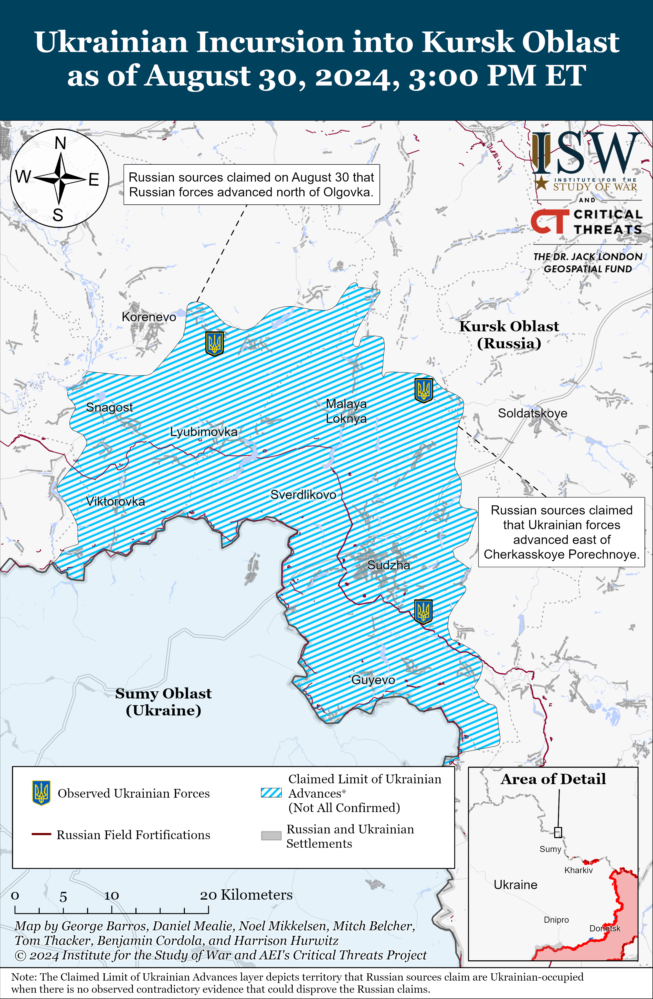
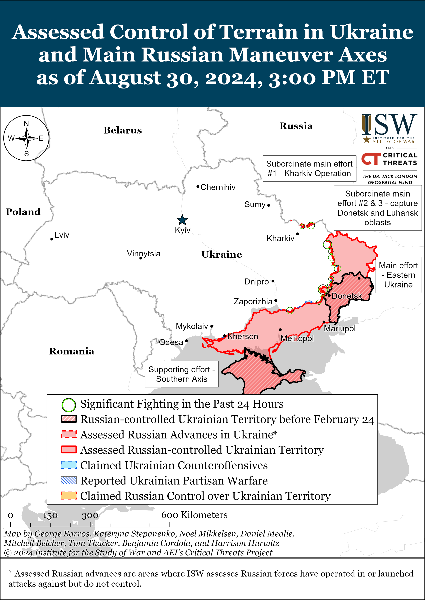
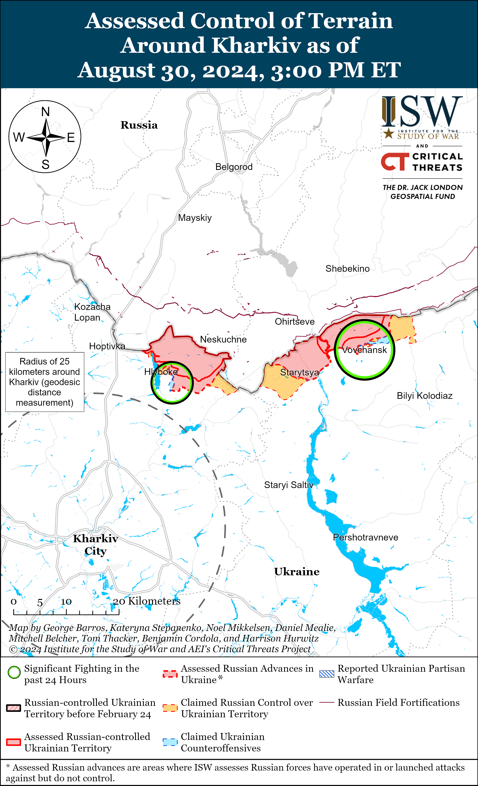
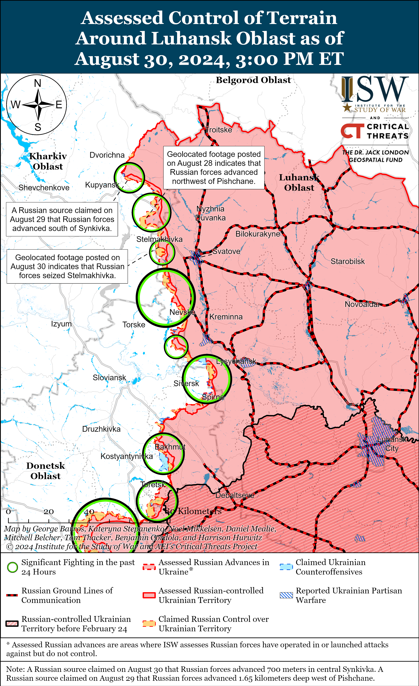
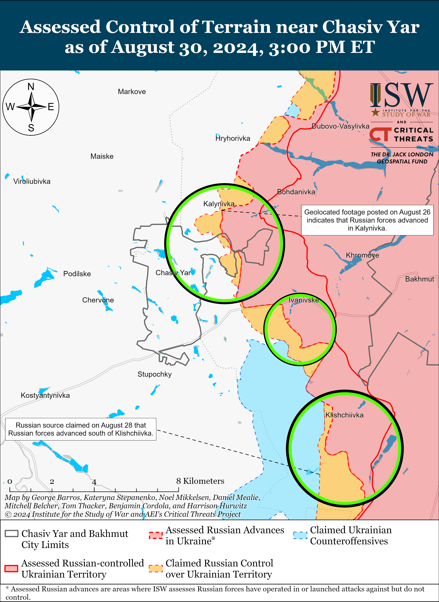
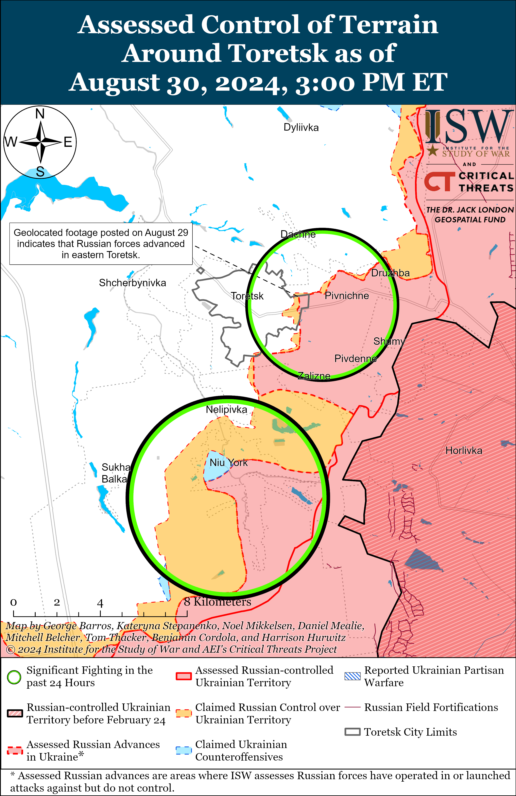
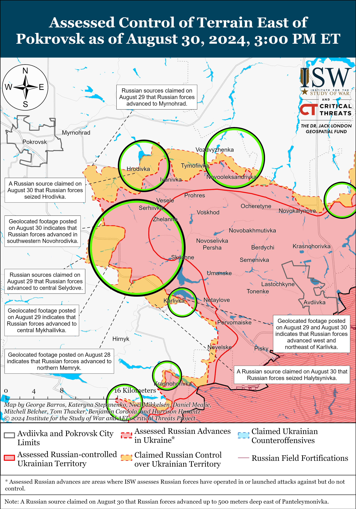
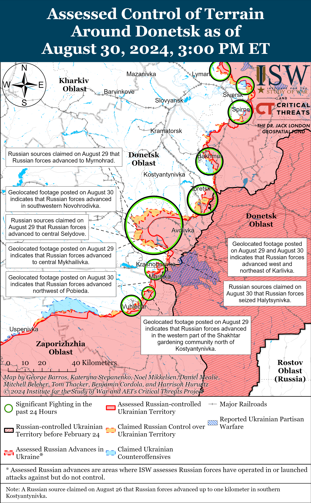
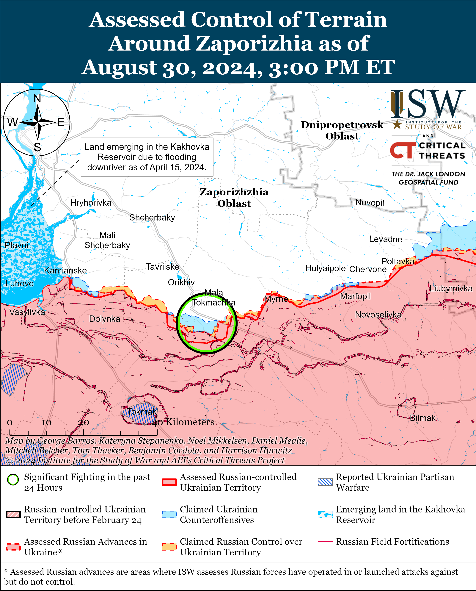
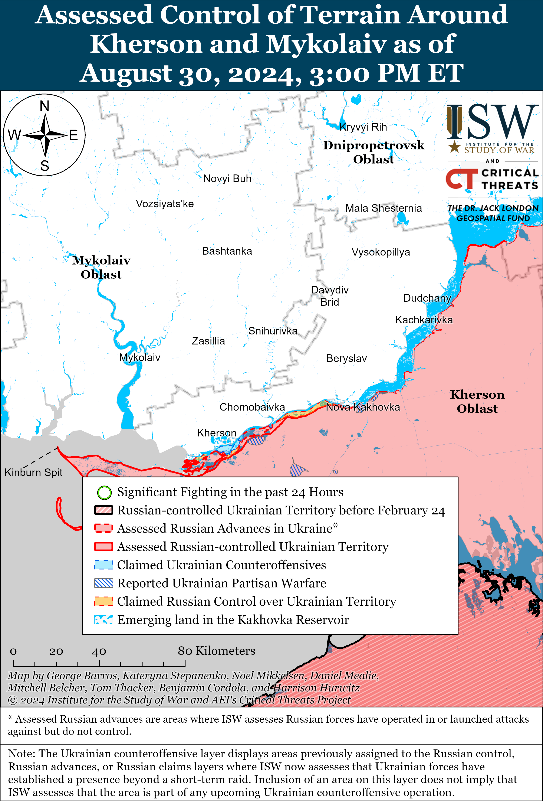

# Russian Offensive Campaign Assessment, August 30, 2024

**Riley Bailey, Davit Gasparyan, Christina Harward, Grace Mappes, and George Barros**

**August 30, 2024, 8:10pm ET**

**Click** [**here**](https://storymaps.arcgis.com/stories/36a7f6a6f5a9448496de641cf64bd375) **to see ISW’s interactive map of the Russian invasion of Ukraine. This map is updated daily alongside the static maps present in this report.**

**Click** [**here**](https://storymaps.arcgis.com/stories/83a2f24901c941d581c0c523ecd2619b) **to see ISW’s interactive map of Ukraine’s offensive in Kursk Oblast.**

**Click** [**here**](https://understandingwar.maps.arcgis.com/apps/instant/3dviewer/index.html?appid=1602762dbcde419bb957dea358449580) **to see ISW’s 3D control of terrain topographic map of Ukraine. Use of a computer (not a mobile device) is strongly recommended for using this data-heavy tool.**

**Click** [**here**](https://storymaps.arcgis.com/stories/733fe90805894bfc8562d90b106aa895) **to access ISW’s archive of interactive time-lapse maps of the Russian invasion of Ukraine. These maps complement the static control-of-terrain map that ISW produces daily by showing a dynamic frontline. ISW will update this time-lapse map archive monthly.**

**Note: The data cut-off for this product was 12:40pm ET on August 30. ISW will cover subsequent reports in the August 31 Russian Offensive Campaign Assessment.**

**European Union (EU) member state officials continue to express divergent views about Ukraine’s ability to use European-provided weapons to strike military targets in Russia.** EU High Commissioner Josep Borrell stated on August 30 that the decision to lift such restrictions is up to each EU member state individually, as not all EU states have provided Ukraine with long-range weapons.[1] Czech President Petr Pavel stated on August 30 that Ukraine should decide how to use its Western-provided weapons in accordance with the United Nations (UN) Charter.[2] Estonian Defense Minister Hanno Pevkur urged Western partners to lift restrictions on Ukraine’s ability to use Western-provided weapons to strike military targets in Russia.[3] Polish Deputy Defense Minister Pawel Zalewski stated on August 30 that Poland supports lifting restrictions on Ukraine’s ability to conduct long-range strikes against military targets in Russia using Polish-provided weapons.[4] Italian Foreign Minister Antonio Tajani stated on August 29 that Italy will not allow Ukraine to use Italian-provided weapons for strikes against military targets on Russian territory as neither NATO nor Italy are at war with Russia.[5] Italy has reportedly supplied Ukraine with Storm Shadow missiles.[6] The United Kingdom reportedlyseeks to allow Ukrainian forces to use UK-provided Storm Shadows for strikes into Russia, but US prohibitions are preventing the United Kingdom from unilaterally doing so.[7] Italy’s refusal to allow Ukraine to use Italian-provided Storm Shadows for such strikes suggests that Ukrainian forces may have to abide by different rules for the use of the same missile type depending on the country of origin. ISW has previously assessed that Western allies’ divergent policies on weapons use complicate logistics for Ukrainian forces, who must carefully navigate the origins and guidelines of the weapons to abide by specific regulations.[8]

**Russian sources claimed that Ukrainian and Russian forces made marginal gains in Kursk Oblast on August 30.** Russian milbloggers claimed that Russian forces advanced on the southern outskirts of Korenevo, in the fields north of Olgovka (east of Korenevo), and south of Sheptukhovka (northeast of Korenevo).[9] Russian milbloggers claimed that Ukrainian forces advanced east of Cherkasskoye Porechnoye and Nizhnyaya Parovaya (both north of Sudzha).[10] Russian milbloggers claimed that Ukrainian forces conducted assaults southwest of Korenevo near Snagost and Krasnooktyabrskoye; near Korenevo itself; east of Korenevo near Kremyanoye; north of Sudzha near Cherkasskoye Porechnoye, Kamyshevka, and Kireyevka; northeast of Sudzha near Martynovka; and southeast of Sudzha near Borki on August 30.[11] Elements of the Russian 30th Motorized Rifle Regiment (72nd Motorized Rifle Division, 44th Army Corps [AC], Leningrad Military District [LMD]) are reportedly operating near Malaya Loknya (northwest of Sudzha).[12]

**Russian state-owned polling agencies are recognizing limited upticks in Russian domestic discontent towards Russian President Vladimir Putin and Russian authorities amid the Ukrainian incursion into Kursk Oblast.** The Public Opinion Foundation, a Russian state-owned polling institution, published a poll on August 30 that it conducted on August 25 showing that 28 percent of respondents expressed outrage or dissatisfaction with the actions of Russian authorities over the past month.[13] This is up from 25 percent and 18 percent in polls that the Public Opinion Foundation conducted on August 11 and July 28, respectively.[14] Respondents to the Public Opinion Foundation poll have not expressed such high dissatisfaction since polling conducted in November 2022, following the first month of the deeply unpopular partial mobilization in Russia.[15] The Russian state-owned Public Opinion Research Center (VCIOM) noted that Putin’s approval rating fell by 3.5 percent to 73.6 percent between August 12 and 18 — a record fall in Putin’s approval rating, even among Kremlin pollsters, since the start of the full-scale invasion in February 2022.[16] VCIOM released its latest polling on Putin’s approval rating on August 30, showing an additional 1.2 percent decline to 72.4 percent between August 19 and 25.[17] These polls from Russian state-owned polling agencies do not suggest particularly pronounced discontent nor are they reliable reflections of the actual sentiments in Russian society. The polls do suggest, however, that the Kremlin assesses that it must recognize that societal discontent has risen since the start of Ukraine’s incursion into Kursk Oblast. The Kremlin likely hopes that limited acknowledgment of societal discontent will guard against accusations that it is ignoring Russian society’s concern about the Ukrainian incursion. The Kremlin appears to have launched an intricate messaging campaign aimed at justifying to its domestic audience why Russia is prioritizing the maintenance of offensive operations in eastern Ukraine over immediately expelling Ukrainian forces from Kursk Oblast, and limited acknowledgments of discontent may be a part of this campaign.[18]

**Venezuela extradited Colombian citizens who fought as members of the Ukrainian military to Russia, demonstrating growing Russian-Venezuelan cooperation and Venezuelan support for Russia’s war.** The Russian Federal Security Service (FSB) arrested two Colombian citizens for fighting as mercenaries in the Ukrainian military on August 30.[19] The Colombian citizens were flying from Ukraine to Colombia via Caracas in July 2024, and Venezuelan authorities in Caracas detained and extradited them from Venezuela to Russia. Foreign states have charged their citizens for mercenarism for fighting with Russian forces, and Russia has placed accused ”mercenaries” who served in the Ukrainian military on the Russian wanted list.[20] *Politico* noted on August 30, however, that this is the first public case of a foreign state extraditing accused mercenaries from other states to Russia.[21] Venezuela’s extradition comes against the backdrop of recent growing Russian-Venezuelan ties and Russian efforts to demonstrate its influence among “friendly” states in the Western hemisphere.[22]

**Hungary and Russia continue to deepen their bilateral cooperation.** Hungarian Foreign Minister Peter Szijjarto met with Alexey Miller, the head of Russian state energy company Gazprom, to discuss Russia’s export of gas to Hungary and bilateral cooperation.[23] Russian state news outlet *TASS* reported that Hungary imports more than half of its gas from Russia, importing 4.8 billion cubic meters of Russian gas through the Turkish Stream pipeline in 2022 and 5.6 billion cubic meters in 2023.[24] Miller has recently made or sought to make gas deals with the People’s Republic of China (PRC) and Iran – both of which are close Russian partners – so his meeting with Szijjarto is notable. Intensified Russian-Hungarian cooperation follows Hungarian Prime Minister Viktor Orban’s recent efforts to posture himself as a possible mediator between Russia and Ukraine and statements amplifying several Kremlin information operations.[25]

**Ukrainian President Volodymyr Zelensky dismissed Lieutenant General Mykola Oleshchuk as Ukrainian Air Force Commander on August 30.[26]** The Ukrainian General Staff reported that Ukrainian Commander-in-Chief General Oleksandr Syrskyi appointed the commander of Ukraine’s Central Air Command, Lieutenant General Anatoly Kryvonozhko, as acting Ukrainian Air Force Commander.[27]

**Key Takeaways:**

- **European Union (EU) member state officials continue to express divergent views about Ukraine’s ability to use European-provided weapons to strike military targets in Russia.**
- **Russian sources claimed that Ukrainian and Russian forces made marginal gains in Kursk Oblast on August 30.**
- **Russian state-owned polling agencies are recognizing limited upticks in Russian domestic discontent towards Russian President Vladimir Putin and Russian authorities amid the Ukrainian incursion into Kursk Oblast.**
- **Venezuela extradited Colombian citizens who fought as members of the Ukrainian military to Russia, demonstrating growing Russian-Venezuelan cooperation and Venezuelan support for Russia’s war.**
- **Hungary and Russia continue to deepen their bilateral cooperation.**
- **Ukrainian President Volodymyr Zelensky dismissed Lieutenant General Mykola Oleshchuk as Ukrainian Air Force Commander on August 30.**
- **Russian forces recently advanced near Svatove, Pokrovsk, and Donetsk City.**
- **French outlet *Le Monde* reported on August 30 that about 100 mercenaries from the Russian “Bear Brigade” private military company departed Burkina Faso to join Russian forces fighting in Kursk Oblast.**

[******](https://understandingwar.org/wp-content/uploads/2025/05/DraftUkraineCoT20August20302C202024.png)

***We do not report in detail on Russian war crimes because these activities are well-covered in Western media and do not directly affect the military operations we are assessing and forecasting. We will continue to evaluate and report on the effects of these criminal activities on the Ukrainian military and the Ukrainian population and specifically on combat in Ukrainian urban areas. We utterly condemn Russian violations of the laws of armed conflict and the Geneva Conventions and crimes against humanity even though we do not describe them in these reports.***

- Russian Main Effort – Eastern Ukraine (comprised of three subordinate main efforts)
- Russian Subordinate Main Effort #1 – Push Ukrainian forces back from the international border with Belgorod Oblast and approach to within tube artillery range of Kharkiv City
- Russian Subordinate Main Effort #2 – Capture the remainder of Luhansk Oblast and push westward into eastern Kharkiv Oblast and encircle northern Donetsk Oblast
- Russian Subordinate Main Effort #3 – Capture the entirety of Donetsk Oblast
- Russian Supporting Effort – Southern Axis
- Russian Air, Missile, and Drone Campaign
- Russian Mobilization and Force Generation Efforts
- Russian Technological Adaptations
- Activities in Russian-occupied areas
- Ukrainian Defense Industrial Base Efforts
- Russian Information Operations and Narratives
- Significant Activity in Belarus

**Russian Main Effort – Eastern Ukraine**

**Russian Subordinate Main Effort #1 – Kharkiv Oblast (Russian objective: Push Ukrainian forces back from the international border with Belgorod Oblast and approach to within tube artillery range of Kharkiv City)**

Fighting continued north and northeast of Kharkiv City on August 30, but there were no confirmed changes to the frontline. The Ukrainian General Staff reported that Russian forces continued offensive operations north of Kharkiv City near Lyptsi and northeast of Kharkiv City near Pletenivka and Vovchansk on August 29 and 30.[28] A Russian milblogger claimed on August 30 that Russian forces repelled small Ukrainian assault groups that attacked near Ohirtseve (northeast of Kharkiv City).[29] Ukrainian Kharkiv Group of Forces Spokesperson Colonel Vitaly Sarantsev reported that Russian forces recently failed to deliver assault groups to unspecified areas within Vovchansk with armored vehicles due to Ukrainian fires and first-person viewer (FPV) drones.[30] Sarantsev stated that Russian forces are continuing to transfer elements of the 136th Motorized Rifle Brigade (58th Combined Arms Army [CAA], Southern Military District [SMD]) to positions near Tykhe (northeast of Kharkiv City and east of Vovchansk) to conduct a relief in place for elements of the 83rd Airborne (VDV) Brigade in the area.[31] Sarantsev added that Russian forces are transferring over 100 personnel of unspecified units from Leningrad Oblast to the Kharkiv direction to replenish losses and conduct assault operations.[32]

[****](https://understandingwar.org/wp-content/uploads/2025/05/Kharkiv20Battle20Map20Draft20August20302C202024.png)

**Russian Subordinate Main Effort #2 – Luhansk Oblast (Russian objective: Capture the remainder of Luhansk Oblast and push westward into eastern Kharkiv Oblast and northern Donetsk Oblast)**

Russian forces recently advanced northwest of Svatove amid continued Russian offensive operations along the Kupyansk-Svatove-Kreminna line on August 30. Geolocated footage published on August 30 shows Russian forces raising a Russian flag in the center of Stelmakhivka (northwest of Svatove), indicating that Russian forces seized the settlement.[33] The Russian Ministry of Defense (MoD) claimed on August 29 that Russian forces seized Stelmakhivka, and Russian Defense Minister Andrei Belousov congratulated elements of the 423rd Motorized Rifle Regiment (4th Tank Division, 1st Guards Tank Army [GTA], Moscow Military District [MMD]) for seizing the settlement.[34] The Russian MoD also claimed that Russian forces seized Synkivka (northeast of Kupyansk), and Russian milbloggers claimed that Russian forces advanced further south of the settlement.[35] Some Russian milbloggers, however, claimed that Russian forces still need to clear one or two remaining streets in Synkivka before fully seizing the settlement.[36] Russian milbloggers claimed on August 29 and 30 that Russian forces advanced 1.65 kilometers deep west of Pishchane (northwest of Svatove) and in fields northwest of Berestove (northwest of Svatove).[37] ISW has not observed confirmation of these Russian claims. Russian forces continued offensive operations northeast of Kupyansk near Synkivka; northwest of Svatove near Stepova Novoselivka and Kolisynkivka and in the direction of Lozova; west of Svatove near Myasozharivka; southwest of Svatove near Tverdokhlibove, Druzhelyubivka, Novoserhiivka, and Cherneshchyna; northwest of Kreminna near Novosadove, Nevske, and Hrekivka; west of Kreminna near Torske; and south of Kreminna in the Serebryanske forest area on August 29 and 30.[38]

**Russian Subordinate Main Effort #3 – Donetsk Oblast (Russian objective: Capture the entirety of Donetsk Oblast, the claimed territory of Russia’s proxies in Donbas)**

Russian forces continued offensive operations in the Siversk direction on August 30, but there were no confirmed changes to the frontline. The Ukrainian General Staff reported that Russian forces conducted offensive operations east of Siversk near Verkhnokamyanske; southeast of Siversk near Vyimka and Ivano-Darivka; and south of Siversk towards Zvanivka on August 29 and 30.[39] Elements of the Russian 106th Airborne (VDV) Division are reportedly operating in the Siversk direction.[40]

Russian forces continued offensive operations near Chasiv Yar on August 30, but there were no confirmed changes to the frontline. The Ukrainian General Staff reported that Russian forces conducted offensive operations near Chasiv Yar itself, north of Chasiv Yar near Kalynivka, east of Chasiv Yar near Ivanivske, south of Chasiv Yar towards Stupochky, and southeast of Chasiv Yar near Andriivka and Klishchiivka on August 29 and 30.[41] Elements of the Russian Sever-V Brigade (Russian Volunteer Corps) are reportedly operating near Hryhorivka (north of Chasiv Yar).[42]

Russian forces reportedly advanced near Toretsk on August 30 but there were no confirmed changes to the frontline. Russian milbloggers claimed that Russian forces advanced within western Druzhba (northeast of Toretsk), within northwestern Pivnichne (east of Toretsk), within southeastern Toretsk, on the eastern outskirts of Toretsk, northwest of Niu York (south of Toretsk), west of Yurivka (south of Toretsk), and up to 500 meters deep east of Panteleymonivka (southwest of Toretsk).[43] A Russian source claimed that Russian forces have consolidated their positions within Pivnichne in an area up to 950 meters wide.[44] ISW has not observed confirmation of these claims, however. Russian forces conducted offensive operations near Toretsk; northeast of Toretsk near Dachne; east of Toretsk near Pivnichne; southeast of Toretsk near Zalizne; south of Toretsk near Nelipivka; and southwest of Toretsk near Sukha Balka on August 29 and 30.[45] Elements of the Russian 132nd Motorized Rifle Brigade (1st Donetsk People’s Republic [DNR] Army Corps [AC]) are reportedly operating in the Toretsk direction.[46]

Russian forces recently advanced near Pokrovsk amid continued Russian offensive operations in the area on August 30. Geolocated footage published on August 29 shows elements of the Russian 60th “Somali” Motorized Rifle Battalion (1st DNR AC) raising a flag in the dacha area northeast of Karlivka (southeast of Pokrovsk), and additional geolocated footage published on August 30 shows elements of the Russian 114th Motorized Rifle Brigade (1st DNR AC) planting a flag in the dachas west of Karlivka, indicating that Russian forces recently advanced in these areas.[47] Further geolocated footage published on August 30 indicates that Russian forces recently advanced within southwestern Novohrodivka (southeast of Pokrovsk).[48] Russian milbloggers claimed that Russan forces seized Hrodivka (east of Pokrovsk), Karlivka, and Halytsynivka (southeast of Pokrovsk) and advanced northwest of Novohrodivka, southeast of Karlivka, north of Halytsynivka, south of Memryk (southeast of Pokrovsk), and 550 meters deep within Mykhailivka (southeast of Pokrovsk).[49] ISW has not observed confirmation of these Russian claims, however. A Russian source denied previous Russian claims that Russian forces reached the center of Selydove, claiming that Ukrainian forces hold positions in the area.[50] Russian forces continued offensive operations east of Pokrovsk near Zelene Pole, Vozdvyzhenka, Hrodivka, and Myrolyubivka and southeast of Pokrovsk near Karlivka, Novohrodivka, Marynivka, Mykhailivka, Ukrainsk, and Selydove on August 29 and 30.[51] A Russian milblogger claimed that Ukrainian forces unsuccessfully counterattacked near Memryk.[52] Elements of the Russian 55th Motorized Rifle Brigade (41st Combined Arms Army [CAA], Central Military District [CMD]) reportedly seized Hrodivka.[53]

Russian forces continued offensive operations west of Donetsk City on August 30, but there were no confirmed changes to the frontline. A Ukrainian brigade operating in the Kurakhove direction (west and southwest of Donetsk City) posted footage of Ukrainian forces repelling a reinforced company-sized Russian mechanized assault and reported that Ukrainian forces destroyed 13 of the 17 Russian armored vehicles reportedly in the Heohiivka direction.[54] Russian forces continued offensive operations near Heorhiivka and Krasnohorivka on August 29 and 30.[55]

Russian forces recently advancedsouthwest of Donetsk City amid continued Russian offensive operations in the area on August 30. Geolocated footage published on August 29 and 30 indicates that Russian forces recently advanced north of Kostyantynivka and northwest of Pobieda.[56] The Russian Ministry of Defense (MoD) claimed that Russian forces seized Kostyantynivka, but select Russian milbloggers claimed that Ukrainian forces still hold positions in northwestern Kostyantynivka.[57] Russian milbloggers claimed that Russian forces advanced near Paraskoviivka and 1.2 deep kilometers northwest of Kostyantynivka.[58] Russian forces continued offensive operations near Kostyantynivka, Vodyane, and Vuhledar on August 29 and 30.[59] Elements of the Russian 57th Motorized Rifle Brigade (5th CAA, Eastern Military District [EMD]) and the “Dostavalov” Volunteer Battalion are reportedly operating in Kostyantynivka.[60]

A Russian milblogger claimed that Russian forces advanced in the Donetsk-Zaporizhia Oblast border area north of Urozhaine on August 30, but there were no confirmed changes to the frontline in this area.[61]

**Russian Supporting Effort – Southern Axis (Russian objective: Maintain frontline positions and secure rear areas against Ukrainian strikes)**

Positional fighting continued in western Zaporizhia Oblast near Robotyne and Mala Tokmachka (northeast of Robotyne) on August 29 and 30, but there were no confirmed changes to the frontline.[62] Ukrainian Tavriisk Group of Forces Spokesperson Captain Dmytro Lykhovyi stated that the Hulyaipole direction, the Robotyne area, and the east (left) bank of the Dnipro River have been relatively calm and that Russian forces do not have sufficient resources to conduct regular large attacks in these directions.[63] Lykhovyi stated that the low Russian operational tempo in these areas may be due to the transfer of several Russian units from these directions to Kursk Oblast.

Fighting continued in eas bank Kherson Oblast on August 29 and 30, but there were no confirmed changes to the frontline.[64] Elements of the Russian 144th Motorized Rifle Brigade (18th Combined Arms Army [CAA], Southern Military District [SMD]) reportedly continue to operate in the Kherson direction.[65]

**Russian Air, Missile, and Drone Campaign (Russian Objective: Target Ukrainian military and civilian infrastructure in the rear and on the frontline)**

Russian forces conducted a series of missile and drone strikes against Ukraine overnight on August 29 to 30. The Ukrainian Air Force reported that Russian forces launched one Iskander-M ballistic missile from occupied Crimea and 18 Shahed-136/131 drones from Primorsko-Akhtarsk, Krasnodar Krai and Kursk Oblast.[66] The Ukrainian Air Force reported that Ukrainian forces downed 12 of the Shaheds over Vinnytsia, Mykolaiv, Dnipropetrovsk, Kherson, and Sumy oblasts, and that another four Shaheds crashed on their own due to unspecified reasons.[67] The Sumy Oblast Military Administration reported that Russian forces struck civilian infrastructure in Sumy City overnight.[68] Russian opposition outlet *Astra* stated that Russian forces struck port infrastructure in Odesa City, and a Russian milblogger claimed that Russian forces also struck energy infrastructure in Poltava Oblast.[69]

**Russian Mobilization and Force Generation Efforts (Russian objective: Expand combat power without conducting general mobilization)**

French outlet *Le Monde* reported on August 30 that about 100 mercenaries from the Russian “Bear Brigade” private military company departed Burkina Faso to join Russian forces fighting in Kursk Oblast.[70] *Le Monde* reported that 200 to 300 personnel of the Bear Brigade have been working with the Burkinabe junta military and intelligence services since May 2024. The Brigade’s commander, Viktor Yermolaev, confirmed the withdrawal of about 100 personnel on August 22, claiming that the mercenaries would instead focus on defending Russia. An unspecific Western official, however, told *Le Monde* that the Bear Brigade may be leaving Burkina Faso due to fighters’ complaints about problems with payments.

Russian authorities continue efforts to encourage volunteers to sign contracts with the Ministry of Defense (MoD) to avoid conducting a wider mobilization. Russian opposition outlets reported on August 30 that Russian officials are widely advertising contract service with the MoD in St. Petersburg schools’ and kindergartens’ online groups.[71] Independent Russian language outlet *Idel Realii* stated on August 30 that Russian authorities are also advertising MoD contract service at ceremonial events celebrating the Day of the Republic in Kazan, Republic of Tatarstan.[72] In addition, independent Russian language outlet *Sever Realii* reported on August 30 that the Republic of Karelia is offering a one-time payment of 400,000 rubles (about $4,400) for those who sign a MoD contract for one year between August 1 and December 31, 2024.[73]

Zaporizhia Oblast occupation senator Dmitry Rogozin claimed on August 30 that the number of volunteer applications to join the Russian “BARS-SARMAT” Detachment is sufficient to form an entire brigade.[74] Rogozin previously characterized the “BARS-SARMAT” Detachment as a volunteer detachment specializing in robotic electronic complexes and systems.[75]

A Russian milblogger claimed on August 30 that milbloggers raised the issue of former Wagner Group personnel’s ability to obtain combat veteran certificates during a recent meeting with Russian Defense Minister Andrei Belousov.[76] The milblogger claimed that Belousov then issued an order allowing Wagner personnel to apply for combat veteran certificates through the “Defenders of the Fatherland” foundation.

**Russian Technological Adaptations (Russian objective: Introduce technological innovations to optimize systems for use in Ukraine)**

Nothing significant to report.

**Ukrainian Defense Industrial Efforts (Ukrainian objective: Develop its defense industrial base to become more self-sufficient in cooperation with US, European, and international partners)**

*ISW is suspending publishing coverage of Ukrainian defense industrial efforts until further notice.*

**Activities in Russian-occupied areas (Russian objective: Consolidate administrative control of annexed areas; forcibly integrate Ukrainian citizens into Russian sociocultural, economic, military, and governance systems)**

*ISW is not publishing coverage of activities in Russian-occupied areas today.*

**Russian Information Operations and Narratives**

Russian and Belarusian authorities continue to accuse Western countries, and particularly allies of Ukraine, of human rights violations. The Russian and Belarusian Ministries of Foreign Affairs (MFAs) published a joint report on August 30 condemning alleged human rights violations in Estonia, Latvia, and Lithuania, accusing the three countries of fostering “Nazism”, antisemitism, Russophobia, and suppressing the rights of minorities.[77] The Russian and Belarusian MFAs have previously published similar allegations against Germany, Denmark, Spain, Italy, Belgium, Canada, Switzerland, and Australia.[78]

Russian officials continue efforts to push the West to self-deter during critical debates in the West. Russian State Duma Defense Committee Chairperson Andrei Kartapolov claimed on August 30 that Russia will respond harshly, immediately, and “asymmetrically” if European countries lift restrictions on Ukrainian forces using European-supplied weapons to strike military targets in Russia.[79]

Royal United Services Institute’s (RUSI) Darya Dolzikova countered the Russian information operation claiming that Ukrainian forces intend to endanger the Kursk Nuclear Power Plant (KNPP), stating that there is no evidence to support Russia’s claims.[80] Dolzikova stated on August 30 that Ukrainian forces have little operational or strategic incentive to threaten the KNPP.

**Significant activity in Belarus (Russian efforts to increase its military presence in Belarus and further integrate Belarus into Russian-favorable frameworks and Wagner Group activity in Belarus)**

Belarusian President Alexander Lukashenko received phone calls from a number of officials of various Commonwealth of Independent States (CIS) members on August 30, including Russian President Vladimir Putin, Russian Security Council Deputy Chairperson Dmitry Medvedev, Russian Federation Council Chairperson Valentina Matvienko, Tajikistan President Emomali Rahmon, Azerbaijan President Ilham Aliyev, and Uzbekistan President Shavkat Mirziyoyev.[81] Lukashenko and these officials discussed bilateral relations and the coming CIS summit in Moscow on October 8, 2024.

**Note: ISW does not receive any classified material from any source, uses only publicly available information, and draws extensively on Russian, Ukrainian, and Western reporting and social media as well as commercially available satellite imagery and other geospatial data as the basis for these reports. References to all sources used are provided in the endnotes of each update.**

---

[1] https://www.youtube.com/live/7bK23vveGt?si=N6-ritky2ojeOxVU; https://www.yahoo.com/news/eu-state-decide-restrictions-ukraines-185747443.html

[2] https://mil dot in.ua/uk/news/ukrayina-povynna-sama-vyrishuvaty-chy-zastosovuvaty-f-16-po-tsilyah-na-terytoriyi-rf-prezydent-chehiyi/ ; https://www.novinky dot cz/clanek/domaci-pavel-hlavni-kartu-ma-v-ruce-putin-40485971

[3] https://www.ukrinform dot ua/rubric-world/3900327-estonia-zaklikae-znati-obmezenna-na-vikoristanna-ukrainou-zahidnoi-zbroi.html

[4] https://www.ukrinform dot net/rubric-polytics/3900522-poland-says-not-going-to-down-russian-missiles-drones-over-ukraine.html ; https://polskieradio24 dot pl/artykul/3419470,nie-bedziemy-zestrzeliwac-rosyjskich-rakiet-zalewski-odpowiada-ukrainie

[5] https://www.corriere dot it/politica/24\_agosto\_29/tajani-italia-armi-ucraina-bdc394f3-d11e-4bac-9685-90414e635xlk.shtml; https://suspilne dot media/824815-italia-ne-dozvolae-zsu-biti-svoeu-zbroeu-po-cilah-u-rosii/

[6] https://www.defensenews.com/global/europe/2024/04/29/italy-has-given-ukraine-long-range-missiles-says-uk-defense-minister/

[7] https://isw.pub/UkrWar082824

[8] https://understandingwar.org/backgrounder/russian-offensive-campaign-assessment-june-6-2024

[9] https://t.me/dva\_majors/51097; https://t.me/warhistoryalconafter/182132; https://t.me/rybar/63160; https://t.me/romanov\_92/45142

[10] https://t.me/dva\_majors/51097; https://t.me/warhistoryalconafter/182132; https://t.me/rybar/63160; https://t.me/romanov\_92/45142

[11] https://t.me/rybar/63156; https://t.me/dva\_majors/51049 ; https://t.me/rybar/63160 ; https://t.me/dva\_majors/51097; https://t.me/warhistoryalconafter/182132 ; https://t.me/motopatriot/27013 ;

[12] https://t.me/RVvoenkor/75956

[13] https://t.me/svobodnieslova/5538 ; https://fom dot ru/Dominanty/15065

[14] https://t.me/svobodnieslova/5538 ; https://fom dot ru/Dominanty/15065

[15] https://fom dot ru/Dominanty/15065

[16] https://t.me/agentstvonews/7086 ; https://wciom dot ru/analytical-reviews/analiticheskii-obzor/reitingi-doverija-politikam-ocenki-raboty-prezidenta-i-pravitelstva-podderzhka-politicheskikh-partii-23082024

[17] https://wciom dot ru/analytical-reviews/analiticheskii-obzor/reitingi-doverija-politikam-ocenki-raboty-prezidenta-i-pravitelstva-podderzhka-politicheskikh-partii-30082024

[18] https://understandingwar.org/backgrounder/russian-offensive-campaign-assessment-august-21-2024-0

[19] https://www.politico.eu/article/maduro-putin-russia-arrest-two-colombians-fighting-ukraine-venezuela/; https://www.rbc dot ru/politics/30/08/2024/66d1798e9a7947814c97b3ac; http://www.fsb dot ru/fsb/press/message/single.htm%21id%3D10440067%40fsbMessage.html

[20] https://understandingwar.org/backgrounder/russian-offensive-campaign-assessment-january-4-2023-0; https://isw.pub/UkrWar120523 ; https://isw.pub/UkrWar112923; https://isw.pub/UkrWar072224

[21] https://www.politico.eu/article/maduro-putin-russia-arrest-two-colombians-fighting-ukraine-venezuela/

[22] https://isw.pub/UkrWar072124; https://isw.pub/UkrWar062524

[23] https://tass dot ru/ekonomika/21726179

[24] https://tass dot ru/ekonomika/21726179

[25] https://isw.pub/UkrWar071924; https://understandingwar.org/backgrounder/russian-offensive-campaign-assessment-july-17-2024; https://isw.pub/UkrWar071524; https://isw.pub/UkrWar071124; https://isw.pub/UkrWar070824; https://isw.pub/UkrWar070624; https://isw.pub/UkrWar070524; https://understandingwar.org/backgrounder/russian-offensive-campaign-assessment-june-3-2024; https://understandingwar.org/backgrounder/russian-offensive-campaign-assessment-june-26-2024

[26] https://www.president.gov dot ua/documents/6002024-52005

[27] https://www.facebook.com/GeneralStaff.ua/posts/pfbid02PvPqXy1fmTXHBsSbYwxASYqc6sM9AbaUPM3NAxp4z5gwk8yHifQ24gPGz2hqSsgul

[28] https://www.facebook.com/GeneralStaff.ua/posts/pfbid0aLSHJ9MJ1ddCBK7zyPALWoJ1dYgNkBE1uar1Uy533NLygLhbVQwrMHtJnmfdskCbl ; https://www.facebook.com/GeneralStaff.ua/posts/pfbid0tZorB948eRNrVfvy3ZLX4AbhauUjeKcVssBr68Ha3G3XCnbGgyLFxo3Pcjns9hCRl ; https://www.facebook.com/GeneralStaff.ua/posts/pfbid02EdYwLmWZMUUDjMVgPSHX3haxonc7TzvtZNB82r6qBVJa4mZRv1VdcRmgxLoUd2uil

[29] https://t.me/DnevnikDesantnika/14743

[30] https://armyinform dot com.ua/2024/08/30/u-vovchansku-syly-oborony-znyshhyly-dvi-vorozhi-motolygy-ta-poshkodyly-tank/ ; https://armyinform dot com.ua/2024/08/29/detali-vidbyttya-bronovanogo-shturmu-okupantiv-u-vovchansku-povidomyly-v-otu-harkiv/; https://youtu.be/j5TqaWCCdUg

[31] https://armyinform dot com.ua/2024/08/29/proslavlenu-v-chechni-brygadu-zavodyat-okupanty-na-pivnich-harkivshhyny/

[32] https://armyinform dot com.ua/2024/08/29/proslavlenu-v-chechni-brygadu-zavodyat-okupanty-na-pivnich-harkivshhyny/

[33] https://x.com/EjShahid/status/1829539997365707135; https://t.me/warhistoryalconafter/182144

[34] https://www.kp dot ru/daily/27628.5/4978310/ ; https://t.me/mod\_russia/42775; https://understandingwar.org/backgrounder/russian-offensive-campaign-assessment-august-29-2024

[35] https://t.me/mod\_russia/42775 ; https://t.me/rybar/63156; https://t.me/dva\_majors/51049 ; https://t.me/motopatriot/26977

[36] https://t.me/dva\_majors/51090; https://t.me/belarusian\_silovik/40254 ; https://t.me/boris\_rozhin/135493

[37] https://t.me/RVvoenkor/75968 ; https://t.me/z\_arhiv/27873

[38] https://www.facebook.com/GeneralStaff.ua/posts/pfbid0aLSHJ9MJ1ddCBK7zyPALWoJ1dYgNkBE1uar1Uy533NLygLhbVQwrMHtJnmfdskCbl ; https://www.facebook.com/GeneralStaff.ua/posts/pfbid0tZorB948eRNrVfvy3ZLX4AbhauUjeKcVssBr68Ha3G3XCnbGgyLFxo3Pcjns9hCRl ; https://www.facebook.com/GeneralStaff.ua/posts/pfbid02EdYwLmWZMUUDjMVgPSHX3haxonc7TzvtZNB82r6qBVJa4mZRv1VdcRmgxLoUd2uil

[39] https://www.facebook.com/GeneralStaff.ua/posts/pfbid02EdYwLmWZMUUDjMVgPSHX3haxonc7TzvtZNB82r6qBVJa4mZRv1VdcRmgxLoUd2uil; https://www.facebook.com/GeneralStaff.ua/posts/pfbid0tZorB948eRNrVfvy3ZLX4AbhauUjeKcVssBr68Ha3G3XCnbGgyLFxo3Pcjns9hCRl ; https://www.facebook.com/GeneralStaff.ua/posts/pfbid0aLSHJ9MJ1ddCBK7zyPALWoJ1dYgNkBE1uar1Uy533NLygLhbVQwrMHtJnmfdskCbl

[40] https://t.me/mod\_russia/42778

[41] https://www.facebook.com/GeneralStaff.ua/posts/pfbid0aLSHJ9MJ1ddCBK7zyPALWoJ1dYgNkBE1uar1Uy533NLygLhbVQwrMHtJnmfdskCbl ; https://www.facebook.com/GeneralStaff.ua/posts/pfbid0tZorB948eRNrVfvy3ZLX4AbhauUjeKcVssBr68Ha3G3XCnbGgyLFxo3Pcjns9hCRl; https://www.facebook.com/GeneralStaff.ua/posts/pfbid02EdYwLmWZMUUDjMVgPSHX3haxonc7TzvtZNB82r6qBVJa4mZRv1VdcRmgxLoUd2uil

[42] https://t.me/tass\_agency/269412

[43] https://t.me/motopatriot/26991 ; https://t.me/rybar/63150 ; https://t.me/motopatriot/26993 ; https://t.me/rybar/63156; https://t.me/dva\_majors/51049; https://t.me/RVvoenkor/75968

[44] https://t.me/RVvoenkor/75968

[45] https://www.facebook.com/GeneralStaff.ua/posts/pfbid0aLSHJ9MJ1ddCBK7zyPALWoJ1dYgNkBE1uar1Uy533NLygLhbVQwrMHtJnmfdskCbl; https://www.facebook.com/GeneralStaff.ua/posts/pfbid0tZorB948eRNrVfvy3ZLX4AbhauUjeKcVssBr68Ha3G3XCnbGgyLFxo3Pcjns9hCRl ; https://www.facebook.com/GeneralStaff.ua/posts/pfbid02EdYwLmWZMUUDjMVgPSHX3haxonc7TzvtZNB82r6qBVJa4mZRv1VdcRmgxLoUd2uil ; https://t.me/rybar/63156; https://t.me/dva\_majors/51049; https://t.me/rybar/63150

[46] https://t.me/boris\_rozhin/135482; https://t.me/nm\_dnr/12659

[47] https://x.com/franfran2424/status/1829279037921153099; https://t.me/readovkanews/85845; https://t.me/creamy\_caprice/6601; https://t.me/RtrDonetsk/26730

[48] https://t.me/creamy\_caprice/6604 ; https://t.me/brygada47/987

[49] https://t.me/RtrDonetsk/26730 ; https://t.me/z\_arhiv/27866 ; https://t.me/motopatriot/27032 ; https://t.me/DnevnikDesantnika/14749; https://t.me/RVvoenkor/75968; https://t.me/RVvoenkor/75981

[50] https://understandingwar.org/backgrounder/russian-offensive-campaign-assessment-august-29-2024; https://t.me/motopatriot/27011

[51] https://www.facebook.com/GeneralStaff.ua/posts/pfbid0aLSHJ9MJ1ddCBK7zyPALWoJ1dYgNkBE1uar1Uy533NLygLhbVQwrMHtJnmfdskCbl ; https://www.facebook.com/GeneralStaff.ua/posts/pfbid0tZorB948eRNrVfvy3ZLX4AbhauUjeKcVssBr68Ha3G3XCnbGgyLFxo3Pcjns9hCRl ; https://www.facebook.com/GeneralStaff.ua/posts/pfbid02EdYwLmWZMUUDjMVgPSHX3haxonc7TzvtZNB82r6qBVJa4mZRv1VdcRmgxLoUd2uil ; https://t.me/DnevnikDesantnika/14749; https://t.me/wargonzo/21817; https://t.me/boris\_rozhin/135428; https://t.me/rusich\_army/16864

[52] https://t.me/rusich\_army/16864

[53] https://t.me/motopatriot/27032

[54] https://t.me/oaembr46/995; https://t.me/ButusovPlus/13183

[55] https://www.facebook.com/GeneralStaff.ua/posts/pfbid0aLSHJ9MJ1ddCBK7zyPALWoJ1dYgNkBE1uar1Uy533NLygLhbVQwrMHtJnmfdskCbl ; https://t.me/rusich\_army/16864 ; https://www.facebook.com/GeneralStaff.ua/posts/pfbid0tZorB948eRNrVfvy3ZLX4AbhauUjeKcVssBr68Ha3G3XCnbGgyLFxo3Pcjns9hCRl; https://www.facebook.com/GeneralStaff.ua/posts/pfbid02EdYwLmWZMUUDjMVgPSHX3haxonc7TzvtZNB82r6qBVJa4mZRv1VdcRmgxLoUd2uil; https://t.me/wargonzo/21817; https://t.me/RVvoenkor/75968

[56] https://t.me/creamy\_caprice/6603; https://t.me/mechanized33/308; https://t.me/creamy\_caprice/6591; https://t.me/odshbr79/322;

[57] https://t.me/mod\_russia/42775; https://t.me/dva\_majors/51090; https://t.me/belarusian\_silovik/40254

[58] https://t.me/DnevnikDesantnika/14746; https://t.me/z\_arhiv/27869

[59] https://www.facebook.com/GeneralStaff.ua/posts/pfbid0aLSHJ9MJ1ddCBK7zyPALWoJ1dYgNkBE1uar1Uy533NLygLhbVQwrMHtJnmfdskCbl ; https://www.facebook.com/GeneralStaff.ua/posts/pfbid0tZorB948eRNrVfvy3ZLX4AbhauUjeKcVssBr68Ha3G3XCnbGgyLFxo3Pcjns9hCRl ; https://www.facebook.com/GeneralStaff.ua/posts/pfbid02EdYwLmWZMUUDjMVgPSHX3haxonc7TzvtZNB82r6qBVJa4mZRv1VdcRmgxLoUd2uil; https://t.me/rusich\_army/16864; https://t.me/wargonzo/21817

[60] https://t.me/RVvoenkor/75946; https://t.me/boris\_rozhin/135421; https://t.me/RVvoenkor/75992

[61] https://t.me/motopatriot/26976

[62] https://www.facebook.com/GeneralStaff.ua/posts/pfbid0aLSHJ9MJ1ddCBK7zyPALWoJ1dYgNkBE1uar1Uy533NLygLhbVQwrMHtJnmfdskCbl; https://www.facebook.com/GeneralStaff.ua/posts/pfbid0tZorB948eRNrVfvy3ZLX4AbhauUjeKcVssBr68Ha3G3XCnbGgyLFxo3Pcjns9hCRl; https://www.facebook.com/GeneralStaff.ua/posts/pfbid02EdYwLmWZMUUDjMVgPSHX3haxonc7TzvtZNB82r6qBVJa4mZRv1VdcRmgxLoUd2uil; https://t.me/wargonzo/21817

[63] https://armyinform dot com.ua/2024/08/30/shho-spryyaye-sylam-oborony-na-pivdni-poyasnyly-v-ouv-tavriya/; https://armyinform dot com.ua/2024/08/30/syly-oborony-polipshyly-taktychne-stanovyshhe-na-livomu-berezi-dnipra/

[64] https://www.facebook.com/GeneralStaff.ua/posts/pfbid0aLSHJ9MJ1ddCBK7zyPALWoJ1dYgNkBE1uar1Uy533NLygLhbVQwrMHtJnmfdskCbl; https://www.facebook.com/GeneralStaff.ua/posts/pfbid0tZorB948eRNrVfvy3ZLX4AbhauUjeKcVssBr68Ha3G3XCnbGgyLFxo3Pcjns9hCRl; https://www.facebook.com/GeneralStaff.ua/posts/pfbid02EdYwLmWZMUUDjMVgPSHX3haxonc7TzvtZNB82r6qBVJa4mZRv1VdcRmgxLoUd2uil

[65] https://t.me/dva\_majors/51055

[66] https://t.me/kpszsu/18488

[67] https://t.me/kpszsu/18488

[68] https://armyinform dot com.ua/2024/08/30/nichnyj-aviaudar-po-sumah-poshkodzhena-infrastruktura-pozhezha-i-zadymlennya-mista/; https://t.me/Sumy\_news\_ODA/29375

[69] https://t.me/boris\_rozhin/135468; https://t.me/RVvoenkor/75963; https://t.me/astrapress/63039

[70] https://www.lemonde dot fr/en/le-monde-africa/article/2024/08/30/russian-paramilitaries-from-the-bear-brigade-leave-burkina-faso\_6723888\_124.html

[71] https://t.me/mobilizationnews/20035; https://t.me/severrealii/26980

[72] https://t.me/idelrealii/37281

[73] https://t.me/severrealii/26975

[74] https://t.me/rogozin\_do/6353

[75] https://understandingwar.org/backgrounder/russian-offensive-campaign-assessment-august-28-2024

[76] https://t.me/sashakots/48699

[77] https://t.me/MID\_Russia/44623

[78] https://understandingwar.org/backgrounder/russian-offensive-campaign-assessment-july-22-2024

[79] https://ria dot ru/20240830/kartapolov-1969504290.html

[80] https://rusi.org/explore-our-research/publications/commentary/kursk-nuclear-power-plant-newest-target-russian-disinformation ; https://t.me/orlovdmytroEn/4570

[81] https://president.gov dot by/ru/events/aleksandr-lukasenko-provel-rad-mezdunarodnyh-telefonnyh-razgovorov
