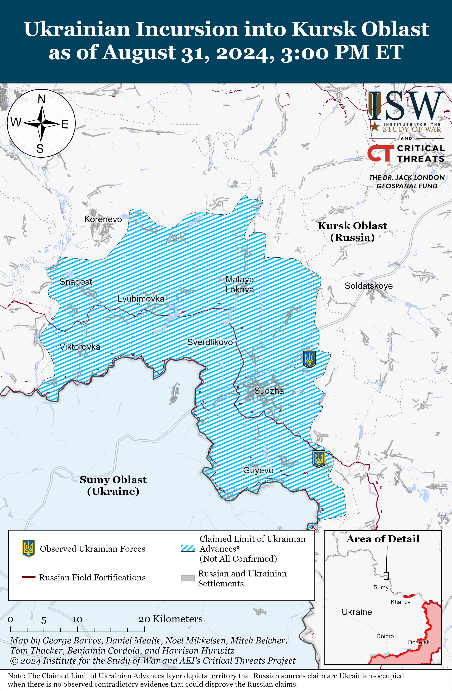
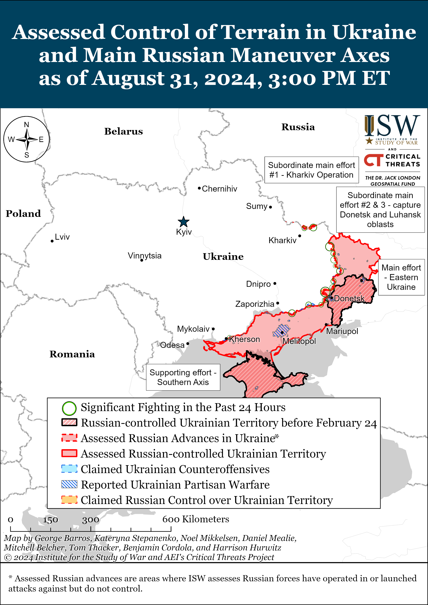
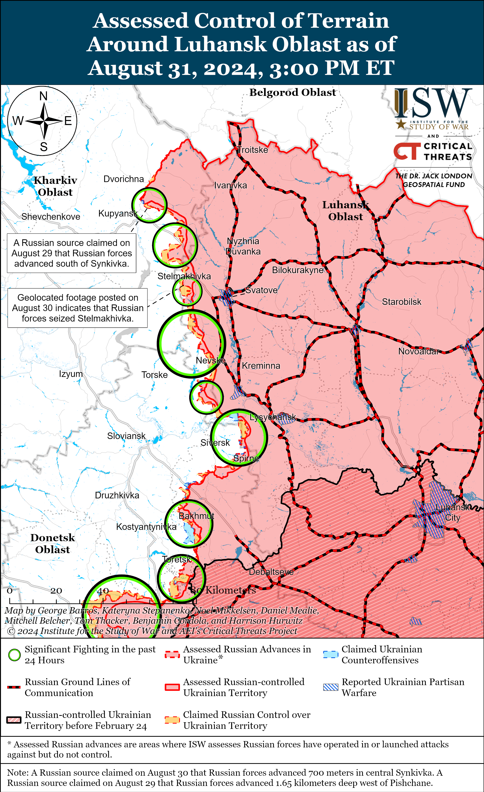
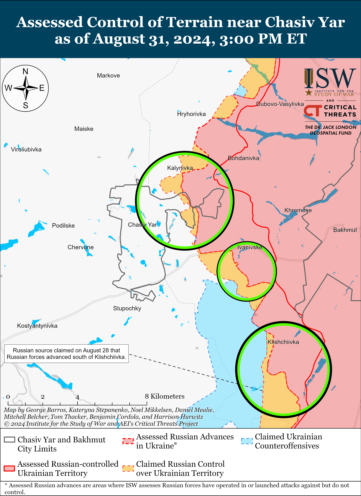
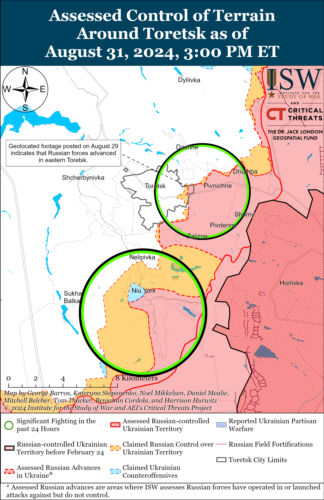
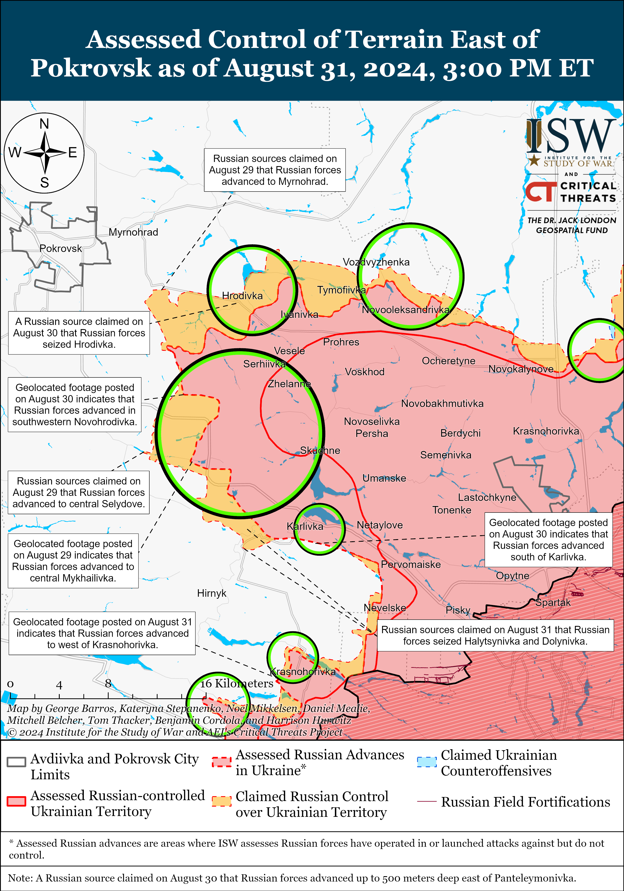
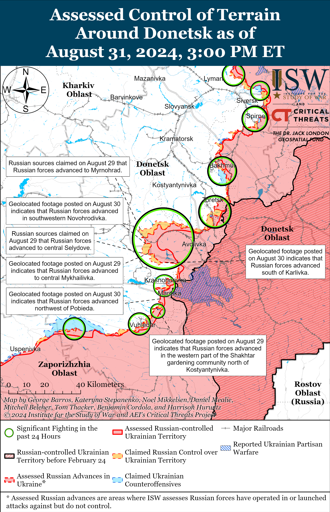
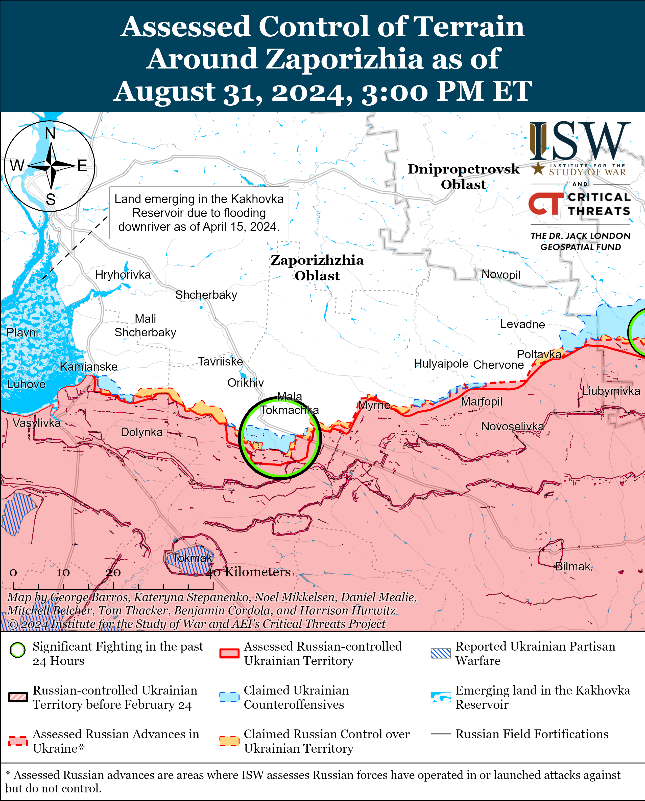
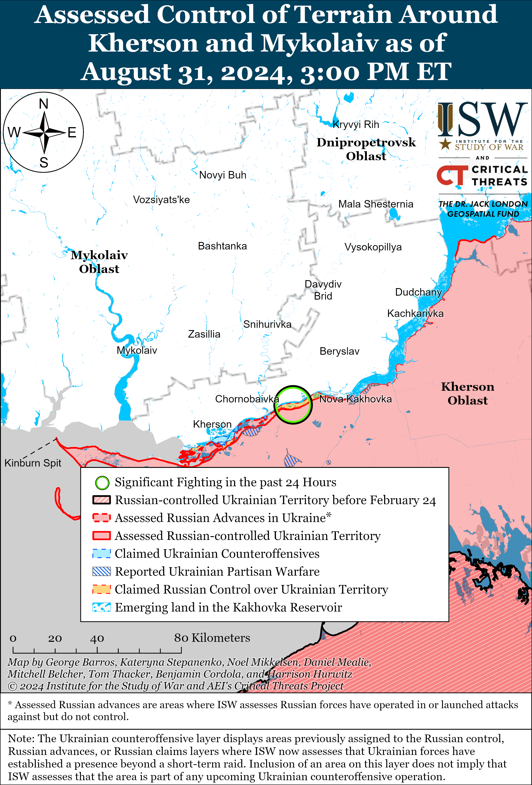

# Russian Offensive Campaign Assessment, August 31, 2024

**Angelica Evans, Kateryna Stepanenko, Christina Harward, Riley Bailey, and George Barros**

**August 31, 2024, 7:20pm ET**

**Click**[**here**](https://storymaps.arcgis.com/stories/36a7f6a6f5a9448496de641cf64bd375)**to see ISW’s interactive map of the Russian invasion of Ukraine. This map is updated daily alongside the static maps present in this report.**

**Click**[**here**](https://storymaps.arcgis.com/stories/83a2f24901c941d581c0c523ecd2619b)**to see ISW’s interactive map of Ukraine’s offensive in Kursk Oblast.**

**Click**[**here**](https://understandingwar.maps.arcgis.com/apps/instant/3dviewer/index.html?appid=1602762dbcde419bb957dea358449580)**to see ISW’s 3D control of terrain topographic map of Ukraine. Use of a computer (not a mobile device) is strongly recommended for using this data-heavy tool.**

**Click**[**here**](https://storymaps.arcgis.com/stories/733fe90805894bfc8562d90b106aa895)**to access ISW’s archive of interactive time-lapse maps of the Russian invasion of Ukraine. These maps complement the static control-of-terrain map that ISW produces daily by showing a dynamic frontline. ISW will update this time-lapse map archive monthly.**

**Note: The data cut-off for this product was 12:15pm ET on August 31. ISW will cover subsequent reports in the September 1 Russian Offensive Campaign Assessment.**

**The Russian military command may have redeployed limited elements intended to reinforce Russia’s priority offensive operation in the Pokrovsk direction to defend against the Ukrainian incursion in Kursk Oblast — suggesting that operational pressures from the Ukrainian incursion in Kursk Oblast are impacting Russian operations in every sector throughout the theater.**Russian sources, including social media users, claimed on August 14 and 17 that at least a company of the Russian 15th Motorized Rifle Brigade (2nd Combined Arms Army [CAA], Central Military District [CMD]) redeployed from the Pokrovsk direction to Kursk Oblast.[1] Select Russian and Ukrainian open-source communities also stated that unspecified elements of the 15th Motorized Rifle Brigade redeployed to Kursk Oblast.[2] Elements of the Russian 15th Motorized Rifle Brigade have been committed to Russian offensive operations in the Pokrovsk direction. ISW observed reports that elements of the brigade are operating east of Pokrovsk in mid-August and as recently as today.[3] A volunteer-led OSINT organization *Evocation.info*stated on August 19 that Russia has also redeployed elements of the 1st “Slavic” Motorized Rifle Brigade (1st Donetsk People’s Republic [DNR] Army Corps [AC]) from the Donetsk direction to Kursk Oblast, and ISW observed claims that elements of the brigade were operating in the Toretsk and Pokrovsk directions in late July and August 2024.[4] ISW has observed no indications that these redeployed elements were previously engaged in frontline combat in Russia’s assessed priority Toretsk and Pokrovsk direction, and the Russian military command likely remains extremely averse to pulling combat effective units from frontline areas in these directions.[5] The redeployed units were likely reserve units that the Russian military command intended to use to reinforce the Russian grouping in these directions and stave off the threat of pre-mature operational culmination, however.

The Russian military command’s decision to redeploy limited elements to Kursk Oblast instead of committing the elements to the operation to seize Pokrovsk or Toretsk suggests that the Russian military command has not been able to fully insulate its priority offensive operations in Donetsk Oblast from the manpower demands brought about by the Ukrainian incursion in Kursk Oblast. The Russian military command thus far has avoided redeploying any forces slated to participate in offensive operations in the Toretsk or Pokrovsk directions to defensive operations in Kursk Oblast and thus far mainly has pulled forces from lower priority directions — northern Kharkiv Oblast, the Kupyansk-Svatove-Kreminna line, and western Zaporizhia Oblast.[6] The redeployment of limited elements of the 15th and 1st motorized rifle brigades will not have an immediate impact on the battlefield situation in the Pokrovsk or Toretsk directions, as these are small forces, however. It remains unclear if the Russian military command has already or will redeploy additional reserve forces intended for Russia’s offensive operations in the Pokrovsk and Toretsk directions to address the Ukrainian incursion into Kursk Oblast.

**Ukrainian forces continued to conduct assaults in Kursk Oblast on August 31, but there were no confirmed or claimed Ukrainian advances.**Russian sources claimed that Ukrainian forces conducted assaults southwest of Korenevo near Komarovka and Krasnooktyabrskoye; south of Korenevo near Snagost; near Korenevo itself; east of Korenevo near Matveyevka and Kremyanoye; northwest of Sudzha near Bakhtinka and Malaya Loknya; north of Sudzha near Kamyshevka and Kireyevka; northeast of Sudzha near Nechayev and Martynovka; south of Sudzha near Plekhovo; and southeast of Sudzha near Borki and Cherkasskaya Konopelka.[7] Select Russian milbloggers claimed that Russian forces pushed Ukrainian forces out of Nizhnyaya Parovaya (northeast of Sudzha), while another milblogger claimed that the settlement is a contested “gray zone.”[8] Russian sources claimed that Russian forces regained 1.5 kilometers of territory near Korenevo and pushed Ukrainian forces out of Nechayev.[9] The Ukrainian Unmanned Systems Forces reported that Ukrainian unmanned systems and rocket artillery conducted a combined mission and struck a Russian pontoon crossing over the Seim River, likely in Glushkovo Raion.[10] Elements of the “Kashtan” detachment (Chechen “Akhmat” Spetsnaz), the “Arbat” detachment (Russian Volunteer Corps), the 1427th Motorized Rifle Regiment (Territorial Troops), and unspecified Ossetian volunteer elements are reportedly operating near Nechayev.[11] Elements of the Russian 810th Naval Infantry Brigade (Black Sea Fleet), 11th and 83rd Airborne (VDV) brigades, 56th VDV Regiment (7th VDV Division), and “Shir” detachment (Russian Volunteer Corps) are reportedly operating in Kursk Oblast.[12]

**Ukrainian Defense Minister Rustem Umerov reported on August 30 that Russian forces continue to use airfields in Russia within Ukrainian ATACMS range — further highlighting how US restrictions against Ukraine’s use of US-provided weapons to strike military targets in Russia are allowing Russia to leverage sanctuary space in deep rear areas to support military operations against Ukraine.**Umerov met with US Secretary of Defense Lloyd Austin in Washington, D.C. on August 31 and discussed the battlefield situation; Ukraine’s air defense, weapons, and training needs; and the development of Ukraine’s defense industrial base (DIB).[13] Umerov stated in an interview with *CNN*published on August 30 that he presented a list of military targets within Russia to senior US government officials.[14] Umerov noted that the list included Russian airfields that are within range of US-provided weapons and that Russian forces are using to conduct strikes against Ukraine. Senior US officials reportedly recently stated that Russian forces moved 90 percent of the aircraft that conduct glide bomb strikes against Ukraine from Russian airspace away from airfields within range of Storm Shadow and ATACMS missiles.[15] ISW additionally recently assessed that there at least 209 of the 245 known Russian military objects in range of ATACMS are not air bases.[16]

**The Russian military command reportedly reorganized the Donetsk and Luhansk People’s Republics’ (DNR and LNR) 1st and 2nd army corps (AC) to create two new combined arms armies (CAA): the 51st CAA and 3rd CAA, respectively.[17]**A Russian milblogger who focuses on Russian military force restructuring claimed on August 28 that the 1st DNR AC became the Russian 51st CAA and that the 2nd LNR AC became the Russian 3rd Guards CAA, and a Donetsk City-based source claimed on August 29 that the newly reformed 51st CAA is based out of occupied Donetsk Oblast.[18] A Kremlin-affiliated milblogger identified Lieutenant General Sergey Milchakov both as the commander of the 51st CAA and the commander of the 1st DNR AC on August 28 in a post announcing that Milchakov received the title “Hero of Russia” following his successes in the Avdiivka and Toretsk directions.[19] A volunteer-led OSINT organization *Evocation.info* on July 20 also identified Milchakov as the commander of the 51st CAA, noting that this army was created on the basis of the 1st DNR AC.[20] *Evocation.info* also identified former Commander of the 138th Separate Motorized Rifle Brigade (6th CAA, Leningrad Military District [LMD]) Major General Alexei Kolesnikov as the commander of the 3rd CAA, which reportedly “replaced” the 2nd LNR AC.*Evocation.info*observed that the 51st CAA and 3rd CAA structurally are significantly larger in size than their previous formations as army corps and thus the Russian military command is likely to recruit more personnel to staff the two new army-sized formations permanently based in occupied Ukraine. One Russian social media user questioned on August 17 whether the 1st DNR AC was no longer operationally subordinate to the command of the 8th CAA (Southern Military District [SMD]) and whether the Russian military command was reviving the Soviet 51st Army.[21] Ukrainian officials started describing the 9th Motorized Rifle Brigade (1st DNR AC) as part of the ”51st Army” as early as late June 2024.[22] ISW observed Russian reports in early August 2024 that the 132nd Motorized Rifle Brigade, ”Sparta” Reconnaissance Battalion, and ”Somalia” Battalion (all historically part of the 1st DNR AC) were also operating as part of the 51st Army, which suggests that the Russian military likely reformed the Second World War-era 51st Army using longstanding DNR military units.[23] The Russian Ministry of Defense (MoD) has yet to officially confirm the reformation of the 1st DNR and 2nd LNR ACs into combined arms armies, although this restructuring is consistent with the Kremlin’s ongoing effort to officially integrate these legacy irregular forces into the Russian Armed Forces.[24]

The source who reported the creation of these two combined arms armies has accurately reported major Russian force restructuring in the past. The Russian milblogger who focuses on Russian military restructuring also previously accurately reported that the Russian military command created the 69th Motorized Rifle Division on the basis of the 138th Motorized Rifle Brigade and as part of the 6th CAA in May 2024.[25] ISW has routinely observed elements of the 69th Motorized Rifle Division operating in the Kharkiv direction.[26] The milblogger added that the Russian military command also reformed the 72nd Motorized Rifle Division and the “128th Assault Brigade” (likely referring to the 128th Motorized Rifle Brigade) as part of the 44th AC (LMD) and formed the 11th Tank Brigade as part of the 25th CAA (Central Military District [CMD]). ISW observed elements of the 128th Motorized Rifle Brigade operating in the Kharkiv direction and elements of the 72nd Motorized Rifle Division operating in the Kursk direction.[27]

The milblogger also noted that the Russian MoD recently mentioned an unspecified 114th Artillery Brigade (likely a restored World War II unit) operating in the Donetsk direction, and Russian media reported that the Russian military command formed a new 673rd Airborne (VDV) Regiment in Omsk City and deployed the regiment to Luhansk Oblast.[28] It is unclear to which formation the 673rd VDV Regiment is subordinated, though the VDV’s principal training center and two training regiments are based in Omsk. The milblogger assessed that the creation of the 673rd VDV Regiment may support the formation of a new VDV division.

**The Kremlin continues efforts to define Russia’s traditional and cultural values as part of ongoing efforts to codify a Russian state ideology.**Russian President Vladimir Putin signed a decree on August 26 tasking the Russian Presidential Administration’s recently formed Directorate for State Humanitarian Policy to oversee the strengthening of Russia’s “spiritual and moral foundations,” preservation of Russia’s “traditional values,” and implementation of state historical education policies.[29] The Kremlin formed the directorate in June 2024, and the directorate will also oversee Putin’s interactions with unspecified “specialized organizations” and Putin’s Council for Culture and Art and advise Putin on issues related to monitoring and implementing policy in correlation with Russia’s values.[30] A source within the Russian Presidential Administration told Kremlin newswire *TASS* on August 31 that Russian propagandist Vladimir Medinsky will oversee the recently formed directorate.[31] The Kremlin has recently intensified efforts to codify a state ideology based on vague “traditional values” while bypassing the Russian Constitution, which notably forbids Russia from establishing a state ideology and requires the Russian state to recognize ideological diversity.[32]

**The Ukrainian Armed Forces Center for Strategic Communications (StratCom) announced on August 31 that Ukrainian Commander-in-Chief General Oleksandr Syrskyi officially appointed Captain First Rank Roman Hladkyi as the Chief of Staff of the newly created Unmanned Systems Forces.[33]**Ukrainian Unmanned Systems Forces Spokesperson Major Vitaly Medvedev stated on August 30 that Hladkyi has been acting Unmanned Systems Forces Chief of Staff for several weeks.[34]

**Key Takeaways:**

- **The Russian military command may have redeployed limited elements intended to reinforce Russia’s priority offensive operation in the Pokrovsk direction to defend against the Ukrainian incursion in Kursk Oblast — suggesting that operational pressures from the Ukrainian incursion in Kursk Oblast are impacting Russian operations in every sector throughout the theater.**
- **Ukrainian forces continued to conduct assaults in Kursk Oblast on August 31, but there were no confirmed or claimed Ukrainian advances.**
- **Ukrainian Defense Minister Rustem Umerov reported on August 30 that Russian forces continue to use airfields in Russia within Ukrainian ATACMS range — further highlighting how US restrictions against Ukraine’s use of US-provided weapons to strike military targets in Russia are allowing Russia to leverage sanctuary space in deep rear areas to support military operations against Ukraine.**
- **The Russian military command reportedly reorganized the Donetsk and Luhansk People’s Republics’ (DNR and LNR) 1st and 2nd army corps (AC) to create two new combined arms armies (CAA): the 51st CAA and 3rd CAA, respectively.**
- **The Kremlin continues efforts to define Russia’s traditional and cultural values as part of ongoing efforts to codify a Russian state ideology.**
- **The Ukrainian Armed Forces Center for Strategic Communications (StratCom) announced on August 31 that Ukrainian Commander-in-Chief General Oleksandr Syrskyi officially appointed Captain First Rank Roman Hladkyi as the Chief of Staff of the newly created Unmanned Systems Forces.**
- **Russian forces recently advanced near Chasiv Yar, Pokrovsk, and Donetsk City.**
- **Russian forces are reportedly unable to fight in Ukraine at full strength due to manpower and equipment shortages that resulted from the Kremlin’s ineffective wartime policies.**

[******](https://understandingwar.org/wp-content/uploads/2025/05/DraftUkraineCoTAugust20312C202024.png)

***We do not report in detail on Russian war crimes because these activities are well-covered in Western media and do not directly affect the military operations we are assessing and forecasting. We will continue to evaluate and report on the effects of these criminal activities on the Ukrainian military and the Ukrainian population and specifically on combat in Ukrainian urban areas. We utterly condemn Russian violations of the laws of armed conflict and the Geneva Conventions and crimes against humanity even though we do not describe them in these reports.***

- Russian Main Effort – Eastern Ukraine (comprised of three subordinate main efforts)
- Russian Subordinate Main Effort #1 – Push Ukrainian forces back from the international border with Belgorod Oblast and approach to within tube artillery range of Kharkiv City
- Russian Subordinate Main Effort #2 – Capture the remainder of Luhansk Oblast and push westward into eastern Kharkiv Oblast and encircle northern Donetsk Oblast
- Russian Subordinate Main Effort #3 – Capture the entirety of Donetsk Oblast
- Russian Supporting Effort – Southern Axis
- Russian Air, Missile, and Drone Campaign
- Russian Mobilization and Force Generation Efforts
- Russian Technological Adaptations
- Activities in Russian-occupied areas
- Ukrainian Defense Industrial Base Efforts
- Russian Information Operations and Narratives
- Significant Activity in Belarus

**Russian Main Effort – Eastern Ukraine**

**Russian Subordinate Main Effort #1 – Kharkiv Oblast (Russian objective: Push Ukrainian forces back from the international border with Belgorod Oblast and approach to within tube artillery range of Kharkiv City)**

Russian forces continued offensive operations north and northeast of Kharkiv City on August 31, but there were no confirmed changes to the frontline. Russian forces conducted offensive operations north of Kharkiv City near Lyptsi and Hlyboke and northeast of Kharkiv City near Vovchansk and Pletenivka on August 30 and 31.[35] Ukrainian Kharkiv Group of Forces Spokesperson Colonel Vitaly Sarantsev reported that Russian forces are transferring elements of the Chechen “Akhmat” Spetsnaz to northern Vovchansk.[36] Elements of the Russian 7th Motorized Rifle Regiment (11th Army Corps [AC], Leningrad Military District [LMD]) are operating near Lukyantsi (north of Kharkiv City).[37]

[****](https://understandingwar.org/wp-content/uploads/2025/05/UAF20Kursk20Incursion20August20312C202024.png)

**Russian Subordinate Main Effort #2 – Luhansk Oblast (Russian objective: Capture the remainder of Luhansk Oblast and push westward into eastern Kharkiv Oblast and northern Donetsk Oblast)**

Russian forces reportedly advanced near Svatove on August 31 amid continued Russian offensive operations along the Kupyansk-Svatove-Kreminna line. Russian milbloggers claimed that Russian forces advanced south of Pishchane (northwest of Svatove), but ISW has not observed confirmation of this claim.[38] Russian forces conducted offensive operations northeast of Kupyansk near Synkivka; southeast of Kupyansk near Novoosynove and Hlushkivka; northwest of Svatove near Kolisynkivka, Stelmakhivka, Novoserhiivka, and towards Lozova; west of Svatove near Andriivka; southwest of Svatove near Tverdokhlibove, Druzhelyubivka, and Cherneshchyna; northwest of Kreminna near Nevske, Novosadove, Hrekivka, and Makiivka; and southwest of Kreminna near Dibrova and in the Serebryanske forest area on August 30 and 31.[39] A Russian milblogger continued to claim that Ukrainian forces maintain limited positions within Synkivka despite the Russian MoD’s August 30 claim that Russian forces seized the settlement.[40] Elements of the Russian 67th Motorized Rifle Division (25th Combined Arms Army [CAA], Central Military District [CMD]) are reportedly operating near Torske (west of Kreminna).[41]

**Russian Subordinate Main Effort #3 – Donetsk Oblast (Russian objective: Capture the entirety of Donetsk Oblast, the claimed territory of Russia’s proxies in Donbas)**

Russian forces continued offensive operations east of Siversk near Verkhnokamyanske; southeast of Siversk near Spirne, Ivano-Darivka, and Vyimka; and south of Siversk near Zvanivka on August 30 and 31.[42] Elements of the Russian 3rd Army Corps (AC) are reportedly operating in the Siversk direction.[43]

Russian forces recently made marginal gains north of Chasiv Yar amid continued Russian offensive operations in the area on August 31. Geolocated footage published on August 31 indicates that Russian forces recently made a marginal advance into eastern Hryhorivka (north of Chasiv Yar).[44] Russian forces continued offensive operations near Chasiv Yar; north of Chasiv Yar near Kalynivka; east of Chasiv Yar near Ivanivske; south of Chasiv Yar near Stupochky; and southeast of Chasiv Yar near Andriivka, Klishchiivka, and Predtechnye on August 30 and 31.[45] Elements of the Russian 98th Airborne (VDV) Division are reportedly continuing to operate near Chasiv Yar.[46]

Russian forces reportedly seized Pivnichne (east of Toretsk) and continued offensive operations near Toretsk on August 31. The Russian Ministry of Defense (MoD) claimed that Russian forces seized Pivnichne, although ISW has not observed confirmation of Russian forces seizing the remainder of Pivnichne’s northwestern outskirts.[47] Russian forces continued offensive operations near Toretsk and south of Toretsk near Nelipivka on August 30 and 31.[48] Elements of the Russian 74th Motorized Rifle Brigade (41st Combined Arms Army [CAA], Central Military District [CMD]) are reportedly operating in the Toretsk direction.[49]

[****](https://understandingwar.org/wp-content/uploads/2025/05/Toretsk20Battle20Map20Draft20August20312C202024.png)

Russian forces recently advanced southeast of Pokrovsk and continued offensive operations in the Pokrovsk direction on August 31. Geolocated footage published on August 30 indicates that Russian forces recently advanced south of Karlivka (southeast of Pokrovsk) and seized the Chervonoarmiiska Filtration Station, and geolocated footage published on August 31 indicates that Russian forces recently seized northern Halytsynivka (southeast of Pokrovsk).[50] Russian sources claimed on August 30 and 31 that elements of the Russian 114th Motorized Rifle Brigade (1st Donetsk People’s Republic [DNR] AC) advanced into southern Halytsynivka and completely seized the settlement, although ISW has not observed confirmation and these claims.[51] Russian milbloggers claimed on August 31 that Russian forces operating southeast of Pokrovsk also seized Dolynivka (immediately east of Halytsynivka), entered Zhelanne Pershe (immediately south of Halytsynivka), and advanced closer to Ukrainsk and Lisivka (both west of Halytsynivka).[52] Russian milbloggers claimed that Russian forces continue to fight in eastern Selydove (southeast of Pokrovsk), although ISW has not yet observed confirmation of Russian forces operating within the town.[53] Russian milbloggers claimed that there are reports of Russian sabotage and reconnaissance groups operating close to the outskirts of Myrnohrad (immediately east of Pokrovsk) and that Russian aviation is conducting heavy air strikes on the town.[54] Russian forces continued offensive operations east of Pokrovsk near Vozdvyzhenka, Hrodivka, and Zelene Pole and southeast of Pokrovsk near Novohrodivka, Marynivka, Myrolyubivka, Mykhailivka, Selydove, Karlivka, Dolynivka, Halytsynivka, Zhelanne Pershe, Ukrainsk, and Lisivka on August 30 and 31.[55] The commander of a Ukrainian aerial reconnaissance unit in the Pokrovsk direction stated in an interview with the *Telegraph* published on August 31 that Russian forces in the area have a five-to-one manpower advantage, and another Ukrainian soldier stated that Russian reserves near Pokrovsk are larger than the reserves that Russian forces had during the Russian offensive effort to seize Bakhmut in Winter 2022-2023.[56] The Ukrainian aerial reconnaissance commander stated that Russian forces have deployed powerful electronic warfare (EW) units to the Pokrovsk direction, forcing Ukrainian forces to expend more drones on strikes against Russian equipment.[57] Elements of the Russian 90th Tank Division (41st CAA, CMD) and 27th Motorized Rifle Division (2nd CAA, CMD) are reportedly attacking southeast of Selydove.[58] Elements of the 30th Motorized Rifle Brigade (2nd CAA, CMD) are reportedly operating in an unspecified area of the Pokrovsk direction.[59]

Russian forces recently advanced west of Donetsk City and continued offensive operations in the area on August 31. Geolocated footage published on August 31 indicates that Russian forces recently advanced in fields west of Krasnohorivka during a roughly company-sized mechanized assault, and a Russian milblogger claimed that Russian forces also advanced in fields southwest of the settlement.[60] Russian forces continued offensive operations near Heorhiivka and Krasnohorivka on August 30 and 31.[61] A Ukrainian soldier stated that Russian forces typically attack with 15 to 30 pieces of equipment each day in the Kurakhove direction (west and southwest of Donetsk City).[62]

Russian forces reportedly advanced southwest of Donetsk City amid continued offensive operations in the area on August 31, but there were no confirmed changes to the frontline. A Russian milblogger claimed that Russian forces advanced 1.2 kilometers northwest of Kostyantynivka.[63] A Russian milblogger claimed on August 30 that Russian forces advanced closer to Vodyane from positions along the O-0532 (Kostyantynivka-Vuhledar) highway.[64] ISW has not observed confirmation of these Russian claims, however. Footage published on August 30 shows Ukrainian forces recently repelling a platoon-sized Russian mechanized assault near Kostyantynivka.[65] Russian forces continued offensive operations near Kostyantynivka, Vodyane, and Vuhledar on August 30 and 31.[66] Elements of the Russian 57th Motorized Rifle Regiment (6th Motorized Rifle Division, 3rd AC) are reportedly operating near Kostyantynivka.[67]

A Russian milblogger claimed on August 31 that Russian forces are intensifying offensive operations in the Donetsk-Zaporizhia Oblast border area and recently advanced north of Urozhaine (south of Velyka Novosilka) and near Pryyutne (southwest of Velyka Novosilka).[68] The Ukrainian General Staff reported on August 31 that Russian forces conducted an assault in the direction Vremivka (immediately southwest of Velyka Novosilka).[69]

**Russian Supporting Effort – Southern Axis (Russian objective: Maintain frontline positions and secure rear areas against Ukrainian strikes)**

Positional fighting continued in western Zaporizhia Oblast on August 31, but there were no confirmed changes to the frontline. A Russian milblogger claimed that Russian forces seized a Ukrainian position and two forest areas north of Robotyne, although ISW has not observed confirmation of this claim.[70] The Ukrainian General Staff reported that Russian forces conducted assaults near Robotyne and northeast of Robotyne near Mala Tomachka on August 30 and 31.[71] Elements of the Russian 503rd Motorized Rifle Regiment (19th Motorized Rifle Division, 58th Combined Arms Army [CAA], Southern Military District [SMD]) are reportedly operating in the Zaporizhia direction.[72]

Ukrainian officials reported on August 31 that Ukrainian forces repelled several Russian attacks in unspecified areas of the Kherson direction.[73]

[****](https://understandingwar.org/wp-content/uploads/2025/05/Kherson-Mykolaiv20Battle20Map20Draft20August20312C202024.png)

**Russian Air, Missile, and Drone Campaign (Russian Objective: Target Ukrainian military and civilian infrastructure in the rear and on the frontline)**

Russian forces conducted a series of missile and drone strikes against Ukraine on the night of August 30 to 31. The Ukrainian Air Force reported on August 31 that Russian forces launched an Iskander-M ballistic missile from Voronezh Oblast, four S-300 air defense missiles from occupied Donetsk Oblast, and 52 Shahed-136/131 drones from Kursk Oblast.[74] The Ukrainian Air Force reported that Ukrainian forces downed 24 Shahed drones over Kyiv, Poltava, Cherkasy, Dnipropetrovsk, Chernihiv, Kirovohrad, Mykolaiv, and Sumy oblasts. The Ukrainian Air Force reported that 25 additional Shahed drones did not strike their targets and that two drones flew in the direction of Russia and another drone flew into Belarusian air space. Cherkasy Oblast Military Administration Head Ihor Taburets reported that Russian drone debris damaged several houses in Cherkasy Oblast.[75] Ukrainian officials reported that Russian forces conducted an airstrike against an apartment building in Kharkiv City on August 30, which injured almost 100 people and killed six.[76] Ukrainian Defense Minister Rustem Umerov told US Secretary of Defense Llyod Austin on August 30 that Russian forces launched 400 missiles and drones against targets in Ukraine over the last four days.[77]

**Russian Mobilization and Force Generation Efforts (Russian objective: Expand combat power without conducting general mobilization)**

Russian forces are reportedly unable to fight in Ukraine at full strength due to manpower and equipment shortages that resulted from the Kremlin’s ineffective wartime policies. A Russian mobilized serviceman and milblogger (who had been reportedly fighting in Ukraine for 23 months) claimed on August 23 that Russian people are disinterested in the war effort and are unwilling to accept large-scale losses and that the Russian government failed to establish a consistent mobilization system to address Russian manpower losses and to grow reserves.[78] The milblogger noted that the Russian government continues to rely on the remnants of regular military forces, mobilized personnel, and deceived short-term volunteers to continue Russian offensive operations in Ukraine, despite the fact that these elements are ill-prepared and have been suffering significant losses since October 2023. The milblogger claimed that the Russian military command is currently committing Russian contract servicemen (*kontraktniki*) from non-infantry military branches such as the Russian Aerospace Forces or Strategic Missile Forces to infantry combat operations in Ukraine. The milblogger claimed that only one regiment out of three in a division or only one brigade in a combined arms army (CAA) is competent enough to successfully conduct offensive operations.[79]

The milblogger noted that heavy Russian armored equipment losses in February-March 2022, and September 2022, and the ongoing Russian offensive operation in the Pokrovsk direction have forced Russian motorized rifle regiments to increasingly use light vehicles with limited support from infantry fighting vehicles (IFV) and tanks.[80] The milblogger noted that Ukrainian advantages in first-person view (FPV) drones and multicopters and Russia’s lack of electronic warfare (EW) systems caused Russian forces to suffer significant armored vehicles losses between October and December 2023. The milblogger added that Russian forces expended their artillery and mine stocks, and that Russian forces in most operational directions except for the Zaporizhia and Pokrovsk directions faced ammunition deficits throughout 2023 and Spring 2024.

The milblogger observed that Russia still has nuclear and missile strike capabilities but that it is unlikely to use these capabilities for strategic operations in Ukraine.[81] The milblogger noted that Russia would not use nuclear weapons because they are “excessive and inhumane,” and that Russia continues to periodically target Ukrainian energy infrastructure and military facilities with missile strikes. The milblogger argued that Russia is not conducting comprehensive strikes that would seriously impact the frontline, however. While this milblogger has no special insight into or decision-making authority over Russia’s chain of command for nuclear weapons, it is notable that a Russian source acknowledged that Russia is unlikely to use nuclear weapons, despite the Kremlin’s persistent informational efforts to shape US policy through nuclear blackmail and reflexive control activities.

The Kremlin is continuing to task Russian federal subjects (regions) with involving veterans in local governments, likely in an effort to boost military recruitment rates and co-opt veterans. Samara Oblast Governor Vyacheslav Fedorishchev told Russian President Vladimir Putin that Samara Oblast created the “School of Heroes of Samara Oblast” regional veteran support program and that 50 Russian veterans will participate in the program starting October 1, 2024.[82] Fedorishchev stated that veterans that complete the program will then receive an invitation to work in Samara Oblast regional and municipal governments. The program is likely part of the Kremlin-initiated “Time of Heroes” program that launched in April 2024 and aims to appease the ever-growing Russian veteran population by appointing and prominently featuring government officials who served in Ukraine.[83]

Russia is actively reopening military command schools. The Russian MoD announced on August 31 that it will reopen the Novocherkassk Higher Military Command School of Communications in Rostov Oblast, which will accept the first class of cadets in 2026.[84] The Russian MoD expects that the command school will train over 1,100 signals specialists every year in subjects related to radio and satellite communications systems, general communications systems and networks, and automated special-purpose systems. Commander-in-Chief of the Russian Ground Forces Army General Oleg Salyukov participated in the opening ceremony of the Higher Artillery Command School in Saratov City, which already accepted 291 cadets – of which 138 are veterans of the Russian full-scale invasion of Ukraine.[85]

Russian occupation officials are trying to recruit women to fight in the Russian war effort. Zaporizhia Oblast occupation senator Dmitry Rogozin announced that the newly-formed “BARS-Sarmat” volunteer detachment (Russian Combat Army Reserve) in occupied Zaporizhia Oblast will form a separate women’s “Polina Osipenko” drone detachment after some women reportedly expressed interest in joining the BARS-Sarmat detachment.[86]

**Russian Technological Adaptations (Russian objective: Introduce technological innovations to optimize systems for use in Ukraine)**

The press office of the Russian Polytechnic College of Novgorod State University claimed on August 22 that a Russian student created a device to combat drones using lasers that create a spatial-volumetric curtain of laser radiation.[87] The press office claimed that this device operates autonomously and continuously scans an area in a standby mode using video surveillance capabilities to target drones that pass through the controlled area. The press office added that the device will reportedly blind or disable drones.

**Ukrainian Defense Industrial Efforts (Ukrainian objective: Develop its defense industrial base to become more self-sufficient in cooperation with US, European, and international partners)**

*ISW is suspending publishing coverage of Ukrainian defense industrial efforts until further notice.*

**Activities in Russian-occupied areas (Russian objective: Consolidate administrative control of annexed areas; forcibly integrate Ukrainian citizens into Russian sociocultural, economic, military, and governance systems)**

*ISW is not publishing coverage of activities in Russian-occupied areas today.*

**Russian Information Operations and Narratives**

Nothing significant to report.

**Significant activity in Belarus (Russian efforts to increase its military presence in Belarus and further integrate Belarus into Russian-favorable frameworks and Wagner Group activity in Belarus)**

Nothing significant to report.

**Note: ISW does not receive any classified material from any source, uses only publicly available information, and draws extensively on Russian, Ukrainian, and Western reporting and social media as well as commercially available satellite imagery and other geospatial data as the basis for these reports. References to all sources used are provided in the endnotes of each update.**

---

[1] https://vk dot com/wall-168390661\_212 ; https://mikhailosherov dot livejournal.com/1783341.html

[2] https://t.me/evocationinfo/624 ; https://t.me/MiliTJournal/17122 ; https://t.me/Viktor\_Murakhovskiy/673 ; https://ivanoctober dot livejournal.com/1657585.html

[3] https://understandingwar.org/backgrounder/russian-offensive-campaign-assessment-august-13-2024 ; https://understandingwar.org/backgrounder/russian-offensive-campaign-assessment-july-12-2024 ; https://understandingwar.org/backgrounder/russian-offensive-campaign-assessment-may-31-2024 ; https://t.me/zvizdecmanhustu/2151

[4] https://understandingwar.org/backgrounder/russian-offensive-campaign-assessment-august-22-2024 ; https://understandingwar.org/backgrounder/russian-offensive-campaign-assessment-july-19-2024 ; https://understandingwar.org/backgrounder/russian-offensive-campaign-assessment-july-22-2024

[5] https://isw.pub/UkrWar082024 ; https://isw.pub/UkrWar081324

[6] https://isw.pub/UkrWar082524 ; https://isw.pub/UkrWar082224

[7] https://t.me/mod\_russia/42798; https://t.me/rybar/63182; https://t.me/dva\_majors/51138; https://t.me/rusich\_army/16876; https://t.me/DnevnikDesantnika/14760

[8] https://t.me/rybar/63182; https://t.me/sashakots/48712 ; https://t.me/epoddubny/20911

[9] https://t.me/DnevnikDesantnika/14760; https://t.me/sashakots/48712 ; https://t.me/epoddubny/20911

[10] https://armyinform dot com.ua/2024/08/31/syly-oborony-pokazaly-urazhennya-chergovoyi-perepravy-okupantiv-na-kurshhyni/; https://t.me/usf\_army/132

[11] https://t.me/RKadyrov\_95/5060 ; https://www.kp dot ru/daily/27628.5/4978711/ ; https://t.me/sashakots/48712 ; https://t.me/epoddubny/20911

[12] https://t.me/ButusovPlus/13201; https://t.me/rusich\_army/16881 ; https://www.kp dot ru/daily/27628.5/4978711/ ; https://t.me/sashakots/48712 ; https://t.me/epoddubny/20911

[13] https://t.me/ministry\_of\_defense\_ua/10325

[14] https://www.cnn.com/2024/08/30/politics/umerov-ukraine-targets-cnntv/index.html

[15] https://understandingwar.org/backgrounder/interactive-map-hundreds-known-russian-military-objects-are-range-atacms

[16] https://understandingwar.org/backgrounder/interactive-map-hundreds-known-russian-military-objects-are-range-atacms

[17] https://t.me/boris\_rozhin/135582 ; https://bmpd.livejournal dot com/4855214.html

[18] https://vk dot com/wall794937994\_3687; https://t.me/boris\_rozhin/135582 ; https://bmpd.livejournal dot com/4855214.html

[19] https://t.me/wargonzo/21803 ; https://t.me/akutin\_dpr\_ru/31606

[20] https://t.me/evocationinfo/587

[21] https://vk dot com/wall10959367\_6510

[22] https://understandingwar.org/backgrounder/russian-offensive-campaign-assessment-june-25-2024

[23] https://understandingwar.org/backgrounder/russian-offensive-campaign-assessment-august-10-2024

[24] https://understandingwar.org/backgrounder/russian-offensive-campaign-assessment-december-31

[25] https://altyn73 dot livejournal.com/1486598.html; https://vbglenobl dot ru/news/90-let-na-sluzhbe-otechestvu; https://vbglenobl dot ru/news/90-let-na-sluzhbe-otechestvu

[26] https://understandingwar.org/backgrounder/russian-offensive-campaign-assessment-august-28-2024; https://understandingwar.org/wp-content/uploads/2024/08/July20232C2020242C20Russian20Offensive20Campaign20Assessment20PDF.pdf

[27] https://understandingwar.org/backgrounder/russian-offensive-campaign-assessment-august-30-2024 (Kursk Oblast); https://understandingwar.org/backgrounder/russian-offensive-campaign-assessment-august-27-2024 (Kharkiv Oblast)

[28] https://function dot mil.ru/news\_page/country/more.htm?id=12526694@egNews; https://pamyat-naroda dot ru/warunit/id6135/; https://life dot er.ru/news/3403144

[29] http://publication.pravo dot gov.ru/document/0001202408260016 ; https://www.pnp dot ru/politics/prezident-opredelil-funkcii-upravleniya-kremlya-po-gospolitike-v-gumsfere.html ; https://tass dot ru/obschestvo/21691561

[30] https://tass dot ru/obschestvo/21691561

[31] https://t.me/tass\_agency/269522

[32] https://isw.pub/UkrWar081924 ; https://isw.pub/UkrWar06272024; https://isw.pub/UkrWar073024; https://isw.pub/UkrWar040924; https://isw.pub/UkrWar032924; https://isw.pub/UkrWar021524; https://understandingwar.org/backgrounder/russian-offensive-campaign-assessment-november-22-2023; https://rm.coe.int/constitution-of-the-russian-federation-en/1680a1a237

[33] https://t.me/AFUStratCom/25817

[34] https://www.rbc dot ua/rus/news/nachalnikom-shtabu-sil-bezpilotnih-sistem-1725019129.html

[35] https://www.facebook.com/GeneralStaff.ua/posts/pfbid02aadh2WCw7CdbVzPEAsSPS9XCFKDBYz9bSxUVzaNfZQLZsWqkYW8iYXh7Wqgy6v4rl ; https://www.facebook.com/GeneralStaff.ua/posts/pfbid0tXcF1Q2BnxKZaGR2Uw96BVmircQ2KWHGHG9FEhpYgFHqRa5gn59coCaPccRSigel ; https://www.facebook.com/GeneralStaff.ua/posts/pfbid032dLWoF6T5okfGtP641zqRzPnQ4JGN2MWbYpCNoqLB48x3hTw4hv7P54x6QUfEPHEl; https://t.me/wargonzo/21833

[36] https://t.me/otukharkiv/1025

[37] https://t.me/otukharkiv/1011; https://t.me/dva\_majors/51127

[38] https://t.me/z\_arhiv/27890; https://t.me/DnevnikDesantnika/14764

[39] https://www.facebook.com/GeneralStaff.ua/posts/pfbid032dLWoF6T5okfGtP641zqRzPnQ4JGN2MWbYpCNoqLB48x3hTw4hv7P54x6QUfEPHEl ; https://www.facebook.com/GeneralStaff.ua/posts/pfbid0tXcF1Q2BnxKZaGR2Uw96BVmircQ2KWHGHG9FEhpYgFHqRa5gn59coCaPccRSigel ; https://www.facebook.com/GeneralStaff.ua/posts/pfbid02aadh2WCw7CdbVzPEAsSPS9XCFKDBYz9bSxUVzaNfZQLZsWqkYW8iYXh7Wqgy6v4rl

[40] https://understandingwar.org/backgrounder/russian-offensive-campaign-assessment-august-30-2024; https://t.me/dva\_majors/51138

[41] https://t.me/russianocontext/4537 ; https://x.com/666\_mancer/status/1829793458334093389

[42] https://www.facebook.com/GeneralStaff.ua/posts/pfbid02aadh2WCw7CdbVzPEAsSPS9XCFKDBYz9bSxUVzaNfZQLZsWqkYW8iYXh7Wqgy6v4rl ; https://www.facebook.com/GeneralStaff.ua/posts/pfbid0tXcF1Q2BnxKZaGR2Uw96BVmircQ2KWHGHG9FEhpYgFHqRa5gn59coCaPccRSigel ; https://www.facebook.com/GeneralStaff.ua/posts/pfbid032dLWoF6T5okfGtP641zqRzPnQ4JGN2MWbYpCNoqLB48x3hTw4hv7P54x6QUfEPHEl

[43] https://t.me/DnevnikDesantnika/14801

[44] https://t.me/creamy\_caprice/6617; https://t.me/kateniata56rubak/156

[45] https://www.facebook.com/GeneralStaff.ua/posts/pfbid02aadh2WCw7CdbVzPEAsSPS9XCFKDBYz9bSxUVzaNfZQLZsWqkYW8iYXh7Wqgy6v4rl ; https://www.facebook.com/GeneralStaff.ua/posts/pfbid0tXcF1Q2BnxKZaGR2Uw96BVmircQ2KWHGHG9FEhpYgFHqRa5gn59coCaPccRSigel ; https://www.facebook.com/GeneralStaff.ua/posts/pfbid032dLWoF6T5okfGtP641zqRzPnQ4JGN2MWbYpCNoqLB48x3hTw4hv7P54x6QUfEPHEl

[46] https://t.me/milinfolive/129541

[47] https://t.me/mod\_russia/42795

[48] https://www.facebook.com/GeneralStaff.ua/posts/pfbid02aadh2WCw7CdbVzPEAsSPS9XCFKDBYz9bSxUVzaNfZQLZsWqkYW8iYXh7Wqgy6v4rl ; https://www.facebook.com/GeneralStaff.ua/posts/pfbid0tXcF1Q2BnxKZaGR2Uw96BVmircQ2KWHGHG9FEhpYgFHqRa5gn59coCaPccRSigel ; https://www.facebook.com/GeneralStaff.ua/posts/pfbid032dLWoF6T5okfGtP641zqRzPnQ4JGN2MWbYpCNoqLB48x3hTw4hv7P54x6QUfEPHEl

[49] https://t.me/zvizdecmanhustu/2152

[50] https://t.me/creamy\_caprice/6613; https://t.me/zvofront/3941 ; https://t.me/creamy\_caprice/6615; https://t.me/RtrDonetsk/26753

[51] https://t.me/z\_arhiv/27880 ; https://t.me/RVvoenkor/76026 ; https://t.me/rybar/63188 ; https://t.me/RVvoenkor/76042 ; https://t.me/milinfolive/129577 ; https://t.me/voenkorKotenok/58674 ; https://t.me/voenkorKotenok/58682

[52] https://t.me/rybar/63179 ; https://t.me/z\_arhiv/27892 ; https://t.me/milinfolive/129577 ; https://t.me/z\_arhiv/27894 ; https://t.me/RVvoenkor/76026 ; https://t.me/rybar/63188 ;

[53] https://t.me/rybar/63188 ; https://t.me/rybar/63179 ; https://t.me/dva\_majors/51138 ;

[54] https://t.me/DnevnikDesantnika/14806 ; https://t.me/rybar/63179

[55] https://www.facebook.com/GeneralStaff.ua/posts/pfbid02aadh2WCw7CdbVzPEAsSPS9XCFKDBYz9bSxUVzaNfZQLZsWqkYW8iYXh7Wqgy6v4rl ; https://www.facebook.com/GeneralStaff.ua/posts/pfbid032dLWoF6T5okfGtP641zqRzPnQ4JGN2MWbYpCNoqLB48x3hTw4hv7P54x6QUfEPHEl ; https://www.facebook.com/GeneralStaff.ua/posts/pfbid0tXcF1Q2BnxKZaGR2Uw96BVmircQ2KWHGHG9FEhpYgFHqRa5gn59coCaPccRSigel ; https://t.me/rybar/63188 ; https://t.me/rybar/63179 ; https://t.me/dva\_majors/51138 ; https://t.me/z\_arhiv/27880 ; https://t.me/motopatriot/27110 ;

[56] https://www.telegraph.co.uk/world-news/2024/08/31/master-stroke-or-folly-ukraine-could-pay-high-price-kursk/ ; https://t.me/stanislav\_osman/6966

[57] https://www.telegraph.co.uk/world-news/2024/08/31/master-stroke-or-folly-ukraine-could-pay-high-price-kursk/

[58] https://t.me/zvizdecmanhustu/2151

[59] https://t.me/z\_arhiv/27886 ;

[60] https://t.me/rybar/63179; https://x.com/moklasen/status/1829936402143834336; https://www.facebook.com/watch/?v=1028576355658144; https://t.me/oaembr46/997

[61] https://www.facebook.com/GeneralStaff.ua/posts/pfbid02aadh2WCw7CdbVzPEAsSPS9XCFKDBYz9bSxUVzaNfZQLZsWqkYW8iYXh7Wqgy6v4rl ; https://www.facebook.com/GeneralStaff.ua/posts/pfbid032dLWoF6T5okfGtP641zqRzPnQ4JGN2MWbYpCNoqLB48x3hTw4hv7P54x6QUfEPHEl ; https://www.facebook.com/GeneralStaff.ua/posts/pfbid0tXcF1Q2BnxKZaGR2Uw96BVmircQ2KWHGHG9FEhpYgFHqRa5gn59coCaPccRSigel

[62] https://t.me/stanislav\_osman/6965

[63] https://t.me/DnevnikDesantnika/14746

[64] https://t.me/rybar/63170

[65] https://t.me/odshbr79/323 ; https://x.com/GirkinGirkin/status/1829592708262076559 ; https://x.com/666\_mancer/status/1829874723796169176

[66] https://www.facebook.com/GeneralStaff.ua/posts/pfbid02aadh2WCw7CdbVzPEAsSPS9XCFKDBYz9bSxUVzaNfZQLZsWqkYW8iYXh7Wqgy6v4rl ; https://www.facebook.com/GeneralStaff.ua/posts/pfbid032dLWoF6T5okfGtP641zqRzPnQ4JGN2MWbYpCNoqLB48x3hTw4hv7P54x6QUfEPHEl ; https://www.facebook.com/GeneralStaff.ua/posts/pfbid0tXcF1Q2BnxKZaGR2Uw96BVmircQ2KWHGHG9FEhpYgFHqRa5gn59coCaPccRSigel

[67] https://t.me/RVvoenkor/76019

[68] https://t.me/rybar/63181

[69] https://www.facebook.com/GeneralStaff.ua/posts/pfbid02aadh2WCw7CdbVzPEAsSPS9XCFKDBYz9bSxUVzaNfZQLZsWqkYW8iYXh7Wqgy6v4rl

[70] https://t.me/DnevnikDesantnika/14785

[71] https://www.facebook.com/GeneralStaff.ua/posts/pfbid02aadh2WCw7CdbVzPEAsSPS9XCFKDBYz9bSxUVzaNfZQLZsWqkYW8iYXh7Wqgy6v4rl ; https://www.facebook.com/GeneralStaff.ua/posts/pfbid032dLWoF6T5okfGtP641zqRzPnQ4JGN2MWbYpCNoqLB48x3hTw4hv7P54x6QUfEPHEl ; https://www.facebook.com/GeneralStaff.ua/posts/pfbid0tXcF1Q2BnxKZaGR2Uw96BVmircQ2KWHGHG9FEhpYgFHqRa5gn59coCaPccRSigel

[72] https://t.me/dva\_majors/51174

[73] https://www.facebook.com/OperationalCommandSouth/posts/pfbid02fGEp4YERxpPztsKsM41zCGs8Ue9xn5Gv7osyrwKamABB1r7Yfj7xFgDskoBqPgyml ; https://www.facebook.com/GeneralStaff.ua/posts/pfbid02aadh2WCw7CdbVzPEAsSPS9XCFKDBYz9bSxUVzaNfZQLZsWqkYW8iYXh7Wqgy6v4rl

[74] https://t.me/kpszsu/18533 ; https://www.facebook.com/GeneralStaff.ua/posts/pfbid0Ae2a8oeiKRb5Tn7W2XoGmCobiab4LTKs1f82crjGSeagvLxhyv4GEs1SUGiqdASQl

[75] https://suspilne dot media/cherkasy/825685-na-cerkasini-vnoci-31-serpna-zbili-tri-sahedi-poskodzeni-cotiri-budinki/

[76] https://t.me/dsns\_telegram/31849 ; https://t.me/synegubov/10929; https://t.me/synegubov/10927 ; https://t.me/ihor\_terekhov/1606 ; https://armyinform dot com.ua/2024/08/31/aviabombarduvannya-harkova-97-postrazhdalyh-22-z-yakyh-dity/ ; https://t.me/pgo\_gov\_ua/25809?single

[77] https://armyinform dot com.ua/2024/08/30/rustem-umyerov-zustrivsya-z-llojdom-ostinym-u-ssha-obgovoryly-potreby-zsu-ta-sytuacziyu-na-fronti/; https://t.me/ministry\_of\_defense\_ua/10325

[78] https://t.me/vault8pro/51520 ; https://t.me/philologist\_zov/1343 ; https://t.me/vault8pro/51521 ; https://t.me/philologist\_zov/1344; https://t.me/vault8pro/51524 ; https://t.me/philologist\_zov/1345

[79] https://t.me/vault8pro/51521

[80] https://t.me/vault8pro/51520

[81] https://t.me/vault8pro/51521

[82] http://www.kremlin dot ru/events/president/news/74966 ; https://t.me/tass\_agency/269451 http://www.kremlin dot ru/events/president/news/74966 ; https://t.me/tass\_agency/269451

[83] https://understandingwar.org/backgrounder/russian-offensive-campaign-assessment-june-15-2024

[84] https://t.me/mod\_russia/42800 ; https://t.me/milinfolive/129593

[85] https://tass dot ru/obschestvo/21724849

[86] https://t.me/rogozin\_do/6354

[87] https://nauka.tass dot ru/nauka/21661389?utm\_source=google.com&utm\_medium=organic&utm\_campaign=google.com&utm\_referrer=google.com
