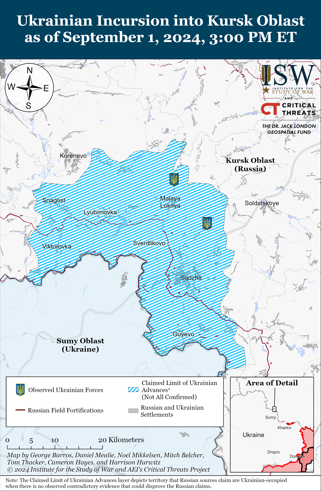
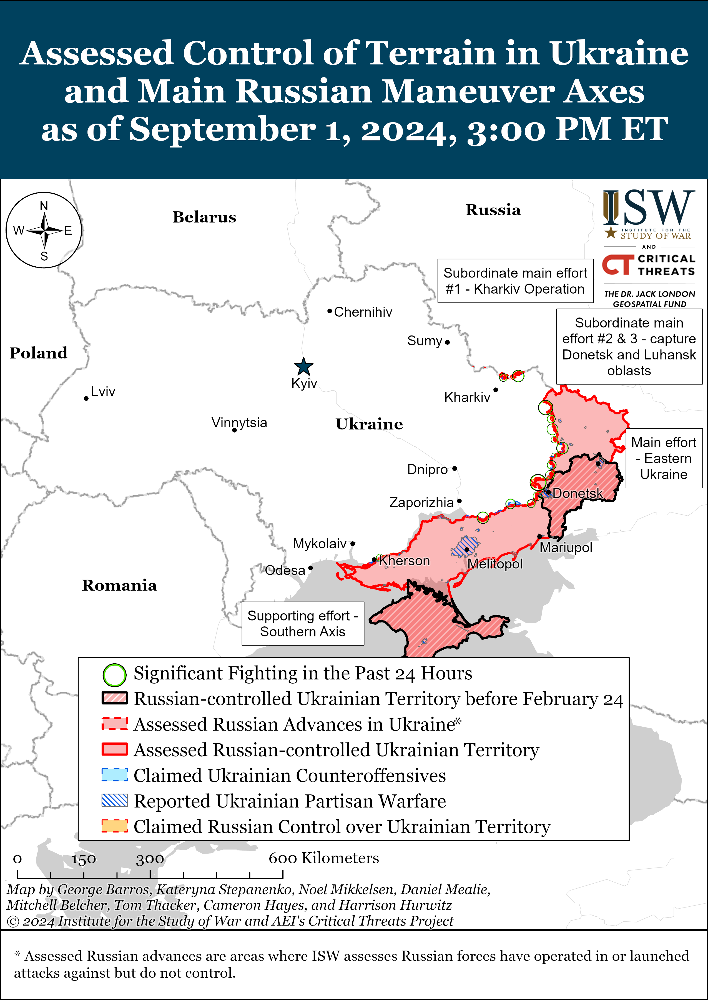
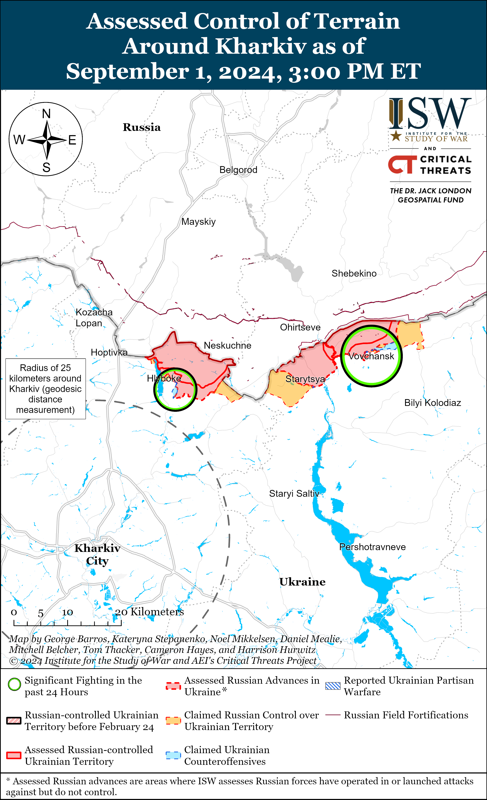
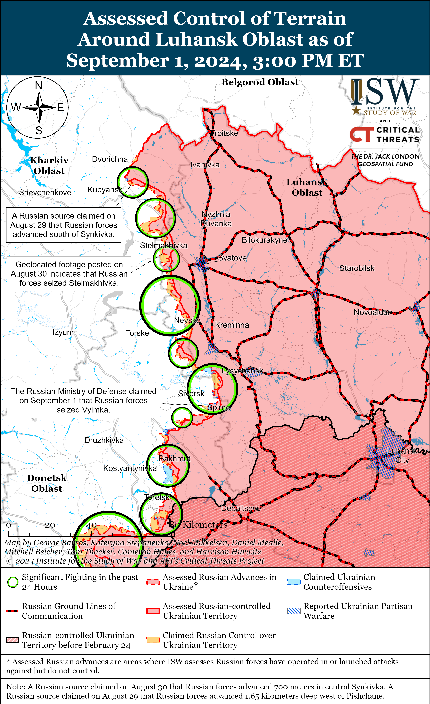
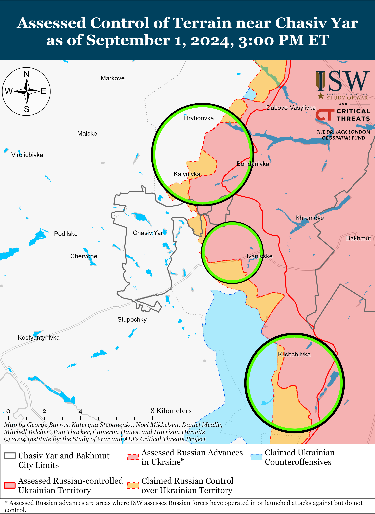
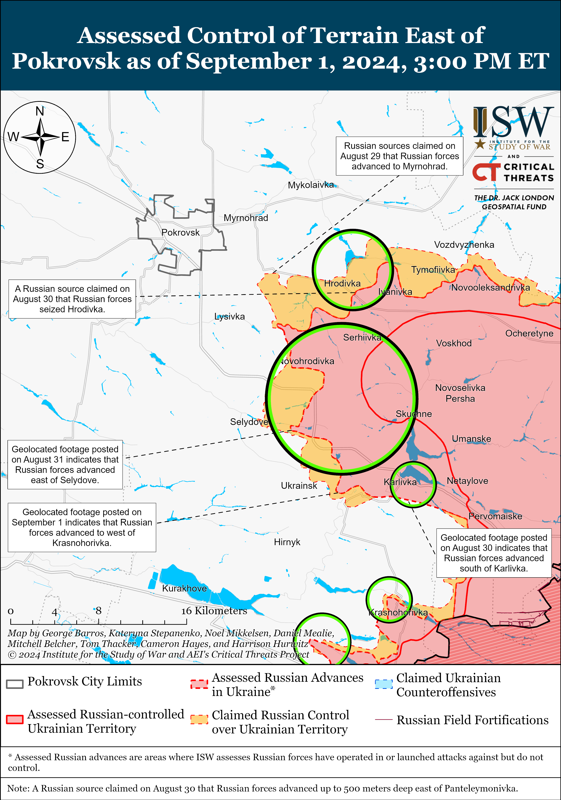
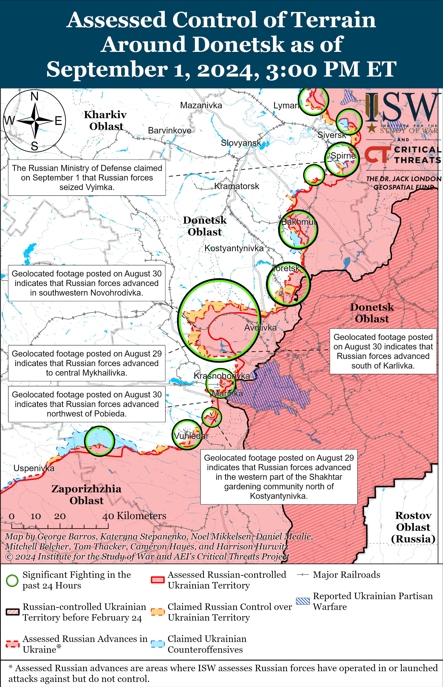
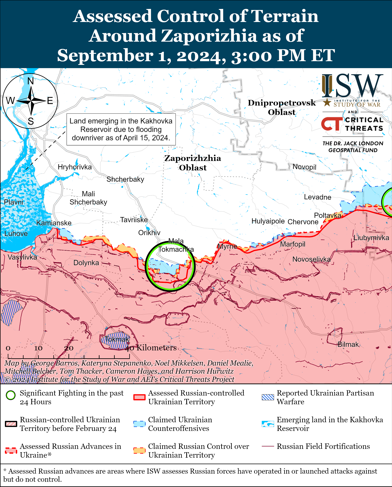
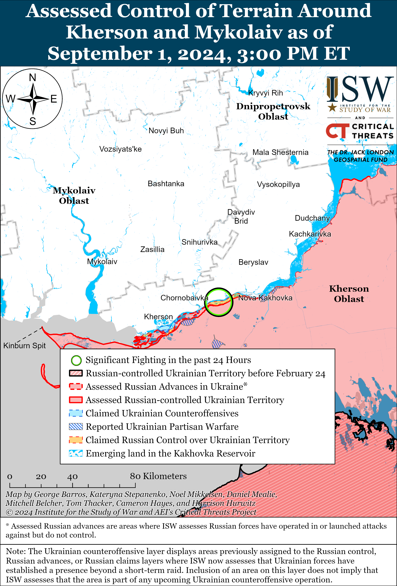

# Russian Offensive Campaign Assessment, September 1, 2024

**Riley Bailey, Grace Mappes, Nicole Wolkov, Christina Harward, and George Barros**

**September 1, 2024, 6:00 pm ET**

**Click** [**here**](https://storymaps.arcgis.com/stories/36a7f6a6f5a9448496de641cf64bd375) **to see ISW’s interactive map of the Russian invasion of Ukraine. This map is updated daily alongside the static maps present in this report.**

**Click** [**here**](https://storymaps.arcgis.com/stories/83a2f24901c941d581c0c523ecd2619b) **to see ISW’s interactive map of Ukraine’s offensive in Kursk Oblast.**

**Click** [**here**](https://understandingwar.maps.arcgis.com/apps/instant/3dviewer/index.html?appid=1602762dbcde419bb957dea358449580) **to see ISW’s 3D control of terrain topographic map of Ukraine. Use of a computer (not a mobile device) is strongly recommended for using this data-heavy tool.**

**Click** [**here**](https://storymaps.arcgis.com/stories/733fe90805894bfc8562d90b106aa895) **to access ISW’s archive of interactive time-lapse maps of the Russian invasion of Ukraine. These maps complement the static control-of-terrain map that ISW produces daily by showing a dynamic frontline. ISW will update this time-lapse map archive monthly.**

**Note: The data cut-off for this product was 12:30pm ET on September 1. ISW will cover subsequent reports in the September 2 Russian Offensive Campaign Assessment.**

**Ukrainian forces reportedly conducted the largest series of drone strikes against targets within Russia on the night of August 31 to September 1.** The Russian Ministry of Defense (MoD) claimed that Russian air defenses destroyed 158 Ukrainian drones over 16 oblasts: 46 drones over Kursk Oblast, 34 over Bryansk Oblast, 28 over Voronezh Oblast, 14 over Belgorod Oblast, nine over Moscow City and Oblast, eight over Ryazan Oblast, five over Kaluga Oblast, four over Lipetsk Oblast, three over Tula Oblast, two over Tambov and Smolensk oblasts each, and a drone each over Oryol, Tver, and Ivanovo oblasts.[1] Moscow Mayor Sergei Sobyanin claimed that Russian forces shot down two Ukrainian drones near the Moscow Oil Refinery in Kapotnya and that drone debris damaged a technical room at the facility and caused a fire.[2] Russian sources posted footage of the Ukrainian drone striking the Moscow Oil Refinery and a small fire in the area, although some characterized the fire as a normal gas flare at the facility.[3] Kashira Raion Head Mikhail Shuvalov stated that Ukrainian forces targeted the Kashira State District Power Plant in Kashira Raion, Moscow Oblast with three drones, and Russian sources amplified footage of Russian air defense activating and explosions near the plant.[4] The Tver Oblast press service stated that a Ukrainian drone caused a fire in Konakovo Raion, and Russian sources amplified footage of the drone striking the Konakovo State District Power Plant, a subsequent large fire at the plant, and damage within the plant.[5] Russian opposition outlet *Astra* reported that there was also a fire at the Konakovo gas distribution network along the “KGMO-Konakovo” main gas pipeline following Ukrainian drone strikes in Tver Oblast.[6] Kaluga Oblast Governor Vladislav Shapsha claimed that a Ukrainian drone damaged a cell tower in Tarusa Raion, Kaluga Oblast.[7] Russian opposition outlet *Vazhnye Istorii* noted that data available from NASA FIRMS shows heat anomalies at the Novolipetsk Metallurgical Plant (NLMK) in Lipetsk Oblast, a military facility for a unit of the 106th Airborne (VDV) Division in Tula Oblast, two cement plants in Voskresensk and Kolomna, Moscow Oblast, and the Ferzikovo cement plant in Kaluga Oblast on the night of August 31 to September 1.[8] Only the FIRMS data from the site in Tula Oblast appears to be anomalous, as the other facilities routinely give off heat signatures due to normal industrial activities.

**Ukrainian forces continued to conduct assaults in Kursk Oblast on September 1, but there were no confirmed Ukrainian advances.** Russian sources claimed that Ukrainian forces conducted assaults near Korenevo; east of Korenevo near Matveyevka; northeast of Korenevo near Aleksandrovka; northwest of Sudzha near Malaya Loknya and Pogrebki; north of Sudzha near Kamyshevka; and northeast of Sudzha near Nizhnyaya Parovaya, Bakhtinka, and Nechayev.[9] A Russian milblogger claimed that Ukrainian forces marginally advanced west of Pogrebki, and geolocated footage published on September 1 indicates that Ukrainian forces were recently operating within Pogrebki.[10] Another Russian milblogger claimed that Russian forces failed to establish a foothold in Borki (southeast of Sudzha) and continue to attack Ukrainian positions within the settlement.[11] A Russian source claimed that Russian forces pushed Ukrainian forces back from Korenevo, cleared Komarovka (southwest of Korenevo), and counterattacked near Kauchuk (northeast of Korenevo).[12] Elements of the Chechen Akhmat Spetsnaz’s “Varvar” detachment are reportedly operating near Cherkasskoye Porechnoye (north of Sudzha).[13] Elements of the Russian 810th Naval Infantry Brigade (Black Sea Fleet, Southern Military District [SMD]), the 155th Naval Infantry Brigade (Pacific Fleet, Eastern Military District [EMD]), the 56th Airborne (VDV) Regiment (7th VDV Division), and the Chechen Akhmat Spetsnaz’s “Aida” group are reportedly operating in Kursk Oblast.[14]

**Recent Russian domestic polls suggest that Ukraine’s incursion into Kursk Oblast has not yet degraded Russian domestic support of the war in Ukraine in the short-term following the Kursk incursion and that Russian support for the war has remained high since 2022.** Independent Russian polling organization Levada Center published the results of a monthly poll on August 30 and found that about 78 percent of respondents support Russian military operations in Ukraine — an increase from 75 percent in July 2024 and 77 percent in June 2024.[15] The Levada Center’s polling indicates that the lowest Russian support for the war in Ukraine was in February 2022 with 68 percent of respondents supporting the war and that war support among poll respondents has not fallen below 70 percent since March 2022. The Levada Center also asked respondents in August 2024 about the Ukrainian incursion into Kursk Oblast and found that 91 percent of respondents are concerned about Ukrainian military operations on Russian territory. The Levada Center also reported that 57 percent of respondents do not expect a second wave of mobilization and 60 percent do not see a need for a second wave of mobilization in the coming months — both decreasing from 65 percent and 69 percent, respectively. Levada Center’s polling data indicates that the Kremlin’s refusal to fully transition Russian society at large to a wartime footing and the Kremlin’s ongoing domestic information operations aimed at normalizing the war to Russian society have mitigated against domestic war weariness thus far and that the Ukrainian incursion into Kursk Oblast has not changed this mindset. The fact that Russian society in general appears to not be experiencing war fatigue likely grants the Kremlin flexibility in how it strategizes to wage a protracted war of attrition against Ukraine.[16]

**Armenian Prime Minister Nikol Pashinyan confirmed at an August 31 press conference that “Armenia has frozen its participation in the [Russian-led Collective Security Treaty Organization] CSTO at all levels,” after Armenia has effectively abstained from participating in the CSTO for nearly a year.[17]** Pashinyan also acknowledged that other government officials and the public may have differing views on Armenia’s decision to freeze its participation in the CSTO but noted that the Armenian government does not currently see the need to reconsider the decision. Pashinyan stated that Armenia may “see the need to make another decision” in the future, however.[18] Armenia has effectively abstained from participating in the CSTO since Pashinyan and Armenian representatives failed to attend several consecutive CSTO events — both political meetings and military exercises — starting in mid-to-late 2023.[19] Pashinyan acknowledged in February 2024 that Armenia had “essentially” frozen its participation in the CSTO because the CSTO “failed to fulfill its obligations in the field of security” to Armenia, particularly in 2021 and 2022.[20] Armenia has also appeared to be reducing its bilateral security relations with Russia, and Russian border guards left the Zvartnots International Airport in Yerevan — where Russian border guards had been serving previously since 1992 — on July 31, 2024.[21]

**Key Takeaways:**

- **Ukrainian forces reportedly conducted the largest series of drone strikes against targets within Russia on the night of August 31 to September 1.**
- **Ukrainian forces continued to conduct assaults in Kursk Oblast on September 1, but there were no confirmed Ukrainian advances.**
- **Recent Russian domestic polls suggest that Ukraine’s incursion into Kursk Oblast has not yet degraded Russian domestic support of the war in Ukraine in the short-term following the Kursk incursion and that Russian support for the war has remained high since 2022.**
- **Armenian Prime Minister Nikol Pashinyan confirmed at an August 31 press conference that “Armenia has frozen its participation in the [Russian-led Collective Security Treaty Organization] CSTO at all levels,” after Armenia has effectively abstained from participating in the CSTO for nearly a year.**
- **Russian forces recently advanced north of Kharkiv City, southeast of Kupyansk, southeast of Pokrovsk, and southwest of Donetsk City.**

******

***We do not report in detail on Russian war crimes because these activities are well-covered in Western media and do not directly affect the military operations we are assessing and forecasting. We will continue to evaluate and report on the effects of these criminal activities on the Ukrainian military and the Ukrainian population and specifically on combat in Ukrainian urban areas. We utterly condemn Russian violations of the laws of armed conflict and the Geneva Conventions and crimes against humanity even though we do not describe them in these reports.***

- Russian Main Effort – Eastern Ukraine (comprised of three subordinate main efforts)
- Russian Subordinate Main Effort #1 – Push Ukrainian forces back from the international border with Belgorod Oblast and approach to within tube artillery range of Kharkiv City
- Russian Subordinate Main Effort #2 – Capture the remainder of Luhansk Oblast and push westward into eastern Kharkiv Oblast and encircle northern Donetsk Oblast
- Russian Subordinate Main Effort #3 – Capture the entirety of Donetsk Oblast
- Russian Supporting Effort – Southern Axis
- Russian Air, Missile, and Drone Campaign
- Russian Mobilization and Force Generation Efforts
- Russian Technological Adaptations
- Activities in Russian-occupied areas
- Ukrainian Defense Industrial Base Efforts
- Russian Information Operations and Narratives
- Significant Activity in Belarus

**Russian Main Effort – Eastern Ukraine**

**Russian Subordinate Main Effort #1 – Kharkiv Oblast** **(Russian objective: Push Ukrainian forces back from the international border with Belgorod Oblast and approach to within tube artillery range of Kharkiv City)**

Russian forces recently advanced north of Kharkiv City amid continued fighting north and northeast of Kharkiv City on September 1. Geolocated footage published on September 1 shows that Russian forces recently advanced within western Hlyboke (north of Kharkiv City).[22] The Ukrainian Kharkiv Group of Forces reported that Russian personnel movements near Hlyboke are sporadic due to Ukrainian drone operations and that Ukrainian forces repelled a Russian assault group from the area near the Vovchansk Aggregate Plant in central Vovchansk (northeast of Kharkiv City) on the night of August 31 to September 1.[23] Fighting continued near Lyptsi (north of Kharkiv City) and in Vovchansk on August 31 and September 1.[24] Ukrainian Kharkiv Group of Forces Spokesperson Colonel Vitaliy Sarantsev stated that elements of the Russian 136th Motorized Rifle Brigade (58th Combined Arms Army [CAA], Southern Military District [SMD]) are completing the ongoing relief in place for the 83rd Airborne (VDV) Brigade and suggested that there are now nearly 3,000 Russian personnel at these positions.[25] Elements of the Russian 7th Motorized Rifle Regiment (11th Army Corps [AC], Leningrad Military District [LMD]) reportedly recently conducted assault operations near Lyptsi.[26]

****

**Russian Subordinate Main Effort #2 – Luhansk Oblast** **(Russian objective: Capture the remainder of Luhansk Oblast and push westward into eastern Kharkiv Oblast and northern Donetsk Oblast)**

Russian forces recently marginally advanced southeast of Kupyansk amid continued fighting along the Kupyansk-Svatove-Kreminna line on September 1. Geolocated footage published on August 31 shows that Russian forces recently marginally advanced southwest of Pishchane (southeast of Kupyansk).[27] A Russian milblogger claimed that Russian forces also advanced northwest of Pishchane, but ISW has not observed confirmation of this claim.[28] Another milblogger claimed that Russian forces are fighting near Senkove (southwest of Pishchane on the west [right] bank of the Oskil River), likely referring to the field area southwest of Pishchane rather than in the immediate area of Senkove itself.[29] Russian forces also conducted ground attacks northeast of Kupyansk near Synkivka; southeast of Kupyansk near Kolisynkivka, Lozova, Novoosynove, Hlushkivka, and Berestove; northwest of Kreminna near Tverdokhlibove, Hrekivka, Makiivka, Novosadove, and Nevske; west of Kreminna near Terny and Torske; and south of Kreminna in the Serebryanske forest area on August 31 and September 1.[30] Russian Defense Minister Andrei Belousov claimed that elements of the Russian 25th Motorized Rifle Brigade (6th Combined Arms Army [CAA], Leningrad Military District [LMD]) seized Synkivka, artillery elements of the 6th CAA are reportedly firing on targets near Petropavlivka (east of Kupyansk), and elements of the Russian 144th Motorized Rifle Division (20th CAA, Moscow Military District [MMD]) reportedly operate along the Svatove-Kreminna line.[31]

**Russian Subordinate Main Effort #3 – Donetsk Oblast** **(Russian objective: Capture the entirety of Donetsk Oblast, the claimed territory of Russia’s proxies in Donbas)**

Russian forces continued offensive operations in the Siversk direction on September 1 but did not make any confirmed advances. The Russian Ministry of Defense (MoD) claimed on September 1 that Russian forces seized Vyimka (southeast of Siversk), although ISW has not observed visual confirmation of this claim.[32] Fighting continued northeast of Siversk near Bilohorivka; east of Siversk near Verkhnokamyanske; southeast of Siversk near Vyimka and Spirne; and south of Siversk near Rozdolivka and Zvanivka on August 31 and September 1.[33]

Russian forces continued offensive operations in the Chasiv Yar direction on September 1 but did not make any confirmed advances. Fighting continued in eastern Chasiv Yar; north of Chasiv Yar near Kalynivka and in the Mayske and Markove directions; east of Chasiv Yar near Ivanivske; south of Chasiv Yar near Bila Hora; and southeast of Chasiv Yar near Klishchiivka, Andriivka, and Kurdyumivka on August 31 and September 1.[34] Elements of the Russian 98th Airborne (VDV) Division, 4th Motorized Rifle Brigade (2nd Luhansk People’s Republic Army Corps [LNR AC]), and Chechen “Akhmat” Spetsnaz reportedly continue operating near Chasiv Yar.[35]

Russian forces continued offensive operations in the Toretsk direction on September 1 but did not make any confirmed advances. A Russian milblogger claimed that Russian forces advanced 800 meters in Druzhba (east of Toretsk) towards Dachne (northeast of Toretsk) in order to conduct assaults on Toretsk from the north, although ISW has not observed visual confirmation of this claim.[36] Fighting continued near Toretsk and south of Toretsk near Niu York and Nelipivka on August 31 and September 1.[37] Donetsk People’s Republic (DNR) Head Denis Pushilin credited elements of the Russian 9th Motorized Rifle Brigade (1st DNR AC) with seizing Niu York and characterized the 9th Motorized Rifle Brigade as part of the 51st Combined Arms Army [CAA] of the Southern Military District [SMD].[38] Pushilin’s acknowledgement that the 9th Motorized Rifle Brigade is subordinated to the 51st CAA supports recent Russian milblogger reports that the Russian military command is reorganizing the 1st DNR AC into the 51st CAA.[39]

Russian forces recently advanced in the Pokrovsk direction amid continued offensive operations in the area on September 1. Geolocated footage published on September 1 indicates that Russian forces recently advanced west of Mykhailivka and within central Dolynivka (both southeast of Pokrovsk), and ISW assesses that Russian forces likely seized the settlements.[40] ISW has not observed confirmation that Russian forces are operating within Selydove (southeast of Pokrovsk), despite multiple Russian claims over the past several days that Russian forces have advanced within the settlement.[41] The Russian MoD claimed that Russian forces seized Ptyche (southeast of Pokrovsk) as of September 1, although ISW assessed that Russian forces had seized the settlement as of August 22.[42] Russian milbloggers claimed that Russian forces advanced south of Dolynivka and reached Zhelanne Pershe (southeast of Pokrovsk), although ISW has not observed visual confirmation of these claims.[43] Fighting continued west of Pokrovsk near Hrodivka, Vozdvyzhenka, Zelene Pole, and Kalynove and southeast of Pokrovsk near Novohrodivka, Marynivka, Mykhailivka, Krasnyi Yar, Selydove, and Karlivka.[44] Elements of the Russian 114th Motorized Rifle Brigade (1st DNR AC) are reportedly operating near Dolynivka; elements of the 120th Artillery Brigade (41st CAA, Central Military District [CMD]) are reportedly operating near Novoselivka Persha (southeast of Pokrovsk); assault elements of the “Mora” Detachment are reportedly operating near Memryk (southeast of Pokrovsk); and elements of the 74th Motorized Rifle Brigade (41st CAA, CMD) are reportedly operating in the Pokrovsk direction.[45] Russian Defense Minister Andrei Belousov credited elements of the Russian 228th Motorized Rifle Regiment (90th Tank Division, 41st CAA, CMD) with seizing Novozhelanne (southeast of Pokrovsk).[46] ISW assessed that Russian forces had seized Novozhelanne as of August 18.[47]

Russian forces continued offensive operations west of Donetsk City on September 1, but there were no confirmed changes to the frontline. The Ukrainian General Staff reported that Russian forces conducted offensive operations near Krasnohorivka and Heorhiivka on August 31 and September 1.[48]

Russian forces recently advanced southwest of Donetsk City amid continued Russian offensive operations in the area on September 1. Geolocated footage published on August 31 indicates that Russian forces recently advanced in northeastern Kostyantynivka.[49] A Russian milblogger claimed that Russian forces consolidated their positions within and north of Kostyantynivka and in western Paraskoviivka in an area 6.1 kilometers wide and 1.93 kilometers deep.[50] Russian sources claimed that Russian naval infantry elements pushed Ukrainian forces back in the Vuhledar direction and that Russian forces have recently intensified offensive operations in the area.[51] The Ukrainian General Staff reported that Russian forces conducted offensive operations near Kostyantynivka, Vuhledar, and Vodyane on August 31 and September 1.[52] Elements of the Russian 11th Air Force and Air Defense Army (Russian Aerospace Forces [VKS] and Eastern Military District [EMD]) are reportedly operating near Vodyane and a Ukrainian brigade posted video showing Russian glide bomb strikes against Vuhledar on September 1.[53]

Russian forces continued offensive operations in the Donetsk-Zaporizhia Oblast border area on September 1, but there were no confirmed changes to the frontline. The Ukrainian General Staff reported that Russian forces conducted offensive operations near Makarivka and Vremivka (both south of Velyka Novosilka) on August 31 and September 1.[54] A Russian milblogger claimed on August 31 that Russian forces marginally advanced in the Donetsk-Zaporizhia Oblast border area north of Urozhaine and Staromayorske (both south of Velyka Novosilka), but ISW has not observed confirmation of this claim.[55]

**Russian Supporting Effort – Southern Axis** **(Russian objective: Maintain frontline positions and secure rear areas against Ukrainian strikes)**

Russian forces continued ground attacks in western Zaporizhia Oblast near Robotyne and northeast of Robotyne near Mala Tokmachka on August 31 and September 1, but there were no confirmed changes to the frontline.[56]

The Ukrainian General Staff reported that Russian forces conducted two assaults in unspecified areas of the Kherson direction on September 1.[57]

****

**Russian Air, Missile, and Drone Campaign** **(Russian Objective: Target Ukrainian military and civilian infrastructure in the rear and on the frontline)**

Russian forces conducted a series of drone and missiles strikes against Ukraine, particularly Kharkiv City, on the night of August 31 to September 1. The Ukrainian Air Force reported on September 1 that Russian forces launched an Iskander-M ballistic missile from Kursk Oblast and 11 Shahed-136/131 drones from occupied Cape Chauda, Crimea that primarily targeted grain infrastructure in Mykolaiv Oblast on the night of August 31 to September 1.[58] The Ukrainian Air Force reported that Ukrainian forces downed eight Shaheds over Odesa, Mykolaiv, Kherson, Kirovohrad, and Dnipropetrovsk oblasts.[59] Ukrainian officials reported that Russian forces conducted mixed missile and glide bomb strikes against Kharkiv City on September 1, with at least two Iskander-M ballistic missiles and three S-300/S-400 air defense missiles and an unspecified number of glide bombs and Grom-E1 missile-glide bomb hybrid munitions.[60] Russian forces struck a sports complex, a shopping center, and residential areas in Kharkiv City.[61]

Russian sources claimed on September 1 that Russian forces conducted a complex missile and MLRS strike against a large Ukrainian military column in Sumy Oblast, although Ukrainian officials reported that Russian forces struck civilian targets in the area. Russian sources amplified footage on September 1 purporting to show Russian forces striking a column of vehicles near Verkhnia Syrovatka, Sumy Oblast with two Iskander-M ballistic missiles equipped with cluster munitions and then conducting repeated MLRS strikes against the column after the initial precision strikes caused the vehicles in the column to crowd one another.[62] Russian sources claimed that 20 Ukrainian military vehicles were in the column and that Russian forces eliminated up to a company’s worth of Ukrainian personnel.[63] The Sumy Oblast Prosecutor’s Office reported that Russian forces struck a line of commercial trucks waiting to load soybeans, however, and posted images showing damage to roughly 20 commercial vehicles in the area.[64]

Ukrainian President Volodymyr Zelensky stated on September 1 that Russian forces have launched more than 160 missiles, 780 glide bombs, and 400 strike drones against Ukraine in the past week (August 25 to September 1).[65]

**Russian Mobilization and Force Generation Efforts** **(Russian objective: Expand combat power without conducting general mobilization)**

Norwegian broadcasting company *NRK* reported on August 31 that “Hvaldimir,” the beluga whale that a fisherman found wearing a harness with a camera near Norway in 2019, possibly as part of a Russian surveillance program, died.[66]

**Russian Technological Adaptations** **(Russian objective: Introduce technological innovations to optimize systems for use in Ukraine)**

Nothing significant to report.

**Ukrainian Defense Industrial Efforts** **(Ukrainian objective: Develop its defense industrial base to become more self-sufficient in cooperation with US, European, and international partners)**

*ISW is suspending publishing coverage of Ukrainian defense industrial efforts until further notice.*

**Activities in Russian-occupied areas** **(Russian objective: Consolidate administrative control of annexed areas; forcibly integrate Ukrainian citizens into Russian sociocultural, economic, military, and governance systems)**

*ISW is not publishing coverage of activities in Russian-occupied areas today.*

**Russian Information Operations and Narratives**

Kremlin officials continue to explicitly state that the Kremlin remains uninterested in negotiations to end the war in Ukraine or to improve relations with the West. Kremlin Spokesperson Dmitry Peskov stated on September 1 that there are no prospects for improving US–Russian relations and alleged that the US is pursuing an openly hostile position towards Russia by becoming more involved in the war in Ukraine.[67] Russian Foreign Minister Sergei Lavrov claimed on August 31 that the West is not interested in negotiations with Russia or negotiations about the war in Ukraine.[68] Russian officials have routinely placed the onus for negotiations on the West in an effort to prompt the West into making preemptive concessions, including on Ukraine’s territorial integrity and sovereignty.[69]

Russian officials continue to engage in rote nuclear saber-rattling in an effort to encourage the West to self-deter and reduce its support for Ukraine. Russian Deputy Foreign Minister Sergei Ryabkov claimed on September 1 that Russia will change its nuclear doctrine based on recent conflicts and the West’s alleged escalation in Ukraine but noted that there are no set dates for the changes.[70] Ryabkov did not specify what the alleged changes to the doctrine may be, and ISW continues to assess that Russia remains highly unlikely to use tactical nuclear weapons in Ukraine or engage in nuclear confrontation elsewhere.[71]

**Significant activity in Belarus** **(Russian efforts to increase its military presence in Belarus and further integrate Belarus into Russian-favorable frameworks and Wagner Group activity in Belarus)**

Nothing significant to report.

**Note: ISW does not receive any classified material from any source, uses only publicly available information, and draws extensively on Russian, Ukrainian, and Western reporting and social media as well as commercially available satellite imagery and other geospatial data as the basis for these reports. References to all sources used are provided in the endnotes of each update.**

---

[1] https://t.me/mod\_russia/42821 ; https://t.me/tass\_agency/269683

[2] https://t.me/tass\_agency/269668 ; https://t.me/tass\_agency/269670 ; https://t.me/tass\_agency/269681 ; https://t.me/tass\_agency/269684 ; https://t.me/tass\_agency/269686 ; https://t.me/tass\_agency/269689 ; https://t.me/tass\_agency/269691

[3] https://t.me/tass\_agency/269688 ; https://t.me/DnevnikDesantnika/14838; https://t.me/milinfolive/129636 ; https://t.me/vchkogpu/50553; https://t.me/vchkogpu/50557 ; https://t.me/bazabazon/30836

[4] https://t.me/vchkogpu/50542 ; https://t.me/tass\_agency/269667 ; https://t.me/ShuvalovMN/4644 ; https://t.me/rian\_ru/259442 ; https://t.me/dva\_majors/51203 ; https://t.me/bazabazon/30829

[5] https://t.me/RVvoenkor/76113 ; https://t.me/dva\_majors/51204 ; https://t.me/vchkogpu/50541; https://t.me/bazabazon/30830; https://t.me/astrapress/63224 ; https://t.me/tass\_agency/269677 ; https://t.me/tass\_agency/269735 ; https://t.me/voenkorKotenok/58706; https://t.me/milinfolive/129640 ; https://t.me/vchkogpu/50565 ; https://t.me/vchkogpu/50545 ; https://t.me/vchkogpu/50549; https://t.me/sotaproject/86310 ; https://t.me/vchkogpu/50562 ; https://t.me/astrapress/63262

[6] https://t.me/astrapress/63225

[7] https://t.me/tass\_agency/269726

[8] https://t.me/istories\_media/7443

[9] https://t.me/mod\_russia/42827; https://t.me/rybar/63190; https://t.me/RVvoenkor/76071; https://t.me/RVvoenkor/76071; https://t.me/dva\_majors/51235 ; https://t.me/warhistoryalconafter/182458; https://t.me/NgP\_raZVedka/18911

[10] https://t.me/rybar/63190; https://t.me/YourVaccineZ/12428; https://x.com/Ryan72101/status/1830299595873935419

[11] https://t.me/motopatriot/27127

[12] https://t.me/RVvoenkor/76071; https://t.me/NgP\_raZVedka/18911

[13] https://t.me/VARVARGROUP/335; https://x.com/Ryan72101/status/1830012266747437087; https://x.com/Ryan72101/status/1830013635017515280; https://x.com/Ryan72101/status/1830033068423315857

[14] https://t.me/dva\_majors/51207

[15] https://www.levada dot ru/2024/08/30/konflikt-s-ukrainoj-i-napadenie-na-kurskuyu-oblast-osnovnye-pokazateli-v-avguste-2024-goda/

[16] https://understandingwar.org/backgrounder/russian-offensive-campaign-assessment-june-7-2024

[17] https://armenpress dot am/hy/article/1198725 ; https://armenpress dot am/ru/article/1198725 ; https://armenpress dot am/en/article/1198725

[18] https://armenpress dot am/hy/article/1198725 ; https://armenpress dot am/ru/article/1198725

[19] https://isw.pub/UkrWar121423 ; https://isw.pub/UkrWar120523 ; https://isw.pub/UkrWar112423

[20] https://www.primeminister dot am/en/interviews-and-press-conferences/item/2024/02/23/Nikol-Pashinyan-Interview-France-24/ ; https://www.azatutyun dot am/a/32832284.html ; https://understandingwar.org/backgrounder/russian-offensive-campaign-assessment-february-23-2024

[21] https://understandingwar.org/backgrounder/russian-offensive-campaign-assessment-july-31-2024 ; https://isw.pub/UkrWar030624

[22] https://x.com/small10space/status/1830256588344713727; https://x.com/99Dominik\_/status/1830262335078101418

[23] https://t.me/otukharkiv/1031

[24] https://www.facebook.com/GeneralStaff.ua/posts/pfbid02XoDngCM8pLJ4DmKtuk1nfFLQNGbq8h89Fh2hEyxoaGE7sJbLi92DfZbaKB5CrzHol; https://www.facebook.com/GeneralStaff.ua/posts/pfbid02PSSLQZ5ZnRNddSZuUEVVSzhRAva43kmfe9GtuKF3Hn37iVYtj67ezi13fNb3X1DUl; https://www.facebook.com/GeneralStaff.ua/posts/pfbid02LkvTHxLVnbC1xD4DuNWHkBymXNzZ3REoJ7YxktcTEdFtmQhURnWKhnaeFPwfhV5ul; https://t.me/Sladkov\_plus/11300; https://t.me/wargonzo/21862; https://t.me/otukharkiv/1031

[25] https://armyinform.com dot ua/2024/08/31/pidrozdil-ahmat-zavodyat-okupanty-do-vovchanska/

[26] https://www.facebook.com/butusov.yuriy/posts/pfbid0tuaQmXaeCTHanL6WjjZdUKB131JzVvKUaVcW3gSUfSVjZmncMy4Nue9tAvL9UNAYl

[27] https://x.com/blinzka/status/1830024159306363199; https://x.com/DPSU\_ua/status/1829959025825628266; https://t.me/DPSUkr/21766

[28] https://t.me/motopatriot/27137

[29] https://t.me/Sladkov\_plus/11300

[30] https://www.facebook.com/GeneralStaff.ua/posts/pfbid02XoDngCM8pLJ4DmKtuk1nfFLQNGbq8h89Fh2hEyxoaGE7sJbLi92DfZbaKB5CrzHol; https://www.facebook.com/GeneralStaff.ua/posts/pfbid02PSSLQZ5ZnRNddSZuUEVVSzhRAva43kmfe9GtuKF3Hn37iVYtj67ezi13fNb3X1DUl; https://www.facebook.com/GeneralStaff.ua/posts/pfbid02LkvTHxLVnbC1xD4DuNWHkBymXNzZ3REoJ7YxktcTEdFtmQhURnWKhnaeFPwfhV5ul

[31] https://t.me/vysokygovorit/17150; https://t.me/mod\_russia/42818; https://t.me/DnevnikDesantnika/14839

[32] https://t.me/mod\_russia/42825

[33] https://www.facebook.com/GeneralStaff.ua/posts/pfbid02XoDngCM8pLJ4DmKtuk1nfFLQNGbq8h89Fh2hEyxoaGE7sJbLi92DfZbaKB5CrzHol ; https://www.facebook.com/GeneralStaff.ua/posts/pfbid02PSSLQZ5ZnRNddSZuUEVVSzhRAva43kmfe9GtuKF3Hn37iVYtj67ezi13fNb3X1DUl ; https://www.facebook.com/GeneralStaff.ua/posts/pfbid02LkvTHxLVnbC1xD4DuNWHkBymXNzZ3REoJ7YxktcTEdFtmQhURnWKhnaeFPwfhV5ul

[34] https://www.facebook.com/GeneralStaff.ua/posts/pfbid02XoDngCM8pLJ4DmKtuk1nfFLQNGbq8h89Fh2hEyxoaGE7sJbLi92DfZbaKB5CrzHol ; https://www.facebook.com/GeneralStaff.ua/posts/pfbid02PSSLQZ5ZnRNddSZuUEVVSzhRAva43kmfe9GtuKF3Hn37iVYtj67ezi13fNb3X1DUl ; https://www.facebook.com/GeneralStaff.ua/posts/pfbid02LkvTHxLVnbC1xD4DuNWHkBymXNzZ3REoJ7YxktcTEdFtmQhURnWKhnaeFPwfhV5ul

[35] https://t.me/voin\_dv/10558 ; https://t.me/milinfolive/129634

[36] https://t.me/DnevnikDesantnika/14817

[37] https://www.facebook.com/GeneralStaff.ua/posts/pfbid02XoDngCM8pLJ4DmKtuk1nfFLQNGbq8h89Fh2hEyxoaGE7sJbLi92DfZbaKB5CrzHol ; https://www.facebook.com/GeneralStaff.ua/posts/pfbid02PSSLQZ5ZnRNddSZuUEVVSzhRAva43kmfe9GtuKF3Hn37iVYtj67ezi13fNb3X1DUl ; https://t.me/DnevnikDesantnika/14817

[38] https://t.me/PushilinDenis/5062

[39] https://understandingwar.org/backgrounder/russian-offensive-campaign-assessment-august-31-2024

[40] (Mykhailivka) https://t.me/kyianyn204/1562; https://t.me/kyianyn204/1561; https://x.com/moklasen/status/1830235119229305170

(Dolynivka) https://t.me/RtrDonetsk/26779; https://x.com/franfran2424/status/1830180815143072123; https://x.com/franfran2424/status/1830183935109664972; https://t.me/creamy\_caprice/6623

[41] https://understandingwar.org/backgrounder/russian-offensive-campaign-assessment-august-31-2024 ; https://understandingwar.org/backgrounder/russian-offensive-campaign-assessment-august-30-2024 ; https://understandingwar.org/backgrounder/russian-offensive-campaign-assessment-august-29-2024

[42] https://t.me/mod\_russia/42825 ; https://understandingwar.org/backgrounder/russian-offensive-campaign-assessment-august-22-2024

[43] https://t.me/motopatriot/27141 ; https://t.me/voenkorKotenok/58694 ; https://t.me/voenkorKotenok/58684

[44] https://www.facebook.com/GeneralStaff.ua/posts/pfbid02XoDngCM8pLJ4DmKtuk1nfFLQNGbq8h89Fh2hEyxoaGE7sJbLi92DfZbaKB5CrzHol ; https://www.facebook.com/GeneralStaff.ua/posts/pfbid02PSSLQZ5ZnRNddSZuUEVVSzhRAva43kmfe9GtuKF3Hn37iVYtj67ezi13fNb3X1DUl ; https://www.facebook.com/GeneralStaff.ua/posts/pfbid02LkvTHxLVnbC1xD4DuNWHkBymXNzZ3REoJ7YxktcTEdFtmQhURnWKhnaeFPwfhV5ul ; https://t.me/RVvoenkor/76111

[45] (Dolynivka) https://t.me/RtrDonetsk/26779; https://x.com/franfran2424/status/1830180815143072123; https://x.com/franfran2424/status/1830183935109664972

(Novoselivka Persha) https://t.me/dosye\_shpiona/588 ; https://t.me/ButusovPlus/13242

(Memryk) https://t.me/rusich\_army/16907

(Pokrovsk direction) https://t.me/milinfolive/129624

[46] https://t.me/mod\_russia/42818

[47] https://x.com/chris\_\_759/status/1825307840849793099; https://t.me/rusich\_army/16615

[48] https://www.facebook.com/GeneralStaff.ua/posts/pfbid02XoDngCM8pLJ4DmKtuk1nfFLQNGbq8h89Fh2hEyxoaGE7sJbLi92DfZbaKB5CrzHol; https://www.facebook.com/GeneralStaff.ua/posts/pfbid02PSSLQZ5ZnRNddSZuUEVVSzhRAva43kmfe9GtuKF3Hn37iVYtj67ezi13fNb3X1DUl ; https://www.facebook.com/GeneralStaff.ua/posts/pfbid02LkvTHxLVnbC1xD4DuNWHkBymXNzZ3REoJ7YxktcTEdFtmQhURnWKhnaeFPwfhV5ul

[49] https://x.com/MikiValbuena/status/1830202120374571468; https://x.com/MikiValbuena/status/1830206117760180707

[50] https://t.me/RVvoenkor/76111

[51] https://t.me/voin\_dv/10566; https://t.me/milinfolive/129644

[52] https://www.facebook.com/GeneralStaff.ua/posts/pfbid02XoDngCM8pLJ4DmKtuk1nfFLQNGbq8h89Fh2hEyxoaGE7sJbLi92DfZbaKB5CrzHol; https://www.facebook.com/GeneralStaff.ua/posts/pfbid02PSSLQZ5ZnRNddSZuUEVVSzhRAva43kmfe9GtuKF3Hn37iVYtj67ezi13fNb3X1DUl  ; https://www.facebook.com/GeneralStaff.ua/posts/pfbid02LkvTHxLVnbC1xD4DuNWHkBymXNzZ3REoJ7YxktcTEdFtmQhURnWKhnaeFPwfhV5ul

[53] https://t.me/voin\_dv/10568 ; https://t.me/boris\_rozhin/135741; https://x.com/small10space/status/1830190917610783211

[54] https://www.facebook.com/GeneralStaff.ua/posts/pfbid02XoDngCM8pLJ4DmKtuk1nfFLQNGbq8h89Fh2hEyxoaGE7sJbLi92DfZbaKB5CrzHol; https://www.facebook.com/GeneralStaff.ua/posts/pfbid02PSSLQZ5ZnRNddSZuUEVVSzhRAva43kmfe9GtuKF3Hn37iVYtj67ezi13fNb3X1DUl ; https://www.facebook.com/GeneralStaff.ua/posts/pfbid02LkvTHxLVnbC1xD4DuNWHkBymXNzZ3REoJ7YxktcTEdFtmQhURnWKhnaeFPwfhV5ul

[55] https://t.me/voenkorKotenok/58690

[56] https://www.facebook.com/GeneralStaff.ua/posts/pfbid02PSSLQZ5ZnRNddSZuUEVVSzhRAva43kmfe9GtuKF3Hn37iVYtj67ezi13fNb3X1DUl ; https://www.facebook.com/GeneralStaff.ua/posts/pfbid02LkvTHxLVnbC1xD4DuNWHkBymXNzZ3REoJ7YxktcTEdFtmQhURnWKhnaeFPwfhV5ul

[57] https://www.facebook.com/GeneralStaff.ua/posts/pfbid02XoDngCM8pLJ4DmKtuk1nfFLQNGbq8h89Fh2hEyxoaGE7sJbLi92DfZbaKB5CrzHol

[58] https://www.facebook.com/kpszsu/posts/pfbid02Ajhv1Mdw1E1w9w93teiXhBKMSMtcDJGVM2xu4mUMVdnLjid6cCfQbE1cfUVXDpEMl

[59] https://www.facebook.com/kpszsu/posts/pfbid02Ajhv1Mdw1E1w9w93teiXhBKMSMtcDJGVM2xu4mUMVdnLjid6cCfQbE1cfUVXDpEMl

[60] https://t.me/prokuratura\_kharkiv/18446 ; https://armyinform.com dot ua/2024/09/01/armiya-rf-znov-zavdala-raketnogo-udaru-po-harkovu-ye-postrazhdali/ ; https://t.me/synegubov/10949 ; https://armyinform.com dot ua/2024/09/01/okupanty-zavdaly-blyzko-10-udariv-po-harkovu-ye-poterpili/ ; https://t.me/synegubov/10956 ; https://armyinform dot com.ua/2024/09/01/rosiyany-vdaryly-po-harkovu-iskanderom/ ; https://t.me/bbcrussian/69837

[61] https://t.me/synegubov/10954; https://armyinform.com dot ua/2024/09/01/u-harkovi-kilkist-postrazhdalyh-unaslidok-rosijskoyi-ataky-zrosla-do-25/ ; https://t.me/synegubov/10958 ; https://t.me/synegubov/10950 ; https://t.me/V\_Zelenskiy\_official/11508; https://armyinform.com dot ua/2024/09/01/volodymyr-zelenskyj-pokazav-naslidky-rankovogo-udaru-rosiyi-po-harkovu/ ; https://t.me/RVvoenkor/76139 ; https://t.me/RVvoenkor/76150 ;

[62] https://t.me/voenacher/71071 ; https://t.me/basurin\_e/13849 ; https://t.me/rybar/63195 ; https://t.me/RVvoenkor/76080 ; https://t.me/NgP\_raZVedka/18901 ; https://t.me/boris\_rozhin/135645 ; https://t.me/milinfolive/129620

[63] https://t.me/voenacher/71071 ; https://t.me/basurin\_e/13849 ; https://t.me/rybar/63195 ; https://t.me/RVvoenkor/76080 ; https://t.me/NgP\_raZVedka/18901 ; https://t.me/boris\_rozhin/135645 ; https://t.me/milinfolive/129620

[64] https://armyinform dot com.ua/2024/09/01/breshut-yak-dyhayut-na-sumshhyni-okupanty-vdaryly-raketamy-po-zernovozah-a-vidzvituvalysya-shho-znyshhyly-kolonu-zsu/ ; https://t.me/prokuraturasumy/3486 ; https://t.me/Sumy\_news\_ODA/29419 ; https://suspilne dot media/sumy/826407-armia-rf-obstrilala-kolonu-zernovoziv-na-sumsini-so-vidomo/

[65] https://t.me/V\_Zelenskiy\_official/11507; https://armyinform.com dot ua/2024/09/01/prezydent-uprodovzh-tyzhnya-rosiya-zastosuvala-proty-ukrayincziv-ponad-160-raket/

[66] https://www.nrk dot no/rogaland/kjendishvalen-hvaldimir-er-dod-1.17025163; https://www.theguardian.com/world/article/2024/sep/01/beluga-whale-hvaldimir-found-dead-norway; https://www.nytimes.com/2024/08/31/world/europe/hvaldimir-spy-whale-dead.html

[67] https://t.me/tass\_agency/269749

[68] https://t.me/MID\_Russia/44658; https://t.me/MID\_Russia/44663

[69] https://understandingwar.org/backgrounder/why-putin-remains-uninterested-meaningful-negotiations-ukraine

[70] https://tass dot ru/politika/21738323 ; https://t.me/tass\_agency/269774 ; https://t.me/astrapress/63324

[71] https://understandingwar.org/backgrounder/special-report-assessing-putin%E2%80%99s-implicit-nuclear-threats-after-annexation
