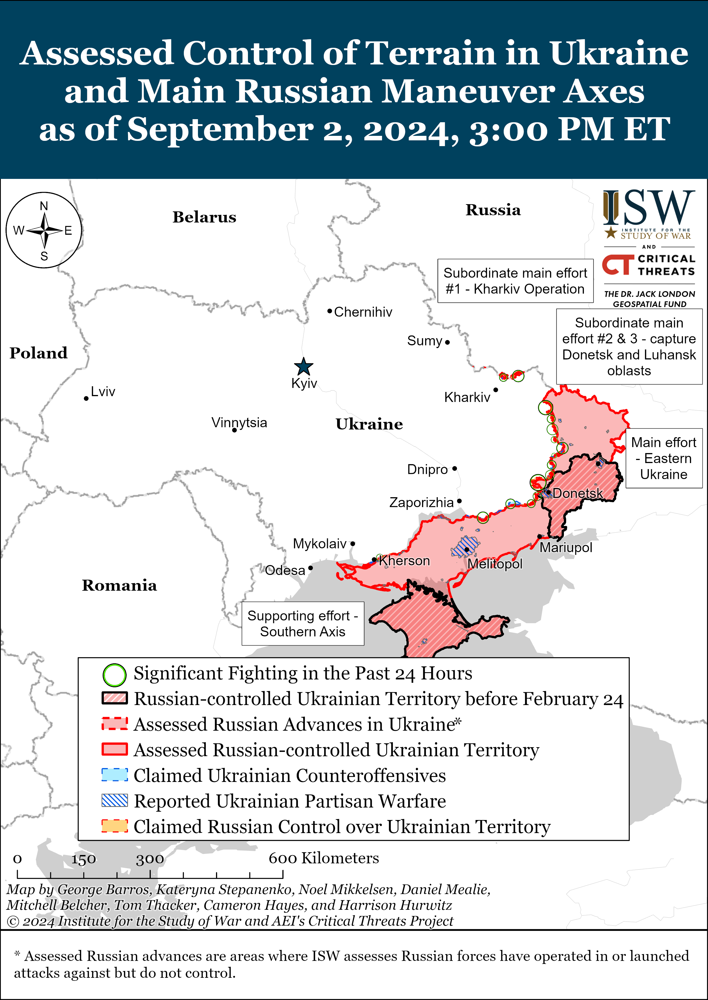
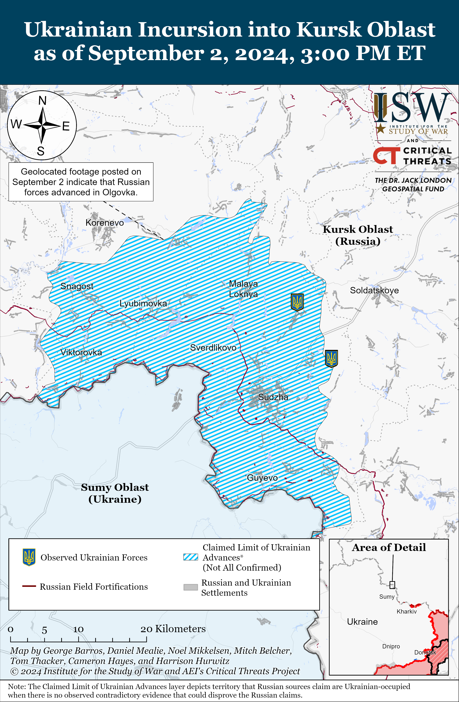
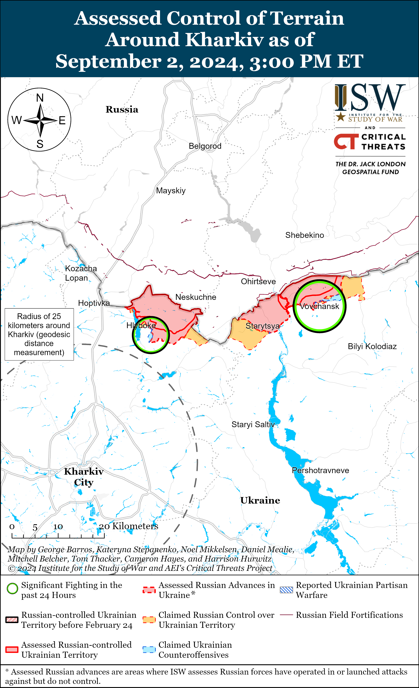
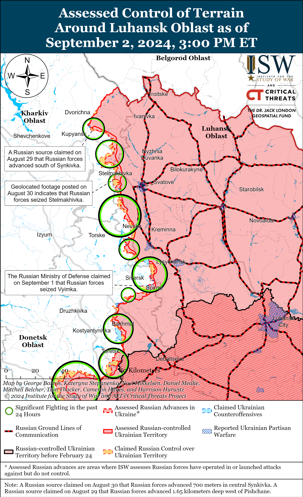
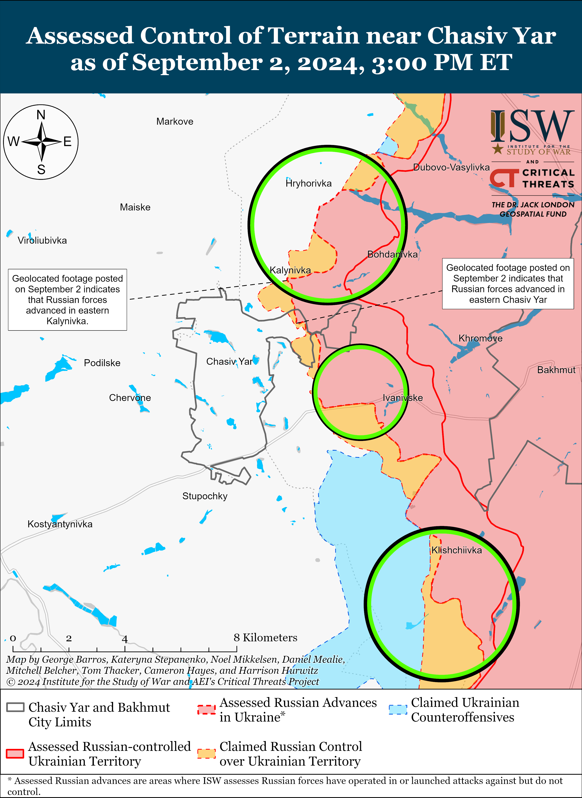
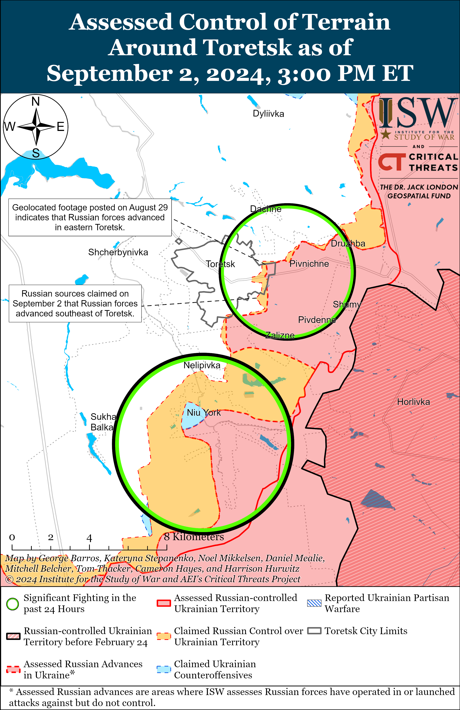
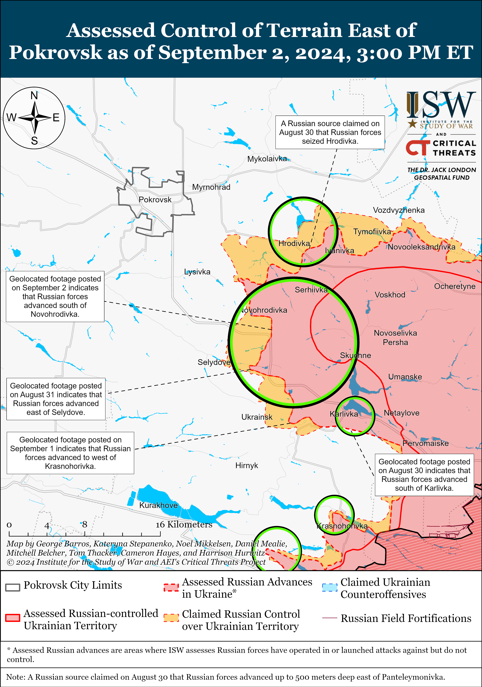
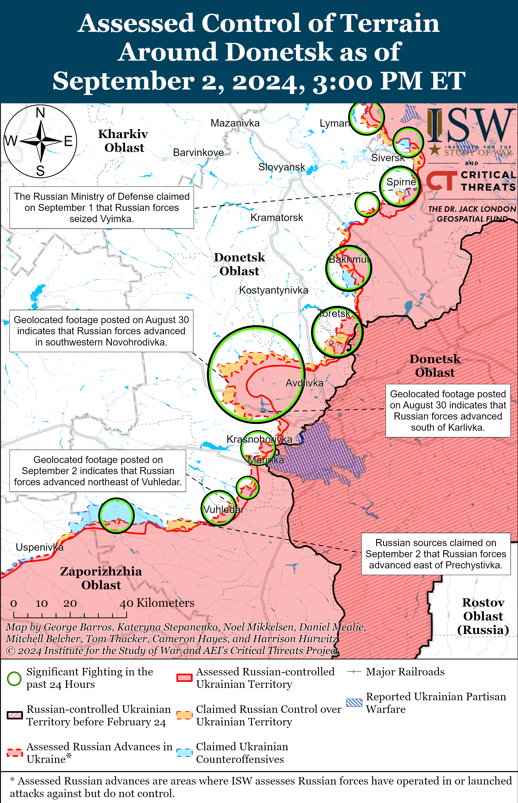
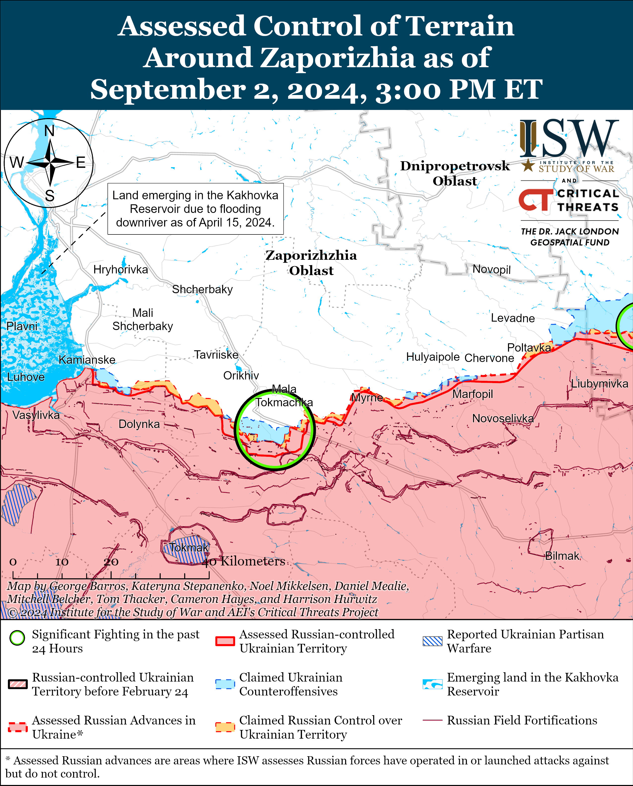
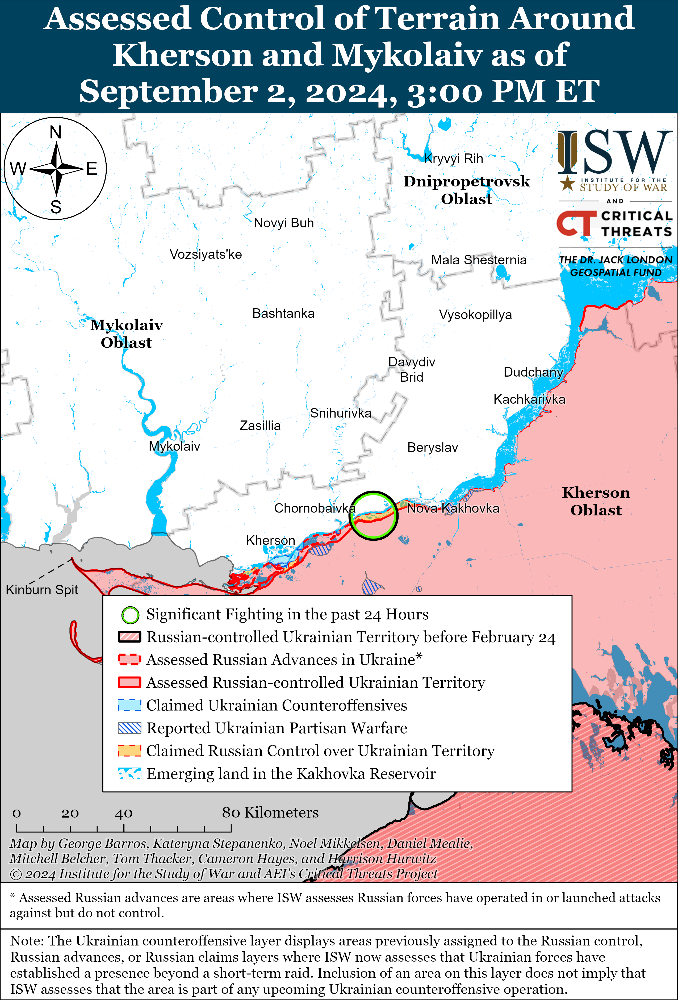

# Russian Offensive Campaign Assessment, September 2, 2024

**Nicole Wolkov, Grace Mappes, Karolina Hird, Christina Harward, Annika Ganzeveld, and Frederick W. Kagan**

**September 2, 2024, 7:30 pm ET**

**Click**[**here**](https://storymaps.arcgis.com/stories/36a7f6a6f5a9448496de641cf64bd375)**to see ISW’s interactive map of the Russian invasion of Ukraine. This map is updated daily alongside the static maps present in this report.**

**Click**[**here**](https://storymaps.arcgis.com/stories/83a2f24901c941d581c0c523ecd2619b)**to see ISW’s interactive map of Ukraine’s offensive in Kursk Oblast.**

**Click**[**here**](https://understandingwar.maps.arcgis.com/apps/instant/3dviewer/index.html?appid=1602762dbcde419bb957dea358449580)**to see ISW’s 3D control of terrain topographic map of Ukraine. Use of a computer (not a mobile device) is strongly recommended for using this data-heavy tool.**

**Click**[**here**](https://storymaps.arcgis.com/stories/733fe90805894bfc8562d90b106aa895)**to access ISW’s archive of interactive time-lapse maps of the Russian invasion of Ukraine. These maps complement the static control-of-terrain map that ISW produces daily by showing a dynamic frontline. ISW will update this time-lapse map archive monthly.**

**Note: The data cut-off for this product was 1:30 pm ET on September 2. ISW will cover subsequent reports in the September 3 Russian Offensive Campaign Assessment.**

**NOTE: ISW is introducing a new section of the Russian Offensive Campaign Assessment, “Ukrainian Operations in the Russian Federation,” in which ISW will track Ukrainian ground attacks, offensive operations, and long-range strikes within Russia. ISW will hereafter report on tactical updates on Ukrainian offensive operations in Kursk Oblast in this section, unless there is a major inflection in the situation on the ground. ISW will also track Ukrainian long-range strikes on targets within the Russian Federation in this section. ISW will not, however, offer assessments about Ukrainian objectives or capabilities in this new section.**

**Iran is expected to “imminently” deliver ballistic missiles to Russia to support the Russian invasion of Ukraine.[1] *NOTE: A version of this text appears in the September 2 ISW-CTP Iran Update.***An unspecified European official told *Bloomberg* on September 2 that Iran could begin shipping ballistic missiles to Russia “within a matter of days.”[2] European intelligence sources previously told *Reuters* in August 2024 that Iran and Russia signed a contract in December 2023 for Iran to deliver Ababil close-range ballistic missiles and Fateh-360 short-range ballistic missiles (SRBMs) to Russia.[3] The intelligence sources added that dozens of Russian military personnel are currently in Iran training to operate Fateh-360 missiles. Russia’s acquisition of Ababil or Fateh-360 ballistic missiles would likely allow Russian forces to strike Ukrainian near-rear targets while preserving Russia’s stockpiles of domestically-produced missiles, such as Iskanders, for deep-rear Ukrainian targets, as CTP-ISW previously assessed.[4]

**Russian President Vladimir Putin gave an interview to Mongolian outlet *Unuudur*ahead of his visit to Mongolia on September 2-3, emphasizing historical and modern Russian-Mongolian relations and current trilateral economic and energy initiatives with Mongolia and the People’s Republic of China (PRC).**Putin emphasized Soviet-Mongolian relations and the 2019 Russian-Mongolian comprehensive strategic partnership agreement in the interview published on September 2.[5] Putin also highlighted economic and energy cooperation initiatives to deepen relations between Russia, Mongolia, and the PRC and expressed confidence in developing the Russia-Mongolia-China Economic Corridor and the Power of Siberia 2 gas pipeline, which will run from Russia through Mongolia to the PRC upon its completion. Putin also asserted that the Russia-led Eurasian Economic Union (EAEU) and Mongolia have made significant progress in drafting a temporary free trade agreement. Putin notably published articles in North Korean and Vietnamese state newspapers before his visits to the countries in June 2024 and is likely attempting to pursue stronger relations with countries that historically had friendly ties to the Soviet Union to form a coalition to act as an alternative to the West.[6]

**Russian and Mongolian officials indicated that the International Criminal Court (ICC) warrant for Putin’s arrest will not impact Putin’s ongoing visit to Mongolia, despite Mongolia’s legal obligation to enforce this warrant.**Putin arrived in Ulaanbaatar on September 2, and the Russian Ministry of Foreign Affairs (MFA) noted that Mongolian President Ukhnaagiin Khürelsükh invited Putin and that Putin will discuss bilateral relations and sign bilateral agreements during the visit.[7] Kremlin Spokesperson Dmitry Peskov claimed on August 30 that the Kremlin is not worried about Mongolia’s obligation to arrest Putin as Russia and Mongolia maintain an “excellent dialogue,” and Peskov reiterated similar sentiments on September 2.[8] Russian state media claimed that Mongolian Presidential Spokesperson Ulziibayar Zolbayar reportedly rejected reports that the ICC appealed to Mongolia to enforce the arrest warrant for Putin.[9] Russian authorities have previously stated that Russia does not recognize the ICC’s jurisdiction, but Mongolia has been party to the Rome Statute (which gives the ICC its power) since 2002.[10]

**Russian authorities detained Leningrad Military District (LMD) Deputy Commander Major General Valery Mumindzhanov on corruption charges on September 2.** Kremlin newswire *TASS*reported that the Russian Investigative Committee suspects that Mumindzhanov accepted bribes worth over 20 million rubles (about $222,000) while he was the Resource Provision Head within the Russian Ministry of Defense (MoD) and oversaw contracts for the supply of Russian military uniforms.[11] A Russian insider source, who has previously correctly predicted several command changes within the Russian MoD, claimed that Mumindzhanov was a direct subordinate of former Russian Deputy Defense Minister Army General Dmitry Bulgakov, whom Russian authorities arrested on corruption charges on July 26.[12] The insider source also claimed that Mumindzhanov had ties to current Russian Security Council Secretary and former Russian Defense Minister Sergei Shoigu.[13] A prominent, Kremlin-affiliated Russian milblogger claimed that Mumindzhanov’s arrest indicates that the Kremlin does not intend to curtail current Russian Defense Minister Andrei Belousov’s efforts to “cleanse” the Russian MoD and that arrests are not limited to several high-profile MoD officials but have been ongoing for five months.[14] The milblogger also claimed that continued investigations into high-ranking Russian MoD officials will satisfy the public’s demand for justice and the fight against corruption.

**Key Takeaways:**

- **Iran is expected to “imminently” deliver ballistic missiles to Russia to support the Russian invasion of Ukraine.**
- **Russian President Vladimir Putin gave an interview to Mongolian outlet Unuudur ahead of his visit to Mongolia on September 2-3, emphasizing historical and modern Russian-Mongolian relations and current trilateral economic and energy initiatives with Mongolia and the People’s Republic of China (PRC).**
- **Russian and Mongolian officials indicated that the International Criminal Court (ICC) warrant for Putin’s arrest will not impact Putin’s ongoing visit to Mongolia, despite Mongolia’s legal obligation to enforce this warrant.**
- **Russian authorities detained Leningrad Military District (LMD) Deputy Commander Major General Valery Mumindzhanov on corruption charges on September 2.**
- **Russian forces recently regained lost positions east of Korenevo amid continued Ukrainian assaults in Kursk Oblast on September 2.**
- **Russian forces recently advanced in the Siversk, Chasiv Yar, and Pokrovsk directions and southwest of Donetsk City.**
- **Russian Ministry of Defense (MoD) officials are highlighting Russian military training capabilities, likely in an attempt to promote military recruitment and as part of long-term efforts to rebuild the Russian officer corps.**
- **Russian occupation officials announced the start of the school year in occupied Ukraine, highlighting Russia’s various efforts to coopt the educational system and forcibly Russify and militarize Ukrainian children and youth.**

[****](https://understandingwar.org/wp-content/uploads/2025/05/DraftUkraineCoTSeptember2022C202024.png)

***We do not report in detail on Russian war crimes because these activities are well-covered in Western media and do not directly affect the military operations we are assessing and forecasting. We will continue to evaluate and report on the effects of these criminal activities on the Ukrainian military and the Ukrainian population and specifically on combat in Ukrainian urban areas. We utterly condemn Russian violations of the laws of armed conflict and the Geneva Conventions and crimes against humanity even though we do not describe them in these reports.***

- Ukrainian Operations in the Russian Federation
- Russian Main Effort – Eastern Ukraine (comprised of three subordinate main efforts)
- Russian Subordinate Main Effort #1 – Push Ukrainian forces back from the international border with Belgorod Oblast and approach to within tube artillery range of Kharkiv City
- Russian Subordinate Main Effort #2 – Capture the remainder of Luhansk Oblast and push westward into eastern Kharkiv Oblast and encircle northern Donetsk Oblast
- Russian Subordinate Main Effort #3 – Capture the entirety of Donetsk Oblast
- Russian Supporting Effort – Southern Axis
- Russian Air, Missile, and Drone Campaign
- Russian Mobilization and Force Generation Efforts
- Russian Technological Adaptations
- Activities in Russian-occupied areas
- Ukrainian Defense Industrial Base Efforts
- Russian Information Operations and Narratives
- Significant Activity in Belarus

**Ukrainian Operations in the Russian Federation**

***NOTE: ISW is introducing a new section of the Russian Offensive Campaign Assessment, “Ukrainian Operations in the Russian Federation,” in which ISW will track Ukrainian ground attacks, offensive operations, and long-range strikes within Russia. ISW will hereafter report on tactical updates on Ukrainian offensive operations in Kursk Oblast in this section, unless there is a major inflection in the situation on the ground. ISW will also track Ukrainian long-range strikes on targets within the Russian Federation in this section. ISW will not, however, offer assessments about Ukrainian objectives or capabilities in this new section.***

Russian forces recently regained lost positions east of Korenevo amid continued Ukrainian assaults in Kursk Oblast on September 2. Geolocated footage published on September 2 indicates that Russian forces recently regained lost positions near Olgovka (east of Korenevo), and ISW assesses that Ukrainian forces likely withdrew from the settlement.[15] A Russian milblogger claimed that Ukrainian forces marginally advanced near Pogrebki and Malaya Loknya (both northwest of Sudzha) and that Russian forces previously abandoned positions within these settlements to avoid encirclement.[16] Russian sources claimed that Ukrainian forces conducted assault operations southwest of Korenevo near Komarovka; near Korenevo itself; east of Korenevo near Olgovka and Kremyanoye; northwest of Sudzha near Malaya Loknya; north of Sudzha near Cherkasskoye Porechnoye and Russkoye Porechnoye; northeast of Sudzha near Bolshoye Soldatskoye and Martynovka; and southeast of Sudzha near Borki on September 1 and 2.[17] A Russian milblogger claimed that Ukrainian forces continue to strike Russian pontoon crossings over the Seim River in Glushkovo Raion (west of the current Ukrainian salient in Kursk Oblast.)[18] Elements of the Russian 30th Motorized Rifle Regiment (72nd Motorized Rifle Division, 44th Army Corps [AC], Leningrad Military District [LMD]), 11th Airborne (VDV) Brigade, 56th VDV Regiment (7th VDV Division), and Chechen Akhmat Spetsnaz are reportedly operating in Kursk Oblast.[19] Elements of the Russian “Dikaya Division of Donbas” (Russian Volunteer Corps) are reportedly operating near Sudzha.[20]

**Russian Main Effort – Eastern Ukraine**

**Russian Subordinate Main Effort #1 – Kharkiv Oblast (Russian objective: Push Ukrainian forces back from the international border with Belgorod Oblast and approach to within tube artillery range of Kharkiv City)**

Russian forces continued offensive operations in northern Kharkiv Oblast on September 2 but did not make any confirmed advances. Russian forces continued attacking north of Kharkiv City near Hlyboke and Lyptsi and northeast of Kharkiv City near Vovchansk on September 1 and 2.[21] Ukrainian Kharkiv Group of Forces Spokesperson Colonel Vitaliy Sarantsev stated that Russian forces have increased their use of light and heavy armored vehicles in the Kharkiv direction.[22] Sarantsev also stated that the Russian military will soon transfer an unspecified Chechen “Akhmat” unit to the Kharkiv direction to serve as a blocking unit — a specialized disciplinary unit that fires upon friendly forces if they engage in an unauthorized retreat.[23] The Ukrainian Kharkiv Group of Forces reported that elements of the Russian 11th Tank Regiment and 9th Motorized Rifle Regiment (both of the 18th Motorized Rifle Division, 11th Army Corps [AC], Leningrad Military District [LMD]) are operating near Hlyboke and that elements of the 7th Motorized Rifle Regiment (11th AC) are operating in forward positions near Lukyantsi (north of Kharkiv City).[24] Sarantsev reported on September 2 that Russian forces have intensified their use of tactical aviation strikes in the Kharkiv direction after a roughly two-week pause to prioritize airstrikes in other areas of the Ukrainian theater and in Kursk Oblast.[25]

[****](https://understandingwar.org/wp-content/uploads/2025/05/Kharkiv20Battle20Map20Draft20Kharkiv20September2022C202024.png)

**Russian Subordinate Main Effort #2 – Luhansk Oblast (Russian objective: Capture the remainder of Luhansk Oblast and push westward into eastern Kharkiv Oblast and northern Donetsk Oblast)**

Russian forces reportedly advanced near Svatove on September 2, but there were no confirmed changes along the Kupyansk-Svatove-Kreminna frontline. Russian forces conducted offensive operations northeast of Kupyansk near Synkivka; east of Kupyansk near Petropavlivka; northwest of Svatove near Hlushkivka, Kolisynkivka, Stelmakhivka, and Berestove; southwest of Svatove near Druzhelyubivka;  northwest of Kreminna near Hrekivka, Makiivka, Nevske, and Novosadove; and west of Kreminna near Torske on September 1 and 2.[26] A Russian milblogger claimed that Russian forces advanced southwest of Pishchane (northwest of Svatove).[27] A Russian source claimed that Russian forces have cleared the southern outskirts of Synkivka.[28] ISW has not observed confirmation of these claims, however.

**Russian Subordinate Main Effort #3 – Donetsk Oblast (Russian objective: Capture the entirety of Donetsk Oblast, the claimed territory of Russia’s proxies in Donbas)**

Russian forces recently advanced in the Siversk direction amid continued limited offensive operations in the area on September 2. Geolocated footage published on September 2 shows that Russian forces recently advanced in a field north of Bilohorivka (northeast of Siversk).[29] A Russian milblogger claimed that Russian forces advanced along a railway line near Vyimka (southeast of Siversk) and within southern Pereizne (south of Siversk), but ISW has not observed visual confirmation of these claims.[30] Russian forces also continued ground attacks near Verkhnokamyanske (east of Siversk) and Rozdolivka (south of Siversk) on September 1 and 2.[31] Elements of the Russian 7th Motorized Rifle Brigade (2nd Luhansk People’s Republic [LNR] Army Corps [AC]) reportedly continue to operate in the Siversk direction.[32]

Russian forces recently advanced near Chasiv Yar amid continued Russian offensive operations in the area on September 2. Geolocated footage published on September 1 and 2 shows that Russian forces marginally advanced within Zhovtnevyi Microraion (eastern Chasiv Yar) and in eastern Kalynivka (north of Chasiv Yar).[33] A Russian milblogger claimed that Russian forces also advanced in the northeastern outskirts of Kalynivka (north of Chasiv Yar), but ISW has not observed visual confirmation of this claim.[34] Russian forces also continued ground attacks north of Chasiv Yar near Mayske and Markove and southeast of Chasiv Yar near Klishchiivka and Andriivka on September 1 and 2.[35] Elements of the Russian 5th “Terek” Cossack Reconnaissance Brigade (reportedly of the volunteer Cossack Assault Corps) reportedly continue to operate near Chasiv Yar.[36]

Russian forces reportedly advanced in Toretsk on September 2 amid continued Russian offensive operations in the area on September 2. Russian milbloggers claimed that Russian forces advanced on the southeastern outskirts of Toretsk, although ISW has not observed visual confirmation of these claims.[37] Fighting continued near Toretsk; south of Toretsk near Nelipivka southwest of Toretsk near Romanivka; and west of Toretsk near Shcherbynivka on September 1 and 2.[38] Russian Defense Minister Andrei Belousov credited the 132nd Motorized Rifle Brigade (2nd LNR AC) with the seizure of  Pivnichne (east of Toretsk), and elements of the brigade reportedly continue operating in the Toretsk direction.[39] ISW continues to assess that Russian forces have yet to advance to northeastern  Pivnichne. Donetsk People’s Republic (DNR) Head Denis Pushilin credited the Russian “Somali” Battalion of the 9th Motorized Rifle Brigade with the seizure of Niu York (south of Toretsk) and characterized the 9th Motorized Rifle Brigade as subordinated to the 51st Combined Arms Army (CAA) of the Southern Military District (SMD), supporting recent milblogger reports that the Russian military command is reorganizing the 1st DNR AC into the 51st CAA.[40]

Ukrainian forces recently regained lost positions southeast of Pokrovsk amid continued Russian tactical gains in the area. Geolocated footage published on September 2 indicates that Ukrainian forces regained positions in southwestern Novohrodivka (southeast of Pokrovsk), and the Ukrainian General Staff reported that Russian forces in the Pokrovsk direction are currently concentrating attacks near Novohrodivka.[41] Ukrainian military observer Kostyantyn Mashovets stated that Ukrainian forces continue to hold Marynivka (due south of Novohrodivka), which Mashovets assessed is hindering Russian forces’ ability to advance southward to Selydove (further southeast of Pokrovsk).[42] Pokrovsk City Administration Head Serhiy Dobryak stated on September 2 that Ukraine has built roughly five defensive lines in Pokrovsk Raion and that Ukrainian forces continue efforts to strengthen existing defensive positions.[43] ISW will not offer an assessment on the location or quality of these defensive lines in order to protect Ukrainian operational security. Additional geolocated footage published on September 2 indicates that Russian forces advanced in northwestern Mykhailivka (just east of Selydove and southeast of Pokrovsk) and in fields west of Mykolaivka (northeast of Selydove and just southeast of Novohrodivka).[44] A Russian milblogger claimed that Russian forces seized Lisivka (further southeast of Pokrovsk and southeast of Selydove), and several milbloggers claimed that Russian forces began attacks on Ukrainsk (directly west of Lisivka), although ISW has not observed visual confirmation of Russian forces in Lisivka or Ukrainsk.[45] Mashovets stated that the Russian command appears to be balancing two conflicting offensive priorities in the Pokrovsk direction—securing positions on the Russian flank southeast of Pokrovsk or developing a direct offensive on Pokrovsk itself—and assessed that the current Russian force disposition in the area will likely be unable to support these two offensive priorities simultaneously.[46] Elements of the Russian 90th Tank Division (41st Combined Arms Army [CAA], Central Military District [CMD]) and 9th Motorized Rifle Brigade (51st CAA, formerly the 1st Donetsk People’s Republic Army Corps [DNR AC]) are reportedly operating along the Memryk-Lisivka line (southeast of Selydove); elements of the 27th Motorized Rifle Division (2nd CAA, CMD) and 114th Motorized Rifle Brigade (51st CAA, formerly 1st DNR AC) are reportedly operating near Novohrodivka; and drone elements of the “Vega” Spetsnaz Detachment (24th Guards Spetsnaz Brigade, Main Intelligence Directorate of the Russian General Staff [GRU]) are reportedly operating in the Pokrovsk direction.[47]

Russian forces continued offensive operations west of Donetsk City near Krasnohorivka and Heorhiivka on September 1 and 2, but there were no confirmed changes to the frontline.[48]  Mashovets noted that elements of the Russian 5th and 110th motorized rifle brigades (both of the 1st DNR AC) are trying to break through Ukrainian positions in northwestern Krasnohorivka and suggested that these elements may try to support Russian efforts on their flank southeast of Pokrovsk.[49]

Russian forces recently advanced southwest of Donetsk City amid continued offensive operations in the area on September 2. Geolocated footage published on September 2 indicates that Russian forces recently advanced to the Pivdennodonbaska Mine (east of Vuhledar).[50] Russian milbloggers claimed that Russian forces also advanced to a section of the T-05-09 highway between Pavlivka and Prechystivka (west of Vuhledar), with one milblogger claiming that Russian forces entered Prechystivka.[51] Russian source claimed that Russian forces conducted a large mechanized assault of an unspecified echelon against Prechystivka and speculated that Russian forces are attempting to conduct a “pincer movement” (a double envelopment along two flanks of a territorial objective) on the western and northeastern/east flanks of Vuhledar.[52] ISW has not observed confirmation of these Russian claims, however. Russian forces conducted offensive operations near Kostyantynivka and Vodyane (both northeast of Vuhledar); Vuhledar; and Prechystivka on September 1 and 2.[53] Elements of the Russian 11th Air Force and Air Defense Army (Russian Aerospace Forces [VKS] and Eastern Military District [EMD]) are reportedly conducting strikes against the Pivdennodonbaska Mine.[54] Russian Defense Minister Andrei Belousov claimed that elements of the Russian 57th Motorized Rifle Regiment (6th Motorized Rifle Division, 3rd Army Corps [AC]) and 39th Motorized Rifle Brigade (68th AC, Eastern Military District [EMD]) seized Kostyantynivka.[55]

Russian forces continued offensive operations in the Donetsk-Zaporizhia Oblast border area on September 2, but there were no confirmed changes to the frontline. The Ukrainian General Staff reported that Russian forces conducted ground attacks south of Velyka Novosilka near Makarivka on September 1 and 2.[56] Elements of the Russian “Gnom” drone detachment are reportedly operating in the Donetsk-Zaporizhia Oblast border area.[57]

**Russian Supporting Effort – Southern Axis (Russian objective: Maintain frontline positions and secure rear areas against Ukrainian strikes)**

Neither Russian nor Ukrainian sources reported fighting in western Zaporizhia Oblast on September 2.

The Ukrainian General Staff reported that Russian forces conducted two assaults in unspecified areas of the Kherson direction on September 1 and 2.[58] The Ukrainian Resistance Center reported that Russian forces are conducting raids along a 15-kilometer “exclusion zone” along the Dnipro River in Kherson Oblast.[59]  *Radio Free Europe/Radio Liberty’s* Crimea-focused outlet *Krym Realii* reported on September 2 that unspecified actors observed military trucks with license plates of the 12th Directorate of the Russian Ministry of Defense, which is responsible for storing, managing, and maintaining nuclear weapons, driving near Kerch City and the Kerch peninsula in occupied Crimea.[60]

[****](https://understandingwar.org/wp-content/uploads/2025/05/Kherson-Mykolaiv20Battle20Map20Draft20September2022C202024.png)

**Russian Air, Missile, and Drone Campaign (Russian Objective: Target Ukrainian military and civilian infrastructure in the rear and on the frontline)**

Russian forces conducted a series of missile and drone strikes against Ukraine on the night of September 1 to 2. The Ukrainian Air Force reported that Russian forces launched 16 Iskander-M/North Korean KN-23 ballistic missiles from Bryansk, Voronezh, and Kursk oblasts; 14 Kh-101 cruise missiles from airspace over Volgograd Oblast; four S-300/400 missiles and one missile of an unspecified type from Belgorod Oblast; and 23 Shahed-136/131 drones from Primorsko-Akhtarsk, Krasnodar Krai.[61] The Ukrainian Air Force reported that Ukrainian forces downed nine Iskander-M/KN-23 missiles, 13 Kh-101 missiles, and 20 Shahed drones over Kyiv, Kharkiv, Dnipropetrovsk, Poltava, Mykolaiv, and Zaporizhia oblasts and that Ukrainian countermeasures prevented one Kh-101 missile and three Shahed drones from reaching their targets without directly shooting them down. The Kyiv City Military Administration reported that Ukrainian forces shot down over 10 cruise missiles and roughly 10 ballistic missiles in Kyiv City’s airspace and that debris fell in Holosiivskyi, Svyatoshynskyi, Dniprovskyi, and Shevchenkivskyi raions, causing fires and damaging a metro station.[62] Sumy Oblast officials stated that Russian missile strikes damaged a school and an orphanage in Sumy City.[63] Kharkiv City and Oblast officials reported that Russian forces struck civilian infrastructure in Kyivskyi and Industrialnyi raions of Kharkiv City.[64]

The Russian MoD posted footage on September 2 purporting to show Russian forces striking three Ukrainian HIMARS launchers and two BUK-M1 air defense systems in Sumy Oblast.[65] ISW has not observed any independent confirmation of these claims.

**Russian Mobilization and Force Generation Efforts (Russian objective: Expand combat power without conducting general mobilization)**

Russian MoD officials are highlighting Russian military training capabilities, likely in an attempt to promote military recruitment and as part of long-term efforts to rebuild the Russian officer corps. Russian Defense Minister Andrei Belousov visited the Russian “Peter the Great” Strategic Missile Forces Academy in Balashikha, Moscow Oblast; First Deputy Defense Minister Lieutenant General Andrei Bulyga visited the “Khrulev” Military Academy of Logistics in Volsk, Saratov Oblast; First Deputy Defense Minister Leonid Gornin visited the MoD Military University in Moscow; State Secretary-Deputy Defense Minister Anna Tsivileva visited an MoD boarding school in St. Petersburg; and Deputy Defense Minister Colonel General Yunus-Bek Yevkurov visited the Military Institute of Physical Culture in St. Petersburg on September 2.[66] All the officials spoke about the importance of military education and technological innovation for battlefield operations.[67] The Russian MoD also opened a branch of the Nakhimov Naval School in occupied Mariupol, Donetsk Oblast on September 2.[68] A Russian milblogger claimed that Russian authorities are beginning to reopen previously closed military academies and called for Russian authorities to change the teachers and curriculum in order to modernize the “old system of military education.”[69]

**Russian Technological Adaptations (Russian objective: Introduce technological innovations to optimize systems for use in Ukraine)**

Russian milbloggers claimed on September 2 that Russia completed testing FAB-3000M54 glide bombs with unified planning and correction modules (UMPC) and FAB-500M62 glide bombs with increased-range UMPCs, and that Russian bomber aviation regiments will soon begin fielding these bombs.[70]

**Ukrainian Defense Industrial Efforts (Ukrainian objective: Develop its defense industrial base to become more self-sufficient in cooperation with US, European, and international partners)**

*ISW is suspending publishing coverage of Ukrainian defense industrial efforts until further notice.*

**Activities in Russian-occupied areas (Russian objective: Consolidate administrative control of annexed areas; forcibly integrate Ukrainian citizens into Russian sociocultural, economic, military, and governance systems)**

Russian occupation officials announced the start of the school year in occupied Ukraine, highlighting Russia’s various efforts to coopt the educational system and forcibly Russify and militarize Ukrainian children and youth. Kherson Oblast occupation governor Vladimir Saldo reported that the academic year began in 105 schools and 11 secondary education institutions in occupied Kherson Oblast, while Zaporizhia Oblast occupation governor Yevgeny Balitsky claimed that over 45,000 children started school in occupied Zaporizhia Oblast.[71] The Kherson Oblast occupation administration emphasized that schools in occupied Kherson Oblast are starting their school year “according to Russian standards” for the third year in a row (in reference to the over three years of Russia’s occupation of parts of Kherson Oblast).[72] Donetsk Oblast occupation head Denis Pushilin and Luhansk Oblast occupation head Leonid Pasechnik both highlighted the new “To First Grade with Knowledge” social campaign — a campaign intended to provide first grade students with school supplies and led by the “Znanie” educational non-profit with support from the Russian Ministry of Education, “Movement of the First” military-patriotic youth organization, Russian airline Aeroflot, and Russian Young Cadets National Movement (Yunarmia).[73] ISW has reported at length on the role of Russian organizations centered on “youth education,” namely “Znanie,” “Movement of the First,” and Yunarmia, in introducing pro-Russian patriotic and militarized values in schools in occupied Ukraine.[74]

The first day of school ceremonies placed particular emphasis on Russian efforts to institutionalize the militarization of children and youth to set multi-generational conditions for the children’s integration into the Russian military and wartime economy. Crimean occupation head Sergei Aksyonov reported that the secondary comprehensive school No. 30 in occupied Simferopol has created seven cadet classes under the Crimean occupation branch of Rosgvardia and posted images of young children and teenagers in cadet-style ceremonial uniforms.[75] A prominent Russian milblogger posted an interview with a teacher from occupied Donetsk City, who highlighted the fact that several of her students are fighting with Donetsk People’s Republic (DNR) forces on the frontline.[76] Pushilin also noted that Russian space agency Roscosmos funded a class on “physics in space” at the Donetsk Lyceum College in occupied Donetsk City.[77] Roscosmos is involved in Russian wartime defense industrial technological innovation and production, as ISW has previously noted.[78] Russian efforts to expose children and youth in occupied Ukraine to Russian military-patriotic ideals via cadet programs and specialized courses backed by Russian federal entities is likely meant in part to create a multi-generational recruitment pool from which the Russian military can eventually draw, as well as to degrade Ukrainian identity in occupied areas.[79]

The Ukrainian Resistance Center warned on September 1 that Russia plans to continue the use of “temporary detention centers” to detain and punish residents of occupied areas who refuse to obtain Russian passports.[80] The Resistance Center reported that Russian Deputy Prime Minister Marat Khusnullin, who ISW assesses plays a key role in implementing Russian infrastructure projects throughout occupied Ukraine, has completed the first stage of work on proposals for building and restoring “temporary detention centers for foreign citizens and stateless persons” throughout occupied Ukraine.[81] The Resistance Center reported that Russian authorities initially used the detention centers to isolate and punish people who failed to pass Russia’s arbitrary “filtration” practices, which were intended to identify and neutralize pro-Ukrainian sentiment in occupied areas, but are now “re-education” centers for those who refuse Russian passports before December 31, 2024 — the deadline that the Kremlin set for occupation authorities to complete the passportization of citizens of occupied Ukraine. Russia’s reported use of “temporary detention centers” in occupied Ukraine appears to be based on an April 2023 presidential decree entitled “On the Peculiarities of the Legal Status of Certain Categories of Foreign Citizens and Stateless Persons in the Russian Federation,” which defined residents of occupied Ukraine who refuse to obtain Russian passports as “foreign citizens and stateless persons” residing on “Russian territory” and suggested that Russian authorities had special rights to legally control persons deemed “foreign” or “stateless” under the decree.[82] Pushilin then signed an order in June 2023 creating a working group to oversee the creation of such temporary detention facilities in Donetsk Oblast in order to fulfil the April 2023 presidential decree.[83] Russia’s alleged arbitrary detention of civilians in territories it illegally occupies on the basis of not having Russian citizenship is likely a violation of international humanitarian and human rights law.[84]

**Russian Information Operations and Narratives**

Russian President Vladimir Putin continues to further narratives intended to deny Ukraine’s legitimacy, sovereignty, and autonomy. Putin reiterated claims in an interview with the Mongolian publication *Unuudur*published on September 2 that the West’s “anti-Russian” policies turned Ukraine against Russia and suggested that areas of Ukraine that Russia illegally occupies were never truly Ukrainian.[85] Putin also reiterated claims while in Kyzyl, Tuva Republic on September 2 attempting to portray the Ukrainian government as illegitimate and ineffective.[86] Putin and other Kremlin officials have routinely reiterated these claims to deter the West from providing further military assistance to Ukraine and sow distrust between Ukrainians and the Ukrainian government.

Senior Russian officials and Kremlin mouthpieces intensified existing Kremlin information operations portraying Russia as a victim of Western hostility, likely to set informational conditions ahead of Putin’s visit to Mongolia on September 2 to 3. Russian Deputy Foreign Minister Sergei Ryabkov, Presidential Aide Nikolai Patrushev, and Ministry of Foreign Affairs (MFA) Spokesperson Maria Zakharova made various claims accusing the West of enabling Ukrainian “provocations” against Russia.[87] Russian Foreign Minister Sergei Lavrov and Kurchatov Institute Head Mikhail Kovalchuk — the brother of close Putin-affiliate Yuri Kovalchuk — directly accused the West of seeking to destroy Russia and engaging in “provocations.”[88]

**Significant activity in Belarus (Russian efforts to increase its military presence in Belarus and further integrate Belarus into Russian-favorable frameworks and Wagner Group activity in Belarus)**

Belarusian Foreign Minister Maxim Ryzhenkov claimed on September 2 that Belarus and Russia plan to sign security guarantees in December 2024 that will lay out the principles of using nuclear and conventional weapons.[89] Kremlin officials have recently claimed that Russia will change its nuclear doctrine, and ISW continues to assess that Russia remains highly unlikely to use tactical nuclear weapons in Ukraine or engage in nuclear confrontation elsewhere.[90] The decision to use or not to use nuclear weapons remains the discretion of the president of the Russian Federation regardless of Russia’s formal doctrine. Changes in Russian doctrine constitute posturing and signaling but offer no meaningful indications of changes in Putin’s decision-making.

Russia and Belarus continue to cooperate in key technology sectors, likely as part of Russian sanctions evasions schemes. Belarusian Ambassador to Russia Alexander Rogozhnik claimed on September 1 that Belarus is using a Russian-allocated credit line of 105 billion rubles (about $1.169 billion) to upgrade production capacities and create new high-tech production facilities for microelectronics, aircraft, and machine tool manufacturing.[91]

**Note: ISW does not receive any classified material from any source, uses only publicly available information, and draws extensively on Russian, Ukrainian, and Western reporting and social media as well as commercially available satellite imagery and other geospatial data as the basis for these reports. References to all sources used are provided in the endnotes of each update.**

---

[1] https://www.bloomberg.com/news/articles/2024-09-02/ukraine-allies-expect-iran-to-ship-missiles-to-russia-imminently?utm\_source=google&utm\_medium=bd&cmpId=google&sref=RR1m1tD8

[2] https://www.bloomberg.com/news/articles/2024-09-02/ukraine-allies-expect-iran-to-ship-missiles-to-russia-imminently?utm\_source=google&utm\_medium=bd&cmpId=google&sref=RR1m1tD8

[3] https://www.reuters.com/business/aerospace-defense/iran-deliver-hundreds-ballistic-missiles-russia-soon-intel-sources-say-2024-08-09/

[4] https://understandingwar.org/backgrounder/iran-update-august-12-2024

[5] http://kremlin dot ru/events/president/news/74978; https://www.unuudur dot mn/a/270926

[6] https://understandingwar.org/backgrounder/russian-offensive-campaign-assessment-june-19-2024 ; https://understandingwar.org/backgrounder/russian-offensive-campaign-assessment-june-18-2024

[7] https://t.me/MID\_Russia/44721; https://t.me/tass\_agency/270038 ; https://t.me/tass\_agency/270046; https://t.me/tass\_agency/270048 ; https://meduza dot io/news/2024/09/02/putin-priehal-v-mongoliyu-eta-strana-priznaet-yurisdiktsiyu-mus-kotoryy-vydal-order-na-ego-arest; https://t.me/tass\_agency/270007

[8] https://tass dot ru/politika/21724363; https://tass dot ru/politika/21746327

[9] https://t.me/tass\_agency/269885

[10] https://isw.pub/UkrWar082924; https://www.euronews dot com/my-europe/2024/09/02/brussels-urges-mongolia-to-comply-with-icc-request-and-arrest-putin-during-official-visit

[11] https://tass dot ru/proisshestviya/21746463

[12] https://isw.pub/UkrWar072624 ; https://t.me/arbat/1874

[13] https://t.me/kremlin\_sekret/15903

[14] https://t.me/rybar/63227

[15] https://x.com/AudaxonX/status/1830631856645251432; https://t.me/black\_swan\_ukraine/185

[16] https://t.me/rybar/63229

[17] https://t.me/mod\_russia/42874; https://t.me/rybar/63212; https://t.me/rybar/63229; https://t.me/dva\_majors/51283; https://t.me/dva\_majors/51300; https://t.me/iamsniper/6972

[18] https://t.me/rybar/63212

[19] https://t.me/dva\_majors/51300; https://t.me/iamsniper/6972 ; https://t.me/milinfolive/129729

[20] https://t.me/wargonzo/21895

[21] https://www.facebook.com/GeneralStaff.ua/posts/pfbid078nhc7NLJUg6qotBJ2dzFvsHgXmtG68s5rVj6zdrPqSY3unDYSaXEbHFtqDwihJtl ; https://www.facebook.com/GeneralStaff.ua/posts/pfbid0zeT4RjHuYvBWFyGxBY1Vzvk2VQFjSFpydnhgfVg2H6iy38zaAhiYZw73bRDytQzfl ; https://www.facebook.com/GeneralStaff.ua/posts/pfbid02kS2CjLFz1xTTmVjpwpxdUXAr65frzXunvJk49cPw5gT6cy8aKhjhVEFrPy6kerHzl ; https://t.me/wargonzo/21884 ; https://t.me/basurin\_e/13882

[22] https://armyinform.com dot ua/2024/09/02/vzhe-ne-tilky-myasom-pro-novu-taktyku-okupantiv-rozpovily-v-otu-harkiv/

[23] https://armyinform.com dot ua/2024/09/02/funkcziyi-zagradotryadiv-ta-zjomky-dlya-tik-toku-pro-zavdannya-ta-kilkist-ahmativcziv-na-harkivshhyni-rozpovily-v-zsu/

[24] https://t.me/otukharkiv/1052

[25] https://armyinform dot com.ua/2024/09/02/zvidky-byut-raketamy-po-harkovu-i-yak-zupynyty-rosijskyj-teror-poyasnyly-v-sylah-oborony/ ; https://understandingwar.org/backgrounder/russian-offensive-campaign-assessment-august-21-2024-0

[26] https://www.facebook.com/GeneralStaff.ua/posts/pfbid02kS2CjLFz1xTTmVjpwpxdUXAr65frzXunvJk49cPw5gT6cy8aKhjhVEFrPy6kerHzl ; https://www.facebook.com/GeneralStaff.ua/posts/pfbid0zeT4RjHuYvBWFyGxBY1Vzvk2VQFjSFpydnhgfVg2H6iy38zaAhiYZw73bRDytQzfl ; https://www.facebook.com/GeneralStaff.ua/posts/pfbid078nhc7NLJUg6qotBJ2dzFvsHgXmtG68s5rVj6zdrPqSY3unDYSaXEbHFtqDwihJtl

[27] https://t.me/z\_arhiv/27934

[28] https://t.me/boris\_rozhin/135789

[29] https://t.me/creamy\_caprice/6630; https://t.me/apachi\_fpv/275

[30] https://t.me/z\_arhiv/27938

[31] https://www.facebook.com/GeneralStaff.ua/posts/pfbid078nhc7NLJUg6qotBJ2dzFvsHgXmtG68s5rVj6zdrPqSY3unDYSaXEbHFtqDwihJtl; https://www.facebook.com/GeneralStaff.ua/posts/pfbid0zeT4RjHuYvBWFyGxBY1Vzvk2VQFjSFpydnhgfVg2H6iy38zaAhiYZw73bRDytQzfl; https://www.facebook.com/GeneralStaff.ua/posts/pfbid02kS2CjLFz1xTTmVjpwpxdUXAr65frzXunvJk49cPw5gT6cy8aKhjhVEFrPy6kerHzl

[32] https://t.me/frontline\_pvt/2208; https://t.me/voin\_dv/10574

[33] https://t.me/WarArchive\_ua/19523; https://t.me/kateniata56rubak/157 ; https://t.me/bakhmutskyy/3342 ; https://t.me/creamy\_caprice/6629

[34] tps://t.me/z\_arhiv/27944

[35] https://www.facebook.com/GeneralStaff.ua/posts/pfbid078nhc7NLJUg6qotBJ2dzFvsHgXmtG68s5rVj6zdrPqSY3unDYSaXEbHFtqDwihJtl; https://www.facebook.com/GeneralStaff.ua/posts/pfbid0zeT4RjHuYvBWFyGxBY1Vzvk2VQFjSFpydnhgfVg2H6iy38zaAhiYZw73bRDytQzfl; https://www.facebook.com/GeneralStaff.ua/posts/pfbid02kS2CjLFz1xTTmVjpwpxdUXAr65frzXunvJk49cPw5gT6cy8aKhjhVEFrPy6kerHzl

[36] https://t.me/readovkanews/86021 ; https://t.me/boris\_rozhin/135754 ; https://t.me/milinfolive/129706

[37] https://t.me/dva\_majors/51289; https://t.me/z\_arhiv/27936

[38] https://www.facebook.com/GeneralStaff.ua/posts/pfbid078nhc7NLJUg6qotBJ2dzFvsHgXmtG68s5rVj6zdrPqSY3unDYSaXEbHFtqDwihJtl ; https://www.facebook.com/GeneralStaff.ua/posts/pfbid0zeT4RjHuYvBWFyGxBY1Vzvk2VQFjSFpydnhgfVg2H6iy38zaAhiYZw73bRDytQzfl ; https://www.facebook.com/GeneralStaff.ua/posts/pfbid02kS2CjLFz1xTTmVjpwpxdUXAr65frzXunvJk49cPw5gT6cy8aKhjhVEFrPy6kerHzl

[39] https://t.me/mod\_russia/42843 ; https://t.me/nm\_dnr/12662

[40] https://t.me/PushilinDenis/5062 ; https://isw.pub/UkrWar083124

[41] https://t.me/creamy\_caprice/6631 ; https://t.me/hudozhnik30/110; https://www.facebook.com/GeneralStaff.ua/posts/pfbid0zeT4RjHuYvBWFyGxBY1Vzvk2VQFjSFpydnhgfVg2H6iy38zaAhiYZw73bRDytQzfl; https://www.facebook.com/GeneralStaff.ua/posts/pfbid02kS2CjLFz1xTTmVjpwpxdUXAr65frzXunvJk49cPw5gT6cy8aKhjhVEFrPy6kerHzl

[42] https://t.me/zvizdecmanhustu/2156

[43] https://armyinform.com dot ua/2024/09/02/u-pokrovskij-mva-rozpovily-pro-fortyfikacziyi-ta-zmicznennya-oborony/

[44] https://x.com/CasetaBosque/status/1830193750779326482; https://x.com/TuiteroMartin/status/1830513686101803372; https://x.com/Bielitzling/status/1830641023418261521; https://x.com/Bielitzling/status/1830638843080655193; https://x.com/Bielitzling/status/1830637597208555936; https://t.me/jagers68/133

[45] https://t.me/voenkorKotenok/58719; https://t.me/vrogov/17333; https://t.me/wargonzo/21884; https://t.me/dva\_majors/51283

[46] https://t.me/zvizdecmanhustu/2156; https://t.me/zvizdecmanhustu/2157; https://t.me/zvizdecmanhustu/2158

[47] https://t.me/zvizdecmanhustu/2156; https://t.me/sashakots/48755; https://t.me/epoddubny/20937;  https://t.me/sashakots/48755; https://t.me/vysokygovorit/17154

[48] https://www.facebook.com/GeneralStaff.ua/posts/pfbid078nhc7NLJUg6qotBJ2dzFvsHgXmtG68s5rVj6zdrPqSY3unDYSaXEbHFtqDwihJtl; https://www.facebook.com/GeneralStaff.ua/posts/pfbid0zeT4RjHuYvBWFyGxBY1Vzvk2VQFjSFpydnhgfVg2H6iy38zaAhiYZw73bRDytQzfl ; https://www.facebook.com/GeneralStaff.ua/posts/pfbid02kS2CjLFz1xTTmVjpwpxdUXAr65frzXunvJk49cPw5gT6cy8aKhjhVEFrPy6kerHzl ; https://t.me/RVvoenkor/76182 ; https://t.me/RVvoenkor/76211 ; https://t.me/wargonzo/21884

[49] https://t.me/zvizdecmanhustu/2156

[50] https://t.me/WarArchive\_ua/19520 ; https://t.me/creamy\_caprice/6627 ; https://t.me/ugledar2024/6 ; https://x.com/strategicbakery/status/1830363322090418485; https://x.com/klinger66/status/1830366502807376024

[51] https://t.me/motopatriot/27149 ; https://t.me/z\_arhiv/27941 ; https://t.me/voenkorKotenok/58730 ; https://t.me/boris\_rozhin/135852

[52] https://t.me/voin\_dv/10583; https://t.me/RVvoenkor/76211; https://t.me/voenkorKotenok/58730

[53] https://www.facebook.com/GeneralStaff.ua/posts/pfbid078nhc7NLJUg6qotBJ2dzFvsHgXmtG68s5rVj6zdrPqSY3unDYSaXEbHFtqDwihJtl; https://www.facebook.com/GeneralStaff.ua/posts/pfbid0zeT4RjHuYvBWFyGxBY1Vzvk2VQFjSFpydnhgfVg2H6iy38zaAhiYZw73bRDytQzfl; https://www.facebook.com/GeneralStaff.ua/posts/pfbid02kS2CjLFz1xTTmVjpwpxdUXAr65frzXunvJk49cPw5gT6cy8aKhjhVEFrPy6kerHzl; https://t.me/milinfolive/129747 ; https://t.me/RVvoenkor/76182 ; https://t.me/RVvoenkor/76211

[54] https://t.me/voin\_dv/10585

[55] https://t.me/mod\_russia/42843

[56] https://www.facebook.com/GeneralStaff.ua/posts/pfbid0zeT4RjHuYvBWFyGxBY1Vzvk2VQFjSFpydnhgfVg2H6iy38zaAhiYZw73bRDytQzfl; https://www.facebook.com/GeneralStaff.ua/posts/pfbid02kS2CjLFz1xTTmVjpwpxdUXAr65frzXunvJk49cPw5gT6cy8aKhjhVEFrPy6kerHzl

[57] https://t.me/voin\_dv/10579

[58] https://www.facebook.com/GeneralStaff.ua/posts/pfbid02kS2CjLFz1xTTmVjpwpxdUXAr65frzXunvJk49cPw5gT6cy8aKhjhVEFrPy6kerHzl; https://www.facebook.com/GeneralStaff.ua/posts/pfbid0zeT4RjHuYvBWFyGxBY1Vzvk2VQFjSFpydnhgfVg2H6iy38zaAhiYZw73bRDytQzfl

[59] https://t.me/sprotyv\_official/5135

[60] https://ru.krymr dot com/a/news-krym-transport-yadernogo-upravleniya-minoborony-rf/33102784.html

[61] https://t.me/kpszsu/18640

[62] https://t.me/VA\_Kyiv/7750 ; https://t.me/VA\_Kyiv/7774; ;

[63] https://armyinform.com dot ua/2024/09/02/u-sumah-okupanty-vdaryly-po-czentru-soczialno-psyhologichnoyi-reabilitacziyi-ditej/ ; https://t.me/Sumy\_news\_ODA/29443; https://t.me/uniannet/143798

[64] https://armyinform.com dot ua/2024/09/02/geranyamy-ta-pivnichnokorejskoyu-raketoyu-vdaryly-rosiyany-po-harkovu-vnochi-postrazhdala-zhinka/; https://t.me/prokuratura\_kharkiv/18482 ; https://t.me/synegubov/10979; https://t.me/synegubov/10982 ; https://t.me/ihor\_terekhov/1632

[65] https://t.me/mod\_russia/42848 ; https://t.me/mod\_russia/42866

[66] https://t.me/mod\_russia/42851; https://t.me/mod\_russia/42862; https://t.me/mod\_russia/42867; https://t.me/mod\_russia/42876; https://t.me/mod\_russia/42877; https://t.me/mod\_russia/42885

[67] https://t.me/mod\_russia/42851; https://t.me/mod\_russia/42862; https://t.me/mod\_russia/42867; https://t.me/mod\_russia/42876; https://t.me/mod\_russia/42877; https://t.me/mod\_russia/42885

[68] https://iz dot ru/1752557/2024-09-02/filial-nakhimovskogo-voenno-morskogo-uchilishcha-otkrylsia-v-mariupole

[69] https://t.me/milinfolive/129756

[70] https://t.me/DnevnikDesantnika/14885; https://t.me/Aviahub34/3864; https://t.me/dva\_majors/51341; https://t.me/boris\_rozhin/135915

[71] https://t.me/BalitskyEV/3817

[72] https://t.me/VGA\_Kherson/24435

[73] https://t.me/glava\_lnr\_info/2807; https://t.me/PushilinDenis/5074

[74] https://understandingwar.org/backgrounder/russian-offensive-campaign-assessment-february-16-2024; https://understandingwar.org/backgrounder/russian-offensive-campaign-assessment-july-12-2024; https://understandingwar.org/wp-content/uploads/2024/09/24-210-0120ISW20Occupation20playbook.pdf; https://understandingwar.org/backgrounder/russian-offensive-campaign-assessment-february-3-2024; https://understandingwar.org/backgrounder/russian-offensive-campaign-assessment-april-11-2023; https://understandingwar.org/backgrounder/russian-offensive-campaign-assessment-march-14-2023

[75] https://t.me/Aksenov82/5658

[76] https://t.me/wargonzo/21893

[77] https://t.me/PushilinDenis/5069

[78] https://understandingwar.org/backgrounder/russian-offensive-campaign-assessment-july-18-2024; https://understandingwar.org/backgrounder/russian-offensive-campaign-assessment-june-27-2024

[79] https://understandingwar.org/wp-content/uploads/2024/09/24-210-0120ISW20Occupation20playbook.pdf

[80] https://sprotyv.mod dot gov.ua/rosiya-rozbudovuvatyme-kontsentratsiyni-tabory-na-tot/

[81] https://sprotyv.mod dot gov.ua/rosiya-rozbudovuvatyme-kontsentratsiyni-tabory-na-tot/; https://understandingwar.org/backgrounder/russian-offensive-campaign-assessment-october-4-2023; https://understandingwar.org/backgrounder/russian-offensive-campaign-assessment-april-30-2024

[82] https://understandingwar.org/backgrounder/russian-offensive-campaign-assessment-april-28-2023

[83] https://understandingwar.org/backgrounder/russian-offensive-campaign-assessment-june-21-2023

[84] https://hub.conflictobservatory.org/portal/sharing/rest/content/items/afec496c29b94ff694297d4780594948/data

[85] http://kremlin dot ru/events/president/news/74978; https://www.unuudur dot mn/a/270926; https://t.me/MID\_Russia/44697 ; https://meduza dot io/news/2024/09/02/putin-pered-vizitom-v-mongoliyu-dal-intervyu-gazete-onoodor-on-rasskazal-o-svobode-pressy-v-rf-i-pozhalovalsya-na-travlyu-rossiyskih-zhurnalistov-na-zapade

[86] http://kremlin dot ru/events/president/news/74982

[87] https://t.me/tass\_agency/269987; https://t.me/tass\_agency/270040;

[88] https://t.me/tass\_agency/269849; https://t.me/tass\_agency/269855; https://t.me/tass\_agency/269932; https://t.me/tass\_agency/269953

[89] https://belta dot by/society/view/ryzhenkov-dogovor-o-garantijah-bezopasnosti-mezhdu-belarusjju-i-rossiej-planiruetsja-podpisat-v-dekabre-658425-2024/

[90] https://understandingwar.org/backgrounder/russian-offensive-campaign-assessment-september-1-2024; https://understandingwar.org/backgrounder/special-report-assessing-putin%E2%80%99s-implicit-nuclear-threats-after-annexation; https://isw.pub/UkrWar062124

[91] https://belta dot by/society/view/belarus-i-rf-narabatyvajut-novyj-pul-proektov-v-tom-chisle-v-aviatsii-658181-2024/
