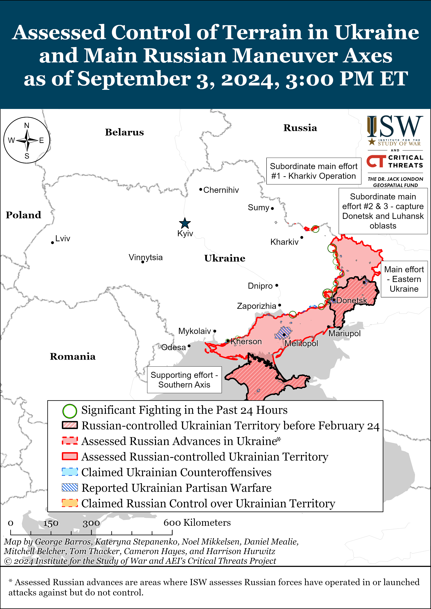
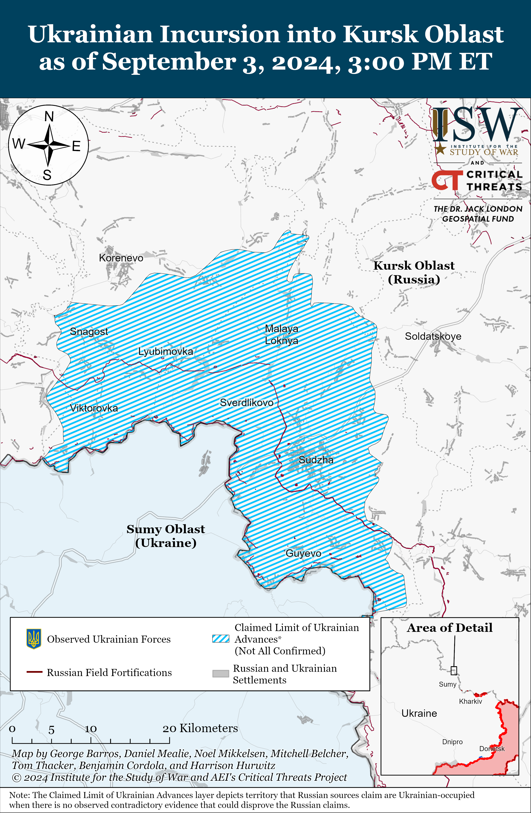
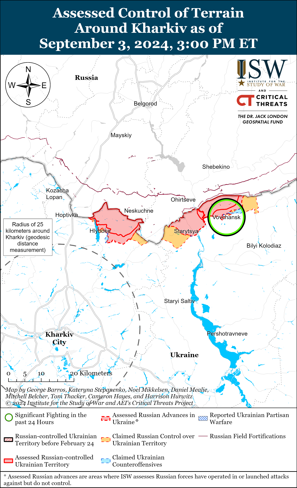
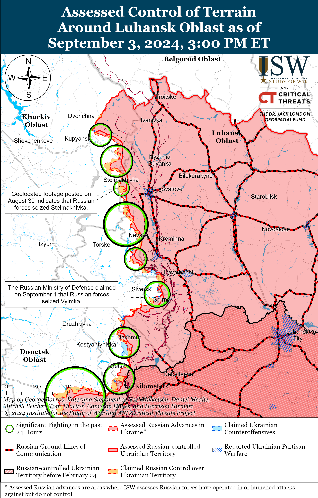
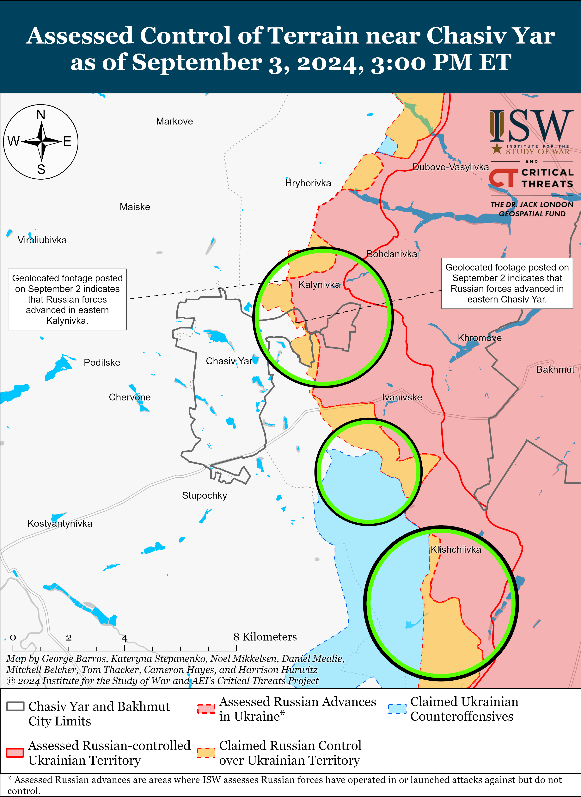
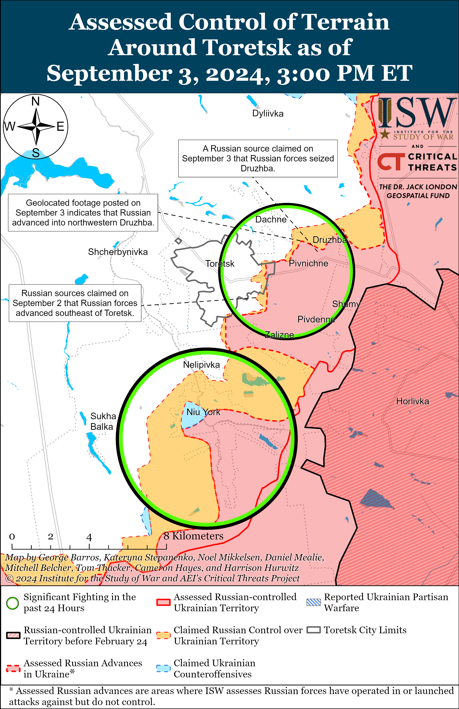
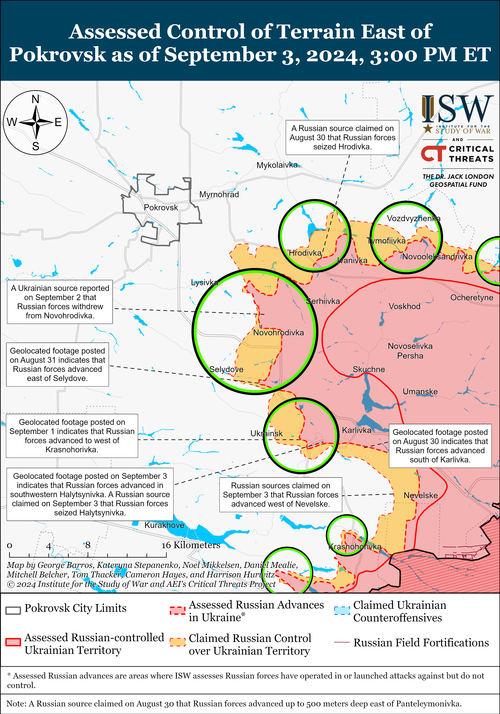
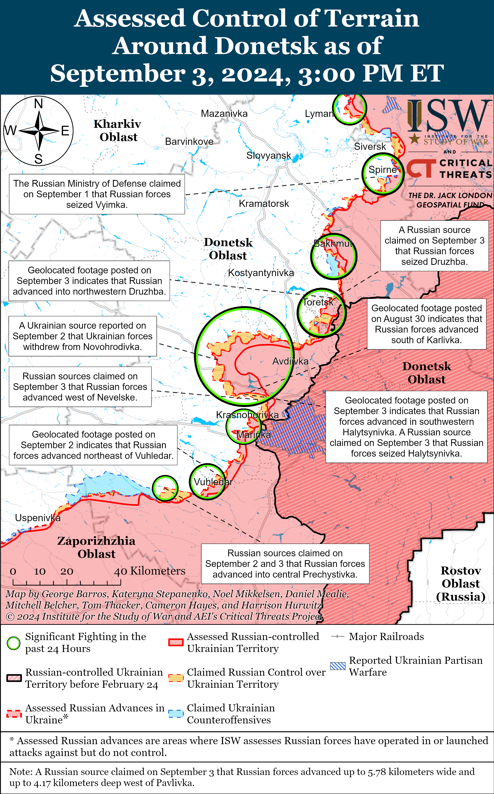
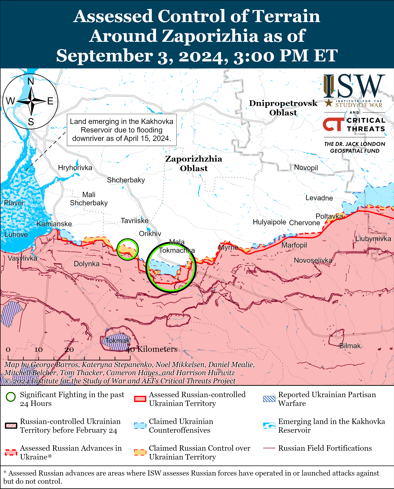
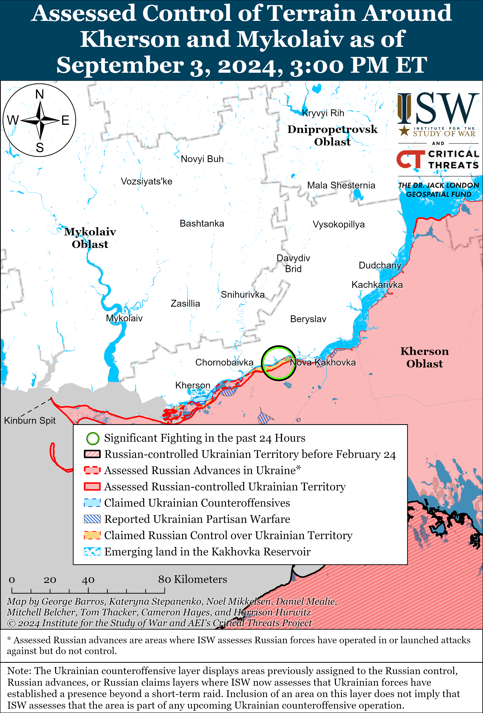

# Russian Offensive Campaign Assessment, September 3, 2024

**Angelica Evans, Nicole Wolkov, Grace Mappes, Davit Gasparyan and Frederick W. Kagan**

**September 3, 2024, 8:10pm ET**

**Click** [**here**](https://storymaps.arcgis.com/stories/36a7f6a6f5a9448496de641cf64bd375) **to see ISW’s interactive map of the Russian invasion of Ukraine. This map is updated daily alongside the static maps present in this report.**

**Click** [**here**](https://storymaps.arcgis.com/stories/83a2f24901c941d581c0c523ecd2619b) **to see ISW’s interactive map of Ukraine’s offensive in Kursk Oblast.**

**Click** [**here**](https://understandingwar.maps.arcgis.com/apps/instant/3dviewer/index.html?appid=1602762dbcde419bb957dea358449580) **to see ISW’s 3D control of terrain topographic map of Ukraine. Use of a computer (not a mobile device) is strongly recommended for using this data-heavy tool.**

**Click** [**here**](https://storymaps.arcgis.com/stories/733fe90805894bfc8562d90b106aa895) **to access ISW’s archive of interactive time-lapse maps of the Russian invasion of Ukraine. These maps complement the static control-of-terrain map that ISW produces daily by showing a dynamic frontline. ISW will update this time-lapse map archive monthly.**

**Note: The data cut-off for this product was 1:30 pm ET on September 3. ISW will cover subsequent reports in the September 4 Russian Offensive Campaign Assessment.**

**NOTE: ISW is introducing a new section of the Russian Offensive Campaign Assessment, “Ukrainian Operations in the Russian Federation,” in which ISW will track Ukrainian ground attacks, offensive operations, and long-range strikes within Russia. ISW will hereafter report on tactical updates on Ukrainian offensive operations in Kursk Oblast in this section, unless there is a major inflection in the situation on the ground. ISW will also track Ukrainian long-range strikes on targets within the Russian Federation in this section. ISW will not, however, offer assessments about Ukrainian objectives or capabilities in this new section.**

**Russian forces struck civilian infrastructure and a military educational facility in Poltava City with two Iskander-M ballistic missiles, killing and wounding a significant number of people, as part of a wider strike series on the night of September 2 to 3.** The Ukrainian Air Force reported that Russian forces launched three Iskander-M/North Korean KN-23 ballistic missiles from occupied Crimea, a Kh-59/69 cruise missile from Kursk Oblast, and 35 Shahed-136/131 drones from Kursk Oblast and occupied Cape Chauda, Crimea.[1] The Ukrainian Air Force reported that Ukrainian forces downed 27 Shahed drones over Kyiv, Odesa, Kharkiv, Mykolaiv, Kherson, Poltava, Chernihiv, and Sumy oblasts, that six Shaheds did not strike their target, and that two Shahed drones flew toward Belgorod Oblast and occupied Donetsk Oblast.[2] Ukrainian President Volodymyr Zelensky and Ukrainian Commander-in-Chief General Oleksandr Syrskyi reported that two Iskander missiles struck a military educational institution and a nearby hospital in Poltava City, partially destroying a building at the Poltava Military Communications Institute.[3] Ukrainian President Volodymyr Zelensky stated the strike killed at least 51 and injured at least 271.[4] Zelensky highlighted Ukraine’s need for more air defense systems and interceptors and called on Western countries to lift restrictions on Ukrainian forces conducting long-range strikes against military targets within Russia as such restrictions inhibit Ukraine from defending against long-range Russian strikes.[5] Ukrainian Foreign Minister Dmytro Kuleba told CNN on September 3 that only Patriot and SAMP/T air defense systems are capable of intercepting Russia’s ballistic missiles.[6] Russian milbloggers celebrated the strike and amplified footage of the strike and its aftermath.[7]

**The wider impacts of the Ukrainian incursion into Kursk Oblast on the war and any envisioned diplomatic solution to the war are not yet clear, and assessments of these impacts are premature.** Ukrainian President Volodymyr Zelensky stated during an interview with NBC on September 3 that Ukrainian forces are “conceptually” planning to hold territory in Kursk Oblast for an unspecified period of time, but did not offer further details about Ukraine’s objectives for the incursion due to concerns about operational security.[8] Zelensky reiterated that the Ukrainian incursion is an aspect of Ukraine’s “victory plan” to end the war on just terms and bring Russia to the negotiating table.[9] Zelensky noted that Ukraine intends to exchange Russian prisoners of war (POWs) captured in Kursk Oblast for Ukrainian POWs currently in Russian captivity and reiterated that one of the goals of the incursion was to force Russia to redeploy troops from the frontline throughout Ukraine, particularly eastern Ukraine. Zelensky stated that Russia has diverted roughly 60,000 troops from Ukraine to Kursk Oblast, and Ukrainian Commander-in-Chief General Oleksandr Syrskyi reported on August 27 that Russia has redeployed over 30,000 troops from the frontline in Ukraine to Kursk Oblast.[10] ISW has observed indications for several weeks that the Russian military command was redeploying forces from northern Kharkiv Oblast, the Kupyansk-Svatove-Kreminna line, and western Zaporizhia Oblast to Kursk Oblast and recently observed indications that the Russian military command is redeploying forces likely intended for future higher priority offensive operations in the Pokrovsk direction to Kursk Oblast.[11] Russian President Vladimir Putin has thus far avoided redeploying the type of combat effective and experienced frontline units that will likely be necessary to push Ukrainian forces from Kursk Oblast, and Zelensky’s statement suggests that Ukrainian forces will likely maintain positions in the over 1,100 square kilometers of territory where Ukrainian forces are reportedly operating in Kursk Oblast until Putin choses to commit such forces. ISW assesses that Putin is attempting to preserve the Russian drive on Pokrovsk at the expense of delaying the clearing of Kursk but that the incursion is likely to have a variety of other important impacts on Russian military operations over various time periods regardless of its impact on the current Pokrovsk operation.[12]

**While the Ukrainian incursion into Kursk Oblast appears to be having operational-level impacts on the Russian military, the incursion has likely not yet shifted Putin’s strategic-level thinking**. ISW assesses that Putin maintains that Russia can slowly and indefinitely subsume Ukraine through grinding advances and that Russia can achieve its goals through a war of attrition against Ukrainian forces and by outlasting Western support for Ukraine — assessments that make Putin averse to peace negotiations on terms other than Ukrainian and Western capitulation to his demands.[13]

**Attempts to assess the impacts of the Ukrainian incursion at this premature stage will likely come to partial and inaccurate conclusions about Ukraine’s ability to change the trajectory of the conflict and the Kremlin’s appetite for peace negotiations on acceptable terms.** Ukrainian counteroffensives in Fall 2022 both successfully pushed the frontline back from Kharkiv City – Ukraine’s second largest city – and liberated Kherson City and established a defensible frontline along the Dnipro River.[14] Ukraine demonstrated its ability to conduct operationally significant counteroffensive operations and liberate large swaths of territory when properly aided and equipped by the West in Fall 2022, and the assumption that Ukraine is permanently unable to conduct future counteroffensive operations that result in operationally significant gains with timely and reliable deliveries of Western aid is premature. Delays in the provision of Western aid, among other factors, hindered the Ukrainian 2023 counteroffensive and generated a military crisis in Ukraine in 2024 from which Ukraine is still attempting to recover.[15] Russian forces were able to make tactically significant advances in northern Kharkiv Oblast and Donetsk Oblast in Spring and early Summer 2024 in large part because of the shortages of artillery and air defense munitions caused by the suspension of US military assistance.[16] ISW continues to assess that prompt and reliable Western security assistance will be critical to Ukraine’s ability to conduct future counteroffensive operations, and that the US and wider Western alliance can make decisions to redress Ukrainian materiel constraints caused by delays in Western security assistance.[17]

Russia will very likely resolve to continue its genocidal war against Ukraine unless faced with significant battlefield setbacks and strong Western support for Ukraine, and it is highly unlikely that any foreseeable Russian leader after Putin will be more amenable to peace negotiations and a just resolution to the war. The Kremlin has spent years denying the existence of a Ukrainian nation and delegitimizing Ukrainian sovereignty, and this effort has had widespread and likely long-term impacts on Russian society and elite opinion.[18] Russian officials in both Putin’s inner circle and the wider Russian government have publicly stated their aversion to peace negotiations with Ukraine on terms other than capitulation, and Putin’s successor is far more likely to hold such views than to reject them in the absence of significant Russian setbacks.[19] A negotiated ceasefire on current lines and under current circumstances will only benefit Russia and will afford the Kremlin time to further radicalize and militarize Russian society against Ukraine and the Russian military time to rest and reconstitute, likely before conducting a future attack on Ukraine.[20]The Ukrainian incursion into Kursk Oblast has highlighted that the war in Ukraine is not indefinitely stalemated, however, and shown that Ukraine, Russia, and the West maintain the ability to make decisions that significantly impact current battlefield realities and the future end state of the war.

***Reuters* reported that the US is considering providing Ukraine with long range Joint Air-to-Surface Standoff Missiles (JASSMs) but that Ukraine would not receive the missiles for months**. *Reuters* reported, citing three sources including US officials, that the US is close to an agreement to provide JASSMs to Ukraine and that the missiles would be announced in a military assistance package in Fall 2024 but that the US has not yet finalized the deal.[21] *Reuters* noted that the JASSM has only been integrated into US-designed aircraft, and one US official told *Reuters* that “there were efforts” to integrate the JASSM with other fighter jets in Ukraine’s air fleet. The standard JASSM has a range of roughly 370 kilometers, and the extended-range JASSM (JASSM-ER) has a range of about 1,000 kilometers.[22] *Reuters* reported that it is unclear which variant the US would send to Ukraine under this deal, although both variants have ranges longer than the maximum range of ATACMS missiles that the US has already provided to Ukraine.[23] ISW has previously assessed that there are at least 245 Russian military objects — at least 85 percent of which are not airfields — within range of ATACMS, and even just the standard JASSM launched from over Ukrainian airspace would likely further expand the set of military objects within Russia that would be in range of Ukrainian missiles.[24] It is unclear whether Ukraine would be able to take advantage of the JASSM’s extended range given that current US policy restricts Ukraine from using the US-provided long-range precision weapons to strike military targets in Russia.[25] ISW continues to assess that current US restrictions on Ukraine’s ability to use US-provided weapons to strike military targets within Russia and the slow provision of small numbers of such weapons are actively hindering Ukraine’s ability to conduct offensive operations and substantially disrupt Russian operations.[26]

**Russian President Vladimir Putin concluded his trip to Mongolia by signing agreements that strengthen bilateral economic ties and trilateral energy relations between Russia, Mongolia and the People’s Republic of China (PRC).**[27] Putin and Mongolian President Ukhnaagiin Khurelsukh emphasized increasing projects under the Mongolia-Russia-China Economic Corridor program, which supports the Russian “Greater Eurasian partnership” economic initiative, China’s “One Belt, One Road” initiative, and Mongolia’s “Steppe Road” development plan.[28] Putin emphasized that the Soyuz Vostok gas pipeline connecting Russia, Mongolia, and the PRC is fully constructed and awaits state examination.[29] Putin invited Kurelsukh to the BRICS forum in Fall 2024 and suggested that Mongolia join the BRICS Plus/Outreach format.[30] Mongolia is also reportedly close to completing a temporary trade agreement with the Russian-led Eurasian Economic Union (EAEU).[31] Russia and Mongolia also signed bilateral agreements to increase oil and petroleum product exports from Russia to Mongolia, and Putin announced that Russian energy company Inter RAO will assist in restoring Ulaanbaatar Thermal Power Plant No. 3 (TPP-3).[32]

**South African President Cyril Ramaphosa and People’s Republic of China (PRC) President Xi Jinping issued a joint statement praising each other’s purported efforts to address the war in Ukraine.** The two presidents released a joint statement on September 2 expressing support for the joint PRC–Brazilian proposal on the “Political Settlement of the Ukraine Crisis” and the African Union’s efforts to solve the war in Ukraine.[33] The two leaders affirmed that inclusive dialogue and peaceful negotiations are essential for a lasting solution to the war and called on Russia and Ukraine to adhere to three key principles that favor Russia: avoiding battlefield expansion, preventing escalation of fighting, and refraining from provocations. ISW continues to assess that the PRC’s peace plan is favorable to Russia and that several African states seek to balance Ukraine and Russia to maintain longstanding bilateral relationships with Russia without officially voicing support for Russia.[34]

**Key Takeaways:**

- **Russian forces struck civilian infrastructure and a military educational facility in Poltava City with two Iskander-M ballistic missiles, killing and wounding a significant number of people, as part of a wider strike series on the night of September 2 to 3.**
- **The wider impacts of the Ukrainian incursion into Kursk Oblast on the war and any envisioned diplomatic solution to the war are not yet clear, and assessments of these impacts are premature.**
- **Attempts to assess the impacts of the Ukrainian incursion at this premature stage will likely come to partial and inaccurate conclusions about Ukraine’s ability to change the trajectory of the conflict and the Kremlin’s appetite for peace negotiations on acceptable terms.**
- ***Reuters* reported that the US is considering providing Ukraine with long range Joint Air-to-Surface Standoff Missiles (JASSMs) but that Ukraine would not receive the missiles for months**.
- **Russian President Vladimir Putin concluded his trip to Mongolia by signing agreements that strengthen bilateral economic ties and trilateral energy relations between Russia, Mongolia and the People’s Republic of China (PRC).**
- **South African President Cyril Ramaphosa and People’s Republic of China (PRC) President Xi Jinping issued a joint statement praising each other’s purported efforts to address the war Ukraine.**
- **Russian forces recently advanced near Toretsk and Pokrovsk and southwest of Donetsk City.**
- **Russian occupation authorities continue to advertise Russian military service to civilians in occupied Ukraine.**

******

***We do not report in detail on Russian war crimes because these activities are well-covered in Western media and do not directly affect the military operations we are assessing and forecasting. We will continue to evaluate and report on the effects of these criminal activities on the Ukrainian military and the Ukrainian population and specifically on combat in Ukrainian urban areas. We utterly condemn Russian violations of the laws of armed conflict and the Geneva Conventions and crimes against humanity even though we do not describe them in these reports.***

- Ukrainian Operations in the Russian Federation
- Russian Main Effort – Eastern Ukraine (comprised of three subordinate main efforts)
- Russian Subordinate Main Effort #1 – Push Ukrainian forces back from the international border with Belgorod Oblast and approach to within tube artillery range of Kharkiv City
- Russian Subordinate Main Effort #2 – Capture the remainder of Luhansk Oblast and push westward into eastern Kharkiv Oblast and encircle northern Donetsk Oblast
- Russian Subordinate Main Effort #3 – Capture the entirety of Donetsk Oblast
- Russian Supporting Effort – Southern Axis
- Russian Air, Missile, and Drone Campaign
- Russian Mobilization and Force Generation Efforts
- Russian Technological Adaptations
- Activities in Russian-occupied areas
- Ukrainian Defense Industrial Base Efforts
- Russian Information Operations and Narratives
- Significant Activity in Belarus

**Ukrainian Operations in the Russian Federation**

***NOTE: ISW is introducing a new section of the Russian Offensive Campaign Assessment, “Ukrainian Operations in the Russian Federation,” in which ISW will track Ukrainian ground attacks, offensive operations, and long-range strikes within Russia. ISW will hereafter report on tactical updates on Ukrainian offensive operations in Kursk Oblast in this section, unless there is a major inflection in the situation on the ground. ISW will also track Ukrainian long-range strikes on targets within the Russian Federation in this section. ISW will not, however, offer assessments about Ukrainian objectives or capabilities in this new section.***

Russian sources claimed that Ukrainian forces continued ground attacks in Kursk Oblast but did not advance on September 3. The Russian Ministry of Defense (MoD) and other Russian sources claimed that Ukrainian forces attacked near Komarovka (southwest of Korenevo), Korenevo, Olgovka (east of Korenevo), Cherkasskoye Porechnoye (north of Sudzha), and Borki (southeast of Sudzha).[35] A Russian milblogger claimed that Ukrainian forces are still in Olgovka but that the settlement is contested.[36] Another Russian milblogger claimed that Ukrainian forces are consolidating positions in Kursk Oblast.[37] One Russian source claimed that Russian forces are counterattacking near Aleksandrovka (northeast of Korenevo).[38] Elements of the Russian 810th Naval Infantry Brigade (Black Sea Fleet [BSF]) are reportedly operating near Sheptukhovka (northeast of Korenevo), and elements of the 56th Airborne (VDV) Regiment (7th VDV Division) are reportedly operating near Korenevo.[39]

Russian sources claimed that Ukrainian forces attempted to strike Migalovo military Air Base near Tver City with drones on the night of September 2 to 3. Russian sources amplified footage purportedly showing Russian air defenses attempting to intercept Ukrainian drones near Migalovo Air Base.[40] Footage published on September 3 purportedly shows a smoke cloud over Kalininskyi Raion, Tver Oblast.[41] Neither Russian nor Ukrainian official sources have commented on the strike.

**Russian Main Effort – Eastern Ukraine**

**Russian Subordinate Main Effort #1 – Kharkiv Oblast (Russian objective: Push Ukrainian forces back from the international border with Belgorod Oblast and approach to within tube artillery range of Kharkiv City)**

Russian forces continued ground attacks northeast of Kharkiv City in Vovchansk on September 3, but there were no confirmed changes to the frontline.[42] The Ukrainian Kharkiv Group of Forces reported that an engineering element of the Russian 11th Tank Regiment (18th Motorized Rifle Division, 11th Army Corps, Leningrad Military District [LMD]) arrived at an advanced Russian position near Hlyboke (north of Kharkiv City) and that elements of the Russian 82nd Motorized Rifle Regiment (69th Motorized Rifle Division, 6th Combined Arms Army [CAA], LMD) conducted an internal rotation near Vovchansk.[43]

****

**Russian Subordinate Main Effort #2 – Luhansk Oblast (Russian objective: Capture the remainder of Luhansk Oblast and push westward into eastern Kharkiv Oblast and northern Donetsk Oblast)**

Russian forces continued offensive operations along the Kupyansk-Svatove-Kreminna line on September 3, but did not make any confirmed advances. A Russian military expert claimed on September 3 that Russian forces recently advanced in Nevske and Hrekivka (both northwest of Kreminna).[44] Russian forces continued ground attacks northeast of Kupyansk near Synkivka; east of Kupyansk near Petropavlivka; northwest of Svatove near Hlushkivka, Kolisynkivka, Stelmakhivka, and Berestove; southwest of Svatove near Tverdokhlibove, Chereshchyna, Druzhelyubivka, Hrekivka, Makiivka, Nevske, and Novosadove; west of Kreminna near Torske and Terny; and south of Kreminna in the Serebryanske forest area on September 2 and 3.[45] Elements of the Russian 144th Motorized Rifle Division (20th Combined Arms Army [CAA], Moscow Military District [MMD]) are reportedly operating along the Svatove-Kreminna line.[46]

**Russian Subordinate Main Effort #3 – Donetsk Oblast (Russian objective: Capture the entirety of Donetsk Oblast, the claimed territory of Russia’s proxies in Donbas)**

Russian forces continued offensive operations in the Siversk direction on September 3, but there were no confirmed changes to the frontline. A Russian milblogger claimed that Russian forces advanced east of Pereizne (south of Siversk) and consolidated positions on the outskirts of the settlement, although ISW has not observed confirmation of this claim.[47] Russian forces continued offensive operations east of Siversk near Verkhnokamyanske and southeast of Siversk near Vyimka, Spirne, and Ivano-Darivka on September 2 and 3.[48] Drone operators of the Russian 106th Airborne (VDV) Division are reportedly operating in the Siversk direction.[49]

Russian forces continued offensive operations near Chasiv Yar on September 3, but there were no confirmed changes to the frontline. A Russian milblogger claimed that Russian forces advanced in southeastern Hryhorivka (northeast of Chasiv Yar) and within the Zhovtnevyi Microraion in eastern Chasiv Yar.[50] Russian forces continued offensive operations near Chasiv Yar; north of Chasiv Yar near Kalynivka; south of Chasiv Yar near Stupochky and Bila Hora; and southeast of Chasiv Yar near Klishchiivka and Andriivka on September 2 and 3.[51] The spokesperson for a Ukrainian brigade operating in the Chasiv Yar direction reported on September 3 that Russian infantry units are attacking in company-sized groups of two to eight personnel and that Russian forces are currently using fewer glide bombs in this direction than Russian forces used in Spring and early Summer 2024.[52] The spokesperson estimated that Russian forces currently have a two-to-one artillery fire advantage over Ukrainian forces in the area. Elements of the Russian 98th VDV Division and 88th “Hispaniola” Volunteer Brigade (Russian Volunteer Corps) are reportedly operating near Chasiv Yar.[53]

Russian forces recently marginally advanced northeast of Toretsk amid continued assaults in the area on September 3. Geolocated footage published on September 3 indicates that Russian forces recently marginally advanced in northwestern Druzhba (northeast of Toretsk).[54] A Russian milblogger claimed that Russian forces completely seized Druzhba, although ISW has not observed visual confirmation of this maximalist claim.[55] Russian forces continued offensive operations near Toretsk and south of Toretsk near Nelipivka on September 2 and 3.[56]

Russian forces recently advanced southeast of Pokrovsk amid continued offensive operations east and southeast of the town on September 3. Geolocated footage published on September 3 indicates that Russian forces recently advanced into southwestern Halytsynivka (southeast of Pokrovsk), and ISW assesses that Russian forces have likely seized the settlement.[57] A Ukrainian officer operating in the Pokrovsk direction reported on September 2 that Ukrainian forces withdrew from Novohrodivka (southeast of Pokrovsk) to preserve the lives of Ukrainian servicemembers, indicating that Russian forces have likely seized Novohrodivka.[58] Russian milbloggers claimed that Russian forces seized Nevelske (southeast of Pokrovsk) and advanced southeast of Pokrovsk in the fields northwest of Nevelske, north of Zhelanne Pershe, and west and south of Lysivka.[59] ISW has not observed confirmation of these claims, however. A Ukrainian military observer stated that Russian forces are roughly eight kilometers from Pokrovsk, which is consistent with ISW’s assessed extent of Russian advances in the area, and that Russian company-sized groups of three to six personnel with drone support are conducting reconnaissance-in-force operations against Ukrainian positions in the area.[60] The Ukrainian military observer noted that Russian forces are not conducting armored assaults and that Russian forces are suffering significant manpower losses in the Pokrovsk direction. Russian forces continued offensive operations east of Pokrovsk near Kalynove, Vozdvyzhenka, Zelene Pole, Myrolyubivka, Mykhailivka, Hrodivka, and Krutyi Yar and southeast of Pokrovsk near Novohrodivka, Selydove, Ukrainsk, and Halytsynivka on September 2 and 3.[61]

Russian forces reportedly recently advanced west of Donetsk City amid continued offensive operations west and southwest of Donetsk City on September 3. A Russian milblogger claimed that elements of the Russian 5th and 110th motorized rifle brigades (both of the 51st Combined Arms Army [CAA], formerly the 1st Donetsk People’s Republic Army Corps [DNR AC]) conducted a mechanized attack of an unspecified size in western Krasnohorivka (west of Donetsk City) seized a windbreak in the area.[62] A Ukrainian brigade operating in the Kurakhove (west of Donetsk City) direction published footage on September 2 of Ukrainian forces repelling a Russian roughly reduced-company sized mechanized assault in an unspecified area in the Kurakhove direction.[63] Fighting also continued west of Donetsk City near Heorhiivka and Maksymilyanivka on September 2 and 3.[64]

Russian forces reportedly marginally advanced southwest of Donetsk City near Vuhledar amid continued offensive operations in the area on September 3. Russian milbloggers claimed that Russian forces advanced 4.17 kilometers deep along a 5.78-kilometer-wide front from Pavlivka (southwest of Vuhledar) towards Prechystivka (west of Vuhledar and northwest of Pavlivka), into central Prechystivka, and in fields east of Prechystivka.[65] Russian milbloggers continued to claim that these advances were due to a Russian mechanized assault against Prechystivka in the past few days, but ISW has still not observed visual confirmation of the assault or of the purported advances.[66] A milblogger claimed that Russian forces also advanced east of Vodyane (northeast of Vuhledar).[67] Milbloggers claimed that Russian forces are attempting to envelop or encircle Ukrainian forces in Vuhledar from the east and southwest.[68] Russian forces also continued ground attacks southwest of Donetsk City near Kostyantynivka, Vuhledar, and Vodyane on September 2 and 3.[69] Elements of the Russian 238th Artillery Brigade (8th CAA, Southern Military District [SMD]) reportedly continue firing on targets near Kostyantynivka.[70]

Neither Russian nor Ukrainian sources reported fighting in the Donetsk-Zaporizhia Oblast border area on September 3.

**Russian Supporting Effort – Southern Axis (Russian objective: Maintain frontline positions and secure rear areas against Ukrainian strikes)**

Fighting continued in western Zaporizhia Oblast near Robotyne, Novoandriivka (north of Robotyne), and Mala Tokmachka (northeast of Robotyne) on September 3, but there were no confirmed changes to the frontline.[71] A Russian milblogger claimed that Russian forces advanced in fields north of Robotyne, but ISW has not observed confirmation of this claim.[72] Elements of the Russian 71st Motorized Rifle Regiment (42nd Motorized Rifle Division, 58th Combined Arms Army [CAA], Southern Military District [SMD]) are reportedly operating near Robotyne.[73]

Limited fighting continued in east (left) bank Kherson Oblast on September 3.[74]

****

**Russian Air, Missile, and Drone Campaign (Russian Objective: Target Ukrainian military and civilian infrastructure in the rear and on the frontline)**

See topline text.

**Russian Mobilization and Force Generation Efforts (Russian objective: Expand combat power without conducting general mobilization)**

Russian occupation authorities continue to advertise Russian military service to civilians in occupied Ukraine. The Kherson Oblast occupation administration offered on September 3 a one-time payment of 400,000 rubles (about $4,600) and a 210,000-ruble (about $2,400) minimum monthly salary to individuals who sign service contracts with the Russian military.[75] The Kherson Oblast occupation administration advertised that individuals who sign military service contracts will receive combat veteran status, which would entitle them to social and economic benefits.

**Russian Technological Adaptations (Russian objective: Introduce technological innovations to optimize systems for use in Ukraine)**

Nothing significant to report.

**Ukrainian Defense Industrial Efforts (Ukrainian objective: Develop its defense industrial base to become more self-sufficient in cooperation with US, European, and international partners)**

*ISW is suspending publishing coverage of Ukrainian defense industrial efforts until further notice.*

**Activities in Russian-occupied areas (Russian objective: Consolidate administrative control of annexed areas; forcibly integrate Ukrainian citizens into Russian sociocultural, economic, military, and governance systems)**

*ISW is not publishing coverage of occupied areas today.*

**Russian Information Operations and Narratives**

Russian officials attempted to distract from the International Criminal Court’s (ICC) arrest warrant for Russian President Vladimir Putin by discrediting the ICC amid Putin’s visit to Mongolia. Russian Ministry of Foreign Affairs (MFA) Spokesperson Maria Zakharova claimed without offering any basis on September 3 that Ukraine is negotiating with the ICC to secure an exemption from the ICC’s jurisdiction, allegedly enabling Ukrainian forces to commit war crimes without accountability.[76] Zakharova’s statement comes during Putin’s visit to Mongolia, which failed to arrest Putin under this warrant despite having a legal obligation to do so as a signatory of the ICC Rome Statue.[77] Russia itself has repeatedly stated that it does not recognize the jurisdiction of the ICC.[78]

Russia continues to expand its informational reach by establishing an office of Russian state newswire *TASS* in Myanmar. Burmese Union Solidarity and Development Party Head Khin Yi gave an interview to *TASS* on September 3 announcing the new *TASS* office in Myanmar and claiming that it will provide the international community with an “accurate” picture of events in the country.[79] *TASS* recently claimed that it has 62 international offices in 57 countries.[80] Khin Yi also highlighted that Myanmar could benefit from Russia’s efforts to organize and conduct elections, drawing a parallel to Myanmar’s upcoming elections in 2025. Khin Yi also claimed that Burmese officials are collaborating with the ruling United Russia Party on domestic Burmese legislation.[81]

**Significant activity in Belarus (Russian efforts to increase its military presence in Belarus and further integrate Belarus into Russian-favorable frameworks and Wagner Group activity in Belarus)**

Nothing significant to report.

**Note: ISW does not receive any classified material from any source, uses only publicly available information, and draws extensively on Russian, Ukrainian, and Western reporting and social media as well as commercially available satellite imagery and other geospatial data as the basis for these reports. References to all sources used are provided in the endnotes of each update.**

---

[1] https://t.me/kpszsu/18697

[2] https://t.me/kpszsu/18697

[3] https://t.me/V\_Zelenskiy\_official/11532 ; https://t.me/osirskiy/836 ; https://t.me/pgo\_gov\_ua/25875

[4] https://t.me/V\_Zelenskiy\_official/11537

[5] https://t.me/V\_Zelenskiy\_official/11533

[6] https://www.cnn.com/2024/09/03/europe/ukraine-poltava-russia-attack-intl/index.html

[7] https://t.me/warhistoryalconafter/182736; https://t.me/rybar/63242 ; https://t.me/z\_arhiv/27954 ; https://t.me/motopatriot/27158 ; https://t.me/boris\_rozhin/135998 ; https://t.me/dva\_majors/51443 ; https://t.me/milinfolive/129809 ; https://t.me/vysokygovorit/17184

[8] https://www.nbcnews.com/news/world/zelenskyy-ukraine-russia-territory-seized-putin-kursk-rcna169280

[9] https://www.nbcnews.com/news/world/zelenskyy-ukraine-russia-territory-seized-putin-kursk-rcna169280 ; https://isw.pub/UkrWar082724

[10] https://isw.pub/UkrWar082724

[11] https://isw.pub/UkrWar083124

[12] https://isw.pub/UkrWar082924

[13] https://isw.pub/UkrWar060724

[14] https://isw.pub/UkrWar120422 ; https://isw.pub/UkrWar111222 ; https://isw.pub/RusCampaignOct5

[15] https://isw.pub/UkrWar042024 ; https://isw.pub/UkrWar041824 ; https://understandingwar.org/backgrounder/russian-offensive-campaign-assessment-april-14-2024 ; https://isw.pub/UkrWar060724 ; https://isw.pub/UkrWar051124 ; https://isw.pub/UkrWar052424

[16] https://isw.pub/UkrWar072624 ; https://isw.pub/UkrWar08072024 ; https://isw.pub/UkrWar053124 ; https://isw.pub/UkrWar042724

[17] https://understandingwar.org/backgrounder/russian-offensive-campaign-assessment-august-21-2024-0 ; https://isw.pub/UkrWar012324 ; https://isw.pub/UkrWar072424

[18] https://isw.pub/UkrWar112322 ; https://isw.pub/UkrWar010523 ; https://www.wilsoncenter.org/blog-post/putins-dehumanized-russia ; https://uacrisis.org/en/degumanizatsiya

[19] https://isw.pub/UkrWar052624 ; https://isw.pub/UkrWar052424 ; https://isw.pub/UkrWar071124 ; https://isw.pub/UkrWar012724 ; https://understandingwar.org/backgrounder/russian-offensive-campaign-assessment-march-3-2024

[20] https://isw.pub/UkrWar070924 ; https://understandingwar.org/backgrounder/russian-offensive-campaign-assessment-july-2-2024

[21] https://www.reuters.com/world/us-close-agreeing-long-range-missiles-ukraine-delivery-take-months-2024-09-03/;

[22] https://missilethreat.csis.org/missile/jassm/

[23] https://www.reuters.com/world/us-close-agreeing-long-range-missiles-ukraine-delivery-take-months-2024-09-03/;

[24] https://understandingwar.org/backgrounder/interactive-map-hundreds-known-russian-military-objects-are-range-atacms

[25] https://understandingwar.org/backgrounder/interactive-map-hundreds-known-russian-military-objects-are-range-atacms

[26] https://understandingwar.org/backgrounder/interactive-map-hundreds-known-russian-military-objects-are-range-atacms; https://isw.pub/UkrWar070724; https://understandingwar.org/backgrounder/russian-offensive-campaign-assessment-august-15-2024

[27] http://kremlin dot ru/events/president/news/74993

[28] http://kremlin dot ru/events/president/news/74993 ; https://t.me/tass\_agency/270165 ; https://t.me/tass\_agency/270170

[29] http://kremlin dot ru/events/president/news/74993 ; https://t.me/tass\_agency/270165 ; https://t.me/tass\_agency/270170

[30] https://t.me/tass\_agency/270121 ; https://t.me/tass\_agency/270124 ; https://t.me/tass\_agency/270125

[31] http://kremlin dot ru/events/president/transcripts/74992

[32] https://tass dot com/politics/1837501

[33] https://dirco dot gov.za/joint-statement-between-the-peoples-republic-of-china-and-the-republic-of-south-africa-on-the-occasion-of-the-second-state-visit-to-china-by-he-president-cyril-ramaphosa-and-the-establishment/ ; http://en.cppcc dot gov.cn/2024-09/03/c\_1017982.htm ; https://t.me/tass\_agency/270099

[34] https://isw.pub/UkrWar061723 ; https://isw.pub/UkrWar053124 ; https://isw.pub/UkrWar051624

[35] https://t.me/mod\_russia/42926 ; https://t.me/dva\_majors/51403 ; https://t.me/DnevnikDesantnika/14937

[36] https://t.me/DnevnikDesantnika/14937

[37] https://t.me/dva\_majors/51403

[38] https://t.me/RVvoenkor/76247

[39] https://t.me/NgP\_raZVedka/18931 ; https://t.me/DnevnikDesantnika/14937

[40] https://t.me/tver\_chp/18293 ; https://t.me/milinfolive/129773 ; https://t.me/bazabazon/30903 ; https://t.me/vchkogpu/50607 ; https://t.me/mash/57276

[41] https://t.me/vchkogpu/50631

[42] https://www.facebook.com/GeneralStaff.ua/posts/pfbid0ab5BmUgbcWP5U7HYaCA29QkAEigE4dB75jLk8r6xNKwtEY5gu5ZskSwUxV9CVNqJl; https://www.facebook.com/GeneralStaff.ua/posts/pfbid02Sxt1KeryDAETE6N5tJ2sGikTK2Y3a8NPXE29VYeFaE6dSiGJYbjFypxUAFY44jx3l; https://www.facebook.com/GeneralStaff.ua/posts/pfbid016E1g1wyv4rqub4c6pJSiP5aziUBC73PZ7yddK4jHkFVGVWrEqMDJ4Ykzfo8dXuml

[43] https://t.me/otukharkiv/1068

[44] https://t.me/tass\_agency/270114

[45]https://www.facebook.com/GeneralStaff.ua/posts/pfbid0ab5BmUgbcWP5U7HYaCA29QkAEigE4dB75jLk8r6xNKwtEY5gu5ZskSwUxV9CVNqJl; https://www.facebook.com/GeneralStaff.ua/posts/pfbid02Sxt1KeryDAETE6N5tJ2sGikTK2Y3a8NPXE29VYeFaE6dSiGJYbjFypxUAFY44jx3l; https://www.facebook.com/GeneralStaff.ua/posts/pfbid016E1g1wyv4rqub4c6pJSiP5aziUBC73PZ7yddK4jHkFVGVWrEqMDJ4Ykzfo8dXuml; https://t.me/tass\_agency/270111; https://t.me/mod\_russia/42922

[46] https://t.me/boris\_rozhin/135937 ; https://t.me/vysokygovorit/17174

[47] https://t.me/motopatriot/27160

[48] https://www.facebook.com/GeneralStaff.ua/posts/pfbid0ab5BmUgbcWP5U7HYaCA29QkAEigE4dB75jLk8r6xNKwtEY5gu5ZskSwUxV9CVNqJl ; https://www.facebook.com/GeneralStaff.ua/posts/pfbid016E1g1wyv4rqub4c6pJSiP5aziUBC73PZ7yddK4jHkFVGVWrEqMDJ4Ykzfo8dXuml;https://www.facebook.com/GeneralStaff.ua/posts/pfbid02Sxt1KeryDAETE6N5tJ2sGikTK2Y3a8NPXE29VYeFaE6dSiGJYbjFypxUAFY44jx3l

[49] https://t.me/russian\_airborne/7102 ; https://t.me/voin\_dv/10588

[50] https://t.me/DnevnikDesantnika/14918

[51] https://www.facebook.com/GeneralStaff.ua/posts/pfbid0ab5BmUgbcWP5U7HYaCA29QkAEigE4dB75jLk8r6xNKwtEY5gu5ZskSwUxV9CVNqJl ; https://www.facebook.com/GeneralStaff.ua/posts/pfbid016E1g1wyv4rqub4c6pJSiP5aziUBC73PZ7yddK4jHkFVGVWrEqMDJ4Ykzfo8dXuml; https://www.facebook.com/GeneralStaff.ua/posts/pfbid02Sxt1KeryDAETE6N5tJ2sGikTK2Y3a8NPXE29VYeFaE6dSiGJYbjFypxUAFY44jx3l ; https://t.me/dva\_majors/51403 ; https://t.me/wargonzo/21896

[52] https://www.youtube.com/watch?v=aDXWlQ2K0dM; https://suspilne dot media/donbas/827687-oborona-casovogo-aru-kabiv-stalo-mense-rf-zastosovue-nekerovani-aviaraketi/

[53] https://t.me/milinfolive/129779 ; https://t.me/milinfolive/129779

[54] https://t.me/creamy\_caprice/6647; https://t.me/rubpak28/357

[55] https://t.me/voenkorKotenok/58762

[56] https://www.facebook.com/GeneralStaff.ua/posts/pfbid02Sxt1KeryDAETE6N5tJ2sGikTK2Y3a8NPXE29VYeFaE6dSiGJYbjFypxUAFY44jx3l ; https://www.facebook.com/GeneralStaff.ua/posts/pfbid0ab5BmUgbcWP5U7HYaCA29QkAEigE4dB75jLk8r6xNKwtEY5gu5ZskSwUxV9CVNqJl ; https://www.facebook.com/GeneralStaff.ua/posts/pfbid016E1g1wyv4rqub4c6pJSiP5aziUBC73PZ7yddK4jHkFVGVWrEqMDJ4Ykzfo8dXuml

[57] https://t.me/creamy\_caprice/6646; https://www.facebook.com/119obtro/videos/1224038728628786/?mibextid=rS40aB7S9Ucbxw6v

[58] https://www.unian dot net/war/novogrodivka-boji-na-pokrovskomu-napryamku-12745791.html

[59] https://t.me/z\_arhiv/27951 ; https://t.me/voenkorKotenok/58763

 ; https://t.me/milinfolive/129820 ; https://t.me/voenkorKotenok/58763

[60] https://t.me/ButusovPlus/13300 ; https://www.facebook.com/butusov.yuriy/posts/pfbid028idjwoUqJqxz8vMkaAmqE4xL5GqAfLFFYsCw9Yc2Fcr4grDKDPvF4eZMYfoDhU6hl

[61] https://www.facebook.com/GeneralStaff.ua/posts/pfbid0ab5BmUgbcWP5U7HYaCA29QkAEigE4dB75jLk8r6xNKwtEY5gu5ZskSwUxV9CVNqJl ; https://www.facebook.com/GeneralStaff.ua/posts/pfbid02Sxt1KeryDAETE6N5tJ2sGikTK2Y3a8NPXE29VYeFaE6dSiGJYbjFypxUAFY44jx3l ; https://www.facebook.com/GeneralStaff.ua/posts/pfbid016E1g1wyv4rqub4c6pJSiP5aziUBC73PZ7yddK4jHkFVGVWrEqMDJ4Ykzfo8dXuml ; https://t.me/dva\_majors/51403 ; https://t.me/wargonzo/21896 ; https://t.me/DnevnikDesantnika/14930 ; https://t.me/RVvoenkor/76249 ;

[62] https://t.me/DnevnikDesantnika/14926

[63] https://t.me/odshbr79/326 ; https://x.com/666\_mancer/status/1830844258380550161

[64] https://www.facebook.com/GeneralStaff.ua/posts/pfbid0ab5BmUgbcWP5U7HYaCA29QkAEigE4dB75jLk8r6xNKwtEY5gu5ZskSwUxV9CVNqJl; https://www.facebook.com/GeneralStaff.ua/posts/pfbid02Sxt1KeryDAETE6N5tJ2sGikTK2Y3a8NPXE29VYeFaE6dSiGJYbjFypxUAFY44jx3l; https://www.facebook.com/GeneralStaff.ua/posts/pfbid016E1g1wyv4rqub4c6pJSiP5aziUBC73PZ7yddK4jHkFVGVWrEqMDJ4Ykzfo8dXuml; https://t.me/wargonzo/21896; https://t.me/RVvoenkor/76249;

[65] https://t.me/dva\_majors/51404; https://t.me/wargonzo/21896; https://t.me/z\_arhiv/27948; https://t.me/RVvoenkor/76249; https://t.me/boris\_rozhin/135972;

[66] https://t.me/RVvoenkor/76227; https://t.me/dva\_majors/51403; https://t.me/RVvoenkor/76249; https://t.me/dva\_majors/51386

[67] https://t.me/z\_arhiv/27948

[68] https://t.me/dva\_majors/51403; https://t.me/boris\_rozhin/135972; https://t.me/voin\_dv/10601; https://t.me/voenkorKotenok/58748

[69] https://www.facebook.com/GeneralStaff.ua/posts/pfbid0ab5BmUgbcWP5U7HYaCA29QkAEigE4dB75jLk8r6xNKwtEY5gu5ZskSwUxV9CVNqJl; https://www.facebook.com/GeneralStaff.ua/posts/pfbid02Sxt1KeryDAETE6N5tJ2sGikTK2Y3a8NPXE29VYeFaE6dSiGJYbjFypxUAFY44jx3l; https://www.facebook.com/GeneralStaff.ua/posts/pfbid016E1g1wyv4rqub4c6pJSiP5aziUBC73PZ7yddK4jHkFVGVWrEqMDJ4Ykzfo8dXuml; https://t.me/dva\_majors/51404; https://t.me/wargonzo/21896

[70] https://t.me/DnevnikDesantnika/14926

[71] https://www.facebook.com/GeneralStaff.ua/posts/pfbid0ab5BmUgbcWP5U7HYaCA29QkAEigE4dB75jLk8r6xNKwtEY5gu5ZskSwUxV9CVNqJl; https://t.me/dva\_majors/51461; https://t.me/motopatriot/27163

[72] https://t.me/motopatriot/27163

[73] https://t.me/motopatriot/27163

[74] https://www.facebook.com/GeneralStaff.ua/posts/pfbid0ab5BmUgbcWP5U7HYaCA29QkAEigE4dB75jLk8r6xNKwtEY5gu5ZskSwUxV9CVNqJl; https://www.facebook.com/GeneralStaff.ua/posts/pfbid016E1g1wyv4rqub4c6pJSiP5aziUBC73PZ7yddK4jHkFVGVWrEqMDJ4Ykzfo8dXuml; https://www.facebook.com/GeneralStaff.ua/posts/pfbid02Sxt1KeryDAETE6N5tJ2sGikTK2Y3a8NPXE29VYeFaE6dSiGJYbjFypxUAFY44jx3l

[75] https://t.me/VGA\_Kherson/24463

[76] https://t.me/tass\_agency/270160

[77] https://understandingwar.org/backgrounder/russian-offensive-campaign-assessment-september-2-2024; https://understandingwar.org/backgrounder/russian-offensive-campaign-assessment-august-29-2024; https://tass dot com/politics/1837707

[78] https://www.theguardian.com/world/2023/mar/14/russia-says-it-does-not-recognise-hague-court-amid-reports-of-arrest-warrants

[79] https://tass dot ru/interviews/21751915 ; https://t.me/tass\_agency/270184

[80] https://isw.pub/UkrWar082824

[81] https://tass dot ru/interviews/21751915 ; https://t.me/tass\_agency/270184
