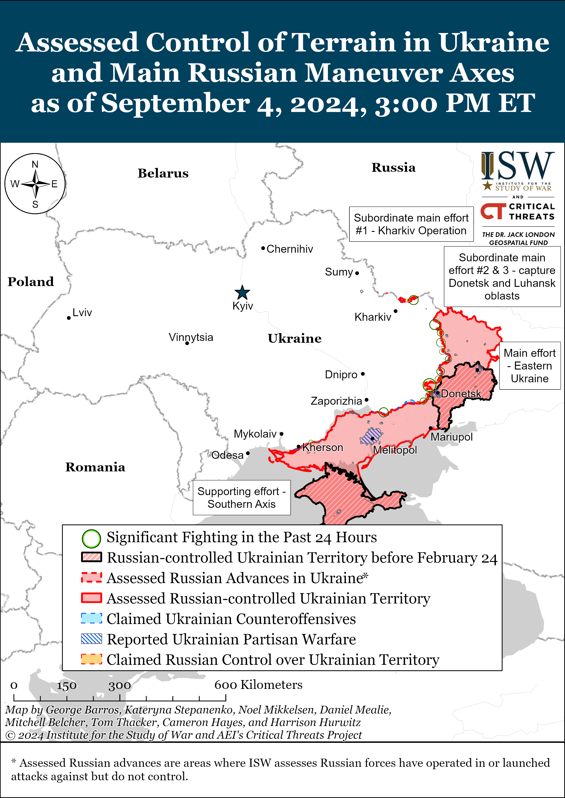
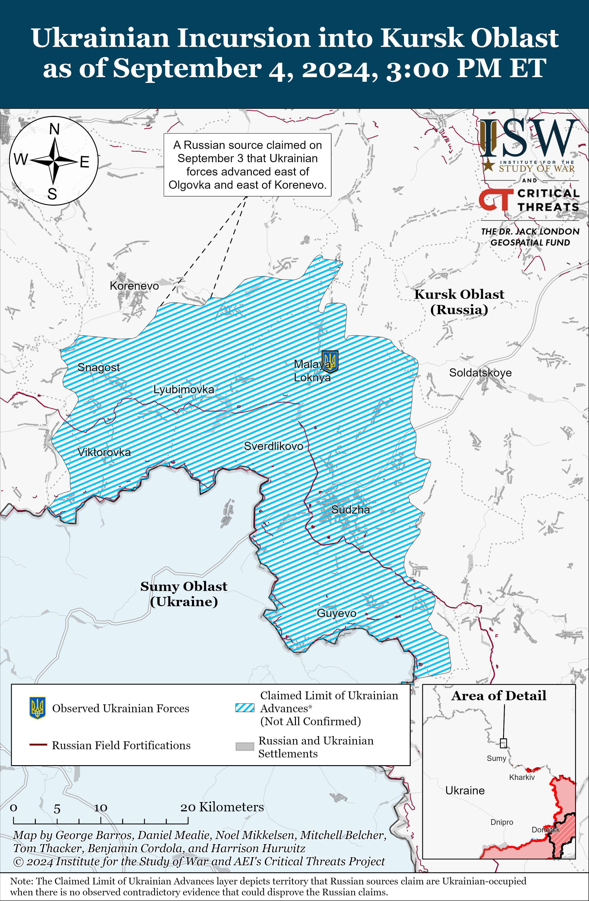
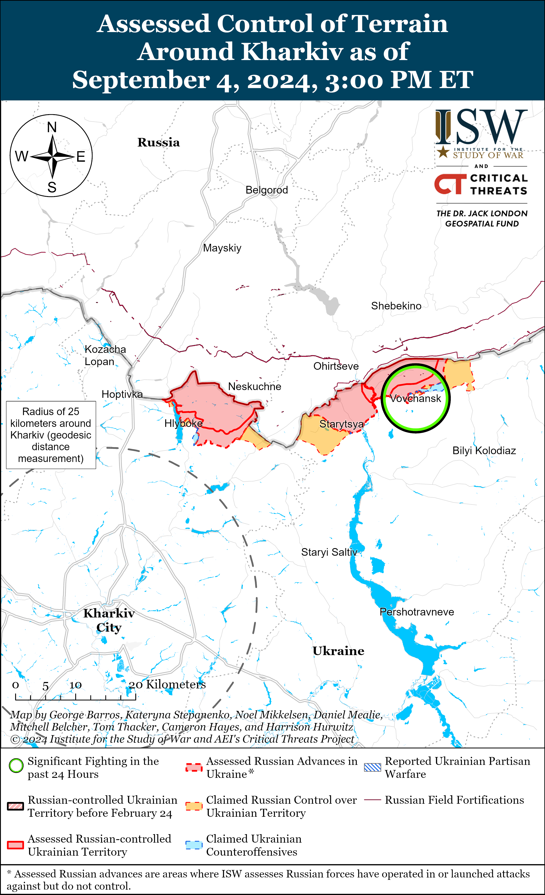
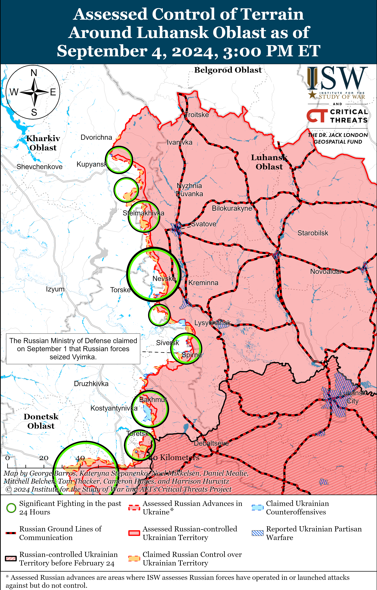
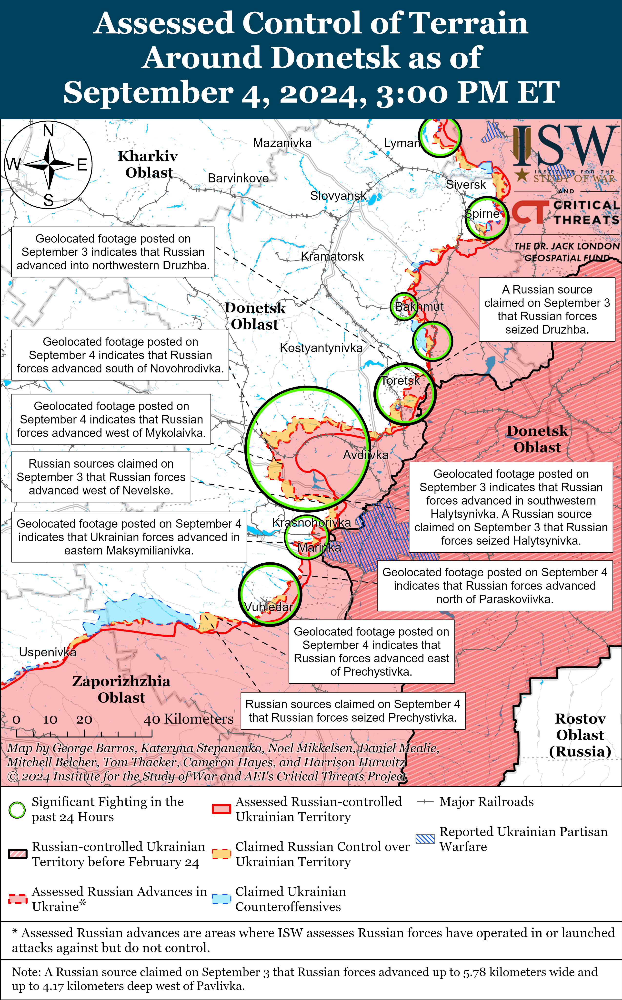
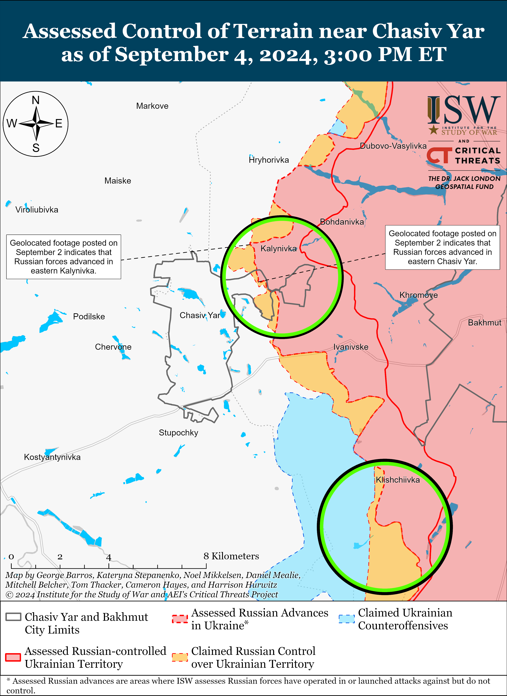
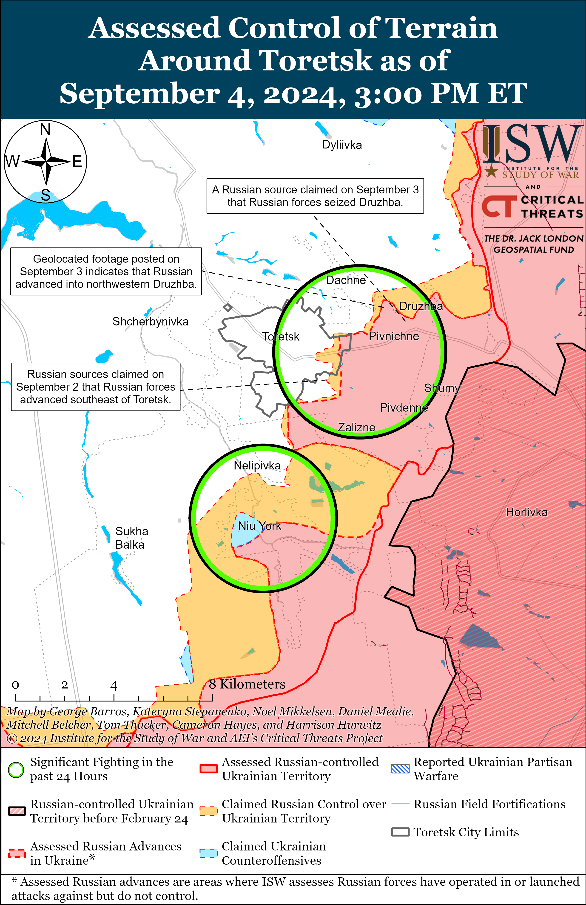
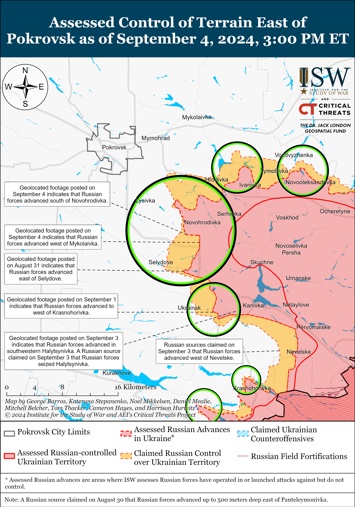
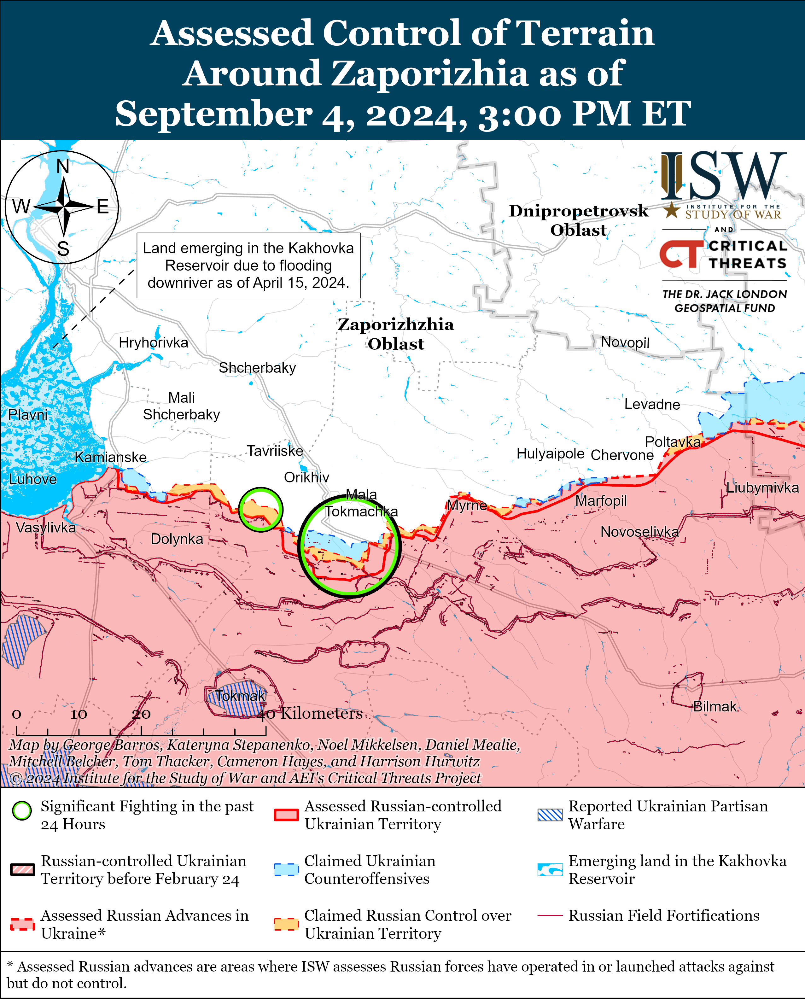
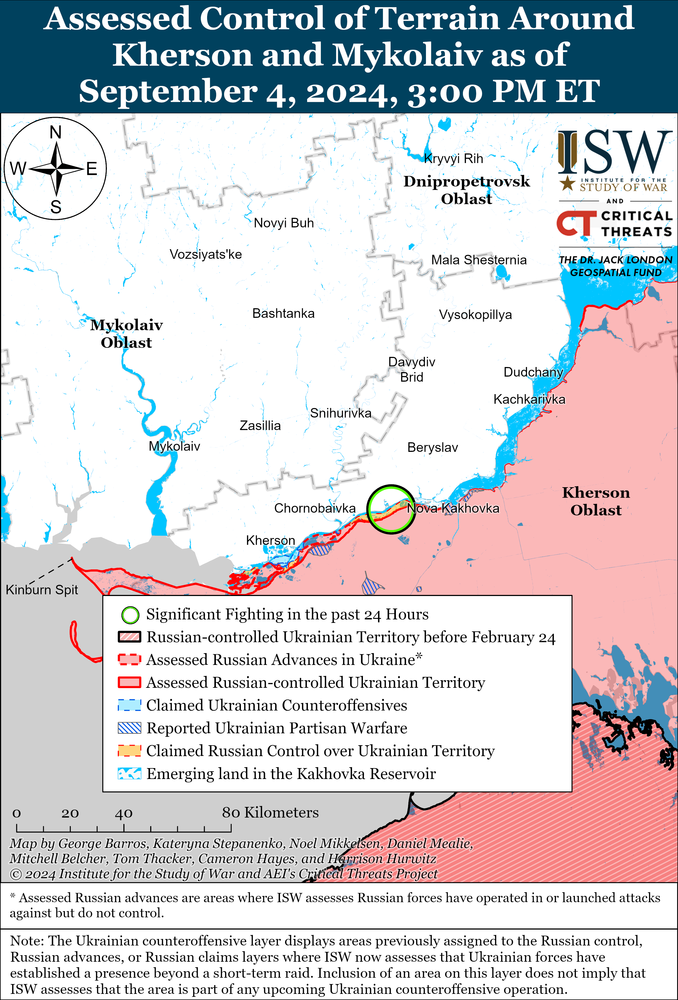

# Russian Offensive Campaign Assessment, September 4, 2024

**Davit Gasparyan, Karolina Hird, Nicole Wolkov, Angelica Evans, and Frederick W. Kagan**

**September 4, 2024, 8:15pm ET**

**Click** [**here**](https://storymaps.arcgis.com/stories/36a7f6a6f5a9448496de641cf64bd375) **to see ISW’s interactive map of the Russian invasion of Ukraine. This map is updated daily alongside the static maps present in this report.**

**Click** [**here**](https://storymaps.arcgis.com/stories/83a2f24901c941d581c0c523ecd2619b) **to see ISW’s interactive map of Ukraine’s offensive in Kursk Oblast.**

**Click** [**here**](https://understandingwar.maps.arcgis.com/apps/instant/3dviewer/index.html?appid=1602762dbcde419bb957dea358449580) **to see ISW’s 3D control of terrain topographic map of Ukraine. Use of a computer (not a mobile device) is strongly recommended for using this data-heavy tool.**

**Click** [**here**](https://storymaps.arcgis.com/stories/733fe90805894bfc8562d90b106aa895) **to access ISW’s archive of interactive time-lapse maps of the Russian invasion of Ukraine. These maps complement the static control-of-terrain map that ISW produces daily by showing a dynamic frontline. ISW will update this time-lapse map archive monthly.**

**Note: The data cut-off for this product was 1:25pm ET on September 4. ISW will cover subsequent reports in the September 5 Russian Offensive Campaign Assessment.**

**Russia appears to be relying on several countries, including India, Serbia, and the People’s Republic of China (PRC), as part of its efforts to evade Western sanctions.** The *Financial Times* (FT) reported on September 4, citing leaks from Russian state correspondence, that Russia’s Industry and Trade Ministry devised a plan to spend nearly $1 billion on securing critical electronic components in October 2022, which reportedly included the possibility of building facilities in India to gain access to such components.[1] FT reported that the leaked documents reveal that Russia has been covertly acquiring sensitive dual-use electronics from India with “significant reserves” of Indian rupees amassed by Russian banks from increasing oil sales to India. The extent to which Russia has implemented this plan remains unclear, although ISW assesses Russia is engaged in a wider effort to evade Western sanctions and procure sanctioned electronic components and machinery necessary for Russia’s defense industry production via foreign actors.[2]

Russian President Vladimir Putin met with Serbian Deputy Prime Minister Aleksandar Vulin on September 4 on the sidelines of the Eastern Economic Forum (EEF) in Vladivostok, Primorsky Krai.[3] Putin and Vulin discussed the removal of bilateral trade barriers to reverse declining trade levels, and Vulin stated that Serbia will not impose sanctions on Russia and will not allow its territory to be used for “anti-Russian” actions. Vulin’s comment may have been intended in part to avert some of Putin’s annoyance following Serbia’s recent purchase of 12 Rafale jets from France in a likely effort to diversify the country’s arms suppliers away from Russia.[4] Putin stated that he hopes to see Serbian President Aleksandar Vucic at the upcoming October 2024 BRICS summit in Kazan.[5] Putin also met PRC Vice President Han Zheng on September 4 and emphasized that the EEF serves as a valuable platform for enhancing mutual understanding and fostering Russia–PRC economic cooperation.[6] Kremlin Spokesperson Dmitry Peskov stated on September 3 that Putin briefed PRC officials about the outcomes of his recent trip to Mongolia, during which Putin emphasized growing regional trade and cooperation with the PRC and Mongolia.[7] ISW has previously observed indications that foreign companies and banks, including in the PRC, have been increasingly reluctant to conduct transactions with Russian actors due to fears of Western secondary sanctions, which could be affecting Russia’s sanctions evasion efforts.[8]

**Russian forces struck civilian infrastructure in Lviv City, Lviv Oblast and Kryvyi Rih, Dnipropetrovsk Oblast during another mid-sized combined drone and missile strike on the night of September 3 to 4.** The Ukrainian Air Force reported that Russian forces launched two Kh-47 Kinzhal aeroballistic missiles from MiG-31K aircraft over Tula Oblast; two Kh-22 cruise missiles from Tu-22M3 strategic bombers over the Black Sea; six Kh-101 cruise missiles from Tu-95 strategic bombers from Volgograd Oblast airspace; three Iskander-K cruise missiles from occupied Crimea; and 29 Shahed-136/131 drones from launch areas in Kursk Oblast.[9] Ukrainian forces shot down four Kh-101 missiles, three Iskander-K missiles, and 22 Shahed drones; six other Shaheds did not reach their targets likely due to Ukrainian electronic warfare (EW) suppression, and one Shahed flew into Belarusian airspace. Russian missiles struck civilian objects in both Kryvyi Rih and Lviv City, wounding and killing civilians. Kryvyi Rih City Head Oleksandr Vilkul stated that the Russian strike on Kryvyi Rih damaged a hotel in the city center, apartment buildings, four educational institutions, and other civilian facilities and wounded up to six people.[10] Russian missiles also struck Lviv City and killed seven civilians, including two children, and damaged up to 188 buildings, including residential and historical heritage buildings as well as schools.[11] International humanitarian law forbids strikes on civilian objects (defined as any object that does not have an explicit military purpose or objective), and furthermore prohibits strikes that indiscriminately target both military and civilian objects.[12] Russian sources attempted to justify the strikes as targeting military objects, but under international law even strikes on military objects do not justify indiscriminate collateral harm to civilians or civilian objects.[13]

**Ukrainian authorities are investigating another report of apparent Russian war crimes against Ukrainian soldiers.** The Ukrainian Prosecutor General’s Office reported on September 3 that the Donetsk Oblast Prosecutor’s Office launched a pre-trial investigation into footage published on a Telegram channel purportedly showing Russian forces executing three Ukrainian servicemen point-blank near Toretsk after they had clearly surrendered and been disarmed.[14] ISW cannot independently verify the footage. Attacking soldiers who are *hors de combat*, specifically those who have clearly expressed an intention to surrender, is a violation of Article 41 of the Geneva Convention on the Protection of Victims of International Armed Conflict.[15]

**German Chancellor Olaf Scholz announced on September 4 that Germany will provide 17 additional IRIS-T air defense systems to Ukraine by 2026.[16]** Scholz stated that Germany has already delivered seven IRIS-T systems previously pledged to Ukraine and that Germany will send four of the 17 additional systems by the end of 2024. A German government official told *Bloomberg* on September 4 that Ukraine will receive 12 medium-range and 12 shorter-range IRIS-T systems from Germany by 2026.[17] Other European countries also continue to demonstrate their support for Ukraine. Ukrainian President Volodymyr Zelensky and Irish Taoiseach (Prime Minister) Simon Harris signed a ten-year bilateral agreement on support and co-operation on September 4 during Harris’ visit to Kyiv.[18] The agreement stipulates that Ireland will continue diplomatic efforts promoting Ukraine’s peace formula, security support, and the provision of non-lethal military aid to Ukraine.[19]

**Ukrainian officials announced a series of resignations and appointments among senior members of the Ukrainian cabinet on September 3 and 4.** Ukrainian Verkhovna Rada Chairperson Ruslan Stefanchuk announced on September 3 and 4 that Ukrainian Foreign Minister Dmytro Kuleba, Strategic Industries Minister Oleksandr Kamyshin, Deputy Prime Minister for European Integration Olha Stefanishyna, Deputy Prime Minister for Reintegration of Temporarily Occupied Territory Iryna Vereshchuk, State Property Fund Head Vitaliy Koval, Justice Minister Denys Maliuska, and Ecology Minister Ruslan Strilets submitted their resignation letters.[20] Vereshchuk and Kamyshin will both reportedly transition to Ukrainian President Volodymyr Zelensky’s office, and the Verkhovna Rada is still considering several of the resignations.[21] Zelensky responded to the reshuffling on September 3 and stated that he intends to “weight” areas of Ukraine’s foreign and domestic policy differently in the future.[22]

**Key Takeaways:**

- **Russia appears to be relying on several countries, including India, Serbia, and the People’s Republic of China (PRC), as part of its efforts to evade Western sanctions.**
- **Russian forces struck civilian infrastructure in Lviv City, Lviv Oblast and Kryvyi Rih, Dnipropetrovsk Oblast during another mid-sized combined drone and missile strike on the night of September 3 to 4.**
- **Ukrainian authorities are investigating another report of apparent Russian war crimes against Ukrainian soldiers.**
- **German Chancellor Olaf Scholz announced on September 4 that Germany will provide 17 additional IRIS-T air defense systems to Ukraine by 2026.**
- **Ukrainian officials announced a series of resignations and appointments among senior members of the Ukrainian cabinet on September 3 and 4.**
- **Ukrainian forces reportedly made marginal advances in Kursk Oblast amid continued fighting throughout the Ukrainian salient on September 4.**
- **Russian forces recently advanced southeast of Pokrovsk and southwest of Donetsk City, and Ukrainian forces recently regained positions west of Donetsk City.**
- **The Russian Ministry of Defense (MoD) continues to portray itself as suitably addressing its obligations towards Russian veterans of the war in Ukraine.**

[******](https://understandingwar.org/wp-content/uploads/2025/05/DraftUkraineCoT20September2042C202024.png)

***We do not report in detail on Russian war crimes because these activities are well-covered in Western media and do not directly affect the military operations we are assessing and forecasting. We will continue to evaluate and report on the effects of these criminal activities on the Ukrainian military and the Ukrainian population and specifically on combat in Ukrainian urban areas. We utterly condemn Russian violations of the laws of armed conflict and the Geneva Conventions and crimes against humanity even though we do not describe them in these reports.***

- Ukrainian Operations in the Russian Federation
- Russian Main Effort – Eastern Ukraine (comprised of three subordinate main efforts)
- Russian Subordinate Main Effort #1 – Push Ukrainian forces back from the international border with Belgorod Oblast and approach to within tube artillery range of Kharkiv City
- Russian Subordinate Main Effort #2 – Capture the remainder of Luhansk Oblast and push westward into eastern Kharkiv Oblast and encircle northern Donetsk Oblast
- Russian Subordinate Main Effort #3 – Capture the entirety of Donetsk Oblast
- Russian Supporting Effort – Southern Axis
- Russian Air, Missile, and Drone Campaign
- Russian Mobilization and Force Generation Efforts
- Russian Technological Adaptations
- Activities in Russian-occupied areas
- Ukrainian Defense Industrial Base Efforts
- Russian Information Operations and Narratives
- Significant Activity in Belarus

**Ukrainian Operations in the Russian Federation**

Ukrainian forces reportedly made marginal advances in Kursk Oblast amid continued fighting throughout the Ukrainian salient on September 4. A Russian milblogger claimed that Ukrainian forces advanced in fields southeast of Durovka (east of Korenevo) and along the 38K-030 road southeast of Koreveno itself.[23] Russian milbloggers also claimed that Russian forces withdrew from positions in Malaya Loknya (northwest of Sudzha), consistent with previous Russian claims that a small contingent of Russian forces had been attempting to hold positions within Malaya Loknya.[24] Russian sources claimed that fighting otherwise continued in the Korenevo and Sudzha directions, particularly near Cherkasskoye Porechnoye and Martynovka (northeast of Sudzha).[25] Elements of the Russian 56th Airborne (VDV) Regiment (7th VDV Division), 11th VDV Brigade, 810th Naval Infantry Brigade (Black Sea Fleet [BSF]), 30th Motorized Rifle Regiment (72nd Motorized Rifle Division, 44th Army Corps [AC], Leningrad Military District [LMD]), and Chechen “Akhmat” Spetsnaz reportedly continue to operate in Kursk Oblast.[26]

**Russian Main Effort – Eastern Ukraine**

**Russian Subordinate Main Effort #1 – Kharkiv Oblast (Russian objective: Push Ukrainian forces back from the international border with Belgorod Oblast and approach to within tube artillery range of Kharkiv City)**

Limited positional engagements continued in northern Kharkiv Oblast on September 4, but there were no confirmed changes to the frontline in this area. Russian and Ukrainian sources stated that fighting continued in Vovchansk (northeast of Kharkiv City) and near Lyptsi and Hlyboke (both north of Kharkiv City).[27] Ukraine’s Kharkiv Group of Forces reported on September 4 that the Russian military command put forward Russian units on alert near Hlyboke and ordered the units to track and destroy Ukrainian drones.[28] Elements of the Russian 7th Motorized Rifle Regiment (11th Army Corps [AC], Leningrad Military District [LMD]) reportedly continue to operate near Lukyantsi (north of Kharkiv City).[29]

**Russian Subordinate Main Effort #2 – Luhansk Oblast (Russian objective: Capture the remainder of Luhansk Oblast and push westward into eastern Kharkiv Oblast and northern Donetsk Oblast)**

Russian forces continued offensive operations along the Kupyansk-Svatove-Kreminna line on September 4, but did not make any confirmed advances. Russian forces continued ground attacks northeast of Kupyansk near Synkivka; northwest of Svatove near Hlushkivka, Stelmakhivka, Pishchane, Berestove, and towards Lozova; west of Svatove near Myasozharivka; southwest of Svatove near Druzhelyubivka Novosadove, Nevske, Makiivka, and Hrekivka; and west of Kreminna near Torske on September 3 and 4.[30] Elements of the Russian 375th Separate Anti-Tank Artillery Battalion (47th Tank Division, 1st Guards Tank Army [GTA], Moscow Military District [MMD]) are reportedly operating in the Kupyansk direction.[31]

**Russian Subordinate Main Effort #3 – Donetsk Oblast (Russian objective: Capture the entirety of Donetsk Oblast, the claimed territory of Russia’s proxies in Donbas)**

Russian forces continued offensive operations in the Siversk direction on September 4 but did not make any confirmed advances. Russian forces continued ground attacks northeast of Siversk near Bilohorivka; east of Siversk near Verkhnokamyanske; southeast of Siversk near Ivano-Darivka and Spirne; and south of Siversk near Pereizne and Rozdolivka on September 3 and 4.[32]

Russian forces continued offensive operations in the Chasiv Yar direction on September 4 but did not make any confirmed advances. Russian forces continued ground attacks near Chasiv Yar and southeast of Chasiv Yar near Klishchiivka, Andriivka, and Kurdyumivka on September 3 and 4.[33] Elements of the Russian 4th Motorized Rifle Brigade (2nd Luhansk People’s Republic Army Corps [LNR AC]) and Chechen “Akhmat” Spetsnaz reportedly continue operating south of Chasiv Yar.[34]

Russian forces continued offensive operations near Toretsk on September 4 but did not make any confirmed advances. Russian milbloggers claimed that Russian forces advanced in eastern Toretsk and seized the remainer of Druzhba (northeast of Toretsk), although ISW has not observed visual confirmation of these claims.[35] Russian forces continued ground attacks near Toretsk; northeast of Toretsk near Druzhba; south of Toretsk near Niu York and Nelipivka; and southwest of Toretsk near Shcherbynivka on September 3 and 4.[36] A Russian milblogger claimed that elements of the Russian 9th Motorized Rifle Brigade (51st Combined Arms Army [CAA], formerly the 1st Donetsk People’s Republic Army Corps [DNR AC]) seized Niu York and are currently operating near Nelipivka, although ISW has not yet observed visual evidence confirming that Russian forces have seized the entirety of Niu York.[37]

Russian forces recently advanced in the Pokrovsk direction amid continued offensive operations in the area on September 4. Geolocated footage published on September 4 indicates that Russian forces recently advanced south of Novohrodivka and marginally advanced west of Mykolaivka (both southeast of Pokrovsk).[38] The Russian Ministry of Defense (MoD) claimed that Russian forces seized Karlivka (further southeast of Pokrovsk) as of September 4, although ISW assesses that Russian forces seized the settlement by August 30.[39] A Ukrainian brigade reported on September 4 that one of its battalions and elements of another Ukrainian brigade operating in the Pokrovsk direction repelled a roughly reinforced platoon-sized Russian mechanized assault in an unspecified area in the Pokrovsk direction.[40] Russian forces continued offensive operations east of Pokrovsk near Vozdvyzhenka, Zelene Pole, Myrolyubivka, Hrodivka, Krutyi Yar, and Novotoretske and southeast of Pokrovsk near Novohrodivka, Selydove, Mykhailivka, Zhelanne Pershe, Ukrainsk, and Halytsynivka on September 3 and 4.[41] Elements of the Russian “Somali” Battalion of the 9th Motorized Rifle Brigade (51st CAA, formerly 1st DNR AC) are reportedly operating near Karlivka.[42] Other elements of the 9th Motorized Rifle Brigade are operating in the Toretsk direction, as mentioned above.

Ukrainian forces recently regained lost positions west of Donetsk City amid continued Russian offensive operations in the area on September 4. Geolocated footage published on September 4 indicates that Ukrainian forces recently regained positions in eastern Maksymilyanivka.[43] Ukranian military officials reported on September 3 that Ukrainian forces repelled a company-sized Russian mechanized assault in an unspecified area in the Kurakhove direction.[44] The Ukrainian brigade that repelled the Russian mechanized assault reported that Russian forces simultaneously attacked from three directions with a total of 10 armored vehicles and that Ukrainian artillery, mortar, and drone strikes and small arms fire damaged or destroyed six of these vehicles, while a mine damaged another.[45] Russian forces continued ground attacks west of Donetsk City near Krasnohorivka and Heorhiivka on September 3 and 4.[46]

Russian forces recently advanced southwest of Donetsk City amid continued Russian offensive operations in the area on September 4. Geolocated footage published on September 4 indicates that Russian forces advanced north of Paraskoviivka (northeast of Vuhledar along the T-0524 road) during a reinforced company-sized Russian mechanized assault in the area.[47] Additional geolocated footage published on September 4 indicates that Russian forces advanced along the Velyka Novosilka-Pavlivka T-0509 highway southeast of Prechystivka (west of Vuhledar).[48] The Russian MoD and other Russian sources claimed that Russian forces seized Prechystivka and advanced in the fields west of the settlement, although ISW has not observed visual evidence that Russian force are operating within the settlement.[49] Russian milbloggers also claimed that Russian forces advanced near Mylnyi Pond south of Vodyane (northeast of Vuhledar), although ISW has not observed visual evidence confirming this claim.[50] Russian forces continued attacking near Kostyantynivka (northeast of Vuhledar), Vodyane Vuhledar, and Prechystivka on September 3 and 4.[51] Several Russian milbloggers claimed that Russian forces have intensified artillery strikes against Vuhledar but argued that Russian forces should not conduct frontal assaults in the Pavlivka-Vuhledar area given that Russian forces previously conducted heavily attritional and unsuccessful assaults in the area in 2023.[52] ISW also reported on unsuccessful and attritional Russian assaults in this area in late 2022.[53] Elements of the Russian 40th Naval Infantry Brigade (Pacific Fleet, Eastern Military District [EMD]) are reportedly operating near Prechystivka.[54]

A Russian milblogger claimed on September 4 that Russian forces are attempting to push Ukrainian forces from positions north of Pryyutne (south of Velyka Novosilka) in the Donetsk-Zaporizhia Oblast border area.[55]

**Russian Supporting Effort – Southern Axis (Russian objective: Maintain frontline positions and secure rear areas against Ukrainian strikes)**

Fighting continued in western Zaporizhia Oblast near Robotyne, Novoandriivka (northwest of Robotyne), and Mala Tokmachka (northeast of Robotyne) on September 3 and 4, but there were no confirmed changes to the frontline.[56] Elements of the Russian 70th Motorized Rifle Regiment (42nd Motorized Rifle Division, 58th Combined Arms Army [CAA], Southern Military District [SMD]) and elements of the Russian 22nd Spetsnaz Brigade (Russian General Staff Main Directorate [GRU]) are reportedly operating in western Zaporizhia Oblast.[57]

Russian state media seized on International Atomic Energy Agency (IAEA) Director General Rafael Mariano Grossi’s visit to the Russian-occupied Zaporizhzhia Nuclear Power Plant (ZNPP) on September 4 to reiterate unsubstantiated claims that Ukrainian forces are endangering the ZNPP. The IAEA published a report about the ZNPP on September 4, in which Grossi stated that the situation at the ZNPP “very fragile” amid claims that shelling near the ZNPP damaged the facility’s external power lines in August 2024.[58] Grossi also met with Ukrainian President Volodymyr Zelensky on September 3 and vowed to expand the IAEA’s nuclear safety assistance to Ukraine.[59] Russian state newswire *TASS* seized on Grossi’s September 4 visit to the ZNPP and claimed that Grossi asked Russian occupation officials to provide precise coordinates and trajectories of the shelling to identify the party responsible for supposed strikes on the ZNPP.[60] Russian State Atomic Energy Corporation Rosatom CEO Alexei Likhachev urged the IAEA to ”honestly” report on drone strikes and shelling of the ZNPP.[61]

The Ukrainian General Staff reported that Russian forces conducted attacks in the Dnipro direction, likely referring to east (left) bank Kherson Oblast and the Dnipro River delta islands on September 3 and 4.[62] Elements of the Russian 28th Motorized Rifle Regiment (70th Motorized Rifle Division, 18th Combined Arms Army [CAA], Southern Military District [SMD]) are reportedly operating in the Kherson direction.[63]

The Russian Ministry of Defense (MoD) claimed on September 4 that Russian forces repelled four Ukrainian naval drones and downed one aerial done over the northwestern Black Sea.[64] The Russian MoD also claimed on September 4 that Russian Black Sea Fleet (BSF) helicopters destroyed four additional Ukrainian naval drones heading towards occupied Crimea.[65]

**Russian Air, Missile, and Drone Campaign (Russian Objective: Target Ukrainian military and civilian infrastructure in the rear and on the frontline)**

See topline text.

**Russian Mobilization and Force Generation Efforts (Russian objective: Expand combat power without conducting general mobilization)**

The Russian Ministry of Defense (MoD) continues to portray itself as suitably addressing its obligations towards Russian veterans of the war in Ukraine. Russian State Secretary and Deputy Defense Minister Anna Tsivileva met with Ulyanovsk Oblast Governor Alexei Russkikh on September 4 and highlighted the importance of government support for Russian military personnel from Ulyanovsk Oblast.[66] Tsivileva emphasized the importance of improving local military medical care facilities and providing social guarantees for Russian service members. Tsivileva also noted that the Russian government is building housing for members of the 104th Guards Airborne (VDV) Division and their family members in Ulyanovsk Oblast.

Russian President Vladimir Putin inspected the Primorsky Flotilla (Pacific Fleet) during his visit to Vladivostok, Primorsky Krai on September 4.[67]

**Russian Technological Adaptations (Russian objective: Introduce technological innovations to optimize systems for use in Ukraine)**

Nothing significant to report.

**Ukrainian Defense Industrial Efforts (Ukrainian objective: Develop its defense industrial base to become more self-sufficient in cooperation with US, European, and international partners)**

*ISW is suspending publishing coverage of Ukrainian defense industrial efforts until further notice.*

**Activities in Russian-occupied areas (Russian objective: Consolidate administrative control of annexed areas; forcibly integrate Ukrainian citizens into Russian sociocultural, economic, military, and governance systems)**

*ISW is not publishing coverage of occupied areas today.*

**Russian Information Operations and Narratives**

Ukrainian officials continue to identify and address Russian efforts to undermine the stability of the Ukrainian government and society. The Ukrainian Kharkiv Group of Forces warned on September 4 that Russian sources are seizing on the recent Russian strike against Poltava City to demoralize and sow panic among Ukrainians.[68] Ukraine’s Security Service (SBU) reported on September 3 that the SBU detained two information technology (IT) specialists for aiding two Russian bot farms based in Poltava Oblast and Transcarpathia.[69] The SBU reported that the bots were conducting information operations intended to destabilize Ukraine and discredit the Ukrainian military.

A pro-Russian English-language Telegram channel amplified a fabricated video imitating the style of ISW’s Briefing Room videos and attributing a fabricated quote to an ISW analyst on September 3.[70] The video may have been created by another Russian news aggregator that appears to frequently amplify and interact with prominent Russian milbloggers. This video and any similarly fabricated videos do not accurately reflect ISW’s assessments or views, and followers should check ISW’s official channels to verify the authenticity of any post.

The US Department of Justice (DOJ) announced on September 4 that US officials are seizing 32 internet domains used in Russian government-affiliated information campaigns aimed at “reducing international support for Ukraine, bolstering pro-Russian policies and interests, and influencing voters in the US and other foreign elections.”[71] The US DOJ reported that senior Russian officials, including Russian Presidential Administration Deputy Head Sergei Kiriyenko, directed Russian companies to use these internet domains to influence US policy and elections through social media posts.

**Significant activity in Belarus (Russian efforts to increase its military presence in Belarus and further integrate Belarus into Russian-favorable frameworks and Wagner Group activity in Belarus)**

Ukrainian military observer Kostyantyn Mashovets outlined the current force composition of Belarusian forces near the Ukrainian border and concluded that Belarus currently lacks the capability to launch an invasion into Ukraine from its territory.[72] Mashovets stated that there are two “operational-tactical groups” based out of Belarus’s Gomel Oblast (bordering Ukraine) — the “Viking” and “Volat” groups — that would ostensibly be the formations that Belarus would activate in the case of a hypothetical invasion of Ukraine. Mashovets noted that these two formations have a maximum of 3,000 personnel combined and reported that there are about 1,000 Russian personnel also deployed with these Belarusian formations, including around 40 officers from the Leningrad Military District (LMD) and limited elements of the Russian 11th Air Force and Air Defense Army and 43rd Communications Center of the Russian Navy.[73] Mashovets concluded that the current joint Belarusian and Russian force disposition in Belarus is insufficient for a sustained Belarusian invasion of Ukraine, consistent with ISW’s long-standing assessment on the exceedingly low likelihood of a Belarusian invasion of Ukraine.[74]

**Note: ISW does not receive any classified material from any source, uses only publicly available information, and draws extensively on Russian, Ukrainian, and Western reporting and social media as well as commercially available satellite imagery and other geospatial data as the basis for these reports. References to all sources used are provided in the endnotes of each update.**

---

[1] https://www.ft.com/content/101afcd6-8e6f-4b5f-89b0-98f48cd5d119

[2] https://isw.pub/UkrWar021124 ; https://isw.pub/UkrWar012624 ; https://isw.pub/UkrWar011624 ; https://understandingwar.org/backgrounder/russian-offensive-campaign-assessment-august-29-2024 ; https://understandingwar.org/backgrounder/russian-offensive-campaign-assessment-may-25-2023

[3] https://t.me/tass\_agency/270418; http://www.kremlin dot ru/events/president/news/75021

[4] https://www.reuters.com/world/europe/putin-discuss-gas-supply-contract-with-serbian-deputy-pm-2024-09-04/

[5] https://t.me/tass\_agency/270413

[6] https://t.me/tass\_agency/270387; http://www.kremlin dot ru/events/president/news/75020

[7] https://t.me/tass\_agency/270325 ;https://understandingwar.org/backgrounder/russian-offensive-campaign-assessment-september-3-2024

[8] https://isw.pub/UkrWar082824 ; https://isw.pub/UkrWar061324 ; https://isw.pub/UkrWar051624 ; https://isw.pub/UkrWar021924 ; https://isw.pub/UkrWar020824

[9] https://t.me/kpszsu/18782

[10] https://t.me/vilkul/7707; https://t.me/vilkul/7708; https://t.me/vilkul/7715

[11] https://t.me/andriysadovyi/2464; https://t.me/andriysadovyi/2463; https://t.me/andriysadovyi/2461; https://t.me/andriysadovyi/2460; https://t.me/andriysadovyi/2458; https://t.me/kozytskyy\_maksym\_official/15935 https://armyinform.com dot ua/2024/09/04/masshtabni-rujnuvannya-sered-zagyblyh-dity-prezydent-pokazav-naslidky-rosijskogo-udaru-po-lvovu/ ; https://t.me/bbcrussian/69981 ; https://t.me/bbcrussian/69967 https://t.me/dsns\_telegram/32095; https://t.me/kozytskyy\_maksym\_official/15928;

https://t.me/kozytskyy\_maksym\_official/15935

[12] https://guide-humanitarian-law.org/content/article/3/protected-objects-and-property/#:~:text=Humanitarian%20law%20prohibits%20acts%20of,the%20civilian%20population%20(API%20Art.

[13] https://ihl-databases.icrc.org/en/customary-ihl/v1/rule12; https://t.me/mod\_russia/42958 ; https://t.me/vrogov/17361

[14] https://t.me/pgo\_gov\_ua/25876

[15] https://ihl-databases.icrc.org/en/ihl-treaties/api-1977/article-41

[16] https://www.bloomberg.com/news/articles/2024-09-04/scholz-touts-major-order-for-air-defense-systems-for-ukraine

[17] https://www.bloomberg.com/news/articles/2024-09-04/scholz-touts-major-order-for-air-defense-systems-for-ukraine

[18] https://www.gov dot ie/en/press-release/aed6d-taoiseach-simon-harris-in-kyiv-to-meet-ukrainian-president-volodymyr-zelenskyy/ ; https://www.president.gov dot ua/news/ukrayina-ta-irlandiya-uklali-dvostoronnyu-ugodu-93001

[19] https://president.gov dot ua/news/ugoda-pro-pidtrimku-ukrayini-ta-spivrobitnictvo-mizh-ukrayin-93005

[20] https://www.facebook.com/stefanchuk.official/posts/pfbid04RXa7D7GovqZTSNJFYCMFqHCcPMoYrjQWtKSaT1Hvm5VrYqDBU1zzZkr6pbGd3J1l?ref=embed\_post ; https://t.me/yzheleznyak/9828 ; https://t.me/yzheleznyak/9829 ; https://kyivindependent.com/parliament-backs-strategic-industries-minister-kamyshins-resignation/ ; https://x.com/AKamyshin/status/1831311290007998707 ; https://www.facebook.com/stefanchuk.official/posts/901562258457280?ref=embed\_post ; https://www.facebook.com/stefanchuk.official/posts/pfbid025RqwcybfHc5Boae54HHp2TrZdjnfUpt8A84wQujoPAcGbBb6DTApj2yjqa644MiKl ; https://www.facebook.com/stefanchuk.official/posts/pfbid0bpVnzVZQSiof6fUk8rYh7D2wsTgKn5Hvtkjp3ZxS3ucrJ2NTdMsFEPnv5twUKfNnl

[21] https://en.interfax.com dot ua/news/general/1011755.html ; https://www.facebook.com/story.php?story\_fbid=2495901977262977&id=100005295963148&rdid=dZkkR8a4y73aaqKK%5C ; https://kyivindependent.com/ukraines-strategic-industries-justice-and-ecology-ministers-resign-parliament-speaker-says/ ; https://x.com/ChristopherJM/status/1831404609287401847

[22] https://armyinform.com dot ua/2024/09/03/prezydent-pokrovskyj-napryamok-ye-rishennya-shhob-zmicznyty-pozycziyi/

[23] https://t.me/motopatriot/27171

[24] https://t.me/DnevnikDesantnika/14957; https://t.me/motopatriot/27171; https://understandingwar.org/backgrounder/russian-offensive-campaign-assessment-august-27-2024

[25] https://t.me/mod\_russia/42964; https://t.me/DnevnikDesantnika/14975; https://t.me/dva\_majors/51518; https://t.me/wargonzo/21908

[26] https://t.me/voenkorKotenok/58766; https://t.me/boris\_rozhin/136112; https://t.me/boris\_rozhin/136127

[27] https://www.facebook.com/GeneralStaff.ua/posts/pfbid02pQtkHUgr7DBburLjhWd8JgihtM6GdqPF2ZmdiN3Uwt4uCAkchjqxrvfmiefZ2nSHl; https://www.facebook.com/GeneralStaff.ua/posts/pfbid0XRGmwd711C9RnqG3vWvqpNwffZrNBs6jh3re2W6HHGiP1c8LvmSAm5uhU3Tq9sRjl; https://t.me/otukharkiv/1087; https://t.me/wargonzo/21908; https://t.me/Sladkov\_plus/11319

[28] https://t.me/otukharkiv/1087

[29] https://t.me/otukharkiv/1087

[30]https://www.facebook.com/GeneralStaff.ua/posts/pfbid02pQtkHUgr7DBburLjhWd8JgihtM6GdqPF2ZmdiN3Uwt4uCAkchjqxrvfmiefZ2nSHl; https://www.facebook.com/GeneralStaff.ua/posts/pfbid0XRGmwd711C9RnqG3vWvqpNwffZrNBs6jh3re2W6HHGiP1c8LvmSAm5uhU3Tq9sRjl; https://www.facebook.com/GeneralStaff.ua/posts/pfbid0V56528b9AhF3tBBcBnq4DSqzoaXdBroeXydEBTdMqdU5i2FNdCjBGcKg6LWrmQ3wl; https://t.me/rybar/63251; https://t.me/dva\_majors/51518

[31] https://t.me/boris\_rozhin/136092

[32] https://www.facebook.com/GeneralStaff.ua/posts/pfbid02pQtkHUgr7DBburLjhWd8JgihtM6GdqPF2ZmdiN3Uwt4uCAkchjqxrvfmiefZ2nSHl ; https://www.facebook.com/GeneralStaff.ua/posts/pfbid0XRGmwd711C9RnqG3vWvqpNwffZrNBs6jh3re2W6HHGiP1c8LvmSAm5uhU3Tq9sRjl ; https://www.facebook.com/GeneralStaff.ua/posts/pfbid0V56528b9AhF3tBBcBnq4DSqzoaXdBroeXydEBTdMqdU5i2FNdCjBGcKg6LWrmQ3wl ; https://t.me/DnevnikDesantnika/14971 ; https://t.me/DnevnikDesantnika/14963

[33] https://www.facebook.com/GeneralStaff.ua/posts/pfbid02pQtkHUgr7DBburLjhWd8JgihtM6GdqPF2ZmdiN3Uwt4uCAkchjqxrvfmiefZ2nSHl ; https://www.facebook.com/GeneralStaff.ua/posts/pfbid0XRGmwd711C9RnqG3vWvqpNwffZrNBs6jh3re2W6HHGiP1c8LvmSAm5uhU3Tq9sRjl ; https://www.facebook.com/GeneralStaff.ua/posts/pfbid0V56528b9AhF3tBBcBnq4DSqzoaXdBroeXydEBTdMqdU5i2FNdCjBGcKg6LWrmQ3wl

[34] https://t.me/milinfolive/129886

[35] https://t.me/boris\_rozhin/136179 ; https://t.me/z\_arhiv/27964

[36] https://www.facebook.com/GeneralStaff.ua/posts/pfbid02pQtkHUgr7DBburLjhWd8JgihtM6GdqPF2ZmdiN3Uwt4uCAkchjqxrvfmiefZ2nSHl ; https://www.facebook.com/GeneralStaff.ua/posts/pfbid0XRGmwd711C9RnqG3vWvqpNwffZrNBs6jh3re2W6HHGiP1c8LvmSAm5uhU3Tq9sRjl ; https://www.facebook.com/GeneralStaff.ua/posts/pfbid0V56528b9AhF3tBBcBnq4DSqzoaXdBroeXydEBTdMqdU5i2FNdCjBGcKg6LWrmQ3wl ; https://t.me/z\_arhiv/27964 ; https://t.me/dva\_majors/51518

[37] https://t.me/wargonzo/21912

[38] (Novohrodivka) https://x.com/99Dominik\_/status/1831318298752852094; https://x.com/sternenko/status/1831313538435985604

(Mykolaivka) https://t.me/shershni68/236; https://x.com/Bielitzling/status/1831379695981547810

[39] https://t.me/mod\_russia/42958 ; https://t.me/creamy\_caprice/6613 ; https://t.me/zvofront/3941

[40] https://t.me/opbr\_zsu/333 ; https://armyinform.com dot ua/2024/09/04/kolonoskopiya-dronamy-kolonu-rosijskoyi-tehniky-epichno-roznesly-na-donechchyni/

[41] https://www.facebook.com/GeneralStaff.ua/posts/pfbid02pQtkHUgr7DBburLjhWd8JgihtM6GdqPF2ZmdiN3Uwt4uCAkchjqxrvfmiefZ2nSHl ; https://www.facebook.com/GeneralStaff.ua/posts/pfbid0XRGmwd711C9RnqG3vWvqpNwffZrNBs6jh3re2W6HHGiP1c8LvmSAm5uhU3Tq9sRjl ; https://www.facebook.com/GeneralStaff.ua/posts/pfbid0V56528b9AhF3tBBcBnq4DSqzoaXdBroeXydEBTdMqdU5i2FNdCjBGcKg6LWrmQ3wl ; https://t.me/RVvoenkor/76322 ; https://t.me/dva\_majors/51518

[42] https://t.me/wargonzo/21918

[43] https://t.me/oaembr46/1004; https://x.com/TuiteroMartin/status/1831261187423535270

[44] https://www.facebook.com/GeneralStaff.ua/posts/pfbid0V56528b9AhF3tBBcBnq4DSqzoaXdBroeXydEBTdMqdU5i2FNdCjBGcKg6LWrmQ3wl ; https://t.me/oaembr46/1003 ; https://armyinform dot com.ua/2024/09/03/vdaryly-z-3-napryamkiv-vtratyly-7-bronemashyn-rosiyany-znovu-otrymaly-po-zubah/

[45] https://t.me/oaembr46/1003 ; https://armyinform dot com.ua/2024/09/03/vdaryly-z-3-napryamkiv-vtratyly-7-bronemashyn-rosiyany-znovu-otrymaly-po-zubah/

[46] https://www.facebook.com/GeneralStaff.ua/posts/pfbid02pQtkHUgr7DBburLjhWd8JgihtM6GdqPF2ZmdiN3Uwt4uCAkchjqxrvfmiefZ2nSHl ; https://www.facebook.com/GeneralStaff.ua/posts/pfbid0XRGmwd711C9RnqG3vWvqpNwffZrNBs6jh3re2W6HHGiP1c8LvmSAm5uhU3Tq9sRjl

[47] https://t.me/creamy\_caprice/6657; https://t.me/odshbr79/344

[48] https://t.me/creamy\_caprice/6658; https://t.me/pidrozdilshadowoficial/602

[49] https://t.me/mod\_russia/42959 ; https://t.me/rybar/63267 ; https://t.me/RVvoenkor/76322

[50] https://t.me/rybar/63267; https://t.me/RVvoenkor/76338

[51] https://www.facebook.com/GeneralStaff.ua/posts/pfbid02pQtkHUgr7DBburLjhWd8JgihtM6GdqPF2ZmdiN3Uwt4uCAkchjqxrvfmiefZ2nSHl ; https://www.facebook.com/GeneralStaff.ua/posts/pfbid0XRGmwd711C9RnqG3vWvqpNwffZrNBs6jh3re2W6HHGiP1c8LvmSAm5uhU3Tq9sRjl ; https://www.facebook.com/GeneralStaff.ua/posts/pfbid0V56528b9AhF3tBBcBnq4DSqzoaXdBroeXydEBTdMqdU5i2FNdCjBGcKg6LWrmQ3wl

[52] https://t.me/rybar/63267 ; https://t.me/dva\_majors/51518

[53] https://understandingwar.org/backgrounder/russian-offensive-campaign-assessment-november-7

[54] https://t.me/mod\_russia/42966

[55] https://t.me/DnevnikDesantnika/14973

[56]https://www.facebook.com/GeneralStaff.ua/posts/pfbid02pQtkHUgr7DBburLjhWd8JgihtM6GdqPF2ZmdiN3Uwt4uCAkchjqxrvfmiefZ2nSHl; https://www.facebook.com/GeneralStaff.ua/posts/pfbid0V56528b9AhF3tBBcBnq4DSqzoaXdBroeXydEBTdMqdU5i2FNdCjBGcKg6LWrmQ3wl; https://www.facebook.com/GeneralStaff.ua/posts/pfbid0XRGmwd711C9RnqG3vWvqpNwffZrNBs6jh3re2W6HHGiP1c8LvmSAm5uhU3Tq9sRjl

[57] https://t.me/dva\_majors/51598; https://t.me/voin\_dv/10625 ; https://t.me/ZSU\_Hunter\_2\_0/2734

[58] https://www.iaea.org/newscenter/pressreleases/iaea-report-highlights-two-years-of-efforts-to-prevent-an-accident-at-ukraines-zaporizhzhya-nuclear-power-plant ; https://www.iaea.org/sites/default/files/documents/two-years-of-iaea-continued-presence-at-the-zaporizhzhaya-nuclear-power-plant.pdf

[59] https://x.com/rafaelmgrossi/status/1831032287833833852

[60] https://t.me/tass\_agency/270498 ; https://t.me/tass\_live/6594 ; https://t.me/tass\_agency/270505

[61] https://t.me/tass\_agency/270499

[62]https://www.facebook.com/GeneralStaff.ua/posts/pfbid02pQtkHUgr7DBburLjhWd8JgihtM6GdqPF2ZmdiN3Uwt4uCAkchjqxrvfmiefZ2nSHl; https://www.facebook.com/GeneralStaff.ua/posts/pfbid0XRGmwd711C9RnqG3vWvqpNwffZrNBs6jh3re2W6HHGiP1c8LvmSAm5uhU3Tq9sRjl; https://www.facebook.com/GeneralStaff.ua/posts/pfbid0V56528b9AhF3tBBcBnq4DSqzoaXdBroeXydEBTdMqdU5i2FNdCjBGcKg6LWrmQ3wl

[63] https://t.me/dva\_majors/51570

[64] https://t.me/mod\_russia/42945 ; https://t.me/mod\_russia/42957

[65] https://t.me/mod\_russia/42974

[66] https://t.me/mod\_russia/42965

[67] https://t.me/mod\_russia/42948 ; https://t.me/mod\_russia/42951

[68] https://t.me/otukharkiv/1093

[69] https://t.me/SBUkr/12824 ; https://armyinform dot com.ua/2024/09/03/sbu-vykryla-dvi-botofermy-yaki-poshyryuvaly-dezinformacziyu-na-koryst-kremlya/

[70] https://t.me/Slavyangrad/107848

[71] https://www.justice.gov/opa/pr/justice-department-disrupts-covert-russian-government-sponsored-foreign-malign-influence

[72] https://www.facebook.com/pashtetof/posts/pfbid0naCJkhDCXJDMpntad3uzjFZZjDK176qAPNXFKgUmZfUk6Lw8BSjfb2J9bWSSdvZ3l; https://t.me/zvizdecmanhustu/2160;https://t.me/zvizdecmanhustu/2161; https://t.me/zvizdecmanhustu/2162

[73] https://t.me/zvizdecmanhustu/2161

[74] https://isw.pub/UkrWar082624; https://t.me/zvizdecmanhustu/2162
