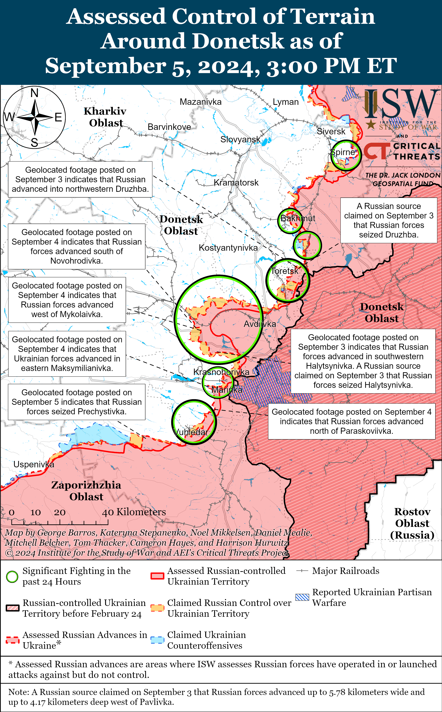
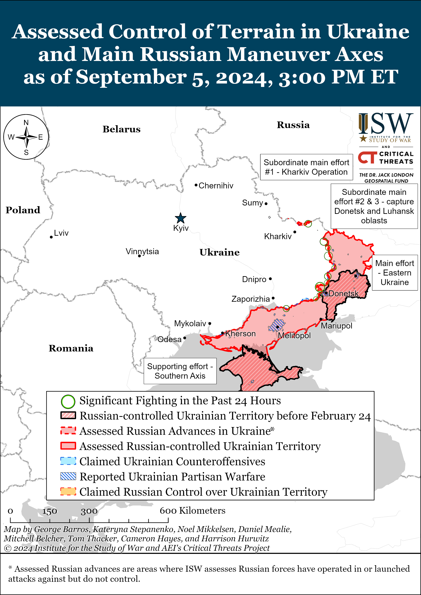
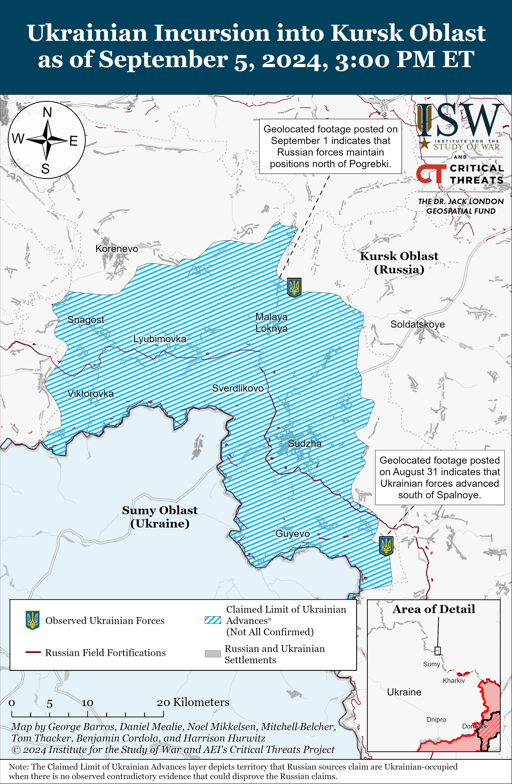
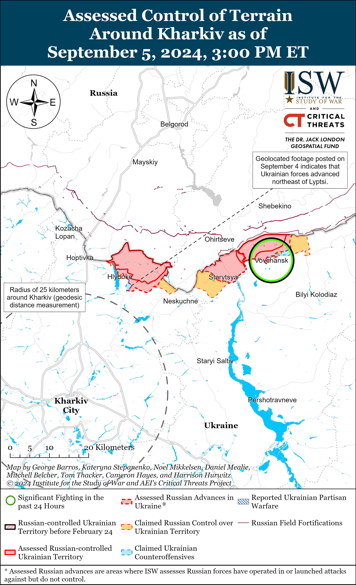
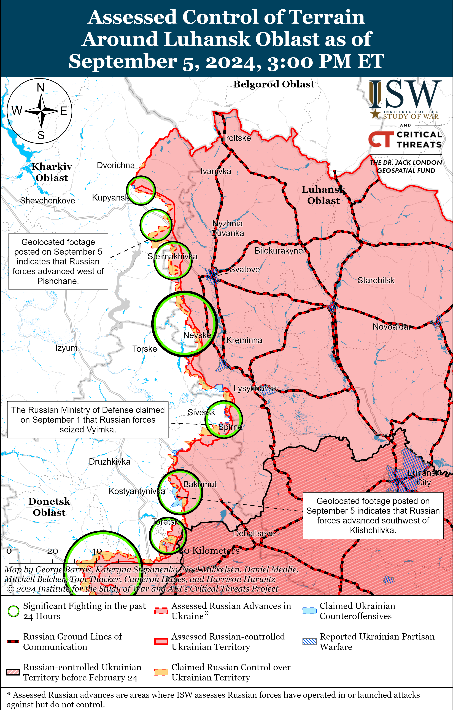
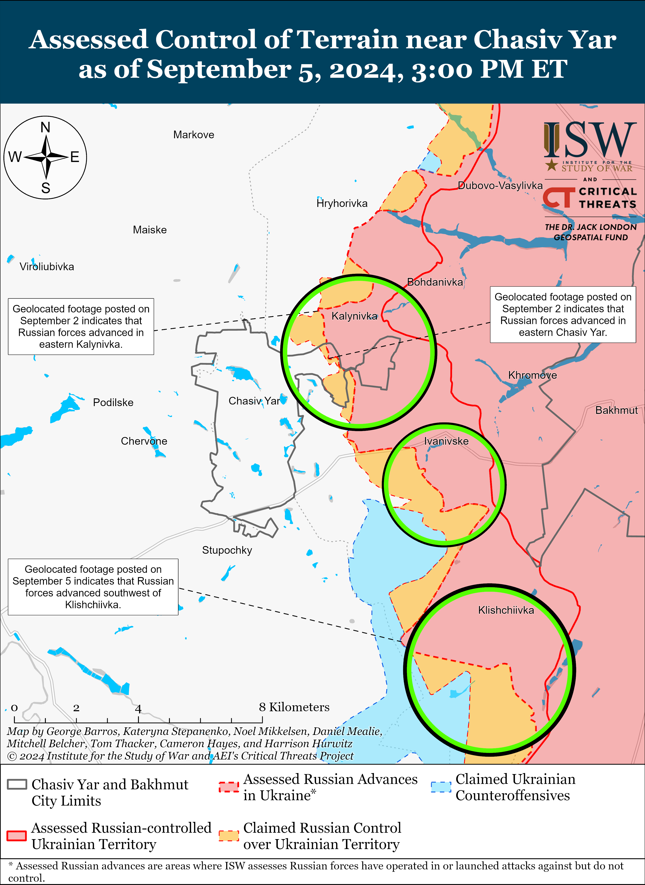
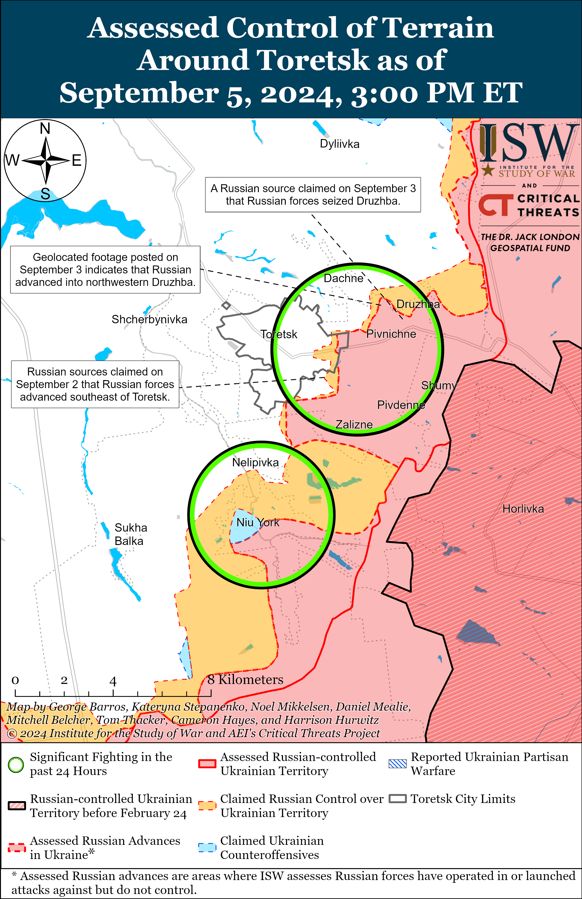
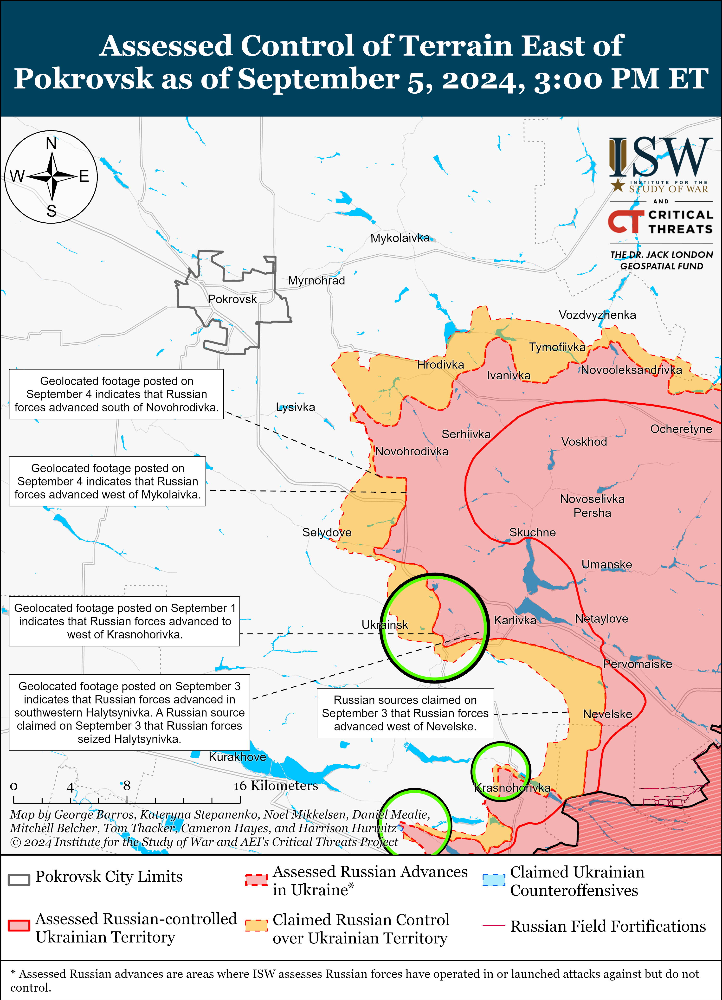
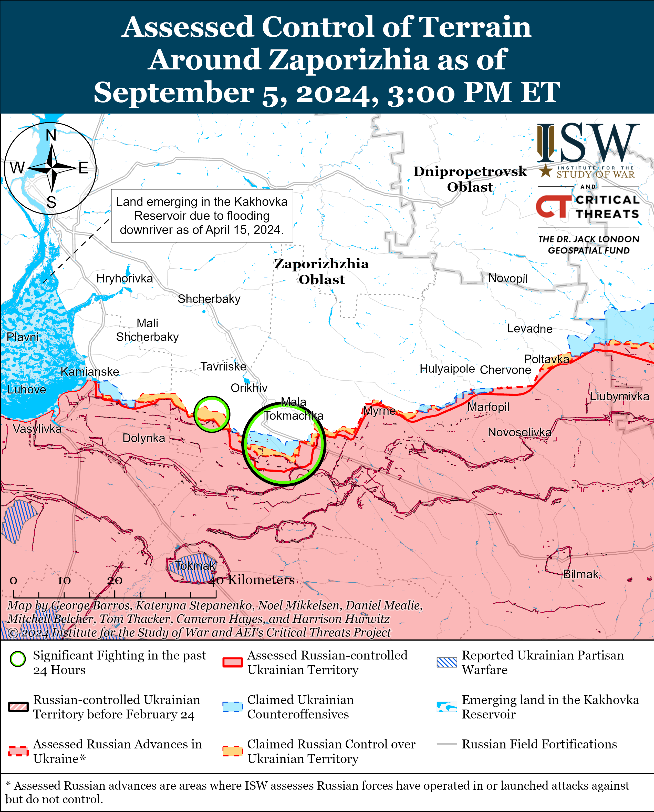
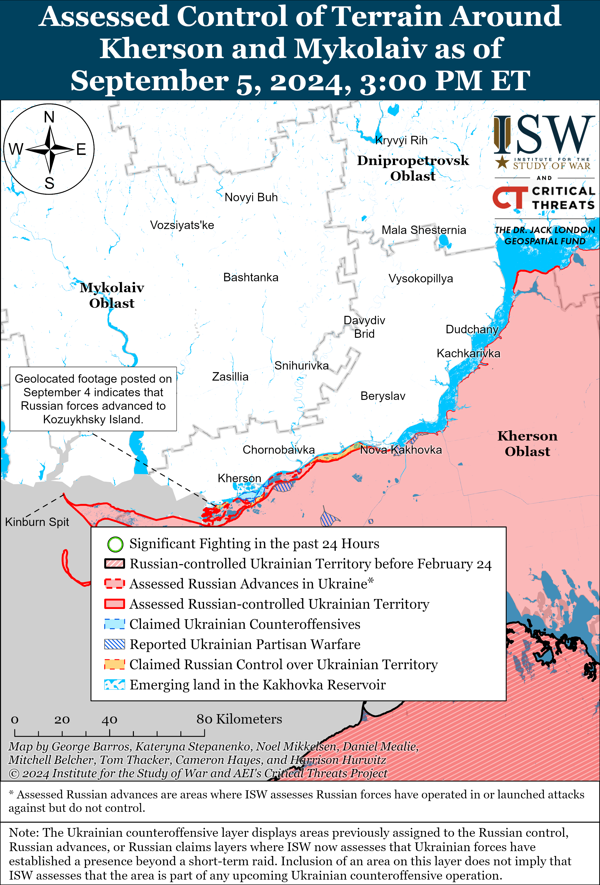

# Russian Offensive Campaign Assessment, September 5, 2024

**Riley Bailey, Angelica Evans, Davit Gasparyan, Nicole Wolkov, and Frederick W. Kagan**

**September 5, 2024, 8:30 pm ET**

**Click** [**here**](https://storymaps.arcgis.com/stories/36a7f6a6f5a9448496de641cf64bd375) **to see ISW’s interactive map of the Russian invasion of Ukraine. This map is updated daily alongside the static maps present in this report.**

**Click** [**here**](https://storymaps.arcgis.com/stories/83a2f24901c941d581c0c523ecd2619b) **to see ISW’s interactive map of Ukraine’s offensive in Kursk Oblast.**

**Click** [**here**](https://understandingwar.maps.arcgis.com/apps/instant/3dviewer/index.html?appid=1602762dbcde419bb957dea358449580) **to see ISW’s 3D control of terrain topographic map of Ukraine. Use of a computer (not a mobile device) is strongly recommended for using this data-heavy tool.**

**Click** [**here**](https://storymaps.arcgis.com/stories/733fe90805894bfc8562d90b106aa895) **to access ISW’s archive of interactive time-lapse maps of the Russian invasion of Ukraine. These maps complement the static control-of-terrain map that ISW produces daily by showing a dynamic frontline. ISW will update this time-lapse map archive monthly.**

**Note: The data cut-off for this product was 1pm ET on September 5. ISW will cover subsequent reports in the September 6 Russian Offensive Campaign Assessment.**

**Russian forces have recently intensified their longstanding offensive effort to eliminate the broad Ukrainian salient west and southwest of Donetsk City and advance up to and along the H-15 (Donetsk City-Zaporizhzhia City) highway. Apparently coordinated Russian offensive operations from the southern flank of the Pokrovsk direction to the western flank of the Ukrainian defense around Vuhledar likely aim to increase pressure on Ukrainian forces defending in western Donetsk Oblast and set conditions for further gains in Russia’s prioritized offensive effort in the Pokrovsk direction.** Russian forces have recently significantly intensified their offensive operations near Vuhledar as of September 1 (southwest of Donetsk City) and have so far made marginal tactical gains in the area.[1] Geolocated footage published on September 5 indicates that Russian forces recently advanced into central Prechystivka (west of Vuhledar) during a roughly company-sized mechanized assault.[2] Additional geolocated footage published on September 5 shows reported elements of the Russian 40th Naval Infantry Brigade (Pacific Fleet, Eastern Military District [EMD]) raising a Russian flag in northwestern Prechystivka, indicating that Russian forces have likely seized the settlement.[3] Russian milbloggers claimed that Ukrainian forces have withdrawn from Zolota Nyva (immediately west of Prechystivka) and that Russian forces are continuing to advance in the area.[4] Geolocated footage published on September 5 indicates that Russian forces recently advanced immediately east of Vuhledar near the Pivdennodonbaska Mine No. 1.[5] A Ukrainian open-source account published additional footage showing Russian forces conducting several platoon-sized mechanized assaults near Makarivka (south of Velyka Novosilka and west of Vuhledar) and Prechystivka in recent days.[6] The Ukrainian account stated that elements of the Russian 60th Motorized Rifle Brigade (5th Combined Arms Army [CAA], EMD), 394th Motorized Rifle Regiment (127th Motorized Rifle Division, 5th CAA, EMD), and 218th Tank Regiment (127th Motorized Rifle Division, 5th CAA, EMD) attacked near Makarivka and that elements of the 40th Naval Infantry Brigade, 5th Tank Brigade (36th CAA, EMD), 37th Motorized Rifle Brigade (36th CAA, EMD), and 430th Motorized Rifle Regiment (likely a mobilized unit) are attacking near Prechystivka.[7] Russian President Vladimir Putin acknowledged the intensified Russian offensive operations in the area during a speech at the Eastern Economic Forum in Vladivostok, Primorsky Krai on September 5, claiming that the Russian Eastern Grouping of Forces (responsible for the front roughly from Vuhledar to Hulyaipole) seized “a triangle” of territory five to seven kilometers deep on September 3.[8]

**Russian forces are conducting relatively intensified offensive operations elsewhere southwest and west of Donetsk City, and the intensification of Russian offensive operations near Vuhledar likely does not presage decreased Russian offensive tempo elsewhere in western Donetsk Oblast in the near-term**. A Ukrainian airborne brigade operating southwest of Donetsk City published footage on September 4 of Ukrainian forces repelling a reinforced company-sized Russian mechanized assault comprised of four tanks and 17 armored combat vehicles near Kostyantynivka.[9] Russian forces intensified both the regularity and size of mechanized assaults west and southwest of Donetsk City in late July 2024 and have since routinely conducted relatively large mechanized assaults in the area — although these assaults have only resulted in marginal tactical gains.[10] Russian forces appeared to initially intensify offensive operations southwest of Donetsk City in late July in order to achieve their longstanding tactical objective of cutting the 0-0532 (Kostyantynivka-Vuhledar) highway, but have since continued large mechanized assaults in the area after achieving this objective.[11] Intensified Russian efforts to exploit gains in the Pokrovsk direction and Russian redeployments in response to the Ukrainian incursion into Kursk Oblast have yet to disrupt the Russian offensive tempo west and southwest of Donetsk City, however. Continued large and costly Russian mechanized assaults suggest that the Russian military command has tasked elements of both the Eastern and Southern Grouping of Forces in the area with a wider operational objective.

**Russian forces intensified offensive operations near Vuhledar shortly after starting to widen the southern flank of the Pokrovsk salient, suggesting that Russian forces intend to conduct mutually reinforcing offensive operations along the southern flank of the Pokrovsk direction, immediately west of Donetsk City, along the 0-0532 highway, and near Vuhledar.** Russian forces began an immediate tactical effort in late August 2024 along the Selydove-Ukrainsk-Hirnyk line southeast of Pokrovsk aimed at widening Russia’s salient in the Pokrovsk direction and eliminating the salient’s vulnerabilities to Ukrainian counterattacks.[12] Russian forces have already succeeded in partially widening the southern section of the Pokrovsk salient and are continuing efforts to tactically envelop limited Ukrainian positions in rural areas east of Hirnyk and north of Krasnohorivka. Russian forces have reportedly advanced to the outskirts of Ukrainsk and are approaching the outskirts of Hirnyk, and the seizure of these towns would allow Russian forces to assault Kurakhove — a significant Ukrainian defensive node for the front west and southwest of Donetsk City — from the north as well as from the east from Krasnohorivka and Maksymilyanivka. Russia’s intensification near Vuhledar likely aims to pressure the western flank of the Ukrainian defense in the area west and southwest of Donetsk as Russian forces approach Kurakhove on the eastern flank. Russian offensive operations along the O-0532 highway between Kostyantynivka and Vuhledar offer Russian forces avenues for advance that would support both an effort to seize Kurkahove to the north and Russian efforts to envelop and seize Vuhledar to the west. Russian forces conducted a failed offensive effort in western Donetsk Oblast in Winter 2022–2023 characterized by mass frontal mechanized assaults against Vuhledar itself, but Russian forces now appear to be pursuing gradual advances along multiple mutually supporting lines of advance — a Russian campaign design that has become more common as the Russian military has abandoned attempts at operationally significant break throughs through mechanized maneuver.[13]

**The Russian military command likely aims for the intended seizure of Kurakhove and Vuhledar to allow Russian forces to make more rapid tactical gains up to and along the H-15 highway, although Russian forces will likely face challenges in leveraging the envisioned seizure of these settlements to eliminate the broad Ukrainian salient in western Donetsk Oblast.** The envisioned Russian seizure of Vuhledar would remove a Ukrainian strongpoint that Ukrainian forces have successfully leveraged to prevent Russian efforts to advance to the H-15 highway from the south, although seizing Vuhledar will not be the decisive factor for whether Russian forces can reach the highway. Vuhledar is 23 kilometers south of the H-15 highway, and the area between Vuhledar and the highway is mainly comprised of open fields that would require Russian forces to conduct successful mechanized assaults to make more rapid tactical gains. Intensified Russian mechanized assaults west and southwest of Donetsk City since late July have so far facilitated only a couple of kilometers of advance, and Russian forces have historically proven inept at conducting effective operational-level mechanized maneuver.[14] The intended Russian seizure of Kurakhove would take another significant defensive point away from Ukrainian forces, but the settlements west of Kurakhove along the H-15 highway also provide opportunities for defense and there is no reason to assess that Russian forces would be able to advance more rapidly west of Kurakhove if Ukrainian forces decide to defend in these settlements. The Russian Eastern and Southern groupings of forces have generally proven ineffective at conducting successful offensive operations, and more combat effective elements of the Central Grouping of Forces that are driving on Kurakhove’s northern flank may improve Russian prospects for seizing Kurakhove.[15] It is unlikely that the Russian military command will commit Central Grouping of Forces elements to a prolonged effort to advance further along the H-15 highway and away from the Central Grouping of Force’s priority effort to seize Pokrovsk, however.[16]

**The Russian military command continues to prioritize the offensive effort on Pokrovsk and will likely treat the intensified effort in western Donetsk Oblast as a secondary effort. The Russian military command likely intends for this secondary effort, regardless of its success, to fix Ukrainian forces in western Donetsk Oblast and prevent Ukrainian redeployments to reinforce the defense of Pokrovsk.** The Russian military command has shown a pronounced desire to insulate its offensive effort in the Pokrovsk direction from the operational pressures caused by Ukraine’s incursion into Kursk Oblast and is likely holding back its remaining operational reserves for the effort to seize the city of Pokrovsk itself.[17] This level of prioritization will likely remain regardless of the success of the intensified Russian offensive effort in western Donetsk Oblast. Russian forces began efforts to widen the Pokrovsk salient along the Selydove-Ukrainsk-Hirnyk line as a preparatory step for the upcoming attempt to seize Pokrovsk itself, and any participation by elements of the Central Grouping of Forces in the offensive effort in western Donetsk Oblast will likely be further conditions-setting for the Pokrovsk effort.[18] The Russian military command has pursued a theater wide campaign design aimed at stretching Ukrainian forces through consistent offensive pressure and appears to be replicating this theater-wide effort in a more intensified way along the frontline in Donetsk Oblast.[19] **Russian forces will not be able to retain the initiative throughout eastern Ukraine indefinitely, and multiple intensified offensive efforts in Donetsk Oblast, in addition to the persisting operational pressures caused by Ukraine’s incursion into Kursk Oblast, will likely cause Russian offensive operations to culminate sooner than the Russian military command intends.**

**Russian President Vladimir Putin continues to downplay the theater-wide operational impacts of the Ukrainian incursion into Kursk Oblast and continues efforts to convince the Russian people that the Kremlin’s delayed and disorganized response to the Kursk incursion is an acceptable price to pay for further Russian advances in Donetsk Oblast.** Putin claimed during his speech at the Eastern Economic Forum on September 5 that the Ukrainian incursion into Kursk Oblast has failed to force Russia to redeploy forces from frontline areas in Ukraine to Kursk Oblast or stop Russia’s offensive operations in “key directions” of eastern Ukraine.[20] Putin claimed that the incursion has not impacted Russia’s “primary goal” of seizing the remainder of Donbas. Putin claimed that Ukraine also intended for the incursion to divide Russian society, but that instead the incursion has further unified Russia and there has been a sharp increase in the number of people interested in signing military service contracts with the Russian Ministry of Defense (MoD). Putin claimed that Russian forces have “stabilized” the situation in Kursk Oblast and are beginning to push Ukrainian forces from Russian territory. Putin claimed that Russian forces are making significant territorial advances in Ukraine and have accelerated their offensive operations. Putin also claimed that Ukrainian forces are suffering “heavy” manpower and equipment losses, but did not provide specific numbers for these losses. Putin’s claims about the Kursk incursion having no operational impacts are demonstrably false, however, as ISW has reported.[21]

**The Ukrainian incursion into Kursk Oblast has had theater-wide impacts and these impacts will likely continue to affect Russian offensive and defensive capabilities beyond the culmination of the Pokrovsk offensive.** Ukrainian Commander-in-Chief General Oleksandr Syrskyi stated during an interview with CNN published on September 5 that the Ukrainian incursion spoiled a planned Russian attack into Sumy Oblast and “reduced the threat” of Russian incursions into northern Ukraine.[22] Syrskyi stated that Ukraine’s key objectives for the incursion were to stop Russian forces from using Kursk Oblast as a sanctuary to prepare offensive operations into Ukraine, divert Russian forces from other unspecified areas in Ukraine, create a “security zone,” take Russian prisoners of war (POWs), and boost Ukrainian morale. Syrskyi stated that Russian forces have moved “tens of thousands” of troops previously intended to reinforce Russian offensive operations in Ukraine to Kursk Oblast, including small elements of several elite Russian Airborne (VDV) units. Russian forces have reportedly redeployed elements of the 56th Airborne (VDV) Regiment (7th VDV Division) and the 11th and 83rd VDV brigades to Kursk Oblast.[23] The Russian military command has largely relied on conscripts and regular and irregular forces redeployed from lower priority sectors of Ukraine, such as northern Kharkiv Oblast, to conduct defensive operations in Kursk Oblast.[24] These forces are extremely unlikely to be sufficient to expel Ukrainian forces from Kursk if the Ukrainians choose to defend. The Russian military command may have also redeployed at least a company of the 15th Motorized Rifle Brigade (2nd Combined Arms Army [CAA], Central Military District [CMD]) from the Pokrovsk direction in mid-August 2024.[25] The redeployment of elements of the CMD — which is reportedly tasked with completing the seizure of Pokrovsk — suggests that the Russian military command has not be able to fully insulate its priority offensive operations from the impacts of the Ukrainian incursion, despite Putin’s claims.

The Ukrainian incursion into Kursk Oblast has also allowed Ukraine to challenge Russia’s control of the theater-wide initiative in Ukraine. Russia has possessed the theater-wide initiative in Ukraine since at least November 2023, which has allowed the Russian military command to determine the location, time, scale, and requirements of fighting in Ukraine at will and has forced Ukraine to expend manpower and materiel in reactive defensive operations.[26] Syrskyi recently stated that Russia has redeployed roughly 30,000 troops from Ukraine to Kursk Oblast to respond to the Ukrainian incursion.[27] A significant additional redeployment of Russian troops from the frontline in Ukraine would very likely be necessary to let Russia regain control of its territory in Kursk, as US intelligence officials have reportedly assessed, and would significantly impact Russia’s offensive operations and Russia’s ability to prepare for future operations.[28]

**Putin’s informational efforts are likely intended to convince the Russian public that an ongoing Ukrainian presence in Kursk Oblast is tolerable in exchange for the Russian seizure of Pokrovsk.** The Kremlin is reportedly trying to condition Russian society to accept that the limited Ukrainian presence in Kursk Oblast is a “new normal,” possibly in order to afford itself time and space to respond to the incursion after seizing Pokrovsk.[29] Putin delayed declaring a “counterterrorism operation” for several days following the incursion and has largely avoided redeploying the large numbers of experienced and combat effective forces that Russia will likely need to push Ukrainian forces from Kursk Oblast.[30] ISW continues to assess that Putin is likely prioritizing Russian offensive operations in the Pokrovsk direction over pushing Ukrainian forces from Kursk Oblast, and Putin’s rhetorical efforts further support this assessment.[31] Putin also attempted to marginally rehabilitate the Russian MoD’s public image during his speech by claiming that the MoD is “objective” and by presenting battlefield reports from the MoD as accurate.[32] Putin may also intend to influence select Western audiences with his comments about the Ukrainian incursion. Putin may assess that he can encourage Western decision-makers to pressure Ukraine into withdrawing its forces from Kursk Oblast, which would allow Putin to continue his offensive operations in Ukraine without having to redeploy additional forces to Kursk Oblast. **Putin’s ostensible comfort with allowing Ukrainian forces to hold Russian territory for a protracted time is a stunning reversal of longstanding Russian rhetoric and doctrine about the inviolability of Russia’s borders and calls into question the significance of Russia’s supposed “red lines.”**[33]

**Russian offensive operations in Donetsk Oblast do not portend the imminent collapse of the frontline throughout Ukraine, despite Putin’s efforts to portray the advances in Donetsk Oblast as dramatic.** Russian forces have advanced at most roughly 40 kilometers from the 2022 frontline in Pokrovsk Raion since the beginning of the Russian offensive effort to seize Avdiivka in October 2023 and appear to have suffered significant manpower and armored vehicle losses in exchange for these territorial gains.[34] A Russian seizure of Pokrovsk would almost certainly complicate Ukrainian logistics, and further Russian advances west and southwest of Donetsk City will challenge Ukraine’s defensive positions in the area to be sure. The loss of Pokrovsk, and the loss and occupation of any Ukrainian territory and people, would be a significant blow to Ukrainian morale. The Russian seizure of Pokrovsk is by no means inevitable, however. Russian forces have failed to seize Chasiv Yar and threaten Ukraine’s fortress belt from Slovyansk to Kostyantynivka after months of assaults, and Ukrainian forces have proven their ability to limit Russian advances elsewhere in the theater, particularly when well-staffed and equipped. **It remains too soon to forecast the outcome of the current Russian offensive operations in Donetsk Oblast, and far too soon to assess the effects of the Ukrainian incursion into Kursk that were intended to go far beyond affecting the immediate situation around Pokrovsk.**

**The US, Ukraine’s other supporters, and Ukraine itself maintain the ability to make decisions that can impact the battlefield situation — including by addressing Ukraine’s manpower and training restraints and adequately arming and equipping Ukraine so that the Ukrainian military command can properly prepare for future defensive and counteroffensive operations.**

**Russia continued its efforts to bolster economic relations with non-Western countries on the sidelines of the Eastern Economic Forum (EEF) in Vladivostok, Primorsky Krai.** Russian President Vladimir Putin shared the stage during his speech with officials from Malaysia and the People’s Republic of China (PRC) on September 5 to discuss bilateral cooperation and multilateral projects.[35] Malaysian Prime Minister Anwar Ibrahim told Putin during a plenary session that Malaysia is interested in joining BRICS and claimed that Russian-Malaysian collaboration on what Ibrahim called “Islamic finance” would help Russia attract more investment from majority Muslim countries.[36] Indian Ambassador to Russia Vinay Kumar stated that India expects to increase imports of Russian oil until 2030 and that India and Russia are developing a new interbank exchange system.[37] Kumar also expressed hope that Russia will increase its exports of fertilizer to India. Russian State Atomic Energy Corporation Rosatom CEO Alexei Likhachev highlighted Rosatom’s ongoing work with India and Vietnam to develop the Northern Sea Route through the Arctic, a shipping route between western Eurasia and the Asia-Pacific region.[38] Putin also discussed joint PRC-Russian efforts to address and mitigate external challenges to bilateral cooperation between the two countries with PRC Vice President Han Zheng.[39] This conversation occurred against the backdrop of a statement by the CEO of Russian metals and renewables company En+, Vladimir Kolmogorov, at the EEF, who claimed that a large joint Russia-PRC coal project in Siberia is facing financial difficulties due to concern among PRC companies about Western secondary sanctions.[40] ISW previously noted that Russian efforts at the EEF are largely centered around diplomatic efforts with non-Western countries to evade Western sanctions.[41]

**Ukrainian officials announced a series of appointments among senior members of the Ukrainian cabinet on September 5.** Ukrainian Verkhovna Rada Deputy Yaroslav Zheleznyak reported on September 5 that that the Verkhovna Rada voted to appoint First Deputy Foreign Minister Andrii Sybiha as Foreign Minister; Head of Ukraine’s state-owned defense enterprise Ukroboronprom, Herman Smetanin, as Strategic Industries Minister; former Deputy Prime Minister for European Integration Olha Stefanishyna as Justice Minister; Presidential Office Deputy Head Oleksiy Kuleba as Development of Communities, Territories and Infrastructure Minister; and Deputy Defense Minister Nataliya Kalmykova as Veterans Affairs Minister.[42]

**Key Takeaways:**

- **Russian forces have recently intensified their longstanding offensive effort to eliminate the broad Ukrainian salient west and southwest of Donetsk City and advance up to and along the H-15 (Donetsk City-Zaporizhzhia City) highway.**
- **Apparently coordinated Russian offensive operations from the southern flank of the Pokrovsk direction to the western flank of the Ukrainian defense around Vuhledar likely aim to increase pressure on Ukrainian forces defending in western Donetsk Oblast and set conditions for further gains in Russia’s prioritized offensive effort in the Pokrovsk direction.**
- **Russian forces are conducting relatively intensified offensive operations elsewhere southwest and west of Donetsk City, and the intensification of Russian offensive operations near Vuhledar likely does not presage decreased Russian offensive tempo elsewhere in western Donetsk Oblast in the near-term**.
- **Russian forces intensified offensive operations near Vuhledar shortly after starting to widen the southern flank of the Pokrovsk salient, suggesting that Russian forces intend to conduct mutually reinforcing offensive operations along the southern flank of the Pokrovsk direction, immediately west of Donetsk City, along the 0-0532 highway, and near Vuhledar.**
- **The Russian military command likely aims for the intended seizure of Kurakhove and Vuhledar to allow Russian forces to make more rapid tactical gains up to and along the H-15 highway, although Russian forces will likely face challenges in leveraging the envisioned seizure of these settlements to eliminate the broad Ukrainian salient in western Donetsk Oblast.**
- **The Russian military command continues to prioritize the offensive effort on Pokrovsk and will likely treat the intensified effort in western Donetsk Oblast as a secondary effort. The Russian military command likely intends for this secondary effort, regardless of its success, to fix Ukrainian forces in western Donetsk Oblast and prevent Ukrainian redeployments to reinforce the defense of Pokrovsk.**
- **Russian President Vladimir Putin continues to downplay the theater-wide operational impacts of the Ukrainian incursion into Kursk Oblast and continues efforts to convince the Russian people that the Kremlin’s delayed and disorganized response to the Kursk incursion is an acceptable price to pay for further Russian advances in Donetsk Oblast.**
- **The Ukrainian incursion into Kursk Oblast has had theater-wide impacts and these impacts will likely continue to affect Russian offensive and defensive capabilities beyond the culmination of the Pokrovsk offensive.**
- **Putin’s informational efforts are likely intended to convince the Russian public that an ongoing Ukrainian presence in Kursk Oblast is tolerable in exchange for the Russian seizure of Pokrovsk.**
- **Russian offensive operations in Donetsk Oblast do not portend the imminent collapse of the frontline throughout Ukraine, despite Putin’s efforts to portray the advances in Donetsk Oblast as dramatic.**
- **Russian forces recently advanced near Chasiv Yar, southeast of Kupyansk, and in the Kherson direction and Ukrainian forces recently regained positions north of Kharkiv City.**
- **Russian forces continue to forcibly redeploy mobilized Russian military personnel from occupied Ukraine to frontline positions to bolster Russia’s crypto-mobilization efforts.**

******

***We do not report in detail on Russian war crimes because these activities are well-covered in Western media and do not directly affect the military operations we are assessing and forecasting. We will continue to evaluate and report on the effects of these criminal activities on the Ukrainian military and the Ukrainian population and specifically on combat in Ukrainian urban areas. We utterly condemn Russian violations of the laws of armed conflict and the Geneva Conventions and crimes against humanity even though we do not describe them in these reports.***

- Ukrainian Operations in the Russian Federation
- Russian Main Effort – Eastern Ukraine (comprised of three subordinate main efforts)
- Russian Subordinate Main Effort #1 – Push Ukrainian forces back from the international border with Belgorod Oblast and approach to within tube artillery range of Kharkiv City
- Russian Subordinate Main Effort #2 – Capture the remainder of Luhansk Oblast and push westward into eastern Kharkiv Oblast and encircle northern Donetsk Oblast
- Russian Subordinate Main Effort #3 – Capture the entirety of Donetsk Oblast
- Russian Supporting Effort – Southern Axis
- Russian Air, Missile, and Drone Campaign
- Russian Mobilization and Force Generation Efforts
- Russian Technological Adaptations
- Activities in Russian-occupied areas
- Ukrainian Defense Industrial Base Efforts
- Russian Information Operations and Narratives
- Significant Activity in Belarus

**Ukrainian Operations in the Russian Federation**

Ukrainian forces recently advanced in the southeastern area of the Ukrainian salient in Kursk Oblast, and Russian forces recently regained limited positions in the northern part of the salient. Geolocated footage published on August 31 showing Ukrainian forces operating south of Spalnoye (southeast of Sudzha) indicates that Ukrainian forces advanced in the area, although likely not within the past several days.[43] Additional geolocated footage published on September 1 showing Russian forces operating north of Pogrebki (northwest of Sudzha) indicates that Russian forces marginally advanced in the area.[44] The Russian Ministry of Defense (MoD) and Russian milbloggers claimed on September 5 that Ukrainian forces continued attacking near Korenevo; east of Korenevo near Olgovka; north of Sudzha near Malaya Loknya, Kamyshevka, Maryevka, and Cherkasskoye Porechnoye; and southeast of Sudzha near Borki.[45] Elements of the Russian 382nd Naval Infantry Battalion of the 810th Naval Infantry Brigade (Black Sea Fleet [BSF]) are reportedly operating near Spalnoye.[46]

Russian authorities continue to involve new volunteer territorial defense units in the response to the Ukrainian incursion into Kursk Oblast. The Russian MoD and the Belgorod Oblast administration formally announced on September 5 the creation of the “BARS-Belgorod” volunteer detachment that will protect infrastructure facilities, conduct anti-drone measures, detect Ukrainian sabotage and reconnaissance groups, evacuate civilians, and “secure the counterterrorism regime” in Belgorod Oblast.[47] The MoD stated that “BARS-Belgorod” personnel are currently undergoing training. Acting Kursk Oblast Governor Alexei Smirnov publicly announced on August 29 the creation of the “BARS-Kursk” volunteer detachment that will “ensure security” in Kursk Oblast during Ukraine’s incursion.[48] Ukrainian Kharkiv Group of Forces Spokesperson Colonel Vitaly Sarantsev previously noted that Russian authorities are forming a “BARS-Bryansk” volunteer detachment to defend in Bryansk Oblast as well.[49]

**Russian Main Effort – Eastern Ukraine**

**Russian Subordinate Main Effort #1 – Kharkiv Oblast** **(Russian objective: Push Ukrainian forces back from the international border with Belgorod Oblast and approach to within tube artillery range of Kharkiv City)**

Ukrainian forces recently regained positions north of Kharkiv City amid continued Russian offensive operations in northern Kharkiv Oblast. Geolocated footage published on September 4 indicates that Ukrainian forces recently regained lost positions northeast of Lyptsi (north of Kharkiv City).[50] Russian forces continued attacking north of Kharkiv City near Hlyboke and northeast of Kharkiv City near Vovchansk on September 5.[51] Ukraine’s Kharkiv Group of Forces reported that personnel in the Russian 7th Motorized Rifle Regiment (11th Army Corps [AC], Leningrad Military District [LMD]) operating near Lukyantsi (north of Kharkiv City) are suffering from a shortage of potable water and refuse to conduct some unspecified operations.[52]

**Russian Subordinate Main Effort #2 – Luhansk Oblast** **(Russian objective: Capture the remainder of Luhansk Oblast and push westward into eastern Kharkiv Oblast and northern Donetsk Oblast)**

Russian forces recently marginally advanced southeast of Kupyansk amid continued offensive operations along the Kupyansk-Svatove-Kreminna line on September 5. Geolocated footage published on September 4 indicates that Russian forces recently marginally advanced northwest of Pishchane (southeast of Kupyansk).[53] Russian forces continued offensive operations northeast of Kupyansk near Synkivka; southeast of Kupyansk near Tabaivka, Hlushkivka, Kruhlyakivka, Berestove, Andriivka, and Myasozharivka and towards Lozova; southwest of Svatove near Druzhelyubivka, Cherneshchyna, Hrekivka, Makiivka, Nevske, and Novosadove; and west of Kreminna near Torske on September 4 and 5.[54]

**Russian Subordinate Main Effort #3 – Donetsk Oblast** **(Russian objective: Capture the entirety of Donetsk Oblast, the claimed territory of Russia’s proxies in Donbas)**

Russian forces reportedly advanced in the Siversk direction on September 5 but did not make any confirmed gains in the area. Russian milbloggers claimed that there are reports that Russian forces seized Pereizne (south of Siversk), although ISW has not observed confirmation of this claim.[55] Russian forces continued offensive operations east of Siversk near Verkhnokamyanske and southeast of Siversk near Ivano-Darivka and Spirne on September 4 and 5.[56]

Russian forces recently advanced south of Chasiv Yar and continued offensive operations in the area on September 5. Geolocated footage published on September 4 indicates that Russian forces recently advanced west of Klishchiivka (southeast of Chasiv Yar) along the Siverskyi-Donets Donbas Canal.[57] Russian forces continued offensive operations near Chasiv Yar, north of Chasiv Yar near Kalynivka, east of Chasiv Yar near Ivanivske, southeast of Chasiv Yar near Klishchiivka, and south of Chasiv Yar in the direction of Predtechyne and Ivanopillia on September 4 and 5.[58]

Russian forces continued offensive operations in the Toretsk direction on September 5, but there were no confirmed changes to the frontline. Russian milbloggers claimed that Russian forces advanced up to 600 meters in Druzhba (northeast of Toretsk), although ISW has not observed confirmation of this claim.[59] Russian forces continued offensive operations near Toretsk and south of Toretsk near Nelipivka and Niu York on September 4 and 5.[60]

Russian forces did not make any confirmed gains in the Pokrovsk direction on September 5. The Russian Ministry of Defense (MoD) claimed that Russian forces seized Zavitne (southeast of Pokrovsk), although ISW observed confirmation that Russian forces seized the settlement as of August 18.[61] Russian milbloggers claimed that Russian forces advanced on the eastern outskirts of Selydove (southeast of Pokrovsk), although ISW has not observed confirmation of this claim or any evidence to corroborate persistent Russian claims that Russian forces are operating within Selydove.[62] Russian forces continued offensive operations east of Pokrovsk near Vozdvyzhenka, Zelene Pole, and Hrodivka and southeast of Pokrovsk near Ukrainsk, Lisivka, Myrolyubivka, Mykhailivka, Selydove, Mykolaivka, and Novohrodivka on September 4 and 5.[63] A Ukrainian military observer reported that Russian forces are significantly intensifying glide bomb strikes against Pokrovsk, and a Russian milblogger claimed that Russian forces damaged a bridge along the E-50 (Donetsk City-Pokrovsk) highway in western Pokrovsk on September 5.[64] Russian Defense Minister Andrei Belousov credited on September 4 elements of the 9th Motorized Rifle Brigade (51st Combined Arms Army [formerly 1st Donetsk People’s Republic Army Corps], Southern Military District [SMD]) with the May 2024 seizure of Netaylove (southeast of Pokrovsk) and likely recent Russian seizure of Novohrodivka.[65]

*See topline text for details on Russian offensive operations west and southwest of Donetsk City.*

Russian and Ukrainian sources did not report fighting in the Donetsk-Zaporizhia Oblast border area on September 5.

**Russian Supporting Effort – Southern Axis** **(Russian objective: Maintain frontline positions and secure rear areas against Ukrainian strikes)**

****

Russian forces continued assaults in western Zaporizhia Oblast near Robotyne and Verbove (east of Robotyne) and north of Robotyne in the direction of Novoandriivka on September 4 and 5, but there were no confirmed changes to the frontline.[66]

Russian forces recently advanced in the Kherson direction amid continued Russian assaults in the area on September 4 and 5.[67] Geolocated footage published on September 4 indicates that Russian forces recently seized positions on the eastern part of Kozulyskyi Island (southwest of Kherson City) in the Dnipro River Delta.[68]

Ukrainian Navy Spokesperson Captain Third Rank Dmytro Pletenchuk reported on September 5 that Russian forces are accumulating an unspecified number of air defense systems in occupied Crimea to defend the Kerch Strait Bridge against Ukrainian drone and missile strikes and that Russian forces are pulling these systems from unspecified areas in Russia or possibly occupied Ukraine.[69] Pletenchuk noted that Russian forces may have to rely on the bridge to transport materiel into occupied Crimea following the recent Ukrainian strikes against Russian transport ferries in the port of Kavkaz, Krasnodar Krai.[70]

The Russian Ministry of Defense (MoD) claimed on September 5 that Russian forces destroyed two Ukrainian naval drones in the northeastern Black Sea on the night of September 4 to 5, although ISW has not observed visual confirmation of this claim.[71]

**Russian Air, Missile, and Drone Campaign** **(Russian Objective: Target Ukrainian military and civilian infrastructure in the rear and on the frontline)**

Russian forces conducted a series of missile and drone strikes against Ukraine on the night of September 4 to 5. The Ukrainian Air Force reported that Russian forces launched an Iskander-M ballistic missile from occupied Crimea and 78 Shahed-136/131 drones from Yeysk and Primorsko-Akhtarsk, Krasnodar Krai and Kursk Oblast.[72] The Ukrainian Air Force reported that Ukrainian forces shot down 60 Shahed drones over Kyiv, Cherkasy, Kirovohrad, Vinnytsia, Kharkiv, Dnipropetrovsk, Kherson, Poltava, Chernihiv, Zhytomyr, Zaporizhia and Kherson oblasts. The Ukrainian Air Force reported that 15 Shahed drones did not reach their targets, two drones flew into Russian airspace, and one drone flew into Belarusian airspace.

The Russian Ministry of Defense (MoD) claimed that Russian forces conducted an Iskander-M ballistic missile strike against Ukrainian forces near Rudnivka, Sumy Oblast, although ISW has not observed independent confirmation of this claim.[73]

**Russian Mobilization and Force Generation Efforts** **(Russian objective: Expand combat power without conducting general mobilization)**

Russian forces continue to forcibly redeploy mobilized Russian military personnel from occupied Ukraine to frontline positions to bolster Russia’s crypto-mobilization efforts. Ukrainian Luhansk Oblast Head Artem Lysohor reported on September 5 that Russian forces are forcing Ukrainians mobilized in 2022 from occupied Luhansk Oblast to return to the front.[74]

**Russian Technological Adaptations** **(Russian objective: Introduce technological innovations to optimize systems for use in Ukraine)**

Russian sources claimed on September 3 that Russian company Nova Labs is reportedly testing a new first-person view (FPV) interceptor drone.[75] The anti-drone system is reportedly equipped with machine vision allowing the system to recognize and disable enemy FPV drones by ramming them midair.

**Ukrainian Defense Industrial Efforts** **(Ukrainian objective: Develop its defense industrial base to become more self-sufficient in cooperation with US, European, and international partners)**

*ISW is suspending publishing coverage of Ukrainian defense industrial efforts until further notice.*

**Activities in Russian-occupied areas** **(Russian objective: Consolidate administrative control of annexed areas; forcibly integrate Ukrainian citizens into Russian sociocultural, economic, military, and governance systems)**

*ISW is not publishing coverage of occupied areas today.*

**Russian Information Operations and Narratives**

US Department of the Treasury’s Office of Foreign Assets Control (OFAC) announced on September 4 that the US sanctioned 10 individuals and two entities, including *RT* Editor-in-Chief and Russian propagandist Margarita Simonyan, for malign influence operations against the US.[76] OFAC reported that executives at the Russian state media outlet *RT* began attempts to covertly recruit “unwitting” US citizens at the start of 2024 to support Russian malign influence operations in the US.

Russian President Vladimir Putin reiterated a boilerplate Russian information operation on September 5 at the Eastern Economic Forum (EEF) alleging that Western officials coerced Ukraine into rejecting an agreement favorable to Russia during the March 2022 negotiations between Ukraine and Russia in Istanbul.[77] This Kremlin narrative frames the West as the only meaningful negotiating party in Ukraine as part of its effort to gain Western acceptance of its premise that Ukraine has no independent agency and to secure preemptive concessions from the West on Ukraine’s behalf that undermine Ukrainian sovereignty and territorial integrity.

**Significant activity in Belarus** **(Russian efforts to increase its military presence in Belarus and further integrate Belarus into Russian-favorable frameworks and Wagner Group activity in Belarus)**

Belarus reportedly intercepted several Russian drones that flew into Belarusian airspace from Ukraine on the night of September 4 to 5. The Belarusian Ministry of Defense (MoD) claimed on September 5 that Belarusian forces shot down an unspecified number of drones that violated Belarusian airspace.[78] Independent Belarusian monitoring group the Hajun Project reported on September 4 that Belarusian forces downed an unspecified number and type of Russian Shahed drones over Gomel Oblast near the Belarus-Ukraine border.[79] Several Belarusian and Russian sources claimed that the wreckage from the downed drones caused a fire and damaged nearby storage buildings.[80]

**Note: ISW does not receive any classified material from any source, uses only publicly available information, and draws extensively on Russian, Ukrainian, and Western reporting and social media as well as commercially available satellite imagery and other geospatial data as the basis for these reports. References to all sources used are provided in the endnotes of each update.**

---

[1] https://understandingwar.org/backgrounder/russian-offensive-campaign-assessment-september-1-2024

[2] https://t.me/creamy\_caprice/6663; https://t.me/morpex\_V/2698

[3] https://t.me/creamy\_caprice/6665; https://t.me/zov\_kam/12348

[4] https://t.me/z\_arhiv/27984 ; https://t.me/boris\_rozhin/136268 ; https://t.me/boris\_rozhin/136257

[5] https://t.me/ombr72/10256; https://t.me/kiber\_boroshno/9878

[6] https://twitter.com/OSINTua/status/1831696217216065601 ; https://twitter.com/OSINTua/status/1831700027044987112

[7] https://twitter.com/OSINTua/status/1831696217216065601 ; https://twitter.com/OSINTua/status/1831700027044987112

[8] http://www.kremlin dot ru/events/president/news/75029

[9] https://t.me/odshbr79/344

[10] https://isw.pub/UkrWar073024 ; https://isw.pub/UkrWar072524

[11] https://understandingwar.org/backgrounder/russian-offensive-campaign-assessment-july-25-2024

[12] https://understandingwar.org/backgrounder/russian-offensive-campaign-assessment-august-29-2024

[13] https://understandingwar.org/backgrounder/how-delays-western-aid-gave-russia-initiative-ukrainian-counteroffensive-kharkiv ; https://understandingwar.org/backgrounder/russian-winter-spring-2024-offensive-operation-kharkiv-luhansk-axis ; https://isw.pub/UkrWar021023 ; https://isw.pub/UkrWar021123

[14] https://isw.pub/UkrWar073024 ; https://isw.pub/UkrWar013024

[15] https://understandingwar.org/backgrounder/russian-offensive-campaign-assessment-august-1-2024 ; https://isw.pub/UkrWar072624 ; https://understandingwar.org/backgrounder/russian-offensive-campaign-assessment-august-17-2024

[16] https://understandingwar.org/backgrounder/russian-offensive-campaign-assessment-august-1-2024 ; https://isw.pub/UkrWar072624 ; https://understandingwar.org/backgrounder/russian-offensive-campaign-assessment-august-17-2024

[17] https://isw.pub/UkrWar083124 ; https://understandingwar.org/backgrounder/assessing-significance-current-russian-and-ukrainian-operations-course-war ; https://isw.pub/UkrWar082924

[18] https://isw.pub/UkrWar082924

[19] https://understandingwar.org/backgrounder/how-delays-western-aid-gave-russia-initiative-ukrainian-counteroffensive-kharkiv

[20] http://www.kremlin dot ru/events/president/news/75029

[21] https://isw.pub/UkrWar090324 ; https://understandingwar.org/backgrounder/russian-offensive-campaign-assessment-august-17-2024 ; https://isw.pub/UkrWar081424

[22] https://www.cnn.com/2024/09/05/europe/ukraine-army-chief-kursk-incursion-exclusive-intl/index.html

[23] https://isw.pub/UkrWar090124 ; https://isw.pub/UkrWar083124 ; https://isw.pub/UkrWar082224

[24] https://isw.pub/UkrWar082224 ; https://isw.pub/UkrWar082024 ; https://isw.pub/UkrWar081324

[25] https://isw.pub/UkrWar083124

[26] https://isw.pub/UkrWar081124 ; https://understandingwar.org/backgrounder/russian-offensive-campaign-assessment-march-6-2024; https://understandingwar.org/backgrounder/russian-offensive-campaign-assessment-march-22-2024; https://understandingwar.org/backgrounder/russian-offensive-campaign-assessment-may-5-2024; https://understandingwar.org/backgrounder/russian-offensive-campaign-assessment-may-18-2024; https://isw.pub/UkrWar051124

[27] https://isw.pub/UkrWar082724

[28] https://isw.pub/UkrWar082424

[29] https://understandingwar.org/backgrounder/russian-offensive-campaign-assessment-august-21-2024-0

[30] https://isw.pub/UkrWar081024

[31] https://understandingwar.org/backgrounder/russian-offensive-campaign-assessment-august-15-2024

[32] http://www.kremlin dot ru/events/president/news/75029

[33] https://understandingwar.org/backgrounder/russian-offensive-campaign-assessment-december-14-2023 ; https://isw.pub/UkrWar060724 ; https://isw.pub/UkrWar121923 ; https://isw.pub/UkrWar021823 ; https://isw.pub/UkrWar030424

[34] https://isw.pub/UkrWar101023 ; https://isw.pub/UkrWar041324

[35] http://en dot kremlin.ru/events/president/news/75029

[36] https://t.me/basurin\_e/13953 ; https://t.me/basurin\_e/13952 ; https://t.me/basurin\_e/13950; http://en dot kremlin.ru/events/president/news/75029

[37] https://t.me/tass\_agency/270599; https://t.mess\_agency/270629; https://t.me/tass\_agency/270632 ; https://t.me/tass\_agency/270637

[38] https://t.me/tass\_agency/270595; https://t.me/tass\_agency/270603

[39] http://en dot kremlin.ru/events/president/news/75029

[40] https://www.themoscowtimes.com/2024/09/05/russian-chinese-coal-project-hits-financing-hurdle-due-to-secondary-sanctions-a86278; https://www.rbc dot ru/business/05/09/2024/66d970939a7947e94c3629f7;

[41] https://understandingwar.org/backgrounder/russian-offensive-campaign-assessment-september-4-2024

[42] https://suspilne dot media/829537-verhovna-rada-zvilnila-ocilnika-fondu-derzmajna-ta-dvoh-ministriv-devatoh-priznacila-na-novi-posadi/ ; https://t.me/yzheleznyak/9855 ; https://t.me/yzheleznyak/9857 ; https://t.me/yzheleznyak/9858 ; https://t.me/yzheleznyak/9864

[43] https://x.com/moklasen/status/1831424101690544229; https://t.me/tactical\_13/5928

[44] https://t.me/gnilayachereha/17568; https://t.me/WarArchive\_ua/19637

[45] https://t.me/mod\_russia/43009 ; https://t.me/rybar/63293 ; https://t.me/rybar/63274

[46] https://x.com/moklasen/status/1831424101690544229 ; https://t.me/tactical\_13/5928

[47] https://t.me/mod\_russia/42990

[48] https://isw.pub/UkrWar082924

[49] https://isw.pub/UkrWar082924

[50] https://x.com/PuenteUribarri/status/1831627383855534236; https://x.com/MikiValbuena/status/1831639066950918385

[51] https://www.facebook.com/GeneralStaff.ua/posts/pfbid02igTWTnuyzQkQf7iwHCvTJPaW8aKA7pfq4ZVRKLpZh6Ncq147TR3WsU5YmJ9aLgM9l; https://www.facebook.com/GeneralStaff.ua/posts/pfbid022LQvYTr9esmfXoMuCYWDFveeX8hCrijgprnUR9ZG71vtkGDaZMBEnirGwHQFke6Al; https://t.me/wargonzo/21925

[52] https://t.me/otukharkiv/1114

[53] https://t.me/creamy\_caprice/6670; https://t.me/WarArchive\_ua/19609

[54] https://www.facebook.com/GeneralStaff.ua/posts/pfbid02igTWTnuyzQkQf7iwHCvTJPaW8aKA7pfq4ZVRKLpZh6Ncq147TR3WsU5YmJ9aLgM9l ; https://www.facebook.com/GeneralStaff.ua/posts/pfbid022LQvYTr9esmfXoMuCYWDFveeX8hCrijgprnUR9ZG71vtkGDaZMBEnirGwHQFke6Al ; https://www.facebook.com/GeneralStaff.ua/posts/pfbid036TahyrBKWpMVjMTuHbYHZVzrKfijzbQbpE8piCrtDj6SRUfFacazumdU9BN47uHNl ; https://t.me/Sladkov\_plus/11331

[55] https://t.me/boris\_rozhin/136257 ; https://t.me/notes\_veterans/19322

[56] https://www.facebook.com/GeneralStaff.ua/posts/pfbid02igTWTnuyzQkQf7iwHCvTJPaW8aKA7pfq4ZVRKLpZh6Ncq147TR3WsU5YmJ9aLgM9l ; https://www.facebook.com/GeneralStaff.ua/posts/pfbid022LQvYTr9esmfXoMuCYWDFveeX8hCrijgprnUR9ZG71vtkGDaZMBEnirGwHQFke6Al ; https://www.facebook.com/GeneralStaff.ua/posts/pfbid036TahyrBKWpMVjMTuHbYHZVzrKfijzbQbpE8piCrtDj6SRUfFacazumdU9BN47uHNl

[57] https://t.me/creamy\_caprice/6661; https://t.me/ptashkaDoDo/692

[58] https://www.facebook.com/GeneralStaff.ua/posts/pfbid02igTWTnuyzQkQf7iwHCvTJPaW8aKA7pfq4ZVRKLpZh6Ncq147TR3WsU5YmJ9aLgM9l ; https://www.facebook.com/GeneralStaff.ua/posts/pfbid022LQvYTr9esmfXoMuCYWDFveeX8hCrijgprnUR9ZG71vtkGDaZMBEnirGwHQFke6Al ; https://www.facebook.com/GeneralStaff.ua/posts/pfbid036TahyrBKWpMVjMTuHbYHZVzrKfijzbQbpE8piCrtDj6SRUfFacazumdU9BN47uHNl

[59] https://t.me/DnevnikDesantnika/14992 ; https://t.me/RVvoenkor/76379

[60] https://www.facebook.com/GeneralStaff.ua/posts/pfbid02igTWTnuyzQkQf7iwHCvTJPaW8aKA7pfq4ZVRKLpZh6Ncq147TR3WsU5YmJ9aLgM9l ; https://www.facebook.com/GeneralStaff.ua/posts/pfbid022LQvYTr9esmfXoMuCYWDFveeX8hCrijgprnUR9ZG71vtkGDaZMBEnirGwHQFke6Al ; https://www.facebook.com/GeneralStaff.ua/posts/pfbid036TahyrBKWpMVjMTuHbYHZVzrKfijzbQbpE8piCrtDj6SRUfFacazumdU9BN47uHNl

[61] https://t.me/mod\_russia/43005 ; https://understandingwar.org/backgrounder/russian-offensive-campaign-assessment-august-19-2024

[62] https://t.me/rybar/63277 ; https://t.me/wargonzo/21925

[63] https://www.facebook.com/GeneralStaff.ua/posts/pfbid02igTWTnuyzQkQf7iwHCvTJPaW8aKA7pfq4ZVRKLpZh6Ncq147TR3WsU5YmJ9aLgM9l ; https://www.facebook.com/GeneralStaff.ua/posts/pfbid022LQvYTr9esmfXoMuCYWDFveeX8hCrijgprnUR9ZG71vtkGDaZMBEnirGwHQFke6Al ; https://www.facebook.com/GeneralStaff.ua/posts/pfbid036TahyrBKWpMVjMTuHbYHZVzrKfijzbQbpE8piCrtDj6SRUfFacazumdU9BN47uHNl ; https://t.me/DnevnikDesantnika/14997 ; https://t.me/dva\_majors/51616 ; https://t.me/boris\_rozhin/136257

[64] https://t.me/don\_partizan/5085 ; https://twitter.com/Tatarigami\_UA/status/1831710071140610234

[65] https://t.me/mod\_russia/42989

[66] https://t.me/rusich\_army/16982 ; https://www.facebook.com/GeneralStaff.ua/posts/pfbid02igTWTnuyzQkQf7iwHCvTJPaW8aKA7pfq4ZVRKLpZh6Ncq147TR3WsU5YmJ9aLgM9l ; https://www.facebook.com/GeneralStaff.ua/posts/pfbid022LQvYTr9esmfXoMuCYWDFveeX8hCrijgprnUR9ZG71vtkGDaZMBEnirGwHQFke6Al ; https://www.facebook.com/GeneralStaff.ua/posts/pfbid036TahyrBKWpMVjMTuHbYHZVzrKfijzbQbpE8piCrtDj6SRUfFacazumdU9BN47uHNl ; https://t.me/wargonzo/21925 ; https://t.me/SJTF\_Odes/11241

[67] https://www.facebook.com/GeneralStaff.ua/posts/pfbid036TahyrBKWpMVjMTuHbYHZVzrKfijzbQbpE8piCrtDj6SRUfFacazumdU9BN47uHNl ; https://www.facebook.com/GeneralStaff.ua/posts/pfbid022LQvYTr9esmfXoMuCYWDFveeX8hCrijgprnUR9ZG71vtkGDaZMBEnirGwHQFke6Al ; https://www.facebook.com/GeneralStaff.ua/posts/pfbid02igTWTnuyzQkQf7iwHCvTJPaW8aKA7pfq4ZVRKLpZh6Ncq147TR3WsU5YmJ9aLgM9l

[68] https://t.me/WarArchive\_ua/19640; https://t.me/jahznebes/99

[69] https://armyinform.com dot ua/2024/09/05/tyagnut-zvidusil-u-vms-zsu-rozpovily-chomu-rosiya-zvozyt-systemy-ppo-v-krym/ ; https://www.youtube.com/watch?v=JFvyCBahZ\_k

[70] https://understandingwar.org/backgrounder/russian-offensive-campaign-assessment-august-22-2024 ; https://understandingwar.org/backgrounder/russian-offensive-campaign-assessment-august-23-2024

[71] https://t.me/mod\_russia/42992

[72] https://t.me/kpszsu/18851

[73] https://t.me/mod\_russia/42998

[74] https://t.me/luhanskaVTSA/21160; https://t.me/luhanskaVTSA/21161

[75] https://lenta dot ru/news/2024/09/03/v-rossii-ispytali-dron-perehvatchik-s-mashinnym-zreniem/; https://x.com/alpha\_defense/status/1831262374671864161; https://t.me/basurin\_e/13951; https://t.me/UAVDEV/7193

[76] https://home.treasury.gov/news/press-releases/jy2559

[77] http://www.kremlin dot ru/events/president/news/75029

[78] https://t.me/modmilby/41578

[79]https://x.com/Hajun\_BY/status/1831467521985409258; https://x.com/Hajun\_BY/status/1831472563320713369

[80]https://x.com/Hajun\_BY/status/1831472563320713369; https://t.me/rusich\_army/16965; https://t.me/dva\_majors/51634; https://t.me/vrogov/17387 ; https://x.com/Hajun\_BY/status/1831631461063028863
