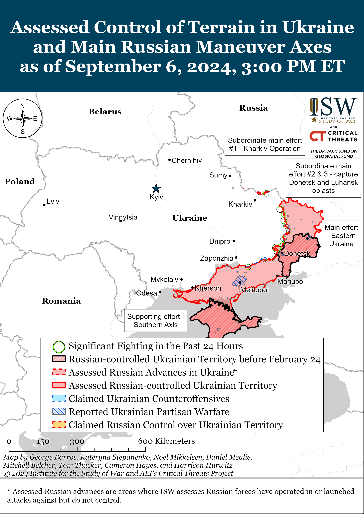
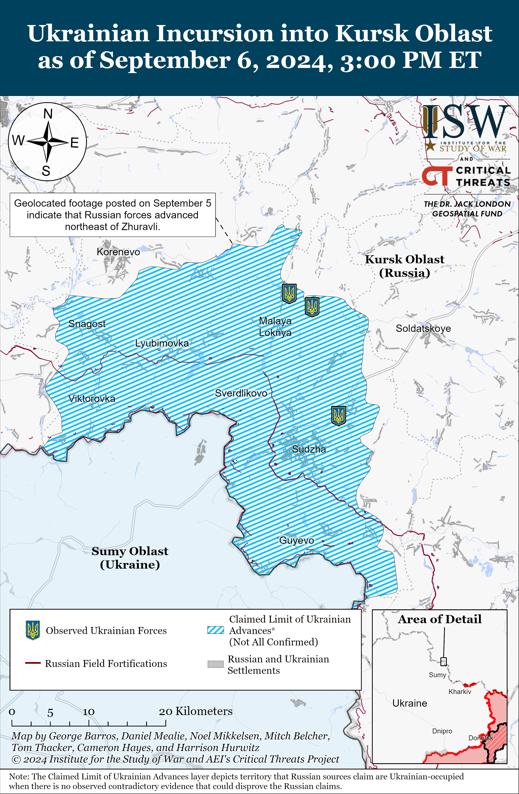
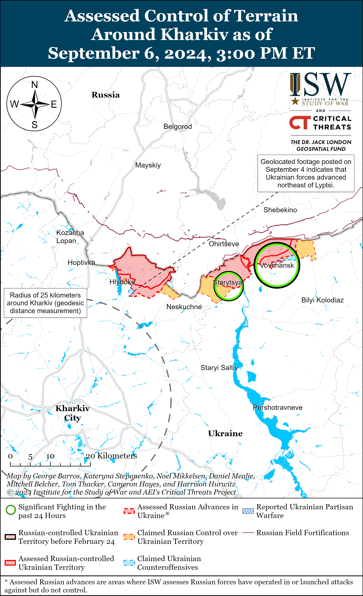
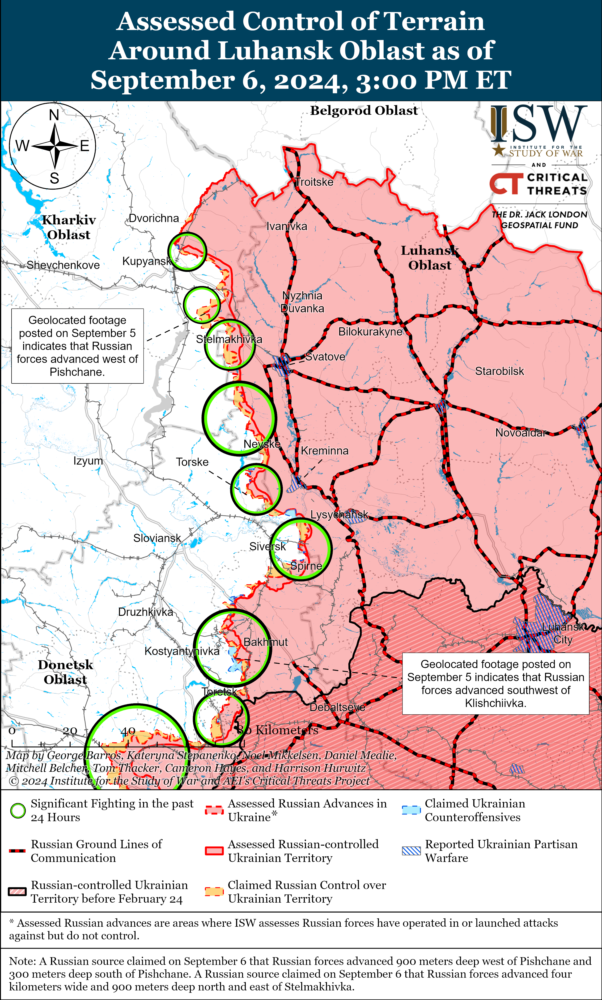
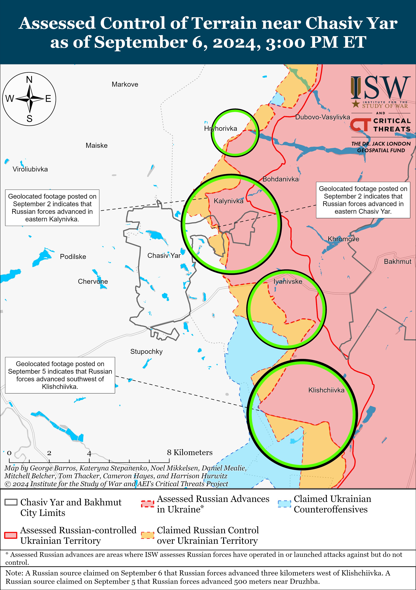
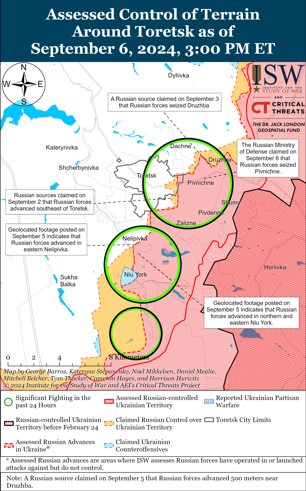
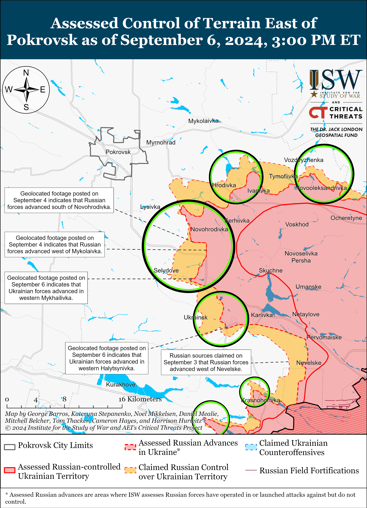
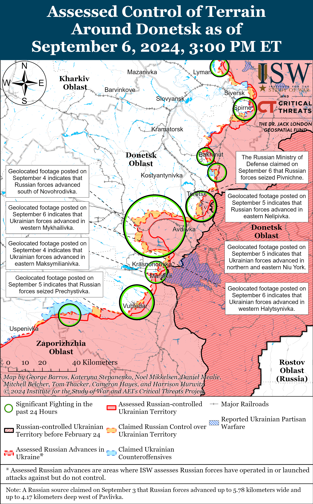
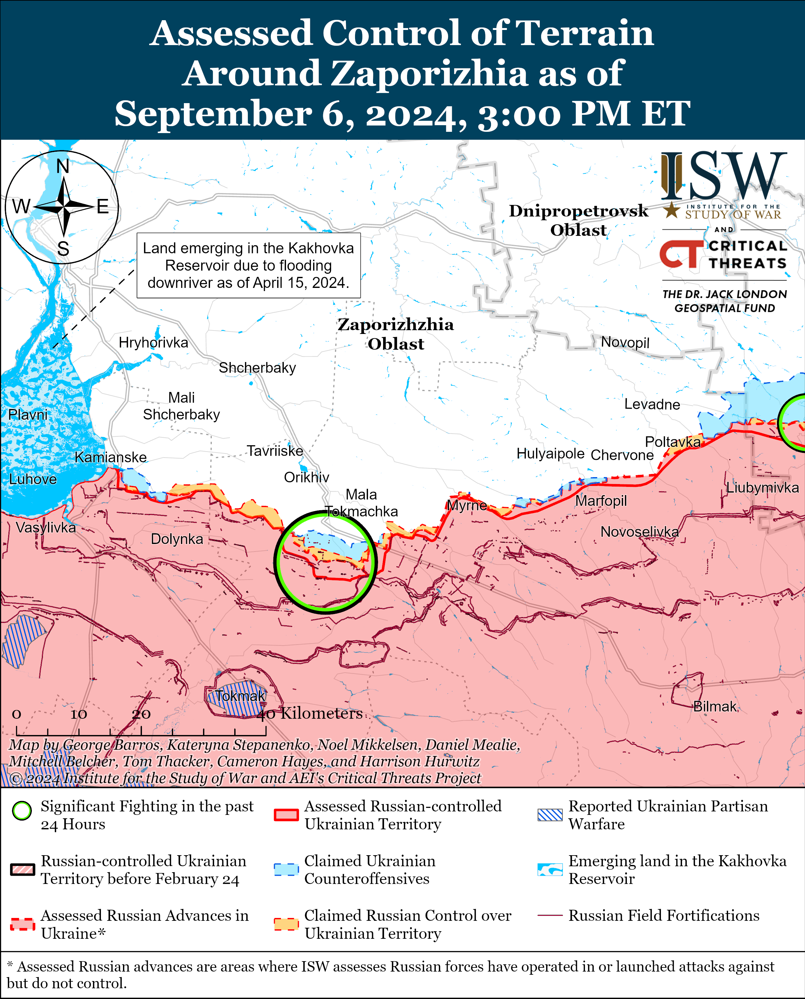
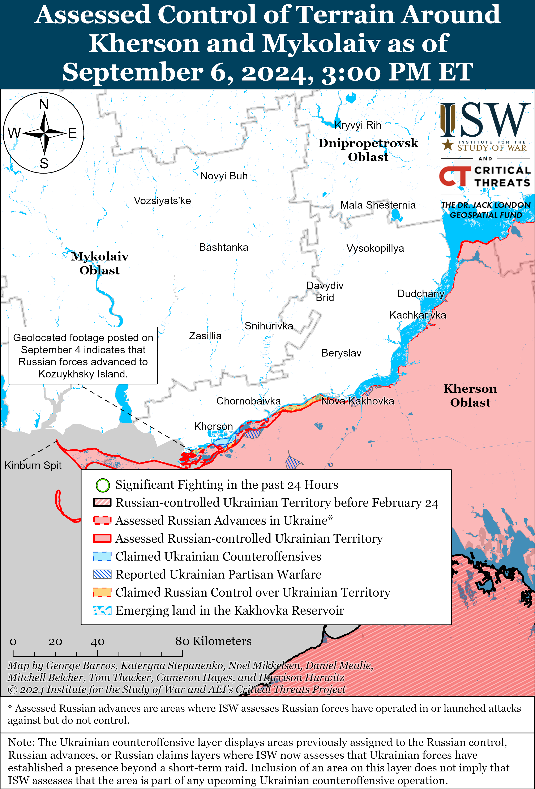

# Russian Offensive Campaign Assessment, September 6, 2024

**Riley Bailey, Christina Harward, Kateryna Stepanenko,   
Davit Gasparyan,****Annika Ganzeveld, and George Barros**

**September 6, 2024, 9pm ET**

**Click** [**here**](https://storymaps.arcgis.com/stories/36a7f6a6f5a9448496de641cf64bd375) **to see ISW’s interactive map of the Russian invasion of Ukraine. This map is updated daily alongside the static maps present in this report.**

**Click** [**here**](https://storymaps.arcgis.com/stories/83a2f24901c941d581c0c523ecd2619b) **to see ISW’s interactive map of Ukraine’s offensive in Kursk Oblast.**

**Click** [**here**](https://understandingwar.maps.arcgis.com/apps/instant/3dviewer/index.html?appid=1602762dbcde419bb957dea358449580) **to see ISW’s 3D control of terrain topographic map of Ukraine. Use of a computer (not a mobile device) is strongly recommended for using this data-heavy tool.**

**Click** [**here**](https://storymaps.arcgis.com/stories/733fe90805894bfc8562d90b106aa895) **to access ISW’s archive of interactive time-lapse maps of the Russian invasion of Ukraine. These maps complement the static control-of-terrain map that ISW produces daily by showing a dynamic frontline. ISW will update this time-lapse map archive monthly.**

**Note: The data cut-off for this product was 1pm ET on September 6. ISW will cover subsequent reports in the September 7 Russian Offensive Campaign Assessment.**

**US and European officials reported that Iran delivered hundreds of short-range ballistic missiles to Russia to support Russian President Vladimir Putin’s invasion of Ukraine.[1]** An anonymous US official confirmed to the *Wall Street Journal* (WSJ) that Iran delivered the missiles to Russia and a senior European official stated that more shipments of Iranian missiles to Russia are expected.[2] Iran and Russia previously signed a contract in December 2023 to send Iranian Ababil close-range ballistic missiles and Fateh-360 short-range ballistic missiles to Russia.[3] It is unclear, however, exactly what kind of missiles are included in the recently delivered shipment to Russia. *Reuters* reported on July 7 that Iran expanded at least two of its defense industrial sites outside Tehran since August and October 2023 to support the production of drones and missiles, some of which are meant to go to Russia.[4] Russia recently intensified missile and drone attacks against Ukraine, notably continuing to use Iranian-developed Shahed-131/136 drones and North Korean ballistic missiles.[5] Russia will likely use Iranian-provided ballistic missiles to target Ukrainian energy. military, and civilian infrastructure over the coming fall and winter to further destabilize Ukrainian society and disrupt Ukraine’s defense industrial base (DIB).

**The transfer of Iranian ballistic missiles is part of the deepening strategic partnership between Iran and Russia.** CTP-ISW has reported extensively on how Moscow and Tehran have expanded their economic, media, military, and political cooperation since Russian forces launched a full-scale invasion of Ukraine in February 2022.[6] Iran seeks to benefit economically and militarily from its expanding partnership with Russia. Iran has sought cash for its ailing economy in return for selling weapons to the Kremlin, as CTP-ISW reported in September 2023.[7] Iran has also sought to procure Russian Su-35 fighter jets and Iranian officials “pressed” Russia for the delivery of Su-35s during a meeting with Russian Security Council Secretary Sergei Shoigu in Tehran in August 2024.[8] The acquisition of Su-35s could enable Iran to more readily and independently project air power, given that the current Iranian air fleet is outdated and poorly maintained.[9] Iranian leaders have separately sought Russian support in upgrading their cyber capabilities and missile and space programs as part of the expanding military collaboration.[10] The United States and unspecified European countries have reportedly prepared a sanctions package against Iran for this contingency.[11]

**US Defense Secretary Lloyd Austin stated on September 6 that no specific weapon would be a “game changer” for Ukraine and that allowing Ukrainian forces to use US-provided weapons for long-range strikes against Russian military targets within Russia would not change the status of the war.[12] Austin is correct that no single weapon system will change the course of the war, but his comments ignore how weapon systems and their accompanying rules of engagement do affect Ukrainian capabilities, and that changes in capabilities can change the course of wars. Western military assistance remains crucial for Ukraine’s ability to defend itself, and Austin’s statement ignores the Ukrainian long-range strike capability requirement necessary to disrupt Russian rear staging areas.** Austin reiterated a Biden Administration talking point that since Russia has moved aircraft conducting glide bomb strikes out of range of US-provided ATACMS missiles, it somehow renders Ukraine’s request to use ATACMS in Russian territory against hundreds of known stationary military objects moot.[13] ISW has previously noted there are at least 209 of 245 (over 85 percent) known Russian military objects in range of ATACMS that are not air bases and not within range of US-provided HIMARS that the US does allow Ukraine to use in Russia under limited circumstances.[14] Austin also argued that Ukraine has its own domestically produced capabilities that can attack Russian targets well beyond the range of Western-provided Storm Shadow cruise missiles.[15] Most of Ukraine’s long-range strike capabilities come from domestically produced long-range drones, which Ukraine cannot use to cause the same level of damage as long-range missiles due to drone payload limitations. Russian forces can also more easily harden facilities against Ukrainian drones than Western-provided missiles. Ukraine has begun to produce and successfully field long-range precision weapons with payloads more comparable to Western-provided long-range missiles but currently lacks the quantity of these domestically produced systems to significantly threaten Russian military targets within Russia at scale.[16]

Ukraine therefore can only use a limited number of domestically produced long-range strike systems and Western-provided HIMARS to significantly threaten a limited number of Russian military objects within Russia. This scarcity is not reflective of all the long-range strike capabilities that Ukraine possesses, and Western decision-making continues to artificially suppress Ukraine’s overall long-range strike capability. ISW has assessed at length that long-range strikes against Russian military targets within Russia would degrade Russia’s ability to leverage sanctuary space in Russia for offensive operations in Ukraine and place significant operational pressures on the deployment of Russian air defense, electronic warfare (EW), logistics, command and control (C2), and military support assets.[17] Russia, on the contrary, continues to actively expand its ability to maintain deep precision strikes against Ukraine by increasingly procuring ballistic missiles from Iran and North Korea, and continuing to expand its missile production.[18]

**Ukraine’s Western partners pledged additional military aid to Ukraine during the Ukraine Defense Contact Group at Ramstein Airbase in Germany on September 6, a significant portion of which will reportedly not be delivered in the immediate future.** The US Department of Defense (DOD) announced that it will provide an aid package for Ukraine worth $250 million from the Presidential Drawdown Authority (PDA), which includes missiles for RIM-7 anti-aircraft and anti-missile systems; Stinger missiles, HIMARS ammunition; 155mm and 105mm artillery shells; Tube-Launched, Optically tracked, Wire-guided (TOW) missiles; Bradley infantry fighting vehicles; and M113 armored personnel carriers.[19] United Kingdom (UK) Defense Secretary John Healey announced that the UK will provide Ukraine with 650 Lightweight Multirole Missiles (LMM) worth £162 million (about $212 million) in order to strengthen Ukraine’s air defense capabilities.[20] Healey stated that the UK expects to deliver the LLMs by the end of 2024. German Defense Minister Boris Pistorius announced a new military aid package for Ukraine worth 150 million euros (about $166 million), including 12 Panzerhaubitze 2000 self-propelled howitzers – six of which Germany will deliver in 2024 and six of which will arrive in 2025.[21] Pistorius also stated that Germany will deliver 77 Leopard 1A5 tanks “as quickly as possible.” Canadian Defense Minister Bill Blair announced that Canada will send 80,840 CRV-7 rocket motors, 1,300 unspecified warheads, 970 C6 machine guns, and 10,500 9mm pistols to Ukraine and that the rocket motors will arrive in the coming months.[22] Blair also stated that Canada will provide decommissioned chassis from 29 M113 and 64 Coyote LAV armored personnel carriers that Ukraine can use for spare parts. Blair stated that 10 of the 50 armored combat support vehicles (ACSVs) that Canada donated to Ukraine in June 2024 will arrive in Ukraine in September 2024 and that the remaining 40 will begin arriving in Spring 2025. Dutch Defense Minister Ruben Brekelmans stated that the Netherlands will provide Ukraine with 80 million euros (about $88 million) worth of maintenance equipment, spare parts, and air-to-air missiles for Ukraine’s F-16 aircraft but did not specify a timeline for delivery.[23] Spanish Defense Minister Margarita Robles announced the immediate dispatch of a complete HAWK air defense system battery, including six missile launchers that Spain donated to Ukraine and that are already in Poland.[24]

**Russian forces are increasingly executing surrendering Ukrainian soldiers throughout the frontline likely in part because Russian commanders appear to be endorsing the proliferation of such war crimes.** *CNN* reported on September 6 that it obtained footage showing Russian forces executing surrendering Ukrainian soldiers near Pokrovsk, Donetsk Oblast in late August 2024 and Zaporizhia Oblast in May 2024.[25] Ukrainian defense intelligence reportedly gave *CNN* transcripts of audio intercepts from the May 2024 execution that showed that a Russian commander gave his subordinates the order to kill the surrendering Ukrainian soldiers. Ukrainian defense intelligence sources also reportedly gave *CNN* a list of 15 cases of Russian forces executing surrendering Ukrainian soldiers on the frontline since November 2023 – most of which included supporting drone footage or audio intercepts, and an anonymous Ukrainian official told *CNN* that the “pattern” of such executions has increased in 2024. Ukraine’s Prosecutor General Andriy Kostin told *CNN* that the Prosecutor General’s office has investigated at least 28 such executions since the start of Russia’s full-scale invasion in February 2022. Kostin stated that different Russian units operating in different sectors of the front have committed these crimes leading Ukraine to assert that this Russian policy could amount to crimes against humanity. A United Nations (UN) investigative source told *CNN* that the “pattern” of these Russian executions “suggests complacency, if not orders to give no quarter” and that together they could amount to crimes against humanity. Attacking soldiers who are *hors de combat*, specifically those who have clearly expressed an intention to surrender, is a violation of Article 41 of the Geneva Convention on the Protection of Victims of International Arms Conflict.[26] ISW has extensively reported on previous footage and reports of Russian servicemembers executing Ukrainian prisoners of war (POWs) and observed a wider trend of prolific Russian abuses against Ukrainian POWs across various sectors of the front that appeared to be enabled, if not explicitly endorsed, by individual Russian commanders and upheld by Russian field commanders.[27]

**Russian officials attempted to use a meeting with International Atomic Energy Agency (IAEA) Director General Rafael Mariano Grossi to pursue longstanding efforts to legitimize Russia’s occupation of the Zaporizhzhia Nuclear Power Plant (ZNPP) and Zaporizhia Oblast, while also promoting false narratives about a Ukrainian threat to the Kursk Nuclear Power Plant (KNPP) to weaken Western support for Ukraine’s incursion into Kursk Oblast.** Grossi met with Russian State Atomic Energy Corporation Rosatom CEO Alexei Likhachev; Russian Chief of the Radiation, Chemical, and Biological Protection (CBRN) Forces Lieutenant General Igor Kirillov; and representatives from the Russian Ministry of Foreign Affairs (MFA), Ministry of Defense (MoD), and the Russian Federal Service for Environmental, Technological and Nuclear Supervision (Rostekhnadzor) in Kaliningrad Oblast on September 6.[28] Likhachkev repeatedly accused Ukrainian forces of threatening the safety of the ZNPP and KNPP and claimed that Ukrainian forces are targeting ZNPP employees and occupation officials operating near the ZNPP.[29] The Kremlin routinely accuses Ukraine of endangering the Russian-occupied ZNPP and extended this information operation to the KNPP shortly after Ukraine’s incursion into Kursk Oblast.[30] The Kremlin aims to convince the IAEA and the West that Ukrainian forces pose a threat and could cause a radiological incident at the KNPP in order to encourage Western fears about continued Ukrainian operations in Kursk Oblast and weaken Western support for the incursion.[31] The Kremlin has long sought to use Russia’s physical control over the ZNPP to force the IAEA to meet with Russian officials to legitimize Russia’s occupation of the ZNPP, and by extension, Russia’s occupation of Ukrainian territory.[32]

**Russian federal censor Roskomnadzor published and immediately deleted a draft procedure to implement a recently adopted law designed to deanonymize Russian Telegram channels, possibly after receiving backlash from the Russian ultranationalist Telegram community.** The published draft document appeared on the Russian federal portal of legal acts on September 5, before promptly disappearing from the website overnight on September 6.[33] The deleted draft stated that Russian social media bloggers and Telegram channels with over 10,000 followers would be required to provide their personal information, such as their names, phone numbers, email, and IP addresses, to Roskomnadzor in accordance with the new federal law that Russian President Vladimir Putin signed into effect on August 9.[34] The deleted draft stated that these procedures would come into force in November 2024. Roskomnadzor later told Russian state outlet *RBK* that it deleted the draft after it was “prematurely” published due to a technical error.[35] Russian milbloggers immediately criticized the draft on September 5 and 6, stating that these procedures would threaten milbloggers’ safety due to potential data leaks and observed that the law had already ”scared” many independent bloggers away – leaving behind only well-funded and foreign Telegram channels.[36] Some Russian milbloggers claimed that Russian officials may have rushed the draft to meet a certain deadline and speculated that Roskomnadzor deleted the draft following a backlash online to further revise it for a later publication.[37] One milblogger forecasted that the Kremlin will directly mandate authorization and deanonymization of all Internet users in Russia by the end of the 2020s.[38] The sudden deletion of the draft suggests that the Russian ultranationalist milblogger community still has some influence over the Kremlin’s decisions and that the Kremlin continues to fear backlash from this community.

**The Kremlin signaled its commitment to establish full control over the Russian information space in the future and will likely reattempt to deanonymize Russian social media and Telegram channels even though Roskomnadzor withdrew its recently proposed regulations for now.** Kremlin Spokesperson Dmitry Peskov stated on September 5 that censorship is justified during periods of war and implied that freedom of information would return in peacetime.[39] Peskov also added that Russian media outlets often compete with international media forRussian domestic audiences and argued that Russian content and technological means should not lag in such a “tough” information environment. The Kremlin passed a law in 2014 that tasked Roskomnadzor with creating a registry of all social media users with an audience of over 3,000 people, but Roskomnadzor stopped updating this registry by 2017 and instead created a list of ”information dissemination organizers.”[40] These ”information dissemination organizers” include social media platforms and websites that were visited by more than 500,000 Russian users per day such as Yandex, VK, HeadHunter, and Qiwi. Roskomnadzor’s recent reversal is not indicative of a permanent policy shift, as the Kremlin has passed laws and regulations that Russian milbloggers have vocally opposed before. The Kremlin recently passed laws that Russian milbloggers avidly scrutinized in the past, such as banning the use of personal cell phone devices on the frontlines in Ukraine, for example.[41]

**The Kremlin continues to appoint Russian Presidential Administration Deputy Head Sergei Kiriyenko to positions overseeing Russia’s informational efforts as part of efforts aimed at shaping Russian identity and ideology.** Russian President Vladimir Putin created the “Rossiya” National Center in Moscow on July 1 to preserve the “Rossiya” (“Russia”) Exhibition and Forum that ran from November 2023 to July 2024.[42] Putin signed a decree on September 6 creating an organizing committee for the “Rossiya” National Center, which will “demonstrate [Russia’s] achievements, strengthen national identity,…create a sense of pride for the country, [and] develop the professional skills of children and youth.”[43] Putin appointed Kiriyenko as the chairperson of the center’s organizing committee, which will plan the center’s activities, propose events that include representatives of foreign governments, and assist Russian media with their coverage of the center’s events. Kiriyenko has a prominent role overseeing multiple Kremlin information operations targeting Russian, Ukrainian, and Western information spaces, and his appointment to supervise the development of the center suggests that the center will play a role in shaping domestic and foreign perceptions of Russia.[44] The “Rossiya” National Center will likely continue these informational efforts to legitimize Russia’s illegal annexation of Ukrainian territories and to promote Russia’s justification of its war against Ukraine. The eight-month-long “Rossiya” exhibition forum featured exhibits claiming that Luhansk, Donetsk, Zaporizhia, and Kherson oblasts are part of Russia.[45] The Kremlin has recently appeared to be taking steps to codify a Russian state ideology while bypassing the Russian Constitution, which forbids Russia from establishing a state ideology, by vaguely defining Russia’s “traditional values,” and the “Rossiya” National Center’s emphasis on Russia’s “national identity” will likely further these Kremlin ideological efforts.[46]

**Russia continues efforts to develop a capability to use information operations on social media platforms to trigger kinetic activity and has been using the Ukrainian information space for several years to hone this capability.[47]** The US Department of Justice (DOJ) announced on September 4 the ongoing seizure of 32 internet domains that the Russian government used in foreign malign influence campaigns called “Doppelganger.”[48] Russian Presidential Administration Deputy Head Sergei Kiriyenko directed the campaigns, which promoted Russian propaganda in order to reduce Western support for Ukraine and influence US and foreign elections. The US DOJ stated that the Doppelganger campaigns registered domain names that imitated Western media websites in order to publish Russian narratives falsely presented as content from legitimate news outlets. The Doppelganger campaigns also used “sleeper” channels on social media claiming to be Ukrainian news outlets that would start to disseminate Russian-friendly information after spending at least four months developing trust among their Ukrainian audiences. The US DOJ noted that the Kremlin developed the tactic of using “sleeper” channels after many Ukrainians started rejecting messages that favored Russia during the war. The US DOJ reported that the “Morning Dagestan” Telegram channel, which the DOJ labeled as “anti-Russian,” is the most “famous recent” example of such a “sleeper” channel. The “Morning Dagestan” channel notably promoted rumors that sparked antisemitic riots at the Makhachkala airport in the Republic of Dagestan in October 2023.[49] The description of the Doppelganger campaigns’ tactics, particularly the use of “sleeper” channels to provoke riots, indicates that the Kremlin is developing ways to trigger kinetic activity via information operations promoted on social media platforms, and the current Ukrainian information space offers the West the best opportunity to study this latent, growing Russian threat.

**Key Takeaways:**

- **US and European officials reported that Iran delivered hundreds of short-range ballistic missiles to Russia to support Russian President Vladimir Putin’s invasion of Ukraine.**
- **The transfer of Iranian ballistic missiles is part of the deepening strategic partnership between Iran and Russia.**
- **US Defense Secretary Lloyd Austin stated on September 6 that no specific weapon would be a “game changer” for Ukraine and that allowing Ukrainian forces to use US-provided weapons for long-range strikes against Russian military targets within Russia would not change the status of the war.**
- **Austin is correct that no single weapon system will change the course of the war, but his comments ignore how weapon systems and their accompanying rules of engagement do affect Ukrainian capabilities, and that changes in capabilities can change the course of wars. Western military assistance remains crucial for Ukraine’s ability to defend itself, and Austin’s statement ignores the Ukrainian long-range strike capability requirement necessary to disrupt Russian rear staging areas.**
- **Ukraine’s Western partners pledged additional military aid to Ukraine during the Ukraine Defense Contact Group at Ramstein Airbase in Germany on September 6, a significant portion of which will reportedly not be delivered in the immediate future.**
- **Russian forces are increasingly executing surrendering Ukrainian soldiers throughout the frontline likely in part because Russian commanders appear to be endorsing the proliferation of such war crimes.**
- **Russian officials attempted to use a meeting with International Atomic Energy Agency (IAEA) Director General Rafael Mariano Grossi to pursue longstanding efforts to legitimize Russia’s occupation of the Zaporizhzhia Nuclear Power Plant (ZNPP) and Zaporizhia Oblast, while also promoting false narratives about a Ukrainian threat to the Kursk Nuclear Power Plant (KNPP) to weaken Western support for Ukraine’s incursion into Kursk Oblast.**
- **Russian federal censor Roskomnadzor published and immediately deleted a draft procedure to implement a recently adopted law designed to deanonymize Russian Telegram channels, possibly after receiving backlash from the Russian ultranationalist Telegram community.**
- **The Kremlin signaled its commitment to establish full control over the Russian information space in the future and will likely reattempt to deanonymize Russian social media and Telegram channels even though Roskomnadzor withdrew its recently proposed regulations for now.**
- **The Kremlin continues to appoint Russian Presidential Administration Deputy Head Sergei Kiriyenko to positions overseeing Russia’s informational efforts as part of efforts aimed at shaping Russian identity and ideology.**
- **Russia continues efforts to develop a capability to use information operations on social media platforms to trigger kinetic activity and has been using the Ukrainian information space for several years to hone this capability.**
- **Russian forces recently regained lost positions in Kursk Oblast amid continued fighting throughout the Ukrainian salient on September 6.**
- **Ukrainian forces recently regained lost positions near Pokrovsk, and Russian forces recently advanced near Toretsk.**
- **Open-source tracking of confirmed Russian military deaths in Ukraine suggests that more Russian volunteers have died in Ukraine than Russian convict recruits and mobilized personnel.**

***We do not report in detail on Russian war crimes because these activities are well-covered in Western media and do not directly affect the military operations we are assessing and forecasting. We will continue to evaluate and report on the effects of these criminal activities on the Ukrainian military and the Ukrainian population and specifically on combat in Ukrainian urban areas. We utterly condemn Russian violations of the laws of armed conflict and the Geneva Conventions and crimes against humanity even though we do not describe them in these reports.***

- Ukrainian Operations in the Russian Federation
- Russian Main Effort – Eastern Ukraine (comprised of three subordinate main efforts)
- Russian Subordinate Main Effort #1 – Push Ukrainian forces back from the international border with Belgorod Oblast and approach to within tube artillery range of Kharkiv City
- Russian Subordinate Main Effort #2 – Capture the remainder of Luhansk Oblast and push westward into eastern Kharkiv Oblast and encircle northern Donetsk Oblast
- Russian Subordinate Main Effort #3 – Capture the entirety of Donetsk Oblast
- Russian Supporting Effort – Southern Axis
- Russian Air, Missile, and Drone Campaign
- Russian Mobilization and Force Generation Efforts
- Russian Technological Adaptations
- Activities in Russian-occupied areas
- Ukrainian Defense Industrial Base Efforts
- Russian Information Operations and Narratives
- Significant Activity in Belarus

**Ukrainian Operations in the Russian Federation**

Russian forces recently regained lost positions in Kursk Oblast amid continued fighting throughout the Ukrainian salient on September 6. Geolocated footage published on September 5 indicates that Russian forces recently regained positions northeast of Zhuravli (east of Korenevo).[50] Russian sources claimed that Ukrainian forces conducted assaults southwest of Korenevo near Komarovka; near Korenevo; east of Korenevo near Matveyevka and Olgovka; northwest of Sudzha near Malaya Loknya and Pogrebki; north of Sudzha near Russkoye Porechnoye; northeast of Sudzha near Martynovka; and southeast of Sudzha near Cherkasskaya Konopelka and Borki.[51] A Russian milblogger claimed that Ukrainian forces destroyed another Russian pontoon crossing in an unspecified area of Glushkovsky Raion (west of Korenevo).[52] Russian sources claimed that Ukrainian sabotage and reconnaissance groups are continuing to try to reach the 38K-017 (Kursk City-Rylsk) highway and that Russian forces are setting up checkpoints along the road.[53] Elements of the Russian 810th Naval Infantry Brigade (Black Sea Fleet, Southern Military District), the “Pyatnashka” Brigade, and the 51st Airborne (VDV) Regiment (106th VDV Division) are reportedly operating in the Kursk direction.[54]

Ukrainian President Volodymyr Zelensky stated that Ukrainian forces “control” more than 1,300 square kilometers in Kursk Oblast, including more than 100 settlements.[55] ISW has observed claims and geolocated footage indicating that Ukrainian forces are operating within roughly 1,153 square kilometers of Kursk Oblast and 49 settlements in Kursk Oblast as of September 6, although there are many extremely small settlements and localities within this area that ISW has not included in this count.

**Russian Main Effort – Eastern Ukraine**

**Russian Subordinate Main Effort #1 – Kharkiv Oblast (Russian objective: Push Ukrainian forces back from the international border with Belgorod Oblast and approach to within tube artillery range of Kharkiv City)**

Russian forces continued ground attacks north and northeast of Kharkiv City on September 6, but there were no claimed or confirmed Russian advances. Russian forces continued offensive operations north of Kharkiv City near Hlyboke and northeast of Kharkiv City near Vovchansk, Starytsya, and Hatyshche on September 5 and 6.[56] Russian milbloggers claimed that Russian forces repelled Ukrainian counterattacks in Vovchansk, in Hlyboke, near Lyptsi (north of Kharkiv City), and towards Starytsya.[57] Ukraine’s Kharkiv Group of Forces reported that Russian forces have increased their activity in the Kharkiv direction, that elements of the Russian 11th Tank Regiment (18th Motorized Rifle Division, 11th Army Corps [AC], Leningrad Military District [LMD]) are preparing to intensify assault operations near Hlyboke, and that elements of the 7th Motorized Rifle Regiment (11th AC) are operating near Lukyantsi (north of Kharkiv City).[58]

**Russian Subordinate Main Effort #2 – Luhansk Oblast (Russian objective: Capture the remainder of Luhansk Oblast and push westward into eastern Kharkiv Oblast and northern Donetsk Oblast)**

Russian sources continued to claim that Russian forces advanced northeast and southeast of Kupyansk, but ISW has not observed visual evidence confirming these claims as of September 6. Russian milbloggers claimed that Russian forces advanced up to 900 meters deep west and up to 300 meters south of Pishchane (southeast of Kupyansk).[59] Russian milbloggers also claimed that Russian forces advanced along a front four kilometers wide and 900 meters deep north and east of Stelmakhivka (southeast of Kupyansk) and pushed Ukrainian forces back 1.5 kilometers from positions northwest of Synkivka (northeast of Kupyansk).[60] The Ukrainian General Staff reported that Russian forces continued offensives northeast of Kupyansk near Synkivka; northwest of Svatove near Hlushkivka and towards Lozova; west of Svatove near Andriivka; northwest of Kreminna near Novoyehorivka, Druzhelyubivka, and Cherneshchyna; west of Kreminna near Terny and Torske; and southwest of Kreminna near Dibrova on September 5 and 6.[61] A serviceman of the Ukrainian Border Guards Service recalled in an interview published on September 6 that small Russian infantry groups had to walk 11 kilometers before launching an attack on his unit in the Kupyansk direction, resulting in Russian forces initiating offensive operations in a more exhausted state.[62] The servicemen noted that Russian forces do not evacuate wounded personnel and only receive small arms before attacking Ukrainian forces.[63] Assault detachments of the Russian 144th Guards Motorized Rifle Division (20th Combined Arms Army [CAA], Moscow Military District [MMD]) are reportedly operating on the Svatove-Kreminna line, and ”Storm-V” convict elements are reportedly operating in the Kupyansk direction.[64]

**Russian Subordinate Main Effort #3 – Donetsk Oblast (Russian objective: Capture the entirety of Donetsk Oblast, the claimed territory of Russia’s proxies in Donbas)**

Russian forces continued offensive operations in the Siversk direction on September 6 but did not make any confirmed advances. Russian forces continued ground attacks east of Siversk near Verkhnokamyanske and southeast of Siversk near Spirne and Vyimka on September 5 and 6.[65]

Russian forces continued offensive operations in the Chasiv Yar direction on September 6 but did not make any confirmed advances. Russian milbloggers claimed on September 6 that Russian forces advanced in western Kalynivka (north of Chasiv Yar), northeast of Kalynivka, and west of Klishchiivka (southeast of Chasiv Yar).[66] Russian forces continued offensive operations near Chasiv Yar; north of Chasiv Yar near Hryhorivka; east of Chasiv Yar near Ivanivske; south of Chasiv Yar near Bila Hora and in the direction of Predtechyne and Ivanopillya; and southeast of Chasiv Yar near Klishchiivka and Andriivka on September 5 and 6.[67]

Russian forces recently advanced in the Toretsk direction amid continued fighting on September 6. Geolocated footage published on September 5 further clarified the visually-confirmed maximum extent of the Russian forward line of own troops in northern and eastern Niu York, north of Niu York, and into eastern Nelipivka (all south of Toretsk).[68] The Ukrainian Azov Brigade stated on September 6 that Ukrainian forces regained control of an unspecified part of Niu York, suggesting that Russian forces do not exert control over the entirety of Niu York.[69] ISW has not observed recently published footage of Ukrainian forces operating in Niu York but will continue to update its maps as more information is made available. ISW maps depict maximalist Russian advances in areas where ISW assesses Russian forces have operated in or launched attacks against but do not control. A Russian milblogger claimed on September 6 that Ukrainian forces have started counterattacking near Toretsk and Niu York and that Ukrainian forces have reserves to influence the pace of the Russian offensive in this direction.[70] The Russian Ministry of Defense (MoD) claimed on September 6 that Russian forces recently seized Pivnichne.[71] Russian milbloggers claimed on September 5 and 6 that Russian forces advanced in southern Toretsk and near Druzhba (northeast of Toretsk).[72] ISW has not observed confirmation of these claims. Fighting continued near Toretsk, south of Toretsk near Nelipivka, and southwest of Toretsk near Oleksandropil, Panteleymonivka, and Leonidivka on September 5 and 6.[73]

Ukrainian forces regained limited positions in the Pokrovsk direction amid continued Russian offensive operations in the area on September 6. Geolocated footage published on September 6 indicates that Ukrainian forces regained positions in southwestern Halytsynivka and western Mykhailivka (both southeast of Pokrovsk).[74] A Russian milblogger claimed on September 6 that Russian forces have seized most of Lisivka and are approaching the southern outskirts of Ukrainsk (both southeast of Pokrovsk).[75] A Russian milblogger claimed that a Russian sabotage and reconnaissance group reached the outskirts of Hirnyk (southeast of Pokrovsk), although ISW has not observed confirmation or wider reporting of this claim.[76] The Russian MoD claimed on September 6 that Russian forces recently seized Ptyche, Skuchne, Karlivka, Zavitne, and Zhurvaka.[77] Fighting continued east of Pokrovsk near Vozdvyzhenka, Zelene Pole, Sukha Balka, Myrolyubivka, Hrodivka, and Novotoretske and southeast of Pokrovsk near Novohrodivka, Selydove, Mykhailivka, Zhelanne Pershe, and Ukrainsk on September 5 and 6.[78] Elements of the Russian “Black Knife Division” are reportedly operating in Zavitne (southeast of Pokrovsk).[79]

Russian forces continued offensive operations west of Donetsk City on September 6 but there were no confirmed changes to the frontline. A Russian milblogger claimed on September 6 that elements of the Russian 110th Motorized Rifle Brigade (51st Combined Arms Army [CAA] [formerly 1st Donetsk People’s Republic Army Corps], Southern Military District [SMD]) advanced in northern Krasnohorivka (west of Donetsk City), but ISW has not observed confirmation of this claim.[80] Russian forces attacked west of Donetsk City near Krasnohorvika and Heorhiivka on September 5 and 6.[81] A Russian milblogger claimed that Ukrainian forces unsuccessfully counterattacked near Maksymilyanivka.[82]

Russian forces continued offensive operations southwest of Donetsk City on September 6 but there were no confirmed changes to the frontline.[83] Russian forces continued offensive operations southwest of Donetsk City near Kostyantynivka, Staromayorske, Vuhledar, and Vodyane on September 5 and 6.[84] Elements of the Russian 11th Air and Air Defense Army (Russian Aerospace Forces [VKS] and Eastern Military District [EMD]) are reportedly operating near the Pivdennodonbaska Mine No. 3 (east of Vuhledar).[85] Elements of the Russian 37th Motorized Rifle Brigade (36th CAA, EMD) and elements of the Russian 40th Naval Infantry Brigade (Pacific Fleet, EMD) are reportedly operating in Prechytsivka.[86] Drone operators of the Russian “Kaira” Detachment (39th Motorized Rifle Brigade, 68th Army Corps [AC], EMD) are reportedly operating in the south Donetsk direction.[87]

Neither Russian nor Ukrainian sources reported fighting in the Donetsk-Zaporizhia Oblast border area on September 6.

**Russian Supporting Effort – Southern Axis (Russian objective: Maintain frontline positions and secure rear areas against Ukrainian strikes)**

Ukrainian military officials reported that Russian forces attacked near Robotyne in western Zaporizhia Oblast on September 5 and 6.[88] Ukrainian Tavriisk Group of Forces Spokesperson Captain Dmytro Lykhovyi reported that small Russian infantry groups usually carry out one to two attacks per day and that Russian forces have recently intensified airstrikes in southern Ukraine.[89] Drone operators of the Russian 35th Combined Arms Army ( Eastern Military District [EMD]) are reportedly operating in the Polohy direction (in central Zaporizhia Oblast east of Robotyne).[90]

Positional engagements continued in east (left) bank Kherson Oblast on September 5 and 6.[91]

Russian President Vladimir Putin signed a decree on September 6 tasking the operational headquarters in occupied Simferopol with the management of counterterrorism operations in the Sea of Azov.[92] The decree specified that the operational headquarters could plan the use of unspecified forces, federal means, and Simferopol’s territorial structures to combat terrorism and manage counterterrorism organizations in the Sea of Azov – except the ports, estuaries, and littoral areas of the Kerch Strait and Taganrog Bay.

The Ukrainian sinking of the Russian “Konro Trader” railway ferry in the port of Kavkaz on August 22 is reportedly complicating Russian logistics in occupied Crimea.[93] The Ukrainian Resistance Center reported that the sinking of the “Konro Trader” reduced Russian throughput capacity via railway ferries to occupied Crimea by three times and that Russia does not have available railway ferries to immediately restore this capacity. The Ukrainian Resistance Center added that Russian officials are now looking to retrofit barges to transport railway echelons with fuel and that Russian forces have been reliant on the ”Konro Trader” railway ferry due to unrepaired damage to the railway portion of the Kerch Strait Bridge. The Ukrainian Resistance Center added that Russian forces have also increased fuel transfers from Rostov Oblast to occupied Crimea to 160 wagons per day via occupied Donetsk, Zaporizhia, and Kherson oblasts along the Avilo-Uspenka – Amvrosiivka – Volnovakha – Tokmak – Melitopol – Dzhankoi railway. The Ukrainian Resistance Center noted that Russian forces are also rushing the construction of the Taganrog (Rostov Oblast) – Ilovaysk (occupied Donetsk Oblast) railway and the Mariupol – Volnovakha railway.

**Russian Air, Missile, and Drone Campaign (Russian Objective: Target Ukrainian military and civilian infrastructure in the rear and on the frontline)**

Russian forces conducted a series of missile and drone strikes against Ukraine on the night of September 5 to 6 and during the day on September 6. The Ukrainian Air Force reported that Russian forces launched a Kh-59 cruise missile and a Kh-31P anti-radar missile from airspace over Bryansk and occupied Luhansk oblasts and 44 Shahed-136/131 drones from Kursk Oblast, Primorsko-Akhtarsk, Krasnodar Krai, and occupied Cape Chauda, Crimea on the night of September 5 to 6.[94] The Ukrainian Air Force reported that Ukrainian forces shot down at least 27 of the Shahed drones and that at least eight Shaheds did not reach their intended target after unspecified electronic warfare (EW) devices presumably impacted the drones.[95] The Ukrainian Air Force reported that several drones were still in Ukrainian airspace as of the morning of September 6 and that Russian forces later launched five Iskander-M/North Korean KN-23 ballistic missiles from Voronezh and Rostov oblasts against Pavlohrad, Dnipropetrovsk Oblast.[96] Dnipropetrovsk Oblast Military Administration head Serhiy Lysak reported that Russian strikes in Pavlohrad damaged residential areas and injured upwards of 61 people.[97] Ukrainian officials reported that Russian drone debris damaged vehicles near Lviv City.[98]

**Russian Mobilization and Force Generation Efforts (Russian objective: Expand combat power without conducting general mobilization)**

Open-source tracking of confirmed Russian military deaths in Ukraine suggests that more Russian volunteers have died in Ukraine than Russian convict recruits and mobilized personnel. BBC Russian Service and Russian opposition outlet *Mediazona* reported that they have identified 68,011 Russian soldiers that have died since the start of the full-scale invasion in February 2022 and that 20 percent of these identified deaths were among Russian volunteers, 19 percent were among Russian convict recruits, and 13 percent were among mobilized personnel.[99] The actual number of Russians killed in action (KIA) is likely much higher than *BBC Russian Service’s* and *Mediazona’s* count of identified KIA, and the actual percentage breakdown of KIA among different groups of Russian personnel is likely different as well.

Russian state-owned enterprises continue to support Russian force generation efforts. Russian opposition outlet *Sota* reported on September 6 that intermediary companies recruiting personnel for the war in Ukraine are offering recruits potential future employment in state-owned companies if they sign a contract with the Russian Ministry of Defense (MoD).[100] *Sota* noted that the state-owned companies include Russian transportation companies like Mosgotrans and Russian Railways, Russian oil company Rosneft, and Russian water supply and sanitation company Mosvodokanal.[101] *Sota* reported that intermediary recruiters stated that state-owned companies are also trying to send current employees to fight in Ukraine and are offering up to 1.9 million rubles ($21,000) to incentivize employees to sign military contracts.[102] A Russian insider source claimed that Moscow Metro Head Viktor Kozlovsky instructed deputies to recruit 850 new Moscow Metro employees and that employment with Moscow Metro is currently only possible if a potential employee signs a military contract with the MoD.[103] The insider source claimed that this has led to disparities in the number of available workers in key specialties for Moscow Metro.[104]

**Russian Technological Adaptations (Russian objective: Introduce technological innovations to optimize systems for use in Ukraine)**

A Russian insider source claimed on September 6 that a widely advertised, alleged Russian drone detection and suppression system is a Chinese-produced system.[105] The insider source claimed that Rosgvardia’s press service widely advertised that Rosgvardia was using the allegedly Russian-produced “Vyzhigatel” drone detection and suppression system in tasks associated with the “special military operation,” but that Russian authorities later initiated a criminal case on smuggling after they discovered that Chinese company Shenzhen Skyfend Technology had produced the system.[106] Rosgvardia had reportedly initially claimed that Russian company Oruzheynaya Palata had delivered the drone detection and suppression systems to Rosgvardia in December 2023.[107]

**Ukrainian Defense Industrial Efforts (Ukrainian objective: Develop its defense industrial base to become more self-sufficient in cooperation with US, European, and international partners)**

*ISW is suspending publishing coverage of Ukrainian defense industrial efforts until further notice.*

**Activities in Russian-occupied areas (Russian objective: Consolidate administrative control of annexed areas; forcibly integrate Ukrainian citizens into Russian sociocultural, economic, military, and governance systems)**

*ISW is not publishing coverage of occupied areas today.*

**Russian Information Operations and Narratives**

The Kremlin continued efforts to subvert the 1995 Dayton Accords that ended the 1992-1995 Bosnian war. Kremlin Spokesperson Dmitry Peskov claimed on September 5 that the foundations of the Dayton Accords are eroding and that unspecified actors are infringing upon Serbs’ interests.[108] Peskov claimed that Russia has limited capabilities to help but can support Serbia and Republika Srpska (the Serbian political entity within Bosnia and Herzegovina) in the international arena. The Kremlin has previously leveraged its relationship with Republika Srpska to further influence the Balkans, sow divisions in the West, and undermine the Dayton Accords to destabilize the Balkans.[109]

**Significant activity in Belarus (Russian efforts to increase its military presence in Belarus and further integrate Belarus into Russian-favorable frameworks and Wagner Group activity in Belarus)**

Nothing significant to report.

**Note: ISW does not receive any classified material from any source, uses only publicly available information, and draws extensively on Russian, Ukrainian, and Western reporting and social media as well as commercially available satellite imagery and other geospatial data as the basis for these reports. References to all sources used are provided in the endnotes of each update.**

---

[1] https://www.wsj.com/world/u-s-tells-allies-iran-has-sent-ballistic-missiles-to-russia-9558f4c4?mod=hp\_lead\_pos2

[2] https://www.wsj.com/world/u-s-tells-allies-iran-has-sent-ballistic-missiles-to-russia-9558f4c4?mod=hp\_lead\_pos2

[3] https://www.reuters.com/business/aerospace-defense/iran-deliver-hundreds-ballistic-missiles-russia-soon-intel-sources-say-2024-08-09/

[4] https://www.reuters.com/world/middle-east/satellite-photos-show-iran-expanding-missile-production-sources-say-2024-07-08/

[5] https://t.me/kpszsu/18948 ; https://t.me/kpszsu/18921 ; https://understandingwar.org/backgrounder/russian-offensive-campaign-assessment-september-5-2024 ; https://isw.pub/UkrWar090424 ; https://understandingwar.org/backgrounder/russian-offensive-campaign-assessment-september-3-2024 ; https://understandingwar.org/backgrounder/russian-offensive-campaign-assessment-september-2-2024 ; https://understandingwar.org/backgrounder/russian-offensive-campaign-assessment-august-26-2024; https://understandingwar.org/backgrounder/russian-offensive-campaign-assessment-august-23-2024; https://understandingwar.org/backgrounder/russian-offensive-campaign-assessment-august-20-2024 ; https://understandingwar.org/backgrounder/russian-offensive-campaign-assessment-august-18-2024; https://understandingwar.org/backgrounder/russian-offensive-campaign-assessment-august-21-2024-0

[6] https://www.criticalthreats.org/analysis/iran-update-september-27-2023 ;

https://understandingwar.org/backgrounder/iran-update-september-5-2023 ;

https://understandingwar.org/backgrounder/iran-update-may-17-2023

[7] https://www.criticalthreats.org/analysis/iran-update-september-27-2023

[8] https://www.reuters.com/world/putin-asks-iran-avoid-civilian-casualties-israel-response-sources-say-2024-08-06/; https://www.aei.org/wp-content/uploads/2023/05/Pivot-to-Offense-How-Iran-Is-Adapting-for-Modern-Conflict-and-Warfare.pdf ;

https://www.borna dot news/fa/tiny/news-1372678 ;

https://twitter.com/IrnaEnglish/status/1634481569300709377/photo/1

[9] https://understandingwar.org/backgrounder/iran-update-september-5-2023

[10] https://www.wsj.com/articles/russia-supplies-iran-with-cyber-weapons-as-military-cooperation-grows-b14b94cd ; https://www.newsweek.com/israel-worries-us-weapons-ukraine-are-ending-irans-hands-1806131

[11] https://www.wsj.com/world/u-s-tells-allies-iran-has-sent-ballistic-missiles-to-russia-9558f4c4?mod=hp\_lead\_pos2

[12] https://www.reuters.com/world/using-us-arms-long-range-strikes-into-russia-no-game-changer-says-austin-2024-09-06/

[13] https://www.reuters.com/world/using-us-arms-long-range-strikes-into-russia-no-game-changer-says-austin-2024-09-06/

[14] https://understandingwar.org/backgrounder/interactive-map-hundreds-known-russian-military-objects-are-range

[15] https://www.reuters.com/world/using-us-arms-long-range-strikes-into-russia-no-game-changer-says-austin-2024-09-06/

[16] https://isw.pub/UkrWar082424

[17] https://isw.pub/UkrWar082424 ; https://understandingwar.org/backgrounder/interactive-map-hundreds-known-russian-military-objects-are-range-atacms ; https://understandingwar.org/backgrounder/putins-safe-space-defeating-russias-kharkiv-operation-requires-eliminating-russias

[18] https://isw.pub/UkrWar090224 ; https://isw.pub/UkrWar073024 ; https://isw.pub/UkrWar020724 ; https://isw.pub/UkrWar082823

[19] https://www.defense.gov/News/Releases/Release/Article/3896787/biden-administration-announces-additional-security-assistance-for-ukraine/

[20] https://www.gov.uk/government/news/uk-to-provide-162-million-package-of-air-defence-missiles-for-ukraine-as-defence-secretary-meets-international-partners

[21] https://www.welt dot de/politik/ausland/article253386110/Ukraine-Werden-zwoelf-Panzerhaubitzen-vom-Typ-2000-liefern-sagt-Pistorius.html ; https://www.spiegel dot de/politik/deutschland/ramstein-deutschland-sagt-ukraine-zwoelf-weitere-panzerhaubitzen-zu-a-c7891e90-c35c-4c06-8442-32ec855839e2

[22] https://www.canada.ca/en/department-national-defence/news/2024/09/minister-blair-announces-additional-military-assistance-for-ukraine-at-the-24th-meeting-of-the-ukraine-defense-contact-group.html

[23] https://english.defensie dot nl/latest/news/2024/09/06/ammunition-and-maintenance-for-ukrainian-f-16s

[24] https://www.defensa dot gob.es/gabinete/notasPrensa/2024/09/DGC-240906-reunion-ramstein-ucrania.html ; https://x.com/defenceu/status/1832067988867920144

[25] https://edition.cnn.com/2024/09/06/europe/video-russia-surrendering-ukrainian-soldiers-killed-intl-cmd/index.html

[26] https://ihl-databases.icrc.org/en/ihl-treaties/api-1977/article-41

[27] https://understandingwar.org/backgrounder/russian-offensive-campaign-assessment-june-19-2024 ; https://isw.pub/UkrWar122823 ; https://understandingwar.org/backgrounder/russian-offensive-campaign-assessment-june-3-2024 ; https://isw.pub/UkrWar032724 ; https://isw.pub/UkrWar052924 ; https://isw.pub/UkrWar090424 ; https://understandingwar.org/backgrounder/russian-offensive-campaign-assessment-july-10-2024 ; https://isw.pub/UkrWar062324

[28] https://t.me/tass\_agency/271052; https://t.me/tass\_agency/271054

[29] https://t.me/tass\_agency/271071; https://t.me/tass\_agency/271072 ; https://t.me/tass\_agency/271074 ; https://t.me/tass\_agency/271076

[30] https://understandingwar.org/backgrounder/russian-offensive-campaign-assessment-august-17-2024 ; https://understandingwar.org/backgrounder/russian-offensive-campaign-assessment-august-27-2024

[31] https://understandingwar.org/backgrounder/russian-offensive-campaign-assessment-august-17-2024 ; https://understandingwar.org/backgrounder/russian-offensive-campaign-assessment-august-27-2024

[32] https://isw.pub/UkrWar040724; https://isw.pub/UkrWar030824 ; https://understandingwar.org/backgrounder/russian-offensive-campaign-assessment-june-17-2024

[33] https://www.rbc dot ru/technology\_and\_media/06/09/2024/66dab4849a79475712c0fe3f ; https://meduza dot io/news/2024/09/06/proekt-roskomnadzora-o-reestre-stranits-s-auditoriey-bolshe-10-tysyach-podpischikov-udalili-s-portala-pravitelstva; https://meduza dot io/news/2024/09/05/rkn-rasskazal-kakie-lichnye-dannye-budet-sobirat-u-blogerov-chya-auditoriya-prevyshaet-10-tysyach-podpischikov-imya-telefon-imeyl-i-ip-adres

[34] https://meduza dot io/news/2024/09/05/rkn-rasskazal-kakie-lichnye-dannye-budet-sobirat-u-blogerov-chya-auditoriya-prevyshaet-10-tysyach-podpischikov-imya-telefon-imeyl-i-ip-adres; https://interfax dot com/newsroom/top-stories/104973/

[35] https://www.rbc dot ru/technology\_and\_media/06/09/2024/66dab4849a79475712c0fe3f

[36] https://t.me/dva\_majors/51687; https://t.me/dva\_majors/51691; https://t.me/pavelostrovski/9817; https://t.me/pavelostrovski/9811;

[37] https://t.me/boris\_rozhin/136341; https://t.me/dva\_majors/51698 ; https://t.me/dva\_majors/51727 ; https://t.me/kremlin\_sekret/15940

[38] https://t.me/boris\_rozhin/136344

[39] https://tass dot ru/politika/21788727

[40] https://meduza dot io/news/2024/09/05/rkn-rasskazal-kakie-lichnye-dannye-budet-sobirat-u-blogerov-chya-auditoriya-prevyshaet-10-tysyach-podpischikov-imya-telefon-imeyl-i-ip-adres

[41] https://understandingwar.org/backgrounder/russian-offensive-campaign-assessment-july-23-2024; https://understandingwar.org/backgrounder/russian-offensive-campaign-assessment-july-31-2024; https://understandingwar.org/backgrounder/russian-offensive-campaign-assessment-august-2-2024

[42] https://tass dot ru/obschestvo/21247065; http://publication dot pravo.gov.ru/document/0001202407010017

[43] https://www.vedomosti dot ru/society/news/2024/09/06/1060623-putin-obrazoval-orgkomitet; http://publication.pravo dot gov.ru/document/0001202409060007?ysclid=m0qpkqv06f31690041 ; https://tass dot ru/politika/21794597

[44] https://isw.pub/UkrWar123023; https://isw.pub/UkrWar120323; https://isw.pub/UkrWar112823; https://isw.pub/UkrWar112723; https://isw.pub/UkrWar093023; https://understandingwar.org/backgrounder/russian-offensive-campaign-assessment-august-26-2024; https://understandingwar.org/backgrounder/russian-offensive-campaign-assessment-march-28-2024; https://understandingwar.org/backgrounder/russian-offensive-campaign-assessment-february-18-2024 ; https://understandingwar.org/backgrounder/russian-offensive-campaign-assessment-march-1-2024 ; https://understandingwar.org/backgrounder/russian-offensive-campaign-assessment-february-20-2024 ; https://understandingwar.org/backgrounder/russian-offensive-campaign-assessment-february-29-2024 ; https://isw.pub/UkrWar123023

[45] https://understandingwar.org/backgrounder/russian-offensive-campaign-assessment-november-4-2023; https://understandingwar.org/backgrounder/russian-offensive-campaign-assessment-december-14-2023

[46] https://isw.pub/UkrWar083124; https://isw.pub/UkrWar081924; https://isw.pub/UkrWar06272024

[47] https://understandingwar.org/backgrounder/viral-disinformation-kremlin%E2%80%99s-coronavirus-information-operation-ukraine

[48] https://www.justice.gov/opa/pr/justice-department-disrupts-covert-russian-government-sponsored-foreign-malign-influence ; https://www.justice.gov/d9/2024-09/doppelganger\_affidavit\_9.4.24.pdf

[49] https://understandingwar.org/backgrounder/russian-offensive-campaign-assessment-november-2-2023; https://t.me/sotaproject/68747 ; https://isw.pub/UkrWar103023; https://isw.pub/UkrWar102923

[50] https://t.me/WarArchive\_ua/19680 ; https://t.me/pentagonkh/66

[51] https://t.me/mod\_russia/43036; https://t.me/dva\_majors/51700; https://t.me/sashakots/48817; https://t.me/DnevnikDesantnika/15060; https://t.me/DnevnikDesantnika/15057; https://t.me/motopatriot/27189; https://t.me/DnevnikDesantnika/15061

[52] https://t.me/dva\_majors/51700

[53] https://t.me/sashakots/48817; https://t.me/dva\_majors/51700

[54] https://t.me/NgP\_raZVedka/18968; https://t.me/tass\_agency/271001 ; https://t.me/boris\_rozhin/136403

[55] https://armyinform.com dot ua/2024/09/06/prezydent-rozpoviv-pro-vtraty-rosiyi-na-kurshhyni/; https://www.youtube.com/live/opIkY2HXbD0

[56] https://www.facebook.com/GeneralStaff.ua/posts/pfbid07FnDHFsQv7wiBZWXczzPq3VsSJV1TSHEc19jRoUChLpsj2ms4aCxtUbmAirznXeml; https://www.facebook.com/GeneralStaff.ua/posts/pfbid02qhvQaR7KR92GYjezmAjc57PwibTsviGNnWm4DKzTdqTTLxB8o42PVcsYh4kT3n7wl ; https://www.facebook.com/GeneralStaff.ua/posts/pfbid021x8mtMXE7FGYJM7HEkxnLfuEvya5bkddU7PcsiMUfdT6yqzit6Mq5mC6BwVTsmi2l; https://t.me/wargonzo/21939; https://t.me/motopatriot/27193

[57] https://t.me/DnevnikDesantnika/15059; https://t.me/wargonzo/21939; https://t.me/Sladkov\_plus/11341

[58] https://t.me/otukharkiv/1119

[59] https://t.me/z\_arhiv/27997; https://t.me/RVvoenkor/76439

[60] https://t.me/DnevnikDesantnika/15044; https://t.me/RVvoenkor/76439

[61] https://www.facebook.com/GeneralStaff.ua/posts/pfbid07FnDHFsQv7wiBZWXczzPq3VsSJV1TSHEc19jRoUChLpsj2ms4aCxtUbmAirznXeml; https://www.facebook.com/GeneralStaff.ua/posts/pfbid02qhvQaR7KR92GYjezmAjc57PwibTsviGNnWm4DKzTdqTTLxB8o42PVcsYh4kT3n7wl; https://www.facebook.com/GeneralStaff.ua/posts/pfbid021x8mtMXE7FGYJM7HEkxnLfuEvya5bkddU7PcsiMUfdT6yqzit6Mq5mC6BwVTsmi2l

[62] https://www.facebook.com/DPSUkraine/videos/536051995651021

[63] https://www.facebook.com/DPSUkraine/videos/536051995651021

[64] https://t.me/vysokygovorit/17206 (Kupyansk); https://t.me/vysokygovorit/17206 (Svatove-Kreminna)

[65] https://www.facebook.com/GeneralStaff.ua/posts/pfbid07FnDHFsQv7wiBZWXczzPq3VsSJV1TSHEc19jRoUChLpsj2ms4aCxtUbmAirznXeml; https://www.facebook.com/GeneralStaff.ua/posts/pfbid02qhvQaR7KR92GYjezmAjc57PwibTsviGNnWm4DKzTdqTTLxB8o42PVcsYh4kT3n7wl; https://www.facebook.com/GeneralStaff.ua/posts/pfbid021x8mtMXE7FGYJM7HEkxnLfuEvya5bkddU7PcsiMUfdT6yqzit6Mq5mC6BwVTsmi2l

[66] https://t.me/rybar/63307 ; https://t.me/priviyazkasvo/210 ; https://t.me/dva\_majors/51700 ; https://t.me/DnevnikDesantnika/15051 ; https://t.me/wargonzo/21939 ; https://t.me/rybar/63307; https://t.me/z\_arhiv/27999

[67] https://www.facebook.com/GeneralStaff.ua/posts/pfbid07FnDHFsQv7wiBZWXczzPq3VsSJV1TSHEc19jRoUChLpsj2ms4aCxtUbmAirznXeml; https://www.facebook.com/GeneralStaff.ua/posts/pfbid02qhvQaR7KR92GYjezmAjc57PwibTsviGNnWm4DKzTdqTTLxB8o42PVcsYh4kT3n7wl; https://www.facebook.com/GeneralStaff.ua/posts/pfbid021x8mtMXE7FGYJM7HEkxnLfuEvya5bkddU7PcsiMUfdT6yqzit6Mq5mC6BwVTsmi2l

[68] https://x.com/azov\_media/status/1831941205023740108; https://x.com/strategicbakery/status/1831946696764616990

[69] https://t.me/azov\_media/6034; https://suspilne dot media/donbas/830157-bijci-azovu-povernuli-pid-kontrol-castinu-nu-jorka-na-doneccini/ ; https://x.com/azov\_media/status/1831941205023740108; https://x.com/strategicbakery/status/1831946696764616990; https://t [dot] me/azov\_media/6034; https://suspilne dot media/donbas/830157-bijci-azovu-povernuli-pid-kontrol-castinu-nu-jorka-na-doneccini/

[70] https://t.me/notes\_veterans/19331

[71] https://t.me/mod\_russia/43039

[72] https://t.me/RVvoenkor/76439 ; https://t.me/DnevnikDesantnika/15022

[73] https://www.facebook.com/GeneralStaff.ua/posts/pfbid07FnDHFsQv7wiBZWXczzPq3VsSJV1TSHEc19jRoUChLpsj2ms4aCxtUbmAirznXeml; https://www.facebook.com/GeneralStaff.ua/posts/pfbid02qhvQaR7KR92GYjezmAjc57PwibTsviGNnWm4DKzTdqTTLxB8o42PVcsYh4kT3n7wl; https://www.facebook.com/GeneralStaff.ua/posts/pfbid021x8mtMXE7FGYJM7HEkxnLfuEvya5bkddU7PcsiMUfdT6yqzit6Mq5mC6BwVTsmi2l

[74] https://x.com/Bielitzling/status/1832022313547501615; https://x.com/small10space/status/1832020092608995523 ; https://x.com/moklasen/status/1832119972568485942; https://t.me/ghost\_of\_khortytsia/138

[75] https://t.me/RVvoenkor/76439; https://t.me/motopatriot/27192; https://t.me/z\_arhiv/27995

[76] https://t.me/boris\_rozhin/136389

[77] https://t.me/mod\_russia/43039

[78] https://www.facebook.com/GeneralStaff.ua/posts/pfbid07FnDHFsQv7wiBZWXczzPq3VsSJV1TSHEc19jRoUChLpsj2ms4aCxtUbmAirznXeml; https://www.facebook.com/GeneralStaff.ua/posts/pfbid02qhvQaR7KR92GYjezmAjc57PwibTsviGNnWm4DKzTdqTTLxB8o42PVcsYh4kT3n7wl; https://www.facebook.com/GeneralStaff.ua/posts/pfbid021x8mtMXE7FGYJM7HEkxnLfuEvya5bkddU7PcsiMUfdT6yqzit6Mq5mC6BwVTsmi2l ; https://t.me/boris\_rozhin/136389 ; https://t.me/notes\_veterans/19331 ; https://t.me/milinfolive/130039

[79] https://t.me/boris\_rozhin/136333

[80] https://t.me/z\_arhiv/28003; https://t.me/PushilinDenis/5090

[81] https://www.facebook.com/GeneralStaff.ua/posts/pfbid07FnDHFsQv7wiBZWXczzPq3VsSJV1TSHEc19jRoUChLpsj2ms4aCxtUbmAirznXeml; https://www.facebook.com/GeneralStaff.ua/posts/pfbid02qhvQaR7KR92GYjezmAjc57PwibTsviGNnWm4DKzTdqTTLxB8o42PVcsYh4kT3n7wl; https://www.facebook.com/GeneralStaff.ua/posts/pfbid021x8mtMXE7FGYJM7HEkxnLfuEvya5bkddU7PcsiMUfdT6yqzit6Mq5mC6BwVTsmi2l

[82] https://t.me/DnevnikDesantnika/15053

[83] https://t.me/mod\_russia/43040 ; https://t.me/RVvoenkor/76410;

[84] https://www.facebook.com/GeneralStaff.ua/posts/pfbid07FnDHFsQv7wiBZWXczzPq3VsSJV1TSHEc19jRoUChLpsj2ms4aCxtUbmAirznXeml; https://www.facebook.com/GeneralStaff.ua/posts/pfbid02qhvQaR7KR92GYjezmAjc57PwibTsviGNnWm4DKzTdqTTLxB8o42PVcsYh4kT3n7wl; https://www.facebook.com/GeneralStaff.ua/posts/pfbid021x8mtMXE7FGYJM7HEkxnLfuEvya5bkddU7PcsiMUfdT6yqzit6Mq5mC6BwVTsmi2l

[85] https://t.me/boris\_rozhin/136372

[86] https://t.me/RVvoenkor/76410

[87] https://t.me/boris\_rozhin/136410; https://t.me/voin\_dv/10659

[88] https://www.facebook.com/GeneralStaff.ua/posts/pfbid02qhvQaR7KR92GYjezmAjc57PwibTsviGNnWm4DKzTdqTTLxB8o42PVcsYh4kT3n7wl; https://www.facebook.com/OperationalCommandSouth/posts/pfbid02RAaxV3ebyeH1mwkz59sktPLeUyWid4S1RjFoeFVk71SX4eiagXXgdz7uVwBbsxY7l ; https://www.facebook.com/GeneralStaff.ua/posts/pfbid021x8mtMXE7FGYJM7HEkxnLfuEvya5bkddU7PcsiMUfdT6yqzit6Mq5mC6BwVTsmi2l

[89] https://armyinform dot com.ua/2024/09/06/na-pivdni-vorog-atakuvav-243-dronamy-95-bezpilotnykiv-znyshheno/; https://www.youtube.com/watch?v=j5TqaWCCdUg

[90] https://t.me/voin\_dv/10656

[91] https://www.facebook.com/GeneralStaff.ua/posts/pfbid07FnDHFsQv7wiBZWXczzPq3VsSJV1TSHEc19jRoUChLpsj2ms4aCxtUbmAirznXeml ; https://www.facebook.com/GeneralStaff.ua/posts/pfbid02qhvQaR7KR92GYjezmAjc57PwibTsviGNnWm4DKzTdqTTLxB8o42PVcsYh4kT3n7wl; https://www.facebook.com/OperationalCommandSouth/posts/pfbid02RAaxV3ebyeH1mwkz59sktPLeUyWid4S1RjFoeFVk71SX4eiagXXgdz7uVwBbsxY7l ; https://www.facebook.com/GeneralStaff.ua/posts/pfbid021x8mtMXE7FGYJM7HEkxnLfuEvya5bkddU7PcsiMUfdT6yqzit6Mq5mC6BwVTsmi2l ; https://t.me/dva\_majors/51752

[92] https://tass dot ru/obschestvo/21794933

[93] https://sprotyv dot mod.gov.ua/rosiyany-shukayut-barzhi-shhob-zaminyty-zaliznychni-poromy/; https://t.me/sprotyv\_official/5177

[94] https://t.me/kpszsu/18921

[95] https://t.me/kpszsu/18921

[96] https://t.me/kpszsu/18948 ; https://t.me/kpszsu/18921

[97] https://armyinform.com dot ua/2024/09/06/u-pavlogradi-majzhe-vdvichi-zbilshylas-kilkist-poranenyh/; https://t.me/dnipropetrovskaODA/15839

[98] https://www.facebook.com/MNS.GOV.UA/posts/pfbid02bZkfiP3sMsqm9A3PJK7L942mRoyXWDgtUBGv4pxjTKLhMtc4SxmKMTJymiSwahxHl ; https://armyinform dot com.ua/2024/09/06/udarni-drony-rosiyan-sprychyny-masshtabnu-pozhezhu-na-lvivshhyni-ryatuvalnyky-pokazaly-likvidacziyu/ ; https://t.me/severrealii/27084 ; ttps://t.me/andriysadovyi/2475; https://suspilne dot media/lviv/830087-na-lvivsini-cerez-padinna-ulamkiv-saheda-zdijnalasa-pozeza-so-vidomo-pro-obstril/

[99] https://t.me/bbcrussian/70093

[100] https://t.me/sotaproject/86699

[101] https://t.me/sotaproject/86699

[102] https://t.me/sotaproject/86699

[103] https://t.me/vchkogpu/50683

[104] https://t.me/vchkogpu/50683

[105] https://t.me/vchkogpu/50681

[106] https://t.me/vchkogpu/50681

[107] https://t.me/vchkogpu/50681

[108] https://tass dot ru/politika/21786755

[109] https://understandingwar.org/backgrounder/russian-offensive-campaign-assessment-may-24-2023 ; https://understandingwar.org/backgrounder/russian-offensive-campaign-assessment-april-25-2024 ; https://understandingwar.org/backgrounder/russia-review-december-1-2021-%E2%80%93-january-11-2022 ; https://understandingwar.org/backgrounder/russia-review-october-20-%E2%80%93-november-9-2021; https://understandingwar.org/backgrounder/russian-offensive-campaign-assessment-june-7-2024
