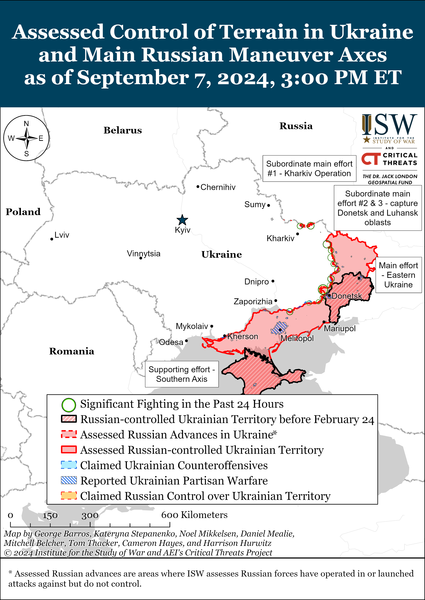
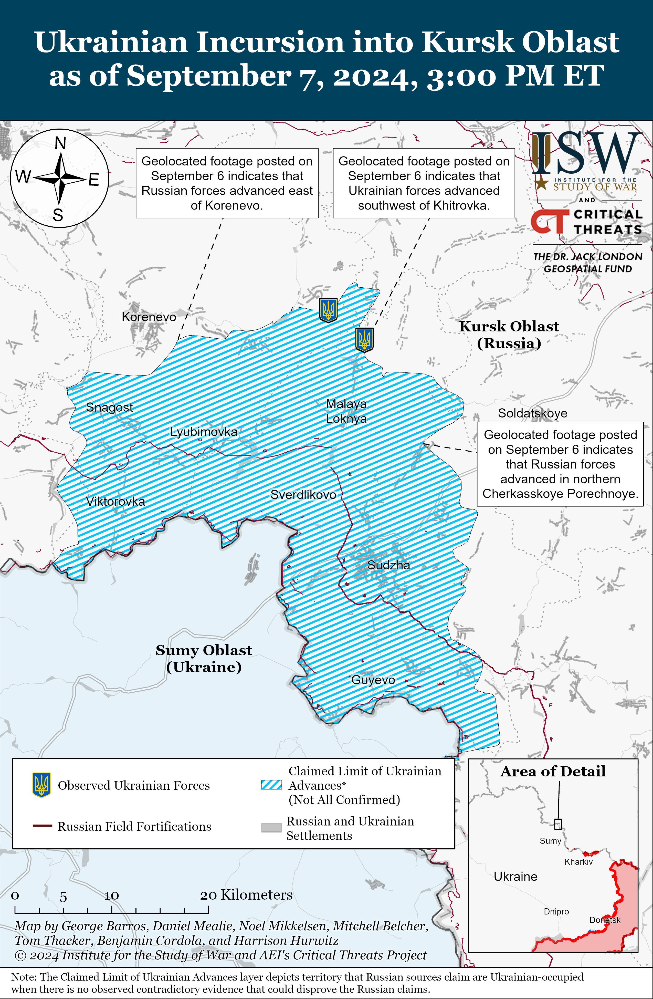
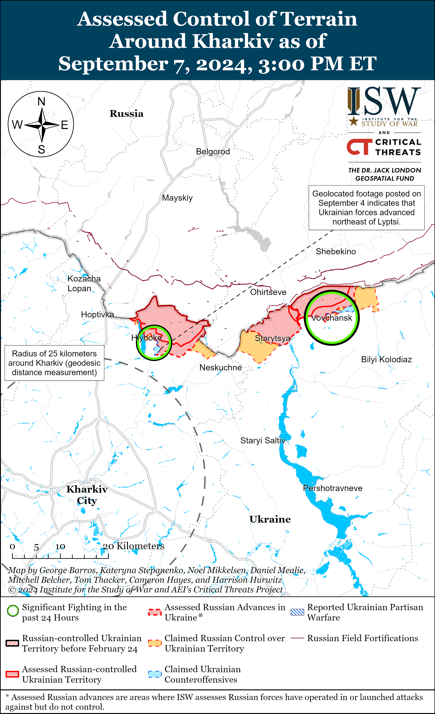
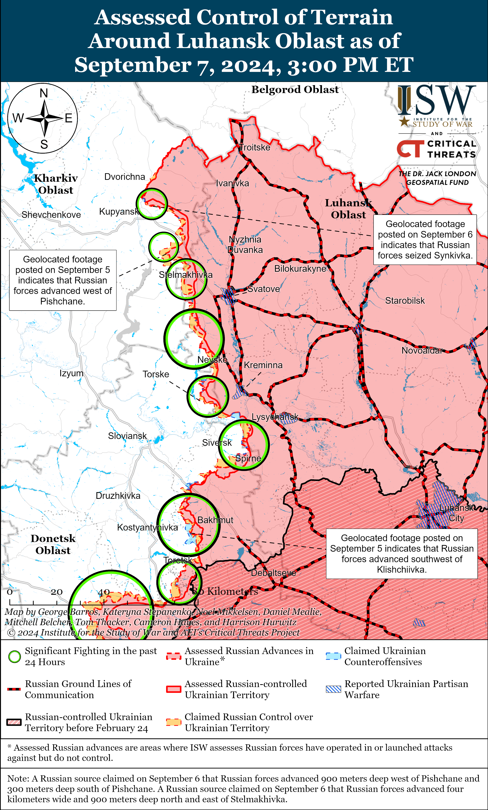
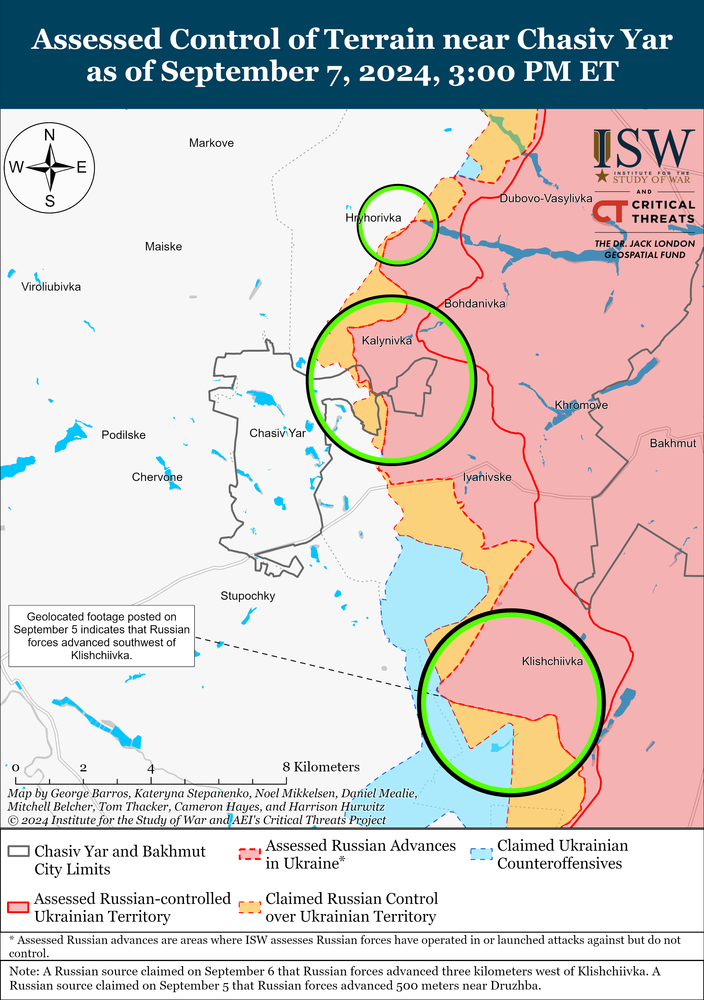
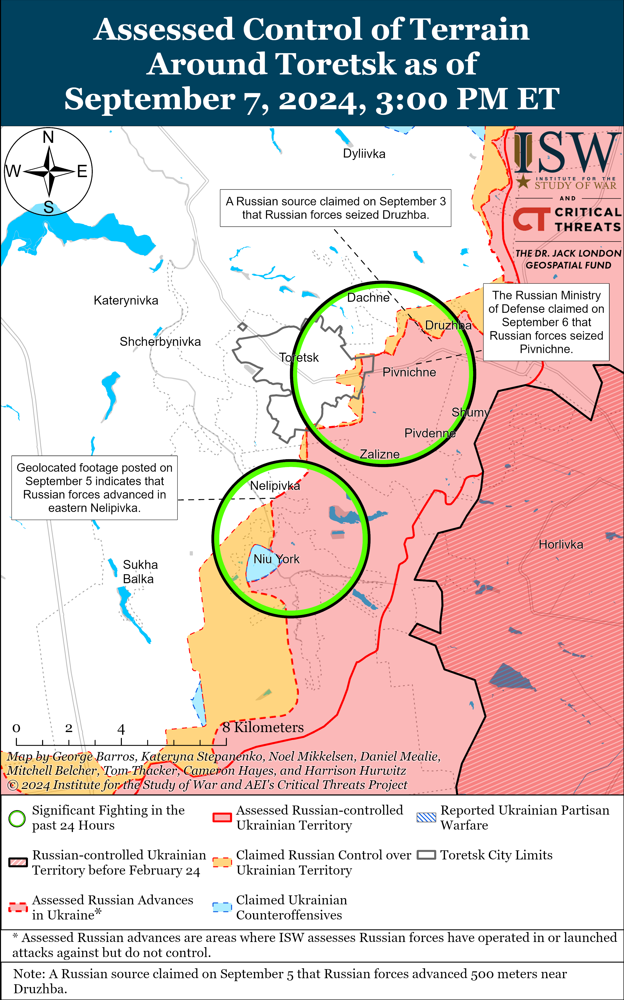
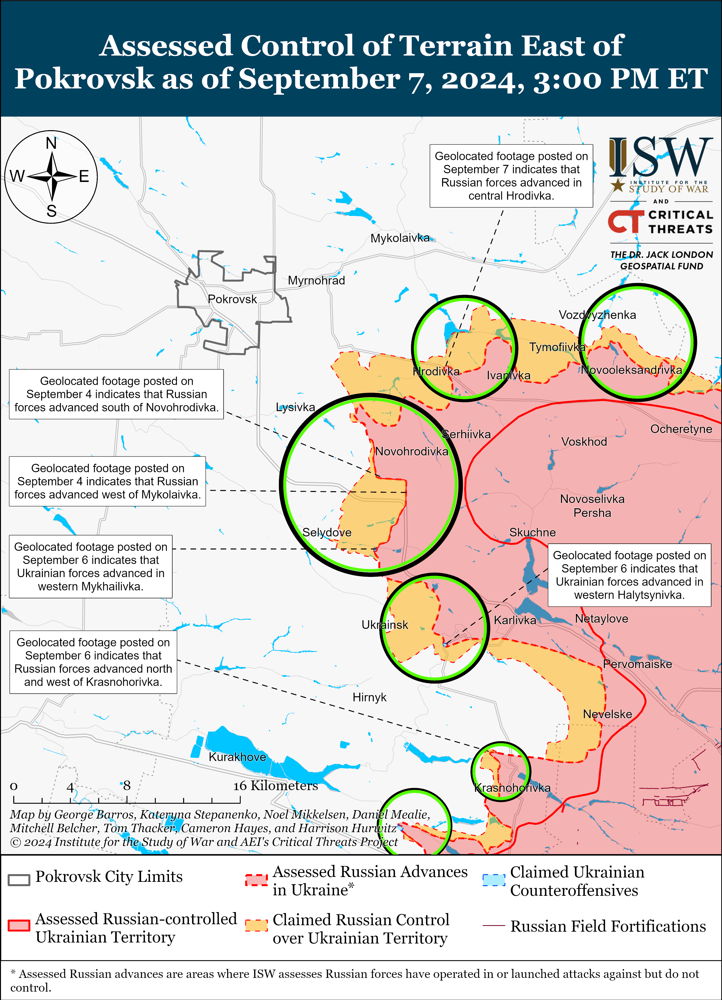
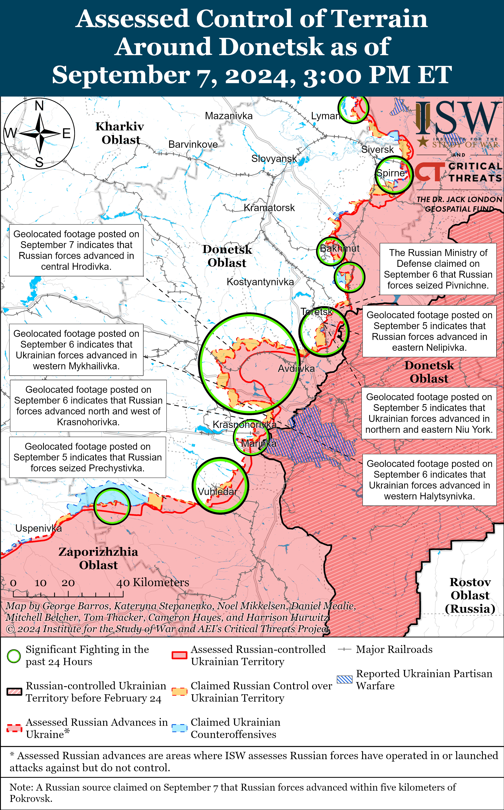
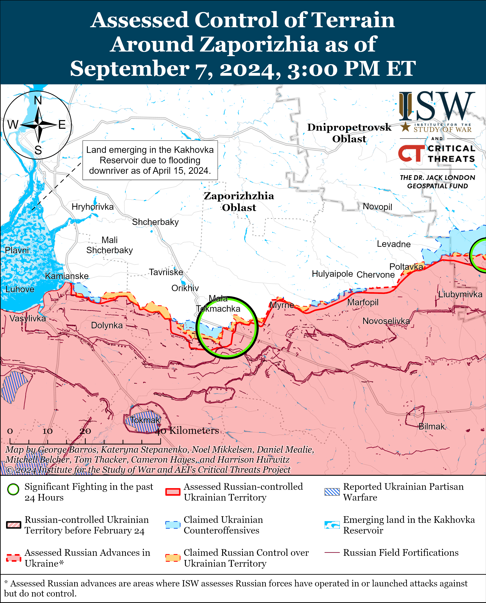
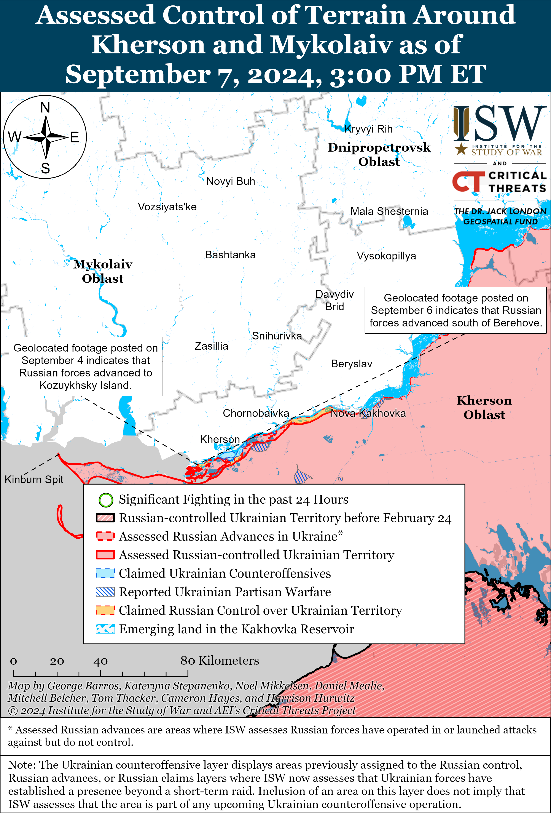

# Russian Offensive Campaign Assessment, September 7, 2024

**Angelica Evans, Christina Harward, Davit Gasparyan, Riley Bailey, and Kateryna Stepanenko**

**September 7, 2024, 5:20pm ET**

**Click** [**here**](https://storymaps.arcgis.com/stories/36a7f6a6f5a9448496de641cf64bd375) **to see ISW’s interactive map of the Russian invasion of Ukraine. This map is updated daily alongside the static maps present in this report.**

**Click** [**here**](https://storymaps.arcgis.com/stories/83a2f24901c941d581c0c523ecd2619b) **to see ISW’s interactive map of Ukraine’s offensive in Kursk Oblast.**

**Click** [**here**](https://understandingwar.maps.arcgis.com/apps/instant/3dviewer/index.html?appid=1602762dbcde419bb957dea358449580) **to see ISW’s 3D control of terrain topographic map of Ukraine. Use of a computer (not a mobile device) is strongly recommended for using this data-heavy tool.**

**Click** [**here**](https://storymaps.arcgis.com/stories/733fe90805894bfc8562d90b106aa895) **to access ISW’s archive of interactive time-lapse maps of the Russian invasion of Ukraine. These maps complement the static control-of-terrain map that ISW produces daily by showing a dynamic frontline. ISW will update this time-lapse map archive monthly.**

**Note: The data cut-off for this product was 12pm ET on September 7. ISW will cover subsequent reports in the September 8 Russian Offensive Campaign Assessment.**

**Ukraine’s Main Military Intelligence Directorate (GUR) Head Lieutenant General Kyrylo Budanov noted that Ukraine’s incursion into Kursk Oblast is having theater-wide impacts on Russian offensive operations in Ukraine and addressed the prospects for continued Russian offensive operations in Winter 2024–2025.** Budanov stated during an interview published on September 7 that the Ukrainian incursion into Kursk Oblast complicated Russia’s plans for offensive operations in August 2024 and later this fall.[1] Budanov noted that the Russian military command is committing any available manpower and equipment to achieve their objective in Russia’s “main direction,” likely referring to the seizure of Pokrovsk, and that Russian forces are focusing their attention on this direction. Russian forces recently intensified offensive operations and made further advances near Pokrovsk and west and southwest of Donetsk City, but ISW has not observed intensified Russian offensive operations in other frontline areas in Ukraine.[2] The Russian military command has almost certainly decided to prioritize Russian advances near Pokrovsk and is committing available manpower and materiel to the area at the expense of Russian offensive operations in other directions.[3] A Russian milblogger claimed that manpower constraints are forcing the Russian military command to adjust their plans in Donetsk and Kursk oblasts and that Russian officials do not have a “systemic solution” to generate the forces necessary to reinforce offensive operations in Ukraine and repel Ukraine‘s incursion into Kursk Oblast.[4] The milblogger noted that Russian advances in the Pokrovsk direction have begun to slow as Russian units are suffering personnel losses and are increasingly understaffed and that Russian forces are continuing offensive operations in the area despite being “exhausted.”[5] The Russian military command will likely be able to funnel enough forces into the area to continue Russia’s ongoing offensive operations and possibly eventually seize Pokrovsk, although Russian forces may culminate before seizing the city.[6]

Budanov noted during the interview that winter weather conditions will likely complicate Russian offensive operations in the coming months, but that this does not mean that Russian forces will completely stop assaults on Ukrainian positions.[7] The fall mud season has historically hampered Russian and Ukrainian ground maneuver, but periods of prolonged freezing temperatures that typically begin in late December freeze the ground and allow armored vehicles to move more easily than in autumn and spring months.[8] Russian forces notably fought to seize the initiative and pursued offensive operations in Fall 2023 during the most challenging weather conditions of the year instead of waiting for improved weather conditions later in Winter 2023–2024, however.[9] Fall and winter weather conditions will likely complicate Russian and Ukrainian battlefield activity but are very unlikely to completely stall activity along the frontline.

**Iran reportedly recently delivered more than 200 Fateh-360 short-range ballistic missiles to Russia.[10]** UK outlet *The Times*, citing a Ukrainian military intelligence source, reported on September 6 that a Russian ship delivered the Fateh-360 missiles to an undisclosed port in the Caspian Sea on September 4. US and European officials recently confirmed that Iran began supplying Russia with short-range ballistic missiles, and ISW assessed that Russian forces will likely use the Iranian-supplied missiles to target Ukrainian energy, military, and civilian infrastructure over the coming fall and winter.[11]

**Ukraine continues to successfully adapt and develop its anti-drone capabilities, allowing Ukrainian forces to leverage lower-end systems to offset Russian pressures on Ukraine’s limited air defense umbrella.** Ukrainian military analyst Petro Chernyk stated on September 7 that Ukrainian electronic warfare (EW) systems are disrupting radar-guided Shahed-136/131 drones, causing the drones to change course and crash after running out of fuel.[12] Ukrainian officials have recently reported that some Russian Shahed drones have not reached their targets for unspecified reasons, but the Ukrainian Air Force acknowledged on August 31 and September 6 that Ukrainian EW affected the drones.[13] Ukrainian drone production company Besomar stated on September 7 that it developed an interceptor drone that can shoot down unspecified Russian drones and that Ukrainian forces are already using these interceptor drones in the combat zone.[14] ISW has also recently observed reports of Ukrainian forces using first-person view (FPV) drones to down Russian helicopters and reconnaissance and strike drones.[15] These Ukrainian countermeasures are part of wider efforts aimed at offsetting the pressure that repeated, large-scale Russian strike series exert on Ukraine’s limited air defense umbrella in the face of delayed and inconsistent deliveries of Western security assistance.[16] Ukraine’s use of EW to counter Shahed drones will notably allow Ukrainian forces to conserve the limited air defense systems and missiles that Ukraine needs to protect against Russian missile strikes targeting Ukrainian frontline areas, critical infrastructure, and major population centers. ISW continues to assess that Russian and Ukrainian forces are engaged in a technological offense-defense race and that Ukraine’s ability to field technological innovations at scale ahead of Russian adaptations is crucial for Ukraine’s ability to offset Russia’s current materiel advantages.[17]

**Key Takeaways:**

- **Ukraine’s Main Military Intelligence Directorate (GUR) Head Lieutenant General Kyrylo Budanov noted that Ukraine’s incursion into Kursk Oblast is having theater-wide impacts on Russian offensive operations in Ukraine and addressed the prospects for continued Russian offensive operations in Winter 2024–2025.**
- **Iran reportedly recently delivered more than 200 Fateh-360 short-range ballistic missiles to Russia.**
- **Ukraine continues to successfully adapt and develop its anti-drone capabilities, allowing Ukrainian forces to leverage lower-end systems to offset Russian pressures on Ukraine’s limited air defense umbrella.**
- **Russian forces recently regained territory and Ukrainian forces recently advanced in Kursk Oblast amid continued Ukrainian offensive operations in the area on September 7.**
- **Russian forces recently advanced near Kupyansk, Pokrovsk, and Donetsk City and in the Dnipro River Delta.**
- **Russian officers continue to mistreat and abuse their subordinates likely due to poor command training and discipline.**

***We do not report in detail on Russian war crimes because these activities are well-covered in Western media and do not directly affect the military operations we are assessing and forecasting. We will continue to evaluate and report on the effects of these criminal activities on the Ukrainian military and the Ukrainian population and specifically on combat in Ukrainian urban areas. We utterly condemn Russian violations of the laws of armed conflict and the Geneva Conventions and crimes against humanity even though we do not describe them in these reports.***

- Ukrainian Operations in the Russian Federation
- Russian Main Effort – Eastern Ukraine (comprised of three subordinate main efforts)
- Russian Subordinate Main Effort #1 – Push Ukrainian forces back from the international border with Belgorod Oblast and approach to within tube artillery range of Kharkiv City
- Russian Subordinate Main Effort #2 – Capture the remainder of Luhansk Oblast and push westward into eastern Kharkiv Oblast and encircle northern Donetsk Oblast
- Russian Subordinate Main Effort #3 – Capture the entirety of Donetsk Oblast
- Russian Supporting Effort – Southern Axis
- Russian Air, Missile, and Drone Campaign
- Russian Mobilization and Force Generation Efforts
- Russian Technological Adaptations
- Activities in Russian-occupied areas
- Ukrainian Defense Industrial Base Efforts
- Russian Information Operations and Narratives
- Significant Activity in Belarus

**Ukrainian Operations in the Russian Federation**

Russian forces recently regained territory and Ukrainian forces recently advanced in Kursk Oblast amid continued Ukrainian offensive operations in the area on September 7. Geolocated footage published September 6 indicates that Ukrainian forces recently advanced to positions south of Khitrovka (north of Sudzha).[18] Geolocated footage published on September 6 indicates that Russian forces recently regained positions southeast of Korenevo and in northern Cherkasskoye Porechnoye (northeast of Sudzha).[19] Ukrainian forces reportedly continued to attack southwest of Korenevo near Snagost, Vishnevka, and Komarovka; near Korenevo; east of Korenevo near Olgovka and Matveyevka; north of Sudzha near Maryevka and Pogrebki; northeast of Sudzha near Martynovka; and southeast of Sudzha near Borki on September 6 and 7.[20] Elements of the of the Russian 155th Naval Infantry Brigade (Pacific Fleet, Eastern Military District [EMD]), 810th Naval Infantry Brigade (Black Sea Fleet, Southern Military District [SMD]), and 83rd Airborne (VDV) Brigade are reportedly operating in the Kursk direction.[21]

Ukrainian forces continue to target Russian ground lines of communications (GLOCs) and Russian military equipment in near rear areas in Kursk Oblast. Geolocated footage published on September 7 shows Ukrainian forces striking a Russian pontoon bridge across the Seim River north of Glushkovo and Zvannoye (both southwest of Korenevo) with likely GMLRS cluster munitions.[22] Additional footage published on September 7 shows Ukrainian forces striking a Russian 9K33 Osa air defense system in an unspecified area of Kursk Oblast.[23]

Ukrainian forces conducted a drone strike against a Russian ammunition depot near Soldatskoye, Voronezh Oblast on the night of September 6 to 7. Ukrainian mediareported on September 7 that sources stated that the Ukrainian Security Service (SBU) conducted the drone strike against the ammunition depot, and geolocated footage shows a fire and secondary detonations near Soldatskoye following the drone strike.[24] Satellite imagery collected on September 7 shows extensive fires and smoke plumes near Soldatskoye, and NASA FIRMS data shows extensive heat anomalies in the area.[25] Voronezh Oblast Governor Alexander Gusev claimed that Russian forces suppressed a Ukrainian drone over Ostrogozhsky Raion, Voronezh Oblast and that the falling drone debris caused a fire and subsequent secondary detonations at a facility with explosive objects.[26] The Head of the Ukrainian Center for Countering Disinformation, Lieutenant Andriy Kovalenko, stated that the Ukrainian drone strike destroyed North Korean-provided KN-23 ballistic missiles at the ammunition depot in Soldatskoye.[27]

**Russian Main Effort – Eastern Ukraine**

**Russian Subordinate Main Effort #1 – Kharkiv Oblast** **(Russian objective: Push Ukrainian forces back from the international border with Belgorod Oblast and approach to within tube artillery range of Kharkiv City)**

Fighting continued north and northeast of Kharkiv City on September 7, but there were no confirmed changes to the frontline. A Russian milblogger claimed that Ukrainian forces conducted a mechanized assault of an unspecified size from the direction of Lyptsi and counterattacked near Hlyboke (both north of Kharkiv City).[28] The Ukrainian General Staff reported that Russian forces continued ground assaults near Lypsti and Vovchansk (northeast of Kharkiv City) on September 6 and 7.[29]

Ukrainian Kharkiv Group of Forces Spokesperson Colonel Vitaly Sarantsev stated on September 7 that Russian forces continue to pursue operational objectives in northern Kharkiv Oblast but that Ukrainian operations in the area and the operational pressures of Ukraine’s incursion into Kursk Oblast are disrupting Russia’s offensive effort.[30] Sarantsev stated that Russian forces retain their goals to create a “buffer zone” in northern Kharkiv Oblast along the international border with Belgorod Oblast and to fix and draw Ukrainian forces to the area. Sarantsev added that Russian forces aim to advance closer to Kharkiv City from the Hlyboke-Lyptsi direction in order to pressure Ukrainian leadership and aim to advance into the rear of the Ukrainian grouping in the Kupyansk direction from Vovchansk. Sarantsev stated that the Russian Northern Grouping of Forces concentrated 30,000 out of 50,000 total personnel for the offensive operation into northern Kharkiv Oblast in early May 2024, but that Ukrainian forces quickly strengthened their grouping in the area and stopped Russian advances. Sarantsev stated that the start of Ukraine’s incursion into Kursk in early August 2024 forced the Russian military to transfer some units from the Kharkiv direction to Kursk Oblast but cautioned that Russian forces retain significant forces and means in northern Kharkiv Oblast. Sarantsev stated that Russian forces are continuing offensive activities northeast of Kharkiv City near Vovchansk, Starytsya, Buhruvatka, Ohirtseve, and Tykhe but are increasingly switching to the defensive in unspecified areas. Sarantsev stated that Russian forces continue attacks in the Hlyboke-Lypsti direction with small assault groups of two to three personnel that storm Ukrainian positions from multiple directions at once. Sarantsev stated that Russian forces dig trenches and dugouts immediately when they consolidate at a new position in northern Kharkiv Oblast. Sarantsev stated that the decreased tempo of Russian aviation operations in northern Kharkiv Oblast continues, and that Russian aircraft now conduct a few or no glide bomb strikes every day as compared to 30 to 50 daily glide bomb strikes at the start of the Russian offensive operation in northern Kharkiv Oblast.

**Russian Subordinate Main Effort #2 – Luhansk Oblast** **(Russian objective: Capture the remainder of Luhansk Oblast and push westward into eastern Kharkiv Oblast and northern Donetsk Oblast)**

Russian forces recently advanced amid continued Russian offensive operations along the Kupyansk-Svatove-Kreminna line on September 7. Geolocated footage published on September 6 indicates that Russian forces recently advanced within southern Synkivka (northeast of Kupyansk) and seized the settlement.[31] The Russian Ministry of Defense (MoD) claimed that Russian forces seized Synkivka on August 30.[32] Russian milbloggers claimed that Russian forces advanced two kilometers from Pishchane (northwest of Svatove) towards Kolisnykivka (immediately west of Pishchane) and advanced southwest of Ploshchanka (northwest of Kreminna), but ISW has not observed confirmation of these claims.[33] Russian forces continued offensive operations northeast of Kupyansk near Synkivka; northwest of Svatove near  Stelmakhivka, Hlushkivka, and Berestove and in the direction of Lozova; west of Svatove near Andriivka; southwest of Svatove near Cherneshchyna, Novoyehorivka, and Druzhelyubivka; northwest of Kreminna near Nevske and Makiivka; west of Kreminna near Torske and Terny; and southwest of Kreminna near Dibrova on September 6 and 7.[34]

**Russian Subordinate Main Effort #3 – Donetsk Oblast** **(Russian objective: Capture the entirety of Donetsk Oblast, the claimed territory of Russia’s proxies in Donbas)**

Russian forces continued assaults east of Siversk near Verkhnokamyanske and southeast of Siversk near Spirne and Vyimka on September 6 and 7, but there were no confirmed changes to the frontline.[35]

Russian forces continued offensive operations near Chasiv Yar on September 7, but there were no confirmed changes to the frontline. Russian milbloggers claimed that Russian forces advanced 700 meters deep in western Kalynivka (north of Chasiv Yar) and advanced west of Klishchiivka (south of Chasiv Yar), but ISW has not observed visual confirmation of these claims.[36] Russian forces also continued offensive operations near Chasiv Yar itself, north of Chasiv Yar near Hryhorivka, and south of Chasiv Yar near Andriivka on September 6 and 7.[37] Elements of the Russian 200th Separate Motorized Rifle Brigade (14th Army Corps [AC], Leningrad Military District [LMD]) reportedly continue to operate near Chasiv Yar.[38]

Ukrainian forces recently conducted a counterattack in northwestern Niu York (south of Toretsk) amid continued Russian offensive operations near Toretsk on September 7. Geolocated footage published on September 7 indicates that Ukrainian forces recently counterattacked in northwestern Niu York and maintain positions in the settlement.[39] A Russian milblogger claimed that Russian forces advanced in northwestern Niu York (south of Toretsk), but ISW has not observed confirmation of this claim.[40] Russian forces continued assaults near Toretsk and south of Toretsk near Nelipivka and Niu York and towards Sukha Balka on September 6 and 7.[41]

Russian forces recently advanced east and southeast of Pokrovsk and continued offensive operations in the area on September 7. Geolocated footage published on September 7 shows Russian servicemembers assaulting a group of Ukrainian servicemembers in an armored vehicle in central Hrodivka (east of Pokrovsk), indicating that Russian forces have advanced into the central part of the town.[42] Additional geolocated footage published on September 6 and 7 indicates that Russian forces operating southeast of Pokrovsk recently marginally advanced in northwestern and western Mykhailivka (just east of Selydove), south of Mykhailivka, and just south of Novohrodivka.[43] Russian milbloggers claimed that Russian forces seized Lysivka (southeast of Pokrovsk), advanced in eastern and southern Ukrainsk (southeast of Pokrovsk and southeast of Selydove), and are advancing towards Hirnyk (further south of Ukrainsk).[44] ISW has not observed confirmation of these claims, however. The Russian Ministry of Defense (MoD) claimed that elements of the Russian Central Grouping of Forces recently seized one of the two settlements named Kalynove in the area but did not specify which settlement.[45] The Russian MoD is likely claiming the seizure of the settlement that is southeast of Pokrovsk (east of Mykhailivka), which ISW assessed Russian forces seized as of August 27.[46]  A Russian milblogger claimed that Russian forces operating southeast of Pokrovsk are concentrating their assaults on the tactical heights between Tsukuryne and Hirnyk and are trying to advance in this area to avoid conducting frontal assaults against Ukrainian forces in Ukrainsk.[47] Russian forces also continued assaults east of Pokrovsk near Vozdvyzhenka, Zelene Pole, and Myrolyubivka; and southeast of Pokrovsk towards Novotroitske and near Selydove, Mykhailivka, Zhelanne Pershe, and Halytsynivka.[48] Russian milbloggers amplified footage claiming to show a Russian missile striking a bridge on the eastern outskirts of Selydove and noted that Russian forces are attempting to complicate Ukrainian logistics in the area.[49]

Russian forces recently advanced west of Donetsk City amid continued Russian offensive operations in the area on September 7. Geolocated footage published on September 6 indicates that Russian forces recently advanced within northern Krasnohorivka and further north of the settlement.[50] A Russian milblogger claimed that Russian forces also advanced west of Krasnohorivka, but ISW has not observed confirmation of this claim.[51] Russian forces continued offensive operations near Krasnohorivka, Maskymilyanivka, and Heorhiivka on September 6 and 7.[52]  Elements of the Russian “Kaira” Detachment (39th Motorized Rifle Brigade, 68th AC, Eastern Military District [EMD]), the “Solnyshko” detachment (68th AC), and other unspecified elements of the 68th AC are reportedly operating in the south Donetsk direction (west and southwest of Donetsk City).[53]

Russian forces continued offensive operations southwest of Donetsk City on September 7, but there were no confirmed changes to the frontline. Russian forces conducted offensive operations near Kostyantynivka, Vodyane, and Vuhledar on September 6 and 7.[54] A Russian milblogger claimed that Russian forces’ main task in the Vuhledar direction is to clear the Pivdennodonbaska mine area (east of Vuhledar) but that Ukrainian positions on the outskirts of Vuhledar are complicating this effort.[55] Elements of the Russian 238th Artillery Brigade (8th Combined Arms Army [CAA], Southern Military District [SMD]); the 20th Motorized Rifle Division (8th CAA), including its 944th Self-Propelled Artillery Regiment; and the “Grachi” Spetsnaz detachment are reportedly operating near Antonivka.[56]

The Ukrainian General Staff reported that Russian forces attacked in the Donetsk-Zaporizhia Oblast border area near Staromayorske (south of Velyka Novosilka) on September 6 and 7.[57]

**Russian Supporting Effort – Southern Axis** **(Russian objective: Maintain frontline positions and secure rear areas against Ukrainian strikes)**

Russian forces continued assaults in western Zaporizhia Oblast on September 7, but there were no confirmed changes to the frontline. The Ukrainian General Staff reported that Russian forces attacked near Mala Tokmachka (north of Robotyne) on September 7.[58] A Russian milblogger claimed that Russian forces advanced near Robotyne and Novopokrovka (northeast of Robotyne), but ISW has not observed confirmation of these claims.[59] Artillerymen and drone operators of the Russian 42nd Motorized Rifle Division (58th Combined Arms Army [CAA], Southern Military District [SMD]), including its 50th Self-Propelled Artillery Regiment, are reportedly striking Ukrainian forces north of Robotyne.[60]

Russian forces recently advanced on the islands in the Dnipro River Delta amid continued positional engagements in east (left) bank Kherson Oblast on September 6 and 7.[61] Geolocated footage published on September 4 indicates that Russian forces recently advanced on an island south of Berehove (southwest of Kherson City).[62]  Elements of the Russian 337th Airborne (VDV) Regiment (104th VDV Division) are reportedly operating in the Kherson direction.[63]

**Russian Air, Missile, and Drone Campaign** **(Russian Objective: Target Ukrainian military and civilian infrastructure in the rear and on the frontline)**

Russian forces conducted a series of drone strikes against Ukraine on the night of September 6 to 7. The Ukrainian Air Force reported that Russian forces launched 67 Shahed-136/131 drones from Kursk Oblast; Yeysk, Krasnodar Krai; and occupied Cape Chauda, Crimea and that Ukrainian forces shot down 58 drones over Vinnytsia, Rivne, Khmelnytskyi, Kyiv, Kirovohrad, Mykolaiv, Chernihiv, Cherkasy, Sumy, Kherson, and Poltava oblasts.[64] The Kyiv City Military Administration reported that drone debris fell in Pecherskyi and Dniprovskyi raions.[65] The Ukrainian Verkhovna Rada reported that drone debris fell near the Verkhovna Rada building in Kyiv City but did not cause damage.[66] Russian sources claimed on September 6 that Russian forces conducted an Iskander missile strike against a hotel in Zaporizhzhia City.[67]

**Russian Mobilization and Force Generation Efforts** **(Russian objective: Expand combat power without conducting general mobilization)**

Russian officers continue to mistreat and abuse their subordinates likely due to poor command training and discipline. A Russian source claimed on September 6 that a Russian battalion commander and the chief of staff of the 54th Motorized Rifle Regiment (3rd Army Corps [AC]) are physically abusing their subordinates and extorting money from them.[68] The source also claimed that the officers demand monthly bribes and allow their subordinates to purchase combat orders and leave the unit for additional fees. The source posted footage and imagery purporting to show the abuse.

**Russian Technological Adaptations** **(Russian objective: Introduce technological innovations to optimize systems for use in Ukraine)**

Kremlin newswire *TASS* claimed on September 7 that Russian specialists from the Stupor anti-drone software development company developed a “sliding interference” technology that causes Ukrainian drones to lose contact with their operators.[69] A Stupor representative claimed on the fields of the All-Russian gathering of combat drone operators ”Dronnitsa -2024” that the “sliding interference” creates “echelon protection” that allows Russian forces to more easily target Ukrainian drone frequencies, which are constantly changing. Russian forces are reportedly testing the technology in the Zaporizhia direction in Ukraine.

Russian First Deputy Prime Minister Denis Manturov visited the Aero-HIT drone production facility in Khabarovsk, Khabarovsk Krai on September 6 and inspected the “Veles” modular first-person view (FPV) drone.[70] Russian forces can reportedly use the “Veles” FPV drone as a strike and reconnaissance drone, and the drone includes an interference-proof communication channel. Aero-HIT reportedly plans to expand the production of “Veles” drones from the current rate of 1,500 per month to 15,000 per month starting from January 2025. A *DW* investigation recently found that Russian drone operators have been using  ”Veles” drones in test strikes against civilians in Beryslav, west (right) bank Kherson Oblast.[71]

Russian tank manufacturer Uralvagonzavod claimed on September 7 that it delivered a new batch of T-90M tanks equipped with anti-drone electronic warfare (EW) capabilities and “cape” radio-absorbing stealth technology to the Russian army.[72]

**Ukrainian Defense Industrial Efforts** **(Ukrainian objective: Develop its defense industrial base to become more self-sufficient in cooperation with US, European, and international partners)**

*ISW is suspending publishing coverage of Ukrainian defense industrial efforts until further notice.*

**Activities in Russian-occupied areas** **(Russian objective: Consolidate administrative control of annexed areas; forcibly integrate Ukrainian citizens into Russian sociocultural, economic, military, and governance systems)**

*ISW is not publishing coverage of occupied areas today.*

**Russian Information Operations and Narratives**

Russian officials attempted to demonstrate Russian unity and support for Russian federal subjects (regions) bordering Ukraine to downplay the ongoing Ukrainian incursion into Kursk Oblast. Russian Central Election Commission (CEC) Chairperson Ella Pamfilova claimed on September 7 that the highest turnout in the State Duma by-elections for single-member constituencies was in Bryansk Oblast and that the highest turnout in the elections of regional heads was in Kursk and Kemerovo oblasts.[73] Pamfilova claimed that the high voter turnout in Kursk Oblast reflected the residents’ response to the Ukrainian incursion in the region. Russian President Vladimir Putin claimed on September 7 during his speech honoring Moscow City Day that Moscow continues to support occupied Donetsk and Luhansk oblasts and Russian regions on the Russian-Ukrainian border, likely in a deliberate attempt to portray the Kremlin and Moscow as aware of the situation in Kursk Oblast.[74] Putin’s statement contrasts with the subpar response of Russian authorities to the Ukrainian incursion into Kursk Oblast, which Putin has often ignored or downplayed, leading to large-scale, chaotic evacuations from the very border regions he ostensibly cares for.[75]

**Significant activity in Belarus** **(Russian efforts to increase its military presence in Belarus and further integrate Belarus into Russian-favorable frameworks and Wagner Group activity in Belarus)**

Nothing significant to report.

**Note: ISW does not receive any classified material from any source, uses only publicly available information, and draws extensively on Russian, Ukrainian, and Western reporting and social media as well as commercially available satellite imagery and other geospatial data as the basis for these reports. References to all sources used are provided in the endnotes of each update.**

---

[1] https://www.youtube.com/watch?v=FskyzaW5iRs ; https://suspilne dot media/831325-ocilnik-gur-armia-rosii-pripinila-nastup-majze-na-vsih-dilankah-frontu/

[2] https://isw.pub/UkrWar090524

[3] https://isw.pub/UkrWar090524 ; https://isw.pub/UkrWar082724

[4] https://t.me/voenkorKotenok/58861

[5] https://t.me/voenkorKotenok/58859

[6] https://understandingwar.org/backgrounder/russian-offensive-campaign-assessment-august-17-2024

[7] https://www.youtube.com/watch?v=FskyzaW5iRs ; https://suspilne dot media/831325-ocilnik-gur-armia-rosii-pripinila-nastup-majze-na-vsih-dilankah-frontu/

[8] https://understandingwar.org/backgrounder/russian-offensive-campaign-assessment-december-21-2023 ; https://isw.pub/UkrWar120422 ; https://isw.pub/UkrWar120923

[9] https://isw.pub/UkrWar120923

[10] https://www.thetimes.com/uk/defence/article/ballistic-clmpm3d7m

[11] https://understandingwar.org/backgrounder/russian-offensive-campaign-assessment-september-6-2024

[12] https://armyinform dot com.ua/2024/09/07/padayut-abo-letyat-na-rosiyu-ekspert-prokomentuvav-zminu-povedinky-shahediv/ ; https://www.youtube.com/watch?v=JFvyCBahZ\_k

[13] https://understandingwar.org/backgrounder/russian-offensive-campaign-assessment-september-6-2024;

https://understandingwar.org/backgrounder/russian-offensive-campaign-assessment-september-5-2024 ; https://understandingwar.org/backgrounder/russian-offensive-campaign-assessment-september-4-2024 ; https://understandingwar.org/backgrounder/russian-offensive-campaign-assessment-september-3-2024 ; https://understandingwar.org/backgrounder/russian-offensive-campaign-assessment-september-2-2024 ; https://understandingwar.org/backgrounder/russian-offensive-campaign-assessment-august-30-2024 ; https://understandingwar.org/backgrounder/russian-offensive-campaign-assessment-august-29-2024; https://t.me/kpszsu/18539

[14] https://mil.in dot ua/uk/news/v-ukrayini-rozrobyly-perehoplyuvach-bpla-litakovogo-typu/ ; https://youtu.be/0GqCgb60qIw?si=vWeCEhP17HuzrKqQ

[15] https://isw.pub/UkrWar08072024

[16] https://isw.pub/UkrWar090624; https://isw.pub/UkrWar08072024

[17] https://isw.pub/UkrWar042524 ; https://isw.pub/UkrWar052524 ; https://isw.pub/UkrWar060424 ; https://understandingwar.org/backgrounder/russian-offensive-campaign-assessment-july-7-2024; https://understandingwar.org/backgrounder/russian-offensive-campaign-assessment-august-7-2024

[18] https://t.me/creamy\_caprice/6676?single; https://t.me/RVvoenkor/76490

[19] https://t.me/BRAVO\_Team\_chanel/71; https://t.me/creamy\_caprice/6692; https://x.com/blinzka/status/1832354078447341618; https://x.com/blinzka/status/1832354566886605301 ; https://t.me/creamy\_caprice/6682; https://t.me/khornegroup/2642

[20] https://t.me/warhistoryalconafter/183355 ; https://t.me/rusich\_army/17001 ;  https://t.me/rybar/63316 ; https://t.me/mod\_russia/43071  ; https://t.me/dva\_majors/51827; https://t.me/belarusian\_silovik/40698

[21] https://t.me/rusich\_army/17004 ; https://t.me/boris\_rozhin/136468 ; https://t.me/boris\_rozhin/136511 ; https://t.me/RVvoenkor/76545 ; https://t.me/boris\_rozhin/136469

[22] https://t.me/WarArchive\_ua/19723; https://t.me/ua\_regteam/135; https://t.me/ButusovPlus/13401

[23] https://t.me/ua\_regteam/135 ; https://armyinform.com dot ua/2024/09/07/hody-po-vodi-i-na-zhalys-syly-oborony-znyshhyly-dvi-pontonni-perepravy-voroga-i-zrk-osa/ ; https://t.me/ButusovPlus/13401 ; https://mil.in dot ua/uk/news/syly

[24] https://t.me/RBC\_ua\_news/110221 ; https://mil.in dot ua/uk/news/udarni-bezpilotnyky-urazyly-sklad-z-boyeprypasamy-u-voronezkij-oblasti/ ; https://x.com/bayraktar\_1love/status/1832276164838056413; https://x.com/bayraktar\_1love/status/1832276336242569697 ; https://kyivindependent dot com/ukrainian-drones-hit-ammunition-warehouse-in-russias-voronezh-oblast-source-confirms/

[25] https://x.com/georgewbarros/status/1832432595369423276 ; https://x.com/EuromaidanPress/status/1832420621629694063

[26] https://t.me/gusev\_36/2730; https://t.me/gusev\_36/2732

[27] https://t.me/akovalenko1989/7823

[28] https://t.me/DnevnikDesantnika/15088

[29] https://www.facebook.com/GeneralStaff.ua/posts/pfbid02bknSp5vCxzExdCbGcG6v159ELaoCSFAvhVa7e1duwu9mq9WrD2dRRwyfxNdDyxdxl ; https://www.facebook.com/GeneralStaff.ua/posts/pfbid0W4RcjUPDvJ5cp6gMudRfn2JgrtMBXs6oaijxPEC6614vjn7vRXZTVW2yuRAsaaygl ; https://www.facebook.com/GeneralStaff.ua/posts/pfbid0G6Jber7wSBaNcGiCCHgGBGt6yQhHfLM7LnmkyW8eDmdRvfk6S6Ch3ThktwEz5gtel

[30] https://armyinform.com dot ua/2024/09/07/harkivshhyna-yak-druga-syriya-rechnyk-otu-harkiv-nazvav-najmerzennishu-metu-zastosuvannya-kabiv-intervyu/ ; https://armyinform.com dot ua/2024/09/07/u-vovchansku-boyi-tochatsya-vseredyni-bagatopoverhivok/ ; https://armyinform.com dot ua/2024/09/07/v-zsu-rozpovily-pro-zastosuvannya-rosiyanamy-kabiv-yak-zaminnyka-dalekobijnoyi-artyleriyi/

[31] https://t.me/creamy\_caprice/6675; https://t.me/UkrArmy3/1016

[32] https://understandingwar.org/backgrounder/russian-offensive-campaign-assessment-august-30-2024

[33] https://t.me/DnevnikDesantnika/15092; https://t.me/boris\_rozhin/136500; https://t.me/z\_arhiv/28019

[34] https://www.facebook.com/GeneralStaff.ua/posts/pfbid02bknSp5vCxzExdCbGcG6v159ELaoCSFAvhVa7e1duwu9mq9WrD2dRRwyfxNdDyxdxl; https://www.facebook.com/GeneralStaff.ua/posts/pfbid0W4RcjUPDvJ5cp6gMudRfn2JgrtMBXs6oaijxPEC6614vjn7vRXZTVW2yuRAsaaygl ; https://www.facebook.com/GeneralStaff.ua/posts/pfbid0G6Jber7wSBaNcGiCCHgGBGt6yQhHfLM7LnmkyW8eDmdRvfk6S6Ch3ThktwEz5gtel

[35] https://www.facebook.com/GeneralStaff.ua/posts/pfbid02bknSp5vCxzExdCbGcG6v159ELaoCSFAvhVa7e1duwu9mq9WrD2dRRwyfxNdDyxdxl ; https://www.facebook.com/GeneralStaff.ua/posts/pfbid0W4RcjUPDvJ5cp6gMudRfn2JgrtMBXs6oaijxPEC6614vjn7vRXZTVW2yuRAsaaygl ; https://www.facebook.com/GeneralStaff.ua/posts/pfbid0G6Jber7wSBaNcGiCCHgGBGt6yQhHfLM7LnmkyW8eDmdRvfk6S6Ch3ThktwEz5gtel

[36] https://t.me/RVvoenkor/76522 ; https://t.me/dva\_majors/51799

[37] https://www.facebook.com/GeneralStaff.ua/posts/pfbid0G6Jber7wSBaNcGiCCHgGBGt6yQhHfLM7LnmkyW8eDmdRvfk6S6Ch3ThktwEz5gtel ; https://www.facebook.com/GeneralStaff.ua/posts/pfbid0W4RcjUPDvJ5cp6gMudRfn2JgrtMBXs6oaijxPEC6614vjn7vRXZTVW2yuRAsaaygl ; https://www.facebook.com/GeneralStaff.ua/posts/pfbid02bknSp5vCxzExdCbGcG6v159ELaoCSFAvhVa7e1duwu9mq9WrD2dRRwyfxNdDyxdxl ; https://t.me/wargonzo/21954

[38] https://t.me/RVvoenkor/76542

[39] https://x.com/Deepstate\_UA/status/1832416237579653554 ; https://www.facebook.com/watch/?v=1210138846703900 ; https://x.com/klinger66/status/1832422334302654673

[40] https://t.me/voenkorKotenok/58870

[41] https://www.facebook.com/GeneralStaff.ua/posts/pfbid0G6Jber7wSBaNcGiCCHgGBGt6yQhHfLM7LnmkyW8eDmdRvfk6S6Ch3ThktwEz5gtel ; https://www.facebook.com/GeneralStaff.ua/posts/pfbid0W4RcjUPDvJ5cp6gMudRfn2JgrtMBXs6oaijxPEC6614vjn7vRXZTVW2yuRAsaaygl ; https://www.facebook.com/GeneralStaff.ua/posts/pfbid02bknSp5vCxzExdCbGcG6v159ELaoCSFAvhVa7e1duwu9mq9WrD2dRRwyfxNdDyxdxl

[42] https://t.me/creamy\_caprice/6693?single; https://t.me/btr80/20189  ; https://t.me/boris\_rozhin/136491

[43] https://t.me/WarArchive\_ua/19718; https://t.me/jagers68/151; https://t.me/creamy\_caprice/6681 ; https://t.me/creamy\_caprice/6697; https://t.me/ghost\_of\_khortytsia/139 ; https://x.com/small10space/status/1832024448519594072; https://x.com/AudaxonX/status/1832483412298375190 ; https://x.com/small10space/status/1832472310776815872; https://x.com/Bielitzling/status/1832480481868443945

[44] https://t.me/z\_arhiv/28014 ; https://t.me/rybar/63315 ; https://t.me/RVvoenkor/76515 ; https://t.me/voenkorKotenok/58859 ; https://t.me/NeoficialniyBeZsonoV/39465 ; https://t.me/milinfolive/130105

[45] https://t.me/mod\_russia/43069

[46] https://understandingwar.org/backgrounder/russian-offensive-campaign-assessment-august-27-2024

[47] https://t.me/voenkorKotenok/58850

[48] https://t.me/rybar/63315 ; https://t.me/RVvoenkor/76483 ; https://t.me/wargonzo/21954 ; https://www.facebook.com/GeneralStaff.ua/posts/pfbid02bknSp5vCxzExdCbGcG6v159ELaoCSFAvhVa7e1duwu9mq9WrD2dRRwyfxNdDyxdxl ; https://www.facebook.com/GeneralStaff.ua/posts/pfbid0W4RcjUPDvJ5cp6gMudRfn2JgrtMBXs6oaijxPEC6614vjn7vRXZTVW2yuRAsaaygl ; https://www.facebook.com/GeneralStaff.ua/posts/pfbid0G6Jber7wSBaNcGiCCHgGBGt6yQhHfLM7LnmkyW8eDmdRvfk6S6Ch3ThktwEz5gtel

[49] https://t.me/RVvoenkor/76548 ; https://t.me/milinfolive/130107

[50] https://t.me/creamy\_caprice/6672?single ; https://t.me/privet\_iz\_doma152/10147   ; https://t.me/z\_arhiv/28013?single ; https://t.me/creamy\_caprice/6678?single ; https://t.me/filatovcorr/3890 ; https://t.me/filatovcorr/3893

[51] https://t.me/rybar/63315

[52] https://www.facebook.com/GeneralStaff.ua/posts/pfbid02bknSp5vCxzExdCbGcG6v159ELaoCSFAvhVa7e1duwu9mq9WrD2dRRwyfxNdDyxdxl; https://www.facebook.com/GeneralStaff.ua/posts/pfbid0W4RcjUPDvJ5cp6gMudRfn2JgrtMBXs6oaijxPEC6614vjn7vRXZTVW2yuRAsaaygl; https://www.facebook.com/GeneralStaff.ua/posts/pfbid0G6Jber7wSBaNcGiCCHgGBGt6yQhHfLM7LnmkyW8eDmdRvfk6S6Ch3ThktwEz5gtel; https://t.me/rybar/63315; https://t.me/notes\_veterans/19345; https://t.me/warhistoryalconafter/183355

[53] https://t.me/voin\_dv/10673

[54] https://www.facebook.com/GeneralStaff.ua/posts/pfbid02bknSp5vCxzExdCbGcG6v159ELaoCSFAvhVa7e1duwu9mq9WrD2dRRwyfxNdDyxdxl; https://www.facebook.com/GeneralStaff.ua/posts/pfbid0W4RcjUPDvJ5cp6gMudRfn2JgrtMBXs6oaijxPEC6614vjn7vRXZTVW2yuRAsaaygl; https://www.facebook.com/GeneralStaff.ua/posts/pfbid0G6Jber7wSBaNcGiCCHgGBGt6yQhHfLM7LnmkyW8eDmdRvfk6S6Ch3ThktwEz5gtel

[55] https://t.me/wargonzo/21952

[56] https://t.me/nm\_dnr/12678

[57] https://www.facebook.com/GeneralStaff.ua/posts/pfbid0W4RcjUPDvJ5cp6gMudRfn2JgrtMBXs6oaijxPEC6614vjn7vRXZTVW2yuRAsaaygl; https://www.facebook.com/GeneralStaff.ua/posts/pfbid0G6Jber7wSBaNcGiCCHgGBGt6yQhHfLM7LnmkyW8eDmdRvfk6S6Ch3ThktwEz5gtel

[58] https://www.facebook.com/GeneralStaff.ua/posts/pfbid0W4RcjUPDvJ5cp6gMudRfn2JgrtMBXs6oaijxPEC6614vjn7vRXZTVW2yuRAsaaygl

[59] https://t.me/DnevnikDesantnika/15090

[60] https://t.me/RVvoenkor/76493

[61] https://t.me/SJTF\_Odes/11264; https://www.facebook.com/GeneralStaff.ua/posts/pfbid0G6Jber7wSBaNcGiCCHgGBGt6yQhHfLM7LnmkyW8eDmdRvfk6S6Ch3ThktwEz5gtel ; https://www.facebook.com/GeneralStaff.ua/posts/pfbid0W4RcjUPDvJ5cp6gMudRfn2JgrtMBXs6oaijxPEC6614vjn7vRXZTVW2yuRAsaaygl; https://www.facebook.com/GeneralStaff.ua/posts/pfbid02bknSp5vCxzExdCbGcG6v159ELaoCSFAvhVa7e1duwu9mq9WrD2dRRwyfxNdDyxdxl

[62] https://x.com/Ryan72101/status/1832159165935968587; https://t.me/jahznebes/99

[63] https://t.me/boris\_rozhin/136472

[64] https://t.me/kpszsu/18984

[65] https://t.me/VA\_Kyiv/7880; https://suspilne dot media/830983-rosijski-vijska-bezpilotnikami-atakuvali-kiiv/

[66] https://t.me/verkhovnaradaofukraine/28633

[67] https://t.me/tass\_agency/271124; https://t.me/DnevnikDesantnika/15091

[68] https://vk dot com/wall-222744818\_6252 ; https://x.com/666\_mancer/status/1832356165281370438 ; https://x.com/666\_mancer/status/1832356439324598369 ; https://x.com/666\_mancer/status/1832356671059853694

[69] https://t.me/tass\_agency/271218; https://nauka dot tass.ru/nauka/21801181?utm\_source=google.com&utm\_medium=organic&utm\_campaign=google.com&utm\_referrer=google.com

[70] https://t.me/bpla\_veles/53; http://government dot ru/news/52615/

[71] https://www.youtube.com/watch?app=desktop&si=xqVFWRPQ9WIzYZye&v=kuTo94TnMPo&feature=youtu.be

[72] https://t.me/uvznews/2737?single; https://mil dot in.ua/uk/news/uralvagonzavod-peredav-armiyi-rf-novu-partiyu-t-90m/  ; https://tass dot ru/armiya-i-opk/21798725

[73] https://t.me/tass\_agency/271175 ; https://t.me/tass\_agency/271170

[74] http://kremlin dot ru/events/president/news/75054

[75] https://understandingwar.org/backgrounder/russian-offensive-campaign-assessment-august-19-2024; https://understandingwar.org/backgrounder/russian-offensive-campaign-assessment-august-20-2024; https://isw.pub/UkrWar080824
