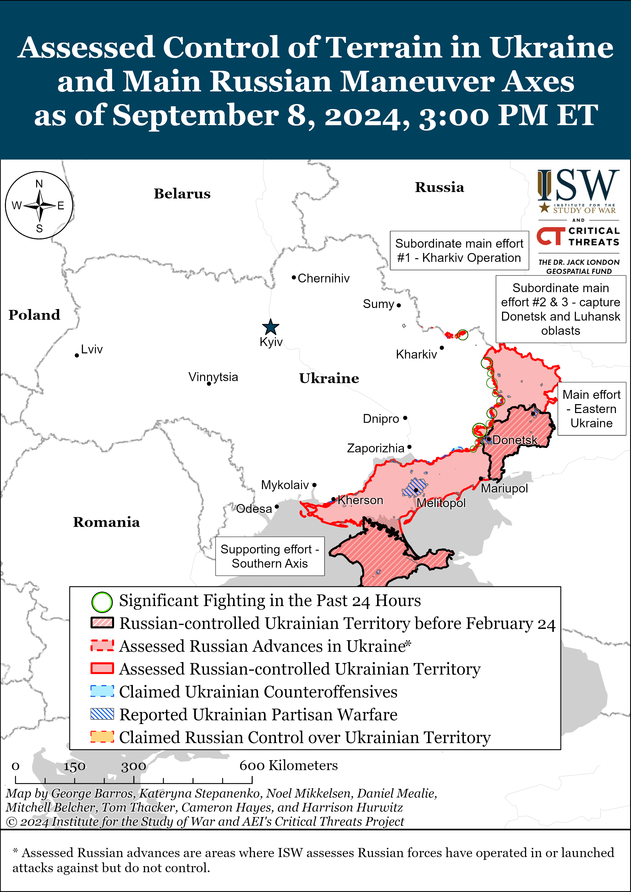
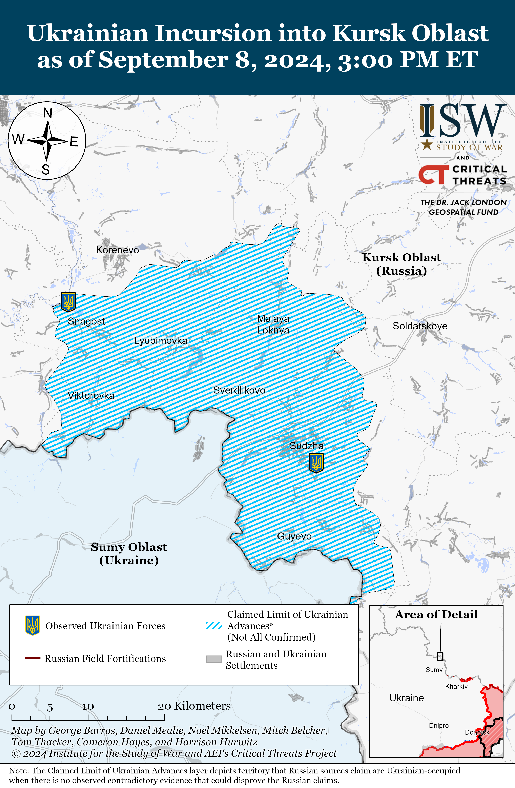
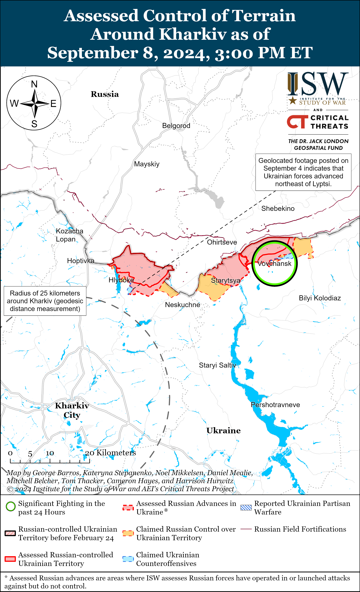
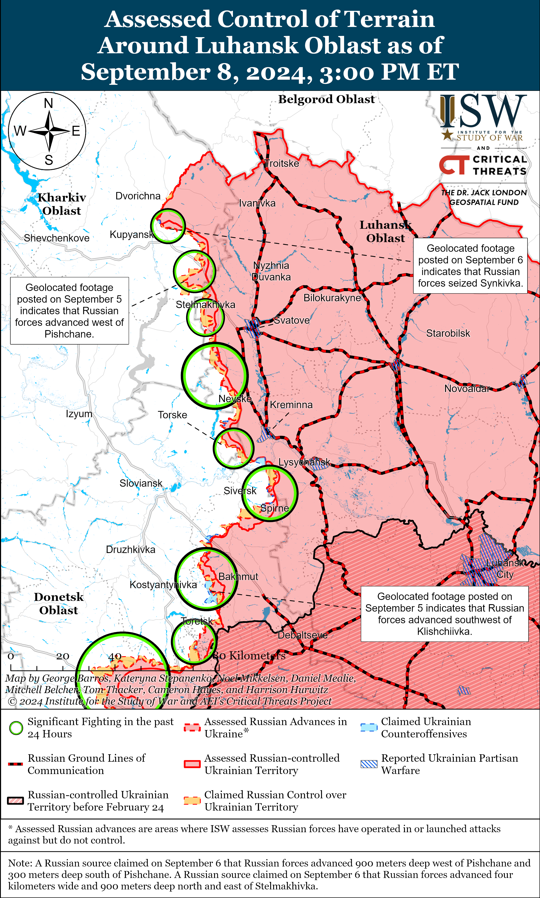
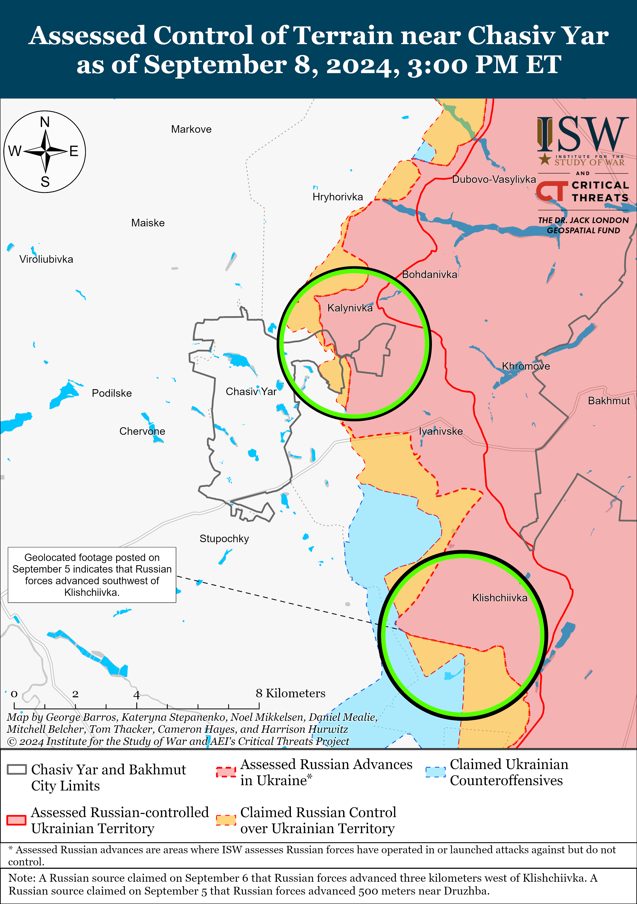
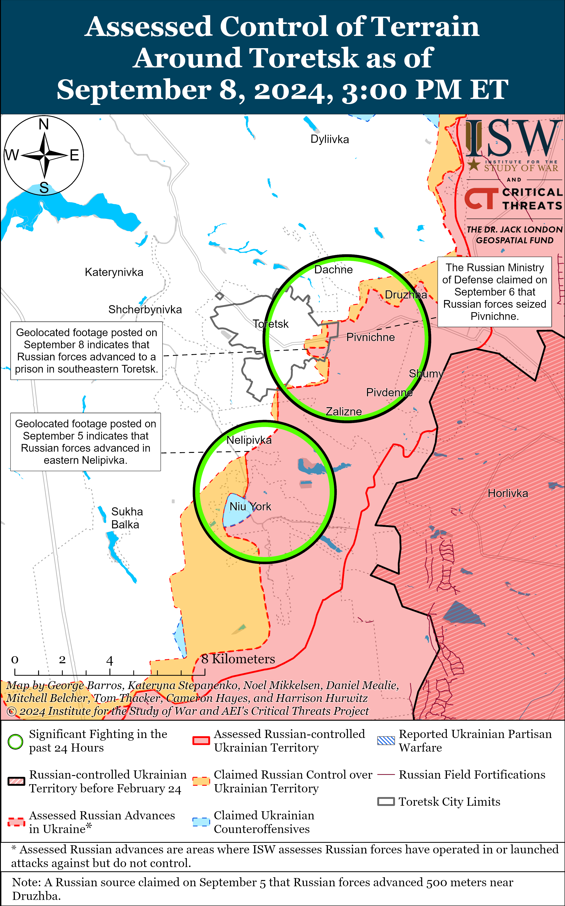
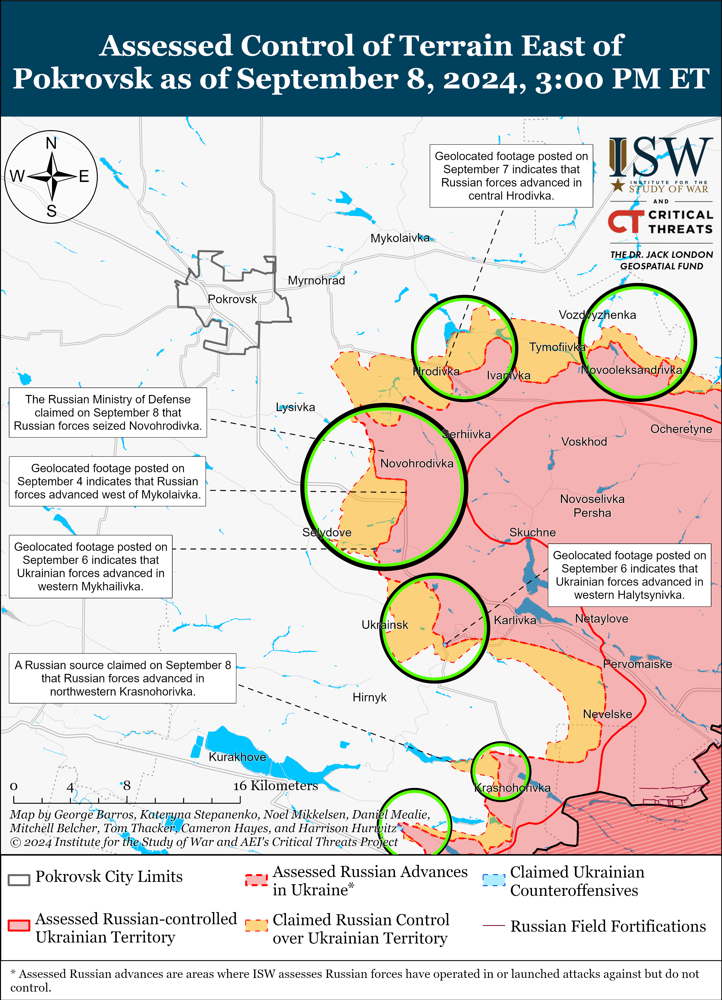
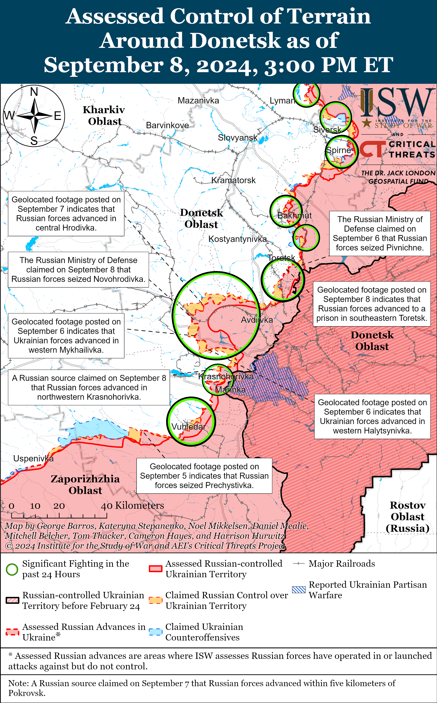
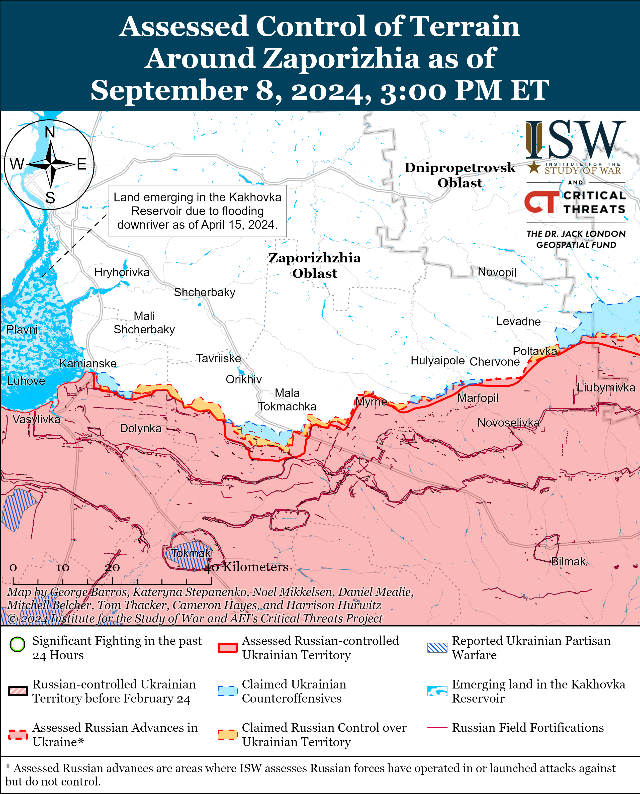
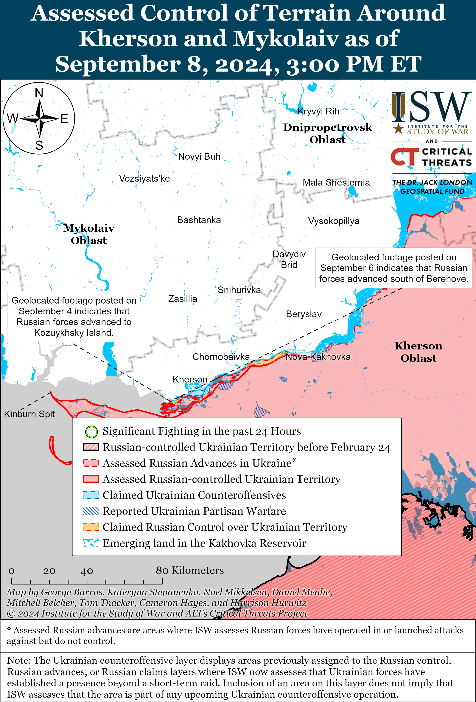

# Russian Offensive Campaign Assessment, September 8, 2024

**Christina Harward, Riley Bailey, Nicole Wolkov, Davit Gasparyan, and George Barros**

**September 8, 2024, 5:45 pm ET**

**Click**[**here**](https://storymaps.arcgis.com/stories/36a7f6a6f5a9448496de641cf64bd375)**to see ISW’s interactive map of the Russian invasion of Ukraine. This map is updated daily alongside the static maps present in this report.**

**Click**[**here**](https://storymaps.arcgis.com/stories/83a2f24901c941d581c0c523ecd2619b)**to see ISW’s interactive map of Ukraine’s offensive in Kursk Oblast.**

**Click**[**here**](https://understandingwar.maps.arcgis.com/apps/instant/3dviewer/index.html?appid=1602762dbcde419bb957dea358449580)**to see ISW’s 3D control of terrain topographic map of Ukraine. Use of a computer (not a mobile device) is strongly recommended for using this data-heavy tool.**

**Click**[**here**](https://storymaps.arcgis.com/stories/733fe90805894bfc8562d90b106aa895)**to access ISW’s archive of interactive time-lapse maps of the Russian invasion of Ukraine. These maps complement the static control-of-terrain map that ISW produces daily by showing a dynamic frontline. ISW will update this time-lapse map archive monthly.**

**Note: The data cut-off for this product was 12:15pm ET on September 8. ISW will cover subsequent reports in the September 9 Russian Offensive Campaign Assessment.**

**Central Intelligence Agency Director (CIA) William Burns cautioned the West against concern about boilerplate Russian nuclear saber-rattling, which ISW has long identified as part of a Kremlin effort to promote Western self-deterrence and influence key moments in Western policy debates about support for Ukraine.**Burns stated during a panel with United Kingdom Secret Intelligence Service (MI6) Chief Richard Moore on September 7 that Russian President Vladimir Putin will continue to issue periodic threats of direct confrontation against the West but that these threats should not intimidate the West.[1] Burns stated that the CIA had assessed that Russian forces may have considered using tactical nuclear weapons in Ukraine in the fall of 2022 and that he was in contact with Russian Foreign Intelligence Service (SVR) Director Sergei Naryshkin on the matter.[2] The CIA’s assessment of possible Russian readiness to use tactical nuclear weapons in Ukraine in the fall of 2022 corresponded with intensified Russian rhetoric about nuclear confrontation amid the successful Ukrainian counteroffensive operations in Kherson and Kharkiv oblasts.[3] This rhetoric was likely more a part of a routine information operation designed to deter Western security assistance to Ukraine than an indicator of Russian readiness to use nuclear weapons, however.[4] The Kremlin has repeatedly invoked thinly veiled threats of a nuclear confrontation between Russia and the West during key moments in Western political discussions about further military assistance to Ukraine, such as in the fall of 2022, to induce fear among decision makers.[5] ISW continues to assess that Russia is very unlikely to use nuclear weapons in Ukraine or elsewhere.[6]

**Russian milbloggers continue to offer insights into how the Kremlin is co-opting select milbloggers to regulate the spread of information in Russia.**Prominent Russian milblogger Alexander Sladkov claimed on September 7 that former Russian Defense Minister Sergei Shoigu and his team in the Russian Ministry of Defense (MoD) punished milbloggers, including Sladkov, for being “too frank and harsh” about Russian military failures and disasters.[7] Sladkov claimed that the Russian Main Military Prosecutor’s Office opened a criminal case against him for discrediting the Russian military at an unspecified time, presumably several months ago during Shoigu’s tenure in the Russian MoD. Sladkov implied, however, that the All-Russian State Television and Radio Broadcasting Company, for which Sladkov works as a war correspondent, and the Russian Presidential Administration stopped the case and “protected” him. Sladkov claimed that Russian MoD officials under Shoigu, many of whom Russian authorities have arrested for bribery and fraud in recent months, were hypocritically trying to teach milbloggers how to “act morally” and “state-like.” Sladkov complained that Russian MoD officials were trying to punish milbloggers despite the fact that select milbloggers had personally met with Russian President Vladimir Putin four times to inform Putin about issues on the frontline and within the Russian MoD. Sladkov claimed that milbloggers “breathed a sigh of relief” with the appointment of current Russian Defense Minister Andrei Belousov, whom Sladkov praised for “seriously increasing” the Russian military’s capabilities. Sladkov’s anecdote and mention of the Russian Presidential Administration imply that the Kremlin intervened and spared Sladkov (and other Russian milbloggers) from criminal prosecution, likely as part of a Kremlin effort to co-opt pliable milbloggers who tended to be critical of the Russian state’s conduct of the war in Ukraine, to ensure that they do not pose a liability to the Kremlin in the future.[8] The Kremlin began an effort to co-opt pliable Russian milbloggers in late 2022 and continues to use awards to co-opt Russian milbloggers and buy their loyalty.[9] The Russian state-funded Union of Journalists awarded Russian milblogger Yevgeny Poddubny with the Solidarity Prize on September 8 for “demonstrating courage” while exposed to danger during professional duties and for “demonstrating a civic position in defending the freedom of speech.”[10] ISW assessed in 2022 and 2023 that the Kremlin was trying to co-opt Sladkov and Poddubny, both of whom previously had been more critical of the Russian military’s failures in Ukraine before being co-opted.[11]

**The Kremlin has not yet succeeded in co-opting or silencing all Russian milbloggers, however.** Another Russian milblogger, who is often openly critical of the Kremlin and Russian MoD, posted three since-deleted videos on September 8 in which he claimed that “traitors are sitting in the Kremlin” and that Russian authorities have “removed” and imprisoned “inconvenient people,” such as imprisoned ardent nationalist and former Russian officer Igor Girkin.[12] The administration that runs the milblogger’s channel later posted an audio recording on September 8, claiming that the milblogger was emotional due to his strong nationalism.[13] The administration claimed that most Russians in private have said something to “discredit” others, likely in an attempt to prevent Russian authorities from charging the milblogger with discrediting the Russian military.

**The milbloggers’ insights into such incidents suggest that the Kremlin is attempting to co-opt milbloggers or encourage them to self-censor, as opposed to a more aggressive policy of direct censorship.**The initial publication of the milblogger’s critical videos demonstrates how the Kremlin has not been successful at co-opting or silencing the entire Russian information space, but the channel’s later retraction of the videos suggests that the Kremlin has been successful at coercing milbloggers (and their administrative teams) to self-censor out of fear of punishment. Sladkov’s claims about the Russian Presidential Administration’s intervention into his case and Putin’s attention to milblogger complaints further suggest that Putin did not support the Russian MoD’s previous attempts to directly censor milbloggers, preferring a policy aimed at co-opting prominent milbloggers, likely in order to maintain a veneer of freedom of speech in Russia and prevent an inadvertent viral spread of explicitly censored dissident material. ISW recently assessed that the Kremlin will likely continue its efforts to establish full control over the Russian information space in the future but is still sensitive to the sentiments of the Russian ultranationalist milblogger community.[14]

**The Russian Investigative Committee is investigating a “mass brawl” between Russian ultranationalists and Central Asian residents in Afipsky, Krasnodar Krai, amid increased xenophobia against migrants and ethnic minorities in Russia.**The Investigative Committee stated on September 8 that its Krasnodar Krai office is investigating a mass brawl in Afipsky between local residents and “people of non-Slavic appearance.”[15] Footage published on September 8 purportedly from the incident in Afipsky shows a large crowd of people and limited fighting.[16] The regional Ministry of Internal Affairs (MVD) reported that law enforcement detained 43 people at the scene of the fight.[17] Russian opposition outlet *SOTA* noted that the Russian ultranationalist online community “Russian Sword,” which espouses xenophobia against migrants and ethnic minorities in Russia, promoted the incident and likely influenced more ultranationalists to join the crowd. *SOTA*also reported that a subscriber to the Russian Sword online community claimed that Russian authorities conducted a raid against migrant communities after the brawl.[18] *SOTA*noted that members of another Russian far-right ultranationalist online community, the “Russian Community,” have previously organized demonstrations against migrants.[19] *BBC Russian Service* reported in June 2024 that affiliates of Russian *Tsargrad*outlet founder and Russian Orthodox nationalist Konstantin Malofeev founded the “Russian Community” project in late 2020.[20]

**Ukrainian officials continued to announce a series of appointments among senior members of the Ukrainian cabinet on September 8.**Ukrainian President Volodymyr Zelensky signed presidential decrees on September 8 appointing Iryna Vereshchuk and Viktor Mykyta to the positions of Deputy Heads of the Presidential Office and appointing Oleksandr Kamyshin and Dmytro Lytvyn as his advisors.[21] Kamyshin will advise Zelensky on strategic issues, and Lytvyn will advise him on communications. Zelensky reassigned Mykyta from his previous position as the Head of the Zakarpattia Oblast Military Administration on September 8 and Vereshchuk resigned from her previous post as Ukrainian Minister for Reintegration of Temporarily Occupied Territories (TOT) on September 3.[22]

**Key Takeaways:**

- **Central Intelligence Agency Director (CIA) William Burns cautioned the West against concern about boilerplate Russian nuclear saber-rattling, which ISW has long identified as part of a Kremlin effort to promote Western self-deterrence and influence key moments in Western policy debates about support for Ukraine.**
- **Russian milbloggers continue to offer insights into how the Kremlin is co-opting select milbloggers to regulate the spread of information in Russia.**
- **The Kremlin has not yet succeeded in co-opting or silencing all Russian milbloggers, however.**
- **The milbloggers’ insights into such incidents suggest that the Kremlin is attempting to co-opt milbloggers or encourage them to self-censor, as opposed to a more aggressive policy of direct censorship.**
- **The Russian Investigative Committee is investigating a “mass brawl” between Russian ultranationalists and Central Asian residents in Afipsky, Krasnodar Krai, amid increased xenophobia against migrants and ethnic minorities in Russia.**
- **Ukrainian officials continued to announce a series of appointments among senior members of the Ukrainian cabinet on September 8.**
- **Russian forces conducted counterattacks in Kursk Oblast amid continued Ukrainian offensive operations in the area on September 8.**
- **Russian forces recently advanced near Toretsk and marginally advanced near Chasiv Yar.**
- **A Russian milblogger who formerly served as a “Storm-Z” unit instructor claimed on September 8 that the Russian military needs to improve the training of drone unit commanders.**

******

***We do not report in detail on Russian war crimes because these activities are well-covered in Western media and do not directly affect the military operations we are assessing and forecasting. We will continue to evaluate and report on the effects of these criminal activities on the Ukrainian military and the Ukrainian population and specifically on combat in Ukrainian urban areas. We utterly condemn Russian violations of the laws of armed conflict and the Geneva Conventions and crimes against humanity even though we do not describe them in these reports.***

- Ukrainian Operations in the Russian Federation
- Russian Main Effort – Eastern Ukraine (comprised of three subordinate main efforts)
- Russian Subordinate Main Effort #1 – Push Ukrainian forces back from the international border with Belgorod Oblast and approach within tube artillery range of Kharkiv City
- Russian Subordinate Main Effort #2 – Capture the remainder of Luhansk Oblast and push westward into eastern Kharkiv Oblast and encircle northern Donetsk Oblast
- Russian Subordinate Main Effort #3 – Capture the entirety of Donetsk Oblast
- Russian Supporting Effort – Southern Axis
- Russian Air, Missile, and Drone Campaign
- Russian Mobilization and Force Generation Efforts
- Russian Technological Adaptations
- Activities in Russian-occupied areas
- Ukrainian Defense Industrial Base Efforts
- Russian Information Operations and Narratives
- Significant Activity in Belarus

**Ukrainian Operations in the Russian Federation**

Russian forces conducted counterattacks in Kursk Oblast amid continued Ukrainian offensive operations in the area on September 8. Ukrainian forces reportedly continued to attack southwest of Korenevo near Snagost and Vishnevka; northwest of Sudzha near Malaya Loknya; north of Sudzha near Maryevka; northeast of Sudzha near Martynovka; and southeast of Sudzha near Cherkasskaya Konopelka on September 7 and 8.[23] Russian forces reportedly conducted counterattacks in Korenevo; east of Korenevo near Olgovka; and southeast of Sudzha near Cherkasskaya Konopelka.[24] Russian sources claimed that Russian forces regained lost positions south and east of Korenevo, within Shtepukhovka (northeast of Korenevo), and near Malaya Loknya.[25] A Russian milblogger claimed that Pogrebki (northwest of Sudzha) is a contested “gray zone.”[26] Elements of the Russian 810th Naval Infantry Brigade (Black Sea Fleet, Southern Military District [SMD]) are reportedly operating in Kursk Oblast, and elements of the Russian 155th Naval Infantry Brigade (Pacific Fleet, Eastern Military District [EMD]), are reportedly operating near Krasnooktyabrskoye (southwest of Korenevo).[27] Ukrainian military observer Kostyantyn Mashovets stated on September 8 that the Russian military command is redeploying one airborne (VDV) regiment and reconnaissance battalion of the 106th VDV Division from the Siversk and Kramatorsk directions and at least one self-propelled artillery battalion from the 20th Motorized Rifle Division (8th Combined Arms Army [CAA], Southern Military District [SMD]) from the Kurakhove direction to Kursk Oblast.[28]

Ukrainian State Border Service Spokesperson Andriy Demchenko stated on September 8 that the Ukrainian operation in Kursk Oblast is allowing Ukrainian forces to construct fortifications directly on the Ukrainian-Russian border in Sumy Oblast, as opposed to further from the border, as Ukrainian forces must do in other border areas due to Russian shelling.[29]

Ukrainian forces continue to target Russian ground lines of communications (GLOCs) in near rear areas in Kursk Oblast. A Ukrainian source posted footage on September 8 of Ukrainian forces destroying a bridge across the Seim River north of Karyzh, Glushkovsky Raion.[30]

Ukrainian forces reportedly conducted drone strikes against Belgorod Oblast on September 8. Belgorod Oblast Governor Vyacheslav Gladkov claimed that Ukrainian strikes caused a fire at a hangar at an unspecified plant in Nikolskoye and a fuel storage site in Volokonovsky raion.[31] The Russian MoD claimed on September 7 and 8 that Russian forces destroyed three Ukrainian drones over Belgorod Oblast.[32] Russian milbloggers posted footage purportedly of the fire at the fuel storage site.[33]

**Russian Main Effort – Eastern Ukraine**

**Russian Subordinate Main Effort #1 – Kharkiv Oblast (Russian objective: Push Ukrainian forces back from the international border with Belgorod Oblast and approach to within tube artillery range of Kharkiv City)**

Fighting continued north and northeast of Kharkiv City on September 8, but there were no confirmed changes to the frontline. Russian forces conducted ground attacks near Vovchansk (northeast of Kharkiv City) and Hlyboke (north of Kharkiv City) on September 7 and 8.[34] A Russian milblogger claimed that Ukrainian forces unsuccessfully attacked with two armored vehicles near Lypsti (north of Kharkiv City).[35] Ukraine’s Kharkiv Group of Forces reported that Russian forces conducted a TOS-1A thermobaric artillery strike against the Aggregate Plant within central Vovchansk.[36]

****

**Russian Subordinate Main Effort #2 – Luhansk Oblast (Russian objective: Capture the remainder of Luhansk Oblast and push westward into eastern Kharkiv Oblast and northern Donetsk Oblast)**

Russian forces continued offensive operations along the Kupyansk-Svatove-Kreminna line on September 8 but did not make any confirmed advances. Russian forces continued ground attacks northeast of Kupyansk near Synkivka; east of Kupyansk near Petropavlivka; southeast of Kupyansk near Stepova Novoselivka, Kyslivka, Kotlyarivka, and Tabaivka; northwest of Svatove near Stelmakhivka and Hlushkivka and in the direction of Lozova; west of Svatove near Andriivka; southwest of Svatove near Cherneshchyna; northwest of Kreminna near Novosadove, Nevske, and Makiivka; west of Kreminna near Torske; and southwest of Kreminna near Dibrova on September 7 and 8.[37] A Russian milblogger claimed that Russian forces continue to target Ukrainian pontoon crossings across the Oskil River.[38]

**Russian Subordinate Main Effort #3 – Donetsk Oblast (Russian objective: Capture the entirety of Donetsk Oblast, the claimed territory of Russia’s proxies in Donbas)**

Russian forces continued offensive operations northeast of Siversk near Hryhorivka, east of Siversk Verkhnokamyanske, and southeast of Siversk near Spirne and Vyimka on September 7 and 8.[39]

Russian forces recently marginally advanced north of Chasiv Yar and continued offensive operations in the area on September 8. Geolocated footage published on September 8 indicates that Russian forces recently made marginal gains in fields north of Kalynivka (north of Chasiv Yar).[40] Russian forces continued offensive operations near Chasiv Yar, north of Chasiv Yar in the direction of Mayske, and southeast of Chasiv Yar near Andriivka and Klishchiivka on September 7 and 8.[41]

Russian forces recently advanced in eastern Toretsk and continued offensive operations in the area on September 8. Geolocated footage published on September 8 indicates that Russian forces recently advanced in eastern Toretsk.[42] Russian forces continued offensive operations near Toretsk, south of Toretsk near Nelipivka, and southwest of Toretsk near Sukha Balka on September 7 and 8.[43] Russian milbloggers claimed that Ukrainian forces continued counterattacks in Niu York (south of Toretsk) on September 8 and advanced to central Niu York on September 7.[44] ISW has observed geolocated footage of Ukrainian forces recently counterattacking in northwestern Niu York and maintaining positions in the settlement but has yet to observe visual confirmation of Ukrainian forces recently regaining additional ground in Niu York.[45]

Russian forces reportedly continued to advance in the Pokrovsk direction but did not make any confirmed gains on September 8. A Russian milblogger claimed that Russian forces advanced closer to Hirnyk (southeast of Pokrovsk), although ISW has not observed visual confirmation of this claim.[46] The Russian Ministry of Defense (MoD) claimed that Russian forces seized Novohrodivka (southeast of Pokrovsk), and ISW assessed that Russian forces likely seized the town as of September 2.[47] Russian security forces reportedly told Kremlin newswire *TASS*that Russian forces are attempting to encircle Ukrainian forces in Selydove (southeast of Pokrovsk). However, ISW has yet to observe definitive confirmation of Russian forces operating in the town or making advances north or south of the town that would threaten Ukrainian forces with potential encirclement.[48] A Ukrainian soldier stated that Russian forces had encircled an unspecified number of wounded Ukrainian soldiers near Zhelanne Pershe (southeast of Pokrovsk), although ISW has not observed confirmation of this report or visual evidence of Russian gains that would suggest that Russian forces have encircled any Ukrainian positions in the area.[49] Russian forces continued offensive operations east of Pokrovsk near Zelene Pole, Vozdvyzhenka, and Hrodivka and in the direction of Novotroitske and southeast of Pokrovsk near Novohrodivka, Selydove, Mykhailivka, Dolynivka, Ukrainsk, and Halytsynivka on September 7 and 8.[50] Russian milbloggers claimed on September 7 and 8 that Ukrainian forces are continuing to counterattack near Selydove.[51] Elements of the 3rd “Atlant” Motorized Rifle Battalion of the Russian 35th Motorized Rifle Brigade (41st Combined Arms Army [CAA], Central Military District [CMD]) are reportedly operating in Hrodivka.[52] Ukrainian military observer Kostyantyn Mashovets stated that Russia’s Central Grouping of Forces is finishing the restoration of the 1437th Motorized Rifle Regiment (which Mashovets identified as part of the 41st CAA) after offensive operations in the Pokrovsk direction in August 2024 rendered the regiment combat ineffective and that the Russian military command will soon recommit elements of the 1437th Motorized Rifle Regiment to fighting in the area.[53]

Russian forces did not make any confirmed gains west of Donetsk City on September 8 amid continued offensive operations in the area. A Russian milblogger claimed that Russian forces advanced further in northwestern Krasnohorivka, although ISW has not observed visual confirmation of this claim.[54] Russian forces continued offensive operations near Krasnohorivka and Heorhiivka on September 7 and 8.[55] Elements of an unspecified separate tank battalion of the 20th Motorized Rifle Division (8th CAA, Southern Military District [SMD]) are reportedly operating near Krasnohorivka.[56]

Russian forces continued offensive operations southwest of Donetsk City near Kostyantynivka, Vodyane, and Vuhledar on September 7 and 8 but did not make any confirmed gains.[57] Elements of the Russian BARS-23 (Russian Army Combat Reserve) detachment are reportedly operating in the Vuhledar direction.[58]

Russian and Ukrainian forces did not report any fighting in the Donetsk-Zaporizhia Oblast border area on September 8.

**Russian Supporting Effort – Southern Axis (Russian objective: Maintain frontline positions and secure rear areas against Ukrainian strikes)**

Positional engagements continued in western Zaporizhia Oblast on September 8, but there were no confirmed changes to the frontline. Russian milbloggers claimed that Russian forces advanced in Robotyne and seized two strongholds west of Novoprokovka (northeast of Robotyne), although ISW has not observed visual evidence of these claims.[59] Fighting continued near Robotyne and Mala Tokmachka (northeast of Robotyne) on September 8.[60]

Positional engagements continued in east (left) bank Kherson Oblast on September 7 and 8, but there were no confirmed changes to the frontline.[61] Russian milbloggers continue to claim that Russian forces are operating on the Dnipro River Delta islands.[62] Tank elements of the Russian 205th Motorized Rifle Brigade (49th Combined Arms Army [CAA], Southern Military District [SMD]) reportedly continue operating in the Dnipro (Kherson) direction.[63]

**Russian Air, Missile, and Drone Campaign (Russian Objective: Target Ukrainian military and civilian infrastructure in the rear and on the frontline)**

Russian forces conducted a series of missile and drone strikes against Ukraine on the night of September 7 to 8. The Ukrainian Air Force reported that Russian forces launched four Kh-59 cruise missiles from Belgorod Oblast and 23 Shahed-136/131 drones from Kursk Oblast and occupied Cape Chauda, Crimea.[64] The Ukrainian Air Force stated that Ukrainian forces shot down one Kh-59 missile and 15 Shahed drones over Odesa, Kharkiv, and Dnipropetrovsk oblasts. The Ukrainian Air Force also stated that two Shahed drones and three Kh-58 missiles did not reach their targets, likely due to Ukrainian electronic warfare (EW). The Ukrainian Air Force reported that an unspecified number of Russian drones entered Romanian airspace, and the Romanian Ministry of Defense (MoD) reported that a Russian drone entered Romanian airspace and likely fell into an uninhabited area.[65]

Ukrainian President Volodymyr Zelensky stated on September 8 that Russian forces launched over 800 glide bombs, almost 300 Shahed drones, and over 60 missiles of various types against Ukraine within the past week (September 2-8).[66]

Latvian President Edgars Rinkevics stated on September 8 that a Russian drone crashed in eastern Latvia on September 7 and that Latvian authorities are investigating the incident.[67] Rinkevics stated that the number of such incidents is increasing along NATO’s eastern flank. Latvian National Armed Forces Commander Lieutenant General Leonids Kalnins stated that preliminary information indicates that the drone had no “hostile goals” and that it did not purposefully fly into Latvian airspace.[68]

**Russian Mobilization and Force Generation Efforts (Russian objective: Expand combat power without conducting general mobilization)**

A Russian milblogger who formerly served as a “Storm-Z” unit instructor claimed on September 8 that the Russian military needs to improve the training of drone unit commanders.[69] The milblogger complained that drone unit commanders do not have sufficient knowledge about drone technology and that this leads to unjustified Russian personnel and drone losses. The milblogger claimed that drone unit commanders often do not understand that adjacent Russian units’ electronic warfare (EW) systems affect drone operations and often try to achieve combat tasks with low-quality drones. The milblogger claimed that commanders do not know how to integrate drone operations into assault actions for fire support and that commanders ignore Ukrainian capabilities for identifying and striking Russian drone operators.

**Russian Technological Adaptations (Russian objective: Introduce technological innovations to optimize systems for use in Ukraine)**

Russian design bureau MiS displayed a modernized version of the MiS-35M strike and reconnaissance hexacopter at the “Dronnitsa-2024” all-Russian gathering of combat drone operators on September 8.[70] The modernized drone reportedly includes a payload capacity of up to 4.2 kilograms and increased resistance against electronic warfare (EW).

**Ukrainian Defense Industrial Efforts (Ukrainian objective: Develop its defense industrial base to become more self-sufficient in cooperation with US, European, and international partners)**

*ISW is suspending publishing coverage of Ukrainian defense industrial efforts until further notice.*

**Activities in Russian-occupied areas (Russian objective: Consolidate administrative control of annexed areas; forcibly integrate Ukrainian citizens into Russian sociocultural, economic, military, and governance systems)**

*ISW is not publishing coverage of occupied areas today.*

**Russian Information Operations and Narratives**

Nothing significant to report.

**Significant activity in Belarus (Russian efforts to increase its military presence in Belarus and further integrate Belarus into Russian-favorable frameworks and Wagner Group activity in Belarus)**

Ukrainian State Border Service Spokesperson Andriy Demchenko stated on September 7 that there are currently no Russian forces in Belarus that could threaten Ukraine.[71] Demchenko stated that there were 10,000 to 12,000 Russian personnel deployed to Belarus in 2023 for joint military exercises and training but that the Russian military command gradually withdrew most of these forces and did not redeploy new forces to the area. Demchenko stated that the Russian troops still located in Belarus are mostly logistics units that do not pose a threat to Ukraine.

**Note: ISW does not receive any classified material from any source, uses only publicly available information, and draws extensively on Russian, Ukrainian, and Western reporting and social media as well as commercially available satellite imagery and other geospatial data as the basis for these reports. References to all sources used are provided in the endnotes of each update.**

---

[1] https://www.theguardian.com/world/article/2024/sep/07/cia-west-russia-nuclear-threats-putin

[2] https://www.theguardian.com/world/article/2024/sep/07/cia-west-russia-nuclear-threats-putin

[3] https://isw.pub/UkrWar030924

[4] https://isw.pub/UkrWar030924

[5] https://understandingwar.org/wp-content/uploads/2024/09/May20212C2020242C20Russian20Offensive20Campaign20Assessment20PDF.pdf; https://understandingwar.org/backgrounder/russian-offensive-campaign-assessment-may-31-2024; https://understandingwar.org/backgrounder/russian-offensive-campaign-assessment-june-28-2024

[6] https://understandingwar.org/backgrounder/special-report-assessing-putin%E2%80%99s-implicit-nuclear-threats-after-annexation

[7] https://t.me/Sladkov\_plus/11346

[8] https://understandingwar.org/backgrounder/russian-offensive-campaign-assessment-december-12-2023; https://understandingwar.org/backgrounder/russian-offensive-campaign-assessment-november-16-2023; https://understandingwar.org/backgrounder/russian-offensive-campaign-assessment-march-4-2024; https://understandingwar.org/backgrounder/russian-offensive-campaign-assessment-november-20

[9] https://understandingwar.org/backgrounder/russian-offensive-campaign-assessment-november-20

[10] https://t.me/tass\_agency/271307

[11] https://understandingwar.org/backgrounder/russian-offensive-campaign-assessment-january-2-2023; https://understandingwar.org/backgrounder/russian-offensive-campaign-assessment-august-18-2023 ; https://understandingwar.org/backgrounder/russian-offensive-campaign-assessment-december-21

[12] https://t.me/astrapress/63852 ; https://t.me/Z13\_Separ/31879

[13] https://t.me/astrapress/63852 ; https://t.me/Z13\_Separ/31879

[14] https://isw.pub/UkrWar090624

[15] https://t.me/sledcom\_press/15712 ; https://kuban.sledcom dot ru/news/item/1912828/

[16] https://t.me/sotaproject/86787 ; https://t.me/vchkogpu/50732 ; https://t.me/vchkogpu/50736

[17] https://t.me/mvd\_23/7911

[18] https://t.me/sotaproject/86787

[19] https://t.me/sotaproject/86787

[20] https://www.bbc.com/russian/articles/cxrrd7x0353o

[21] https://suspilne dot media/831581-zelenskij-priznaciv-dvoh-radnikiv-prezidenta-ta-dvoh-zastupnikiv-kerivnika-opu/; https://www.president dot gov.ua/documents/6192024-52093; https://www.president dot gov.ua/documents/6202024-52089; https://www.president dot gov.ua/documents/6232024-52081; https://www.president dot gov.ua/documents/6222024-52077 ; https://www.president dot gov.ua/documents/6212024-52085

[22] https://suspilne dot media/831581-zelenskij-priznaciv-dvoh-radnikiv-prezidenta-ta-dvoh-zastupnikiv-kerivnika-opu/; https://www.president dot gov.ua/documents/decrees ; https://www.pravda dot com.ua/eng/news/2024/09/3/7473318/; https://www.president dot gov.ua/documents/6192024-52093

[23] https://t.me/mod\_russia/43113 ; https://t.me/dva\_majors/51893

[24] https://t.me/rybar/63332  ; https://t.me/RVvoenkor/76572 ; https://t.me/dva\_majors/51893

[25] https://t.me/RVvoenkor/76572; https://t.me/rybar/63332; https://t.me/dva\_majors/51865; https://t.me/dva\_majors/51893 ; https://t.me/NeoficialniyBeZsonoV/39502

[26] https://t.me/rybar/63332; https://t.me/voenkorKotenok/58872 ; https://t.me/NeoficialniyBeZsonoV/39505

[27] https://x.com/foosint/status/1832505031280472082; https://t.me/sashakots/48847 ;  https://t.me/zvizdecmanhustu/2167

[28] https://t.me/zvizdecmanhustu/2166 ; https://t.me/zvizdecmanhustu/2167

[29] https://youtu.be/j5TqaWCCdUg ; https://armyinform dot com.ua/2024/09/08/u-prykordonni-sumshhyny-posylyuyut-zahyst-derzhrubezhu/

[30] https://t.me/khornegroup/2658 ; https://armyinform.com dot ua/2024/09/08/v-karyzh-v-karyzh-syly-oborony-znyshhyly-chergovyj-rosijskyj-mist-cherez-sejm/

[31] https://t.me/vvgladkov/9719; https://t.me/tass\_agency/271295

[32] https://t.me/mod\_russia/43083 ; https://t.me/mod\_russia/43114 ; https://t.me/mod\_russia/43118

[33] https://t.me/wargonzo/21989 ; https://t.me/epoddubny/20994

[34]https://www.facebook.com/GeneralStaff.ua/posts/pfbid025P7jfKZu7gwaBca238GrDXkCMUhGmf3rLMazom6oWxoKScPtezBJsFfAziPcLnVUl ; https://www.facebook.com/GeneralStaff.ua/posts/pfbid02Kq5vVA1Wf6DMQifjj4mnbtSg5MXYFuXDV3s8pkrtgaHC8nVkq5tnaVNVeXHY1NQyl ; https://t.me/wargonzo/21982

[35] https://t.me/DnevnikDesantnika/15126

[36] https://t.me/otukharkiv/1184

[37] https://www.facebook.com/GeneralStaff.ua/posts/pfbid02D16BsWypE9DThvbbsNXgSYzRmNJyjY1grHaZZrX36NbJWAuAZSRRYaCg8sdvu79Sl ; https://www.facebook.com/GeneralStaff.ua/posts/pfbid025P7jfKZu7gwaBca238GrDXkCMUhGmf3rLMazom6oWxoKScPtezBJsFfAziPcLnVUl ; https://www.facebook.com/GeneralStaff.ua/posts/pfbid02Kq5vVA1Wf6DMQifjj4mnbtSg5MXYFuXDV3s8pkrtgaHC8nVkq5tnaVNVeXHY1NQyl ; https://t.me/rybar/63353

[38] https://t.me/rybar/63353

[39] https://www.facebook.com/GeneralStaff.ua/posts/pfbid02D16BsWypE9DThvbbsNXgSYzRmNJyjY1grHaZZrX36NbJWAuAZSRRYaCg8sdvu79Sl ; https://www.facebook.com/GeneralStaff.ua/posts/pfbid025P7jfKZu7gwaBca238GrDXkCMUhGmf3rLMazom6oWxoKScPtezBJsFfAziPcLnVUl ; https://www.facebook.com/GeneralStaff.ua/posts/pfbid02Kq5vVA1Wf6DMQifjj4mnbtSg5MXYFuXDV3s8pkrtgaHC8nVkq5tnaVNVeXHY1NQyl

[40] https://t.me/creamy\_caprice/6708; https://t.me/kateniata56rubak/159

[41] https://www.facebook.com/GeneralStaff.ua/posts/pfbid02D16BsWypE9DThvbbsNXgSYzRmNJyjY1grHaZZrX36NbJWAuAZSRRYaCg8sdvu79Sl ; https://www.facebook.com/GeneralStaff.ua/posts/pfbid025P7jfKZu7gwaBca238GrDXkCMUhGmf3rLMazom6oWxoKScPtezBJsFfAziPcLnVUl ; https://www.facebook.com/GeneralStaff.ua/posts/pfbid02Kq5vVA1Wf6DMQifjj4mnbtSg5MXYFuXDV3s8pkrtgaHC8nVkq5tnaVNVeXHY1NQyl

[42] https://t.me/voron1OO/62; https://x.com/Bielitzling/status/1832777033715155126; https://x.com/Bielitzling/status/1832778014075052493

[43] https://www.facebook.com/GeneralStaff.ua/posts/pfbid02D16BsWypE9DThvbbsNXgSYzRmNJyjY1grHaZZrX36NbJWAuAZSRRYaCg8sdvu79Sl ; https://www.facebook.com/GeneralStaff.ua/posts/pfbid025P7jfKZu7gwaBca238GrDXkCMUhGmf3rLMazom6oWxoKScPtezBJsFfAziPcLnVUl ; https://www.facebook.com/GeneralStaff.ua/posts/pfbid02Kq5vVA1Wf6DMQifjj4mnbtSg5MXYFuXDV3s8pkrtgaHC8nVkq5tnaVNVeXHY1NQyl

[44] https://t.me/notes\_veterans/19351 ; https://t.me/wargonzo/21982

[45] https://understandingwar.org/backgrounder/russian-offensive-campaign-assessment-september-7-2024 ; https://x.com/Deepstate\_UA/status/1832416237579653554 ; https://www.facebook.com/watch/?v=1210138846703900 ; https://x.com/klinger66/status/1832422334302654673

[46] https://t.me/RVvoenkor/76597

[47] https://understandingwar.org/backgrounder/russian-offensive-campaign-assessment-september-3-2024 ; https://t.me/mod\_russia/43110

[48] https://t.me/tass\_agency/271319 ; https://t.me/tass\_agency/271321

[49] https://t.me/stanislav\_osman/7043 ; https://t.me/RVvoenkor/76573

[50] https://www.facebook.com/GeneralStaff.ua/posts/pfbid02D16BsWypE9DThvbbsNXgSYzRmNJyjY1grHaZZrX36NbJWAuAZSRRYaCg8sdvu79Sl ; https://www.facebook.com/GeneralStaff.ua/posts/pfbid025P7jfKZu7gwaBca238GrDXkCMUhGmf3rLMazom6oWxoKScPtezBJsFfAziPcLnVUl ; https://www.facebook.com/GeneralStaff.ua/posts/pfbid02Kq5vVA1Wf6DMQifjj4mnbtSg5MXYFuXDV3s8pkrtgaHC8nVkq5tnaVNVeXHY1NQyl ; https://t.me/wargonzo/21982 ; https://t.me/dva\_majors/51865; https://t.me/warhistoryalconafter/183496 ; https://t.me/voenkorKotenok/58873 ;

[51] https://t.me/wargonzo/21982 ; https://t.me/NeoficialniyBeZsonoV/39505 ; https://t.me/voenkorKotenok/58873

[52] https://t.me/milinfolive/130136

[53] https://t.me/zvizdecmanhustu/2166

[54] https://t.me/z\_arhiv/28023?single

[55] https://www.facebook.com/GeneralStaff.ua/posts/pfbid02D16BsWypE9DThvbbsNXgSYzRmNJyjY1grHaZZrX36NbJWAuAZSRRYaCg8sdvu79Sl ; https://www.facebook.com/GeneralStaff.ua/posts/pfbid025P7jfKZu7gwaBca238GrDXkCMUhGmf3rLMazom6oWxoKScPtezBJsFfAziPcLnVUl ; https://www.facebook.com/GeneralStaff.ua/posts/pfbid02Kq5vVA1Wf6DMQifjj4mnbtSg5MXYFuXDV3s8pkrtgaHC8nVkq5tnaVNVeXHY1NQyl

[56] https://ria dot ru/20240908/tankisty-1971106240.html ; https://t.me/sashakots/48849

[57] https://www.facebook.com/GeneralStaff.ua/posts/pfbid025P7jfKZu7gwaBca238GrDXkCMUhGmf3rLMazom6oWxoKScPtezBJsFfAziPcLnVUl ; https://www.facebook.com/GeneralStaff.ua/posts/pfbid02Kq5vVA1Wf6DMQifjj4mnbtSg5MXYFuXDV3s8pkrtgaHC8nVkq5tnaVNVeXHY1NQyl ; https://www.facebook.com/GeneralStaff.ua/posts/pfbid02D16BsWypE9DThvbbsNXgSYzRmNJyjY1grHaZZrX36NbJWAuAZSRRYaCg8sdvu79Sl

[58] https://t.me/voin\_dv/10682 ; https://t.me/voenacher/71396 ; https://t.me/sashakots/48846

[59] https://t.me/dva\_majors/51893 ; https://t.me/wargonzo/21982

[60] https://www.facebook.com/GeneralStaff.ua/posts/pfbid02D16BsWypE9DThvbbsNXgSYzRmNJyjY1grHaZZrX36NbJWAuAZSRRYaCg8sdvu79Sl

[61] https://www.facebook.com/GeneralStaff.ua/posts/pfbid025P7jfKZu7gwaBca238GrDXkCMUhGmf3rLMazom6oWxoKScPtezBJsFfAziPcLnVUl; https://www.facebook.com/GeneralStaff.ua/posts/pfbid02Kq5vVA1Wf6DMQifjj4mnbtSg5MXYFuXDV3s8pkrtgaHC8nVkq5tnaVNVeXHY1NQyl

[62] https://t.me/NeoficialniyBeZsonoV/39505 ; https://t.me/rusich\_army/17021

[63] https://t.me/tass\_agency/271346

[64] https://t.me/kpszsu/19040

[65] https://www.mapn dot ro/cpresa/18568\_comunicat-de-presa ; https://t.me/kpszsu/19031

[66] https://t.me/V\_Zelenskiy\_official/11581

[67] https://x.com/edgarsrinkevics/status/1832750678097158548

[68] https://www.delfi dot lv/193/politics/120041653/rezeknes-novada-nokritis-krievijas-drons-latvija-tam-naidigu-merku-nebija

[69] https://t.me/philologist\_zov/1365

[70] https://tass dot ru/armiya-i-opk/21803997

[71] https://suspilne dot media/831375-u-bilorusi-zaraz-nemae-rosijskih-vijsk-aki-mogli-b-stanoviti-zagrozu-dla-ukraini-recnik-dpsu/ ; https://armyinform.com dot ua/2024/09/08/na-kordoni-z-bilorussyu-zaminuvaly-zagrozheni-dilyanky/ ; https://youtu.be/j5TqaWCCdUg
