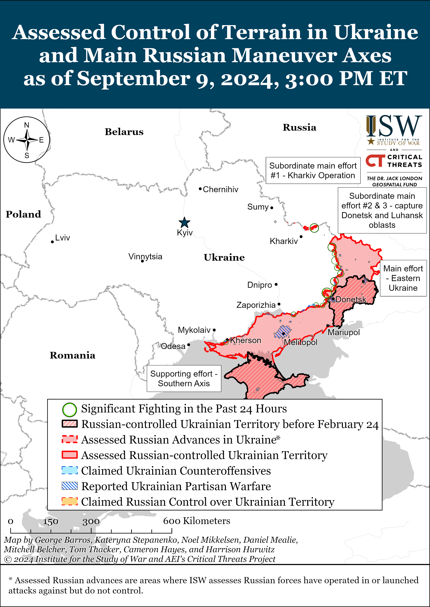
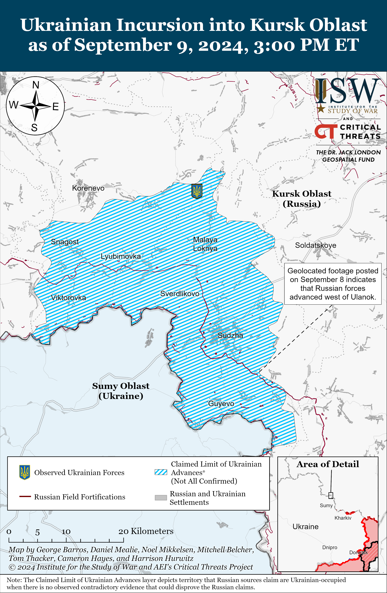
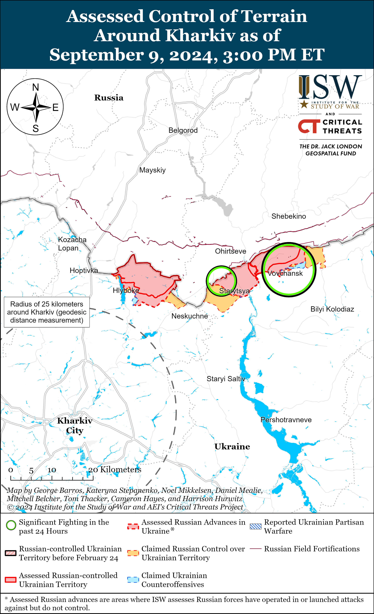
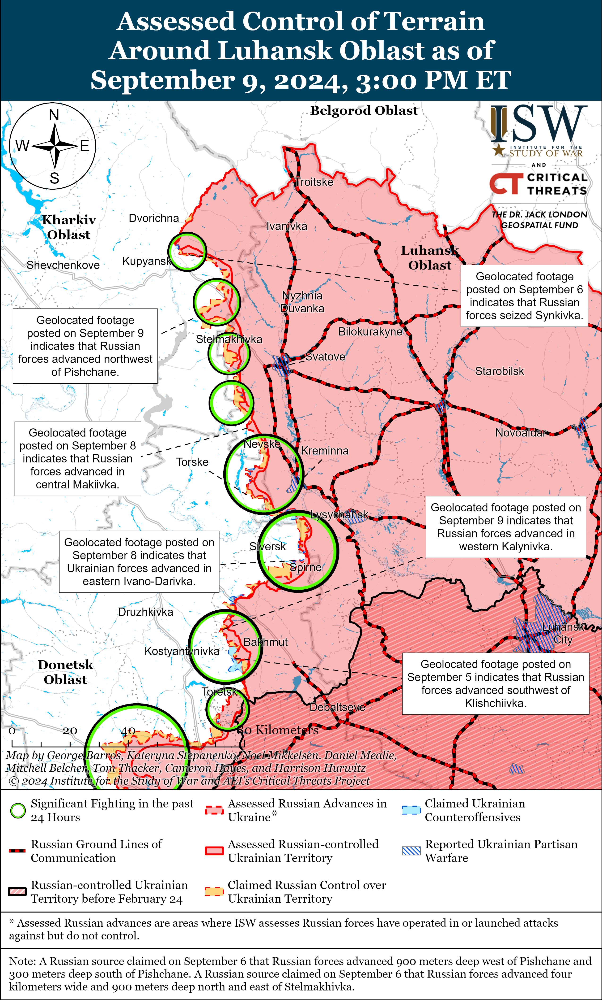
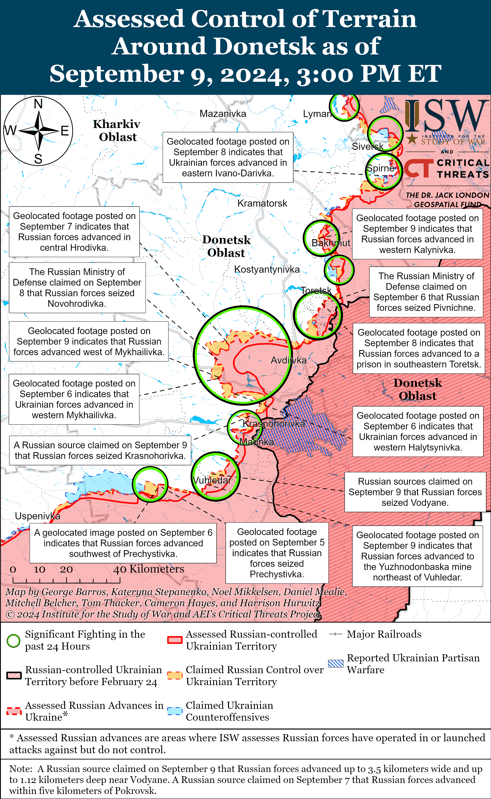
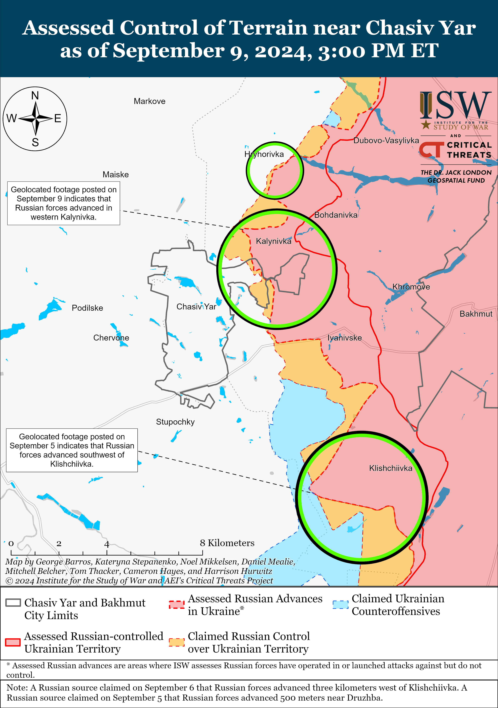
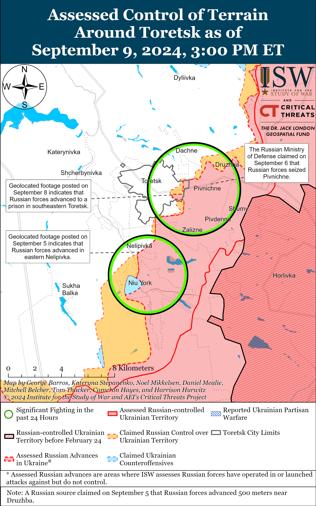
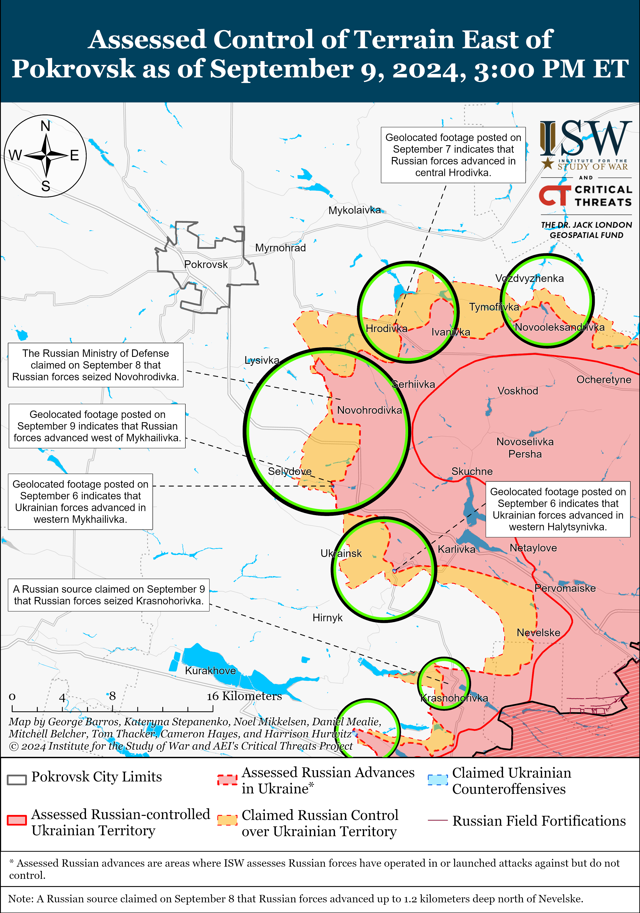
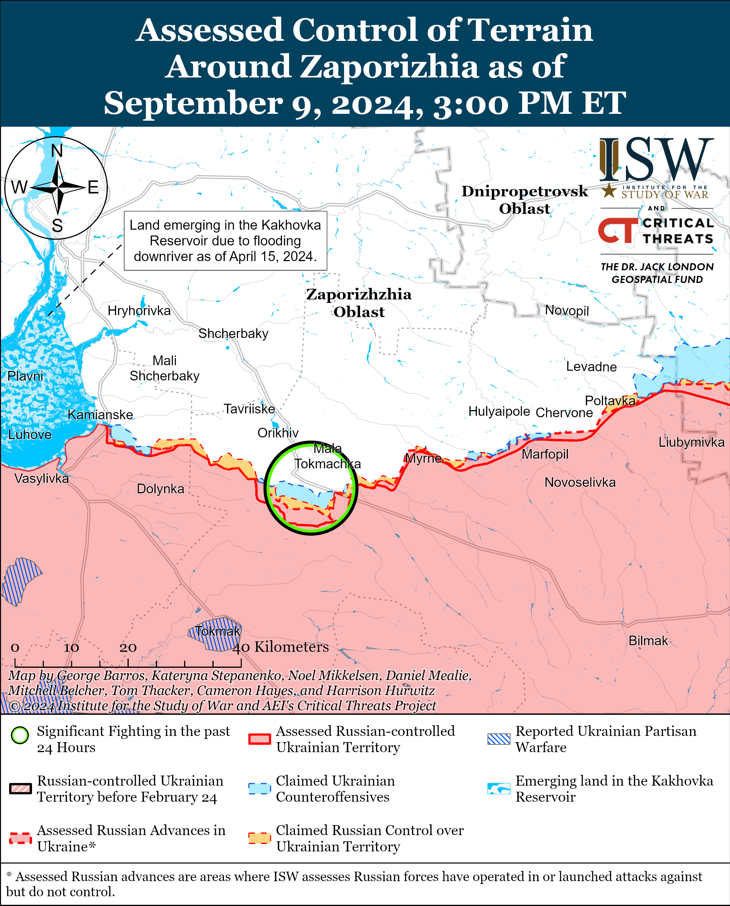
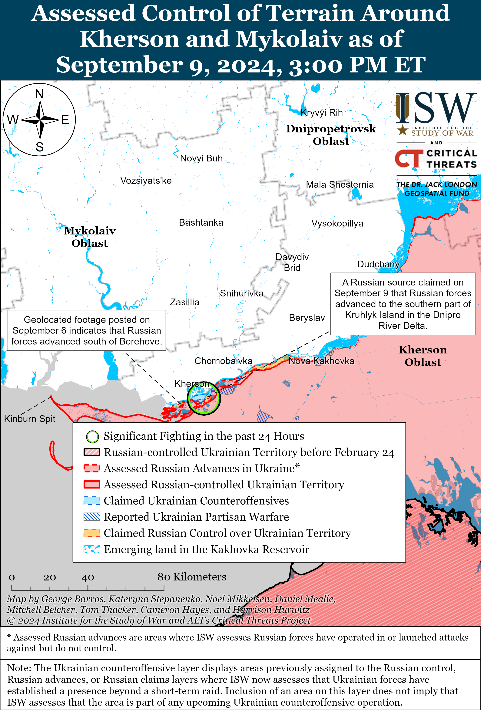

# Russian Offensive Campaign Assessment, September 9, 2024

**Nicole Wolkov, Kateryna Stepanenko, Davit Gasparyan, Christina Harward, Haley Zehrung, and George Barros**

**September 9, 2024, 8:10 pm ET**

**Click** [**here**](https://storymaps.arcgis.com/stories/36a7f6a6f5a9448496de641cf64bd375) **to see ISW’s interactive map of the Russian invasion of Ukraine. This map is updated daily alongside the static maps present in this report.**

**Click** [**here**](https://storymaps.arcgis.com/stories/83a2f24901c941d581c0c523ecd2619b) **to see ISW’s interactive map of Ukraine’s offensive in Kursk Oblast.**

**Click** [**here**](https://understandingwar.maps.arcgis.com/apps/instant/3dviewer/index.html?appid=1602762dbcde419bb957dea358449580) **to see ISW’s 3D control of terrain topographic map of Ukraine. Use of a computer (not a mobile device) is strongly recommended for using this data-heavy tool.**

**Click** [**here**](https://storymaps.arcgis.com/stories/733fe90805894bfc8562d90b106aa895) **to access ISW’s archive of interactive time-lapse maps of the Russian invasion of Ukraine. These maps complement the static control-of-terrain map that ISW produces daily by showing a dynamic frontline. ISW will update this time-lapse map archive monthly.**

**Note: The data cut-off for this product was 2:15pm ET on September 9. ISW will cover subsequent reports in the September 10 Russian Offensive Campaign Assessment.**

**Russian Foreign Minister Sergei Lavrov attended the Russia–Gulf Cooperation Council (GCC) Joint Ministerial Meeting of Strategic Dialogue in Saudi Arabia on September 9, likely as part of Kremlin efforts to advance the creation of its envisioned “Eurasian security architecture.”**[1] Lavrov held talks with GCC Secretary General Jasem Mohamed Al-Budaiwi, Saudi Foreign Minister Prince Faisal bin Farhan, and Saudi Crown Prince and Prime Minister Mohammad bin Salman on the sidelines of the Russia-GCC Strategic Dialogue and emphasized Russia’s interest in enhancing cooperation with Gulf states.[2] Lavrov and Saudi officials discussed strengthening trade, cultural relations, and bilateral investments, and Lavrov invited bin Salman to the BRICS summit in Kazan, Russia in October 2024.[3] Lavrov claimed in July 2024 that Russia and the People’s Republic of China (PRC) are advocating within the GCC for the creation of a Eurasian security architecture, and Lavrov likely used his meetings with Gulf state leaders to promote this agenda.[4] ISW previously assessed that Russia’s proposal of a Eurasian security architecture is consistent with Russia’s long-term strategic goal of disbanding Western unity, disbanding NATO from within, and destroying the current world order.[5]

**Kremlin officials are likely trying to shape international peace mediation efforts in the war in Ukraine while demonstrating Russia’s unwillingness to engage in good-faith negotiations with Ukraine.** Russian Foreign Minister Sergei Lavrov met with Brazilian Foreign Minister Mauro Vieira and Indian Foreign Minister Subrahmanyam Jaishankar on the sidelines of the Russia-Gulf Cooperation Council (GCC) meeting in Saudi Arabia on September 9.[6] The Russian Ministry of Foreign Affairs (MFA) claimed that Lavrov discussed the war in Ukraine with Vieira and Jaishankar but did not offer details.[7] Brazil and the People’s Republic of China (PRC) have promoted their “Political Settlement of the Ukraine Crisis” six-point peace plan — whose key principles favor Russia — since May 2024.[8] Indian Prime Minister Narendra Modi notably recently reaffirmed India’s support for peace in Ukraine based on principles of international law such as respect for territorial integrity and the sovereignty of states.[9] Lavrov, however, reiterated boilerplate Kremlin narratives on September 9 demonstrating Russia’s unwillingness to engage in good-faith negotiations with Ukraine, claiming that Ukrainian President Volodymyr Zelensky’s Peace Formula — which is indeed based on principles of international law — is an “ultimatum” and that Russia has never seriously considered the plan.[10] Ukrainian officials have openly invited a Russian representative to attend Ukraine’s second peace summit later in 2024.[11]

**The Kremlin leveraged Russian regional elections from September 6 to 8 to integrate trusted Russian military veterans of the war in Ukraine into the Russian government, likely as part of an ongoing attempt to appease Russian servicemembers, boost domestic support for the war, and build out a cadre of Kremlin-affiliated local officials.** Acting Secretary of Russia’s ruling United Russia political party Vladimir Yakushev stated on September 9 that 308 of the total 380 Russian veterans (or 81 percent) who ran for various positions in regional Russian elections won.[12] United Russia announced in July 2024 that it would nominate over 300 Russian veterans of the war in Ukraine, some of whom were participants of the Kremlin’s “Time of Heroes” program to run in the elections, and Yakushev stated in August 2024 that United Russia’s main priority was to support veteran candidates during the September 2024 election cycle.[13] Russian President Vladimir Putin launched the Time of Heroes program in February 2024 to prepare Russian veterans to serve in the Russian government, and ISW assessed that the program may also aim to incentive Russians to fight in Ukraine by portraying Russian military service as a pathway to a government career.[14]

The Russian Central Election Commission (CEC) announced on September 9 that former United Russia Secretary Andrei Turchak won the regional election in Altai Republic and officially became the head of the Altai Republic for the next five years.[15] The Kremlin reportedly originally tasked Turchak with expanding the Time of Heroes program before the Russian presidential election in March 2024.[16] Putin later demoted Turchak to acting head of Altai Republic — one of the most economically depressed regions in Russia over 4,000 kilometers from the Kremlin — possibly due to Putin’s perception of Turchak’s disloyalty in 2023 due to his prior affiliation with the Wagner Group and Turchak’s failure to integrate veterans into the government.[17] Several Kremlin-affiliated milbloggers publicly celebrated Turchak’s electoral victory and highlighted his efforts to support the war.[18] Turchak’s electoral victory and the surrounding media campaign celebrating his accomplishments during Russia’s full-scale invasion of Ukraine may be part of the Kremlin’s effort to advance the Time of Heroes program. The Kremlin may be attempting to rebrand United Russia as a leading party in veteran affairs to prepare Russian society for a long-term war effort by preempting the rise of alternative political parties or movements that could court Russian veterans. **The Time of Heroes program also indicates that the Kremlin is increasingly militarizing its society and government, which may have long-term implications on Russian domestic and foreign policy.**

**The Kremlin refrained from replacing Acting Kursk Oblast Governor Alexei Smirnov during the Russian regional elections, likely in support of an ongoing effort to downplay the societal impacts of Ukraine’s incursion into Kursk Oblast.** The Russian Central Election Commission (CEC) announced on September 9 that Smirnov won the Kursk Oblast gubernatorial election with over 65 percent of the vote.[19] Sources close to the Kremlin told Russian opposition outlet *Meduza* that the Kremlin did not consider canceling the Kursk Oblast gubernatorial and local elections because such an approach would create panic in the region and undermine the Kremlin’s efforts to condition Russians to accept the incursion as a ”new normal.”[20] CEC Chairperson Ella Pamfilova also claimed on September 7 that Kursk Oblast had one of the highest turnouts in the gubernatorial elections, likely as part of the Kremlin’s effort to convince Russians that Ukraine’s incursion into Kursk Oblast has not impacted Russian society.[21] Russian President Vladimir Putin similarly claimed on September 5 that Ukraine intended for the incursion to divide Russian society but that the incursion instead further unified Russia — likely to undersell the implications of the incursion on Russia’s territorial integrity and society.[22]

**Ukrainian officials continue to warn that Russian forces are increasingly using chemical weapons in Ukraine.** Ukraine’s Support Forces Command reported on September 9 that Russian forces used ammunition equipped with dangerous chemicals and chemical agents 447 times in August 2024 and 4,035 times between February 15, 2023 and August 24, 2024.[23] The Ukrainian Support Forces Command stated that Russian forces are using K-51 and RG-VO gas grenades to deliver munitions containing banned chemical agents and are also using unidentified chemical compounds. Ukrainian officials, and a Russian military unit, have previously reported on increasingly common instances of Russian forces using chemical agents in combat that are banned by the Chemical Weapons Convention (CWC), to which Russia is a signatory.[24]

**Key Takeaways:**

- **Russian Foreign Minister Sergei Lavrov attended the Russia-Gulf Cooperation Council (GCC) Joint Ministerial Meeting of Strategic Dialogue in Saudi Arabia on September 9, likely as part of Kremlin efforts to advance the creation of its envisioned “Eurasian security architecture.”**
- **Kremlin officials are likely trying to shape international peace mediation efforts in the war in Ukraine while demonstrating Russia’s unwillingness to engage in good-faith negotiations with Ukraine.**
- **The Kremlin leveraged Russian regional elections from September 6 to 8 to integrate trusted Russian military veterans of the war in Ukraine into the Russian government, likely as part of an ongoing attempt to appease Russian servicemembers, boost domestic support for the war, and build out a cadre of Kremlin-affiliated local officials.**
- **The Kremlin refrained from replacing Acting Kursk Oblast Governor Alexei Smirnov during the Russian regional elections, likely in support of an ongoing effort to downplay the societal impacts of Ukraine’s incursion into Kursk Oblast.**
- **Ukrainian officials continue to warn that Russian forces are increasingly using chemical weapons in Ukraine.**
- **Russian forces recently regained lost positions in Kursk Oblast amid continued Ukrainian offensive operations in the area on September 9.**
- **Russian forces recently advanced along the Kupyansk-Svatove line, near Siversk, near Pokrovsk, and southwest of Donetsk City, and Ukrainian forces recently regained positions near Siversk.**
- **Russian President Vladimir Putin expanded Russian Defense Minister Andrei Belousov’s powers on September 9 by allowing him to grant eligible parties within the Russian Ministry of Defense (MoD) access to Russian state secrets (classified information).**

[******](https://understandingwar.org/wp-content/uploads/2025/05/DraftUkraineCoT20September2092C202024.png)

***We do not report in detail on Russian war crimes because these activities are well-covered in Western media and do not directly affect the military operations we are assessing and forecasting. We will continue to evaluate and report on the effects of these criminal activities on the Ukrainian military and the Ukrainian population and specifically on combat in Ukrainian urban areas. We utterly condemn Russian violations of the laws of armed conflict and the Geneva Conventions and crimes against humanity even though we do not describe them in these reports.***

- Ukrainian Operations in the Russian Federation
- Russian Main Effort — Eastern Ukraine (comprised of three subordinate main efforts)
- Russian Subordinate Main Effort #1 — Push Ukrainian forces back from the international border with Belgorod Oblast and approach to within tube artillery range of Kharkiv City
- Russian Subordinate Main Effort #2 — Capture the remainder of Luhansk Oblast and push westward into eastern Kharkiv Oblast and encircle northern Donetsk Oblast
- Russian Subordinate Main Effort #3 — Capture the entirety of Donetsk Oblast
- Russian Supporting Effort — Southern Axis
- Russian Air, Missile, and Drone Campaign
- Russian Mobilization and Force Generation Efforts
- Russian Technological Adaptations
- Activities in Russian-occupied areas
- Ukrainian Defense Industrial Base Efforts
- Russian Information Operations and Narratives
- Significant Activity in Belarus

**Ukrainian Operations in the Russian Federation**

Russian forces recently regained lost positions in Kursk Oblast amid continued Ukrainian offensive operations in the area on September 9. Geolocated footage published on September 8 indicates that Russian forces recently regained lost positions west of Ulanok (southeast of Sudzha).[25] Russian sources claimed that Ukrainian forces attacked southwest of Korenevo near 10-y Oktyabr; south of Korenevo near Snagost; near Korenevo; east of Korenevo near Kremyanoye; north of Sudzha near Malaya Loknya, Pogrebki, and Cherkasskoye Porechnoye; northeast of Sudzha near Mikhailovka and Martynovka; and southeast of Sudzha near Cherkasskaya Konopelka on September 8 and 9.[26] A Russian source claimed that Russian forces regained full control over Komarovka and Vishnevka (both southwest of Korenevo), advanced east of Korenevo, and advanced up to 300 meters in the Malaya Loknya-Cherkassakoye Porechnoye area and in unspecified areas of southern Sudzha Raion.[27] Elements of the Russian 810th Naval Infantry Brigade (Black Sea Fleet, Southern Military District [SMD]), 11th Airborne (VDV) Brigade, the “Koshmar” Detachment, and the Chechen Akhmat Spetsnaz’s “Aida” Detachment are reportedly operating in Kursk Oblast.[28]

**Russian Main Effort — Eastern Ukraine**

**Russian Subordinate Main Effort #1 — Kharkiv Oblast (Russian objective: Push Ukrainian forces back from the international border with Belgorod Oblast and approach to within tube artillery range of Kharkiv City)**

Fighting continued north and northeast of Kharkiv City on September 9, but there were no confirmed changes to the frontline. A Russia milblogger claimed on September 8 and 9 that Russian forces repelled Ukrainian counterattacks north of Kharkiv City near Hlyboke and northeast of Kharkiv City in Vovchansk.[29] Russian forces conducted ground attacks near Hlyboke, Vovchansk, Starytsya, and Tykhe (both northeast of Kharkiv City) on September 8 and 9.[30] Ukraine’s Kharkiv Group of Forces reported that elements of the Russian 79th Motorized Rifle Regiment (18th Motorized Rifle Division, 11th Army Corps [AC], Leningrad Military District [LMD]) are operating in the Kharkiv direction and that the Russian military command is replenishing losses within the 11th Tank Regiment (18th Motorized Rifle Division) in order to resume offensive operation near Hlyboke.[31]

Russian milbloggers claimed on September 9 that the Russian Aerospace Forces (VKS) destroyed a bridge across the Vovcha River near Okhrimivka and Mala Vovcha, Kharkiv Oblast (both northeast of Vovchansk).[32]

[****](https://understandingwar.org/wp-content/uploads/2025/05/Kharkiv20Battle20Map20Draft20September2092C202024.png)

**Russian Subordinate Main Effort #2 — Luhansk Oblast (Russian objective: Capture the remainder of Luhansk Oblast and push westward into eastern Kharkiv Oblast and northern Donetsk Oblast)**

Russian forces recently advanced along the Kupyansk-Svatove-Kreminna line amid continued Russian offensive operations on September 9. Geolocated footage posted on September 9 showing Ukrainian forces striking Russian forces in central Makiivka (southwest of Svatove) and northwest of Pishchane (southeast of Kupyansk) indicates that Russian forces recently advanced in these areas.[33] Russian milbloggers claimed on September 9 that Russian forces expanded their control in the vicinity of Synkivka (northeast of Kupyansk) and advanced near Nevske (southwest of Svatove).[34] Kharkiv Oblast Military Administration Head Oleh Synehubov stated on September 9 that Synkivka remains a contested “gray zone.”[35] Russian forces continued offensive operations northeast of Kupyansk near Synkivka; east of Kupyansk near Petropavlivka; southeast of Kupyansk near Hlushkivka, Stelmakhivka, and Lozova; west of Svatove near Myasozharivka; southwest of Svatove near Cherneshchyna; northwest of Kreminna near Nevske, Makiivka, and Novosadove; west of Kreminna near Torske; and south of Kreminna near Dibrova and the Serebryanske forest area on September 8 and 9.[36] Elements of the Russian 1st Guards Tank Army [GTA] (Moscow Military District [MMD]) and the 1486th Motorized Rifle Regiment (likely comprised of mobilized personnel) are operating in the Kupyansk direction.[37]

**Russian Subordinate Main Effort #3 — Donetsk Oblast (Russian objective: Capture the entirety of Donetsk Oblast, the claimed territory of Russia’s proxies in Donbas)**

Ukrainian forces recently regained positions and Russian forces recently marginally advanced in the Siversk direction amid continued Russian offensive operations in the area on September 9. Geolocated footage published on September 8 indicates that Ukrainian forces recently retook positions in eastern Ivano-Darivka (southeast of Siversk).[38] Geolocated footage published on September 8 indicates that Russian forces recently marginally advanced northwest of Bilohorivka (northeast of Siversk).[39] Russian forces continued attacking northeast of Siversk near Hryhorivka and Bilohorivka; east of Siversk near Verkhnokamyanske; southeast of Siversk near Ivano-Darivka and Spirne; and south of Siversk near Zvanivka and Pereizne on September 8 and 9.[40] The Ukrainian General Staff reported on September 9 that Russian forces conducted a mechanized assault of an unspecified echelon near Zvanivka.[41] Elements of the Russian “Sigiriya” Battalion of the 123rd Motorized Rifle Brigade (2nd Luhansk People’s Republic Army Corps [LNR AC]) are reportedly operating near Ivano-Darivka.[42]

Russian forces recently advanced near Chasiv Yar amid continued offensive operations in the area on September 9. Geolocated footage published on September 9 indicates that Russian forces recently advanced in western Kalynivka (north of Chasiv Yar).[43] Russian forces continued ground attacks northwest of Chasiv Yar in the direction of Mayske; within Chasiv Yar in the Novyi and Zhovtnevyi microraions; north of Chasiv Yar near Kalynivka; south of Chasiv Yar near Predtechyne and Bila Hora; southeast of Chasiv Yar near Klishchiivka and Andriivka; on September 8 and 9.[44] Snipers of the Russian “Burevestnik” volunteer detachment (Russian Volunteer Corps) are reportedly operating near Chasiv Yar.[45]

Russian forces continued offensive operations near Toretsk on September 9 but did not make any confirmed advances. Russian milbloggers claimed that Russian forces advanced in Toretsk and west of Niu York (south of Toretsk) toward Oleksandropil (southwest of Niu York), although ISW has not observed visual evidence of these claims.[46] Russian forces continued ground attacks near Toretsk; east of Toretsk near Druzhba and Pivnichne; southeast of Toretsk near Zalizne; and south of Toretsk near Niu York and Nelipivka on September 8 and 9.[47] Elements of the Russian 9th Motorized Rifle Brigade (51st Combined Arms Army [CAA] [formerly 1st Donetsk People’s Republic Army Corps], Southern Military District [SMD]) reportedly continue operating in the Toretsk direction and in the Pokrovsk direction.[48]

Russian forces recently advanced in the Pokrovsk direction amid continued offensive operations in the area on September 9. Geolocated footage published on September 6 and 9 showing Ukrainian forces striking Russian forces operating west of Mykhailivka (southeast of Pokrovsk) indicates that Russian forces recently seized the settlement.[49] A Russian milblogger claimed that Russian forces advanced to the northern outskirts of Hirnyk and south of Ukrainsk (both southeast of Pokrovsk), although ISW has not observed visual evidence of these claims.[50] The Russian Ministry of Defense (MoD) claimed on September 8 that Russian forces seized Memryk (southeast of Pokrovsk) — a claim that Russian milbloggers have made since August 27 — although ISW has not observed visual confirmation that Russian forces seized the settlement.[51] Russian milbloggers claimed that intense fighting is ongoing in Selydove (southeast of Pokrovsk), although ISW has yet to observe definitive confirmation of Russian forces operating in the town.[52] Russian forces continued ground attacks east of Pokrovsk near Zelene Pole, Vozdvyzhenka, and Hrodivka and southeast of Pokrovsk near Novohrodivka, Selydove, Mykhailivka, Marynivka, Dolynivka, Ukrainsk, and Halytsynivka and in the direction of Novotroitske on September 8 and 9.[53] Drone operators of the Russian “Black Knife Division” are reportedly operating in the Pokrovsk direction.[54]

Russian forces reportedly advanced west of Donetsk City on September 9, but there were no confirmed changes to the frontline. Russian milbloggers claimed that Russian forces seized Krasnohorivka and advanced north and west of the settlement, but ISW has not observed confirmation of these claims.[55] Russian forces continued attacking near Krasnohorivka and Heorhiivka on September 9.[56]

Russian forces recently advanced southwest of Donetsk City amid continued Russian offensive operations in the area on September 9. Geolocated footage published on September 9 showing a Russian soldier waving a Russian flag at the Pivdennodonbaska Mine No. 1 (northeast of Vuhledar) indicates that Russian forces recently advanced in the area.[57] Additional geolocated footage published on September 6 indicates that Russian forces recently advanced southwest of Prechystivka (west of Vuhledar).[58] A Russian milblogger claimed that Russian forces also advanced northwest of Prechystivka.[59] Russian milbloggers claimed on September 9 that Russian forces seized Vodyane and advanced south of the settlement.[60] ISW has not observed confirmation of these Russian claims, however. Russian forces continued ground attacks near Vodyane, Vuhledar, Shakhtarske, and Zolota Nyva on September 9.[61]

Neither Russian nor Ukrainian sources reported ground attacks in the Donetsk-Zaporizhia Oblast border area on September 9.

**Russian Supporting Effort — Southern Axis (Russian objective: Maintain frontline positions and secure rear areas against Ukrainian strikes)**

Positional engagements continued in western Zaporizhia Oblast on September 9, but there were no confirmed changes to the frontline. Positional engagements continued near Robotyne and Mala Tokmachka (northeast of Robotyne) on September 8 and 9.[62] Elements of the Russian 247th Airborne (VDV) Regiment (7th VDV Division) are reportedly operating in the Orikhiv direction.[63]

Russian forces reportedly advanced on the islands of the Dnipro River Delta amid continued positional engagements in east (left) bank of Kherson Oblast on September 9.[64] A Russian milblogger claimed that Russian forces advanced to southern Kruhlyk Island (south of Kherson City), but ISW has not observed confirmation of this claim.[65] Elements of the Russian 80th Arctic Motorized Rifle Brigade (14th Army Corps, Leningrad Military District [LMD]) are reportedly operating in the Kherson direction.[66]

**Russian Air, Missile, and Drone Campaign (Russian Objective: Target Ukrainian military and civilian infrastructure in the rear and on the frontline)**

Russian forces conducted a series of drone and missile strikes against Ukraine on the night of September 8 to 9. The Ukrainian Air Force reported that Russian forces launched three Kh-59/69 cruise missiles from airspace over Kursk Oblast and occupied Donetsk Oblast and eight Shahed-136/131 drones from Kursk Oblast.[67] The Ukrainian Air Force reported that Ukrainian forces shot down two of the missiles and six drones; that two drones did not reach their targets, probably due to Ukrainian electronic warfare (EW); and that unspecified Ukrainian countermeasures prevented one missile from reaching its target.

Latvian National Armed Forces Commander Lieutenant General Leonids Kalnins stated on September 9 that the Russian drone that crashed in eastern Latvia on September 7 was a Shahed drone carrying explosives but that the drone was not targeting Latvia.[68]

**Russian Mobilization and Force Generation Efforts (Russian objective: Expand combat power without conducting general mobilization)**

Russian President Vladimir Putin expanded Russian Defense Minister Andrei Belousov’s powers on September 9 by allowing him to grant eligible parties within the Russian Ministry of Defense (MoD) access to Russian state secrets (classified information). Putin signed a presidential decree stating that the Russian defense minister, with subsequent approval from the Federal Security Service (FSB), can establish the procedure through which the Russian MoD and its organizations can obtain access to state secrets.[69] Putin previously signed a decree in May 2024 requiring all individuals with access to Russian state secrets to notify the FSB and the Russian Foreign Intelligence Service (SVR) 30 days before travelling abroad.[70]

The Russian military reportedly recruited 166,200 Russians for military service in Ukraine in the first half of 2024 — roughly 27,700 per month — as the Kremlin continues to expand the Russian volunteer recruitment campaign to the federal level.[71] Russian opposition outlet *Vazhnye Istorii* (*iStories*) reported that Russian federal budget data suggests that 92,800 Russians received one-time enlistment bonus payments for signing a contract for military service between April and June 2024 — a sixfold increase from recruitment rates in 2023. *Vazhnye Istorii* noted that only 26,700 Russians signed contracts in the first half of 2023. Russian federal subjects (regions) and Kremlin officials began offering one-time enlistment bonuses of millions of rubles to recruits in 2024, which likely incentivized more volunteers to sign military contracts.[72] Russian officials are also continuing to recruit Ukrainians to fight in Ukraine and are recruiting FSB personnel to enhance Russian security in occupied Crimea. Ukraine’s Presidential Representative for Crimea reported that Russian occupation officials prepared 1,000 plots of land in occupied Kerch Raion, Crimea in July 2024 to distribute to volunteers who have signed military service contracts — even if these volunteers are not officially registered as residents of Crimea.[73] The FSB’s Border Department is recruiting volunteers to join the FSB in occupied Simferopol, Sevastopol, Yevpatoria, Yalta, and Dzhankoi, likely in an effort to strengthen internal security in occupied Crimea.[74]

The Kremlin is continuing efforts to militarize Russian youth via military-patriotic programs, likely in support of long-term force generation efforts. A Pskov Oblast local outlet reported on September 9 that teachers of the newly created “Fundamental of Security and Defense of Motherland” class in Russian schools will participate in practical military training exercises at the training ground of the 76th Airborne (VDV) Division from September 13 through September 15.[75] Organizers of the training program reportedly claimed that teachers will train ”in the most realistic conditions” using modern military techniques and equipment.[76] The outlet added that Russian officials are planning to involve Russian veterans of the war in Ukraine in the teaching of the “Fundamental of Security and Defense of Motherland” class, which the Kremlin introduced to the Russian school curriculum on September 1.[77] Elements of the Russian 76th VDV Division — notably of the 234th Guards Air Assault Regiment — participated in summary executions and other war crimes against Ukrainian civilians in Bucha, Kyiv Oblast in March 2022.[78]

Russian fitness clubs are reportedly trying to secure federal funding to rehabilitate Russian servicemen. Russian Deputy Defense Minister Dmitry Chernyshenko instructed the Russian Ministry of Sports to consider rehabilitating Russian servicemen and their relatives in fitness clubs.[79] Russian state outlet *RBC* reported that the Russian National Fitness Community, which includes more than three thousand fitness clubs in Russia, approached the Russian MoD with the proposal to allow fitness clubs to provide free rehabilitation services for active and mobilized Russian servicemen in exchange for federal sponsorship.

The Chinese People’s Liberation Army (PLA) Navy announced on September 9 it will participate in the “Northern United-2024″ joint naval and air drills with Russia in the Sea of Japan and Sea of Okhotsk on an unspecified date in September.[80]

**Russian Technological Adaptations (Russian objective: Introduce technological innovations to optimize systems for use in Ukraine)**

Russian company Synergy Design Bureau claimed on September 9 that Russian forces will soon test the plastic “Asya” reconnaissance drone in Ukraine.[81] The drone reportedly has a ”tailsitter” configuration and is made entirely from plastic, which makes it invisible to radar and air defense systems. Synergy Design Bureau claimed that it can 3D print the drone at a lower cost than similar models. The device reportedly has a flight time of one hour, a flight range of up to 30 kilometers, and a payload of one kilogram.

**Ukrainian Defense Industrial Efforts (Ukrainian objective: Develop its defense industrial base to become more self-sufficient in cooperation with US, European, and international partners)**

*ISW is suspending publishing coverage of Ukrainian defense industrial efforts until further notice.*

**Activities in Russian-occupied areas (Russian objective: Consolidate administrative control of annexed areas; forcibly integrate Ukrainian citizens into Russian sociocultural, economic, military, and governance systems)**

*ISW is not publishing coverage of occupied areas today.*

**Russian Information Operations and Narratives**

Russian occupation officials are continuing to create and use youth movements to promote long-standing, false Kremlin justifications for its war in Ukraine to garner support for the Russian war effort in Ukraine. Occupied Donetsk Oblast-based organization “Molodaya Respublika” alongside occupied Donetsk Oblast-based youth and sports organization “Narodnaya Druzhyna” held an event in Donetsk City aimed at continuing the false narrative that Ukraine attacked Donbas in 2014.[82] Russian occupation officials have been increasingly involving Ukrainian youth in similar messaging campaigns and organizations likely in an effort to raise domestic support for the Russian war effort and further indoctrinate Ukrainian children into accepting Russian occupation. Ukraine’s Presidential Representative for Crimea observed that Russian occupation authorities increased advertisements for Russian video platform Rutube in occupied Crimea, which the Kremlin uses to advance messaging campaigns online.[83]

**Significant activity in Belarus (Russian efforts to increase its military presence in Belarus and further integrate Belarus into Russian-favorable frameworks and Wagner Group activity in Belarus)**

State Secretary of the Belarusian Security Council Alexander Volfovich claimed on September 9 that Russia and Belarus will adopt a new Union State security concept and treaty on security guarantees in 2025.[84] Volfovich claimed that a draft of the concept establishes joint Russian-Belarusian “resistance” to US, NATO, and European Union (EU) policies, and Russian state media reported that the draft concept contains a provision about “NATO’s destructive activities” in the Commonwealth of Independent States (CIS) area.

Volfovich claimed on September 8 that Belarusian forces have concentrated 4,500 personnel near Belarus’ border with Ukrainian but do not threaten Ukraine.[85]

**Note: ISW does not receive any classified material from any source, uses only publicly available information, and draws extensively on Russian, Ukrainian, and Western reporting and social media as well as commercially available satellite imagery and other geospatial data as the basis for these reports. References to all sources used are provided in the endnotes of each update.**

---

[1] https://www.aa.com dot tr/en/world/russian-foreign-minister-meets-saudi-crown-prince-in-riyadh/3325648; https://t.me/MID\_Russia/44997; https://t.me/MID\_Russia/45008 ; https://t.me/MID\_Russia/45013

[2] https://t.me/tass\_agency/271497; https://t.me/tass\_agency/271540 ; https://t.me/tass\_agency/271568 ; https://t.me/tass\_agency/271580 ; https://t.me/MID\_Russia/44997; https://t.me/MID\_Russia/45008 ; https://t.me/MID\_Russia/45013 ; https://t.me/MID\_Russia/45016; https://t.me/MID\_Russia/45021

[3] https://t.me/MID\_Russia/44997; https://t.me/MID\_Russia/45008 ; https://t.me/MID\_Russia/45013 ; https://t.me/MID\_Russia/45016; https://t.me/MID\_Russia/45021; https://t.me/MID\_Russia/45022 ; https://t.me/MID\_Russia/45023 ; https://t.me/MID\_Russia/45025 ; https://t.me/MID\_Russia/45028 ; https://t.me/MID\_Russia/45029 ; https://t.me/MID\_Russia/45030 ; https://t.me/MID\_Russia/45035; https://mid dot ru/ru/foreign\_policy/news/1968600/ ; https://t.me/tass\_agency/271540 ; https://t.me/tass\_agency/271568 ; https://t.me/tass\_agency/271580; https://t.me/MID\_Russia/45021

[4] https://isw.pub/UkrWar071824

[5] https://understandingwar.org/backgrounder/russian-offensive-campaign-assessment-june-21-2024; https://understandingwar.org/backgrounder/russian-offensive-campaign-assessment-june-14-2024

[6] https://t.me/MID\_Russia/45022; https://t.me/MID\_Russia/45022

[7] https://mid dot ru/ru/foreign\_policy/news/1923598/ ; https://t.me/MID\_Russia/45025

[8] https://www.gov dot br/planalto/en/latest-news/2024/05/brazil-and-china-present-joint-proposal-for-peace-negotiations-with-the-participation-of-russia-and-ukraine ; https://isw.pub/UkrWar090324

[9] https://isw.pub/UkrWar082324

[10] https://ria dot ru/20240909/lavrov-1971638995.html

[11] https://isw.pub/UkrWar072524

[12] https://t.me/tass\_agency/271403 ; https://t.me/tass\_agency/271478

[13] https://understandingwar.org/backgrounder/russian-offensive-campaign-assessment-july-3-2024 ; https://understandingwar.org/backgrounder/russian-offensive-campaign-assessment-august-5-2024

[14] https://understandingwar.org/backgrounder/russian-offensive-campaign-assessment-june-18-2024 ; https://isw.pub/UkrWar061524

[15] https://t.me/tass\_agency/271415

[16] https://isw.pub/UkrWar061524; https://isw.pub/UkrWar061524 ; https://isw.pub/UkrWar060524

[17] https://isw.pub/UkrWar061524; https://isw.pub/UkrWar061524 ; https://isw.pub/UkrWar060524

[18] https://t.me/wargonzo/21999 ; https://t.me/wargonzo/22015

[19] https://ria dot ru/20240909/smirnov-1971504035.html

[20] https://meduza dot io/feature/2024/08/21/v-kremle-schitayut-chto-boi-v-kurskoy-oblasti-prodlyatsya-neskolko-mesyatsev-i-hotyat-ubedit-rossiyan-chto-eto-novaya-normalnost

[21] https://understandingwar.org/backgrounder/russian-offensive-campaign-assessment-september-7-2024

[22] https://understandingwar.org/backgrounder/russian-offensive-campaign-assessment-september-5-2024

[23] https://www.facebook.com/KSP.ZSU/posts/pfbid02cRfTxhtB9Tn3WLCt8TcsgaswH5EPGUKjwbphdcjZhxTkd36vQ2vNRXxfoYF3fPQml

[24] https://understandingwar.org/backgrounder/russian-offensive-campaign-assessment-april-5-2024; https://isw.pub/UkrWar122323 ; https://understandingwar.org/backgrounder/russian-offensive-campaign-assessment-december-24-2023 ; ; https://isw.pub/UkrWar031124 ; https://isw.pub/UkrWar020924 ; https://isw.pub/UkrWar013024 ; https://isw.pub/UkrWar012524 ; https://isw.pub/UkrWar011324

[25] https://t.me/WarArchive\_ua/19798; https://t.me/pride\_group\_2\_80/24

[26] https://t.me/mod\_russia/43155; https://t.me/rybar/63354; https://t.me/rybar/63375; https://t.me/dva\_majors/51935; https://t.me/warhistoryalconafter/183656; https://t.me/DnevnikDesantnika/15160

[27] https://t.me/mash/57405; https://t.me/dva\_majors/51953; https://t.me/rusich\_army/17030

[28] https://x.com/666\_mancer/status/1833121831668122064 ; https://t.me/OSHB\_225/4697 ; https://t.me/dva\_majors/52006; https://t.me/wargonzo/22018; https://t.me/milinfolive/130197

[29] https://t.me/DnevnikDesantnika/15163; https://t.me/DnevnikDesantnika/15175

[30]https://www.facebook.com/GeneralStaff.ua/posts/pfbid02VEoso84RZKyp4jpMBNb8fK9wV2mEaDoKnX1fUGNTEsaicujtxiYpAG51RsbgA79Vl; https://www.facebook.com/GeneralStaff.ua/posts/pfbid0ntSHjBjGSSciuufHftQYqiAQkT4Kzz9kbchHdsBZhcerM72GJv8MFQjb6BZDWrCFl; https://www.facebook.com/GeneralStaff.ua/posts/pfbid0ESJu3AzF5Qy7RiHncv417UHLbSBdJP99zdKtBSVD8PdrABvnxVSZUCHUywtP1nugl; https://t.me/DnevnikDesantnika/15163; https://t.me/DnevnikDesantnika/15181

[31] https://t.me/otukharkiv/1206

[32] https://t.me/dva\_majors/52001 ; https://t.me/voin\_dv/10710

[33] Pishchane: https://t.me/creamy\_caprice/6717; https://t.me/Pivnenko\_NGU/1522; Makiivka: https://t.me/creamy\_caprice/6722; https://t.me/seekservice/1794

[34] https://t.me/voenkorKotenok/58906 https://t.me/voenkorKotenok/58906

[35] https://suspilne dot media/kharkiv/832057-sinkivka-sira-zona-tam-situacia-osoblivo-ne-zminilasa-obstanovka-na-kupanskomu-napramku-na-9-veresna/

[36] https://www.facebook.com/GeneralStaff.ua/posts/pfbid0ntSHjBjGSSciuufHftQYqiAQkT4Kzz9kbchHdsBZhcerM72GJv8MFQjb6BZDWrCFl ; https://www.facebook.com/GeneralStaff.ua/posts/pfbid0ESJu3AzF5Qy7RiHncv417UHLbSBdJP99zdKtBSVD8PdrABvnxVSZUCHUywtP1nugl ; https://www.facebook.com/GeneralStaff.ua/posts/pfbid02VEoso84RZKyp4jpMBNb8fK9wV2mEaDoKnX1fUGNTEsaicujtxiYpAG51RsbgA79Vl ; https://www.facebook.com/GeneralStaff.ua/posts/pfbid0ntSHjBjGSSciuufHftQYqiAQkT4Kzz9kbchHdsBZhcerM72GJv8MFQjb6BZDWrCFlf ; https://www.facebook.com/GeneralStaff.ua/posts/pfbid0ESJu3AzF5Qy7RiHncv417UHLb

[37] https://t.me/dva\_majors/51982 ;https://t.me/boris\_rozhin/136687 ; https://t.me/vysokygovorit/17245

[38] https://x.com/Bielitzling/status/1832903627293282741; https://t.me/BattalionSIGIRIYA/103

[39] https://t.me/sowaFm/511; https://x.com/Ryan72101/status/1833188218755555656

[40] https://www.facebook.com/GeneralStaff.ua/posts/pfbid02VEoso84RZKyp4jpMBNb8fK9wV2mEaDoKnX1fUGNTEsaicujtxiYpAG51RsbgA79Vl ; https://www.facebook.com/GeneralStaff.ua/posts/pfbid0ntSHjBjGSSciuufHftQYqiAQkT4Kzz9kbchHdsBZhcerM72GJv8MFQjb6BZDWrCFl ; https://www.facebook.com/GeneralStaff.ua/posts/pfbid0ESJu3AzF5Qy7RiHncv417UHLbSBdJP99zdKtBSVD8PdrABvnxVSZUCHUywtP1nugl ; https://t.me/voenkorKotenok/58906

[41] https://www.facebook.com/GeneralStaff.ua/posts/pfbid02VEoso84RZKyp4jpMBNb8fK9wV2mEaDoKnX1fUGNTEsaicujtxiYpAG51RsbgA79Vl

[42] https://t.me/BattalionSIGIRIYA/103; https://x.com/Bielitzling/status/1832903627293282741

[43] https://t.me/creamy\_caprice/6723; https://t.me/sarmat21ompb3/265

[44] https://www.facebook.com/GeneralStaff.ua/posts/pfbid02VEoso84RZKyp4jpMBNb8fK9wV2mEaDoKnX1fUGNTEsaicujtxiYpAG51RsbgA79Vl ; https://www.facebook.com/GeneralStaff.ua/posts/pfbid0ntSHjBjGSSciuufHftQYqiAQkT4Kzz9kbchHdsBZhcerM72GJv8MFQjb6BZDWrCFl ; https://www.facebook.com/GeneralStaff.ua/posts/pfbid0ESJu3AzF5Qy7RiHncv417UHLbSBdJP99zdKtBSVD8PdrABvnxVSZUCHUywtP1nugl ; https://t.me/wargonzo/22001 ; https://t.me/RVvoenkor/76638 ; https://t.me/motopatriot/27223 ; https://t.me/DnevnikDesantnika/15180

[45] https://t.me/boris\_rozhin/136660

[46] https://t.me/wargonzo/22001 ; https://t.me/voenkorKotenok/58906 ; https://t.me/dva\_majors/51935; https://t.me/warhistoryalconafter/183656

[47] https://www.facebook.com/GeneralStaff.ua/posts/pfbid02VEoso84RZKyp4jpMBNb8fK9wV2mEaDoKnX1fUGNTEsaicujtxiYpAG51RsbgA79Vl ; https://www.facebook.com/GeneralStaff.ua/posts/pfbid0ntSHjBjGSSciuufHftQYqiAQkT4Kzz9kbchHdsBZhcerM72GJv8MFQjb6BZDWrCFl ; https://www.facebook.com/GeneralStaff.ua/posts/pfbid0ESJu3AzF5Qy7RiHncv417UHLbSBdJP99zdKtBSVD8PdrABvnxVSZUCHUywtP1nugl ;

[48] https://t.me/wargonzo/22017 ; https://rutube dot ru/video/8d678be05323302ec3bf2abfaba29796/?r=a/

[49] https://t.me/kiber\_boroshno/9921; https://t.me/karadag15brop/44; https://t.me/creamy\_caprice/6718; https://t.me/ngu\_war\_for\_peace/20497; https://x.com/Danspiun/status/1833214890787656088

[50] https://t.me/RVvoenkor/76625 ; https://t.me/voenkorKotenok/58891

[51] https://t.me/mod\_russia/43152 ; https://t.me/boris\_rozhin/136709 ; https://understandingwar.org/backgrounder/russian-offensive-campaign-assessment-august-27-2024

[52] https://t.me/RVvoenkor/76660 ; https://t.me/dva\_majors/51935; https://t.me/warhistoryalconafter/183656 ; https://t.me/wargonzo/22001

[53] https://www.facebook.com/GeneralStaff.ua/posts/pfbid02VEoso84RZKyp4jpMBNb8fK9wV2mEaDoKnX1fUGNTEsaicujtxiYpAG51RsbgA79Vl ; https://www.facebook.com/GeneralStaff.ua/posts/pfbid0ntSHjBjGSSciuufHftQYqiAQkT4Kzz9kbchHdsBZhcerM72GJv8MFQjb6BZDWrCFl ; https://www.facebook.com/GeneralStaff.ua/posts/pfbid0ESJu3AzF5Qy7RiHncv417UHLbSBdJP99zdKtBSVD8PdrABvnxVSZUCHUywtP1nugl ; https://t.me/dva\_majors/51935; https://t.me/voenkorKotenok/58906 ; https://t.me/dva\_majors/51953 ; https://t.me/wargonzo/22001 ; https://t.me/RVvoenkor/76625

[54] https://t.me/boris\_rozhin/136701

[55] https://t.me/boris\_rozhin/136723; https://t.me/nm\_dnr/12682 ; https://t.me/RVvoenkor/76625

[56] https://www.facebook.com/GeneralStaff.ua/posts/pfbid02VEoso84RZKyp4jpMBNb8fK9wV2mEaDoKnX1fUGNTEsaicujtxiYpAG51RsbgA79Vl

[57] https://t.me/creamy\_caprice/6724; https://t.me/atlant\_Z/3031

[58] https://t.me/creamy\_caprice/6720; https://t.me/rusich\_army/16987. The following sources were not used for ISW’s shapefile expansion but are still part of the edit’s overall assessment: https://t.me/creamy\_caprice/5241; https://t.me/val40obrmp/123

[59] https://t.me/z\_arhiv/28034

[60] https://t.me/dva\_majors/51957; https://t.me/z\_arhiv/28034 ; https://t.me/boris\_rozhin/136685 ; https://t.me/epoddubny/21001

[61] https://www.facebook.com/GeneralStaff.ua/posts/pfbid02VEoso84RZKyp4jpMBNb8fK9wV2mEaDoKnX1fUGNTEsaicujtxiYpAG51RsbgA79Vl ; https://t.me/voenkorKotenok/58906 ; https://t.me/RVvoenkor/76664

[62]https://www.facebook.com/GeneralStaff.ua/posts/pfbid02VEoso84RZKyp4jpMBNb8fK9wV2mEaDoKnX1fUGNTEsaicujtxiYpAG51RsbgA79Vl; https://www.facebook.com/GeneralStaff.ua/posts/pfbid0ntSHjBjGSSciuufHftQYqiAQkT4Kzz9kbchHdsBZhcerM72GJv8MFQjb6BZDWrCFl; https://www.facebook.com/GeneralStaff.ua/posts/pfbid0ESJu3AzF5Qy7RiHncv417UHLbSBdJP99zdKtBSVD8PdrABvnxVSZUCHUywtP1nugl; https://www.facebook.com/OperationalCommandSouth/posts/pfbid031cazdo5orV9HmPmhBFgtLJAopvqMJN5f9uQcDejfvom7YPMy3Ndui8MZGikzoFuXl

[63] https://t.me/motopatriot/27207

[64]https://www.facebook.com/GeneralStaff.ua/posts/pfbid02VEoso84RZKyp4jpMBNb8fK9wV2mEaDoKnX1fUGNTEsaicujtxiYpAG51RsbgA79Vl; https://www.facebook.com/OperationalCommandSouth/posts/pfbid031cazdo5orV9HmPmhBFgtLJAopvqMJN5f9uQcDejfvom7YPMy3Ndui8MZGikzoFuXl

[65] https://t.me/z\_arhiv/28036

[66] https://t.me/dva\_majors/51960

[67] https://t.me/kpszsu/19064 ; https://www.facebook.com/GeneralStaff.ua/posts/pfbid0wiQxKHvidoGbZpaG6HULJZ7niB79iJk6MaSr4NYuscdyEb5JBDP2nHhjSY5JUMnHl

[68] https://www.delfi dot ee/artikkel/120320648/laupaeval-lendas-valgevenest-latti-lohkeainet-kandnud-vene-droon-shahed ; https://www.lsm dot lv/raksts/zinas/latvija/09.09.2024-nbs-rezeknes-novada-nokritusais-krievijas-sahed-drons-bija-aprikots-ar-spragstvielu.a568086/ ; https://meduza dot io/news/2024/09/09/upavshiy-na-territorii-latvii-bespilotnik-byl-nachinen-vzryvchatkoy

[69] https://regnum dot ru/news/3914850

[70] https://regnum dot ru/news/3890186

[71] https://t.me/istories\_media/7510

[72] https://t.me/voenkorKotenok/58914

[73] https://www.facebook.com/ppu.gov.ua/posts/pfbid02wdVrcx4hRfYa3PTikXp7EbSfdJcuKwsMHd6kqez37taVwfE3Xuhd255Aue49rDpRl

[74] https://t.me/DnevnikDesantnika/15179

[75] https://pg-queo1iedig dot global.e-cloud.ch/news/uchiteley-novogo-shkolnogo-predmeta-osnovy-bezopasnosti-i-zaschity-rodiny-budut/

[76] https://t.me/severrealii/27130 ; https://pg-queo1iedig.global dot e-cloud.ch/news/uchiteley-novogo-shkolnogo-predmeta-osnovy-bezopasnosti-i-zaschity-rodiny-budut/

[77] https://www.severreal dot org/a/uchiteley-osnov-bezopasnosti-i-zaschity-rodiny-budut-gotovit-na-poligone-pskovskoy-divizii/33113083.html

[78] https://www.nytimes.com/2022/12/27/us/politics/a-russian-military-unit-killed-dozens-in-bucha-our-investigation-shows.html; https://www.nytimes.com/2022/12/22/video/russia-ukraine-bucha-massacre-takeaways.html

[79] https://www.rbc dot ru/business/09/09/2024/66d8429d9a794733eacad2c8?from=from\_main\_3; https://meduza dot io/news/2024/09/09/pravitelstvo-rf-poruchilo-rassmotret-vozmozhnost-reabilitatsii-uchastnikov-voyny-v-ukraine-i-ih-rodstvennikov-v-fitnesah-klubah

[80] https://apnews.com/article/china-russia-drills-military-pacific-72ece848adec1684326f12b6d03183fe

[81] https://t.me/tass\_agency/271428, https://tass dot ru/ekonomika/21810237

[82] https://t.me/Mrespublika/16967

[83] https://www.facebook.com/ppu.gov.ua/posts/pfbid02wdVrcx4hRfYa3PTikXp7EbSfdJcuKwsMHd6kqez37taVwfE3Xuhd255Aue49rDpRl

[84] https://ria dot ru/20240909/bezopasnost-1971502026.html

[85] https://tass dot ru/mezhdunarodnaya-panorama/21807761
