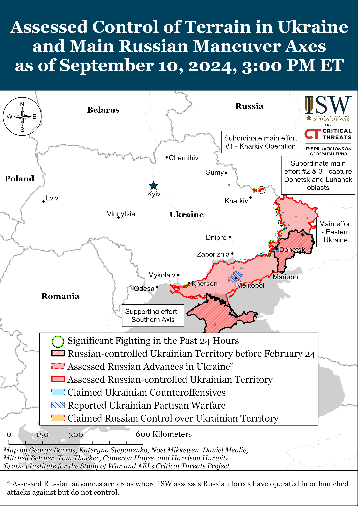
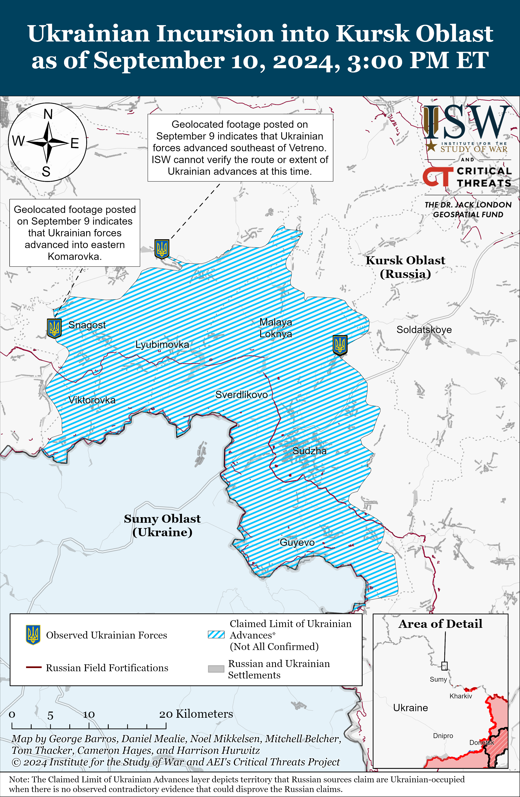
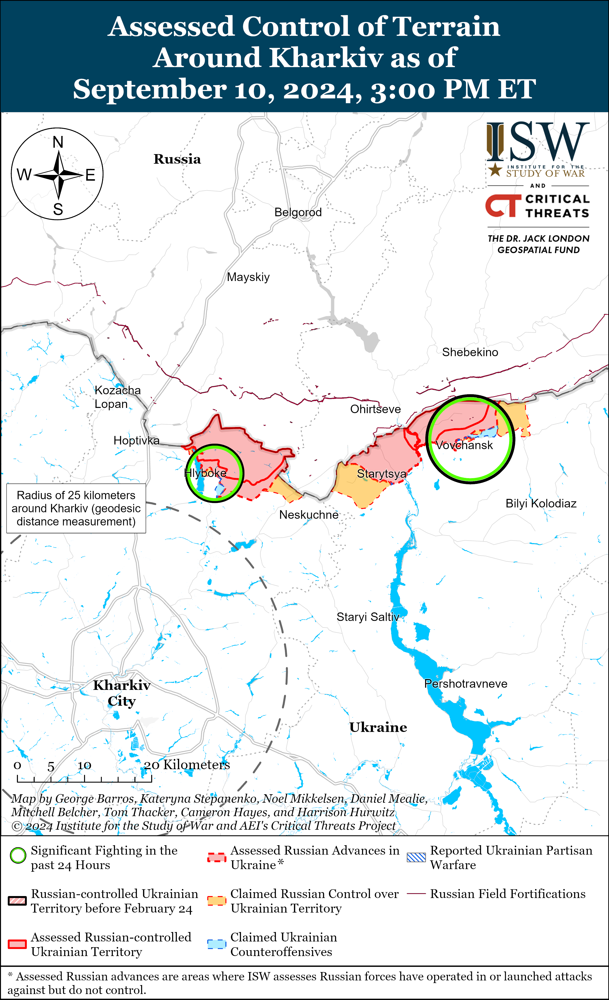
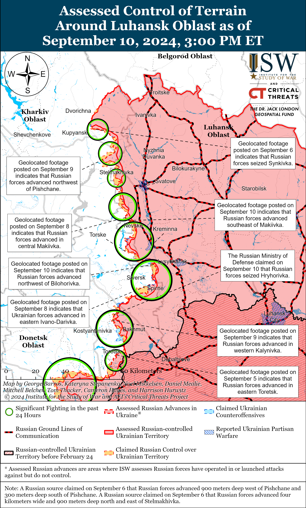
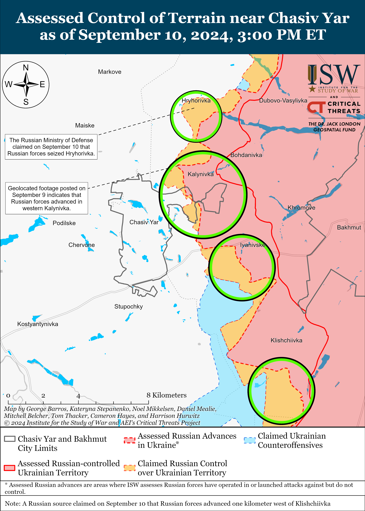
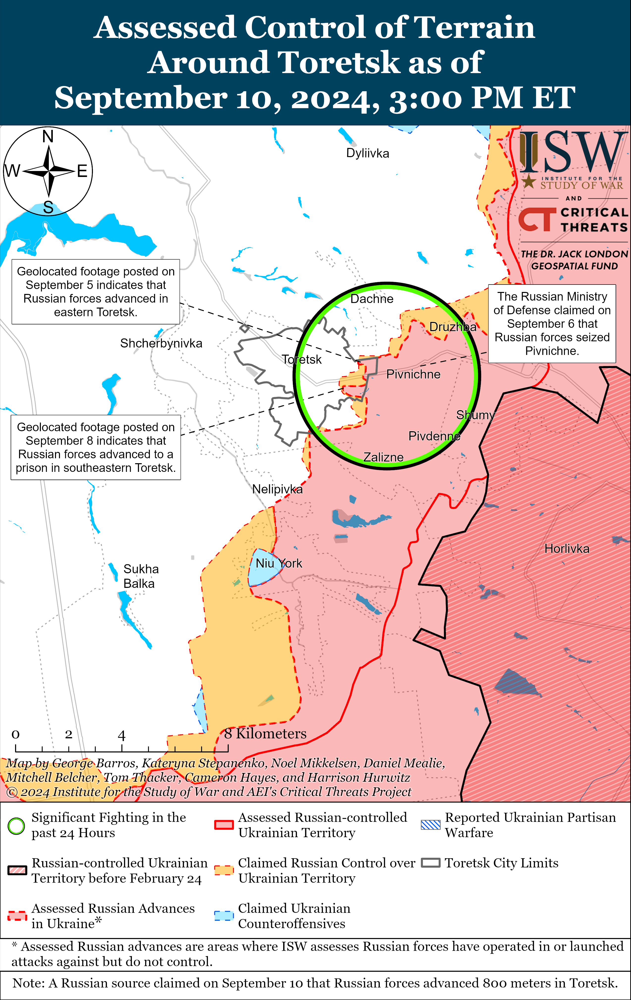
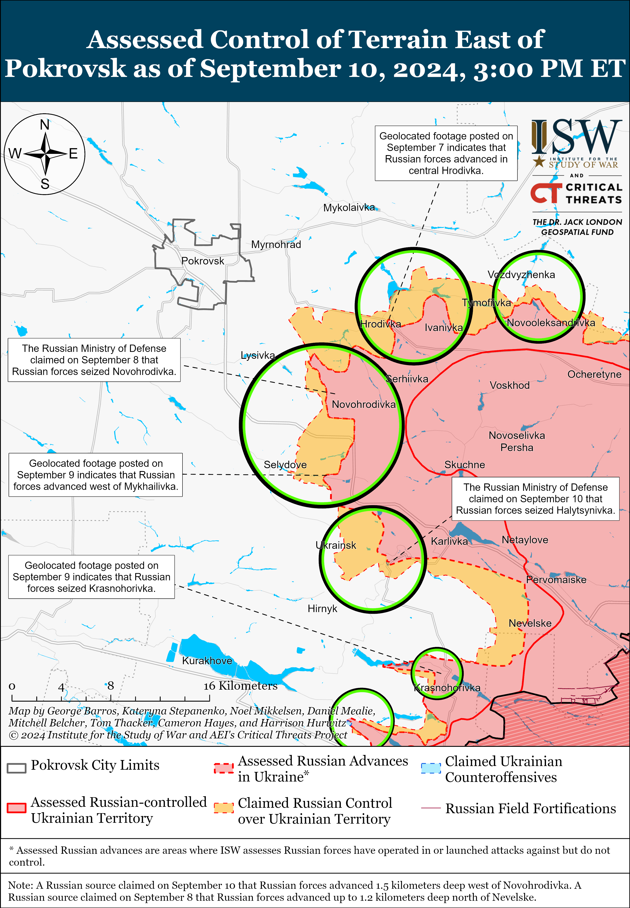
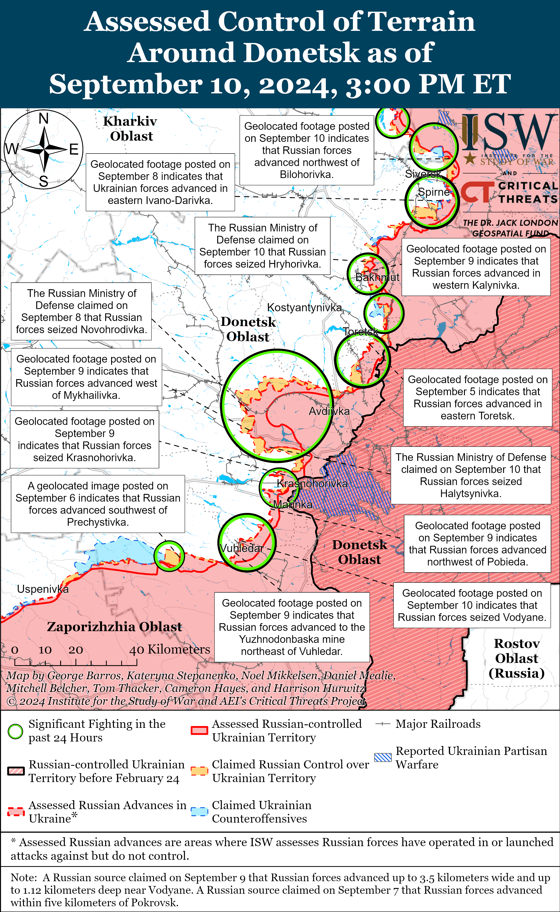
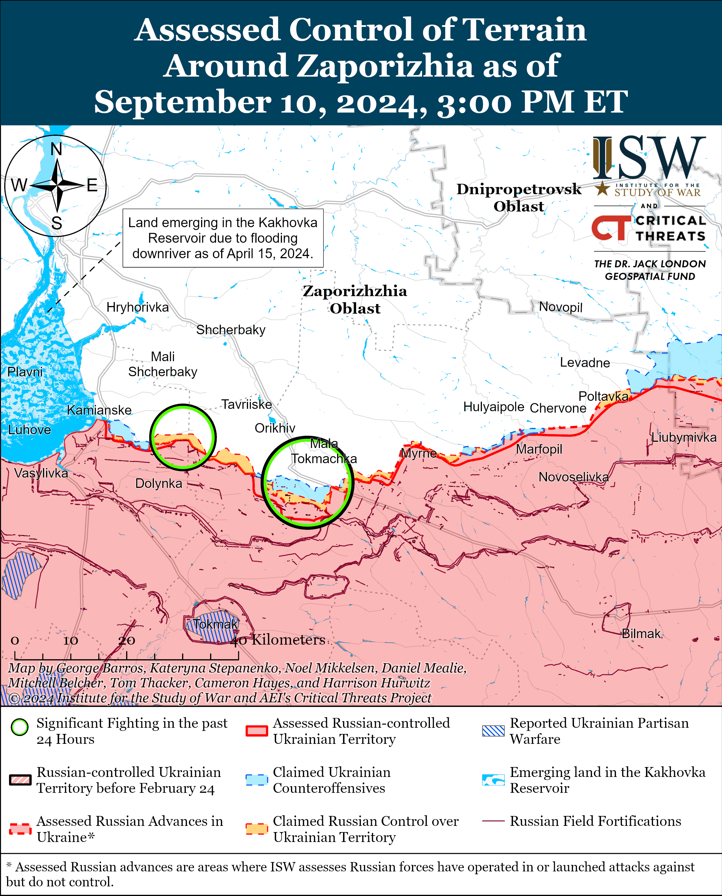
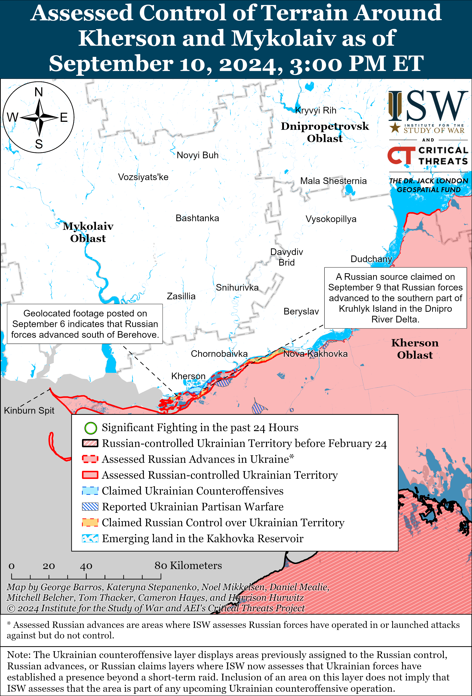

# Russian Offensive Campaign Assessment, September 10, 2024

**Nicole Wolkov, Grace Mappes, Angelica Evans, Haley Zehrung, and Karolina Hird**

**September 10, 2024, 8:15pm ET**

**Click**[**here**](https://storymaps.arcgis.com/stories/36a7f6a6f5a9448496de641cf64bd375)**to see ISW’s interactive map of the Russian invasion of Ukraine. This map is updated daily alongside the static maps present in this report.**

**Click**[**here**](https://storymaps.arcgis.com/stories/83a2f24901c941d581c0c523ecd2619b)**to see ISW’s interactive map of Ukraine’s offensive in Kursk Oblast.**

**Click**[**here**](https://understandingwar.maps.arcgis.com/apps/instant/3dviewer/index.html?appid=1602762dbcde419bb957dea358449580)**to see ISW’s 3D control of terrain topographic map of Ukraine. Use of a computer (not a mobile device) is strongly recommended for using this data-heavy tool.**

**Click**[**here**](https://storymaps.arcgis.com/stories/733fe90805894bfc8562d90b106aa895)**to access ISW’s archive of interactive time-lapse maps of the Russian invasion of Ukraine. These maps complement the static control-of-terrain map that ISW produces daily by showing a dynamic frontline. ISW will update this time-lapse map archive monthly.**

**Note: The data cut-off for this product was 1pm ET on September 10. ISW will cover subsequent reports in the September 11 Russian Offensive Campaign Assessment.**

**US Secretary of State Antony Blinken confirmed on September 10 that Iran has sent short-range ballistic missiles (SRBMs) to Russia amid growing international condemnation of Tehran’s support for Russia’s war in Ukraine.[1]**Blinken confirmed that Russia has received an unspecified number of SRBM shipments from Iran and warned that Russian forces will likely use them on the battlefield “within weeks.” Iranian officials continue to deny that Tehran has sent weapons to Moscow, however.[2] Blinken and United Kingdom (UK) Foreign Secretary David Lammy affirmed on September 10 that the US and UK are “completely aligned” on the need to tackle Iranian influence both in Ukraine and the Middle East.[3] France, Germany, and the UK jointly condemned Iran’s SRBM deliveries and emphasized that they are taking steps to cancel bilateral air services with Iran (including by sanctioning Iranian national airline Iran Air), designate individuals and organizations involved in Iran’s ballistic missile program and in the transfer of SRBMs to Russia, and sanction Russian cargo ships.[4] UK outlet *The Times*, citing Ukrainian intelligence sources, reported that Iran had delivered over 200 Fateh-360 SRBMs to Russia via a Caspian Sea port on September 4, and ISW continues to assess that Russia will use Iranian-supplied SRBMs to target Ukrainian critical infrastructure in the coming months, thus alleviating the strain on Russia’s domestic missile production capacity.[5]

**Russia and the People’s Republic of China (PRC) continue to pursue various avenues of military-technical cooperation.**US Deputy Secretary of State Kurt Campbell told *POLITICO* on September 10 that the PRC is giving Russia’s defense industry “very substantial” support in exchange for secretive Russian military technologies.[6] Campbell emphasized that the PRC is not just supplying dual-use products to Russia but is instead engaged in a “substantial effort….to help sustain, build, and diversify elements of the Russian war machine.” Campbell warned that Russia is sending the PRC safeguarded submarine, aeronautical design, and missile technologies in return, which Russia has previously been reluctant to share with Beijing. PRC officials continue to deny their support for the Russian war effort and claim that the PRC remains “impartial” when it comes to Russia’s war in Ukraine, despite frequent Western reporting of the PRC’s material support for Russian defense industrial output and geospatial intelligence capabilities.[7] Reports of more direct PRC support to Russia come against the backdrop of the Russia-led “Okean-2024” international naval exercises, which are currently taking place in the Pacific and Arctic oceans and Mediterranean, Caspian, and Baltic seas with the involvement of three ships, one vessel, and 15 aircraft of the PRC’s People’s Liberation Army (PLA).[8] Russian President Vladimir Putin announced the start of Okean-2024 on September 10 and accused the US of placing pressure on Russia and the PRC, necessitating the conduct of joint naval exercises.[9] PLA and Russian forces are also currently conducting the “Northern/Interaction-2024” joint “strategic collaboration” exercise, comprised of air force and naval drills in the Sea of Japan and Sea of Okhotsk, and a joint maritime patrol in the Pacific.[10]

**Ukrainian forces conducted a large series of drone strikes in Russia on the night of September 9 to 10.**The Russian Ministry of Defense (MoD) claimed that Russian forces intercepted 144 Ukrainian drones in total, including 72 drones over Bryansk Oblast, 20 drones over Moscow Oblast, 14 drones over Kursk Oblast, 13 drones over Tula Oblast, eight drones over Belgorod Oblast, seven drones over Kaluga Oblast, five drones over Voronezh Oblast, four drones over Lipetsk Oblast, and one drone over Oryol Oblast.[11] Footage published on September 10 reportedly shows the aftermath of a drone strike in Ramenskoye, Moscow Oblast, and Ramenskoye Urban Raion Acting Head Eduard Malyshev claimed that Ukrainian drones damaged two buildings in the raion.[12] Moscow Oblast Governor Andrei Vorobyov claimed that Russian forces shot down 14 drones near Podolsk, Ramenskoye, Lyubertsy, Domodedovo, and Kolomna.[13] Domodedovo Urban Raion Head Yevgenia Krustaleva claimed that falling drone debris blocked a section of the Kashirskoye Highway from Domodedovo to Moscow City.[14] Russian Federal Aviation Agency Rosaviatsiya stated that it introduced temporary restrictions at the Vnukovo, Domodedovo, and Zhukovsky airports near Moscow City and limited airport operations in Kazan, Tatarstan Republic in response to the drone strikes.[15] Tula Oblast authorities stated that drone debris fell on an unspecified fuel and energy facility in an unspecified location in Tula Oblast but did not damage the facility.[16] Russian milbloggers criticized Russian regional authorities for claiming that falling “debris” caused damage to infrastructure during the strikes and reiterated calls for Russian authorities to allow the Russian military, Rosgvardia, border guards, and private security companies to create mobile fire groups to repel drone strikes.[17]

**US President Joe Biden stated on September 10 that the presidential administration is working on lifting restrictions on Ukraine’s ability to use US-provided weapons to strike military objects within Russia.[18]**Biden stated that his administration is “working that out now,” in response to a question about whether the United States would lift restrictions prohibiting Ukraine from using US-provided long-range weapons to strike within Russia. US Secretary of State Antony Blinken stated earlier on September 10 during a press conference with UK Foreign Secretary David Lammy that Biden and UK Prime Minister Keir Starmer will likely discuss lifting these restrictions during a meeting on September 13.[19] House Foreign Affairs Committee Chair Michael McCaul stated on September 10 that he believes that Blinken will use the visit to Kyiv to inform Ukrainian officials that the United States will allow Ukrainian forces to use US-provided ATACMS missiles to strike within Russia.[20]

**The Kremlin is reportedly allocating roughly 59 billion rubles (about $648 million) to strengthen its technical ability to restrict internet traffic on its sovereign internet.***Forbes’*Russia service reported on September 9 that it obtained documents on Russia’s federal “Cybersecurity Infrastructure” project detailing how Russian federal censor Roskomnadzor will spend 59 billion rubles between 2025 to 2030 to update its “technical means of countering threats” (TSPU) system, which the Kremlin uses to block certain websites**.**[21]The 59-billion-ruble budget is roughly 86 percent of the 68 billion rubles (about $747 million) that the Kremlin is dedicating to the broader federal “Cybersecurity Infrastructure” project. This TSPU update will reportedly include the modernization of existing TSPU systems and installation of new TSPU systems to account for an increase in user traffic. *Forbes*noted that modernizing and increasing TSPU systems will increase Roskomnadzor’s ability to block virtual private networks (VPNs), which Russians can use to bypass Roskomnadzor’s restrictions on which websites they can view while in Russia. Roskomnadzor Head Andrei Lipov previously stated that Roskomnadzor finished equipping all communications nodes with TSPU as of September 2023, and Roskomnadzor’s Main Radio Frequency Center’s Center for Special Projects Head Sergei Temny stated in June 2024 that Roskomnadzor no longer purchases foreign equipment for TSPU and is working to replace existing foreign TSPU equipment with domestically produced alternatives.[22] Roskomnadzor has previously used TSPU to slow down access to X (formerly Twitter) and likely recently did the same for YouTube.[23] The Kremlin has recently intensified efforts to compel Russians to abandon Western social media sites in favor of Kremlin-approved alternatives, and strengthening TSPU supports technical aspects of this effort.[24] The Kremlin is likely trying to balance encouraging self-censorship as a self-deterrent among Russian ultranationalists and other critics of Russian authorities with imposing actual technical restrictions on the types of information and internet services that Russians can access.[25]

**Key Takeaways:**

- **US Secretary of State Antony Blinken confirmed on September 10 that Iran has sent short-range ballistic missiles (SRBMs) to Russia amid growing international condemnation of Tehran’s support for Russia’s war in Ukraine.**
- **Russia and the People’s Republic of China (PRC) continue to pursue various avenues of military-technical cooperation.**
- **Ukrainian forces conducted a large series of drone strikes in Russia on the night of September 9 to 10.**
- **US President Joe Biden stated on September 10 that the presidential administration is working on lifting restrictions on Ukraine’s ability to use US-provided weapons to strike military objects within Russia.**
- **The Kremlin is reportedly allocating roughly 59 billion rubles (about $648 million) to strengthen its technical ability to restrict internet traffic on its sovereign internet.**
- **Ukrainian forces recently advanced in Kursk Oblast amid continued Ukrainian offensive operations in the area on September 10.**
- **Russian forces recently advanced near Kreminna, Siversk, Toretsk, Pokrovsk, and Donetsk City.**
- **The German-based Kiel Institute for the World Economy published a report on September 9 warning that Russia has significantly increased its defense industrial base (DIB) capabilities since 2022 and that depleting weapons and equipment stockpiles may not significantly impact future Russian DIB production.**

****

***We do not report in detail on Russian war crimes because these activities are well-covered in Western media and do not directly affect the military operations we are assessing and forecasting. We will continue to evaluate and report on the effects of these criminal activities on the Ukrainian military and the Ukrainian population and specifically on combat in Ukrainian urban areas. We utterly condemn Russian violations of the laws of armed conflict and the Geneva Conventions and crimes against humanity even though we do not describe them in these reports.***

- Ukrainian Operations in the Russian Federation
- Russian Main Effort – Eastern Ukraine (comprised of three subordinate main efforts)
- Russian Subordinate Main Effort #1 – Push Ukrainian forces back from the international border with Belgorod Oblast and approach to within tube artillery range of Kharkiv City
- Russian Subordinate Main Effort #2 – Capture the remainder of Luhansk Oblast and push westward into eastern Kharkiv Oblast and encircle northern Donetsk Oblast
- Russian Subordinate Main Effort #3 – Capture the entirety of Donetsk Oblast
- Russian Supporting Effort – Southern Axis
- Russian Air, Missile, and Drone Campaign
- Russian Mobilization and Force Generation Efforts
- Russian Technological Adaptations
- Activities in Russian-occupied areas
- Ukrainian Defense Industrial Base Efforts
- Russian Information Operations and Narratives
- Significant Activity in Belarus

**Ukrainian Operations in the Russian Federation**

Ukrainian forces recently advanced in Kursk Oblast amid continued Ukrainian offensive operations in the area on September 10. Geolocated footage published on September 9 indicates that Ukrainian forces recently advanced in eastern Komarovka (southwest of Korenevo).[26] Additional geolocated footage published on September 9 indicates that Ukrainian forces advanced southeast of Vetreno (east of Korenevo), likely along a narrow salient between Russian-held areas, although the exact path of the Ukrainian advance in this area remains unclear.[27] Geolocated footage published on September 9 showing Ukrainian forces operating in eastern Russkoye Porechnoye (northeast of Sudzha) confirms that Ukrainian forces continue to operate in the settlement.[28] The Russian Ministry of Defense (MoD) and other Russian sources claimed that fighting continued near Korenevo; southwest of Korenevo near Apanasovka and Snagost; west of Korenevo near Kremyanoye; northeast of Sudzha near Cherkasskoye Porechnoye and Russkoye Porechnoye; and southeast of Sudzha near Ulanok and Borki.[29] Elements of a Russian volunteer drone unit reportedly attached to the 61st Naval Infantry Brigade (Leningrad Military District [LMD], formerly Northern Fleet) are reportedly operating near Komarovka (southwest of Korenevo).[30] ISW reported that elements of the 61st Naval Infantry Brigade were operating in Kherson Oblast as of late August 2024, indicating that Russian forces may have recently redeployed limited elements from Kherson Oblast to Kursk Oblast.[31]

**Russian Main Effort – Eastern Ukraine**

**Russian Subordinate Main Effort #1 – Kharkiv Oblast (Russian objective: Push Ukrainian forces back from the international border with Belgorod Oblast and approach to within tube artillery range of Kharkiv City)**

Russian forces continued offensive operations in northern Kharkiv Oblast on September 10 but did not make any confirmed advances. Ukraine’s Kharkiv Group of Forces published footage on September 10 showing Ukrainian forces repelling a platoon-sized Russian mechanized assault in an unspecified area of the Kharkiv direction.[32] Ukrainian National Guard Spokesperson Ruslan Muzychuk reported that Russian forces are primarily attacking in the Kharkiv direction with light vehicles such as motorcycles and all-terrain vehicles (ATVs), however, which is consistent with the general lack of reports of Russian mechanized attacks in northern Kharkiv Oblast.[33] Russian forces continued attacking north of Kharkiv City near Hlyboke and northeast of Kharkiv City near Vovchansk on September 9 and 10.[34] Elements of the Russian 11th Tank Regiment (18th Motorized Rifle Division, 11th Army Corps [AC], Leningrad Military District [LMD]) are reportedly operating near Hlyboke.[35]

****

**Russian Subordinate Main Effort #2 – Luhansk Oblast (Russian objective: Capture the remainder of Luhansk Oblast and push westward into eastern Kharkiv Oblast and northern Donetsk Oblast)**

Russian forces recently marginally advanced northwest of Kreminna amid continued offensive operations along the Kupyansk-Svatove-Kreminna line on September 10. Geolocated footage published on September 10 indicates that Russian forces recently marginally advanced along a windbreak southeast of Makiivka (northwest of Kreminna).[36] Russian milbloggers claimed that Russian forces also advanced west and south of Synkivka (northeast of Kupyansk), but ISW has not observed confirmation of these claims.[37] Russian forces continued offensive operations east of Kupyansk near Petropavlivka; southeast of Kupyansk near Hlushkivka, Lozova, and Stelmakhivka; northwest of Kreminna near Chereshchyna, Druzhelyubivka, Tverdokhlibove, Novosadove, and Nevske; west of Kreminna near Torske; and southwest of Kreminna near Dibrova on September 9 and 10.[38] The deputy commander of a Ukrainian brigade reportedly operating near Kreminna stated that Russian forces are focusing their offensive efforts near Makiivka and that Russian forces rotated an unspecified replenished motorized rifle regiment to replace another degraded regiment previously operating in the area.[39]

**Russian Subordinate Main Effort #3 – Donetsk Oblast (Russian objective: Capture the entirety of Donetsk Oblast, the claimed territory of Russia’s proxies in Donbas)**

Russian forces recently marginally advanced northeast of Siversk amid continued assaults in the area on September 10. Geolocated footage published on September 10 indicates that Russian forces recently marginally advanced in the fields northwest of Bilohorivka (northeast of Siversk).[40] Russian forces continued ground attacks east of Siversk near Verkhnokamyanske; southeast of Siversk near Spirne and Ivano-Darivka; and south of Siversk near Zvanivka on September 9 and 10.[41]

Russian forces continued offensive operations near Chasiv Yar on September 10, but there were no confirmed changes to the frontline. The Russian Ministry of Defense (MoD) claimed that Russian forces seized Hryhorivka (north of Chasiv Yar) and most of Kalynivka (northeast of Chasiv Yar), and Russian milbloggers claimed that Russian forces advanced near Zalyznyanske (north of Chasiv Yar) and west of Klishchiiivka (south of Chasiv Yar).[42] ISW has not observed confirmation of any of these claims, however. Russian forces continued offensive operations in eastern Chasiv Yar; east of Chasiv Yar near Ivanivske; and south of Chasiv Yar near Bila Hora on September 9 and 10.[43] Elements of the Russian 200th Separate Motorized Rifle Brigade (14th Army Corps [AC], Leningrad Military District [LMD]) reportedly continue to operate near Chasiv Yar.[44]

Russian forces marginally advanced in eastern Toretsk amid continued fighting in the area on September 10. Geolocated footage published on September 5 indicates that Russian forces marginally advanced in eastern Toretsk.[45] Russian sources claimed that Russian forces advanced roughly 800 meters in eastern Toretsk and advanced a kilometer from Niu York (south of Toretsk), but ISW has not observed confirmation of these claims.[46] Russian forces also continued offensive operations northeast of Toretsk near Druzhba and south of Toretsk near Nelipivka on September 9 and 10.[47] Elements of the Russian 9th Motorized Rifle Brigade (51st Combined Arms Army [CAA], formerly 1st Donetsk People’s Republic Army Corps [DNR AC]) are reportedly operating in Niu York.[48]

Russian forces recently marginally advanced southeast of Pokrovsk amid continued offensive operations in the area on September 10. Geolocated footage published on September 9 indicates that Russian forces recently advanced west and southwest of Mykhailivka (southeast of Pokrovsk and just east of Selydove).[49] The Russian MoD claimed that Russian forces seized Halytsynivka (southeast of Pokrovsk and further southeast of Mykhailivka), although ISW has not observed confirmation of Russian forces operating in the southernmost part of Halytsynivka.[50] Russian milbloggers claimed that Russian forces advanced up to 1.5 kilometers west of Novohrodivka (southeast of Pokrovsk) and northeast of Selydove (southeast of Pokrovsk), but ISW has not observed confirmation of these claims.[51] Ukrainian military observer Kostyantyn Mashovets noted that Russian forces are struggling to simultaneously advance towards Pokrovsk itself and southeast of Pokrovskalong the Selydove-Ukrainsk-Hirnyk line despite concentrating over almost an entire army corps worth of manpower and equipment in the area.[52] Mashovets stated that Russian forces are conducting 16 to 25 attacks per day in some areas of the Pokrovsk direction and that Russian forces are increasingly attacking with squad- and platoon-sized groups instead of larger groups in the area.[53] Mashovets reported that elements of the Russian 27th Motorized Rifle Division (2nd CAA, Central Military District [CMD]), 114th Motorized Rifle Brigade (51th CAA, formerly 1st DNR AC), 90th Tank Division (41st CAA, CMD), 5th and 110th motorized rifle brigades (both 51st CAA), and several unspecified mobilized reserve units are operating southeast of Pokrovsk near Zhelanne Pershe.[54] Russian forces continued offensive operations east of Pokrovsk near Novooleksandrivka, Vozdvyzhenka, Zelene Pole, Svyrydonivka, Ivanivka, Hrodivka and towards Novotroitske, and southeast of Pokrovsk near Novohrodivka, Selydove, Ukrainsk, Hirnyk, Mykhailivka, Marynivka, Zhelanne Pershe, and Halytsynivka on September 9 and 10.[55] Russian Defense Minister Andrei Belousov praised elements of the Russian 30th Motorized Rifle Brigade (2nd CAA, CMD) and 1435th Motorized Rifle Regiment (likely comprised of mobilized personnel) for their roles in previously seizing Novohrodivka and elements of the Russian 228th Motorized Rifle Regiment (90th Tank Division, 41st CAA, CMD) for their role in previously seizing Memryk (southeast of Pokrovsk).[56] Elements of the Russian 15th Motorized Rifle Brigade (2nd CAA, CMD) reportedly continue to operate in the Pokrovsk direction.[57]

Russian forces recently advanced west of Donetsk City amid continued fighting in the area on September 10. Geolocated footage published on September 10 indicates that Russian forces recently advanced in western Krasnohorivka, indicating that Russian forces have seized the entire settlement.[58] The Russian MoD also claimed that Russian forces seized Krasnohorivka, consistent with the available geolocated evidence.[59] Russian forces continued offensive operations near Heorhiivka on September 9 and 10.[60] Elements of the Russian 5th and 110th motorized rifle brigades and the 238th Artillery Brigade (8th CAA, Southern Military District [SMD]) are reportedly operating near Krasnohorivka.[61]

Russian forces recently marginally advanced southwest of Donetsk City amid continued fighting in the area on September 10. Geolocated footage published on September 9 shows Ukrainian forces striking several Russian armored vehicles operating northwest of Pobieda (northeast of Vuhledar), indicating that Russian forces recently marginally advanced in the area.[62] Additional geolocated footage published on September 10 indicates that Russian forces advanced in central and northwestern Vodyane (just northeast of Vuhledar) and have likely seized the settlement.[63] The spokesperson for a Ukrainian brigade operating southwest of Donetsk City reported that Russian forces are concentrating their efforts along the T0524 highway northeast of Vuhledar between Paraskoviivka and Kostyantynivka and are attacking in the area daily.[64] Russian milbloggers claimed that Russian forces advanced further west of Vodyane and are advancing near Vuhledar.[65] Russian forces continued offensive operations near Kostyantynivka on September 9 and 10.[66]

Russian forces continued offensive operations in the Donetsk-Zaporizhia Oblast border area near Zolota Nyva (southeast of Velyka Novosilka) on September 10, but there were no confirmed changes to the frontline.[67]

**Russian Supporting Effort – Southern Axis (Russian objective: Maintain frontline positions and secure rear areas against Ukrainian strikes)**

Russian forces continued ground attacks in western Zaporizhia Oblast on September 10, but there were no confirmed changes to the frontline. Fighting continued northwest of Robotyne near Mali Shcherbaky and northeast of Robotyne near Mala Tokmachka on September 9 and 10.[68] Ukrainian Tavriisk Group of Forces Spokesperson Captain Dmytro Lykhovyi reported that Russian forces have recently significantly intensified air strikes against frontline areas in southern Ukraine.[69] Drone operators of the North Ossetian ”Alania” Battalion (Russian Volunteer Corps) are reportedly operating in the Zaporizhia direction and elements of the Russian “Valkyria” detachment (4th Military Base, 58th Combined Arms Army [CAA], Southern Military District [SMD]) are reportedly operating near Kamyanske (northwest of Robotyne).[70]

Russian forces continued ground attacks in east (left) Kherson Oblast on September 10, but there were no confirmed changes to the frontline. A Russian milblogger claimed on September 10 that Russian forces advanced in the Dnipro River island delta north of Kozachi Laheri and are approaching the west (right) bank of the Dnipro River, but ISW has not observed visual confirmation of this claim.[71] Lykhovyi stated on September 10 that Russian forces conducted 40 attacks north of Krynky and in the Dnipro River delta from September 6 to September 10 and are focusing their attacks from the direction of Bilohrudove (southwest of Kherson City and within the Dnipro River delta).[72]

**Russian Air, Missile, and Drone Campaign (Russian Objective: Target Ukrainian military and civilian infrastructure in the rear and on the frontline)**

Russian forces conducted a series of drone and missile strikes against Ukraine on the night of September 9 to 10. The Ukrainian Air Force reported that Russian forces launched an Iskander-M ballistic missile from occupied Crimea, a Kh-31P anti-radar missile from airspace over the Black Sea, and 46 Shahed-136/131 drones from Kursk Oblast and Yeysk, Krasnodar Krai.[73] The Ukrainian Air Force reported that Ukrainian forces downed 38 drones over Vinnytsia, Kyiv, Chernihiv, Kirovohrad, Mykolaiv, Odesa, Kherson, Cherkasy, Sumy, Dnipropetrovsk, Kharkiv, Zaporizhia, and Poltava oblasts and that one Shahed drone flew back into Russian airspace, two drones flew into airspace over occupied Luhansk Oblast, and three Shahed drones crashed in Ukraine before striking their intended targets, likely due to Ukrainian electronic warfare (EW) interference.

**Russian Mobilization and Force Generation Efforts (Russian objective: Expand combat power without conducting general mobilization)**

The German-based Kiel Institute for the World Economy published a report on September 9 warning that Russia has significantly increased its defense industrial base (DIB) capabilities since 2022 and that depleting weapons and equipment stockpiles may not significantly impact future Russian DIB production.[74] The Kiel Institute reported that between the final quarter of 2022 and the second quarter of 2024, Russia increased tank production by 215 percent from 123 to 387 per quarter; armored vehicle production by 141 percent from 585 to 1,409 per quarter; artillery gun production by 149 percent from 45 to 112 per quarter; short-range air defense systems by 200 percent from nine to 38 per quarter; medium- and long-range air defense systems by 100 percent from six to 12 per quarter; and Lancet loitering munitions by 475 percent from 93 to 535 per quarter. The Kiel Institute caveated these statistics with the fact that 80 percent of Russian armored vehicle and tank production thus far has been a result of retrofitting existing tank hulls from pre-existing stockpiles rather than producing new vehicles, but warned that Russian armored vehicle production may not significantly decrease when Russia’s existing stockpiles run out. The Kiel Institute assessed that Russia’s armored vehicle production rate will likely decrease beginning in 2026 as Russia burns through its Soviet-era stockpiles but that Russia will likely open new production lines in the coming years to prepare to mitigate that effect. The Kiel Institute estimated that Russia will likely produce 350 modern tanks per year after 2026 even if Russia does not open additional production lines. The Kiel Institute also warned that Russia is working to increase domestic production of “rear systems” such as artillery and air defense and reduce its reliance on pre-existing stockpiles of such systems. The Kiel Institute also credited North Korean ammunition provisions with giving Russia a “strong oversupply” of artillery ammunition and reported that Russian forces are firing 10,000 shells per day.

**Russian Technological Adaptations (Russian objective: Introduce technological innovations to optimize systems for use in Ukraine)**

Nothing significant to report.

**Ukrainian Defense Industrial Efforts (Ukrainian objective: Develop its defense industrial base to become more self-sufficient in cooperation with US, European, and international partners)**

*ISW is suspending publishing coverage of Ukrainian defense industrial efforts until further notice.*

**Activities in Russian-occupied areas (Russian objective: Consolidate administrative control of annexed areas; forcibly integrate Ukrainian citizens into Russian sociocultural, economic, military, and governance systems)**

*ISW is not publishing coverage of occupied areas today.*

**Russian Information Operations and Narratives**

Russian Security Council Secretary Sergei Shoigu reiterated boilerplate Russian information operations aimed at weakening Western support for Ukraine by deriding Ukrainian operations in Kursk Oblast. Shoigu claimed on September 10 in an interview with Russian state-owned TV channel *Rossiya-24* that Ukraine intends to attack the Kursk Nuclear Power Plant (KNPP), and that Russia is refusing to negotiate with Ukraine until Ukrainian forces withdraw from Kursk Oblast.[75] ISW previously noted that Ukrainian forces have consistently demonstrated capabilities to conduct rear area strikes within Russia and occupied Ukraine at distances exceeding the roughly 60 kilometers between the KNPP and the international border or the roughly 30-40 kilometers from the current Ukrainian FLOT within Kursk Oblast, suggesting that the Ukrainian military command has deliberatively avoided striking the KNPP.[76] ISW also continues to assess that Russia is not interested in good-faith negotiations with Ukraine to end the war and that the Kremlin continues to frame its objective of total Ukrainian capitulation as reasonable and fundamental to its alleged “negotiating” terms.[77]

**Significant activity in Belarus (Russian efforts to increase its military presence in Belarus and further integrate Belarus into Russian-favorable frameworks and Wagner Group activity in Belarus)**

Belarusian Central Election Commission (CEC) Chairperson Igor Karpenko stated on September 10 that Belarus must hold presidential elections by July 20, 2025, and that Belarusian officials will announce several possible dates for the presidential election date after the Belarusian National Assembly meets on September 17.[78]

**Note: ISW does not receive any classified material from any source, uses only publicly available information, and draws extensively on Russian, Ukrainian, and Western reporting and social media as well as commercially available satellite imagery and other geospatial data as the basis for these reports. References to all sources used are provided in the endnotes of each update.**

---

[1] https://www.washingtonpost.com/national-security/2024/09/10/blinken-russia-iran-ukraine-missiles/

[2] https://www.washingtonpost.com/national-security/2024/09/10/blinken-russia-iran-ukraine-missiles/ ; https://www.reuters.com/world/middle-east/iran-denies-reports-missile-transfer-russia-2024-09-09/

[3] https://www.reuters.com/world/europe/uks-lammy-announces-joint-visit-ukraine-with-antony-blinken-2024-09-10/

[4] https://www.auswaertiges-amt.de/en/newsroom/news/e3/2675032?pk\_campaign=newsletter\_Press\_release\_2024\_09\_10&pk\_kwd=link\_E3+Foreign+Ministers%E2%80%99+Statement+on+Iranian+transfers+of+Ballistic+Missiles+to+Russia; https://x.com/FCDOGovUK/status/1833534672648699989

[5] https://understandingwar.org/backgrounder/russian-offensive-campaign-assessment-september-7-2024; https://understandingwar.org/backgrounder/russian-offensive-campaign-assessment-september-6-2024

[6] https://www.politico.eu/article/united-states-accuse-china-help-russia-war-kurt-campbell/

[7] https://www.cnn.com/2024/04/12/politics/china-russia-support-weapons-manufacturing/index.html#:~:text=The%20support%20China%20is%20providing,for%20weapons%2C%20said%20the%20officials.; https://www.ft.com/content/ecd934b6-8a91-4b78-a360-9111f771f9b1; https://www.bloomberg.com/news/articles/2024-04-06/china-is-providing-geospatial-intelligence-to-russia-us-warns

[8] https://t.me/mod\_russia/43206; http://kremlin dot ru/events/president/news/75083

[9] http://kremlin dot ru/events/president/news/75083

[10] http://eng.chinamil dot com.cn/CHINA\_209163/TopStories\_209189/16337211.html

[11] https://t.me/mod\_russia/43175

[12] https://t.me/RVvoenkor/76701 ; https://t.me/vchkogpu/50785 ; https://t.me/DnevnikDesantnika/15212 ; https://t.me/motopatriot/27238 ; https://t.me/sotaproject/86914 ; https://t.me/tass\_agency/271670

[13] https://t.me/tass\_agency/271667

[14] https://t.me/tass\_agency/271686

[15] https://t.me/tass\_agency/271689 https://t.me/tass\_agency/271691

[16] https://t.me/tass\_agency/271655

[17] https://t.me/dva\_majors/52130 ; https://t.me/belarusian\_silovik/40880 ; https://t.me/dva\_majors/52061

[18] https://www.reuters.com/world/biden-says-administration-working-potentially-lifting-ban-ukraine-long-range-2024-09-10/

[19] https://www.state.gov/secretary-antony-j-blinken-and-united-kingdom-foreign-secretary-david-lammy-joint-press-availability/

[20] https://www.politico.com/news/2024/09/10/ukraine-us-uk-officials-russia-00178216

[21] https://www.forbes dot ru/tekhnologii/520876-rkn-pletet-novye-seti-sluzba-obnovit-sistemu-blokirovki-sajtov-za-59-mlrd-rublej

[22] https://www.interfax dot ru/russia/927357; https://www.forbes dot ru/tekhnologii/520876-rkn-pletet-novye-seti-sluzba-obnovit-sistemu-blokirovki-sajtov-za-59-mlrd-rublej

[23] https://understandingwar.org/backgrounder/russian-offensive-campaign-assessment-july-12-2024

[24] https://understandingwar.org/backgrounder/russian-offensive-campaign-assessment-july-12-2024; https://isw.pub/UkrWar080924; https://isw.pub/UkrWar073024

[25] https://isw.pub/UkrWar090824;

[26] https://x.com/Bielitzling/status/1833254118317580424; https://t.me/CombatBums/84

[27] https://t.me/creamy\_caprice/6742; https://t.me/dva\_majors/52044

[28] https://t.me/VARVARGROUP/340; https://x.com/Ryan72101/status/1833224365410029667

[29] https://t.me/mod\_russia/43197 ; https://t.me/milinfolive/130291 ; https://t.me/RVvoenkor/76756 ; https://t.me/rybar/63404 ; https://t.me/rybar/63383 ; https://t.me/dva\_majors/52070; https://t.me/DnevnikDesantnika/15238 ; https://t.me/rusich\_army/17052 ; https://t.me/milinfolive/130291

[30] https://x.com/Bielitzling/status/1833254118317580424; https://t.me/CombatBums/84

[31] https://understandingwar.org/backgrounder/russian-offensive-campaign-assessment-april-23-2024

[32] https://t.me/otukharkiv/1244

[33] https://armyinform dot com.ua/2024/09/10/ataky-v-styli-skazhenogo-maksa-rosijska-pihota-lize-vpered-na-bagi-ta-motoczyklah/

[34] https://www.facebook.com/GeneralStaff.ua/posts/pfbid02KYGXqehXCqL29rhQs1oonm7p239ahMLHYUsF9t5Fco1FQz4JdHismskHrCDJtqhJl ; https://www.facebook.com/GeneralStaff.ua/posts/pfbid0249Lau8VoD1HLZQas2Wgfz2DsTTbN3W3rLd8jtsWbgb8Eof2XBXNabRAQ4PHCq2Kl ; https://www.facebook.com/GeneralStaff.ua/posts/pfbid02MwHx9eUd27R7826xS7ASvxoWtR9HPmvvGZBPmHfCvZTzhhgh7kt7rK4ddnWqbca5l ; https://t.me/wargonzo/22022 ; https://t.me/Sladkov\_plus/11370

[35] https://t.me/otukharkiv/1237

[36] https://t.me/creamy\_caprice/6746; https://t.me/Ci4team\_4mb/111; https://t.me/ButusovPlus/13496; https://t.me/ButusovPlus/13493

[37] https://t.me/motopatriot/27291; https://t.me/boris\_rozhin/136784; https://t.me/DnevnikDesantnika/15207

[38] https://www.facebook.com/GeneralStaff.ua/posts/pfbid0249Lau8VoD1HLZQas2Wgfz2DsTTbN3W3rLd8jtsWbgb8Eof2XBXNabRAQ4PHCq2Kl; https://www.facebook.com/GeneralStaff.ua/posts/pfbid02KYGXqehXCqL29rhQs1oonm7p239ahMLHYUsF9t5Fco1FQz4JdHismskHrCDJtqhJl; https://www.facebook.com/GeneralStaff.ua/posts/pfbid02KYGXqehXCqL29rhQs1oonm7p239ahMLHYUsF9t5Fco1FQz4JdHismskHrCDJtqhJl

[39] https://armyinform dot com.ua/2024/09/10/mlyny-tretoyi-shturmovoyi-peremololy-vorozhyj-polk-na-harkivshhyni/

[40] https://t.me/creamy\_caprice/6747; https://t.me/sowaFm/512

[41] https://www.facebook.com/GeneralStaff.ua/posts/pfbid02KYGXqehXCqL29rhQs1oonm7p239ahMLHYUsF9t5Fco1FQz4JdHismskHrCDJtqhJl ; https://www.facebook.com/GeneralStaff.ua/posts/pfbid0249Lau8VoD1HLZQas2Wgfz2DsTTbN3W3rLd8jtsWbgb8Eof2XBXNabRAQ4PHCq2Kl ; https://www.facebook.com/GeneralStaff.ua/posts/pfbid02MwHx9eUd27R7826xS7ASvxoWtR9HPmvvGZBPmHfCvZTzhhgh7kt7rK4ddnWqbca5l

[42] https://t.me/mod\_russia/43184 ; https://t.me/motopatriot/27251 ; https://t.me/motopatriot/27289 ; https://t.me/DnevnikDesantnika/15246 ; https://t.me/motopatriot/27231 ; https://t.me/DnevnikDesantnika/15240

[43] https://www.facebook.com/GeneralStaff.ua/posts/pfbid02KYGXqehXCqL29rhQs1oonm7p239ahMLHYUsF9t5Fco1FQz4JdHismskHrCDJtqhJl ; https://www.facebook.com/GeneralStaff.ua/posts/pfbid02MwHx9eUd27R7826xS7ASvxoWtR9HPmvvGZBPmHfCvZTzhhgh7kt7rK4ddnWqbca5l;https://www.facebook.com/GeneralStaff.ua/posts/pfbid0249Lau8VoD1HLZQas2Wgfz2DsTTbN3W3rLd8jtsWbgb8Eof2XBXNabRAQ4PHCq2Kl ; https://t.me/DnevnikDesantnika/15207 ;

[44] https://t.me/motopatriot/27268

[45] https://t.me/WarArchive\_ua/19811; https://www.tiktok.com/@s\_v\_i\_d\_o\_m\_y\_i/video/7410813316991307040?\_r=1&\_t=8pa9pZtPpyf

[46] https://t.me/DnevnikDesantnika/15253 ; https://t.me/boris\_rozhin/136784 ; https://t.me/tass\_agency/271735

[47] https://www.facebook.com/GeneralStaff.ua/posts/pfbid02KYGXqehXCqL29rhQs1oonm7p239ahMLHYUsF9t5Fco1FQz4JdHismskHrCDJtqhJl ; https://www.facebook.com/GeneralStaff.ua/posts/pfbid0249Lau8VoD1HLZQas2Wgfz2DsTTbN3W3rLd8jtsWbgb8Eof2XBXNabRAQ4PHCq2Kl ; https://www.facebook.com/GeneralStaff.ua/posts/pfbid02MwHx9eUd27R7826xS7ASvxoWtR9HPmvvGZBPmHfCvZTzhhgh7kt7rK4ddnWqbca5l ; https://t.me/boris\_rozhin/136784

[48] https://t.me/RVvoenkor/76673 ; https://t.me/motopatriot/27229

[49] https://t.me/creamy\_caprice/6736; https://t.me/ghost\_of\_khortytsia/141 ; https://t.me/creamy\_caprice/6731; https://t.me/karadag15brop/45

[50] https://t.me/mod\_russia/43185

[51] https://t.me/DnevnikDesantnika/15266 ; https://t.me/motopatriot/27287 ; https://t.me/dva\_majors/52062 ; https://t.me/z\_arhiv/28044

[52] https://t.me/zvizdecmanhustu/2171

[53] https://t.me/zvizdecmanhustu/2172

[54] https://t.me/zvizdecmanhustu/2171

[55] https://www.facebook.com/GeneralStaff.ua/posts/pfbid02KYGXqehXCqL29rhQs1oonm7p239ahMLHYUsF9t5Fco1FQz4JdHismskHrCDJtqhJl ; https://www.facebook.com/GeneralStaff.ua/posts/pfbid0249Lau8VoD1HLZQas2Wgfz2DsTTbN3W3rLd8jtsWbgb8Eof2XBXNabRAQ4PHCq2Kl ; https://www.facebook.com/GeneralStaff.ua/posts/pfbid02MwHx9eUd27R7826xS7ASvxoWtR9HPmvvGZBPmHfCvZTzhhgh7kt7rK4ddnWqbca5l ; https://t.me/wargonzo/22022 ; https://t.me/dva\_majors/52057 ; https://t.me/motopatriot/27267

[56] https://t.me/mod\_russia/43171

[57] https://t.me/boris\_rozhin/136831

[58] https://t.me/creamy\_caprice/6732; https://t.me/Sladkov\_plus/11361

[59] https://t.me/mod\_russia/43184

[60] https://www.facebook.com/GeneralStaff.ua/posts/pfbid02KYGXqehXCqL29rhQs1oonm7p239ahMLHYUsF9t5Fco1FQz4JdHismskHrCDJtqhJl ; https://www.facebook.com/GeneralStaff.ua/posts/pfbid0249Lau8VoD1HLZQas2Wgfz2DsTTbN3W3rLd8jtsWbgb8Eof2XBXNabRAQ4PHCq2Kl ; https://www.facebook.com/GeneralStaff.ua/posts/pfbid02MwHx9eUd27R7826xS7ASvxoWtR9HPmvvGZBPmHfCvZTzhhgh7kt7rK4ddnWqbca5l ;

[61] https://t.me/RVvoenkor/76672 ; https://t.me/RVvoenkor/76681 ; https://t.me/Sladkov\_plus/11361

[62] https://t.me/creamy\_caprice/6729; https://t.me/Ugolok\_Sitha/21923

[63] https://t.me/creamy\_caprice/6744; https://t.me/ZovSAG164/55862 ; https://t.me/creamy\_caprice/6737; https://t.me/voin\_dv/10719 ; https://t.me/z\_arhiv/28046 ; https://t.me/RVvoenkor/76740 ; https://t.me/voenkorKotenok/58940

[64] https://suspilne dot media/832659-samit-krimskoi-platformi-vidbudetsa-11-veresna-u-vivtorok-svitlo-ne-vidklucatimut-930-den-vijni-onlajn/?anchor=live\_1725967718&utm\_source=copylink&utm\_medium=ps

[65] https://t.me/motopatriot/27250 ; https://t.me/wargonzo/22022

[66] https://www.facebook.com/GeneralStaff.ua/posts/pfbid02KYGXqehXCqL29rhQs1oonm7p239ahMLHYUsF9t5Fco1FQz4JdHismskHrCDJtqhJl ; https://www.facebook.com/GeneralStaff.ua/posts/pfbid0249Lau8VoD1HLZQas2Wgfz2DsTTbN3W3rLd8jtsWbgb8Eof2XBXNabRAQ4PHCq2Kl ; https://www.facebook.com/GeneralStaff.ua/posts/pfbid02MwHx9eUd27R7826xS7ASvxoWtR9HPmvvGZBPmHfCvZTzhhgh7kt7rK4ddnWqbca5l ;

[67] https://www.facebook.com/GeneralStaff.ua/posts/pfbid0249Lau8VoD1HLZQas2Wgfz2DsTTbN3W3rLd8jtsWbgb8Eof2XBXNabRAQ4PHCq2Kl ; https://www.facebook.com/GeneralStaff.ua/posts/pfbid02MwHx9eUd27R7826xS7ASvxoWtR9HPmvvGZBPmHfCvZTzhhgh7kt7rK4ddnWqbca5l

[68] https://www.facebook.com/GeneralStaff.ua/posts/pfbid02KYGXqehXCqL29rhQs1oonm7p239ahMLHYUsF9t5Fco1FQz4JdHismskHrCDJtqhJl; https://www.facebook.com/GeneralStaff.ua/posts/pfbid0249Lau8VoD1HLZQas2Wgfz2DsTTbN3W3rLd8jtsWbgb8Eof2XBXNabRAQ4PHCq2Kl; https://www.facebook.com/GeneralStaff.ua/posts/pfbid02MwHx9eUd27R7826xS7ASvxoWtR9HPmvvGZBPmHfCvZTzhhgh7kt7rK4ddnWqbca5l

[69] https://armyinform dot com.ua/2024/09/10/otruty-z-neba-bilshaye-rosiyany-bombarduyut-pivden-toksychnymy-boyeprypasamy/

[70] https://t.me/wargonzo/22029; https://t.me/boris\_rozhin/136756

[71] https://t.me/boris\_rozhin/136784

[72] https://armyinform dot com.ua/2024/09/10/piratska-vijna-na-dniprovskyh-ostrovah-shturmy-zasady-katery/

[73] https://t.me/kpszsu/19105; https://armyinform dot com.ua/2024/09/10/masshtabna-ataka-droniv-ta-raket-syly-ppo-zbyly-38-shahediv/

[74] https://www.ifw-kiel dot de/publications/news/germany-is-rearming-too-slowly-to-stand-up-to-russia/ ; https://www.ifw-kiel dot de/fileadmin/Dateiverwaltung/IfW-Publications/fis-import/1f9c7f5f-15d2-45c4-8b85-9bb550cd449d-Kiel\_Report\_no1.pdf

[75] https://t.me/tass\_agency/271695 ; https://t.me/tass\_agency/271696 ; https://www.gazeta dot ru/army/2024/09/10/19725661.shtml ; https://www.kommersant dot ru/doc/7042788 ; https://t.me/tass\_agency/271727 ; https://t.me/tass\_agency/271728 ; https://smotrim dot ru/brand/9928?utm\_source=internal&utm\_medium=player&utm\_type=article

[76] https://isw.pub/UkrWar082724

[77] https://understandingwar.org/backgrounder/russian-offensive-campaign-assessment-august-17-2024

[78] https://belta dot by/politics/view/karpenko-est-chetyre-vozmozhnye-daty-provedenija-prezidentskih-vyborov-v-belarusi-660105-2024/
