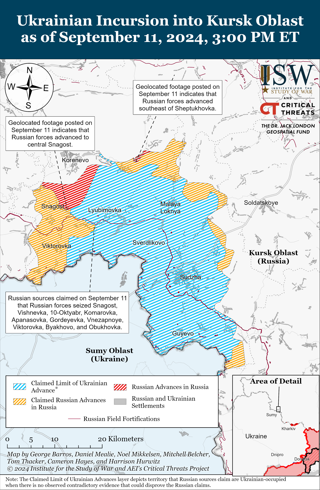
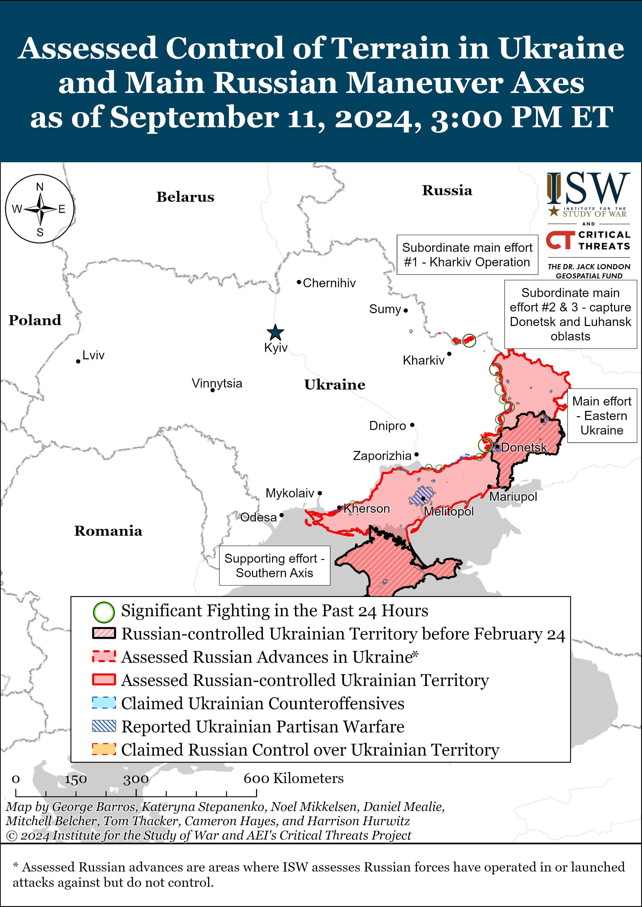
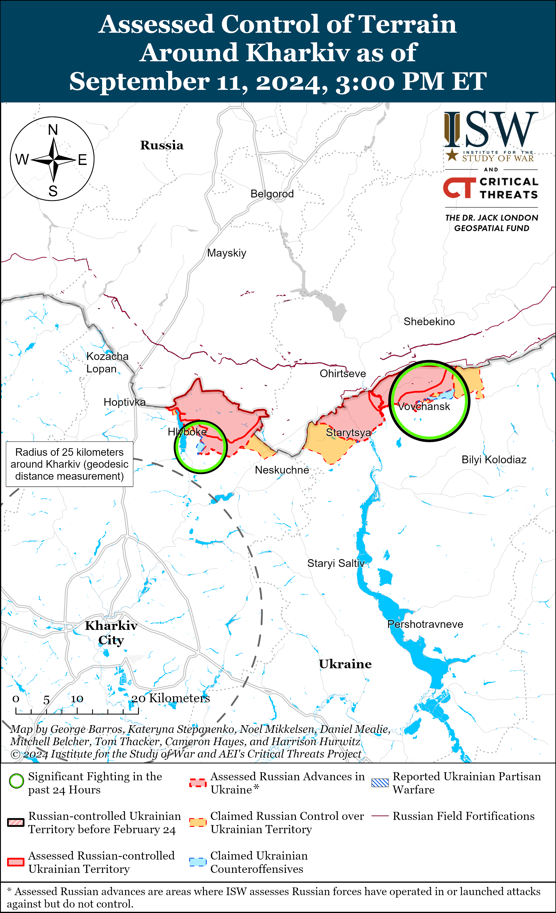
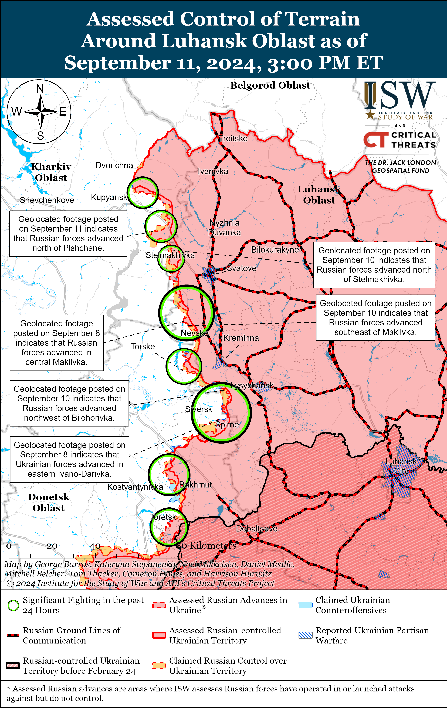
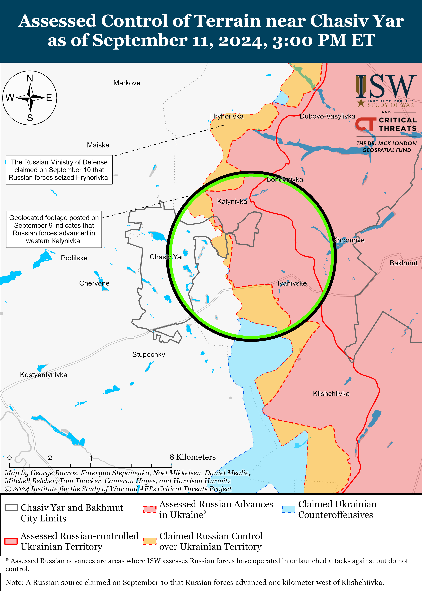
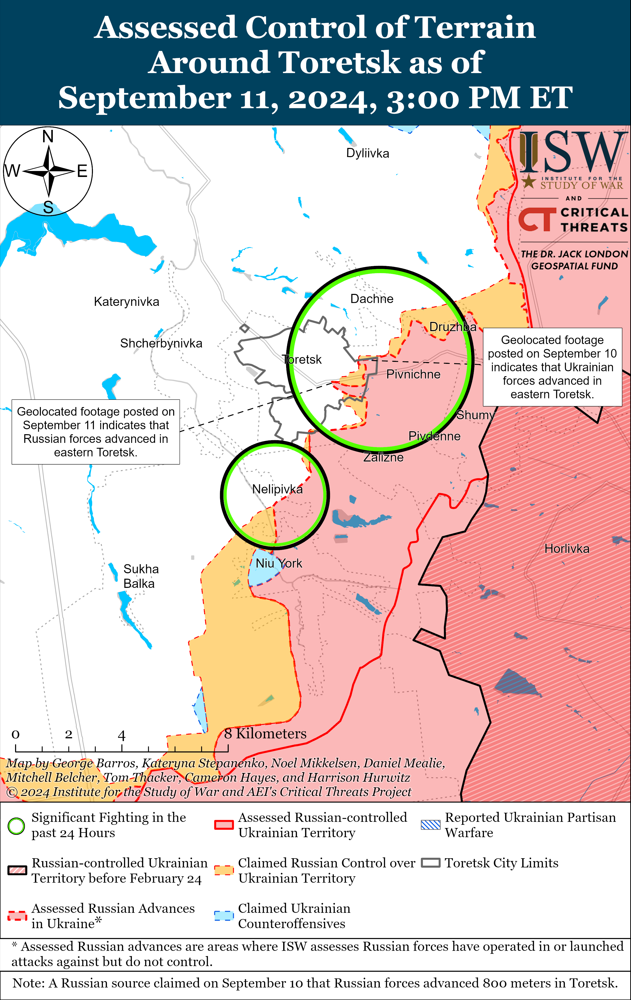
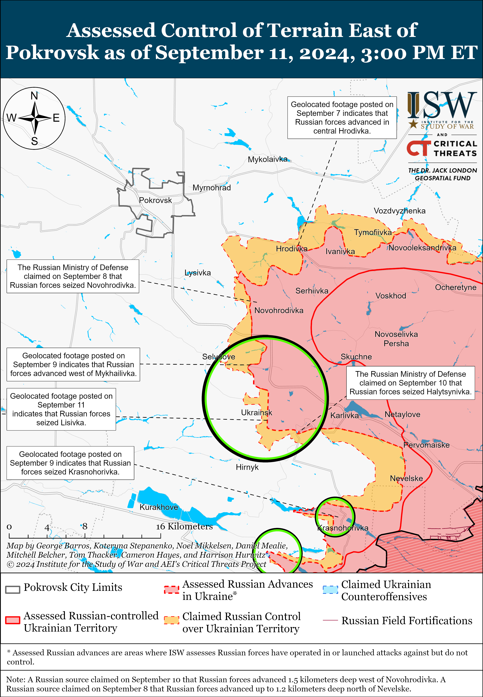
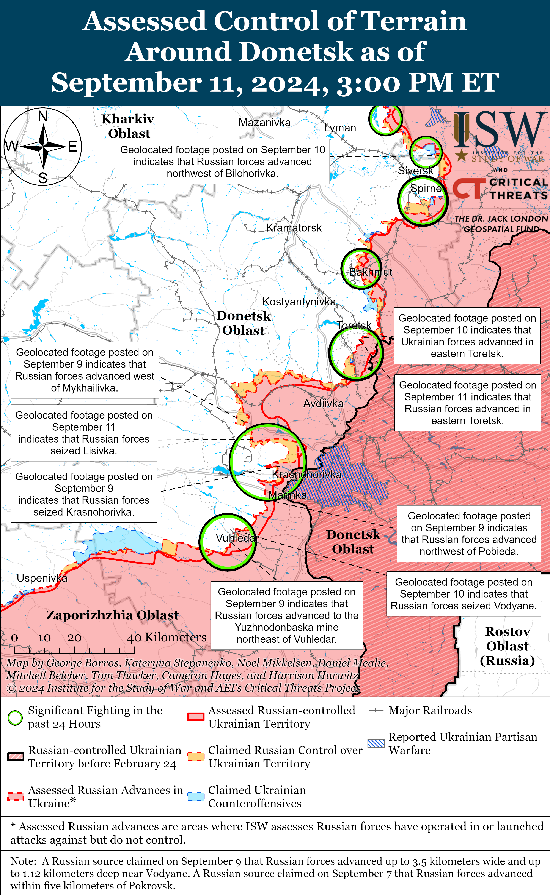
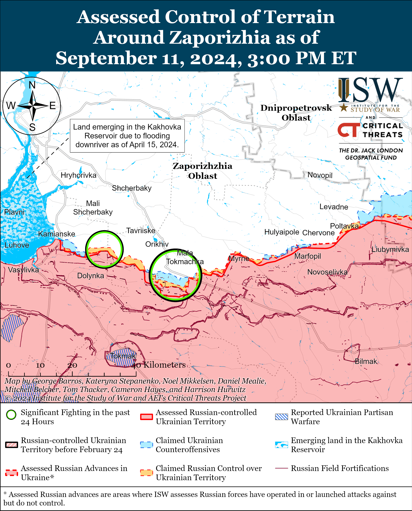
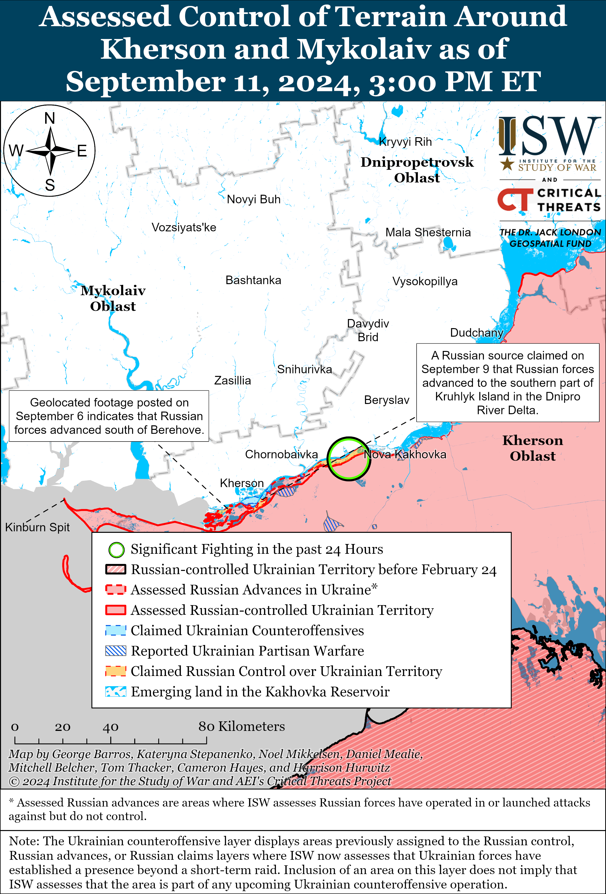

# Russian Offensive Campaign Assessment, September 11, 2024

**Angelica Evans, Nicole Wolkov, Grace Mappes, Haley Zehrung, Karolina Hird, and George Barros**

**September 11, 2024, 8:25 pm ET**

**Click** [**here**](https://storymaps.arcgis.com/stories/36a7f6a6f5a9448496de641cf64bd375) **to see ISW’s interactive map of the Russian invasion of Ukraine. This map is updated daily alongside the static maps present in this report.**

**Click** [**here**](https://storymaps.arcgis.com/stories/83a2f24901c941d581c0c523ecd2619b) **to see ISW’s interactive map of Ukraine’s offensive in Kursk Oblast.**

**Click** [**here**](https://understandingwar.maps.arcgis.com/apps/instant/3dviewer/index.html?appid=1602762dbcde419bb957dea358449580) **to see ISW’s 3D control of terrain topographic map of Ukraine. Use of a computer (not a mobile device) is strongly recommended for using this data-heavy tool.**

**Click** [**here**](https://storymaps.arcgis.com/stories/733fe90805894bfc8562d90b106aa895) **to access ISW’s archive of interactive time-lapse maps of the Russian invasion of Ukraine. These maps complement the static control-of-terrain map that ISW produces daily by showing a dynamic frontline. ISW will update this time-lapse map archive monthly.**

**Note: The data cut-off for this product was 12:30pm ET on September 11. ISW will cover subsequent reports in the September 12 Russian Offensive Campaign Assessment.**

**Russian forces began counterattacks along the western edge of the Ukrainian salient in Kursk Oblast and reportedly seized several settlements northeast and south of Korenevo on September 10 and 11.** The size, scale, and potential prospects of the September 11 Russian counterattacks in Kursk Oblast are unclear and the situation remains fluid as of this report. It is premature to draw conclusions about Russia’s new counterattacks and ISW will continue following the situation. Geolocated footage published on September 11 indicates that Russian forces retook positions east of Zhuravli (northeast of Korenevo).[1] Additional geolocated footage published on September 10 indicates that elements of the Russian 51st Airborne (VDV) Regiment (106th VDV Division) advanced north and northeast of Snagost (south of Korenevo) during a company-sized mechanized assault.[2] Russian milbloggers claimed that Russian forces launched the mechanized counterattack from the north near Korenevo and that Russian forces quickly advanced into Snagost.[3] Several Russian sources claimed that Russian forces fully seized Snagost, but ISW has not observed visual confirmation of these claims.[4] Russian sources claimed that elements of the Russian 51st VDV Regiment and 155th Naval Infantry Brigade (Pacific Fleet, Eastern Military District [EMD]) advanced northwest of Snagost and seized Krasnooktyabrskoye; advanced west of Snagost and seized Komarovka and Vishnevka; advanced southwest of Snagost and seized Apanasovka and 10-y Oktyabr; advanced southeast of Snagost and seized Obukhovka; and advanced south of Snagost and seized Byakhovo, Vnezapnoye, and Gordeevka.[5] A Russian milblogger claimed that elements of the Russian 200th Motorized Rifle Brigade (14th Army Corps [AC], Leningrad Military District [LMD]) seized Olgovka (just east of Korenevo).[6]

**Ukrainian forces reportedly began new attacks against the Russian counterattack west of Snagost and throughout the Ukrainian salient in Kursk Oblast.** A Ukrainian brigade reportedly operating in Kursk Oblast reported on September 11 that Ukrainian forces began attacking Russian forces’ flank west of Snagost after the initial Russian counterattack into Snagost.[7] An open-source X (formerly Twitter) user claimed that Ukrainian forces are operating near Kulbaki (southwest of Snagost and roughly five kilometers from the international border), suggesting that Ukrainian forces recently advanced near the settlement, reportedly after crossing the international border.[8] Russian milbloggers also claimed that Ukrainian forces are conducting small mechanized cross-border assaults into Glushkovo Raion near Medvezhye (southwest of Snagost and along the international border) and in another unspecified area along the international border.[9] The Russian Ministry of Defense (MoD) and Russian milbloggers claimed that Russian forces repelled Ukrainian attacks south of Snagost near Apanasovka; east of Korenevo near Kremyanoye; and southeast of Sudzha near Cherkasskaya Konopelka, Fanaseyevka, and Borki.[10] It remains unclear how much force Ukraine has committed to the reported Ukrainian counterattack.

**Available visual evidence suggests that Russian forces counterattacking in Kursk Oblast are operating in company-sized units and may be using elements of more combat-experienced units to conduct counterattacks.** Geolocated footage published on September 10 shows elements of the Russian 51st Airborne (VDV) Regiment (106th VDV Division) conducting a company-seized mechanized assault north of Snagost.[11] A Russian milblogger claimed that Russian naval infantry and airborne “battalion tactical groups” (BTGs) are conducting offensive operations in Kursk Oblast, although ISW has only observed geolocated footage of a company-sized mechanized assault.[12] The milblogger could be referring to a BTG-sized force (roughly a unit with the strength of a reinforced battalion but not necessarily operating in the structure of a traditional BTG), and Russian forces could theoretically deploy a detached company from a BTG. Russian forces notably have not utilized BTGs at scale on the battlefield since mid-2022, following the widespread failure of BTGs to accomplish Russian offensive objectives in the early stages of the war, as well as damage accrued to BTGs during costly Russian offensive operations on Kyiv, Severodonetsk, Mariupol, and Lysychansk.[13] The Russian military has transitioned away from using BTGs in the past two years as a task-organized unit and their re-emergence in Kursk Oblast, if confirmed, would be a noteworthy inflection.[14] ISW has not observed any confirmation that Russian forces in Kursk Oblast are operating BTG as of this publication. Russian milbloggers claimed that elements of the Russian 56th VDV Regiment (7th VDV Division) and 155th Naval Infantry Brigade (Pacific Fleet, Eastern Military District [EMD]) are operating in Kursk Oblast and involved in the counterattacks.[15] The Russian 155th Naval Infantry Brigade most notably participated in the failed Russian push for Vuhledar in late 2022 to early 2023, then fought southwest of Donetsk City near Marinka, and deployed to participate in the Russian offensive north of Kharkiv City in May 2024 — largely without significant rest, and the 155th Naval Infantry Brigade has been degraded to the point of being reconstituted several times.[16] Elements of the 56th VDV Regiment participated in repelling Ukrainian counteroffensive operations near Verbove in Summer 2023 and were reportedly still operating in the area as of July 2024.[17] The Russian military may be relying on relatively combat-experienced units to conduct assault operations in Kursk Oblast, although it is unclear how effective these operations will be since these units, especially units which have been heavily degraded and reconstituted many times, like the 155th Naval Infantry Brigade. It is also unclear if Russian forces have enough forces necessary to fully repel Ukrainian forces — or defend against reported Ukrainian counterattacks — from Kursk Oblast since the Russian military command likely deployed elements of these units, instead of the entire formations, to Kursk Oblast, making it premature to assess the longer-term strategic-level effects of the Ukrainian incursion.

**Russian forces may intend to temporarily bisect the Ukrainian salient in Kursk Oblast before beginning a more organized and well-equipped effort to push Ukrainian forces out of Russian territory.** Russian forces are currently conducting counterattacks along the western edge of the Ukrainian salient in Kursk Oblast, in an area that is largely comprised of fields and small settlements. Russian forces may be working to establish more tactically favorable positions during these initial counterattacks before beginning a wider counteroffensive operation against Ukrainian forces operating northeast of Korenevo and near Sudzha. Russian forces may intend to cut the Ukrainian salient and advance to the international border southeast of Snagost to complicate existing Ukrainian logistics routes and fire support positions closer to the international border before beginning a larger-scale counteroffensive operation. The Russian military command appears to be relying on elements of the 155th Naval Infantry Brigade and 56th and 51st VDV regiments for these initial counterattacks but will likely introduce other elements of the Russian force grouping in this area in future counterattacks. It remains unclear if the Russian authorities responding to the Kursk incursion assess that the current Russian force grouping in Kursk Oblast — largely comprised of conscripts, irregular Russian forces, and smaller elements of regular and more elite Russian units — can successfully push Ukrainian forces from the area. Russian authorities may also plan to transfer additional, more combat-capable Russian units from Ukraine to address the Ukrainian incursion into Kursk Oblast, although it is unclear when Russian authorities may conduct such redeployments. It would be premature to assess the impact of two days of Russian counterattacks on the month-long Ukrainian incursion into Kursk Oblast, particularly amid ongoing Ukrainian cross-border assaults, and ISW will continue to evaluate the impact of the Russian counterattacks in the coming days.

**US Secretary of State Antony Blinken and UK Foreign Secretary David Lammy arrived in Kyiv on September 11 and reiterated support for Ukraine but did not clarify current Western policy on Ukraine’s ability to strike military objects in Russia with Western-provided weapons.**[18] Ukrainian Prime Minister Denys Shmyhal met with Lammy on September 11 and emphasized that Ukraine is still waiting for permission from the UK to use UK-provided long-range weapons to strike military objects in Russia. Two unspecified US officials told CNNon September 11 that the Biden administration has not changed its policy of prohibiting Ukrainian forces from using US-provided ATACMS missiles to strike within Russiadespite discussing the issue regularly. One unnamed senior administration official said that there is “no openness” to lifting these restrictions.[19] US President Joe Biden stated on September 10 that his administration was “working that out,” when asked about potential plans to lift US restrictions on Ukraine’s use of long-range weapons in Russia.[20]

**The People’s Republic of China (PRC) continues to promote its alternative peace plan for the war in Ukraine.** PRC Foreign Minister Wang Yi met with Russian Security Council Secretary Sergei Shoigu in St. Petersburg on September 11 and reiterated that the PRC will continue to promote its own vision to end Russia’s war in Ukraine and will aim to convince other countries to support the PRC’s peace plan.[21] Shoigu reiterated Russia’s support for the joint PRC-Brazilian peace plan during the meeting.[22] PRC officials have routinely promoted the PRC-Brazilian peace plan and allowed Russian officials to posture themselves as willing to negotiate with Ukraine in good faith despite consistent Kremlin statements outright rejecting negotiations or otherwise indicating that Russia will only negotiate on terms that amount to complete Ukrainian capitulation.[23]

**Turkish President Recep Tayyip Erdogan reiterated his support for Ukraine on September 11.** Erdogan gave a virtual speech to the Fourth Summit of the International Crimea Platform on September 11 in which he reiterated support for Ukraine’s territorial sovereignty, independence, and autonomy and asserted that Crimea “must be returned” to Ukraine under international law.[24]

**Key Takeaways:**

- **Russian forces began counterattacks along the western edge of the Ukrainian salient in Kursk Oblast and reportedly seized several settlements northeast and south of Korenevo on September 10 and 11.**
- **Available visual evidence suggests that Russian forces counterattacking in Kursk Oblast are operating in company-sized units and may be using elements of more combat-experienced units to conduct counterattacks.**
- **Russian forces may intend to temporarily bisect the Ukrainian salient in Kursk Oblast before beginning a more organized and well-equipped effort to push Ukrainian forces out of Russian territory.**
- **US Secretary of State Antony Blinken and UK Foreign Secretary David Lammy arrived in Kyiv on September 11 and reiterated support for Ukraine but did not clarify current Western policy on Ukraine’s ability to strike military objects in Russia with Western-provided weapons.**
- **The People’s Republic of China (PRC) continues to promote its alternative peace plan for the war in Ukraine.**
- **Turkish President Recep Tayyip Erdogan reiterated his support for Ukraine on September 11.**
- **Russian forces recently advanced southeast of Kupyansk, near Toretsk, and near Pokrovsk.**
- **Ukrainian Kharkiv Group of Forces Spokesperson Colonel Vitaly Sarantsev reported on September 11 that Russian forces are replenishing their tactical, operational, and strategic reserves.**
- **Russian occupation authorities illegally held regional elections in occupied Crimea on September 6 to 8 and likely fabricated increased voter turnout numbers to claim that residents broadly support Russia’s illegal occupation of Crimea.**

****

***We do not report in detail on Russian war crimes because these activities are well-covered in Western media and do not directly affect the military operations we are assessing and forecasting. We will continue to evaluate and report on the effects of these criminal activities on the Ukrainian military and the Ukrainian population and specifically on combat in Ukrainian urban areas. We utterly condemn Russian violations of the laws of armed conflict and the Geneva Conventions and crimes against humanity even though we do not describe them in these reports.***

- Ukrainian Operations in the Russian Federation
- Russian Main Effort – Eastern Ukraine (comprised of three subordinate main efforts)
- Russian Subordinate Main Effort #1 – Push Ukrainian forces back from the international border with Belgorod Oblast and approach to within tube artillery range of Kharkiv City
- Russian Subordinate Main Effort #2 – Capture the remainder of Luhansk Oblast and push westward into eastern Kharkiv Oblast and encircle northern Donetsk Oblast
- Russian Subordinate Main Effort #3 – Capture the entirety of Donetsk Oblast
- Russian Supporting Effort – Southern Axis
- Russian Air, Missile, and Drone Campaign
- Russian Mobilization and Force Generation Efforts
- Russian Technological Adaptations
- Activities in Russian-occupied areas
- Ukrainian Defense Industrial Base Efforts
- Russian Information Operations and Narratives
- Significant Activity in Belarus

**Ukrainian Operations in the Russian Federation**

*See topline text for updates on the Ukrainian incursion into Kursk Oblast.*

Ukrainian forces reportedly conducted a series of drone and missile strikes against Russia on the night of September 10 to 11 and on September 11. Murmansk Oblast Governor Andrei Chibis claimed that Russian authorities closed two airports in Murmansk Oblast due to Ukrainian drone activity and later claimed that Russian forces downed three Ukrainian drones over Murmansk Oblast.[25] Russian media stated that Russian forces downed a likely modified Ukrainian S-200 air defense missile near a gas distribution station in Yefremovsky Raion, Tula Oblast.[26] The Russian Ministry of Defense (MoD) claimed that Russian forces downed several drones over Belgorod, Kursk, and Oryol oblasts throughout the day on September 11.[27]

**Russian Main Effort – Eastern Ukraine**

**Russian Subordinate Main Effort #1 – Kharkiv Oblast** **(Russian objective: Push Ukrainian forces back from the international border with Belgorod Oblast and approach to within tube artillery range of Kharkiv City)**

Russian forces continued limited offensive operations in northern Kharkiv Oblast on September 11 but did not advance. Ukrainian Kharkiv Group of Forces Spokesperson Colonel Vitaly Sarantsev noted that while Russian forces in northern Kharkiv Oblast have typically operated in small assault groups with light (non-armored) vehicles, Russian forces recently conducted a mechanized attack with armored vehicles and tanks in the direction of Hlyboke from Strilecha (north of Kharkiv City).[28] Ukraine’s Kharkiv Group of Forces published footage on September 10 of a Russian platoon-sized mechanized assault in an unspecified location of northern Kharkiv Oblast, which is likely the assault to which Sarantsev referred on September 11.[29] Sarantsev also reiterated that Russian forces are exclusively using lighter vehicles such as motorcycles and all-terrain vehicles (ATVs) to move infantry forces and support attacks within Vovchansk (northeast of Kharkiv City).[30] The Ukrainian General Staff reported that Russian forces conducted ground attacks near Hlyboke, Vovchansk, Hatyshche (west of Vovchansk), and Tykhe (east of Vovchansk).[31] Elements of the Russian 11th Tank Regiment (18th Motorized Rifle Division, 11th Army Corps [AC], Leningrad Military District [LMD]) and 7th Motorized Rifle Regiment (11th AC, LMD) are reportedly operating in the Hlyboke-Lyptsi area (north of Kharkiv City), while elements of the 136th Motorized Rifle Brigade (58th Combined Arms Army [CAA], Southern Military District [SMD]) are operating near Tykhe.[32] ISW recently assessed that the 136th Motorized Rifle Brigade transferred from western Zaporizhia Oblast to northern Kharkiv Oblast to conduct a relief in place for elements of the 83rd Airborne (VDV) Brigade in Tykhe.[33]

****

**Russian Subordinate Main Effort #2 – Luhansk Oblast** **(Russian objective: Capture the remainder of Luhansk Oblast and push westward into eastern Kharkiv Oblast and northern Donetsk Oblast)**

Russian forces recently advanced southeast of Kupyansk amid continued fighting along the Kupyansk-Svatove-Kreminna line on September 10. Geolocated footage published on September 10 indicates that Russian forces advanced marginally north of Stelmakhivka (southeast of Kupyansk).[34] Additional geolocated footage published on September 11 shows that Russian forces advanced along a windbreak north of Pishchane (southeast of Kupyansk and northwest of Stelmakhivka).[35] Russian milbloggers claimed that Russian forces crossed the Zherebets River in Makiivka (northwest of Kreminna) and are fighting on the other bank of the river, which is consistent with the assessed Russian advances in the settlement.[36] Russian forces continued offensive operations northeast of Kupyansk near Synkivka; east of Kupyansk near Petropavlivka; southeast of Kupyansk near Lozova and Hlushkivka; northwest of Kreminna near Tverdokhlibove, Makiivka, Druzhelyubivka, Hrekivka, Novosadove, Terny, and Nevske; and west of Kreminna near Torske.[37]

**Russian Subordinate Main Effort #3 – Donetsk Oblast** **(Russian objective: Capture the entirety of Donetsk Oblast, the claimed territory of Russia’s proxies in Donbas)**

Fighting continued northeast of Siversk near Hryhorivka; east of Siversk near Verkhnokamyanske; and southeast of Siversk near Spirne, Vyimka, and Ivano-Darivka on September 10 and 11, but there were no confirmed changes to the frontline.[38]

Russian forces continued offensive operations near Chasiv Yar; north of Chasiv Yar near Kalynivka; and east of Chasiv Yar near Ivanivske on September 10 and 11, but there were no confirmed changes to the frontline.[39]

Both Russian and Ukrainian forces recently marginally advanced near Toretsk amid continued fighting in the area on September 11. Geolocated footage published on September 10 indicates that Ukrainian forces recently marginally advanced within northeastern Toretsk.[40] Additional geolocated footage published on September 11 indicates that Russian forces advanced along Tsentralna Street in eastern Toretsk, and a Russian milblogger claimed that Russian forces advanced further along this street and in the fields southeast of Toretsk.[41] ISW has not observed visual confirmation of these more expansive claims, however. Russian forces also continued ground attacks near Dachne (northeast of Toretsk), Pivnichne (east of Toretsk), and Nelipivka (south of Toretsk) on September 10 and 11.[42]

Russian forces have likely seized Lysivka (southeast of Pokrovsk) and made further advances southeast of Pokrovsk amid continued offensive operations in this direction on September 11. Geolocated footage published on September 11 shows Russian forces raising a flag in central Lysivka, and Russian milbloggers claimed that elements of the Russian 114th Motorized Rifle Brigade (51st Combined Arms Army [CAA], formerly 1st Donetsk People’s Republic [DNR] Army Corps [AC]) seized the settlement.[43] Additional geolocated footage published on September 10 indicates that Russian forces also advanced in the fields west of Marynivka (southeast of Pokrovsk) and that Russian forces have likely seized Marynivka.[44] Ukrainian military observer Kostyantyn Mashovets acknowledged that Russian forces recently advanced northeast and east of Selydove and west of Novohrodivka (both southeast of Pokrovsk).[45] Russian milbloggers claimed that Russian forces also advanced into eastern Ukrainsk (southeast of Pokrovsk) and in fields north and southeast of Ukrainsk, and that Russian forces are attempting to encircle Ukrainian forces within the settlement.[46] ISW has not observed any indication that Ukrainian forces in the settlement are at risk of encirclement, however. A Russian milblogger and former Storm-Z instructor expressed concern on September 11 that exhaustion among attacking Russian units may force Russian offensive operations in the Pokrovsk direction to prematurely culminate.[47] The milblogger claimed that Russian forces are conducting constant assaults in many sectors of the Pokrovsk direction and that Russian forces are attacking with fewer people and armored vehicles than during previous weeks, possibly due to manpower and materiel constraints. Russian forces also continued offensive operations east of Pokrovsk near Novooleksandrivka, Vozdvyzhenka, Svyrydonivka, Hrodivka, Ivanivka, and Mykhailivka and southeast of Pokrovsk near Novohrodivka, Marynivka, Selydove, Ukrainsk, and Hyrnik on September 10 and 11.[48] Elements of the “Brosok Cobra” unit of the Russian 55th Motorized Rifle Brigade (41st CAA, Central Military District [CMD]) are reportedly fighting in Hrodivka, and elements of the “Black Hussars” detachment of the Russian 15th Motorized Rifle Brigade (2nd CAA, CMD) are reportedly fighting in the Pokrovsk direction.[49] ISW has recently observed reports of at least a company of the Russian 15th Motorized Rifle Brigade operating in the Kursk direction, indicating that elements of the brigade are split across at least two operational axes.[50]

Russian forces continued offensive operations west of Donetsk City on September 11 but did not make any confirmed advances. A Russian milblogger claimed that Russian forces marginally advanced northeast of Krasnohorivka, although ISW has not observed visual confirmation of this claim.[51] Russian forces continued attacking near Krasnohorivka and Heorhiivka on September 10 and 11.[52] Russian Defense Minister Andrei Belousov credited elements of the Russian 5th and 110th motorized rifle brigades (51st CAA, formerly 1st DNR AC) for the recent seizure of Krasnohorivka.[53]

Russian forces continued offensive operations southwest of Donetsk City on September 11 but did not make any confirmed advances. Russian forces continued attacking northeast of Vuhledar near Kostyantynivka and Vodyane; near Vuhledar itself; and southwest of Vuhledar near Pavlivka on September 10 and 11.[54] Russian Defense Minister Andrei Belousov credited elements of the 57th Motorized Rifle Brigade (5th CAA, EMD) for the recent seizure of Vodyane.[55]

Neither Russian nor Ukrainian sources reported fighting in the Donetsk-Zaporizhia Oblast border area on September 11.

**Russian Supporting Effort – Southern Axis** **(Russian objective: Maintain frontline positions and secure rear areas against Ukrainian strikes)**

Russian forces continued assaults in western Zaporizhia Oblast, including northwest of Robotyne near Mali Shcherbaky and northeast of Robotyne near Mala Tokmachka, on September 10 and 11, but there were no changes to the frontline.[56]

Russian forces continued ground attacks in the Kherson direction, including in east (left) bank Kherson Oblast, on September 10 and 11, but there were no confirmed changes to the frontline.[57] Elements of the Russian 31st Airborne (VDV) Brigade are reportedly operating in the Kherson direction.[58]

The Russian Ministry of Defense (MoD) claimed on September 11 that Russian forces repelled a Ukrainian attack against a Russian-controlled drilling rig in the Black Sea on the night of September 10 to 11.[59] The Russian MoD claimed that elements of the Russian Black Sea Fleet (BSF) repelled an attempt by Ukrainian naval forces and elements of Ukraine’s Main Military Intelligence Directorate (GUR) to seize the “Krym-2” drilling rig in the Black Sea and that Russian forces sunk at least eight Ukrainian inflatable speed boats during the assault.

**Russian Air, Missile, and Drone Campaign** **(Russian Objective: Target Ukrainian military and civilian infrastructure in the rear and on the frontline)**

Russian forces conducted a series of drone and missile strikes against Ukraine on the night of September 10 to 11. The Ukrainian Air Force reported that Russian forces launched 34 projectiles between September 10 and 11, including one Iskander-M ballistic missile from Krasnodar Krai; two S-300 air defense missiles from occupied Donetsk Oblast; six Kh-31P anti-radar missiles from airspace over the Black Sea in the direction of Snake Island, and 25 Shahed-136/131 drones from Kursk Oblast, Yeysk, Krasnodar Krai, and occupied Cape Chauda, Crimea.[60] The Ukrainian Air Force reported that Ukrainian forces downed 20 drones over Kyiv, Kherson, Cherkasy, Sumy, Dnipropetrovsk, and Poltava Oblasts, and that five drones were “lost,” likely meaning they did not reach their intended targets due to Ukranian electronic warfare (EW) suppression or technical issues. Dnipropetrovsk Oblast Military Administration Head Serhii Lysak reported that Russian forces destroyed an unspecified enterprise Kamyanskyi Raion, causing a fire and an unspecified number of casualties.[61]

Ukrainian First Deputy Prosecutor General Oleksiy Khomenko stated that Russian forces launched over 1,000 strikes on 200 energy infrastructure facilities since the beginning of the full-scale invasion in February 2022.[62]

**Russian Mobilization and Force Generation Efforts** **(Russian objective: Expand combat power without conducting general mobilization)**

Ukrainian Kharkiv Group of Forces Spokesperson Colonel Vitaly Sarantsev reported on September 11 that Russian forces are replenishing their tactical, operational, and strategic reserves.[63] Sarantsev did not provide details about the size of these reserves but stated that the Russian military is emphasizing providing comprehensive training to new military personnel. ISW previously observed reports that Russian forces had accumulated at most 60,000 personnel in operational and strategic reserves from October 2023 to June 2024 — enough to only establish *limited* operational and strategic reserves.[64] ISW continues to assess that the Russian military is likely using these reserves as manpower pools for restaffing and reinforcing committed frontline units which are conducting attritional, infantry-heavy assaults with occasional limited mechanized assaults, and is holding back its remaining operational reserves for the effort to seize the city of Pokrovsk itself.[65]

The Russia-led “Okean-2024” international naval exercises — which include the People’s Republic of China’s (PRC) People’s Liberation Army (PLA) Navy — continued on September 11 in the Pacific and Arctic oceans and Mediterranean, Caspian, and Baltic seas, and will run until September 16.[66]

**Russian Technological Adaptations** **(Russian objective: Introduce technological innovations to optimize systems for use in Ukraine)**

Nothing significant to report.

**Ukrainian Defense Industrial Efforts** **(Ukrainian objective: Develop its defense industrial base to become more self-sufficient in cooperation with US, European, and international partners)**

*ISW is suspending publishing coverage of Ukrainian defense industrial efforts until further notice.*

**Activities in Russian-occupied areas** **(Russian objective: Consolidate administrative control of annexed areas; forcibly integrate Ukrainian citizens into Russian sociocultural, economic, military, and governance systems)**

Russian occupation authorities illegally held regional elections in occupied Crimea on September 6 to 8 and likely fabricated increased voter turnout numbers to claim that residents broadly support Russia’s illegal occupation of Crimea. Crimea occupation head Sergei Aksyonov announced the conclusion of the regional election on September 8 and claimed that the election was “maximally open and democratic.”[67] Sevastopol occupation governor Mikhail Razvozhaev claimed that Sevastopol’s voter turnout was 54 percent, which he claimed was twice the turnout for the regional election in 2019.[68] This increased voter turnout figure is likely fabricated to create the false impression that Crimeans are increasingly supporting the Russian occupation of Crimea. Deputy Permanent Representative of the Ukrainian President in Crimea Denis Chistikov noted that Russian authorities have historically falsified voter turnout statistics and election results since Russia’s illegal occupation of Crimea in 2014 but stated that occupation authorities attempted to pre-empt the informational effects of the anticipated low turnout by warning about low voter turnout before the elections even began.[69] Chistikov emphasized that Russia’s use of residents of occupied Crimea in its war effort – likely referring to military service, compensating for labor shortages, and staffing the occupation administration – is degrading the already-low regard for the occupation government among residents. The Ukrainian Resistance Center reported that occupation authorities are using “early voting” in order to obfuscate voter turnout rates and noted that the majority of the electorate in occupied Sevastopol are Russians citizens who are either employed by the occupation administration, Russian government, Russian Armed Forces, Rosgvardia, or Federal Security Service (FSB).[70] ISW has previously assessed that Russian occupation officials have long used elections and other similar efforts to cloak their inherently illegal actions in a “legal”-sounding veneer in an attempt to legitimize their illegal occupation of Ukraine.[71] This is a false and fabricated premise, as ISW has repeatedly argued, just as the results of such elections are false and fabricated.[72] Elections in occupied Ukraine are also a clear violation of international law and have been widely condemned by Kyiv, the international community, and numerous international organizations.[73]

**Russian Information Operations and Narratives**

The Kremlin continues efforts to discredit pro-Western political actors in neighboring, former Soviet countries by portraying them as destabilizing in order to advance the Kremlin’s own destabilization efforts in these countries. The Russian Foreign Intelligence Service (SVR) claimed on September 11 that the US State Department intends to foment mass protests to interfere with the October 2024 Georgian parliamentary elections.[74] The SVR claimed that the Organization for Security and Cooperation in Europe’s (OSCE) Office for Democratic Institutions and Human Rights also plans to interfere in the parliamentary elections. The Kremlin routinely portrays pro-Western political sentiment and Western integration efforts in post-Soviet countries as Western-manufactured and not endogenously generated. ISW has previously assessed that the Kremlin is attempting to derail Georgia’s long-term efforts for Euro-Atlantic integration and advance Russian hybrid operations to divide, destabilize, and weaken Georgia.[75]

**Significant activity in Belarus** **(Russian efforts to increase its military presence in Belarus and further integrate Belarus into Russian-favorable frameworks and Wagner Group activity in Belarus)**

Nothing significant to report.

**Note: ISW does not receive any classified material from any source, uses only publicly available information, and draws extensively on Russian, Ukrainian, and Western reporting and social media as well as commercially available satellite imagery and other geospatial data as the basis for these reports. References to all sources used are provided in the endnotes of each update.**

---

[1] https://t.me/WarArchive\_ua/19892; https://t.me/khornegroup/2665

[2] https://x.com/EerikMatero/status/1833612140059537497; https://x.com/NOELreports/status/1833608430306603458; https://x.com/NOELreports/status/1833612976794046968; https://t.me/creamy\_caprice/6751?single; https://x.com/TuiteroMartin/status/1833745770278756736; https://x.com/TuiteroMartin/status/1833746896722026718 ; https://x.com/seanders\_geo/status/1833884893169737860; https://x.com/seanders\_geo/status/1833884897737408961; https://t.me/UkropHunter/161 ; https://t.me/UkropHunter/139; https://t.me/creamy\_caprice/6754?single

[3] https://t.me/dva\_majors/52190 ; https://t.me/motopatriot/27310

[4] https://t.me/RVvoenkor/76770 ; https://t.me/Mestb\_Dobroj\_Voli/12495 ; https://t.me/z\_arhiv/28049 ; https://t.me/voenkorKotenok/58949 ; https://www.vedomosti dot ru/politics/news/2024/09/11/1061527-vs-rf-osvobodili ; https://t.me/tass\_agency/271943

[5] https://www.vedomosti dot ru/politics/news/2024/09/11/1061527-vs-rf-osvobodili ; https://t.me/tass\_agency/271943 ; https://t.me/rybar/63411 ; https://t.me/rybar/63420 ; https://t.me/RVvoenkor/76764 ; https://t.me/RVvoenkor/76776; https://t.me/RVvoenkor/76788 ; https://t.me/boris\_rozhin/136895 ; https://t.me/milinfolive/130321 ; https://t.me/boris\_rozhin/136893 ; https://t.me/zovpobedy/13046 ; https://t.me/yurasumy/17883 ; https://t.me/z\_arhiv/28048 ; https://t.me/z\_arhiv/28055 ; https://t.me/motopatriot/27321 ; https://t.me/boris\_rozhin/136918 https://t.me/voenkorKotenok/58957; https://t.me/notes\_veterans/19435 ; https://t.me/NgP\_raZVedka/19008 ; https://t.me/warhistoryalconafter/183960 ; https://t.me/dva\_majors/52175

[6] https://t.me/motopatriot/27341

[7] https://t.me/odshbr46/1848

[8] https://x.com/PStyle0ne1/status/1833944501938749649

[9] https://t.me/yurasumy/17869 ; https://t.me/dva\_majors/52255 ; https://t.me/dva\_majors/52265 ; https://t.me/RVvoenkor/76805 ; https://t.me/wargonzo/22052 ; https://t.me/dva\_majors/52212

[10] https://t.me/warhistoryalconafter/183960 ; https://t.me/dva\_majors/52175 ; https://t.me/mod\_russia/43245

[11] https://x.com/RALee85/status/1833619139501375776; https://t.me/infomil\_live/9979 ; https://t.me/DniproOfficial/4652 ; https://t.me/DeepStateUA/20316 ; https://t.me/milinfolive/130301 ; https://x.com/EerikMatero/status/1833612140059537497; https://x.com/NOELreports/status/1833608430306603458; https://x.com/NOELreports/status/1833612976794046968; https://t.me/creamy\_caprice/6751?single; https://x.com/TuiteroMartin/status/1833745770278756736; https://x.com/TuiteroMartin/status/1833746896722026718

[12] https://t.me/voenkorKotenok/58950

[13] https://isw.pub/UkrWar112922; https://twitter.com/DefenceHQ/status/1597482502200983552?s=20&t=sml5agnp4lHB0LVUWJNTPg; https://understandingwar.org/backgrounder/russian-offensive-campaign-assessment-april-2; https://understandingwar.org/backgrounder/russian-offensive-campaign-assessment-may-19; https://understandingwar.org/backgrounder/russian-offensive-campaign-assessment-august-4

[14] https://rusi.org/news-and-comment/in-the-news/intelligence-report-reveals-3-intrinsic-russian-tactical-unit-weaknesses

[15] https://t.me/RVvoenkor/76776; https://t.me/RVvoenkor/76788 ; https://t.me/boris\_rozhin/136895 ; https://t.me/rusich\_army/17069 ; https://t.me/rusich\_army/17061 ; https://t.me/rybar/63411 ; https://t.me/RVvoenkor/76764 ; https://t.me/yurasumy/17872

[16] https://understandingwar.org/backgrounder/russian-offensive-campaign-assessment-august-10-2024

[17] https://understandingwar.org/backgrounder/russian-offensive-campaign-assessment-august-14-2023 ; https://understandingwar.org/backgrounder/russian-offensive-campaign-assessment-august-22-2023 ; https://understandingwar.org/backgrounder/russian-offensive-campaign-assessment-july-10-2024 ; https://understandingwar.org/backgrounder/russian-offensive-campaign-assessment-july-5-2024

[18] https://www.state.gov/secretary-blinkens-meeting-with-ukrainian-president-zelenskyy-and-uk-foreign-secretary-lammy/; https://t.me/Denys\_Smyhal/8445 ; https://suspilne dot media/833487-krimska-platforma-blinken-ta-glava-mzs-britanii-idut-v-kiiv-sankcii-proti-iranu-ta-rosii-931-den-vijni-onlajn/?anchor=live\_1726054259&utm\_source=copylink&utm\_medium=ps

[19] https://t.me/Denys\_Smyhal/8445 ; https://suspilne dot media/833487-krimska-platforma-blinken-ta-glava-mzs-britanii-idut-v-kiiv-sankcii-proti-iranu-ta-rosii-931-den-vijni-onlajn/?anchor=live\_1726054259&utm\_source=copylink&utm\_medium=ps

[20] https://www.reuters.com/world/biden-says-administration-working-potentially-lifting-ban-ukraine-long-range-2024-09-10/

[21] https://www.scmp dot com/news/china/diplomacy/article/3278062/china-promotes-rational-voices-towards-ukraine-ceasefire-wang-yi-tells-russian-official; https://finance.yahoo.com/news/china-promotes-rational-voices-ukraine-093000119.html; https://suspilne dot media/833815-kitaj-prodovzit-prosuvati-svij-mirnij-plan-dla-ukraini-mzs/

[22] https://www.gov dot br/planalto/en/latest-news/2024/05/brazil-and-china-present-joint-proposal-for-peace-negotiations-with-the-participation-of-russia-and-ukraine ; https://isw.pub/UkrWar090324

[23] https://isw.pub/UkrWar072424; https://understandingwar.org/backgrounder/russian-offensive-campaign-assessment-september-3-2024; https://understandingwar.org/backgrounder/russian-offensive-campaign-assessment-june-26-2024

[24] https://www.aa.com dot tr/en/politics/turkish-president-erdogan-reaffirms-support-for-kyiv-calls-for-crimeas-return-to-ukraine/3327489

[25] https://t.me/andrey\_chibis/5046 ; https://t.me/tass\_agency/271951 ; https://t.me/tass\_agency/271958 ; https://suspilne dot media/833487-krimska-platforma-blinken-ta-glava-mzs-britanii-idut-v-kiiv-sankcii-proti-iranu-ta-rosii-931-den-vijni-onlajn/?anchor=live\_1726052679&utm\_source=copylink&utm\_medium=ps

[26] https://t.me/istories\_media/7527 ; https://newstula dot ru/fn\_1370635.html ; https://www.tsn24 dot ru/2024/09/11/315884-v-noch-na-11-sentyabrya-v-efremovskom-rayone-sbita-raketa-vsu/ ; https://t.me/shot\_shot/71410 ; https://t.me/bazabazon/31148

[27] https://t.me/mod\_russia/43227 ; https://t.me/mod\_russia/43243 ; https://t.me/mod\_russia/43234 ; https://t.me/mod\_russia/43253 ;

[28] https://armyinform.com dot ua/2024/09/11/pomichena-ta-ponivechena-vazhka-bronetehnika-syly-oborony-spalyly-try-vorozhyh-panczernyka/

[29] https://t.me/otukharkiv/1244

[30] https://youtu.be/aDXWlQ2K0dM ; https://armyinform.com dot ua/2024/09/11/taktyku-poodynokogo-prosochuvannya-zastosovuyut-okupanty-u-vovchansku/

[31] https://www.facebook.com/GeneralStaff.ua/posts/pfbid0cPbGu212J57Ej5amtKgLBBshKGeUi8D89aNyvmHBkpFVBp6WAFjAkByKjan6SVr7l; https://www.facebook.com/GeneralStaff.ua/posts/pfbid02NUxtbezN5yH9sNGUv31qRoSiA15k2xifoBdt83kB2GSZN3246PS2J9zrteNEVQr3l

[32] https://t.me/otukharkiv/1253; https://youtu.be/aDXWlQ2K0dM ; https://armyinform.com dot ua/2024/09/11/vid-kontraktu-do-peredovoyi-20-dniv-kogo-rosiyany-kydayut-u-bij-eksternom/

[33] https://understandingwar.org/backgrounder/russian-offensive-campaign-assessment-august-28-2024; https://understandingwar.org/backgrounder/russian-offensive-campaign-assessment-september-1-2024

[34] https://x.com/99Dominik\_/status/1833858394630811859; https://t.me/ceroki24/784

[35] https://t.me/creamy\_caprice/6765; https://t.me/oaembr77/553

[36] https://t.me/boris\_rozhin/136873

[37] https://www.facebook.com/GeneralStaff.ua/posts/pfbid02NUxtbezN5yH9sNGUv31qRoSiA15k2xifoBdt83kB2GSZN3246PS2J9zrteNEVQr3l; https://www.facebook.com/GeneralStaff.ua/posts/pfbid02d6SCbbNa5DYViuYX6f8ReoGKf9rNzTDRYKWxMuFTMKQXce2UwFrL9gNf4vWQMiHfl; https://www.facebook.com/GeneralStaff.ua/posts/pfbid0cPbGu212J57Ej5amtKgLBBshKGeUi8D89aNyvmHBkpFVBp6WAFjAkByKjan6SVr7l

[38] https://www.facebook.com/GeneralStaff.ua/posts/pfbid02NUxtbezN5yH9sNGUv31qRoSiA15k2xifoBdt83kB2GSZN3246PS2J9zrteNEVQr3l; https://www.facebook.com/GeneralStaff.ua/posts/pfbid02d6SCbbNa5DYViuYX6f8ReoGKf9rNzTDRYKWxMuFTMKQXce2UwFrL9gNf4vWQMiHfl

[39] https://www.facebook.com/GeneralStaff.ua/posts/pfbid02d6SCbbNa5DYViuYX6f8ReoGKf9rNzTDRYKWxMuFTMKQXce2UwFrL9gNf4vWQMiHfl; https://www.facebook.com/GeneralStaff.ua/posts/pfbid02NUxtbezN5yH9sNGUv31qRoSiA15k2xifoBdt83kB2GSZN3246PS2J9zrteNEVQr3l

[40] t.me/kiber\_boroshno/9950?single; https://t.me/skalabatalion/261

[41] https://t.me/creamy\_caprice/6756; https://t.me/OBiloshytskiy/882; https://t.me/motopatriot/27329

[42] https://www.facebook.com/GeneralStaff.ua/posts/pfbid02NUxtbezN5yH9sNGUv31qRoSiA15k2xifoBdt83kB2GSZN3246PS2J9zrteNEVQr3l; https://www.facebook.com/GeneralStaff.ua/posts/pfbid02d6SCbbNa5DYViuYX6f8ReoGKf9rNzTDRYKWxMuFTMKQXce2UwFrL9gNf4vWQMiHfl; https://www.facebook.com/GeneralStaff.ua/posts/pfbid0cPbGu212J57Ej5amtKgLBBshKGeUi8D89aNyvmHBkpFVBp6WAFjAkByKjan6SVr7l; https://t.me/rybar/63416; https://t.me/dva\_majors/52193

[43] https://x.com/TuiteroMartin/status/1833820385810243712; https://x.com/TuiteroMartin/status/1833821115749138872; https://t.me/motopatriot/27328; https://t.me/RVvoenkor/76794 https://t.me/motopatriot/27327 ; https://t.me/boris\_rozhin/136930;

[44] https://tme/WarArchive\_ua/19890; https://tme/jagers68/163; https://tme/creamy\_caprice/6748

[45] https://t.me/zvizdecmanhustu/2174 ; https://www.facebook.com/pashtetof/posts/pfbid02kS2XPPaHvxDMA8Z9R7AKq6wSWSmZaUPYXin8pVvv4ErTEFQ2EwsPDehToWcnkRCDl

[46] https://t.me/rusich\_army/17078; https://t.me/voenkorKotenok/58958; https://t.me/RVvoenkor/76809; https://t.me/boris\_rozhin/136864; https://t.me/dva\_majors/52204; https://t.me/z\_arhiv/28053

[47] https://t.me/philologist\_zov/1369

[48] https://www.facebook.com/GeneralStaff.ua/posts/pfbid02d6SCbbNa5DYViuYX6f8ReoGKf9rNzTDRYKWxMuFTMKQXce2UwFrL9gNf4vWQMiHfl; https://www.facebook.com/GeneralStaff.ua/posts/pfbid02NUxtbezN5yH9sNGUv31qRoSiA15k2xifoBdt83kB2GSZN3246PS2J9zrteNEVQr3l; https://www.facebook.com/GeneralStaff.ua/posts/pfbid0cPbGu212J57Ej5amtKgLBBshKGeUi8D89aNyvmHBkpFVBp6WAFjAkByKjan6SVr7l

[49] https://t.me/RVvoenkor/76801 ; https://t.me/blackhussars/2638; https://t.me/boris\_rozhin/136850

[50] https://understandingwar.org/backgrounder/russian-offensive-campaign-assessment-august-31-2024

[51] https://t.me/z\_arhiv/28059

[52] https://www.facebook.com/GeneralStaff.ua/posts/pfbid02d6SCbbNa5DYViuYX6f8ReoGKf9rNzTDRYKWxMuFTMKQXce2UwFrL9gNf4vWQMiHfl ; https://www.facebook.com/GeneralStaff.ua/posts/pfbid02NUxtbezN5yH9sNGUv31qRoSiA15k2xifoBdt83kB2GSZN3246PS2J9zrteNEVQr3l ; https://www.facebook.com/GeneralStaff.ua/posts/pfbid0cPbGu212J57Ej5amtKgLBBshKGeUi8D89aNyvmHBkpFVBp6WAFjAkByKjan6SVr7l

[53] https://t.me/mod\_russia/43222

[54] https://www.facebook.com/GeneralStaff.ua/posts/pfbid0cPbGu212J57Ej5amtKgLBBshKGeUi8D89aNyvmHBkpFVBp6WAFjAkByKjan6SVr7l ; https://www.facebook.com/GeneralStaff.ua/posts/pfbid02d6SCbbNa5DYViuYX6f8ReoGKf9rNzTDRYKWxMuFTMKQXce2UwFrL9gNf4vWQMiHfl ; https://t.me/dva\_majors/52175 ; https://t.me/warhistoryalconafter/183960 ; https://t.me/rybar/63426

[55] https://t.me/mod\_russia/43223

[56] https://www.facebook.com/GeneralStaff.ua/posts/pfbid02d6SCbbNa5DYViuYX6f8ReoGKf9rNzTDRYKWxMuFTMKQXce2UwFrL9gNf4vWQMiHfl ; https://www.facebook.com/GeneralStaff.ua/posts/pfbid0cPbGu212J57Ej5amtKgLBBshKGeUi8D89aNyvmHBkpFVBp6WAFjAkByKjan6SVr7l

[57] https://www.facebook.com/GeneralStaff.ua/posts/pfbid02d6SCbbNa5DYViuYX6f8ReoGKf9rNzTDRYKWxMuFTMKQXce2UwFrL9gNf4vWQMiHfl ; https://www.facebook.com/GeneralStaff.ua/posts/pfbid0cPbGu212J57Ej5amtKgLBBshKGeUi8D89aNyvmHBkpFVBp6WAFjAkByKjan6SVr7l

[58] https://t.me/mod\_russia/43247

[59] https://t.me/mod\_russia/43251 ; https://t.me/tass\_agency/272008 ; https://t.me/tass\_agency/272010

[60] https://t.me/kpszsu/19163 ; https://armyinform.com dot ua/2024/09/11/vorog-zastosuvav-iskander-m-i-s-300-dlya-udariv-po-ukrayini-detali-nichnoyi-ataky/ ; https://suspilne dot media/833577-povitrani-sili-vnoci-zbili-20-sahediv-2/

[61] https://t.me/dnipropetrovskaODA/15973 ; https://t.me/dnipropetrovskaODA/15974 ; https://t.me/dnipropetrovskaODA/15976 ; https://armyinform.com dot ua/2024/09/11/na-dnipropetrovshhyni-zbilshylas-kilkist-postrazhdalyh-tryvaye-likvidacziya-pozhezhi/

[62] https://suspilne dot media/834061-rosia-zavdala-ponad-tisacu-udariv-po-200-energoobektah-ogpu/

[63] https://armyinform.com dot ua/2024/09/11/vid-kontraktu-do-peredovoyi-20-dniv-kogo-rosiyany-kydayut-u-bij-eksternom/

[64] https://isw.pub/UkrWar060824

[65] https://isw.pub/UkrWar060824 ; https://isw.pub/UkrWar090524

[66] https://t.me/mod\_russia/43248 ; https://t.me/MID\_Russia/45131 ; https://t.me/mod\_russia/43244 ; https://t.me/mod\_russia/43237 ; https://t.me/mod\_russia/43231 ; https://t.me/mod\_russia/43229

[67] https://t.me/Aksenov82/5733

[68] https://t.me/razvozhaev/8021

[69] https://suspilne dot media/crimea/831665-filsifikacia-nizka-avka-ta-zalucenna-adminresursu-so-vidomo-pro-psevdovibori-v-okupovanomu-krimu/

[70] https://t.me/sprotyv\_official/5173; https://t.me/sprotyv\_official/5134

[71] https://understandingwar.org/wp-content/uploads/2024/09/24-210-0120ISW20Occupation20playbook.pdf

[72] https://understandingwar.org/wp-content/uploads/2024/09/24-210-0120ISW20Occupation20playbook.pdf

[73] https://press.un.org/en/2023/sc15405.doc.htm; https://www.rferl dot org/a/ukraine-crimea-russia-elections-denounce/33111287.html; https://www.coe.int/en/web/portal/-/congress-president-condemns-illegal-elections-in-the-occupied-crimea; https://usun.usmission.gov/joint-statement-in-response-to-the-russian-federations-organization-of-presidential-elections-in-the-temporarily-occupied-territories-of-ukraine/

[74] https://t.me/tass\_agency/271906 ; https://t.me/tass\_agency/271909

[75] https://isw.pub/UkrWar081424 ; https://isw.pub/UkrWar072424
