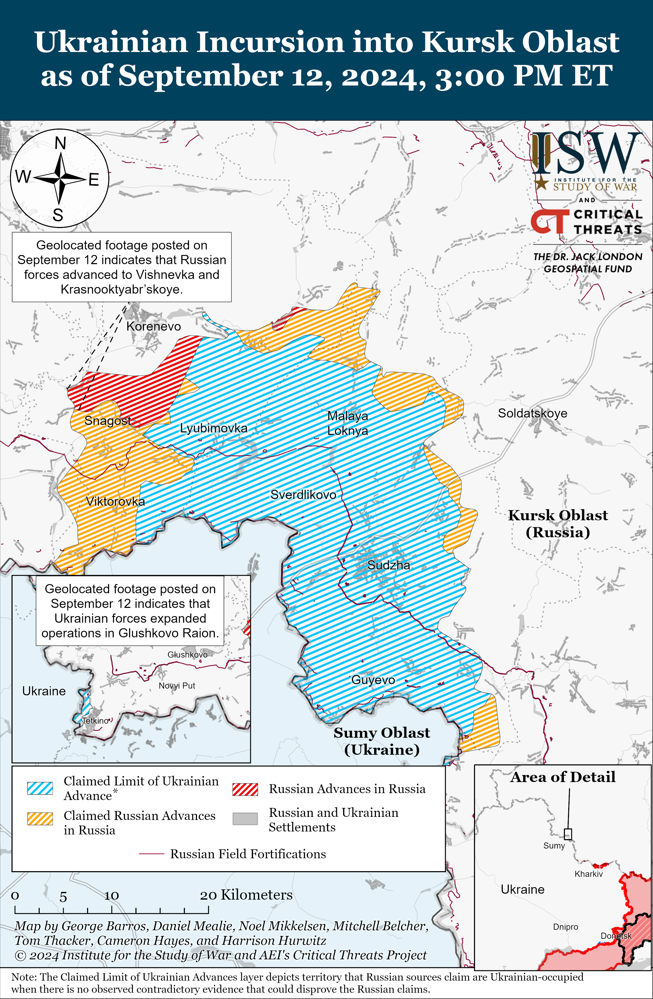
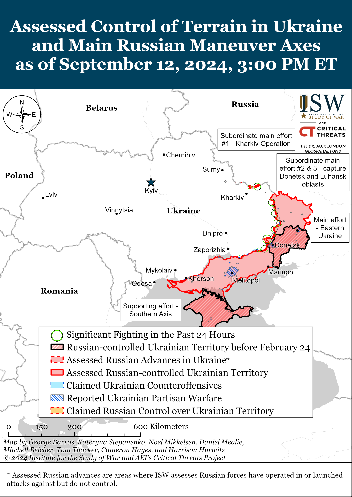
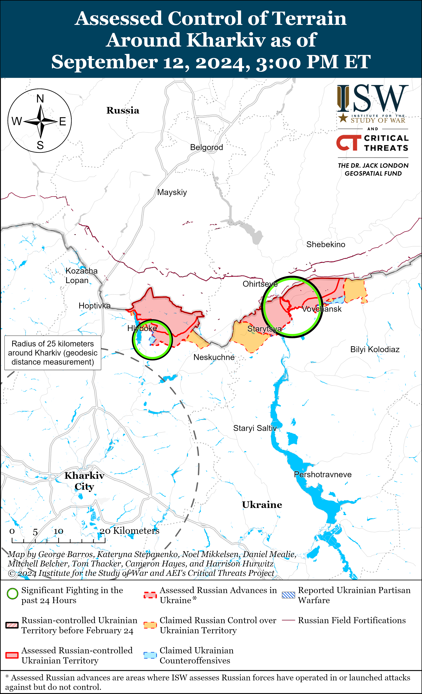
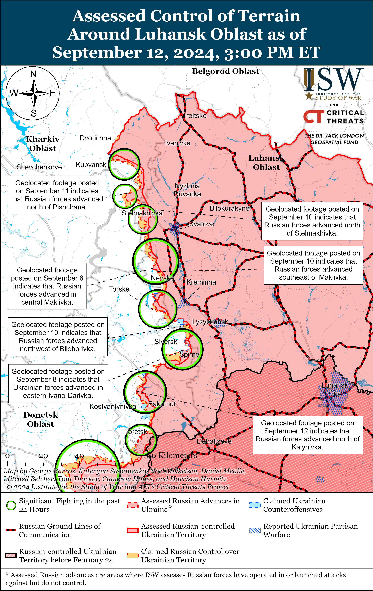
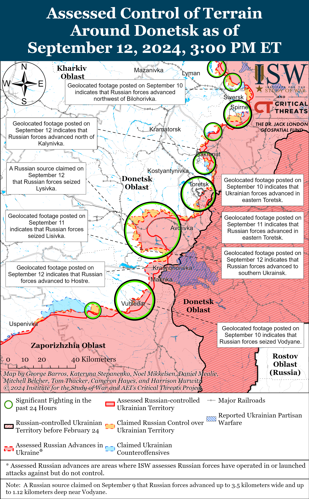
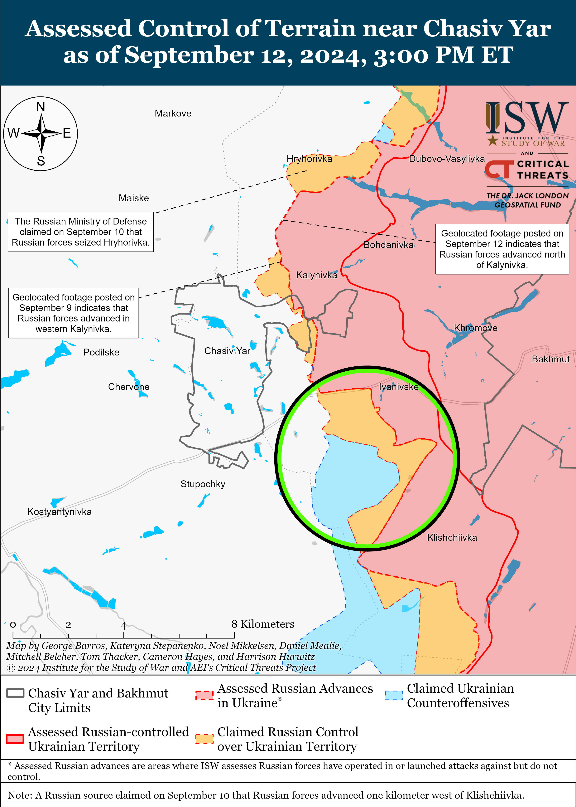
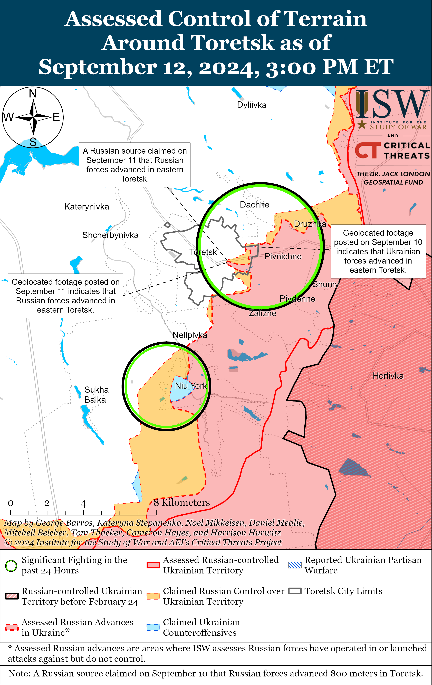
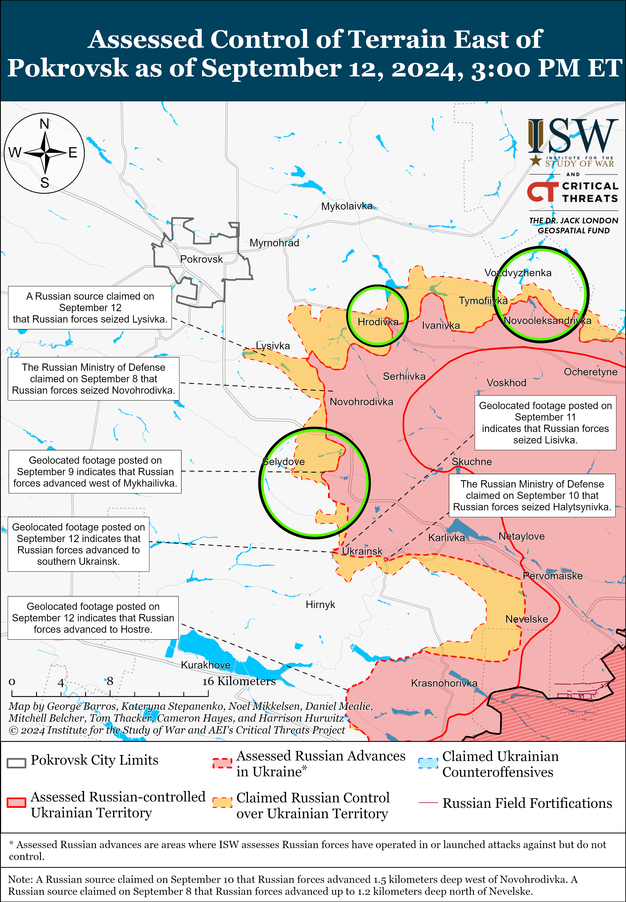
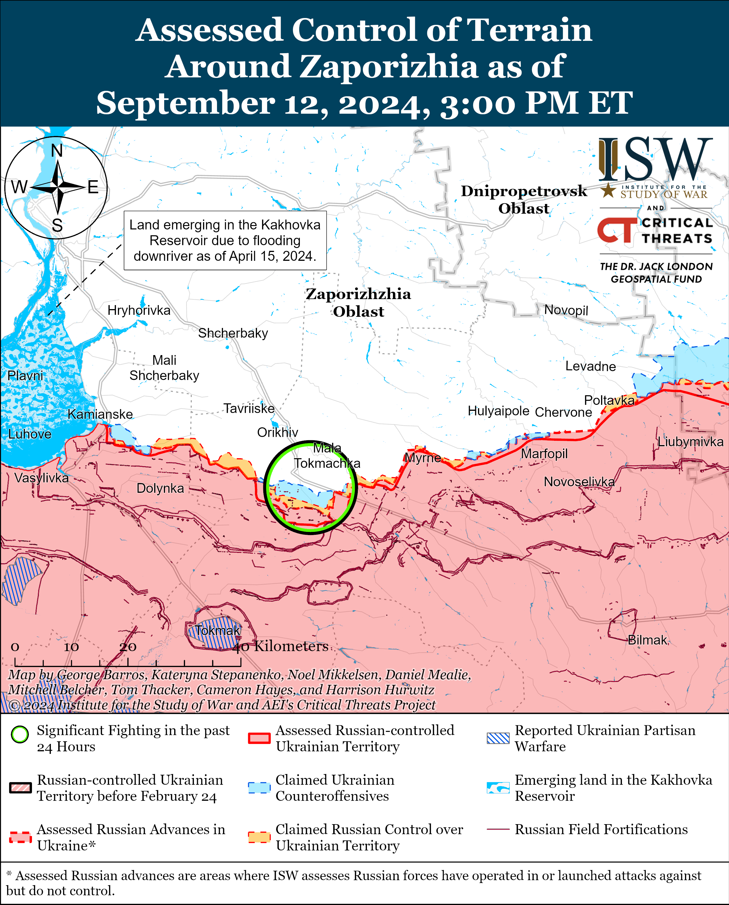
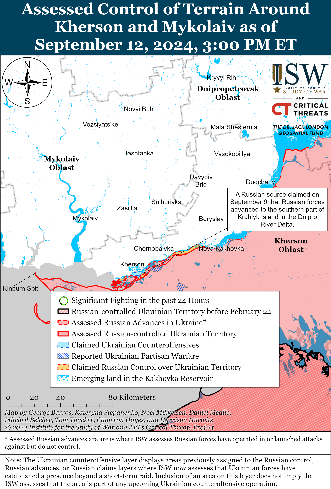

# Russian Offensive Campaign Assessment, September 12, 2024

**Angelica Evans, Riley Bailey, Davit Gasparyan, Grace Mappes, Haley Zehrung, Katherine Wells, and Karolina Hird**

**September 12, 2024, 8:45pm ET**

**Click** [**here**](https://storymaps.arcgis.com/stories/36a7f6a6f5a9448496de641cf64bd375) **to see ISW’s interactive map of the Russian invasion of Ukraine. This map is updated daily alongside the static maps present in this report.**

**Click** [**here**](https://storymaps.arcgis.com/stories/83a2f24901c941d581c0c523ecd2619b) **to see ISW’s interactive map of Ukraine’s offensive in Kursk Oblast.**

**Click** [**here**](https://understandingwar.maps.arcgis.com/apps/instant/3dviewer/index.html?appid=1602762dbcde419bb957dea358449580) **to see ISW’s 3D control of terrain topographic map of Ukraine. Use of a computer (not a mobile device) is strongly recommended for using this data-heavy tool.**

**Click** [**here**](https://storymaps.arcgis.com/stories/733fe90805894bfc8562d90b106aa895) **to access ISW’s archive of interactive time-lapse maps of the Russian invasion of Ukraine. These maps complement the static control-of-terrain map that ISW produces daily by showing a dynamic frontline. ISW will update this time-lapse map archive monthly.**

**Note: The data cut-off for this product was 1pm ET on September 12. ISW will cover subsequent reports in the September 13 Russian Offensive Campaign Assessment.**

**Russian forces continued counterattacking throughout the Ukrainian salient in Kursk Oblast on September 12 but made only marginal gains, likely due to continued Ukrainian offensive operations and defensive counterattacks in the area.** Geolocated footage published on September 12 indicates thatRussian forces made marginal advances west of Vishnevka (southwest of Korenevo) and in northern Krasnooktyabrskoye (southwest of Korenevo).[1] The Russian Ministry of Defense (MoD) claimed that Russian forces have recaptured 10 settlements south and southwest of Korenevo since starting counterattacks on the night of September 10 to 11, including Apanasovka, Byakhovo, Vishnevka, Viktorovka, Vnezapnoye, Gordeevka, Krasnooktyabrskoye, Obukhovka, Snagost, and 10-y Oktyabr.[2] All of these settlements are within the existing claimed limit of Russian advances, and ISW has yet to observe visual confirmation that Russian forces have recaptured any of these settlements except parts of Snagost and Krasnooktyabrskoye. Russian milbloggers claimed that Russian forces continued advancing southeast of Korenevo and northeast of Snagost (southwest of Korenevo), although ISW has not observed visual confirmation of these claims.[3] Ukrainian forces continued counterattacking in areas where Russian forces have launched counterattacks and launched additional attacks outside of the salient, making gains in Glushkovsky Raion (west of Korenevsky Raion). Geolocated footage published September 12 indicates that Ukrainian infantry have advanced across the border and into southwestern Tetkino (about 40km southwest of the current Ukrainian salient in Kursk Oblast).[4] Additional geolocated footage published on September 12 shows Ukrainian armored vehicles and infantry bypassing Russian dragon’s teeth anti-tank obstacles on the Russian-Ukrainian border southwest of Novy Put (southwest of Glushkovo) unopposed, indicating that Ukrainian forces have advanced in the area and that Russian forces were not prepared to leverage the obstacles to repel cross-border Ukrainian assaults.[5] Russian sources claimed that Ukrainian forces continued assaults near Novy Put, Medvezhye (southeast of Glushkovo), Snagost, Olgovka (east of Korenevo), and Fanaseyevka (southeast of Sudzha).[6]

**Russian forces have so far advanced in areas of Kursk Oblast that Ukrainian forces were not yet fully controlling nor attempting to control, and Russian forces will likely face more difficulty when counterattacking further into areas of the salient where Ukrainian forces do have control. ISW uses the doctrinal definition of “control” when referring to control of terrain in which “control is a tactical mission task that requires a commander to maintain physical influence over a specified area to prevent its use by an enemy or to create conditions necessary for successful friendly operations.”[7]** Russian forces have advanced roughly 58 square kilometers in areas where ISW has observed either maximalist claims or visual evidence of Ukrainian forces operating since starting counterattacks on the night of September 10 to 11. ISW previously was not mapping control of terrain within the Ukrainian salient in Russia, and Russian forces have not advanced in recent days through areas which ISW formally assessed were under Ukrainian control. ISW has been mapping the maximalist extent of claims and unverified reports about Ukrainian advances, however, and ISW’s mapping never excluded the possibility that Russian forces were operating in areas within the maximalist extent of claimed Ukrainian advances. Ukrainian forces have not attempted to consolidate positions everywhere in their salient in Kursk Oblast, and it is likely that Ukrainian forces had fewer consolidated positions in forward areas at the edges of the salient where Russian forces have recently advanced. Ukrainian forces most certainly control territory within some areas of the salient in Kursk Oblast, although ISW will continue to refrain from mapping Ukrainian control of terrain in Russia. Russian counterattacks against better prepared and consolidated positions in territory where Ukrainian forces exert control will likely be far less successful than the counterattacks Russian forces launched on September 10 to 11.

**A Ukrainian HIMARS strike reportedly damaged a temporary pontoon bridge across the Seym River and inflicted casualties on a group of nearby Russian troops on September 12.** The Ukrainian Unmanned Systems Forces published footage on September 12 showing cluster munitions from a Ukrainian HIMARS rocket striking a group of Russian infantry along the bank of the Seym River in an unspecified area of Kursk Oblast.[8] The Ukrainian Unmanned Systems Forces stated that the Russian troops were preparing to conduct assaults against Ukrainian positions in the area. Ukrainian forces previously struck several Russian pontoon bridges over the Seym River in Glushkovsky Raion in late August 2024.[9]

**Russian authorities have reportedly deployed additional elements of the Russian 106th Airborne (VDV) Division to Kursk Oblast and may begin redeploying more combat experienced forces to support ongoing Russian counterattacks and future counteroffensive operations against Ukrainian forces in Russia.** Footage published on September 11 purportedly shows elements of the Russian 137th VDV Regiment (106th VDV Division) participating in assaults northwest of Snagost.[10] ISW observed reports that elements of the 137th VDV Regiment were operating in the Siversk direction as of late August 2024.[11] Elements of the 106th VDV Division’s 51st VDV Regiment are also reportedly operating in Kursk Oblast.[12] Russian authorities have largely relied on poorly trained and equipped conscripts and small elements of Russian regular and irregular forces to address the Ukrainian incursion into Kursk Oblast thus far and will likely require additional manpower and more combat experienced units to fully push Ukrainian forces from Kursk Oblast.[13] Russian authorities may concentrate additional elements of the 106th VDV Division and other more combat experienced formations in Kursk Oblast as Russian forces continue counterattacks against the Ukrainian salient.

**The United Kingdom (UK) will reportedly allow Ukraine to use UK-provided long-range Storm Shadow missiles to strike military objects in Russia in the coming days.** UK outlet *The Guardian* reported on September 11 that sources within the UK government stated that the UK has already made a decision to allow Ukraine to use US-provided Storm Shadow missiles to strike objects in Russia, but that the UK will not announce the policy change until after US President Joe Biden’s September 13 meeting with UK Prime Minister Keir Starmer.[14] UK outlet *The Times* reported on September 12 that two sources familiar with the discussions stated that the US may allow Ukraine to use UK- and French-provided Storm Shadow and SCALP missiles to strike military objects in Russia but likely will not allow Ukrainian forces to use US-provided ATACMS missiles to strike military objects in Russia.[15] Two unspecified US officials told *CNN* on September 11 that the Biden administration has not changed its policy of prohibiting Ukrainian forces from using US-provided ATACMS missiles to strike within Russia despite discussing the issue regularly.[16] Biden stated on September 10 that his administration was “working that out” when asked about potential plans to lift US restrictions on Ukraine’s use of long-range weapons in Russia, however.[17] Zelensky stated on September 12 that Ukrainian officials presented a detailed request to lift Western restrictions on long-range strikes into Russia during recent meeting with US Secretary of State Antony Blinken and UK Foreign Secretary David Lammy and emphasized that delays in lifting the restrictions have allowed Russia to move some military objects “deeper” into Russia.[18]

**Russian President Vladimir Putin continues rhetorical efforts aimed at influencing the ongoing Western policy debate about granting Ukraine permission to use Western-provided weapons against military objects in Russia, although Russia has not previously escalated militarily against perceived Western violations of Russia’s “red lines.”[19]** Putin reiterated claims on September 11 that Ukrainian strikes against Russia using Western-provided weapons would represent an escalation in the war in Ukraine and directly involve Western countries in the war.[20] Putin and other Kremlin officials routinely accuse the West of escalating and being directly involved in the war as part of the Kremlin’s ongoing reflexive control campaign aimed at coercing the West into making policy decisions that benefit the Kremlin, such as not allowing Ukraine to use Western-provided weapons to strike military objects in Russia or delaying Western military assistance to Ukraine.[21] The Kremlin has previously threatened military escalation should the West cross its so-called “red lines,” but has never significantly responded to any US or Western provision of military assistance to Ukraine.[22] The Kremlin has also demonstrated that it is unwilling to escalate in response to Ukraine’s ongoing incursion into Kursk Oblast, which has lasted for over a month and has included Western-provided equipment and conducting strikes with Western-provided HIMARS within Russia.[23] Putin’s September 11 rhetoric is therefore not an inflection in typical Russian rhetoric about the risk of escalation of the war in Ukraine and is likely intended to influence the ongoing Western policy debates about Ukraine’s ability to strike military targets in Russia with Western-provided precision weapons.[24] Delays in Western policy decisions in support of Ukraine’s defense have resulted in critical delays of military assistance to Ukraine, forcing Ukrainian counteroffensives to culminate and allowing Russia to seize the theater-wide initiative, as ISW has previously reported.[25]

**Russian forces struck a civilian cargo ship transiting through the Ukrainian grain corridor in the western Black Sea on September 11, likely as part of a renewed Russian effort to undermine international confidence in the safety of the corridor.** Ukrainian officials reported that Russian forces conducted a cruise missile strike against a civilian cargo ship under the flag of St. Kitts and Nevis transporting Ukrainian wheat to Egypt as it was leaving Ukrainian territorial waters in the Black Sea on the night of September 11.[26] Ukrainian President Volodymyr Zelensky stated that preliminary data suggests there were no casualties but noted that Ukrainian food shipments to countries in Africa and the Middle East are critical for the global market.[27] The Romanian Coast Guard reported that the Russian missile struck the ship while in Romania’s maritime economic zone.[28] Russian forces have previously heavily targeted Ukrainian port and grain infrastructure in southern Ukraine and have engaged in threatening military posturing in the Black Sea in an effort to damage Ukrainian grain exports and undermine confidence in the Ukrainian grain corridor.[29] Russian strikes against civilian vessels in the grain corridor are almost certainly intended to undermine confidence in Ukraine’s ability to enforce and defend the corridor and negatively impact Ukraine’s efforts to economically recover amid the ongoing war. Ukrainian Prime Minister Denys Shmyhal stated on September 10 that Ukrainian has so far sent 66 million tons of cargo through the trade corridor in the Black Sea in 2024 and that this is close to the level of exports before the full-scale invasion.[30]

**Russia continued its efforts to enhance relations with non-Western countries at the meeting of BRICS high-ranking security officials and advisors in St. Petersburg.** Russian President Vladimir Putin met with officials from the People’s Republic of China (PRC), India, and Iran on September 12 to discuss bilateral ties and promote Russia’s BRICS presidency and the upcoming October BRICS summit in Kazan, Republic of Tatarstan.[31] Kremlin newswire *TASS* claimed on September 12 that Putin met with PRC Foreign Minister Wang Yi and discussed Russia-China bilateral relations and cooperation within BRICS, while Wang confirmed that PRC President Xi Jinping will attend the upcoming BRICS summit in Kazan.[32] Putin met with Indian National Security Advisor Ajit Doval with whom he reportedly discussed India’s peace proposal for the war in Ukraine and the possibility of holding a meeting with Indian Prime Minister Narendra Modi at the BRICS summit.[33] Putin also reportedly discussed with Iranian Secretary of the National Security Council, Ali Akbar Ahmadian, the strengthening nature of Iran-Russia relations, the signing of an interstate agreement at the strategic partnership level, and the development of the proposed north-south corridor passing through Russia into Iran through the South Caucasus.[34] These developments likely demonstrate a broader Russian diplomatic outreach effort to enhance relations with non-Western countries, convey an image of global leadership, and garner support for its war effort.

**Iran and Russia are downplaying their disagreement over the Zangezur Corridor project in the Caucasus. *NOTE: A version of this text appears in the September 12 ISW-CTP Iran Update.*** Tension has erupted between Moscow and Tehran since Russian Foreign Affairs Minister Sergei Lavrov announced on August 19 that Russia supports the Zangezur Corridor, which would connect Azerbaijan proper to its Nakhchivan Autonomous Region through southern Armenia.[35] Iran has long opposed the development of the Zangezur corridor, arguing that it would sever Iranian land access to Europe and Russia.[36] Ahmadian met Russian Security Council Secretary Sergei Shoigu in St. Petersburg, Russia, on September 10, during which Shoigu insisted that the Russian position vis-a-vis the Zangezur Corridor has not recently changed.[37] Ahmadian similarly said that nothing has changed in the Iran-Russia relationship during a meeting with Russian President Vladimir Putin on September 12.[38] Russian Foreign Affairs Ministry Spokesperson Maria Zakharova likewise said on September 11 that Russia ”provided all the necessary clarifications,” on the issue, which Tehran has accepted.[39] Neither Iran nor Russia likely seeks to antagonize the other, despite their differing positions, especially as they implemented their agreement to provide Iranian missiles to support the Russian invasion of Ukraine.[40]

**Russia is continuing to balance its relationships with Iran and the Gulf states.** Ahmadian and Shoigu also discussed the dispute between Iran and the United Arab Emirates over ownership of three islands in the Persian Gulf — Greater Tunb, Lesser Tunb, and Abu Musa.[41] Tehran has claimed the three islands as Iranian territory since 1971.[42] Iranian state media reported that Shoigu expressed Russian support for Iranian sovereignty over the three islands, though this Iranian media report should be treated with skepticism.[43] Russia has historically indicated support for the Emirati claim to the islands, which has been a consistent point of tension between Moscow and Tehran.[44]

**Russian investigative outlet *Dossier Center* published an investigation on September 12 into the Kremlin’s efforts to consolidate its influence over the Russian information space via Telegram ahead of the full-scale invasion of Ukraine.** *Dossier Center* obtained documents indicating that the Russian Presidential Administration invested millions of rubles in creating a network of Telegram channels and co-opting existing Telegram channels as part of the Kremlin’s efforts to gain further influence and control over information space narratives between 2018 and 2021.[45] The documents acknowledged that the Presidential Administration competed with Russian propagandist and *RT* editor-in-chief Margarita Simonyan for influence over prominent Russian channels on Telegram. *Dossier Center* reported that the Presidential Administration also prioritized maintaining the appearance of Telegram as an independent and impartial organization while simultaneously attempting to gain leverage and influence over Telegram employees living in Russia. *Dossier Center*‘s investigation is consistent with the ongoing Kremlin effort to consolidate greater control over Telegram and the wider Russian information space, on which ISW routinely reports.[46]

**Key Takeaways:**

- **Russian forces continued counterattacking throughout the Ukrainian salient in Kursk Oblast on September 12 but made only marginal gains, likely due to continued Ukrainian offensive operations and defensive counterattacks in the area.**
- **Russian forces have so far advanced in areas of Kursk Oblast that Ukrainian forces were not yet fully controlling nor attempting to control, and Russian forces will likely face more difficulty when counterattacking further into areas of the salient where Ukrainian forces do have control.**
- **A Ukrainian HIMARS strike reportedly damaged a temporary pontoon bridge across the Seym River and wounded a group of nearby Russian troops on September 12.**
- **Russian authorities have reportedly deployed additional elements of the Russian 106th Airborne (VDV) Division to Kursk Oblast and may begin redeploying more combat experienced forces to support ongoing Russian counterattacks and future counteroffensive operations against Ukrainian forces in Russia.**
- **The United Kingdom (UK) will reportedly allow Ukraine to use UK-provided long-range Storm Shadow missiles to strike military objects in Russia in the coming days.**
- **Russian President Vladimir Putin continues rhetorical efforts aimed at influencing the ongoing Western policy debate about granting Ukraine permission to use Western-provided weapons against military objects in Russia, although Russia has not previously escalated militarily against perceived Western violations of Russia’s “red lines.”**
- **Russian forces struck a civilian cargo ship transiting through the Ukrainian grain corridor in the western Black Sea on September 11, likely as part of a renewed Russian effort to undermine international confidence in the safety of the corridor.**
- **Russia continued its efforts to enhance relations with non-Western countries at the meeting of BRICS high-ranking security officials and advisors in St. Petersburg.**
- **Iran and Russia are downplaying their disagreement over the Zangezur Corridor project in the Caucasus.**
- **Russia is continuing to balance its relationships with Iran and the Gulf states.**
- **Russian investigative outlet *Dossier Center* published an investigation on September 12 into the Kremlin’s efforts to consolidate its influence over the Russian information space via Telegram ahead of the full-scale invasion of Ukraine.**
- **Russian forces recently north of Chasiv Yar, southeast of Pokrovsk, and west of Donetsk City.**
- **Former Roscosmos (Russian space agency) head and Zaporizhia Oblast occupation senator Dmitry Rogozin claimed on September 12 that the first group of the newly-formed “BARS-Sarmat” volunteer detachment (Russian Combat Army Reserve) signed military service contracts with the Russian MoD and are training for deployment to the frontline in Ukraine.**

[****](https://understandingwar.org/wp-content/uploads/2025/05/DraftUkraineCoT20September20122C202024.png)

***We do not report in detail on Russian war crimes because these activities are well-covered in Western media and do not directly affect the military operations we are assessing and forecasting. We will continue to evaluate and report on the effects of these criminal activities on the Ukrainian military and the Ukrainian population and specifically on combat in Ukrainian urban areas. We utterly condemn Russian violations of the laws of armed conflict and the Geneva Conventions and crimes against humanity even though we do not describe them in these reports.***

- Ukrainian Operations in the Russian Federation
- Russian Main Effort – Eastern Ukraine (comprised of three subordinate main efforts)
- Russian Subordinate Main Effort #1 – Push Ukrainian forces back from the international border with Belgorod Oblast and approach to within tube artillery range of Kharkiv City
- Russian Subordinate Main Effort #2 – Capture the remainder of Luhansk Oblast and push westward into eastern Kharkiv Oblast and encircle northern Donetsk Oblast
- Russian Subordinate Main Effort #3 – Capture the entirety of Donetsk Oblast
- Russian Supporting Effort – Southern Axis
- Russian Air, Missile, and Drone Campaign
- Russian Mobilization and Force Generation Efforts
- Russian Technological Adaptations
- Activities in Russian-occupied areas
- Ukrainian Defense Industrial Base Efforts
- Russian Information Operations and Narratives
- Significant Activity in Belarus

**Ukrainian Operations in the Russian Federation**

*See topline text for details on Ukrainian and Russian operations in Kursk Oblast.*

**Russian Main Effort – Eastern Ukraine**

**Russian Subordinate Main Effort #1 – Kharkiv Oblast (Russian objective: Push Ukrainian forces back from the international border with Belgorod Oblast and approach to within tube artillery range of Kharkiv City)**

Russian forces continued limited ground attacks north and northeast of Kharkiv City on September 12 but did not make any confirmed gains. Russian forces attacked north of Kharkiv City near Hlyboke and Lyptsi and northeast of Kharkiv City near Vovchansk, Tykhe, and Hatyshche.[47] Ukraine’s Kharkiv Group of Forces reported on September 12 that Russian forces are focused on restoring the combat capability of elements of the Russian 11th Tank Regiment (18th Motorized Rifle Division, Leningrad Military District [LMD]) at forward positions near Hlyboke and the combat capability of elements of the 82nd Motorized Rifle Regiment (69th Motorized Rifle Division, 6th Combined Arms Army [CAA], LMD) and the 4th Volunteer Reconnaissance-Assault Brigade in Vovchansk.[48] Ukraine’s Kharkiv Group of Forces reported that elements of the Russian 136th Motorized Rifle Brigade (58th Combined Arms Army [CAA], Southern Military District [SMD]) suffered losses near Tykhe. Ukrainian Kharkiv Group of Forces Spokesperson Colonel Vitaly Sarantsev stated on September 12 that Russian forces in the Kharkiv direction have started committing conscripts to battle, although it is unclear if he means that Russian forces have deployed conscripts to Ukrainian territory or the border area in Belgorod Oblast.[49] Russian President Vladimir Putin has previously promised that Russia will not deploy conscripts to combat operations in Ukraine, but the Russian military has relied on conscripts for border security and to respond to the Ukrainian incursion in Kursk Oblast.[50] ISW has not observed confirmation of conscripts participating in Russia’s offensive operation in northern Kharkiv Oblast or elsewhere in Ukraine.

**Russian Subordinate Main Effort #2 – Luhansk Oblast (Russian objective: Capture the remainder of Luhansk Oblast and push westward into eastern Kharkiv Oblast and northern Donetsk Oblast)**

Russian forces continued attacks along the Kupyansk-Svatove-Kreminna line on September 12, but did not make any confirmed gains. A Russian milblogger claimed that Russian forces advanced in fields west and south of Pishchane (southeast of Kupyansk), but ISW has not observed confirmation of these claims.[51] The milblogger claimed that Russian forces are attacking southwest of Synkivka (northeast of Kupyansk) and aim to create a foothold three kilometers north of Kupyansk to develop an offensive effort against Petropavlivka (east of Kupyansk).[52] The milblogger also claimed that Russian forces conducted 15 glide bomb strikes against Ukrainian positions in Kolisnykivka (immediately west of Pishchane). The Ukrainian General Staff reported that Russian forces continued offensive operations northeast of Kupyansk near Synkivka; southeast of Kupyansk near Kolisnykivka, Hlushkivka, Stelmakhivka, and in the direction of Lozova; west of Svatove near Andriivka; southwest of Svatove near Tverdokhlibove and Druzhelyubivka; northwest of Kreminna near Makiivka, Hrekivka, and Nevske; west of Kreminna near Torske and Terny; and southwest of Kreminna near Dibrova.[53]

**Russian Subordinate Main Effort #3 – Donetsk Oblast (Russian objective: Capture the entirety of Donetsk Oblast, the claimed territory of Russia’s proxies in Donbas)**

Russian forces continued offensive operations east of Siversk near Verkhnokamyanske and southeast of Siversk near Vyimka on September 11 and 12.[54]

Russian forces recently advanced north of Chasiv Yar on the west (right) bank of the Siverskyi-Donets Donbas Canal amid continued Russian offensive operations in the area on September 12. Geolocated footage published on September 11 indicates that Russian forces advanced north of Kalynivka (north of Chasiv Yar) on the western bank of the Siverskyi-Donets Donbas Canal.[55] The Ukrainian General Staff reported that Russian forces continued offensive operations northeast of Chasiv Yar near Zaliznyanske and south of Chasiv Yar near Stupochky on September 12.[56]

Russian forces continued offensive operations in the Toretsk direction on September 12 but did not make any confirmed gains. Russian milbloggers claimed that Russian forces advanced further along Tsentralna Street in eastern Toretsk and seized Microraion No. 1 (southeastern Toretsk), although ISW has not observed visual confirmation of these claims.[57] Russian forces also continued offensive operations northeast of Toretsk near Dachne and south of Toretsk near Niu York and Nelipivka on September 11 and 12.[58] Elements of the 132nd Motorized Rifle Brigade (51st Combined Arms Army [CAA] [formerly Donetsk Peoples Republic 1st Army Corps], Southern Military District [SMD]) are reportedly operating near Toretsk.[59]

Russian forces recently advanced southeast of Pokrovsk and continued offensive operations in the Pokrovsk direction on September 12. Geolocated footage published on September 11 of Russian soldiers freely operating in southern Ukrainsk (southeast of Pokrovsk) and interacting with Ukrainian civilian volunteers indicates that Russian forces have recently advanced in the southern part of the town.[60] Additional geolocated footage published on September 12 indicates that Russian forces advanced along the railway northeast of Novohrodivka (southeast of Pokrovsk).[61] Russian milbloggers also claimed that Russian forces advanced into southeastern Lysivka (west of Novohrodivka and not the settlement also named Lysivka east of Ukrainsk) and seized the entire settlement, although ISW has not observed visual confirmation of these claims.[62] Russian milbloggers claimed that Russian forces continued to advance north and southeast of Ukrainsk in an attempt to encircle Ukrainian forces defending the town.[63] Russian milbloggers claimed that Russian forces operating southeast of Pokrovsk advanced along a front 8.5 kilometers wide and 2.6 kilometers deep south of Netaylove, west of Nevelske, and north of Krasnohorivka, although this is consistent with previous Russian claims in the area.[64] Russian forces continued offensive operations east of Pokrovsk near Vozdvyzhenka, Novooleksandrivka, Zelene Pole, and Hrodivka and southeast of Pokrovsk in the direction of Novotroitske and near Novohrodivka, Selydove, Mykhailivka, Ukrainsk, and both settlements called Lysivka on September 11 and 12.[65] A Russian milblogger claimed that heavy Ukrainian first-person view (FPV) drone activity in the Pokrovsk direction is complicating Russian ground assaults, degrading already stretched Russian logistics, and exacerbating Russian casualties.[66] Ukrainian military observer Kostyantyn Mashovets stated that the Russian military command has concentrated a significant number of forces on the southern flank of the Pokrovsk direction and that elements of the 1st, 9th, 114th, and 110th motorized rifle brigades (all 51st CAA, formerly 1st AC); elements of the 438th Motorized Rifle Regiment (90th Tank Division, 41st CAA, Central Military District [CMD]); other elements of the 90th Tank Division; and unspecified elements of the 2nd CAA (CMD) are attacking southeast of Pokrovsk.[67]

Russian forces recently advanced through the fields west of Krasnohorivka amid continued offensive operations west of Donetsk City. Geolocated footage published on September 12 indicates that Russian forces recently advanced into Hostre (west of Donetsk City) and likely advanced in the fields immediately northeast and southeast of the settlement.[68] Russian forces recently intensified their longstanding offensive effort to eliminate the Ukrainian salient west and southwest of Donetsk City, and Russian forces appear to have closed the pocket immediately southwest of Krasnohorivka with the advance into Hostre.[69] Russian milbloggers claimed that Russian mechanized groups broke through to Hostre despite significant losses and gained a foothold in the settlement.[70] Russian forces also continued assaults west of Donetsk City near Heorhiivka on September 11 and 12.[71]

Russian forces continued offensive operations southwest of Donetsk City on September 12, but there were no confirmed changes to the frontline. Russian forces attacked northeast of Vuhledar near Kostyantynivka, Katerynivka, and Vodyane and near Vuhledar itself on September 11 and 12.[72]

The Ukrainian General Staff reported that Russian forces continued ground assaults in the Donetsk-Zaporizhia Oblast border area near Zolota Nyva (southeast of Velyka Novosilka) on September 12, but there were no confirmed changes to the frontline.[73]

**Russian Supporting Effort – Southern Axis (Russian objective: Maintain frontline positions and secure rear areas against Ukrainian strikes)**

Fighting continued in western Zaporizhia Oblast near Mala Tokmachka (northeast of Robotyne) on September 11 and 12, but there were no confirmed changes to the frontline.[74] A Russian milblogger claimed that Russian forces seized a Ukrainian position west of Novopokrovka (northeast of Robotyne) and a nearby forest area, but ISW has not observed confirmation of this claim.[75]

Fighting continued in east (left) bank Kherson Oblast on September 12, but there were no confirmed changes to the frontline.[76] Elements of the Russian 31st Airborne (VDV) Brigade are reportedly operating in the Kherson direction.[77]

Ukrainian forces recently conducted an operation in the Black Sea and likely downed a Russian Su-30 fighter aircraft. The Ukrainian Main Military Intelligence Directorate (GUR) reported on September 12 that GUR forces downed a Russian Su-30SM fighter jet using MANPADS during an operation in the Black Sea on September 11.[78] The GUR reported that the aircraft was part of the Russian 43rd Separate Naval Aviation Regiment (Russian Aerospace Forces [VKS] and Black Sea Fleet [BSF]) and noted that the aircraft crashed 70 kilometers north of Cape Tarkhankut in occupied Crimea.[79] A Crimea-based Telegram channel claimed that Ukrainian forces were trying to shoot down the Su-30SM as it was launching Kh-31P air-to-surface missiles at targets in Ukraine.[80] A prominent Russian milblogger claimed that Ukrainian forces attempted to land at the Krym-2 gas rig in the Holitsynske gas field northwest of Crimea.[81]

**Russian Air, Missile, and Drone Campaign (Russian Objective: Target Ukrainian military and civilian infrastructure in the rear and on the frontline)**

Russian forces conducted a series of drone and missile strikes against Ukraine overnight on September 11 to 12. The Ukrainian Air Force reported that Russian forces launched 69 drones and missiles at Ukraine, including two Iskander-M ballistic missiles from Kursk Oblast at Chernihiv Oblast, one Kh-59/69 cruise missile from Bryansk Oblast; two Kh-22/32 anti-ship cruise missiles from Tu-22M3 aircraft over the Black Sea towards Snake Island; and 64 Shahed-136/131 drones from Kursk Oblast; Yeysk, Krasnodar Krai; and occupied Cape Chauda, Crimea.[82] The Ukrainian Air Force reported that Ukrainian forces shot down 44 Shahed drones and that three Shaheds flew back into Russian airspace (presumably from Ukrainian airspace), four more Shaheds were “lost” in Russian territory, and four Shaheds remained in Ukrainian airspace as of 0900 on September 12. The Ukrainian Air Force reported that most of the Russian missiles failed to hit their intended targets. Sumy Oblast officials stated that a Russian drone struck infrastructure in Konotop, causing power outages.[83]

Ukrainian President Volodymyr Zelensky stated that Russian forces struck a Red Cross vehicle in Donetsk Oblast, killing three and wounding two Red Cross personnel.[84] The International Committee of the Red Cross confirmed that shelling near Virolyubivka killed and injured its personnel.[85]

**Russian Mobilization and Force Generation Efforts (Russian objective: Expand combat power without conducting general mobilization)**

Former Roscosmos (Russian space agency) head and Zaporizhia Oblast occupation senator Dmitry Rogozin claimed on September 12 that the first group of the newly-formed “BARS-Sarmat” volunteer detachment (Russian Combat Army Reserve) signed military service contracts with the Russian MoD and are training for deployment to the frontline in Ukraine.[86] Rogozin claimed that the volunteers will test new technological systems in frontline areas and noted that this first group also includes female drone operators. Rogozin stated that the volunteer detachment will offer civilian drone operator courses in the coming months to train future volunteers and develop a “combat reserve.”

Russian authorities continue efforts to provide adequate medical care to the growing number of Russian servicemembers and veterans of the war in Ukraine. Russian President Vladimir Putin, Defense Minister Andrei Belousov, and State Secretary – Deputy Defense Minister Anna Tsivileva visited the Kirov Military Medical Academy and the 442nd Military Clinical Hospital in Leningrad Oblast on September 12.[87] Belousov met with troops of the Leningrad Military District (LMD) and inspected the hospital’s construction projects and care facilities. Tsivileva told Putin that the Russian Ministry of Defense (MoD) plans to open 19 new military hospitals throughout Russia in 2025.

Russian state-owned defense conglomerate Rostec reported on September 12 that Rostec subsidiary United Aircraft Corporation (UAC) delivered an unspecified number of Su-57 and Su-35S aircraft to the Russian Aerospace Forces (VKS).[88]

**Russian Technological Adaptations (Russian objective: Introduce technological innovations to optimize systems for use in Ukraine)**

Nothing significant to report.

**Ukrainian Defense Industrial Efforts (Ukrainian objective: Develop its defense industrial base to become more self-sufficient in cooperation with US, European, and international partners)**

*ISW is suspending publishing coverage of Ukrainian defense industrial efforts until further notice.*

**Activities in Russian-occupied areas (Russian objective: Consolidate administrative control of annexed areas; forcibly integrate Ukrainian citizens into Russian sociocultural, economic, military, and governance systems)**

*ISW is not publishing coverage of Russian-occupied areas today.*

**Russian Information Operations and Narratives**

Russian sources continue to reiterate rhetoric aimed at discrediting the Ukrainian operation in Kursk Oblast and deterring Western military assistance to Ukraine. Russian officials and state agencies made various claims on September 11 and 12 accusing Ukrainian forces of targeting civilians in Kursk Oblast and of endangering the Kursk Nuclear Power Plant (KNPP).[89] The Kremlin has repeatedly used similar information operations to prompt the West into self-deterrence by accusing Western countries of supporting alleged war crimes committed by Ukrainian forces.[90]

Russian sources also continued efforts to promote narratives about the alleged ineffectiveness of Western aid and dwindling Western support for Ukraine. A Russian milblogger portrayed German Chancellor Olaf Scholz on September 12 as wanting to quickly end the war in Ukraine and to concede Ukrainian territory to Russia as part of an alternative peace plan.[91] Russian Ambassador to the United States Anatoly Antonov claimed on September 12 that Washington’s alleged goal of inflicting a strategic defeat on Russia through the war in Ukraine is “unfeasible.”[92] Russian Security Council Deputy Chairperson Dmitry Medvedev claimed on September 11 that the United Kingdom’s (UK) promise to support Ukraine for 100 years is a lie and that Ukraine will cease to exist in the next 25 years.[93]

**Significant activity in Belarus (Russian efforts to increase its military presence in Belarus and further integrate Belarus into Russian-favorable frameworks and Wagner Group activity in Belarus)**

Nothing Significant to report.

**Note: ISW does not receive any classified material from any source, uses only publicly available information, and draws extensively on Russian, Ukrainian, and Western reporting and social media as well as commercially available satellite imagery and other geospatial data as the basis for these reports. References to all sources used are provided in the endnotes of each update.**

---

[1] https://t.me/creamy\_caprice/6777; https://t.me/forthegloryofRussianweapons/229 ; https://t.me/kiber\_boroshno/9955; https://t.me/GRIFON501/508; https://t.me/creamy\_caprice/6776; https://x.com/GeoConfirmed/status/1834185344469573785

[2] https://t.me/mod\_russia/43296

[3] https://t.me/motopatriot/27378 ; https://t.me/motopatriot/27378; https://t.me/motopatriot/27369

[4] https://x.com/moklasen/status/1834262711489683725; https://t.me/dva\_majors/52348;

[5] https://x.com/seanders\_geo/status/1834259620916793641; https://t.me/russianocontext/4674

[6] https://t.me/mod\_russia/43296 ; https://t.me/sashakots/48930 ; https://t.me/rybar/63435

[7] https://understandingwar.org/wp-content/uploads/2024/09/Cartographical20Methodology20Explanation20ISW20CTP202022.pdf ; https://irp.fas.org/doddir/army/fm3-90-1.pdf

[8] https://t.me/usf\_army/155 ; https://x.com/bayraktar\_1love/status/1834229921327075673

 

[9] https://isw.pub/UkrWar083124 ; https://understandingwar.org/backgrounder/russian-offensive-campaign-assessment-august-21-2024-0 ; https://isw.pub/UkrWar082024 ; https://isw.pub/UkrWar082024

[10] https://t.me/UkropHunter/161; https://x.com/RALee85/status/1834002027749224748; https://x.com/JonHallin/status/1834008615071416336; https://x.com/Delma0110/status/1834007128345854166; https://t.me/z\_arhiv/28063?single

[11] https://understandingwar.org/backgrounder/russian-offensive-campaign-assessment-august-26-2024 ; https://understandingwar.org/backgrounder/russian-offensive-campaign-assessment-june-12-2024

[12] https://isw.pub/UkrWar082524 ; https://isw.pub/UkrWar091124

[13] https://isw.pub/UkrWar091124

[14] https://www.theguardian.com/world/2024/sep/11/blinken-hints-us-will-lift-restrictions-on-ukraine-using-long-range-arms-in-russia

[15] https://www.thetimes.com/world/russia-ukraine-war/article/keir-starmer-joe-biden-storm-shadow-missiles-jmq87805

[16] https://isw.pub/UkrWar091124

[17] https://www.reuters.com/world/biden-says-administration-working-potentially-lifting-ban-ukraine-long-range-2024-09-10/ ; https://understandingwar.org/backgrounder/russian-offensive-campaign-assessment-september-11-2024 ; https://isw.pub/UkrWar091024

[18] https://suspilne dot media/834959-a-buv-duze-pramij-zelenskij-rozpoviv-pro-so-jslosa-na-zustrici-z-blinkenom-i-lemmi-sodo-dalekobijnoi-zbroi/

[19] http://www.kremlin dot ru/events/president/news/75092

[20] http://www.kremlin dot ru/events/president/news/75092

[21] https://understandingwar.org/backgrounder/russian-offensive-campaign-assessment-august-4-2024; https://isw.pub/UkrWar062824; https://understandingwar.org/backgrounder/russian-offensive-campaign-assessment-june-26-2024:

[22] https://understandingwar.org/backgrounder/russian-offensive-campaign-assessment-august-4-2024; https://isw.pub/UkrWar062824; https://understandingwar.org/backgrounder/russian-offensive-campaign-assessment-june-26-2024; https://isw.pub/UkrWar062024; https://isw.pub/UkrWar061424; https://isw.pub/UkrWar122323

[23] https://isw.pub/UkrWar082924; https://isw.pub/UkrWar090624: https://isw.pub/UkrWar082424

[24] https://understandingwar.org/backgrounder/russian-offensive-campaign-assessment-august-4-2024; https://isw.pub/UkrWar062824; https://understandingwar.org/backgrounder/russian-offensive-campaign-assessment-june-26-2024; https://isw.pub/UkrWar062024; https://isw.pub/UkrWar061424; https://isw.pub/UkrWar12232

[25] https://understandingwar.org/backgrounder/how-delays-western-aid-gave-russia-initiative-ukrainian-counteroffensive-kharkiv; https://isw.pub/UkrWar122323

[26] https://t.me/ukrainian\_navy/8571v

[27] https://t.me/V\_Zelenskiy\_official/11617; https://armyinform dot com.ua/2024/09/12/pshenyczya-nikoly-ne-mayut-buty-mishennyu-dlya-raket-volodymyr-zelenskyj-pro-rosijskyj-udar-po-czyvilnomu-sudnu/ ; https://x.com/666\_mancer/status/1834219134457942241

[28] https://x.com/ChristopherJM/status/1834235017083396553; https://t.me/bbcrussian/70374; https://www.bbc.com/russian/live/cp9rm3velevt?post=asset%3A0d9afa38-8507-4c34-8400-314b53f5f81f#asset:0d9afa38-8507-4c34-8400-314b53f5f81f ; https://www.rferl.org/a/zelenskiy-says-civilian-cargo-ship-carrying-wheat-hit-by-russian-strike-in-black-sea/33117553.html

[29] https://isw.pub/UkrWar090923 ; https://isw.pub/UkrWar090823 ; https://isw.pub/UkrWar081623

[30] https://suspilne dot media/832659-samit-krimskoi-platformi-vidbudetsa-11-veresna-u-vivtorok-svitlo-ne-vidklucatimut-930-den-vijni-onlajn/?anchor=live\_1725968352&utm\_source=copylink&utm\_medium=ps

[31] https://t.me/tass\_agency/272142 ; http://www.kremlin dot ru/events/president/news/75086 ; https://t.me/tass\_agency/272150 ; https://t.me/tass\_agency/272151 ; https://t.me/tass\_agency/272152

 

[32] . http://www.kremlin dot ru/events/president/news/75087 ; https://t.me/tass\_agency/272199 ; https://t.me/vrogov/17451

[33] http://www.kremlin dot ru/events/president/news/75088 ; https://t.me/tass\_agency/272219 ; https://t.me/tass\_agency/272223

[34] http://www.kremlin dot ru/events/president/news/75089

[35] https://understandingwar.org/backgrounder/iran-update-september-4-2024;

https://www.tasnimnews dot com/en/news/2024/09/04/3153204/russia-advised-to-give-up-plan-for-so-called-zangezur-corridor

[36] https://understandingwar.org/backgrounder/iran-update-may-3-2024

[37] https://www.tasnimnews dot com/fa/news/1403/06/20/3156539

[38] https://www.tasnimnews dot com/fa/news/1403/06/22/3157570;

http://kremlin dot ru/events/president/news/75089

[39] https://ria dot ru/20240911/mid-1972159407.html

[40] https://understandingwar.org/backgrounder/iran-update-september-9-2024

[41] https://www.tasnimnews dot com/fa/news/1403/06/20/3156539

[42] https://www.aljazeera dot com/news/2023/9/17/how-will-iran-populate-the-strait-of-hormuz-islands-the-uae-also-claims;

https://www.politico.com/news/2023/12/24/iran-russian-envoy-persian-gulf-islands-00133168

[43] https://www.tasnimnews dot com/fa/news/1403/06/20/3156539

[44] https://www.reuters.com/world/iran-summons-russian-ambassador-over-statement-three-islands-state-media-2023-07-12/

[45] https://dossier-center.appspot dot com/tg/ ; https://t.me/dossiercenter/361

[46] https://isw.pub/UkrWar090624 ; https://understandingwar.org/backgrounder/russian-offensive-campaign-assessment-august-21-2024-0

[47] https://www.facebook.com/GeneralStaff.ua/posts/pfbid02cQMaYT2PCadh7b3UQXp8udiaWdZXa5QnWngfHxsCsDfkpj4nmYoFcERqa86vQPi6l; https://www.facebook.com/GeneralStaff.ua/posts/pfbid036swUhPt4wGznvoZdqQZeExWuSzwPrMj1cqq8w3y1eGobXN69yxQV3TghPQTjGyf6l ; https://www.facebook.com/GeneralStaff.ua/posts/pfbid0hLVCxfL4xpBozKfAoTfC6Uah1wocjiFBe1Sq2FtJiw9YZwocCqGrg1FNQLnaJo8ml ; https://t.me/wargonzo/22055

[48] https://t.me/otukharkiv/1286

[49] https://t.me/otukharkiv/1296;

[50] https://isw.pub/UkrWar082224

[51] https://t.me/rybar/63451

[52] https://t.me/rybar/63451

[53] https://www.facebook.com/GeneralStaff.ua/posts/pfbid036swUhPt4wGznvoZdqQZeExWuSzwPrMj1cqq8w3y1eGobXN69yxQV3TghPQTjGyf6l; https://www.facebook.com/GeneralStaff.ua/posts/pfbid0hLVCxfL4xpBozKfAoTfC6Uah1wocjiFBe1Sq2FtJiw9YZwocCqGrg1FNQLnaJo8ml; https://www.facebook.com/GeneralStaff.ua/posts/pfbid02cQMaYT2PCadh7b3UQXp8udiaWdZXa5QnWngfHxsCsDfkpj4nmYoFcERqa86vQPi6l

[54] https://www.facebook.com/GeneralStaff.ua/posts/pfbid036swUhPt4wGznvoZdqQZeExWuSzwPrMj1cqq8w3y1eGobXN69yxQV3TghPQTjGyf6l ; https://www.facebook.com/GeneralStaff.ua/posts/pfbid0hLVCxfL4xpBozKfAoTfC6Uah1wocjiFBe1Sq2FtJiw9YZwocCqGrg1FNQLnaJo8ml ; https://www.facebook.com/GeneralStaff.ua/posts/pfbid02cQMaYT2PCadh7b3UQXp8udiaWdZXa5QnWngfHxsCsDfkpj4nmYoFcERqa86vQPi6l

[55] https://t.me/creamy\_caprice/6780; https://t.me/kateniata56rubak/161

[56] https://www.facebook.com/GeneralStaff.ua/posts/pfbid036swUhPt4wGznvoZdqQZeExWuSzwPrMj1cqq8w3y1eGobXN69yxQV3TghPQTjGyf6l

[57] https://t.me/rybar/63452 ; https://t.me/z\_arhiv/28064

[58] https://www.facebook.com/GeneralStaff.ua/posts/pfbid036swUhPt4wGznvoZdqQZeExWuSzwPrMj1cqq8w3y1eGobXN69yxQV3TghPQTjGyf6l ; https://www.facebook.com/GeneralStaff.ua/posts/pfbid0hLVCxfL4xpBozKfAoTfC6Uah1wocjiFBe1Sq2FtJiw9YZwocCqGrg1FNQLnaJo8ml ; https://www.facebook.com/GeneralStaff.ua/posts/pfbid02cQMaYT2PCadh7b3UQXp8udiaWdZXa5QnWngfHxsCsDfkpj4nmYoFcERqa86vQPi6l

[59] https://t.me/nm\_dnr/12701

[60] https://t.me/rybar/63430; https://t.me/RVvoenkor/76814 ; https://t.me/dva\_majors/52286 ; https://x.com/EerikMatero/status/1834101763214876964; https://x.com/EerikMatero/status/1834101884983906662; https://t.co/g8CpYEGvEo; https://t.co/K4AsZMIfQy

[61] https://t.me/creamy\_caprice/6779; https://t.me/Airborne1126/17654; https://x.com/GeoConfirmed/status/1834174057110966761

[62] https://t.me/z\_arhiv/28075; https://t.me/voenkorKotenok/58965; https://t.me/creamy\_caprice/6781 ; https://t.me/RVvoenkor/76841 ;

[63] https://t.me/voenkorKotenok/58958 ; https://t.me/RVvoenkor/76841 ; https://t.me/dva\_majors/52289 ; https://t.me/warhistoryalconafter/184118

[64] https://t.me/dva\_majors/52298 ; https://t.me/RVvoenkor/76841

[65] https://www.facebook.com/GeneralStaff.ua/posts/pfbid036swUhPt4wGznvoZdqQZeExWuSzwPrMj1cqq8w3y1eGobXN69yxQV3TghPQTjGyf6l ; https://www.facebook.com/GeneralStaff.ua/posts/pfbid0hLVCxfL4xpBozKfAoTfC6Uah1wocjiFBe1Sq2FtJiw9YZwocCqGrg1FNQLnaJo8ml ; https://www.facebook.com/GeneralStaff.ua/posts/pfbid02cQMaYT2PCadh7b3UQXp8udiaWdZXa5QnWngfHxsCsDfkpj4nmYoFcERqa86vQPi6l ; https://t.me/dva\_majors/52296 ; https://t.me/wargonzo/22055 ; https://t.me/boris\_rozhin/137074

[66] https://t.me/philologist\_zov/1370 ; https://x.com/GirkinGirkin/status/1834203664098938946

[67] https://t.me/zvizdecmanhustu/2175 ; https://www.facebook.com/pashtetof/posts/pfbid02tMUUHFPFRPWaW1ZwAD4erm39Q6G5r5LyG2iWRizpQ7L4QpGZm9hHbeTiPGiftb13l

[68] https://x.com/EjShahid/status/1834271681956696461; https://t.me/oaembr46/1012

[69] https://isw.pub/UkrWar090524

[70] https://t.me/motopatriot/27411 ; https://t.me/voenkorKotenok/58972

[71] https://www.facebook.com/GeneralStaff.ua/posts/pfbid036swUhPt4wGznvoZdqQZeExWuSzwPrMj1cqq8w3y1eGobXN69yxQV3TghPQTjGyf6l ; https://www.facebook.com/GeneralStaff.ua/posts/pfbid0hLVCxfL4xpBozKfAoTfC6Uah1wocjiFBe1Sq2FtJiw9YZwocCqGrg1FNQLnaJo8ml ; https://www.facebook.com/GeneralStaff.ua/posts/pfbid02cQMaYT2PCadh7b3UQXp8udiaWdZXa5QnWngfHxsCsDfkpj4nmYoFcERqa86vQPi6l

[72] https://www.facebook.com/GeneralStaff.ua/posts/pfbid036swUhPt4wGznvoZdqQZeExWuSzwPrMj1cqq8w3y1eGobXN69yxQV3TghPQTjGyf6l ; https://www.facebook.com/GeneralStaff.ua/posts/pfbid0hLVCxfL4xpBozKfAoTfC6Uah1wocjiFBe1Sq2FtJiw9YZwocCqGrg1FNQLnaJo8ml ; https://www.facebook.com/GeneralStaff.ua/posts/pfbid02cQMaYT2PCadh7b3UQXp8udiaWdZXa5QnWngfHxsCsDfkpj4nmYoFcERqa86vQPi6l ; https://t.me/warhistoryalconafter/184118

[73] https://www.facebook.com/GeneralStaff.ua/posts/pfbid036swUhPt4wGznvoZdqQZeExWuSzwPrMj1cqq8w3y1eGobXN69yxQV3TghPQTjGyf6l

[74] https://www.facebook.com/GeneralStaff.ua/posts/pfbid02cQMaYT2PCadh7b3UQXp8udiaWdZXa5QnWngfHxsCsDfkpj4nmYoFcERqa86vQPi6l; https://www.facebook.com/GeneralStaff.ua/posts/pfbid0hLVCxfL4xpBozKfAoTfC6Uah1wocjiFBe1Sq2FtJiw9YZwocCqGrg1FNQLnaJo8ml; https://www.facebook.com/OperationalCommandSouth/posts/pfbid02AwwgyM86jYWmQrN3ttMJTAB1bfRhwBsrwaGmCdCam69ApmsAv33KCXitujJuhBvLl

[75] https://t.me/DnevnikDesantnika/15328

[76] https://www.facebook.com/GeneralStaff.ua/posts/pfbid036swUhPt4wGznvoZdqQZeExWuSzwPrMj1cqq8w3y1eGobXN69yxQV3TghPQTjGyf6l; https://www.facebook.com/GeneralStaff.ua/posts/pfbid0hLVCxfL4xpBozKfAoTfC6Uah1wocjiFBe1Sq2FtJiw9YZwocCqGrg1FNQLnaJo8ml; https://www.facebook.com/GeneralStaff.ua/posts/pfbid02cQMaYT2PCadh7b3UQXp8udiaWdZXa5QnWngfHxsCsDfkpj4nmYoFcERqa86vQPi6l

[77] https://t.me/NeoficialniyBeZsonoV/39629

[78] https://gur.gov dot ua/content/pike-na-hlybynu-rozvidnyky-u-chornomu-mori-znyshchyly-rosiiskyi-su-30sm.html; https://armyinform dot com.ua/2024/09/12/u-gur-pokazaly-znyshhennya-rosijskogo-litaka-su-30sm-za-50-miljoniv-dolariv/

[79] https://gur.gov dot ua/content/pike-na-hlybynu-rozvidnyky-u-chornomu-mori-znyshchyly-rosiiskyi-su-30sm.html; https://armyinform dot com.ua/2024/09/12/u-gur-pokazaly-znyshhennya-rosijskogo-litaka-su-30sm-za-50-miljoniv-dolariv/

[80] https://t.me/Crimeanwind/66977 ;

[81] https://t.me/rybar/63432 ; https://t.me/rybar/63446 ;

[82] https://t.me/kpszsu/19216 ; https://armyinform dot com.ua/2024/09/12/masshtabna-ataka-vorozhyh-droniv-znyshheno-44-bpla-shhe-4-zalyshayutsya-v-povitri/

[83] https://t.me/bbcrussian/70345; https://www.facebook.com/Semenikhin/videos/3872426799699868/?rdid=zfjIcEwd4tDOEB1l; https://suspilne dot media/sumy/834315-rosijska-armia-zavdala-udariv-po-konotopu-na-sumsini-so-vidomo/

[84] https://armyinform dot com.ua/2024/09/12/svit-mozhe-zmusyty-moskvu-shukaty-myru-prezydent-vidreaguvav-na-vorozhyj-obstril-chervonogo-hresta/; https://t.me/V\_Zelenskiy\_official/11615

[85] https://www.icrc.org/en/news-release/ukraine-3-icrc-staff-killed-after-shelling-hits-aid-distribution-site-donetsk

[86] https://t.me/rogozin\_do/6362

[87] https://tass dot ru/ekonomika/21851121 ; https://tass dot ru/armiya-i-opk/21848323 ; https://t.me/tass\_agency/272285 ; https://t.me/tass\_agency/272286

[88] https://rostec dot ru/news/oak-peredala-v-voyska-partiyu-samoletov-su-57-i-su-35s/

[89] https://t.me/tass\_agency/272070; https://t.me/tass\_agency/272155 ; https://t.me/tass\_agency/272161; https://t.me/tass\_agency/272257

[90] https://understandingwar.org/backgrounder/how-delays-western-aid-gave-russia-initiative-ukrainian-counteroffensive-kharkiv; https://understandingwar.org/backgrounder/russian-offensive-campaign-assessment-april-23-2024

[91] https://t.me/wargonzo/22065

[92] https://t.me/tass\_agency/272074

[93] https://t.me/tass\_agency/272073
