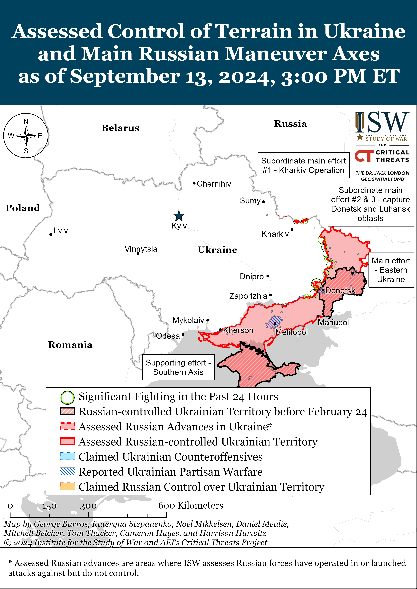
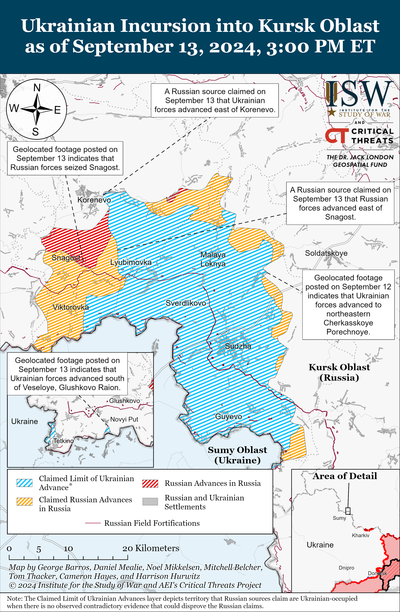
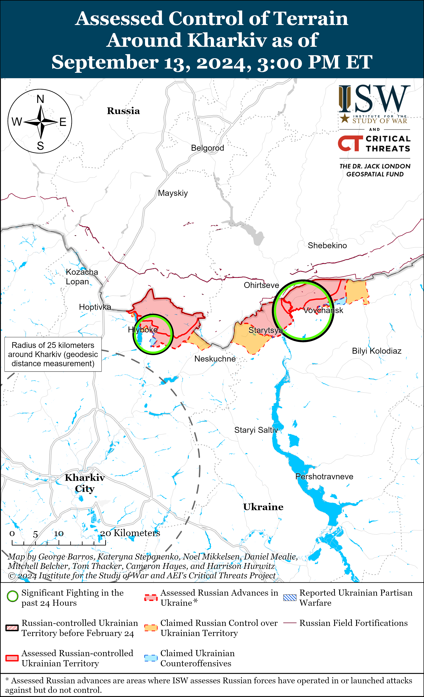
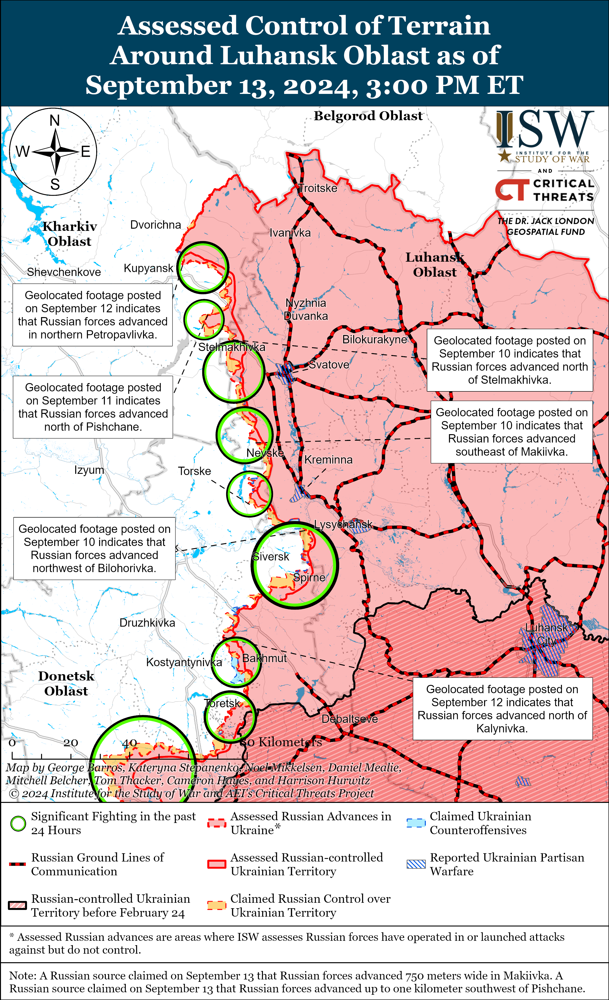
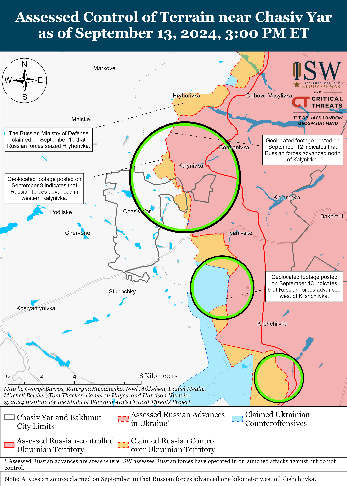
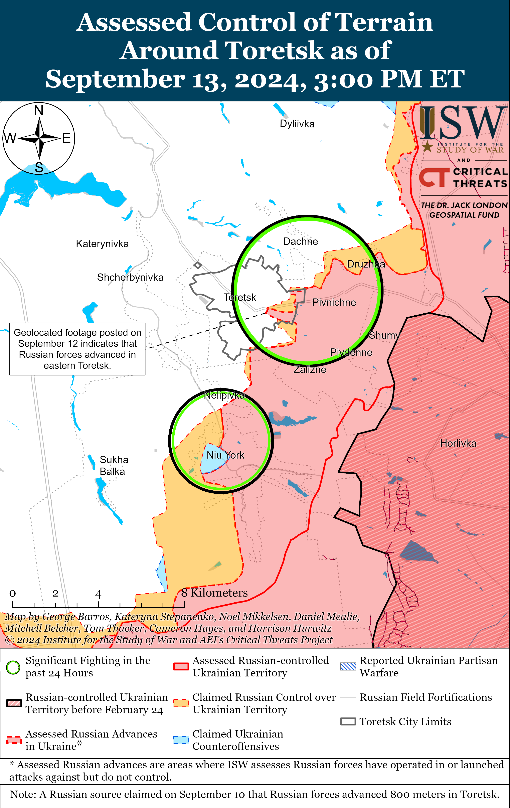
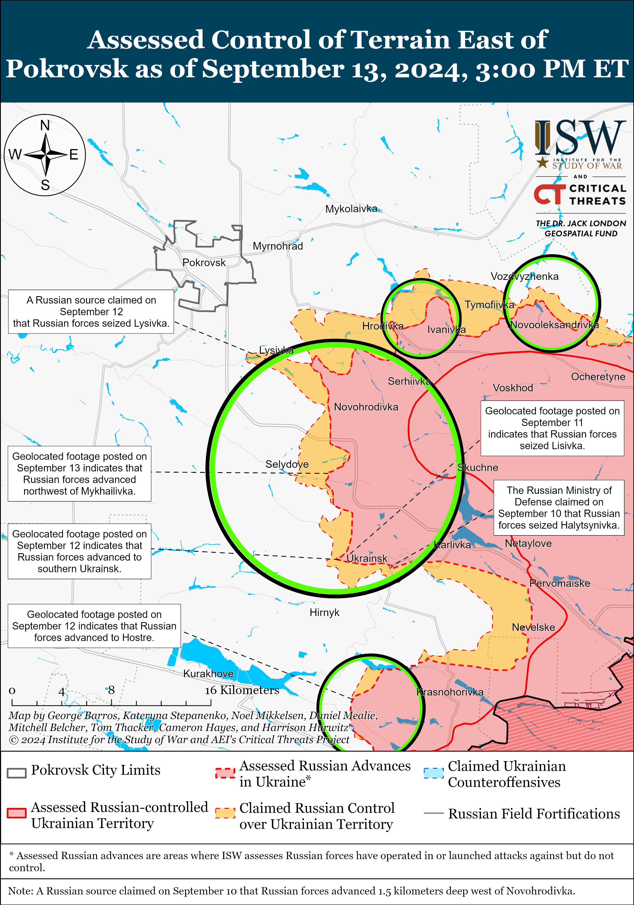
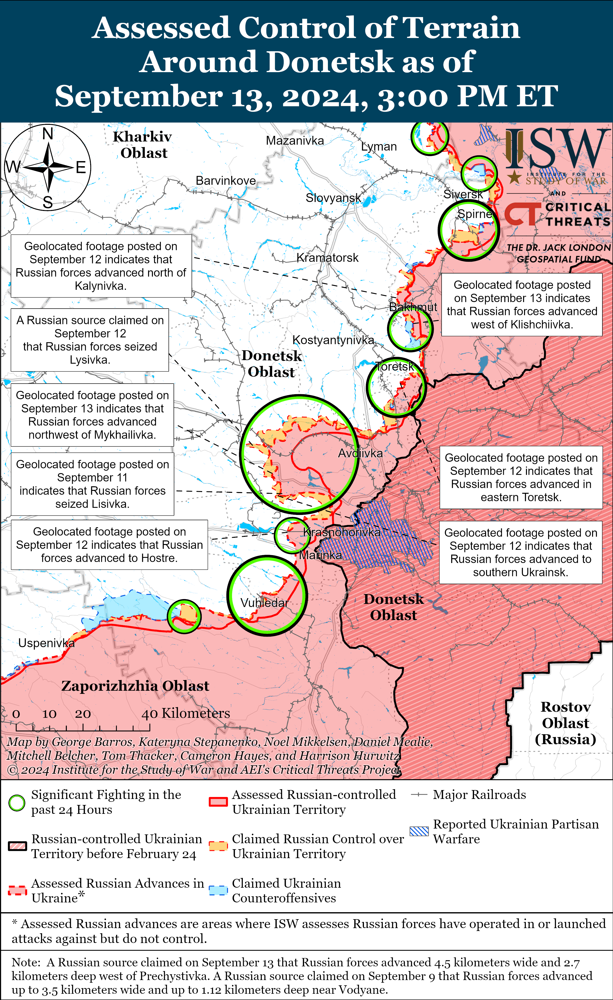
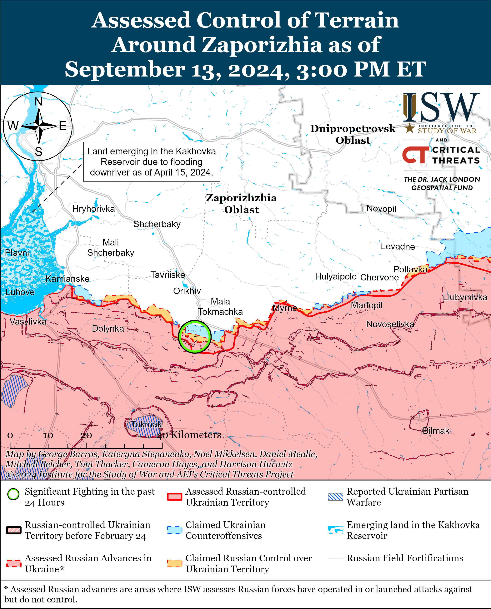
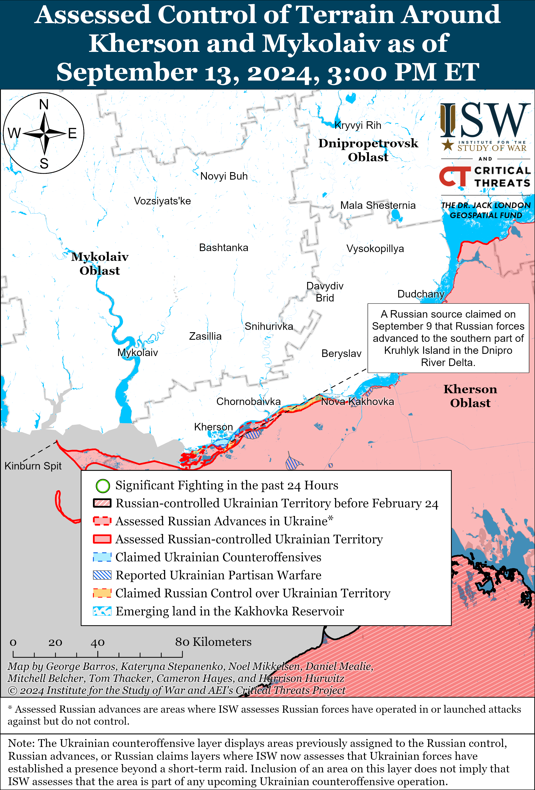

# Russian Offensive Campaign Assessment, September 13, 2024

**Angelica Evans, Christina Harward, Riley Bailey, Davit Gasparyan,  
Haley Zehrung, and George Barros**

**September 13, 2024, 8:30pm ET**

**Click** [**here**](https://storymaps.arcgis.com/stories/36a7f6a6f5a9448496de641cf64bd375) **to see ISW’s interactive map of the Russian invasion of Ukraine. This map is updated daily alongside the static maps present in this report.**

**Click** [**here**](https://storymaps.arcgis.com/stories/83a2f24901c941d581c0c523ecd2619b) **to see ISW’s interactive map of Ukraine’s offensive in Kursk Oblast.**

**Click** [**here**](https://understandingwar.maps.arcgis.com/apps/instant/3dviewer/index.html?appid=1602762dbcde419bb957dea358449580) **to see ISW’s 3D control of terrain topographic map of Ukraine. Use of a computer (not a mobile device) is strongly recommended for using this data-heavy tool.**

**Click** [**here**](https://storymaps.arcgis.com/stories/733fe90805894bfc8562d90b106aa895) **to access ISW’s archive of interactive time-lapse maps of the Russian invasion of Ukraine. These maps complement the static control-of-terrain map that ISW produces daily by showing a dynamic frontline. ISW will update this time-lapse map archive monthly.**

**Note: The data cut-off for this product was 12pm ET on September 13. ISW will cover subsequent reports in the September 14 Russian Offensive Campaign Assessment.**

**The Ukrainian incursion into Kursk Oblast has reportedly spoiled planned Russian offensive operations along the international border area that likely aimed to expand the area of active combat operations across a broader front in northeastern Ukraine.** Ukrainian President VolodymyrZelensky stated on September 13 that the Ukrainian operation in Kursk Oblast stopped Russian plans to create several buffer zones along the Ukrainian border “from the east to the north,” including in Sumy Oblast.[1] Zelensky stated that Russian forces wanted to launch major offensives to seize regional centers, likely referring to the regional capitals of Sumy and Kharkiv cities. Sumy and Kharkiv cities are roughly 25 and 30 kilometers from the international border, respectively – significantly further than the approximately six to 10 kilometers that Russian forces currently occupy near Lyptsi (north of Kharkiv City) and Vovchansk (northeast of Kharkiv City).

Zelensky’s statement suggests that Russian forces planned to start new offensive operations aimed at penetrating at least 25 kilometers deep into Sumy and Kharkiv oblasts and activating along a much wider front between at least Sumy and Kharkiv cities. Ukrainian Commander-in-Chief General Oleksandr Syrskyi similarly stated on September 5 that the Ukrainian incursion spoiled a planned Russian attack into Sumy Oblast and “reduced the threat” of Russian incursions into northern Ukraine.[2] ISW previously assessed that the Russian offensive operation in northern Kharkiv Oblast aimed to fix Ukrainian manpower and materiel along the northern border, granting Russian forces opportunities to re-intensify offensive operations in other higher-priority areas of the theater.[3] Ukrainian forces have largely stabilized the frontline in the Kharkiv direction since Summer 2024 and continue to contest the tactical initiative through counterattacks that have regained limited positions in northern Kharkiv Oblast.[4] The Russian military command may have intended for additional offensive operations along a wider and more continuous front in northeastern Ukraine to significantly stretch Ukrainian forces along the international border following the Ukrainian stabilization of the frontline north and northeast of Kharkiv City.

Zelensky noted that the Ukrainian incursion into Kursk Oblast has also impacted Russian offensive operations in Donetsk Oblast. Zelensky stated that the Ukrainian incursion “slowed” Russian advances throughout Donetsk Oblast and reduced the advantage in artillery ammunition that Russian forces in the Pokrovsk direction had over Ukrainian forces from 12-to-1 to 2.5-to-1.[5] ISW is unable to verify Zelensky’s statement, though the rate of Russian advance in the Pokrovsk area has notably slowed since the start of September 2024. Ukraine’s Main Military Intelligence Directorate (GUR) Head Lieutenant General Kyrylo Budanov stated during an interview published on September 7 that Ukraine’s incursion into Kursk Oblast complicated Russia’s plans for offensive operations, including in Russia’s “main direction” (likely referring to the Pokrovsk direction), in August 2024 and later this fall.[6] ISW has recently observed indications that Russian authorities have transferred limited elements of likely Russian reserve units from Donetsk Oblast, including from the Pokrovsk direction, to Kursk Oblast to counter the Ukrainian incursion.[7] Such limited redeployments are unlikely to have an immediate impact on the tempo of Russian offensive operations, although Russian forces may struggle to maintain their current offensive tempo into the future if Russian authorities conduct additional redeployments from reserve forces in Donetsk Oblast.

**Russian forces continue to counterattack throughout the Ukrainian salient in Kursk Oblast, but the Russian military will likely have to redeploy additional elements from elsewhere in the theater to Kursk Oblast to establish a force grouping capable of pursuing a sustained counteroffensive operation.** Ukrainian President Volodymyr Zelensky reiterated on September 13 that Russian forces have begun counteroffensive operations in Kursk Oblast, and Pentagon Spokesperson Major General Patrick Ryder stated on September 12 that the US has observed Russian units beginning to try to conduct “some type of counteroffensive” operation that Ryder described as “marginal.”[8] ISW continues to track observable Russian counterattacks in Kursk Oblast but has not yet observed large-scale combat operations indicating that Russian forces have started a large-scale concerted counteroffensive operation aimed at completely expelling Ukrainian forces from Kursk Oblast.

Zelensky stated that Russian forces have concentrated 40,000 personnel in Kursk Oblast but did not specify the composition of the Russian grouping, and it remains unclear whether Zelensky’s count is representative exclusively of combat-effective Russian soldiers or a joint force that includes contract soldiers, plus less effective conscripts, irregular forces, border guards, Rosgvardia elements, and Russian Interior Ministry forces.[9] Ukrainian military observer Kostyantyn Mashovets stated on September 13 that there are roughly 33,000 to 35,000 Russian personnel in Kursk Oblast.[10] Zelensky stated that the Russian military command intends to concentrate 60,000 to 70,000 personnel in Kursk Oblast, a number notably higher than the 50,000 personnel that US officials reportedly assessed that Russia would need to push Ukrainians out of Kursk Oblast.[11] Russian authorities have largely relied on poorly-trained and equipped conscripts and small elements of Russian regular and irregular forces to address the Ukrainian incursion into Kursk Oblast thus far, and it is unlikely that most of the current Russian force grouping in Kursk Oblast is comprised of combat experienced units.[12]

A Russian counteroffensive operation to retake territory seized by Ukrainian forces in Kursk Oblast will very likely require even more manpower and materiel than Russia has already concentrated in the area — especially if most of the already committed units lack combat experience. Russian Airborne (VDV) forces that recently redeployed to Kursk Oblast from the frontline in Ukraine currently appear to be heavily responsible for counterattacks in Kursk Oblast, suggesting that the Russian military command may intend to field units perceived to be more “elite” or combat effective to regain territory.[13] The Russian military will most certainly have to redeploy units already committed to ongoing offensive operations or operational reserves from Ukraine to Kursk Oblast in order to field the combat-effective units needed for a large counteroffensive operation and then subsequently guard the international border against future Ukrainian incursion.

**Russian forces appear to be testing more effective mechanized assault tactics west of Donetsk City, although Russian armored vehicles remain vulnerable to Ukrainian strike and drone capabilities.** Geolocated footage published on September 12 shows Russian forces conducting a reinforced battalion-sized mechanized assault and advancing across the fields southwest of Krasnohorivka and into eastern Hostre (west of Donetsk City).[14] Russian milbloggers also claimed that Russian forces advanced during the mechanized assault and one Kremlin-affiliated Russian milblogger claimed that Russian forces control one-third of Hostre.[15] The Ukrainian brigade that repelled the attack reported that Russian forces launched four waves of assaults over six hours on the morning of September 12 and that Russian forces used 46 pieces of mechanized equipment, including armored vehicles, tanks, and motorcycles during the assaults.[16] The brigade reported that Ukrainian forces destroyed 15 armored vehicles, tanks, and motorcycles and damaged 11 additional armored vehicles while repelling the assault. Although Ukrainian forces reportedly destroyed over half of the armored vehicles that Russian forces used during the mechanized assault near Hostre, Russian forces managed to advance between six and eight kilometers southwest of Krasnohorivka during the battle. Russian forces have historically struggled with rapid mechanized maneuver through open fields due to a lack of cover and concealment from Ukrainian drones and fires, but Russian forces may have assessed that the recent intensification of Russian offensive operations southwest of Pokrovsk and west and southwest of Donetsk City had sufficiently strained Ukraine’s defensive capabilities in this area to enable Russian forces to make tactically significant advances.[17]

The commander of another Ukrainian brigade operating in the Donetsk direction reported on September 13 that Russian forces are using a new tactic during mechanized assaults in this direction.[18] The commander reported that Russian forces are using a task-organized, small mechanized unit that features a heavily armored “turtle” tank (a tank with extra armored platting) equipped with mine-clearing equipment as the lead vehicle followed by several armored personnel carriers. The armored personnel carriers then carry Russian infantry close to Ukrainian positions before the infantry dismount to begin the assault and the personnel carriers presumably return to the point of departure. The commander reported that Russian forces are still suffering significant armored vehicle losses and estimated that Russian forces are losing up to 90 percent of the vehicles used in mechanized assaults in the Donetsk direction. Russian forces conducted a series of costly mechanized assaults in western Donetsk Oblast in late July 2024 but made very marginal territorial advances in exchange for their comparative heavy armored vehicle losses.[19] Russian forces most recently conducted a tactically significant mechanized assault up to the eastern outskirts of Chasiv Yar in April 2024, and Russian forces may attempt to model future mechanized assaults after these more tactically successful outcomes.[20]

**Ukraine and Russia conducted their second prisoner of war (POW) exchange since the Ukrainian incursion into Kursk Oblast on September 13.** Ukrainian President Volodymyr Zelensky announced that Ukraine and Russia each returned 49 prisoners and the United Arab Emirates (UAE) mediated the swap.[21] Zelensky stated that Ukraine returned servicemembers who defended the Azovstal Steel Plant in Mariupol, servicemembers of the Ukrainian National Police and State Border Service, and civilians. Russian officials have not yet confirmed the details of their returned prisoners, but Russian sources claimed that Russia returned individuals whom Ukrainian forces captured in the Kursk direction, including conscripts.[22] Ukrainian officials have previously suggested that the Ukrainian incursion into Kursk Oblast has forced Russia to more readily consider POW exchanges.[23] Russian opposition outlet *Vazhnye Istorii* reported that Russian citizens wrote a record number of 1,927 requests to Russian President Vladimir Putin to search for Russian servicemembers missing or captured in August 2024 following the beginning of the Ukrainian incursion into Kursk Oblast.[24]

**Russia continues efforts to strengthen strategic military ties with the People’s Republic of China (PRC), North Korea, and Iran to support its war effort in Ukraine.** Russian Deputy Defense Minister Alexander Fomin traveled to Beijing on September 13 to partake in the Xiangshan Forum where he highlighted the deepening strategic partnership between Russia and the PRC.[25] Fomin emphasized Russian-PRC plans for over 100 joint military cooperation events in 2024, blamed NATO and the US for intensifying the war in Ukraine, and criticized the US for pursuing an alleged dual containment policy of Russia and the PRC.[26]

Reuters, citing two undisclosed European intelligence sources and obtained documents, reported on September 13 that Russia has been producing the long-range “Garpiya-A1” attack drone using Chinese engines and other dual-use parts since 2023 and that Russian forces have used the drone to strike military and civilian targets in Ukraine.[27] The Garpiya-A1 drone has a range of 1,500 kilometers, similar to the Iranian Shahed-136 drones. Reuters reported that Russian weapons manufacturer IEMZ Kupol reportedly produced over 2,500 Garpiya-A1 drones between July 2023 to July 2024.

TASSalso reported on September 13 that Russian Security Council head Sergei Shoigu traveled to Pyongyang, North Korea and met North Korean President Kim Jong Un for unspecified bilateral discussions.[28] This follows Russian President Vladimir Putin’s visit to North Korea in June 2024, where he signed a Comprehensive Strategic Partnership agreement with Kim and continued shipments of North Korean artillery shells and ballistic missiles to Russia.[29] Shoigu’s visit also follows Iran’s recent delivery of over 200 Fateh-360 short-range ballistic missiles to Russia and Putin’s meeting with Iranian Secretary of the National Security Council, Ali Akbar Ahmadian on September 12.[30]

Russia’s deepening engagement with the PRC, North Korea, and Iran is part of a wider Kremlin effort to establish a coalition of friendly states aimed directly at enhancing the Russian defense industrial base (DIB) and securing strategic economic cooperation to support its war in Ukraine.[31]

**Key Takeaways:**

- **The Ukrainian incursion into Kursk Oblast has reportedly spoiled planned Russian offensive operations along the international border area that likely aimed to expand the area of active combat operations across a broader front in northeastern Ukraine.**
- **Russian forces continue to counterattack throughout the Ukrainian salient in Kursk Oblast, but the Russian military will likely have to redeploy additional elements from elsewhere in the theater to Kursk Oblast to establish a force grouping capable of pursuing a sustained counteroffensive operation.**
- **Russian forces appear to be testing more effective mechanized assault tactics west of Donetsk City, although Russian armored vehicles remain vulnerable to Ukrainian strike and drone capabilities.**
- **Ukraine and Russia conducted their second prisoner of war (POW) exchange since the Ukrainian incursion into Kursk Oblast on September 13.**
- **Russia continues efforts to strengthen strategic military ties with the People’s Republic of China (PRC), North Korea, and Iran to support its war effort in Ukraine.**
- **Russian and Ukrainian forces recently advanced in Kursk Oblast amid continued Russian and Ukrainian assaults in the area on September 13.**
- **Russian forces recently marginally advanced near Kupyansk, Chasiv Yar, Toretsk, and Pokrovsk.**
- **Russian authorities continue attempts to coerce minorities and Ukrainian youth living in occupied Ukraine to sign contracts with the Ministry of Defense (MoD) to avoid conducting a wider mobilization.**

[****](https://understandingwar.org/wp-content/uploads/2025/05/DraftUkraineCoT20September20132C202024.png) 

***We do not report in detail on Russian war crimes because these activities are well-covered in Western media and do not directly affect the military operations we are assessing and forecasting. We will continue to evaluate and report on the effects of these criminal activities on the Ukrainian military and the Ukrainian population and specifically on combat in Ukrainian urban areas. We utterly condemn Russian violations of the laws of armed conflict and the Geneva Conventions and crimes against humanity even though we do not describe them in these reports.***

- Ukrainian Operations in the Russian Federation
- Russian Main Effort – Eastern Ukraine (comprised of three subordinate main efforts)
- Russian Subordinate Main Effort #1 – Push Ukrainian forces back from the international border with Belgorod Oblast and approach to within tube artillery range of Kharkiv City
- Russian Subordinate Main Effort #2 – Capture the remainder of Luhansk Oblast and push westward into eastern Kharkiv Oblast and encircle northern Donetsk Oblast
- Russian Subordinate Main Effort #3 – Capture the entirety of Donetsk Oblast
- Russian Supporting Effort – Southern Axis
- Russian Air, Missile, and Drone Campaign
- Russian Mobilization and Force Generation Efforts
- Russian Technological Adaptations
- Activities in Russian-occupied areas
- Ukrainian Defense Industrial Base Efforts
- Russian Information Operations and Narratives
- Significant Activity in Belarus

**Ukrainian Operations in the Russian Federation**

Russian and Ukrainian forces recently advanced in Kursk Oblast amid continued Russian and Ukrainian assaults in the area on September 13. Geolocated footage published on September 12 indicates that Ukrainian forces recently advanced in northeastern Cherkasskoye Porechnoye (north of Sudzha).[32] Geolocated footage published on September 13 shows Russian forces operating in central Snagost (south of Korenevo), indicating that Russian forces recently seized the entirety of the settlement.[33] Russian sources claimed that Russian forces seized Pokrovsky and Obukhovka (both southeast of Korenevo and Snagost), though ISW has not observed visual evidence supporting these claims.[34] Russian milbloggers claimed that Russian forces advanced in southern Russkaya Konopelka (east of Sudzha) and west of Lyubimovka (southeast of Korenevo) and that Ukrainian forces advanced northeast of Pogrebki (north of Sudzha) and east of Korenevo.[35] Russian sources claimed that Ukrainian forces continued offensive operations southeast of Korenevo near Obukhovka; east of Korenevo near Olgovka; north of Sudzha near Kamyshevka; and southeast of Sudzha near Borki and Fanaseevka.[36] Russian milbloggers claimed that Russian forces conducted counterattacks along the Lyubimovka-Tolstoy Lug-Darino line (southeast of Korenevo and as close as three kilometers north of the Sumy Oblast border) and cleared Krasnooktyabrskoye (southwest of Korenevo).[37] *CNN* reported on September 14 that Ukrainian forces operating in Kursk Oblast stated that Russian forces deployed reinforcements from the “Wagner Group” that were likely in West Africa to Kursk Oblast and that these “Wagner” forces are better equipped and trained than regular Russian forces in the area.[38] The Ukrainian soldiers may be referring to Africa Corps personnel or the Russian “Bear (Medvedi) Brigade” private military company that reportedly returned from West Africa due to the incursion into Kursk Oblast.[39] Ukrainian military observer Kostyantyn Mashovets stated that the Russian military command has committed two battalions from the 155th Naval Infantry Brigade (Pacific Fleet, Eastern Military District [EMD]) and elements of the 106th Airborne (VDV) Division’s 51st VDV Regiment and 173rd Reconnaissance Battalion to the Kursk direction.[40] Elements of the Russian 56th VDV Regiment (7th VDV Division) are reportedly operating in Vishnevka and Komarovka (both southwest of Korenevo); elements of the 51st VDV Regiment are reportedly operating in Snagost, Krasnooktyabrskoye, and Apanasovka (south of Korenevo); elements of the Chechen Akhmat Spetsnaz “Aida” Detachment are reportedly operating in the Sudzha direction; elements of the 204th Akhmat Regiment are reportedly operating in Cherkasskoye Porechnoye; and elements of the 810th Naval Infantry Brigade (Black Sea Fleet, Southern Military District [SMD]) are reportedly operating in the Kursk direction.[41]

Ukrainian forces recently advanced in Glushkovsky Raion (west of Korenevsky Raion) amid continued Ukrainian assaults in the area on September 13. Geolocated footage published on September 13 indicates that Ukrainian forces recently advanced south of Veseloye (southwest of Gluskhovo and three kilometers from the international border).[42] Russian sources claimed that Ukrainian forces attacked southwest of Glushkovo near Novy Put and Veseloye and Medvezhye (east of Veseloye).[43] A Russian milblogger denied claims that Ukrainian forces entered Veseloye.[44]

**Russian Main Effort – Eastern Ukraine**

**Russian Subordinate Main Effort #1 – Kharkiv Oblast (Russian objective: Push Ukrainian forces back from the international border with Belgorod Oblast and approach to within tube artillery range of Kharkiv City)**

Ukrainian State Border Service Spokesperson Andriy Demchenko stated on September 13 that Russian sabotage and reconnaissance groups have significantly decreased activity along the Russian-Ukrainian border in Sumy Oblast since the start of Ukraine’s incursion into Kursk Oblast.[45]

Russian forces continued ground attacks north of Kharkiv City near Hlyboke and northeast of Kharkiv City near Hatyshche and Vovchansk on September 12 and 13 but did not make any confirmed gains.[46] Ukrainian Kharkiv Group of Forces Spokesperson Colonel Vitaly Sarantsev reported that Russian forces are increasingly using light armored vehicles and are occasionally using heavy armored vehicles in the Kharkiv direction. Sarantsev did not suggest that this increased Russian armored vehicle use indicates intensified Russian offensive activity, however, and stated that Russian forces are not building up forces near Hlyboke, Lyptsi (north of Kharkiv City), Vovchansk, or other border settlements in northern Kharkiv Oblast.[47] Sarantsev added that Russian forces do not intend to deploy significant reinforcements to Kharkiv Oblast and that Russian forces constantly conduct tactical-level and internal rotations in the area.[48] Ukraine’s Kharkiv Group of Forces reported that Russian forces are strengthening elements of the Russian 136th Motorized Rifle Brigade (58th Combined Arms Army [CAA], Southern Military District [SMD]) near Tykhe (northeast of Kharkiv City).[49]

**Russian Subordinate Main Effort #2 – Luhansk Oblast (Russian objective: Capture the remainder of Luhansk Oblast and push westward into eastern Kharkiv Oblast and northern Donetsk Oblast)**

Russian forces recently advanced east of Kupyansk amid continued offensive operations along the Kupyansk-Svatove-Kreminna line on September 13. Geolocated footage published on September 12 indicates that Russian forces recently advanced into northern Petropavlivka (east of Kupyansk).[50] A Russian milblogger claimed that Russian forces advanced up to a kilometer in depth along the ravine southwest of Pishchane (northwest of Svatove) and up to 750 meters wide in Makiivka (northwest of Kreminna), although ISW has not observed confirmation of these claims.[51] Russian forces continued offensive operations northeast of Kupyansk near Synkivka; east of Kupyansk near Petropavlivka; northeast of Svatove near Hlushkivka, Kolisnykivka, and Stelmakhivka and in the direction of Lozova; west of Svatove near Kopanky; southwest of Svatove near Druzhelyubivka; northwest of Kreminna near Hrekivka, Makiivka, and Nevske; west of Kreminna near Yampolivka and Torske; and south of Kreminna near Serebryanka on September 12 and 13.[52] A Ukrainian soldier operating in the Lyman direction stated on September 12 that Russian forces are intensifying TOS-1A thermobaric artillery strikes in the area.[53] Elements of the Russian 7th Motorized Rifle Brigade (2nd Luhansk People’s Republic [LNR] Army Corps [AC] [reportedly reorganized into the 3rd Combined Arms Army]) are reportedly operating near Serebryanka.[54]

**Russian Subordinate Main Effort #3 – Donetsk Oblast (Russian objective: Capture the entirety of Donetsk Oblast, the claimed territory of Russia’s proxies in Donbas)**

Russian forces continued assaults northeast of Siversk near Bilohorivka, east of Siversk near Verkhnokamyanske, and southeast of Siversk near Spirne and Vyimka, but there were no confirmed changes to the frontline.[55]

Russian forces recently advanced southeast of Chasiv Yar amid continued fighting in the area on September 13. Geolocated footage published on September 13 indicates that Russian forces recently advanced west of Klishchiivka (southeast of Chasiv Yar).[56] Advances west of the settlement indicate that Russian forces have further consolidated control over Klishchiivka and that Russian forces have developed the ability to maintain a consistent presence in Klishchiivka and use the settlement and its environs as a staging ground for offensive activity. Klishchiivka had long been a contested “grey zone,” and Russia’s ability to establish control in the area will facilitate Russian attempts to try to cross the Siverskyi-Donets Donbas Canal west of Klishchiivka. A Russian milblogger claimed that Russian forces advanced near Ivanivske (east of Chasiv Yar), but ISW has not observed visual confirmation of this claim.[57] Fighting continued near Chasiv Yar itself, southeast of Chasiv Yar near Andriivka, and south of Chasiv Yar near Stupochky on September 12 and 13.[58]

Russian forces recently marginally advanced near Toretsk amid continued assaults in the area on September 13. Geolocated footage published on September 12 indicates that Russian forces recently marginally advanced in eastern Toretsk.[59] Russian forces continued offensive operations northeast of Toretsk near Dachne, within Toretsk itself, and south of Toretsk near Nelipivka and Niu York on September 12 and 13.[60]

Russian forces recently marginally advanced southeast of Pokrovsk amid continued assaults east and southeast of the city on September 13. Geolocated footage published on September 13 indicates that Russian forces recently marginally advanced northwest of Mykhailivka (southeast of Pokrovsk and immediately east of Selydove).[61] Russian milbloggers claimed that Russian forces advanced within Hrodivka (west of Pokrovsk) and near Ukrainsk (southwest of Pokrovsk), but ISW has not observed visual confirmation of these claims.[62] Fighting continues west of Pokrovsk near Zelene Pole, Vozdvyzhenka, Novooleksandrivka, Myrolyubivka, and southeast of Pokrovsk in the direction of Novotroitske and near Novohrodivka, Selydove, Mykhailivka, Ukrainsk, and Zhelanne Pershe on September 12 and 13.[63]

Russian forces have recently destroyed several bridges near Pokrovsk, likely to complicate Ukrainian logistics in the area and prepare for a future assault on Pokrovsk and nearby settlements. Russian milbloggers amplified footage on September 12 purportedly showing Russian forces striking and destroying a bridge along the T-0504 Bakhmut-Pokrovsk highway between Myrnohrad and Pokrovsk.[64] Russian milbloggers later posted footage purportedly showing Russian forces striking another bridge near Selydove with a Kh-38 air-to-surface missile.[65] Russian forces reportedly struck a bridge on the eastern outskirts of Selydove on September 7.[66]

Russian forces continued offensive operations west of Donetsk City including near Heorhiivka on September 12 and 13, but there were no confirmed changes to the frontline.[67] A Kremlin-affiliated Russian milblogger claimed that Russian forces advanced north of Krasnohorivka and Hostre, although ISW has not observed visual confirmation of these claims.[68]

Russian forces continued offensive operations west of Donetsk City northeast of Vuhledar near Kostyantynivka and Vodyane, near Vuhledar itself, and west of Vuhledar near Prechystivka and Zolota Nyva on September 12 and 13, but there were no confirmed changes to the frontline.[69] Russian milbloggers claimed that Russian forces advanced near Vodyane and 2.7 kilometers in depth and 4.5 kilometers wide west of Prechystivka, but ISW has not observed visual confirmation of this claim.[70]

**Russian Supporting Effort – Southern Axis (Russian objective: Maintain frontline positions and secure rear areas against Ukrainian strikes)**

Positional fighting continued in western Zaporizhia near Robotyne on September 12 and 13, but there were no confirmed changes to the frontline.[71] Ukrainian Tavriisk Group of Forces Spokesperson Captain Dmytro Lykhovyi reported that Russian forces are intensely shelling Ukrainian positions in the Zaporizhia direction, many of which are located in contested “gray zones” or areas where there is positional fighting.[72] Lykhovyi said that Ukrainian forces must establish new positions due to Russian shelling, especially in the Orikhiv direction (Robotyne area). A Russian milblogger posted footage on September 13 purporting to show that drone operators of the Russian 4th Military Guards Base (58th Combined Arms Army [CAA], Southern Military District [SMD]) struck a Ukrainian position near Kamyanske, likely in Zaporizhia Oblast.[73]

Fighting continued in east (left) bank Kherson Oblast, but there were no confirmed changes to the front line.[74]

Ukrainian military analyst Petro Chernyk reported on September 13 that Russian forces have deployed an unspecified number of S-500 air defense systems to occupied Crimea and that the Russian military currently only has 16 S-500 systems in total.[75] Chernyk stated that Russia’s air defense coverage in occupied Crimea is denser than in Moscow, likely because the Russian military is prioritizing air defense coverage for the Kerch Straight Bridge. Ukrainian Navy Spokesperson Captain Third Rank Dmytro Pletenchuk stated that Russian logistics in southern Ukraine rely entirely on the Kerch Strait Bridge.[76] The Ukrainian Center for Journalistic Investigations reported on September 13 that Russian forces installed seven piers and several fences along the Kerch Strait bridge in early September 2024 to protect the bridge’s concrete supports from naval and aerial drone strikes.[77] Russian forces have reportedly also placed Pantsir-S1 air defense systems under the bridge on the northern and southern sides of Tuzla Island and have deployed observation posts, machine gun nests, anti-aircraft positions, and electronic warfare (EW) assets along the entire bridge.

**Russian Air, Missile, and Drone Campaign (Russian Objective: Target Ukrainian military and civilian infrastructure in the rear and on the frontline)**

Russian forces conducted a series of drone and missile strikes against Ukraine overnight on September 12 to 13. The Ukrainian Air Force reported that Russia launched 26 Shahed-136/131 drones from Primorsko-Akhtarsk, Krasnodar Krai, and occupied Cape Chauda, Crimea.[78] Ukrainian forces reportedly downed 24 drones over Mykolaiv, Odesa, Khmelnytskyi, and Ivano-Frankivsk oblasts. Ukrainian State Emergency Services and the Ukrainian Ministry of Energy reported on September 13 that a Russian drone strike caused a fire in Ivano-Frankivsk Oblast and damaged industrial infrastructure.[79] Odesa Oblast Military Administration Head Oleh Kiper reported on September 13 that falling drone debris damaged residential areas in Odesa City and Oblast.[80] A Russian milblogger claimed that Russian forces struck Ukrainian drone and radar equipment near the Hydroport Airport in Odesa City.[81]

**Russian Mobilization and Force Generation Efforts (Russian objective: Expand combat power without conducting general mobilization)**

Russian authorities continue attempts to coerce minorities and Ukrainian youth living in occupied Ukraine to sign contracts with the Ministry of Defense (MoD) to avoid conducting a wider mobilization. Luhansk Oblast Military Administration Head Artem Lysohor stated on September 13 that Russian occupation authorities distributed materials encouraging Ukrainian high school students at schools in occupied Starobilsk, Luhansk Oblast to sign military service contracts with the Russian MoD.[82] Indian news media *New Delhi Television* (*NDTV*), referencing the Indian Ministry of Foreign Affairs (MFA), reported on September 13 that unspecified Russian actors deceived 45 Indian citizens into signing a contract with the Russian MoD and have since been released after intervention by the Indian government.[83] Indian Foreign Secretary Vinay Mohan Kwatra stated on July 9 that Indian Prime Minister Narendra Modi “strongly” raised the need for Russia to facilitate the early discharge of Indian nationals “who have been misled” into fighting in Ukraine as part of the Russian military during his meeting with Russian President Vladimir Putin in Moscow on July 8.[84]

The Russian-led “Okean-2024” international naval exercises continued on September 13 and featured assets of the Russian Northern, Baltic, and Pacific fleets as well as Russian Tu-22M3 bombers.[85]

**Russian Technological Adaptations (Russian objective: Introduce technological innovations to optimize systems for use in Ukraine)**

Donetsk People’s Republic (DNR) Head Denis Pushilin claimed on September 12 that Russian forces have developed a new electronic warfare (EW) system that can attach to a service member’s helmet. Pushilin claimed that elements of the Russian 114th Motorized Rifle Brigade (51st Combined Arms Army [CAA], formerly 1st Donetsk People’s Republic [DNR] Army Corps [AC]) are already utilizing the portable EW system and that the engineers of the brigade are working to increase the frequency spectrum of the device in order to improve the device’s effectiveness against drones.[86] Pushilin stated that the brigade intends to provide each service member with their own device in the future**.**

**Ukrainian Defense Industrial Efforts (Ukrainian objective: Develop its defense industrial base to become more self-sufficient in cooperation with US, European, and international partners)**

*ISW is suspending publishing coverage of Ukrainian defense industrial efforts until further notice.*

**Activities in Russian-occupied areas (Russian objective: Consolidate administrative control of annexed areas; forcibly integrate Ukrainian citizens into Russian sociocultural, economic, military, and governance systems)**

*ISW is not publishing coverage of Russian-occupied areas today.*

**Russian Information Operations and Narratives**

Russian authorities continue efforts to discredit the Ukrainian incursion into Kursk Oblast and to deter Western aid to Ukraine. The Russian Investigative Committee charged in absentia Ukrainian Head of the Northern Operational Command Major General Dmytro Krasilnikov under nine articles for crimes allegedly committed in Kursk Oblast, including terrorism, murder, and illegally crossing the Russian border.[87] The Russian Ministry of Foreign Affairs (MFA) continued to claim on September 13 that Ukrainian forces intend to seize or damage the Kursk Nuclear Power Plant (KNPP) and are striking the facility with missiles, drones, and MLRS.[88] ISW previously noted that Ukrainian forces have consistently demonstrated capabilities to conduct rear area strikes within Russia and occupied Ukraine at distances exceeding the roughly 60 kilometers between the KNPP and the international border or the roughly 30-40 kilometers from the current Ukrainian forward line of own troops (FLOT) within Kursk Oblast, suggesting that the Ukrainian military command has deliberately avoided striking the KNPP.[89]

Russian media organizations continue to expand into Kremlin-friendly countries. Russian news aggregator *Readovka* stated on September 12 that it created the Spanish-language *Readovka en Venezuela* project, which will cover the war in Ukraine, domestic events in Venezuela, international relations, and Venezuelan prospects for joining BRICS.[90] *Readovka’s* announcement comes against the backdrop of expanding Russo-Venezuelan ties, including the signing of a joint memorandum of understanding (MOU) in June 2024 that describes an intent to develop a joint strategy combating “unilateral coercive measures” through informational channels and diplomatic means.[91]

**Significant activity in Belarus (Russian efforts to increase its military presence in Belarus and further integrate Belarus into Russian-favorable frameworks and Wagner Group activity in Belarus)**

Belarusian President Alexander Lukashenko met with Iranian Secretary of the Supreme National Security Council Ali Akbar Ahmadian on September 13.[92] Lukashenko claimed that Belarusian-Iranian trade is increasing and that Belarus “needs joint actions with [Iran]” during the military and political situations in the Middle East and at the Belarusian borders. Lukashenko claimed that Belarus and Iran are interested in the development of a multipolar world and that BRICS and the Shanghai Cooperation Organization (SCO) are “gaining momentum.”

**Note: ISW does not receive any classified material from any source, uses only publicly available information, and draws extensively on Russian, Ukrainian, and Western reporting and social media as well as commercially available satellite imagery and other geospatial data as the basis for these reports. References to all sources used are provided in the endnotes of each update.**

---

[1] https://t.me/V\_Zelenskiy\_official/11640; https://armyinform dot com.ua/2024/09/13/prezydent-ukrayiny-vidpoviv-chy-bula-operacziya-na-kurshhyni-pomylkoyu/

[2] https://isw.pub/UkrWar090524

[3] https://isw.pub/UkrWar051024; https://isw.pub/UkrWar051324; https://isw.pub/UkrWar051424; https://understandingwar.org/backgrounder/russian-offensive-campaign-assessment-may-15-2024 ; https://understandingwar.org/backgrounder/russian-offensive-campaign-assessment-june-22-2024

[4] https://understandingwar.org/backgrounder/russian-offensive-campaign-assessment-august-21-2024-0; https://understandingwar.org/backgrounder/russian-offensive-campaign-assessment-july-12-2024

[5] https://armyinform dot com.ua/2024/09/13/prezydent-ukrayiny-vidpoviv-chy-bula-operacziya-na-kurshhyni-pomylkoyu/

[6] https://isw.pub/UkrWar090724

[7] https://isw.pub/UkrWar083124 ; https://isw.pub/UkrWar091224

[8] https://www.defense.gov/News/Transcripts/Transcript/Article/3904376/pentagon-press-secretary-maj-gen-pat-ryder-holds-a-press-briefing/ ; https://t.me/V\_Zelenskiy\_official/11640 ; https://armyinform.com dot ua/2024/09/13/prezydent-ukrayiny-vidpoviv-chy-bula-operacziya-na-kurshhyni-pomylkoyu/ ; https://suspilne dot media/835137-piloti-zsu-rozpocali-trenuvanna-na-f-16-v-rumunii-rosia-atakuvala-harkiv-fugasnimi-aviabombami-933-den-vijni-onlajn/?anchor=live\_1726238922&utm\_source=copylink&utm\_medium=ps

[9] https://t.me/V\_Zelenskiy\_official/11640 ; https://armyinform.com dot ua/2024/09/13/prezydent-ukrayiny-vidpoviv-chy-bula-operacziya-na-kurshhyni-pomylkoyu/ ; https://suspilne dot media/835137-piloti-zsu-rozpocali-trenuvanna-na-f-16-v-rumunii-rosia-atakuvala-harkiv-fugasnimi-aviabombami-933-den-vijni-onlajn/?anchor=live\_1726238922&utm\_source=copylink&utm\_medium=ps

[10] https://t.me/zvizdecmanhustu/2181

[11] https://www.nytimes.com/2024/08/23/us/politics/ukraine-incursion-russia-buffer-zone.html

[12] https://isw.pub/UkrWar091124 ; https://understandingwar.org/backgrounder/russian-offensive-campaign-assessment-september-12-2024

[13] https://isw.pub/UkrWar091124 ; https://isw.pub/UkrWar091224

[14] https://x.com/EjShahid/status/1834271681956696461; https://t.me/oaembr46/1012

[15] https://t.me/dva\_majors/52416 ; https://t.me/dva\_majors/52418 ; https://t.me/RVvoenkor/76873 ; https://t.me/rybar/63488 ; https://t.me/z\_arhiv/28078

[16] https://t.me/oaembr46/1012

[17] https://isw.pub/UkrWar090524

[18] https://armyinform.com dot ua/2024/09/13/sarayamy-za-doneczkym-sczenariyem-shho-zmushuye-rosiyan-pokirno-konservuvatysya-v-blyashanky/ ; https://youtu.be/j5TqaWCCdUg

[19] https://isw.pub/UkrWar073024

[20] https://understandingwar.org/backgrounder/russian-offensive-campaign-assessment-april-4-2024

[21] https://t.me/V\_Zelenskiy\_official/11631 ; https://armyinform.com dot ua/2024/09/13/dodomu-iz-rosijskogo-polonu-povernuly-49-voyiniv-ta-czyvilnyh-sered-nyh-geroj-ukrayiny/ ; https://minre.gov dot ua/2024/09/13/z-vorozhogo-polonu-vyzvolyly-shhe-49-ukrayincziv-ta-ukrayinok-u-tomu-chysli-zahysnykiv-azovstali/ ; https://meduza dot io/news/2024/09/13/zelenskiy-soobschil-chto-ukraina-vernula-49-svoih-grazhdan-vklyuchaya-krymskuyu-tatarku-lenie-umerovu-v-rossii-ee-obvinili-v-shpionazhe ; https://www.facebook.com/GeneralStaff.ua/posts/pfbid0SQZU8wg9m5Fnhh9LeEXEXYoZ8uEezEbbtaKnQj5xiBWzPMcSqGfXi6nzxZT88ZRcl

[22] https://t.me/rybar/63489; https://t.me/DnevnikDesantnika/15410; https://t.me/mobilizationnews/20217

[23] https://isw.pub/UkrWar081624

[24] https://storage.googleapis dot com/istories/news/2024/09/13/rekordnoe-chislo-obrashchenii-o-poiske-propavshikh-bez-vesti/index.html

[25] https://t.me/tass\_agency/272378 ; https://t.me/mod\_russia/43337

[26] https://t.me/tass\_agency/272379; https://t.me/tass\_agency/272380; https://t.me/tass\_agency/272381; https://t.me/tass\_agency/272382; https://t.me/tass\_agency/272383

[27] https://www.reuters.com/world/europe/russia-produces-new-kamikaze-drone-with-chinese-engine-say-european-intel-2024-09-13/ ; https://t.me/istories\_media/7552; https://www.themoscowtimes dot com/2024/09/13/russia-using-chinese-engines-to-make-attack-drones-reuters-a86368

[28] https://t.me/tass\_agency/272432

[29] https://understandingwar.org/backgrounder/russian-offensive-campaign-assessment-june-19-2024; https://understandingwar.org/backgrounder/russian-offensive-campaign-assessment-february-6-2024

[30] https://understandingwar.org/backgrounder/russian-offensive-campaign-assessment-september-12-2024

[31] https://understandingwar.org/backgrounder/russian-offensive-campaign-assessment-september-4-2024; https://understandingwar.org/backgrounder/russian-offensive-campaign-assessment-june-26-2024

[32] https://x.com/moklasen/status/1834358973211844834; https://t.me/The\_First\_SHO\_Russia/1097; https://t.me/creamy\_caprice/6783

[33] https://x.com/moklasen/status/1834358973211844834; https://t.me/The\_First\_SHO\_Russia/1097; https://t,me/creamy\_caprice/6783

[34] https://t.me/DnevnikDesantnika/15396; https://t.me/rusich\_army/17101

[35] https://t.me/rybar/63459 ; https://t.me/rybar/6345; https://t.me/DnevnikDesantnika/15396

[36] https://t.me/mod\_russia/43331; https://t.me/rybar/63459; https://t.me/DnevnikDesantnika/15396; https://t.me/sashakots/48952; https://t.me/motopatriot/27458

[37] https://t.me/dva\_majors/52416

[38] https://www.cnn.com/2024/09/13/world/ukraine-kursk-offensive-cost/index.html

[39] https://understandingwar.org/backgrounder/russian-offensive-campaign-assessment-august-30-2024

[40] https://t.me/zvizdecmanhustu/2181

[41] https://t.me/rusich\_army/17101; https://t.me/RVvoenkor/76874; https://t.me/sashakots/48949; https://t.me/epoddubny/21056; https://t.me/motopatriot/27415; https://x.com/moklasen/status/1834358973211844834; https://t.me/The\_First\_SHO\_Russia/1097 https://t.me/creamy\_caprice/6783

[42] https://t.me/creamy\_caprice/6787 ; https://t.me/starshii\_pogrannaryada/10124 ;

[43] https://t.me/mod\_russia/43331; https://t.me/dva\_majors/52416; https://t.me/rybar/63459; https://t.me/RVvoenkor/76904; https://t.me/dva\_majors/52390; https://t.me/sashakots/48952

[44] https://t.me/dva\_majors/52429

[45] https://armyinform.com dot ua/2024/09/13/vorozhyh-dyversantiv-na-sumshhyni-vyyavlyayut-dronamy-chym-zajmayutsya-drg/

[46] https://www.facebook.com/GeneralStaff.ua/posts/pfbid0b3qPDBugyZ6QFowRzFkstZ2hARtBqoCQSRV8SSHoZpL3AT264AfQTEBPVegtStjZl ; https://www.facebook.com/GeneralStaff.ua/posts/pfbid02EbNixBZyjmaY5wnGu7gmbhTcJjdTpr2fk9c5T2NTUKdyrxEWvXqZeodx68NkPvoKl ; https://www.facebook.com/GeneralStaff.ua/posts/pfbid0tcYhSuiWeb8zSfkVf5hMzeHSxUM8JCHdNs4cdrnLehZPPCsuFAtxuL3mJs7xg7dpl ; https://t.me/wargonzo/22071

[47] https://armyinform.com dot ua/2024/09/13/vorozhi-broneshturmy-pochastishaly-na-harkivshhyni-yak-vdayetsya-protydiyaty/ ; https://youtu.be/aDXWlQ2K0dM

[48] https://armyinform.com dot ua/2024/09/13/vorozhi-broneshturmy-pochastishaly-na-harkivshhyni-yak-vdayetsya-protydiyaty/ ; https://youtu.be/aDXWlQ2K0dM

[49] https://t.me/otukharkiv/1314

[50] https://x.com/EjShahid/status/1834336786732253393; https://x.com/EjShahid/status/1834336941300719629

[51] https://t.me/RVvoenkor/76891

[52] https://www.facebook.com/GeneralStaff.ua/posts/pfbid0b3qPDBugyZ6QFowRzFkstZ2hARtBqoCQSRV8SSHoZpL3AT264AfQTEBPVegtStjZl ; https://www.facebook.com/GeneralStaff.ua/posts/pfbid02EbNixBZyjmaY5wnGu7gmbhTcJjdTpr2fk9c5T2NTUKdyrxEWvXqZeodx68NkPvoKl ; https://www.facebook.com/GeneralStaff.ua/posts/pfbid0tcYhSuiWeb8zSfkVf5hMzeHSxUM8JCHdNs4cdrnLehZPPCsuFAtxuL3mJs7xg7dpl

[53] https://www.youtube.com/watch?v=cJKliTMYUpc ; https://armyinform.com dot ua/2024/09/12/na-lymanskomu-napryamku-vorog-zbilshuye-vykorystannya-system-solnczepok/

[54] https://t.me/voin\_dv/10772

[55] https://www.facebook.com/GeneralStaff.ua/posts/pfbid0b3qPDBugyZ6QFowRzFkstZ2hARtBqoCQSRV8SSHoZpL3AT264AfQTEBPVegtStjZl ; https://www.facebook.com/GeneralStaff.ua/posts/pfbid02EbNixBZyjmaY5wnGu7gmbhTcJjdTpr2fk9c5T2NTUKdyrxEWvXqZeodx68NkPvoKl ; https://www.facebook.com/GeneralStaff.ua/posts/pfbid0tcYhSuiWeb8zSfkVf5hMzeHSxUM8JCHdNs4cdrnLehZPPCsuFAtxuL3mJs7xg7dpl

[56] https://t.me/creamy\_caprice/6790; https://t.me/ptashkaDoDo/739

[57] https://t.me/z\_arhiv/28083

[58] https://www.facebook.com/GeneralStaff.ua/posts/pfbid0b3qPDBugyZ6QFowRzFkstZ2hARtBqoCQSRV8SSHoZpL3AT264AfQTEBPVegtStjZl ; https://www.facebook.com/GeneralStaff.ua/posts/pfbid02EbNixBZyjmaY5wnGu7gmbhTcJjdTpr2fk9c5T2NTUKdyrxEWvXqZeodx68NkPvoKl ; https://www.facebook.com/GeneralStaff.ua/posts/pfbid0tcYhSuiWeb8zSfkVf5hMzeHSxUM8JCHdNs4cdrnLehZPPCsuFAtxuL3mJs7xg7dpl ; https://t.me/wargonzo/22071

[59] https://t.me/creamy\_caprice/6782; https://t.me/voron1OO/64

[60] https://www.facebook.com/GeneralStaff.ua/posts/pfbid0b3qPDBugyZ6QFowRzFkstZ2hARtBqoCQSRV8SSHoZpL3AT264AfQTEBPVegtStjZl ; https://www.facebook.com/GeneralStaff.ua/posts/pfbid02EbNixBZyjmaY5wnGu7gmbhTcJjdTpr2fk9c5T2NTUKdyrxEWvXqZeodx68NkPvoKl ; https://www.facebook.com/GeneralStaff.ua/posts/pfbid0tcYhSuiWeb8zSfkVf5hMzeHSxUM8JCHdNs4cdrnLehZPPCsuFAtxuL3mJs7xg7dpl ; https://t.me/dva\_majors/52416

[61] https://t.me/creamy\_caprice/6791; https://t.me/ghost\_of\_khortytsia/142

[62] https://t.me/RVvoenkor/76891 ;https://t.me/voenkorKotenok/58986 ; https://t.me/rybar/63488

[63] https://t.me/RVvoenkor/76891 ; https://t.me/voenkorKotenok/58986 ; https://t.me/rybar/63462 ; https://www.facebook.com/GeneralStaff.ua/posts/pfbid0b3qPDBugyZ6QFowRzFkstZ2hARtBqoCQSRV8SSHoZpL3AT264AfQTEBPVegtStjZl ; https://www.facebook.com/GeneralStaff.ua/posts/pfbid02EbNixBZyjmaY5wnGu7gmbhTcJjdTpr2fk9c5T2NTUKdyrxEWvXqZeodx68NkPvoKl ; https://www.facebook.com/GeneralStaff.ua/posts/pfbid0tcYhSuiWeb8zSfkVf5hMzeHSxUM8JCHdNs4cdrnLehZPPCsuFAtxuL3mJs7xg7dpl

[64] https://t.me/DnevnikDesantnika/15369 ; https://t.me/don\_partizan/5204 ; https://t.me/dva\_majors/52322 ; https://t.me/epoddubny/21041

[65] https://t.me/voin\_dv/10773; https://t.me/btr80/20351 ; https://t.me/dva\_majors/52397

[66] https://understandingwar.org/backgrounder/russian-offensive-campaign-assessment-september-7-2024

[67] https://www.facebook.com/GeneralStaff.ua/posts/pfbid0b3qPDBugyZ6QFowRzFkstZ2hARtBqoCQSRV8SSHoZpL3AT264AfQTEBPVegtStjZl ; https://www.facebook.com/GeneralStaff.ua/posts/pfbid02EbNixBZyjmaY5wnGu7gmbhTcJjdTpr2fk9c5T2NTUKdyrxEWvXqZeodx68NkPvoKl ; https://www.facebook.com/GeneralStaff.ua/posts/pfbid0tcYhSuiWeb8zSfkVf5hMzeHSxUM8JCHdNs4cdrnLehZPPCsuFAtxuL3mJs7xg7dpl

[68] https://t.me/rybar/63488

[69] https://www.facebook.com/GeneralStaff.ua/posts/pfbid0b3qPDBugyZ6QFowRzFkstZ2hARtBqoCQSRV8SSHoZpL3AT264AfQTEBPVegtStjZl ; https://www.facebook.com/GeneralStaff.ua/posts/pfbid02EbNixBZyjmaY5wnGu7gmbhTcJjdTpr2fk9c5T2NTUKdyrxEWvXqZeodx68NkPvoKl ; https://www.facebook.com/GeneralStaff.ua/posts/pfbid0tcYhSuiWeb8zSfkVf5hMzeHSxUM8JCHdNs4cdrnLehZPPCsuFAtxuL3mJs7xg7dpl ; https://t.me/dva\_majors/52416

[70] https://t.me/RVvoenkor/76891 ; https://t.me/voin\_dv/10775

[71] https://t.me/wargonzo/22071 ; https://www.facebook.com/GeneralStaff.ua/posts/pfbid02EbNixBZyjmaY5wnGu7gmbhTcJjdTpr2fk9c5T2NTUKdyrxEWvXqZeodx68NkPvoKl

[72] https://youtu.be/j5TqaWCCdUg ; https://armyinform.com dot ua/2024/09/12/na-zaporizkomu-napryamku-posylylys-vorozhi-obstrily-syly-oborony-oblashtovuyut-novi-pozycziyi/

[73] https://t.me/boris\_rozhin/137177

[74] https://www.facebook.com/GeneralStaff.ua/posts/pfbid02EbNixBZyjmaY5wnGu7gmbhTcJjdTpr2fk9c5T2NTUKdyrxEWvXqZeodx68NkPvoKl; https://www.facebook.com/GeneralStaff.ua/posts/pfbid0tcYhSuiWeb8zSfkVf5hMzeHSxUM8JCHdNs4cdrnLehZPPCsuFAtxuL3mJs7xg7dpl

[75] https://armyinform.com dot ua/2024/09/13/skilky-raket-potribno-shhob-upav-krymskyj-mist-ekspert-pro-protypovitryanu-oboronu-rf/

[76] https://armyinform dot com.ua/2024/09/13/perenavantazhennya-ta-shtorm-faktor-shho-mozhe-paralizuvaty-rosijsku-logistyku-v-krymu/

[77] https://investigator.org dot ua/ua/publication/articles-krym/269920/

[78] https://t.me/kpszsu/19271; https://t.me/mykolaivskaODA/11359

[79] https://suspilne dot media/ivano-frankivsk/835457-gasili-sotni-ratuvalnikiv-cerez-ataku-rf-na-frankivsini-stalasa-pozeza-na-promislovomu-pidpriemstvi/ ; https://www.facebook.com/dsns.if/posts/pfbid0TmC7C6iz2SsyBVxL4xSQ4EvKWVUoDaqZvmKNGX6yrcn763SxawS96Pg8cUv1NN6el?ref=embed\_POST&\_\_tn\_\_=%2CO; https://suspilne dot media/ivano-frankivsk/835345-unaslidok-nicnoi-ataki-rf-na-frankivsini-poskodzenij-obekt-promislovoi-infrastrukturi/ ; https://t.me/energyofukraine/2860 ; https://suspilne dot media/ivano-frankivsk/778463-ivano-frankivsinu-27-cervna-atakuvali-sahedi-golova-ova-onisuk/ ; https://t.me/onyshchuksvitlana/14653

[80] https://t.me/odeskaODA/6608 ; https://suspilne dot media/odesa/835225-armia-rf-atakuvala-odesu-ta-rajon-bezpilotnikami-poskodzeni-budinki-ta-avtomobili-e-travmovanij/

[81] https://t.me/boris\_rozhin/137198 ; https://t.me/don\_partizan/5251

[82] https://t.me/luhanskaVTSA/21344

[83] https://www.ndtv dot com/world-news/45-indians-inducted-in-russian-army-discharged-efforts-to-rescue-50-more-6549672; https://meduza dot io/news/2024/09/13/mid-indii-soobschil-chto-45-grazhdan-strany-kotoryh-obmanom-otpravili-voevat-v-ukrainu-uvoleny-iz-rossiyskoy-armii

[84] https://understandingwar.org/backgrounder/russian-offensive-campaign-assessment-july-9-2024

[85] https://t.me/mod\_russia/43325 ; https://t.me/mod\_russia/43326 ; https://t.me/mod\_russia/43327 ; https://t.me/mod\_russia/43330 ; https://t.me/mod\_russia/43335 ; https://t.me/mod\_russia/43334

[86] https://t.me/PushilinDenis/5118

[87] https://meduza dot io/news/2024/09/13/sledstvennyy-komitet-rf-zavel-delo-protiv-komandira-ukrainskoy-gruppirovki-sever-iz-za-nastupleniya-vsu-v-kurskoy-oblasti; https://t.me/tass\_agency/272504;

[88] https://t.me/MID\_Russia/45239

[89] https://understandingwar.org/backgrounder/russian-offensive-campaign-assessment-august-27-2024

[90] https://t.me/readovkanews/86660

[91] https://understandingwar.org/backgrounder/russian-offensive-campaign-assessment-june-25-2024

[92] https://president dot gov.by/ru/events/vstreca-s-sekretarem-vyssego-soveta-nacional-noj-bezopasnosti-irana-ali-akbarom-ahmadianom
