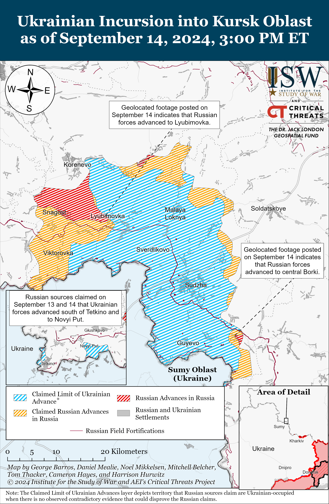
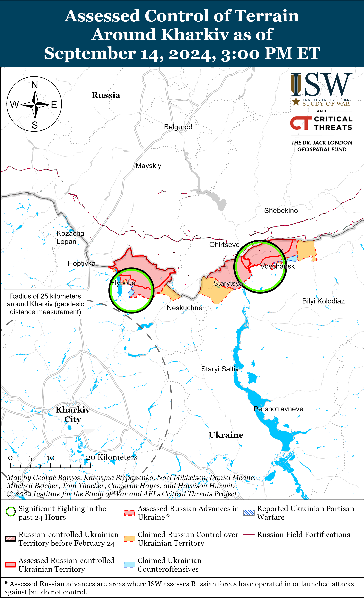
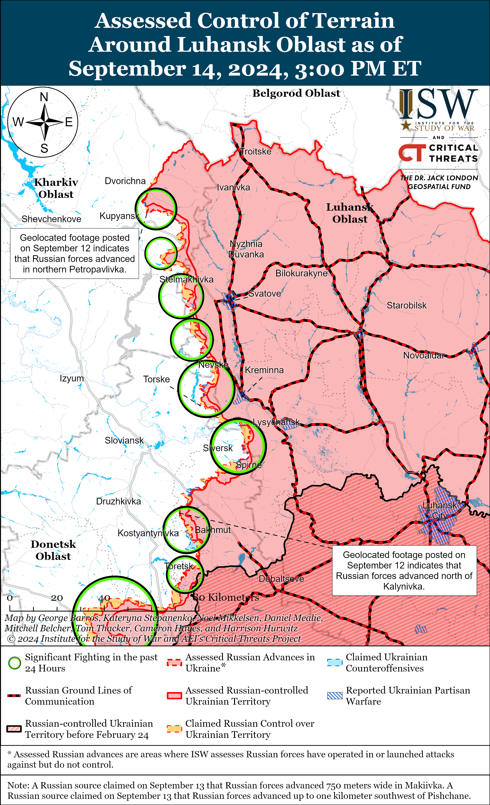
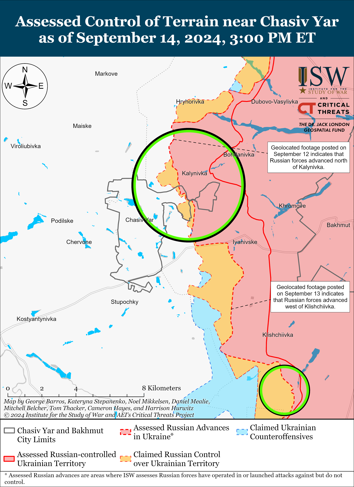
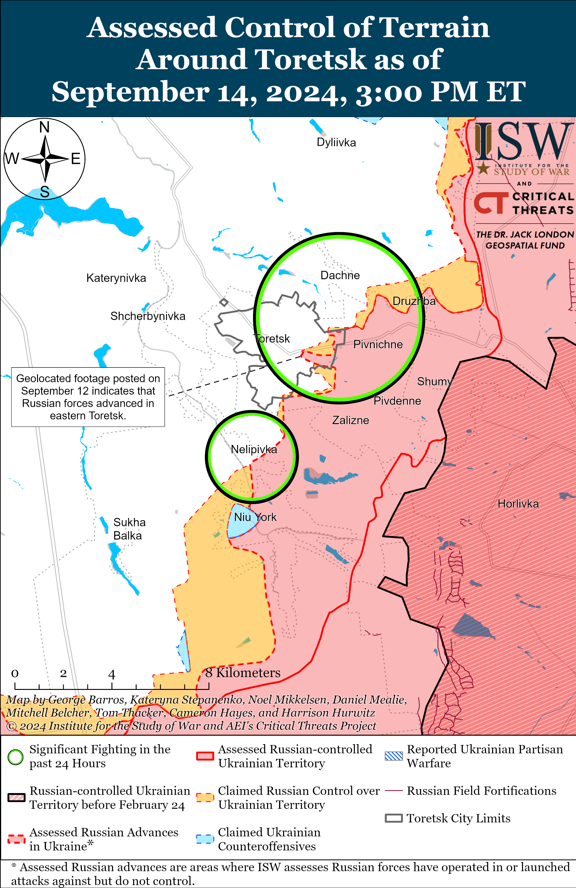
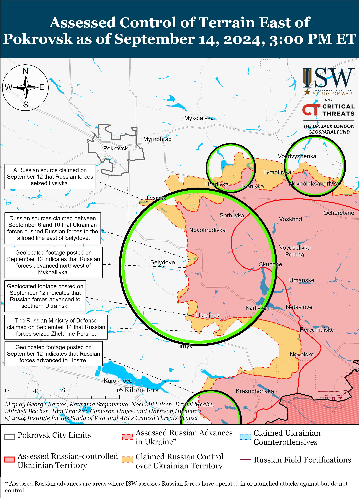
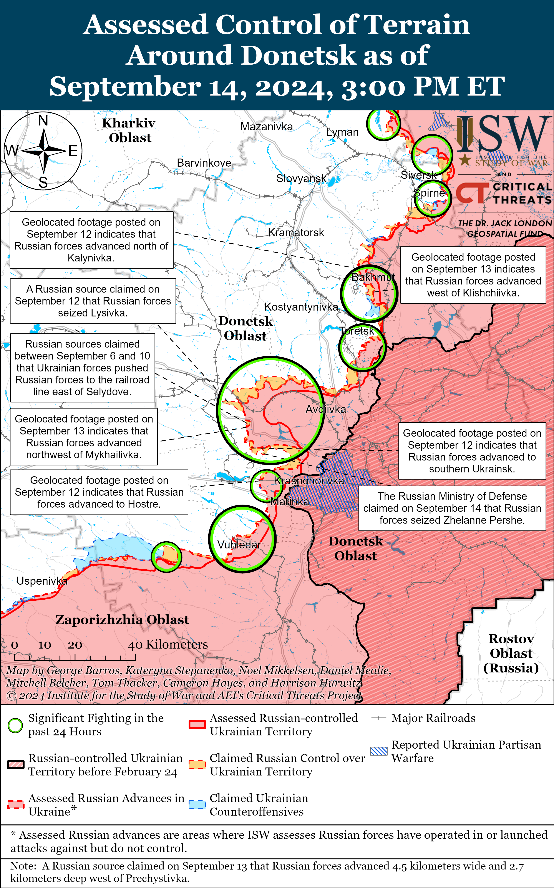
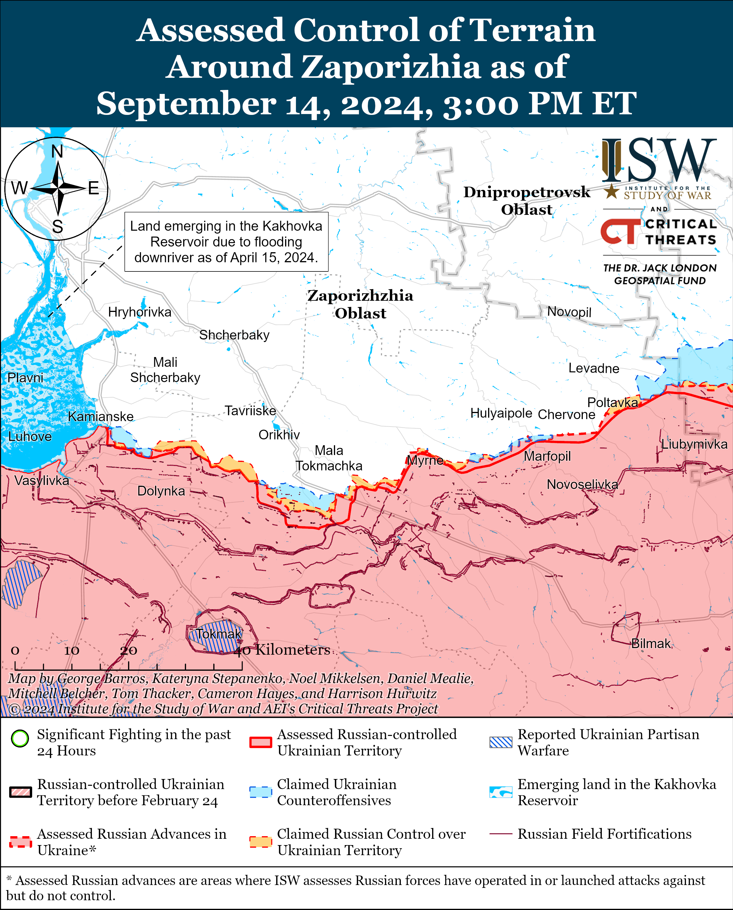
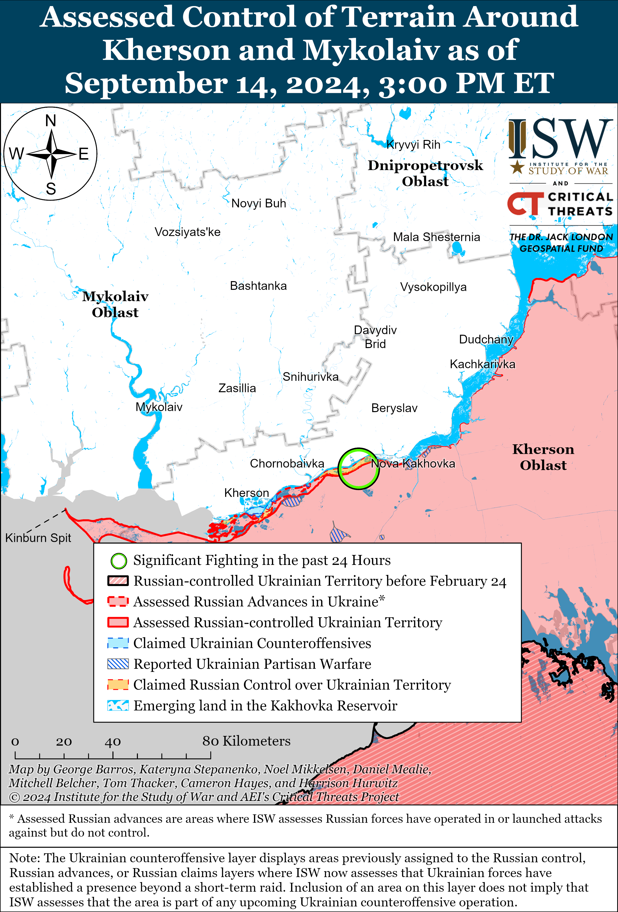

# Russian Offensive Campaign Assessment, September 14, 2024

**Russian Offensive Campaign Assessment, September 14, 2024**

**Davit Gasparyan, Riley Bailey, Christina Harward, Karolina Hird, and George Barros**

**September 14, 2024, 6:30pm ET**

**Click** [**here**](https://storymaps.arcgis.com/stories/36a7f6a6f5a9448496de641cf64bd375) **to see ISW’s interactive map of the Russian invasion of Ukraine. This map is updated daily alongside the static maps present in this report.**

**Click** [**here**](https://storymaps.arcgis.com/stories/83a2f24901c941d581c0c523ecd2619b) **to see ISW’s interactive map of Ukraine’s offensive in Kursk Oblast.**

**Click** [**here**](https://understandingwar.maps.arcgis.com/apps/instant/3dviewer/index.html?appid=1602762dbcde419bb957dea358449580) **to see ISW’s 3D control of terrain topographic map of Ukraine. Use of a computer (not a mobile device) is strongly recommended for using this data-heavy tool.**

**Click** [**here**](https://storymaps.arcgis.com/stories/733fe90805894bfc8562d90b106aa895) **to access ISW’s archive of interactive time-lapse maps of the Russian invasion of Ukraine. These maps complement the static control-of-terrain map that ISW produces daily by showing a dynamic frontline. ISW will update this time-lapse map archive monthly.**

**Note: The data cut-off for this product was 12:30pm ET on September 14. ISW will cover subsequent reports in the September 15 Russian Offensive Campaign Assessment.**

**Ukrainian officials and sources indicated that Ukraine’s incursion into Kursk Oblast has prompted the Russian authorities to increase the size of the Russian force grouping in Kursk Oblast by upwards of a factor of three.**Ukrainian Pivnich (Northern) Operational Command Spokesperson Vadym Mysnyk stated on September 14 that Russian forces had 11,000 personnel deployed in Kursk Oblast at the start of Ukraine’s incursion in early August 2024.[1] Mysnyk stated that there are various estimates that place the current size of the Russian grouping in Kursk Oblast between 30,000 and 45,000 personnel.[2] Ukrainian President Volodymyr Zelensky stated on September 13 that Russian forces have concentrated 40,000 personnel in Kursk Oblast and aim to concentrate a total of 60,000 to 70,000 personnel in the area.[3] The individual number breakdown for each of the Russian services (Rosgvardia, border guards, regular units, irregular units, and conscript forces) contributing to these figures remains unclear. Ukrainian military observer Kostyantyn Mashovets stated on September 14 that there are roughly 61 various Russian units of various sizes comprised of roughly 35,500 Russian personnel within the Russian Northern Grouping of Forces’ Kursk Group (which has responsibility for Glushkovsky, Korenevsky, Sudzhansky, Rylsky, Lgovsky, Kurchatovsky, and Kursky raions).[4] The reported growth in the size of the Russian grouping in Kursk Oblast is reflective of how operational pressures caused by the incursion have forced the Russian military command to redeploy elements from Ukraine to Kursk Oblast and commit newly generated forces from within Russia to the area instead of the frontline in Ukraine.[5] A Russian counteroffensive operation to retake territory seized by Ukrainian forces in Kursk Oblast will very likely require even more manpower and materiel than Russia has already concentrated in the area and therefore additional Russian redeployments from Ukraine.[6]

**Ukraine and Russia conducted a prisoner of war (POW) exchange on September 14 — the third POW exchange since the Ukrainian incursion into Kursk Oblast, which appears to have generated the short-term effect of increasing incentives for Russia to engage in POW exchanges.** Ukrainian officials reported that Russia returned 103 prisoners to Ukraine including Ukrainian servicemembers who defended the Azovstal Steel Plant in Mariupol in early 2022, servicemembers of the Ukrainian National Police and State Border Service, servicemembers of the Ukrainian State Transport Special Service, and other Ukrainian military personnel.[7] The Russian Ministry of Defense (MoD) claimed on September 14 that Ukraine returned 103 individuals to Russia whom Ukrainian forces captured in Kursk Oblast.[8] Russian sources suggested that the returned Russian prisoners were conscripts.[9] The POW swap directly follows a similar exchange that Russia and Ukraine conducted on September 13, during which they returned 49 prisoners each.[10] Ukrainian officials have repeatedly emphasized that the Kursk incursion has enhanced Ukraine’s negotiating power in POW exchanges with Russia, following the Kremlin’s consistent rejection of Ukraine’s attempt to negotiate exchanges.[11] The frequency of POW exchanges between Ukraine and Russia has significantly increased since the Ukrainian incursion into Kursk Oblast on August 6, with both sides exchanging a total of 267 POWs each in three separate exchanges.[12] Russia and Ukraine only conducted three other POW exchanges, encompassing roughly 405 Ukrainian POWs and 423 Russian POWs, between January 1 and August 6, 2024.[13]

**Some Russian field commanders continue to make decisions that degrade the overall quality of their subordinate forces—prioritizing infantry-led frontal assault tactics over cultivating technical specialists who would allow the Russian military to better field technologies and innovations in combat operations.**Various Russian milbloggers reported on September 13 that two drone operators from the 87th Separate Rifle Regiment *[not the 87th Motorized Rifle Regiment, as was incorrectly reported in a previous version of this assessment]* of the 1st “Slavic” Motorized Rifle Brigade (51st Combined Arms Army [CAA], formerly the 1st Donetsk People’s Republic Army Corps [DNR AC]) died in combat near Pokrovsk after their field commander forced them into an assault detachment as punishment for criticizing their command.[14] The two drone operators posted footage explaining the situation and their forced reassignment to assault tasks before their deaths, which milbloggers widely amplified.[15] Several milbloggers claimed to have heard numerous similar stories and claimed that the practice of sending specialists, such as electronic warfare (EW) specialists, snipers, machine gunners, and drone operators, to conduct frontal assaults as punishment for dissent is commonplace, particularly amongst units of the 51st CAA.[16] DNR First Deputy Information Minister Danil Bezsonov claimed that the commander of the “Komendant” naval Spetsnaz group, which was operating in Kherson Oblast, similarly divided his subordinates into assault groups based on personal vendettas and that a commander operating in Donetsk Oblast sent a talented cyber hacker to an assault unit for disagreeing with the command, after which the hacker died in combat.[17]

Milbloggers argued that this practice is indicative of poor command discipline and is degrading the quality of Russian forces.[18] ISW has previously noted that the Russian military command’s reliance on infantry-led frontal assault tactics has flattened the distinctions between formerly elite (such as Airborne and Naval Infantry forces) and ordinary Russian combat services and degraded Russian combat capability throughout the frontline.[19] Reports of Russian commanders forcing personnel with more technical specialties to conduct such frontal assaults are consistent with this wider observed pattern. Machine gunners and snipers are not necessarily specialists in a technical sense, but they possess unique skills that accomplish different effects than foot-mobile infantry conducting a frontal assault against a tactical objective. By using specialists of any variety as additional bodies for frontal assaults, the Russian command is forgoing the opportunity to properly leverage whatever specialties they could integrate into their respective units, further illustrating that most Russian frontline troops have been reduced to understrength and low-quality motorized rifle units.[20] The use of specialists who are familiar with more advanced battlefield technologies, such as drones and EW systems, is likely compounding these effects. While Ukrainian forces have consistently displayed high degrees of tactical and technical innovation, the Russian military appears to be willfully undermining its own ability to integrate innovations into combat operations.[21]

**The Kremlin continues efforts to leverage global informational instruments of influence to develop new capabilities to conduct election interference, destabilization measures, and sanctions evasion schemes.**The US State Department announced new sanctions on September 13 against entities and individuals connected to Russian state media outlet *Russia Today* (RT), which the State Department noted is engaging in information operations, covert influence, and military procurement efforts for the Kremlin by targeting states in Europe, Africa, and North and South America.[22] The State Department reported that the Kremlin created a cyber operations entity within *RT* in Spring 2023 that provided information to Russian intelligence, media, and mercenary groups. *RT* is reportedly also crowdfunding money to purchase equipment for the Russian military in small orders, including from the People’s Republic of China (PRC), “to avoid unwanted scrutiny.” The State Department noted that *RT* is coordinating with the Kremlin to influence the October 2024 Moldovan presidential election and to foment violent protests in Moldova. The State Department stated that the Kremlin is using Russian state-owned bank Promsvyazbank’s (PSB) recent pension funding agreement with Moldovan autonomous region Gagauzia to buy votes in support of pro-Kremlin presidential candidates, as ISW similarly assessed in April 2024.[23] US Secretary of State Antony Blinken stated on September 14 that *RT* is “functioning like a de facto arm of Russia’s intelligence apparatus.”[24] The US Department of Justice (DOJ) reported on September 4 that the Kremlin is conducting complex malign influence operations called “Doppelganger” to reduce Western support for Ukraine and influence US and foreign elections.[25] ISW assessed at that time that Russia was continuing its efforts to develop a capability to use information operations on social media platforms to trigger kinetic activity.[26]

**Officials of Georgia’s ruling Georgia Dream party continue to elevate narratives echoing Kremlin information operations justifying Russia’s occupation of internationally recognized Georgian territories.**Georgian Dream party’s founder and former Georgian Prime Minister Bidzina Ivanishvili attributed the 2008 Russo-Georgian war and subsequent Russian occupation of Georgian territories to unspecified “external actors” and the former pro-Western Georgian United National Movement (UNM) ruling party during an election rally in Gori, a city bordering Russian-occupied South Ossetia.[27] Ivanishvili notably omitted any mention of Russia and Russian aggression against Georgia. Ivanishvili claimed that Georgian Dream would hold UNM, particularly former pro-Western Georgian President Mikhail Saakashvili, accountable should Georgia Dream obtain a constitutional majority in the upcoming October 2024Georgian parliamentary elections. Ivanishvili also stated that the Georgian government, under the Georgian Deam party, would seek reconciliation with South Ossetia and work towards forgiveness for the alleged violence that UNM caused. Ivanishvili’s rhetoric closely echoes the larger Georgian Dream election campaign that seeks to present itself as the party of peace while framing opposition parties, such as UNM, as parties supporting instability and war.[28] ISW previously assessed that Georgian Dream has used narratives that closely mirror Kremlin information operations aimed at justifying Russian aggression against the territorial integrity and sovereignty of states that the Russian Empire and Soviet Union formerly colonized by blaming domestic, pro-Western parties who allegedly cooperate with unspecified “external actors” to instigate violence.[29]

**Key Takeaways:**

- **Ukrainian officials and sources indicated that Ukraine’s incursion into Kursk Oblast has prompted the Russian authorities to increase the size of the Russian force grouping in Kursk Oblast by upwards of a factor of three.**
- **Ukraine and Russia conducted a prisoner of war (POW) exchange on September 14 — the third POW exchange since the Ukrainian incursion into Kursk Oblast, which appears to have generated the short-term effect of increasing incentives for Russia to engage in POW exchanges.**
- **Some Russian field commanders continue to make decisions that degrade the overall quality of their subordinate forces—prioritizing infantry-led frontal assault tactics over cultivating technical specialists who would allow the Russian military to better field technologies and innovations in combat operations.**
- **The Kremlin continues efforts to leverage global informational instruments of influence to develop new capabilities to conduct election interference, destabilization measures, and sanctions evasion schemes.**
- **Officials of Georgia’s ruling Georgia Dream party continue to elevate narratives echoing Kremlin information operations justifying Russia’s occupation of internationally recognized Georgian territories.**
- **Ukrainian forces continued to advance in Glushkovsky Raion and Russian forces recently regained territory near Korenevo and Sudzha.**
- **Russian forces recently advanced near Chasiv Yar, Pokrovsk, and Vuhledar.**
- **Russian forces are reportedly repairing captured Soviet-era Ukrainian equipment to replenish Russian vehicle stocks.**

***We do not report in detail on Russian war crimes because these activities are well-covered in Western media and do not directly affect the military operations we are assessing and forecasting. We will continue to evaluate and report on the effects of these criminal activities on the Ukrainian military and the Ukrainian population and specifically on combat in Ukrainian urban areas. We utterly condemn Russian violations of the laws of armed conflict and the Geneva Conventions and crimes against humanity even though we do not describe them in these reports.***

- Ukrainian Operations in the Russian Federation
- Russian Main Effort – Eastern Ukraine (comprised of three subordinate main efforts)
- Russian Subordinate Main Effort #1 – Push Ukrainian forces back from the international border with Belgorod Oblast and approach to within tube artillery range of Kharkiv City
- Russian Subordinate Main Effort #2 – Capture the remainder of Luhansk Oblast and push westward into eastern Kharkiv Oblast and encircle northern Donetsk Oblast
- Russian Subordinate Main Effort #3 – Capture the entirety of Donetsk Oblast
- Russian Supporting Effort – Southern Axis
- Russian Air, Missile, and Drone Campaign
- Russian Mobilization and Force Generation Efforts
- Russian Technological Adaptations
- Activities in Russian-occupied areas
- Ukrainian Defense Industrial Base Efforts
- Russian Information Operations and Narratives
- Significant Activity in Belarus

**Ukrainian Operations in the Russian Federation**

Ukrainian forces continued to advance in Glushkovsky Raion, Kursk Oblast and continued offensive operations in the area on September 14. Geolocated footage published on September 13 shows Ukrainian forces operating in southern Veseloye (southwest of Glushkovo), and a Russian milblogger claimed that Ukrainian forces seized the settlement.[30] Russian milbloggers also claimed that Ukrainian forces advanced west of Medvezhye (southwest of Glushkovo) and in fields south of Tetkino (roughly 25km southwest of Glushkovo) along the border with Sumy Oblast.[31] Russian sources claimed that Ukrainian forces continued assaults near Medvezhye, Veseloye, Obukhovka (immediately south of Veseloye), and Novy Put (south of Veseloye) on September 13 and 14.[32] Russian milbloggers claimed that elements of the Russian 56th Airborne (VDV) Regiment (7th VDV Division) and 106th VDV Division are repelling Ukrainian assaults in Glushkovsky Raion.[33]

Ukrainian forces reportedly continued to advance north of Sudzha amid continued Ukrainian offensive operations throughout their salient in Kursk Oblast on September 14. A Russian milblogger claimed that Ukrainian forces seized Cherkasskoye Porechnoye (north of Sudzha).[34] Russian sources claimed that Ukrainian forces continued attacks southwest of Korenevo near Apanasovka; southeast of Korenevo near Lyubimovka and Obukhovka; east of Korenevo near Maryevka; and southeast of Sudzha near Russkaya Konopelka on September 13 and 14.[35]

Russian forces recently regained territory in the Ukrainian salient in Kursk Oblast and continued counterattacking on September 14. Geolocated footage published on September 13 indicates that Russian forces entered western Lyubimovka during a company-sized mechanized assault, and a Russian milblogger claimed that Russian forces advanced to the southwestern outskirts of Lyubimovka as well as in fields northwest of Darino (south of Lyubimovka).[36] Geolocated footage published on September 14 shows infantry of the Russian 810th Naval Infantry Brigade (Black Sea Fleet, Southern Military District [SMD]) operating in central Borki (southeast of Sudzha), indicating that Russian forces recently advanced further within the settlement.[37] A Russian milblogger claimed that Russian forces seized Borki, although another milblogger claimed that Ukrainian forces remain in the western part of the settlement.[38] Ukrainian military observer Kostyantyn Mashovets stated that elements of the Russian 155th Naval Infantry Brigade and 11th and 83rd VDV brigades are also operating in Kursk Oblast.[39]

[](https://understandingwar.org/map/ukrainian-incursion-into-kursk-oblast-as-of-september-14-2024-300-pm-et/)

**Russian Main Effort – Eastern Ukraine**

**Russian Subordinate Main Effort #1 – Kharkiv Oblast (Russian objective: Push Ukrainian forces back from the international border with Belgorod Oblast and approach to within tube artillery range of Kharkiv City)**

Russian forces continued offensive operations north and northeast of Kharkiv City on September 14, but there were no confirmed changes to the frontline. Russian forces conducted offensive operations north of Kharkiv City near Lyptsi and Hlyboke and northeast of Kharkiv City near Vovchansk and Hatyshche on September 13 and 14.[40] Ukraine’s Kharkiv Group of Forces reported on September 14 that elements of the Russian 79th Motorized Rifle Regiment (18th Motorized Rifle Division, 11th Army Corps [AC], Leningrad Military District [LMD]) operating near Hlyboke are facing cases of desertion due to poor provision sustainment and causality levels.[41]

[](https://understandingwar.org/map/assessed-control-of-terrain-around-kharkiv-as-of-september-14-2024-300-pm-et/)

**Russian Subordinate Main Effort #2 – Luhansk Oblast (Russian objective: Capture the remainder of Luhansk Oblast and push westward into eastern Kharkiv Oblast and northern Donetsk Oblast)**

Fighting continued along the Kupyansk-Svatove-Kreminna line on September 14, but there were no confirmed changes to the frontline. Russian milbloggers claimed on September 13 and 14 that Russian forces advanced south of Pishchane (southeast of Kupyansk) and in the Serebryanske forest area (south of Kreminna).[42] ISW has not observed visual confirmation of these claims. Russian forces continued offensive operations northeast of Kupyansk near Synkivka; east of Kupyansk near Petropavlivka; northwest of Svatove near Novoosynove, Hlushkivka, and Stelmakhivka and in the direction of Lozova; west of Svatove near Kopanky; southwest of Svatove near Druzhelyubivka; northwest of Kreminna near Hrekivka, Makiivka, Novosadove, and Nevske; west of Kreminna near Terny, Zarichne, Yampolivka, and Torske; and south of Kreminna near Serebryanka on September 13 and 14.[43] Elements of the Russian 144th Motorized Rifle Division (20th Combined Arms Army [CAA], Moscow Military District [MMD]) reportedly continue to operate along the Svatove-Kreminna line.[44] Elements of the Russian 245th Motorized Rifle Regiment (47th Tank Division, 1st Guard Tank Army, Moscow Military District [MMD]) are reportedly operating near Makiivka.[45]

[](https://understandingwar.org/map/assessed-control-of-terrain-around-luhansk-oblast-as-of-september-14-2024-300-pm-et/)

**Russian Subordinate Main Effort #3 – Donetsk Oblast (Russian objective: Capture the entirety of Donetsk Oblast, the claimed territory of Russia’s proxies in Donbas)**

Russian forces continued limited offensive operations in the Siversk direction on September 14 but did not make any confirmed advances. Some Russian milbloggers claimed that Russian forces have advanced in a forest area northwest of Bilohorivka (northeast of Siversk), pushing Ukrainian forces across the Siverskyi-Donets River where it runs north of Bilohorivka.[46] ISW has not yet observed visual confirmation of this claim, but assesses that Russian forces hold positions on both sides of the Siverskyi-Donets River in some forested areas north and northwest of Bilohorivka. The Ukrainian General Staff reported that Russian forces continued ground attacks east of Siversk near Verkhnokamyanske and southeast of Siversk near Vyimka and Spirne on September 13 and 14.[47]

Russian forces recently advanced north of Chasiv Yar. Geolocated footage published on September 14 indicates that Russian forces made marginal gains towards the Siverskyi-Donets Donbas Canal south of Hryhorivka (north of Chasiv Yar).[48] Russian milbloggers also claimed that Russian forces advanced near the canal south of Hryhorivka.[49] Some Russian milbloggers claimed that Russian forces also crossed the canal south of Chasiv Yar in the area where the canal runs west of Klishchiivka (southeast of Chasiv Yar), which is consistent with ISW’s current assessment of the frontline west of Klishchiivka.[50] The Ukrainian General Staff reported that Ukrainian forces repelled Russian attacks in Chasiv Yar itself and southeast of Chasiv Yar near Andriivka.[51] Elements of the Russian 98th Airborne (VDV) Division reportedly continue to operate near Chasiv Yar.[52]

[](https://understandingwar.org/map/assessed-control-of-terrain-near-chasiv-yar-as-of-september-14-2024-300-pm-et/)

Russian forces continued offensive operations near Toretsk, Druzhba (northeast of Toretsk), and Nelipivka (south of Toretsk) on September 13 and 14 but did not advance.[53]

[](https://understandingwar.org/map/assessed-control-of-terrain-around-toretsk-as-of-september-14-2024-300-pm-et/)

Russian forces recently advanced southeast of Pokrovsk amid continued intensive offensive operations in this direction on September 14. Geolocated footage published on September 13 shows Russian forces assaulting and seizing a Ukrainian trench northwest of Ukrainsk (southeast of Pokrovsk), indicating that Russian forces have advanced west of Ukrainsk via the northern flank, at minimum.[54] Russian forces are likely trying to pressure Ukrainian forces out of Ukrainsk by prioritizing advances on its northern and southern flanks and are likely waiting until Ukrainian troops withdraw from the settlement under the threat of encirclement before directly assaulting the settlement. Russian forces may have seized all of Ukrainsk, although ISW has not observed no visual confirmation of the Russian seizure of Ukrainsk. The Russian Ministry of Defense (MoD) claimed that Russian forces seized Zhelanne Pershe (southeast of Pokrovsk and just southeast of Ukrainsk), but ISW has not observed visual evidence to confirm this claim.[55] Russian sources continued to report that Russian forces are striking bridges within and near Pokrovsk in order to complicate Ukrainian logistics in the Pokrovsk direction.[56] The Ukrainian General Staff reported Russian ground attacks east of Pokrovsk near Sukha Balka, Vozdvyzhenka, Zelene Pole, Novooleksandrivka, Hrodivka, and Myrolyubivka and southeast of Pokrovsk near Selydove, Novohrodivka, Krasnyi Yar, Marynivka, Mykhailivka, Dolynivka, Zhelanne Pershe, Zhelanne Druhe, Ukrainsk, and in the direction of Novotroitske.[57] Elements of the Russian 90th Tank Division (41st Combined Arms Army [CAA], Central Military District [CMD]) are reportedly operating near Ukrainsk, and reconnaissance elements of the “Black Knives Division” are reportedly operating in the Pokrovsk direction.[58]

[](https://understandingwar.org/map/assessed-control-of-terrain-east-of-pokrovsk-as-of-september-14-2024-300-pm-et/)

Russian forces are reportedly preparing to resume assault operations west of Donetsk City, but did not make any confirmed advances on September 14. Russian milbloggers claimed on September 14 that Russian forces are conducting artillery preparation of the battlefield, including with TOS-1A thermobaric artillery systems, on areas west of Krasnohorivka (west of Donetsk City) in order to prepare for renewed assaults towards Heorhiivka, Oleksandropil, and Maksymilyanivka.[59] One milblogger claimed that Russian sabotage and reconnaissance groups are operating west of Krasnohorivka to prepare for new attacks.[60] The Ukrainian General Staff reported Russian ground attacks near Krasnohorivka and Heorhiivka on September 13 and 14.[61]

Russian forces recently advanced in the Vuhledar direction southwest of Donetsk City and continued offensive operations in the area on September 14. Geolocated footage published on September 13 shows Russian forces advancing during a reinforced platoon-sized mechanized assault on the Pivdennodonbaska No. 3 (Surhai) coal mine west of Vodyane (just northeast of Vuhledar).[62] A Russian milblogger claimed that Russian forces attacked the mine in two platoon-sized waves and achieved tactical success but noted that Ukrainian forces are still present in the area and that Russian forces have not yet seized the entire mine complex.[63] Russian milbloggers claimed that fighting is also ongoing near the Pivdennodonbaska No. 1 coal mine (northeast of Vuhledar and south of the No. 3 mine).[64] One milblogger claimed that Russian forces advanced over four kilometers wide and two kilometers deep west of Prechystivka (west of Vuhledar).[65] Ukrainian Mariupol Mayoral Advisor Petro Andryushchenko reported that Russian forces are increasingly moving military equipment and personnel towards the Donetsk City-Vuhledar area through the rear of occupied Zaporizhia and Donetsk oblasts.[66] The Ukrainian General Staff reported that Russian forces conducted ground attacks northeast of Vuhledar near Kostyantynivka, Katerynivka, and Vodyane; near Vuhledar itself; and west of Vuhledar near Zolota Nyva.[67] Elements of the Russian 29th CAA (Eastern Military District [EMD]) reportedly continue to operate near Vuhledar.[68]

[](https://understandingwar.org/map/assessed-control-of-terrain-around-donetsk-as-of-september-14-2024-300-pm-et/)

**Russian Supporting Effort – Southern Axis (Russian objective: Maintain frontline positions and secure rear areas against Ukrainian strikes)**

Neither Russian nor Ukrainian sources reported fighting in western Zaporizhia Oblast on September 14. Elements of the Russian 247th Airborne (VDV) Regiment (7th VDV Division) are reportedly operating near Verbove (east of Robotyne).[69]

[](https://understandingwar.org/map/assessed-control-of-terrain-around-zaporizhia-as-of-september-14-2024-300-pm-et/)

Positional engagements continued in east (left) bank Kherson Oblast on September 13 and 14.[70] Ukrainian military observer Kostyanyn Mashovets stated that fighting continues on the islands in the Dnipro River Delta, particularly on Bilohrudyi Island (southwest of Kherson City), Kazatsky Island (northeast of Kherson City), and Melkyi Island (northeast of Kherson City).[71] Mashovets stated that elements of the Russian 144th Motorized Rifle Brigade (40th Army Corps [AC], 18th Combined Arms Army [CAA], Southern Military District [SMD]), 205th Motorized Rifle Brigade (49th CAA, SMD), 337th Airborne (VDV) Regiment (104th VDV Division), 28th Motorized Rifle Regiment (70th Motorized Rifle Division, 18th CAA), 126th Coastal Defense Brigade (22nd AC, Black Sea Fleet [BSF]), and 61st Naval Infantry Brigade (Leningrad Military District [LMD], formerly Northern Fleet) are reportedly operating on the islands of the Dnipro River Delta.

[](https://understandingwar.org/map/assessed-control-of-terrain-around-kherson-and-mykolaiv-as-of-september-14-2024-300-pm-et/)

Ukrainian strikes reportedly continue to affect Russian naval operations. Mashovets stated that the Russian BSF command decided to only launch Kalibr cruise missiles from submarines and have equipped areas in Myskhako (just southwest of Novorossiysk, Krasnodar Krai) for such launches.[72] Mashovets noted that the probability of preemptive Ukrainian naval drone strikes against Kalibr-carrying submarines is lower. Open-source X (formerly Twitter) users posted satellite imagery on September 14 showing that the Russian Navy has evacuated vessels from the Novorossiysk port, possibly to Gelendzhik (roughly 30 kilometers southeast of Novorossiysk).[73]

**Russian Air, Missile, and Drone Campaign (Russian Objective: Target Ukrainian military and civilian infrastructure in the rear and on the frontline)**

Russian forces conducted a large-scale Shahed-136/131 drone strike against Ukraine on the night of September 13 to 14. The Ukrainian Air Forces reported that Russia launched a total of 76 Shaheds at Ukraine from Kursk Oblast; Yeysk, Krasnodar Krai; and occupied Cape Chauda, Crimea—72 of which Ukrainian forces shot down, two of which got “lost” and did not reach their intended targets in Ukraine, and two of which flew back into Russian airspace.[74] Independent Belarusian monitoring group Hajun Project reported on September 14 that a Shahed drone flew into Belarusian airspace from Lviv Oblast for 30 minutes overnight before returning to Ukraine.[75] Ukrainian forces shot down nine Shaheds over Odesa Oblast and the rest over Mykolaiv, Kherson, Poltava, Kharkiv, Kyiv, Donetsk, Zhytomyr, Dnipropetrovsk, Cherkasy, Vinnytsia and Sumy oblasts.[76]

**Russian Mobilization and Force Generation Efforts (Russian objective: Expand combat power without conducting general mobilization)**

Russian forces are reportedly repairing captured Soviet-era Ukrainian equipment to replenish Russian vehicle stocks. Russian Southern Military Commander (SMD) Deputy Commander Lieutenant General Yevgeny Razumikhin claimed on September 14 that Russian forces have repaired and put into service roughly 30 percent of the Ukrainian infantry fighting vehicles, armored personnel carriers, and tanks the Southern Grouping of Forces has captured.[77] Razumikhin claimed that Russian forces are mostly repairing equipment that former Warsaw Pact states supplied to Ukraine.

The Kremlin continues efforts to militarize youth in occupied Ukraine to support Russia’s long-term force generation efforts. The Russian MoD posted footage purportedly of Russian servicemembers teaching classes about the safe handling of explosives to Ukrainian high schoolers in occupied Mariupol.[78]

**Russian Technological Adaptations (Russian objective: Introduce technological innovations to optimize systems for use in Ukraine)**

Nothing significant to report.

**Ukrainian Defense Industrial Efforts (Ukrainian objective: Develop its defense industrial base to become more self-sufficient in cooperation with US, European, and international partners)**

*ISW is suspending publishing coverage of Ukrainian defense industrial efforts until further notice.*

**Activities in Russian-occupied areas (Russian objective: Consolidate administrative control of annexed areas; forcibly integrate Ukrainian citizens into Russian sociocultural, economic, military, and governance systems)**

*ISW is not publishing coverage of Russian-occupied areas today.*

**Russian Information Operations and Narratives**

The Kremlin is continuing a coordinated reflexive control effort targeting Western decision-making regarding the lifting of restrictions on Ukraine’s ability to use Western-provided weapons to strike military targets within Russia. Kremlin officials are particularly promoting and building upon Vladimir Putin’s September 11 rhetoric directly framing the lifting of Western restrictions as a serious escalation.[79] Russian Deputy Foreign Minister Sergei Ryabkov claimed on September 14 that Russia knows that the West has made decisions to allow Ukrainian forces to strike deeper within Russian territory and that Russia will have to start new signaling efforts beyond “verbal signals” to prevent the West from escalating with Russia.[80] Russian Ambassador to the US Anatoly Antonov claimed on September 13 that he believes that the United Kingdom (UK) will allow Ukraine to use UK-provided weapons to strike within Russia and that the United States may lift restrictions following a meeting between US President Joe Biden and UK Prime Minister Keir Starmer on September 13.[81] Antonov followed his assessment with the claim that the United States will not be able to “sit out” of a nuclear conflict in Europe.[82] Russian Security Council Deputy Chairperson Dmitry Medvedev claimed on September 14 that Russia is displaying “patience” with the West because it understands the danger of nuclear war but that this “patience” is coming to an end.[83] Kremlin officials routinely accuse the West of escalating and being directly involved in the war on Ukraine as part of the Kremlin’s ongoing reflexive control campaign aimed at coercing the West into making policy decisions that benefit the Kremlin, and Russian comments threatening nuclear confrontation are part of rote nuclear saber rattling, as ISW has consistently assessed.[84]

**Significant activity in Belarus (Russian efforts to increase its military presence in Belarus and further integrate Belarus into Russian-favorable frameworks and Wagner Group activity in Belarus)**

Independent Belarusian monitoring group the Hajun Project stated on September 4 that the Belarusian military formed a new rocket artillery battery: the 79th Rocket Artillery Battalion(336th Rocket Artillery Brigade) in Osipovichi.[85] Ukrainian military observer Kostyantyn Mashovets stated on September 14 that the 79th Rocket Artillery Battalion will consist of four-to-six V-300BM “Polonez-M” multiple launch rocket systems (MLRS).[86]

**Note: ISW does not receive any classified material from any source, uses only publicly available information, and draws extensively on Russian, Ukrainian, and Western reporting and social media as well as commercially available satellite imagery and other geospatial data as the basis for these reports. References to all sources used are provided in the endnotes of each update.**

[1] https://armyinform.com dot ua/2024/09/14/vijska-rf-perekydayut-rezervy-na-kurshhynu-u-sylah-oborony-oczinyly-yih-kilkist/

[2] https://armyinform.com dot ua/2024/09/14/vijska-rf-perekydayut-rezervy-na-kurshhynu-u-sylah-oborony-oczinyly-yih-kilkist/

[3] https://t.me/V\_Zelenskiy\_official/11640 ; https://armyinform.com dot ua/2024/09/13/prezydent-ukrayiny-vidpoviv-chy-bula-operacziya-na-kurshhyni-pomylkoyu/ ; https://suspilne dot media/835137-piloti-zsu-rozpocali-trenuvanna-na-f-16-v-rumunii-rosia-atakuvala-harkiv-fugasnimi-aviabombami-933-den-vijni-onlajn/?anchor=live\_1726238922&utm\_source=copylink&utm\_medium=ps

[4] https://t.me/zvizdecmanhustu/2182

[5] https://understandingwar.org/backgrounder/assessing-significance-current-russian-and-ukrainian-operations-course-war

[6] https://understandingwar.org/backgrounder/russian-offensive-campaign-assessment-september-13-2024 ; https://understandingwar.org/backgrounder/assessing-significance-current-russian-and-ukrainian-operations-course-war

[7] https://suspilne dot media/836241-ukraina-povernula-103-polonenih/; https://t.me/V\_Zelenskiy\_official/11674; https://t.me/DIUkraine/4447; https://t.me/Koord\_shtab/8009

[8] https://t.me/mod\_russia/43377; https://t.me/mod\_russia/43380

[9] https://t.me/dvizhenie\_nashvyhod/529; https://t.me/istories\_media/7561; https://t.me/astrapress/64320

[10] https://understandingwar.org/backgrounder/russian-offensive-campaign-assessment-september-13-2024

[11] https://understandingwar.org/backgrounder/russian-offensive-campaign-assessment-september-13-2024; https://www.thetimes.co.uk/article/inside-the-pow-camp-where-ukraine-re-educates-russians-gn7hh895c; https://www.radiosvoboda dot org/a/news-tabir-dlia-viyskovopolonenykh/32971023.html; https://t.me/currenttime/35393

[12] https://understandingwar.org/backgrounder/russian-offensive-campaign-assessment-august-24-2024; https://understandingwar.org/backgrounder/russian-offensive-campaign-assessment-september-13-2024

[13] https://understandingwar.org/backgrounder/russian-offensive-campaign-assessment-february-8-2024 ; https://isw.pub/UkrWar053124 ; https://understandingwar.org/backgrounder/russian-offensive-campaign-assessment-january-3-2024

[14] https://t.me/philologist\_zov/1381; https://t.me/arbat/1885; https://t.me/dva\_majors/52536; https://t.me/belarusian\_silovik/41121; https://t.me/dva\_majors/52535; https://t.me/motopatriot/27509; https://t.me/NeoficialniyBeZsonoV/39685; https://t.me/dva\_majors/52529; https://t.me/rybar/63509; https://t.me/belarusian\_silovik/41121; https://t.me/rybar/63512; https://t.me/sashakots/48967; https://t.me/yurasumy/17949; https://t.me/dva\_majors/52553

[15] https://t.me/belarusian\_silovik/41079; https://t.me/belarusian\_silovik/41093

[16] https://t.me/arbat/1885; https://t.me/dva\_majors/52536; https://t.me/belarusian\_silovik/41121; https://t.me/dva\_majors/52535; https://t.me/motopatriot/27509; https://t.me/Z13\_Separ/32044; https://x.com/GirkinGirkin/status/1834916283306885276

[17] https://t.me/NeoficialniyBeZsonoV/39685

[18] https://t.me/arbat/1885; https://t.me/dva\_majors/52536; https://t.me/belarusian\_silovik/41121; https://t.me/dva\_majors/52535; https://t.me/NeoficialniyBeZsonoV/39685; https://t.me/dva\_majors/52529; https://t.me/vysokygovorit/17330; https://t.me/Mestb\_Dobroj\_Voli/12570; https://t.me/rybar/63513; https://t.me/yurasumy/17949; https://t.me/dva\_majors/52553

[19] https://isw.pub/UkrWar062024

[20] https://understandingwar.org/backgrounder/russia%E2%80%99s-military-restructuring-and-expansion-hindered-ukraine-war

[21] https://understandingwar.org/backgrounder/ukraine-and-problem-restoring-maneuver-contemporary-war; https://kyivindependent.com/we-set-a-precedent-ukraine-officially-presents-unmanned-systems-forces/

[22] https://www.state.gov/alerting-the-world-to-rts-global-covert-activities/

[23] https://isw.pub/UkrWar040924 ; https://www.state.gov/alerting-the-world-to-rts-global-covert-activities/

[24] https://www.washingtonpost.com/world/2024/09/13/rt-propaganda-intelligence-weapons-ukraine/

[25] https://understandingwar.org/backgrounder/russian-offensive-campaign-assessment-september-6-2024

[26] https://understandingwar.org/backgrounder/russian-offensive-campaign-assessment-september-6-2024

[27] https://t.me/tass\_agency/272693; https://civil dot ge/archives/624195; https://newsukraine.rbc dot ua/news/georgia-s-ruling-party-founder-surprises-1726335264.html

[28] https://www.rferl.org/a/global-war–party-georgian-dream-bidzina-ivanishvili/32951749.html

[29] https://understandingwar.org/backgrounder/russian-offensive-campaign-assessment-august-14-2024; https://apnews.com/article/moldova-russia-war-ukraine-transnistria-eu-6c14d96e8cdc0bc699f0315eecaab4f6 ; https://isw.pub/UkrWar021524 ; https://isw.pub/UkrWar012224

[30] https://t.me/yurasumy/17955 ; https://t.me/khornegroup/2683; https://t.me/WarArchive\_ua/20012

[31] https://t.me/yurasumy/17955 ; https://t.me/Operativ\_luga\_channel/92870

[32] https://t.me/mod\_russia/43379 ; https://t.me/rybar/63499 ; https://t.me/dva\_majors/52526 ; https://t.me/rusich\_army/17117 ; https://t.me/vysokygovorit/17326 ; https://t.me/RVvoenkor/76926; https://vk dot com/wall-211411957\_1999812

[33] https://t.me/RVvoenkor/76926; https://vk dot com/wall-211411957\_1999812

[34] https://t.me/rybar/63499

[35] https://t.me/mod\_russia/43379 ; https://t.me/rybar/63499 ;

[36] https://t.me/WarArchive\_ua/20031; https://x.com/StaVlb/status/1834694587639906794; https://x.com/blinzka/status/1834880269494444092; https://t.me/Zigun\_Mangusta/15054; https://x.com/Tendar/status/1834946249436356833; https://t.me/creamy\_caprice/6801; https://t.me/motopatriot/27506

[37] https://x.com/MilitarySummary/status/1834951727390351848; https://t.me/lost\_armour/3436; https://t.me/creamy\_caprice/6802

[38] https://t.me/RVvoenkor/76957; https://t.me/motopatriot/27507; https://t.me/motopatriot/27519

[39] https://t.me/zvizdecmanhustu/2182 ;

[40]https://www.facebook.com/GeneralStaff.ua/posts/pfbid02xgDp53XzdwpxTHHpDxKSeZ1y2Ffp42NaV31bhK68x4mf3pU5Pm4Rxdvn3R8cWZT9l; https://www.facebook.com/GeneralStaff.ua/posts/pfbid0oEXvmtSQJ55n5pi7WBEXUuurEjDHRcmFeRnVCjsXKmJYgm5bzj6ktZisvyzGhYsSl ; https://www.facebook.com/GeneralStaff.ua/posts/pfbid029uSdCmvFwL8ATBVcX6oL9CJxV5STT7WhogrjSj6DwkELESKHiZ5EvoRm8cKR3Kkxl

[41] https://t.me/otukharkiv/1330; https://armyinform dot com.ua/2024/09/14/okupanty-tikayut-u-szch-na-harkivskomu-napryamku-dezertyrstvo-stalo-yedynym-poryatunkom/

[42] https://t.me/z\_arhiv/28100; https://t.me/motopatriot/27487

[43]https://www.facebook.com/GeneralStaff.ua/posts/pfbid02xgDp53XzdwpxTHHpDxKSeZ1y2Ffp42NaV31bhK68x4mf3pU5Pm4Rxdvn3R8cWZT9l; https://www.facebook.com/GeneralStaff.ua/posts/pfbid0oEXvmtSQJ55n5pi7WBEXUuurEjDHRcmFeRnVCjsXKmJYgm5bzj6ktZisvyzGhYsSl ; https://www.facebook.com/GeneralStaff.ua/posts/pfbid029uSdCmvFwL8ATBVcX6oL9CJxV5STT7WhogrjSj6DwkELESKHiZ5EvoRm8cKR3Kkxl

[44] https://t.me/vysokygovorit/17321; https://t.me/epoddubny/21064

[45] https://t.me/Tsaplienko/60369; https://x.com/666\_mancer/status/1834670508887187506

[46] https://t.me/motopatriot/27487; https://t.me/DnevnikDesantnika/15452

[47] https://www.facebook.com/GeneralStaff.ua/posts/pfbid02xgDp53XzdwpxTHHpDxKSeZ1y2Ffp42NaV31bhK68x4mf3pU5Pm4Rxdvn3R8cWZT9l; https://www.facebook.com/GeneralStaff.ua/posts/pfbid029uSdCmvFwL8ATBVcX6oL9CJxV5STT7WhogrjSj6DwkELESKHiZ5EvoRm8cKR3Kkxl; https://www.facebook.com/GeneralStaff.ua/posts/pfbid0oEXvmtSQJ55n5pi7WBEXUuurEjDHRcmFeRnVCjsXKmJYgm5bzj6ktZisvyzGhYsSl

[48] https://t.me/kateniata56rubak/162; https://t.me/creamy\_caprice/6799

[49] https://t.me/dva\_majors/52541; https://t.me/z\_arhiv/28091; https://t.me/motopatriot/27480

[50] https://t.me/dva\_majors/52541; https://t.me/motopatriot/27480

[51] https://www.facebook.com/GeneralStaff.ua/posts/pfbid02xgDp53XzdwpxTHHpDxKSeZ1y2Ffp42NaV31bhK68x4mf3pU5Pm4Rxdvn3R8cWZT9l; https://www.facebook.com/GeneralStaff.ua/posts/pfbid0oEXvmtSQJ55n5pi7WBEXUuurEjDHRcmFeRnVCjsXKmJYgm5bzj6ktZisvyzGhYsSl

[52] https://t.me/DnevnikDesantnika/15432

[53] https://www.facebook.com/GeneralStaff.ua/posts/pfbid02xgDp53XzdwpxTHHpDxKSeZ1y2Ffp42NaV31bhK68x4mf3pU5Pm4Rxdvn3R8cWZT9l; https://www.facebook.com/GeneralStaff.ua/posts/pfbid029uSdCmvFwL8ATBVcX6oL9CJxV5STT7WhogrjSj6DwkELESKHiZ5EvoRm8cKR3Kkxl; https://www.facebook.com/GeneralStaff.ua/posts/pfbid0oEXvmtSQJ55n5pi7WBEXUuurEjDHRcmFeRnVCjsXKmJYgm5bzj6ktZisvyzGhYsSl

[54] https://x.com/EjShahid/status/1834707801219764227; https://t.me/UralArmor90/305

[55] https://t.me/mod\_russia/43373; https://t.me/voenkorKotenok/59016; https://t.me/motopatriot/27494

[56] https://t.me/warhistoryalconafter/184488; https://t.me/warhistoryalconafter/184356; https://t.me/boris\_rozhin/137325; https://t.me/voenkorKotenok/59012; https://t.me/basurin\_e/14141

[57] https://www.facebook.com/GeneralStaff.ua/posts/pfbid02xgDp53XzdwpxTHHpDxKSeZ1y2Ffp42NaV31bhK68x4mf3pU5Pm4Rxdvn3R8cWZT9l; https://www.facebook.com/GeneralStaff.ua/posts/pfbid0oEXvmtSQJ55n5pi7WBEXUuurEjDHRcmFeRnVCjsXKmJYgm5bzj6ktZisvyzGhYsSl

[58] https://t.me/boris\_rozhin/137328

[59] https://t.me/DnevnikDesantnika/15434; https://t.me/voenkorKotenok/59005; https://t.me/RVvoenkor/76942

[60] https://t.me/voenkorKotenok/59005

[61] https://www.facebook.com/GeneralStaff.ua/posts/pfbid02xgDp53XzdwpxTHHpDxKSeZ1y2Ffp42NaV31bhK68x4mf3pU5Pm4Rxdvn3R8cWZT9l; https://www.facebook.com/GeneralStaff.ua/posts/pfbid0oEXvmtSQJ55n5pi7WBEXUuurEjDHRcmFeRnVCjsXKmJYgm5bzj6ktZisvyzGhYsSl; https://www.facebook.com/GeneralStaff.ua/posts/pfbid029uSdCmvFwL8ATBVcX6oL9CJxV5STT7WhogrjSj6DwkELESKHiZ5EvoRm8cKR3Kkxl

[62] https://t.me/lost\_armour/3430; https://t.me/UralArmor90/305; https://x.com/RALee85/status/1834764403993870748; https://x.com/klinger66/status/1834791678642676042; https://t.me/dark\_masutatsu\_gorila/25; https://t.me/creamy\_caprice/6797

[63] https://t.me/voin\_dv/10788

[64] https://t.me/RVvoenkor/76942; https://t.me/dva\_majors/52526

[65] https://t.me/dva\_majors/52526

[66] https://t.me/andriyshTime/27269

[67] https://www.facebook.com/GeneralStaff.ua/posts/pfbid02xgDp53XzdwpxTHHpDxKSeZ1y2Ffp42NaV31bhK68x4mf3pU5Pm4Rxdvn3R8cWZT9l; https://www.facebook.com/GeneralStaff.ua/posts/pfbid0oEXvmtSQJ55n5pi7WBEXUuurEjDHRcmFeRnVCjsXKmJYgm5bzj6ktZisvyzGhYsSl

[68] https://t.me/voin\_dv/10789

[69] https://t.me/motopatriot/27517

[70] https://www.facebook.com/GeneralStaff.ua/posts/pfbid02xgDp53XzdwpxTHHpDxKSeZ1y2Ffp42NaV31bhK68x4mf3pU5Pm4Rxdvn3R8cWZT9l; https://www.facebook.com/GeneralStaff.ua/posts/pfbid029uSdCmvFwL8ATBVcX6oL9CJxV5STT7WhogrjSj6DwkELESKHiZ5EvoRm8cKR3Kkxl;https://www.facebook.com/GeneralStaff.ua/posts/pfbid0oEXvmtSQJ55n5pi7WBEXUuurEjDHRcmFeRnVCjsXKmJYgm5bzj6ktZisvyzGhYsSl

[71] https://t.me/zvizdecmanhustu/2184

[72] https://t.me/zvizdecmanhustu/2185

[73] https://x.com/CovertShores/status/1834958139625529559; https://x.com/MT\_Anderson/status/1834965127751159823

[74] https://t.me/kpszsu/19320

[75] https://t.me/Hajun\_BY/8112

[76] https://t.me/ukrainian\_navy/8602; https://t.me/kpszsu/19320

[77] https://ria dot ru/20240914/trofei-1972714283.html

[78] https://t.me/mod\_russia/43390

[79] http://www.kremlin dot ru/events/president/news/75092

[80] https://t.me/tass\_agency/272639

[81] https://t.me/tass\_agency/272562

[82] https://t.me/tass\_agency/272562

[83] https://t.me/tass\_agency/272633 ; https://t.me/medvedev\_telegram/529

[84] https://understandingwar.org/backgrounder/russian-offensive-campaign-assessment-september-12-2024

[85] https://t.me/Hajun\_BY/8072

[86] https://t.me/zvizdecmanhustu/2183
