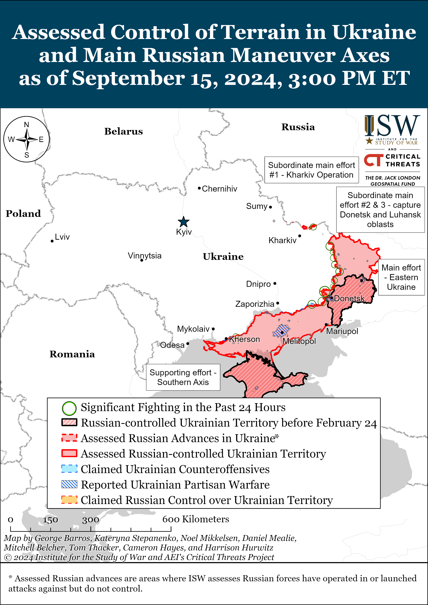
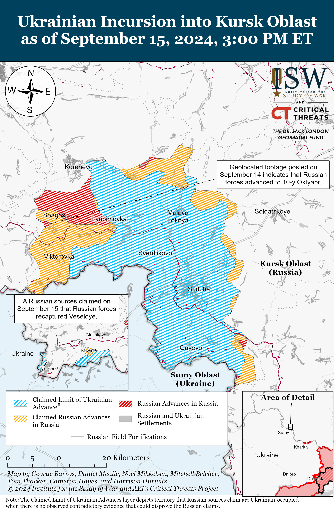
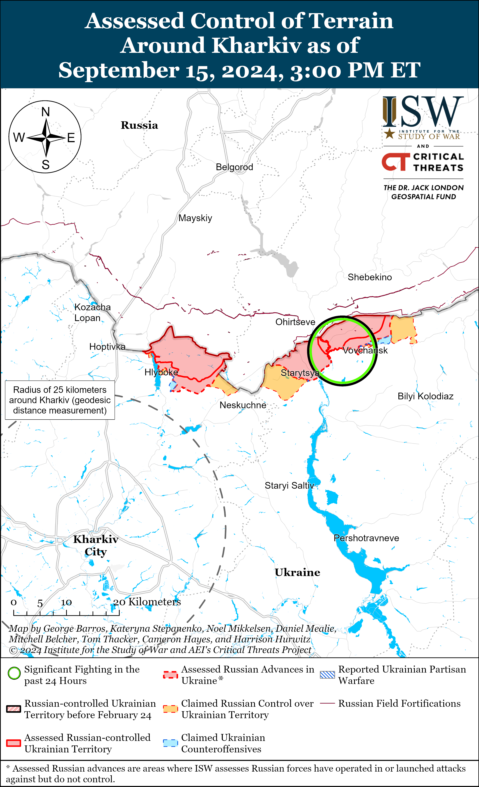
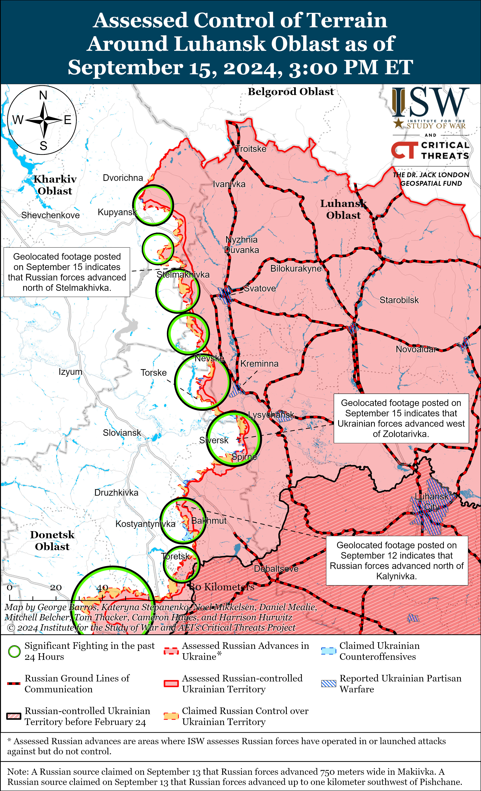
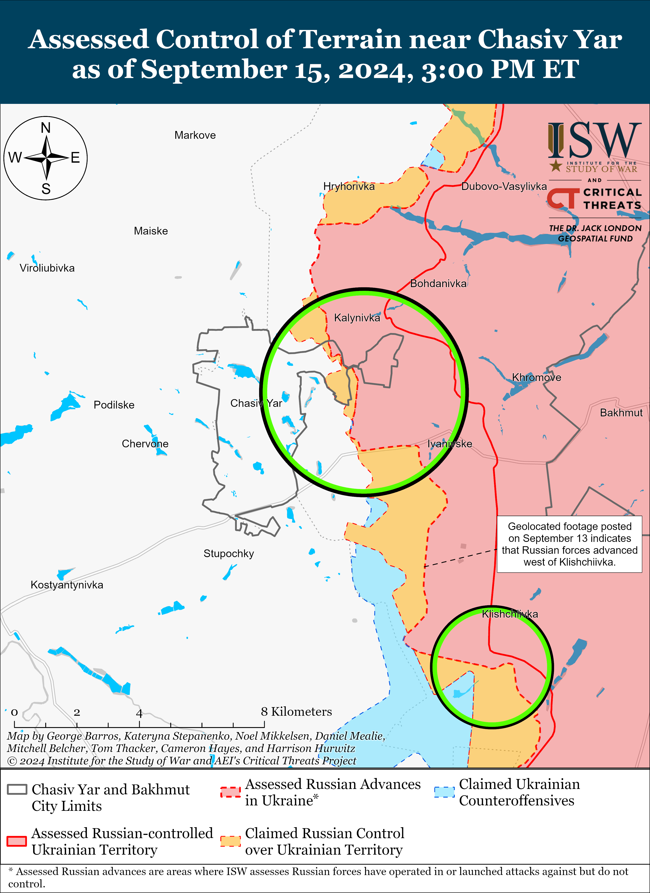
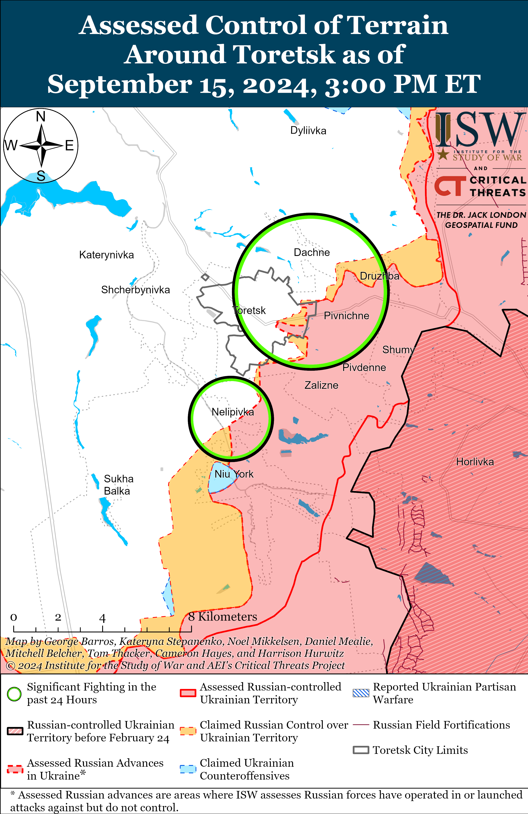
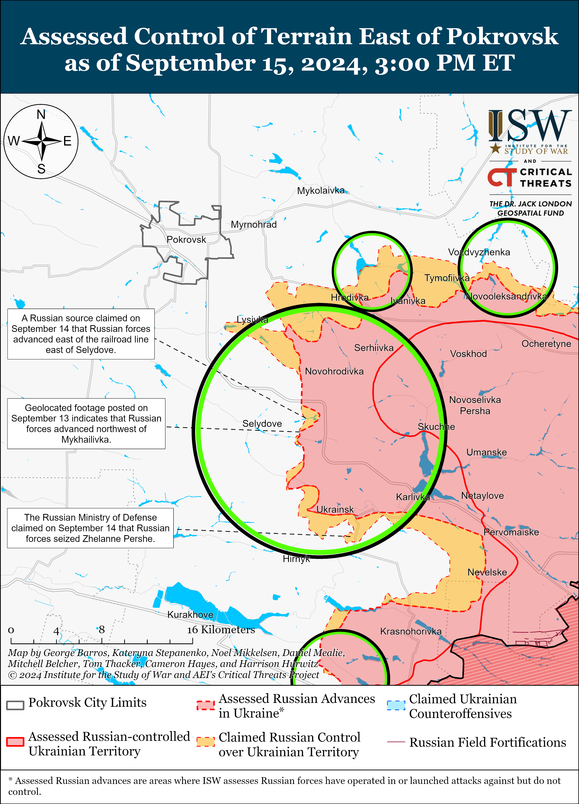
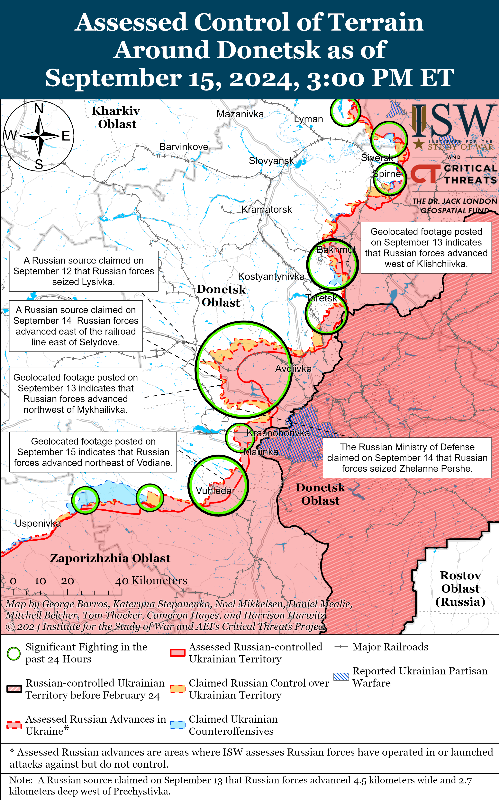
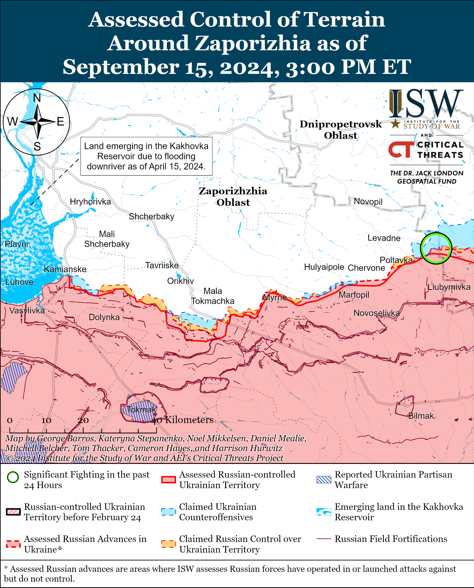
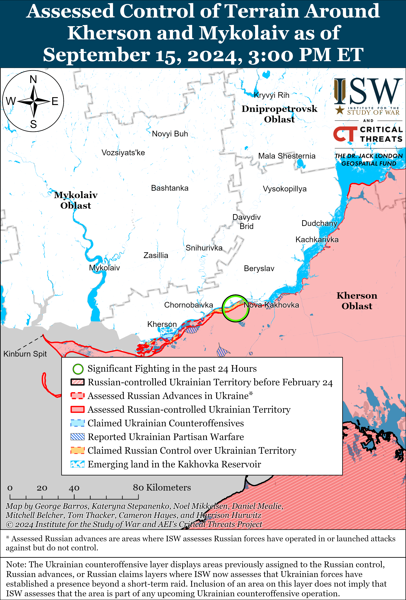

# Russian Offensive Campaign Assessment, September 15, 2024

**Davit Gasparyan, Riley Bailey, Grace Mappes, Christina Harward, and George Barros**

**September 15, 2024, 7:50 pm ET**

**Click**[**here**](https://storymaps.arcgis.com/stories/36a7f6a6f5a9448496de641cf64bd375)**to see ISW’s interactive map of the Russian invasion of Ukraine and [**here**](https://storymaps.arcgis.com/stories/83a2f24901c941d581c0c523ecd2619b)**to see ISW’s interactive map of Ukraine’s offensive in Kursk Oblast.** These maps are updated daily alongside the static maps present in this report.**

**Click**[**here**](https://understandingwar.maps.arcgis.com/apps/instant/3dviewer/index.html?appid=1602762dbcde419bb957dea358449580)**to see ISW’s 3D control of terrain topographic map of Ukraine. Use of a computer (not a mobile device) is strongly recommended for using this data-heavy tool.**

**Click**[**here**](https://storymaps.arcgis.com/stories/733fe90805894bfc8562d90b106aa895)**to access ISW’s archive of interactive time-lapse maps of the Russian invasion of Ukraine. These maps complement the static control-of-terrain map that ISW produces daily by showing a dynamic frontline. ISW will update this time-lapse map archive monthly.**

**Note: The data cut-off for this product was 12:15pm ET on September 15. ISW will cover subsequent reports in the September 16 Russian Offensive Campaign Assessment.**

**Russia reportedly aims to achieve a decisive victory in Ukraine by 2026 before likely medium- to long-term economic and force generation constraints begin to significantly degrade Russia’s ability to sustain its war effort in Ukraine.**UkrainianMain Military Intelligence Directorate (GUR) Head Lieutenant General KyryloBudanov announced on September 15 at the 20th Yalta European Strategy meeting in Kyiv that the Kremlin considers 2025 to be a pivotal year because failure to secure a victory in Ukraine by early 2026 will undermine Russia’s aspirations of remaining a global superpower for the next 30 years.[1] Budanov noted that Russia anticipates a worsening economic and socio-political situation by mid-2025, alongside increasing difficulties with military recruitment.[2] Budanov stated that the Russian military is experiencing personnel shortages and a decrease in the number of new volunteers signing contracts.[3] Recent significant rises in one-time payments to contract military personnel (*kontraktniki*), with at least 36 Russian federal subjects (regions) reportedly having increased their one-time payments to *kontraktniki*in 2024 and at least 11 federal subjects paying Russian *kontraktniki*one million rubles ($11,000) or more, are likely evidence of mounting costs and difficulties with the Russian military’s ability to continue recruiting personnel.[4] Budanov also stated that the Ukrainian incursion into Kursk Oblast, coupled with constant Ukrainian strikes into Russian territories, has demoralized Russian citizens and eroded the Russian public’s perception of Russian invincibility.[5] Budanov assessed that mounting issues will force Russian President Vladimir Putin to make a critical decision: either launch another risky and controversial mobilization or reduce the intensity of combat operations in Ukraine. Budanov’s assessment implicitly assumes that Western states will maintain support for Ukraine at current levels over the next one to two years. It remains unclear what Putin may do between now and 2026 or how effective Putin’s efforts to offset the impacts of Russia’s war in Ukraine, including via foreign partners like Iran, North Korea, and the People’s Republic of China (PRC), will be. ISW continues to assess that Putin remains averse to announcing another partial mobilization out of fear of domestic discontent and will likely continue to instruct the Ministry of Defense (MoD) to pursue ongoing crypto-mobilization efforts until such efforts begin to fall far short of operational requirements in Ukraine.[6] Putin maintains the option to call another round of mobilization – as he did in Fall 2022 – despite his desire to avoid having to do so. ISW continues to assess that the Kremlin is also unwilling to accept reducing the intensity of Russian forces’ combat operations because the Kremlin sees maintaining the theater-wide initiative as a strategic imperative.[7] It remains unclear whether Putin will respond with another round of mobilization if faced with another crisis similar to or worse than the crisis the Kremlin faced in Fall 2022, as Russia’s investments to grow Russia’s force generation system, war economy, and international defense relationships have matured over the past two years, and likely will continue to do so through 2026.

**Russia will likely face growing challenges in the production and procurement of the materiel that Russian operations in Ukraine require, and the Kremlin will likely become increasingly reliant on foreign partners to meet its materiel needs.**The Russian military has extensively relied on refurbishing stocks of Soviet-era weapons and military equipment, particularly armored vehicles, to sustain the tempo of its offensive operations in Ukraine.[8] The Russian government will likely have to further mobilize the Russian economy and defense industry and invest in capacity building if the Russian military intends to sustain its current tempo of operations in the medium- to long-term as Russia depletes its finite Soviet stockpiles, but it is unclear if the Russian defense industry will be able to produce enough to sustain the high level of equipment losses that Russian forces suffer in Ukraine even with further economic mobilization.[9] ISW has previously assessed that Russia’s efforts to expand its DIB are unlikely to be sustainable in the medium- to long-term due to anticipated labor shortages and the impacts of Western sanctions.[10] Putin acknowledged on April 4 that Russia will experience a high demand for human capital and face labor shortages in the coming years.[11] Kremlin-affiliated outlet *Izvestiya*reported on December 24, 2023, that Russia’s labor shortages, partly driven by the war in Ukraine, reached 4.8 million people in 2023 and would likely worsen and impair Russia’s ability to enhance domestic defense industrial initiatives.[12]

Budanov drew attention to North Korea’s role as Russia’s most impactful military ally. Budanov noted that North Korean artillery ammunition deliveries to Russia have a direct and rapid effect on the war’s dynamics, with Ukrainian forces experiencing increased Russian operational tempo just days after North Korean-provided artillery ammunition arrives.[13] Ukrainian Main Military Intelligence Directorate (GUR) Deputy Chief Major General Vadym Skibitskyi stated in January 2024 that Russia’s defense industrial base (DIB) cannot produce enough artillery ammunition to sustain Russia’s rate of fire and that North Korea delivered one million rounds of artillery ammunition to Russia between September and November 2023, offsetting some of Russia’s crucial shortages.[14] North Korea had reportedly delivered 4.8 million artillery shells to Russia as of June 2024.[15] North Korean support has previously enabled Russia to maintain significant artillery advantages over Ukraine, and Russia has used these advantages to support consistent offensive operations designed to prevent Ukrainian forces from being able to contest the initiative.[16] ISW has noted that Russian authorities have recently intensified military cooperation with North Korea, as evidenced by Russian Security Council head Sergei Shoigu’s September 13 visit to Pyongyang and Putin’s visit in June 2024, when Putin signed a Comprehensive Strategic Partnership agreement with North Korean President Kim Jong Un.[17] Russia’s deepening military partnership with North Korea is emblematic of the relationship that Russia aims to create with Iran, the PRC, and other desired partners. Russia will likely face dwindling weapons and equipment stockpiles and struggle to offset these shortages unless it can circumvent Western sanctions at scale and significantly expand its engagements with foreign partners to obtain sufficient military materiel, component parts, and dual-use items. ISW will soon launch an initiative to study Russia’s growing partnerships with other hostile state actors.

**Ukrainian Presidential Advisor Oleksandr Kamyshin stated on September 15 that Ukraine has started domestic serial production of 155mm artillery shells.**[18] Kamyshin stated that Ukrainian production of defense products doubled while he oversaw the Ministry of Strategic Industries (March 2023 to September 2024) and will triple by the end of 2024. Ukraine began domestically producing NATO-standard 155mm shells in small volumes no later than September 2023 after having never produced these shells before.[19]

**The Russian Ministry of Defense (MoD) promptly responded to ultranationalists’ outcry surrounding the controversial deaths of two drone operators in Ukraine, highlighting how Russian authorities continue to be highly attentive to backlash from the ultranationalist community.**The Russian MoD stated on September 14 that Russian Defense Minister Andrei Belousov personally ordered Head of the MoD’s Main Military-Political Directorate and Deputy Defense Minister Colonel General Viktor Goremykin and Russian Chief of the General Staff Army General Valery Gerasimov, alongside the Russian Federal Security Service’s (FSB) Military Counterintelligence Department, to “sort out information” related to the death of the two drone operators within the 87th Separate Rifle Regiment of the 1st “Slavic” Motorized Rifle Brigade (51st Combined Arms Army [CAA], formerly the 1st Donetsk People’s Republic Army Corps [DNR AC]).[20] Various Russian milbloggers reported on September 13 that two drone operators from the 87th Rifle Regiment died in combat near Pokrovsk after their field commander forced them into an assault detachment as punishment for criticizing their command.[21] The death of the drone operators generated pronounced outrage among Russian ultranationalist milbloggers about poor command discipline, and the Russian MoD appears to be trying to promptly address this outrage by issuing a statement on the matter within 24 hours.[22]

The MoD’s response is the latest in a series of incidents in which ultranationalist outcries have influenced Russian officials’ decision-making. The Russian federal censor Roskomnadzor published and immediately deleted a draft procedure to implement a recently adopted law designed to deanonymize Russian Telegram channels following backlash from the Russian ultranationalist Telegram community on September 5.[23] Russian ultranationalist outcries about controversies tied to migrants have also previously prompted the Russian Investigative Committee to open criminal investigations.[24] Russian officials’ attentiveness to the Russian ultranationalist community underscores the importance the Kremlin has placed on leveraging the community’s favor to support its war effort in Ukraine and the Kremlin’s concerns about the consequences of pronounced ultranationalist discontent.[25]

**Russian ultranationalist milbloggers praised the Russian MoD’s response to the drone operators’ deaths but expressed concern about the MoD’s ability to solve the systemic issues that led to the deaths.**The Russian milbloggers broadly expressed concern about various systemic issues within the 51st CAA and the Russian military, including a culture of lying to senior military commanders to falsely portray the military situation as positive; the practice of sending soldiers with specializations to conduct attritional, infantry-led “meat” assaults, command and control (C2) issues, and commanders’ abuses of power.[26] A milblogger claimed that the Russian military command only ordered the assault that led to the drone operators’ deaths because of false reports that Russian forces had seized a settlement near Pokrovsk.[27] Another milblogger noted that the Russian MoD only responded to the drone operators’ deaths because of the significant outcry online and claimed that Russian authorities have previously investigated the Russian 1st “Slavic” Motorized Rifle Brigade for sending engineers to conduct infantry assaults.[28] Some milbloggers described the persistent issues within the Russian military as “Augean Stables,” comparing the work necessary to eliminate the issues to the mythological Herculean task.[29] Onemilblogger pointed to another unresolved problem with Russian commanders sending wounded soldiers back to the frontline without treatment – an issue about which milbloggers have widely complained recently, prompting the Russian MoD to posture itself as making an effort to focus on soldiers’ medical care.[30] Another milblogger provided insight into the struggles involved in the formalization and force structure of irregular Russian forces, claiming that regiments of the 51st CAA and 3rd Luhansk People’s Republic (LNR) Army Corps are severely understrength as the regiments have reduced tables of organization and equipment (TO/E) that do not include organic artillery; drone; air defense; or radiation, chemical, and biological defense elements that Russian regulations require of all Russian regiments.[31] The milblogger stated that regiments of the 51st CAA and 3rd CAA are inadequately provisioned, drastically reducing the units’ combat capabilities. The Kremlin’s efforts areunlikely to be sufficient to solve the broader issues that pervade the 51st CAA and other Russian regular and irregular formations in the near or medium term, especially as the Russian military is in the process of formalizing irregular formations into the regular Russian forces.

**Chechen Akhmat Spetsnaz Commander Apty Alaudinov aggravated Kremlin efforts to conduct prisoner of war (POW) exchanges for soldiers who defended against the Ukrainian incursion into Kursk Oblast while balancing his attempts to appeal to both the Russian Ministry of Defense (MoD) and hardline facets of Chechen society.**Alaudinov responded on September 15 to requests for help from the relatives of Chechen servicemembers whom Ukrainian forces have captured in Kursk Oblast, claiming that “Chechens have always considered surrender to be the greatest disgrace.”[32] Alaudinov claimed that Chechen prisoners of war (POWs) “didn’t deserve to live” and that Chechen soldiers should have attacked the Ukrainian personnel who were guarding them in order to provoke Ukrainian forces to kill them. Alaudinov claimed that he is prepared to help secure the release of other Russian prisoners of war (POWs), however. Alaudinov has been posturing himself as the spokesperson for the Russian forces operating in Kursk Oblast since the start of the Ukrainian incursion, and Russian state media has widely amplified his statements.[33] His September 15 statement denouncing Chechen soldiers who choose surrender over death is likely an attempt to rebalance his posturing to facets of Chechen society that hold similar beliefs and to portray Chechen forces as elite and making extreme sacrifices in the war. Ukraine and Russia conducted two POW exchanges on September 13 and 14, and Russia reportedly returned individuals whom Ukrainian forces captured in the Kursk direction, including many conscripts.[34] Russia has increasingly conducted POW exchanges with Ukraine since the start of Ukraine’s incursion into Kursk Oblast following months of reportedly rebuffing Ukrainian overtures for POW exchanges – demonstrating the importance the Kremlin is placing on the return of Russian POWs captured in Kursk Oblast, particularly conscripts.[35] Alaudinov similarly recently berated the relatives of Russian conscripts fighting in Kursk Oblast for their complaints about their relatives’ participation in combat operations, which likely exacerbated Kremlin efforts to respond to this socially and politically sensitive issue.[36]

**Key Takeaways:**

- **Russia reportedly aims to achieve a decisive victory in Ukraine by 2026 before likely medium- to long-term economic and force generation constraints begin to significantly degrade Russia’s ability to sustain its war effort in Ukraine.**
- **Russia will likely face growing challenges in the production and procurement of the materiel that Russian operations in Ukraine require, and the Kremlin will likely become increasingly reliant on foreign partners to meet its materiel needs.**
- **Ukrainian Presidential Advisor Oleksandr Kamyshin stated on September 15 that Ukraine has started domestic serial production of 155mm artillery shells.**
- **The Russian Ministry of Defense (MoD) promptly responded to ultranationalists’ outcry surrounding the controversial deaths of two drone operators in Ukraine, highlighting how Russian authorities continue to be highly attentive to backlash from the ultranationalist community.**
- **Russian ultranationalist milbloggers praised the Russian MoD’s response to the drone operators’ deaths but expressed concern about the MoD’s ability to solve the systemic issues that led to the deaths.**
- **Chechen Akhmat Spetsnaz Commander Apty Alaudinov aggravated Kremlin efforts to conduct prisoner of war (POW) exchanges for soldiers who defended against the Ukrainian incursion into Kursk Oblast while balancing his attempts to appeal to both the Russian Ministry of Defense (MoD) and hardline facets of Chechen society.**
- **Ukrainian forces reportedly advanced in Glushkovsky Raion, Kursk Oblast, and Russian forces reportedly recently recaptured territory in the area as of September 15. Ukrainian forces continued offensive operations throughout their salient in Kursk Oblast, and Russian forces recently advanced in the salient.**
- **Russian forces recently advanced near Svatove, Siversk, and Donetsk City.**
- **Russian authorities continue to strengthen coercive mechanisms to support ongoing crypto-mobilization efforts in order to avoid conducting a wider mobilization.**

****

*****We do not report in detail on Russian war crimes because these activities are well-covered in Western media and do not directly affect the military operations we are assessing and forecasting. We will continue to evaluate and report on the effects of these criminal activities on the Ukrainian military and the Ukrainian population and specifically on combat in Ukrainian urban areas. We utterly condemn Russian violations of the laws of armed conflict and the Geneva Conventions and crimes against humanity even though we do not describe them in these reports.*****

- Ukrainian Operations in the Russian Federation
- Russian Main Effort – Eastern Ukraine (comprised of three subordinate main efforts)
- Russian Subordinate Main Effort #1 – Push Ukrainian forces back from the international border with Belgorod Oblast and approach to within tube artillery range of Kharkiv City
- Russian Subordinate Main Effort #2 – Capture the remainder of Luhansk Oblast and push westward into eastern Kharkiv Oblast and encircle northern Donetsk Oblast
- Russian Subordinate Main Effort #3 – Capture the entirety of Donetsk Oblast
- Russian Supporting Effort – Southern Axis
- Russian Air, Missile, and Drone Campaign
- Russian Mobilization and Force Generation Efforts
- Russian Technological Adaptations
- Activities in Russian-occupied areas
- Ukrainian Defense Industrial Base Efforts
- Russian Information Operations and Narratives
- Significant Activity in Belarus

**Ukrainian Operations in the Russian Federation**

Ukrainian forces reportedly advanced in Glushkovsky Raion, Kursk Oblast, and Russian forces reportedly recently recaptured territory in the area as of September 15. A Russian milblogger claimed on September 14 that Ukrainian forces advanced towards the southeastern outskirts of Volfino (southwest of Glushkovo).[37] Russian milbloggers claimed on September 15 that Russian forces recaptured Veseloye (southwest of Glushkovo), but ISW is unable to confirm this claim.[38] Russian sources claimed that Ukrainian forces continued offensive operations on the southern outskirts of Veseloye and near Novy Put (south of Veseloye) and Medvezhye (southeast of Veseloye).[39] Elements of the Russian 56th Airborne (VDV) Regiment (7th VDV Division) and 106th VDV Division reportedly continue to defend against Ukrainian attacks in Glushkovsky Raion.[40]

Ukrainian forces continued offensive operations throughout their salient in Kursk Oblast on September 15. Russian sources claimed that Ukrainian forces continued attacks within and near Lyubimovka (southeast of Korenevo) and near Malaya Loknya (north of Sudzha) on September 14 and 15.[41]

Russian forces recently advanced in the Ukrainian salient in Kursk Oblast and reportedly recently recaptured a settlement. Geolocated footage published on September 14 and 15 indicates that Russian forces advanced in fields east of 10-y Oktyabr (south of Korenevo) and marginally advanced west of Lyubimovka, respectively.[42] Russian sources claimed that elements of the Russian 382nd Battalion of the 810th Naval Infantry Brigade (Black Sea Fleet [BSF], Southern Military District [SMD]), “Arbat” Special Purpose Battalion, “Sarmat” battalion (Donetsk People’s Republic [DNR] “Pyatnashka” international volunteer brigade), and “Dikaya Division of Donbass” (Russian Volunteer Corps) recaptured Borki (southeast of Sudzha).[43] Elements of the Russian 51st VDV Regiment (106th VDV Division) are reportedly operating in Snagost (south of Korenevo), and elements of the 155th Naval Infantry Brigade (Pacific Fleet, Eastern Military District [EMD]) are reportedly striking Ukrainian forces near Darino (southeast of Korenevo).[44]

**Russian Main Effort – Eastern Ukraine**

**Russian Subordinate Main Effort #1 – Kharkiv Oblast (Russian objective: Push Ukrainian forces back from the international border with Belgorod Oblast and approach to within tube artillery range of Kharkiv City)**

Fighting continued north of Kharkiv City near Hlyboke and northeast of Kharkiv City near Vovchansk on September 14 and 15, but there were no confirmed changes to the frontline in the area.[45] Ukrainian Kharkiv Group of Forces Spokesperson Colonel Vitaliy Sarantsev stated on September 14 that high Ukrainian drone activity is complicating logistical support for forward Russian positions in northern Kharkiv Oblast, but that Russian and Ukrainian forces have a drone parity in the area.[46] A Ukrainian soldier operating in northern Kharkiv Oblast stated on September 15 that the tempo of Russian glide bomb strikes has continued to decrease over the past two weeks (roughly September 1-14) because Russian forces have lost a significant number of long-range drones.[47] Sarantsev stated that Russian forces are increasing their reconnaissance drone activity near Vovchansk in order to support intensified glide bomb strikes and offensive actions in the area, however.[48] Sarantsev added that Russian conscripts continue to perform logistics tasks in immediate rear areas in northern Kharkiv Oblast but that Russian forces are not committing conscripts to combat operations.[49]

**Russian Subordinate Main Effort #2 – Luhansk Oblast (Russian objective: Capture the remainder of Luhansk Oblast and push westward into eastern Kharkiv Oblast and northern Donetsk Oblast)**

Russian forces recently made marginal advances northwest of Svatove amid continued offensive operations along the Kupyansk-Svatove-Kreminna line on September 15. Geolocated footage published on September 15 shows a Ukrainian drone dropping thermite on Russian positions north of Stelmakhivka (northwest of Svatove), indicating that Russian forces advanced in the area.[50] Russian forces continued offensive operations northeast of Kupyansk near Synkivka; east of Kupyansk near Petropavlivka; northwest of Svatove near Kolisnykivka, Hlushkivka, Kruhlyakivka, and Stelmakhivka and in the direction of Lozova; southwest of Svatove near Druzhelyubivka, Kovalivka, Tverdokhlibove, and Cherneshchyna; northwest of Kreminna near Novosadove, Makiivka, and Nevske; west of Kreminna near Terny and Zarichne; and south of Kreminna near Serebryanka on September 14 and 15.[51]

**Russian Subordinate Main Effort #3 – Donetsk Oblast (Russian objective: Capture the entirety of Donetsk Oblast, the claimed territory of Russia’s proxies in Donbas)**

Russian forces recently advanced in the Siversk direction and continued offensive operations in the area on September 15. Geolocated footage published on September 15 indicates that Russian forces recently advanced west of Zolotarivka (east of Siversk).[52] The Ukrainian General Staff reported that Russian forces conducted offensive operations northeast of Siversk near Bilohorivka; east of Siversk near Verkhnokamyanske; and southeast of Siversk near Vyimka and Ivano-Darivka on September 14 and 15.[53] Elements of the Russian 2nd Luhansk People’s Republic [reportedly reorganized into the 3rd Combined Arms Army [CAA]) are reportedly conducting TOS-1A thermobaric artillery strikes against Ukrainian forces near Verknokamyanske.[54]

Russian forces continued offensive operations near Chasiv Yar on September 15, but there were no confirmed changes to the frontline. Russian forces conducted offensive operations near Chasiv Yar and Andriivka (southeast of Chasiv Yar) and towards Stupochky (south of Chasiv Yar) on September 14 and 15.[55]

Russian forces continued offensive operations near Toretsk on September 15, but there were no confirmed changes to the frontline. Russian forces conducted offensive operations near Toretsk; northeast of Toretsk near Dachne; east of Toretsk near Druzhba; south of Toretsk near Nelipivka; and west of Toretsk towards Shcherbynivka on September 14 and 15.[56] A Russian milblogger claimed that Russian forces advanced 600 meters towards central Toretsk, but ISW has not observed confirmation of this claim.[57]

Russian forces reportedly advanced in the Pokrovsk direction on September 15, but there were no confirmed changes to the frontline. Russian milbloggers claimed that Russian forces advanced east of Selydove, in southwestern Ukrainsk (both southeast of Pokrovsk), and south and east of Ukrainsk, but ISW has not observed confirmation of these claims.[58] Russian forces operating east of Pokrovsk conducted offensive operations near Sukha Balka, Vozdvyzhenka, Zelene Pole, Novooleksandrivka, Hrodivka, Novotoretsk, and Krasnyi Yar, and Russian forces operating southeast of Pokrovsk attacked near Selydove, Ukrainsk, Dolynivka, Novohrodivka, Marynivka, Mykhailivka, Zhelanne Pershe, Zhelanne Druhe, and Lysivka (west of Novohrodivka) on September 14 and 15.[59] A Russian milblogger claimed that the tempo of Russian advances has slowed in the Pokrovsk direction and that Russian forces need to move their logistics and sustainment support forward along Russian ground lines of communication (GLOCs).[60]

Russian forces recently advanced west of Donetsk City amid continued offensive operations in the area on September 15. Geolocated footage published on September 15 indicates that Russian forces recently advanced in eastern Maksymilyanivka.[61] Russian forces conducted offensive operations near Heorhiivka and Hostre on September 14 and 15.[62]

Russian forces recently advanced southwest of Donetsk City amid continued offensive operations in the area on September 15. Geolocated footage published on September 15 indicates that Russian forces recently advanced northeast of Vodyane (northeast of Vuhledar).[63] Russian forces conducted offensive operations near Katerynivka, Kostyantynivka, Vuhledar, and Vodyane on September 14 and 15.[64] A Russian milblogger claimed that Ukrainian forces attempted to counterattack near the Pivdennodonbaska No. 3 mine (west of Vodyane) and that the tempo of fighting in the area is decreasing.[65] Elements of the Russian 238th Artillery Brigade (8th CAA, Southern Military District [SMD]) are reportedly conducting strikes near Antonivka to support the offensive operations of the 20th Motorized Rifle Brigade (8th CAA).[66] Elements of the Russian 11th Air Force and Air Defense Army (Russian Aerospace Forces [VKS] and Eastern Military District [EMD]) are reportedly striking Ukrainian positions in Bohoyavlenka.[67]

Russian forces conducted offensive operations in the Donetsk-Zaporizhia Oblast border area near Zolota Nyva (southeast of Velyka Novosilka), Makarivka (south of Velyka Novosilka), and Novodarivka (southwest of Velyka Novosilka) on September 14 and 15, but there were no confirmed changes to the frontline.[68]

**Russian Supporting Effort – Southern Axis (Russian objective: Maintain frontline positions and secure rear areas against Ukrainian strikes)**

Positional fighting continued in western Zaporizhia Oblast but there were no confirmed changes to the frontline on September 15.[69] Geolocated footage published on September 15 shows a sabotage and reconnaissance group of the Russian 4th Military Base (58th Combined Arms Army [CAA], Southern Military District [SMD]) recently conducting a raid against Ukrainian positions near Kamyanske (southwest of Orikhiv and south of Stepnohirsk), but ISW has not observed reports or evidence of Russian forces conducting assaults or making advances in the area.[70] Ukrainian Tavriisk Group of Forces Spokesperson Captain Dmytro Lykhovyi stated on September 14 that the tempo of Russian offensive activity in Zaporizhia Oblast has recently decreased because Russian forces lack the resources to conduct simultaneous offensive operations in several directions and are currently focused on their priority offensive efforts in the Pokrovsk and Kurakhove (west and southwest of Donetsk City) directions and Ukraine’s incursion in Kursk Oblast.[71] Lykhovyi added that Russian forces redeployed partial elements of unspecified battalions, regiments, and brigades from Zaporizhia Oblast a few weeks ago (presumably to Kursk Oblast) and that Russian forces are currently conducting an operational pause to reorganize the elements remaining in Zaporizhia Oblast.[72]

Russian forces have reportedly intensified offensive activity on islands in the Dnipro River Delta as of September 15. The Ukrainian General Staff reported that Russian forces continued to attack in the Kherson direction on September 14 and 15, and Lykhovyi stated that Russian forces have intensified assaults against many islands along the east (left) bank of the Dnipro River and at the mouth of the Dnipro River.[73] Lykhovyi stated that Russian forces are committing additional forces to efforts to gain more control over the Dnipro River and that elements of the Russian 144th Motorized Rifle Brigade (40th Army Corps [AC], 18th CAA, SMD), 205th Motorized Rifle Brigade (49th CAA, SMD), 337th Airborne (VDV) Regiment (104th VDV Division), 28th Motorized Rifle Regiment (70th Motorized Rifle Division, 18th CAA), 126th Coastal Defense Brigade (22nd AC, Black Sea Fleet [BSF]), and 61st Naval Infantry Brigade (Leningrad Military District [LMD], formerly Northern Fleet) are attacking islands in the Dnipro River.[74] Elements of the Russian 81st Self-Propelled Artillery Regiment (70th Motorized Rifle Division, 18th CAA) and “Habr” drone detachment are reportedly operating along the Dnipro River.[75]

A large number of Russian BSF vessels left the port in Novorossiysk, Krasnodar Krai no later than September 14. Satellite imagery collected on September 14 shows no Russian vessels in the Novorossiysk port, and the Ukrainian Navy reported that there were 16 Russian naval vessels, including seven Kalibr cruise missile carriers, in the Black Sea on September 15.[76] Ukrainian Navy Spokesperson Captain Third Rank Dmytro Pletenchuk noted that the deployment of many Kalibr cruise missile carriers to sea from the Novorossiysk port does not particularly affect the situation in the Black Sea since these ships can typically conduct missile launches and return to port in a matter of hours.[77] The Russian Navy appears to have similarly removed a large number of naval vessels from the Novorossiysk port on September 11, excluding the BSF’s three remaining Kilo-class submarines, and the repeated mass removal of naval vessels from the port may be part of naval exercises focused on protecting naval assets during potential Ukrainian strikes against the BSF’s main base in Novorossiysk.[78]

**Russian Air, Missile, and Drone Campaign (Russian Objective: Target Ukrainian military and civilian infrastructure in the rear and on the frontline)**

Russian forces conducted a series of missile and drone strikes against Ukraine overnight on September 14 to 15. The Ukrainian Air Force reported that Russian forces targeted Ukraine with 17 drones and missiles, including two Iskander-M ballistic missiles from occupied Crimea, one Kh-59 cruise missile from airspace over occupied Zaporizhia Oblast, and 14 Shahed-136/131 drones from Kursk Oblast and occupied Cape Chauda, Crimea.[79] The Ukrainian Air Force stated that Ukrainian forces downed the Kh-59 missile and 10 Shahed drones over Dnipropetrovsk, Sumy, Poltava, and Mykolaiv oblasts. Ukrainian officials reported that the Russian Iskander-M missiles equipped with cluster warheads struck residential and commercial areas in Odesa City.[80] Russian forces conducted a glide bomb strike against residential buildings in Kharkiv City, injuring at least 41 people.[81]

**Russian Mobilization and Force Generation Efforts (Russian objective: Expand combat power without conducting general mobilization)**

Russian authorities continue to strengthen coercive mechanisms to support ongoing crypto-mobilization efforts in order to avoid conducting a wider mobilization. Oryol Oblast Governor Andrei Klychkov signed a decree on September 13 introducing special payments for police officers who “assist” Russian citizens, migrants, or stateless persons with signing contracts with the Russian Ministry of Defense (MoD).[82] Oryol Oblast will pay police officers 10,000 rubles ($110) for each recruit they “help.”

The Kremlin continues to promote Russian veterans to government positions through the “Time of Heroes” program. Russian President Vladimir Putin appointed Artur Orlov, a veteran of the war in Ukraine and participant of the Kremlin’s “Time of Heroes” program, as Chairperson of the Russian youth movement “Movement of the First” on September 14.[83] Russian Prime Minister Mikhail Mishustin appointed former Movement of the First Chairperson Grigory Gurov as the new Head of the Russian Federal Agency of Youth Affairs (Rosmolodezh) on September 14.[84] Putin launched the ”Time of Heroes“ program in February 2024 to prepare Russian veterans to serve in the Russian government, and the program likely aims to incentivize Russians to fight in Ukraine by portraying Russian military service as a pathway to a government career.[85]

**Russian Technological Adaptations (Russian objective: Introduce technological innovations to optimize systems for use in Ukraine)**

Nothing significant to report.

**Ukrainian Defense Industrial Efforts (Ukrainian objective: Develop its defense industrial base to become more self-sufficient in cooperation with US, European, and international partners)**

*ISW is suspending publishing coverage of Ukrainian defense industrial efforts until further notice.*

**Activities in Russian-occupied areas (Russian objective: Consolidate administrative control of annexed areas; forcibly integrate Ukrainian citizens into Russian sociocultural, economic, military, and governance systems)**

*ISW is not publishing coverage of Russian-occupied areas today.*

**Russian Information Operations and Narratives**

Nothing significant to report.

**Significant activity in Belarus (Russian efforts to increase its military presence in Belarus and further integrate Belarus into Russian-favorable frameworks and Wagner Group activity in Belarus)**

Nothing significant to report.

**Note: ISW does not receive any classified material from any source, uses only publicly available information, and draws extensively on Russian, Ukrainian, and Western reporting and social media as well as commercially available satellite imagery and other geospatial data as the basis for these reports. References to all sources used are provided in the endnotes of each update.**

---

[1] https://gur.gov dot ua/content/my-voiuiemo-za-svoiu-zemliu-svoie-maibutnie-svoikh-liudei-kyrylo-budanov.html

[2] https://www.youtube.com/watch?v=dbM3ZmOG-T4&ab\_channel=VictorPinchukFoundation; https://armyinform.com dot ua/2024/09/15/u-rosiyi-dedali-gostrishe-zvuchyt-pytannya-nedoboru-v-armiyu-kyrylo-budanov/

[3] https://interfax.com dot ua/news/general/1013845.html; https://suspilne dot media/836529-budanov-rosia-hoce-zaversiti-vijnu-proti-ukraini-do-2026-roku/

[4] https://understandingwar.org/backgrounder/russian-offensive-campaign-assessment-august-20-2024 ; https://t.me/horizontal\_russia/38683

[5] https://www.youtube.com/watch?v=dbM3ZmOG-T4&ab\_channel=VictorPinchukFoundation ; https://armyinform.com dot ua/2024/09/15/pislya-udariv-zsu-po-obyektah-vglyb-rosiyi-dlya-naselennya-krayiny-agresorky-zrujnuvavsya-mif-pro-yihnyu-neperemozhnist-i-bezpeku-kyrylo-budanov/

[6] https://isw.pub/UkrWar060724 ; https://isw.pub/UkrWar082924

[7] https://understandingwar.org/backgrounder/assessing-significance-current-russian-and-ukrainian-operations-course-war

[8] https://understandingwar.org/backgrounder/russian-offensive-campaign-assessment-july-10-2024 ; https://www.wsj.com/world/russia-is-pumping-out-weapons but-can-it-keep-it-up-ba30bb04 ; https://isw.pub/UkrWar040524 ; https://understandingwar.org/backgrounder/russian-offensive-campaign-assessment-march-9-2024 ; https://understandingwar.org/backgrounder/russian-offensive-campaign-assessment-february-13-2024 ; https://understandingwar.org/backgrounder/russian-offensive-campaign-assessment-june-7-2024

[9] https://understandingwar.org/backgrounder/russian-offensive-campaign-assessment-july-24-2024 ; https://understandingwar.org/backgrounder/russian-offensive-campaign-assessment-july-25-2024

[10] https://isw.pub/UkrWar031124

[11] https://isw.pub/UkrWar040424

[12] https://understandingwar.org/backgrounder/russian-offensive-campaign-assessment-december-24-2023; https://iz dot ru/1624816/mariia-stroiteleva/kak-zhe-bez-ruk-defitcit-rabotnikov-v-2023-godu-sostavil-48-mln

[13] https://www.youtube.com/watch?v=dbM3ZmOG-T4&ab\_channel=VictorPinchukFoundation; https://armyinform.com dot ua/2024/09/15/kyrylo-budanov-pivnichna-koreya-ye-golovnym-postachalnykom-ozbroyennya-dlya-rosiyi-i-cze-zavdaye-ukrayini-najbilshoyi-shkody/ ; https://meduza dot io/news/2024/09/15/budanov-nazval-kritichnymi-dlya-ukrainy-postavki-kndr-snaryadov-v-rossiyu

[14] https://www.rbc dot ua/ukr/news/vadim-skibitskiy-rosiyan-e-motivatsiya-voyuvati-1705266418.html

[15] https://time.com/6988568/north-korea-russia-artillery-shell-south-korea-defense-minister/

[16] https://understandingwar.org/backgrounder/how-delays-western-aid-gave-russia-initiative-ukrainian-counteroffensive-kharkiv

[17] https://understandingwar.org/backgrounder/russian-offensive-campaign-assessment-september-13-2024; https://understandingwar.org/backgrounder/russian-offensive-campaign-assessment-june-19-2024; http://kremlin dot ru/supplement/6154 ; https://t.me/MID\_Russia/42180

[18] https://www.nettavisen dot no/nyheter/ukraina-har-startet-egen-produksjon-av-155-mm-artillerigranater/s/5-95-2013618; https://suspilne dot media/836487-ukraina-rozpocala-virobnictvo-155-mm-boepripasiv-kamisin/ ; https://armyinform.com dot ua/2024/09/15/v-ukrayini-rozpochalosya-vlasne-vyrobnycztvo-155-mm-artsnaryadiv/

[19] https://understandingwar.org/backgrounder/ukraine%E2%80%99s-long-term-path-success-jumpstarting-self-sufficient-defense-industrial-base

[20] https://t.me/mod\_russia/43394

[21] https://t.me/philologist\_zov/1381; https://t.me/arbat/1885; https://t.me/dva\_majors/52536; https://t.me/belarusian\_silovik/41121; https://t.me/dva\_majors/52535; https://t.me/motopatriot/27509; https://t.me/NeoficialniyBeZsonoV/39685; https://t.me/dva\_majors/52529; https://t.me/rybar/63509; https://t.me/belarusian\_silovik/41121; https://t.me/rybar/63512; https://t.me/sashakots/48967; https://t.me/yurasumy/17949; https://t.me/dva\_majors/52553 ; https://understandingwar.org/backgrounder/russian-offensive-campaign-assessment-september-14-2024

[22] https://understandingwar.org/backgrounder/russian-offensive-campaign-assessment-september-14-2024

[23] https://isw.pub/UkrWar090624

[24] https://understandingwar.org/backgrounder/russian-offensive-campaign-assessment-january-17-2024

[25] https://understandingwar.org/backgrounder/russian-offensive-campaign-assessment-november-22-2023 ; https://isw.pub/UkrWar123123 ; https://understandingwar.org/backgrounder/russian-offensive-campaign-assessment-january-17-2024 ; https://isw.pub/UkrWar072924 ;

[26] https://t.me/dva\_majors/52625; https://t.me/philologist\_zov/1403; https://t.me/voin\_dv/10805; https://t.me/philologist\_zov/1405; https://t.me/yozhandcider/690;

[27] https://t.me/dva\_majors/52625; https://t.me/philologist\_zov/1403

[28] https://t.me/dva\_majors/52609; https://t.me/dva\_majors/52592

[29] https://t.me/dva\_majors/52625; https://t.me/philologist\_zov/1403

[30] https://t.me/dva\_majors/52592; https://understandingwar.org/backgrounder/russian-offensive-campaign-assessment-july-5-2024; https://understandingwar.org/backgrounder/russian-offensive-campaign-assessment-september-12-2024; https://understandingwar.org/backgrounder/russian-offensive-campaign-assessment-august-9-2024; https://understandingwar.org/backgrounder/russian-offensive-campaign-assessment-august-5-2024; https://understandingwar.org/backgrounder/russian-offensive-campaign-assessment-july-2-2024

[31] https://t.me/philologist\_zov/1404; https://t.me/ghost\_of\_novorossia/26416

[32] https://t.me/bbcrussian/70485; https://meduza dot io/news/2024/09/15/komandir-ahmata-zayavil-chto-ne-budet-vyzvolyat-dobrovolno-sdavshihsya-v-plen-chechentsev-potomu-chto-oni-ne-zasluzhivayut-zhizni

[33] https://isw.pub/UkrWar081424

[34] https://understandingwar.org/backgrounder/russian-offensive-campaign-assessment-september-13-2024 ; https://understandingwar.org/backgrounder/russian-offensive-campaign-assessment-september-14-2024

[35] https://isw.pub/UkrWar081624

[36] https://isw.pub/UkrWar081924

[37] https://t.me/rybar/63522

[38] https://t.me/motopatriot/27560; https://t.me/starshii\_pogrannaryada/10141

[39] https://t.me/mod\_russia/43427; https://t.me/dva\_majors/52609; https://t.me/warhistoryalconafter/184619; https://t.me/dva\_majors/52597; https://t.me/rybar/63522; https://t.me/RVvoenkor/76987

[40] https://t.me/RVvoenkor/76987

[41] https://t.me/mod\_russia/43427; https://t.me/RVvoenkor/76991

[42] https://x.com/blinzka/status/1835066759067664537; https://t.me/GRIFON501/512; https://x.com/EjShahid/status/1835070787960647774; https://www.instagram.com/reel/C\_5whM2MpWn/?utm\_source=ig\_web\_copy\_link

[43] https://understandingwar.org/backgrounder/russian-offensive-campaign-assessment-september-14-2024; https://t.me/milinfolive/130620; https://t.me/wargonzo/22130; https://t.me/boris\_rozhin/137471 ; https://t.me/RVvoenkor/77029; https://t.me/tass\_agency/272800

[44] https://t.me/boris\_rozhin/137422; https://t.me/dva\_majors/52651; https://t.me/Mestb\_Dobroj\_Voli/12585; https://t.me/milinfolive/130609; https://t.me/dva\_majors/52666;

[45] https://www.facebook.com/GeneralStaff.ua/posts/pfbid035pZmJSH8YuYEonBvBc3PVPxunuxRpKUQTMBvhEjry31mUSRtnztwyBHLMtSJGcTNl ; https://www.facebook.com/GeneralStaff.ua/posts/pfbid0Z5pZsJtHH3XjMVpqDUiLmQQi3AUkLbVCDfgfGixTT4Mqhwuw7EDzFiURmxX4FEakl ; https://www.facebook.com/GeneralStaff.ua/posts/pfbid0q9GpNdNyW3vqfGJHAp75WyfGcEbo1DHsLfCjPy8GgKFUVpLhyqyAqGJRD4mUjHsVl ; https://t.me/wargonzo/2211

[46] https://armyinform dot com.ua/2024/09/14/na-pivnochi-harkivshhyny-voroga-zakoshmaryly-fpv-dronamy/; https://youtu.be/j5TqaWCCdUg

[47] https://armyinform.com dot ua/2024/09/15/zaporuka-zmenshennya-kilkosti-udariv-kabamy-znyshhennya-vorozhyh-rozviduvalnyh-bpla/

[48] https://armyinform dot com.ua/2024/09/15/na-vovchanskomu-napryamku-suprotyvnyk-zbilshuye-kilkist-polotiv-rozviduvalnyh-droniv/; https://www.youtube.com/watch?v=VejCc6DN2Bw&ab\_channel=%D0%A4%D0%B0%D0%BA%D1%82%D0%B8ICTV

[49] https://youtu.be/j5TqaWCCdUg; https://armyinform.com dot ua/2024/09/14/za-krok-do-shturmiv-yak-vykorystovuyut-strokovykiv-v-armiyi-rf-na-harkivskomu-napryamku/

[50] https://t.me/creamy\_caprice/6808; https://t.me/ceroki24/850

[51] https://www.facebook.com/GeneralStaff.ua/posts/pfbid035pZmJSH8YuYEonBvBc3PVPxunuxRpKUQTMBvhEjry31mUSRtnztwyBHLMtSJGcTNl ; https://www.facebook.com/GeneralStaff.ua/posts/pfbid0Z5pZsJtHH3XjMVpqDUiLmQQi3AUkLbVCDfgfGixTT4Mqhwuw7EDzFiURmxX4FEakl ; https://www.facebook.com/GeneralStaff.ua/posts/pfbid0q9GpNdNyW3vqfGJHAp75WyfGcEbo1DHsLfCjPy8GgKFUVpLhyqyAqGJRD4mUjHsVl

[52] https://t.me/WarArchive\_ua/20076; https://www.facebook.com/watch/?v=792216069524033

[53] https://www.facebook.com/GeneralStaff.ua/posts/pfbid035pZmJSH8YuYEonBvBc3PVPxunuxRpKUQTMBvhEjry31mUSRtnztwyBHLMtSJGcTNl; https://www.facebook.com/GeneralStaff.ua/posts/pfbid0Z5pZsJtHH3XjMVpqDUiLmQQi3AUkLbVCDfgfGixTT4Mqhwuw7EDzFiURmxX4FEakl ; https://www.facebook.com/GeneralStaff.ua/posts/pfbid0q9GpNdNyW3vqfGJHAp75WyfGcEbo1DHsLfCjPy8GgKFUVpLhyqyAqGJRD4mUjHsVl

[54] https://t.me/epoddubny/21075

[55] https://www.facebook.com/GeneralStaff.ua/posts/pfbid035pZmJSH8YuYEonBvBc3PVPxunuxRpKUQTMBvhEjry31mUSRtnztwyBHLMtSJGcTNl; https://www.facebook.com/GeneralStaff.ua/posts/pfbid0Z5pZsJtHH3XjMVpqDUiLmQQi3AUkLbVCDfgfGixTT4Mqhwuw7EDzFiURmxX4FEakl; https://www.facebook.com/GeneralStaff.ua/posts/pfbid0q9GpNdNyW3vqfGJHAp75WyfGcEbo1DHsLfCjPy8GgKFUVpLhyqyAqGJRD4mUjHsVl; https://t.me/wargonzo/22114

[56] https://www.facebook.com/GeneralStaff.ua/posts/pfbid035pZmJSH8YuYEonBvBc3PVPxunuxRpKUQTMBvhEjry31mUSRtnztwyBHLMtSJGcTNl; https://www.facebook.com/GeneralStaff.ua/posts/pfbid0Z5pZsJtHH3XjMVpqDUiLmQQi3AUkLbVCDfgfGixTT4Mqhwuw7EDzFiURmxX4FEakl ; https://www.facebook.com/GeneralStaff.ua/posts/pfbid0q9GpNdNyW3vqfGJHAp75WyfGcEbo1DHsLfCjPy8GgKFUVpLhyqyAqGJRD4mUjHsVl; https://t.me/wargonzo/22114

[57] https://t.me/DnevnikDesantnika/15453

[58] https://t.me/motopatriot/27561 ; https://t.me/RVvoenkor/77003 ; https://t.me/warhistoryalconafter/184619; https://t.me/dva\_majors/52597

[59] https://www.facebook.com/GeneralStaff.ua/posts/pfbid035pZmJSH8YuYEonBvBc3PVPxunuxRpKUQTMBvhEjry31mUSRtnztwyBHLMtSJGcTNl; https://www.facebook.com/GeneralStaff.ua/posts/pfbid0Z5pZsJtHH3XjMVpqDUiLmQQi3AUkLbVCDfgfGixTT4Mqhwuw7EDzFiURmxX4FEakl ; https://www.facebook.com/GeneralStaff.ua/posts/pfbid0q9GpNdNyW3vqfGJHAp75WyfGcEbo1DHsLfCjPy8GgKFUVpLhyqyAqGJRD4mUjHsVl; https://t.me/RVvoenkor/77003

[60] https://t.me/dva\_majors/52609

[61] https://t.me/creamy\_caprice/6805; https://t.me/zluki\_bobry/85

[62] https://www.facebook.com/GeneralStaff.ua/posts/pfbid035pZmJSH8YuYEonBvBc3PVPxunuxRpKUQTMBvhEjry31mUSRtnztwyBHLMtSJGcTNl; https://www.facebook.com/GeneralStaff.ua/posts/pfbid0Z5pZsJtHH3XjMVpqDUiLmQQi3AUkLbVCDfgfGixTT4Mqhwuw7EDzFiURmxX4FEakl ; https://www.facebook.com/GeneralStaff.ua/posts/pfbid0q9GpNdNyW3vqfGJHAp75WyfGcEbo1DHsLfCjPy8GgKFUVpLhyqyAqGJRD4mUjHsVl ; https://t.me/motopatriot/27569

[63] https://t.me/creamy\_caprice/6806 ; https://t.me/faceofwar/43349

[64] https://www.facebook.com/GeneralStaff.ua/posts/pfbid035pZmJSH8YuYEonBvBc3PVPxunuxRpKUQTMBvhEjry31mUSRtnztwyBHLMtSJGcTNl; https://www.facebook.com/GeneralStaff.ua/posts/pfbid0Z5pZsJtHH3XjMVpqDUiLmQQi3AUkLbVCDfgfGixTT4Mqhwuw7EDzFiURmxX4FEakl ; https://www.facebook.com/GeneralStaff.ua/posts/pfbid0q9GpNdNyW3vqfGJHAp75WyfGcEbo1DHsLfCjPy8GgKFUVpLhyqyAqGJRD4mUjHsVl ; https://t.me/wargonzo/22114

[65] https://t.me/voin\_dv/10799

[66] https://t.me/nm\_dnr/12710

[67] https://t.me/voin\_dv/10796

[68] https://www.facebook.com/GeneralStaff.ua/posts/pfbid035pZmJSH8YuYEonBvBc3PVPxunuxRpKUQTMBvhEjry31mUSRtnztwyBHLMtSJGcTNl; https://www.facebook.com/GeneralStaff.ua/posts/pfbid0Z5pZsJtHH3XjMVpqDUiLmQQi3AUkLbVCDfgfGixTT4Mqhwuw7EDzFiURmxX4FEakl; https://www.facebook.com/GeneralStaff.ua/posts/pfbid0q9GpNdNyW3vqfGJHAp75WyfGcEbo1DHsLfCjPy8GgKFUVpLhyqyAqGJRD4mUjHsVl

[69] https://www.facebook.com/GeneralStaff.ua/posts/pfbid035pZmJSH8YuYEonBvBc3PVPxunuxRpKUQTMBvhEjry31mUSRtnztwyBHLMtSJGcTNl ; https://t.me/wargonzo/22114

[70] https://t.me/RVvoenkor/77024 ; https://t.me/motopatriot/27578?single ; https://x.com/EjShahid/status/1835328652969492799; https://t.me/RVvoenkor/77024

[71] https://youtu.be/j5TqaWCCdUg; https://armyinform.com dot ua/2024/09/14/na-zaporizkomu-napryamku-vorogu-brakuye-syl-dlya-shturmovyh-dij/

[72] https://youtu.be/j5TqaWCCdUg; https://armyinform.com dot ua/2024/09/14/na-zaporizkomu-napryamku-vorogu-brakuye-syl-dlya-shturmovyh-dij/

[73] https://armyinform dot com.ua/2024/09/14/na-pivdni-okupanty-rvutsya-do-dnipra-atakuyut-czilym-zooparkom-brygad-i-polkiv/ ; https://youtu.be/j5TqaWCCdUg ; https://www.facebook.com/GeneralStaff.ua/posts/pfbid035pZmJSH8YuYEonBvBc3PVPxunuxRpKUQTMBvhEjry31mUSRtnztwyBHLMtSJGcTNl ; https://www.facebook.com/GeneralStaff.ua/posts/pfbid0Z5pZsJtHH3XjMVpqDUiLmQQi3AUkLbVCDfgfGixTT4Mqhwuw7EDzFiURmxX4FEakl ; https://www.facebook.com/GeneralStaff.ua/posts/pfbid0q9GpNdNyW3vqfGJHAp75WyfGcEbo1DHsLfCjPy8GgKFUVpLhyqyAqGJRD4mUjHsVl

[74] https://armyinform dot com.ua/2024/09/14/na-pivdni-okupanty-rvutsya-do-dnipra-atakuyut-czilym-zooparkom-brygad-i-polkiv/ ; https://youtu.be/j5TqaWCCdUg

[75] https://t.me/dva\_majors/52601

[76] https://t.me/ukrainian\_navy/8620; https://armyinform.com dot ua/2024/09/15/zbilshylas-kilkist-suden-yaki-zdijsnyly-prohid-kerchenskoyu-protokoyu-v-interesah-rf/ ; https://x.com/CovertShores/status/1834958139625529559

[77] https://armyinform.com dot ua/2024/09/14/masove-vyvedennya-rosijskyh-raketonosiyiv-u-chorne-more-u-vms-poyasnyly-chym-cze-zagrozhuye/

[78] https://x.com/CovertShores/status/1833970310376554993

[79] https://t.me/kpszsu/19372

[80] https://t.me/kpszsu/19372; https://t.me/SJTF\_Odes/11362 ; https://t.me/SJTF\_Odes/11364; https://t.me/odeskaODA/6651; https://armyinform.com dot ua/2024/09/15/vorog-zdijsnyv-raketnyj-udar-po-peredmistyu-odesy-ye-zagybli-ta-postrazhdali/

[81] https://t.me/bbcrussian/70493 ; https://t.me/istories\_media/7568 ; https://t.me/V\_Zelenskiy\_official/11699

[82] https://t.me/mobilizationnews/20237 ; https://www.kommersant dot ru/doc/7106789

[83] https://t.me/tass\_agency/272706 ; https://meduza dot io/news/2024/09/15/rossiyskoe-detskoe-dvizhenie-pervyh-vozglavil-artur-orlov-voevavshiy-v-sirii-i-ukraine; https://t.me/dva\_majors/52588; https://t.me/Sladkov\_plus/11400; https://www.gazeta dot ru/social/news/2024/09/14/23924857.shtml ; https://aif dot ru/politics/russia/predsedatelem-pravleniya-dvizhenie-pervyh-stal-geroy-rossii-artur-orlov

[84] https://t.me/tass\_agency/272708

[85] https://understandingwar.org/backgrounder/russian-offensive-campaign-assessment-september-9-2024; https://understandingwar.org/backgrounder/russian-offensive-campaign-assessment-june-18-2024 ; https://isw.pub/UkrWar061524
