# Russian Offensive Campaign Assessment, September 16, 2024

**Christina Harward, Karolina Hird, Grace Mappes, Davit Gasparyan, Haley Zehrung, Annika Ganzeveld, and George Barros**

**September 16, 2024, 8:45pm ET**

**Click** [**here**](https://storymaps.arcgis.com/stories/36a7f6a6f5a9448496de641cf64bd375) **to see ISW’s interactive map of the Russian invasion of Ukraine. This map is updated daily alongside the static maps present in this report.**

**Click** [**here**](https://storymaps.arcgis.com/stories/83a2f24901c941d581c0c523ecd2619b) **to see ISW’s interactive map of Ukraine’s offensive in Kursk Oblast.**

**Click** [**here**](https://understandingwar.maps.arcgis.com/apps/instant/3dviewer/index.html?appid=1602762dbcde419bb957dea358449580) **to see ISW’s 3D control of terrain topographic map of Ukraine. Use of a computer (not a mobile device) is strongly recommended for using this data-heavy tool.**

**Click** [**here**](https://storymaps.arcgis.com/stories/733fe90805894bfc8562d90b106aa895) **to access ISW’s archive of interactive time-lapse maps of the Russian invasion of Ukraine. These maps complement the static control-of-terrain map that ISW produces daily by showing a dynamic frontline. ISW will update this time-lapse map archive monthly.**

**Note: The data cut-off for this product was 12:20 pm ET on September 16. ISW will cover subsequent reports in the September 17 Russian Offensive Campaign Assessment.**

**Ukraine has taken steps to address its manpower shortages, but delays and insufficiencies in Western military aid to Ukraine continue to limit its ability to generate effective combat units that can defend critical areas and contest the theater-wide initiative.** Ukrainian President Volodymyr Zelensky stated in an interview with *CNN* on September 13 that Ukraine “needs 14 brigades to be ready” for an unspecified requirement and that Ukraine has not been able to equip “even four” of these brigades with slowly arriving Western aid.[1] Zelensky noted that Ukraine has been increasing its domestic production of drones and transferring equipment from warehouses or reserve brigades to attempt to offset insufficient Western military assistance to Ukraine. Zelensky stated that these insufficient provisions, particularly of armored vehicles and artillery ammunition, have led to Ukrainian personnel losses. Ukrainian Verkhovna Rada Defense Committee Chairperson Oleksandr Zavitnevych told the *Financial Times* on September 16 that Ukrainian mobilization is “on track” and that newly trained forces could “impact” the battlefield likely in three months.[2] Ukrainian Ground Forces Commander Lieutenant General Oleksandr Pavlyuk stated in May 2024 that Ukraine was working to stand up 10 new Ukrainian brigades but that equipment, not manpower, was the main bottleneck in Ukraine’s defensive operations.[3] ISW has long assessed that Ukraine’s ability to defend against Russian offensive operations and challenge the theater-wide initiative heavily depends on both the Western provision of miliary aid and Ukraine’s efforts to reconstitute existing units and create new ones — the latter of which Ukraine has taken significant steps to resolve.[4] Ukrainian forces have partially mitigated the artillery ammunition shortages that resulted from delays in Western aid provisions by using first-person view (FPV) drones to blunt Russian infantry and armored vehicle assaults, but current FPV drones are unable to offset the tactical requirements of traditional field artillery.[5] Ukraine has taken steps to boost its domestic production of 155mm artillery ammunition, but Ukraine has had to build these industries largely from scratch during wartime.[6] Ukraine has also been working to increase its production of armored vehicles, including armored personnel carriers (APCs), since 2022, but Ukraine cannot manufacture complete tanks.[7] The US and other foreign allies likely can greatly increase the effectiveness of Ukrainian force-generation and force-reconstitution efforts by providing Ukrainian forces with more mechanized equipment, such as M113 armored personnel carriers, Bradley infantry fighting vehicles, and main battle tanks. Ukraine’s 155th Infantry Brigade was recently upgraded to a mechanized infantry brigade after the brigade was equipped with Leopard tanks, for example.[8] The generation of more Ukrainian infantry without a commensurate increase in mechanized equipment will not substantially increase Ukraine’s combat power or increase Ukraine’s warfighting capabilities.

**Zelensky reiterated that Ukraine’s incursion into Kursk Oblast has forced Russia to redirect some resources from Ukraine to defend in Russia but that Ukraine still needs sufficient resources and Western permission to strike military targets in Russia to mitigate the theater-wide strain on Ukrainian forces.** Zelensky stated that the ratio of Russian to Ukrainian artillery ammunition usage was 12-to-1 in favor of Russian forces prior to the incursion in Kursk Oblast and that the incursion intended to force the Russian military to redeploy forces to Russia from Ukraine.[9] Zelensky also emphasized that Ukraine needs permission to use Western-provided precision weapons to strike military targets in Russia, as Russia has already begun to take advantage of Western restrictions and policy delays and move aircraft from airfields within range of Western-provided precision weapons.[10] ISW has previously assessed that there are over 200 military objects in Russia within range of US-provided ATACMS that are not airfields, and significant delays in allowing Ukraine to strike these objects gives the Kremlin more time to fortify or relocate these assets beyond the range of Western-provided weapons before Ukrainian forces are able to strike them with these weapons.[11] ISW has previously assessed that Russian President Vladimir Putin is attempting to outlast both Western military assistance to Ukraine and Ukraine’s own willingness to defend itself through attritional warfare and efforts to undermine the legitimacy of and trust in the Ukrainian government.[12] Zelensky suggested that Ukraine is taking the war to Russian territory, both through strikes in Russia and the ongoing Kursk Oblast incursion, to degrade Russian domestic support for the war.[13] Zelensky emphasized that Russia will not be interested in negotiations with Ukraine unless Ukraine is militarily strong.[14]

**Russia continues to build out its long-term military capacity by gradually increasing the size of its armed forces.** Russian President Vladimir Putin signed a decree on September 16 establishing the staffing level of the Russian Armed Forces at 1.5 million combat personnel.[15] This marks a 180,000-person increase from the last decree increasing the staffing level of the Russian Armed Forces, which Putin signed in December 2023.[16] The December 2023 decree increased the staffing level of combat personnel by 170,000 compared with August 2022, meaning that the target staffing level of the Russian military has expanded by around 350,000 combat personnel since 2022.[17] The September 16 decree will notably come into force on December 1, 2024, suggesting that Russian military authorities will increase recruitment and force-generation efforts to meet the 1.5 million combat personnel benchmark starting December 2024. This decree is notably *not* an indicator of a new wave of Russian mobilization — rather it encompasses the breadth of recruitment avenues that the Russian military is currently undertaking.[18] Former Russian Defense Minister Sergei Shoigu first set the 1.5 million combat personnel goal in December 2022, noting that this number includes a goal of 695,000 contract personnel.[19]

Russian efforts to increase the size of the armed forces are part of a longer-term Russian objective that extends beyond the war in Ukraine and aims to increase the size and overall capacity of the Russian military via long-term, large-scale force reforms. ISW has reported at length on these reforms, which have been ongoing since early 2023 and include the re-establishment of the Moscow and Leningrad military districts and the formation of new army corps, combined arms armies, and mechanized and airborne divisions.[20] Current Russian military reforms appear to be in large part reversing the main tenants of the reforms of former Russian Defense Minister Anatoly Serdyukov of 2008–2012, which decreased the size of the Russian armed forces from 1.3 million to 1 million combat personnel and tightened and centralized command and control (C2) by eliminating division–level echelons in favor of brigade-level units.[21] As the Russian military begins to stand up new divisions, army corps, and armies, its staffing level must increase in tandem, at least on paper. Russia’s ability to properly implement these reforms and integrate the increase in combat personnel, however, is in part contingent on its prosecution of the war in Ukraine, as ISW has previously assessed.[22] Medium- to long-term force-generation and economic constraints will continue to degrade Russia’s ability to sustain an increase in the size of its military and to soundly implement its intended reforms.[23]

**Iran is simultaneously setting conditions to build a nuclear weapon while continuing to signal its willingness to resume nuclear negotiations with the West. *NOTE: A version of this text appears in the September 16 ISW-CTP Iran Update.***Russia has increased nuclear cooperation with Iran in recent months in line with “[Iranian] ambitions to obtain atomic weapons,” according to unspecified Western officials speaking to *Bloomberg* on September 14.[24] It is unclear whether the Western officials meant that Iran has decided to produce a nuclear weapon or that Iran seeks to develop the *capability* to develop a nuclear weapon but has not actually decided to produce one. The Western officials stated that US President Joe Biden and UK Prime Minister Keir Starmer discussed on September 13 how Russia may be sharing unspecified nuclear technology and secrets with Iran in return for Iran providing Russia with ballistic missiles.[25] Iran recently delivered over 200 Fateh-360 short-range ballistic missiles to Russia on September 4.[26] US Secretary of State Antony Blinken similarly stated on September 10 that “Russia is sharing technology that Iran seeks . . . including on nuclear issues.”[27] Russian President Vladimir Putin stated that Iran and Russia have increased “peaceful nuclear cooperation” during a meeting with Iranian Supreme National Security Council Secretary Ali Akbar Ahmadian in St. Petersburg, Russia, on September 12.[28]

The Masoud Pezeshkian administration is simultaneously continuing to signal its willingness to resume nuclear negotiations with the West. Atomic Energy Organization of Iran head Mohammad Eslami emphasized that President Pezeshkian seeks to “expand constructive interactions” with the International Atomic Energy Agency (IAEA) in a speech at the 68th IAEA General Conference in Vienna, Austria, on September 16.[29] Pezeshkian separately suggested that Iran could engage in direct talks with the United States if Washington abandons its “hostile” policy toward Iran.[30] These statements do not necessarily contradict Iran’s growing nuclear cooperation with Russia. Iran could seek Russian assistance with its nuclear program to try to increase pressure on the West and build leverage for itself in future negotiations.

**Select Russian Ministry of Defense (MoD) officials continue to face corruption charges as the Russian military leadership is undertaking a wider effort to root out corruption in the MoD.** Kremlin newswire *TASS* reported on September 16 that the Russian Investigative Committee detained the head of the Russian 4924th military representative office, Ivan Papulovsky, and his subordinate Grigory Zorin on the suspicion of accepting 11 million rubles ($120,300) in bribes over the span of three years.[31] Russian opposition outlet *SOTA* reported that Papulovsky and Zorin received the bribes from two Russian companies contracted to supply the Russian MoD with electrical products and cables in exchange for preferential treatment and lax product inspections.[32] Russian opposition outlet *Meduza* added that Papulovsky and Zorin awarded a contract worth 1.2 billion rubles ($13 million) to the two electrical and cable product companies.[33] A Russian milblogger noted that such arrests and investigations are becoming more common due to a broader purge within the Russian MoD, spearheaded by new Russian Defense Minister Andrei Belousov.[34] ISW has observed that the new MoD leadership under Belousov has recently pushed for investigations into similar scandals involving property services, military uniforms, and a military-themed park near Moscow in an effort to curb corruption and mismanagement.[35]

**Key Takeaways:**

- **Ukraine has taken steps to address its manpower shortages, but delays and insufficiencies in Western military aid to Ukraine continue to limit its ability to generate effective combat units that can defend critical areas and contest the theater-wide initiative.**
- **Zelensky reiterated that Ukraine’s incursion into Kursk Oblast has forced Russia to redirect some resources from Ukraine to defend in Russia but that Ukraine still needs sufficient resources and Western permission to strike military targets in Russia to mitigate the theater-wide strain on Ukrainian forces.**
- **Russia continues to build out its long-term military capacity by gradually increasing the size of its armed forces.**
- **Iran is simultaneously setting conditions to build a nuclear weapon while continuing to signal its willingness to resume nuclear negotiations with the West.**
- **Select Russian Ministry of Defense (MoD) officials continue to face corruption charges as the Russian military leadership is undertaking a wider effort to root out corruption in the MoD.**
- **Ukrainian forces advanced in Glushkovsky Raion, Kursk Oblast, and Russian forces recaptured territory in the area as of September 16. Ukrainian and Russian forces recently advanced in the Kursk salient.**
- **Ukrainian forces regained territory near Kharkiv City and Pokrovsk.**
- **Russian forces advanced near Kreminna, Chasiv Yar, Pokrovsk, and Vuhledar.**
- **Russia reportedly continues to coerce migrants to fight in the Russian military.**

[**[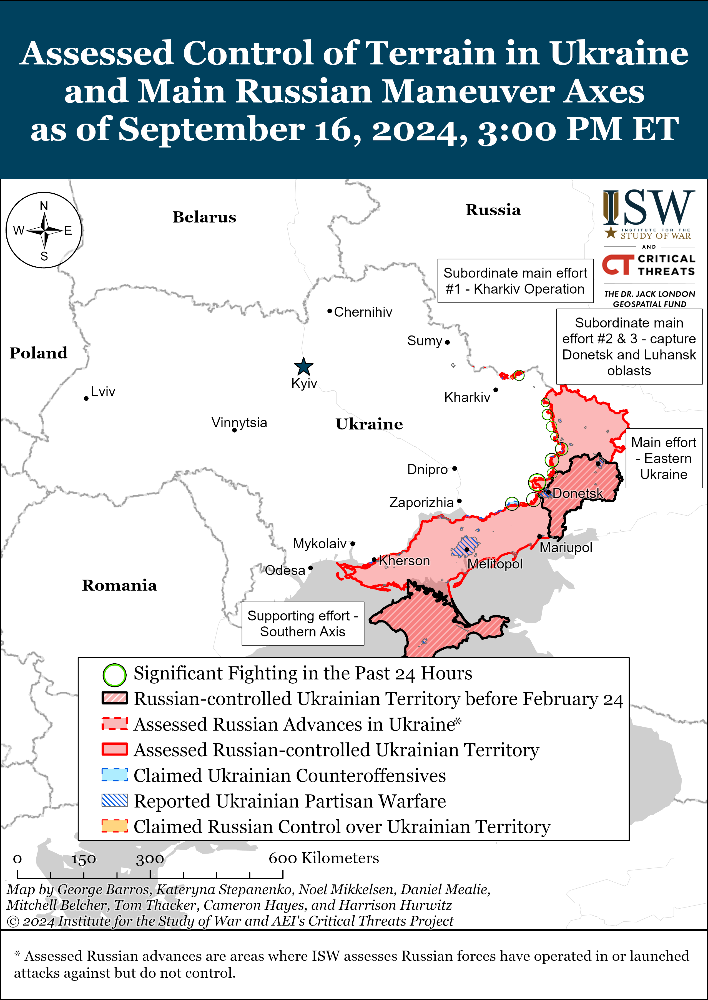](https://understandingwar.org/map/assessed-control-of-terrain-in-ukraine-and-main-russian-maneuver-axes-as-of-september-16-2024-300-pm-et/)**](https://understandingwar.org/wp-content/uploads/2025/05/DraftUkraineCoT20September20162C202024.png)

***We do not report in detail on Russian war crimes because these activities are well-covered in Western media and do not directly affect the military operations we are assessing and forecasting. We will continue to evaluate and report on the effects of these criminal activities on the Ukrainian military and the Ukrainian population and specifically on combat in Ukrainian urban areas. We utterly condemn Russian violations of the laws of armed conflict and the Geneva Conventions and crimes against humanity even though we do not describe them in these reports.***

- Ukrainian Operations in the Russian Federation
- Russian Main Effort – Eastern Ukraine (comprised of three subordinate main efforts)
- Russian Subordinate Main Effort #1 – Push Ukrainian forces back from the international border with Belgorod Oblast and approach to within tube artillery range of Kharkiv City
- Russian Subordinate Main Effort #2 – Capture the remainder of Luhansk Oblast and push westward into eastern Kharkiv Oblast and encircle northern Donetsk Oblast
- Russian Subordinate Main Effort #3 – Capture the entirety of Donetsk Oblast
- Russian Supporting Effort – Southern Axis
- Russian Air, Missile, and Drone Campaign
- Russian Mobilization and Force Generation Efforts
- Russian Technological Adaptations
- Activities in Russian-occupied areas
- Ukrainian Defense Industrial Base Efforts
- Russian Information Operations and Narratives
- Significant Activity in Belarus

**Ukrainian Operations in the Russian Federation**

Ukrainian and Russian forces continued to advance in Glushkovsky Raion, Kursk Oblast amid continued fighting in the area on September 16. Geolocated footage published on September 15 indicates that Ukrainian forces recently advanced south of Veseloye (southwest of Glushkovo) and west and north of Medvezhye (southeast of Veseloye).[36] Additional geolocated footage published on September 16 indicates that Russian forces recently advanced in southeastern Veseloye.[37] Russian sources claimed on September 15 and 16 that Ukrainian forces conducted offensive operations near Veseloye and Medvezhye.[38] Elements of the Russian 56th Airborne (VDV) Regiment (7th VDV Division) and Russian 106th VDV Division are reportedly operating in Glushkovsky Raion.[39]

Ukrainian forces recently advanced in the Ukrainian salient in Kursk Oblast amid continued Ukrainian offensive operations in the area on September 16. Geolocated footage published on September 15 indicates that Ukrainian forces recently advanced northwest of Viktorovka and west of Gordeevka (both south of Korenevo).[40] The Russian Ministry of Defense (MoD) claimed on September 16 that Ukrainian forces attacked south of Korenevo near Byakhovo and Viktorovka; southwest of Korenevo near Krasnooktyabrskoye; southeast of Korenevo near Lyubimovka; and northwest of Sudzha near Malaya Loknya.[41]

Russian forces recently recaptured territory in the Ukrainian salient in Kursk Oblast amid continued Russian counterattacks in the area on September 16. Geolocated footage published on September 16 indicates that Russian forces recently advanced in northern Obukhovka (southeast of Korenevo).[42] The Russian MoD claimed on September 16 that Russian forces seized Uspenovka (south of Korenevo and on the Russian-Ukrainian border) and Borki (southeast of Sudzha), although ISW has not observed confirmation of these claim.[43] Russian milbloggers claimed that Russian forces counterattacked near Lyubimovka.[44] Elements of the Russian 382nd Naval Infantry Battalion, the “Koshmar” detachment, and the “Palacha” detachment of the 810th Naval Infantry Brigade (Black Sea Fleet [BSF], Southern Military District [SMD]); the “Arbat” Special Purpose Battalion; and the “Sarmat” battalion (Donetsk People’s Republic [DNR] “Pyatnashka” international volunteer brigade) are reportedly operating within Borki; elements of the 56th VDV Regiment are reportedly operating near Korenevo; and elements of the 51st VDV Regiment (106th VDV Division) are reportedly still operating near Snagost.[45] The *Financial Times*, citing a senior Ukrainian military intelligence official, reported on September 16 that Russian forces have committed 38,000 personnel to fighting in Kursk Oblast, including assault brigades redeployed from southern Ukraine.[46]

Russian authorities announced mandatory evacuations in Rylsky and Khomutovsky raions, Kursk Oblast (both northwest of Korenevo).[47]

[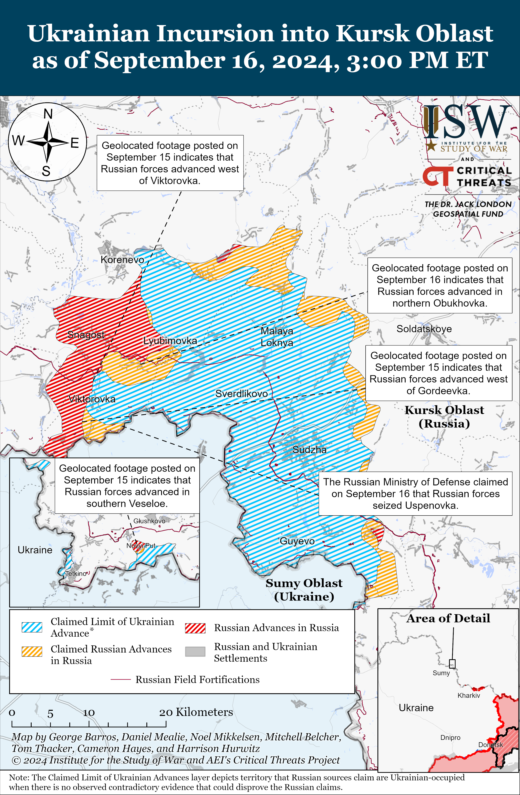](https://understandingwar.org/map/ukrainian-incursion-into-kursk-oblast-as-of-september-16-2024-300-pm-et/)

**Russian Main Effort – Eastern Ukraine**

**Russian Subordinate Main Effort #1 – Kharkiv Oblast (Russian objective: Push Ukrainian forces back from the international border with Belgorod Oblast and approach to within tube artillery range of Kharkiv City)**

Ukrainian forces recently advanced northeast of Kharkiv City amid continued fighting in the area on September 16. Geolocated footage published on September 16 shows Russian forces striking Ukrainian positions in the Vovchansk Aggregate Plant in central Vovchansk (northeast of Kharkiv City), indicating that Ukrainian forces recently regained lost positions within the plant.[48] Russian forces conducted offensive operations northeast of Kharkiv City near Vovchansk on September 15 and 16.[49] Russian milbloggers claimed that Ukrainian forces unsuccessfully counterattacked in Vovchansk and near Lypsti and Hlyboke.[50] Ukrainian Kharkiv Group of Forces Spokesperson Colonel Vitaliy Sarantsev stated on September 16 that Russian forces continue attacks within Vovchansk but that the tempo of Russian activity in other areas in the Kharkiv direction has marginally decreased.[51] Sarantsev stated that Russian forces are not conducting active offensive operations near Lyptsi, Hlyboke, Lukyantsi (all north of Kharkiv City), or Starytsya (northeast of Kharkiv City), but that Russian forces are still present in these areas and are conducting internal rotations and providing logistical support. Sarantsev stated that Russian forces have increased their use of reconnaissance drones by roughly 40 percent in the Kharkiv direction compared to an unspecified time period.[52] An officer in a Ukrainian brigade operating near Vovchansk stated on September 16 that Russian forces are trying to advance with reconnaissance and small infantry groups.[53] The Ukrainian officer stated that Vovchansk is almost completely destroyed so Russian forces are entrenched in nearby forests that offer cover and concealment but that falling leaves will complicate Russian efforts to use forested areas to hide.[54]

[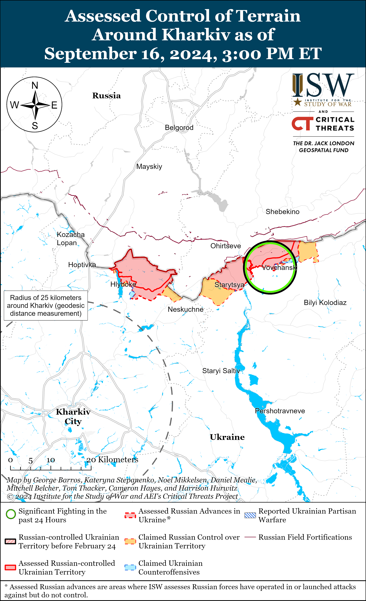](https://understandingwar.org/map/assessed-control-of-terrain-around-kharkiv-as-of-september-16-2024-300-pm-et/)

[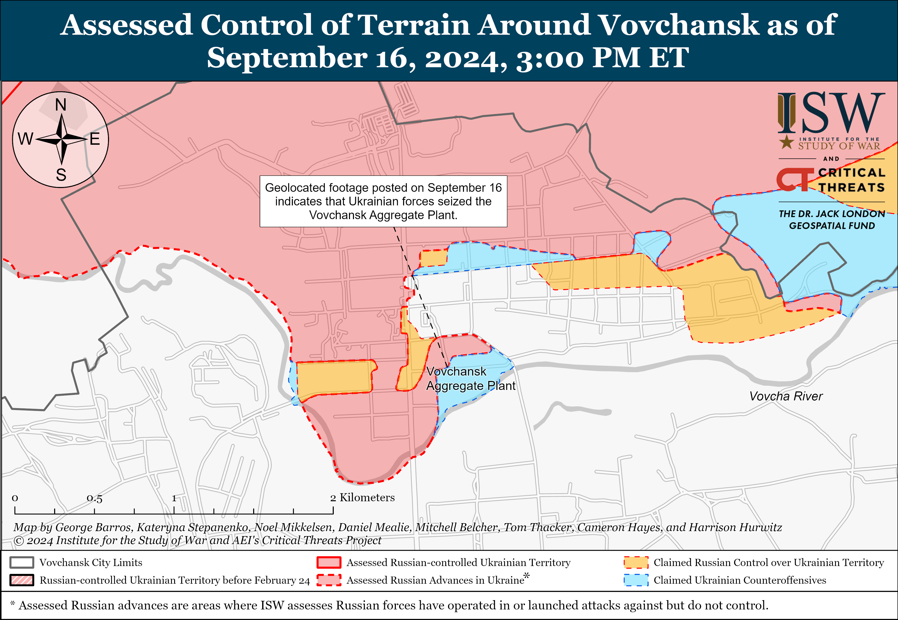](https://understandingwar.org/map/assessed-control-of-terrain-around-vovchansk-as-of-september-16-2024-300-pm-et/)

**Russian Subordinate Main Effort #2 – Luhansk Oblast (Russian objective: Capture the remainder of Luhansk Oblast and push westward into eastern Kharkiv Oblast and northern Donetsk Oblast)**

Russian forces recently advanced northwest of Kreminna amid continued offensive operations on the Kupyansk-Svatove-Kreminna line on September 16. Geolocated footage published on September 15 indicates that Russian forces recently marginally advanced near a windbreak southeast of Makiivka (northwest of Kreminna).[55] Russian milbloggers claimed that Russian forces advanced northwest of Tabaivka and northwest and southwest of Pishchane (both southeast of Kupyansk), but ISW has not observed confirmation of this claim.[56] Ukrainian military observer Kostyantyn Mashovets reported that elements of the Russian 2nd Motorized Rifle Division and 4th Tank Division (both of the 1st Guards Tank Army [GTA], Moscow Military District [MMD]) are pushing in the Pishchane-Kruhlyakivka and Pishchane-Kolisynkivka directions (both southeast of Kupyansk) towards the Oskil River.[57] Mashovets stated that Russian forces are roughly three kilometers from Kruhlyakivka and 2.5 to 2.8 kilometers from Kolisynkvika, which is consistent with the extent of Russian territorial claims in the area.[58] Russian forces continued offensive operations northeast of Kupyansk near Synkivka; east of Kupyansk near Petropavlivka; southeast of Kupyansk near Kolisynkivka, Hlushkivka, and Kruhlyakivka and in the direction of Lozova; southwest of Svatove near Kovalivka, Tverdokhlibove, and Druzhelyubivka; northwest of Kreminna near Hrekivka, Makiivka, Nevske, and Novosadove; and southwest of Kreminna in the Serebryanske forest area on September 15 and 16.[59]

[**[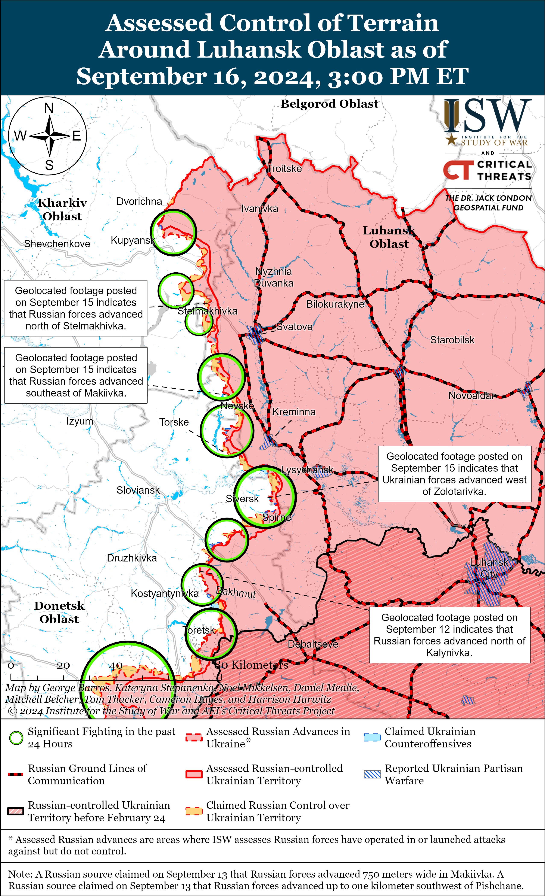](https://understandingwar.org/map/assessed-control-of-terrain-around-luhansk-oblast-as-of-september-16-2024-300-pm-et/)**](https://understandingwar.org/wp-content/uploads/2025/05/Luhansk20Battle20Map20Draft20September20162C202024.png)

**Russian Subordinate Main Effort #3 – Donetsk Oblast (Russian objective: Capture the entirety of Donetsk Oblast, the claimed territory of Russia’s proxies in Donbas)**

Russian forces continued offensive operations northeast of Siversk near Bilohorivka, east of Siversk near Verkhnokamyanske, and southeast of Siversk near Vyimka and Ivano-Darivka on September 15 and 16 but did not advance.[60]

[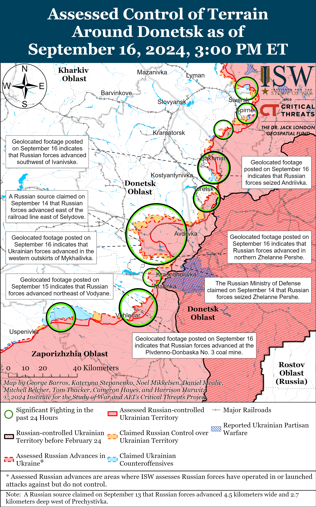](https://understandingwar.org/map/assessed-control-of-terrain-around-donetsk-as-of-september-16-2024-300-pm-et/)

Russian forces recently advanced south of Chasiv Yar amid continued offensive operations in the area on September 16. Geolocated footage published on September 16 indicates that elements of the “Shustry” detachment of Chechen Akhmat Spetsnaz and the 4th Motorized Rifle Brigade (3rd Combined Arms Army [CAA], formerly 2nd Luhansk People’s Republic Army Corps [LNR AC]) recently advanced across the Siverskyi-Donets Donbas Canal south of Chasiv Yar towards Stupochky.[61] Additional geolocated footage published on September 16 indicates that Russian forces recently advanced to northwestern Andriivka (further southeast of Chasiv Yar), confirming Russian claims from May 23 that Russian forces seized the settlement.[62] A prominent Kremlin-affiliated Russian milblogger claimed that Russian forces also advanced north of Chasiv Yar between Hryhorivka and Kalynivka, although ISW has not yet observed confirmation of this claim.[63] The Ukrainian General Staff reported that Russian forces conducted ground attacks near Chasiv Yar itself; northeast of Chasiv Yar near Vasyukivka; southeast of Chasiv Yar near Kurdyumivka; and south of Chasiv Yar near Stupochky.[64] Ukrainian military observer Kostyantyn Mashovets reported that elements of the Russian 98th Airborne (VDV) Division, including all three of its regiments (the 217th, 299th, and 331st VDV regiments), and the 102nd Motorized Rifle Regiment (150th Motorized Rifle Division, 8th CAA, Southern Military District [SMD]) are operating in the Chasiv Yar direction.[65]

[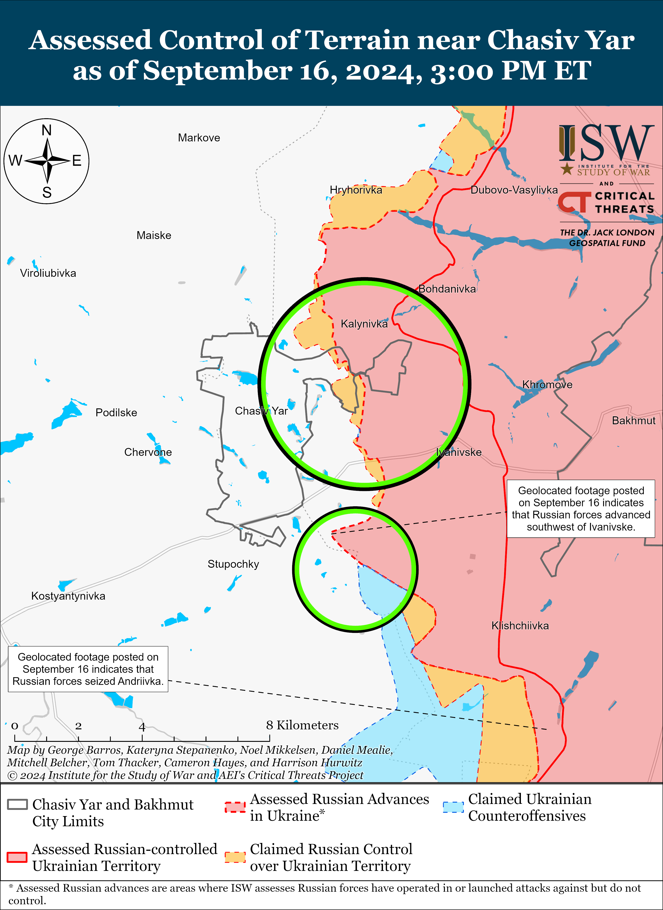](https://understandingwar.org/map/assessed-control-of-terrain-near-chasiv-yar-as-of-september-16-2024-300-pm-et/)

Russian forces continued offensive operations in the Toretsk direction on September 16 but did not make any confirmed advances. Fighting continued on September 15 and 16 within eastern Toretsk, including near the bread factory and correctional colony; northeast of Toretsk near Druzhba and Dachne; southeast of Toretsk near Zalizne; south of Toretsk near Nelipivka; and southwest of Toretsk towards Shcherbynivka.[66] Mashovets noted that Russian forces’ tactical objective is to break through towards Toretsk from positions in Zalizne and Pivnichne (both southeast of Toretsk), where Russian forces have committed elements of the 74th Motorized Rifle Brigade (41st CAA, Central Military District [CMD]) and 132nd Motorized Rifle Brigade (51st CAA, formerly 1st DNR AC).[67]

[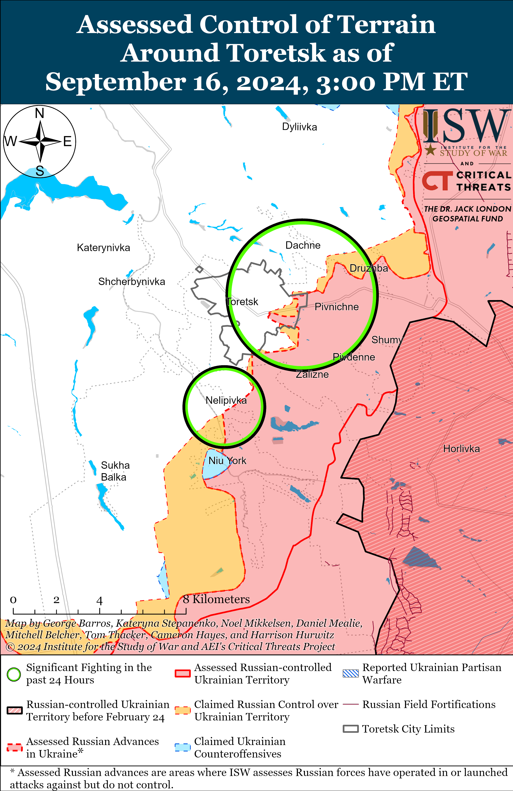](https://understandingwar.org/map/assessed-control-of-terrain-around-toretsk-as-of-september-16-2024-300-pm-et/)

Ukrainian forces recently regained lost positions southeast of Pokrovsk. Geolocated footage published on September 16 indicates that Ukrainian forces recently regained positions in western Mykhailivka (southeast of Pokrovsk).[68] The geolocated footage indicates that Russian forces struck and destroyed a structure in which Ukrainian forces had established positions, but a Russian milblogger claimed that the Ukrainian presence in the building was greatly inhibiting Russian forces’ ability to advance westward from Mykhailivka to the eastern outskirts of Selydove.[69] Russian sources began reporting at least by September 6 that Ukrainian forces successfully counterattacked in Selydove and pushed Russian forces out of the eastern part of the town, and Russian and Ukrainian sources have both reported that the frontline in the Selydove area is now located at the railway line between Mykhailivka and Selydove — consistent with available geolocated evidence.[70] ISW has not yet observed any visual confirmation of a Russian presence within central Selydove.

Russian forces recently advanced southeast of Pokrovsk amid continued offensive operations in the Pokrovsk direction on September 16. Geolocated footage published on September 16 indicates that Russian forces recently advanced to Buriaka Street in northern Zhelanne Pershe (southeast of Pokrovsk).[71] A Russian milblogger claimed that Russian forces also advanced in fields northwest of Zhelanne Pershe and in fields south of Ukrainsk (also southeast of Pokrovsk and northwest of Zhelanne Pershe), although ISW has not yet observed confirmation of these claims.[72] A Russian milblogger claimed that Russian forces marginally advanced west of Mykhailivka near the area where geolocated footage indicates that Ukrainian forces recently regained limited positions.[73] An officer in a Ukrainian brigade operating near Selydove reported that Russian forces in the area have changed their tactics since early September 2024 and are now moving in smaller groups using windbreaks and buildings for cover instead of conducting head-on frontal assaults with larger groups.[74] Ukrainian and Russian sources stated that Russian forces continue efforts to encircle Ukrainsk (southeast of Selydove) from the north and south.[75] The Ukrainian General Staff reported that Russian forces conducted ground attacks east of Pokrovsk near Vozdvyzhenka, Novooleksandrivka, and Zelene Pole and southeast of Pokrovsk near Hrodivka, Novohrodivka, Krasnyi Yar, Marynivka, Mykhailivka, Novotoretske, Zhelanne Pershe, Zhelanne Druhe, Ukrainsk, Selydove, and Tsukuryne.[76] Elements of the Russian 15th Motorized Rifle Brigade (2nd CAA, CMD) are reportedly operating near Selydove.[77]

[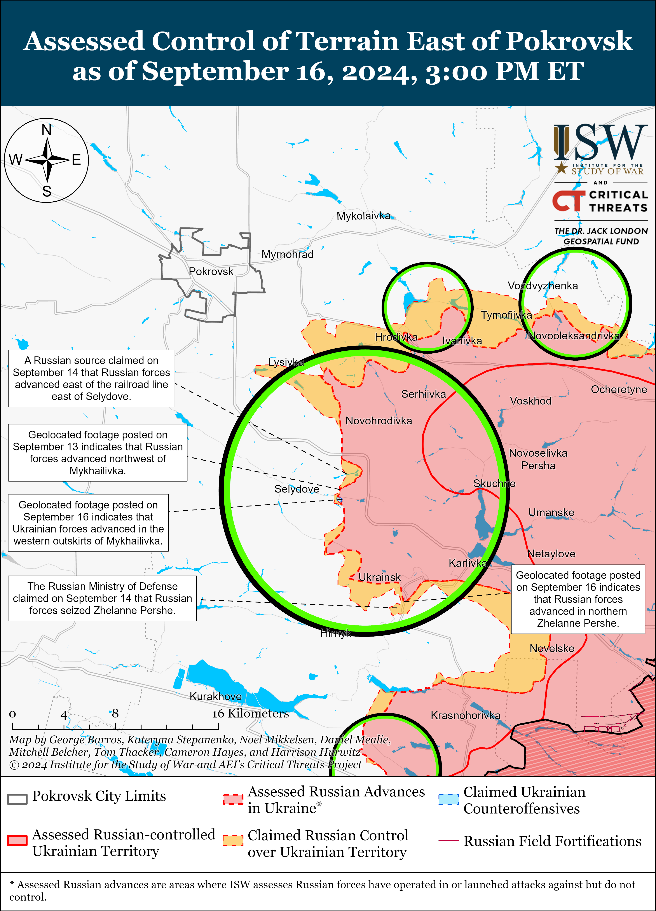](https://understandingwar.org/map/assessed-control-of-terrain-east-of-pokrovsk-as-of-september-16-2024-300-pm-et/)

Russian forces continued offensive operations west of Donetsk City near Heorhiivka on September 15 and 16, but there were no confirmed changes to the frontline.[78]

Russian forces continued to advance southwest of Donetsk City near Vuhledar amid continued offensive operations southwest of Donetsk City on September 16. Geolocated footage published on September 15 shows Russian forces demolishing a tower at the Pivdennodonbaska No. 3 coal mine (west of Vodyane and northeast of Vuhledar), indicating that Russian forces recently advanced in the area.[79] Russian forces conducted offensive operations near Kostyantynivka, Katerynivka, Maksymilyanivka, Vuhledar, and Vodyane on September 15 and 16.[80]

Russian forces conducted offensive operations in the Donetsk-Zaporizhia Oblast border area near Makarivka (south of Velyka Novosilka), Novodarivka (southwest of Velyka Novosilka), and towards Solodke (west of Velyka Novosilka) on September 15 and 16.[81]

**Russian Supporting Effort – Southern Axis (Russian objective: Maintain frontline positions and secure rear areas against Ukrainian strikes)**

Russian forces continued ground attacks in western Zaporizhia Oblast on September 16, but there were no confirmed changes to the frontline. Several Russian milbloggers claimed that Russian forces made minor advances near Kamyanske (about 35km northwest of Robotyne) and have intensified ground attacks on the eastern bank of the Kakhovka Reservoir. [82] ISW has not observed visual confirmation of these claims.

[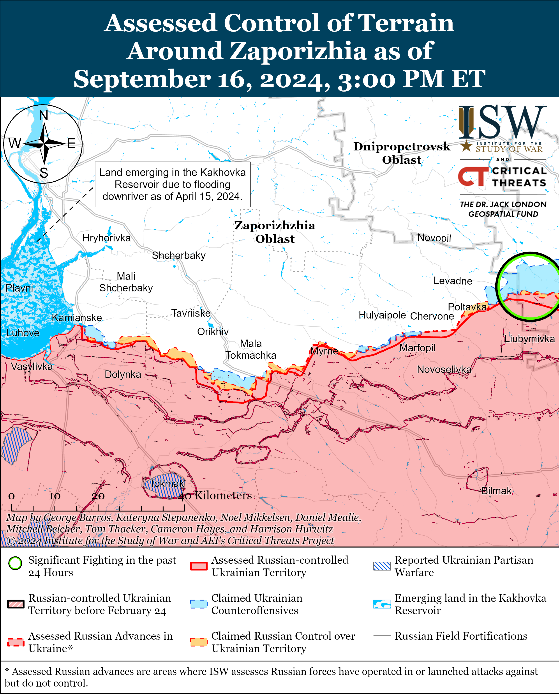](https://understandingwar.org/map/assessed-control-of-terrain-around-zaporizhia-as-of-september-16-2024-300-pm-et/)

The Ukrainian General Staff stated on September 15 and 16 that Russian forces attacked multiple times in the Dnipro direction, likely in reference to the left (east bank) of Kherson Oblast and islands in the Dnipro River delta.[83]

[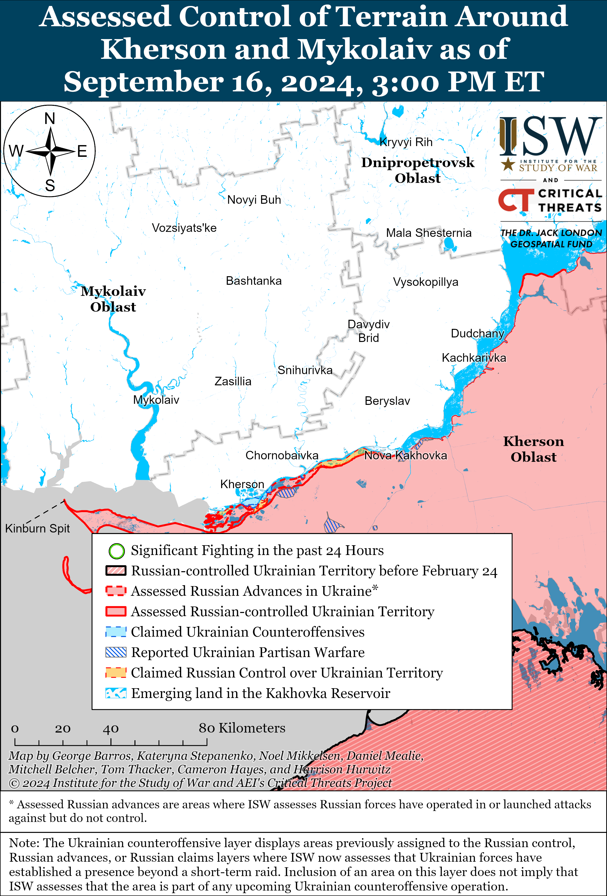](https://understandingwar.org/map/assessed-control-of-terrain-around-kherson-and-mykolaiv-as-of-september-16-2024-300-pm-et/)

Ukrainian Navy Spokesperson Captain Third Rank Dmytro Pletenchuk confirmed on September 16 that the Russian Navy is withdrawing ships from Novorossisysk, Krasnodar Krai, due to the threat of long-range Ukrainian strikes against Russian naval assets at the port in Novorossiysk.[84] Satellite imagery collected on September 14 showed no remaining Russian vessels in the Novorossiysk port, likely after the Russian navy evacuated the vessels southward to Gelendzhik.[85]

Pletenchuk said on September 16 that the September 11 Russian missile strike on the civilian grain carrier took place outside of the grain corridor and stated that Russian forces never attack ships with foreign flags in NATO waters.[86] Pletenchuk added that the corridor is stable and mentioned that most ships in the corridor travel under foreign flags. Ukrainian media reported on September 11 that Russian forces struck the ship as it was leaving Ukrainian territorial waters in the Black Sea, and Pletenchuk’s statement confirms that the strike happened outside of the grain corridor.[87]

**Russian Air, Missile, and Drone Campaign (Russian Objective: Target Ukrainian military and civilian infrastructure in the rear and on the frontline)**

Russian forces conducted a large-scale Shahed-136/131 drone strike against Ukraine overnight on September 15 to 16. The Ukrainian Air Force reported that Russian forces targeted Ukraine with 56 Shaheds and that Ukrainian forces downed 53 of the drones over Kyiv, Vinnytsia, Poltava, Sumy, Zaporizhia, Kirovohrad, Mykolaiv, Dnipropetrovsk, and Cherkasy oblasts while three drones were “lost” in several oblasts.[88] The Ukrainian State Border Guard Service stated on September 16 that Ukrainian forces shot down a Shahed drone in Sumy Oblast.[89] A Russian milblogger claimed on September 16 that Russian forces struck a Ukrainian airbase, drone production workshop, and drone warehouse in Khmelnytskyi Oblast.[90]

Ukrainian President Volodymyr Zelensky stated in an interview with *CNN* on September 13 that Russian forces have used 4,000 glide bombs per month on eastern Ukraine alone, and that glide bomb strikes are responsible for the destruction of 80 percent of energy infrastructure in Ukraine.[91] (It is unclear whether Zelensky meant that Russian glide bombs have damaged 80 percent of Ukraine’s total energy infrastructure or whether glide bombs account for 80 percent of all damage to Ukrainian energy infrastructure.)

**Russian Mobilization and Force Generation Efforts (Russian objective: Expand combat power without conducting general mobilization)**

Russia reportedly continues to coerce migrants to fight in the Russian military. Azerbaijani outlet *APA* reported on September 16 that diplomatic sources stated that Azerbaijan has appealed to the Russian Ministry of Foreign Affairs (MFA) after Russian authorities detained three Azerbaijani citizens in Chechnya for migration issues and forcibly sent them to fight in Ukraine.[92] ISW has observed Russia commit citizens of India, Nepal, Cuba, Serbia, and Central Asian and African countries to combat operations in Ukraine under deceptive premises.[93]

The Kremlin codified a March 2024 law enrolling members of the All-Russian Cossack Society into the Russian military’s mobilization reserve on September 16.[94] Russian President Vladimir Putin signed a decree amending the Russian State Policy in Relation to Russian Cossacks for 2021-2030 to include members of the All-Russian Cossack Society in the mobilization reserve.[95] Putin also transferred control of the Cossack Cadet Corps to the jurisdiction of the Russian Ministry of Defense (MoD) in June 2024, and Russian authorities have created Cossack organization in occupied Ukraine, likely to build out Russian military reserves from populations in occupied Ukraine.[96]

**Russian Technological Adaptations (Russian objective: Introduce technological innovations to optimize systems for use in Ukraine)**

Nothing significant to report.

**Ukrainian Defense Industrial Efforts (Ukrainian objective: Develop its defense industrial base to become more self-sufficient in cooperation with US, European, and international partners)**

*ISW is suspending publishing coverage of Ukrainian defense industrial efforts until further notice.*

**Activities in Russian-occupied areas (Russian objective: Consolidate administrative control of annexed areas; forcibly integrate Ukrainian citizens into Russian sociocultural, economic, military, and governance systems)**

*ISW is not publishing coverage of Russian-occupied areas today.*

**Russian Information Operations and Narratives**

The Russian government continues efforts to discredit Ukraine to deter further Western military support for Ukraine and to justify the lethal military assistance Russia receives from North Korea and Iran. The Russian Foreign Intelligence Service (SVR) press service claimed on September 16 that Ukraine is preparing to conduct a false-flag attack against an unspecified children’s institution in Ukraine to allow the West to accuse Iran and North Korea of supporting Russia’s war effort.[97] Western officials have recently named North Korea, Iran, and the People’s Republic of China (PRC) as enablers of Russia’s war effort by providing shells, drones, and missiles to Russia.[98] Forensic and intelligence investigations have furthermore confirmed that Russia has already used Iranian drones and North Korean missiles at scale in Ukraine.[99] Ukraine already has plenty of proof that Russia is using these systems, undermining the SVR’s attempt at setting up a false flag.

Kazakhstan President Kassym-Jomart Tokayev claimed on September 16 during a meeting with German Chancellor Olaf Scholz that Russia is “militarily invincible” and called for involved actors to consider “all possible” peace initiatives.[100] The Kremlin has been pursuing a strategy of outlasting Western support for Ukraine and informational efforts to discredit Ukraine’s own peace initiative, and Tokayev’s statements at a meeting with a Western leader – regardless of whether or not his intent was to directly amplify known Kremlin narratives — reinforce these efforts.[101] Russian state media also amplified Tokayev’s statement to further an ongoing Russian information operation.[102]

A prominent, Kremlin-affiliated Russian milblogger amplified an accusation calling a Kazakh journalist a “Kazakh Nazi” for advocating for countries to use indigenous orthography for place names as opposed to Russian imperial names on September 16.[103] Several other Russian milbloggers heavily criticized the journalist for celebrating Central Asian states’ use of their own orthography rather than Russian orthography for their writing systems, city names, and country names.[104] The milbloggers claimed that Russian orthography is the only “correct option” for these countries. The Kremlin and its mouthpieces have broadly accused Ukraine of “Nazism” in order to set conditions for and then later attempt to justify its war of aggression in Ukraine, and routinely decry other states’ sovereign efforts to safeguard their language and culture as deliberate “Russophobia.”[105]

**Significant activity in Belarus (Russian efforts to increase its military presence in Belarus and further integrate Belarus into Russian-favorable frameworks and Wagner Group activity in Belarus)**

Nothing significant to report.

**Note: ISW does not receive any classified material from any source, uses only publicly available information, and draws extensively on Russian, Ukrainian, and Western reporting and social media as well as commercially available satellite imagery and other geospatial data as the basis for these reports. References to all sources used are provided in the endnotes of each update.**

---

[1] https://www.youtube.com/watch?v=dycbZxsrhYE&t=19s

[2] https://www.ft.com/content/a22f7d1f-605b-42fc-ac76-98f59b5497a6

[3] https://isw.pub/UkrWar051024

[4] https://understandingwar.org/backgrounder/russian-offensive-campaign-assessment-april-25-2024; https://understandingwar.org/backgrounder/russian-offensive-campaign-assessment-april-11-2024 ; https://understandingwar.org/backgrounder/russian-offensive-campaign-assessment-april-16-2024

[5] https://understandingwar.org/backgrounder/russian-offensive-campaign-assessment-april-10-2024

[6] https://isw.pub/UkrWar091524; https://understandingwar.org/backgrounder/ukraine%E2%80%99s-long-term-path-success-jumpstarting-self-sufficient-defense-industrial-base

[7] https://understandingwar.org/backgrounder/ukraine%E2%80%99s-long-term-path-success-jumpstarting-self-sufficient-defense-industrial-base

[8] https://militaryland dot net/news/155th-brigade-becomes-mechanized-with-leopards/

[9] https://www.youtube.com/watch?v=dycbZxsrhYE; https://understandingwar.org/backgrounder/russian-offensive-campaign-assessment-september-13-2024

[10] https://www.youtube.com/watch?v=dycbZxsrhYE

[11] https://understandingwar.org/backgrounder/interactive-map-hundreds-known-russian-military-objects-are-range-atacms

[12] https://understandingwar.org/backgrounder/russian-offensive-campaign-assessment-june-7-2024; https://understandingwar.org/backgrounder/russian-offensive-campaign-assessment-june-30-2024; https://understandingwar.org/backgrounder/assessing-significance-current-russian-and-ukrainian-operations-course-war

[13] https://www.youtube.com/watch?v=dycbZxsrhYE

[14] https://www.youtube.com/watch?v=dycbZxsrhYE

[15] https://t.me/tass\_agency/272982; https://t.me/tass\_agency/272980 ; https://t.me/mod\_russia/43459

[16] https://understandingwar.org/backgrounder/russian-offensive-campaign-assessment-december-1-2023

[17] https://www.moscowtimes dot ru/2023/12/01/putin-potreboval-otpravit-varmiyu-esche-170-tisyach-rossiyan-a115027

[18] https://understandingwar.org/backgrounder/russian-offensive-campaign-assessment-december-1-2023

[19] https://tass dot ru/armiya-i-opk/16653625; https://tass dot ru/armiya-i-opk/16655079

[20] https://understandingwar.org/backgrounder/russia%E2%80%99s-military-restructuring-and-expansion-hindered-ukraine-war; https://www.chathamhouse.org/2024/07/assessing-russian-plans-military-regeneration/02-manpower-force-structure-and-command-and; https://understandingwar.org/backgrounder/russian-offensive-campaign-assessment-february-26-2024

[21] https://understandingwar.org/wp-content/uploads/2024/09/Russian20Ground20Forces20OOB\_ISW20CTP\_0.pdf; https://understandingwar.org/backgrounder/russian-offensive-campaign-assessment-december-21

[22] https://understandingwar.org/backgrounder/russia%E2%80%99s-military-restructuring-and-expansion-hindered-ukraine-war

[23] https://isw.pub/UkrWar091524

[24] https://www.bloomberg.com/news/articles/2024-09-14/us-uk-on-edge-as-russia-shares-nuclear-secrets-with-iran

[25] https://www.theguardian.com/politics/2024/sep/14/alarm-in-uk-and-us-over-possible-iran-russia-nuclear-deal

[26] https://www.forbes.com/sites/davidaxe/2024/09/10/russia-just-got-200-ballistic-missiles-from-iran-its-an-escalation-of-the-war-in-ukraine-and-it-might-backfire-on-russia/

[27] https://nypost.com/2024/09/15/world-news/us-uk-fears-russia-may-be-helping-irans-nuclear-weapons-program-report/

[28] https://www.isna dot ir/news/1403062213951

[29] https://www.mehrnews dot com/news/6226876

[30] https://www.reuters.com/world/middle-east/irans-president-says-direct-talks-with-us-possible-if-it-abandons-its-hostility-2024-09-16/

[31] https://t.me/tass\_agency/272950; https://t.me/wargonzo/22143; https://t.me/sashakots/48997; https://t.me/motopatriot/27622 ; https://t.me/basurin\_e/14222 ; https://t.me/mobilizationnews/20246 ; https://t.me/severrealii/27235 ; https://t.me/bazabazon/31282 ; https://t.me/boris\_rozhin/137566 ; https://t.me/sashakots/48997 ; https://t.me/astrapress/64407

[32] https://t.me/sotaproject/87190

[33] https://meduza dot io/news/2024/09/16/glavu-voennogo-predstavitelstva-minoborony-rf-zapodozrili-vo-vzyatkah-na-11-millionov-rubley

[34] https://t.me/vysokygovorit/17350

[35] https://www.usnews.com/news/world/articles/2024-09-16/russia-says-two-more-defence-officials-confess-to-taking-bribes; https://understandingwar.org/backgrounder/russian-offensive-campaign-assessment-may-15-2024

[36] https://t.me/kulgavysnayper/18859; https://x.com/moklasen/status/1835375279063343306; https://x.com/moklasen/status/1835375282116776370; https://x.com/moklasen/status/1835375651756335556; https://t.me/creamy\_caprice/6810

[37] https://x.com/bayraktar\_1love/status/1835701612859265380; https://t.me/khornegroup/2721

[38] https://t.me/mod\_russia/43452; https://t.me/RVvoenkor/77037

[39] https://t.me/RVvoenkor/77037

[40] https://t.me/creamy\_caprice/6814; https://www.1tv [dot] ru/news/2024-09-15/486264-s\_emochnaya\_gruppa\_pervogo\_kanala\_pobyvala\_na\_pozitsiyah\_morpehov\_v\_kurskoy\_oblasti

[41] https://t.me/mod\_russia/43452

[42] https://x.com/small10space/status/1835656406482964507; https://x.com/moklasen/status/1835659350179827867; https://t.me/ua\_dshv/3788

[43] https://t.me/mod\_russia/43452

[44] https://t.me/rusich\_army/17141

[45]https://t.me/z\_arhiv/28110; https://t.me/RVvoenkor/77036; https://t.me/RVvoenkor/77081 ; https://t.me/boris\_rozhin/137480

[46] https://www.ft.com/content/a22f7d1f-605b-42fc-ac76-98f59b5497a6

[47] https://t.me/tass\_agency/273001 ; https://t.me/gubernator\_46/8707 ; https://t.me/zovshkiper/4197; https://t.me/motopatriot/27636 ; https://t.me/astrapress/64412 ; https://t.me/vysokygovorit/17353 ; https://t.me/RVvoenkor/77079; https://suspilne dot media/837433-u-kurskij-oblasti-ogolosili-obovazkovu-evakuaciu-iz-se-dvoh-rajoniv/; https://t.me/gubernator\_46/8707 ; https://meduza dot io/news/2024/09/16/v-kurskoy-oblasti-ob-yavili-obyazatelnuyu-evakuatsiyu-prigranichnyh-naselennyh-punktov-rylskogo-i-homutovskogo-rayonov

[48] https://t.me/pograni4nik\_iz\_ada/7409; https://x.com/Bielitzling/status/1835730831693791278; https://x.com/Bielitzling/status/1835730834932002847

[49] https://www.facebook.com/GeneralStaff.ua/posts/pfbid0243oNzBcUE85raBMYCPXzSZ54yvsrGyQn3LbeGFFEpiCsHjJ2Ac9Cn4upaCdJ4ZRcl; https://www.facebook.com/GeneralStaff.ua/posts/pfbid022dEjay2rNw85rjTUYMWMLF5VRj3R1S7bhtHsQPjrrnpvEAP4pAN8HEW29ydRZ73hl ; https://t.me/otukharkiv/1365

[50] https://t.me/wargonzo/22134; https://t.me/DnevnikDesantnika/15482; https://t.me/DnevnikDesantnika/15503

[51] https://youtu.be/j5TqaWCCdUg; https://armyinform.com dot ua/2024/09/16/najgaryachishe-u-vovchansku-na-harkivskomu-napryamku-vorog-podekudy-znyzyv-aktyvnist/

[52] https://armyinform dot com.ua/2024/09/16/posylyly-na-40-vorog-aktyvizuvav-povitryanu-rozvidku-na-harkivshhyni/; https://youtu.be/j5TqaWCCdUg

[53] https://armyinform dot com.ua/2024/09/15/vovchansk-pid-vognevym-kontrolem-okupanty-hovayutsya-v-lisah/; https://t.me/Centr\_omega\_NGU/4233

[54] https://t.me/DnevnikDesantnika/15541

[55] https://t.me/Ci4team\_4mb/124

[56] https://t.me/z\_arhiv/28116; https://t.me/motopatriot/27597

[57] https://t.me/zvizdecmanhustu/2186

[58] https://t.me/zvizdecmanhustu/2186

[59] https://www.facebook.com/GeneralStaff.ua/posts/pfbid026AE2YcJvmQG9CmvZLXbFyvmSYwNunq8NTymj2Lc1uSfKaTFWTRQa1Fobx5f7vABcl; https://www.facebook.com/GeneralStaff.ua/posts/pfbid0243oNzBcUE85raBMYCPXzSZ54yvsrGyQn3LbeGFFEpiCsHjJ2Ac9Cn4upaCdJ4ZRcl; https://www.facebook.com/GeneralStaff.ua/posts/pfbid022dEjay2rNw85rjTUYMWMLF5VRj3R1S7bhtHsQPjrrnpvEAP4pAN8HEW29ydRZ73hl

[60] https://www.facebook.com/GeneralStaff.ua/posts/pfbid026AE2YcJvmQG9CmvZLXbFyvmSYwNunq8NTymj2Lc1uSfKaTFWTRQa1Fobx5f7vABcl; https://www.facebook.com/GeneralStaff.ua/posts/pfbid0243oNzBcUE85raBMYCPXzSZ54yvsrGyQn3LbeGFFEpiCsHjJ2Ac9Cn4upaCdJ4ZRcl; https://www.facebook.com/GeneralStaff.ua/posts/pfbid022dEjay2rNw85rjTUYMWMLF5VRj3R1S7bhtHsQPjrrnpvEAP4pAN8HEW29ydRZ73hl

 

[61] https://t.me/creamy\_caprice/6819; https://t.me/RKadyrov\_95/5096

[62] https://t.me/WarArchive\_ua/20123; https://t.me/blak93/4814

[63] https://t.me/rybar/63547

[64] https://www.facebook.com/GeneralStaff.ua/posts/pfbid0243oNzBcUE85raBMYCPXzSZ54yvsrGyQn3LbeGFFEpiCsHjJ2Ac9Cn4upaCdJ4ZRcl; https://www.facebook.com/GeneralStaff.ua/posts/pfbid026AE2YcJvmQG9CmvZLXbFyvmSYwNunq8NTymj2Lc1uSfKaTFWTRQa1Fobx5f7vABcl

[65] https://t.me/zvizdecmanhustu/2186

[66] https://www.facebook.com/GeneralStaff.ua/posts/pfbid026AE2YcJvmQG9CmvZLXbFyvmSYwNunq8NTymj2Lc1uSfKaTFWTRQa1Fobx5f7vABcl; https://www.facebook.com/GeneralStaff.ua/posts/pfbid0243oNzBcUE85raBMYCPXzSZ54yvsrGyQn3LbeGFFEpiCsHjJ2Ac9Cn4upaCdJ4ZRcl; https://www.facebook.com/GeneralStaff.ua/posts/pfbid022dEjay2rNw85rjTUYMWMLF5VRj3R1S7bhtHsQPjrrnpvEAP4pAN8HEW29ydRZ73hl

[67] https://t.me/zvizdecmanhustu/2186

[68] https://x.com/foosint/status/1835611960118812710; https://t.me/blackhussars/2680

[69] https://t.me/motopatriot/27605; https://x.com/foosint/status/1835611960118812710; https://t.me/blackhussars/2680

[70] https://t.me/zvizdecmanhustu/2177; https://t.me/motopatriot/27267; https://t.me/motopatriot/27287 https://t.me/voenkorKotenok/58906; https://t.me/notes\_veterans/19351 https://t.me/dva\_majors/51865; https://t.me/boris\_rozhin/136389

[71] https://t.me/creamy\_caprice/6821; https://www.facebook.com/59ompbr/videos/1086911653112277/?mibextid=rS40aB7S9Ucbxw6v

[72] https://t.me/z\_arhiv/28118

[73] https://t.me/motopatriot/27605

[74] https://suspilne dot media/836927-udar-po-harkovu-i-anonsovanij-paket-dopomogi-vid-ssa-936-den-vijni-onlajn/?anchor=live\_1726479483&utm\_source=copylink&utm\_medium=ps; https://www.youtube.com/watch?v=aDXWlQ2K0dM

[75] https://suspilne dot media/836927-udar-po-harkovu-i-anonsovanij-paket-dopomogi-vid-ssa-936-den-vijni-onlajn/?anchor=live\_1726479483&utm\_source=copylink&utm\_medium=ps; https://www.youtube.com/watch?v=aDXWlQ2K0dM; https://t.me/rybar/63544; https://t.me/z\_arhiv/28118; https://t.me/zvizdecmanhustu/2186; https://t.me/zvizdecmanhustu/2187; https://www.facebook.com/pashtetof/posts/pfbid02aDM3WvTzi1S4N8KQRzUfXJthK1Wc1sitjE3NVZpaYQicmJvb3L1d4nMLm9bhrPqpl

[76] https://www.facebook.com/GeneralStaff.ua/posts/pfbid026AE2YcJvmQG9CmvZLXbFyvmSYwNunq8NTymj2Lc1uSfKaTFWTRQa1Fobx5f7vABcl; https://www.facebook.com/GeneralStaff.ua/posts/pfbid0243oNzBcUE85raBMYCPXzSZ54yvsrGyQn3LbeGFFEpiCsHjJ2Ac9Cn4upaCdJ4ZRcl; https://www.facebook.com/GeneralStaff.ua/posts/pfbid022dEjay2rNw85rjTUYMWMLF5VRj3R1S7bhtHsQPjrrnpvEAP4pAN8HEW29ydRZ73hl

[77] https://x.com/foosint/status/1835611960118812710; https://t.me/blackhussars/2680

[78] https://www.facebook.com/GeneralStaff.ua/posts/pfbid026AE2YcJvmQG9CmvZLXbFyvmSYwNunq8NTymj2Lc1uSfKaTFWTRQa1Fobx5f7vABcl; https://www.facebook.com/GeneralStaff.ua/posts/pfbid0243oNzBcUE85raBMYCPXzSZ54yvsrGyQn3LbeGFFEpiCsHjJ2Ac9Cn4upaCdJ4ZRcl ; https://www.facebook.com/GeneralStaff.ua/posts/pfbid022dEjay2rNw85rjTUYMWMLF5VRj3R1S7bhtHsQPjrrnpvEAP4pAN8HEW29ydRZ73hl

[79] https://t.me/RVvoenkor/77043; https://x.com/AudaxonX/status/1835406945164894378; https://t.me/DnevnikDesantnika/15531 ; https://t.me/motopatriot/27594; https://t.me/boris\_rozhin/137498

[80] https://www.facebook.com/GeneralStaff.ua/posts/pfbid026AE2YcJvmQG9CmvZLXbFyvmSYwNunq8NTymj2Lc1uSfKaTFWTRQa1Fobx5f7vABcl; https://www.facebook.com/GeneralStaff.ua/posts/pfbid0243oNzBcUE85raBMYCPXzSZ54yvsrGyQn3LbeGFFEpiCsHjJ2Ac9Cn4upaCdJ4ZRcl; https://www.facebook.com/GeneralStaff.ua/posts/pfbid022dEjay2rNw85rjTUYMWMLF5VRj3R1S7bhtHsQPjrrnpvEAP4pAN8HEW29ydRZ73hl; https://t.me/wargonzo/22134; https://t.me/wargonzo/22134

[81] https://www.facebook.com/GeneralStaff.ua/posts/pfbid022dEjay2rNw85rjTUYMWMLF5VRj3R1S7bhtHsQPjrrnpvEAP4pAN8HEW29ydRZ73hl; https://www.facebook.com/GeneralStaff.ua/posts/pfbid0243oNzBcUE85raBMYCPXzSZ54yvsrGyQn3LbeGFFEpiCsHjJ2Ac9Cn4upaCdJ4ZRcl

[82] https://t.me/wargonzo/22134; https://t.me/DnevnikDesantnika/15504; https://t.me/voenkorKotenok/59035

[83] https://www.facebook.com/GeneralStaff.ua/posts/pfbid026AE2YcJvmQG9CmvZLXbFyvmSYwNunq8NTymj2Lc1uSfKaTFWTRQa1Fobx5f7vABcl; https://www.facebook.com/GeneralStaff.ua/posts/pfbid0243oNzBcUE85raBMYCPXzSZ54yvsrGyQn3LbeGFFEpiCsHjJ2Ac9Cn4upaCdJ4ZRcl; https://www.facebook.com/GeneralStaff.ua/posts/pfbid022dEjay2rNw85rjTUYMWMLF5VRj3R1S7bhtHsQPjrrnpvEAP4pAN8HEW29ydRZ73hl

[84] https://armyinform.com dot ua/2024/09/16/yz-ognya-da-v-pol%d1%8bmya-u-chornomu-mori-rosiyany-zrobyly-nepryyemnyj-vybir/; https://youtu.be/j5TqaWCCdUg; https://suspilne dot media/crimea/837265-rosijski-kalibri-v-cornomu-mori-pletencuk-rozpoviv-pro-metu-okupantiv/

[85] https://understandingwar.org/backgrounder/russian-offensive-campaign-assessment-september-15-2024 ; https://x.com/CovertShores/status/1834958139625529559; https://x.com/MT\_Anderson/status/1834965127751159823

[86] https://armyinform dot com.ua/2024/09/16/v-zsu-poyasnyly-chomu-rosiyany-ne-navazhuyutsya-atakuvaty-sudna-u-zernovomu-korydori/; https://youtu.be/j5TqaWCCdUg

[87] https://t.me/V\_Zelenskiy\_official/11617; https://armyinform dot com.ua/2024/09/12/pshenyczya-nikoly-ne-mayut-buty-mishennyu-dlya-raket-volodymyr-zelenskyj-pro-rosijskyj-udar-po-czyvilnomu-sudnu/ ; https://x.com/666\_mancer/status/1834219134457942241

[88] https://t.me/kpszsu/19456

[89] https://t.me/DPSUkr/22025; https://armyinform.com dot ua/2024/09/16/na-sumshhyni-zbyly-shahed-zi-strileczkoyi-zbroyi/ ; https://suspilne dot media/836927-udar-po-harkovu-i-anonsovanij-paket-dopomogi-vid-ssa-936-den-vijni-onlajn/ https://x.com/666\_mancer/status/1835654756708102320

[90] https://t.me/RVvoenkor/77074

[91] https://www.youtube.com/watch?v=dycbZxsrhYE

[92] https://en.apa dot az/foreign-policy/azerbaijan-appeals-to-russian-foreign-ministry-regarding-azerbaijanis-detained-in-chechnya-and-allegedly-forcibly-sent-to-ukraine-war-zone-448300

[93] https://understandingwar.org/backgrounder/russian-offensive-campaign-assessment-september-13-2024 ; https://understandingwar.org/backgrounder/russian-offensive-campaign-assessment-october-3-2023; https://understandingwar.org/backgrounder/russian-offensive-campaign-assessment-february-11-2024; https://understandingwar.org/backgrounder/russian-offensive-campaign-assessment-december-5-2023; https://understandingwar.org/backgrounder/russian-offensive-campaign-assessment-january-9-2024; https://understandingwar.org/backgrounder/russian-offensive-campaign-assessment-may-22-2024 ; https://understandingwar.org/backgrounder/russian-offensive-campaign-assessment-july-26

[94] https://understandingwar.org/backgrounder/russian-offensive-campaign-assessment-march-24-2024; http://publication.pravo dot gov.ru/document/0001202409160007?index=1

[95] http://publication.pravo dot gov.ru/document/0001202409160007?index=1; https://t.me/sotaproject/87198

[96] https://understandingwar.org/backgrounder/russian-offensive-campaign-assessment-june-23-2024; https://understandingwar.org/backgrounder/russian-offensive-campaign-assessment-july-19-2024

[97] https://tass dot ru/politika/21872851

[98] https://www.theguardian.com/world/article/2024/jul/11/nato-summit-russia-ukraine-war-china-enabler; https://www.cnbc.com/2024/07/11/nato-condemns-china-as-a-decisive-enabler-of-russias-war-in-ukraine.html

[99] https://storymaps.arcgis.com/stories/15ae6ca767bc46a1b536ac7e2d962b66/print; https://www.dia.mil/Portals/110/Documents/News/Military\_Power\_Publications/UAV\_Book.pdf

[100] https://meduza dot io/news/2024/09/16/prezident-kazahstana-na-vstreche-s-kantslerom-germanii-zayavil-chto-v-voennom-otnoshenii-rossiya-nepobedima-no-shans-na-mir-esche-est; https://suspilne dot media/837295-prezident-kazahstanu-tokaev-vvazae-so-rosia-neperemozna-u-vijskovomu-plani/; https://newsukraine dot rbc.ua/news/tokayev-calls-russia-invincible-1726496837.html

[101] https://understandingwar.org/backgrounder/russian-offensive-campaign-assessment-june-16-2024; https://understandingwar.org/backgrounder/how-delays-western-aid-gave-russia-initiative-ukrainian-counteroffensive-kharkiv: https://understandingwar.org/backgrounder/closing-skies-liberating-ukraine-helsinki-commission-may-16-2024; https://understandingwar.org/backgrounder/russian-offensive-campaign-assessment-april-29-2024; https://understandingwar.org/backgrounder/russian-offensive-campaign-assessment-august-27-2024

[102] https://ria dot ru/20240916/tokaev-1972948483.html; https://www.rbc dot ru/politics/16/09/2024/66e807e19a7947f851742d1b; https://lenta dot ru/news/2024/09/17/tokaev-nazval-rossiyu-nepobedimoy-v-voennom-plane/; https://tass dot ru/mezhdunarodnaya-panorama/21875909

[103] https://t.me/MedvedevVesti/18623;

[104] https://t.me/rybar/63542; https://t.me/grishkafilippov/22122; https://t.me/MedvedevVesti/18623; https://t.me/rybar/63543; https://t.me/senatorDzhabarov/3396

[105] https://understandingwar.org/backgrounder/russian-offensive-campaign-assessment-january-27-2024; https://understandingwar.org/backgrounder/russian-offensive-campaign-assessment-january-18-2024: https://understandingwar.org/backgrounder/russian-offensive-campaign-assessment-may-9-2024; https://understandingwar.org/backgrounder/russian-offensive-campaign-assessment-february-2-2024
