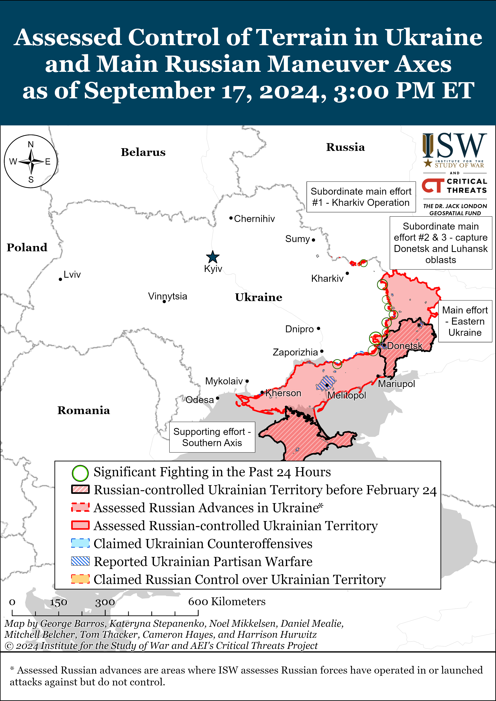
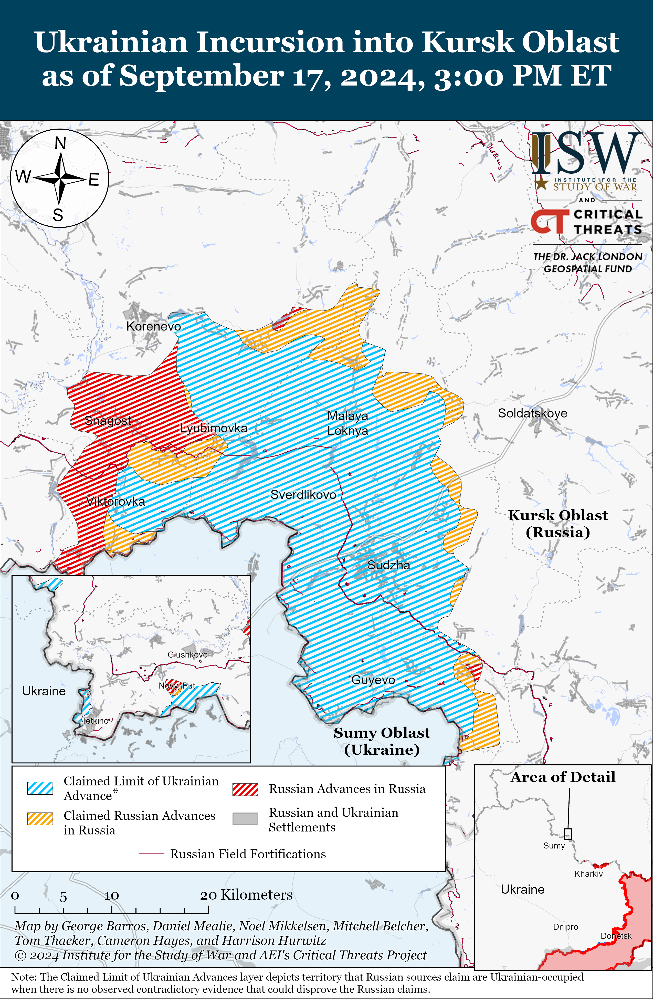
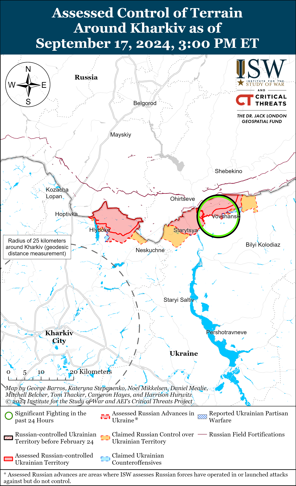
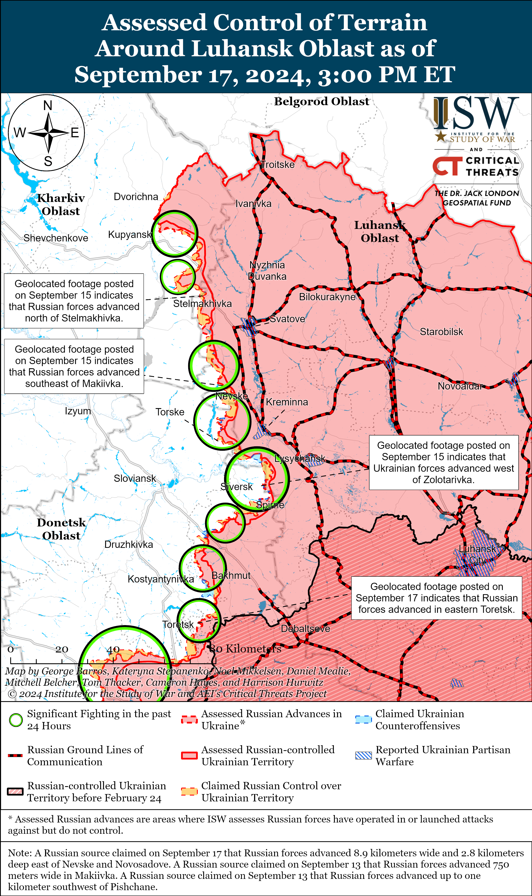
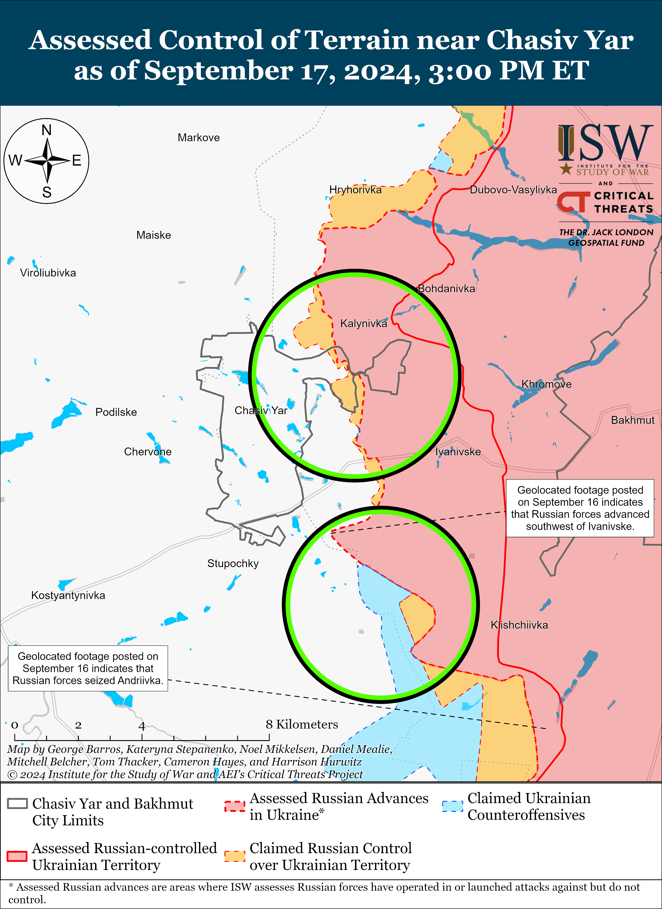
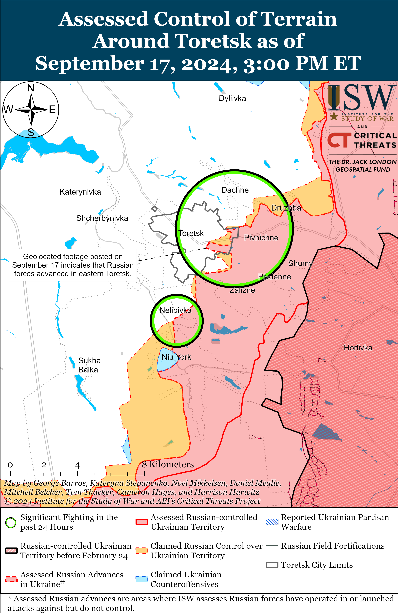
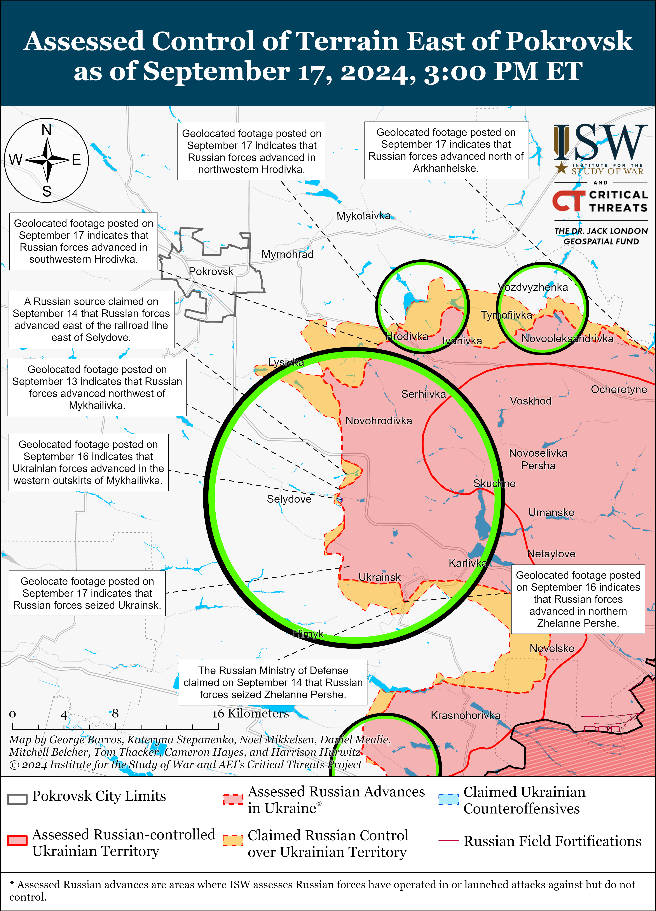
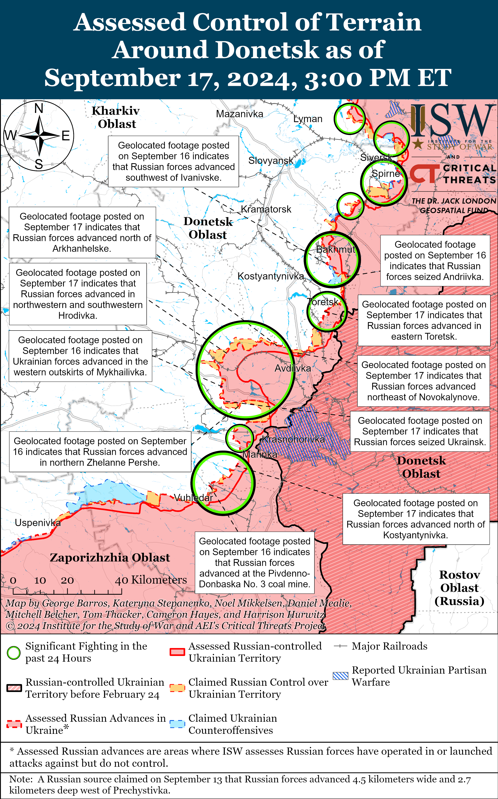
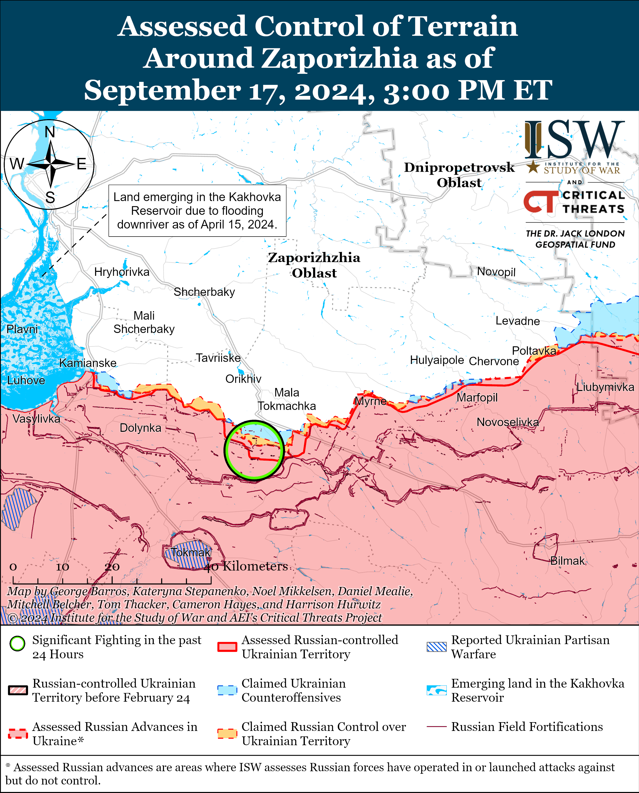
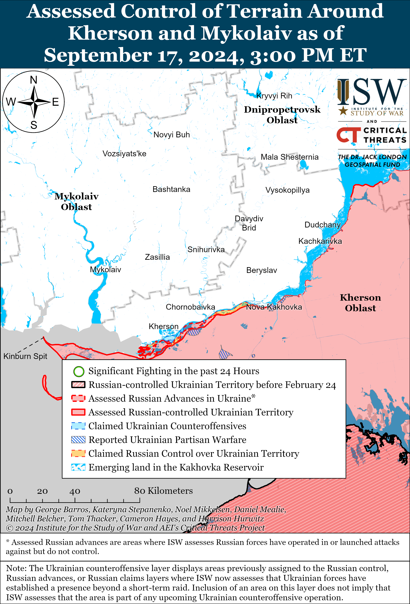

# Russian Offensive Campaign Assessment, September 17, 2024

**Angelica Evans, Christina Harward, Karolina Hird, Grace Mappes, Haley Zehrung, and George Barros**

**September 17, 2024, 6:35pm ET**

**Click**[**here**](https://storymaps.arcgis.com/stories/36a7f6a6f5a9448496de641cf64bd375)**to see ISW’s interactive map of the Russian invasion of Ukraine. This map is updated daily alongside the static maps present in this report.**

**Click**[**here**](https://storymaps.arcgis.com/stories/83a2f24901c941d581c0c523ecd2619b)**to see ISW’s interactive map of Ukraine’s offensive in Kursk Oblast.**

**Click**[**here**](https://understandingwar.maps.arcgis.com/apps/instant/3dviewer/index.html?appid=1602762dbcde419bb957dea358449580)**to see ISW’s 3D control of terrain topographic map of Ukraine. Use of a computer (not a mobile device) is strongly recommended for using this data-heavy tool.**

**Click**[**here**](https://storymaps.arcgis.com/stories/733fe90805894bfc8562d90b106aa895)**to access ISW’s archive of interactive time-lapse maps of the Russian invasion of Ukraine. These maps complement the static control-of-terrain map that ISW produces daily by showing a dynamic frontline. ISW will update this time-lapse map archive monthly.**

**Note: The data cut-off for this product was 12:30 pm ET on September 17. ISW will cover subsequent reports in the September 18 Russian Offensive Campaign Assessment.**

**The Ukrainian Prosecutor General’s Office opened an investigation into another case of apparent Russian abuse and execution of a Ukrainian prisoner of war (POW).**Graphic social media images circulated on September 16 shows the body of a Ukrainian servicemember whom Russian forces evidently executed with a sword bearing the inscription “for Kursk.”[1] X (formerly Twitter) users geolocated the images to Novohrodivka, Donetsk Oblast.[2] Russian Defense Minister Andrei Belousov recently confirmed that elements of the Russian 30th Motorized Rifle Brigade (2nd Combined Arms Army, Central Military District) and 1435th Motorized Rifle Regiment (likely a mobilized regiment) seized Novohrodivka in early September — potentially implicating members and command of these two formations with the execution.[3] The footage shows the Ukrainian servicemember clearly disarmed, wearing no protective equipment, and with remnants of duct tape around his wrists, suggesting that Russian forces captured, disarmed, and forcibly detained the servicemember.[4] The Geneva Convention on POWs prohibits the “mutilation, cruel treatment, and torture” of POWs, as well as the execution of POWs or persons who are clearly *hors de combat*.[5] The apparent circumstances of this particular execution, particularly the use of a sword with an inscription that implies that Russian forces executed the POW in some sort of retaliation for Ukraine’s Kursk operation, likely fall firmly into the category of mutilation, cruel treatment, and torture of an unarmed POW. This most recent report of Russia’s abuse of Ukrainian POWs is consistent with the United Nations Human Rights Monitoring Mission in Ukraine (HRMMU)’s March 2024 report, which documented and verified widespread abuse and executions of Ukrainian POWs at the hands of Russian forces.[6] The Ukrainian Prosecutor General’s Office announced that it started an investigation into violation of the laws and customs of war and intentional murder in regard to the apparent execution of the servicemember.[7] Ukrainian law enforcement is also currently investigating 84 cases of potential Russian execution of Ukrainian POWs.[8] ISW has reported on apparent Russian executions of Ukrainian POWs in August 2024, July 2024, June 2024, May 2024, and several different incidents in February 2024 alone and has routinely assessed that Russian commanders are either complacent or enabling their subordinates to engage in such atrocities in clear violation of international law.[9]

**Leaked documents outlining large-scale Kremlin information operation campaigns targeting Ukraine and the West continue to demonstrate the Kremlin’s commitment to leveraging its global information instruments to advance Moscow’s interests using social media.**Meta, which owns Facebook, Instagram, and WhatsApp, banned Russian state media outlet *Russia Today*(RT) and “other related entities” on September 17 for “foreign interference activity.”[10] The US State Department announced sanctions on September 13 against entities and individuals connected with *RT*, which the State Department accused of engaging in information operations, covert influence, and military procurement efforts for the Kremlin by targeting states in Europe, Africa, and North and South America.[11] *Radio Free Europe/Radio Liberty’s*(RFE/RL) “Schemes” investigative project analyzed thousands of leaked documents that German and Estonian outlets previously received that outline the work of the Russian “Social Design Agency” (SDA) company, which the US Department of Justice (DoJ) recently announced as part of the Kremlin’s “Doppelganger” complex malign influence operations.[12] The “Schemes” project reported that the SDA has distributed fake official documents, including fabricated orders from the Ukrainian Ministry of Defense and Ukrainian Commander-in-Chief General Oleksandr Syrskyi, as part of its self-described efforts to “discredit the military-political leadership of Ukraine and demoralize the [Ukrainian] Armed Forces.” The SDA reportedly created fake documents allegedly from European government entities, fake news stories allegedly from European outlets, and anti-Ukrainian memes that spread widely on social media. ISW continues to assess that Russia is continuing its efforts to develop capabilities to use information operations on social media platforms to trigger kinetic activity and conduct election interference, destabilization measures, and sanctions evasion schemes.[13]

**Russian Security Council Secretary Sergei Shoigu arrived in Iran for an unannounced visit on September 17 following recent visits to Syria and North Korea amid ongoing Russian efforts to secure military cooperation and support from non-Western allies.**Shoigu met with Iranian Supreme National Security Council Secretary Ali Akbar Ahmadian and Iranian President Masoud Pezeshkian during a previously unannounced visit to Tehran on September 17 and conveyed an unspecified message from Russian President Vladimir Putin.[14] The Islamic Republic of Iran Broadcasting (IRIB) reported that Shoigu and Ahmadian discussed upcoming bilateral agreements and emphasized that Iran continues to support Iran’s official policy regarding corridors and communication routes with Azerbaijan.[15] Pezeshkian told Shoigu that the Iranian government will work to increase cooperation and deepen bilateral relations between the two countries to reduce the impact of Western sanctions.[16] Shoigu also met with Syrian President Bashar al-Assad in Damascus, Syria on September 16 and discussed strengthening bilateral relations and regional and international security issues.[17] Shoigu previously recently visited Pyongyang, North Korea on September 13 and met with North Korean President Kim Jong Un for unspecified bilateral discussions.[18] Shoigu’s international visits are coming against the backdrop of Iran’s recent delivery of over 200 Fateh-360 short-range ballistic missiles (SRBMs) to Russia, ongoing North Korean military support for the Russian war in Ukraine, and Ukrainian reports that Russia is hiring Syrian mercenaries to fight in Ukraine.[19] Russia’s deepening engagement with the People’s Republic of China (PRC), North Korea, and Iran is part of a wider Kremlin effort to establish a coalition of friendly states which can bolster Russia’s defense industrial base (DIB) and secure strategic economic cooperation to support its war in Ukraine.[20]

**Russian Foreign Minister Sergei Lavrov met with North Korean Foreign Minister Choe Son-hui in Moscow on September 17.[21]**Lavrov and Choe discussed further developing Russian-North Korean bilateral relations in unspecified manners, and the Russian Ministry of Foreign Affairs (MFA) noted that Choe will attend the BRICS Women’s Forum on the sidelines of the Eurasian Women’s Forum in St. Petersburg on September 18-20.[22] Lavrov has recently fostered increased dialogue and cooperation with Russia’s non-Western partners through various meetings on the ministerial level, including with Saudi Minister of Hajj and Umrah Tawfiq bin Fawzan Al-Rabieh on September 11, a BRICS foreign ministers meeting on September 12, and a meeting with Egyptian Foreign Minister Badr Abdelatty on September 16.[23]

**Key Takeaways:**

- **The Ukrainian Prosecutor General’s Office opened an investigation into another case of apparent Russian abuse and execution of a Ukrainian prisoner of war (POW).**
- **Leaked documents outlining large-scale Kremlin information operation campaigns targeting Ukraine and the West continue to demonstrate the Kremlin’s commitment to leveraging its global information instruments to advance Moscow’s interests using social media.**
- **Russian Security Council Secretary Sergei Shoigu arrived in Iran for an unannounced visit following recent visits to Syria and North Korea amid ongoing Russian efforts to secure military cooperation and support from non-Western allies.**
- **Russian Foreign Minister Sergei Lavrov met with North Korean Foreign Minister Choe Son-hui in Moscow.**
- **Russian forces recently advanced near Toretsk and Pokrovsk and southwest of Donetsk City.**
- **Ukraine’s Main Military Intelligence Directorate (GUR) reported on September 17 that Russia continues to recruit citizens from Syria to fight in Ukraine.**

****

***We do not report in detail on Russian war crimes because these activities are well-covered in Western media and do not directly affect the military operations we are assessing and forecasting. We will continue to evaluate and report on the effects of these criminal activities on the Ukrainian military and the Ukrainian population and specifically on combat in Ukrainian urban areas. We utterly condemn Russian violations of the laws of armed conflict and the Geneva Conventions and crimes against humanity even though we do not describe them in these reports.***

- Ukrainian Operations in the Russian Federation
- Russian Main Effort – Eastern Ukraine (comprised of three subordinate main efforts)
- Russian Subordinate Main Effort #1 – Push Ukrainian forces back from the international border with Belgorod Oblast and approach to within tube artillery range of Kharkiv City
- Russian Subordinate Main Effort #2 – Capture the remainder of Luhansk Oblast and push westward into eastern Kharkiv Oblast and encircle northern Donetsk Oblast
- Russian Subordinate Main Effort #3 – Capture the entirety of Donetsk Oblast
- Russian Supporting Effort – Southern Axis
- Russian Air, Missile, and Drone Campaign
- Russian Mobilization and Force Generation Efforts
- Russian Technological Adaptations
- Activities in Russian-occupied areas
- Ukrainian Defense Industrial Base Efforts
- Russian Information Operations and Narratives
- Significant Activity in Belarus

**Ukrainian Operations in the Russian Federation**

Ukrainian forces continued ground attacks in Glushkovsky Raion west of the current Kursk Oblast salient on September 17 but did not make any confirmed advances. The Russian MoD claimed that Russian forces repelled Ukrainian attacks near Veseloye (southwest of Glushkovo) and Medvezhye (southeast of Veseloye).[24] Several Russian milbloggers claimed that Ukrainian troops are trying to encircle Veseloye by attacking along its western and eastern flanks.[25]

Fighting also continued along the Ukrainian salient in Kursk Oblast on September 17, but neither Ukrainian nor Russian forces made confirmed advances. A prominent Kremlin-affiliated milblogger claimed that Russian forces are advancing in Korenevsky Raion (in the western part of the salient) but noted that there is not yet visual evidence to confirm the Russian MoD’s claim that Russian forces seized Uspenovka and Darino (both southeast of Koreveno).[26] Footage published on September 16 notably shows Ukrainian forces repelling a company-sized Russian attack west of Lyubimovka (also southeast of Koreveno), where Russian sources claimed that fighting continued on September 16 and 17.[27] A Ukrainian source claimed that Ukrainian forces have encircled Russian forces in Kremyanoye (east of Korenevo), although ISW has not observed visual evidence of Ukrainian forces operating in the area north of Kremyanoye.[28] Russian sources credited elements of the 155th Naval Infantry Brigade (Pacific Fleet, Eastern Military District [EMD]) and 51st Airborne (VDV) Regiment (106th VDV Division) with the recent seizure of Snagost and Obukhovka (south and southeast of Koreveno, respectively); and elements of the 810th Naval Infantry Brigade (Black Sea Fleet, [BSF] Southern Military District [SMD]), “Sarmat” detachment (Donetsk People’s Republic [DNR] “Pyatnashka” international volunteer brigade), and “Dikaya Division of Donbass” (Russian Volunteer Corps) for the recent seizure of Borki (southeast of Sudzha).[29]

**Russian Main Effort – Eastern Ukraine**

**Russian Subordinate Main Effort #1 – Kharkiv Oblast (Russian objective: Push Ukrainian forces back from the international border with Belgorod Oblast and approach to within tube artillery range of Kharkiv City)**

Russian forces continued ground attacks north of Kharkiv City near Hlyboke and northeast of Kharkiv City in Vovchansk on September 16 and 17.[30] Russian milbloggers claimed on September 16 and 17 that Ukrainian forces counterattacked near Hlyboke and within Vovchansk near the “flour mill,” possibly referring to a steam mill immediately north of the Vovchansk Aggregate Plant in central Vovchansk.[31] Taken in combination with a lack of recent Russian claims of Russian control of the Aggregate Plant and recent geolocated footage of Russian forces shelling infantry positions at the plant, these claims of counterattacks support ISW’s assessment that Ukrainian forces recently advanced in the area of the plant.[32] Ukrainian Kharkiv Group of Forces Spokesperson Colonel Vitaliy Sarantsev reported on September 17 that Russian forces are increasingly using conscripts to conduct logistical operations on Russian territory to support Russian operations in the Kharkiv direction and free up the military personnel who previously conducted support tasks to conduct assaults.[33] The Ukrainian Kharkiv Group of Forces reported that Russian forces formed an assault group from elements of the Russian 11th Tank Regiment (18th Motorized Rifle Division, 11th Army Corps [AC], Leningrad Military District [LMD]), that elements of the 380th Motorized Rifle Regiment (47th Tank Division, 1st Guards Tank Army [GTA], Moscow Military District [MMD]) are operating near Lukyantsi (north of Kharkiv City), and that elements of the 128th Motorized Rifle Brigade (44th AC, LMD) are operating within Vovchansk.[34]

**Russian Subordinate Main Effort #2 – Luhansk Oblast (Russian objective: Capture the remainder of Luhansk Oblast and push westward into eastern Kharkiv Oblast and northern Donetsk Oblast)**

Russian forces continued offensive operations along the Kupyansk-Svatove-Kreminna line on September 17 but did not make confirmed advances. Russian milblogger claimed that Russian forces continued to advance northwest, west, and southwest of Pishchane towards Kolesynivka and Kruhlyahivka (all southeast of Kupyansk) and 2.8 kilometers deep east of Nevske of Novosadove (northwest of Kreminna), but ISW has not observed visual confirmation of these claims.[35] Russian milbloggers also claimed that Ukrainian forces maintain positions in western Stelmakhivka (southeast of Kupyansk), where fighting is ongoing.[36] Russian forces continued ground attacks northeast of Kupyansk near Synkivka; southeast of Kupyansk near Novoosynove, Kruhlyakivka, and towards Lozova; southwest of Svatove near Cherneshchyna, Druzhelyubivka, Hrekivka, and Makiivka; northwest of Kreminna near Novosadove and Nevske; west of Kreminna near Torske; and southwest of Kreminna in the Serebryanske forest area on September 16 and 17.[37]

**Russian Subordinate Main Effort #3 – Donetsk Oblast (Russian objective: Capture the entirety of Donetsk Oblast, the claimed territory of Russia’s proxies in Donbas)**

Russian forces continued limited offensive operations in the Siversk direction on September 17 but did not make any confirmed advances. A Russian source claimed that Russian forces advanced near Verkhnokamyanske (east of Siversk), but ISW has not observed evidence of this claim.[38] Fighting continued east of Siversk near Verkhnokamyanske; southeast of Siversk near Vyimka and Ivano-Darivka; and south of Siversk near Pereizne on September 16 and 17.[39]

Russian forces continued offensive operations in the Chasiv Yar direction on September 17, but there were no confirmed changes to the frontline. Russian milbloggers claimed on September 17 that Russian forces crossed the Siverskyi-Donets Donbas Canal toward Stupochky (south of Chasiv Yar), advanced southwest of the Stupki-Holubivske 2 nature reserve (southeast of Chasiv Yar), and advanced within Zhovtnevyi Microraion (eastern Chasiv Yar). ISW reported on September 16 that geolocated footage confirms Russian advances across the Siverskyi-Donets Donbas Canal towards Stupochky, but has not observed confirmation of the latter two claims.[40] Russian forces continued ground attacks near Chasiv Yar; northeast of Chasiv Yar near Vasyukivka; southeast of Chasiv Yar near Klishchiivka; and south of Chasiv Yar near Stupochky and Bila Hora.[41] Elements of the Russian 98th Airborne (VDV) Division are reportedly operating in the Novyi and Zhovtnevyi microraions (eastern Chasiv Yar), elements of the 200th Motorized Rifle Brigade (14th Army Corps [AC], Leningrad Military District [LMD]) are reportedly operating within Kalynivka (north of Chasiv Yar), and elements of the 4th Motorized Rifle Brigade (3rd Combined Arms Army [CAA], formerly 2nd Luhansk People’s Republic [LNR] AC) are reportedly operating south of Ivanivske (east of Chasiv Yar).[42]

Russian forces recently advanced in eastern Toretsk amid continued offensive operations in the Toretsk direction on September 17. Geolocated footage published on September 17 indicates that Russian forces recently advanced along Lomonsova Street within eastern Toretsk.[43] Russian forces continued ground attacks near Toretsk; east of Toretsk near Druzhba; southeast of Toretsk near Zalizne; and south of Toretsk near Nelipivka.[44]

Russian forces recently advanced east and southeast of Pokrovsk amid continued offensive operations in the area on September 17. Geolocated footage published on September 16 and 17 indicates that Russian forces recently advanced northeast of Novokalynove (east of Pokrovsk), northwest of Arkhanhelske (east of Pokrovsk and west of Novokalynove), within central and northwestern Hrodivka (east of Pokrovsk and west of Arkhanhelske), and southwest of Mykhailivka (southeast of Pokrovsk and just east of Selydove).[45] Additional geolocated footage published on September 17 shows elements of the Russian 144th Motorized Rifle Brigade (51st Combined Arms Army [CAA], formerly 1st Donetsk People’s Republic [DNR] Army Corps [AC]) raising several flags within Ukrainsk (southeast of Pokrovsk), indicating that Russian forces recently seized the settlement.[46] Russian milbloggers also claimed that Russian forces seized Ukrainsk and advanced in Hrodivka and praised Russian forces and Russian Central Grouping of Forces Commander Colonel General Andrei Mordvichev for seizing Ukrainsk.[47] A Russian milblogger claimed that Russian forces advanced 850 meters north of Novohrodivka (southeast of Pokrovsk) and seized the Novohrodivka mine and a nearby waste heap, and another Russian milblogger claimed that Russian forces seized Zhelanne Pershe (southeast of Pokrovsk and east of Ukrainsk).[48] ISW has not observed confirmation of these claims, however. Russian forces also continued assaults east of Pokrovsk near Novotoretske, Vozdvyzhenka, Hrodivka, and Krasnyi Yar, and southeast of Pokrovsk near Novohrodivka, Orlivka, Marynivka, Mykolaivka, Ukrainsk, Tsukurye, Zhelanne Pershe, and Hirnyk on September 16 and 17.[49] A Russian milblogger also posted footage purporting to show the aftermath of a Russian strike against another bridge in Pokrovsk, and DNR security elements claimed that Russian airstrikes had destroyed several key highways in Pokrovsk.[50]

Russian forces continued offensive operations west of Donetsk City near Heoriivka on September 16 and 17, but there were no confirmed changes to the frontline.[51] A Russian milblogger claimed that Russian forces advanced 600 meters within Maksymilyanivka (west of Donetsk City), but ISW has not observed visual confirmation of these claims.[52] The spokesperson for a Ukrainian brigade operating in the Kurakhove direction (west and southwest of Donetsk City) stated that Russian forces are using fewer armored vehicles following the September 12 reduced battalion-sized assaults southwest of Kransnohorivka.[53] The Ukrainian spokesperson stated that Russian forces conducted an unsuccessful mechanized assault with two tanks in an unspecified area of the Kurakhove direction on September 16 and that Russian forces have recently increased their use of first-person view (FPV) drones in this direction.[54]

Russian forces recently advanced in the Vuhledar direction southwest of Donetsk City amid conducted offensive operations in the area on September 17. Geolocated footage published on September 17 indicates that Russian forces recently marginally advanced northeast of Kostyantynivka (northeast of Vuhledar).[55] Russian milbloggers claimed that Russian forces also advanced two kilometers towards Solenka Balka southeast of Vodyane (northeast of Vuhledar) and advanced near Vuhledar itself.[56] Fighting continued near Kostyantynivka, Katerynivka, Vodyane, and Vuhledar itself on September 16 and 17.[57]

Russian and Ukrainian sources did not report on any fighting in the Donetsk-Zaporizhia Oblast border area on September 17.

**Russian Supporting Effort – Southern Axis (Russian objective: Maintain frontline positions and secure rear areas against Ukrainian strikes)**

Positional engagements continued in western Zaporizhia Oblast near Robotyne on September 16 and 17.[58] A Russian source continued to claim that Russian forces advanced near Kamyanske (about 35km northwest of Robotyne), but ISW has not observed confirmation of this claim.[59]

The Ukrainian General Staff reported that Russian forces conducted offensive operations in the Dnipro direction, likely in reference to the left (east) bank of Kherson Oblast and islands in the Dnipro River Delta on September 16 and 17.[60]

**Russian Air, Missile, and Drone Campaign (Russian Objective: Target Ukrainian military and civilian infrastructure in the rear and on the frontline)**

Russian forces conducted a series of drone strikes against Ukraine on the night of September 16 to 17. The Ukrainian Air Force reported that Russian forces launched 51 Shahed-136/131 drones from Kursk Oblast; Primorsko-Akhtarsk, Krasnodar Krai; and occupied Cape Chauda, Crimea.[61] The Ukrainian Air Force reported that Ukrainian forces shot down 34 drones over Mykolaiv, Kherson, Sumy, Poltava, and Kharkiv oblasts; that 12 drones were “lost” due to Ukrainian electronic warfare (EW) interference; and that two drones flew back into Russian airspace. The Sumy Oblast Military Administration reported that Russian Shaheds targeted Sumy Oblast, and Ukrainian state electrical transmission operator Ukrenergo reported that Russian forces struck energy facilities in Sumy Oblast.[62]

**Russian Mobilization and Force Generation Efforts (Russian objective: Expand combat power without conducting general mobilization)**

Ukraine’s Main Military Intelligence Directorate (GUR) reported on September 17 that Russia continues to recruit citizens from Syria to fight in Ukraine.[63] The GUR relayed the story of two Syrian citizens whom Russian authorities recruited and sent to a squad comprised solely of Syrian citizens, which was fighting as part of the 488th Motorized Rifle Regiment (144th Motorized Rifle Division, 20th Combined Arms Army [CAA], Moscow Military District [MMD]) in Luhansk Oblast. One of the Syrian men fled the battlefield during an assault near Svatove in July 2024, and the other died of his wounds during a separate assault. The GUR has previously reported on Russian efforts to lure Syrian citizens to Russia with the promise of employment and Russian citizenship, only to forcibly send them to the front in Ukraine, as appears to be the case with the two Syrian men named by the GUR on September 17.[64] ISW has reported at length on Russian efforts to coerce migrants, including citizens from Syria, India, Nepal, Cuba, Serbia, and various Central Asian and African states to fight in Ukraine.[65]

**Russian Technological Adaptations (Russian objective: Introduce technological innovations to optimize systems for use in Ukraine)**

Russian state outlet *RBK*reported on September 17 that a draft version of the “Internet Access Infrastructure” project, which is a part of the Russian government’s “Data Economy” national project, estimated that the creation of the “Bureau 1440” low-orbit satellite group will cost roughly 445 billion rubles (about $4.8 billion).[66] The Bureau 1440 constellation plans to include 292 satellites by the end of 2030, and *RBK*described the Bureau 1440 constellation as a Russian analogue of Starlink.

The Kalashnikov Concern, a subsidiary of Russian state-owned defense conglomerate Rostec, claimed on September 17 that it tested the “Karakurt” reconnaissance mini-drone in Ukraine.[67] The Kalashnikov Concern claimed that the Karakurt can conduct aerial reconnaissance and transmit data in real time and that a soldier can launch it from their hand.

**Ukrainian Defense Industrial Efforts (Ukrainian objective: Develop its defense industrial base to become more self-sufficient in cooperation with US, European, and international partners)**

*ISW is suspending publishing coverage of Ukrainian defense industrial efforts until further notice.*

**Activities in Russian-occupied areas (Russian objective: Consolidate administrative control of annexed areas; forcibly integrate Ukrainian citizens into Russian sociocultural, economic, military, and governance systems)**

*ISW is not publishing coverage of Russian-occupied areas today.*

**Russian Information Operations and Narratives**

A prominent Kremlin-affiliated milblogger deliberately misrepresented recent testimony to the Helsinki Commission from Dan Baer of the Carnegie Endowment for International Peace in order to criticize Armenia’s recent efforts to distance itself from the Kremlin and increase cooperation with the West. Baer’s testimony focused on how the United States and Europe can support Armenian democracy, prosperity, and long-term security.[68] Baer stated that Russia will try to delay Armenian progress and that Armenians must prepare to “endure some cold winters.” The milblogger claimed that Baer’s statement indicates that the United States plans to degrade Armenia’s energy sector in order to close Russian nuclear power plants in Armenia and to more widely take control of new trade routes in the region.[69]

The same prominent Kremlin-affiliated Russian milblogger channel continued to promote its “media school” in Bishkek, Kyrgyzstan. The *Rybar*Telegram channel claimed on September 17 that the first class of students from the school graduated recently and that the school is recruiting students for its next two-month course that will begin later in September 2024.[70] The *Rybar*channel claimed that students will learn “Telegram journalism” and content creation for social media platforms. ISW previously assessed that the *Rybar* “media school” likely supports Kremlin efforts to expand its influence in the international information space, particularly in Central Asia.[71]

**Significant activity in Belarus (Russian efforts to increase its military presence in Belarus and further integrate Belarus into Russian-favorable frameworks and Wagner Group activity in Belarus)**

Nothing significant to report.

**Note: ISW does not receive any classified material from any source, uses only publicly available information, and draws extensively on Russian, Ukrainian, and Western reporting and social media as well as commercially available satellite imagery and other geospatial data as the basis for these reports. References to all sources used are provided in the endnotes of each update.**

---

[1] \*GRAPHIC CONTENT\* https://t.me/andriyshTime/27379 ; https://t.me/andriyshTime/27369 ; https://meduza dot io/news/2024/09/17/v-telegrame-poyavilis-foto-ubitogo-ukrainskogo-voennoplennogo-v-grud-kotorogo-votknut-mech-s-nadpisyu-za-kursk-prokuratura-ukrainy-nachala-rassledovanie ; https://t.me/istories\_media/7581 ; https://t.me/sotaproject/87228 ; https://t.me/bbcrussian/70584

[2] \*GRAPHIC\* https://x.com/666\_mancer/status/1835797154113392756 ; https://x.com/666\_mancer/status/1835930866184327478; https://x.com/moklasen/status/1835792915588661357

[3] https://t.me/mod\_russia/43171

[4] \*GRAPHIC\* https://t.me/pgo\_gov\_ua/26127; https://x.com/666\_mancer/status/1835930866184327478; https://t.me/dmytro\_lubinetzs/6753

[5] https://www.ohchr.org/en/instruments-mechanisms/instruments/geneva-convention-relative-treatment-prisoners-war

[6] https://ukraine.un.org/en/264368-un-says-russia-continues-torture-execute-ukrainian-pows

[7] \*GRAPHIC\* https://t.me/pgo\_gov\_ua/26127

[8] https://suspilne dot media/837715-zbilsenna-ciselnosti-armii-rf-dania-do-kinca-roku-peredast-partiu-f-16-937-den-vijni-onlajn/?anchor=live\_1726565133&utm\_source=copylink&utm\_medium=ps

[9] https://understandingwar.org/backgrounder/russian-offensive-campaign-assessment-july-10-2024; https://isw.pub/UkrWar032724; https://isw.pub/UkrWar090624; https://understandingwar.org/backgrounder/russian-offensive-campaign-assessment-february-20-2024; https://isw.pub/UkrWar022524

[10] https://www.nytimes.com/2024/09/17/technology/meta-rt-russian-tv.html; https://time.com/7021897/meta-facebook-instagram-whatsapp-rt-russian-state-media-global-ban/

[11] https://isw.pub/UkrWar091424

[12] https://www.radiosvoboda.org/a/skhemy-kreml-dezinformatsiya-asd-hambashydze/33121898.html; https://understandingwar.org/backgrounder/russian-offensive-campaign-assessment-september-14-2024

[13] https://isw.pub/UkrWar091424

[14] https://t.me/tass\_agency/273304; https://t.me/tass\_agency/273310; https://t.me/tass\_agency/273311 ; https://nournews dot ir/fa/news/189973/

[15] https://www.iribnews dot ir/fa/news/4333839/%D8%AD%D9%85%D8%A7%DB%8C%D8%AA-%D8%B1%D9%88%D8%B3%DB%8C%D9%87-%D8%A7%D8%B2-%D8%B3%DB%8C%D8%A7%D8%B3%D8%AA-%D8%A7%DB%8C%D8%B1%D8%A7%D9%86-%D8%AF%D8%B1-%D9%82%D8%A8%D8%A7%D9%84-%D8%B1%D8%A7%D9%87%DA%AF%D8%B0%D8%B1%E2%80%8C%D9%87%D8%A7-%D8%A8%D8%A7-%D8%AC%D9%85%D9%87%D9%88%D8%B1%DB%8C%E2%80%8C%D8%A2%D8%B0%D8%B1%D8%A8%D8%A7%DB%8C%D8%AC%D8%A7%D9%86 ; https://www.vedomosti dot ru/politics/news/2024/09/17/1062866-shoigu-vstretilsya

[16] https://www.reuters.com/world/middle-east/russias-shoigu-visits-iran-security-talks-days-after-going-nkorea-2024-09-17/ ; https://www.ekhokavkaza dot com/a/sergey-shoygu-posetil-iran-s-neobyavlennym-vizitom/33123967.html

[17] https://english.aawsat dot com/arab-world/5061761-assad-and-shoigu-meet-damascus-discuss-security-issues ; https://sana dot sy/?p=2140790 ; https://tass dot com/world/1843925 ; https://t.me/SyrianPresidency/4337 ; https://www.vedomosti dot ru/politics/news/2024/09/16/1062513-shoigu-asad

[18] https://isw.pub/UkrWar091324

[19] https://suspilne dot media/837715-zbilsenna-ciselnosti-armii-rf-dania-do-kinca-roku-peredast-partiu-f-16-937-den-vijni-onlajn/?anchor=live\_1726557691&utm\_source=copylink&utm\_medium=ps ; https://gur.gov dot ua/content/syriitsi-znykaiut-na-luhanshchyni-rosiiany-posylaiut-inozemnykh-naimantsiv-u-miasni-shturmy.html; https://t.me/DIUkraine/4470 ; https://understandingwar.org/backgrounder/russian-offensive-campaign-assessment-september-12-2024 ; https://isw.pub/UkrWar091524 ; https://isw.pub/UkrWar091324

[20] https://isw.pub/UkrWar091324 ; https://understandingwar.org/backgrounder/russian-offensive-campaign-assessment-september-4-2024; https://understandingwar.org/backgrounder/russian-offensive-campaign-assessment-june-26-2024

[21] https://t.me/MID\_Russia/45396

[22] https://t.me/MID\_Russia/45396

[23] https://t.me/MID\_Russia/45356; https://t.me/MID\_Russia/45353; https://t.me/MID\_Russia/45162; https://t.me/tass\_live/6635

[24] https://t.me/mod\_russia/43493

[25] https://t.me/RVvoenkor/77139; https://t.me/vysokygovorit/17359; https://t.me/mig41/36892; https://t.me/RVvoenkor/77100; https://t.me/rusich\_army/17153

[26] https://t.me/rybar/63576

[27] https://t.me/mod\_russia/43493; https://t.me/rybar/63576 ; https://t.me/dva\_majors/52784; https://t.me/DnevnikDesantnika/15546; https://t.me/DnevnikDesantnika/15572; https://t.me/rusich\_army/17153; https://x.com/RALee85/status/1835804082755305637; https://t.me/infomil\_live/10191; https://www.facebook.com/watch/?v=374696729026122; https://t.me/DeepStateUA/20355

[28] https://x.com/Deepstate\_UA/status/1835703665195188329; https://t.me/RVvoenkor/77105

[29] https://t.me/RVvoenkor/77126; https://t.me/RVvoenkor/77117; https://t.me/RVvoenkor/77109; https://t.me/RVvoenkor/77102; https://t.me/sashakots/49014; https://t.me/epoddubny/21089; https://t.me/dva\_majors/52822; https://t.me/dva\_majors/52827; https://t.me/dva\_majors/52828 ; https://t.me/dva\_majors/52829; https://t.me/dva\_majors/52830; https://t.me/dva\_majors/52832; https://t.me/wargonzo/22147; https://t.me/diviziya15/487 ; https://t.me/boris\_rozhin/137600 ; https://t.me/NeoficialniyBeZsonoV/39768 ; https://t.me/sashakots/49012

[30] https://www.facebook.com/GeneralStaff.ua/posts/pfbid0oJgkVmKLmZhVgpwPGBjdn4SHmnLXTSj1hTKvw8mqjfB8NkSSaiS3z4dvGouAGVhdl; https://t.me/wargonzo/22149; https://www.facebook.com/GeneralStaff.ua/posts/pfbid02xBcMWtMSm9SFepy6xuQg1AM9fJxBCy1JYC7eXXY7nXPHw24EzsQfkAjytanCHNyXl;

[31] https://t.me/DnevnikDesantnika/15503; https://t.me/dva\_majors/52784; https://t.me/wargonzo/22149; https://t.me/DnevnikDesantnika/15599; https://www.google.com/maps/place/%D0%A1%D1%82%D0%B0%D1%80%D0%B0%D1%8F+%D0%BC%D0%B5%D0%BB%D1%8C%D0%BD%D0%B8%D1%86%D0%B0+%D0%92%D0%BE%D0%BB%D1%87%D0%B0%D0%BD%D1%81%D0%BA%D0%B0/@50.2936628,36.9400527,893m/data=!3m1!1e3!4m6!3m5!1s0x4126f101b70b65bd:0x1055b72af865f872!8m2!3d50.2957492!4d36.9435132!16s%2Fg%2F11rhxxhy8n?entry=ttu&g\_ep=EgoyMDI0MDkxMS4wIKXMDSoASAFQAw%3D%3D

[32] https://t.me/pograni4nik\_iz\_ada/7409; https://x.com/Bielitzling/status/1835730831693791278; https://x.com/Bielitzling/status/1835730834932002847; https://understandingwar.org/backgrounder/russian-offensive-campaign-assessment-september-16-2024

[33] https://armyinform dot com.ua/2024/09/17/strokovykamy-zaminyayut-shturmovykiv-rosiyany-znajshly-sposib-popovnyuvaty-vtraty-na-peredovij/

[34] https://t.me/otukharkiv/1401

[35] https://t.me/z\_arhiv/28131; https://t.me/DnevnikDesantnika/15555; https://t.me/voenkorKotenok/59063; https://t.me/z\_arhiv/28127; https://t.me/RVvoenkor/77121

[36] https://t.me/motopatriot/27708; https://t.me/DnevnikDesantnika/15576

[37] https://www.facebook.com/GeneralStaff.ua/posts/pfbid02NeuVuynfHPFDqK1paDkZW9H17LQ5rHjYuuE7kcWcHu89onM2AMtWxNrPm5qy6m5Jl; https://www.facebook.com/GeneralStaff.ua/posts/pfbid0oJgkVmKLmZhVgpwPGBjdn4SHmnLXTSj1hTKvw8mqjfB8NkSSaiS3z4dvGouAGVhdl; https://www.facebook.com/GeneralStaff.ua/posts/pfbid02xBcMWtMSm9SFepy6xuQg1AM9fJxBCy1JYC7eXXY7nXPHw24EzsQfkAjytanCHNyXl; https://t.me/RVvoenkor/77121; https://t.me/DnevnikDesantnika/15555; https://t.me/voenkorKotenok/59063

[38] https://t.me/tass\_agency/273138

[39]https://www.facebook.com/GeneralStaff.ua/posts/pfbid02NeuVuynfHPFDqK1paDkZW9H17LQ5rHjYuuE7kcWcHu89onM2AMtWxNrPm5qy6m5Jl; https://www.facebook.com/GeneralStaff.ua/posts/pfbid0oJgkVmKLmZhVgpwPGBjdn4SHmnLXTSj1hTKvw8mqjfB8NkSSaiS3z4dvGouAGVhdl

[40] https://t.me/dva\_majors/52784; https://t.me/DnevnikDesantnika/15581; https://understandingwar.org/backgrounder/russian-offensive-campaign-assessment-september-16-2024; https://t.me/creamy\_caprice/6819; https://t.me/RKadyrov\_95/5096

[41]https://www.facebook.com/GeneralStaff.ua/posts/pfbid02NeuVuynfHPFDqK1paDkZW9H17LQ5rHjYuuE7kcWcHu89onM2AMtWxNrPm5qy6m5Jl; https://www.facebook.com/GeneralStaff.ua/posts/pfbid0oJgkVmKLmZhVgpwPGBjdn4SHmnLXTSj1hTKvw8mqjfB8NkSSaiS3z4dvGouAGVhdl; https://www.facebook.com/GeneralStaff.ua/posts/pfbid02xBcMWtMSm9SFepy6xuQg1AM9fJxBCy1JYC7eXXY7nXPHw24EzsQfkAjytanCHNyXl; https://t.me/wargonzo/22149

[42] https://t.me/rusich\_army/17165

[43] https://x.com/Bielitzling/status/1836079753994117482; https://x.com/Bielitzling/status/1836082758759727598; https://t.me/voron1OO/65

[44]https://www.facebook.com/GeneralStaff.ua/posts/pfbid02NeuVuynfHPFDqK1paDkZW9H17LQ5rHjYuuE7kcWcHu89onM2AMtWxNrPm5qy6m5Jl; https://www.facebook.com/GeneralStaff.ua/posts/pfbid0oJgkVmKLmZhVgpwPGBjdn4SHmnLXTSj1hTKvw8mqjfB8NkSSaiS3z4dvGouAGVhdl; https://www.facebook.com/GeneralStaff.ua/posts/pfbid02xBcMWtMSm9SFepy6xuQg1AM9fJxBCy1JYC7eXXY7nXPHw24EzsQfkAjytanCHNyXl; https://t.me/RVvoenkor/77121

[45] https://t.me/creamy\_caprice/6834; https://t.me/kyianyn204/1637 ; https://t.me/creamy\_caprice/6831; https://t.me/urga\_74/1909 ; https://x.com/Bielitzling/status/1835790706503258518; https://x.com/small10space/status/1835789307681943724 ; https://t.me/creamy\_caprice/6840; https://t.me/kyianyn204/1640 ; https://t.me/creamy\_caprice/6839; https://t.me/D109ObrTroZsu/1274

[46] https://x.com/UAControlMap/status/1836068219980795976; https://x.com/creamy\_caprice/status/1836061266818760720 https://t.me/RtrDonetsk/27143

[47] https://t.me/vrogov/17466 ; https://t.me/voenkorKotenok/59070 ; https://t.me/RVvoenkor/77155 ; https://t.me/z\_arhiv/28133 ; https://t.me/notes\_veterans/19549 ; https://t.me/RVvoenkor/77121

[48] https://t.me/RVvoenkor/77121 ; https://t.me/z\_arhiv/28129

[49] https://www.facebook.com/GeneralStaff.ua/posts/pfbid02NeuVuynfHPFDqK1paDkZW9H17LQ5rHjYuuE7kcWcHu89onM2AMtWxNrPm5qy6m5Jl ; https://www.facebook.com/GeneralStaff.ua/posts/pfbid0oJgkVmKLmZhVgpwPGBjdn4SHmnLXTSj1hTKvw8mqjfB8NkSSaiS3z4dvGouAGVhdl ; https://www.facebook.com/GeneralStaff.ua/posts/pfbid02xBcMWtMSm9SFepy6xuQg1AM9fJxBCy1JYC7eXXY7nXPHw24EzsQfkAjytanCHNyXl ; https://t.me/dva\_majors/52784 ; https://t.me/wargonzo/22149

[50] https://t.me/DnevnikDesantnika/15553 ; https://t.me/tass\_agency/273170

[51] https://www.facebook.com/GeneralStaff.ua/posts/pfbid02NeuVuynfHPFDqK1paDkZW9H17LQ5rHjYuuE7kcWcHu89onM2AMtWxNrPm5qy6m5Jl ; https://www.facebook.com/GeneralStaff.ua/posts/pfbid0oJgkVmKLmZhVgpwPGBjdn4SHmnLXTSj1hTKvw8mqjfB8NkSSaiS3z4dvGouAGVhdl ; https://www.facebook.com/GeneralStaff.ua/posts/pfbid02xBcMWtMSm9SFepy6xuQg1AM9fJxBCy1JYC7eXXY7nXPHw24EzsQfkAjytanCHNyXl

[52] https://t.me/DnevnikDesantnika/15586

[53] https://suspilne dot media/837715-zbilsenna-ciselnosti-armii-rf-dania-do-kinca-roku-peredast-partiu-f-16-937-den-vijni-onlajn/?anchor=live\_1726571679&utm\_source=copylink&utm\_medium=ps; https://www.youtube.com/watch?v=aDXWlQ2K0dM

[54] https://suspilne dot media/837715-zbilsenna-ciselnosti-armii-rf-dania-do-kinca-roku-peredast-partiu-f-16-937-den-vijni-onlajn/?anchor=live\_1726571679&utm\_source=copylink&utm\_medium=ps; https://www.youtube.com/watch?v=aDXWlQ2K0dM

[55] https://x.com/small10space/status/1836019154542834101; https://x.com/klinger66/status/1836033983391420874 ; https://t.me/romawarszawa/213

[56] https://t.me/wargonzo/22149 ; https://t.me/rybar/63570 ; https://t.me/DnevnikDesantnika/15586

[57] https://t.me/rusich\_army/17160 ; https://t.me/wargonzo/22149 ; https://t.me/dva\_majors/52784 ; https://www.facebook.com/GeneralStaff.ua/posts/pfbid02NeuVuynfHPFDqK1paDkZW9H17LQ5rHjYuuE7kcWcHu89onM2AMtWxNrPm5qy6m5Jl ; https://www.facebook.com/GeneralStaff.ua/posts/pfbid0oJgkVmKLmZhVgpwPGBjdn4SHmnLXTSj1hTKvw8mqjfB8NkSSaiS3z4dvGouAGVhdl ; https://www.facebook.com/GeneralStaff.ua/posts/pfbid02xBcMWtMSm9SFepy6xuQg1AM9fJxBCy1JYC7eXXY7nXPHw24EzsQfkAjytanCHNyXl

[58] https://www.facebook.com/GeneralStaff.ua/posts/pfbid0oJgkVmKLmZhVgpwPGBjdn4SHmnLXTSj1hTKvw8mqjfB8NkSSaiS3z4dvGouAGVhdl ; https://www.facebook.com/GeneralStaff.ua/posts/pfbid02xBcMWtMSm9SFepy6xuQg1AM9fJxBCy1JYC7eXXY7nXPHw24EzsQfkAjytanCHNyXl

[59] https://t.me/tass\_agency/273250

[60] https://www.facebook.com/GeneralStaff.ua/posts/pfbid02NeuVuynfHPFDqK1paDkZW9H17LQ5rHjYuuE7kcWcHu89onM2AMtWxNrPm5qy6m5Jl; https://www.facebook.com/GeneralStaff.ua/posts/pfbid0oJgkVmKLmZhVgpwPGBjdn4SHmnLXTSj1hTKvw8mqjfB8NkSSaiS3z4dvGouAGVhdl ; https://www.facebook.com/GeneralStaff.ua/posts/pfbid02xBcMWtMSm9SFepy6xuQg1AM9fJxBCy1JYC7eXXY7nXPHw24EzsQfkAjytanCHNyXl

[61] https://t.me/kpszsu/19490

[62] https://www.facebook.com/npcukrenergo/posts/pfbid0SDCrwH2CFDcXEFasC2shLZTzWTHevnQ8nKFBnxyNTss9qwJivKdrRK264dFwQ2CXl?ref=embed\_post; https://suspilne dot media/837715-zbilsenna-ciselnosti-armii-rf-dania-do-kinca-roku-peredast-partiu-f-16-937-den-vijni-onlajn/?anchor=live\_1726560479&utm\_source=copylink&utm\_medium=ps ; https://t.me/Sumy\_news\_ODA/29871; https://suspilne dot media/837715-zbilsenna-ciselnosti-armii-rf-dania-do-kinca-roku-peredast-partiu-f-16-937-den-vijni-onlajn/

[63] https://t.me/DIUkraine/4470

[64] https://gur.gov dot ua/content/syriitsi-znykaiut-na-luhanshchyni-rosiiany-posylaiut-inozemnykh-naimantsiv-u-miasni-shturmy.html; https://gur.gov dot ua/content/syriia-iakutiia-buriatiia-i-v-miasnyi-shturm-moskva-verbuie-naimantsiv-dlia-viiny-proty-ukrainy.html

[65] https://understandingwar.org/backgrounder/russian-offensive-campaign-assessment-september-13-2024 ; https://understandingwar.org/backgrounder/russian-offensive-campaign-assessment-october-3-2023; https://understandingwar.org/backgrounder/russian-offensive-campaign-assessment-february-11-2024; https://understandingwar.org/backgrounder/russian-offensive-campaign-assessment-december-5-2023; https://understandingwar.org/backgrounder/russian-offensive-campaign-assessment-january-9-2024; https://understandingwar.org/backgrounder/russian-offensive-campaign-assessment-may-22-2024 ; https://understandingwar.org/backgrounder/russian-offensive-campaign-assessment-july-26

[66] https://www.rbc dot ru/technology\_and\_media/17/09/2024/66e8671f9a79472a671f62eb?from=from\_main\_1

[67] https://tass dot ru/armiya-i-opk/21883379

[68] https://carnegieendowment.org/posts/2024/09/supporting-armenias-democracy-and-western-future?lang=en

[69] https://t.me/rybar/63580

[70] https://t.me/rybar/63587

[71] https://isw.pub/UkrWar061124
