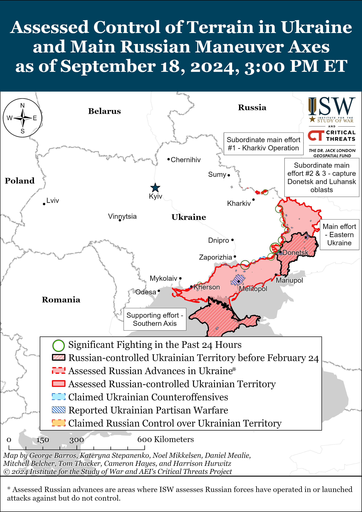
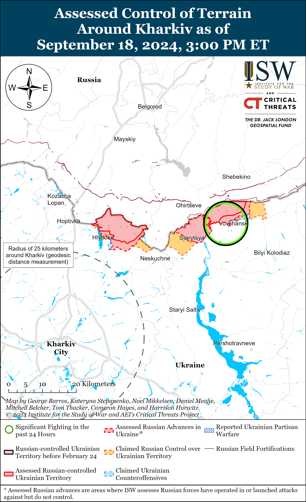
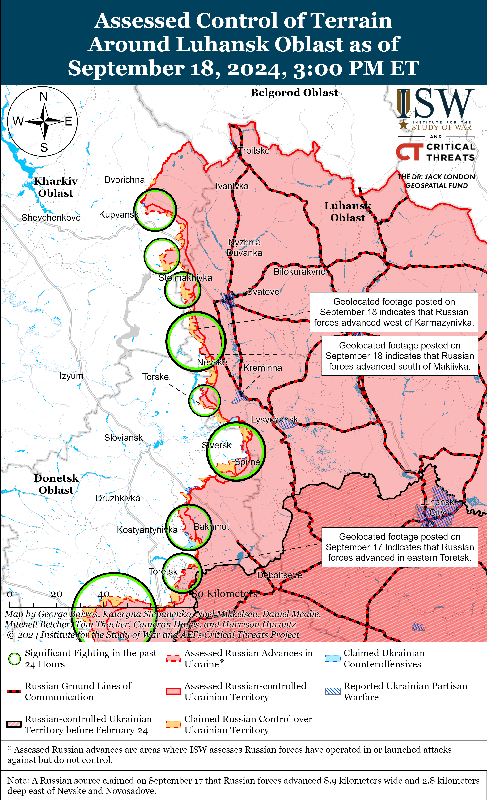
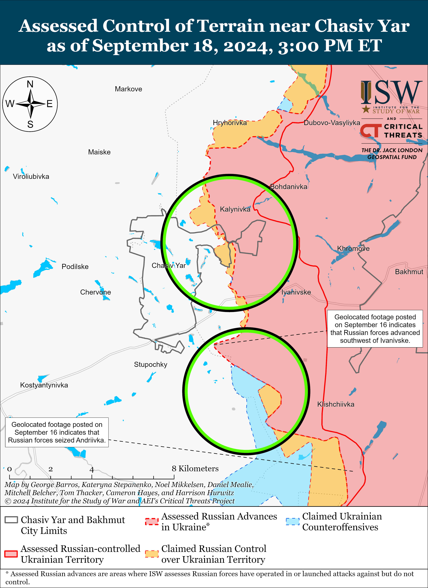
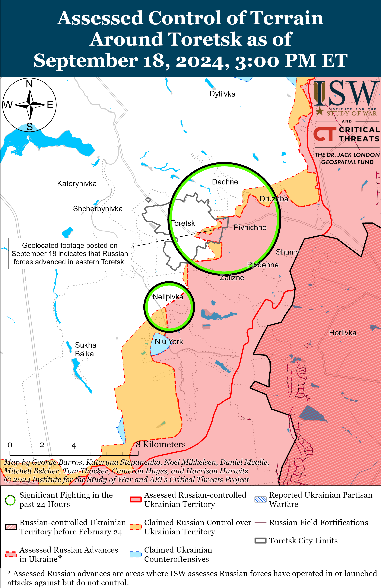
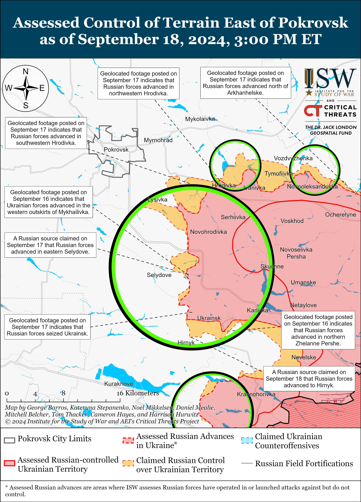
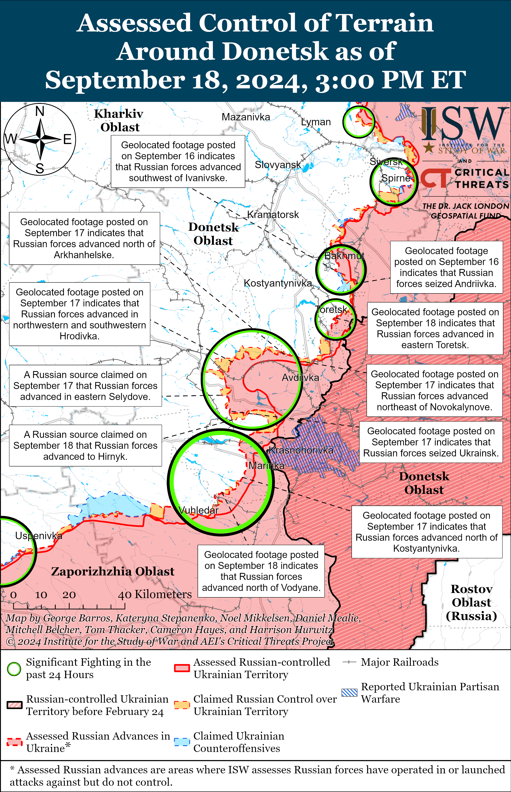
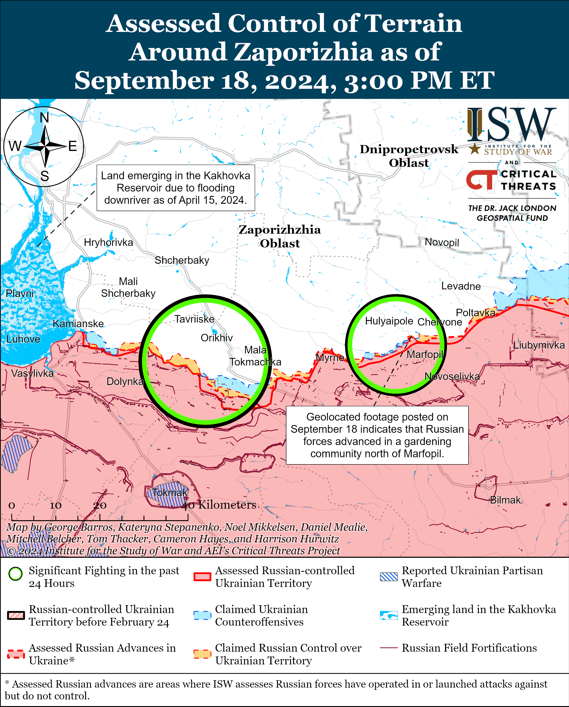
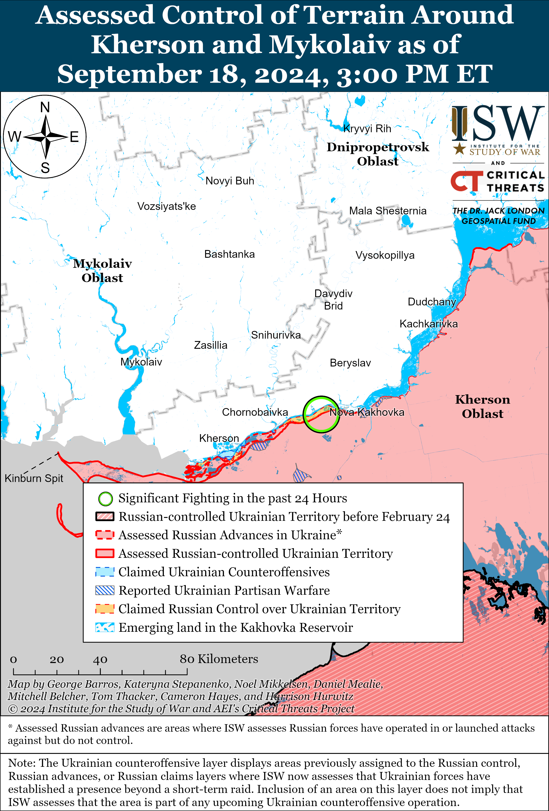

# Russian Offensive Campaign Assessment, September 18, 2024

**September 18, 2024, 7:45pm ET**

**Click** [**here**](https://storymaps.arcgis.com/stories/36a7f6a6f5a9448496de641cf64bd375) **to see ISW’s interactive map of the Russian invasion of Ukraine. This map is updated daily alongside the static maps present in this report.**

**Click** [**here**](https://storymaps.arcgis.com/stories/83a2f24901c941d581c0c523ecd2619b) **to see ISW's interactive map of Ukraine's offensive in Kursk Oblast.**

**Click** [**here**](https://understandingwar.maps.arcgis.com/apps/instant/3dviewer/index.html?appid=1602762dbcde419bb957dea358449580) **to see ISW’s 3D control of terrain topographic map of Ukraine. Use of a computer (not a mobile device) is strongly recommended for using this data-heavy tool.**

**Click** [**here**](https://storymaps.arcgis.com/stories/733fe90805894bfc8562d90b106aa895) **to access ISW’s archive of interactive time-lapse maps of the Russian invasion of Ukraine. These maps complement the static control-of-terrain map that ISW produces daily by showing a dynamic frontline. ISW will update this time-lapse map archive monthly.**

**Note: The data cut-off for this product was 12:30 pm ET on September 18. ISW will cover subsequent reports in the September 19 Russian Offensive Campaign Assessment.**

**Ukrainian forces conducted a successful drone strike against a Russian missile and ammunition storage facility near Toropets, Tver Oblast on September 18.** A source within Ukrainian special services told Ukrainian outlet *Suspilne* on September 18 that drone operators from Ukraine's Security Service (SBU), Ukraine's Main Military Intelligence Directorate (GUR), and Ukraine's Special Operations Forces (SSO) struck a facility at the Russian Ministry of Defense (MoD) Main Missile and Artillery Directorate's 107th Arsenal in Toropets, Tver Oblast.[[1]](#_edn848e11f6cf1bb4f5482fd73efdd10fa21) *Suspilne*'s sources stated the facility stores Iskander missiles, Tochka-U ballistic missiles, anti-aircraft missiles, and artillery ammunition and that there were significant secondary detonations following the initial Ukrainian drone strike. Head of Ukraine's Center for Combatting Disinformation, Andriy Kovalenko, stated that Russian forces may have also stored ammunition for Grad multiple launch rocket systems (MLRS), S-300 and S-400 air defense missiles, and North Korean KN-23 ballistic missiles at the facility.[[2]](#_edn848e11f6cf1bb4f5482fd73efdd10fa22) Footage published on September 16 shows large secondary detonations, presumably of missile stockpiles and artillery ammunition, following the initial drone strike.[[3]](#_edn848e11f6cf1bb4f5482fd73efdd10fa23) Geolocated footage published on September 18 shows several large smoke plumes over the facility and satellite imagery shows significant damage to the building in the southern part of the facility, although most of the facility is obscured by smoke.[[4]](#_edn848e11f6cf1bb4f5482fd73efdd10fa24) Russian authorities claimed that wreckage from a downed Ukrainian drone struck the facility and prompted the secondary detonations, and Russian authorities temporarily evacuated the area near the facility.[[5]](#_edn848e11f6cf1bb4f5482fd73efdd10fa25) Russian milbloggers largely criticized Russian authorities for poorly constructing the facility and accused Russian forces of possibly mishandling missiles and artillery ammunition stockpiles at the facility.[[6]](#_edn848e11f6cf1bb4f5482fd73efdd10fa26)  Milbloggers accused the detained former Russian Deputy Defense Minister Army General Dmitri Bulgakov of engaging in corrupt practices leading to poor construction quality at the facility.[[7]](#_edn848e11f6cf1bb4f5482fd73efdd10fa27)

**Continued Ukrainian strikes against rear Russian logistics facilities within Russia will generate wider operational pressures on the Russian military beyond the individual destruction of ammunition stockpiles and logistics facilities.** *Suspilne*'s sources noted that Ukrainian strikes are undermining Russia's ability to conduct long-range missile strikes against Ukraine.[[8]](#_edn848e11f6cf1bb4f5482fd73efdd10fa28) Ukrainian forces conducted a series of HIMARS strikes against Russian ammunition depots throughout occupied Ukraine in Summer 2022, prompting Russian forces to disperse ammunition storage facilities and degrading the efficiency of Russian logistics at the time.[[9]](#_edn848e11f6cf1bb4f5482fd73efdd10fa29) Repeated strikes against ammunition depots within Russia that cause similar levels of damage to the strike in Toropets may force a similar decision point on the Russian military command to reorganize and disperse support and logistics systems within Russia to mitigate the impact of such strikes.  Russian forces may not have addressed vulnerabilities at many logistics facilities within Russia due to the sanctuary space that restrictions on Ukraine's use of Western-provided weapons have generated, although the Toropets facility is not within range of Western systems fired from Ukraine. The lifting of restrictions on the use of Western systems and the continued development of Ukraine's own long-range strike capabilities may allow Ukrainian forces to more effectively exploit such Russian vulnerabilities. Ukrainian forces struck another Russian ammunition depot near Sergeevka, Voronezh Oblast in July 2024 and continued Ukrainian strikes against Russian ammunition and missile storage facilities could also destroy an important portion of Russia's materiel reserves.[[10]](#_edn848e11f6cf1bb4f5482fd73efdd10fa210) Ukrainian strikes against facilities within Russia could impact offensive operations throughout the theater in Ukraine if Ukrainian forces have the materiel, capabilities, and permission to conduct such a strike campaign against logistics and supports facilities within Russia at scale.

**Russian authorities arrested the head of the Central Military District (CMD)'s armor service on September 18 on suspicion of receiving a large bribe, marking yet another corruption case against a high-ranking Russian military official since the April 2024 appointment of Andrei Belousov as Russian Defense Minister.[[11]](#_edn848e11f6cf1bb4f5482fd73efdd10fa211)** The Russian Investigative Committee announced on September 18 that it opened a case against CMD armor service head Denis Putilov for accepting a 10-million-ruble ($107,000) bribe in exchange for issuing contracts on the repair and maintenance of military vehicles to an individual entrepreneur named "Chudinov."[[12]](#_edn848e11f6cf1bb4f5482fd73efdd10fa212) The CMD is notably home to Russia's 90th Tank Division, and Putilov was very likely closely involved in overseeing the repair and maintenance of the suite of tanks and other armored vehicles that the 90th Tank Division uses in combat operations in Ukraine.[[13]](#_edn848e11f6cf1bb4f5482fd73efdd10fa213) Since the start of Belousov's tenure as Minister of Defense in April 2024, such corruption cases against senior Russian Ministry of Defense (MoD) officials have become much more frequent — a result of Belousov's apparent commitment to rooting out the corruption and addressing the mismanagement that plagued the MoD under former Defense Minister Sergei Shoigu.[[14]](#_edn848e11f6cf1bb4f5482fd73efdd10fa214) Putilov's links to Shoigu remain unclear as of the time of this publication, but his arrest suggests that Belousov is attempting to crack down on corrupt and ineffective officials who are responsible for the sustainment of Russia's military assets, particularly increasingly scarce armored vehicles.

**An unsuccessful armed assault against several offices of Russia's largest online retailer Wildberries in Moscow City highlights the fragility of Russia's domestic stability.** Wildberries' press service reported on September 18 that Vladislav Bakalchuk, Wildberries co-founder and ex-husband of Wildberries co-founder CEO Tatyana Bakalchuk, along with 20 to 30 armed accomplices, conducted simultaneous armed assaults against two Wildberries offices in Moscow City.[[15]](#_edn848e11f6cf1bb4f5482fd73efdd10fa215) Russian law enforcement closed off the immediate area around the offices and later detained 28 people involved in the assault, although the attackers shot and killed at least two Wildberries security guards and injured two other people before their apprehension.[[16]](#_edn848e11f6cf1bb4f5482fd73efdd10fa216) The Bakalchuks filed for divorce in July 2024 after Vladislav appealed to Chechen Republic Head Ramzan Kadyrov to help prevent Tatyana from taking over Wildberries, and Kadyrov promised to "return" Tatyana to "the family."[[17]](#_edn848e11f6cf1bb4f5482fd73efdd10fa217) Wildberries has previously been involved in ongoing Russian efforts to crackdown against migrants in Russia and coerce migrants into joining the Russian military.[[18]](#_edn848e11f6cf1bb4f5482fd73efdd10fa218) Russian authorities have attempted to posture themselves as taking steps to address domestic security issues following the March 2024 Crocus City Hall terrorist attack and June 2024 shooting in the Republic of Dagestan, although this unsuccessful yet well-planned assault in Moscow City calls into question the existence and effectiveness of any such efforts and particularly highlights vulnerabilities in the security apparatus in Russia's metropolitan core.[[19]](#_edn848e11f6cf1bb4f5482fd73efdd10fa219)

**Armenian officials continue to criticize the Russian-led Collective Security Treaty Organization (CSTO) amid worsening Armenia-Russia bilateral relations.** Armenian Prime Minister Nikol Pashinyan announced on September 18 that Armenia has frozen its CSTO membership due to the bloc’s failure to meet security obligations to Armenia and that, in his opinion, the CSTO is a threat to Armenia’s “security, future existence, sovereignty, and statehood.”[[20]](#_edn848e11f6cf1bb4f5482fd73efdd10fa220) Pashinyan stated that if the CSTO fails to provide answers to the reason behind its failures, Armenia will continue to distance itself from the security organization and possibly reach a "point of no return." Pashinyan previously announced on August 31 that Armenia froze its participation in the CSTO, although he has yet to concretely announce a formal *de jure* Armenian withdrawal from the organization.[[21]](#_edn848e11f6cf1bb4f5482fd73efdd10fa221) Kremlin Spokesperson Dmitry Peskov responded to Pashinyan by stating that he strongly disagreed with Pashinyan’s assessment and claiming that the CSTO serves to safeguard the sovereignty of all its member states, including Armenia.[[22]](#_edn848e11f6cf1bb4f5482fd73efdd10fa222) This spat comes amid an announcement by the Armenian Investigative Committee on September 18 about the arrest of three individuals accused of attempting to form an armed group to overthrow the Armenian government.[[23]](#_edn848e11f6cf1bb4f5482fd73efdd10fa223) The Armenian Investigative Committee stated that the three suspects, along with four accomplices not yet in Armenian detention, recruited Armenian citizens to undergo paid three-month military training at the “Arbat” military base in Rostov-on-Don, Rostov Oblast. ISW has not been able to confirm the location of this base. ISW has previously observed worsening Armenia-Russia relations particularly following the second Nagorno-Karabakh war in 2020 between Armenia and Azerbaijan, and Armenia’s recently increasing pro-European foreign policy trajectory under Pashinyan.[[24]](#_edn848e11f6cf1bb4f5482fd73efdd10fa224) Armenian officials have repeatedly criticized the CSTO for failing to meet Armenia’s security needs — particularly faulting Russia and Belarus — while Russian officials and the Russian information space have increasingly discredited the Pashinyan government by accusing it of pursuing an allegedly destructive pro-Western agenda aimed at straining their bilateral ties.

**Russian Foreign Ministry Spokesperson Maria Zakharova condemned Israel for simultaneously detonating thousands of pagers belonging to Lebanese Hezbollah (LH) members across Lebanon and Syria on September 17, signaling Russia's continued rhetorical alignment with Iran's Axis of Resistance against Israel.[[25]](#_edn848e11f6cf1bb4f5482fd73efdd10fa225)** Zakharova called the attack "another act of hybrid war against Lebanon" and warned that the circumstances risk further escalating the situation in the Levant.[[26]](#_edn848e11f6cf1bb4f5482fd73efdd10fa226) Kremlin officials have previously voiced their support for LH and other elements of Iran's Axis of Resistance, including by condemning US and UK strikes on Houthi positions in Yemen.[[27]](#_edn848e11f6cf1bb4f5482fd73efdd10fa227) Ukraine's Main Military Intelligence Directorate (GUR) reported in February 2024 that LH and the Islamic Revolutionary Guard Corps (IRGC) were working together to train Russian drone operators on the use of Iranian-made drones in Syria, and Western media reported in August 2024 that Russia was considering transferring missiles and equipment to the Houthis—strongly suggesting that Russia's backing of and interactions with the Axis of Resistance extend beyond rhetorical support.[[28]](#_edn848e11f6cf1bb4f5482fd73efdd10fa228)

**Key Takeaways:**

- **Ukrainian forces conducted a successful drone strike against a Russian missile and ammunition storage facility near Toropets, Tver Oblast on September 18.**
- **Continued Ukrainian strikes against rear Russian logistics facilities within Russia will generate wider operational pressures on the Russian military beyond the individual destruction of ammunition stockpiles and logistics facilities.**
- **Russian authorities arrested the head of the Central Military District (CMD)'s armor service on September 18 on suspicion of receiving a large bribe, marking yet another corruption case against a high-ranking Russian military official since the April 2024 appointment of Andrei Belousov as Russian Defense Minister.**
- **An unsuccessful armed assault against several offices of Russia's largest online retailer Wildberries in Moscow City highlights the fragility of Russia's domestic stability.**
- **Armenian officials continue to criticize the Russian-led Collective Security Treaty Organization (CSTO) amid worsening Armenia-Russia bilateral relations.**
- **Russian Foreign Ministry Spokesperson Maria Zakharova condemned Israel for simultaneously detonating thousands of pagers belonging to Lebanese Hezbollah (LH) members across Lebanon and Syria on September 17, signaling Russia's continued rhetorical alignment with Iran's Axis of Resistance against Israel.**
- **Ukrainian forces recently advanced in the Kursk Oblast salient.**
- **Russian forces regained positions within Kursk Oblast salient.**
- **Russian forces recently advanced along the Kupyansk-Svatove-Kreminna line, within Toretsk, east and southeast of Pokrovsk, southwest of Donetsk City, and in eastern Zaporizhia Oblast.**
- **The Russian State Duma announced on September 18 that it approved a bill in its first reading that proposes releasing Russian servicemembers serving in Ukraine from criminal punishment associated with cases actively being tried in Russia courts.**

****

***We do not report in detail on Russian war crimes because these activities are well-covered in Western media and do not directly affect the military operations we are assessing and forecasting. We will continue to evaluate and report on the effects of these criminal activities on the Ukrainian military and the Ukrainian population and specifically on combat in Ukrainian urban areas. We utterly condemn Russian violations of the laws of armed conflict and the Geneva Conventions and crimes against humanity even though we do not describe them in these reports.***

- Ukrainian Operations in the Russian Federation
- Russian Main Effort – Eastern Ukraine (comprised of three subordinate main efforts)
- Russian Subordinate Main Effort #1 – Push Ukrainian forces back from the international border with Belgorod Oblast and approach to within tube artillery range of Kharkiv City
- Russian Subordinate Main Effort #2 – Capture the remainder of Luhansk Oblast and push westward into eastern Kharkiv Oblast and encircle northern Donetsk Oblast
- Russian Subordinate Main Effort #3 – Capture the entirety of Donetsk Oblast
- Russian Supporting Effort – Southern Axis
- Russian Air, Missile, and Drone Campaign
- Russian Mobilization and Force Generation Efforts
- Russian Technological Adaptations
- Activities in Russian-occupied areas
- Ukrainian Defense Industrial Base Efforts
- Russian Information Operations and Narratives
- Significant Activity in Belarus

**Ukrainian Operations in the Russian Federation**

Ukrainian forces reportedly continued assaults in Glushkovsky Raion west of their larger salient in Kursk Oblast on September 18. Russian sources, including the Russian Ministry of Defense (MoD), claimed on September 18 that Russian forces repelled Ukrainian attacks near Veseloye (southwest of Glushkovo), Medvezhye (southeast of Veseloye), and Novy Put (south of Veseloye).[[29]](#_edn848e11f6cf1bb4f5482fd73efdd10fa229) Elements of the Russian 56th Airborne (VDV) Regiment (7th VDV Division) and 51st VDV Regiment (106th VDV Division) are reportedly repelling Ukrainian assaults in Glushkovsky Raion.[[30]](#_edn848e11f6cf1bb4f5482fd73efdd10fa230)

Ukrainian forces recently expanded their larger salient in Kursk Oblast amid continued Ukrainian offensive operations in the area on September 18. Geolocated footage published on September 17 indicates that Ukrainian forces recently advanced east of Krasnooktyabrskoye (southwest of Korenevo).[[31]](#_edn848e11f6cf1bb4f5482fd73efdd10fa231) The Russian MoD claimed on September 17 that Ukrainian forces attacked southeast of Korenevo near Obukhovka and Lyubimovka and northwest of Sudzha near Malaya Loknya.[[32]](#_edn848e11f6cf1bb4f5482fd73efdd10fa232)

Russian forces recently recaptured territory in the Ukrainian salient in Kursk Oblast amid continued Russian counterattacks in the area on September 18. Geolocated footage published on September 17 and 18 indicates that Russian forces recently advanced eastward along two forested areas southeast of Korenevo and south of Obukhovka (southeast of Korenevo).[[33]](#_edn848e11f6cf1bb4f5482fd73efdd10fa233) Russian milbloggers claimed on September 18 that Russian forces operating east of Korenevo advanced south of Durovka and along the Korenevo-Sheptukhovka-Safonovka(35H-564) highway.[[34]](#_edn848e11f6cf1bb4f5482fd73efdd10fa234) Russian milbloggers claimed on September 16 and 17 that Russian forces advanced near Olgovka (east of Korenevo) and  Uspenovka (southeast of Korenevo).[[35]](#_edn848e11f6cf1bb4f5482fd73efdd10fa235) The Russian MoD claimed on September 18 that Russian forces conducted offensive operations southeast of Korenevo near Nikolayevo-Daryino, Daryino, Lyubimovka and Tolsty Lug and southeast of Sudzha near Plekhovo.[[36]](#_edn848e11f6cf1bb4f5482fd73efdd10fa236) Geolocated footage published on September 18 shows that Russian forces recently conducted a platoon-sized mechanized assault against Ukrainian positions southeast of Korenevo.[[37]](#_edn848e11f6cf1bb4f5482fd73efdd10fa237) Elements of the Russian 11th Airborne (VDV) Brigade and elements of the 810th Naval Infantry Brigade (Black Sea Fleet [BSF], Southern Military District [SMD]) are reportedly operating in Kursk Oblast.[[38]](#_edn848e11f6cf1bb4f5482fd73efdd10fa238)

Ukrainian Kharkiv Oblast Military Administration Spokesperson Oleksiy Dmitrashkivskyi told *Agence-France-Presse* (AFP) on September 18 that Ukrainian forces "stopped" Russia's "counteroffensive" in Kursk Oblast and have stabilized the situation.[[39]](#_edn848e11f6cf1bb4f5482fd73efdd10fa239) Dmitrashkivskyi stated that Russian forces recaptured an unspecified settlement and entered another unspecified settlement in Kursk Oblast following the start of Russian counterattacks on the night of September 10 to 11. ISW has yet to observe Ukrainian forces halting Russian advances entirely in Kursk Oblast, although Dmitrashkivskyi may be referencing events that have fallen outside of the available information within the collect cutoff for this report. ISW continues to track observable Russian counterattacks in Kursk Oblast but has not yet observed large-scale combat operations indicating that Russian forces have started a large-scale concerted counteroffensive operation aimed at completely expelling Ukrainian forces from Kursk Oblast.

**Russian Main Effort – Eastern Ukraine**

**Russian Subordinate Main Effort #1 – Kharkiv Oblast** **(Russian objective: Push Ukrainian forces back from the international border with Belgorod Oblast and approach to within tube artillery range of Kharkiv City)**

Russian forces continued ground assaults in northern Kharkiv Oblast on September 18, but there were no confirmed changes to the frontline. Russian forces continued assaults within Vovchansk (northeast of Kharkiv City), and Russian milbloggers claimed that Ukrainian forces conducted counterattacks within Vovchansk and near Hlyboke and Lyptsi (both north of Kharkiv City).[[40]](#_edn848e11f6cf1bb4f5482fd73efdd10fa240) Ukraine's Kharkiv Group of Forces reported on September 18 that elements of the Russian 11th Tank Regiment (18th Motorized Rifle Division, 11th Army Corps [AC], Leningrad Military District [LMD]) are operating near Hlyboke; elements of the 7th Motorized Rifle Regiment (11th AC, LMD) are operating near Lyptsi; and elements of the 128th Motorized Rifle Brigade (44th AC, LMD) and "Nevsky" Volunteer Reconnaissance-Assault Brigade (Russian Volunteer Corps) are operating near Vovchansk.[[41]](#_edn848e11f6cf1bb4f5482fd73efdd10fa241)

**Russian Subordinate Main Effort #2 – Luhansk Oblast** **(Russian objective: Capture the remainder of Luhansk Oblast and push westward into eastern Kharkiv Oblast and northern Donetsk Oblast)**

Russian forces recently made confirmed advances along the Kupyansk-Svatove-Kreminna line. Geolocated footage published on September 18 indicates that Russian forces advanced west of Tabaivka (southeast of Kupyansk), west of Karmazynivka (southwest of Svatove), and southwards along the O-131306 (Svatove-Makiivka) highway south of Makiivka (northwest of Kreminna).[[42]](#_edn848e11f6cf1bb4f5482fd73efdd10fa242) A Russian milblogger claimed that Russian forces also advanced in forest areas near Pishchane (southeast of Kupyansk) and Nevske (northwest of Kreminna), but ISW has not observed visual evidence of these claims.[[43]](#_edn848e11f6cf1bb4f5482fd73efdd10fa243) The Ukrainian General Staff reported that Russian force conducted ground attacks northeast of Kupyansk near Synkivka; southeast of Kupyansk near Kruhlyakivka, Kolisnykivka, Petropavlivka, and Novoosynove; northwest of Svatove near Stelmakhivka and Lozova; west of Svatove near Andriivka; southwest of Svatove near Chereshchyna, Druzhelyubivka, Hrekivka; and northwest of Kreminna near Makiivka, Nevske, and Torske.[[44]](#_edn848e11f6cf1bb4f5482fd73efdd10fa244) Elements of the Russian 375th Separate Anti-Tank Artillery Battalion (47th Tank Division, 1st Guards Tank Army [GTA], Moscow Military District [MMD]) reportedly continue to operate near Kupyansk.[[45]](#_edn848e11f6cf1bb4f5482fd73efdd10fa245)

**Russian Subordinate Main Effort #3 – Donetsk Oblast (Russian objective: Capture the entirety of Donetsk Oblast, the claimed territory of Russia’s proxies in Donbas)**

Russian forces continued offensive operations east of Siversk near Verkhnokamyanske and southeast of Siversk near Vyimka on September 17 and 18, but did not make any confirmed advances in the area.[[46]](#_edn848e11f6cf1bb4f5482fd73efdd10fa246)

Russian forces continued offensive operations near Chasiv Yar; south of Chasiv Yar near Stupochky and Bila Hora; and southeast of Chasiv Yar near Klishchiivka on September 17 and 18, but did not make any confirmed gains.[[47]](#_edn848e11f6cf1bb4f5482fd73efdd10fa247) A Russian milblogger claimed that elements of the Russian 4th Motorized Rifle Brigade (3rd Combined Arms Army [CAA], formerly 2nd Luhansk People's Republic [LNR] Army Corps [AC]) and unspecified Chechen "Akhmat" forces crossed the Siverskyi-Donets Donbas Canal in the direction of Stupochky on September 17.[[48]](#_edn848e11f6cf1bb4f5482fd73efdd10fa248) Another Russian milblogger claimed that Russian forces are struggling to establish enduring positions in Zhovtnevyi Microraion (eastern Chasiv Yar).[[49]](#_edn848e11f6cf1bb4f5482fd73efdd10fa249)

Russian forces recently made marginal gains within Toretsk amid continued Russian offensive operations in the area on September 18. Geolocated footage published on September 18 indicates that Russian forces recently advanced along Tsentralna Street in eastern Toretsk, and Russian milbloggers claimed that Russian forces advanced further northward and westward within eastern Toretsk.[[50]](#_edn848e11f6cf1bb4f5482fd73efdd10fa250) Another Russian milblogger claimed that Russian forces advanced in forested areas southeast of Toretsk, although ISW has not observed confirmation of this claim.[[51]](#_edn848e11f6cf1bb4f5482fd73efdd10fa251) Russian forces also continued offensive operations northeast of Toretsk near Dachne; south of Toretsk near Nelipivka and Niu York; southwest of Toretsk near Oleksandropil; and near Toretsk in the direction of Shcherbynivka on September 17 and 18.[[52]](#_edn848e11f6cf1bb4f5482fd73efdd10fa252)

Russian forces reportedly continued to advance southeast and east of Pokrovsk but did not make any confirmed advances in the Pokrovsk direction on September 18. Russian milbloggers claimed on September 17 and 18 that Russian forces advanced westward across the Zhuravka River within Hrodivka (east of Pokrovsk) and in northern Hrodivka.[[53]](#_edn848e11f6cf1bb4f5482fd73efdd10fa253) Russian milbloggers claimed that Russian forces operating southeast of Pokrovsk advanced up to Holholya Street in northeastern Selydove and up to the northern outskirts of Hirnyk.[[54]](#_edn848e11f6cf1bb4f5482fd73efdd10fa254) Another Russian milblogger continued to claim on September 18 that Russian forces have seized Hrodivka and are clearing the town.[[55]](#_edn848e11f6cf1bb4f5482fd73efdd10fa255) ISW has not observed confirmation of these Russian claims, however. Russian forces continued offensive operations east of Pokrovsk near Novooleksandrivka, Novotoretske, Zelene Pole, Vozdvyzhenka, Hrodivka, and Krasnyi Yar and southeast of Pokrovsk near Novohrodivka, Orlivka, Selydove, Mykhailivka, Mykolaivka, Marynivka, Zhelanne Pershe, Ukrainsk, and Tsukuryne on September 17 and 18.[[56]](#_edn848e11f6cf1bb4f5482fd73efdd10fa256) Elements of the Russian 114th Motorized Rifle Brigade (51st Combined Arms Army [CAA], formerly 1st Donetsk People's Republic [DNR] AC) are reportedly operating within Ukrainsk.[[57]](#_edn848e11f6cf1bb4f5482fd73efdd10fa257)

Russian forces operating west of Donetsk City continued offensive operations near Heorhiivka and Maksymilyanivka and in the direction of Dalne on September 17 and 18 but did not make confirmed advances.[[58]](#_edn848e11f6cf1bb4f5482fd73efdd10fa258) A Russian milblogger claimed that Russian aircraft have recently conducted repeated strikes against the Ternovska dam along the Kurakhovske Reservoir in Kurakhove in recent days but have yet to significantly damage the road surface of the dam.[[59]](#_edn848e11f6cf1bb4f5482fd73efdd10fa259)

Russian forces recently advanced southwest of Donetsk City and continued offensive operations in the area on September 18. Geolocated footage published on September 18 indicates that Russian forces recently advanced north of Vodyane.[[60]](#_edn848e11f6cf1bb4f5482fd73efdd10fa260) Russian milbloggers claimed that Russian forces continued to advance near the Pivdennodonbaska No. 1 mine and that Ukrainian forces continued counterattacking near the Pivdennodonbaska No. 1 and No. 3 mines (both northeast of Vuhledar).[[61]](#_edn848e11f6cf1bb4f5482fd73efdd10fa261) Russian forces also continued offensive operations near Kostyantynivka, Katerynivka,  Bohoyavlenka, Vuhledar, and Novoukrainka on September 17 and 18.[[62]](#_edn848e11f6cf1bb4f5482fd73efdd10fa262) Unspecified elements of the Russian 29th CAA (Eastern Military District [EMD]) are reportedly operating near the Pivdennodonbaska No. 3 mine.[[63]](#_edn848e11f6cf1bb4f5482fd73efdd10fa263)

Russian and Ukrainian sources did not report any fighting in the Donetsk-Zaporizhia Oblast border area on September 18.

The Ukrainian Navy reported on September 17 that Ukrainian missile units recently struck Russian ammunition warehouses near occupied Hlyboke in Mariupolskyi Raion, Donetsk Oblast on an unspecified date.[[64]](#_edn848e11f6cf1bb4f5482fd73efdd10fa264) *Radio Svoboda* reported that eyewitnesses stated that Ukrainian forces conducted strikes near Hlyboke on September 13 and on the night of September 15 to 16.[[65]](#_edn848e11f6cf1bb4f5482fd73efdd10fa265) *Radio Svoboda* posted satellite imagery showing damage at the reported Russian ammunition warehouses and large burn marks in the surrounding areas.[[66]](#_edn848e11f6cf1bb4f5482fd73efdd10fa266)

**Russian Supporting Effort – Southern Axis** **(Russian objective: Maintain frontline positions and secure rear areas against Ukrainian strikes)**

Russian forces recently advanced in eastern Zaporizhia Oblast near Hulyaipole. Geolocated footage published on September 18 indicates that Russian forces recently made gains in a garden area in northwestern Marfopil (just southeast of Hulyaipole), and a Russian milblogger claimed on September 18 that Russian forces seized all of Marfopil and marginally advanced in fields northwest of the settlement.[[67]](#_edn848e11f6cf1bb4f5482fd73efdd10fa267) The Ukrainian General Staff reported that Russian forces attacked near Hulyaipole on September 18.[[68]](#_edn848e11f6cf1bb4f5482fd73efdd10fa268) ISW has not observed confirmed Russian advances in this area since July 18, 2024.[[69]](#_edn848e11f6cf1bb4f5482fd73efdd10fa269)

Limited positional engagements continued in western Zaporizhia Oblast on September 18, but there were no confirmed changes to the frontline. The Ukrainian General Staff reported that Russian forces conducted ground attacks north of Robotyne near Novodanylivka; northeast of Robotyne near Mala Tokmachka; and northwest of Robotyne near Novoandriivka and Shcherbaky on September 17 and 18.[[70]](#_edn848e11f6cf1bb4f5482fd73efdd10fa270) A Russian milblogger claimed that Russian forces became somewhat more active near Kopani (northwest of Robotyne) on September 17.[[71]](#_edn848e11f6cf1bb4f5482fd73efdd10fa271) Russian and Ukrainian sources reported that Russian forces conducted an intensive aerial bombardment of areas in western Zaporizhia Oblast, including near Kamyanske, Orikhiv, and Komyshuvakha, on September 18.[[72]](#_edn848e11f6cf1bb4f5482fd73efdd10fa272)

Russian forces conducted limited ground attacks in east (left) bank Kherson Oblast and on islands in the Dnipro River Delta on September 17 and 18.[[73]](#_edn848e11f6cf1bb4f5482fd73efdd10fa273) Elements of the Russia BARS-33 detachment (Russian Combat Reserve) and the 154th Separate Reconnaissance Battalion (104th Airborne [VDV] Division) reportedly continue to operate in Kherson Oblast.[[74]](#_edn848e11f6cf1bb4f5482fd73efdd10fa274)

**Russian Air, Missile, and Drone Campaign** **(Russian Objective: Target Ukrainian military and civilian infrastructure in the rear and on the frontline)**

Russian forces conducted a series of drone strikes against Ukraine on the night of September 17 to 18. The Ukrainian Air Force reported that Russian forces launched three Kh-59/69 cruise missiles from airspace over occupied Kherson Oblast and 52 Shahed-136/131 drones from Kursk Oblast and Yeysk, Krasnodar Krai.[[75]](#_edn848e11f6cf1bb4f5482fd73efdd10fa275) The Ukrainian Air Force reported that Ukrainian forces shot down 46 Shahed drones over Mykolaiv, Kherson, Cherkasy, Kirovohrad, Kyiv, Vinnytsia, Sumy and Poltava Oblasts; five drones were lost due to electronic warfare (EW) interference; and one drone returned to Russian airspace. The Ukrainian Air Force added that Ukrainian countermeasures prevented the Kh-59/69 missiles from reaching their targets. Ukrainian officials reported that an unspecified number of Shaheds damaged 19 residential buildings and killed one man in Kropyvnytskyi, Kirovohrad Oblast on September 18.[[76]](#_edn848e11f6cf1bb4f5482fd73efdd10fa276) The Sumy Oblast Military Administration reported that Russian Shaheds targeted energy infrastructure in Sumy Oblast. [[77]](#_edn848e11f6cf1bb4f5482fd73efdd10fa277)

**Russian Mobilization and Force Generation Efforts** **(Russian objective: Expand combat power without conducting general mobilization)**

Russian authorities are testing a new digital platform to distribute electronic military summonses during Russia's fall and spring conscription cycles and possible future mobilization campaigns. Russian media reported on September 18 that Russian authorities are reportedly testing a new "Unified Register of Military Registration" in Ryazan and Sakhalin oblasts and Mari El Republic.[[78]](#_edn848e11f6cf1bb4f5482fd73efdd10fa278) Russian media reported that Russian officials plan to fully launch the register by November 2024 to correspond with the Fall 2024 conscription cycle, but that Russian officials will still send out physical summonses alongside the digital summonses.

The Russian State Duma announced on September 18 that it approved a bill in its first reading that proposes releasing Russian servicemembers serving in Ukraine from criminal punishment associated with cases actively being tried in Russian courts.[[79]](#_edn848e11f6cf1bb4f5482fd73efdd10fa279) The bill would allow Russian courts, prosecutors, or investigators to suspend criminal cases against Russian servicemembers serving in Ukraine. Russian authorities have previously adopted legislation allowing Russian courts and officials to dismiss criminal cases against active and prospective Russian servicemembers during pre-trial investigations and forgive criminal charges following sentencings, and this new bill would essentially empower Russian authorities to dismiss a criminal case against Russian servicemembers at will.[[80]](#_edn848e11f6cf1bb4f5482fd73efdd10fa280)

The Russian government continues to integrate veterans of Russia's war in Ukraine into positions within the Russian government and significant economic organizations. Russian President Vladimir Putin's "Time of Heroes" program announced on September 18 that Russian authorities appointed a Russian servicemember involved in the program as the Deputy Head of Russian Railway's Social Development Department.[[81]](#_edn848e11f6cf1bb4f5482fd73efdd10fa281) The "Time of Heroes" program stated that the veteran worked for Russian Railways before being mobilized, likely in Fall 2022. Russia's ruling United Russia political party recently nominated over 300 Russian veterans, including some participants in the "Time of Heroes" program, to various positions in the September 2024 Russian regional elections.[[82]](#_edn848e11f6cf1bb4f5482fd73efdd10fa282)

Crimea occupation head Sergei Aksyonov announced on September 18 that "BARS-Crimea" territorial defense units are conducting training exercises in occupied Crimea.[[83]](#_edn848e11f6cf1bb4f5482fd73efdd10fa283)

**Russian Technological Adaptations** **(Russian objective: Introduce technological innovations to optimize systems for use in Ukraine)**

Kremlin-affiliated outlet *Izvestiya*, citing Russian government documents, reported on September 18 that the Russian government may intend to allocate up to 445 billion rubles ($4.75 billion) to develop an analogue to SpaceX's Starlink system.[[84]](#_edn848e11f6cf1bb4f5482fd73efdd10fa284) *Izvestiya* reported that Russian authorities intend to develop and construct a group of low-orbit satellites for high-speed internet access and "launch vehicles" for the satellites between 2025 and 2030. Russia's Ministry of Digital Development told *Izvestiya* that developing satellite communications is one of Russia's main priorities for the "near future" but that discussions about financing the program are premature.

**Ukrainian Defense Industrial Efforts** **(Ukrainian objective: Develop its defense industrial base to become more self-sufficient in cooperation with US, European, and international partners)**

*ISW is suspending publishing coverage of Ukrainian defense industrial efforts until further notice.*

**Activities in Russian-occupied areas** **(Russian objective: Consolidate administrative control of annexed areas; forcibly integrate Ukrainian citizens into Russian sociocultural, economic, military, and governance systems)**

*ISW is not publishing coverage of Russian-occupied areas today.*

**Russian Information Operations and Narratives**

The Microsoft Threat Analysis Center reported on September 17 that Russia and Iran are conducting cyber influence operations to influence the US 2024 presidential election in November.[[85]](#_edn848e11f6cf1bb4f5482fd73efdd10fa285) The Center observed two Kremlin-aligned troll farms, Storm-1516 and Storm-1679, publishing fake videos meant to sway voter opinion and that some of these videos have garnered millions of views. The Kremlin will likely continue its efforts to use information operations on social media to sow discord in the US political environment and interfere in the upcoming election.

**Significant activity in Belarus** **(Russian efforts to increase its military presence in Belarus and further integrate Belarus into Russian-favorable frameworks and Wagner Group activity in Belarus)**

The Belarusian Ministry of Defense (MoD) reported on September 18 that the Russian-led Commonwealth of Independent States (CIS) held a meeting of the Coordination Committee on Air Defense Issues in Minsk and discussed improving the alliance's air defense umbrella.[[86]](#_edn848e11f6cf1bb4f5482fd73efdd10fa286)

**Note: ISW does not receive any classified material from any source, uses only publicly available information, and draws extensively on Russian, Ukrainian, and Western reporting and social media as well as commercially available satellite imagery and other geospatial data as the basis for these reports. References to all sources used are provided in the endnotes of each update.**

---

[[1]](#_edn848e11f6cf1bb4f5482fd73efdd10fa2ref1) https://suspilne dot media/838805-droni-sbu-likviduvali-sklad-z-iskanderami-tockami-u-ta-kabami-u-tverskij-oblasti-dzerelo/

[[2]](#_edn848e11f6cf1bb4f5482fd73efdd10fa2ref2) <https://x.com/EuromaidanPress/status/1836337630784500155>

[[3]](#_edn848e11f6cf1bb4f5482fd73efdd10fa2ref3) <https://x.com/evgen1232007/status/1836225536353312800>   ; <https://t.me/milinfolive/130811> ; <https://t.me/milinfolive/130842>

[[4]](#_edn848e11f6cf1bb4f5482fd73efdd10fa2ref4) https://t.me/kiber\_boroshno/10046 ; https://x.com/GirkinGirkin/status/1836214282435928183   ; <https://x.com/georgewbarros/status/1836412693114183794>

[[5]](#_edn848e11f6cf1bb4f5482fd73efdd10fa2ref5) https://t.me/tass\_agency/273401 ; https://t.me/tass\_agency/273406 ; https://t.me/tass\_agency/273407 ; <https://t.me/tass_agency/273472>

[[6]](#_edn848e11f6cf1bb4f5482fd73efdd10fa2ref6) <https://t.me/rybar/63620> ;  <https://t.me/dva_majors/52876> ; <https://t.me/voenkorKotenok/59081> ; <https://t.me/milinfolive/130809>   ; <https://t.me/olegtsarov/16513> ; <https://t.me/russ_orientalist/18301> ; <https://t.me/boris_rozhin/137768>   ;

[[7]](#_edn848e11f6cf1bb4f5482fd73efdd10fa2ref7) <https://t.me/NeoficialniyBeZsonoV/39817>   ; <https://t.me/rybar/63620> ;  <https://t.me/dva_majors/52876> ; <https://t.me/voenkorKotenok/59081> ; <https://t.me/milinfolive/130809>

[[8]](#_edn848e11f6cf1bb4f5482fd73efdd10fa2ref8) <https://isw.pub/RusCampaignJuly3> ; <https://isw.pub/RusCampaignJuly4> ; <https://understandingwar.org/backgrounder/russian-offensive-campaign-assessment-july-16> ; <https://isw.pub/RusCampaignJuly24> ; <https://isw.pub/UkrWar102922>

[[9]](#_edn848e11f6cf1bb4f5482fd73efdd10fa2ref9) <https://isw.pub/RusCampaignJuly3> ; <https://isw.pub/RusCampaignJuly4> ; <https://understandingwar.org/backgrounder/russian-offensive-campaign-assessment-july-16> ; <https://isw.pub/RusCampaignJuly24> ; <https://isw.pub/UkrWar102922>

[[10]](#_edn848e11f6cf1bb4f5482fd73efdd10fa2ref10) https://www.understandingwar.org/backgrounder/russian-offensive-campaign-assessment-july-7-2024

[[11]](#_edn848e11f6cf1bb4f5482fd73efdd10fa2ref11) https://t.me/sledcom\_press/15953  ; https://www.kommersant dot ru/doc/7164887 ; https://www.interfax dot ru/russia/982570 ; <https://t.me/tass_agency/273514> ; <https://t.me/tass_agency/273519> ; <https://t.me/dva_majors/52910;> <https://t.me/severrealii/27276>

[[12]](#_edn848e11f6cf1bb4f5482fd73efdd10fa2ref12) https://t.me/sledcom\_press/15953

[[13]](#_edn848e11f6cf1bb4f5482fd73efdd10fa2ref13) https://www.understandingwar.org/sites/default/files/October%2012%2C%202023%20Russian%20Orbat\_Final.pdf

[[14]](#_edn848e11f6cf1bb4f5482fd73efdd10fa2ref14) <https://www.understandingwar.org/backgrounder/russian-offensive-campaign-assessment-may-12-2024>; <https://isw.pub/UkrWar051924>; <https://isw.pub/UkrWar090224>; <https://isw.pub/UkrWar082924>; <https://isw.pub/UkrWar080224>; https://isw.pub/UkrWar072624

[[15]](#_edn848e11f6cf1bb4f5482fd73efdd10fa2ref15) <https://t.me/tass_agency/273505>   ; <https://t.me/tass_agency/273522> ; <https://t.me/tass_agency/273523> ; <https://t.me/tass_agency/273526> ; <https://t.me/tass_agency/273531> ; <https://t.me/tass_agency/273532> ; <https://t.me/tass_agency/273540> ; <https://t.me/tass_agency/273545> ; https://t.me/tass\_agency/273547 ; https://t.me/tass\_agency/273548 ; https://t.me/tass\_agency/273549 ; https://t.me/tass\_agency/273559

[[16]](#_edn848e11f6cf1bb4f5482fd73efdd10fa2ref16) <https://t.me/tass_agency/273535> ; <https://t.me/tass_agency/273560> ; <https://t.me/tass_agency/273561> ; <https://t.me/tass_agency/273562> ; <https://t.me/tass_agency/273564>

[[17]](#_edn848e11f6cf1bb4f5482fd73efdd10fa2ref17) <https://www.rferl.org/a/bakalchuk-wildberries-attack-shoot-out-wounded-people-kadyrov/33124947.html> ; <https://www.themoscowtimes.com/2024/07/24/wildberries-founder-announces-divorce-as-husband-enlists-kadyrov-to-fight-hostile-takeover-a85809> ; <https://t.me/RKadyrov_95/4943>

[[18]](#_edn848e11f6cf1bb4f5482fd73efdd10fa2ref18) <https://www.understandingwar.org/backgrounder/russian-offensive-campaign-assessment-january-13-2024> ; <https://www.understandingwar.org/backgrounder/russian-offensive-campaign-assessment-march-27-2024>; https://www.understandingwar.org/backgrounder/russian-offensive-campaign-assessment-march-8-2024

[[19]](#_edn848e11f6cf1bb4f5482fd73efdd10fa2ref19) <https://www.understandingwar.org/backgrounder/russian-offensive-campaign-assessment-july-31-2024>

[[20]](#_edn848e11f6cf1bb4f5482fd73efdd10fa2ref20) https://armenpress dot am/en/article/1200113 ; https://news dot am/eng/news/843008.html ; https://t.me/tass\_agency/273453

[[21]](#_edn848e11f6cf1bb4f5482fd73efdd10fa2ref21) https://understandingwar.org/backgrounder/russian-offensive-campaign-assessment-september-1-2024

[[22]](#_edn848e11f6cf1bb4f5482fd73efdd10fa2ref22) <https://t.me/tass_agency/273498>; <https://t.me/tass_agency/273495>;

[[23]](#_edn848e11f6cf1bb4f5482fd73efdd10fa2ref23) https://www.investigative dot am/news/bacahaytvel-e-ishxanoutyouny-youracnelou-naxapatrastoutyan-depq-7-andzi-nkatmamb-qreakan-hetapndoum-e-haroucvel-oroncic-3-y-kalanavorvel-en-tesanyout;   <https://www.azatutyun> dot am/a/33125359.html; https://t.me/tass\_agency/273459  ; https://t.me/istories\_media/7603

[[24]](#_edn848e11f6cf1bb4f5482fd73efdd10fa2ref24) https://eurasianet dot org/armenia-recalls-ambassador-from-belarus-amid-rising-tension-with-russia; https://www.understandingwar.org/backgrounder/russian-offensive-campaign-assessment-march-9-2024; https://www.understandingwar.org/backgrounder/russian-offensive-campaign-assessment-june-25-2024; https://understandingwar.org/backgrounder/russian-offensive-campaign-assessment-september-1-2024; https://www.understandingwar.org/backgrounder/russian-offensive-campaign-assessment-july-31-2024 ; https://isw.pub/UkrWar030624

[[25]](#_edn848e11f6cf1bb4f5482fd73efdd10fa2ref25) <https://t.me/MID_Russia/45431>; https://understandingwar.org/backgrounder/iran-update-september-17-2024

[[26]](#_edn848e11f6cf1bb4f5482fd73efdd10fa2ref26) https://t.me/MID\_Russia/45431

[[27]](#_edn848e11f6cf1bb4f5482fd73efdd10fa2ref27) <https://understandingwar.org/backgrounder/russian-offensive-campaign-assessment-january-12-2024>; <https://www.reuters.com/world/russia-requests-un-security-council-meeting-after-us-britain-strike-yemen-2024-01-12/>; <https://carnegieendowment.org/russia-eurasia/politika/2024/01/russias-outrage-over-us-strikes-against-houthis-is-just-bluster?lang=en>; https://t.me/MID\_Russia/34146; https://www.voanews.com/a/russia-requests-un-security-council-meeting-after-us-britain-strike-yemen-/7436968.html

[[28]](#_edn848e11f6cf1bb4f5482fd73efdd10fa2ref28) https://t.me/DIUkraine/3457; https://edition.cnn.com/2024/08/02/politics/russia-weapons-houthis-saudi-arabia?cid=ios\_app&amp;fbclid=IwY2xjawEaOVpleHRuA2FlbQIxMAABHeG0-Ne0AhvaKtrd9roLe2bYqH7fVHi2-3n7Nq3Owj2foXHmSR1vJbZKCA\_aem\_VFNJdy\_BoanqWDuV4o-z6g

[[29]](#_edn848e11f6cf1bb4f5482fd73efdd10fa2ref29) <https://t.me/DnevnikDesantnika/15660> ; <https://t.me/mod_russia/43520> ; https://t.me/dva\_majors/52858 ;  <https://t.me/rybar/63607> https://t.me/DnevnikDesantnika/15660

[[30]](#_edn848e11f6cf1bb4f5482fd73efdd10fa2ref30) <https://t.me/RVvoenkor/77181>; https://x.com/moklasen/status/1836448869242278108; https://x.com/99Dominik\_/status/1836442683193102595; https://x.com/sternenko/status/1836438056049496152

[[31]](#_edn848e11f6cf1bb4f5482fd73efdd10fa2ref31) https://t.me/RVvoenkor/77177; https://t.me/creamy\_caprice/6842; https://t.me/DnevnikDesantnika/15630

[[32]](#_edn848e11f6cf1bb4f5482fd73efdd10fa2ref32) https://t.me/mod\_russia/43520

[[33]](#_edn848e11f6cf1bb4f5482fd73efdd10fa2ref33) https://t.me/chornyi\_stryzh/72; https://t.me/creamy\_caprice/6844; https://t.me/z\_arhiv/28145; https://t.me/rybar/63  ; https://t.me/z\_arhiv/28145; https://t.me/rusich\_army/17177; <https://t>.me/creamy\_caprice/6850

[[34]](#_edn848e11f6cf1bb4f5482fd73efdd10fa2ref34) <https://t.me/z_arhiv/28145>

[[35]](#_edn848e11f6cf1bb4f5482fd73efdd10fa2ref35) <https://t.me/RVvoenkor/77100> ; <https://t.me/rusich_army/17170> ; <https://t.me/dva_majors/52858>

[[36]](#_edn848e11f6cf1bb4f5482fd73efdd10fa2ref36) https://t.me/mod\_russia/43520

[[37]](#_edn848e11f6cf1bb4f5482fd73efdd10fa2ref37) https://t.me/rusich\_army/17177; https://t.me/creamy\_caprice/6850

[[38]](#_edn848e11f6cf1bb4f5482fd73efdd10fa2ref38) https://t.me/rian\_ru/261661 ; https://x.com/666\_mancer/status/1836281848831373673  ; https://x.com/666\_mancer/status/1836402898227384380 ; https://vk dot com/wall-75325494\_40012

[[39]](#_edn848e11f6cf1bb4f5482fd73efdd10fa2ref39) https://www.barrons.com/news/russian-advance-in-kursk-region-stopped-ukraine-official-to-afp-b88a306c?refsec=topics\_afp-news ; https://meduza dot io/paragraph/2024/09/18/na-zanyatoy-vsu-territorii-ostayutsya-neskolko-tysyach-mirnyh-zhiteley-magaziny-i-apteki-ne-rabotayut-lyudyam-pozvolyat-uyti-tolko-esli-budet-dogovorennost-o-koridore ; https://suspilne dot media/839297-ukraina-zupinila-kontrnastup-rosian-na-kursini-predstavnik-komendaturi-zsu/ ; https://www.france24.com/en/live-news/20240918-russian-advance-in-kursk-stopped-ukraine-official-to-afp ;

[[40]](#_edn848e11f6cf1bb4f5482fd73efdd10fa2ref40) <https://www.facebook.com/GeneralStaff.ua/posts/pfbid02YzaYL4gEoXFK9r7AP6HjPsETcTB5oautqkVxE8wx44YPekLXYo8EjtvJaMrHqx3Hl>; <https://www.facebook.com/GeneralStaff.ua/posts/pfbid01ERa5vM6LMqFDdbdy1FWPAm5zrcGPnMCVTSn92Rq6qEyRdk3z9Wx7THzYjNkJ93Al;> <https://t.me/otukharkiv/1414;> <https://t.me/wargonzo/22167;> <https://t.me/Sladkov_plus/11421>

[[41]](#_edn848e11f6cf1bb4f5482fd73efdd10fa2ref41) <https://t.me/otukharkiv/1414;> [https://armyinform](https://armyinform/) dot com.ua/2024/09/18/do-nuzhnyka-bigczem-masovanyj-shlunkovyj-rozlad-zvalyv-okupantiv-na-harkivshhyni/

[[42]](#_edn848e11f6cf1bb4f5482fd73efdd10fa2ref42) https://t.me/luhanskdpsu/331; <https://t.me/creamy_caprice/6852> (Tabaivka); https://x.com/BBS3AB/status/1836325727618154915; <https://x.com/Spider18Actual/status/1836424176623849879> (Karmazynivka); https://t.me/Ci4team\_4mb/131; <https://t.me/creamy_caprice/6849> (Makiivka)

[[43]](#_edn848e11f6cf1bb4f5482fd73efdd10fa2ref43) https://t.me/warhistoryalconafter/185085

[[44]](#_edn848e11f6cf1bb4f5482fd73efdd10fa2ref44) <https://www.facebook.com/GeneralStaff.ua/posts/pfbid02YzaYL4gEoXFK9r7AP6HjPsETcTB5oautqkVxE8wx44YPekLXYo8EjtvJaMrHqx3Hl>; <https://www.facebook.com/GeneralStaff.ua/posts/pfbid01ERa5vM6LMqFDdbdy1FWPAm5zrcGPnMCVTSn92Rq6qEyRdk3z9Wx7THzYjNkJ93Al;> https://www.facebook.com/GeneralStaff.ua/posts/pfbid0e3hZFFHVykatrgxxhVg9n4QLMjGTzQ5XJrXfPvRHf3v6eRoiBtiwbpvzCEex53Kfl

[[45]](#_edn848e11f6cf1bb4f5482fd73efdd10fa2ref45) <https://t.me/brussinf/8112>; <https://t.me/motopatriot/27775>

[[46]](#_edn848e11f6cf1bb4f5482fd73efdd10fa2ref46) https://www.facebook.com/GeneralStaff.ua/posts/pfbid02YzaYL4gEoXFK9r7AP6HjPsETcTB5oautqkVxE8wx44YPekLXYo8EjtvJaMrHqx3Hl  ; <https://www.facebook.com/GeneralStaff.ua/posts/pfbid01ERa5vM6LMqFDdbdy1FWPAm5zrcGPnMCVTSn92Rq6qEyRdk3z9Wx7THzYjNkJ93Al> ; https://www.facebook.com/GeneralStaff.ua/posts/pfbid0e3hZFFHVykatrgxxhVg9n4QLMjGTzQ5XJrXfPvRHf3v6eRoiBtiwbpvzCEex53Kfl

[[47]](#_edn848e11f6cf1bb4f5482fd73efdd10fa2ref47) <https://www.facebook.com/GeneralStaff.ua/posts/pfbid02YzaYL4gEoXFK9r7AP6HjPsETcTB5oautqkVxE8wx44YPekLXYo8EjtvJaMrHqx3Hl> ; <https://www.facebook.com/GeneralStaff.ua/posts/pfbid01ERa5vM6LMqFDdbdy1FWPAm5zrcGPnMCVTSn92Rq6qEyRdk3z9Wx7THzYjNkJ93Al> ; https://www.facebook.com/GeneralStaff.ua/posts/pfbid0e3hZFFHVykatrgxxhVg9n4QLMjGTzQ5XJrXfPvRHf3v6eRoiBtiwbpvzCEex53Kfl

[[48]](#_edn848e11f6cf1bb4f5482fd73efdd10fa2ref48) https://t.me/dva\_majors/52865

[[49]](#_edn848e11f6cf1bb4f5482fd73efdd10fa2ref49) <https://t.me/DnevnikDesantnika/15643>

[[50]](#_edn848e11f6cf1bb4f5482fd73efdd10fa2ref50) <https://t.me/z_arhiv/28141> ; <https://t.me/OBiloshytskiy/922> ; <https://t.me/creamy_caprice/6845>

[[51]](#_edn848e11f6cf1bb4f5482fd73efdd10fa2ref51) https://t.me/motopatriot/27772

[[52]](#_edn848e11f6cf1bb4f5482fd73efdd10fa2ref52) <https://www.facebook.com/GeneralStaff.ua/posts/pfbid02YzaYL4gEoXFK9r7AP6HjPsETcTB5oautqkVxE8wx44YPekLXYo8EjtvJaMrHqx3Hl> ; <https://www.facebook.com/GeneralStaff.ua/posts/pfbid01ERa5vM6LMqFDdbdy1FWPAm5zrcGPnMCVTSn92Rq6qEyRdk3z9Wx7THzYjNkJ93Al> ; <https://www.facebook.com/GeneralStaff.ua/posts/pfbid0e3hZFFHVykatrgxxhVg9n4QLMjGTzQ5XJrXfPvRHf3v6eRoiBtiwbpvzCEex53Kfl> ;

[[53]](#_edn848e11f6cf1bb4f5482fd73efdd10fa2ref53) <https://t.me/rybar/63606> ; <https://t.me/z_arhiv/28139> ; https://t.me/z\_arhiv/28148

[[54]](#_edn848e11f6cf1bb4f5482fd73efdd10fa2ref54) <https://t.me/rybar/63606> ; <https://t.me/z_arhiv/28146> ; https://t.me/boris\_rozhin/137691

[[55]](#_edn848e11f6cf1bb4f5482fd73efdd10fa2ref55) https://t.me/rusich\_army/17176

[[56]](#_edn848e11f6cf1bb4f5482fd73efdd10fa2ref56) <https://www.facebook.com/GeneralStaff.ua/posts/pfbid02YzaYL4gEoXFK9r7AP6HjPsETcTB5oautqkVxE8wx44YPekLXYo8EjtvJaMrHqx3Hl> ; <https://www.facebook.com/GeneralStaff.ua/posts/pfbid01ERa5vM6LMqFDdbdy1FWPAm5zrcGPnMCVTSn92Rq6qEyRdk3z9Wx7THzYjNkJ93Al> ; https://www.facebook.com/GeneralStaff.ua/posts/pfbid0e3hZFFHVykatrgxxhVg9n4QLMjGTzQ5XJrXfPvRHf3v6eRoiBtiwbpvzCEex53Kfl

[[57]](#_edn848e11f6cf1bb4f5482fd73efdd10fa2ref57) <https://t.me/dva_majors/52860> ; https://t.me/rybar/63606

[[58]](#_edn848e11f6cf1bb4f5482fd73efdd10fa2ref58) <https://www.facebook.com/GeneralStaff.ua/posts/pfbid02YzaYL4gEoXFK9r7AP6HjPsETcTB5oautqkVxE8wx44YPekLXYo8EjtvJaMrHqx3Hl> ; <https://www.facebook.com/GeneralStaff.ua/posts/pfbid01ERa5vM6LMqFDdbdy1FWPAm5zrcGPnMCVTSn92Rq6qEyRdk3z9Wx7THzYjNkJ93Al> ; <https://www.facebook.com/GeneralStaff.ua/posts/pfbid0e3hZFFHVykatrgxxhVg9n4QLMjGTzQ5XJrXfPvRHf3v6eRoiBtiwbpvzCEex53Kfl> ; https://t.me/wargonzo/22167

[[59]](#_edn848e11f6cf1bb4f5482fd73efdd10fa2ref59) https://t.me/don\_partizan/5319

[[60]](#_edn848e11f6cf1bb4f5482fd73efdd10fa2ref60) https://t.me/voin\_dv/10846; https://t.me/creamy\_caprice/6847

[[61]](#_edn848e11f6cf1bb4f5482fd73efdd10fa2ref61) https://t.me/boris\_rozhin/137744 ; <https://t.me/voin_dv/10843> ; <https://t.me/wargonzo/22167>

[[62]](#_edn848e11f6cf1bb4f5482fd73efdd10fa2ref62) <https://www.facebook.com/GeneralStaff.ua/posts/pfbid02YzaYL4gEoXFK9r7AP6HjPsETcTB5oautqkVxE8wx44YPekLXYo8EjtvJaMrHqx3Hl> ; <https://www.facebook.com/GeneralStaff.ua/posts/pfbid01ERa5vM6LMqFDdbdy1FWPAm5zrcGPnMCVTSn92Rq6qEyRdk3z9Wx7THzYjNkJ93Al> ; https://www.facebook.com/GeneralStaff.ua/posts/pfbid0e3hZFFHVykatrgxxhVg9n4QLMjGTzQ5XJrXfPvRHf3v6eRoiBtiwbpvzCEex53Kfl

[[63]](#_edn848e11f6cf1bb4f5482fd73efdd10fa2ref63) https://t.me/voin\_dv/10844

[[64]](#_edn848e11f6cf1bb4f5482fd73efdd10fa2ref64) https://www.facebook.com/story.php?story\_fbid=926218619545721&id=100064727737034&rdid=kmIV6HCudz89Osf5

[[65]](#_edn848e11f6cf1bb4f5482fd73efdd10fa2ref65) https://t.me/radiosvoboda/68412

[[66]](#_edn848e11f6cf1bb4f5482fd73efdd10fa2ref66) https://t.me/radiosvoboda/68412

[[67]](#_edn848e11f6cf1bb4f5482fd73efdd10fa2ref67) https://t.me/arkan\_102/35; <https://t.me/creamy_caprice/6846>; <https://t.me/z_arhiv/28152>

[[68]](#_edn848e11f6cf1bb4f5482fd73efdd10fa2ref68) <https://www.facebook.com/GeneralStaff.ua/posts/pfbid01ERa5vM6LMqFDdbdy1FWPAm5zrcGPnMCVTSn92Rq6qEyRdk3z9Wx7THzYjNkJ93Al;> https://www.facebook.com/GeneralStaff.ua/posts/pfbid02YzaYL4gEoXFK9r7AP6HjPsETcTB5oautqkVxE8wx44YPekLXYo8EjtvJaMrHqx3Hl

[[69]](#_edn848e11f6cf1bb4f5482fd73efdd10fa2ref69) <https://x.com/giK1893/status/1813737267099562098>; <https://t.me/tokyofpv/24>; <https://t.me/arkan_102/27>; <https://x.com/giK1893/status/1813737270694019581>

[[70]](#_edn848e11f6cf1bb4f5482fd73efdd10fa2ref70) <https://www.facebook.com/GeneralStaff.ua/posts/pfbid02YzaYL4gEoXFK9r7AP6HjPsETcTB5oautqkVxE8wx44YPekLXYo8EjtvJaMrHqx3Hl>; <https://www.facebook.com/GeneralStaff.ua/posts/pfbid01ERa5vM6LMqFDdbdy1FWPAm5zrcGPnMCVTSn92Rq6qEyRdk3z9Wx7THzYjNkJ93Al;> <https://www.facebook.com/GeneralStaff.ua/posts/pfbid0e3hZFFHVykatrgxxhVg9n4QLMjGTzQ5XJrXfPvRHf3v6eRoiBtiwbpvzCEex53Kfl>

[[71]](#_edn848e11f6cf1bb4f5482fd73efdd10fa2ref71) <https://t.me/dva_majors/52878>

[[72]](#_edn848e11f6cf1bb4f5482fd73efdd10fa2ref72) <https://t.me/ivan_fedorov_zp/11456>; https://t.me/vrogov/17473

[[73]](#_edn848e11f6cf1bb4f5482fd73efdd10fa2ref73) <https://www.facebook.com/GeneralStaff.ua/posts/pfbid02YzaYL4gEoXFK9r7AP6HjPsETcTB5oautqkVxE8wx44YPekLXYo8EjtvJaMrHqx3Hl>; <https://www.facebook.com/GeneralStaff.ua/posts/pfbid01ERa5vM6LMqFDdbdy1FWPAm5zrcGPnMCVTSn92Rq6qEyRdk3z9Wx7THzYjNkJ93Al;> <https://www.facebook.com/GeneralStaff.ua/posts/pfbid0e3hZFFHVykatrgxxhVg9n4QLMjGTzQ5XJrXfPvRHf3v6eRoiBtiwbpvzCEex53Kfl>; https://www.facebook.com/OperationalCommandSouth/posts/pfbid02i82hbqGjNtdUay19SU5xQ8eD5CG1NdE8gh55JhN1P6KHdh7Ms7ZRayLtL846Um1hl

[[74]](#_edn848e11f6cf1bb4f5482fd73efdd10fa2ref74) <https://t.me/dva_majors/52855;> \*GRAPHIC\* <https://t.me/russianocontext/4701> ; <https://x.com/666_mancer/status/1836414155139452964;> https://ru.wikipedia.org/wiki/104-%D1%8F\_%D0%B3%D0%B2%D0%B0%D1%80%D0%B4%D0%B5%D0%B9%D1%81%D0%BA%D0%B0%D1%8F\_%D0%B4%D0%B5%D1%81%D0%B0%D0%BD%D1%82%D0%BD%D0%BE-%D1%88%D1%82%D1%83%D1%80%D0%BC%D0%BE%D0%B2%D0%B0%D1%8F\_%D0%B4%D0%B8%D0%B2%D0%B8%D0%B7%D0%B8%D1%8F

[[75]](#_edn848e11f6cf1bb4f5482fd73efdd10fa2ref75) <https://t.me/kpszsu/19581;> <https://www.facebook.com/GeneralStaff.ua/posts/pfbid02FbofN2C1TA9uoxzrCj5iDmYwiYERcMFV6DreFac8gYUuH7wfJyKQJoVAksz945xWl>

[[76]](#_edn848e11f6cf1bb4f5482fd73efdd10fa2ref76) [https://suspilne](https://suspilne/) dot media/kropyvnytskiy/838801-u-kropivnickomu-vnaslidok-udaru-drona-poskodzeni-19-z-budinkiv/; [https://armyinform](https://armyinform/) dot com.ua/2024/09/18/masshtabna-pozhezha-v-kropyvnyczkomu-vnaslidok-ataky-droniv-zagynuv-cholovik/; <https://t.me/dsns_telegram/32721>

[[77]](#_edn848e11f6cf1bb4f5482fd73efdd10fa2ref77) <https://t.me/Sumy_news_ODA/29896>; [https://suspilne](https://suspilne/) dot media/sumy/838713-odna-ludina-zaginula-ta-troe-poraneno-policejski-sumsini-pokazali-naslidki-udariv-rf/

[[78]](#_edn848e11f6cf1bb4f5482fd73efdd10fa2ref78) <https://t.me/istories_media/7593> ; <https://t.me/bazabazon/31357> ; <https://t.me/svobodnieslova/5640> ; https://meduza dot io/news/2024/09/18/v-rossii-zarabotal-sayt-reestra-elektronnyh-povestok-poka-v-testovom-rezhime-v-treh-regionah ; [https://реестрповесток](https://xn--b1afabzvcegckfhg/) dot рф/

[[79]](#_edn848e11f6cf1bb4f5482fd73efdd10fa2ref79) <https://t.me/tass_agency/273517> ; [https://sozd](https://sozd/) dot duma.gov.ru/bill/705033-8 ; https://meduza dot io/news/2024/09/18/gosduma-odobrila-zakonoproekt-razreshayuschiy-podsudimym-zaklyuchat-kontrakty-s-minoborony

[[80]](#_edn848e11f6cf1bb4f5482fd73efdd10fa2ref80) <https://www.understandingwar.org/backgrounder/russian-offensive-campaign-assessment-june-25-2024> ; <https://www.understandingwar.org/backgrounder/russian-offensive-campaign-assessment-april-28-2024> ; <https://www.understandingwar.org/backgrounder/russian-offensive-campaign-assessment-march-23-2024> ; <https://www.understandingwar.org/backgrounder/russian-offensive-campaign-assessment-march-6-2024>

[[81]](#_edn848e11f6cf1bb4f5482fd73efdd10fa2ref81) <https://t.me/vremyageroev2024/520>

[[82]](#_edn848e11f6cf1bb4f5482fd73efdd10fa2ref82) <https://isw.pub/UkrWar090924>

[[83]](#_edn848e11f6cf1bb4f5482fd73efdd10fa2ref83) https://t.me/Aksenov82/5772

[[84]](#_edn848e11f6cf1bb4f5482fd73efdd10fa2ref84) https://iz dot ru/1759939/valerii-kodachigov/orbitalnaia-instantciia-proekt-po-sozdaniiu-v-rf-analoga-starlink-oboidetsia-v-445-mlrd

[[85]](#_edn848e11f6cf1bb4f5482fd73efdd10fa2ref85) <https://blogs.microsoft.com/on-the-issues/2024/09/17/russian-election-interference-efforts-focus-on-the-harris-walz-campaign/>

[[86]](#_edn848e11f6cf1bb4f5482fd73efdd10fa2ref86) https://t.me/modmilby/41958

View Citations
