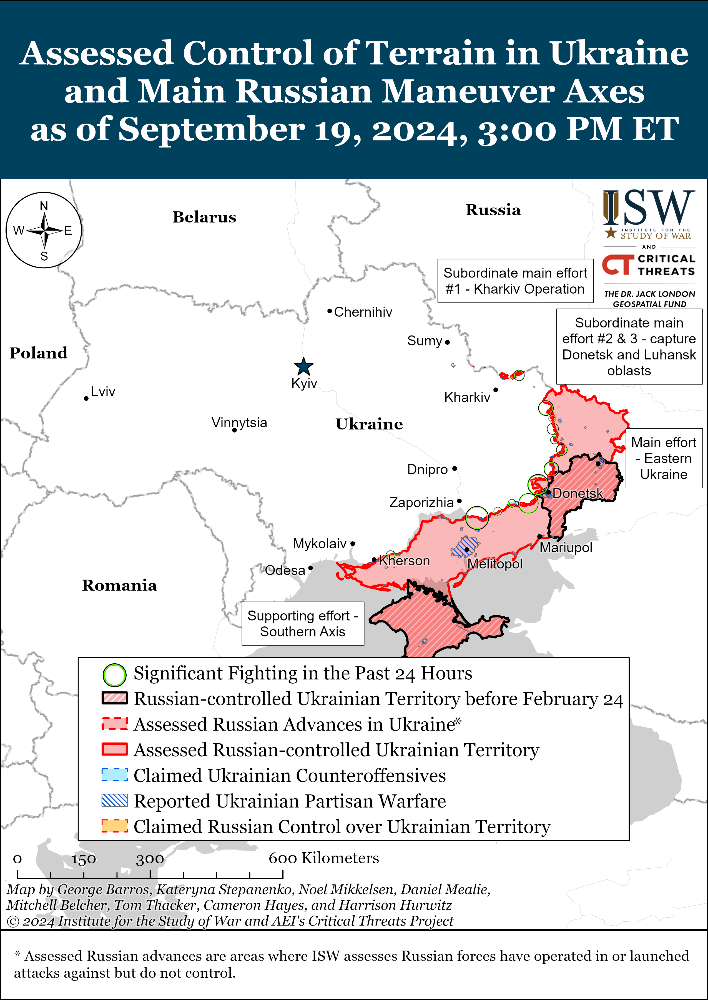
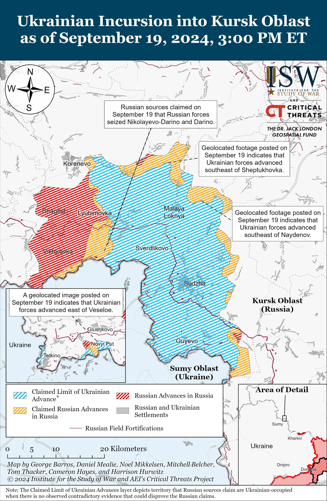
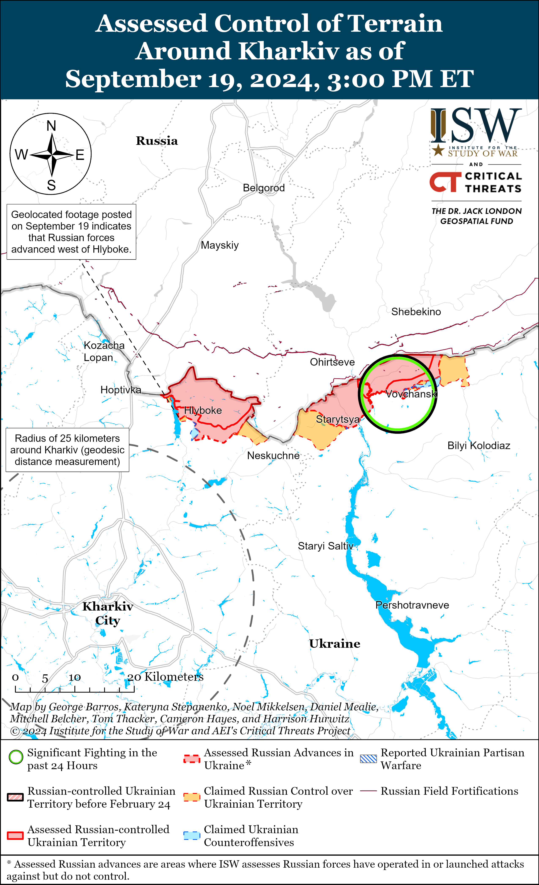
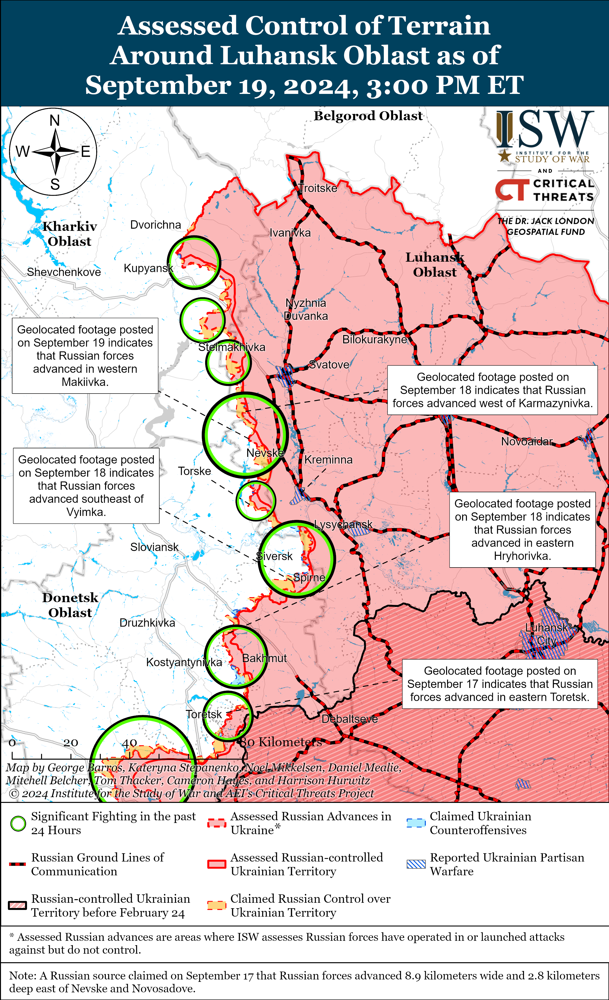
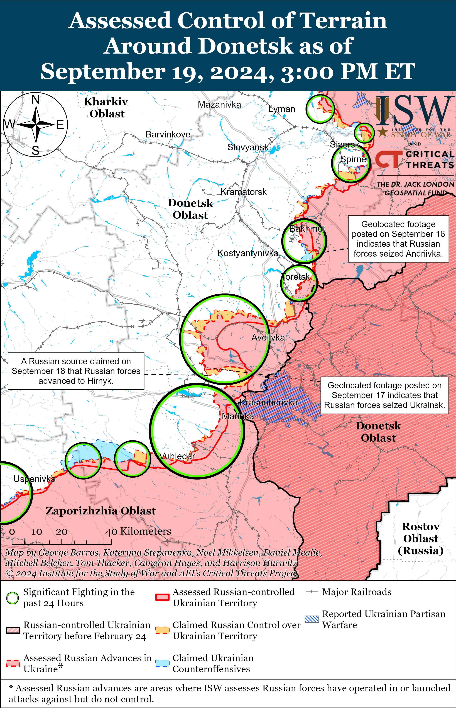
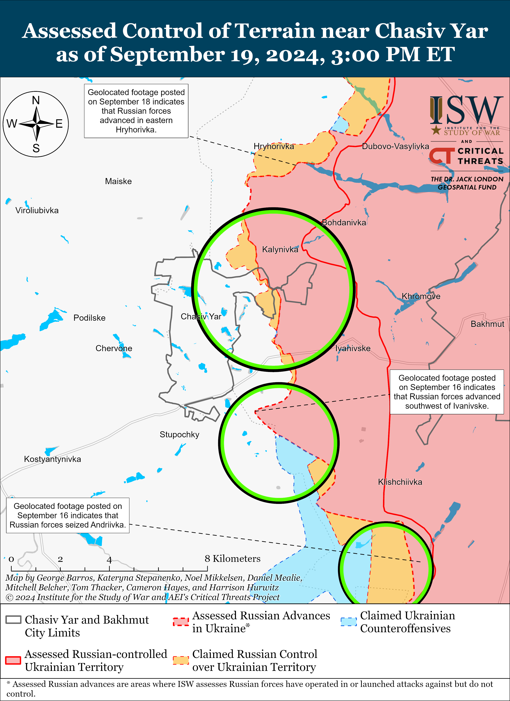
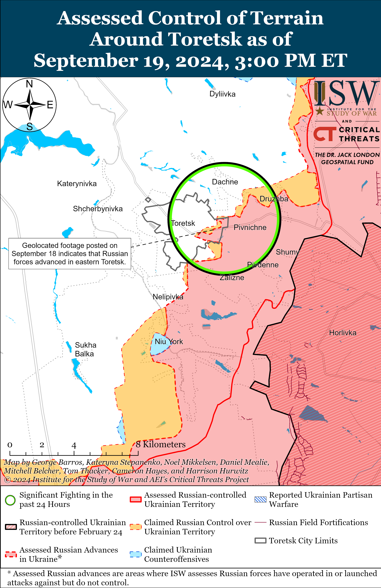
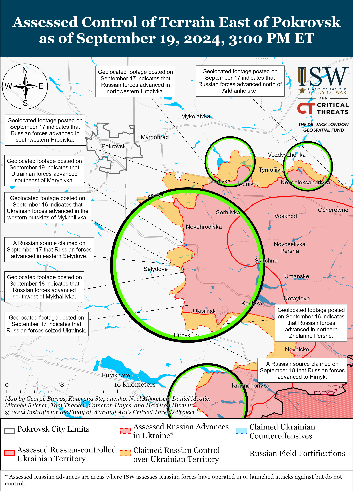
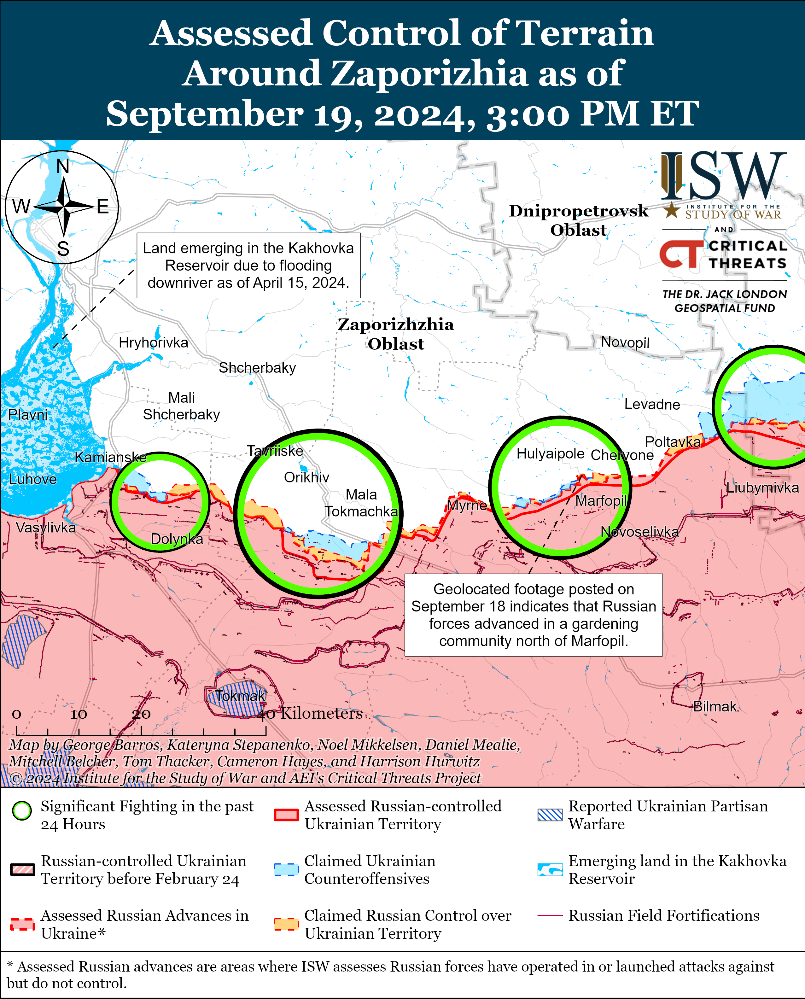
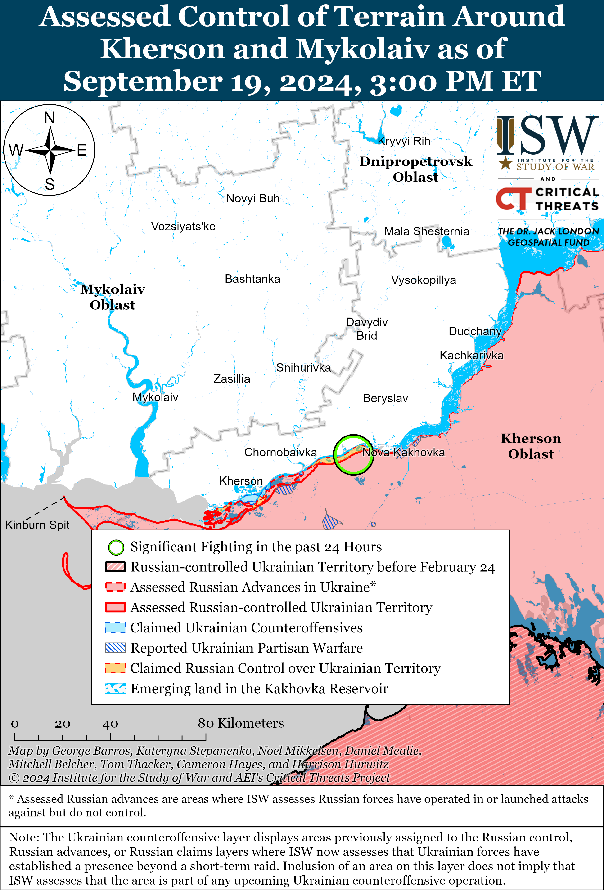

# Russian Offensive Campaign Assessment, September 19, 2024

**Kateryna Stepanenko, Riley Bailey, Angelica Evans, Davit Gasparyan,**

**Haley Zehrung, and Frederick W. Kagan**

**September 19, 2024, 9:25pm ET**

**Click** [**here**](https://storymaps.arcgis.com/stories/36a7f6a6f5a9448496de641cf64bd375) **to see ISW’s interactive map of the Russian invasion of Ukraine. This map is updated daily alongside the static maps present in this report.**

**Click** [**here**](https://storymaps.arcgis.com/stories/83a2f24901c941d581c0c523ecd2619b) **to see ISW’s interactive map of Ukraine’s offensive in Kursk Oblast.**

**Click** [**here**](https://understandingwar.maps.arcgis.com/apps/instant/3dviewer/index.html?appid=1602762dbcde419bb957dea358449580) **to see ISW’s 3D control of terrain topographic map of Ukraine. Use of a computer (not a mobile device) is strongly recommended for using this data-heavy tool.**

**Click** [**here**](https://storymaps.arcgis.com/stories/733fe90805894bfc8562d90b106aa895) **to access ISW’s archive of interactive time-lapse maps of the Russian invasion of Ukraine. These maps complement the static control-of-terrain map that ISW produces daily by showing a dynamic frontline. ISW will update this time-lapse map archive monthly.**

**Note: The data cut-off for this product was 13:00 pm ET on September 19. ISW will cover subsequent reports in the September 20 Russian Offensive Campaign Assessment.**

**Russian President Vladimir Putin reportedly declined a request from the Russian Ministry of Defense (MoD) to offset Russian losses by declaring another mobilization wave in spring 2024 likely to avoid political costs associated with involuntary reserve call-ups. Putin has since remained committed to his crypto mobilization campaign, constraining Russia’s mobilization potential.** The *Wall Street Journal* (*WSJ*), citing a source “briefed” on an exchange between Putin and Russian MoD officials several months prior to the presidential inauguration in May 2024, reported that Putin dismissed the Russian MoD’s calls for another mobilization wave.[1] The source claimed that Putin instead stated his intent to only recruit people who were voluntarily signing military service contracts but that more Russian officials are convinced that mobilization is inevitable. The source added that the Russian military’s current manpower is insufficient to achieve Russia’s long-term goal of occupying all of Ukraine, degrading overall Ukrainian combat capability, and protecting the Russian state border. Kremlin Spokesperson Dmitry Peskov reiterated that Russia continues to rapidly recruit contract servicemen (*kontraktniki*) and volunteers and that these forces are sufficient for Russia’s aggression against Ukraine in response to a request from *WSJ*. Putin has avoided declaring another partial mobilization call-up of reservists since his decision to mobilize 300,000 troops in late September 2022 in response to successful Ukrainian counteroffensive operations, and Russia appears to lack the necessary manpower resources to simultaneously sustain the scale and tempo of Russian offensive operations in Ukraine and defensive efforts in Russian border regions.[2] A mobilized Russian servicemember and milblogger claimed in late August 2024 that the Russian government continues to rely on the remnants of regular military forces, mobilized personnel, and deceived short-term volunteers to continue Russian offensive operations in Ukraine, even though these elements are ill-prepared and have been suffering significant losses since October 2023.[3]

**Mobilization in Russia remains unlikely in the near to medium term due to Putin’s personal fear that mobilization is a direct threat to his regime’s stability.** ISW observed reports speculating about the possibility of Russia declaring another mobilization wave prior to Putin’s inauguration and following the Ukrainian incursion into Kursk Oblast in August 2024, but Putin has not yet authorized such mobilization.[4] Russian opposition outlet *Meduza* reported that sources close to the Russian government claimed that the Kremlin entertained the idea of mobilization immediately after Ukraine’s incursion, but that the Russian Cabinet of Ministers and Kremlin-affiliated businessmen opposed these considerations.[5] Putin has also been consistently signaling throughout the incursion his commitment to recruiting volunteers by boasting about the number of volunteers interested in fighting in Ukraine and meeting with Russian volunteers in response to the incursion.[6] Putin notably did not seize on the incursion as an opportunity to condition Russian society for mobilization in the immediate to medium term, instead choosing to form new irregular formations and expand Russian volunteer recruitment efforts.[7] The Kremlin and the Russian MoD notably shocked Russian society with the declaration of partial mobilization in late September 2022, and Putin likely seeks to avoid societal backlash in response to a new mobilization wave at this time.[8]

**Russian authorities have reportedly tasked Russian forces with pushing Ukrainian forces out of Kursk Oblast by mid-October 2024 and establishing a “buffer zone” into Ukrainian border areas along the international border with Russia in northeastern Ukraine by the end of October — significant undertakings that the Russian military is very unlikely to achieve in such a short period of time.** Ukrainian newswire *RBC-Ukraine* reported on September 19 that unspecified sources stated that Russian forces have concentrated 37,000 personnel in Kursk Oblast and that Russian authorities have instructed these forces to push Ukrainian forces out of Kursk Oblast by mid-October.[9] *RBC-Ukraine’s* sources stated that the Kremlin wanted to concentrate a grouping of forces in Kursk Oblast that had a five-to-one manpower advantage over Ukrainian forces before launching a counteroffensive operation but did not establish such a grouping before launching a “counteroffensive” on September 10.[10] Russian forces have begun counterattacks within the Ukrainian salient in Kursk Oblast but have not yet started large-scale combat operations that would indicate a concerted counteroffensive operation aimed at completely expelling Ukrainian forces from Kursk Oblast.[11] Sustained Russian counteroffensive operations within Kursk Oblast will require Russian forces to redeploy additional elements from Ukraine to Kursk Oblast and/or commit newly generated forces from within Russia to the area instead of the frontline in Ukraine.[12] Ukrainian forces have not established control of all areas throughout the entire salient in Kursk Oblast, but Ukrainian forces most certainly have prepared positions within some areas of the salient that will pose challenges to any concerted Russian counteroffensive effort.[13]

*RBC-Ukraine’s* sources stated that Russian authorities have also tasked Russian forces with creating a “buffer zone” on the territory of “border oblasts bordering Russia” by October 30 — presumably an order to advance into Ukrainian territory along the international border to push Ukrainian fire elements further back from Russian territory.[14] Russian forces aimed to create a “buffer zone” in northern Kharkiv Oblast when they launched their offensive operation in the area on May 10, but have since only advanced roughly 10 kilometers in depth at most in northern Kharkiv Oblast.[15] The Ukrainian incursion into Kursk Oblast reportedly spoiled planned Russian offensive operations outside of northern Kharkiv Oblast in the international border area that likely aimed to expand the area of combat operations across a broader front in northeastern Ukraine and further fix and stretch Ukrainian forces along a longer front.[16] A Russian counteroffensive operation to push Ukrainian forces out of Kursk Oblast followed immediately by a subsequent incursion into Ukrainian border oblasts reminiscent of Russia’s offensive operation into northern Kharkiv Oblast would be a massive operational effort that would require a substantial allocation of manpower and materiel. The Russian military command has demonstrated a desire to shield the priority Russian offensive operation in the Pokrovsk direction from the operational pressures caused by Ukraine’s incursion into Kursk Oblast, but a Russian counteroffensive followed immediately by an offensive operation along the international border would most certainly generate operational requirements that would impact Russia’s already degraded capability to funnel more manpower and materiel into the drive on Pokrovsk.[17]

**The Kremlin continues to signal its commitment to improving Russian drone operations in Ukraine and drone production capabilities amid efforts to offset the social and economic impacts of a protracted Russian war effort.** Russian President Vladimir Putin met with Russia’s Military-Industrial Commission on September 19 and discussed ongoing efforts to increase Russian drone production.[18] Putin acknowledged that drones are an integral part of modern warfare and that Russia’s war in Ukraine has further confirmed this assessment. Putin claimed that Russian companies delivered roughly 140,000 drones to Russian forces in 2023 and claimed that Russia plans to increase its drone production by ten-fold (to 1.4 million drones) in 2024. Putin emphasized that Russia must “consistently” increase its drone production capabilities and improve the effectiveness of Russian-produced drones in order to meet the needs of the Russian military. Putin praised Russia’s private drone production initiatives or “people’s defense industry” and noted that these private initiatives have joined forces with state defense enterprises to increase Russia’s national drone production capabilities. Putin noted that privately produced drones are not “inferior” to drones produced by state defense companies and that the Russian Ministry of Defense (MoD) extensively tests all drone models before transferring the drones to frontline Russian forces. A *DW* investigation, however,observed evidence that suggests that some Russian irregular forces may be testing newly-developed drones in strikes on Ukrainian civilians, possibly to speed up the testing periods.[19] Putin thanked Russian volunteer organizations for providing drones and electronic warfare (EW) systems to frontline Russian units. Putin also visited Russia’s Special Technology Center in St. Petersburg, which specializes in drone, EW system, and communication systems production and inspected new drone types at the facility.[20] Russian milbloggers also reported that Putin met with and inspected drones from private drone production initiatives and praised the drone producers for their work.[21] Russian milbloggers have consistently complained about the poor quality of state-produced drones and often praise private drone production initiatives for producing more effective drones.[22]

Putin’s claims that Russian plans to increase the drone-production to 1.4 million drones in 2024 is slightly lower than planned Ukrainian drone production rates in 2024. Ukraine’s Deputy Minister of Strategic Industrial Hanna Hvozdyar noted in March 2024 that Ukraine intends to produce two million drones in 2024, and Ukrainian officials have repeatedly emphasized that Ukraine is prioritizing modernizing and constantly developing new drones to meet the needs of Ukrainian servicemembers.[23]

**Putin claimed that Russia must ensure that there are “no barriers” to the movement of Russian citizens between mainland Russia and Kaliningrad Oblast.[24]** Putin claimed during a meeting with recently elected heads of Russian federal subjects (regions) and occupied Crimea on September 19 that Kaliningrad Oblast is Russia’s “western outpost” and that Russia must strive to ensure that Kaliningrad Oblast is not only an “outpost” or a “fortress” on Russia’s western borders but is also well integrated into Russian society and the Russian economy. Putin stated that Russia will never “forget” about Kaliningrad Oblast and that Kaliningrad Oblast must continue to develop in accordance with Russia’s social and cultural values. Kaliningrad Oblast is a Russian federal subject situated between Lithuania and Poland on the coast of the Baltic Sea, and some Russians travel between mainland Russia and Kaliningrad by train or car via Belarus and NATO member states Latvia and Lithuania.[25] The Russian Ministry of Defense (MoD) proposed in May 2024 that the Russian government should reassess Russia’s maritime borders in the Baltic Sea, including around Kaliningrad Oblast, so that these borders “correspond to the modern geographical situation,” and Russian authorities repeatedly threatened NATO member states, including Finland and the Baltic States, in late 2023 and early 2024. [26] Putin’s comments about maintaining Kaliningrad’s cultural and social ties to Russia are likely aimed at his domestic audience, although Putin may be setting conditions for future Russian aggression against the Baltic States under the guise of defending Kaliningrad Oblast.

**The reported transfer of Indian artillery shells through European intermediaries to Ukraine is reportedly generating tensions within the Russian–Indian relationship.** *Reuters*, citing 11 Indian and European government officials and unspecified defense industry sources, reported on September 19 that Ukraine has acquired Indian artillery shells procured through European intermediaries for over a year despite Russian objections.[27] *Reuters* noted that European countries, including Italy and Czechia, have purchased empty artillery shells from India, filled them with explosives, and shipped them to Ukraine. *Reuters* stated that customs records reveal that shipments to Ukraine included 155mm, 120mm, and 125mm ammunition shells. *Reuters* stated that the Kremlin has addressed the supply issue with Indian officials on multiple occasions including during a July 2024 meeting between Russian Foreign Minister Sergei Lavrov and Indian Foreign Minister Subrahmanyam Jaishankar, but that New Delhi has reportedly not intervened to halt the trade. The Indian Ministry of External Affairs dismissed the *Reuters* report as “speculative and misleading” on September 19.[28] The *Reuters* report comes amid complications in Russian–Indian bilateral relations and following Modi’s August 23 visit to Ukraine during which Modi highlighted principles of international law, including sovereignty and territorial integrity, in discussions with Ukrainian President Volodymyr Zelensky.[29] Modi’s comments with Zelensky contrast with his July 9 meeting with Russian President Vladimir Putin during which Modi made rather vague statements of peace.[30]

**The European Parliament called on member states to lift restrictions on Ukraine’s ability to use Western-provided long-range systems to strike military objects in Russia.** The European Parliament adopted a resolution on September 19 encouraging its members to allow Ukraine to use western-provided weapons to strike “legitimate military targets” in Russia.[31] The European Parliament called on all European Union (EU) and NATO members to commit to providing annual military support to Ukraine at a minimum of 0.25 percent of the member’s GDP. The statement comes against the backdrop of ongoing Western hesitation to lift restrictions on long-range strikes into Russia.[32]

**Key Takeaways:**

- **Russian President Vladimir Putin reportedly declined a request from the Russian Ministry of Defense (MoD) to offset Russian losses by declaring another mobilization wave in spring 2024 likely to avoid political costs associated with involuntary reserve call-ups. Putin has since remained committed to his crypto mobilization campaign, constraining Russia’s mobilization potential.**
- **Mobilization in Russia remains unlikely in the near to medium term due to Putin’s personal fear that mobilization is a direct threat to his regime’s stability.**
- **Russian authorities have reportedly tasked Russian forces with pushing Ukrainian forces out of Kursk Oblast by mid-October 2024 and establishing a “buffer zone” into Ukrainian border areas along the international border with Russia in northeastern Ukraine by the end of October — significant undertakings that the Russian military is very unlikely to achieve in such a short period of time.**
- **The Kremlin continues to signal its commitment to improving Russian drone operations in Ukraine and drone production capabilities amid efforts to offset the social and economic impacts of a protracted Russian war effort.**
- **Putin claimed that Russia must ensure that there are “no barriers” to the movement of Russian citizens between mainland Russia and Kaliningrad Oblast.**
- **The reported transfer of Indian artillery shells through European intermediaries to Ukraine is reportedly generating tensions within the Russian-Indian relationship.**
- **The European Parliament called on member states to lift restrictions on Ukraine’s ability to use Western-provided long-range systems to strike military objects in Russia.**
- **Ukrainian forces recently marginally advanced in Kursk Oblast.**
- **Ukrainian forces recently advanced near Pokrovsk, and Russian forces recently advanced near Kharkiv City, Svatove, Siversk, Chasiv Yar, Pokrovsk, and Hulyaipole.**
- **Russian President Vladimir Putin indicated during a meeting on the development of the Russian Armed Forces on September 18 that the Kremlin aims to improve Russia’s federal level training system.**

[****](https://understandingwar.org/wp-content/uploads/2025/05/DraftUkraineCoT20September20192C202024.png)

***We do not report in detail on Russian war crimes because these activities are well-covered in Western media and do not directly affect the military operations we are assessing and forecasting. We will continue to evaluate and report on the effects of these criminal activities on the Ukrainian military and the Ukrainian population and specifically on combat in Ukrainian urban areas. We utterly condemn Russian violations of the laws of armed conflict and the Geneva Conventions and crimes against humanity even though we do not describe them in these reports.***

- Ukrainian Operations in the Russian Federation
- Russian Main Effort – Eastern Ukraine (comprised of three subordinate main efforts)
- Russian Subordinate Main Effort #1 – Push Ukrainian forces back from the international border with Belgorod Oblast and approach to within tube artillery range of Kharkiv City
- Russian Subordinate Main Effort #2 – Capture the remainder of Luhansk Oblast and push westward into eastern Kharkiv Oblast and encircle northern Donetsk Oblast
- Russian Subordinate Main Effort #3 – Capture the entirety of Donetsk Oblast
- Russian Supporting Effort – Southern Axis
- Russian Air, Missile, and Drone Campaign
- Russian Mobilization and Force Generation Efforts
- Russian Technological Adaptations
- Activities in Russian-occupied areas
- Ukrainian Defense Industrial Base Efforts
- Russian Information Operations and Narratives
- Significant Activity in Belarus

**Ukrainian Operations in the Russian Federation**

Ukrainian forces recently marginally advanced west of the Ukrainian salient in Kursk Oblast amid continued Ukrainian assaults in the area on September 19. Geolocated footage published on September 19 indicates that Ukrainian forces recently marginally advanced east of Veseloye (west of the Ukrainian salient and south of Glushkovo).[33] A Russian milblogger also claimed that Ukrainian forces marginally advanced within central Medvezhye (southeast of Glushkovo).[34] Chechen Akhmat Spetsnaz Commander Apty Alaudinov claimed during an interview published on September 19 that Ukrainian forces are trying to advance near Veseloye (south of Korenevo and near the international border).[35] Ukrainian forces reportedly attacked west of the Ukrainian salient near Novy Put, Obukhovka, and Medvezhye (all south of Glushkovo).[36]

Ukrainian forces recently advanced further on the northern side of Ukraine’s salient in Kursk Oblast and continued assaults in the area on September 19. Geolocated footage published on September 19 indicates that Ukrainian forces recently advanced southeast of Sheptukhovka (northeast of Korenevo) and southeast of Naydenov (north of Sudzha).[37] Ukrainian forces reportedly attacked within the Ukrainian salient near Lyubimovka, Obukhovka (both southeast of Korenevo and east of Snagost), Kremyanoye (east of Korenevo), and Borki (southeast of Sudzha).[38]

Russian forces reportedly advanced in Kursk Oblast on September 19. Alaudinov claimed on September 19 that Russian forces advanced along the southwestern edge of the Ukrainian salient and seized Nikolayevo-Daryino and Daryino.[39] Russian milbloggers claimed that Russian forces also advanced west of the Ukrainian salient near Obukhovka and along the outskirts of the Ukrainian salient southeast of Korenevo and northwest of Lyubimovka, but ISW has not observed confirmation of these claims.[40] Elements of the newly-formed “Kursk Knights” detachment (Donetsk People’s Republic [DNR] “Pyatnashka” international volunteer brigade), which is reportedly staffed by residents of Kursk Oblast, are reportedly operating near Borki.[41] Elements of the Russian 2nd Spetsnaz Brigade (Russian General Staff’s Main Directorate [GUR]) and 810th Naval Infantry Brigade (Black Sea Fleet [BSF], Southern Military District [SMD]) reportedly continue to operate in Kursk Oblast.[42]

Additional satellite imagery captured on September 19 shows that there are ongoing fires at the Russian Ministry of Defense (MoD) Main Missile and Artillery Directorate’s 107th Arsenal in Toropets, Tver Oblast following the September 18 Ukrainian drone strike.[43] A source within Ukrainian defense intelligence told Ukrainian outlet *RBC Ukraine* on September 18 that Ukrainian forces used over 100 drones during the September 18 drone strike, although it is unclear if the source is referring to the wider drone strike against targets in Russia or the Toropets strike specifically.[44]

Ukrainian Kharkiv Group of Forces Spokesperson Colonel Vitaly Sarantsev stated on September 19 that Russian forces mined unspecified dams in Belgorod Oblast to possibly slow Ukrainian advances in the event of a Ukrainian incursion into Belgorod Oblast.[45] Sarantsev noted that Russian forces may conduct false flag attacks against dams in Belgorod Oblast to blame Ukraine for the corresponding flooding and humanitarian disaster in order to further mobilize Russian society.[46] Sarantsev added that Russian forces are actively building fortifications around Belgorod City in apparent preparation for possible Ukrainian cross-border activity.[47]

**Russian Main Effort – Eastern Ukraine**

**Russian Subordinate Main Effort #1 – Kharkiv Oblast (Russian objective: Push Ukrainian forces back from the international border with Belgorod Oblast and approach to within tube artillery range of Kharkiv City)**

Russian forces recently advanced north of Kharkiv City amid continued fighting in northern Kharkiv Oblast on September 19. Geolocated footage published on September 19 indicates that Russian forces recently advanced in dacha areas west of Hlyboke (north of Kharkiv City) and along the Travyanske Reservoir.[48] Russian forces continued ground assaults north of Kharkiv City near Hlyboke and northeast of Kharkiv City near Vovchansk and Tykhe on September 18 and 19.[49] A Ukrainian officer operating near Vovchansk stated on September 19 that Russian forces conducting urban assaults within Vovchansk are moving in groups of three to four personnel between positions and typically lose two thirds of their personnel during assaults within the town.[50] Ukrainian Kharkiv Group of Forces Spokesperson Colonel Vitaly Sarantsev stated on September 18 that Russian offensive activity has recently decreased along the Lyptsi-Hlyboke line and that Russian forces are strengthening their positions in the area.[51] Sarantsev stated that Russian forces have recently intensified remote mining at forward positions in the Kharkiv direction in order to restrain possible Ukrainian advances and that Russian forces are currently focused on reconstituting assault groups and improving command and control (C2) and communications in the area to resume offensive operations.[52] Sarantsev added that Russian forces are intensifying drone activities in the Kharkiv direction, particularly to deliver supplies to Russian soldiers at forward positions who are suffering health issues *en masse* because a lack of provisions has forced the personnel to eat food and drink water that they scavenge near their positions.[53] Ukraine’s Kharkiv Group of Forces stated on September 19 that Russian forces are focused on restoring the combat capabilities of elements of the 11th Tank Regiment (18th Motorized Rifle Division, 11th Army Corps [AC], Leningrad Military District [LMD]) near Hlyboke, elements of the 7th Motorized Rifle Regiment (11th AC, LMD) near Lyptsi, and elements of the 380th Motorized Rifle Regiment (47th Tank Division, 1st Guards Tank Army [GTA], Moscow Military District [MMD]) near Lukyantsi (northeast of Kharkiv City).[54] Ukraine’s Kharkiv Group of Forces reported that elements of the 128th Motorized Rifle Brigade (44th AC, LMD) and the 82nd Motorized Rifle Regiment (69th Motorized Rifle Division, 6th Combined Arms Army [CAA], LMD) are operating within Vovchansk.[55]

**Russian Subordinate Main Effort #2 – Luhansk Oblast (Russian objective: Capture the remainder of Luhansk Oblast and push westward into eastern Kharkiv Oblast and northern Donetsk Oblast)**

Russian forces recently made confirmed marginal advances southwest of Svatove amid continued assaults along the Kupyansk-Svatove-Kreminna line on September 19. Geolocated footage published on September 19 indicates that Russian forces recently marginally advanced in western Makiivka (southwest of Svatove) in Luhansk Oblast.[56] Russian milbloggers claimed that Russian forces operating southeast of Kupyansk also advanced towards Hlushkivka, west and north of Pishchane, and south of Stelmakhivka.[57] ISW has not observed confirmation of these claims, however. The Ukrainian General Staff reported that Russian forces continued ground attacks northeast of Kupyansk near Synkivka ; northwest of Svatove near Stelmakhivka, Hlushkivka, Kruhlyakivka, and Pishchane; southwest of Svatove near Druzhelyubivka, Makiivka, Cherneshchyna, Nevske, and Novosadove; and west of Kreminna near Torske on September 18 and 19.[58] Russian milbloggers amplified footage purportedly showing that Russian forces destroyed a bridge over the Oskil River near Kupyansk-Vuzlovyi (just southeast of Kupyansk).[59] Elements of the Russian 375th Separate Anti-Tank Artillery Battalion (47th Tank Division, 1st Guards Tank Army [GTA], Moscow Military District [MMD]) reportedly continue to operate in the Kupyansk direction.[60]

[****](https://understandingwar.org/wp-content/uploads/2025/05/Luhansk20Battle20Map20Draft20September20192C202024.png)

**Russian Subordinate Main Effort #3 – Donetsk Oblast (Russian objective: Capture the entirety of Donetsk Oblast, the claimed territory of Russia’s proxies in Donbas)**

Russian forces recently advanced southeast of Siversk amid continued assaults in the area on September 19. Geolocated footage published on September 18 indicates that Russian forces recently advanced southeast of Vyimka (southeast of Siversk).[61] Russian forces continued assaults east of Siversk near Verkhnokamyanske and southeast of Siversk near Ivano-Daryivka and Vyimka on September 18 and 19.[62] Elements of the Russian 2nd Artillery Brigade (3rd Combined Arms Army [CAA], formerly 2nd Luhansk People’s Republic Army Corps [LNR AC]) are reportedly operating in the Siversk direction.[63]

Russian forces recently marginally advanced north of Chasiv Yar amid continued offensive operations in the area on September 19. Geolocated footage published on September 18 indicates that Russian forces recently marginally advanced in Hryhorivka (north of Chasiv Yar). A Ukrainian brigade operating in the Chasiv Yar direction published footage on September 18 showing Ukrainian forces striking Russian forces attempting to cross the Siverskyi-Donets Donbas Canal near Chasiv Yar with drones.[64] The Ukrainian General Staff reported that Russian forces continued offensive operations near Chasiv Yar itself; south of Chasiv Yar near Stupochky and Bila Hora; and southeast of Chasiv Yar near Kurdyumivka on September 18 and 19.[65]

Russian forces continued offensive operations in the Toretsk direction on September 19 but did not make any confirmed advances. Russian milbloggers claimed on September 19 that Russian forces advanced 150 meters in eastern Toretsk and seized an unspecified waste heap north of Zalizne (southeast of Toretsk).[66] Fighting continued within eastern Toretsk; northeast of Toretsk near Dachne; south of Toretsk near Nelipivka; and near Toretsk in the direction of Shcherbynivka on September 18 and 19. [67]

Ukrainian forces recently recaptured territory and Russian forces recently marginally advanced in the Pokrovsk direction amid continued fighting on September 19. Geolocated footage published on September 19 indicates that Ukrainian forces recently marginally advanced southeast of Marynivka (southeast of Pokrovsk and northeast of Selydove).[68] Geolocated footage published on September 18 indicates that Russian forces recently marginally advanced southwest of Mykhailivka (southeast of Pokrovsk and just east of Selydove).[69] A Ukrainian spokesperson reported that Russian forces are attempting to deploy sabotage and reconnaissance groups near Selydove in order to get behind Ukrainian positions in the area and conduct reconnaissance.[70] The spokesperson also reported that Russian forces are conducting assaults in small infantry groups comprised of three to 10 people in the Pokrovsk direction.[71] Russian milbloggers claimed that Russian forces advanced in northern Hrodivka (east of Pokrovsk) and northwest of Ukrainsk, north of Hirnyk, and in the direction of Selydove (all located southeast of Pokrovsk).[72] A Kremlin-affiliated Russian milblogger claimed on September 18 that Russian forces control 80 percent of Hrodivka (east of Pokrovsk).[73] ISW has assessed that Russian forces occupy approximately 60 percent of Hrodivka, however. The Ukrainian General Staff reported that Russian forces conducted ground attacks east of Pokrovsk near Vozdvyzhenka, Myrolyubivka, Novooleksandrivka, Novotoretske, Hrodivka, Vozdvyzhenka, Krasnyi Yar, and southeast of Pokrovsk near Mykolaivka, Novohrodivka, Marynivka, Mykhailivka, Zhelanne Pershe, Ukrainsk, and Tsukuryne on September 18 and 19.[74] Elements of the Russian 3rd “Atlant” Motorized Rifle Battalion of the Russian 35th Motorized Rifle Brigade (41st Combined Arms Army [CAA], Central Military District [CMD]) are reportedly operating in Hrodivka.[75] Artillerymen of the Russian “Volga” Brigade are reportedly also operating in the Pokrovsk direction.[76]

Russian forces operating west of Donetsk City continued offensive operations near Heorhiivka and in the direction of Dalne on September 19, but did not make any confirmed advances.[77] The Russian Ministry of Defense (MoD) and several Russian milbloggers claimed on September 19 that Russian forces seized Heorhiivka.[78] ISW previously assessed that Russian forces seized Heorhiivka on June 14, however.[79] Ukrainian military observer Kostyantyn Mashovets stated on September 19 that elements of the Russian 8th CAA (Southern Military District [SMD]) are operating in the Kurakove direction, including its 1st, 5th, 9th, and 110th motorized rifle brigades; 20th Motorized Rifle Division; and most of the 155th Motorized Rifle Division.[80]

Russian forces continued offensive operations southwest of Donetsk City on September 19, but there were no confirmed changes to the frontline. Russian forces attacked near Vuhledar, Kostyantynivka, Katerynivka, Bohoyavlenka, and Vodyane on September 18 and 19.[81] Mashovets stated on September 19 that a “tactical group” of the Russian Central Grouping of Forces is operating west and north of Vuhledar with the task of seizing Vuhledar and the Pivdennodonbaska Mine No. 1.[82] Mashovets stated that elements of the Russian 39th Motorized Rifle Brigade (68th Army Corps [AC], Eastern Military District [EMD]) and likely elements of the 36th Motorized Rifle Brigade (29th CAA, EMD) and the 57th Motorized Rifle Regiment (6th Motorized Rifle Division, 3rd AC) are operating near Vuhledar.[83] Elements of the Russian 150th Motorized Rifle Division (8th CAA, SMD) are reportedly operating south of Donetsk City.[84]

Russian forces continued ground assaults in the Donetsk-Zaporizhia Oblast border area on September 19, but there were no confirmed changes to the frontline. Russian forces conducted offensive operations in the Donetsk-Zaporizhia Oblast border area southeast of Velyka Novosilka near Zolota Nyva; south of Velyka Novosilka near Makarivka; and southwest of Velyka Novosilka near Novodarivka and Rivnopil and towards Solodke on September 18 and 19.[85]

**Russian Supporting Effort – Southern Axis (Russian objective: Maintain frontline positions and secure rear areas against Ukrainian strikes)**

Russian forces recently made marginal gains in eastern Zaporizhia Oblast near Hulyaipole. Geolocated footage published on September 18 shows Ukrainian forces striking a Russian-occupied building in a gardening community north of Marfopil (immediately southeast of Hulyaipole), indicating that Russian forces advanced further in the area during previous assaults.[86] The Ukrainian General Staff reported that Russian forces attacked near Hulyaipole on September 19.[87]

Limited positional engagements continued in western Zaporizhia Oblast on September 19, but there were no confirmed changes to the frontline. The Ukrainian General Staff reported that Russian forces conducted ground attacks north of Robotnye near Novodanylivka, northeast of Robotyne near Mala Tokmachka, northwest of Robotyne in the direction of Novoandriivka, and west of Robotyne and southeast of Stepnohirsk near Pyatykhatky.[88] Elements of the Russian 234th VDV Regiment (76th VDV Division) are reportedly operating in the Zaporizhia direction.[89]

Russian forces conducted limited ground attacks in the east (left) bank Kherson Oblast.[90] Elements of the 18th Combined Arms Army [CAA] (Southern Military District [SMD]) are reportedly operating in the Kherson direction.[91]

**Russian Air, Missile, and Drone Campaign (Russian Objective: Target Ukrainian military and civilian infrastructure in the rear and on the frontline)**

Russian forces conducted a limited number of drone and missile strikes against Ukraine on the night of September 18 to 19. The Ukrainian Air Force reported that Russian forces launched three S-300/S-400 air defense missiles from Belgorod Oblast, a Kh-59/69 cruise missile from airspace over occupied Zaporizhia Oblast, and 42 Shahed-136/131 drones from Primorsko-Akhtarsk, Krasnodar Krai and Kursk Oblast.[92] The Ukrainian Air Force stated that Ukrainian forces downed all 42 Shahed drones over Dnipropetrovsk, Kyiv, Vinnytsia, Zhytomyr, Rivne, Cherkasy, Kirovohrad, Mykolaiv, and Kherson oblasts and the Kh-59/69 cruise missile over eastern Ukraine.[93] Ukraine’s Kharkiv Group of Forces reported that Russian forces struck unspecified areas in Kharkiv Oblast with three unspecified missiles on September 18.[94]

**Russian Mobilization and Force Generation Efforts (Russian objective: Expand combat power without conducting general mobilization)**

Russian President Vladimir Putin indicated during a meeting on the development of the Russian Armed Forces on September 18 that the Kremlin aims to improve Russia’s federal level training system, at least in part to staff new military districts.[95] Putin claimed that Russian regional and federal authorities must cooperate to staff the Russian Armed Forces with trained and educated personnel and to staff military units and formations of new military districts (referring to the newly reformed Moscow and Leningrad military districts [MMD/LMD]) in constant combat readiness. Putin stated that Russia must use all available resources including modern training bases belonging to pre-conscription training organizations, military universities, training grounds, and methodological centers to train Russian military personnel. Putin noted that he had recently signed a decree to increase the size of the Russian Armed Forces, which will be effective starting December 1, 2025, to address staffing issues.

The Indian government announced that Russia discharged dozens of the 91 Indian nationals who were duped into fighting in Ukraine with the Russian Armed Forces.[96] *BBC,* citing interviews with released Indian nationals, reported that unspecified agents lured citizens from poor families by promising them money and jobs, sometimes as support staff for the Russian military.[97] *BBC* reported that many interviewed Indian nationals recalled being sent to the frontlines in Ukraine with little to no military training and that at least nine Indian nationals have died in the war. Indian officials previously reported that Putin pledged to return Indian volunteers fighting in Ukraine during Indian Prime Minister Narendra Modi’s visit to Russia in July 2024.[98]

The Kremlin continues to signal great concern over long-term demographic problems in Russia, which have been exacerbated by Russian personnel losses in Ukraine. Russian Federation Council Chairperson Valentina Matvienko expressed support on September 18 for a bill that would ban “child-free propaganda,” or content promoting lifestyles without children, and noted that the state cannot allow the “proliferation” of such ideology.[99] The Russian State Duma previously introduced a bill in September 2022 that would ban the distribution of ”child-free” content among minors, but later removed this bill from consideration in March 2023.[100] Russian Deputy Minister of Justice Vsevolod Vukolov earlier stated on June 27 that Russian State Duma deputies are preparing a bill to ban the so-called “child-free” “ideology, and ISW assessed that the Kremlin may be using indirect means to bypass Russian law and codify a state ideology that emphasizes Russia’s “traditional” social values while attempting to increase Russia’s birth rate.[101] Russian opposition outlet *Verstka* reported that a Tver Oblast court ordered to ban three small Russian *VK* pages on August 23 that published memes about ”child-free” lifestyles, claiming that such content “contradicts the goals and objectives of the current legislation.”[102]

**Russian Technological Adaptations (Russian objective: Introduce technological innovations to optimize systems for use in Ukraine)**

A Russian milblogger published footage on September 19 claiming to show elements of the Russian 114th Motorized Rifle Brigade (51st Combined Arms Army [CAA], formerly 1st Donetsk People’s Republic [DNR] Army Corps [AC]) testing the “Karakurt” drone from Kalashnikov Concern, a subsidiary of Russian state-owned defense conglomerate Rostec, that reportedly has a one-kilometer flight radius and twenty-minute flight time for fast close tactical reconnaissance.[103] The milblogger claimed that elements of the brigade will redeploy to Ukrainsk in the Pokrovsk direction soon and will test the drones in the area.

**Ukrainian Defense Industrial Efforts (Ukrainian objective: Develop its defense industrial base to become more self-sufficient in cooperation with US, European, and international partners)**

*ISW is suspending publishing coverage of Ukrainian defense industrial efforts until further notice.*

**Activities in Russian-occupied areas (Russian objective: Consolidate administrative control of annexed areas; forcibly integrate Ukrainian citizens into Russian sociocultural, economic, military, and governance systems)**

*ISW is not publishing coverage of Russian-occupied areas today.*

**Russian Information Operations and Narratives**

Ukrainian military officials continued to identify Russian efforts to infiltrate the Ukrainian information space and spy on Ukrainian forces via Telegram. The Ukrainian Center for Strategic Communications (Stratcom) identified a Telegram channel that had targeted Ukrainian military audiences prior to and during the full-scale invasion of Ukraine in an effort to spy on and demoralize Ukrainian military personnel.[104] Ukrainian Stratcom identified that the Telegram channel had ties to Russian military intelligence and routinely published Russian propaganda lines. Ukraine’s Main Military Intelligence Directorate (GUR) identified eight Telegram chatbots that attempted to imitate the GUR’s official “Main Intelligence Bot” chatbot and reported that Russian actors are trying to mislead Ukrainian citizens residing in occupied territories who use the chatbot to transmit information to the GUR.[105]

**Significant activity in Belarus (Russian efforts to increase its military presence in Belarus and further integrate Belarus into Russian-favorable frameworks and Wagner Group activity in Belarus)**

Donetsk Oblast occupation administration head Denis Pushilin met with Belarusian President Alexander Lukashenko on September 19 in Minsk to discuss joint youth programs and the creation of a center for Belarusian goods in occupied Donetsk Oblast.[106] Pushilin also met with the Belarusian Chairman of the House of Representatives of the National Assembly, Igor Sergeenko, to discuss youth cooperation projects.[107] Pushilin stated that children from occupied Donetsk Oblast are currently present in Minsk, Belarus.[108] Belarusian officials and volunteers have previously participated in Russian efforts to deport children from occupied Ukraine to Belarus and Russia, and Pushilin’s focus on youth programs in his meetings with Belarusian officials may portend an increase in Belarusian involvement in Russian deportation schemes.[109]

**Note: ISW does not receive any classified material from any source, uses only publicly available information, and draws extensively on Russian, Ukrainian, and Western reporting and social media as well as commercially available satellite imagery and other geospatial data as the basis for these reports. References to all sources used are provided in the endnotes of each update.**

---

[1] https://www.wsj.com/world/russia/putin-troops-pressure-russia-ukraine-war-5f242a1c?mod=WSJ\_Euronews ; https://t.me/idelrealii/37587

[2] https://isw.pub/RusCampaignSept21

[3] https://understandingwar.org/backgrounder/russian-offensive-campaign-assessment-august-31-2024

[4] https://global dot espreso.tv/vladimir-putin-putin-may-declare-total-mobilization-after-elections-colonel-chernyk-on-serious-danger-to-ukraine; https://www.rferl.org/a/russia-mobilization-war-ukraine-prisons/32873203.html; https://kyivindependent dot com/i-wont-go-russians-grumble-as-kursk-incursion-exposes-kremlins-need-for-mobilization/; https://meduza dot io/news/2024/08/13/bloomberg-iz-za-nehvatki-voennyh-rezervov-novuyu-mobilizatsiyu-v-rossii-mogut-ob-yavit-do-kontsa-2024-goda

[5] https://meduza dot io/feature/2024/08/21/v-kremle-schitayut-chto-boi-v-kurskoy-oblasti-prodlyatsya-neskolko-mesyatsev-i-hotyat-ubedit-rossiyan-chto-eto-novaya-normalnost

[6] https://www.kommersant dot ru/doc/6891385; https://www.interfax dot ru/russia/977358

[7] https://understandingwar.org/backgrounder/russian-offensive-campaign-assessment-august-29-2024

[8] https://www.aljazeera.com/news/2022/9/28/russias-mobilisation-sparks-backlash-over-war-in-ukraine; https://www.cnn.com/2022/11/17/europe/russia-soldiers-desert-battlefield-intl-cmd/index.html

[9] https://www.rbc dot ua/rus/news/rf-trimae-kurskiy-oblasti-37-tisyach-voyakiv-1726730996.html

[10] https://www.rbc dot ua/rus/news/rf-trimae-kurskiy-oblasti-37-tisyach-voyakiv-1726730996.html

[11] https://isw.pub/UkrWar091324 ;

[12] https://isw.pub/UkrWar091424 ; https://understandingwar.org/backgrounder/assessing-significance-current-russian-and-ukrainian-operations-course-war

[13] https://isw.pub/UkrWar091224

[14] https://www.rbc dot ua/rus/news/rf-trimae-kurskiy-oblasti-37-tisyach-voyakiv-1726730996.html

[15] https://isw.pub/UkrWar051724

[16] https://isw.pub/UkrWar091324

[17] https://understandingwar.org/backgrounder/russian-offensive-campaign-assessment-august-17-2024

[18] http://kremlin dot ru/events/president/news/75145

[19] https://m.youtube.com/watch?si=xqVFWRPQ9WIzYZye&v=kuTo94TnMPo&feature=youtu.be

[20] http://kremlin dot ru/events/president/news/75140

[21] https://t.me/vysokygovorit/17393 ; https://t.me/epoddubny/21110 ; https://t.me/voenacher/71968 ; https://t.me/rybar/63657 ; https://t.me/rybar/63658

[22] https://understandingwar.org/backgrounder/russian-offensive-campaign-assessment-april-22-2024 ; https://understandingwar.org/backgrounder/russian-offensive-campaign-assessment-march-10-2024 ; https://understandingwar.org/backgrounder/russian-offensive-campaign-assessment-august-21-2024-0

[23] https://www.kyivpost.com/post/29064 ; https://www.atlanticcouncil.org/blogs/ukrainealert/ukraines-drone-success-offers-a-blueprint-for-cybersecurity-strategy/#:~:text=According%20to%20Ukrainian%20President%20Volodymyr,armored%20vehicles%20on%20the%20battlefield.

[24] http://kremlin dot ru/events/president/news/75126

[25] https://cepa.org/article/russians-discover-a-backdoor-to-europe/ ; https://www.brookings.edu/articles/why-is-kaliningrad-at-the-center-of-a-new-russia-nato-faceoff/ ; https://schengen.news/russian-influx-to-eu-through-loophole-rail-route-to-kaliningrad-raises-security-concerns/

[26] https://isw.pub/UkrWar052224 ; https://isw.pub/UkrWar011624 ; https://isw.pub/UkrWar122623 ; https://isw.pub/UkrWar121923

[27] https://www.reuters.com/world/ammunition-india-enters-ukraine-raising-russian-ire-2024-09-19/; https://mil.in dot ua/uk/news/indiya-postachaye-boyeprypasy-ukrayini-vsuperech-rosijskym-vymogam/; https://www.ukrinform dot ua/rubric-world/3907289-evropejski-kraini-peredaut-ukraini-zakupleni-indijski-snaradi-reuters.html

[28] https://www.thehindu dot com/news/national/speculative-and-misleading-mea-on-media-report-saying-ammunition-from-india-entering-ukraine/article68661185.ece

[29] https://understandingwar.org/backgrounder/russian-offensive-campaign-assessment-august-23-2024

[30] https://understandingwar.org/backgrounder/russian-offensive-campaign-assessment-august-23-2024; https://asia.nikkei dot com/Politics/International-relations/India-PM-Modi-tells-Putin-in-Moscow-peace-is-of-utmost-importance

[31] https://www.europarl dot europa.eu/news/en/press-room/20240913IPR23906/meps-ukraine-must-be-able-to-strike-legitimate-military-targets-in-russia; https://mil.in dot ua/uk/news/yevroparlament-zaklykav-dozvolyty-ukrayini-urazhaty-zahidnoyu-zbroyeyu-vijskovi-tsili-v-rosiyi/#google\_vignette; https://www.ukrinform dot ua/rubric-polytics/3907329-es-prodovzit-dovgostrokovu-finansovu-ta-vijskovu-pidtrimku-ukraini-rezolucia-evroparlamentu.html

[32] https://understandingwar.org/backgrounder/russian-offensive-campaign-assessment-september-11-2024

[33] https://x.com/moklasen/status/1836826572579356679; https://x.com/moklasen/status/1836826576064762034; https://t.me/zhdanovrt/1450; https://t.me/rybar/63631

[34] https://t.me/rybar/63631

[35] https://t.me/wargonzo/22200

[36] https://t.me/mod\_russia/43558 ; https://t.me/rybar/63631 ; https://t.me/dva\_majors/52970

[37] https://t.me/warriorofnorth/2788; https://t.me/creamy\_caprice/6859 ; https://t.me/rusich\_army/17201; https://x.com/seanders\_geo/status/1836733220630499445

[38] https://t.me/mod\_russia/43558 ; https://t.me/rybar/63631 ; https://t.me/dva\_majors/52970

[39] https://t.me/tass\_agency/273752 ; https://t.me/tass\_agency/273664 ; https://t.me/DnevnikDesantnika/15716

[40] https://t.me/rybar/63631 ; https://t.me/dva\_majors/52970

[41] https://t.me/tass\_agency/273677

[42] https://t.me/wargonzo/22200 ; https://t.me/Sladkov\_plus/11426

[43] https://twitter.com/bradyafr/status/1836772681766588547 ; https://twitter.com/Tatarigami\_UA/status/1836472353150390650

[44] https://newsukraine.rbc dot ua/analytics/will-strike-on-russia-s-toropets-arsenal-1726679973.html

[45] https://t.me/otukharkiv/1457

[46] https://t.me/otukharkiv/1457

[47] https://t.me/otukharkiv/1457

[48] https://x.com/AudaxonX/status/1836744291676213674; https://t.me/volksotn/270; https://t.me/wtormbat4\_92OWBr/86; https://t.me/creamy\_caprice/6858

[49] https://www.facebook.com/GeneralStaff.ua/posts/pfbid0sWmhwCRqMcs8hEDBjvtXf7WuuoSsLu2D6WiCPvwzEKNKZXkVaf26MEvRCmm6DQ31l ; https://www.facebook.com/GeneralStaff.ua/posts/pfbid0H2b5sLTYGQapCqwChRGkqwMyyakUkWRrxTz8Ai8nxocBTqtr9M9o1q8sN3hcL5TRl ; https://www.facebook.com/GeneralStaff.ua/posts/pfbid0oJBkAAMcdjWynbUn6KayNrDQdujvVAF5qyxjwpKa8zNr2JBKhaJUHWwqPZgYweGl ; https://t.me/wargonzo/22193

[50] https://armyinform dot com.ua/2024/09/19/vyzhyvaye-tretyna-u-vovchansku-vorog-stabilno-vtrachaye-do-70-shturmovykiv/; https://youtu.be/j5TqaWCCdUg

[51] https://armyinform dot com.ua/2024/09/18/bpla-dlya-postachannya-zastosovuyut-rosiyany-na-harkivshhyni-zsu-protydiyut/; https://youtu.be/j5TqaWCCdUg

[52] https://armyinform dot com.ua/2024/09/18/miny-skydayut-z-droniv-v-zsu-poyasnyly-navishho-rosiyany-minuyut-misczevist-na-harkivshhyni/; https://youtu.be/j5TqaWCCdUg

[53] https://armyinform dot com.ua/2024/09/18/perevely-na-pidnozhnyj-korm-na-harkivshhyni-okupanty-potruyilysya-cherez-nestachu-proviziyi/; https://youtu.be/j5TqaWCCdUg ;

[54] https://t.me/otukharkiv/1450

[55] https://t.me/otukharkiv/1450

[56] https://t.me/seekservice/1968; https://t.me/creamy\_caprice/6857; https://t.me/z\_arhiv/28162

[57] https://t.me/rybar/63640 ; https://t.me/dva\_majors/52970 ; https://t.me/DnevnikDesantnika/15697

[58]https://www.facebook.com/GeneralStaff.ua/posts/pfbid0sWmhwCRqMcs8hEDBjvtXf7WuuoSsLu2D6WiCPvwzEKNKZXkVaf26MEvRCmm6DQ31l; https://www.facebook.com/GeneralStaff.ua/posts/pfbid0H2b5sLTYGQapCqwChRGkqwMyyakUkWRrxTz8Ai8nxocBTqtr9M9o1q8sN3hcL5TRl ; https://www.facebook.com/GeneralStaff.ua/posts/pfbid0oJBkAAMcdjWynbUn6KayNrDQdujvVAF5qyxjwpKa8zNr2JBKhaJUHWwqPZgYweGl

[59] https://t.me/warhistoryalconafter/185267 ; https://t.me/dva\_majors/52960 ; https://t.me/DnevnikDesantnika/15697

[60] https://t.me/boris\_rozhin/137854

[61] https://t.me/luhanskdpsu/330; https://t.me/creamy\_caprice/6853

[62]https://www.facebook.com/GeneralStaff.ua/posts/pfbid0sWmhwCRqMcs8hEDBjvtXf7WuuoSsLu2D6WiCPvwzEKNKZXkVaf26MEvRCmm6DQ31l ; https://www.facebook.com/GeneralStaff.ua/posts/pfbid0H2b5sLTYGQapCqwChRGkqwMyyakUkWRrxTz8Ai8nxocBTqtr9M9o1q8sN3hcL5TRl ; https://www.facebook.com/GeneralStaff.ua/posts/pfbid0oJBkAAMcdjWynbUn6KayNrDQdujvVAF5qyxjwpKa8zNr2JBKhaJUHWwqPZgYweGl

[63] https://t.me/stepnoy\_veter/11980

[64] https://armyinform dot com.ua/2024/09/18/forsuvaly-kanal-potrapyly-na-toj-svit-znyshhennya-voroga-bilya-chasovogo-yaru/; https://t.me/official24ombr/514

[65]https://www.facebook.com/GeneralStaff.ua/posts/pfbid0sWmhwCRqMcs8hEDBjvtXf7WuuoSsLu2D6WiCPvwzEKNKZXkVaf26MEvRCmm6DQ31l ; https://www.facebook.com/GeneralStaff.ua/posts/pfbid0H2b5sLTYGQapCqwChRGkqwMyyakUkWRrxTz8Ai8nxocBTqtr9M9o1q8sN3hcL5TRl ; https://www.facebook.com/GeneralStaff.ua/posts/pfbid0oJBkAAMcdjWynbUn6KayNrDQdujvVAF5qyxjwpKa8zNr2JBKhaJUHWwqPZgYweGl

[66] https://t.me/DnevnikDesantnika/15700 ; https://t.me/RVvoenkor/77260

[67]https://www.facebook.com/GeneralStaff.ua/posts/pfbid0sWmhwCRqMcs8hEDBjvtXf7WuuoSsLu2D6WiCPvwzEKNKZXkVaf26MEvRCmm6DQ31l ; https://www.facebook.com/GeneralStaff.ua/posts/pfbid0H2b5sLTYGQapCqwChRGkqwMyyakUkWRrxTz8Ai8nxocBTqtr9M9o1q8sN3hcL5TRl ; https://www.facebook.com/GeneralStaff.ua/posts/pfbid0oJBkAAMcdjWynbUn6KayNrDQdujvVAF5qyxjwpKa8zNr2JBKhaJUHWwqPZgYweGl

[68] https://t.me/sudoplatov\_official/2852; https://t.me/creamy\_caprice/6855

[69] https://x.com/Danspiun/status/1836798107067285667; https://x.com/strategicbakery/status/1836506166123225364; https://x.com/small10space/status/1836504348244742363

[70] https://armyinform dot com.ua/2024/09/19/drg-u-tyl-sylam-oborony-zasylayut-rosiyany-na-shodi-yaka-meta-voroga/; https://youtu.be/j5TqaWCCdUg

[71] https://armyinform dot com.ua/2024/09/19/kurahivskyj-napryamok-aktyvnishyj-za-pokrovskyj-rechnyk-ngu/; https://youtu.be/j5TqaWCCdUg

[72] https://t.me/RVvoenkor/77255 ; https://t.me/RVvoenkor/77255 ; https://t.me/boris\_rozhin/137888 ; https://t.me/warhistoryalconafter/185267 ; https://t.me/dva\_majors/52960 ; https://t.me/dva\_majors/52970 ; https://t.me/DnevnikDesantnika/15702 ; https://t.me/wargonzo/22193

[73] https://t.me/rybar/63640

[74]https://www.facebook.com/GeneralStaff.ua/posts/pfbid0sWmhwCRqMcs8hEDBjvtXf7WuuoSsLu2D6WiCPvwzEKNKZXkVaf26MEvRCmm6DQ31l ; https://www.facebook.com/GeneralStaff.ua/posts/pfbid0H2b5sLTYGQapCqwChRGkqwMyyakUkWRrxTz8Ai8nxocBTqtr9M9o1q8sN3hcL5TRl ; https://www.facebook.com/GeneralStaff.ua/posts/pfbid0oJBkAAMcdjWynbUn6KayNrDQdujvVAF5qyxjwpKa8zNr2JBKhaJUHWwqPZgYweGl

[75] https://t.me/btr80/20522 ; https://t.me/voin\_dv/10860

[76] https://t.me/motopatriot/27794; https://t.me/digest1744/1331

[77]https://www.facebook.com/GeneralStaff.ua/posts/pfbid0sWmhwCRqMcs8hEDBjvtXf7WuuoSsLu2D6WiCPvwzEKNKZXkVaf26MEvRCmm6DQ31l ; https://www.facebook.com/GeneralStaff.ua/posts/pfbid0H2b5sLTYGQapCqwChRGkqwMyyakUkWRrxTz8Ai8nxocBTqtr9M9o1q8sN3hcL5TRl ; https://www.facebook.com/GeneralStaff.ua/posts/pfbid0oJBkAAMcdjWynbUn6KayNrDQdujvVAF5qyxjwpKa8zNr2JBKhaJUHWwqPZgYweGl

[78] https://t.me/mod\_russia/43555 ; https://t.me/voenkorKotenok/59108; https://t.me/tass\_agency/273737 ; https://t.me/vrogov/17484

[79] https://understandingwar.org/backgrounder/russian-offensive-campaign-assessment-june-14-2024

[80] https://t.me/zvizdecmanhustu/2193

[81] https://www.facebook.com/GeneralStaff.ua/posts/pfbid0sWmhwCRqMcs8hEDBjvtXf7WuuoSsLu2D6WiCPvwzEKNKZXkVaf26MEvRCmm6DQ31l ; https://www.facebook.com/GeneralStaff.ua/posts/pfbid0H2b5sLTYGQapCqwChRGkqwMyyakUkWRrxTz8Ai8nxocBTqtr9M9o1q8sN3hcL5TRl ; https://www.facebook.com/GeneralStaff.ua/posts/pfbid0oJBkAAMcdjWynbUn6KayNrDQdujvVAF5qyxjwpKa8zNr2JBKhaJUHWwqPZgYweGl

[82] https://t.me/zvizdecmanhustu/2191

[83] https://t.me/zvizdecmanhustu/2191; https://t.me/zvizdecmanhustu/2193

[84] https://ria dot ru/20240919/kulibin-1973441060.html ; https://t.me/andrew\_kots/855 ; https://t.me/sashakots/49058

[85]https://www.facebook.com/GeneralStaff.ua/posts/pfbid0sWmhwCRqMcs8hEDBjvtXf7WuuoSsLu2D6WiCPvwzEKNKZXkVaf26MEvRCmm6DQ31l ; https://www.facebook.com/GeneralStaff.ua/posts/pfbid0H2b5sLTYGQapCqwChRGkqwMyyakUkWRrxTz8Ai8nxocBTqtr9M9o1q8sN3hcL5TRl ; https://www.facebook.com/GeneralStaff.ua/posts/pfbid0oJBkAAMcdjWynbUn6KayNrDQdujvVAF5qyxjwpKa8zNr2JBKhaJUHWwqPZgYweGl

[86] https://t.me/arkan\_102/35; https://t.me/WarArchive\_ua/20253

[87]https://www.facebook.com/GeneralStaff.ua/posts/pfbid0H2b5sLTYGQapCqwChRGkqwMyyakUkWRrxTz8Ai8nxocBTqtr9M9o1q8sN3hcL5TRl

[88]https://www.facebook.com/GeneralStaff.ua/posts/pfbid0sWmhwCRqMcs8hEDBjvtXf7WuuoSsLu2D6WiCPvwzEKNKZXkVaf26MEvRCmm6DQ31l; https://www.facebook.com/GeneralStaff.ua/posts/pfbid0H2b5sLTYGQapCqwChRGkqwMyyakUkWRrxTz8Ai8nxocBTqtr9M9o1q8sN3hcL5TRl

[89] https://t.me/dva\_majors/52950

[90] https://www.facebook.com/GeneralStaff.ua/posts/pfbid0sWmhwCRqMcs8hEDBjvtXf7WuuoSsLu2D6WiCPvwzEKNKZXkVaf26MEvRCmm6DQ31l ; https://www.facebook.com/GeneralStaff.ua/posts/pfbid0H2b5sLTYGQapCqwChRGkqwMyyakUkWRrxTz8Ai8nxocBTqtr9M9o1q8sN3hcL5TRl

[91] https://t.me/dva\_majors/52979

[92] https://t.me/kpszsu/19604 ; https://suspilne dot media/839515-povitrani-sili-vnoci-zbili-42-sahedi-i-raketu/ ; https://www.facebook.com/GeneralStaff.ua/posts/pfbid0hA7gWXPPKkhY1MjxYuFP4T3ZCPMqBpngKUDvHA5HBucKvrzxxQZeU6UqahFXkQqRl; https://armyinform dot com.ua/2024/09/19/nichna-ataka-rosiyi-syly-ppo-zbyly-vsi-shahedy-ta-kerovanu-aviaczijnu-raketu/

[93] https://t.me/kpszsu/19604 ; https://suspilne dot media/839515-povitrani-sili-vnoci-zbili-42-sahedi-i-raketu/ ;https://www.facebook.com/GeneralStaff.ua/posts/pfbid0hA7gWXPPKkhY1MjxYuFP4T3ZCPMqBpngKUDvHA5HBucKvrzxxQZeU6UqahFXkQqRl; https://armyinform dot com.ua/2024/09/19/nichna-ataka-rosiyi-syly-ppo-zbyly-vsi-shahedy-ta-kerovanu-aviaczijnu-raketu/

[94] https://t.me/otukharkiv/1450

[95] http://kremlin dot ru/events/president/news/75127

[96] https://www.bbc.com/news/articles/cly6ve2x72xo

[97] https://www.bbc.com/news/articles/cly6ve2x72xo

[98] https://understandingwar.org/backgrounder/russian-offensive-campaign-assessment-july-9-2024

[99] https://t.me/tass\_agency/273810; https://meduza dot io/news/2024/09/18/valentina-matvienko-dvizhenie-chayldfri-nado-zapretit-zakonodatelno; https://iz dot ru/1760821/alena-nefedova/rossii-est-chto-skazat-miru-v-voprose-zhenskoi-povestki

[100] https://meduza dot io/news/2024/09/18/valentina-matvienko-dvizhenie-chayldfri-nado-zapretit-zakonodatelno

[101] https://understandingwar.org/backgrounder/russian-offensive-campaign-assessment-june-27-2024

[102] https://t.me/svobodnieslova/5648

[103] https://t.me/wargonzo/22203

[104] https://www.facebook.com/watch/?v=499151016342624&rdid=QKxPviyApJNXVLWa; https://spravdi dot gov.ua/telegram-kanal-nachshtabu/?fbclid=IwY2xjawFZg7tleHRuA2FlbQIxMAABHdc2YJQDeGeIKdHKxNqVlIRPoOAr4TrNzH2w03QucB6JaqYqcwSGO7byCg\_aem\_Z3w7O2CF24AzCUpq83Q5\_w

[105] https://t.me/DIUkraine/4481              

[106] https://t.me/PushilinDenis/5139

[107] https://t.me/PushilinDenis/5141

[108] https://t.me/PushilinDenis/5140

[109] https://www.state.gov/belaruss-involvement-in-russias-systematic-relocation-of-ukraines-children/
