# Russian Offensive Campaign Assessment, September 20, 2024

**Christina Harward, Angelica Evans, Karolina Hird, Kateryna Stepanenko, Grace Mappes, Haley Zehrung, and Frederick W. Kagan**

**September 20, 2024, 7:15 pm ET**

**Click**[**here**](https://storymaps.arcgis.com/stories/36a7f6a6f5a9448496de641cf64bd375)**to see ISW’s interactive map of the Russian invasion of Ukraine. This map is updated daily alongside the static maps present in this report.**

**Click**[**here**](https://storymaps.arcgis.com/stories/83a2f24901c941d581c0c523ecd2619b)**to see ISW’s interactive map of Ukraine’s offensive in Kursk Oblast.**

**Click**[**here**](https://understandingwar.maps.arcgis.com/apps/instant/3dviewer/index.html?appid=1602762dbcde419bb957dea358449580)**to see ISW’s 3D control of terrain topographic map of Ukraine. Use of a computer (not a mobile device) is strongly recommended for using this data-heavy tool.**

**Click**[**here**](https://storymaps.arcgis.com/stories/733fe90805894bfc8562d90b106aa895)**to access ISW’s archive of interactive time-lapse maps of the Russian invasion of Ukraine. These maps complement the static control-of-terrain map that ISW produces daily by showing a dynamic frontline. ISW will update this time-lapse map archive monthly.**

**Note: The data cut-off for this product was 12:00 pm ET on September 20. ISW will cover subsequent reports in the September 21 Russian Offensive Campaign Assessment.**

**European Commission President Ursula von der Leyen announced two new loan mechanisms worth up to 45 billion euros (roughly $50 billion) and 35 billion euros (roughly $39 billion) respectively during a visit to Kyiv on September 20.[1]**Ukrainian President Volodymyr Zelensky met with von der Leyen in Kyiv and stated afterward that Ukraine will use part of the 35 billion euro European loan to purchase domestically produced long-range missiles and drones, address Ukraine’s energy needs, and construct bomb shelters to defend Ukrainian schools against Russian strikes.[2] The European Commission will distribute the 35 billion euro loan to Ukraine in one installment before December 31, 2024, and Ukraine can further disburse the money in one or more tranches before December 31, 2025.[3] Ukrainian Defense Minister Rustem Umerov stated on September 14 that Ukraine will be able to domestically produce $20 billion worth of defense equipment in 2025 if Ukraine receives additional funding from its partners.[4] Umerov noted that Ukraine’s defense industrial production capabilities significantly exceed the amount of investment that Ukraine can provide alone.

**Russian authorities were reportedly aware of the threat of a future Ukrainian incursion into Kursk Oblast in the months leading up to August 2024 but failed to take adequate steps to address such a threat.***The Guardian*, citing Russian government and military documents that Ukrainian forces seized in Kursk Oblast, reported on September 20 that Russian forces stationed in Kursk Oblast repeatedly warned the Russian military command about the possibility of a Ukrainian incursion into Kursk Oblast beginning in late 2023.[5] The documents, which *The Guardian* reviewed but could not independently verify, show that local military commanders repeatedly ordered additional training exercises for Russian military personnel serving in Kursk Oblast, the construction of additional fortifications, and the preparation of decoy trenches and military equipment in preparation for a future Ukrainian incursion. One of the documents noted that Russian military units stationed along the international border were only staffed at between 60 and 70 percent of their intended end strength on average and were primarily staffed by poorly trained reservists as of June 2024. Russian authorities do not appear to have made any substantive efforts to improve the preparedness of the Russian military units serving in border areas of Kursk Oblast or construct additional fortifications along the international border prior to the incursion, and Russian authorities may have decided to ignore these requests due to a miscalculation of Ukraine’s ability to advance deep into Kursk Oblast.

**These documents support ISW’s recent assessment that Ukrainian forces achieved operational surprise during the incursion into Kursk Oblast despite Russian authorities’ reported awareness of the possibility of an incursion**.[6] The American doctrinal definition of surprise is to “attack the enemy in a time or place or in a manner for which he is unprepared.”[7] Although Russian forces were likely aware of various points along the international border at which Ukraine could conduct an incursion, Ukrainian forces were able to leverage ambiguity around their operational intent and capabilities to maintain operational surprise. Ukrainian forces also reportedly experimented with innovative techniques integrating ground activity and unmanned systems that ISW will not cover in-depth to maintain Ukrainian operational security. ISW has previously noted that both Russian and Ukrainian forces have struggled to achieve operational surprise over the past year and a half due to the partially transparent battlefield in Ukraine.[8] Ukraine’s campaign in Kursk Oblast demonstrates that surprise is still possible even on a partially transparent battlefield where an adversary can observe force concentrations but not reliably discern an enemy’s operational intent and capabilities.

**Russian officials attempted to use a meeting with the International Committee of the Red Cross (ICRC) to legitimize Russia’s occupation of Ukraine and promote false narratives about alleged Ukrainian human rights abuses.**ICRC President Mirjana Spoljaric met with Russian officials, including Russian Foreign Minister Sergei Lavrov, Kremlin Commissioner on Children’s Rights Maria Lvova-Belova, Kremlin-appointed Russian Commissioner for Human Rights Tatiana Moskalkova, and President of the Russian Red Cross (RRC) Pavel Savchuk, in Moscow on September 17.[9] Spoljaric reiterated that states must follow international humanitarian law, including by granting the ICRC access to prisoners of war (POWs), and emphasized the need to protect humanitarian workers following the recent deaths of three ICRC employees due to frontline shelling in Donetsk Oblast.[10] The Russian Ministry of Foreign Affairs (MFA), however, claimed that the meeting focused on humanitarian issues in the Middle East, the Horn of Africa, the Sahel, Europe, and Asia as well as the ICRC’s activities in Russia.[11] The Russian MFA claimed that the Russian delegation at the meeting spoke about alleged Ukrainian human rights violations, including those concerning the treatment of POWs and civilians. ISW has observed widespread reports of Russian forces abusing and executing Ukrainian POWs and has reported at length on Russia’s illegal occupation of Ukraine, including the illegal deportation of Ukrainian civilians and children to Russia.[12] Russia has reportedly not fully opened its POW facilities to ICRC inspectors, whereas Ukraine has regularly opened its main POW camp to the ICRC.[13] Ukrainian Ombudsman Dmytro Lubinets stated in July 2024 that a majority of the Ukrainian POWs who have returned home to Ukraine report that they did not see or communicate with ICRC representatives while in captivity.[14] The RRC is reportedly functioning as a Kremlin propaganda tool in occupied Ukraine.[15] The International Federation of the Red Cross and Red Crescent suspended the Belarusian Red Cross due to its involvement in the deportation of Ukrainian children to Belarus.[16] The Kremlin is likely attempting to use the participation of the RCC president in the September 17 meeting to legitimize the RCC and its illegal activities in occupied Ukraine. Russian officials have similarly used meetings with the International Atomic Energy Agency (IAEA) to legitimize Russia’s occupation of the Zaporizhzhia Nuclear Power Plant (ZNPP) and Zaporizhzhia Oblast and promote false narratives about a Ukrainian threat to the ZNPP and Kursk Nuclear Power Plant (KNPP).[17]

**Key Takeaways:**

- **European Commission President Ursula von der Leyen announced two new loan mechanisms worth up to 45 billion euros (roughly $50 billion) and 35 billion euros (roughly $39 billion) respectively during a visit to Kyiv on September 20.**
- **Russian authorities were reportedly aware of the threat of a future Ukrainian incursion into Kursk Oblast in the months leading up to August 2024 but failed to take adequate steps to address such a threat.**
- **These documents support ISW’s recent assessment that Ukrainian forces achieved operational surprise during the incursion into Kursk Oblast despite Russian authorities’ reported awareness of the possibility of an incursion**.
- **Russian officials attempted to use a meeting with the International Committee of the Red Cross (ICRC) to legitimize Russia’s occupation of Ukraine and promote false narratives about alleged Ukrainian human rights abuses.**
- **Russian forces recently advanced near Vovchansk, Kreminna, Toretsk, and Pokrovsk, and Ukrainian forces recently regained lost positions in Vovchansk and Siversk.**
- **Russian state media is increasingly emphasizing the participation of foreign nationals in the Russian war effort in Ukraine, likely to reassure domestic audiences that Russia continues to recruit sufficient manpower and will not need to declare another mobilization wave.**

[**[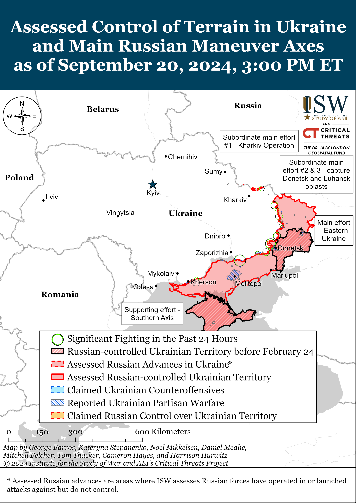](https://understandingwar.org/map/assessed-control-of-terrain-in-ukraine-and-main-russian-maneuver-axes-as-of-september-20-2024-300-pm-et/)**](https://understandingwar.org/wp-content/uploads/2025/05/DraftUkraineCOT20September20202C202024.png)

***We do not report in detail on Russian war crimes because these activities are well-covered in Western media and do not directly affect the military operations we are assessing and forecasting. We will continue to evaluate and report on the effects of these criminal activities on the Ukrainian military and the Ukrainian population and specifically on combat in Ukrainian urban areas. We utterly condemn Russian violations of the laws of armed conflict and the Geneva Conventions and crimes against humanity even though we do not describe them in these reports.***

- Ukrainian Operations in the Russian Federation
- Russian Main Effort – Eastern Ukraine (comprised of three subordinate main efforts)
- Russian Subordinate Main Effort #1 – Push Ukrainian forces back from the international border with Belgorod Oblast and approach to within tube artillery range of Kharkiv City
- Russian Subordinate Main Effort #2 – Capture the remainder of Luhansk Oblast and push westward into eastern Kharkiv Oblast and encircle northern Donetsk Oblast
- Russian Subordinate Main Effort #3 – Capture the entirety of Donetsk Oblast
- Russian Supporting Effort – Southern Axis
- Russian Air, Missile, and Drone Campaign
- Russian Mobilization and Force Generation Efforts
- Russian Technological Adaptations
- Activities in Russian-occupied areas
- Ukrainian Defense Industrial Base Efforts
- Russian Information Operations and Narratives
- Significant Activity in Belarus

**Ukrainian Operations in the Russian Federation**

Ukrainian forces reportedly continued attacking west of the salient in Kursk Oblast on September 20 but did not make any confirmed advances. The Russian Ministry of Defense (MoD) claimed that Russian forces repelled Ukrainian attacks near Novyi Put and Medvedzhye (southwest and southeast of Glushkovo, respectively).[18] Russian milbloggers claimed that Ukrainian forces are also continuing attacks near Krasnooktyabrskoye and Volfino (both southwest of Glushkovo) and are trying to encircle Russian forces in Veseloye (northeast of Volfino and southwest of Glushkovo).[19] Some milbloggers claimed that Ukrainian forces conducted a reduced company-sized mechanized assault near Veseloye on September 20, but that Russian forces repelled the attack.[20]

Russian sources claimed that Russian forces made further advances on the southwestern edge of the Ukrainian salient in Kursk Oblast on September 20. Russian milbloggers claimed that Russian forces advanced in fields north and east of Darino and in fields southeast of Nikolayevo-Darino (both southeast of Korenevo), which are both on the southwestern edge of the Kursk Oblast salient and which Russian sources claimed that Russian forces seized on September 19.[21] ISW has not yet observed confirmation of these claims, nor confirmation that Russian forces have seized Darino or Nikolayevo-Darino. Russian sources claimed that elements of the Russian 155th Naval Infantry Brigade (Pacific Fleet, Eastern Military District [EMD]) are operating in the Darino-Nikolayevo-Darino area.[22]

Fighting otherwise continued through the Kursk Oblast salient on September 20, but neither Russian nor Ukrainian forces made confirmed advances. The Russian MoD claimed that Russian forces repelled Ukrainian attacks near Lyubimovka (southeast of Korenevo), Kremyanoye (east of Koreveno), and Malaya Loknya (north of Sudzha).[23] Russian milbloggers claimed that Russian forces are attacking on the western side of the salient from Snagost towards Gordeevka and on the eastern side of the salient from Borki towards Plekhovo.[24] Russian sources amplified footage of Russian artillery strikes against a Ukrainian pontoon crossing over the Psyol River near Kurilovka (south of Sudzha).[25] Elements of the Russian “Veterany” Assault Brigade (Russian Volunteer Corps) and “Pyatnashka” international volunteer brigade (Donetsk People’s Republic) are reportedly operating in Kursk Oblast.[26]

[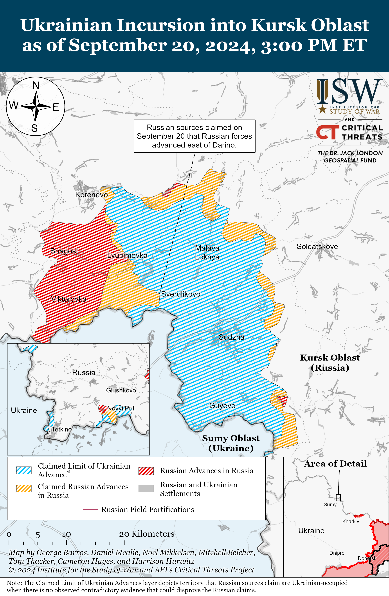](https://understandingwar.org/map/ukrainian-incursion-into-kursk-oblast-as-of-september-20-2024-300-pm-et/)

**Russian Main Effort – Eastern Ukraine**

**Russian Subordinate Main Effort #1 – Kharkiv Oblast (Russian objective: Push Ukrainian forces back from the international border with Belgorod Oblast and approach to within tube artillery range of Kharkiv City)**

Both Ukrainian and Russian forces recently advanced in northern Kharkiv Oblast amid continued Russian offensive operations north and northeast of Kharkiv City on September 20. Geolocated footage published on September 19 indicates that Ukrainian forces have advanced up to Heroiv Chornobylia Street within central Vovchansk (northeast of Kharkiv City) southwest of the Vovchansk Aggregate Plant.[27] A Russian milblogger claimed on September 20 that Russian and Ukrainian forces are vying to seize the Vovchansk Aggregate Plant but that Russian forces are currently operating in the plant as of September 19.[28] Ukrainian Kharkiv Group of Forces Spokesperson Colonel Vitaly Sarantsev said on September 17 that Russian forces still control the Vovchansk Aggregate Plant, while ISW assessed on September 16 that Ukrainian forces recently advanced into the plant, all of which supports the milblogger’s claim that positions over the area are frequently contested.[29] Geolocated footage published on September 20 indicates that Russian forces recently marginally advanced north of Tykhe (northeast of Kharkiv City and immediately east of Vovchansk).[30] A Russian milblogger claimed that Russian forces advanced 300 meters along the Travyanske Reservoir and consolidated their positions in northern Hlyboke (north of Kharkiv City).[31] ISW has not observed confirmation of this claim, however. Russian forces continued ground attacks near Hlyboke, Vovchansk, and Tykhe on September 19 and 20, and a Russian milblogger claimed that Ukrainian forces counterattacked near Hlyboke.[32] A Ukrainian officer operating in a drone detachment reported that Ukrainian forces are exploiting poor Russian personnel training and vulnerabilities with frontline Russian electronic warfare (EW) systems, including striking Russian forces when frontline EW systems lose battery power.[33]

[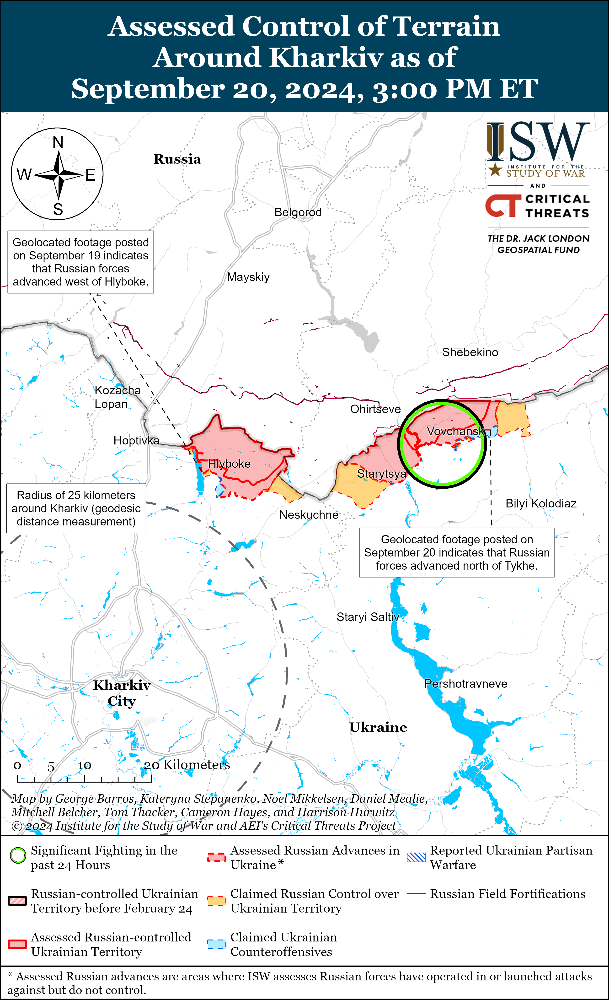](https://understandingwar.org/map/assessed-control-of-terrain-around-kharkiv-as-of-september-20-2024-300-pm-et/)

[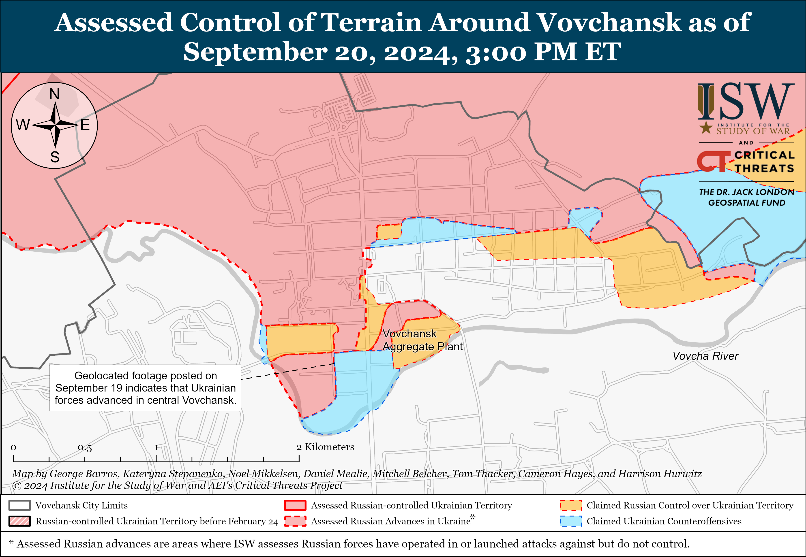](https://understandingwar.org/map/assessed-control-of-terrain-around-vovchansk-as-of-september-20-2024-300-pm-et/)

**Russian Subordinate Main Effort #2 – Luhansk Oblast (Russian objective: Capture the remainder of Luhansk Oblast and push westward into eastern Kharkiv Oblast and northern Donetsk Oblast)**

Russian forces recently marginally advanced northwest of Kreminna amid continued offensive operations along the Kupyansk-Svatove-Kreminna line on September 20. Geolocated footage published on September 19 and 20 indicates that Russian forces advanced within northwestern Makiivka and in fields east of Nevske (both northwest of Kreminna).[34] Russian milbloggers also claimed that Russian forces advanced within Makiivka, and one milblogger claimed that Russian forces seized the whole settlement, though ISW has not yet observed confirmation that Russian forces seized all of Makiivka.[35] Geolocated footage published on September 20 shows Ukrainian drone and artillery strikes repelling a Russian platoon-sized mechanized assault east of Kovalivka (southwest of Svatove) in an area behind ISW’s assessed Russian advances.[36] A Russian milblogger claimed that Russian forces advanced 2.5 kilometers deep along a windbreak towards Kivsharivka (southeast of Kupyansk) and 2.3 kilometers towards Nevske but ISW has not observed visual confirmation of these claims.[37] Russian forces continued ground attacks northeast of Kupyansk near Synkivka; southeast of Kupyansk near Stepova Novoselivka, Hlushkivka, and in the direction of Lozova; northwest of Kreminna near Cherneshchyna, Hrekivka, Druzhelyubivka, Nevske, Novosadove, Terny, and Zarichne; west of Kreminna near Torske; and southwest of Kreminna in the Serebryanske forest area on September 19 and 20.[38]

[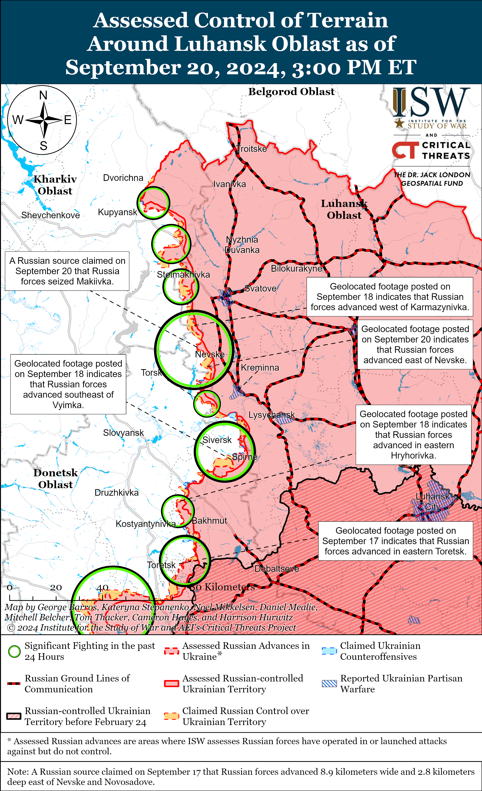](https://understandingwar.org/map/assessed-control-of-terrain-around-luhansk-oblast-as-of-september-20-2024-300-pm-et/)

**Russian Subordinate Main Effort #3 – Donetsk Oblast (Russian objective: Capture the entirety of Donetsk Oblast, the claimed territory of Russia’s proxies in Donbas)**

Ukrainian forces marginally advanced in the Siversk direction in recent months amid continued Russian assaults in this direction on September 20. Geolocated footage published on September 17 indicates that Ukrainian forces marginally advanced northeast of Verkhnokamyanske (east of Siversk) and west of Sakko i Vantsetti (southwest of Siversk), although these advances are likely not recent.[39] Russian forces conducted assaults southeast of Siversk near Ivano-Darivka and Vyimka on September 19 and 20.[40]

Russian forces continued offensive operations near Chasiv Yar itself, east of Chasiv Yar near Ivanivske, southeast of Chasiv Yar near Kurdyumivka, and south of Chasiv Yar near Stupochky and Bila Hora on September 19 and 20, but there are no confirmed changes to the frontline in the area.[41] A Russian milblogger claimed that Russian forces advanced 1.45 kilometers in depth in a forested area south of Ivanivske, but ISW has not observed confirmation of this claim.[42]

[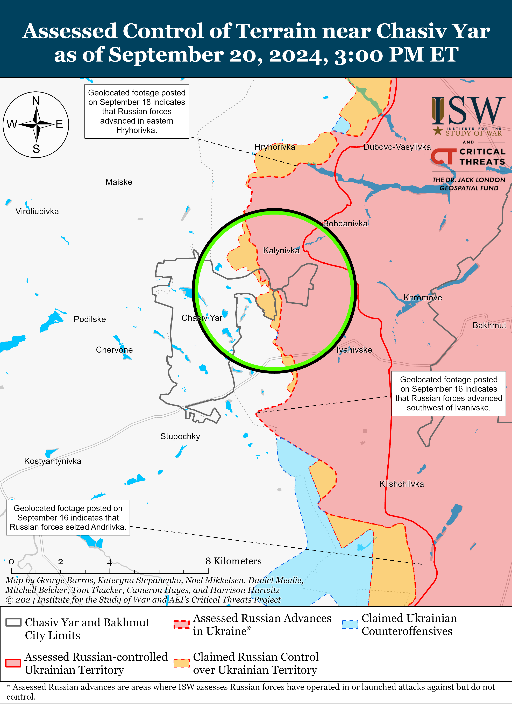](https://understandingwar.org/map/assessed-control-of-terrain-near-chasiv-yar-as-of-september-20-2024-300-pm-et/)

Russian forces recently marginally advanced in eastern Toretsk amid continued fighting in the area on September 20. Geolocated footage published on September 20 indicates that Russian forces recently marginally advanced eastward to Tereshkovoi Street in eastern Toretsk.[43] Russian milbloggers claimed that Russian forces advanced further within Toretsk and south of Toretsk near Niu York, but ISW has not observed confirmation of these claims.[44] Russian forces continued offensive operations within Toretsk; northeast of Toretsk near Dachne; south of Toretsk near Nelipivka; and near Toretsk in the direction of Shcherbynivka on September 19 and 20.[45]

[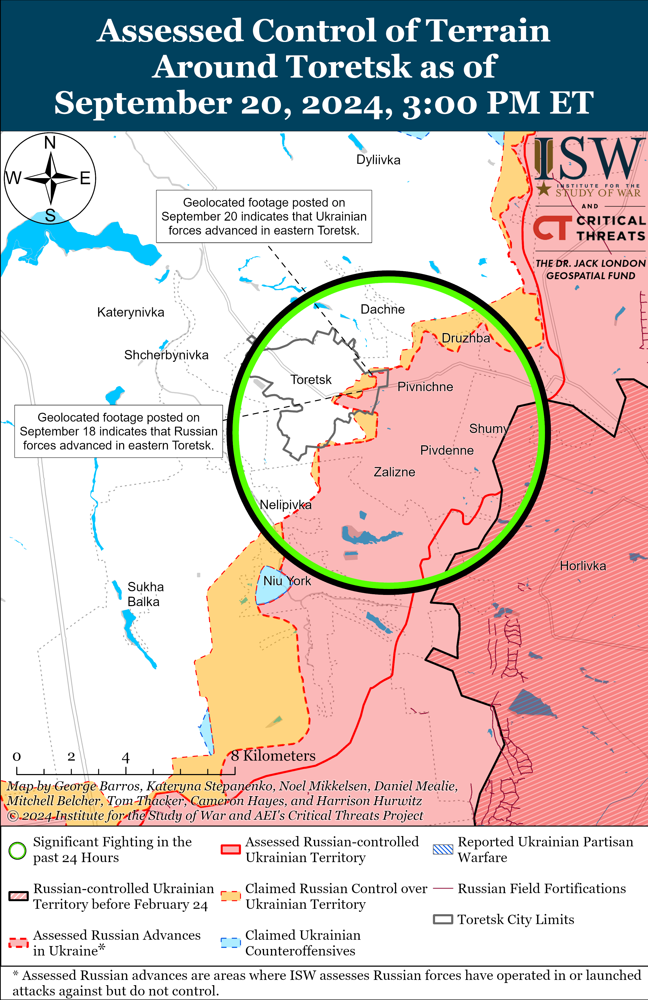](https://understandingwar.org/map/assessed-control-of-terrain-around-toretsk-as-of-september-20-2024-300-pm-et/)

Russian forces recently marginally advanced southeast of Pokrovsk amid continued fighting east and southeast of the city on September 20. Geolocated footage published on September 19 indicates that Russian forces recently marginally advanced southwest of Mykhailivka (southeast of Pokrovsk and just east of Selydove).[46] Russian milbloggers claimed that Russian forces also advanced 500 meters within northern Hrodivka (east of Pokrovsk) and southeast of Pokrovsk near Seldyove, south of Karlivka, and west of Nevelske.[47] ISW has not observed confirmation of these claims, however. Ukrainian President Volodymyr Zelensky stated that Ukrainian forces have succeeded in reducing the intensity of Russian offensive operations throughout Donetsk Oblast but noted that the situation remains “extremely difficult” in the Pokrovsk and Kurakhove directions.[48] A Ukrainian servicemember told the Ukrainian outlet *Kyiv Independent* that Russian forces in the Pokrovsk direction appear to have constant resupply, while Ukrainian units are struggling to transfer supplies to frontline positions due to Russian shelling.[49] The servicemember suggested that Ukrainian forces may also be suffering from communication issues in this direction and noted that Ukrainian forces maintain positions in Selydove. Fighting continues east of Pokrovsk near Vozdvyzhenka, Novotoretske, and Hrodivka and southeast of Pokrovsk within Novohrodivka and near Myrolyubivka, Selydove, Mykolaivka, Marynivka, Hirnyk, Zhelanne Pershe, and Tsukuryne on September 19 and 20.[50] Elements of the newly-formed Russian 3rd Battalion of the 245th Motorized Rifle Regiment (47th Tank Division, 1st Guard Tank Army, Moscow Military District [MMD]) are reportedly operating in the Pokrovsk direction.[51] ISW has previously observed elements of the 245th Motorized Rifle Regiment operating in the northern Kharkiv and Lyman directions, and the deployment of an MMD formation to the Pokrovsk direction is notable.[52] The battalion was reportedly formed from naval personnel of the aircraft carrier *Admiral Kuznetsov* and reportedly has connections with the 51st Combined Arms Army (formerly 1st Donetsk People’s Republic Army Corps [DNR AC]), elements of which are actively operating in the Pokrovsk direction.[53]

[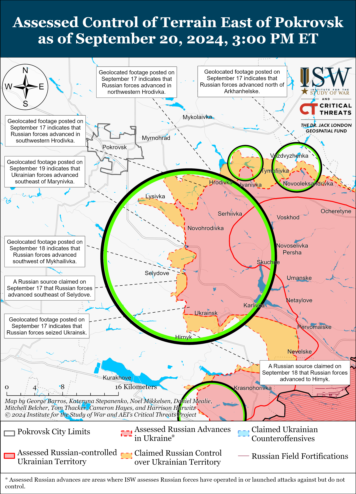](https://understandingwar.org/map/assessed-control-of-terrain-east-of-pokrovsk-as-of-september-20-2024-300-pm-et/)

Russian forces reportedly advanced west of Donetsk City on September 20 amid continued offensive operations in the area. A Russian milblogger claimed that Russian forces advanced west of Hostre, but ISW has not observed confirmation of this claim.[54] Russian forces conducted offensive operations near Heorhiivka and towards Dalnye on September 19 and 20.[55] Elements of the Russian 238th Artillery Brigade (8th Combined Arms Army [CAA], Southern Military District [SMD]) are reportedly conducting strikes near Dalnye in support of offensive operations by the 20th Motorized Rifle Division (8th CAA), and elements of the 3rd Motorized Rifle Brigade (51st CAA) are reportedly operating near Hostre.[56] Russian Defense Minister Andrei Belousov credited elements of the 5th Motorized Rifle Brigade (51st CAA, formerly 1st Donetsk People’s Republic Army Corps [DNR AC]) and 150th Motorized Rifle Division (8th CAA, SMD) with seizing Heorhiivka.[57]

Russian forces reportedly advanced southwest of Donetsk City in the Vuhledar direction on September 20, but there were no confirmed changes to the frontline. Russian milbloggers claimed that Russian forces advanced near Vodyane and 1.6 kilometers north of Kostyantynivka (both northeast of Vuhledar), but ISW has not observed confirmation of these claims.[58] Russian forces conducted offensive operations northeast of Vuhledar near Katerynivka, Kostyantynivka, and Vodyane; near Vuhledar itself; west of Vuhledar near Prechystivka; and towards Bohoyavlenka (northwest of Vuhledar) on September 19 and 20.[59] Elements of the Russian 11th Air Force and Air Defense Army (Russian Aerospace Forces [VKS] and Eastern Military District [EMD]) are reportedly conducting strikes on Ukrainian positions near Yelizavetivka (northeast of Vuhledar), and elements of the “Sakira” detachment are reportedly operating near Vuhledar.[60]

The Ukrainian General Staff reported that Russian forces conducted offensive operations in the Donetsk-Zaporizhia Oblast border area near Rivnopil (southwest of Velyka Novosilka) on September 19 and 20.[61]

[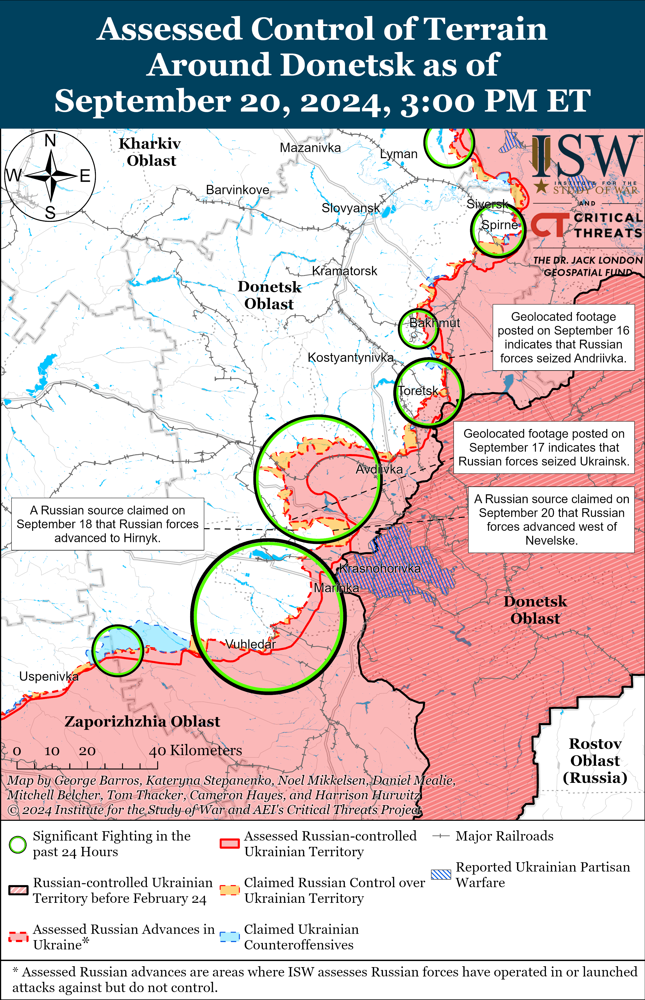](https://understandingwar.org/map/assessed-control-of-terrain-around-donetsk-as-of-september-20-2024-300-pm-et/)

**Russian Supporting Effort – Southern Axis (Russian objective: Maintain frontline positions and secure rear areas against Ukrainian strikes)**

Russian forces continued limited positional operations in western Zaporizhia Oblast on September 20, but there were no confirmed changes to the frontline. The Ukrainian General Staff reported that Russian forces conducted ground attacks near Robotnye; north of Robotnye near Novodanylivka; northeast of Robotyne near Mala Tokmachka; and northwest of Robotyne in the direction of Novoandriivka, Lobkove, and Pyatykhatky.[62] Russian forces also reportedly struck Pyatykhatky with glide bombs and conducted an airstrike against Kamyanske.[63] Ukraine’s Southern Volunteer Army Spokesperson Serhiy Bratchuk said on September 20 that Russian forces began using glide bombs with unified planning and correction modules (UMPCs) in the Zaporizhia direction.[64]

[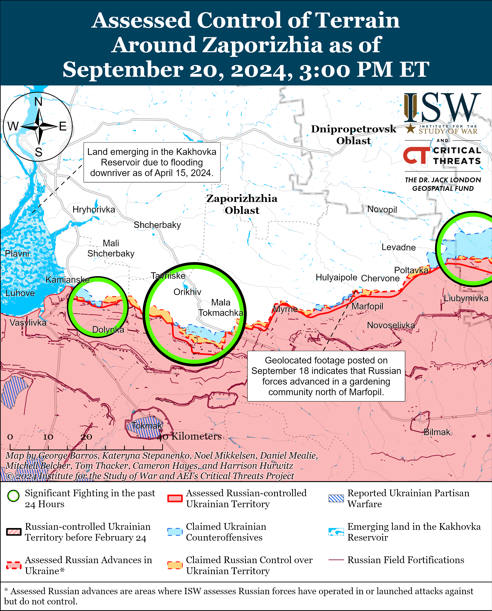](https://understandingwar.org/map/assessed-control-of-terrain-around-zaporizhia-as-of-september-20-2024-300-pm-et/)

Russian occupation administration officials claimed on September 20 that Ukrainian forces conducted a drone strike on Enerhodar but did not strike the Russian-occupied Zaporizhzhia Nuclear Power Plant (ZNPP).[65] International Atomic Energy Agency (IAEA) member states issued a resolution on September 20 at the IAEA’s General Conference calling for the immediate withdrawal of military and other personnel from the ZNPP and urging Russia to return the ZNPP to Ukraine’s control.[66] IAEA Director General Rafael Mariano Grossi previously called the situation at ZNPP “very fragile,” and vowed to expand IAEA nuclear safety assistance to Ukraine.[67]

Russian forces conducted limited ground attacks in east (left) bank Kherson Oblast.[68] Elements of the Russian 61st Naval Infantry Brigade (Leningrad Military District [LMD], formerly Northern Fleet) are reportedly operating in the Kherson direction.[69]

[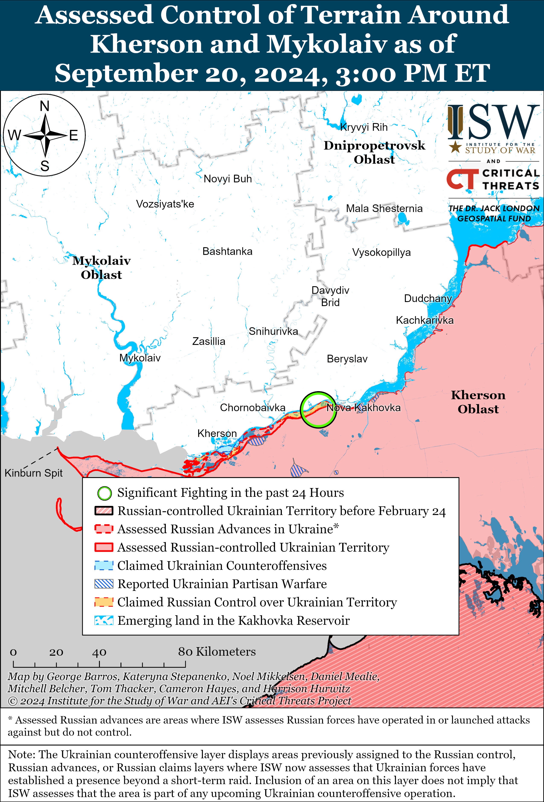](https://understandingwar.org/map/assessed-control-of-terrain-around-kherson-and-mykolaiv-as-of-september-20-2024-300-pm-et/)

**Russian Air, Missile, and Drone Campaign (Russian Objective: Target Ukrainian military and civilian infrastructure in the rear and on the frontline)**

Russian forces conducted drone and missile strikes against Ukraine on the night of September 19 to 20. The Ukrainian Air Force reported that Russian forces launched three missiles of an unknown type at Donetsk Oblast, a Kh-59 cruise missile at Dnipropetrovsk Oblast from airspace over occupied Zaporizhzhia Oblast, and 70 Shahed-136/131 drones from Kursk Oblast and Primorsko-Akhtarsk and Yeysk, Krasnodar Krai.[70] The Ukrainian Air Force stated that Ukrainian forces downed 61 Shahed drones and the Kh-59 missile and that nine additional Shahed-136/131 drones did not strike their targets. Odesa Oblast Military Administration Head Oleh Kiper stated that debris from a Russian Iskander-M ballistic missile damaged the port and civilian infrastructure in Odesa City and a civilian ship with an Antiguan flag moored at the port. Ukrainian officials reported that Russian forces struck a retirement home in Sumy City with glide bombs on September 19, killing at least one and injuring at least 14 civilians.[71] Ukrainian President Volodymyr Zelensky reported that there were nearly 300 people, most of whom were elderly, in the building at the time of the strike.[72]

Ukrainian military analyst Petro Chernyk stated on September 20 that Russian forces have somewhat increased their number of missile strikes against Ukraine in 2024 but that Russian missile production remains a limiting factor in Russia’s ability to significantly scale up missile strikes. Chernyk compared the combined series of drone and missile strikes on August 26 to the previous large-scale drone and missile strike campaign in December 2023, noting that Russian forces’ greatest number of strikes increased by 25 missiles.[73] Chernyk estimated that Russia can theoretically launch 300 to 400 missiles at once against Ukraine if it uses its entire missile reserve and at least 20 Tu-95MS strategic bomber aircraft, up to 10 of its cruise missile carriers in the Black Sea, S-300/S-400 air defense systems, Iskander-M ballistic missile systems, and coastal defense missile systems to conduct these strikes.[74] Chernyk argued that Russia can only produce between 120 to 130 missiles on average and an absolute maximum of 140 missiles per month, implying that the Russian missile campaign remains relatively restricted due to the pace of Russian missile production. Chernyk also assessed that Russia is unlikely to fully destroy Ukrainian energy infrastructure over Winter 2024-2025 – despite already having destroyed 40 to 50 percent of Ukraine’s energy infrastructure – because of the effectiveness of Western-provided air defense systems. Chernyk also estimated that Ukraine still receives more than half of its electricity from nuclear power plants (NPPs), and *Politico* recently reported that 55 percent of Ukraine’s energy is generated by its three operational NPPs – although Ukraine’s fourth and largest NPP, the Zaporizhzhia NPP, has been shut down due to Russian occupation.[75] *Politico* also reported that Russian missile and drone strikes have destroyed 9 gigawatts of Ukraine’s electrical generation capacity, which constitutes half of Ukraine’s peak winter consumption, and that Russian forces targeted NPPs’ electricity-feeding substations during the significant combined strike series on August 26.

**Russian Mobilization and Force Generation Efforts (Russian objective: Expand combat power without conducting general mobilization)**

Russian state media is increasingly emphasizing the participation of foreign nationals in the Russian war effort in Ukraine, likely to reassure domestic audiences that Russia continues to recruit sufficient manpower and will not need to declare another mobilization wave. Kremlin newswire *TASS* published footage showing Chinese and Sri Lankan volunteers operating in Kursk Oblast as part of the “Pyatnashka” International Volunteer Brigade.[76] Russian opposition outlet *Astra*, citing Ghanaian media, reported that the Russian Ministry of Defense (MoD) misled 14 Ghanaian nationals into signing military service contracts and fighting in Donetsk Oblast and that 11 of the Ghanaian nationals are missing.[77] *TASS’s* reporting likely targets domestic Russian audiences and appears to be part of the Kremlin’s ongoing effort to downplay Ukraine’s incursion into Kursk Oblast and avoid declaring mobilization. ISW assessed on September 19 that the Kremlin remains committed to its crypto-mobilization campaign likely out of fear of societal backlash, and that such an approach is constraining Russia’s mobilization potential.[78]

The Russian government continues to publicly double down on its decision to increasingly recruit criminals and prisoners to fight in Ukraine, likely to sustain the Kremlin’s crypto-mobilization campaign. Russian State Duma Defense Committee Chairman Andrei Kartapolov publicly dismissed a concern from Russian Communist Party Deputy Renat Suleymanov on September 19 that the Russian Armed Forces are becoming a criminal “gang.”[79] Suleymanov complained that Russia is increasingly creating conditions in which individuals can escape criminal prosecution by signing a military service contract and asked Kartapolov why Russia is forming its military from criminals and prisoners. Kartapolov responded to the complaint by reiterating that Russian criminals have a right to make mistakes, signaling that the Russian government remains committed to the crypto-mobilization campaign even if this campaign continues to deteriorate the scarce remnants of Russian military professionalism.

**Russian Technological Adaptations (Russian objective: Introduce technological innovations to optimize systems for use in Ukraine)**

Ukrainian defense outlet *Militarnyi*reported on September 20 that Russian state outlet *RIA Novosti*published footage of Russian President Vladimir Putin inspecting new Russian-made drone systems during his September 19 visit to the “Special Technology Center” in St. Petersburg and that the footage likely shows the new Shahed-236 drone.[80] *Militarnyi*stated that the Shahed-236 looks similar to the Shahed-136 but is painted black and appears to have a modified nose equipped with an optical system that allows the drone to autonomously search for targets.

Russian state-owned defense conglomerate Rostec stated on September 19 that its subsidiary Elektromashina is completing work on updated “Narval” modules with machine guns on boats and that Russian forces are beginning to install the module on boats in occupied Sevastopol, Crimea.[81] The “Narval” reportedly includes a new sight with higher-resolution matrices, an improved control unit, and a modernized computing module.

**Ukrainian Defense Industrial Efforts (Ukrainian objective: Develop its defense industrial base to become more self-sufficient in cooperation with US, European, and international partners)**

*ISW is suspending publishing coverage of Ukrainian defense industrial efforts until further notice.*

**Activities in Russian-occupied areas (Russian objective: Consolidate administrative control of annexed areas; forcibly integrate Ukrainian citizens into Russian sociocultural, economic, military, and governance systems)**

*ISW is not publishing coverage of Russian-occupied areas today.*

**Russian Information Operations and Narratives**

Russian officials made several unfounded accusations alleging Ukrainian human rights abuses, likely to divert attention away from well-documented Russian human rights abuses during the International Committee of the Red Cross’s (ICRC) visit to Moscow. Russian Foreign Ministry Spokesperson Maria Zakharova claimed on September 20 that Russian authorities have received information that Ukraine is creating “concentration camps” in Russian border areas and that Ukraine is “deporting” Russian citizens to Ukraine.[82] The Russian Investigative Committee also claimed that it has opened cases against Ukrainian military personnel for alleged crimes committed against civilians in Kursk Oblast.[83] Russian officials have not provided evidence of these alleged crimes, nor have international organizations independently confirmed that such Ukrainian crimes have transpired—contrary to the wide range of evidence confirming that Russian forces have perpetrated war crimes and crimes against humanity in Ukraine.[84] Russian officials have furthermore admitted that they are creating “temporary detention centers” akin to concentration camps by detaining and punishing residents of occupied Ukraine (e.g. of areas that Russia illegally occupies) for displaying pro-Ukrainian sentiment or refusing to obtain Russian passports.[85] Zakharova’s and the Investigative Committee’s accusations notably coincide with the recent ICRC visit to Moscow, which afforded Russian officials a platform to use an international body to legitimize their unfounded accusations against Ukraine.[86]

Ukraine is taking steps to safeguard against Russian information operations and surveillance operations on Telegram. The Ukrainian National Security and Defense Council announced on September 19 that it decided to limit the use of Telegram amongst Ukrainian government, military, and critical infrastructure authorities in order to protect Ukrainian institutions and operational security.[87] Ukrainian Main Military Intelligence Directorate (GUR) Head Lieutenant General Kyrylo Budanov noted that there is “substantiated data” proving that Russian special services use personal data and correspondence from Telegram in order to further influence operations.[88] This ban only pertains to officially issued devices and not personal devices.[89] ISW has reported at length on Russia’s weaponization of Telegram, both domestically and abroad, to expand Russian influence and trigger kinetic activity by leveraging social media platforms to further Kremlin information operations.[90]

**Significant activity in Belarus (Russian efforts to increase its military presence in Belarus and further integrate Belarus into Russian-favorable frameworks and Wagner Group activity in Belarus)**

Belarusian forces are reportedly conducting training exercises alongside Russian forces in Russia. The Belarusian Ministry of Defense (MoD) claimed on September 20 that Belarusian forces, including tank units, are undergoing joint training exercises with Russian forces in Mulino, Novgorod Oblast for one month.[91] The Belarusian MoD also claimed that Belarusian forces successfully launched a “Polonez-M” multiple-launch rocket system (MLRS) at a range of 300 kilometers at an unspecified Russian training ground.[92]

**Note: ISW does not receive any classified material from any source, uses only publicly available information, and draws extensively on Russian, Ukrainian, and Western reporting and social media as well as commercially available satellite imagery and other geospatial data as the basis for these reports. References to all sources used are provided in the endnotes of each update.**

---

[1] https://neighbourhood-enlargement dot ec.europa.eu/news/commission-proposes-eu35-billion-mfa-loan-ukraine-eus-contribution-eu-g7-support-eu45-billion-2024-09-20\_en ; https://x.com/vonderleyen/status/1837081526363721752

[2] https://x.com/vonderleyen/status/1837075615989780683?t=68LIiXpMmPnymbyed9hQCw&s=19 ; https://mil.in dot ua/uk/news/chastynu-kredytu-yes-na-35-mlrd-yevro-ukrayina-vytratyt-na-dalekobijni-rakety-i-drony-zelenskyj/ ; https://www.ukrinform dot ua/rubric-polytics/3907758-zelenskij-rozpoviv-na-so-pidut-35-milardiv-vid-evrosouzu.html

[3] https://eur-lex dot europa.eu/legal-content/EN/TXT/?uri=COM%3A2024%3A0426%3AFIN

[4] https://www.mil dot gov.ua/news/2024/09/14/za-umovi-zaluchennya-investiczij-potenczial-oboronnogo-virobnicztva-ukraini-mozhe-dosyagti-20$/

[5] https://www.theguardian.com/world/2024/sep/20/revealed-russia-anticipated-kursk-incursion-months-in-advance-seized-papers-show

[6] https://isw.pub/UkrWar080824 ; https://understandingwar.org/backgrounder/ukraine-and-problem-restoring-maneuver-contemporary-war

[7] ADP 3-0, 2019

[8] https://isw.pub/UkrWar080824

[9] https://www.icrc.org/en/news-release/icrc-president-concludes-visit-moscow

[10] https://www.icrc.org/en/news-release/ukraine-3-icrc-staff-killed-after-shelling-hits-aid-distribution-site-donetsk; https://www.icrc.org/en/news-release/icrc-president-concludes-visit-moscow

[11] https://mid dot ru/en/foreign\_policy/international\_organizations/1969887/

[12] https://isw.pub/UkrWar091724; https://understandingwar.org/backgrounder/russian-offensive-campaign-assessment-july-10-2024; https://isw.pub/UkrWar032724; https://isw.pub/UkrWar090624; https://understandingwar.org/backgrounder/russian-offensive-campaign-assessment-february-20-2024; https://isw.pub/UkrWar022524; https://isw.pub/UkrWar032724 ; https://understandingwar.org/wp-content/uploads/2024/09/24-210-0120ISW20Occupation20playbook.pdf

[13] https://www.politico.eu/article/russia-stalls-war-prisoners-exchange-heat-political-tensions-ukraine-kyiv-says/; https://apnews.com/article/russia-ukraine-pows-phone-calls-585d93ec00fe7a80a9c520e265ac5a6d

[14] https://kyivindependent dot com/most-ukrainian-pows-havent-seen-red-cross-while-in-russian-captivity-ombudsman-says/; https://t.me/dmytro\_lubinetzs/6214

[15] https://understandingwar.org/backgrounder/russian-offensive-campaign-assessment-february-27-2024

[16] https://understandingwar.org/backgrounder/russian-offensive-campaign-assessment-december-2-2023

[17] https://isw.pub/UkrWar090624; https://isw.pub/UkrWar082724; https://understandingwar.org/backgrounder/russian-offensive-campaign-assessment-june-17-2024;

[18] https://t.me/mod\_russia/43585

[19] https://t.me/sashakots/49079; https://t.me/rybar/63672; https://t.me/dva\_majors/53076; https://t.me/rybar/63680; https://t.me/RVvoenkor/737290; https://t.me/wargonzo/22222; https://t.me/boris\_rozhin/137946

[20] https://t.me/dva\_majors/53076; https://t.me/rybar/63680; https://t.me/wargonzo/22222; https://t.me/RVvoenkor/737290; https://x.com/GirkinGirkin/status/1836883923105673645

[21] https://t.me/z\_arhiv/28164; https://t.me/boris\_rozhin/137980; https://t.me/tass\_agency/273752 ; https://t.me/tass\_agency/273664 ; https://t.me/DnevnikDesantnika/15716; https://t.me/sashakots/49079

[22] https://t.me/z\_arhiv/28164; https://t.me/boris\_rozhin/137934; https://t.me/motopatriot/27798; https://t.me/rodnaya\_sudzha/10199

[23] https://t.me/mod\_russia/43588

[24] https://t.me/sashakots/49079; https://t.me/NgP\_raZVedka/19101; https://t.me/rybar/63672

[25] https://t.me/voenkorKotenok/59121; https://t.me/milinfolive/130966

[26] https://t.me/boris\_rozhin/137965; https://t.me/boris\_rozhin/138004

[27] https://x.com/AudaxonX/status/1836860304505885014; https://t.me/warriorofnorth/2787

[28] https://t.me/Sladkov\_plus/11434

[29] https://understandingwar.org/backgrounder/russian-offensive-campaign-assessment-september-17-2024; https://understandingwar.org/backgrounder/russian-offensive-campaign-assessment-september-16-2024

[30] https://t.me/soiuzspaseniya/1508; https://t.me/creamy\_caprice/6870

[31] https://t.me/DnevnikDesantnika/15768

[32] https://www.facebook.com/GeneralStaff.ua/posts/pfbid0bBhfgu1NNdcEjbH1JmLWuentftkxLvrsE66SPhx3MhEcVWSsd1icDpysAmgaXqdQl; https://www.facebook.com/GeneralStaff.ua/posts/pfbid0AEtNHxH7LQsBvQMVWiY3aopK2DUMujorTfNcW4rfbKzWFWhfJhCMTiMUXuR8N9Qrl; https://www.facebook.com/GeneralStaff.ua/posts/pfbid0ekKwxLxxrLH6xNRVRF2Fk5wJYpCnS1AasFyxmd8rMNJAC3UGhzXQnbDXqgfYa3G8l; https://t.me/wargonzo/22222; https://t.me/Sladkov\_plus/11434

[33] https://armyinform dot com.ua/2024/09/19/ak-74-dlya-shumovoyi-izolyacziyi-na-harkivshhyni-vorozhi-soldaty-pogano-vyshkoleni-j-osnashheni/; https://youtu.be/j5TqaWCCdUg; https://armyinform dot com.ua/2024/09/19/koly-mozhna-podolaty-vorozhyj-reb-rozpovily-dronari-syl-oborony/

[34] https://x.com/666\_mancer/status/1837007207742808507; https://x.com/blinzka/status/1837047069162303939; https://t.me/creamy\_caprice/6863; https://t.me/OMBr67/1572

[35] https://t.me/RVvoenkor/77291; https://t.me/boris\_rozhin/137928; https://t.me/z\_arhiv/28169; https://t.me/DnevnikDesantnika/15766; https://t.me/rybar/63691

[36] https://x.com/BBS3AB/status/1837147576497266954; https://x.com/klinger66/status/1837177206012796982

[37] https://t.me/DnevnikDesantnika/15757; https://t.me/DnevnikDesantnika/15766

[38] https://www.facebook.com/GeneralStaff.ua/posts/pfbid0bBhfgu1NNdcEjbH1JmLWuentftkxLvrsE66SPhx3MhEcVWSsd1icDpysAmgaXqdQl; https://www.facebook.com/GeneralStaff.ua/posts/pfbid0AEtNHxH7LQsBvQMVWiY3aopK2DUMujorTfNcW4rfbKzWFWhfJhCMTiMUXuR8N9Qrl; https://www.facebook.com/GeneralStaff.ua/posts/pfbid0ekKwxLxxrLH6xNRVRF2Fk5wJYpCnS1AasFyxmd8rMNJAC3UGhzXQnbDXqgfYa3G8l; https://t.me/rybar/63691

[39] https://x.com/franfran2424/status/1836952032533426394; https://t.me/SiberiaSpecial/2892 ; https://x.com/franfran2424/status/1836935246648070301; https://x.com/franfran2424/status/1836935365556384058; https://t.me/VestovoyDP/540

[40] https://www.facebook.com/GeneralStaff.ua/posts/pfbid0bBhfgu1NNdcEjbH1JmLWuentftkxLvrsE66SPhx3MhEcVWSsd1icDpysAmgaXqdQl ; https://www.facebook.com/GeneralStaff.ua/posts/pfbid0AEtNHxH7LQsBvQMVWiY3aopK2DUMujorTfNcW4rfbKzWFWhfJhCMTiMUXuR8N9Qrl ; https://www.facebook.com/GeneralStaff.ua/posts/pfbid0ekKwxLxxrLH6xNRVRF2Fk5wJYpCnS1AasFyxmd8rMNJAC3UGhzXQnbDXqgfYa3G8l

[41] https://www.facebook.com/GeneralStaff.ua/posts/pfbid0bBhfgu1NNdcEjbH1JmLWuentftkxLvrsE66SPhx3MhEcVWSsd1icDpysAmgaXqdQl ; https://www.facebook.com/GeneralStaff.ua/posts/pfbid0AEtNHxH7LQsBvQMVWiY3aopK2DUMujorTfNcW4rfbKzWFWhfJhCMTiMUXuR8N9Qrl ; https://www.facebook.com/GeneralStaff.ua/posts/pfbid0ekKwxLxxrLH6xNRVRF2Fk5wJYpCnS1AasFyxmd8rMNJAC3UGhzXQnbDXqgfYa3G8l ; https://t.me/wargonzo/22222 ; https://t.me/DnevnikDesantnika/15734

[42] https://t.me/RVvoenkor/77314

[43] https://x.com/NOELreports/status/1837061969116803296; https://x.com/AudaxonX/status/1837103794301387053; https://t.me/ButusovPlus/13745

[44] https://t.me/dva\_majors/53076; https://t.me/rybar/63680 ; https://t.me/RVvoenkor/77314 ; https://t.me/wargonzo/22222 ; https://t.me/z\_arhiv/28167 ; https://t.me/boris\_rozhin/137928

[45] https://www.facebook.com/GeneralStaff.ua/posts/pfbid0bBhfgu1NNdcEjbH1JmLWuentftkxLvrsE66SPhx3MhEcVWSsd1icDpysAmgaXqdQl ; https://www.facebook.com/GeneralStaff.ua/posts/pfbid0AEtNHxH7LQsBvQMVWiY3aopK2DUMujorTfNcW4rfbKzWFWhfJhCMTiMUXuR8N9Qrl ; https://www.facebook.com/GeneralStaff.ua/posts/pfbid0ekKwxLxxrLH6xNRVRF2Fk5wJYpCnS1AasFyxmd8rMNJAC3UGhzXQnbDXqgfYa3G8l ; https://t.me/dva\_majors/53076; https://t.me/rybar/63680 ; https://t.me/boris\_rozhin/137946

[46] https://x.com/MikiValbuena/status/1836797849402560953; https://x.com/PuenteUribarri/status/1836790008264479211

[47] https://t.me/RVvoenkor/77314 ; https://t.me/DnevnikDesantnika/15734 ; https://t.me/z\_arhiv/28165 ; https://t.me/motopatriot/27804 ; https://t.me/boris\_rozhin/137928 ; https://t.me/boris\_rozhin/137946 ; https://t.me/boris\_rozhin/138023

[48] https://t.me/V\_Zelenskiy\_official/11736 ; https://suspilne dot media/840241-na-kurskij-napramok-vdalosa-vidvolikti-na-40-tisac-vijskovih-rf-zelenskij/

[49] https://kyivindependent dot com/russias-pokrovsk-offensive-slows-but-relief-looks-temporary-for-ukraine/

[50] https://t.me/wargonzo/22222 ; https://t.me/DnevnikDesantnika/15734 ; https://t.me/boris\_rozhin/137921 ; https://t.me/boris\_rozhin/137946 ; https://www.facebook.com/GeneralStaff.ua/posts/pfbid0AEtNHxH7LQsBvQMVWiY3aopK2DUMujorTfNcW4rfbKzWFWhfJhCMTiMUXuR8N9Qrl ; https://www.facebook.com/GeneralStaff.ua/posts/pfbid0ekKwxLxxrLH6xNRVRF2Fk5wJYpCnS1AasFyxmd8rMNJAC3UGhzXQnbDXqgfYa3G8l ; https://www.facebook.com/GeneralStaff.ua/posts/pfbid0bBhfgu1NNdcEjbH1JmLWuentftkxLvrsE66SPhx3MhEcVWSsd1icDpysAmgaXqdQl

[51] https://x.com/moklasen/status/1836805654515753099

[52] https://understandingwar.org/backgrounder/russian-offensive-campaign-assessment-september-14-2024 ; https://understandingwar.org/backgrounder/russian-offensive-campaign-assessment-july-14-2024

[53] https://x.com/moklasen/status/1836805654515753099

[54] https://t.me/motopatriot/27806

[55] https://www.facebook.com/GeneralStaff.ua/posts/pfbid0bBhfgu1NNdcEjbH1JmLWuentftkxLvrsE66SPhx3MhEcVWSsd1icDpysAmgaXqdQl; https://www.facebook.com/GeneralStaff.ua/posts/pfbid0AEtNHxH7LQsBvQMVWiY3aopK2DUMujorTfNcW4rfbKzWFWhfJhCMTiMUXuR8N9Qrl; https://www.facebook.com/GeneralStaff.ua/posts/pfbid0ekKwxLxxrLH6xNRVRF2Fk5wJYpCnS1AasFyxmd8rMNJAC3UGhzXQnbDXqgfYa3G8l

[56] https://t.me/nm\_dnr/12733; https://t.me/motopatriot/27806

[57] https://t.me/mod\_russia/43590

[58] https://t.me/DnevnikDesantnika/15734; https://t.me/boris\_rozhin/137946

[59] https://www.facebook.com/GeneralStaff.ua/posts/pfbid0bBhfgu1NNdcEjbH1JmLWuentftkxLvrsE66SPhx3MhEcVWSsd1icDpysAmgaXqdQl; https://www.facebook.com/GeneralStaff.ua/posts/pfbid0AEtNHxH7LQsBvQMVWiY3aopK2DUMujorTfNcW4rfbKzWFWhfJhCMTiMUXuR8N9Qrl; https://www.facebook.com/GeneralStaff.ua/posts/pfbid0ekKwxLxxrLH6xNRVRF2Fk5wJYpCnS1AasFyxmd8rMNJAC3UGhzXQnbDXqgfYa3G8l; https://t.me/DnevnikDesantnika/15734; https://t.me/wargonzo/22222

[60] https://t.me/boris\_rozhin/138025; https://t.me/voin\_dv/10869; https://t.me/motopatriot/27806

[61] https://www.facebook.com/GeneralStaff.ua/posts/pfbid0ekKwxLxxrLH6xNRVRF2Fk5wJYpCnS1AasFyxmd8rMNJAC3UGhzXQnbDXqgfYa3G8l

[62] https://www.facebook.com/GeneralStaff.ua/posts/pfbid0bBhfgu1NNdcEjbH1JmLWuentftkxLvrsE66SPhx3MhEcVWSsd1icDpysAmgaXqdQl; https://www.facebook.com/GeneralStaff.ua/posts/pfbid0AEtNHxH7LQsBvQMVWiY3aopK2DUMujorTfNcW4rfbKzWFWhfJhCMTiMUXuR8N9Qrl; https://www.facebook.com/GeneralStaff.ua/posts/pfbid0ekKwxLxxrLH6xNRVRF2Fk5wJYpCnS1AasFyxmd8rMNJAC3UGhzXQnbDXqgfYa3G8l

[63] https://www.facebook.com/GeneralStaff.ua/posts/pfbid0bBhfgu1NNdcEjbH1JmLWuentftkxLvrsE66SPhx3MhEcVWSsd1icDpysAmgaXqdQl; https://www.facebook.com/GeneralStaff.ua/posts/pfbid0AEtNHxH7LQsBvQMVWiY3aopK2DUMujorTfNcW4rfbKzWFWhfJhCMTiMUXuR8N9Qrl; https://www.facebook.com/GeneralStaff.ua/posts/pfbid0ekKwxLxxrLH6xNRVRF2Fk5wJYpCnS1AasFyxmd8rMNJAC3UGhzXQnbDXqgfYa3G8l

[64] https://suspilne dot media/840277-udar-po-pansionatu-dla-litnih-v-sumah-sankcii-ssa-proti-rosii-940-den-vijni-onlajn/?anchor=live\_1726845062&utm\_source=copylink&utm\_medium=ps

[65] https://t.me/tass\_agency/273921 ; https://t.me/tass\_agency/273926 ; https://t.me/vrogov/17496

[66] https://mev.gov dot ua/sites/default/files/2024-09/resolution-on-ukraine-2024-general-conference.pdf ; https://suspilne dot media/840277-udar-po-pansionatu-dla-litnih-v-sumah-sankcii-ssa-proti-rosii-940-den-vijni-onlajn/?anchor=live\_1726837445&utm\_source=copylink&utm\_medium=ps

[67] https://understandingwar.org/backgrounder/russian-offensive-campaign-assessment-september-4-2024

[68] https://www.facebook.com/GeneralStaff.ua/posts/pfbid0AEtNHxH7LQsBvQMVWiY3aopK2DUMujorTfNcW4rfbKzWFWhfJhCMTiMUXuR8N9Qrl; https://www.facebook.com/GeneralStaff.ua/posts/pfbid0ekKwxLxxrLH6xNRVRF2Fk5wJYpCnS1AasFyxmd8rMNJAC3UGhzXQnbDXqgfYa3G8l

[69]https://t.me/ButusovPlus/13740

[70] https://t.me/kpszsu/19652

[71] https://t.me/odeskaODA/6708

[72] https://armyinform dot com.ua/2024/09/19/za-odnu-sogodnishnyu-dobu-rosijski-vijska-zastosuvaly-vzhe-majzhe-90-kerovanyh-aviabomb-prezydent/

[73] https://armyinform dot com.ua/2024/09/20/shho-chekaye-na-ukrayinu-vzymku-ekspert-pro-raketno-dronovyj-teror-kremlya/

[74] https://armyinform dot com.ua/2024/09/20/shho-chekaye-na-ukrayinu-vzymku-ekspert-pro-raketno-dronovyj-teror-kremlya/

[75] https://www.politico.eu/article/russia-ukraine-nuclear-plants-energy-war-joe-biden-united-states-nato/

[76] https://t.me/tass\_agency/273871 ; https://t.me/tass\_agency/273875

[77] https://t.me/astrapress/64724

[78] https://understandingwar.org/backgrounder/russian-offensive-campaign-assessment-september-19-2024

[79] https://t.me/mobilizationnews/20302

[80] https://mil.in dot ua/uk/news/v-rf-vpershe-pokazaly-shahed-236/

[81] https://rostec dot ru/news/obnovlennyy-boevoy-modul-narval-nachali-ustanavlivat-na-voennye-katera/; https://mil.in dot ua/en/news/russians-start-arming-ships-with-machine-gun-remote-weapon-stations/

[82] https://t.me/tass\_agency/273911; https://t.me/tass\_agency/273904

[83] https://t.me/tass\_agency/273927

[84] https://www.ohchr.org/en/press-releases/2022/10/un-commission-concludes-war-crimes-have-been-committed-ukraine-expresses; https://crsreports.congress.gov/product/pdf/R/R47762; https://www.icc-cpi.int/news/situation-ukraine-icc-judges-issue-arrest-warrants-against-sergei-kuzhugetovich-shoigu-and; https://www.theguardian.com/world/article/2024/jun/25/icc-issues-arrest-warrants-for-russias-sergei-shoigu-and-valery-gerasimov; https://www.ohchr.org/en/press-releases/2022/12/un-report-details-summary-executions-civilians-russian-troops-northern; https://www.icc-cpi.int/news/statement-icc-prosecutor-karim-aa-khan-qc-arria-formula-meeting-un-security-council-ensuring

[85] https://tass dot ru/obschestvo/18067997; https://glavadnr dot ru/doc/rasp/rasporiazhglavaN186\_20062023.pdf; https://understandingwar.org/backgrounder/russian-offensive-campaign-assessment-september-2-2024

[86] https://www.icrc.org/en/news-release/icrc-president-concludes-visit-moscow

[87] https://www.facebook.com/rnbou/posts/pfbid02XozkEVd5JWi4G9p3z8L1VHjzoM6aq1Fm6VpuppjYfMtB76muUmTfjaiiZrHQZ3tfl

[88] https://www.facebook.com/rnbou/posts/pfbid02XozkEVd5JWi4G9p3z8L1VHjzoM6aq1Fm6VpuppjYfMtB76muUmTfjaiiZrHQZ3tfl; https://abcnews.go.com/Technology/wireStory/ukraine-bans-telegram-messenger-app-state-issued-devices-113867947 ; https://www.facebook.com/rnbou/posts/pfbid02XozkEVd5JWi4G9p3z8L1VHjzoM6aq1Fm6VpuppjYfMtB76muUmTfjaiiZrHQZ3tfl?locale=uk\_UA ; https://t.me/tass\_agency/273979 ; https://t.me/tass\_agency/274005;

[89] https://t.me/istories\_media/7639

[90] https://understandingwar.org/backgrounder/russian-offensive-campaign-assessment-september-6-2024; https://understandingwar.org/backgrounder/russian-offensive-campaign-assessment-september-12-2024

[91] https://t.me/modmilby/41990 ; https://t.me/tass\_agency/273906

[92] https://t.me/modmilby/42006
