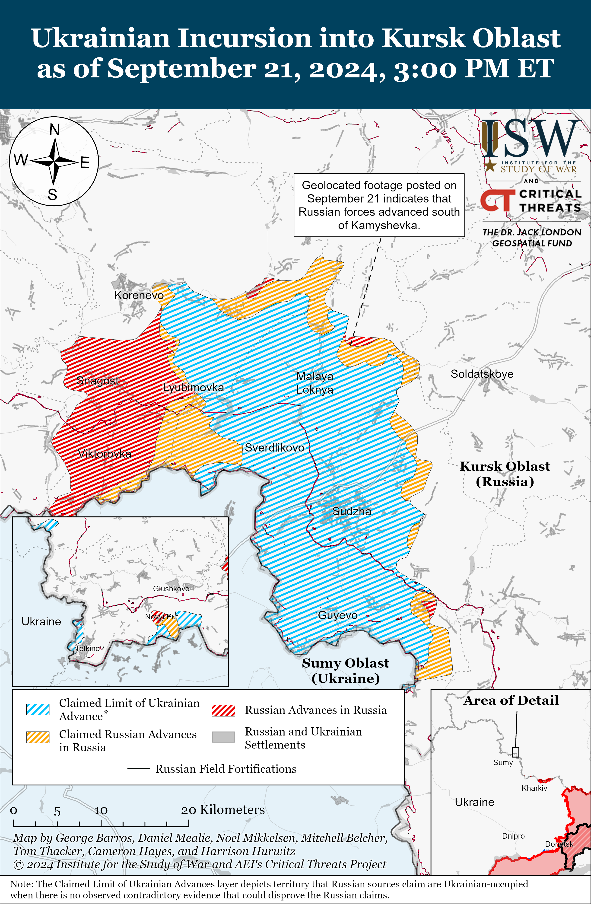
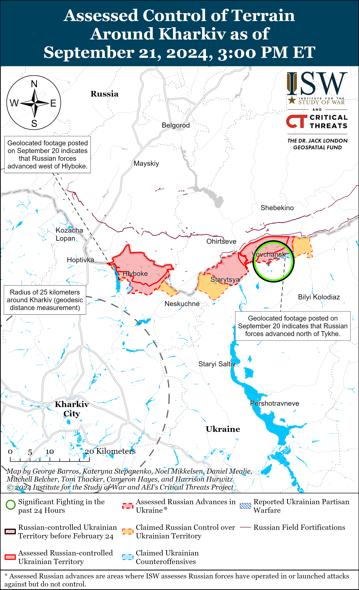
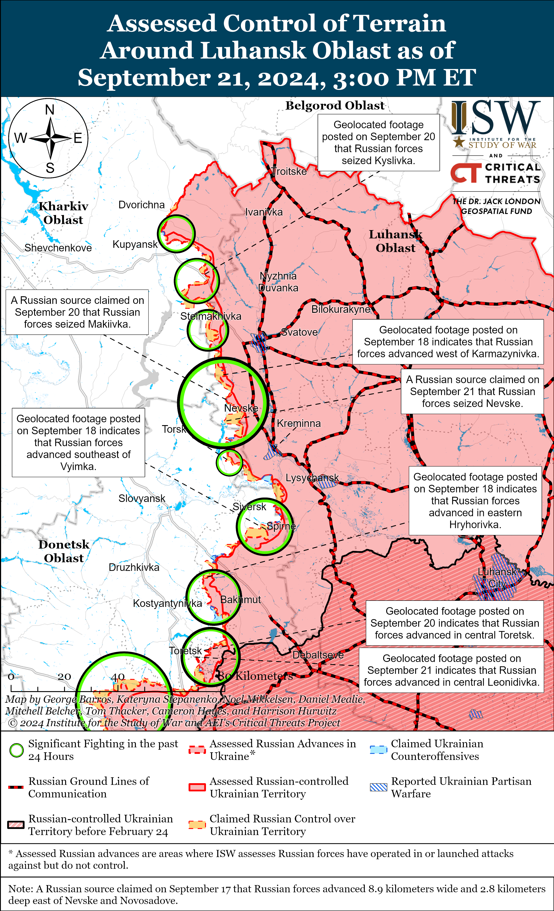
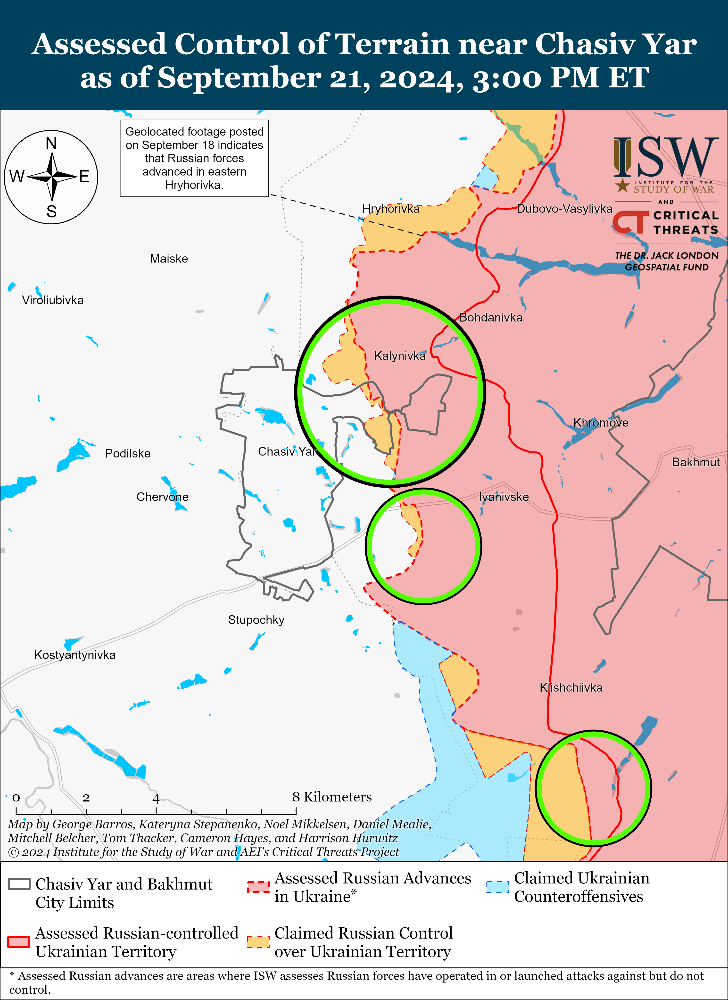
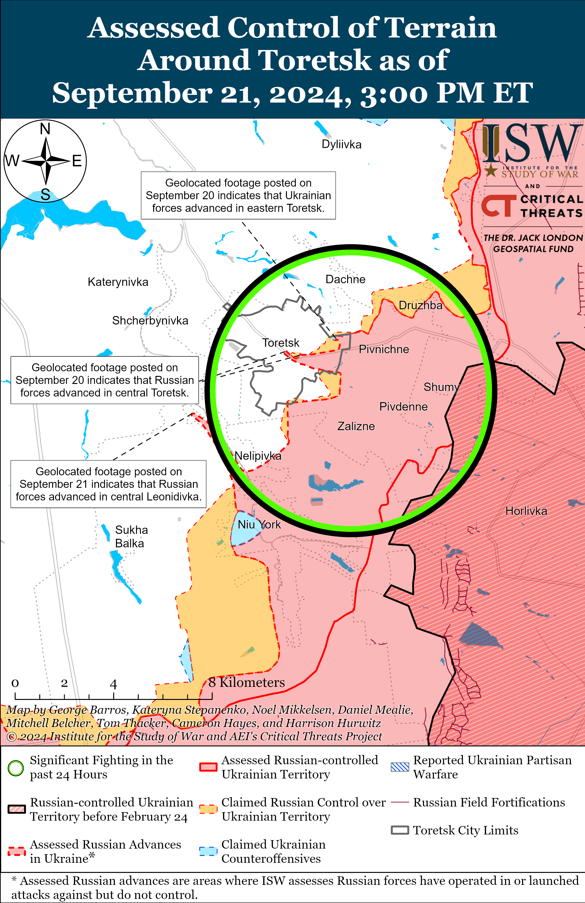
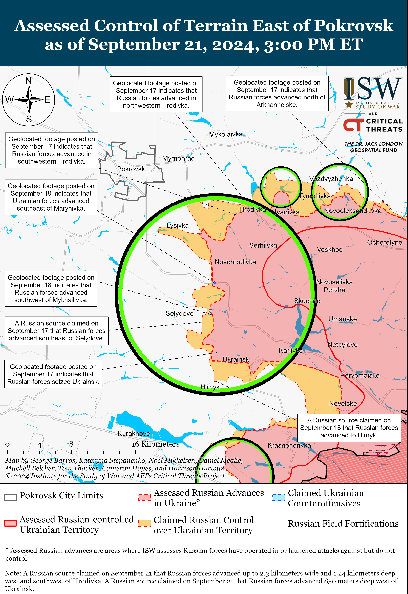
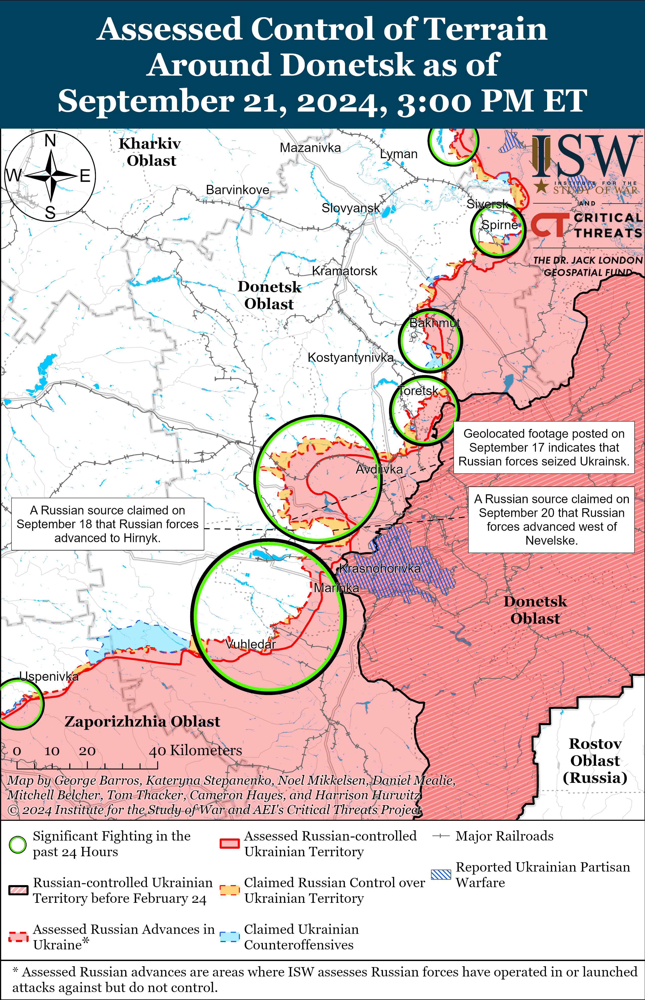
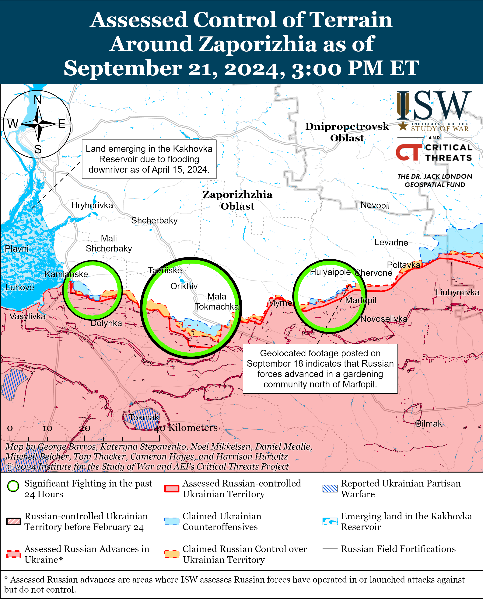
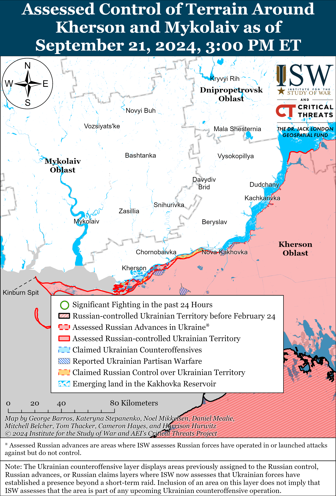

# Russian Offensive Campaign Assessment, September 21, 2024

**Angelica Evans, Grace Mappes, Kateryna Stepanenko, Davit Gasparyan, Riley Bailey, and Frederick W. Kagan**

**September 21, 2024, 9:30pm ET**

**Click** [**here**](https://storymaps.arcgis.com/stories/36a7f6a6f5a9448496de641cf64bd375) **to see ISW’s interactive map of the Russian invasion of Ukraine. This map is updated daily alongside the static maps present in this report.**

**Click** [**here**](https://storymaps.arcgis.com/stories/83a2f24901c941d581c0c523ecd2619b) **to see ISW’s interactive map of Ukraine’s offensive in Kursk Oblast.**

**Click** [**here**](https://understandingwar.maps.arcgis.com/apps/instant/3dviewer/index.html?appid=1602762dbcde419bb957dea358449580) **to see ISW’s 3D control of terrain topographic map of Ukraine. Use of a computer (not a mobile device) is strongly recommended for using this data-heavy tool.**

**Click** [**here**](https://storymaps.arcgis.com/stories/733fe90805894bfc8562d90b106aa895) **to access ISW’s archive of interactive time-lapse maps of the Russian invasion of Ukraine. These maps complement the static control-of-terrain map that ISW produces daily by showing a dynamic frontline. ISW will update this time-lapse map archive monthly.**

**Note: The data cut-off for this product was 2:15 pm ET on September 21. ISW will cover subsequent reports in the September 22 Russian Offensive Campaign Assessment.|**

**Ukrainian forces conducted another successful drone strike against Russian missile and ammunition storage facilities as well as a mobile radar system in Russia overnight on September 20 to 21.** The Ukrainian General Staff reported on September 21 that drone operators of the Ukrainian military, Ukrainian Security Service (SBU), Special Operations Forces (SSO), and Unmanned Systems Forces struck the Tikhoretsk Arsenal just north of Kamenny, Krasnodar Krai and the Russian Main Artillery Directorate of the Ministry of Defense’s (MoD) 23rd Arsenal near Oktyabrsky, Tver Oblast (14km south of Toropets).[1] Footage published on September 20 and 21 shows explosions and secondary detonations at both arsenals, and fires continued at both locations during the day on September 21.[2] The Ukrainian General Staff reported that the Tikhoretsk Arsenal contained at least 2,000 tons of munitions, including munitions from North Korea, at the time of the strike.[3] An SBU source told Ukrainian outlet *Hromadske* that the Russian 23rd Arsenal contained Iskander and Tochka-U ballistic missiles and that Ukrainian forces also struck the Shaykovka Airfield in Kaluga Oblast, and *Hromadske* included footage of an explosion though it is unclear whether the footage shows the Shaykovka Airfield.[4] The Russian MoD claimed that Russian forces intercepted 101 Ukrainian drones overnight, including 18 drones over Krasnodar Krai and three drones over Tver Oblast.[5] Krasnodar Krai regional authorities blamed the Tikhoretsk Arsenal explosion on falling Ukrainian drone debris, declared a local state of emergency, altered railway schedules and routes, and evacuated about 1,200 civilians from the area.[6] The United Kingdom (UK) MoD reported that the Russian Main Artillery Directorate’s 103rd Arsenal near Toropets, which Ukrainian forces struck on September 17 to 18, had recently undergone modernization because Russian forces had been improperly storing munitions at their arsenals, causing explosions at several depots.[7]

The Ukrainian General Staff reported that Ukrainian forces also struck a Russian Podlet K1 mobile long-range radar system that was protecting the Tikhoretsk Arsenal, and this system is at least the fifth Podlet K1 system that Ukrainian forces have reportedly damaged or destroyed since February 2022.[8] The Podlet K1 system can detect up to 200 aerial targets simultaneously at a range of up to 300 kilometers and the Russian military introduced the system into service in 2015.[9] Russian forces use the Podlet K1 system to detect air targets at low and very low altitudes for Russian air defenses, including S-300 and S-400 systems.[10] Ukrainian forces have reportedly damaged or destroyed at least four other Russian Podlet K1 systems since the onset of the full-scale invasion, including in Lazurne, Kherson Oblast as of July 20, 2022; near Zelenotropynske, Kherson Oblast as of July 24, 2022; in Belgorod Oblast as of November 1, 2023; and in an unspecified location as of April 27, 2024.[11] Ukrainian forces also found a destroyed Russian Podlet K1 system in Chornobaivka, Kherson Oblast on November 14, 2022, following Ukraine’s liberation of west (right) bank Kherson Oblast as of November 11, 2022, though the cause of this Podlet K1’s destruction was unclear.[12]

**The Kremlin appears to be reorganizing Russia’s decentralized, regional volunteer recruitment campaigns into a federal effort, indicating that Russia is struggling to meet the manpower demands of its war in Ukraine despite previous claims that the Ukrainian incursion into Kursk Oblast caused a spike in Russia’s volunteer recruitment.** Russian President Vladimir Putin signed a decree on September 20 forming an interdepartmental commission under the Russian Security Council to more fully staff the Russian Armed forces with contract servicemembers (*kontraktniki*).[13] The commission will coordinate the activities of federal, regional, and municipal government bodies and organizations in selecting candidates for contract military service, including improving the selection process; assessing ongoing efforts to attract candidates to volunteer formations; and considering proposals to improve material incentives and social support for *kontraktniki* and their families. Russian Security Council Deputy Chairperson Dmitry Medvedev will chair the commission and Russian Defense Minister Andrei Belousov will be the deputy chairperson of the commission. Russian authorities have previously signaled their intention to centralize volunteer recruitment efforts by opening a “Military Service Consulting Center” in Moscow City, posturing Moscow as the center of Russia’s federal recruitment efforts, investing in higher-quality recruitment ads, and leveraging national figures in this federal-level recruitment campaign.[14]  Russian officials claimed in August and September 2024 that the Ukrainian incursion into Kursk Oblast prompted more people to express interest in becoming volunteers (whom the Kremlin also began to call *kontraktniki)*, but Putin’s decision to centralize Russia’s volunteer recruitment efforts indicates that Putin assesses that Russia is not recruiting a sufficient number of volunteers to meet Russia’s manpower needs.[15] Putin notably signed the decree on the eve of the second anniversary of the Fall 2022 partial mobilization, and this decree further signals his aversion to involuntary mobilization at this time.[16]

Russian federal subjects (regions) have historically formed the basis of Russia’s volunteer recruitment campaigns, and at least 36 Russian regions have reportedly increased one-time payments to volunteers/*kontraktniki* in 2024, indicating difficulties in Russia’s ability to recruit additional personnel.[17] Three sources close to the Kremlin and the Russian Ministry of Defense (MoD) told *Bloomberg* in August 2024 that the Russian military has struggled to recruit enough people to replace increasing Russian manpower losses throughout the war, and one individual told *Bloomberg* that Russian regions, on average, fell short of their recruitment quotas by about one-third.[18] Medvedev claimed in July 2024 that the MoD’s average daily recruitment rate for *kontraktniki* was 1,000 people, and an unnamed Western official estimated in August 2024 that Russian forces were suffering on average roughly 1,000 casualties per day, presumably throughout the frontline in Ukraine and Kursk Oblast, during an interview with UK outlet *Independent*.[19] ISW cannot independently confirm these numbers, however. The Kremlin will likely be able to continue the current tempo of Russian offensive operations in Ukraine with its current recruitment rate but will likely have to substantially increase its recruitment rates or decrease its daily personnel losses in order to further intensify offensive operations in Ukraine. The Kremlin has likely assessed that it can better control and improve Russia’s volunteer recruitment rates by centralizing and consolidating control over recruitment efforts and can no longer rely on underperforming regional recruitment campaigns to meet Russia’s manpower needs.

**The Russian military leadership and government are continuing to reduce the class of semi-independent Russian military innovators, specialists, and irregular commanders to advance force centralization objectives, maintain the offensive tempo in Donetsk Oblast, and compensate for personnel shortages.** Russian actress Yana Poplovskaya, numerous Russian milbloggers (including supporters of arrested former Russian officer Igor Girkin), and Russian neo-nationalist outlet *Tsargrad* reported as early as September 13 that Russian authorities arrested an assault detachment commander of the 110th Motorized Rifle Brigade (51st Combined Arms Army, formerly 1st Donetsk People’s Republic’s [DNR] Army Corps [AC]) Vladimir Novikov, also known under the alias “Beliy.”[20] Poplovskaya published an appeal asking Russian Defense Minister Andrei Belousov to return Novikov to the frontlines, noting that Novikov had played a key role in the Russian seizure of Avdiivka and Krasnohorivka, has three state courage orders, and has received many of letters from his subordinates demanding his release.[21] Some of Novikov’s subordinates and several milbloggers also noted that they joined the detachment solely because he inspired them.[22] Poplovskaya and a Russian milblogger, who claims to have worked alongside Novikov, claimed that Novikov was arrested after he attempted to stop Chechens from trafficking drugs to his servicemen.[23] Poplovskaya stated that Chechens made a false complaint about Novikov in retaliation, and a milblogger affiliated with Novikov implied that the Russian military command may not have approved of Novikov’s efforts to teach Russian military personnel and Storm-Z convicts to neutralize Ukrainian drone threats because the military command seeks to advance their own career aspirations.[24] The milblogger added that he and Novikov independently developed a counter-drone system called ”seizure of the small sky” with the aim of training Russian counter-drone specialists and that this initiative was against the staff’s protocol.[25] Russian officials did not publicly acknowledge Novikov’s arrest, and Belousov has yet to respond to any appeals.

*Tsargrad* notably linked Novikov’s arrest to the recent deaths of prominent Russian milbloggers and drone operators of the 87th Separate Rifle Regiment of the 1st “Slavic” Motorized Rifle Brigade (51st CAA) Dmitry Lysakovsky (better known under the alias Goodwill) and Lieutenant Colonel Sergey Gritsai (also known as Ernest) possibly overnight on September 12.[26] *Tsargrad* andseveral Russianmilbloggers familiar with the drone operators claimed that Lysakovsky and Gritsai were suddenly committed to a direct assault operation on September 11 alongside at least 12 other long-range aerial reconnaissance specialists, resulting in 14 people dying in the Pokrovsk direction. *Tsargrad* implied that the deaths and Novikov’s arrest could be related because both Lysakovsky and Gritsai also expressed concerns over drug usage in combat, and Russian state media amplified claims from Kremlin co-opted milbloggers that drone operators died in the aftermath of a Ukrainian drone strike in an unspecified rear area.[27] The two cases, however, may be linked by the Russian military’s command increasing desperation to generate more infantrymen to maintain the initiative in Pokrovsk and Donetsk City directions. Russian sources noted that the assault took place shortly after the Russian military command disbanded Lysakovsky‘s and Gritsai’s drone detachment.[28] A Russian milblogger and former Storm-Z instructor claimed that the Russian military command increasingly began to use servicemembers in the 1st “Slavic” Motorized Rifle Brigade, especially niche specialized detachments, in assaults and that the leadership of 51st CAA follows the motto of “we do not need smart people, we are smart ourselves. We need assaults [and] meat.”[29] The former Storm-Z instructor noted that the 1st “Slavic” Motorized Rifle Brigade disbanded drone detachments of its 268th Infantry Battalion and committed engineers of the 1st Reserve Battalion to battle as infantrymen.[30]

The particularly close timing between two incidents, the recent formal integration of the 1st DNR AC into the Russian military as the 51st CAA, and complaints about the Russian military command’s disregard for specialists in Donetsk Oblast may be symptoms of Russia’s manpower shortages and poor command culture.Novikov’s efforts to train Storm-Z elements to operate counter-drone systems may have contradicted the Russian military command’s intended use of these elements as purely “disposable” assault infantrymen. ISW had previously observed the Russian higher military command dismiss and imprison some popular and effective military commanders who raised concerns about the tempo of Russian operations and persistent issues with Russia’s campaign in Ukraine.[31] The Russian military-political leadership also destroyed the Wagner Group in an effort to reestablish control over and formalize Wagner, despite the fact that the Wagner Group contributed to some Russian innovations and accomplished some tactical military victories.[32]

**Iran reportedly did not send mobile launchers for the Fateh-360 short-range ballistic missiles it recently supplied to Russia, likely due a decision to prioritize sending additional missiles over bulky and easily replaceable launchers.** *Reuters*, citing three unnamed US and EU officials alongside several other experts, reported on September 21 that Iran did not provide mobile launchers for the Fateh-360 missiles it recently supplied to Russia.[33] *Reuters* reported that it is unclear why exactly Iran withheld the launchers although its sources suggested that Russia might instead use modified Russian-made vehicles to launch the missiles. Both Russia and Iran have repeatedly denied the Iranian supply of Fateh-360 missiles to Russia.[34] Russian Foreign Minister Sergei Lavrov stated on September 20 that US statements regarding Iranian and North Korean missile supplies to Russia are “fables” and that Russia has a sufficient stockpile of weapons.[35] Iran likely did not supply Russia with the mobile launchers given that shipping the launchers would require additional transportation and because, as noted by *Reuters*, Russia has alternative capabilities for launching the missiles. This arrangement enables both countries to avoid the logistical burden of transporting the launchers while allowing for more discreet transfer of the Fateh-360 missiles, enabling them to better obscure the supply chain and deny Iranian involvement in the Russian war effort. The fact that Iran did not send launchers does not in itself indicate anything about Iran’s commitment to supporting the Russian war effort.

**Russian officials have designated 47 countries as having opposing and dangerous moral attitudes to Russia, highlighting that the Kremlin is reviving a Soviet era tactic and mindset that defines a clear ideological division in the world.** Russian Prime Minister Mikhail Mishustin approved the list of 47 countries deemed to have “destructive attitudes” that clash with “Russian spiritual and moral” values on September 20 following a recent presidential decree facilitating immigration to Russia for individuals who reject “destructive neoliberal values” in their home countries.[36] The list includes Western and other allied countries that have largely supported Ukraine, but notably does not include Slovakia, Hungary, Turkey, Moldova, and Georgia.[37] This move underscores a pattern in which Russian officials accuse the West and the US of creating ideological divides supposedly aimed at isolating Russia, while engaging in this Cold War-style behavior, promoting global ideological camps and separation themselves.[38] Russia has recently enhanced efforts at establishing Eurasian security forums and mechanisms such as the Russian-proposed ”Eurasian security architecture” that aim to exclude the West and enhance divides based on these alleged ideological lines.[39] ISW has also observed that the Kremlin recently intensified efforts to codify a state ideology based on vague Russian “traditional values” while bypassing the Russian Constitution, which notably forbids such endeavors.[40]

**Russian milblogger analyses of Russia’s war in Ukraine continue to suggest that the Kremlin perceives Western commitment to Ukraine as feeble.** Prominent Kremlin-affiliated milblogger Mikhail Zvinchuk gave an interview to Belarusian state newswire *Belta* on September 20 describing the war in Ukraine as a “strange under-war” that predominantly operates on a political plane.[41] Zvinchuk claimed that the West’s primary objective of the war in Ukraine is not to achieve a strategic military defeat of Russia, but rather to secure profits and political advantages domestically. He noted that if the West genuinely aimed to defeat Russia, it would have provided Ukraine with more weapons and means of combat along with greater NATO involvement. Zvinchuk argued that the West’s actions have not significantly challenged Russia and suggested that the West’s slow and limited support has given Russia enough time to strengthen its defenses and build up its forces. Zvinchuk also falsely claimed that Ukraine is simply a testing ground for Western artificial intelligence (AI) and command and control (C2) systems, echoing previous Russian statements suggesting that Ukraine is simply a military testing site for the West.[42] Western hesitation in approving Ukraine’s ability to use long-range Western-provided weapons to strike military objects in Russia and previous delays in Western aid provision to Ukraine may have further confirmed the Kremlin’s assessment that Russia can outlast Western support for Ukraine.[43] Western-policymakers maintain the power to properly equip Ukraine and challenge the Kremlin’s assessment of Western commitment to Ukraine.

**Key Takeaways:**

- **Ukrainian forces conducted another successful drone strike against Russian missile and ammunition storage facilities as well as a mobile radar system in Russia overnight on September 20 to 21.**
- **The Kremlin appears to be reorganizing Russia’s decentralized, regional volunteer recruitment campaigns into a federal effort, indicating that Russia is struggling to meet the manpower demands of its war in Ukraine despite previous claims that the Ukrainian incursion into Kursk Oblast caused a spike in Russia’s volunteer recruitment.**
- **The Russian military leadership and government are continuing to reduce the class of semi-independent Russian military innovators, specialists, and irregular commanders to advance force centralization objectives, maintain the offensive tempo in Donetsk Oblast, and compensate for personnel shortages.**
- **Iran reportedly did not send mobile launchers for the Fateh-360 short-range ballistic missiles it recently supplied to Russia, likely due a decision to prioritize sending additional missiles over bulky and easily replaceable launchers.**
- **Russian officials have designated 47 countries as having opposing and dangerous moral attitudes to Russia, highlighting that the Kremlin is reviving a Soviet era tactic and mindset that defines a clear ideological division in the world.**
- **Russian milblogger analyses of Russia’s war in Ukraine continue to suggest that the Kremlin perceives Western commitment to Ukraine as feeble.**
- **Russian forces recently advanced in Kursk Oblast.**
- **Russian forces advanced north of Kharkiv City and near Kupyansk, Kreminna, Tortesk, and southwest of Donetsk City.**
- **The Kremlin has not fully suppressed localized protests organized by wives of Russian mobilized servicemen since declaring partial mobilization on September 21, 2022.**

****

***We do not report in detail on Russian war crimes because these activities are well-covered in Western media and do not directly affect the military operations we are assessing and forecasting. We will continue to evaluate and report on the effects of these criminal activities on the Ukrainian military and the Ukrainian population and specifically on combat in Ukrainian urban areas. We utterly condemn Russian violations of the laws of armed conflict and the Geneva Conventions and crimes against humanity even though we do not describe them in these reports.***

- Ukrainian Operations in the Russian Federation
- Russian Main Effort – Eastern Ukraine (comprised of three subordinate main efforts)
- Russian Subordinate Main Effort #1 – Push Ukrainian forces back from the international border with Belgorod Oblast and approach to within tube artillery range of Kharkiv City
- Russian Subordinate Main Effort #2 – Capture the remainder of Luhansk Oblast and push westward into eastern Kharkiv Oblast and encircle northern Donetsk Oblast
- Russian Subordinate Main Effort #3 – Capture the entirety of Donetsk Oblast
- Russian Supporting Effort – Southern Axis
- Russian Air, Missile, and Drone Campaign
- Russian Mobilization and Force Generation Efforts
- Russian Technological Adaptations
- Activities in Russian-occupied areas
- Ukrainian Defense Industrial Base Efforts
- Russian Information Operations and Narratives
- Significant Activity in Belarus

**Ukrainian Operations in the Russian Federation**

Ukrainian forces continued offensive operations west of the Ukrainian salient in Kursk Oblast on September 21, but Ukrainian forces did not make any confirmed advances. Russian milbloggers claimed that Ukrainian forces unsuccessfully attacked in Glushkovsky Raion, including south of Glushkovo near Novy Put and Medvezhye, but suggested that Ukrainian assaults in the area are becoming less intense.[44]

Ukrainian forces continued offensive operations in the Ukrainian salient in Kursk Oblast on September 21, but Ukrainian forces did not make any confirmed advances. Russian milbloggers claimed that Ukrainian forces unsuccessfully attacked in western Lyubimovka (east of Snagost) and in the direction of Kamyshevka (north of Sudzha).[45]

Russian forces recently recaptured territory in the Ukrainian salient in Kursk Oblast amid continued Russian counterattacks west of and against the salient on September 21. Geolocated footage published on September 21 indicates that elements of the Russian 83rd Airborne (VDV) Brigade recently advanced south of Kamyshevka during a platoon-sized mechanized assault in the area.[46] Russian milbloggers claimed that Russian forces also counterattacked near Lyubimovka and that fighting is ongoing southeast of Snagost near Nikolayevo-Darino and east of Korenevo near Kremyanoye.[47] Ukrainian military observer Kostyantyn Mashovets stated that elements of the Russian 810th Naval Infantry Brigade (Black Sea Fleet [BSF], Southern Military District [SMD]) are attacking in the direction of Kemyanoye and Vetreno (both east of Korenevo); elements of the 51st VDV Regiment (106th VDV Division) and 56th VDV Regiment (7th VDV Division) are attacking in the direction of Lyubimovka and Darino (south of Snagost); and elements of the 200th Motorized Rifle Brigade (14th Army Corps [AC], Leningrad Military District [LMD]) are attacking near Pogrebki (north of Sudzha).[48] Mashovets stated that Russian forces recently transferred elements of the Russian 106th VDV Division’s 137th and 119th VDV regiments from the Chasiv Yar direction and from its operational reserve, respectively; up to two additional howitzer batteries of a battalion of Russia’s 52nd Separate Artillery Brigade (VDV) from the Kharkiv direction; and additional battalion- and company-sized elements from other unspecified units to Kursk Oblast.[49] Mashovets noted that Russian forces are rebuilding temporary pontoon crossings in Glushkovsky Raion near Zvannoye and Glushkovo and recently repaired a bridge near Zvannoye. Ukrainian Pivnich (Northern) Operational Command Spokesperson Vadym Mysnyk reported that Russian forces have dropped over 1,300 glide bombs against areas of Kursk Oblast where Ukrainian forces are operating and suggested that Russian citizens have been “shocked” by the bombardment of Russian territory.[50] Elements of the Russian 234th VDV Regiment (76th VDV Division) are reportedly operating near Glushkovo.[51]

**Russian Main Effort – Eastern Ukraine**

**Russian Subordinate Main Effort #1 – Kharkiv Oblast** **(Russian objective: Push Ukrainian forces back from the international border with Belgorod Oblast and approach to within tube artillery range of Kharkiv City)**

Russian forces recently marginally advanced north of Kharkiv City amid continued fighting north of Kharkiv City near Lyptsi and northeast of Kharkiv City in Vovchansk on September 21.[52] Geolocated footage published on September 20 shows that Russian forces recently marginally advanced within the dacha area west of Hlyboke (north of Kharkiv City).[53] The Ukrainian Kharkiv Group of Forces reported on September 21 that two Russian motorcycles attempted to reach the advanced positions of the Russian 11th Tank Regiment (18th Motorized Rifle Division, 11th Army Corps [AC], Leningrad Military District [LMD]) near Hlyboke but detonated on Ukrainian mines.[54] The commander of a Ukrainian battalion operating in the Kharkiv direction reported that Russian forces deployed unspecified Chechen “Akhmat” elements to force Russian forces to advance and that Chechen ”Akhmat” forces are allowed to coerce Russian soldiers to fight, enforce punishments, and even execute Russian soldiers.[55]

**Russian Subordinate Main Effort #2 – Luhansk Oblast** **(Russian objective: Capture the remainder of Luhansk Oblast and push westward into eastern Kharkiv Oblast and northern Donetsk Oblast)**

Russian forces have likely seized Kyslivka (southeast of Kupyansk) and reportedly seized Nevske (northwest of Kreminna) amid continued Russian offensive operations along the Kupyansk-Svatove-Kreminna line on September 21. Geolocated footage published on September 20 shows that Russian forces have advanced to positions west of Kyslivka, indicating that they likely seized the settlement.[56] Some Russian milbloggers claimed that Russian forces also seized Nevske, citing geolocated footage published on September 21 of a Russian flag flying atop a building in central Nevske.[57] The footage does not show Russian soldiers within the village, however, so it is unclear whether Russian forces maintain or even had a physical presence within Nevske.[58] The Ukrainian General Staff reported on September 21 that Russian forces focused offensive efforts near Nevske.[59] A prominent Russian milblogger, who also claimed that Russian forces had seized Nevske, conceded that it is unclear whether Russian forces had seized the settlement by advancing from the east or north.[60] Other Russian milbloggers claimed that Russian forces advanced into Nevske but have not claimed that Russian forces seized the settlement.[61] A Russian milblogger also claimed that fighting continues within northern Makiivka (northwest of Kreminna) after another milblogger claimed that Russian forces had seized the settlement as of September 20.[62] Russian forces also continued ground attacks northeast of Kupyansk near Synkivka; south of Kupyansk near Kruhlyakivka; southeast of Kupyansk near Stepova Novoselivka, Lozova, and Stelmakhivka; northwest of Kreminna near Druzhelyubivka, Cherneshchyna, Novosadove, Zarichne, and Hrekivka; and west of Kreminna near Torske on September 20 and 21.[63]

**Russian Subordinate Main Effort #3 – Donetsk Oblast (Russian objective: Capture the entirety of Donetsk Oblast, the claimed territory of Russia’s proxies in Donbas)**

Russian forces reportedly continued offensive operations southeast of Siversk near Vyimka on September 20 and 21 but did not make confirmed advances.[64] Medical elements of the “Volki” (Wolves) Brigade (Russian Volunteer Corps) are reportedly operating west of Soledar (southwest of SIversk).[65]

Russian forces continued offensive operations near Chasiv Yar on September 20 and 21 but did not advance. The Ukrainian General Staff reported that Russian forces attacked near Chasiv Yar; northeast of Chasiv Yar near Kalynivka and in the direction of Mayske; southeast of Chasiv Yar near Ivanivske and Andriivka; and south of Chasiv Yar near Bila Hora.[66] A deputy commander of a Ukrainian brigade operating in the Chasiv Yar direction reported that Russian infantry is largely using buggies, motorcycles, and all-terrain vehicles to attack in this direction due to significant Russian military equipment losses.[67]

Russian forces recently made confirmed advances in central Toretsk and southwest of the settlement. Geolocated footage published on September 20 and September 21 indicates that Russian forces marginally advanced in central Toretsk and central Leonidivka (southwest of Toretsk), and Russian milbloggers claimed that Russian forces also advanced along Druzhby and Ivana Karabitsa streets in central Toretsk.[68] Russian forces continued offensive operations northeast of Toretsk near Dachne, near Toretsk itself, south of Toretsk near Nelipivka, and near Toretsk in the direction of Scherbynivka on September 20 and 21.[69]

Russian forces continued offensive operations east and southeast of Pokrovsk but did not make any confirmed gains on September 21. Russian milbloggers claimed that Russian forces operating east of Pokrovsk advanced along a front 2.3 kilometers wide and up to 1.24 kilometers deep west and southwest of Hrodivka and reached the eastern outskirts of Mykolaivka (immediately west of Hrodivka).[70] Russian milbloggers claimed that Russian forces operating southeast of Pokrovsk advanced up to 850 meters west of Ukrainsk and seized the Selydivska coal mine immediately west of Ukrainsk.[71] ISW has not observed confirmation of these Russian claims, however. Russian forces continued offensive operations east of Pokrovsk near Vozdvyzhenka, Novotoretske, Zelene Pole, Krasnyi Yar, and Hrodivka and southeast of Pokrovsk near Novohrodivka, Sukhyi Yar, Marynivka, Mykhailivka, Selydove, Myrolyubivka, Lysivka, Zhelanne Pershe, Tsukuryne, and Hirnyk on September 20 and 21.[72] A Russian source claimed on September 20 that Russian forces have stopped frontal assaults against Ukrainian positions in eastern Ukraine and are currently focused on encircling Ukrainian positions to seize territory, particularly near Hirnyk and Selydove.[73]

[****](https://understandingwar.org/wp-content/uploads/2025/05/East20of20Pokrovsk20Battle20Map20Draft20September20212C202024.png)

Russian forces recently conducted a reinforced battalion-sized mechanized assault west of Donetsk City and continued offensive operations in the area on September 21 but did not make any confirmed gains. A Ukrainian brigade operating in the Kurakhove direction (west and southwest of Donetsk City) posted geolocated footage on September 20 showing Russian forces conducting the reinforced battalion-sized mechanized assault near Maksymilyanivka on September 19 and reported that Russian forces used 52 various armored vehicles in 24 “breakthrough attempts” against Ukrainian positions.[74] The Ukrainian Brigade reported that it destroyed eights tanks and BMP armored vehicles (in total), four armored personnel carriers, one MT-LB armored vehicle, and a motorcycle and damaged four BMPs.[75] Russian forces advanced west of Donetsk City into eastern Hostre during a tactically effective but costly reinforced battalion-sized mechanized assault on September 12, and the Russian military command may assess that continued relatively large, mechanized assaults in the area will allow Russian forces to advance more quickly towards Kurakhove despite the Russian military’s routine failure to conduct effective mechanized assaults in Ukraine.[76] ISW has yet to observe evidence that Russian forces advanced during the battalion-sized mechanized assault near Maksymilyanivka. Russian forces conducted offensive operations near Heorhiivka and Oleksandrivka and in the direction of Dalne on September 20 and 21.[77] Elements of the Russian 33rd Motorized Rifle Regiment (20th Motorized Rifle Division, 8th Combined Arms Army [CAA], Southern Military District [SMD]) are reportedly operating in the Kurakhove direction.[78]

Russian forces recently advanced southwest of Donetsk City and recently conducted a battalion-sized mechanized assault in the area. Geolocated footage published on September 20 shows reported elements of the Russian 5th Tank Brigade (36th CAA, Eastern Military District [EMD]) advancing northeast of Prechystivka (west of Vuhledar) during a platoon-sized mechanized assault.[79] A Ukrainian brigade operating southwest of Donetsk City posted footage on September 21 showing the brigade’s elements repelling a battalion-sized mechanized Russian assault near Kostyantynivka on an unspecified date and reported that Russian forces used 35 armored vehicles and nine tanks during the assault.[80] The Ukrainian brigade reported that it destroyed five Russian armored vehicles during the battalion-sized mechanized assault. ISW has not yet observed confirmation that Russian forces advanced during the battalion-sized mechanized assault near Kostyantynivka. Russian forces continued offensive operations near Kostyantynivka, Katerynivka, Bohoyavlenka, Vuhledar, Novoukrainka, and Prechystivka on September 20 and 21.[81] Elements of the Russian 40th Naval Infantry Brigade (Pacific Fleet, EMD) are reportedly operating near Prechystivka, and drone operators of an unspecified unit of the 29th CAA (EMD) are reportedly operating in the Vuhledar direction.[82]

Russian and Ukrainian sources did not report any fighting in the Donetsk-Zaporizhia Oblast border area on September 21.

Ukrainian Mariupol Mayoral Advisor Petro Andryushchenko amplified satellite imagery of several Russian logistics facilities in the Berdyansk-Mariupol area on September 21 and claimed that Ukrainian forces targeted the facilities with unspecified munitions.[83]

**Russian Supporting Effort – Southern Axis** **(Russian objective: Maintain frontline positions and secure rear areas against Ukrainian strikes)**

The Ukrainian General Staff reported on September 21 that Russian forces attacked near Hulyaipole.[84] Positional fighting continued in western Zaporizhia Oblast near Robotyne, north of Robotyne near Novoandriivka, northwest of Robotyne near Novoandriivka and Lobkove, and northeast of Robotyne near Mala Tokmachka on September 20 and 21.[85] Elements of the North Ossetian “Alania” Battalion (Russian Volunteer Corps) are reportedly fighting along a highway towards Orikhiv.[86] Zaporizhia Oblast occupation official Vladimir Rogov claimed that Russian air defense systems shot down two Ukrainian guided aerial bombs targeting Tokmak.[87]

Positional fighting continued in east (left) bank Kherson Oblast on September 20 and 21.[88]

Russian milbloggers claimed that Russian forces intercepted several Ukrainian missiles targeting occupied Crimea on September 21.[89]

**Russian Air, Missile, and Drone Campaign** **(Russian Objective: Target Ukrainian military and civilian infrastructure in the rear and on the frontline)**

Russian forces conducted another series of missile and drone strikes against Ukraine overnight on September 20 to 21. The Ukrainian Air Force reported that Russian forces launched 25 missiles and drones at Ukraine, including four Iskander-M or North Korean KN-23 ballistic missiles from Rostov Oblast and occupied Crimea towards Dnipropetrovsk Oblast, five Kh-59/69 guided air missiles from over occupied Zaporizhia Oblast, and 16 Shahed drones from Primorsko-Akhtarsk, Krasnodar Krai and Kursk Oblast.[90] The Ukrainian Air Force reported that Ukrainian forces downed five Kh-59/69 missiles and 11 Shahed drones, and that Ukrainian electronic warfare (EW) caused another five Russian drones to become lost.[91] Russian milbloggers claimed that Russian forces struck Ukrainian military and Ministry of Internal Affairs bases in Kryvyi Rih.[92]

Newly-appointed Ukrainian Foreign Minister Andriy Sybiha stated on September 21 that Russian forces are preparing to conduct strikes against the open switchgears and transmission substations of Ukrainian nuclear power plants (NPPs) ahead of Winter 2024-2025 and called on the International Atomic Energy Agency (IAEA) to establish an expanded, permanent presence at each of Ukraine’s unoccupied NPPs.[93]

**Russian Mobilization and Force Generation Efforts** **(Russian objective: Expand combat power without conducting general mobilization)**

The Kremlin has not fully suppressed localized protests organized by wives of Russian mobilized servicemen since declaring partial mobilization on September 21, 2022. Russian opposition sources reported on September 21 that a group of wives of mobilized Russian soldiers protested in front of the Russian Ministry of Defense (MoD) headquarters on the second anniversary of the partial mobilization announcement and demanded to speak to Russian Defense Minister Andrei Belousov.[94] Russian opposition outlet *Mobilization News* reported that a group of provocateurs disrupted the protest by verbally abusing and attempting to disperse the women and that Belousov did not meet with the protesters.[95] *Mobilization News* claimed that the Russian MoD may have sent provocateurs to disperse the protest. ISW has assessed that Russian authorities are reluctant to conduct another round of partial mobilization or general mobilization due to Russian President Vladimir Putin’s fear of the societal backlash to involuntary reserve call ups.[96]

The Russian Ministry of Defense (MoD) published footage on September 21 of the “BARS-Belgorod” volunteer detachment training at training ground in Belgorod Oblast, likely to demonstrate that Russia had formed new volunteer territorial defense units in oblasts on Russia’s border with Ukraine in response to the Ukrainian incursion into Kursk Oblast.[97] The Russian MoD and the Belgorod Oblast administration announced on September 5 the creation of the “BARS-Belgorod” volunteer detachment and that the detachment will protect infrastructure facilities, conduct anti-drone measures, detect Ukrainian sabotage and reconnaissance groups, evacuate civilians, and “secure the counterterrorism regime” in Belgorod Oblast.[98]

Wagner Group’s official Telegram channel reported on September 21 that a former Wagner Group base caught fire in Molkino, Krasnodar Krai.[99] Wagner Group controlled the Molkino base until July 2023, after the Russian MoD allocated the base to the MoD-affiliated Africa Corps.[100] Russian media reported that the cause of the fire is unknown, but Russian milbloggers claimed that “negligence” or sabotage may have caused the fire.[101]

The Russian MoD continues to posture as providing adequate medical care to the growing number of Russian servicemembers and veterans of the war in Ukraine. Russian State Secretary – Deputy Defense Minister Anna Tsivileva visited the Kirov Military Medical Academy in Saint Petersburg on September 20 and emphasized the facility’s technological medical innovations, new methods of treating various combat injuries, and physical rehabilitation programs for soldiers.[102]

**Russian Technological Adaptations** **(Russian objective: Introduce technological innovations to optimize systems for use in Ukraine)**

Nothing significant to report.

**Ukrainian Defense Industrial Efforts** **(Ukrainian objective: Develop its defense industrial base to become more self-sufficient in cooperation with US, European, and international partners)**

*ISW is suspending publishing coverage of Ukrainian defense industrial efforts until further notice.*

**Activities in Russian-occupied areas** **(Russian objective: Consolidate administrative control of annexed areas; forcibly integrate Ukrainian citizens into Russian sociocultural, economic, military, and governance systems)**

*ISW is not publishing coverage of Russian-occupied areas today.*

**Russian Information Operations and Narratives**

Russian Foreign Minister Sergey Lavrov downplayed repeated Russian threats of nuclear escalation on September 20, claiming that such Kremlin statements are not serious and that Russian officials and decision makers understand the dangers of nuclear war.[103] Russian officials have repeatedly invoked nuclear threats as part of an information campaign to discourage further Western support for Ukraine, and ISW continues to assess that these threats are unlikely to result in actual Russian nuclear escalation.[104]

**Significant activity in Belarus** **(Russian efforts to increase its military presence in Belarus and further integrate Belarus into Russian-favorable frameworks and Wagner Group activity in Belarus)|**

Russian Deputy Defense Minister Pavel Fradkov met with Belarusian Deputy Defense Minister for Logistics Major General Andrei Burdyko in Minsk on September 21 and discussed bilateral cooperation and cooperation between the Russian and Belarusian defense ministries in “relevant areas” including construction of civilian and military infrastructure.[105]

**Note: ISW does not receive any classified material from any source, uses only publicly available information, and draws extensively on Russian, Ukrainian, and Western reporting and social media as well as commercially available satellite imagery and other geospatial data as the basis for these reports. References to all sources used are provided in the endnotes of each update.**

---

[1] https://www.facebook.com/GeneralStaff.ua/posts/pfbid02wv7ZVUBSNb3xJF5t45H7BmGwnMNaQFHDmA5zDHAX8oR1HGHhCz1BZ4CRut7QVAEl; https://armyinform dot com.ua/2024/09/21/syly-oborony-ukrayiny-urazyly-na-rosiyi-dva-vijskovyh-arsenaly-j-pivnichnokorejskyj-eshelon/

[2] https://x.com/bayraktar\_1love/status/1837377368396116039; https://x.com/bayraktar\_1love/status/1837380001567584520; https://x.com/bayraktar\_1love/status/1837384825356857498; https://livingatlas.arcgis.com/wayback/#active=52930&mapCenter=31.64317%2C56.36138%2C16; https://x.com/bayraktar\_1love/status/1837411720236515790; https://x.com/bayraktar\_1love/status/1837367011355004955; https://x.com/bayraktar\_1love/status/1837470984217010313; https://x.com/bradyafr/status/1837470322519355408; https://t.me/cxemu/4161 ; https://suspilne dot media/841491-pozezi-trivaut-shemi-opublikuvali-znimok-z-naslidkami-nicnogo-udaru-po-zbrojovih-skladah-rosii/

[3] https://www.facebook.com/GeneralStaff.ua/posts/pfbid02wv7ZVUBSNb3xJF5t45H7BmGwnMNaQFHDmA5zDHAX8oR1HGHhCz1BZ4CRut7QVAEl; https://armyinform dot com.ua/2024/09/21/syly-oborony-ukrayiny-urazyly-na-rosiyi-dva-vijskovyh-arsenaly-j-pivnichnokorejskyj-eshelon/

[4] https://hromadske dot ua/viyna/231603-henshtab-pidtverdyv-udar-po-vidrazu-dvokh-skladakh-boyeprypasiv-takoz-urazeno-rls; https://t.me/hromadske\_ua/51243

[5] https://t.me/mod\_russia/43635

[6] https://t.me/tass\_agency/274127 ; https://t.me/tass\_agency/274128 ; https://t.me/tass\_agency/274129 ; https://t.me/tass\_agency/274130 ; https://t.me/dva\_majors/53153; https://t.me/RVvoenkor/77366 ; https://t.me/kondratyevvi/7787; https://t.me/tass\_agency/274163; ttps://t.me/tass\_agency/274194; https://t.me/kondratyevvi/7789; https://meduza dot io/news/2024/09/21/v-tihoretskom-rayone-kubani-vveli-lokalnyy-rezhim-chs-posle-ataki-ukrainskih-dronov-v-genshtabe-vsu-zayavili-ob-udare-po-eshelonu-s-boepripasami; https://t.me/sotaproject/87460; https://t.me/bbcrussian/70726; https://t.me/astrapress/64853 ; https://t.me/tass\_agency/274216

[7] https://x.com/DefenceHQ/status/1837408710286524716

[8] https://www.facebook.com/GeneralStaff.ua/posts/pfbid02wv7ZVUBSNb3xJF5t45H7BmGwnMNaQFHDmA5zDHAX8oR1HGHhCz1BZ4CRut7QVAEl; https://armyinform dot com.ua/2024/09/21/syly-oborony-ukrayiny-urazyly-na-rosiyi-dva-vijskovyh-arsenaly-j-pivnichnokorejskyj-eshelon/

[9] https://mil.in dot ua/en/news/kamikaze-drones-hit-elements-of-the-russian-48ya6-k1-podlet-radar/#google\_vignette; https://odin.tradoc.army.mil/WEG/Asset/48Ya6-K1\_Podlet\_K1\_Russian\_Mobile\_Long-Range\_High-Altitude\_Surveillance\_Radar/1000

[10] https://gur.gov dot ua/en/content/podlot-za-700-milioniv-urazheno-novitniu-rls-voroha; https://mil.in dot ua/en/news/kamikaze-drones-hit-elements-of-the-russian-48ya6-k1-podlet-radar/#google\_vignette

[11] https://censor dot net/ru/news/3355258/vsu\_unichtojili\_v\_hersonskoyi\_oblasti\_sovremennuyu\_rossiyiskuyu\_rls\_podlet\_dopolneno\_videofoto; https://t.me/Bratchuk\_Sergey/15836; https://war.obozrevatel dot com/v-chernobaevke-unichtozhena-samaya-sovremennaya-radiolokatsionnaya-stantsiya-okkupantov-foto.htm; https://gur.gov dot ua/en/content/rozvidnyky-urazyly-rosiisku-radioreleinu-stantsiiu.html; https://armyrecognition.com/focus-analysis-conflicts/army/conflicts-in-the-world/russia-ukraine-war-2022/ukraine-destroys-5-5-million-podlet-k1-radar-system-at-russian-border#google\_vignette; https://mil.in dot ua/en/news/intelligence-officers-hit-the-podlet-radar-on-the-territory-of-the-russian-federation/; https://t.me/DIUkraine/3748

[12] https://war.obozrevatel dot com/v-chernobaevke-unichtozhena-samaya-sovremennaya-radiolokatsionnaya-stantsiya-okkupantov-foto.htm; https://t.me/AFUStratCom/9661; https://censor dot net/ru/photo\_news/3380302/vsu\_unichtojili\_v\_chernobaevke\_noveyishuyu\_rossiyiskuyu\_rls\_podlet\_foto

[13] https://t.me/tass\_agency/274056 ; https://www.interfax dot ru/russia/983002 ; http://publication dot pravo.gov.ru/document/0001202409200042 ; https://t.me/tass\_agency/274057 ; https://t.me/mod\_russia/43608

[14] https://understandingwar.org/backgrounder/russian-offensive-campaign-assessment-august-23-2024 ; https://understandingwar.org/backgrounder/russian-offensive-campaign-assessment-august-22-2024 ; https://understandingwar.org/backgrounder/russian-offensive-campaign-assessment-august-21-2024-0  ; https://iz dot ru/1742260/2024-08-13/sobianin-nazval-moskvu-odnim-iz-liderov-po-naboru-dobrovoltcev-na-svo

[15] https://understandingwar.org/backgrounder/russian-offensive-campaign-assessment-august-11-2024 ; https://iz dot ru/1741592/2024-08-12/putin-provel-soveshchanie-po-situatcii-v-granichashchikh-s-ukrainoi-regionakh-glavnoe?ysclid=lzslak281v488672789

[16] https://isw.pub/UkrWar082924 ; https://isw.pub/UkrWar091924

[17] https://understandingwar.org/backgrounder/russian-offensive-campaign-assessment-august-20-2024 ; https://t.me/horizontal\_russia/38683 ; https://understandingwar.org/backgrounder/russian-offensive-campaign-assessment-july-17-2024 ; https://isw.pub/UkrWar110422 ; https://understandingwar.org/backgrounder/russian-offensive-campaign-assessment-september-28 ; https://isw.pub/RusCampaignAugust25 ; https://isw.pub/RusCampaignAugust26 ; https://understandingwar.org/backgrounder/russian-offensive-campaign-assessment-july-31-2024 ; https://understandingwar.org/backgrounder/russian-offensive-campaign-assessment-august-3-2024

[18] https://understandingwar.org/backgrounder/russian-offensive-campaign-assessment-august-13-2024

[19] https://understandingwar.org/backgrounder/russian-offensive-campaign-assessment-july-4-2024 ; https://www.independent.co.uk/news/world/europe/ukraine-russia-war-putin-kursk-incursion-independence-day-b2601187.html

[20] https://tsargrad dot tv/news/bral-avdeevskij-terrikon-a-teper-v-sizo-gibel-gudvina-arest-belogo-zvenja-odnoj-cepi\_1055768; https://t.me/the\_yana\_poplavskaya/7049; https://x.com/GirkinGirkin/status/1834564005328748688/photo/1

[21] https://t.me/the\_yana\_poplavskaya/7049; https://t.me/filatovcorr/3935; https://t.me/filatovcorr/3938 ; https://t.me/filatovcorr/3944 ; https://t.me/filatovcorr/3952 ; https://t.me/filatovcorr/3954 ; https://t.me/filatovcorr/3955 ; https://t.me/filatovcorr/3964 ; https://t.me/filatovcorr/3966 ; https://t.me/filatovcorr/3968 ; https://t.me/filatovcorr/3987 ; https://t.me/filatovcorr/3987; https://t.me/filatovcorr/3988 ; https://t.me/filatovcorr/3989 ; https://t.me/filatovcorr/3990 ; https://t.me/filatovcorr/3991

[22] https://t.me/filatovcorr/3935; https://t.me/filatovcorr/3938 ; https://t.me/filatovcorr/3944 ; https://t.me/filatovcorr/3952 ; https://t.me/filatovcorr/3954 ; https://t.me/filatovcorr/3955 ; https://t.me/filatovcorr/3964 ; https://t.me/filatovcorr/3966 ; https://t.me/filatovcorr/3968 ; https://t.me/filatovcorr/3987 ; https://t.me/filatovcorr/3987; https://t.me/filatovcorr/3988 ; https://t.me/filatovcorr/3989 ; https://t.me/filatovcorr/3990 ; https://t.me/filatovcorr/3991

[23] https://t.me/the\_yana\_poplavskaya/7049; https://t.me/roy\_tv\_mk/12146; https://t.me/RDS\_Official\_channel/2686; https://t.me/filatovcorr/3946 ; https://t.me/filatovcorr/3950

[24] https://t.me/filatovcorr/3978; https://t.me/filatovcorr/3979

[25] https://t.me/filatovcorr/3979; https://t.me/filatovcorr/3978; https://t.me/filatovcorr/3955; https://t.me/filatovcorr/3987

[26] https://t.me/strelkovii/6896; https://t.me/philologist\_zov/1450; https://www.gazeta dot ru/army/2024/09/17/19764583.shtml; https://isw.pub/UkrWar091424 ; https://isw.pub/UkrWar091524

[27] https://www.gazeta dot ru/army/2024/09/17/19764583.shtml?updated

[28] https://tsargrad dot tv/news/bral-avdeevskij-terrikon-a-teper-v-sizo-gibel-gudvina-arest-belogo-zvenja-odnoj-cepi\_1055768

[29] https://t.me/philologist\_zov/1403

[30] https://t.me/philologist\_zov/1403

[31] https://understandingwar.org/backgrounder/russian-offensive-campaign-assessment-july-13-2023; https://understandingwar.org/backgrounder/russian-offensive-campaign-assessment-august-29-2024

[32] https://understandingwar.org/wp-content/uploads/2024/09/July202620Russian20Offensive20Campaign20Assessment20PDF\_0.pdf; https://understandingwar.org/wp-content/uploads/2024/09/Russian20Offensive20Campaign20Assessment2C20March20252C20202320PDF.pdf

[33] https://www.reuters.com/world/middle-east/iran-withheld-launchers-missiles-sent-russia-sources-say-2024-09-21/; https://suspilne dot media/841443-iran-jmovirno-ne-peredav-rosii-puskovi-razom-z-raketami-fath-360-reuters/

[34] https://www.voanews.com/a/iran-denies-delivering-ballistic-missiles-aid-to-moscow-s-ukraine-war-effort/7783007.html; https://www dot aljazeera.com/news/2024/9/9/russia-brands-iran-important-partner-amid-reports-of-missile-supplies

[35] https://t.me/tass\_agency/274054 ; https://t.me/tass\_agency/274079

[36] https://www.rferl.org/a/russia-putin-decree-citizenship-crimeans-foreigners-fast-track/32760081.html; https://understandingwar.org/backgrounder/russian-offensive-campaign-assessment-august-19-2024; https://t.me/tass\_agency/274059 ; https://t.me/tass\_agency/274060

[37] https://t.me/boris\_rozhin/138052  ; https://www.interfax dot ru/russia/983005; https://t.me/kremlin\_sekret/16073;

[38] https://www.reuters.com/world/europe/lavrov-back-africa-says-west-has-failed-isolate-russia-2023-02-10/; https://www.voanews.com/a/fact-check-increasingly-a-pariah-russia-claims-the-west-failed-to-isolate-it/6886360.html; https://www.chathamhouse.org/2024/05/russia-using-soviet-playbook-global-south-challenge-west-and-it-working

[39] https://understandingwar.org/backgrounder/russian-offensive-campaign-assessment-september-9-2024

[40]https://isw.pub/UkrWar06272024; https://isw.pub/UkrWar073024; https://isw.pub/UkrWar040924; https://isw.pub/UkrWar032924; https://isw.pub/UkrWar021524; https://understandingwar.org/backgrounder/russian-offensive-campaign-assessment-november-22-2023; https://rm.coe.int/constitution-of-the-russian-federation-en/1680a1a237

[41] https://www.youtube.com/watch?v=2EN3rbPZ5XE; https://t.me/belta\_telegramm/269342; https://t.me/rybar/63719

[42] https://iz.dot ru/1644826/semen-boikov/poluchit-obkat-zapad-prevratil-ukrainu-v-poligon-dlia-ispytaniia-oruzhiia; https://www.gazeta.dot ru/army/news/2024/02/12/22319371.shtml

[43] https://isw.pub/UkrWar060724 ; https://understandingwar.org/backgrounder/how-delays-western-aid-gave-russia-initiative-ukrainian-counteroffensive-kharkiv

[44] https://t.me/rybar/63728 ; https://t.me/DnevnikDesantnika/15783 ; https://t.me/wargonzo/22234 ; https://t.me/dva\_majors/53155 ; https://t.me/mod\_russia/43652

[45] https://t.me/rybar/63728 ; https://t.me/mod\_russia/43652

[46] https://t.me/brigada83/356; https://x.com/moklasen/status/1837425387615244632

[47] https://t.me/RVvoenkor/77393 ; https://t.me/rybar/63697 ; https://t.me/rybar/63697

[48] https://t.me/zvizdecmanhustu/2198

[49] https://t.me/zvizdecmanhustu/2196 ; https://www.facebook.com/pashtetof/posts/pfbid0EkfTkDf6KK3fzARJSEjX9YFFBhN3711KNGXyyjQ67XYQmQGJ15tB93NpRi16KAwMl

[50] https://armyinformdot com.ua/2024/09/21/vbombyty-u-kamyanyj-vik-bilshe-1300-kab-skynuly-na-kurshhynu-rosijski-vijskovi/; https://youtu.be/aDXWlQ2K0dM

[51] https://t.me/dosye\_shpiona/604; https://x.com/moklasen/status/1837477728292913172

[52] https://t.me/dva\_majors/53155; https://www.facebook.com/GeneralStaff.ua/posts/pfbid0YtaLvKGJNWZefw7Tr2dpLhYZEex4SFFsYwMTzSngXQQhkRXRnW3VZ3HDhDzMFJ3Xl;

[53] https://www.youtube.com/watch?v=wE83d4jkhAs; https://x.com/AudaxonX/status/1837437652284440999

[54] https://t.me/otukharkiv/1492 ; https://armyinform.dot com.ua/2024/09/21/paczyky-na-moczykah-ne-doyihaly-na-pivnochi-harkivshhyny-okupanty-bajkery-pidirvalysya-na-minah/

[55] https://armyinform dot com.ua/2024/09/20/pidrozdil-ahmat-perekynuly-na-harkivshhynu-pro-shho-cze-svidchyt/

[56] https://t.me/creamy\_caprice/6874; https://t.me/seekservice/1986

[57] https://t.me/notes\_veterans/19624; https://t.me/rybar/63726; https://t.me/Tatarinov\_R/43341; https://x.com/AudaxonX/status/1837514532609986929

[58] https://t.me/Tatarinov\_R/43341; https://x.com/AudaxonX/status/1837514532609986929

[59] https://www.facebook.com/GeneralStaff.ua/posts/pfbid02nqVbtFgoNg4P1xYXurhnWRoWGFTJnGFKzuYAnHxnbff3kSyJSdY15MLTC1bP8dNAl

[60] https://t.me/rybar/63726

[61] https://t.me/z\_arhiv/28185; https://t.me/RVvoenkor/77398; https://t.me/DnevnikDesantnika/15783; https://t.me/dva\_majors/53266

[62] https://t.me/dva\_majors/53266; https://understandingwar.org/backgrounder/russian-offensive-campaign-assessment-september-20-2024

[63] https://www.facebook.com/GeneralStaff.ua/posts/pfbid0YtaLvKGJNWZefw7Tr2dpLhYZEex4SFFsYwMTzSngXQQhkRXRnW3VZ3HDhDzMFJ3Xl; https://www.facebook.com/GeneralStaff.ua/posts/pfbid02nqVbtFgoNg4P1xYXurhnWRoWGFTJnGFKzuYAnHxnbff3kSyJSdY15MLTC1bP8dNAl; https://www.facebook.com/GeneralStaff.ua/posts/pfbid0jDGMTLioh8WhRN5DGLFEtbcauq2UFwFDes8rnS5baGxhCVPEaUTdpZ7NoKxDTG9Ul

[64] https://www.facebook.com/GeneralStaff.ua/posts/pfbid0YtaLvKGJNWZefw7Tr2dpLhYZEex4SFFsYwMTzSngXQQhkRXRnW3VZ3HDhDzMFJ3Xl; https://www.facebook.com/GeneralStaff.ua/posts/pfbid02nqVbtFgoNg4P1xYXurhnWRoWGFTJnGFKzuYAnHxnbff3kSyJSdY15MLTC1bP8dNAl; https://www.facebook.com/GeneralStaff.ua/posts/pfbid0jDGMTLioh8WhRN5DGLFEtbcauq2UFwFDes8rnS5baGxhCVPEaUTdpZ7NoKxDTG9Ul

[65] https://t.me/philologist\_zov/1446

[66] https://www.facebook.com/GeneralStaff.ua/posts/pfbid0YtaLvKGJNWZefw7Tr2dpLhYZEex4SFFsYwMTzSngXQQhkRXRnW3VZ3HDhDzMFJ3Xl; https://www.facebook.com/GeneralStaff.ua/posts/pfbid0jDGMTLioh8WhRN5DGLFEtbcauq2UFwFDes8rnS5baGxhCVPEaUTdpZ7NoKxDTG9Ul; https://www.facebook.com/GeneralStaff.ua/posts/pfbid02nqVbtFgoNg4P1xYXurhnWRoWGFTJnGFKzuYAnHxnbff3kSyJSdY15MLTC1bP8dNAl

[67] https://armyinform dot com.ua/2024/09/21/vorog-shturmuye-chasiv-yar-na-kvadroczyklah-bo-ne-maye-rezerviv-bronovanoyi-tehniky-zastupnyk-komandyra-5-yi-oshbr/; https://t.me/fifthbrUA/505

[68] https://t [dot] me/WarArchive\_ua/20355; https://t [dot] me/skalabatalion/289; https://x.com/AudaxonX/status/1837257204564472186; https://x.com/AudaxonX/status/1837258129370722736; https://www.instagram.com/s/aGlnaGxpZ2h0OjE4MDI5NDYzNTM1OTY1MjU3/?story\_media\_id=3460742577009573862\_2204648963&igsh=ZDl3czIxc3Fsbzhq; https://t [dot] me/z\_arhiv/28181; https://t [dot] me/operativnoZSU/158138; https://x.com/Bielitzling/status/1837547093591794051; https://x.com/Bielitzling/status/1837555345184485756

[69] https://www.facebook.com/GeneralStaff.ua/posts/pfbid0YtaLvKGJNWZefw7Tr2dpLhYZEex4SFFsYwMTzSngXQQhkRXRnW3VZ3HDhDzMFJ3Xl ; https://www.facebook.com/GeneralStaff.ua/posts/pfbid02nqVbtFgoNg4P1xYXurhnWRoWGFTJnGFKzuYAnHxnbff3kSyJSdY15MLTC1bP8dNAl ; https://www.facebook.com/GeneralStaff.ua/posts/pfbid0jDGMTLioh8WhRN5DGLFEtbcauq2UFwFDes8rnS5baGxhCVPEaUTdpZ7NoKxDTG9Ul ;

[70] https://t.me/dva\_majors/53156 ; https://t.me/z\_arhiv/28176 ; https://t.me/RVvoenkor/77369

[71] https://t.me/RVvoenkor/77369  ; https://t.me/dva\_majors/53156 ; https://t.me/z\_arhiv/28171

[72] https://www.facebook.com/GeneralStaff.ua/posts/pfbid0YtaLvKGJNWZefw7Tr2dpLhYZEex4SFFsYwMTzSngXQQhkRXRnW3VZ3HDhDzMFJ3Xl ; https://www.facebook.com/GeneralStaff.ua/posts/pfbid02nqVbtFgoNg4P1xYXurhnWRoWGFTJnGFKzuYAnHxnbff3kSyJSdY15MLTC1bP8dNAl ; https://www.facebook.com/GeneralStaff.ua/posts/pfbid0jDGMTLioh8WhRN5DGLFEtbcauq2UFwFDes8rnS5baGxhCVPEaUTdpZ7NoKxDTG9Ul ; https://t.me/RVvoenkor/77369 ; https://t.me/dva\_majors/53156 ; https://t.me/DnevnikDesantnika/15813

[73] https://t.me/basurin\_e/14337

[74] https://t.me/oaembr46/1022

[75] https://t.me/oaembr46/1022

[76] https://isw.pub/UkrWar091324

[77] https://www.facebook.com/GeneralStaff.ua/posts/pfbid0YtaLvKGJNWZefw7Tr2dpLhYZEex4SFFsYwMTzSngXQQhkRXRnW3VZ3HDhDzMFJ3Xl ; https://www.facebook.com/GeneralStaff.ua/posts/pfbid02nqVbtFgoNg4P1xYXurhnWRoWGFTJnGFKzuYAnHxnbff3kSyJSdY15MLTC1bP8dNAl ; https://www.facebook.com/GeneralStaff.ua/posts/pfbid0jDGMTLioh8WhRN5DGLFEtbcauq2UFwFDes8rnS5baGxhCVPEaUTdpZ7NoKxDTG9Ul

[78] https://t.me/dva\_majors/53145

[79] https://t.me/creamy\_caprice/6876; https://t.me/ChDambiev/31642 ; https://t.me/voin\_dv/10880

[80] https://t.me/odshbr79/373

[81] https://www.facebook.com/GeneralStaff.ua/posts/pfbid0YtaLvKGJNWZefw7Tr2dpLhYZEex4SFFsYwMTzSngXQQhkRXRnW3VZ3HDhDzMFJ3Xl ; https://www.facebook.com/GeneralStaff.ua/posts/pfbid02nqVbtFgoNg4P1xYXurhnWRoWGFTJnGFKzuYAnHxnbff3kSyJSdY15MLTC1bP8dNAl  ; https://www.facebook.com/GeneralStaff.ua/posts/pfbid0jDGMTLioh8WhRN5DGLFEtbcauq2UFwFDes8rnS5baGxhCVPEaUTdpZ7NoKxDTG9Ul ; https://t.me/dva\_majors/53155 ;

[82] https://t.me/voin\_dv/10879 ; https://t.me/voin\_dv/10889 ; https://t.me/RVvoenkor/77395

[83] https://t.me/andriyshTime/27590

[84] https://www.facebook.com/GeneralStaff.ua/posts/pfbid0YtaLvKGJNWZefw7Tr2dpLhYZEex4SFFsYwMTzSngXQQhkRXRnW3VZ3HDhDzMFJ3Xl

[85] https://www.facebook.com/GeneralStaff.ua/posts/pfbid0YtaLvKGJNWZefw7Tr2dpLhYZEex4SFFsYwMTzSngXQQhkRXRnW3VZ3HDhDzMFJ3Xl; https://www.facebook.com/GeneralStaff.ua/posts/pfbid02nqVbtFgoNg4P1xYXurhnWRoWGFTJnGFKzuYAnHxnbff3kSyJSdY15MLTC1bP8dNAl; https://www.facebook.com/GeneralStaff.ua/posts/pfbid0jDGMTLioh8WhRN5DGLFEtbcauq2UFwFDes8rnS5baGxhCVPEaUTdpZ7NoKxDTG9Ul; https://t.me/SJTF\_Odes/11449; https://t.me/wargonzo/22234;

[86] https://t.me/wargonzo/22253

[87] https://t.me/tass\_agency/274199 ; https://t.me/DnevnikDesantnika/15827

[88] https://www.facebook.com/GeneralStaff.ua/posts/pfbid02nqVbtFgoNg4P1xYXurhnWRoWGFTJnGFKzuYAnHxnbff3kSyJSdY15MLTC1bP8dNAl; https://t.me/SJTF\_Odes/11449; https://www.facebook.com/GeneralStaff.ua/posts/pfbid0jDGMTLioh8WhRN5DGLFEtbcauq2UFwFDes8rnS5baGxhCVPEaUTdpZ7NoKxDTG9Ul

[89] https://t.me/DnevnikDesantnika/15831 ; https://t.me/DnevnikDesantnika/15832 ; https://t.me/dva\_majors/53261 ; https://t.me/dva\_majors/53263; https://t.me/RVvoenkor/77400

[90] https://t.me/kpszsu/19725

[91] https://t.me/kpszsu/19725

[92] https://t.me/DnevnikDesantnika/15818; https://t.me/RVvoenkor/77360

[93] https://nv dot ua/world/geopolitics/ukraina-prizyvaet-magate-rasshirit-prisutstvie-na-yadernyh-obektah-kotorye-mozhet-atakovat-rossiya-sibiga-50452700.html; https://t.me/bbcrussian/70729 ; https://t.me/astrapress/64848

[94] https://t.me/astrapress/64836; https://t.me/astrapress/64839; https://t.me/mobilizationnews/20307

[95] https://t.me/mobilizationnews/20307

[96] https://understandingwar.org/backgrounder/russian-offensive-campaign-assessment-august-30-2024; https://isw.pub/UkrWar072424 ; https://understandingwar.org/backgrounder/russian-offensive-campaign-assessment-may-15-2024 ; https://isw.pub/UkrWar040324 ; https://isw.pub/UkrWar040424https://isw.pub/UkrWar021424 ; https://isw.pub/UkrWar072424

[97] https://t.me/mod\_russia/43640

[98] https://t.me/mod\_russia/42990

[99] https://t.me/RVvoenkor/77379 ; https://t.me/DnevnikDesantnika/15814 ; https://x.com/666\_mancer/status/1837450257283596601  ; https://mil.in dot ua/uk/news/u-rosiyi-zgoriv-shtab-afrykanskogo-korpusu/; https://t.me/orchestra\_w/14860?single  ; https://24krasnodar dot ru/news/main/24938; https://www.rbc dot ru/society/21/09/2024/66ee9a7b9a7947183dfc2b03; https://www.gazeta dot ru/social/news/2024/09/21/23973865.shtml; https://www.fontanka dot ru/2024/09/21/74118023/

[100] https://mil.in dot ua/uk/news/u-rosiyi-zgoriv-shtab-afrykanskogo-korpusu/; https://t.me/orchestra\_w/14860?single  ; https://www.newsweek.com/russia-wagner-fire-molkino-krasnodar-1957301

[101] https://t.me/Z13\_Separ/32437 ; https://t.me/Z13\_Separ/32434 ; https://x.com/666\_mancer/status/1837526832192622671

[102] https://t.me/mod\_russia/43602; https://t.me/mod\_russia/43603

[103] https://www.rbc dot ru/rbcfreenews/66edb5a99a794772f5d4ade2; https://t.me/RVvoenkor/77348

[104]  https://understandingwar.org/backgrounder/russian-offensive-campaign-assessment-june-20-2024 ; https://understandingwar.org/backgrounder/denying-russia%E2%80%99s-only-strategy-success

[105] https://t.me/modmilby/42016; https://www.gazeta dot ru/army/news/2024/09/21/23973145.shtml; https://t.me/mod\_russia/43645?single
