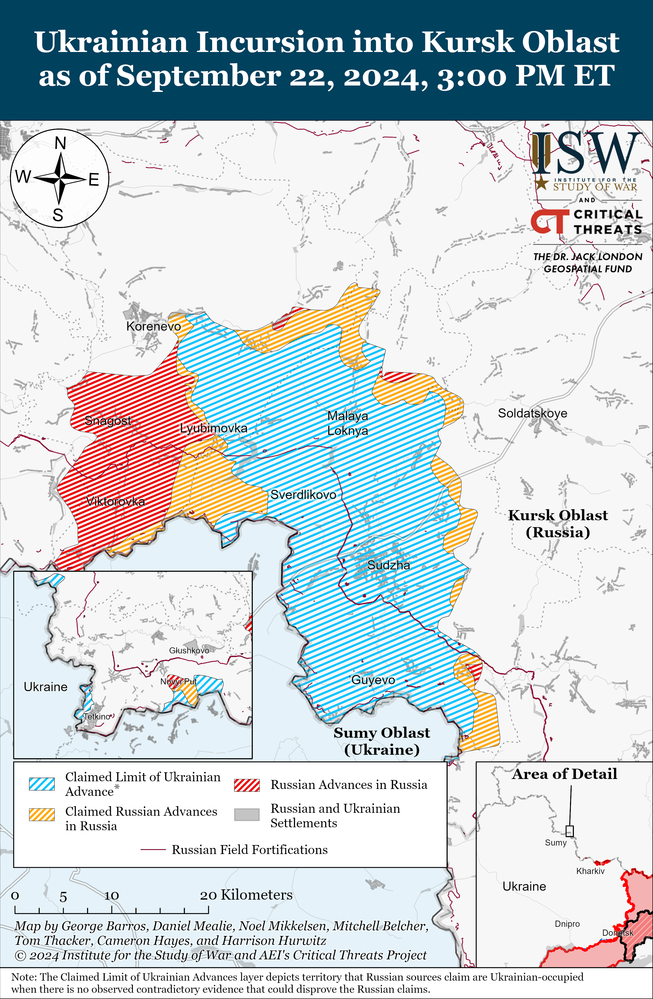
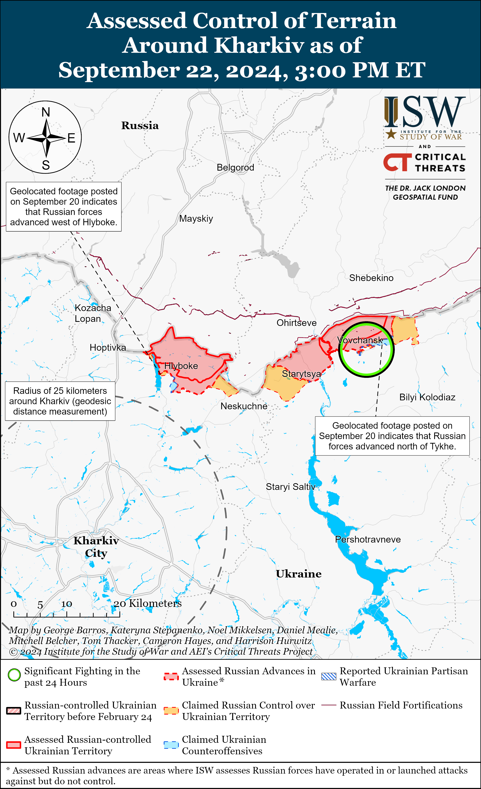
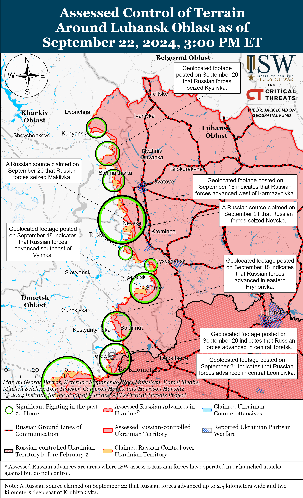
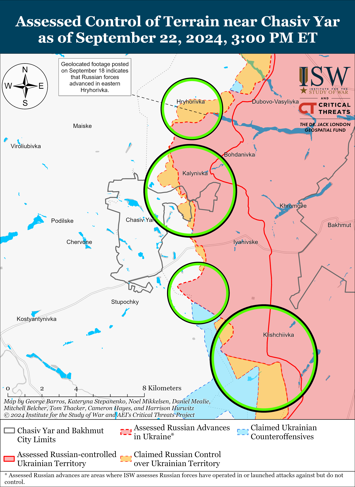
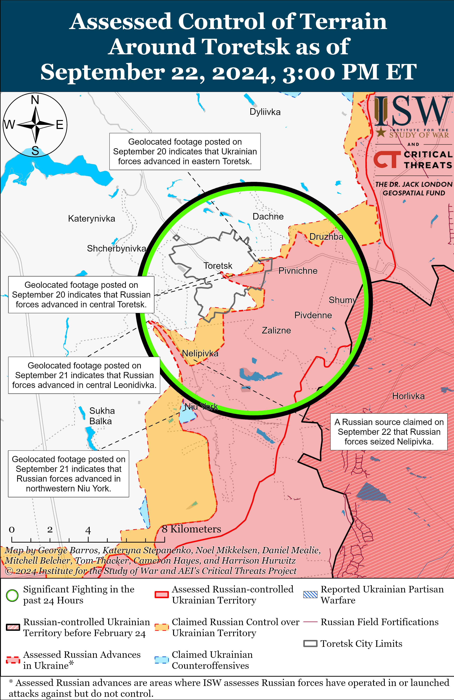
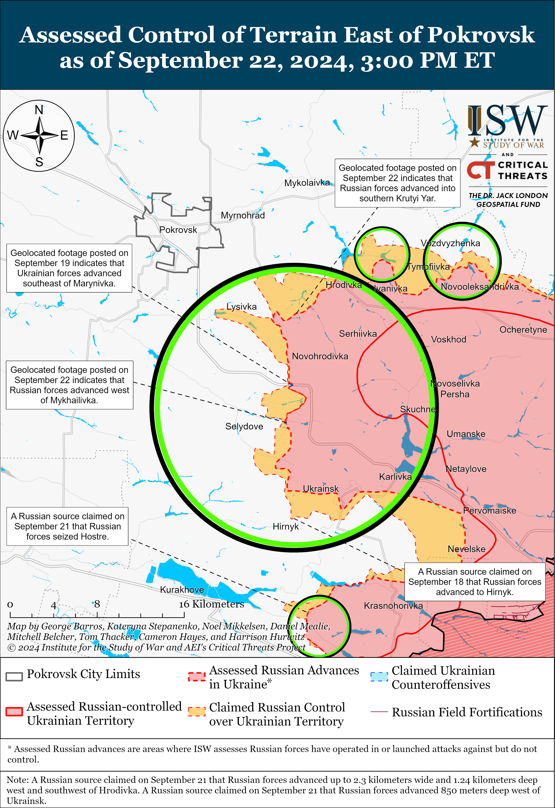
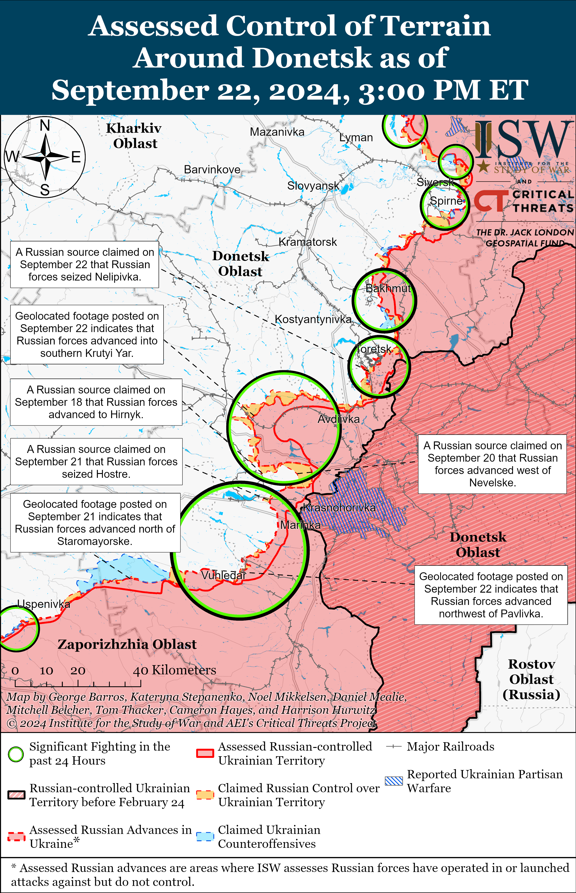
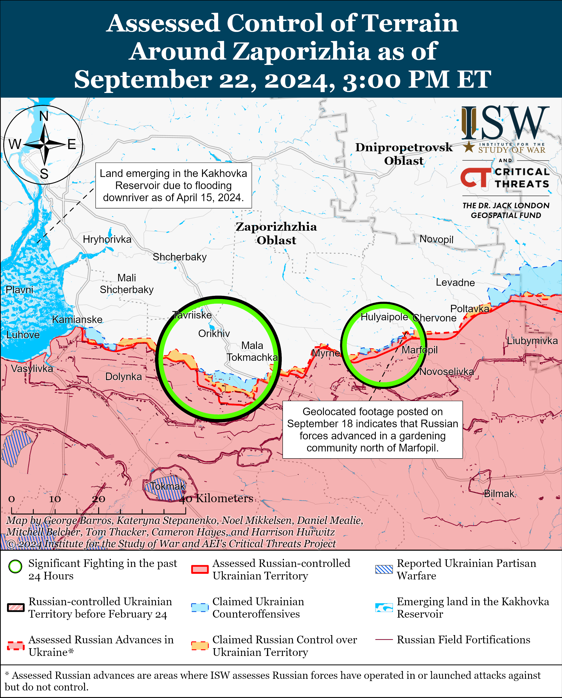
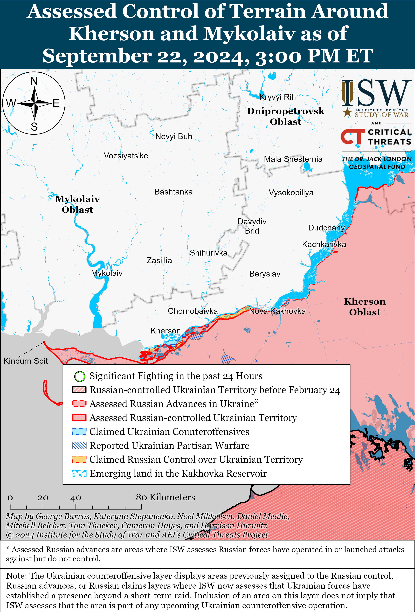

# Russian Offensive Campaign Assessment, September 22, 2024

**Angelica Evans, Christina Harward, Riley Bailey, Davit Gasparyan, and Frederick W. Kagan**

**September 22, 2024, 5:55pm ET**

**Click**[**here**](https://storymaps.arcgis.com/stories/36a7f6a6f5a9448496de641cf64bd375)**to see ISW’s interactive map of the Russian invasion of Ukraine. This map is updated daily alongside the static maps present in this report.**

**Click**[**here**](https://storymaps.arcgis.com/stories/83a2f24901c941d581c0c523ecd2619b)**to see ISW’s interactive map of Ukraine’s offensive in Kursk Oblast.**

**Click**[**here**](https://understandingwar.maps.arcgis.com/apps/instant/3dviewer/index.html?appid=1602762dbcde419bb957dea358449580)**to see ISW’s 3D control of terrain topographic map of Ukraine. Use of a computer (not a mobile device) is strongly recommended for using this data-heavy tool.**

**Click**[**here**](https://storymaps.arcgis.com/stories/733fe90805894bfc8562d90b106aa895)**to access ISW’s archive of interactive time-lapse maps of the Russian invasion of Ukraine. These maps complement the static control-of-terrain map that ISW produces daily by showing a dynamic frontline. ISW will update this time-lapse map archive monthly.**

**Note: The data cut-off for this product was 11:45 pm ET on September 22. ISW will cover subsequent reports in the September 23 Russian Offensive Campaign Assessment.**

**Ukraine’s September 18 strike against a Russian missile and ammunition storage facility near Toropets, Tver Oblast reportedly destroyed enough Russian munitions to affect Russian operations in the coming months.[1]** Estonian Defense Forces Intelligence Center Head Colonel Ants Kiviselg stated on September 20 that the strike caused 30,000 tons of munitions to explode, noting that the size of the explosion equates to 750,000 artillery shells and that Russian forces on average fire 10,000 shells per week. His calculations suggest the Ukrainian strike destroyed two to three months of Russia’s ammunition supply. Ukrainian outlet *Suspilne*reported on September 18 that a source within Ukrainian special services stated that the Toropets facility stored Iskander missiles, Tochka-U ballistic missiles, glide bombs, and artillery ammunition.[2] It is unclear if Kiviselg’s statement about 30,000 tons of explosives includes both missiles and artillery ammunition, but the strike destroyed significant Russian materiel stockpiles in any case. ISW continues to assess that continued Ukrainian strikes against rear Russian logistics facilities within Russia will generate wider operational pressures on the Russian military, including forcing the Russian military command to reorganize and disperse support and logistics systems within Russia to mitigate the impact of such strikes.[3]

**The Kremlin is reportedly reconsidering the effectiveness of nuclear saber-rattling as part of its efforts to influence the ongoing Western policy debate about supporting Ukraine and specifically permitting Ukraine to use Western-provided weapons against military objects in Russia.**The *Washington Post*, citing officials close to senior Russian diplomats, stated that Russian President Vladimir Putin may be realizing that Russian nuclear threats are starting to lose their power over Western officials and that Putin may be developing an unspecified more nuanced and limited informational response to future Western approval of long-range strikes into Russia.[4] An unnamed Russian official claimed that Russian officials have realized that nuclear threats “don’t frighten anyone,” and a Russian academic with close ties to senior Russian diplomats claimed that Russia’s partners in the “Global South” are dissatisfied with Russia’s nuclear threats. ISW cannot independently verify the veracity of the *Washington Post*‘s sources, but these reports are consistent with ISW’s various assessments about how the Kremlin uses nuclear saber-rattling to promote Western self-deterrence and that such statements are not an indication of Russia’s willingness to use nuclear weapons.[5] ISW continues to assess that the Kremlin’s thinly veiled threats of nuclear confrontation are aimed at disrupting and delaying key decision points in Western political discussions about further military assistance to Ukraine.[6] ISW continues to assess that Russia is very unlikely to use nuclear weapons in Ukraine or elsewhere.[7]

**Satellite imagery of damage at the Plesetsk Cosmodrome in Arkhangelsk Oblast captured on September 21 suggests that the Russian military recently conducted an unsuccessful RS-28 “Sarmat” nuclear-capable intercontinental ballistic missile (ICBM) test.[8]**The imagery shows a large crater at the Yubileynaya launch silo, where Russian forces have previously conducted test launches of the Sarmat missile, and four fire trucks responding to active small fires near the destroyed silo.[9] Open-source intelligence analysts reported that imagery indicates that an unsuccessful Sarmat test caused the damage but offered differing analyses about whether an explosion occurred close to or at launch or before launch during fueling.[10] The silo at the Yubileynaya site was reportedly converted especially to conduct Sarmat launches.[11] Russia intends for the Sarmat ICBM to replace the Soviet-era Voevoda ICBM and accelerated the development of the Sarmat after an agreement to source components parts for Voevoda from Ukraine collapsed following the start of Russia’s war against Ukraine in 2014.[12] Sarmat’s development has faced repeated delays, however, and this recent apparent failed test would be the fourth reported failed test of the Sarmat to date.[13] Russia has only successfully tested the Sarmat once, in April 2022, and the Russian military reportedly put the missile on combat duty in September 2023.[14] The latest apparent failed Saramat test does not necessarily indicate that Russia’s existing nuclear triad is any less effective than it has been but does suggest that Russia continues to struggle with developing new missile capabilities under the pressures of international sanctions and the demands on the Russian defense industrial base (DIB) amid the war in Ukraine.

**Ukrainian Defense Minister Rustem Umerov stated on September 21 that Ukraine will increase its production of drones by “several times” in 2025 in order to maintain Ukraine’s quantitative superiority over Russian drone production.[15]**Umerov stated that Ukraine can produce “several million” drones and that the Ukrainian state budget and funding from Ukraine’s partners finance this production.  Russian President Vladimir Putin recently discussed ongoing efforts to increase Russian drone production and claimed that Russian companies delivered roughly 140,000 drones to Russian forces in 2023 and that Russia plans to increase its drone production by tenfold (to 1.4 million drones) in 2024.[16] The Russian military, however, continues to make decisions that degrade the overall quality of its technical specialists. Russian authorities recently reportedly arrested an assault detachment commander who developed a counter-drone system to train Russian counter-drone specialists that was against the staff’s protocol.[17] Russian field commanders, particularly those amongst units of the 51st Combined Arms Army, are also reportedly often sending drone operators to conduct frontal assaults as punishment for dissent.[18]

**Russian Ministry of Foreign Affairs (MFA) Spokesperson Maria Zakharova announced on September 22 that Russia will not participate in Ukraine’s second peace summit later in 2024 or in any “such summits.”[19]**Zakharova reiterated boilerplate Russian information operations aimed at discrediting Ukraine and the Ukrainian Peace Formula – which is based on the principles of international law – as an unfair “ultimatum.”[20] Zakharova claimed that Russia is ready to discuss “serious” peace proposals that account for Russian President Vladimir Putin’s June 14 “proposal.” Putin outlined uncompromising demands on June 14 for Ukrainian capitulation as prerequisites for any “peace” negotiations, including Ukraine’s recognition of Russian control over the entirety of Luhansk, Donetsk, Zaporizhia, and Kherson oblasts – including the areas of these oblasts that Russian forces currently do not occupy.[21] ISW continues to assess that the Kremlin is not interested in good faith peace negotiations with Ukraine and that the Kremlin will only invoke the concept of “peace plans” and “negotiations” to prompt the West to pressure Ukraine into preemptive concessions on Ukraine’s sovereignty and territorial integrity.[22]

**Russia is reportedly expanding intelligence operations in Mexico to undermine the United States and support for Ukraine.***NBC News*, citing unspecified US officials and former intelligence officers, reported on September 21 that Russian intelligence services have been increasing their presence in Mexico for the past few years in order to spy on the United States and to enhance propaganda meant to undermine the United States and Ukraine.[23] US officials reportedly expressed concern over Russia’s addition of dozens of employees to its embassy staff in Mexico City, despite notably lacking strong trade relations with Mexico, and interpreted this growth as a return to Cold War-style tactics to enhance intelligence operations in Mexico. CIA Director Willian Burns recently noted that this increase is a result of the expulsion of Russian spies from Europe.

**Key Takeaways:**

- **Ukraine’s September 18 strike against a Russian missile and ammunition storage facility near Toropets, Tver Oblast reportedly destroyed enough Russian munitions to affect Russian operations in the coming months.**
- **The Kremlin is reportedly reconsidering the effectiveness of nuclear saber-rattling as part of its efforts to influence the ongoing Western policy debate about supporting Ukraine and specifically permitting Ukraine to use Western-provided weapons against military objects in Russia.**
- **Satellite imagery of damage at the Plesetsk Cosmodrome in Arkhangelsk Oblast captured on September 21 suggests that the Russian military recently conducted an unsuccessful RS-28 “Sarmat” nuclear-capable intercontinental ballistic missile (ICBM) test.**
- **Ukrainian Defense Minister Rustem Umerov stated on September 21 that Ukraine will increase its production of drones by “several times” in 2025 in order to maintain Ukraine’s quantitative superiority over Russian drone production.**
- **Russian Ministry of Foreign Affairs (MFA) Spokesperson Maria Zakharova announced on September 22 that Russia will not participate in Ukraine’s second peace summit later in 2024 or in any “such summits.”**
- **Russia is reportedly expanding intelligence operations in Mexico to undermine the United States and support for Ukraine.**
- **Ukrainian forces recently advanced near Svatove.**
- **Russian forces recently marginally advanced near Toretsk and Pokrovsk, southwest of Donetsk City, and in the Donetsk-Zaporizhia Oblast border area.**
- **A Ukrainian officer in a drone crew stated on September 22 that the Russian military command is forcing soldiers to dig trenches at Russian positions in unspecified areas of Ukraine without weapons and sometimes without armor, helmets, or military uniforms.**

****

***We do not report in detail on Russian war crimes because these activities are well-covered in Western media and do not directly affect the military operations we are assessing and forecasting. We will continue to evaluate and report on the effects of these criminal activities on the Ukrainian military and the Ukrainian population and specifically on combat in Ukrainian urban areas. We utterly condemn Russian violations of the laws of armed conflict and the Geneva Conventions and crimes against humanity even though we do not describe them in these reports.***

- Ukrainian Operations in the Russian Federation
- Russian Main Effort – Eastern Ukraine (comprised of three subordinate main efforts)
- Russian Subordinate Main Effort #1 – Push Ukrainian forces back from the international border with Belgorod Oblast and approach to within tube artillery range of Kharkiv City
- Russian Subordinate Main Effort #2 – Capture the remainder of Luhansk Oblast and push westward into eastern Kharkiv Oblast and encircle northern Donetsk Oblast
- Russian Subordinate Main Effort #3 – Capture the entirety of Donetsk Oblast
- Russian Supporting Effort – Southern Axis
- Russian Air, Missile, and Drone Campaign
- Russian Mobilization and Force Generation Efforts
- Russian Technological Adaptations
- Activities in Russian-occupied areas
- Ukrainian Defense Industrial Base Efforts
- Russian Information Operations and Narratives
- Significant Activity in Belarus

**Ukrainian Operations in the Russian Federation**

Ukrainian forces reportedly continued attacking in Glushkovsky Raion west of Ukraine’s salient in Kursk Oblast on September 22 but did not make any confirmed advances. The Russian Ministry of Defense (MoD) claimed that Ukrainian forces attacked near Novy Put, Obukhovka, and Medvezhye (all south of Glushkovo).[24]

Ukrainian forces continued offensive operations in the Ukrainian salient in Kursk Oblast on September 22 but did not make any confirmed advances. Russian sources claimed on September 22 that Ukrainian forces attacked southeast of Korenevo near Obukhovka, east of Korenevo near Maryevka, north of Sudzha near Malaya Loknya, and southeast of Sudzha near Plekhovo.[25]

Russian forces continued offensive operations in the Ukrainian salient in Kursk Oblast on September 22 but did not make any confirmed advances. A Russian milblogger claimed on September 22 that elements of the Russian 83rd Airborne (VDV) Brigade conducted an assault against Ukrainian positions in the Kalinnik tract (northwest of Lyubimovka).[26] Elements of the Russian Donetsk People’s Republic’s (DNR) “Pyatnashka” International Volunteer Brigade, 155th Naval Infantry Brigade (Pacific Fleet, Eastern Military District [EMD]), and 11th VDV Brigade are reportedly operating in Kursk Oblast.[27]

**Russian Main Effort – Eastern Ukraine**

**Russian Subordinate Main Effort #1 – Kharkiv Oblast (Russian objective: Push Ukrainian forces back from the international border with Belgorod Oblast and approach to within tube artillery range of Kharkiv City)**

Fighting continued north of Kharkiv City near Hlyboke and northeast of Kharkiv City near Vovchansk on September 21 and 22, but there were no confirmed changes to the frontline.[28] A Ukrainian officer operating in the Kharkiv direction stated on September 22 that Russian forces are switching to defensive operations in the area and are transferring “Storm-Z” convict recruits and former Wagner Group personnel to the area.[29] The spokesperson for a Ukrainian brigade operating in the Kharkiv direction stated that Russian forces continue attritional infantry assaults with small groups and that convict recruits and former Wagner Group personnel only receive a few weeks of training before conducting the assaults.[30] The spokesperson stated that Ukrainian forces occasionally advance in unspecified areas in the Kharkiv direction and that Russian forces have not conducted large-scale assaults in this direction in several weeks.[31]

**Russian Subordinate Main Effort #2 – Luhansk Oblast (Russian objective: Capture the remainder of Luhansk Oblast and push westward into eastern Kharkiv Oblast and northern Donetsk Oblast)**

Ukrainian forces recently regained limited positions northwest of Svatove amid continued Russian offensive operations along the Kupyansk-Svatove-Kreminna line on September 21 and 22. Geolocated footage published on September 21 indicates that Ukrainian forces recently regained limited positions along windbreaks west of Kyslivka (northwest of Svatove).[32] A Russian milblogger claimed on September 22 that Russian forces advanced along a front 2.5 kilometers wide and two kilometers deep east of Kruhlyakivka (northwest of Svatove) and that Russian forces are attempting to advance to Kruhlyakivka after struggling to advance against Ukrainian fortified positions near Kolisnykivka (immediately north of Kruhlyakivka).[33] Russian milbloggers claimed on September 21 and 22 that Russian forces operating northwest of Kreminna have seized most of Makiivka and have entered Nevske but that reports of Russian forces seizing Novolyubivka (immediately west of Nevske) are false.[34] A Russian milblogger claimed that Ukrainian forces are counterattacking near Novolyubivka to slow Russian advances.[35] Russian forces continued offensive operations northeast of Kupyansk near Synkivka; east of Kupyansk near Petropavlivka; northwest of Svatove near Stepova Novosilka, Hlushkivka, Kruhlyakivka, Kotlyarivka, and Stelmakhivka and in the direction of Lozova; southwest of Svatove near Druzhelyubivka and Cherneshchyna; northwest of Kreminna near Hrekivka, Nevske, Novosadove, and Makiivka; west of Kreminna near Torske and Terny; and southwest of Kreminna near Dibrova on September 21 and 22.[36] Elements of the Russian 272nd Motorized Rifle Regiment (47th Tank Division, 1st Guards Tank Army [GTA], Moscow Military District [MMD]) and the “Contour” detachment are reportedly operating near Kyslivka.[37]

**Russian Subordinate Main Effort #3 – Donetsk Oblast (Russian objective: Capture the entirety of Donetsk Oblast, the claimed territory of Russia’s proxies in Donbas)**

Russian forces continued assaults southeast of Siversk near Vyimka on September 21 and 22, but there were no confirmed changes to the frontline.[38]

Russian forces continued offensive operations near Chasiv Yar on September 22, but there were no confirmed changes to the frontline. Russian milbloggers claimed that Russian forces advanced in an area up to one kilometer wide west of Klishchiivka (southeast of Chasiv Yar), but ISW has not observed confirmation of these claims.[39] Russian forces continued offensive operations north of Chasiv Yar near Hryhorivka and in the direction of Mayske, northeast of Chasiv Yar near Kalynivka, east of Chasiv Yar near Ivanivske, southeast of Chasiv Yar near Klishchiivka and Andriivka, and south of Chasiv Yar near Stupochky and Bila Hora on September 21 and 22.[40] Elements of the Russian “Volki” Brigade’s 1st assault detachment and artillerymen of the 72nd Motorized Rifle Brigade (6th Motorized Rifle Division, 3rd Army Corps [AC]) are reportedly operating in the Chasiv Yar direction.[41]

Russian forces recently marginally advanced south of Toretsk amid continued offensive operations in the area on September 22. Geolocated footage published on September 21 indicates that Russian forces advanced further along Hobrusyeva and Niu-Yorkska streets within central Niu York (south of Toretsk) during recent Russian advances into central Leonidivka (southwest of Toretsk).[42] A Kremlin-affiliated Russian milblogger claimed that Russian forces seized Nelipivka (south of Toretsk) and advanced east of Nelipivka and in southern Toretsk.[43] A Russian milblogger claimed that Russian forces advanced 650 meters along Tsentralna Street in central Toretsk and seized several residential buildings in northwestern Pivnichne (east of Toretsk).[44] Russian forces continued assaults north of Toretsk near Dachne, in Toretsk itself, and west of Toretsk in the direction of Shcherbynivka on September 21 and 22.[45]

Russian forces recently marginally advanced east and southeast of Pokrovsk amid continued offensive operations in the area on September 22. Geolocated footage published on September 21 and 22 indicates that Russian forces recently marginally advanced north of Novooleksandrivka (east of Pokrovsk), into southern Krutyi Yar (southeast of Pokrovsk and just north of Novohrodivka), and west of Mykhailivka (southeast of Pokrovsk and just east of Selydove).[46] A Russian milblogger claimed that Russian forces advanced south of Novohrodivka and seized the Novohrodivska Mine No. 2, but ISW has not observed confirmation of this claim.[47] Fighting continued east of Pokrovsk near Vozdvyzhenka, Novotoretske, Hrodivka, and Krasnyi Yar and southeast of Pokrovsk near Novohrodivka, Selydove, Marynivka, Mykhailivka, and Hirnyk on September 21 and 22.[48]

Russian forces reportedly advanced west of Donetsk City on September 22, but there were no confirmed changes to the frontline. Russian milbloggers claimed that Russian forces seized Hostre; control half of Maksymilyanivka; and advanced toward Oleksandropil, southwest of Krasnohorivka, and west of Hostre up to the Selydivska Colony No. 82.[49] ISW has not observed confirmation of these claims, however. Russian forces conducted offensive operations near Heorhiivka on September 21.[50] Elements of the Russian 238th Artillery Brigade (8th Combined Arms Army [CAA], Southern Military District [SMD]) are reportedly operating near Dalnye.[51]

Russian forces recently advanced southwest of Donetsk City amid continued Russian offensive operations in the area on September 22. Geolocated footage published on September 22 indicates that Rusisan forces advanced in fields northwest of Pavlivka.[52] Russian and Ukrainian sources stated that Russian forces crossed the Kashlahach River west of Vuhledar.[53] Russian forces conducted offensive operations near Kostyantynivka, Katerynivka, Vuhledar, Vodyane, and Pavlivka on September 21 and 22.[54] Elements of the Russian 5th Tank Brigade (36th CAA, Eastern Military District [EMD]) are reportedly operating near Prechystivka; elements of a “Storm” detachment of the 68th Army Corps (EMD) and the “Aleppo” Detachment are reportedly operating near Katerynivka; and elements of the 40th Naval Infantry Brigade (Pacific Fleet, EMD) are reportedly operating near Vuhledar.[55]

Russian forces recently advanced in the Donetsk-Zaporizhia Oblast border area. Geolocated footage published on September 21 indicates that elements of the Russian 5th CAA (EMD) recently advanced along Pyatykhatky Street north of Staromayorske (south of Velyka Novosilka).[56] Neither Russian nor Ukrainian sources reported ground attacks in the area on September 22.

**Russian Supporting Effort – Southern Axis (Russian objective: Maintain frontline positions and secure rear areas against Ukrainian strikes)**

Russian forces continued ground assaults in eastern Zaporizhia Oblast near Hulyaipole on September 22 but did not make any confirmed gains.[57]

Russian forces continued attacking in western Zaporizhia Oblast near Robotyne, north of Robotyne near Novodanylivka, and northwest of Robotyne in the direction of Novoandriivka on September 21 and 22 but did not make any confirmed advances.[58]

The Ukrainian General Staff reported that Russian forces attacked in an unspecified area in the Kherson direction on September 22.[59]

Ukrainian forces reportedly conducted a missile strike against an unspecified Russian military target in occupied Crimea on the evening of September 21. A Russian milblogger claimed that elements of the Russian 31st Air Defense Division (4th Guards Air Force and Air Defense Army, Southern Military District [SMD] and Russian Aerospace Forces [VKS]) intercepted the unspecified Ukrainian missile, and Russian opposition outlet *Astra*reported that Russian air defenses activated near occupied Dzhankoi.[60]

**Russian Air, Missile, and Drone Campaign (Russian Objective: Target Ukrainian military and civilian infrastructure in the rear and on the frontline)**

Russian forces conducted a series of missile and drone strikes against Ukraine on the night of September 21 to 22. The Ukrainian Air Force reported that Russian forces launched two Kh-59/69 cruise missiles from airspace over occupied Luhansk Oblast and 80 Shahed-136/131 drones from Yeysk, Krasnodar Krai and Kursk Oblast.[61] The Ukrainian Air Force reported that Ukrainian forces shot down 71 drones over Khmelnytskyi, Vinnytsia, Cherkasy, Kirovohrad, Zhytomyr, Kyiv, Sumy, Poltava, Kherson, and Mykolaiv oblasts and that Ukrainian electronic warfare (EW) systems caused six drones to become “lost” and not reach their intended targets. Khmelnytskyi Oblast Military Administration Head Serhii Tyurin stated that a Russian drone strike damaged a residential building in Khmelnytskyi City.[62] Poltava Oblast Military Administration Head Filip Pronin and Sumy City Mayor Oleksandr Lysenko reported that Russian drones damaged energy infrastructure in Poltava and Sumy oblasts, respectively.[63] Ukrainian officials reported that Russian forces conducted FAB-250 glide bomb strikes against Kharkiv City, injuring at least 21 people.[64]

Ukrainian President Volodymyr Zelensky stated on September 21 that Russian forces used more than 900 glide bombs, roughly 400 Shahed drones, and almost 30 missiles of various types against Ukraine in the past week (September 15 to 21).[65]

**Russian Mobilization and Force Generation Efforts (Russian objective: Expand combat power without conducting general mobilization)**

A Ukrainian officer in a drone crew stated on September 22 that the Russian military command is forcing soldiers to dig trenches at Russian positions in unspecified areas of Ukraine without weapons and sometimes without body armor, helmets, or military uniforms.[66] The Ukrainian officer stated that these Russian soldiers are digging high-quality trenches quickly but that only roughly 50 percent of these Russian soldiers survive.

**Russian Technological Adaptations (Russian objective: Introduce technological innovations to optimize systems for use in Ukraine)**

Nothing significant to report.

**Ukrainian Defense Industrial Efforts (Ukrainian objective: Develop its defense industrial base to become more self-sufficient in cooperation with US, European, and international partners)**

*ISW is suspending publishing coverage of Ukrainian defense industrial efforts until further notice.*

**Activities in Russian-occupied areas (Russian objective: Consolidate administrative control of annexed areas; forcibly integrate Ukrainian citizens into Russian sociocultural, economic, military, and governance systems)**

*ISW is not publishing coverage of Russian-occupied areas today.*

**Russian Information Operations and Narratives**

The Ukrainian Center for Strategic Communications (Stratcom) warned on September 21 that Russian actors are spreading false narratives on social media about Ukrainian forces using US-provided drugs in order to discredit the Ukrainian military to Ukrainian conscripts and society.[67] Stratcom reported that Russian actors are using fake and forced “confessions” from Ukrainian prisoners of war (POWs) to substantiate these allegations. Russian sources notably claimed recently that Russian authorities arrested a Russian assault detachment commander after he attempted to stop Chechens from trafficking drugs to his servicemembers.[68]

**Significant activity in Belarus (Russian efforts to increase its military presence in Belarus and further integrate Belarus into Russian-favorable frameworks and Wagner Group activity in Belarus)**

Nothing significant to report.

**Note: ISW does not receive any classified material from any source, uses only publicly available information, and draws extensively on Russian, Ukrainian, and Western reporting and social media as well as commercially available satellite imagery and other geospatial data as the basis for these reports. References to all sources used are provided in the endnotes of each update.**

****

---

[1] https://www.err dot ee/1609466380/kiviselg-venemaa-merevaeoppus-oli-vaiksem-kui-valja-reklaamiti

[2] https://understandingwar.org/backgrounder/russian-offensive-campaign-assessment-september-18-2024

[3] https://understandingwar.org/backgrounder/russian-offensive-campaign-assessment-september-18-2024

[4] https://www.washingtonpost.com/world/2024/09/22/putin-russia-red-lines-nuclear-threat-retaliation/

[5] https://isw.pub/UkrWar090824

[6] https://understandingwar.org/wp-content/uploads/2024/09/May20212C2020242C20Russian20Offensive20Campaign20Assessment20PDF.pdf; https://understandingwar.org/backgrounder/russian-offensive-campaign-assessment-may-31-2024; https://understandingwar.org/backgrounder/russian-offensive-campaign-assessment-june-28-2024 ; https://understandingwar.org/backgrounder/russian-offensive-campaign-assessment-september-8-2024

[7] https://understandingwar.org/backgrounder/special-report-assessing-putin%E2%80%99s-implicit-nuclear-threats-after-annexation ; https://understandingwar.org/backgrounder/russian-offensive-campaign-assessment-september-8-2024

[8] https://twitter.com/MeNMyRC1/status/1837611953734537377 ; https://t.me/ButusovPlus/13790 ; https://t.me/radiosvoboda/68668 ; https://t.me/severrealii/27334; https://t.me/astrapress/64897 ; https://twitter.com/georgewbarros/status/1837889794577236004 ; https://x.com/russianforces/status/1837754394374205851

[9] https://twitter.com/MeNMyRC1/status/1837611953734537377 ; https://t.me/ButusovPlus/13790 ; https://t.me/radiosvoboda/68668 ; https://t.me/severrealii/27334; https://t.me/astrapress/64897 ; https://twitter.com/georgewbarros/status/1837889794577236004

[10] https://twitter.com/MeNMyRC1/status/1837611953734537377 ; https://t.me/ButusovPlus/13790 ; https://t.me/radiosvoboda/68668 ; https://t.me/severrealii/27334; https://t.me/astrapress/64897 ; https://twitter.com/georgewbarros/status/1837889794577236004 ; https://x.com/russianforces/status/1837754394374205851 

[11] https://russianforces dot org/blog/2018/03/second\_ejection\_test\_of\_sarmat.shtml

[12] https://carnegieendowment.org/russia-eurasia/politika/2023/10/russias-sarmat-missile-saga-reflects-an-industry-in-crisis?lang=en

[13] https://www.rferl.org/a/russia-icbm-sarmat-failure/33129866.html ; https://www.cnn.com/2023/02/21/politics/russia-intercontinental-ballistic-missile-test/index.html

[14] https://www.pravda.com dot ua/eng/news/2024/09/22/7476240/; https://www.cnn.com/2023/02/21/politics/russia-intercontinental-ballistic-missile-test/index.html; https://www.rferl.org/a/russia-icbm-sarmat-failure/33129866.html; https://carnegieendowment.org/russia-eurasia/politika/2023/10/russias-sarmat-missile-saga-reflects-an-industry-in-crisis?lang=en

[15] https://armyinform dot com.ua/2024/09/21/ministr-oborony-u-2025-roczi-ukrayina-perevershyt-rosiyu-u-vyrobnycztvi-droniv/; https://www.youtube.com/watch?v=CwQl49tDPTk; https://suspilne dot media/841601-umerov-rozpoviv-pro-plani-ukraini-sodo-virobnictva-droniv-u-2025-roci/

[16] https://isw.pub/UkrWar091924

[17] https://understandingwar.org/backgrounder/russian-offensive-campaign-assessment-september-21-2024

[18] https://isw.pub/UkrWar091424

[19] https://suspilne dot media/841649-u-mzs-rosii-zaavili-so-rf-ne-bratime-ucasti-u-drugomu-samiti-miru/; https://t.me/MID\_Russia/45567; https://t.me/severrealii/27332   ; https://isw.pub/UkrWar090924

[20] https://t.me/MID\_Russia/45567 ; https://isw.pub/UkrWar090924 ; https://isw.pub/UkrWar071924 ; https://isw.pub/UkrWar071224 ; https://isw.pub/UkrWar070524

[21] https://isw.pub/UkrWar061424

[22] https://understandingwar.org/backgrounder/russian-offensive-campaign-assessment-june-26-2024 ; https://understandingwar.org/backgrounder/russian-offensive-campaign-assessment-august-1-2024 ; https://isw.pub/UkrWar061524 ; https://isw.pub/UkrWar061424 ; https://isw.pub/UkrWar060424

[23] https://www.nbcnews.com/investigations/cold-war-russia-uses-mexico-hub-spying-us-rcna171819; https://suspilne dot media/841635-rosia-vikoristovue-meksiku-ak-centr-dla-spigunskoi-dialnosti-proti-ssa/; https://mil dot in.ua/uk/news/ssha-sturbovani-merezheyu-shpyguniv-rf-u-meksytsi/ 

[24] https://t.me/mod\_russia/43683

[25] https://t.me/mod\_russia/43683; https://t.me/tass\_agency/274250 

[26] https://t.me/DnevnikDesantnika/15855; https://t.me/russian\_airborne/7360; https://t.me/voin\_dv/10894

[27] https://t.me/tass\_agency/274268; https://t.me/tass\_agency/274318 ; https://t.me/astrapress/64911; https://t.me/DnevnikDesantnika/15887; https://t.me/dva\_majors/53269   ; https://t.me/DnevnikDesantnika/15855

[28] https://www.facebook.com/GeneralStaff.ua/posts/pfbid02U5m8avAcedt6XYxGzRzEc5nSkiKMErYyHY3KcFeXmpnfyWPAubbT3tRnjCMYbKqml  ; https://www.facebook.com/GeneralStaff.ua/posts/pfbid0MAJis8fFPz1ob7VGpw2wAaEeFDk7fXT7SXVYAYTAko81nNi3q3AWcLiigTk1k8KLl ; https://www.facebook.com/GeneralStaff.ua/posts/pfbid04pudbkhFx9fQThJbnZX4wbqGj33bcxKfGdmGHMGqFN44bL9vpEg1AaHRCgURaXKEl ; https://t.me/wargonzo/22254

[29] https://t.me/otukharkiv/1527

[30] https://armyinform dot com.ua/2024/09/22/na-harkivshhyni-rosiyany-kydayut-na-myasni-shturmy-neshhodavno-mobilizovanyh-vyazniv/; https://www.youtube.com/watch?v=aDXWlQ2K0dM

[31] https://armyinform dot com.ua/2024/09/22/na-harkivshhyni-rosiyany-kydayut-na-myasni-shturmy-neshhodavno-mobilizovanyh-vyazniv/; https://www.youtube.com/watch?v=aDXWlQ2K0dM

[32] https://t.me/brussinf/8167; https://x.com/Map\_Hargoo/status/1837575894300258541; https://t.me/boris\_rozhin/138173

[33] https://t.me/RVvoenkor/77428 ; https://t.me/RVvoenkor/77446

[34] https://t.me/RVvoenkor/77412 ; https://t.me/RVvoenkor/77408 ; https://t.me/boris\_rozhin/138276

[35] https://t.me/RVvoenkor/77412

[36] https://www.facebook.com/GeneralStaff.ua/posts/pfbid02U5m8avAcedt6XYxGzRzEc5nSkiKMErYyHY3KcFeXmpnfyWPAubbT3tRnjCMYbKqml ; https://www.facebook.com/GeneralStaff.ua/posts/pfbid0MAJis8fFPz1ob7VGpw2wAaEeFDk7fXT7SXVYAYTAko81nNi3q3AWcLiigTk1k8KLl ; https://www.facebook.com/GeneralStaff.ua/posts/pfbid04pudbkhFx9fQThJbnZX4wbqGj33bcxKfGdmGHMGqFN44bL9vpEg1AaHRCgURaXKEl ; https://t.me/RVvoenkor/77408 ; https://t.me/RVvoenkor/77412 ; https://t.me/warhistoryalconafter/185741 ; https://t.me/dva\_majors/53272

[37] https://t.me/boris\_rozhin/138173 ; https://t.me/brussinf/8167; https://x.com/Map\_Hargoo/status/1837575894300258541

[38] https://www.facebook.com/GeneralStaff.ua/posts/pfbid02U5m8avAcedt6XYxGzRzEc5nSkiKMErYyHY3KcFeXmpnfyWPAubbT3tRnjCMYbKqml ; https://www.facebook.com/GeneralStaff.ua/posts/pfbid0MAJis8fFPz1ob7VGpw2wAaEeFDk7fXT7SXVYAYTAko81nNi3q3AWcLiigTk1k8KLl ; https://www.facebook.com/GeneralStaff.ua/posts/pfbid04pudbkhFx9fQThJbnZX4wbqGj33bcxKfGdmGHMGqFN44bL9vpEg1AaHRCgURaXKEl

[39] https://t.me/RVvoenkor/77428 ; https://t.me/wargonzo/22254

[40] https://www.facebook.com/GeneralStaff.ua/posts/pfbid02U5m8avAcedt6XYxGzRzEc5nSkiKMErYyHY3KcFeXmpnfyWPAubbT3tRnjCMYbKqml ; https://www.facebook.com/GeneralStaff.ua/posts/pfbid0MAJis8fFPz1ob7VGpw2wAaEeFDk7fXT7SXVYAYTAko81nNi3q3AWcLiigTk1k8KLl ; https://www.facebook.com/GeneralStaff.ua/posts/pfbid04pudbkhFx9fQThJbnZX4wbqGj33bcxKfGdmGHMGqFN44bL9vpEg1AaHRCgURaXKEl ; https://t.me/RVvoenkor/77428

[41] https://t.me/dva\_majors/53304 ; https://t.me/voin\_dv/10902; https://t.me/frontline\_pvt/2743

[42] https://t.me/WarArchive\_ua/20390; https://t.me/operativnoZSU/158138

[43] https://t.me/rybar/63738

[44] https://t.me/RVvoenkor/77428

[45] https://www.facebook.com/GeneralStaff.ua/posts/pfbid02U5m8avAcedt6XYxGzRzEc5nSkiKMErYyHY3KcFeXmpnfyWPAubbT3tRnjCMYbKqml ; https://www.facebook.com/GeneralStaff.ua/posts/pfbid0MAJis8fFPz1ob7VGpw2wAaEeFDk7fXT7SXVYAYTAko81nNi3q3AWcLiigTk1k8KLl ; https://www.facebook.com/GeneralStaff.ua/posts/pfbid04pudbkhFx9fQThJbnZX4wbqGj33bcxKfGdmGHMGqFN44bL9vpEg1AaHRCgURaXKEl

[46] https://t.me/creamy\_caprice/6889; https://t.me/Airborne1126/18089 ; https://t.me/creamy\_caprice/6888; https://x.com/PuenteUribarri/status/1837462203055653326; https://x.com/MikiValbuena/status/1837502975050166350 ; https://x.com/PuenteUribarri/status/1837905187786145941; https://x.com/MikiValbuena/status/1837911547491856402

[47] https://t.me/z\_arhiv/28190

[48] https://t.me/wargonzo/22254 ; https://t.me/DnevnikDesantnika/15841 ; https://t.me/dva\_majors/53285 ; https://t.me/warhistoryalconafter/185741 ; https://t.me/dva\_majors/53272 ; https://www.facebook.com/GeneralStaff.ua/posts/pfbid02U5m8avAcedt6XYxGzRzEc5nSkiKMErYyHY3KcFeXmpnfyWPAubbT3tRnjCMYbKqml ; https://www.facebook.com/GeneralStaff.ua/posts/pfbid0MAJis8fFPz1ob7VGpw2wAaEeFDk7fXT7SXVYAYTAko81nNi3q3AWcLiigTk1k8KLl ; https://www.facebook.com/GeneralStaff.ua/posts/pfbid04pudbkhFx9fQThJbnZX4wbqGj33bcxKfGdmGHMGqFN44bL9vpEg1AaHRCgURaXKEl

[49] https://t.me/dva\_majors/53275 ; https://t.me/RVvoenkor/77437 ; https://t.me/z\_arhiv/28197 ; https://t.me/dva\_majors/53275; https://t.me/z\_arhiv/28197

[50] https://www.facebook.com/GeneralStaff.ua/posts/pfbid04pudbkhFx9fQThJbnZX4wbqGj33bcxKfGdmGHMGqFN44bL9vpEg1AaHRCgURaXKEl

[51] https://t.me/nm\_dnr/12736

[52] https://t.me/creamy\_caprice/6893 ; https://t.me/morpex\_V/2970

[53] https://t.me/stanislav\_osman/7162; https://t.me/voenkorKotenok/59154

[54] https://www.facebook.com/GeneralStaff.ua/posts/pfbid02U5m8avAcedt6XYxGzRzEc5nSkiKMErYyHY3KcFeXmpnfyWPAubbT3tRnjCMYbKqml ; https://www.facebook.com/GeneralStaff.ua/posts/pfbid0MAJis8fFPz1ob7VGpw2wAaEeFDk7fXT7SXVYAYTAko81nNi3q3AWcLiigTk1k8KLl ; https://www.facebook.com/GeneralStaff.ua/posts/pfbid04pudbkhFx9fQThJbnZX4wbqGj33bcxKfGdmGHMGqFN44bL9vpEg1AaHRCgURaXKEl

[55] https://t.me/warhistoryalconafter/185741 ; https://t.me/dva\_majors/53272  https://t.me/voin\_dv/10895 ; https://t.me/voin\_dv/10898; https://t.me/z\_arhiv/28199

[56] https://x.com/chilim67/status/1837574564961833285; https://x.com/mon\_mon\_1064552/status/1837744394688254433  

[57] https://www.facebook.com/GeneralStaff.ua/posts/pfbid0MAJis8fFPz1ob7VGpw2wAaEeFDk7fXT7SXVYAYTAko81nNi3q3AWcLiigTk1k8KLl

[58] https://www.facebook.com/GeneralStaff.ua/posts/pfbid0MAJis8fFPz1ob7VGpw2wAaEeFDk7fXT7SXVYAYTAko81nNi3q3AWcLiigTk1k8KLl ; https://www.facebook.com/GeneralStaff.ua/posts/pfbid0MAJis8fFPz1ob7VGpw2wAaEeFDk7fXT7SXVYAYTAko81nNi3q3AWcLiigTk1k8KLl ; https://www.facebook.com/GeneralStaff.ua/posts/pfbid04pudbkhFx9fQThJbnZX4wbqGj33bcxKfGdmGHMGqFN44bL9vpEg1AaHRCgURaXKEl ; https://t.me/wargonzo/22254

[59] https://www.facebook.com/GeneralStaff.ua/posts/pfbid02U5m8avAcedt6XYxGzRzEc5nSkiKMErYyHY3KcFeXmpnfyWPAubbT3tRnjCMYbKqml

[60] https://t.me/astrapress/64910 ; https://t.me/DnevnikDesantnika/15875 ; https://t.me/dva\_majors/53285

[61] https://t.me/kpszsu/19801;

[62] https://suspilne dot media/khmelnytskiy/836515-vibuhi-na-hmelniccini-22-veresna-so-vidomo/; https://www.facebook.com/sergii.tiurin.public/posts/pfbid0CC8zZprhaD6uNKoibxtGWs1z2PjUa7Kvcmb4UuZEuhqBC4ejRFH9a4QivPyemb95l

[63]   https://t.me/poltavskaOVA/17819; https://armyinform.com dot ua/2024/09/22/ataka-rosijskyh-bpla-na-poltavshhynu-poshkodzheno-energetychnu-infrastrukturu/; https://suspilne dot media/841591-sbu-urazili-rosijskij-aerodrom-rf-gotue-udari-po-kriticnim-obektam-v-ukraini-pered-zimou-942-den-vijni-onlajn/?anchor=live\_1726976815&utm\_source=copylink&utm\_medium=ps; https://t.me/golova\_lysenko/3887

[64] https://t.me/UA\_National\_Police/28450; https://t.me/V\_Zelenskiy\_official/11747; https://armyinform dot com.ua/2024/09/22/prezydent-vidreaguvav-na-rosijskyj-udar-harkovu-ukrayini-potribna-povnoczinna-dalekobijnist/; https://t.me/synegubov/11261; https://armyinform dot com.ua/2024/09/22/rosiyany-vnochi-skynuly-aviabombu-na-harkiv-poraneni-ponad-20-lyudej/

[65] https://t.me/V\_Zelenskiy\_official/11747; https://armyinform.com dot ua/2024/09/22/prezydent-vidreaguvav-na-rosijskyj-udar-harkovu-ukrayini-potribna-povnoczinna-dalekobijnist/

[66] https://armyinform dot com.ua/2024/09/22/odnorazovi-raby-u-zombilendi-u-rosiyany-okopy-kopayut-soldaty-smertnyky/ ; https://youtu.be/j5TqaWCCdUg

[67] https://t.me/spravdi/41661

[68] https://understandingwar.org/backgrounder/russian-offensive-campaign-assessment-september-21-2024
