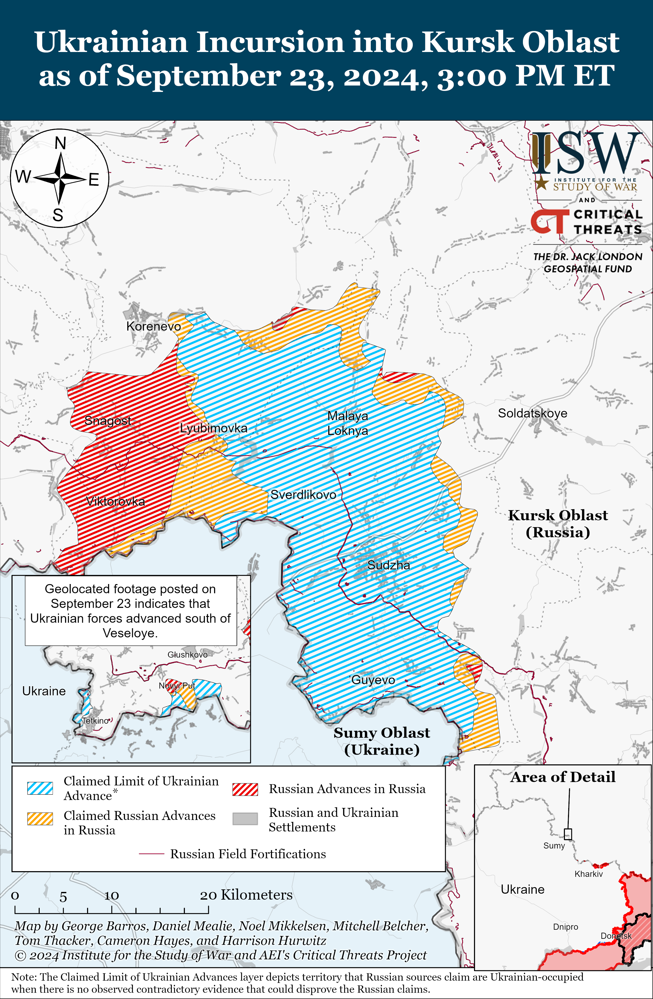
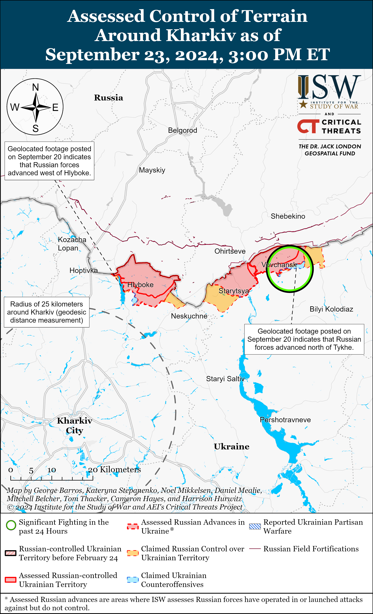
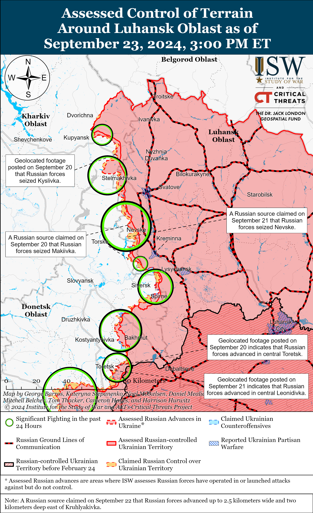
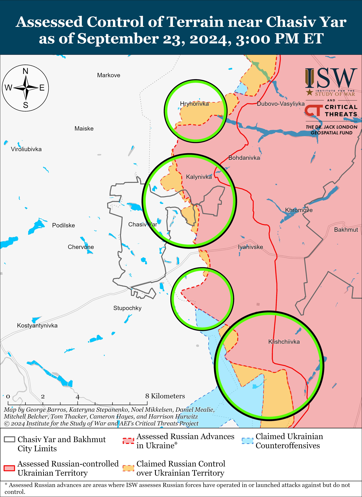
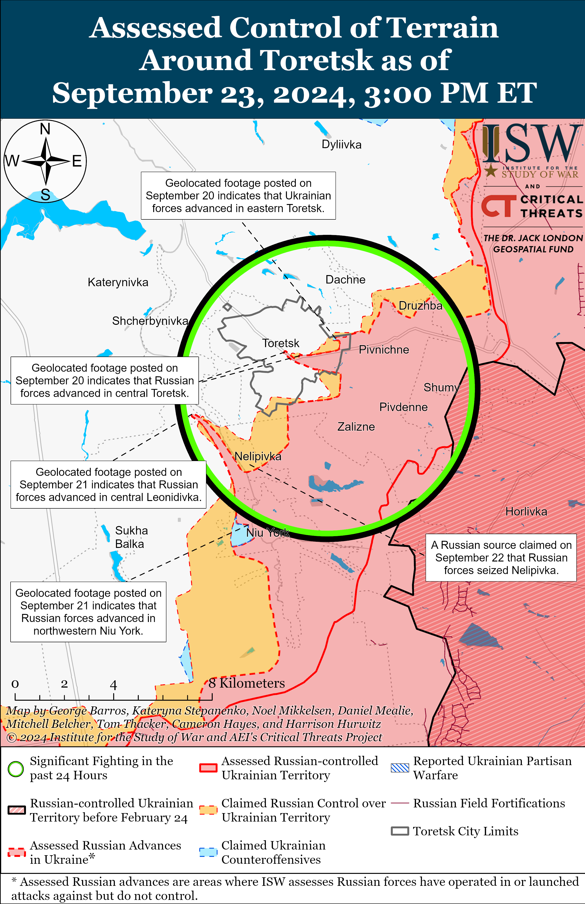
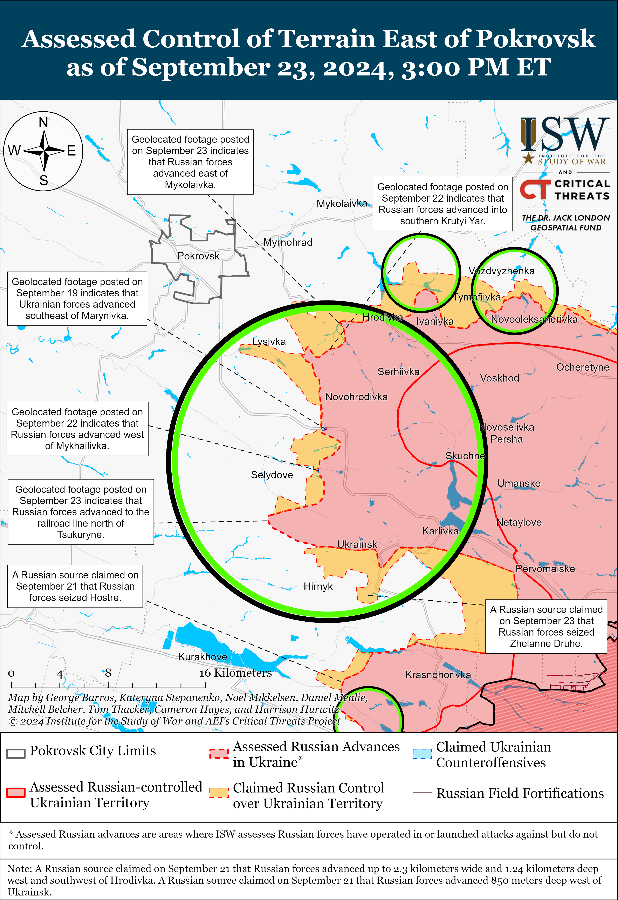
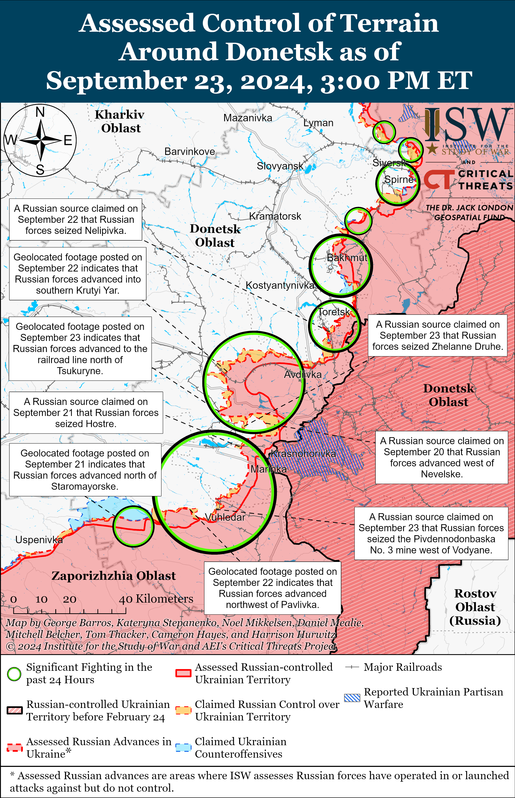
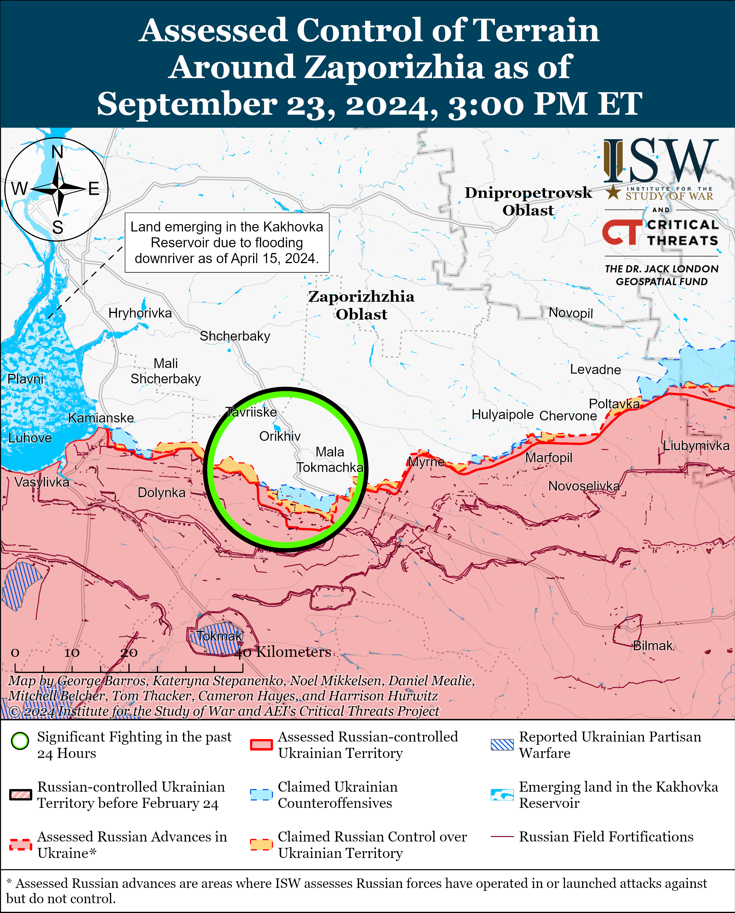
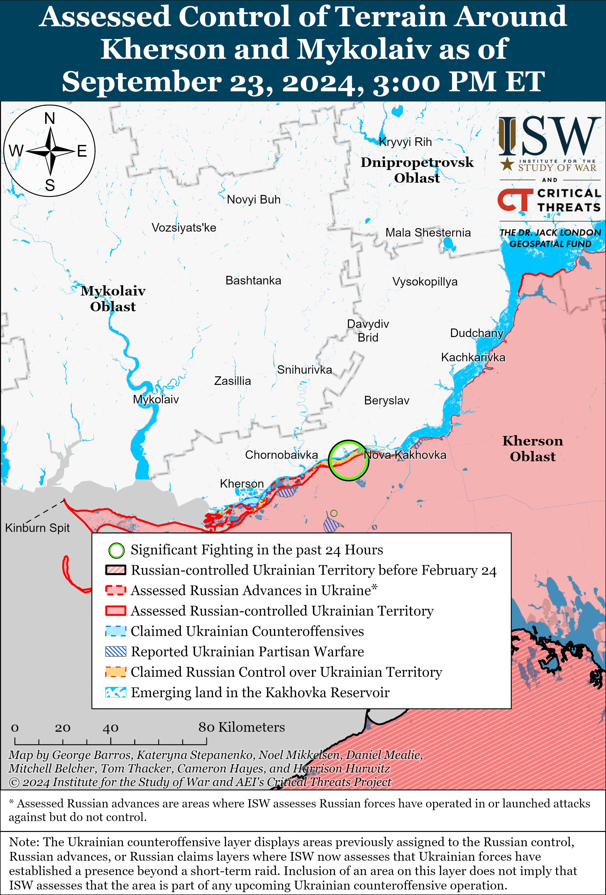

# Russian Offensive Campaign Assessment, September 23, 2024

**Christina Harward, George Barros, Davit Gasparyan, Grace Mappes, Kateryna Stepanenko, Haley Zehrung, and Frederick W. Kagan**

**September 23, 2024, 6:15pm ET**

**Click**[**here**](https://storymaps.arcgis.com/stories/36a7f6a6f5a9448496de641cf64bd375)**to see ISW’s interactive map of the Russian invasion of Ukraine. This map is updated daily alongside the static maps present in this report.**

**Click**[**here**](https://storymaps.arcgis.com/stories/83a2f24901c941d581c0c523ecd2619b)**to see ISW’s interactive map of Ukraine’s offensive in Kursk Oblast.**

**Click**[**here**](https://understandingwar.maps.arcgis.com/apps/instant/3dviewer/index.html?appid=1602762dbcde419bb957dea358449580)**to see ISW’s 3D control of terrain topographic map of Ukraine. Use of a computer (not a mobile device) is strongly recommended for using this data-heavy tool.**

**Click**[**here**](https://storymaps.arcgis.com/stories/733fe90805894bfc8562d90b106aa895)**to access ISW’s archive of interactive time-lapse maps of the Russian invasion of Ukraine. These maps complement the static control-of-terrain map that ISW produces daily by showing a dynamic frontline. ISW will update this time-lapse map archive monthly.**

**Note: The data cut-off for this product was 1pm ET on September 23. ISW will cover subsequent reports in the September 24 Russian Offensive Campaign Assessment.**

**Ukrainian President Volodymyr Zelensky arrived in the United States on September 23 and reiterated Ukraine’s need for timely and uninterrupted US military assistance.**Zelensky visited the Scranton Army Ammunition Plant in Pennsylvania and discussed the need for timely delivery of Western aid to Ukraine, the importance of starting joint American-Ukrainian weapons production in Ukraine as well as the possibility of US investments in the Ukrainian defense industrial base (DIB).[1] The Scranton plant significantly increased its production of 155mm artillery shells in 2024, and Zelensky noted that the plant employs 400 people. Ukrainian Zaporizhzhia  Oblast Military Administration Head Ivan Fedorov met with Pennsylvania Governor Josh Shapiro and signed a cooperation agreement between Zaporizhzhia  Oblast and the Commonwealth of Pennsylvania that calls for interaction between state bodies, scientific institutions, civil society organizations, and businesses in the fields of energy, agriculture, digital technologies, and defense.[2] The agreement also calls for Pennsylvania to support the reconstruction of Zaporizhzhia  Oblast. Ukraine has signed five similar agreements with US states previously: between Kyiv Oblast and Washington and Utah, between Zhytomyr Oblast and Indiana, and between Chernihiv Oblast and Minnesota.

**The Kremlin continues to publicly signal its disinterest in any peace settlement short of total capitulation of the Ukrainian government and destruction of the Ukrainian state.**Zelensky stated in an interview with the *New Yorker*about Ukraine’s “Victory Plan” published on September 22 that Russia is not interested in ending the war on any reasonable terms and is feigning interest in negotiations.[3] Zelensky highlighted that Ukraine invited Russia to attend Ukraine’s second peace summit but that the Kremlin had not demonstrated any interest in participating. Kremlin Spokesperson Dmitry Peskov notably stated on September 22 that there is “no alternative” to Russian victory in Ukraine, reiterating Russia’s unwillingness to negotiate on terms other than Ukrainian capitulation.[4] Peskov also identified NATO and the West as a “collective enemy.” Russian Ministry of Foreign Affairs (MFA) Spokesperson Maria Zakharova recently announced that Russia will not participate in the second Ukrainian peace summit or any “such summits.”[5] ISW continues to assess that the Kremlin is not interested in good faith peace negotiations with Ukraine and that the Kremlin will only invoke the concept of “peace plans” and “negotiations” to prompt the West to pressure Ukraine into preemptive concessions on Ukraine’s sovereignty and territorial integrity.[6]

**Russian forces conducted glide bomb strikes against Zaporizhzhia City for the first time overnight on September 22 to 23.[7]**Ukrainian officials reported that Russian forces conducted seven airstrikes with KAB glide bombs at Zaporizhzhia City overnight, damaging 13 residential buildings and two educational facilities, and injuring at least 21 civilians.[8] Zaporizhzhia  Oblast Military Administration Head Ivan Fedorov stated that Russian forces conducted another strike against a critical infrastructure facility in Zaporizhzhia City on September 23 but did not specify whether Russian forces used glide bombs or another weapon.[9] Some Russian and Ukrainian sources claimed that Russian forces did not use KAB glide bombs, which are largely guided but rather used FAB-250 bombs equipped with unified planning and correction modules (UMPCs).[10] Soviet-era FAB bomb variants are largely unguided, and other iterations of Russian FABs with UMPCs have been unguided, though it is unclear whether the glide bombs that struck Zaporizhzhia City had guidance systems.[11] Russian glide bombs have a glide range of 40-60 kilometers, and Zaporizhzhia City is roughly 25-35 kilometers from the current frontline in western Zaporizhzhia  Oblast.[12] Russian milbloggers celebrated the strike as an inflection in Russian strike capabilities and called on Russian forces to target logistics assets near the city, including bridges across the Dnipro River.[13] Ukrainian forces are only able to counter the threat of Russian glide bombs by shooting down the aircraft that launch them, further demonstrating Ukraine’s need for increased air defense capabilities on the frontline and in near rear areas.[14]

**A high-ranking Russian Aerospace Forces (VKS) commander reportedly recently committed suicide due to conflicts within his unit’s leadership.**A Russian insider source claimed on September 23 that Yuri Annekov, head of the 678th Communications Center of the Russian Aerospace Forces (VKS), committed suicide at the end of last week in Balashikha, Moscow Oblast.[15] The insider source claimed that Annekov had recently complained about insufficient rest and the command’s “inadequate” behavior. The insider source claimed that Annekov had served in the VKS for roughly 20 years and had tried to resist the “chaos and disorder” within the VKS that began after Russia’s full-scale invasion of Ukraine. ISW cannot verify the insider source’s claims.

**Key Takeaways:**

- **Ukrainian President Volodymyr Zelensky arrived in the United States on September 23 and reiterated Ukraine’s need for timely and uninterrupted US military assistance.**
- **The Kremlin continues to publicly signal its disinterest in any peace settlement short of total capitulation of the Ukrainian government and destruction of the Ukrainian state.**
- **Russian forces conducted glide bomb strikes against Zaporizhzhia City for the first time overnight on September 22 to 23.**
- **A high-ranking Russian Aerospace Forces (VKS) commander reportedly recently committed suicide due to conflicts within his unit’s leadership.**
- **Russian forces recently advanced near Hlyboke, Kupyansk, and Pokrovsk. Ukrainian forces recently advanced in Kursk Oblast.**
- **The Russian government informally supported a bill on September 23 that would allow Russian authorities to fine individuals who promote “child-free propaganda,” likely as part of an ongoing Kremlin effort to address Russia’s demographic problem.**

[******](https://understandingwar.org/wp-content/uploads/2025/05/DraftUkraineCoT20September20232C202024.png)

***We do not report in detail on Russian war crimes because these activities are well-covered in Western media and do not directly affect the military operations we are assessing and forecasting. We will continue to evaluate and report on the effects of these criminal activities on the Ukrainian military and the Ukrainian population and specifically on combat in Ukrainian urban areas. We utterly condemn Russian violations of the laws of armed conflict and the Geneva Conventions and crimes against humanity even though we do not describe them in these reports.***

- Ukrainian Operations in the Russian Federation
- Russian Main Effort – Eastern Ukraine (comprised of three subordinate main efforts)
- Russian Subordinate Main Effort #1 – Push Ukrainian forces back from the international border with Belgorod Oblast and approach to within tube artillery range of Kharkiv City
- Russian Subordinate Main Effort #2 – Capture the remainder of Luhansk Oblast and push westward into eastern Kharkiv Oblast and encircle northern Donetsk Oblast
- Russian Subordinate Main Effort #3 – Capture the entirety of Donetsk Oblast
- Russian Supporting Effort – Southern Axis
- Russian Air, Missile, and Drone Campaign
- Russian Mobilization and Force Generation Efforts
- Russian Technological Adaptations
- Activities in Russian-occupied areas
- Ukrainian Defense Industrial Base Efforts
- Russian Information Operations and Narratives
- Significant Activity in Belarus

**Ukrainian Operations in the Russian Federation**

Ukrainian forces recently advanced in Glushkovsky Raion west of Ukraine’s salient in Kursk Oblast amid continued offensive operations in the area on September 23. Geolocated footage published on September 23 indicates that Ukrainian forces recently advanced to the southern outskirts of Veseloye (southwest of Glushkovo).[16] Russian sources claimed that Ukrainian forces attacked near Novy Put and Medvezhye (south of Glushkovo).[17]

A Ukrainian airborne brigade operating in Kursk Oblast posted footage and reported on September 23 that Ukrainian forces broke through another area along the Ukrainian-Russian border, but did not specify the location or time of the breakthrough.[18] The Ukrainian brigade noted that this is the second successful penetration of the Russian border since the start of the Ukrainian incursion into Kursk Oblast. An open-source intelligence analyst on X (formerly Twitter) stated that the footage shows a previous Ukrainian breakthrough near Medvezhye from September 11 or 12.[19] ISW cannot independently verify the reports of another Ukrainian breakthrough.

Ukrainian forces continued offensive operations in the Ukrainian salient in Kursk Oblast on September 23 but did not make any confirmed advances. Russian sources claimed that Ukrainian forces attacked southeast of Korenevo near Lyubimovka, Darino, and Nikolayevo-Darino; north of Sudzha near Malaya Loknya; and southeast of Sudzha near Plekhovo.[20]

Russian forces continued offensive operations in the Ukrainian salient in Kursk Oblast on September 23 but did not make any confirmed advances. A Russian milblogger claimed that Russian forces advanced towards Plekhovo, but ISW has not observed confirmation of this claim.[21] Elements of the Russian 810th Naval Infantry (Black Sea Fleet, Southern Military District [SMD]), 30th Motorized Rifle Regiment (72nd Motorized Rifle Division, 44th Army Corps, Leningrad Military District [LMD]), and 155th Naval Infantry Brigade (Pacific Fleet, Eastern Military District [EMD]) are reportedly operating in Kursk Oblast.[22] Elements of the 51st Airborne (VDV) Regiment (106th VDV Division) are reportedly operating near Lyubimovka.[23]

**Russian Main Effort – Eastern Ukrain**

**Russian Subordinate Main Effort #1 – Kharkiv Oblast (Russian objective: Push Ukrainian forces back from the international border with Belgorod Oblast and approach to within tube artillery range of Kharkiv City)**

Russian forces are reportedly switching to defensive operations north of Kharkiv City, possibly as a result of Ukraine’s incursion into Kursk Oblast. Ukrainian Kharkiv Group of Forces Spokesperson Colonel Vitaliy Sarantsev reported that Russian forces are conducting defensive operations on the Hlyboke-Lyptsi line (north of Kharkiv City), and a deputy commander of a Ukrainian drone battalion operating in the Kharkiv direction assessed that Ukraine’s incursion into Kursk Oblast may have impacted the frontline situation in the area.[24] The deputy commander specified that Russia’s redeployment of part of the Pacific Fleet’s naval infantry elements to an unnamed direction contributed to the Russian decision to stay on the defensive, likely referring to the redeployment of elements of the 155th Naval Infantry Brigade (Pacific Fleet) from northern Kharkiv Oblast to Kursk Oblast.[25] Sarantsev stated that Russian forces are securing their positions and are improving logistics and communication on the Hlyboke-Lyptsi line to prepare for future attempts to regain lost positions.[26] The Ukrainian General Staff reported that Russian forces attacked near Lyptsi on September 23, and ISW observed footage originally published on September 3 (geolocated on September 22) showing that Russian forces marginally advanced west of Hlyboke.[27] Sarantsev added that Russian forces’ continued remote mining in northern Kharkiv Oblast using Lepestok PFM-1 mines is challenging for Ukrainian forces due to the mines’ camouflage and plastic construction.[28]

Sarantsev and Ukrainian military officials reported that Russian forces are continuing offensive operations northeast of Kharkiv City and attacked near Vovchansk and Tykhe on September 22 and 23.[29] Former Donetsk People’s Republic People’s (DNR) Militia Spokesperson Eduard Basurin claimed that Russian forces reached Tykhe and that Ukrainian forces are continuing to counterattack in Vovchansk and near Hlyboke, but ISW cannot independently verify Basurin’s claims about Russian advances near Tykhe.[30] The Ukrainian Kharkiv Group of Forces reported that Russian forces are strengthening their positions near Starytsya (southwest of Vovchansk) and committed groups (consisting of two people) of the 2nd Motorized Rifle Battalion (72nd Motorized Rifle Division, 44th Army Corps [AC], Leningrad Military District [LMD]) to evacuate wounded personnel from advanced Russian positions near the settlement.[31] Sarantsev added that Russian forces are increasingly using TOS-1A thermobaric artillery systems against the territory of the Aggregate Plant within Vovchansk in an effort to unblock Russian forces currently blocked at the plant, resulting in friendly fire incidents.[32] Sarantsev observed that Russian forces can leverage the Aggregate Plant’s large and underground facilities as cover and concealment for Russian forces, including Russian casualties.[33] Ukrainian military officials also reported that Russian forces are using drones to deliver supplies to Russian servicemen operating at the Aggregate Plant and deploy one to three Soviet-era armored vehicles to advanced positions in the Kharkiv direction to resupply Russian forces.[34] A Ukrainian National Guard officer reported that Ukrainian forces are currently unable to launch a large-scale counteroffensive in Vovchansk because Russian forces have the advantage in manpower and equipment and that Russian and Ukrainian forces are engaged in slow urban combat engagements.[35]

**Russian Subordinate Main Effort #2 – Luhansk Oblast (Russian objective: Capture the remainder of Luhansk Oblast and push westward into eastern Kharkiv Oblast and northern Donetsk Oblast)**

Russian forces recently advanced southeast of Kupyansk amid continued offensive operations on the Kupyansk-Svatove-Kreminna line. Geolocated footage published on September 21 and 23 shows that Russian forces advanced in fields east of Kolisnykivka (southeast of Kupyansk) and to the east of Kruhlyakivka (south of Kupyansk), respectively.[36] Russian milbloggers claimed on September 23 that Russian forces marginally advanced near Synkivka (northeast of Kupyansk), significantly advanced southwest of Pishchane (southeast of Kupyansk), and are roughly 2.5 to three kilometers from the outskirts of Kruhlyakivka, but ISW has not observed confirmation of these claims.[37] Russian forces also continued ground attacks east of Kupyansk near Petropavlivka; northwest of Svatove near Hlushkivka, Lozova, and Stelmakhivka; northwest of Kreminna near Makiivka, Nevske, Chereshchyna, Druzhelyubivka, and Novosadove; west of Kreminna near Torske; and southwest of Kreminna near Dibrova on September 22 and 23.[38] A milblogger claimed that Ukrainian forces conducted counterattacks towards Kotlyarivka (southeast of Kupyansk).[39] Russian milbloggers claimed that Russian aviation continues striking Ukrainian pontoon crossings across the Oskil River, including near Kupyansk-Vuzlovyi (immediately east of Kupyansk).[40] A Russian milblogger claimed that Russian forces conducted a roughly battalion-sized mechanized attack with 32 armored vehicles to reach and enter Nevske, which other Russian milbloggers claimed on September 21 and 22 that Russian forces had seized, and that Russian forces have nearly completed clearing the rest of the settlement.[41]

**Russian Subordinate Main Effort #3 – Donetsk Oblast (Russian objective: Capture the entirety of Donetsk Oblast, the claimed territory of Russia’s proxies in Donbas)**

Russian forces continued assaults southeast of Siversk near Vyimka on September 22 and 23, but there were no confirmed changes to the frontline.[42]

Russian forces continued offensive operations near Chasiv Yar on September 23, but there were no confirmed changes to the frontline. Russian forces continued offensive operations north of Chasiv Yar near Hryhorivka, northeast of Chasiv Yar near Kalynivka, southeast of Chasiv Yar near Klishchiivka, and south of Chasiv Yar near Predtechyne, Stupochky, and Bila Hora on September 22 and 23.[43] Elements of the Russian “Volki” Brigade’s 1st Assault Detachment (Russian Volunteer Corps) are reportedly operating in the Chasiv Yar direction.[44]

Russian forces continued offensive operations near Toretsk on September 23, but there were no confirmed changes to the frontline. A Russian milblogger claimed on September 23 that Russian forces occupied a waste heap in eastern Toretsk, although ISW has not observed confirmation of this claim.[45] Ukrainian military observer Kostyantyn Mashovets stated on September 23 that Russian forces advanced to central Toretsk from Pivnichne (southeast of Toretsk).[46] Russian forces continued assaults within and near Toretsk; north of Toretsk near Dachne; south of Toretsk near Nelipivka; and west of Toretsk in the direction of Shcherbynivka on September 22 and 23.[47]

Russian forces advanced east of Pokrovsk amid continued offensive operations on September 23. Geolocated footage published on September 23 indicates that Russian forces recently advanced north of Tsukuryne and east of Mykolaivka (both southeast of Pokrovsk).[48] Russian milbloggers claimed on September 22 and 23 that Russian forces advanced northwest and southwest of Ukrainsk and north of Tsukuryne; and that Russian forces seized Zhelanne Druhe and Krutyi Yar (all southeast of Pokrovsk).[49] ISW has not observed confirmation of these claims, however. Russian forces conducted a small mechanized assault against Ukrainian forces north of Tsukuryne.[50] Fighting continued east of Pokrovsk near Vozdvyzhenka, Novotoretske, Hrodivka, and Krasnyi Yar and southeast of Pokrovsk near Novohrodivka, Selydove, Orlivka, Marynivka, Mykhailivka, and Myrolyubivka on September 22 and 23.[51] Elements of the Russian 55th Motorized Rifle Brigade (41st Combined Arms Army [CAA], Central Military District [CMD]) are reportedly operating in the Pokrovsk direction.[52] Mashovets stated on September 23 that elements of the Russian 9th Motorized Rifle Brigade (51st CAA [formerly 1st Donetsk People’s Republic Army Corps (DNR AC)], Southern Military District [SMD]); the 1st Motorized Rifle Brigade (51st CAA, SMD); 5th Motorized Rifle Brigade (51st CAA, SMD); and the 110th Motorized Rifle Brigade (51st CAA, SMD); mobilization reserves and unspecified territorial defense units are advancing towards Vovcha River southeast of Pokrovsk from the north.[53] Mashovets also stated that elements of the Russian 15th and 30th motorized rifle brigades (both of the 2nd CAA, CMD) are operating near Novohrodivka and that elements of the Russian 27th Motorized Rifle Division (2nd CAA, CMD), the 114th Motorized Rifle Brigade (51st CAA, SMD), and the 1st ”Slavic” Motorized Rifle Brigade (51st CAA, SMD) are operating near the Hirnyk-Kurakhove line. The*Financial Times* reported on September 23 that a Ukrainian battalion commander stated that Russian forces’ tactics in the Pokrovsk direction changed mid-summer and that Russian forces are now employing faster, more mobile units akin to the assault tactics of the Wagner Group.[54] A Ukrainian drone operator stated that Russian forces are using smaller infantry units to attack Ukrainian forces from several directions simultaneously, making it more difficult for Ukrainian forces to target them.

Mashovets stated on September 23 that elements of the Russian 27th Motorized Division (2nd CAA], [CMD]); 90th Tank Division, 35th Motorized Rifle Brigade, 55th Motorized Rifle Brigade, 74th Motorized Rifle Brigade, 119th Missile Brigade, and 120th Artillery Brigade (all part of 41st CAA, CMD); 15th Motorized Rifle Brigade, 385th Artillery Brigade, 92nd Missile Brigade, 30th Motorized Rifle Brigade (all part of the 2nd CAA, CMD); 1st Motorized Rifle Brigade, 132nd Motorized Rifle Brigade, 114th Motorized Rifle Brigade, and 9th Motorized Rifle Brigade (all part of 51st CAA, SMD); 232nd Artillery Brigade (CMD); the 2nd Separate Special Purpose (Spetsnaz) Brigade (Main Directorate of the Russian General Staff); 41st Air Defense Division and 76th Air Defense Division (both of the 14th Air Force and Air Defense Army, CMD); and 24th Mobile Anti-Aircraft Brigade (41st Air Defense Division) are operating in the Toretsk and Pokrovsk directions.[55]

Russian forces continued offensive operations west of Donetsk City on September 23 but did not make any confirmed advances. The Ukrainian General Staff reported that Russian forces conducted offensive operations near Heorhiivka on September 22 and 23.[56] Russian milbloggers claimed that Russian forces advanced near Maksymilyanivka and seized Hostre, but ISW has not observed confirmation of these claims.[57] Elements of the Russian 33rd Motorized Rifle Regiment (20th Motorized Rifle Division, 8th CAA, SMD) are reportedly operating in the Kurakhove direction west of Donetsk City.[58]

The Russian military is intensifying offensive operations near Vuhledar and is reportedly attempting to reinforce local tactical successes to collapse the flanks of a Ukrainian salient in Vuhledar. Russian sources claimed that Russian forces advanced northwestward in the fields northwest and west of Vodyane (northeast of Vuhledar) and east of Vuhledar.[59] Several Russian milbloggers claimed that Russian forces seized the Pivdennodonbaska No. 3 mine west of Vodyane, which Ukrainian forces leveraged to protect Vuhledar‘s northeastern flank.[60] Russian milbloggers also claimed that Russian forces advanced near a gully near the Kostyantynivka-Vodyane line after having advanced to within one kilometer of the southern outskirts of Katerynivka (northeast of Vuhledar) and that Russian and Ukrainian forces are engaged in a battle in the dacha areas east of Vuhledar.[61] One Russian source reported that Russian forces seized this dacha area east of Vuhledar as of September 23.[62] ISW has not observed confirmation of these Russian claims, however.

Russian sources claimed that Russian forces advanced east of Vuhledar on September 23, though ISW has not observed any confirmation of these claims. Several Russian sources claimed that elements of the Russian 40th Naval Infantry Brigade (Pacific Fleet, Eastern Military District [EMD]) advanced west of Vuhledar, and one Russian source claimed that Russian forces operating from the direction of Prechystivka (west of Vuhledar) advanced north and eastward towards Vuhledar by 2.65 kilometers in depth and 5.8 kilometers wide by seizing windbreaks that run parallel to the Kashlahach River.[63] Russian sources reported that Russian forces are reinforcing tactical successes after seizing Prechystivka and that Ukrainian forces are beginning to withdraw from southeastern portions of Vuhledar as Russian forces advance on Vuhledar’s eastern and western flanks simultaneously.[64] Drone and infantry elements of the Russian 29th CAA(EMD) and artillery elements of the 155th Naval Infantry Brigade (Pacific Fleet, EMD) reportedly continue operating near Vuhledar.[65]

The Ukrainian General Staff stated that Russian forces launched attacks against Vuhledar and Pavlivka (immediately south of Vuhledar) on September 22 and 23.[66] Mashovets stated on September 23 that the Russian military command may increasingly focus the Russian Southern Grouping of Forces as an operational group in the direction of Vuhledar following the force restructuring of the Russian 1st and 2nd ACs into the 51st and 3rd CAAs respectively since these two formations are no longer subordinated to the Russian 8th CAA.[67] Mashovets also reported that Ukrainian society should be prepared in the event Ukrainian forces conduct a withdrawal from Vuhledar.[68]

Russian and Ukrainian forces continued to engage in positional fighting near the Vremivka salient in the Donetsk-Zaporizhzhia  Oblast border area on September 23, but there were no confirmed changes to the frontline. The Russian Ministry of Defense (MoD) claimed that Russian and Ukrainian forces engaged in a battle near Zolota Nyva (13 km southeast of Velyka Novosilka), but that control of terrain did not change.[69]

**Russian Supporting Effort – Southern Axis (Russian objective: Maintain frontline positions and secure rear areas against Ukrainian strikes)**

Positional fighting continued in western Zaporizhzhia  Oblast near Robotyne and Novoandriivka (northwest of Robotyne) on September 22 and 23, but there were no confirmed changes to the frontline.[70]

Limited positional fighting continued in east (left) bank Kherson Oblast on September 22 and 23.[71]

The Ukrainian Center for Investigative Journalism reported on September 22 that Russian authorities are constructing metal towers on Tuzla Island (an island in the Kerch Strait over which the Kerch Strait Bridge passes) for Pantsir air defense installations.[72] The Center for Investigative Journalism included images of these towers, which the Center reported are 30 to 35 meters high, with Pantsir-S1M systems on top. The Center previously stated that Russian forces deployed Pantsir air defense systems to occupied Crimea for the first time in September 2024 and placed these systems, along with electronic warfare (EW) assets, observation posts, and machine gun nests, on the northern and southern sides of Tuzla Island.[73]

**Russian Air, Missile, and Drone Campaign (Russian Objective: Target Ukrainian military and civilian infrastructure in the rear and on the frontline)**

Russian forces conducted a limited series of drone and missile strikes against Ukraine on the night of September 22 to 23. The Ukrainian Air Force reported that Russian forces launched two Kh-59/69 guided air missiles and four Shahed drones against Ukraine.[74] The Ukrainian Air Force stated that Ukrainian forces downed three of the drones over Sumy Oblast and that one Shahed drone and two missiles did not reach their targets due to Ukrainian electronic warfare (EW) systems. The Russian Ministry of Defense (MoD) claimed on September 23 that Russian forces struck Ukrainian energy facilities that support Ukrainian domestic production.[75] Ukrainian state electricity transmission operator Ukrenergo reported that a Russian Shahed flew near the Khmelnytskyi nuclear power plant (NPP) and that Russian forces were likely trying to simulate a strike on the NPP as the drone deviated from its initial trajectory towards the NPP but then turned around back to its original path.[76]

**Russian Mobilization and Force Generation Efforts (Russian objective: Expand combat power without conducting general mobilization)**

The Russian government informally supported a bill on September 23 that would allow Russian authorities to fine individuals who promote “child-free propaganda,” likely as part of an ongoing Kremlin effort to address Russia’s demographic problem.[77] Russian officials previously defined “child-free propaganda” as content that promotes lifestyles without children.[78] Kremlin newswires reported that the government approved the concept of the bill but had not yet officially published its feedback on the official Russian legislation portal.[79] ISW continues to assess that the Kremlin’s recent preoccupation with “child-free” content suggests that the Kremlin is signaling great concern over long-term demographic problems in Russia, which Russian personnel losses in Ukraine have exacerbated.[80]

Russian regular and irregular forces are conducting military-patriotic training with Ukrainian children in occupied Mariupol. The Russian Ministry of Defense (MoD) announced on September 22 that Russian servicemembers of the Eastern Grouping of Forces trained children from occupied Mariupol enrolled in Yunarmiya (a military-patriotic movement that instills pro-Russian and militarized ideals in youth in Russia and occupied Ukraine).[81] The Russian MoD noted that representatives of the Russian Donbas Cossack organization also participated in the training, teaching Ukrainian children how to avoid unexploded ordnance and mines.[82]

Russian officials are continuing to incentivize recruitment among criminals and prisoners by dropping high-profile criminal charges and offering high financial compensation. Leningrad Oblast authorities suspended an embezzlement case against Head of Leningrad Oblast’s Kirovsky Raion Andrey Shornikov and his wife after Shornikov volunteered to fight in Ukraine.[83] Republic of Bashkortostan authorities increased in July 2024 the one-time enlistment bonus for Russian prisoners who volunteer to fight in Ukraine to 505,000 rubles (about $5,430) from 205,000 rubles (about $2,205).[84]

Russian opposition outlets reported that Russian authorities opened administrative cases against Russian wives and relatives of mobilized personnel who protested outside of the Russian MoD building in Moscow on September 21, 2024.[85]

**Russian Technological Adaptations (Russian objective: Introduce technological innovations to optimize systems for use in Ukraine)**

The Kalashnikov Concern, a subsidiary of Russian state-owned defense conglomerate Rostec, claimed on September 23 that it completed the development of the RPL-20 light machine gun.[86] Kalashnikov Concern will present the RPL-20 abroad for the first time at the 5th International Defense Industry Exhibition ADEX 2024 in Baku, Azerbaijan on September 24–26.[87] The Kalashnikov Concern also presented the Alpa-E unmanned helicopter with a cargo case, which Russian forces can transport in a normal passenger car and can assemble in 15 minutes.[88]

Russian sources claimed as early as August 13 that Russian forces used the new “Prince Vandal Novgorodsky” first-person view (FPV) drone with fiber optic cables for the first time in the Kursk direction.[89] The drone is reportedly resistant to electronic warfare (EW), and operators control the drone via optical fiber.

A commander of a Ukrainian drone crew stated on September 22 that Russian forces are changing how they protect armored vehicles from Ukrainian drone strikes in order to ensure Russian forces can use armored vehicles to transport personnel to the frontlines and conduct fires.[90] The Ukrainian commander noted that Russian forces were previously completely “sheathing” armored vehicles such that the turret was unable to move and the vehicle was only useful as a “taxi.” The commander stated that Russian forces have been able to use armored vehicles to transport personnel close to Ukrainian positions, strike Ukrainian forces, and then withdraw without casualties. The commander stated that Russian forces are likely using powerful electronic warfare (EW) systems as Ukrainian FPV drones cannot strike the vehicles.

**Ukrainian Defense Industrial Efforts (Ukrainian objective: Develop its defense industrial base to become more self-sufficient in cooperation with US, European, and international partners)**

*ISW is suspending publishing coverage of Ukrainian defense industrial efforts until further notice.*

**Activities in Russian-occupied areas (Russian objective: Consolidate administrative control of annexed areas; forcibly integrate Ukrainian citizens into Russian sociocultural, economic, military, and governance systems)**

*ISW is not publishing coverage of Russian-occupied areas today.*

**Russian Information Operations and Narratives**

Kremlin officials continue to use nuclear saber-rattling in order to push the West to self-deter and limit its support of Ukraine. Russian Deputy Foreign Minister Sergei Ryabkov claimed on September 23 that Russia has not changed its position on nuclear testing and that Russia would not conduct nuclear tests if the United States also refrained from such tests.[91] Ryabkov claimed that Russia’s Novaya Zemlya test site is fully operational. Russia withdrew from the Comprehensive Nuclear Test Ban Treaty (CTBT) in November 2023.[92] ISW continues to assess that Russia is very unlikely to use nuclear weapons in Ukraine or elsewhere.[93]

The Russian government continues efforts to assert the jurisdiction of Russian federal laws in other states where Russia has no legal jurisdiction. The Russian Cabinet of Ministers supported of September 23 the draft law on introducing criminal liability for “Russophobia” into the Russian Criminal Code.[94] The draft law would provide a domestic legal basis for Russian authorities to levy charges against foreign officials who “discriminate” against Russian citizens, stateless persons permanently residing in Russia, or Russian “compatriots” who are not Russian citizens. The draft law would also enable Russian prosecutors to bring charges against those who make public calls to commit such discriminatory acts and would allow judges to charge defendants in absentia. Russian authorities have escalated their efforts in recent months to exercise domestic Russian law on people, particularly officials of NATO states or states fighting against internal Russian influence, who committed these so-called acts of “Russophobia” outside of Russia and are therefore not accountable to domestic Russian law.[95] Russian authorities and Kremlin mouthpieces widely use accusations of “Russophobia” in an attempt to undermine any undesirable policy or rhetoric they deem to be “anti-Russian.”[96]

The Polish Cyberspace Defense Forces stated on September 22 that Russia is conducting an information operation about flooding in southwestern Poland in order to foster fear and helplessness within Polish society and undermine Polish citizens’ trust in state institutions.[97]

**Significant activity in Belarus (Russian efforts to increase its military presence in Belarus and further integrate Belarus into Russian-favorable frameworks and Wagner Group activity in Belarus)**

The Kremlin continues efforts to expand Russian-Belarusian governmental integration as part of the Kremlin’s strategic effort to reestablish Russian suzerainty over Belarus. The Russian and Belarusian ministers of health signed a memorandum on September 23 on cooperation in the medical sphere during “emergency situations.”[98] Russian Health Minister Mikhail Murashko stated that the memorandum will help facilitate communication between Russian and Belarusian authorities regarding the deployment of medical personnel and the evacuation of patients during unspecified emergency situations, among other topics.[99] Such provisions can have applications in military operations, and the Kremlin may leverage the provisions in the memorandum to expand Russia’s military and dual-use logistics footprint in Belarus.

**Note: ISW does not receive any classified material from any source, uses only publicly available information, and draws extensively on Russian, Ukrainian, and Western reporting and social media as well as commercially available satellite imagery and other geospatial data as the basis for these reports. References to all sources used are provided in the endnotes of each update.**

---

[1] https://www.president dot gov.ua/news/prezident-vidvidav-skrentonskij-armijskij-boyepripasnij-zavo-93389

[2] https://www.president dot gov.ua/news/zaporizka-oblast-ta-amerikanskij-shtat-pensilvaniya-uklali-u-93393

[3] https://www.newyorker.com/news/the-new-yorker-interview/volodymyr-zelensky-has-a-plan-for-ukraines-victory

[4] https://www.rbc dot ru/rbcfreenews/66efd7e49a7947a28cc623d0

[5] https://understandingwar.org/backgrounder/russian-offensive-campaign-assessment-september-22-2024

[6] https://understandingwar.org/backgrounder/russian-offensive-campaign-assessment-june-26-2024 ; https://understandingwar.org/backgrounder/russian-offensive-campaign-assessment-august-1-2024 ; https://isw.pub/UkrWar061524 ; https://isw.pub/UkrWar061424 ; https://isw.pub/UkrWar060424

[7] https://t.me/ivan\_fedorov\_zp/11663

[8] https://armyinform dot com.ua/2024/09/23/naslidky-shhonajmenshe-semy-aviaudariv-po-zaporizhzhyu-ponivechene-misto-ta-ponad-15-postrazhdalyh/; https://t.me/ivan\_fedorov\_zp/11650 ; https://suspilne dot media/zaporizhzhia/842077-armia-rf-atakuvala-zaporizza-e-poranenni/; https://t.me/ivan\_fedorov\_zp/11663; https://t.me/ivan\_fedorov\_zp/11662

[9] https://t.me/ivan\_fedorov\_zp/11672

[10] https://akzent.zp dot ua/zaporizhzhya-vpershe-opinilosya-pid-udarami-kabiv/; https://t.me/akzentzp/64929?single; https://t.me/RVvoenkor/77467; https://t.me/milinfolive/131124; https://t.me/boris\_rozhin/138328

[11] https://understandingwar.org/backgrounder/russian-offensive-campaign-assessment-june-20-2024; https://understandingwar.org/wp-content/uploads/2024/09/Russian20Offensive20Campaign20Assessment2C20March20102C2020242028PDF29.pdf; https://understandingwar.org/backgrounder/russian-offensive-campaign-assessment-december-1-2023

[12] https://understandingwar.org/backgrounder/putins-safe-space-defeating-russias-kharkiv-operation-requires-eliminating-russias; https://www.thedefensepost.com/2024/01/12/russia-cluster-glide-munition/; https://fakty.com dot ua/ru/ukraine/20240328-kerovani-aviaczijni-bomby-yaki-buvayut-osoblyvosti-zastosuvannya-ta-dalnist-urazhennya/; https://www.ft.com/content/0d6612f2-5d59-4ce2-bb2f-592309991430

[13] https://akzent.zp dot ua/zaporizhzhya-vpershe-opinilosya-pid-udarami-kabiv/; https://t.me/akzentzp/64929?single; https://t.me/RVvoenkor/77467; https://t.me/milinfolive/131124; https://t.me/z\_arhiv/28213; https://t.me/DnevnikDesantnika/15918; https://t.me/boris\_rozhin/138328; https://t.me/notes\_veterans/19651

[14] https://understandingwar.org/backgrounder/putins-safe-space-defeating-russias-kharkiv-operation-requires-eliminating-russias;

[15] https://t.me/vchkogpu/51159

[16] https://t.me/vremjazov/1115 ; https://t.me/UkropHunter/194 ; https://t.me/creamy\_caprice/6905

[17] https://t.me/tass\_agency/274473; https://t.me/rusich\_army/17265; https://t.me/mod\_russia/43716; https://t.me/rusich\_army/17265

[18] https://www.facebook.com/uaairborne/videos/362269663520040

[19] https://x.com/danspiun/status/1838173853224165824?s=46&t=\_XWt9fOAD77gQx8flqZr2A

[20] https://t.me/tass\_agency/274473; https://t.me/rybar/63745 ; https://t.me/dva\_majors/53358; https://t.me/mod\_russia/43716

[21] https://t.me/rusich\_army/17265

[22] https://t.me/dva\_majors/53354 ; https://t.me/warhistoryalconafter/185865; https://t.me/notes\_veterans/19638 ; https://t.me/notes\_veterans/19654 ; https://t.me/notes\_veterans/19655 ; https://t.me/notes\_veterans/19659 ; https://t.me/notes\_veterans/19660 ; https://t.me/tass\_agency/274373

[23] https://t.me/DnevnikDesantnika/15897; https://t.me/RVvoenkor/77486

[24] https://regions dot comments.ua/ua/news/kharkiv/yak-kurska-operaciya-vplinula-na-nastup-okupantiv-v-harkivskiy-oblasti-742318.html; https://armyinform dot com.ua/2024/09/23/zatyshshya-omanlyve-sytuacziya-minlyva-na-harkivskomu-napryamku-vorog-prodovzhuye-bojovi-diyi/; https://youtu.be/aDXWlQ2K0dM

[25] https://understandingwar.org/backgrounder/russian-offensive-campaign-assessment-august-10-2024; https://regions dot comments.ua/ua/news/kharkiv/yak-kurska-operaciya-vplinula-na-nastup-okupantiv-v-harkivskiy-oblasti-742318.html

[26] https://armyinform dot com.ua/2024/09/23/zatyshshya-omanlyve-sytuacziya-minlyva-na-harkivskomu-napryamku-vorog-prodovzhuye-bojovi-diyi/; https://youtu.be/aDXWlQ2K0dM

[27] https://x.com/AudaxonX/status/1838064192395317482; https://t [dot] me/Assault\_Battalion\_1/184

[28] https://armyinform dot com.ua/2024/09/23/mozhut-vpasty-bud-kudy-miny-zaboronenogo-typu-zastosovuye-vorog-na-harkivshhyni/ ; https://youtu.be/aDXWlQ2K0dM

[29] https://www.facebook.com/GeneralStaff.ua/posts/pfbid02oLSDCRyH53JTyvf38PHKgUvpRmKVu8nZivTKBDTViKbDTNVAnZs1qGXqMBPFnYxVl; https://www.facebook.com/GeneralStaff.ua/posts/pfbid032FqRSNbsP5SGKH13ByJwoXbDz1i3i1puKp5DDEeLr6jgdBSKRESiCUoedn1bDCsHl; https://t.me/otukharkiv/1536; https://armyinform dot com.ua/2024/09/23/zatyshshya-omanlyve-sytuacziya-minlyva-na-harkivskomu-napryamku-vorog-prodovzhuye-bojovi-diyi/; https://youtu.be/aDXWlQ2K0dM

[30] https://t.me/basurin\_e/14399

[31] https://t.me/otukharkiv/1536

[32] https://armyinform dot com.ua/2024/09/23/vorozhyj-anklav-slid-likviduvaty-na-zavodi-u-vovchansku-okupantiv-obstrilyuye-vlasna-tosochka/; https://youtu.be/aDXWlQ2K0dM ; https://armyinform dot com.ua/2024/09/23/vogon-po-svoyih-dlya-voroga-norma-u-chomu-prychyna/; https://youtu.be/j5TqaWCCdUg ; https://t.me/otukharkiv/1536

[33] https://armyinform dot com.ua/2024/09/23/vorozhyj-anklav-slid-likviduvaty-na-zavodi-u-vovchansku-okupantiv-obstrilyuye-vlasna-tosochka/; https://youtu.be/aDXWlQ2K0dM ; https://armyinform dot com.ua/2024/09/22/z-solnczepoka-po-vlasnyh-pidrozdilah-u-vovchansku-rosiyany-obstrilyuyut-svoyih/; https://youtu.be/j5TqaWCCdUg

[34] https://armyinform dot com.ua/2024/09/22/na-irzhavyh-motolygah-na-harkivskomu-napryamku-okupanty-vykorystovuyut-zastarilu-radyansku-bronetehniku/; https://t.me/Centr\_omega\_NGU/4233; https://armyinform dot com.ua/2024/09/23/vorozhyj-anklav-slid-likviduvaty-na-zavodi-u-vovchansku-okupantiv-obstrilyuye-vlasna-tosochka/; https://youtu.be/aDXWlQ2K0dM

[35] https://armyinform dot com.ua/2024/09/22/za-pidyizd-mozhna-bytysya-tyzhden-miski-boyi-u-vovchansku-opysaly-v-sylah-oborony/; https://youtu.be/j5TqaWCCdUg

[36] https://x.com/Alpha\_q\_OSINT/status/1837933384883937424; https://t.me/ZSU\_115OMBr/473; https://t.me/creamy\_caprice/6895; https://t.me/luhanskdpsu/336; https://t.me/creamy\_caprice/6902

[37] https://t.me/rybar/63767; https://t.me/dva\_majors/53358

[38] https://www.facebook.com/GeneralStaff.ua/posts/pfbid0PCoN5VpvMhct8GnBoHCNgWfh7zHnHKDRp97wsoCSg2kfYhbrG1QbyNoRQjjtTpi4l; https://www.facebook.com/GeneralStaff.ua/posts/pfbid02oLSDCRyH53JTyvf38PHKgUvpRmKVu8nZivTKBDTViKbDTNVAnZs1qGXqMBPFnYxVl; https://www.facebook.com/GeneralStaff.ua/posts/pfbid032FqRSNbsP5SGKH13ByJwoXbDz1i3i1puKp5DDEeLr6jgdBSKRESiCUoedn1bDCsHl; https://t.me/mod\_russia/43713

[39] https://t.me/rybar/63767

[40] https://t.me/DnevnikDesantnika/15899; ttps://t.me/rybar/63767; https://t.me/dva\_majors/53354 ; https://t.me/warhistoryalconafter/185865

[41] https://t.me/RVvoenkor/77460; https://understandingwar.org/backgrounder/russian-offensive-campaign-assessment-september-21-2024; https://understandingwar.org/backgrounder/russian-offensive-campaign-assessment-september-22-2024

[42] https://www.facebook.com/GeneralStaff.ua/posts/pfbid0PCoN5VpvMhct8GnBoHCNgWfh7zHnHKDRp97wsoCSg2kfYhbrG1QbyNoRQjjtTpi4l ; https://www.facebook.com/GeneralStaff.ua/posts/pfbid02oLSDCRyH53JTyvf38PHKgUvpRmKVu8nZivTKBDTViKbDTNVAnZs1qGXqMBPFnYxVl ; https://www.facebook.com/GeneralStaff.ua/posts/pfbid032FqRSNbsP5SGKH13ByJwoXbDz1i3i1puKp5DDEeLr6jgdBSKRESiCUoedn1bDCsHl

[43] https://www.facebook.com/GeneralStaff.ua/posts/pfbid0PCoN5VpvMhct8GnBoHCNgWfh7zHnHKDRp97wsoCSg2kfYhbrG1QbyNoRQjjtTpi4l ; https://www.facebook.com/GeneralStaff.ua/posts/pfbid02oLSDCRyH53JTyvf38PHKgUvpRmKVu8nZivTKBDTViKbDTNVAnZs1qGXqMBPFnYxVl ; https://www.facebook.com/GeneralStaff.ua/posts/pfbid032FqRSNbsP5SGKH13ByJwoXbDz1i3i1puKp5DDEeLr6jgdBSKRESiCUoedn1bDCsHl ; https://t.me/wargonzo/22269

[44] https://t.me/wargonzo/22269

[45] https://t.me/z\_arhiv/28218; https://t.me/boris\_rozhin/138364; https://t.me/zovpobedy/13189

[46] https://t.me/zvizdecmanhustu/2203

[47]https://www.facebook.com/GeneralStaff.ua/posts/pfbid0PCoN5VpvMhct8GnBoHCNgWfh7zHnHKDRp97wsoCSg2kfYhbrG1QbyNoRQjjtTpi4l ; https://www.facebook.com/GeneralStaff.ua/posts/pfbid02oLSDCRyH53JTyvf38PHKgUvpRmKVu8nZivTKBDTViKbDTNVAnZs1qGXqMBPFnYxVl ; https://www.facebook.com/GeneralStaff.ua/posts/pfbid032FqRSNbsP5SGKH13ByJwoXbDz1i3i1puKp5DDEeLr6jgdBSKRESiCUoedn1bDCsHl; https://t.me/dva\_majors/53354 ; https://t.me/warhistoryalconafter/185865

[48] https://t.me/warhistoryalconafter/185913; https://t.me/creamy\_caprice/6903; https://t.me/z\_arhiv/28220; https://t.me/skalabatalion/299; https://x.com/99Dominik\_/status/1838188201460002890; https://x.com/PuenteUribarri/status/1838174954161868971; https://t.me/creamy\_caprice/6908

[49] https://t.me/z\_arhiv/28216; https://t.me/RVvoenkor/77488; https://t.me/z\_arhiv/28216; https://t.me/z\_arhiv/28216; https://t.me/wargonzo/22269; https://t.me/dva\_majors/53354 ; https://t.me/warhistoryalconafter/185865 ; https://t.me/dva\_majors/53358; https://t.me/DnevnikDesantnika/15889; https://t.me/z\_arhiv/28223

[50] https://t.me/warhistoryalconafter/185913; https://t.me/creamy\_caprice/6903 ; https://t.me/RVvoenkor/77489?single ; https://x.com/TuiteroMartin/status/1838254107863224797; https://x.com/TuiteroMartin/status/1838254907939266634

[51] https://www.facebook.com/GeneralStaff.ua/posts/pfbid0PCoN5VpvMhct8GnBoHCNgWfh7zHnHKDRp97wsoCSg2kfYhbrG1QbyNoRQjjtTpi4l ; https://www.facebook.com/GeneralStaff.ua/posts/pfbid02oLSDCRyH53JTyvf38PHKgUvpRmKVu8nZivTKBDTViKbDTNVAnZs1qGXqMBPFnYxVl ; https://www.facebook.com/GeneralStaff.ua/posts/pfbid032FqRSNbsP5SGKH13ByJwoXbDz1i3i1puKp5DDEeLr6jgdBSKRESiCUoedn1bDCsHl;

[52] https://t.me/ButusovPlus/13808

[53] https://t.me/zvizdecmanhustu/2203

[54] https://www.ft.com/content/b4baf76b-294d-496e-8e51-7ed1b8b0e6ca

[55] https://t.me/zvizdecmanhustu/2204

[56] https://www.facebook.com/GeneralStaff.ua/posts/pfbid0PCoN5VpvMhct8GnBoHCNgWfh7zHnHKDRp97wsoCSg2kfYhbrG1QbyNoRQjjtTpi4l; https://www.facebook.com/GeneralStaff.ua/posts/pfbid02oLSDCRyH53JTyvf38PHKgUvpRmKVu8nZivTKBDTViKbDTNVAnZs1qGXqMBPFnYxVl ; https://www.facebook.com/GeneralStaff.ua/posts/pfbid032FqRSNbsP5SGKH13ByJwoXbDz1i3i1puKp5DDEeLr6jgdBSKRESiCUoedn1bDCsHl

[57] https://t.me/wargonzo/22269; https://t.me/voenkorKotenok/59167

[58] https://t.me/dva\_majors/53366; https://t.me/dva\_majors/53368; https://t.me/dva\_majors/53372; https://t.me/dva\_majors/53394; https://t.me/dva\_majors/53399; https://t.me/dva\_majors/53402

[59] https://t.me/rybar/63763; https://t.me/z\_arhiv/28214; https://t.me/RVvoenkor/77474

[60] https://t.me/rybar/63763; https://t.me/voenkorKotenok/59167; https://t.me/voin\_dv/10910; https://t.me/voin\_dv/10919

[61] https://t.me/rybar/63763; https://t.me/voin\_dv/10913; https://t.me/voin\_dv/10919

[62] https://t.me/voin\_dv/10919

[63] https://t.me/RVvoenkor/77474; https://t.me/z\_arhiv/28214; https://t.me/rybar/63763; https://t.me/RVvoenkor/77469; https://t.me/RVvoenkor/77474; https://t.me/z\_arhiv/28210

[64] https://t.me/dva\_majors/53354 ; https://t.me/warhistoryalconafter/185865; https://t.me/DnevnikDesantnika/15904; https://t.me/notes\_veterans/19648

[65] https://t.me/voin\_dv/10917 ; https://t.me/voin\_dv/10918; https://t.me/voin\_dv/10921 ; https://t.me/voin\_dv/10929; https://t.me/voin\_dv/10930; https://t.me/mod\_russia/43719

[66] https://www.facebook.com/GeneralStaff.ua/posts/pfbid02oLSDCRyH53JTyvf38PHKgUvpRmKVu8nZivTKBDTViKbDTNVAnZs1qGXqMBPFnYxVl; https://www.facebook.com/GeneralStaff.ua/posts/pfbid032FqRSNbsP5SGKH13ByJwoXbDz1i3i1puKp5DDEeLr6jgdBSKRESiCUoedn1bDCsHl

[67] https://t.me/zvizdecmanhustu/2207

[68] https://t.me/zvizdecmanhustu/2208

[69] https://t.me/mod\_russia/43714

[70] https://www.facebook.com/GeneralStaff.ua/posts/pfbid032FqRSNbsP5SGKH13ByJwoXbDz1i3i1puKp5DDEeLr6jgdBSKRESiCUoedn1bDCsHl; https://www.facebook.com/GeneralStaff.ua/posts/pfbid02oLSDCRyH53JTyvf38PHKgUvpRmKVu8nZivTKBDTViKbDTNVAnZs1qGXqMBPFnYxVl; ; https://www.facebook.com/GeneralStaff.ua/posts/pfbid0PCoN5VpvMhct8GnBoHCNgWfh7zHnHKDRp97wsoCSg2kfYhbrG1QbyNoRQjjtTpi4l

[71] https://www.facebook.com/GeneralStaff.ua/posts/pfbid0PCoN5VpvMhct8GnBoHCNgWfh7zHnHKDRp97wsoCSg2kfYhbrG1QbyNoRQjjtTpi4l; https://www.facebook.com/GeneralStaff.ua/posts/pfbid02oLSDCRyH53JTyvf38PHKgUvpRmKVu8nZivTKBDTViKbDTNVAnZs1qGXqMBPFnYxVl; https://www.facebook.com/GeneralStaff.ua/posts/pfbid032FqRSNbsP5SGKH13ByJwoXbDz1i3i1puKp5DDEeLr6jgdBSKRESiCUoedn1bDCsHl

[72] https://investigator dot org.ua/ua/news-2/novosti-krym/270199/

[73] https://understandingwar.org/backgrounder/russian-offensive-campaign-assessment-september-13-2024; https://investigator.org dot ua/ua/publication/articles-krym/269920/

[74] https://t.me/kpszsu/19831

[75] https://t.me/mod\_russia/43697

[76] https://t.me/energoatom\_ua/19348

[77] https://t.me/tass\_agency/274394 ; https://meduza dot io/news/2024/09/23/tass-i-ria-novosti-pravitelstvo-kontseptualno-podderzhalo-zakonoproekt-o-zaprete-chayldfri; https://t.me/idelrealii/37643 ; https://t.me/severrealii/27340

[78] https://understandingwar.org/backgrounder/russian-offensive-campaign-assessment-september-19-2024

[79] https://meduza dot io/news/2024/09/23/tass-i-ria-novosti-pravitelstvo-kontseptualno-podderzhalo-zakonoproekt-o-zaprete-chayldfri

[80] https://understandingwar.org/backgrounder/russian-offensive-campaign-assessment-september-19-2024

[81] https://t.me/mod\_russia/43694

[82] https://t.me/mod\_russia/43694

[83] https://t.me/SPbGS/18524 ; https://t.me/SPbGS/16867 ; https://t.me/istories\_media/7665

[84] https://t.me/idelrealii/37639

[85] https://t.me/severrealii/27337; https://t.me/mobilizationnews/20352; https://t.me/mobilizationnews/20354

[86] https://kalashnikovgroup dot ru/media/ttkh-2023/rpl-20-obnovlennyy-ttkh; https://t.me/tass\_agency/274431

[87] https://kalashnikovgroup dot ru/news/kalashnikov-\_vpervye\_predstavit\_za\_rubezhom\_novyy\_ruchnoy\_pulemet\_s\_lentochnym\_pitaniem\_rpl-20; https://t.me/dva\_majors/53387

[88] https://kalashnikovgroup dot ru/news/kalashnikov-\_predstavil\_bespilotnyy\_vertolet\_-alfa-e-\_s\_gruzovym\_keysom ; https://t.me/tass\_agency/274469

[89] https://t.me/DnevnikDesantnika/15907 ; https://iz dot ru/1743131/2024-08-15/ekspert-po-bespilotnikam-nazval-kharakteristiki-drona-kniaz-vandal-novgorodskii

[90] https://www.youtube.com/watch?v=j5TqaWCCdUg ; https://armyinform dot com.ua/2024/09/22/get-mangaly-ta-sarayi-okupanty-zminyuyut-sposoby-zahystu-bronetehniky/

[91] https://ria dot ru/20240923/ryabkov-1974250455.html

[92] https://www.armscontrol.org/blog/2023-11/nuclear-disarmament-monitor

[93] https://understandingwar.org/backgrounder/special-report-assessing-putin%E2%80%99s-implicit-nuclear-threats-after-annexation ; https://understandingwar.org/backgrounder/russian-offensive-campaign-assessment-september-8-2024

[94] https://www.interfax dot ru/russia/983213; https://www.svoboda.org/a/v-ugolovnyy-kodeks-vvedut-statjyu-za-rusofobiyu-za-granitsey/33130914.html

[95] https://understandingwar.org/backgrounder/russian-offensive-campaign-assessment-january-20-2024; https://understandingwar.org/backgrounder/russian-offensive-campaign-assessment-june-18-2024; https://understandingwar.org/backgrounder/russian-offensive-campaign-assessment-march-12-2024

[96] https://isw.pub/UkrWar050624; https://isw.pub/UkrWar022824; https://isw.pub/UkrWar022224; https://understandingwar.org/backgrounder/russian-offensive-campaign-assessment-june-11-2024; https://isw.pub/UkrWar041924 ; https://understandingwar.org/backgrounder/russian-offensive-campaign-assessment-april-6-2024 ; https://understandingwar.org/backgrounder/russian-offensive-campaign-assessment-august-30-2024

[97] https://x.com/CyberWojska/status/1837842277781094752

[98] https://belta dot by/society/view/belarus-i-rossija-ukrepljajut-sotrudnichestvo-v-oblasti-meditsiny-katastrof-663133-2024/

[99] https://belta dot by/society/view/belarus-i-rossija-ukrepljajut-sotrudnichestvo-v-oblasti-meditsiny-katastrof-663133-2024/
