# Russian Offensive Campaign Assessment, September 24, 2024

**Russian Offensive Campaign Assessment, September 24, 2024**

**Karolina Hird, Kateryna Stepanenko, Davit Gasparyan, George Barros, Grace Mappes, Haley Zehrung, and Frederick W. Kagan**

**September 24, 2024, 8:30pm ET**

**Click** [**here**](https://storymaps.arcgis.com/stories/36a7f6a6f5a9448496de641cf64bd375) **to see ISW’s interactive map of the Russian invasion of Ukraine. This map is updated daily alongside the static maps present in this report.**

**Click** [**here**](https://storymaps.arcgis.com/stories/83a2f24901c941d581c0c523ecd2619b) **to see ISW’s interactive map of Ukraine’s offensive in Kursk Oblast.**

**Click** [**here**](https://understandingwar.maps.arcgis.com/apps/instant/3dviewer/index.html?appid=1602762dbcde419bb957dea358449580) **to see ISW’s 3D control of terrain topographic map of Ukraine. Use of a computer (not a mobile device) is strongly recommended for using this data-heavy tool.**

**Click** [**here**](https://storymaps.arcgis.com/stories/733fe90805894bfc8562d90b106aa895) **to access ISW’s archive of interactive time-lapse maps of the Russian invasion of Ukraine. These maps complement the static control-of-terrain map that ISW produces daily by showing a dynamic frontline. ISW will update this time-lapse map archive monthly.**

**Note: The data cut-off for this product was 2pm ET on September 24. ISW will cover subsequent reports in the September 25 Russian Offensive Campaign Assessment.**

**Russian forces have reached the outskirts of Vuhledar amid what appears to be an intensified offensive push near the settlement, but the capture of Vuhledar is unlikely to afford Russian forces any particular operational edge for further offensive operations in western Donetsk Oblast.**Geolocated footage published on September 24 shows that Russian forces advanced into eastern Vuhledar up to 12 Desantnykiv Street, confirming reports from Russian and Ukrainian sources that Russian troops broke into eastern Vuhledar between September 23 and 24.[1] Russian forces are additionally trying to advance on Vuhledar’s northeast flank via Vodyane and southwestern flank via Prechystivka, likely in an effort to encircle the Ukrainian grouping in Vuhledar and force it to withdraw. ISW geolocated footage published on September 24 that additionally indicates that Russian forces, likely assault elements of the 29th Combined Arms Army (CAA) (Eastern Military District [EMD]), seized the Pivdennodonbaska Mine No. 3 in western Vodyane, which creates a sharper salient about five kilometers north of Vuhledar in the area west of Vodyane.[2] Several Russian sources claimed that Russian forces have fire control (the ability to prosecute close-range artillery fires on an area to inhibit movement) over the C-051134 Vuhledar-Bohoyavlenka road, which is reportedly Ukraine’s final supply route into Vuhledar.[3] Western media and Ukrainian military experts and journalists widely warned on September 23 and 24 that constant Russian assaults and advances on the flanks of Vuhledar are threatening to encircle the Ukrainian garrison within the settlement, which may force Ukrainian troops to withdraw from the area, which has been an important Ukrainian stronghold for over two years.[4]

Russian forces may manage to seize all of Vuhledar, but how quickly or easily they are able to do so will likely be contingent on partially on Ukrainian decision-making. If the Ukrainian command decides that the risk of a Russian encirclement of Vuhledar or the costs of defending the settlement itself in urban combat are too great, Ukrainian forces may withdraw, allowing Russian forces to seize Vuhledar relatively rapidly and without engaging in close combat fighting. If Ukrainian forces decide to defend Vuhledar and can prevent Russian efforts to envelop or encircle it, however. Russian forces may struggle to fight through a settlement that Ukrainian forces have had over two years to fortify.[5] If the Russians do not take the settlement relatively rapidly, Russian maneuver along the flanks of Vuhledar may also be impacted by the onset of autumn rains, which would make it much more difficult for Russian forces to advance through the mainly rural and agricultural terrain surrounding Vuhledar as it becomes much muddier. Russian milbloggers have identified Vuhledar’s fortifications and the terrain along its flanks as major obstacles to Russia’s ability to advance in the area, both during previous offensive efforts and during the current set of attacks.[6] Russia attempted at least two major offensive efforts to seize Vuhledar in late 2022 and early 2023, both of which led to considerable Russian personnel and equipment losses while affording Ukrainian forces the ability to further commit to fortifying the settlement and observe how the Russian grouping in this area plans and prosecutes offensive operations.[7] Elements of the EMD, particularly the Pacific Fleet’s 40th Naval Infantry Brigade, have notably been committed to this area and engaged in offensive efforts on Vuhledar since 2022, and the Ukrainian brigade and other Ukrainian formations that have been defending Vuhledar during the same time period have likely learned certain valuable lessons about how these Russian formations fight.[8]

Russia’s potential seizure of Vuhledar is unlikely to fundamentally alter the course of offensive operations in western Donetsk Oblast, however. Vuhledar is not a particularly crucial logistics node—Russian forces already control most of the main roads running into Vuhledar (the T0509 Vuhledar-Prechystivka road, the C050524 Pavlivka-Vuhledar road, and the T0524 Vuhledar-Marinka road) and are likely already credibly threatening the C051134 route into Bohoyavlenka with close range artillery fires, so the capture of the settlement would not immediately offer Russian forces access to a new roadway, nor cut Ukrainian forces off from a roadway that is crucial to their logistical supply. The potential seizure of Vuhledar will also not necessarily afford Russian forces a beneficial position from which to launch subsequent offensive operations elsewhere in western Donetsk Oblast. Vuhledar is 23 kilometers south of the H-15 highway, which runs from Donetsk City to the Donetsk-Zaporizhia Oblast border area, but the area between Vuhledar and the highway is mainly comprised of open fields that would require Russian forces to conduct successful mechanized assaults across areas that may soon become too muddy to make more rapid tactical gains.[9] Vuhledar is also about 30 kilometers south of the areas southeast of Pokrovsk that Russian forces are currently prioritizing, and Russian forces would have to maneuver across more than 30 kilometers of open terrain to meaningfully support offensive efforts southeast of Pokrovsk. ISW previously assessed that Russian offensive efforts near Vuhledar and Pokrovsk are mutually reinforcing and intended to stretch Ukrainian forces along a wider front in Donetsk Oblast, but the hypothetical Russian seizure of Vuhledar would not necessarily be operationally significant enough to stretch Ukrainian forces even further in this area.[10]

**Recent Ukrainian strikes against Russian rear ammunition depots demonstrate the extent to which Russian military logistics still benefit from Western-provided sanctuary that secures Russia’s rear.**Maxar collected satellite imagery demonstrating dramatic damage to three large Russian ammunition depots in western and southwestern Russia following Ukrainian strikes in September 2024.[11] The imagery of the damage at the Oktyabrskii and Toropets depots in Tver Oblast and the Tikhoretsk depot in Krasnodar Krai depicts the destruction of dozens of ammunition storage buildings, rail cars that Russian forces likely used to transport ammunition to the depots, and masses of probable rocket canisters and other material that Russian forces had haphazardly left in the open. Such a crowded disposition of massed materiel underscores the lack of operational security in Russia’s rear supply depots, demonstrating the extent to which Western restrictions prohibiting Ukraine from firing Western-provided weapons into Russia has granted the Russian command flexibility to not properly protect its rear areas. This flexibility has granted Russia the ability to optimize large rear staging facilities to marshal massed materiel to Ukraine at scale.

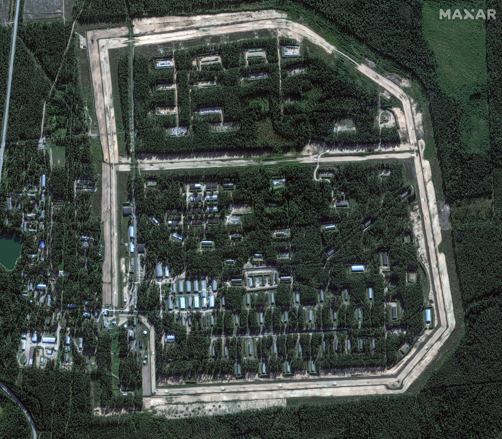

Oktyabrski Ammunition Depot – Before Strike.

Source: Satellite image ©2024 Maxar Technologies

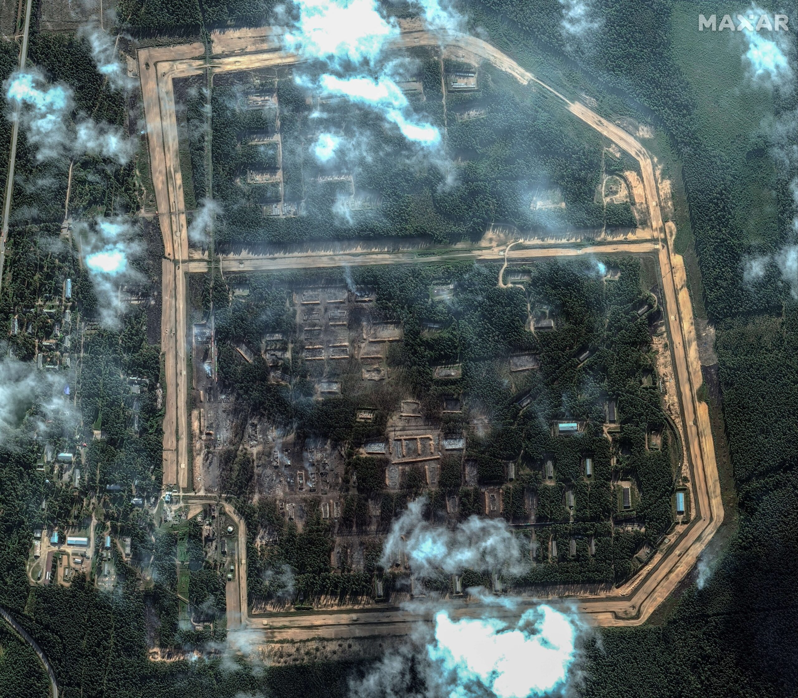

Oktyabrski Ammunition Depot – After Strike.

Source: Satellite image ©2024 Maxar Technologies

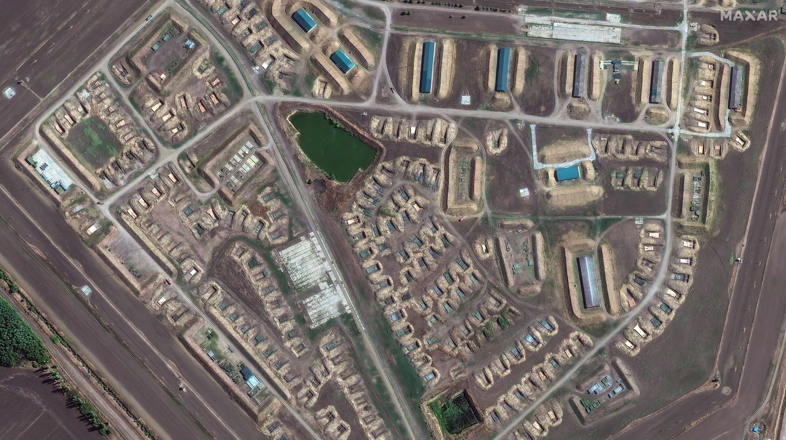

Tikhoretsk Ammunition Depot – Before Strike.

Source: Satellite image ©2024 Maxar Technologies

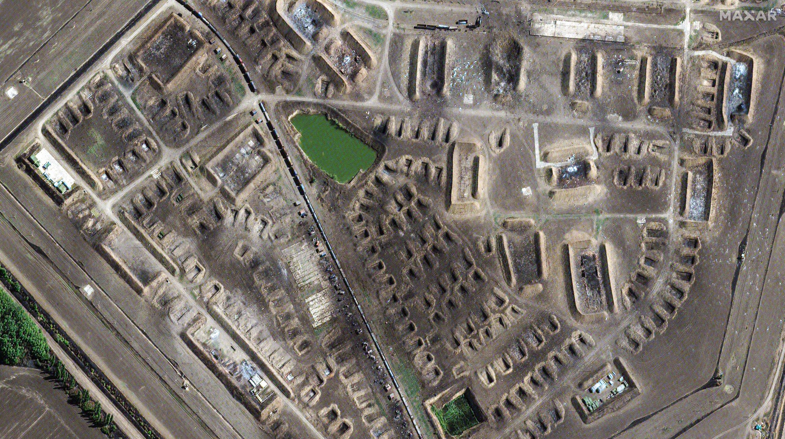

Tikhoretsk Ammunition Depot – After Strike.

Source: Satellite image ©2024 Maxar Technologies

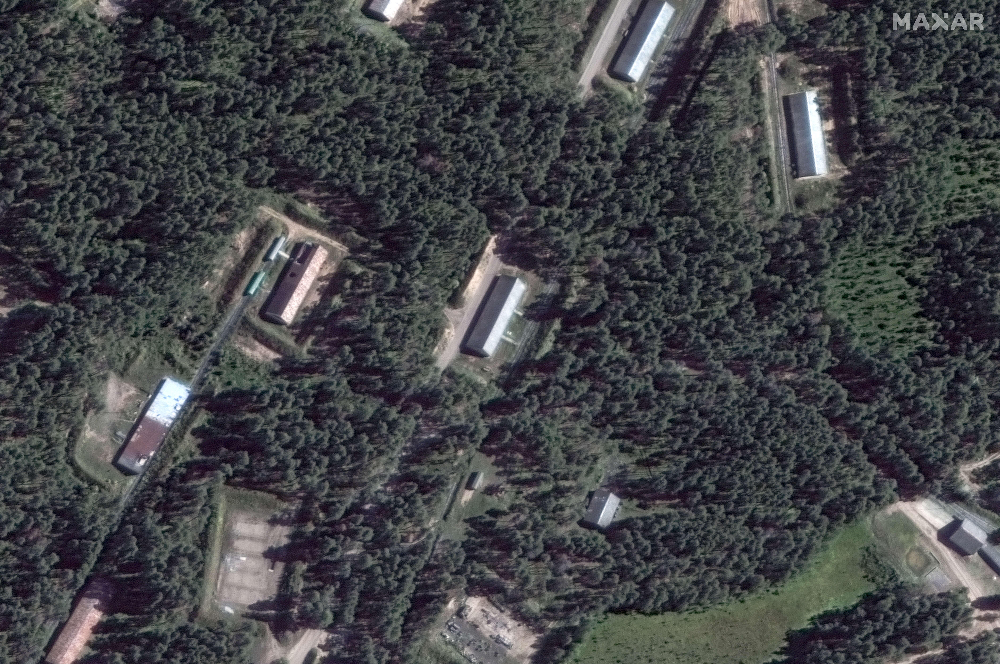

Toropets Ammunition Depot – Before Strike.

Source: Satellite image ©2024 Maxar Technologies

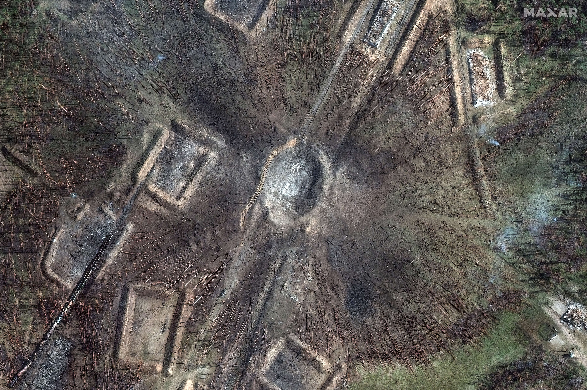

Toropets Ammunition Depot – After Strike.

Source: Satellite image ©2024 Maxar Technologies

The Russian military’s continued use of known large-scale logistics facilities is a considerable vulnerability that Ukraine could exploit if Western states removed restrictions against Ukraine. A Russian milblogger wrote a short essay on September 24 in which he complained about the lack of concealment of Russian military facilities, including warehouses and airfields.[12] The milblogger bemoaned how open sources such as Google Maps and Yandex show all Russian facilities and that private space companies provide regularly updated high-resolution imagery of Russian military objects.[13] The blogger also complained that Russia has not yet created a system for partitioning its ammunition deliveries to ensure that when Ukrainian forces interdict Russian ammo supplies, they would only destroy small caches of ammunition as opposed to strikes that cause catastrophic and widespread damage. ISW continues to assess that Western states can degrade Russia’s ability to leverage mass materiel at scale by eliminating restrictions on Ukraine’s use of precision fires in Russia and by forcing the Russian command to partition ammunition depots into smaller and less efficient facilities, some of which will be further away from Ukraine.[14]

**Russia continues to expand and leverage its bilateral relations with the People’s Republic of China (PRC) in order to support its war effort in Ukraine.**Ukrainian President Volodymyr Zelensky stated on September 23 that Russia is using unspecified Chinese satellites to photograph Ukraine’s nuclear power plants possibly in preparation to strike them.[15] The US government warned in April 2024 that the PRC is providing Russia with unspecified geospatial intelligence, which coheres with Zelensky’s warning about Russia’s use of Chinese satellites.[16] Ukrainian Presidential Advisor Vladyslav Vlasyuk stated on September 23 that China supplies approximately 60 percent of all foreign components found in the weapons Russia uses against Ukraine.[17] Russian milbloggers circulated images on September 23 showing Russian forces operating Chinese Shaanxi Baoji Tiger armored vehicles equipped with counter-drone technology in Ukraine.[18] Another Russian source noted that Russian forces acquired these vehicles via a third party and not directly from the PRC, but the use of PRC-product military assets in Ukraine, no matter how they were acquired, confirms that Russia is continuing efforts to circumvent sanctions to obtain foreign materiel to support its war effort.[19] These various reports come amid the joint, week-long Russia-PRC ”Beibu/Interaction-2024” naval exercise that started on September 21 and during which Russian Pacific Fleet ships and unspecified Chinese People’s Liberation Army (PLA) warships conducted maneuvers and exercises in the Sea of Okhotsk.[20] The Russian Ministry of Defense (MoD) claimed on September 24 that Russian and PLA ships practiced joint maneuvering, countered mock enemy unmanned boats, conducted reconnaissance and monitored the sea surface situation with deck helicopters.[21] ISW has assessed that Russia seeks to enhance diplomatic, trade, and security ties with non-Western states, particularly the PRC, Iran, and North Korea, in an attempt to boost its war effort in Ukraine by obtaining weapons and critical, dual-use items, machine components, and materiel, through the development of mechanisms aimed at evading Western sanctions.[22] The PRC has repeatedly postured itself as a neutral actor in the war in Ukraine, recently promoting its joint “Political Settlement of the Ukraine Crisis” six-point peace plan (whose key principles nevertheless favor Russia) with Brazil despite a plethora of reports suggesting PRC support to the Russian war effort.[23]

**The Russian MoD has failed to appease the Russian ultranationalist milblogger community by downplaying the Russian military command’s responsibility for its insistence on misusing technical specialists in infantry-led frontal assaults in eastern Ukraine.**A Kremlin-affiliated milblogger who is a member of the Kremlin’s Human Rights Council published the alleged results of the Russian MoD’s and Federal Security Service’s (FSB) Department of Military Counterintelligence investigation into the deaths of drone operators of the 87th Separate Rifle Regiment (1st “Slavic” Motorized Rifle Brigade, 51st Combined Arms Army [CAA], formerly 1st Donetsk People’s Republic Army Corps [DNR AC]) Junior Sergeant Dmitry Lysakovsky (alias Goodwin) and Lieutenant Colonel Sergey Gritsai (alias Ernest).[24] The drone operators died in combat after the Russian military command disbanded their specialized drone unit and committed them to a frontal assault in Donetsk Oblast (likely in the Pokrovsk direction) as punishment for criticizing their command, resulting in Russian Defense Minister Andrei Belousov starting an investigation into the case following mass outcry online.[25] The milblogger, citing unnamed sources familiar with the investigation, claimed on September 23 that Russian authorities found that the commander of the 87th Separate Rifle Regiment did not exceed his powers by committing the drone platoon to combat operations given the tactical situation on the ground and the official purpose of the military personnel.[26] The investigation also reportedly did not find any instances of drug trafficking on the frontline — an issue that Lysakovsky, Gritsai, and now arrested assault detachment commander of the 110th Motorized Rifle Brigade (51st CAA) Vladimir Novikov (alias Beliy) reportedly raised to the Russian military command.[27] The investigation reportedly stated the situation is the result of commanders generally neglecting to appropriately select manpower based on professional qualities, and Belousov reportedly appointed two unnamed experienced officers as 87th Separate Rifle Regiment’s chief of staff — deputy commander and deputy commander. The milblogger noted that the Russian MoD “brought to disciplinary liability” a number of military commanders, including 51st CAA, 1st “Slavic” Motorized Rifle Brigade, and 87th Separate Rifle Regiment commanders, but another milblogger pointed out that Belousov did not fire the regiment’s commander (alias “Zloy”) whom the drone operators identified as responsible for disbanding their unit before their deaths.[28] Belousov reportedly ordered the Russian MoD’s Main Directorate for Control and Supervision Activities to inspect the problems of manning and equipping drone units and to assess these units’ effectiveness and tasked the Russian General Staff with submitting proposals on the creation of regular drone units within the 87th Separate Rifle Regiment and other military units.

Russian milbloggers overwhelmingly questioned the legitimacy of the milblogger’s account of the investigation, even though this milblogger is a member of numerous Kremlin initiatives and appears to be downplaying the backlash over these deaths in the information space.[29] Several Russian milbloggers implied that the Russian MoD used the Kremlin-affiliated milblogger to gauge the public reaction to the claimed results of the investigation and urged their audiences to wait for the Russian MoD to publish the official report.[30] The Kremlin-affiliated milblogger previously shared parts of the investigation claiming that Gritsai died during a Ukrainian drone strike on a rear position and implied that the platoon used mobile devices during the strike, essentially accusing them of being responsible for the circumstances of their deaths.[31] The Russian MoD had recently intensified its efforts to ban personal devices on the frontlines, and it is likely that the Russian MoD is using the milblogger’s platform to deny responsibility and to advance the Kremlin’s force centralization and information space control efforts.[32]

**The claimed results of the investigation indicate that the Russian MoD is disinterested in addressing the systematic misuse of semi-independent Russian military innovators, specialists, and irregular commanders due to its commitment to the force centralization campaign and to maintaining the current tempo of offensive operations.**A Russian milblogger and former Storm Z instructor claimed that the unofficial reports of the results of the investigation indicate that the Russian MoD has committed to downplaying the situation in the information space and is disinterested in conducting an objective investigation and improving the overall quality of the Russian Armed Forces.[33] One milblogger, who has remained very critical of the Russian MoD, reported that the Russian military command recently committed a Spetsnaz officer to a regular infantry assault unit because the unit lacked assault elements.[34] The milblogger recalled similar recent instances of misuse of Russian Aerospace Forces (VKS) engineers, Baltic Fleet sailors, missilemen, and disabled Russian servicemen in infantry-led assaults. The milblogger recalled that the Russian military command “senselessly” reduced Russian elite airborne (VDV) and Spetsnaz forces at the beginning of the war by committing them to operations for which they were not trained.[35] The Russian military command also formed the 3rd “Frigate” Mechanized Battalion, which fighting in Pokrovsk, northern Kharkiv, and Lyman directions as part of the 245th Motorized Rifle Regiment (1st Guards Tank Army, Moscow Military District [MMD]) with sailors of the *Admiral Kuznetsov*aircraft carrier[36] The systematic misuse of Russian specialists also indicates that Russia is struggling to meet the manpower demands of its war in Ukraine.[37]

**Key Takeaways:**

- **Russian forces have reached the outskirts of Vuhledar amid what appears to be an intensified offensive push near the settlement, but the capture of Vuhledar is unlikely to afford Russian forces any particular operational edge for further offensive operations in western Donetsk Oblast.**
- **Recent Ukrainian strikes against Russian rear ammunition depots demonstrate the extent to which Russian military logistics still benefit from Western-provided sanctuary that secures Russia’s rear.**
- **Russia continues to expand and leverage its bilateral relations with the People’s Republic of China (PRC) in order to support its war effort in Ukraine.**
- **The Russian Ministry of Defense (MoD) has failed to appease the Russian ultranationalist milblogger community by downplaying the Russian military command’s responsibility for its insistence on misusing technical specialists in infantry-led frontal assaults in eastern Ukraine.**
- **Ukrainian forces recently advanced west of the Kursk Oblast salient.**
- **Ukrainian forces recently advanced within Vovchansk and in eastern Toretsk.**
- **Russian opposition outlet *Meduza*, citing its own conversations with various unspecified Russian officials close to the Russian Presidential Administration, an interlocutor in the federal government, and regional officials, reported on September 24 that mobilization is a very sensitive topic among Kremlin officials.**

***We do not report in detail on Russian war crimes because these activities are well-covered in Western media and do not directly affect the military operations we are assessing and forecasting. We will continue to evaluate and report on the effects of these criminal activities on the Ukrainian military and the Ukrainian population and specifically on combat in Ukrainian urban areas. We utterly condemn Russian violations of the laws of armed conflict and the Geneva Conventions and crimes against humanity even though we do not describe them in these reports.***

- Ukrainian Operations in the Russian Federation
- Russian Main Effort – Eastern Ukraine (comprised of three subordinate main efforts)
- Russian Subordinate Main Effort #1 – Push Ukrainian forces back from the international border with Belgorod Oblast and approach to within tube artillery range of Kharkiv City
- Russian Subordinate Main Effort #2 – Capture the remainder of Luhansk Oblast and push westward into eastern Kharkiv Oblast and encircle northern Donetsk Oblast
- Russian Subordinate Main Effort #3 – Capture the entirety of Donetsk Oblast
- Russian Supporting Effort – Southern Axis
- Russian Air, Missile, and Drone Campaign
- Russian Mobilization and Force Generation Efforts
- Russian Technological Adaptations
- Activities in Russian-occupied areas
- Ukrainian Defense Industrial Base Efforts
- Russian Information Operations and Narratives
- Significant Activity in Belarus

**Ukrainian Operations in the Russian Federation**

Ukrainian forces recently advanced in Glushkovsky Raion west of the Ukrainian salient in Kursk Oblast amid continued offensive operations in the area on September 24. Geolocated footage published on September 23 shows that Ukrainian forces advanced during a mechanized attack southeast of Veseloye (southwest of Glushkovo), and Russian milbloggers similarly claimed that Ukrainian forces conducted a mechanized attack and advanced in the area.[38] Additional geolocated footage published on September 20 shows that Ukrainian forces also recently advanced in fields east of Veseloye.[39] Russian sources, including the Russian MoD, claimed that Russian forces repelled Ukrainian attacks in the directions of Novy Put and Medvezhye (both south of Glushkovo) on September 23 and 24.[40]

Ukrainian forces continued offensive operations along their salient within Kursk Oblast on September 24, but there were no confirmed changes to the frontline. A Russian milblogger claimed that Ukrainian forces seized part of a forest north of Martynovka (northeast of Sudzha) and that there is contradictory information about whether or not Russian forces still maintain positions within Malaya Loknya (north of Sudzha).[41] Russian sources claimed that Ukrainian forces continued attacks near Olgovka (east of Korenevo), Lyubimovka (southeast of Korenevo), Tolstyy Lug (south of Lyubimovka), Malaya Lokya, and Obukhovka (south of Korenevo).[42]

Geolocated footage published on September 23 shows Ukrainian forces striking a Russian Buk-M3 air defense system east of Rylsk, Kursk Oblast, about 20km northwest of the Kursk Oblast salient.[43]

Russian forces continued offensive operations in the Ukrainian salient in Kursk Oblast on September 24 but did not make confirmed advances.[44] Chechen Akhmat Spetsnaz Commander Apty Alaudinov claimed on September 24 that Russian forces have recaptured 12 settlements since the start of the “Kursk operation,” likely referring to Russian efforts to push Ukrainian forces from their salient.[45] ISW currently assesses that Russian forces have recaptured 11 settlements in Kursk Oblast. Elements of the Russian 83rd Airborne (VDV) Brigade, 51st and 119th VDV regiments (106th VDV Division), 56th VDV Regiment (7th VDV Division), and 155th Naval Infantry Brigade (Pacific Fleet, Eastern Military District [EMD]) reportedly continue fighting in Kursk Oblast.[46]

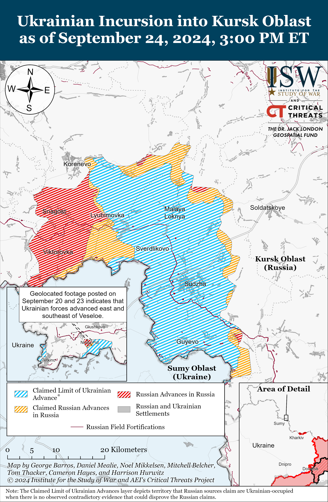

**Russian Main Effort – Eastern Ukraine**

**Russian Subordinate Main Effort #1 – Kharkiv Oblast (Russian objective: Push Ukrainian forces back from the international border with Belgorod Oblast and approach to within tube artillery range of Kharkiv City)**

Ukrainian forces advanced within central Vovchansk (northeast of Kharkiv City) amid continued fighting north and northeast of Kharkiv City on September 24. Geolocated footage published on September 24 indicates that Ukrainian forces likely seized the Vovchansk Aggregate Plant in central Vovchansk, and the Ukrainian Main Military Intelligence Directorate (GUR) stated that Ukrainian forces have seized the plant.[47] The GUR’s September 24 footage and report follow recent claims that control over the plant has been contested for several days prior to this footage.[48] Russian forces continued ground attacks north of Kharkiv City near Lyptsi and Hlyboke and northeast of Kharkiv City near Tykhe and in Vovchansk on September 23 and 24.[49] The GUR reported that elements of the Russian 45th Guards Spetsnaz Brigade were defending Russian positions within the Vovchansk Aggregate Plant.[50]

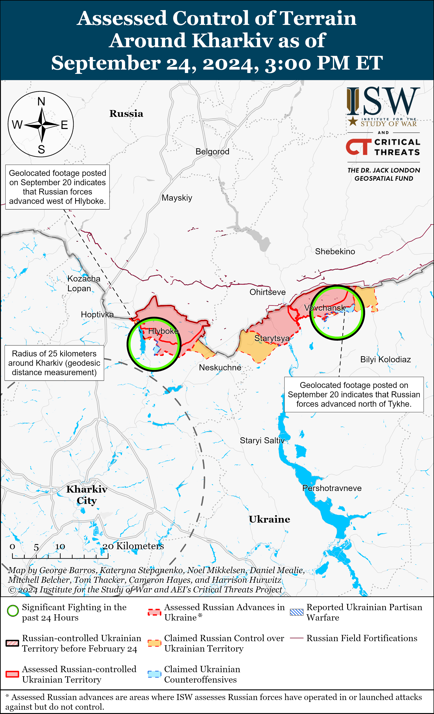

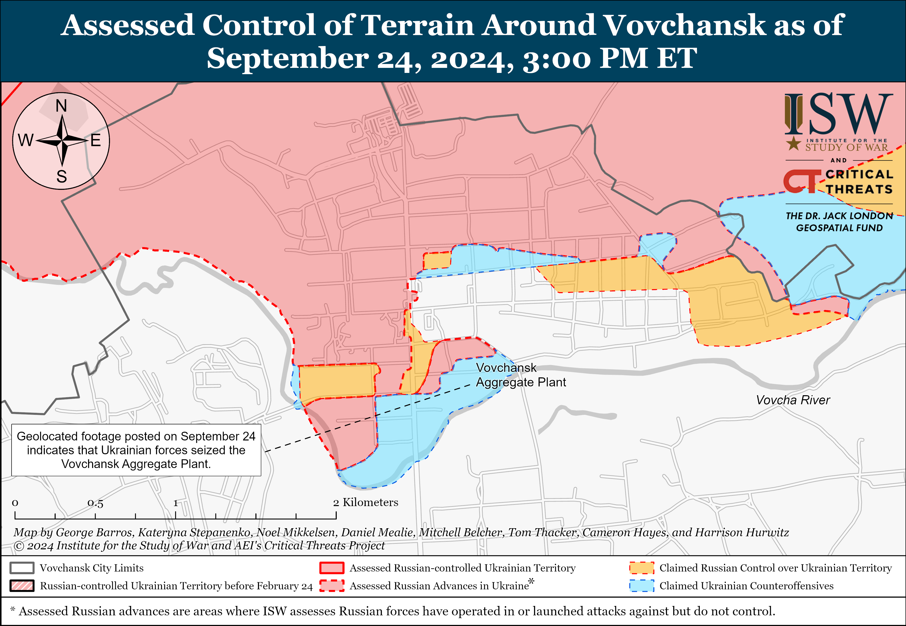

**Russian Subordinate Main Effort #2 – Luhansk Oblast (Russian objective: Capture the remainder of Luhansk Oblast and push westward into eastern Kharkiv Oblast and northern Donetsk Oblast)**

Russian forces continued offensive operations along the Kupyansk-Svatove-Kreminna line on September 24 and 25 but did not make confirmed advances. Russian milbloggers claimed that Russian forces recently advanced four kilometers from Pishchane towards Kruhlyakivka and established fire control over roads near Kruhlyakivka (both southeast of Kupyansk) and straightened the flank south of Berestove (northwest of Svatove).[51] The Ukrainian General Staff reported that Russian forces attacked east of Kupyansk near Kucherivka; northwest of Svatove near Kolisnykivka, Hlushkivka, Lozova, and Stelmakhivka; west of Svatove near Andriivka; northwest of Kreminna near Makiivka, Novosadove, Cherneshchyna, Druzhelyubivka, and Hrekivka; west of Kreminna near Torske and Terny; and southwest of Kreminna near Dibrova and Dronivka on September 24 and 25.[52] A Russian insider source, who has previously accurately reported on Russian military command changes, identified Moscow Military District (MMD) Commander Colonel General Sergei Kuzovlev as the commander of the Russian Western (Zapad) Group of Forces responsible for Russian offensive in the Kupyansk direction.[53]

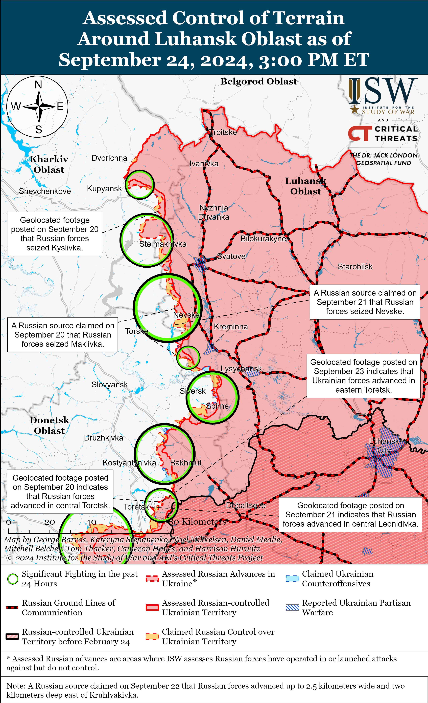

**Russian Subordinate Main Effort #3 – Donetsk Oblast (Russian objective: Capture the entirety of Donetsk Oblast, the claimed territory of Russia’s proxies in Donbas)**

Russian forces conducted ground attacks south of Siversk near Fedorivka on September 24 but did not make any confirmed advances.[54] Drone operators and artillery elements of the Russian 2nd Guards Artillery Brigade and 6th Motorized Rifle Brigade (both of the 3rd Combined Arms Army [CAA], formerly 2nd Luhansk People’s Republic Army Corps [LNR AC]) are reportedly operating in the Siversk direction.[55]

Russian forces continued limited offensive operations near Chasiv Yar on September 24 but did not make any confirmed advances. The Ukrainian General Staff reported that Russian forces conducted ground attacks north of Chasiv Yar near Kalynivka and Minkivka; southeast of Chasiv Yar near Klishchiivka; and south of Chasiv Yar near Bila Hora, Predtechyne, and Stupochky.[56] Elements of the Russian 98th Airborne (VDV) Division reportedly continue operating in the easternmost part of Chasiv Yar.[57]

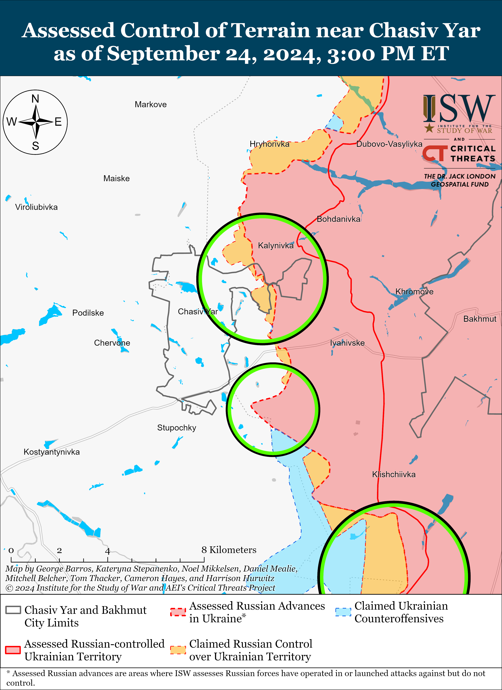

Ukrainian forces recently regained limited positions within Toretsk amid continued Russian offensive operations in the area on September 24. Geolocated footage published on September 23 indicates that Ukrainian forces advanced southward along Tsentralna Street in eastern Toretsk.[58] A Russian milblogger claimed that Russian forces advanced within eastern Toretsk and south of Toretsk into Nelipivka and Leonidivka.[59] The milblogger claimed that Russian forces have entirely pushed Ukrainian troops from Nelipivka and are clearing the settlement, although ISW has not yet observed confirmation of Russian forces operating in northern Nelipivka.[60] The Ukrainian General Staff reported that Russian forces conducted ground attacks near Toretsk itself; northeast of Toretsk near Dachne; south of Toretsk near Nelipivka; and in the direction of Shcherbynivka (west of Toretsk).[61]

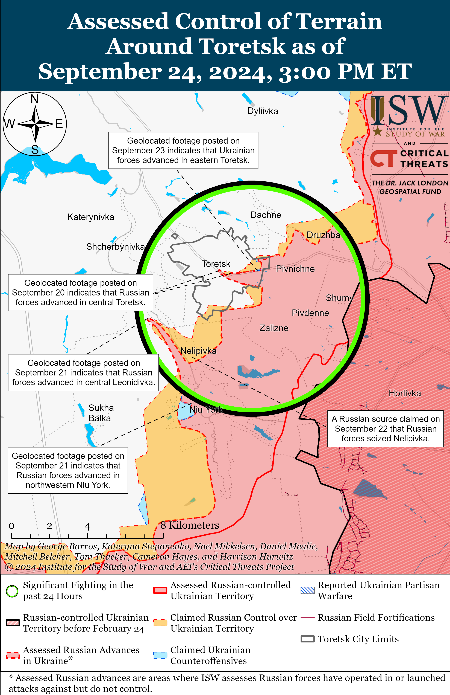

Russian forces reportedly continued to advance east and southeast of Pokrovsk, although there were no confirmed changes to the frontline in this area on September 24. Russian milbloggers claimed that Russian forces advanced in fields west of Hrodivka towards Mykolaivka (both east of Pokrovsk); in eastern Selydove (southeast of Pokrovsk); northwest and west of Ukrainsk towards Tsukuryne (southeast of Selydove); and around Zhelanne Druhe (southeast of Ukrainsk), although ISW has not yet observed confirmation of these claims.[62] The Ukrainian General Staff reported that Russian forces conducted ground attacks northeast of Pokrovsk near Zelene Pole; east of Pokrovsk near Vozdvyzhenka, Myrolyubivka, and Novotoretske; and southeast of Pokrovsk near Krasnyi Yar, Novohrodivka, Mykolaivka, Marynivka, Zhuravka, Tsukuryne, Zhelanne Druhe, and Ukrainsk.[63] Elements of the Russian 1st Slavic Motorized Rifle Brigade (51st CAA, formerly 1st Donetsk People’s Republic [DNR] AC) are reportedly operating in the Russian rear southeast of Pokrovsk near Ocheretyne.[64]

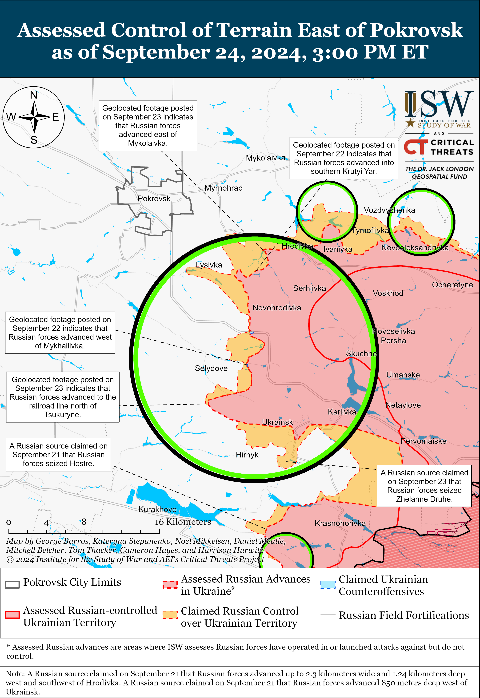

Russian forces continued offensive operations west of Donetsk City near Heorhiivka and in the direction of Dalnye on September 24 but did not make any confirmed advances.[65]

*See topline text for updates on the Vuhledar direction.*

Neither Russian nor Ukrainian sources reported fighting in the Donetsk-Zaporizhia Oblast border area on September 24.

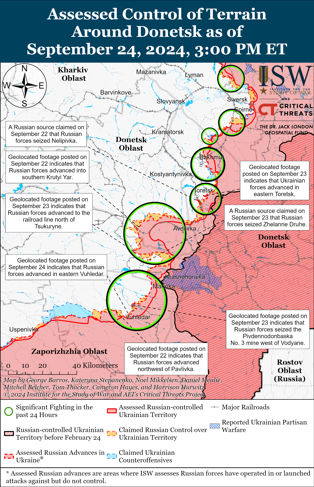

**Russian Supporting Effort – Southern Axis (Russian objective: Maintain frontline positions and secure rear areas against Ukrainian strikes)**

Positional fighting continued in western Zaporizhzhia Oblast near Novoandriivka (northwest of Robotyne) on September 23 and 24, but there were no confirmed changes to the front line.[66] Elements of the Russian BARS-11 “Kuban” detachment (Russian Combat Army Reserve) and elements of the North Ossetian “Alania” Battalion (Russian Volunteer Corps) are reportedly operating in the Zaporizhia direction.[67]

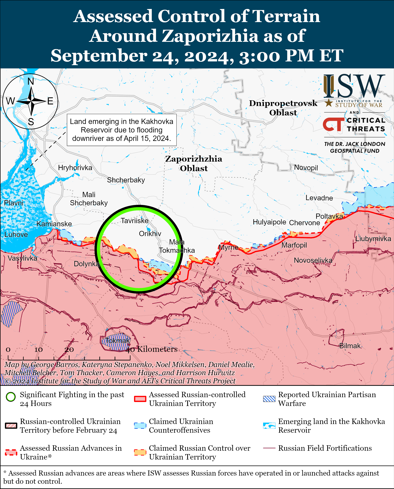

The Ukrainian General Staff reported that Russian forces conducted several unsuccessful assaults in east (left) bank Kherson Oblast on September 23 and 24.[68] Ukrainian Tavriisk Group of Forces Spokesperson Colonel Vladyslav Voloshyn said on September 24 that Russian forces began consolidating forces, specifically Wagner Group, Storm-Z, and airborne (VDV) forces, in occupied southern Ukraine possibly in preparation for an offensive effort “in the near future.”[69] Elements of the Russian 76th VDV Division reportedly continue striking Ukrainian positions on the west (right) bank of the Dnipro River.[70]

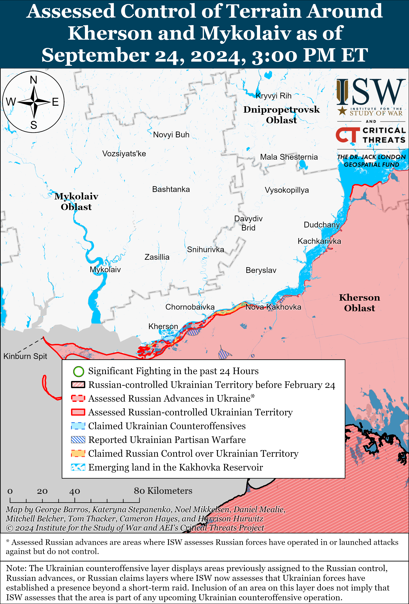

**Russian Air, Missile, and Drone Campaign (Russian Objective: Target Ukrainian military and civilian infrastructure in the rear and on the frontline)**

Russian forces conducted a series of missile and drone strikes against Ukraine on the night of September 23 to 24. The Ukrainian Air Force reported that Russian forces launched one Iskander-M ballistic missile from Rostov Oblast, two Kh-59/69 cruise missiles from over Bryansk Oblast, one unknown missile from over Kursk Oblast, and 81 Shahed drones from Kursk Oblast and Primorsko-Akhtarsk, Krasnodar Krai.[71] The Ukrainian Air Force reported that Ukrainian forces downed 66 Shahed drones over Kyiv, Zhytomyr, Poltava, Sumy, and Mykolaiv Oblasts and that Ukrainian countermeasures caused 13 other Shaheds to become “lost” before striking their targets. Zaporizhia Oblast Military Administration Head Ivan Fedorov reported that a Russian missile strike damaged residential and civil infrastructure in Zaporizhzhia City overnight.[72]

The Ukrainian Air Force reported on September 24 that an unspecified “low-speed” air target entered Ukrainian airspace from Belarusian airspace near the Kyiv-Zhytomyr Oblast administrative boundary.[73] The Belarusian Hajun Project reported that the object was a Belarusian Yak-130 training and combat aircraft and that it crossed the Belarusian-Ukrainian border near Dyatlik, Gomel Oblast on the afternoon of September 24.[74]

Kharkiv Oblast officials stated on September 24 that Russian forces launched five glide bombs, including one FAB-500 and two other guided aerial bombs, at residential areas in Kyivskyi and Saltivskyi raions of Kharkiv City, killing three and injuring 28.[75] Fedorov stated on September 24 that Russian forces struck Zaporizhzhia City with guided aerial bombs for the second day in a row overnight on September 23 to 24, largely targeting residential areas.[76]

**Russian Mobilization and Force Generation Efforts (Russian objective: Expand combat power without conducting general mobilization)**

Russian opposition outlet *Meduza*, citing its own conversations with various unspecified Russian officials close to the Russian Presidential Administration, an interlocutor in the federal government, and regional officials, reported on September 24 that mobilization is a very sensitive topic among Kremlin officials.[77] *Meduza*’s sources suggested that while high-ranking security officials support a new wave of Russian mobilization, civilian officials working in the Russian government and the Presidential Administration are against mobilization due to socioeconomic concerns. One of *Meduza*’s sources claimed that Russian society would likely view a new wave of mobilization as a betrayal because the Kremlin’s official narrative thus far has been that Russian forces are able to generate sufficient numbers of personnel through contract recruitment (supported by unofficial crypto-mobilization). *Meduza*also reported that civilian officials believe that Russian forces have sufficient numbers of soldiers even though the Kremlin and Russian federal subjects have been significantly increasing the value of their respective lump-sum payments to new contract personnel to incentivize higher recruitment numbers. ISW has recently assessed that Russian efforts to reorganize Russia’s decentralized, regional recruitment efforts into a broader federal effort indicate that Russia is struggling to meet the manpower demands of its war in Ukraine and that Russian President Vladimir Putin remains averse to involuntary mobilization for the moment.[78]

Russian authorities continue to intensify efforts aimed at incentivizing Russians accused of crimes into signing military service contracts with the Russian MoD to avoid further mobilization. The Russian State Duma adopted a bill in its second and third readings on September 24 that will allow Russian prosecutors to drop criminal charges against defendants if a defendant signs a contract with the Russian MoD to serve in the war in Ukraine during mobilization, martial law, and in wartime.[79]

*Bloomberg*reported on September 23 that Russian budget proposals for 2025 suggest that Russia intends to increase defense spending to 13.2 trillion rubles ($142.2 billion), roughly 6.2 percent of Russia’s annual gross domestic product (GDP), from 2024’s defense budget of 10.4 trillion rubles ($112 billion).[80]

**Russian Technological Adaptations (Russian objective: Introduce technological innovations to optimize systems for use in Ukraine)**

Nothing significant to report.

**Ukrainian Defense Industrial Efforts (Ukrainian objective: Develop its defense industrial base to become more self-sufficient in cooperation with US, European, and international partners)**

*ISW is suspending publishing coverage of Ukrainian defense industrial efforts until further notice.*

**Activities in Russian-occupied areas (Russian objective: Consolidate administrative control of annexed areas; forcibly integrate Ukrainian citizens into Russian sociocultural, economic, military, and governance systems)**

*ISW is not publishing coverage of Russian-occupied areas today.*

**Russian Information Operations and Narratives**

A Russian milblogger claimed on September 24 that NATO is disseminating propaganda in the Republic of Karelia (a region of northern Europe bordering Finland) via the Finnish Lutheran Church (Lumivaara) society in the region, which reportedly calls for a return of Karelia to Finland and supports Ukraine.[81] The milblogger claimed that Finland and NATO are funding anti-Russian Finnish nationalist groups in Karelia. Some milbloggers warned that if the Russian government does not address the issue, the separatist groups may begin targeting Russian military infrastructure in Karelia.[82] The milblogger originally published an “expose” on the Lumivaara society on September 23 after the society allegedly wanted to “privatize” the abandoned building of the Lutheran Church in Lumivaara village, Karelia.[83] Russian state media previously reported in late 2021 that the Finnish ”Lumivaara” society, composed of Finnish residents of Lumivaara village, partially restored the building following the fall of the Soviet Union and that the Lutheran church has since been abandoned due to lack of funding.[84]

Another Russian milblogger attempted to undermine the upcoming Moldovan election, saying that the Central Election Commission is under the direct control of the US Agency for International Development (USAID) and UK Aid.[85] The milblogger claimed that the West is taking advantage of Moldova’s demographic issues to populate the country with illegal migrants so that the West can use Moldova as a convenient military training ground close to Ukraine.[86]

**Significant activity in Belarus (Russian efforts to increase its military presence in Belarus and further integrate Belarus into Russian-favorable frameworks and Wagner Group activity in Belarus)**

Belarusian President Alexander Lukashenko announced on September 24 that the Belarusian military is forming a new unit of contract personnel who previously served in the Belarusian Armed Forces.[87] Lukashenko did not provide further specifics about this new unit but referred to the unit as a *podrazdeleniye*, a Russian doctrinal term for units at or below the battalion level, so this unit when formed is unlikely to represent a significant inflection in Belarusian military capabilities.[88]

**Note: ISW does not receive any classified material from any source, uses only publicly available information, and draws extensively on Russian, Ukrainian, and Western reporting and social media as well as commercially available satellite imagery and other geospatial data as the basis for these reports. References to all sources used are provided in the endnotes of each update.**

[1] https://x.com/moklasen/status/1838622015311262185; https://x.com/markito0171/status/1838617965819801761; https://x.com/markito0171/status/1838620273651720370; https://t.me/RVvoenkor/77541;https://t.me/boris\_rozhin/138439; https://t.me/officer\_alex33/3800; https://t.me/dva\_majors/53451; https://t.me/DnevnikDesantnika/15966; https://t.me/RVvoenkor/77571; https://t.me/RVvoenkor/77573

[2] https://t.me/DnevnikDesantnika/16007; https://t.me/motopatriot/27829

[3] https://t.me/tass\_agency/274791; https://t.me/boris\_rozhin/138480; https://t.me/boris\_rozhin/138456

[4] https://www.forbes.com/sites/davidaxe/2024/09/23/the-same-deadly-ukrainian-brigade-has-defended-vuhledar-for-two-years-its-at-risk-of-getting-cut-off/; https://www.unian dot net/war/ugledar-seleznev-zayavil-chto-nashi-zashchitniki-mogut-okazatsya-v-okruzhenii-12766209.html; https://t.me/akovalenko1989/7925 ; https://rubryka dot com/2024/09/24/vijska-rf-zrujnuvaly-vugledar-ta-namagayutsya-ruhatysya-u-flang-tspd/

[5] https://t.me/boris\_rozhin/138457; https://www.forbes.com/sites/davidaxe/2024/09/23/the-same-deadly-ukrainian-brigade-has-defended-vuhledar-for-two-years-its-at-risk-of-getting-cut-off/

[6] https://t.me/boris\_rozhin/138457

[7] https://isw.pub/UkrWar110722; https://isw.pub/UkrWar110322; https://isw.pub/UkrWar021123; https://isw.pub/UkrWar021323; https://isw.pub/UkrWar102922

[8] https://isw.pub/UkrWar111522; https://isw.pub/UkrWar021323; https://www.forbes.com/sites/davidaxe/2024/09/23/the-same-deadly-ukrainian-brigade-has-defended-vuhledar-for-two-years-its-at-risk-of-getting-cut-off/

[9] https://isw.pub/UkrWar090524

[10] https://isw.pub/UkrWar090524

[11] https://x.com/georgewbarros/status/1838280133423305010

[12] https://t.me/DnevnikDesantnika/15972

[13] https://t.me/DnevnikDesantnika/15972

[14] https://understandingwar.org/backgrounder/interactive-map-hundreds-known-russian-military-objects-are-range-atacms

[15] https://abcnews.go.com/Politics/ukrainian-president-volodymyr-zelenskyy-discusses-victory-plan-present/story?id=113936347

[16] https://www.bloomberg.com/news/articles/2024-04-06/china-is-providing-geospatial-intelligence-to-russia-us-warns

[17] https://suspilne dot media/842879-zelenskij-vistupiv-na-samiti-majbutnogo-v-oon-dania-nadast-16-mln-evro-dopomogi-ukraini-944-den-vijni-onlajn/?anchor=live\_1727162544&utm\_source=copylink&utm\_medium=ps ; https://www.reuters.com/world/europe/ukraine-says-china-is-key-route-foreign-tech-russian-weapons-2024-09-24/

[18] https://x.com/RALee85/status/1838445705498644637 ; https://mil.in dot ua/uk/news/rosiyany-vykorystovuyut-na-fronti-bronemashyny-zfb-05-kytajskogo-vyrobnytstva/; https://t.me/mag\_vodogray/10226?single; https://t.me/milinfolive/131203; https://t.me/Ugolok\_Sitha/22155

[19] https://t.me/boris\_rozhin/138458

[20] https://www.reuters.com/world/asia-pacific/russia-china-start-naval-exercises-sea-japan-agencies-report-2024-09-21/

[21] https://t.me/mod\_russia/43756

[22] https://understandingwar.org/backgrounder/iran-update-april-26-2024; https://understandingwar.org/backgrounder/russian-offensive-campaign-assessment-september-15-2024

[23] https://understandingwar.org/backgrounder/russian-offensive-campaign-assessment-september-9-2024

[24] https://t.me/sashakots/49138

[25] https://understandingwar.org/backgrounder/russian-offensive-campaign-assessment-september-14-2024; https://understandingwar.org/backgrounder/russian-offensive-campaign-assessment-september-21-2024; https://isw.pub/UkrWar091424 ; https://isw.pub/UkrWar091524

[26] https://t.me/sashakots/49138

[27] https://understandingwar.org/backgrounder/russian-offensive-campaign-assessment-september-21-2024

[28] https://t.me/milinfolive/131234

[29] https://t.me/notes\_veterans/19676; https://t.me/notes\_veterans/19679; https://t.me/milinfolive/131234; https://t.me/wargonzo/22296; https://t.me/philologist\_zov/1461; https://t.me/philologist\_zov/1462

[30] https://t.me/notes\_veterans/19676; https://t.me/notes\_veterans/19679; https://t.me/milinfolive/131234; https://t.me/wargonzo/22296; https://t.me/philologist\_zov/1461; https://t.me/philologist\_zov/1462

[31] https://smotrim dot ru/article/4148736

[32] https://understandingwar.org/backgrounder/russian-offensive-campaign-assessment-august-2-2024; https://understandingwar.org/backgrounder/russian-offensive-campaign-assessment-july-23-2024; https://understandingwar.org/backgrounder/russian-offensive-campaign-assessment-august-25-2024

[33] https://t.me/philologist\_zov/1461

[34] https://t.me/Alekhin\_Telega/11676

[35] https://t.me/Alekhin\_Telega/11676

[36] https://www.severreal.org/a/moryakov-s-avianostsa-admiral-kuznetsov-otpravili-na-voynu-v-ukrainu/33132157.html; https://understandingwar.org/backgrounder/russian-offensive-campaign-assessment-september-20-2024; https://x.com/moklasen/status/1836805654515753099

[37] https://understandingwar.org/backgrounder/russian-offensive-campaign-assessment-september-21-2024

[38] https://t.me/rodnaya\_sudzha/10261; https://x.com/Danspiun/status/1838554482520555806; https://t.me/dva\_majors/53446; https://t.me/wargonzo/22281 https://t.me/rybar/63775

[39] https://t.me/rian\_ru/262007; https://x.com/Danspiun/status/1838329464851435931

[40] https://t.me/RVvoenkor/77518; https://t.me/mod\_russia/43753;

[41] https://t.me/rybar/63775

[42] https://t.me/rybar/63775; https://t.me/rybar/63775; https://ria dot u/20240924/spetsoperatsiya-1974364742.html; https://t.me/rusich\_army/17286

[43] https://x.com/666\_mancer/status/1838313588249022794; https://x.com/666\_mancer/status/1838462417468068232; https://t.me/raid\_413/63

[44] https://t.me/mod\_russia/43753

[45] https://t.me/tass\_agency/274820

[46] https://t.me/rusich\_army/17286; https://t.me/RVvoenkor/77566; https://t.me/NgP\_raZVedka/19113; https://t.me/DnevnikDesantnika/15956

[47] https://t.me/DIUkraine/4516; https://www.youtube.com/watch?v=38lF9hz749A; https://mil.in [dot] ua/uk/news/gur-zvilnylo-vid-okupantiv-vovchanskyj-agregatnyj-zavod/; https://t.me/DIUkraine/4517; https://t.me/DIUkraine/4516; https://t.me/cyber\_boroshno\_chat/128993; https://x.com/Maks\_NAFO\_FELLA/status/1838565979355332859; https://x.com/GeoRaccoon/status/1838604155453161769;

[48] https://understandingwar.org/backgrounder/russian-offensive-campaign-assessment-september-20-2024; https://understandingwar.org/backgrounder/russian-offensive-campaign-assessment-september-17-2024

[49]https://www.facebook.com/GeneralStaff.ua/posts/pfbid0s5YgZ2Zbn9fEWSZqTugzZVUxhv4Y8Z3GzkGYDhHVnpUpTQR3Xs5t6HCKzRnDhefTl; https://www.facebook.com/GeneralStaff.ua/posts/pfbid0cWG5eNuzCUVJ9qaaRphbUcNux9a9ujJuPTrqahXGzHxwmPEzdDhe3wtAN8DJybFsl ; https://www.facebook.com/GeneralStaff.ua/posts/pfbid02x81aEYqtXE6N267f1dhmr9Qq2F9MFNL2xMUGwBjSxciJAyJzGR8KE9JMHZXvTJCvl ; https://t.me/wargonzo/22281

[50] https://www.youtube.com/watch?v=38lF9hz749A&ab\_channel=%D0%93%D0%BE%D0%BB%D0%BE%D0%B2%D0%BD%D0%B5%D1%83%D0%BF%D1%80%D0%B0%D0%B2%D0%BB%D1%96%D0%BD%D0%BD%D1%8F%D1%80%D0%BE%D0%B7%D0%B2%D1%96%D0%B4%D0%BA%D0%B8%D0%9C%D0%9E%D0%A3%D0%BA%D1%80%D0%B0%D1%97%D0%BD%D0%B8; https://mil.in dot ua/uk/news/gur-zvilnylo-vid-okupantiv-vovchanskyj-agregatnyj-zavod

[51] https://t.me/DnevnikDesantnika/15974; https://t.me/dva\_majors/53446; https://t.me/rybar/63782; https://t.me/boris\_rozhin/138470; https://t.me/tass\_agency/274759

[52] https://www.facebook.com/GeneralStaff.ua/posts/pfbid0s5YgZ2Zbn9fEWSZqTugzZVUxhv4Y8Z3GzkGYDhHVnpUpTQR3Xs5t6HCKzRnDhefTl; https://www.facebook.com/GeneralStaff.ua/posts/pfbid0cWG5eNuzCUVJ9qaaRphbUcNux9a9ujJuPTrqahXGzHxwmPEzdDhe3wtAN8DJybFsl; https://www.facebook.com/GeneralStaff.ua/posts/pfbid02x81aEYqtXE6N267f1dhmr9Qq2F9MFNL2xMUGwBjSxciJAyJzGR8KE9JMHZXvTJCvl

[53] https://t.me/rybar/63771; https://t.me/arbat/1897

[54] https://www.facebook.com/GeneralStaff.ua/posts/pfbid0cWG5eNuzCUVJ9qaaRphbUcNux9a9ujJuPTrqahXGzHxwmPEzdDhe3wtAN8DJybFsl

[55] https://t.me/sashakots/49157; https://t.me/epoddubny/21149; https://t.me/epoddubny/21150

[56] https://www.facebook.com/GeneralStaff.ua/posts/pfbid0s5YgZ2Zbn9fEWSZqTugzZVUxhv4Y8Z3GzkGYDhHVnpUpTQR3Xs5t6HCKzRnDhefTl; https://www.facebook.com/GeneralStaff.ua/posts/pfbid0cWG5eNuzCUVJ9qaaRphbUcNux9a9ujJuPTrqahXGzHxwmPEzdDhe3wtAN8DJybFsl

[57] https://t.me/rusich\_army/17290

[58] https://t.me/rian\_ru/262345; https://t.me/creamy\_caprice/6915?single

[59] https://t.me/DnevnikDesantnika/15977; https://t.me/DnevnikDesantnika/15948

[60] https://t.me/DnevnikDesantnika/15977

[61] https://www.facebook.com/GeneralStaff.ua/posts/pfbid0s5YgZ2Zbn9fEWSZqTugzZVUxhv4Y8Z3GzkGYDhHVnpUpTQR3Xs5t6HCKzRnDhefTl; https://www.facebook.com/GeneralStaff.ua/posts/pfbid0cWG5eNuzCUVJ9qaaRphbUcNux9a9ujJuPTrqahXGzHxwmPEzdDhe3wtAN8DJybFsl

[62] https://t.me/voenkorKotenok/59186; https://t.me/rybar/63776; https://t.me/rybar/63776; https://t.me/boris\_rozhin/138470; https://t.me/dva\_majors/53446; https://t.me/RVvoenkor/77536; https://t.me/DnevnikDesantnika/15984

[63] https://www.facebook.com/GeneralStaff.ua/posts/pfbid0s5YgZ2Zbn9fEWSZqTugzZVUxhv4Y8Z3GzkGYDhHVnpUpTQR3Xs5t6HCKzRnDhefTl; https://www.facebook.com/GeneralStaff.ua/posts/pfbid0cWG5eNuzCUVJ9qaaRphbUcNux9a9ujJuPTrqahXGzHxwmPEzdDhe3wtAN8DJybFsl

[64] https://t.me/dva\_majors/53489

[65] https://www.facebook.com/GeneralStaff.ua/posts/pfbid0s5YgZ2Zbn9fEWSZqTugzZVUxhv4Y8Z3GzkGYDhHVnpUpTQR3Xs5t6HCKzRnDhefTl;

https://www.facebook.com/GeneralStaff.ua/posts/pfbid0cWG5eNuzCUVJ9qaaRphbUcNux9a9ujJuPTrqahXGzHxwmPEzdDhe3wtAN8DJybFsl

[66]https://www.facebook.com/GeneralStaff.ua/posts/pfbid0cWG5eNuzCUVJ9qaaRphbUcNux9a9ujJuPTrqahXGzHxwmPEzdDhe3wtAN8DJybFsl ; https://www.facebook.com/GeneralStaff.ua/posts/pfbid02x81aEYqtXE6N267f1dhmr9Qq2F9MFNL2xMUGwBjSxciJAyJzGR8KE9JMHZXvTJCvl

[67] https://t.me/wargonzo/22293 ; https://t.me/boris\_rozhin/138447

[68]https://www.facebook.com/GeneralStaff.ua/posts/pfbid0cWG5eNuzCUVJ9qaaRphbUcNux9a9ujJuPTrqahXGzHxwmPEzdDhe3wtAN8DJybFsl; https://www.facebook.com/GeneralStaff.ua/posts/pfbid02x81aEYqtXE6N267f1dhmr9Qq2F9MFNL2xMUGwBjSxciJAyJzGR8KE9JMHZXvTJCvl

[69] https://armyinform.com dot ua/2024/09/24/shtormy-gotuyutsya-v-shturmy-na-pivdni-vorog-pidtyagnuv-rezervy-ta-nakopychyv-syly/

[70] https://t.me/DnevnikDesantnika/15956

[71] https://t.me/kpszsu/19893; https://www.facebook.com/GeneralStaff.ua/posts/pfbid02k7aSeuFzUCVBHWrnBAcstoDJenVULrCG1MQvCWakrjvjSq68Row3a9iQWJReqWDwl

[72] https://t.me/ivan\_fedorov\_zp/11703; https://armyinform.com dot ua/2024/09/24/seriya-nichnyh-vybuhiv-u-zaporizhzhi-poshkodyla-krytychnu-infrastrukturu-ta-zhytlovi-kvartaly-ye-zhertvy/; https://armyinform.com dot ua/2024/09/24/naslidky-shesty-aviaudariv-po-zaporizhzhyu-poshkodzheno-ponad-70-bagatokvartyrnyh-budynkiv/ https://t.me/zoda\_gov\_ua/33495

[73] https://t.me/kpszsu/19909

[74] https://t.me/Hajun\_BY/8125

[75] https://t.me/synegubov/11313; https://t.me/synegubov/11311; https://t.me/synegubov/11308; https://t.me/synegubov/11301; https://t.me/synegubov/11300; https://t.me/synegubov/11300; https://t.me/synegubov/11299; https://t.me/synegubov/11294

[76] https://t.me/ivan\_fedorov\_zp/11729

[77] https://meduza dot io/feature/2024/09/24/pochti-nikto-ne-znaet-kogda-v-rossii-budet-novaya-mobilizatsiya-i-budet-li-ona-voobsche-no-sluhi-o-ney-tsirkuliruyut-vse-aktivnee

[78] https://understandingwar.org/backgrounder/russian-offensive-campaign-assessment-september-21-2024; https://isw.pub/UkrWar091924

[79] https://www.rbc dot ru/politics/24/09/2024/66f292399a794784b33289d2 ; https://t.me/DnevnikDesantnika/16005 ; https://t.me/mobilizationnews/20362; https://t.me/tass\_agency/274717; https://t.me/tass\_agency/274718 https://t.me/severrealii/27360;

[80] https://www.bloomberg.com/news/articles/2024-09-23/russia-budget-plans-show-no-let-up-in-putin-s-war-on-ukraine?srnd=phx-politics&embedded-checkout=true

[81] https://t.me/razved\_dozor/7086

[82] https://t.me/inners\_of\_the\_politics/31 ; https://t.me/dva\_majors/53471?single

[83] https://t.me/razved\_dozor/7080

[84] https://dzen dot ru/a/YCFhmezOyGsz25rm

[85] https://t.me/rybar/63785

[86] https://t.me/rybar/63789

[87] https://t.me/tass\_agency/274764; https://belta dot by/president/view/lukashenko-rasskazal-o-sozdanii-novogo-voinskogo-podrazdelenija-iz-kontraktnikov-663501-2024/

[88] https://t.me/tass\_agency/274764; https://belta dot by/president/view/lukashenko-rasskazal-o-sozdanii-novogo-voinskogo-podrazdelenija-iz-kontraktnikov-663501-2024/
