# Russian Offensive Campaign Assessment, September 25, 2024

**Angelica Evans, Davit Gasparyan, Karolina Hird, Grace Mappes, Haley Zehrung, and Frederick W. Kagan**

**September 25, 2024, 8:30pm ET**

**Click** [**here**](https://storymaps.arcgis.com/stories/36a7f6a6f5a9448496de641cf64bd375) **to see ISW’s interactive map of the Russian invasion of Ukraine. This map is updated daily alongside the static maps present in this report.**

**Click** [**here**](https://storymaps.arcgis.com/stories/83a2f24901c941d581c0c523ecd2619b) **to see ISW’s interactive map of Ukraine’s offensive in Kursk Oblast.**

**Click** [**here**](https://understandingwar.maps.arcgis.com/apps/instant/3dviewer/index.html?appid=1602762dbcde419bb957dea358449580) **to see ISW’s 3D control of terrain topographic map of Ukraine. Use of a computer (not a mobile device) is strongly recommended for using this data-heavy tool.**

**Click** [**here**](https://storymaps.arcgis.com/stories/733fe90805894bfc8562d90b106aa895) **to access ISW’s archive of interactive time-lapse maps of the Russian invasion of Ukraine. These maps complement the static control-of-terrain map that ISW produces daily by showing a dynamic frontline. ISW will update this time-lapse map archive monthly.**

**Note: The data cut-off for this product was 12:30pm ET on September 25. ISW will cover subsequent reports in the September 26 Russian Offensive Campaign Assessment.**

**Russian President Vladimir Putin continues to threaten the possibility of a nuclear confrontation between Russia and the West in order to exert further control over Western decision-making and discourage the West from allowing Ukraine to use Western-provided weapons to strike military objects in Russia.** Putin claimed during the first public meeting of the Russian Security Council’s standing conference on nuclear deterrence on September 25 that Russia is adjusting its nuclear doctrine to introduce “clarifications” regarding necessary preconditions for Russia to use a nuclear weapon.[1] Putin shared two “clarifications” to the nuclear doctrine: that the Kremlin will consider using nuclear weapons in the case of “aggression against Russia by a non-nuclear state with support or participation from a nuclear state” or in the case of  “the receipt of reliable information about the massive launch of air and space weapons” against Russia and these weapons crossing Russia’s borders. Putin specified that these “air and space weapons” that could justify Russian nuclear weapons use include strategic and tactical aviation, cruise missiles, drones, and/or hypersonic missiles. Putin likely intends for the hyper-specificity of his nuclear threats to breathe new life into the Kremlin’s tired nuclear saber-rattling information operation and generate a new wave of panic among Western policymakers during a particularly critical moment in Western policy discussions about Ukraine’s ability to use Western-provided weapons. Kremlin officials routinely invoke thinly veiled threats of nuclear confrontation between Russia and the West during key moments in Western political debates regarding further military assistance to Ukraine — such as the ongoing debate about Ukraine’s right to use Western-provided systems to conduct long-range strikes against Russian military objects — to induce fear among decision makers.[2] US Central Intelligence Agency Director (CIA) William Burns cautioned Western policymakers on September 7 against fearing boilerplate Russian nuclear saber-rattling, and ISW has long identified Russia’s nuclear saber-rattling as part of the Kremlin’s effort to promote Western self-deterrence and not as indicative of Russia’s willingness to use nuclear weapons.[3] ISW continues to assess that Russia is very unlikely to use nuclear weapons in Ukraine or elsewhere.[4]

**Ukrainian President Volodymyr Zelensky warned that Russia is preparing for potential strikes against Ukraine’s three remaining operational nuclear power plants ahead of the coming winter, highlighting the Kremlin’s unwillingness to engage in good-faith negotiations and continued commitment to the destruction of the Ukrainian state and its people.** Zelensky gave speeches to the United Nations Security Council (UNSC) and General Assembly (UNGA) on September 25 stating that Ukrainian intelligence found that Russia aims to target Ukraine’s three operational nuclear power plants in order to degrade Ukraine’s energy infrastructure and power generation capacity before winter 2024–2025 and cause “nuclear disaster.”[5] Zelensky recently noted that Russia is using unspecified Chinese satellites to photograph Ukraine’s nuclear power plants in preparation for strikes and emphasized in his UNGA speech that Russia’s previous winter strike campaigns against Ukrainian energy infrastructure have already destroyed Ukraine’s thermal power generation capacity and severely degraded its hydroelectric power generation capacity.[6] Russian authorities and sources have repeatedly falsely accused Ukrainian forces of targeting Russian and Russian-occupied nuclear power plants likely as part of Russia’s overarching informational effort to falsely paint Ukraine and the Zelensky government as illegitimate actors and war criminals with whom Russia cannot engage in peace negotiations.[7] Zelensky’s UN speeches also emphasized the principles of international law and the UN Charter as the main avenue through which Ukraine can achieve peace and highlighted the illegality of Russia’s war under international law alongside Russia’s ongoing destabilizing global efforts to enhance its war in Ukraine.[8]

**A Russian company is reportedly collaborating with entities in the People’s Republic of China (PRC) to develop an attack drone for Russia’s war in Ukraine.** *Reuters*, citing two European intelligence sources and documents it reviewed, reported on September 25 that Russia has established a secret weapons program in the PRC through Russian and PRC business entities in order to develop long-range attack drones for use in Ukraine.[9] Russian weapons manufacturer IEMZ Kupol reportedly developed and tested the long-range “Garpiya-3” attack drone in collaboration with PRC specialists and informed the Russian Ministry of Defense (MoD) that it can produce these drones at a factory in the PRC. The PRC Ministry of Foreign Affairs (MFA) denied knowledge of such a project to *Reuters* and emphasized the PRC’s strict drone export controls. The White House expressed concern to *Reuters* about the prospect of a PRC-based entity providing lethal assistance to a sanctioned Russian company and noted that, while it has no evidence that the PRC government is aware of this assistance, the PRC has an obligation to act against such assistance. *Reuters* reported that IEMZ Kupol has delivered at least seven Garpiya-3 drones to Russia for testing. The Garpiya-3 drones reportedly have a range of 2,000 kilometers and a 50-kilogram payload and are upgraded versions of the Russian-produced Garpiya-A1 attack drones (which have some PRC components). The *Reuters* report comes amid enhanced Chinese assistance to Russia’s war effort.[10] *Bloomberg* previously reported that unspecified Russian and PRC companies are collaborating in the development of a drone similar to the Iranian-designed Shahed loitering munition for Russian use in Ukraine.[11] The PRC has repeatedly attempted to depict itself as a neutral mediator in the war in Ukraine, and reports of increased military cooperation between Russia and the PRC as well as other assistance to Russia’s war effort undermine this claim. Repeated reports of joint Russia-PRC endeavors to enhance military cooperation in areas such as drone production and the ongoing Russia-PRC “Beibu/Interaction-2024” joint naval exercise that started on September 21 represent significant avenues for military knowledge sharing between the two countries.[12] Russian-PRC cooperation may be aimed at countering Western-made air defense systems used in Ukraine and elsewhere and at diminishing Western military influence globally.

**Russia continues to deepen its relationship with Iran’s Axis of Resistance, this time reportedly via Iran-brokered talks facilitating Russian missile transfers to Yemen’s Houthi rebels.** *Reuters* reported on September 25, citing Western and regional sources, that Iran has brokered “secret talks” between Russia and the Houthis to transfer Russian Yakhont (P-800 Oniks) anti-ship cruise missiles to the Houthis.[13] *Reuters*‘ sources noted that Russia has not yet made the decision to transfer the missiles. *CNN* reported on August 2 that the Kremlin had planned to transfer missiles to the Houthis but reneged due to diplomatic pressure, although Iran’s role in brokering the Russia-Houthi talks, or the specifics of the missiles, were unknown at the time of *CNN*‘s original reporting.[14] Russia’s hypothetical transfer of Yakhont missiles to the Houthis would likely bolster the Houthis’ ability to conduct long-range precision strikes against commercial vessels and threaten the security of the Red Sea.[15] Russia has substantial experience employing Yakhont missiles against various targets in Ukraine, and the Houthis could learn from such experience if they are able to procure the missiles.[16] ISW-CTP have recently reported on Russia’s efforts to align itself more explicitly with both Iran, on which Russia is reliant for military aid, and with Iran’s Axis of Resistance.[17]

**Key Takeaways:**

- **Russian President Vladimir Putin continues to threaten the possibility of a nuclear confrontation between Russia and the West in order to exert further control over Western decision-making and discourage the West from allowing Ukraine to use Western-provided weapons to strike military objects in Russia.**
- **Ukrainian President Volodymyr Zelensky warned that Russia is preparing for potential strikes against Ukraine’s three remaining operational nuclear power plants ahead of the coming winter, highlighting the Kremlin’s unwillingness to engage in good-faith negotiations and continued commitment to the destruction of the Ukrainian state and its people.**
- **A Russian company is reportedly collaborating with entities in the People’s Republic of China (PRC) to develop an attack drone for Russia’s war in Ukraine.**
- **Russia continues to deepen its relationship with Iran’s Axis of Resistance, this time reportedly via Iran-brokered talks facilitating Russian missile transfers to Yemen’s Houthi rebels.**
- **Neither Russian nor Ukrainian forces made confirmed advances in Kursk Oblast.**
- **Ukrainian forces continued to regain positions in Vovchansk.**
- **Russian forces advanced northwest of Kreminna, in Toretsk, and southeast of Pokrovsk.**
- **Russian forces reportedly advanced within and around Vuhledar (southwest of Donetsk City) amid continued offensive efforts to seize the settlement.**
- **Veterans of Russia’s war in Ukraine continue to commit crimes upon returning to Russia.**

****

***We do not report in detail on Russian war crimes because these activities are well-covered in Western media and do not directly affect the military operations we are assessing and forecasting. We will continue to evaluate and report on the effects of these criminal activities on the Ukrainian military and the Ukrainian population and specifically on combat in Ukrainian urban areas. We utterly condemn Russian violations of the laws of armed conflict and the Geneva Conventions and crimes against humanity even though we do not describe them in these reports.***

- Ukrainian Operations in the Russian Federation
- Russian Main Effort – Eastern Ukraine (comprised of three subordinate main efforts)
- Russian Subordinate Main Effort #1 – Push Ukrainian forces back from the international border with Belgorod Oblast and approach to within tube artillery range of Kharkiv City
- Russian Subordinate Main Effort #2 – Capture the remainder of Luhansk Oblast and push westward into eastern Kharkiv Oblast and encircle northern Donetsk Oblast
- Russian Subordinate Main Effort #3 – Capture the entirety of Donetsk Oblast
- Russian Supporting Effort – Southern Axis
- Russian Air, Missile, and Drone Campaign
- Russian Mobilization and Force Generation Efforts
- Russian Technological Adaptations
- Activities in Russian-occupied areas
- Ukrainian Defense Industrial Base Efforts
- Russian Information Operations and Narratives
- Significant Activity in Belarus

**Ukrainian Operations in the Russian Federation**

Ukrainian forces continued offensive operations in Glushkovsky Raion west of the Ukrainian salient in Kursk Oblast on September 25, but there were no confirmed Ukrainian advances in the area. Russian sources claimed that Russian forces repelled Ukrainian attacks south and southwest of Glushkovo near Novyi Put and Veseloye.[18]

Ukrainian forces continued offensive operations on the edges of the Ukrainian salient in Kursk Oblast on September 25, but did not make any confirmed advances. Russian sources claimed that fighting continued southwest of Korenevo near Krasnooktyabrskoye; southeast of Korenevo near Lyubimovka, Darino, and Nikolayevo-Darino; east of Korenevo near Olgovka; and southeast of Sudzha near Plekhovo.[19]

Russian forces continued counterattacks along the Ukrainian salient in Kursk Oblast on September 25, but did not make any confirmed advances. Russian Presidential Aide Alexei Dyumin claimed on September 25 that he has no doubt that Russian forces will “completely liberate” all of Kursk Oblast in the “near future” according to the Russian General Staff’s plan.[20] Ukrainian miliary observer Kostyantyn Mashovets stated on September 25 that elements of the Russian 6th Air Force and Air Defense Army, including its 105th Mixed Aviation Division, 899th Assault Aviation Regiment, 15th Army Aviation Brigade, 332nd and 440th separate helicopter regiments; and 2nd and 32nd air defense divisions are operating in Kursk Oblast, alongside other Russian units that ISW has previously observed in the area.[21] Russian milbloggers noted that Russian border guards continue to operate in Kursk Oblast.[22]

[**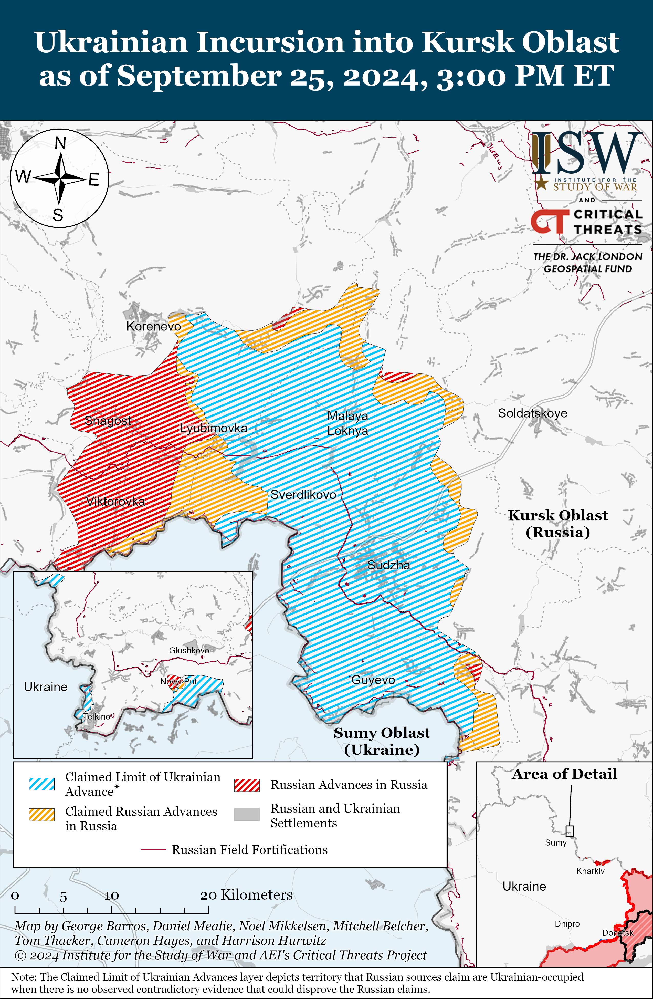**](https://understandingwar.org/wp-content/uploads/2025/05/UAF20Kursk20Incursion20September20252C202024.png)

Russian Main Effort – Eastern Ukraine

**Russian Subordinate Main Effort #1 – Kharkiv Oblast** **(Russian objective: Push Ukrainian forces back from the international border with Belgorod Oblast and approach to within tube artillery range of Kharkiv City)**

Ukrainian forces continued to regain positions within Vovchansk (northeast of Kharkiv City) amid reports of intensified Ukrainian counterattacks throughout northern Kharkiv Oblast on September 25. Geolocated footage published on September 25 further indicates that Ukrainian forces have regained positions within the Vovchansk Aggregate Plant in central Vovchansk and advanced in northeastern Vovchansk from the direction of Tykhe via Shchorsa and Sverdlova streets.[23] Russian milbloggers largely acknowledged the Ukrainian capture of the Aggregate Plant but claimed that Ukrainian forces were able to take the plant with relative ease because Russian forces withdrew from the area and because the plant was mostly destroyed in artillery and airstrikes.[24] Ukrainian military sources reported that the Ukrainian operation to capture the plant was a result of careful planning and took over a week.[25] Milbloggers also claimed that Ukrainian forces conducted counterattacks in and around Vovchansk and north of Kharkiv City near Hlyboke and Lyptsi.[26] The Ukrainian General Staff reported the Russian forces conducted ground attacks near Vovchansk and Tykhe.[27] Ukrainian military observer Kostyantyn Mashovets noted that elements of the 69th Motorized Rifle Division (6th Combined Arms Army [CAA], Leningrad Military District [LMD]) are likely the Russian elements that withdrew from the Vovchansk Aggregate Plant.[28]

[**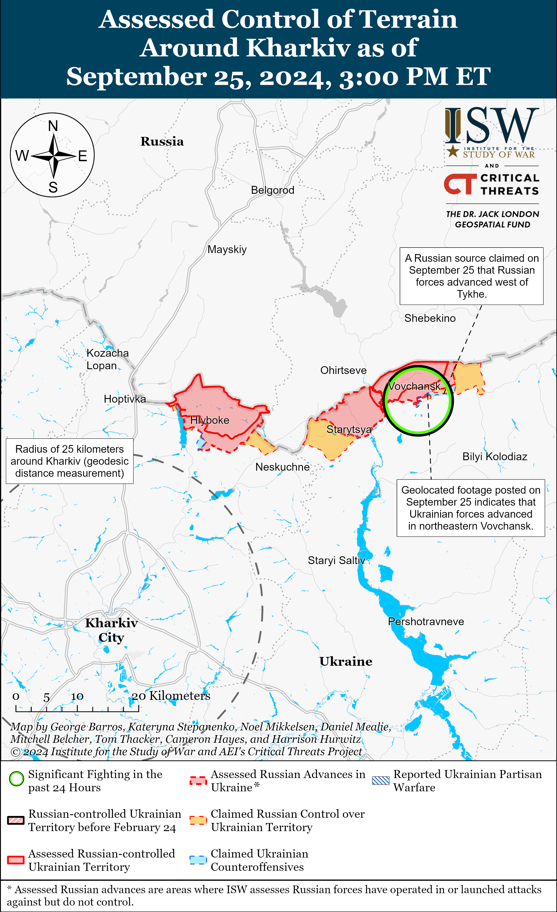**](https://understandingwar.org/wp-content/uploads/2025/05/Kharkiv20Battle20Map20Draft20September20252C202024.png)

[**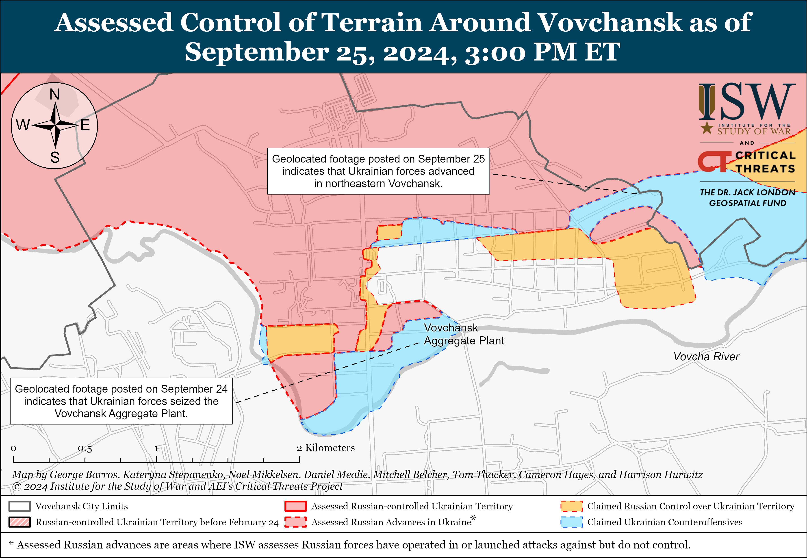**](https://understandingwar.org/wp-content/uploads/2025/05/Vovchansk20Battle20Map20Draft20September20252C202024.png)

**Russian Subordinate Main Effort #2 – Luhansk Oblast** **(Russian objective: Capture the remainder of Luhansk Oblast and push westward into eastern Kharkiv Oblast and northern Donetsk Oblast)**

Russian forces recently advanced along the Kupyansk- Svatove-Kreminna line amid continued offensive operations in the area on September 24 and 25. Geolocated footage published on September 22, 24, and 25 indicates that Russian forces recently advanced westward along the O-130505 highway in northwestern Makiivka and westward to Lenina Street in central Nevske (both northwest of Kreminna).[29] The Ukrainian General Staff reported that Russian forces attacked northeast of Kupyansk near Synkivka; southeast of Kupyansk near Kruhlyakivka and Pishchane; northwest of Svatove near Hlushkivka, Lozova, and Stelmakhivka; west of Svatove near Andriivka; northwest of Kreminna near Makiivka, Novosadove, Cherneshchyna, Druzhelyubivka, Nevske, Zarichne, Terny, and Hrekivka; and west of Kreminna near Torske on September 24 and 25.[30] Elements of the Russian 144th Motorized Rifle Division  (20th Combined Arms Army [CAA], Moscow Military District [MMD]), including its 59th Tank Regiment, are reportedly operating near Nevske.[31] Ukrainian military observer Kostyantyn Mashovets stated on September 25 that elements of the Russian 25th Motorized Rifle Brigade (6th CAA, Leningrad Military District [LMD]) are conducting offensive operations with units of the Russian 1st Guards Tank Army (MMD) along the Kupyansk-Vuzlovy line (immediately east of Kupyansk).[32] Mashovets also noted that elements of the 1st Guards Tank Army’s 4th Tank Division, 47th Tank Division, 2nd Motorized Rifle Division, and 27th Motorized Rifle Brigade (1st GTA, MMD) are advancing towards the Oskil River (southeast of Kupyansk). Mashovets also stated that the Russian 1st Guards Tank Army does not need new or external reinforcements because Russian forces in the area have created a reserve comprised of elements pulled from the Russian 153rd Tank Regiment (47th Tank Division, 1st GTA, MMD); 371st Motorized Rifle Regiment (either a mobilized regiment or a resurrected Soviet-era formation); two other motorized rifle battalions; a combined rifle battalion drawn together from elements of the 4th and 47th Tank Divisions; and the 200th Motorized Rifle Brigade (14th AC, Leningrad Military District [LMD]).

[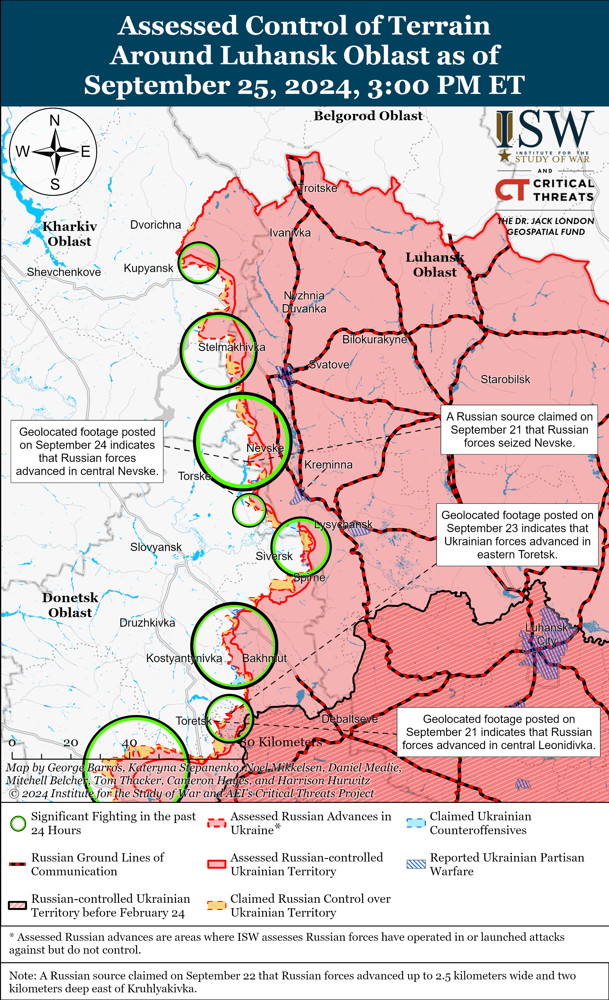](https://understandingwar.org/wp-content/uploads/2025/05/Luhansk20Battle20Map20Draft20September20252C202024.png)

**Russian Subordinate Main Effort #3 – Donetsk Oblast (Russian objective: Capture the entirety of Donetsk Oblast, the claimed territory of Russia’s proxies in Donbas)**

Russian forces continued limited offensive operations northeast of Siversk near Bilohorivka and east of Siversk near Verkhnokamyanske on September 25 but did not make any confirmed advances.[33] Elements of the 39th Radiation, Chemical, and Biological Defense Regiment (3rd Combined Arms Army [CAA], formerly 2nd Luhansk People’s Republic Army Corps [LNR AC]) are reportedly operating in the Siversk direction.[34]

Russian forces continued offensive operations near Chasiv Yar on September 25 but did not make any confirmed advances. Russian milbloggers claimed that Russian forces are advancing in the “Kleshnya” area northwest of Klishchiivka (southeast of Chasiv Yar) and towards Stupochky (south of Chasiv Yar), although ISW has not observed confirmation of Russian advances in these areas.[35] The Ukrainian General Staff reported that Russian forces continued ground attacks north of Chasiv Yar near Kalynivka, Hryhorivka, and Minkivka; southeast of Chasiv Yar near Klishchiivka; and south of Chasiv Yar near Stupochky and Bila Hora.[36]

[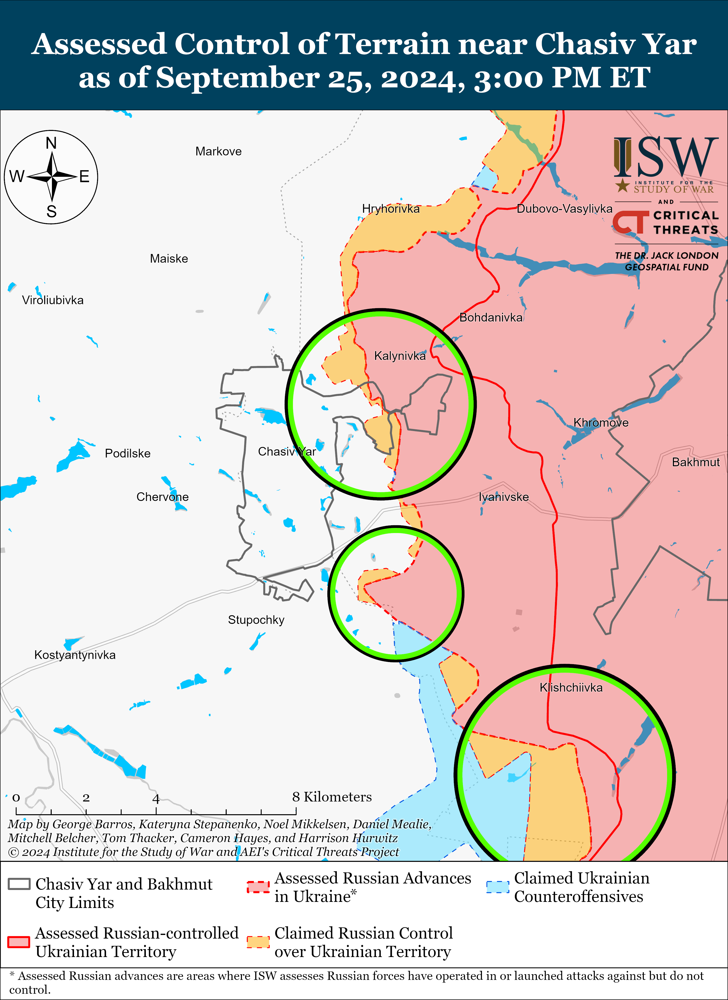](https://understandingwar.org/wp-content/uploads/2025/05/Chasiv20Yar20Battle20Map20Draft20September20252C202024.png)

Russian forces recently made marginal advances in the Toretsk direction. Geolocated footage published on September 24 indicates that Russian forces advanced along Voli Street in northwestern Pivnichne (east of Toretsk).[37] Russian milbloggers claimed on September 24 and 25 that Russian forces are fighting along Lesna Street in Toretsk amid intense fighting in urban areas.[38] The Ukrainian General Staff reported that Russian forces conducted ground attacks near Toretsk; south of Toretsk near Niu York and Nelipivka; and west of Toretsk in the direction of Shcherbynivka.[39]

[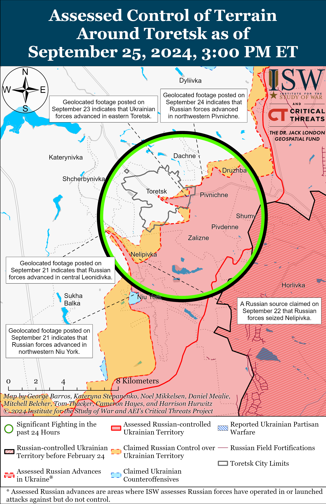](https://understandingwar.org/wp-content/uploads/2025/05/Toretsk20Battle20Map20Draft20September20252C202024.png)

Russian forces recently marginally advanced southeast of Pokrovsk amid continued offensive operations east and southeast of Pokrovsk on September 25. Geolocated footage indicates that Russian forces marginally advanced north of Tsukuryne (southeast of Pokrovsk and south of Selydove), and Russian milbloggers claimed that Russian forces advanced further north and east of the settlement.[40] Russian milbloggers claimed that Russian forces operating southeast of Pokrovsk also advanced further south of Selydove, east of Zhelanne Druhe, and near Nevelske and Ukrainsk.[41] Russian milbloggers claimed that Russian forces are forcing Ukrainian forces out of the Nevelske-Zhelanne Pershe-Zhelanne Druhe pocket (southeast of Selydove) and that Russian forces seized Mykolaivka (east of Pokrovsk and just west of Hrodivka) and are preparing for further offensive operations against Myrnohrad (east of Pokrovsk and northwest of Mykolaivka).[42] Russian forces also continued offensive operations east of Pokrovsk near Zelene Pole, Novotoretske, and Vozdvyzhenka, and southeast of Pokrovsk near Krasnyi Yar, Lysivka, Novohrodivka, Marynivka, and Hirnyk on September 24 and 25.[43] Ukrainian Donetsk Oblast Military Administration Head Vadym Filashkin indicated that Russian forces have destroyed two of the three bridges within Pokrovsk and stated that Russian forces are shelling roads leading from the city.[44]

[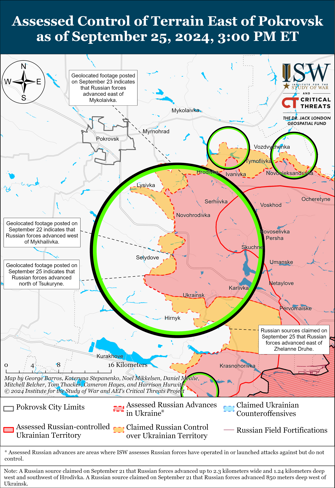](https://understandingwar.org/wp-content/uploads/2025/05/East20of20Pokrovsk20Battle20Map20Draft20September20252C202024.png)

Russian forces reportedly seized Hostre amid continued offensive operations west of Donetsk City on September 25. The Donetsk People’s Republic (DNR) People’s Militia and Russian milbloggers claimed that elements of the Russian 5th Motorized Rifle Brigade seized Hostre (west of Donetsk City) with fire support from elements of the 238th Artillery Brigade (both 51st CAA, formerly 1st DNR AC).[45] Russian milbloggers claimed that Russian forces also advanced further west of Hostre and near Krasnohorivka (immediately northeast of Hostre) and that Russian forces are attempting a tactical encirclement of limited Ukrainian forces operating near a pond between Krasnohorivka and Heorhiivka (southwest of Krasnohorivka).[46] Russian forces also continued ground attacks west of Donetsk City near Katerynivka, Heorhiivka, and Dalnye on September 24 and 25.[47] The second medical group of the Russian 33rd Motorized Rifle Regiment (20th Motorized Rifle Division, 8th CAA, Southern Military District [SMD]) reportedly continues operating in the Kurakhove direction west of Donetsk City.[48]

[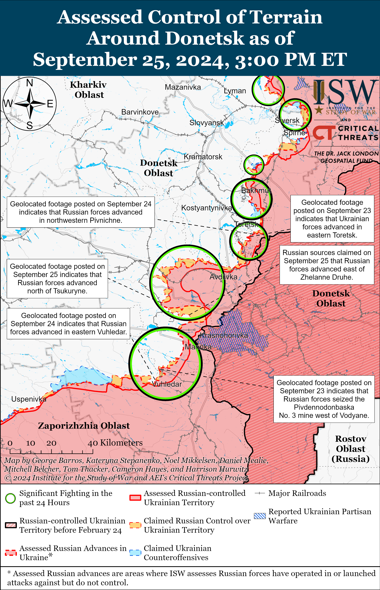](https://understandingwar.org/wp-content/uploads/2025/05/Donetsk20Battle20Map20Draft20September20252C202024.png)

Russian forces reportedly advanced within and around Vuhledar (southwest of Donetsk City) amid continued offensive efforts to seize the settlement. Russian milbloggers claimed on September 24 and 25 that Russian forces captured 13 Desantnykiv Street in eastern Vuhledar and continued to advance on Vuhledar’s western and eastern flanks, including advancing 1.5 kilometers on Vuhledar’s eastern outskirts and two kilometers in depth along a four-kilometer-wide front north of Prechystivka (west of Vuhledar).[49] A milblogger claimed that the Pivdennodonbaska Mine No. 1 northeast of Vuhledar and the area east of the mine is a contested “gray” area, but Ukrainian military observer Kostyantyn Mashovets stated that elements of the Russian 39th Motorized Rifle Brigade (68th AC, Eastern Military District [EMD]) and 430th Motorized Rifle Regiment (likely a mobilized unit) seized the mine itself, advanced close to the eastern outskirts of Vuhledar, and also advanced north of the Kashlahash River west of Vuhledar from Prechsytivka-Pavlivka.[50] The commander of a Ukrainian drone unit operating near Vuhledar stated that Russian forces have stopped assaulting Vuhledar directly and instead are conducting simultaneous offensive operations on Vuhledar’s flanks from Pavlivka, Prechystivka, and Vodyane.[51] Elements of the 430th Motorized Rifle Regiment (likely a mobilized unit) are reportedly also operating south of Vuhledar; scout and drone elements of the 36th Motorized Rifle Brigade (29th CAA, EMD) are reportedly operating east of Vuhledar; and elements of the 14th Spetsnaz Brigade (subordinate to the Russian General Staff’s Main Intelligence Directorate [GRU]) the 3rd battalion of the Russian 57th Motorized Rifle Brigade (6th Motorized Rifle Division, 3rd AC) are also reportedly operating near Vuhledar.[52] Russian and some Western sources stated that elements of the Ukrainian garrison defending Vuhledar have begun to withdraw from the settlement, though Ukrainian officials have not commented on these claims and ISW cannot independently confirm such claims.[53]

[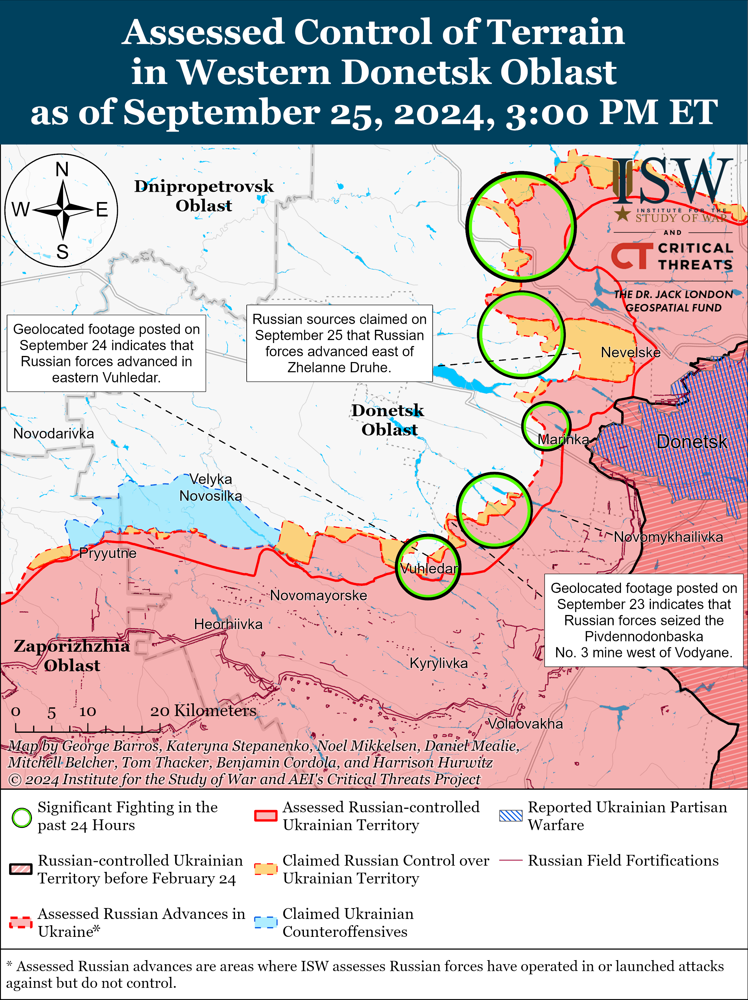](https://understandingwar.org/wp-content/uploads/2025/05/Vremivka20-20Marinka20Battle20Map20Draft20September20252C202024.png)

Russian and Ukrainian sources did not report any fighting in the Donetsk-Zaporizhia Oblast border area on September 25.

**Russian Supporting Effort – Southern Axis** **(Russian objective: Maintain frontline positions and secure rear areas against Ukrainian strikes)**

Positional fighting continued in western Zaporizhzhia Oblast near Novoandriivka (northwest of Robotyne) and Kamyanske (west of Robotyne) on September 25, but there were no confirmed changes to the frontline.[54] Ukrainian forces reportedly conducted a HIMARS strike on September 25 against a Russian command post in an unspecified location in occupied Zaporizhia Oblast.[55] Elements of the Russian 42nd Motorized Rifle Division (58th Combined Arms Army [CAA], Southern Military District [SMD]) are reportedly operating near Orikhiv.[56]

**[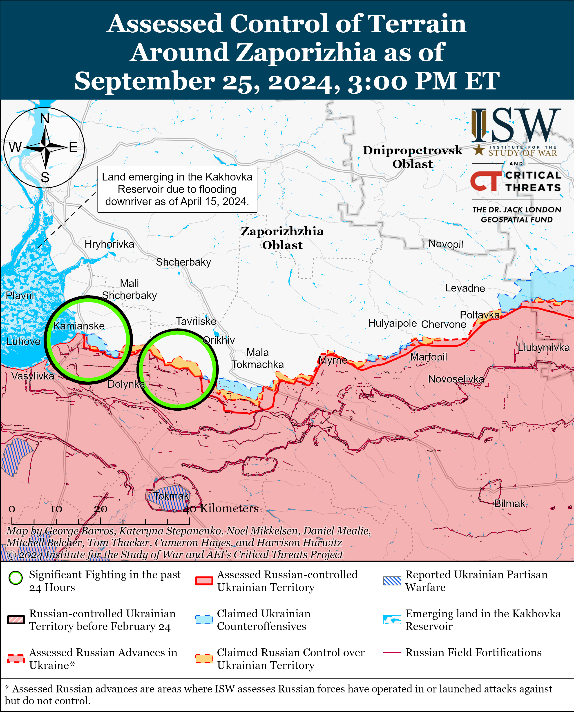](https://understandingwar.org/wp-content/uploads/2025/05/Zaporizhia20Battle20Map20Draft20September20252C202024.png)**

The Ukrainian General Staff stated on September 24 and 25 that Russian forces attacked multiple times in the Kherson direction, likely in reference to left (east bank) of Kherson Oblast and islands in the Dnipro River delta.[57]

[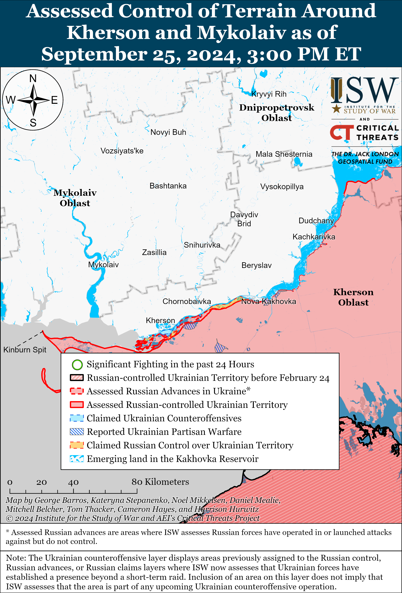](https://understandingwar.org/wp-content/uploads/2025/05/Kherson-Mykolaiv20Battle20Map20Draft20September20252C202024.png)

**Russian Air, Missile, and Drone Campaign** **(Russian Objective: Target Ukrainian military and civilian infrastructure in the rear and on the frontline)**

Russian forces conducted a mid-sized combined drone and missile strike against Ukraine on the night of September 24 to 25. The Ukrainian Air Force reported that Russian forces launched an S-300/400 guided missile and three unspecified missiles at Kharkiv Oblast; four Kh-59/69 guided missiles at Odesa Oblast from airspace over the Black Sea; and 32 Shahed-136/131 drones from Kursk Oblast and Primorsko-Akhtarsk, Krasnodar Krai.[58] Kharkiv Oblast Military Administration Head Oleh Synehubov reported that the S-300/400 missile struck a farm near Bilashi (just northwest of Kharkiv City).[59] Ukrainian forces shot down 28 Shaheds and four Kh-59/69 missiles over Dnipropetrovsk, Kharkiv, Kyiv, Cherkasy, Kirovohrad, Sumy, Poltava, Mykolaiv, Odesa and Kherson oblasts, while four other Shaheds got “lost” in Ukraine and did not reach their targets.[60] Russian milbloggers claimed that the strikes targeted port infrastructure in Yuzhne, Odesa Oblast, but ISW has not observed confirmation of these claims.[61]

**Russian Mobilization and Force Generation Efforts** **(Russian objective: Expand combat power without conducting general mobilization)**

Veterans of Russia’s war in Ukraine continue to commit crimes upon returning to Russia. Russian opposition outlet *Verstka* reported on September 25 that Russian veterans of the war in Ukraine have killed at least 242 civilians and seriously injured another 227 people since the full-scale invasion began in February 2022.[62] *Verstka* reported that Russian penal recruits kill and commit violence against women more frequently than other classes of Russian military personnel. *Verstka* reported that Russian authorities have pardoned or conditionally released at least 246 penal recruits and 180 military personnel for their crimes.

Russian Deputy Defense Minister Pavel Fradkov inspected Pacific Fleet military facilities during a working visit to Russia’s Eastern Military District (EMD) on September 25.[63] Fradkov met with Russian Naval Commander-in-Chief Admiral Alexander Moiseyev and Pacific Fleet Commander-in-Chief Admiral Viktor Liina and inspected the progress of the Russian Ministry of Defense’s (MoD) Military Construction Company. Russian authorities have recently arrested several Russian officials for corruption associated with the construction of major Russian military facilities – including the MoD’s Patriot Park – and Fradkov’s visit to the EMD could be part of Russian Defense Minister Andrei Belousov’s efforts to address and account for corruption within the Russian MoD.[64]

**Russian Technological Adaptations** **(Russian objective: Introduce technological innovations to optimize systems for use in Ukraine)**

Ukrainian defense-focused outlet *Defense Express* reported on September 25 that Ukrainian forces shot down a Russian Shahed-136 drone equipped with a Starlink satellite communication dish—the first shootdown of such a drone variant.[65] *Defense Express* noted that Russian forces have already experimented with installing 4G modems with Ukrainian SIM cards on its longer-range drone to extend the range of Russian drones. ISW has previously highlighted reports of Russian forces using Starlink terminals in Ukraine, likely having purchased them through third-party countries.[66]

**Ukrainian Defense Industrial Efforts** **(Ukrainian objective: Develop its defense industrial base to become more self-sufficient in cooperation with US, European, and international partners)**

*ISW is suspending publishing coverage of Ukrainian defense industrial efforts until further notice.*

**Activities in Russian-occupied areas** **(Russian objective: Consolidate administrative control of annexed areas; forcibly integrate Ukrainian citizens into Russian sociocultural, economic, military, and governance systems)**

*ISW is not publishing coverage of Russian-occupied areas today.*

**Russian Information Operations and Narratives**

Russian Foreign Minister Sergei Lavrov continues to use diplomatic engagements as a platform to further Russian information operations and question the legitimacy of international organizations. Lavrov told Kremlin newswire *TASS* during an interview published on September 25 that the West has helped Ukraine conduct human rights violations against Russian-speakers in Ukraine and that Russia and the People’s Republic of China (PRC) will not allow Western countries to turn the UN Security Council into a “dangerous game.”[67] Lavrov criticized Western countries and the UN for not condemning Ukraine’s incursion into Kursk Oblast and claimed that Russia “need[s] a victory” in Ukraine in order to fully subjugate Ukraine and its people. Lavrov also held a series to bilateral meetings on the sidelines of the UN General Assembly on September 25, including a meeting with PRC Foreign Minister Wang Yi.[68] Russian officials have previously used various diplomatic engagements to further Russian information operations and legitimize Russia’s baselessly claims about supposed Ukrainian violations of international law.[69]

**Significant activity in Belarus** **(Russian efforts to increase its military presence in Belarus and further integrate Belarus into Russian-favorable frameworks and Wagner Group activity in Belarus)**

Nothing significant to report.

**Note: ISW does not receive any classified material from any source, uses only publicly available information, and draws extensively on Russian, Ukrainian, and Western reporting and social media as well as commercially available satellite imagery and other geospatial data as the basis for these reports. References to all sources used are provided in the endnotes of each update.**

---

[1] http://www.kremlin dot ru/events/president/news/75182

[2] https://understandingwar.org/wp-content/uploads/2024/09/May20212C2020242C20Russian20Offensive20Campaign20Assessment20PDF.pdf; https://understandingwar.org/backgrounder/russian-offensive-campaign-assessment-may-31-2024; https://understandingwar.org/backgrounder/russian-offensive-campaign-assessment-june-28-2024

[3] https://isw.pub/UkrWar090824

[4] https://understandingwar.org/backgrounder/russian-offensive-campaign-assessment-september-22-2024 ; https://understandingwar.org/backgrounder/special-report-assessing-putin%E2%80%99s-implicit-nuclear-threats-after-annexation ; https://understandingwar.org/backgrounder/russian-offensive-campaign-assessment-september-8-2024

[5] https://www.cnn.com/2024/09/25/europe/russia-ukraine-nuclear-zelensky-un-intl/index.html; https://www.washingtonpost.com/national-security/2024/09/25/zelensky-un-russia-victory-plan/; https://armyinform dot com.ua/2024/09/25/vijna-rosiyi-proty-ukrayiny-zavershytsya-tomu-shho-zapraczyuye-statut-oon-prezydent/; https://www.president.gov dot ua/news/vijna-rosiyi-proti-ukrayini-zavershitsya-tomu-sho-zapracyuye-93465; https://www.president dot gov.ua/news/ne-mozhe-buti-spravedlivogo-miru-bez-ukrayini-vistup-prezide-93493

[6] https://abcnews.go.com/Politics/ukrainian-president-volodymyr-zelenskyy-discusses-victory-plan-present/story?id=113936347; https://understandingwar.org/backgrounder/russian-offensive-campaign-assessment-september-24-2024

[7] https://www.reuters.com/world/europe/russia-says-ukraine-plans-kursk-nuclear-power-plant-provocation-2024-08-17/; https://www.usatoday.com/story/news/world/ukraine/2024/08/22/ukraine-war-putin-nuclear-plant-updates/74901606007/; https://isw.pub/UkrWar090624 ; https://understandingwar.org/backgrounder/russian-offensive-campaign-assessment-september-9

[8] https://armyinform dot com.ua/2024/09/25/vijna-rosiyi-proty-ukrayiny-zavershytsya-tomu-shho-zapraczyuye-statut-oon-prezydent/; https://www.president.gov dot ua/news/vijna-rosiyi-proti-ukrayini-zavershitsya-tomu-sho-zapracyuye-93465

[9] https://www.reuters.com/world/russia-has-secret-war-drones-project-china-intel-sources-say-2024-09-25/

[10] https://understandingwar.org/backgrounder/russian-offensive-campaign-assessment-september-24-2024

[11] https://understandingwar.org/backgrounder/russian-offensive-campaign-assessment-july-3-2024; https://www.bloomberg.com/news/articles/2024-07-02/china-is-building-and-testing-lethal-attack-drones-for-russia

[12] https://www.reuters.com/world/asia-pacific/russia-china-start-naval-exercises-sea-japan-agencies-report-2024-09-21/; https://isw.pub/UkrWar070324; https://www.bloomberg.com/news/articles/2024-07-02/china-is-building-and-testing-lethal-attack-drones-for-russia

[13] https://www.reuters.com/world/middle-east/iran-brokering-talks-send-advanced-russian-missiles-yemens-houthis-sources-say-2024-09-24/

[14] https://edition.cnn.com/2024/08/02/politics/russia-weapons-houthis-saudi-arabia?cid=ios\_app&fbclid=IwY2xjawEaOVpleHRuA2FlbQIxMAABHeG0-Ne0AhvaKtrd9roLe2bYqH7fVHi2-3n7Nq3Owj2foXHmSR1vJbZKCA\_aem\_VFNJdy\_BoanqWDuV4o-z6g

[15] https://www.wsj.com/world/middle-east/u-s-launches-effort-to-stop-russia-from-arming-houthis-with-antiship-missiles-98131a8a; https://www.reuters.com/world/middle-east/iran-brokering-talks-send-advanced-russian-missiles-yemens-houthis-sources-say-2024-09-24/

[16] https://understandingwar.org/backgrounder/russian-offensive-campaign-assessment-november-11-2023; https://understandingwar.org/backgrounder/russian-offensive-campaign-assessment-november-6-2023; https://understandingwar.org/backgrounder/russian-offensive-campaign-assessment-october-15

[17] https://understandingwar.org/backgrounder/russian-offensive-campaign-assessment-september-18-2024; https://understandingwar.org/backgrounder/russian-offensive-campaign-assessment-february-12-2024

[18] https://t.me/motopatriot/27871 ; https://t.me/dva\_majors/53589  ; https://t.me/RVvoenkor/77623 ; https://t.me/dva\_majors/53550 ; https://t.me/rybar/63806

[19] https://t.me/mod\_russia/43790 ; https://t.me/rybar/63803  ; https://t.me/dva\_majors/53550 ; https://t.me/rybar/63806 ; https://t.me/DnevnikDesantnika/16048

[20] https://tass dot ru/politika/21955107 ; https://t.me/tass\_agency/275067

[21] https://t.me/zvizdecmanhustu/2212;

[22] https://t.me/dva\_majors/53577

[23] https://x.com/AudaxonX/status/1838952375433781411; https://t.me/warhistoryalconafter/186276

[24] https://t.me/rybar/63822; https://t.me/bayraktar1070/2732 ; https://t.me/boris\_rozhin/138530 ; https://t.me/vysokygovorit/17436; https://t.me/boris\_rozhin/138558

[25] https://armyinform dot com.ua/2024/09/25/u-gur-rozpovily-skilky-okupantiv-vdalos-vzyaty-v-polon-na-zavodi-u-vovchansku/; https://suspilne dot media/kharkiv/843919-zvilnenna-agregatnogo-zavodu-u-vovcansku-operacia-planuvalasa-zazdalegid/

[26] https://t.me/DnevnikDesantnika/16025; https://t.me/wargonzo/22297

[27] https://www.facebook.com/GeneralStaff.ua/posts/pfbid038FEX1XhACn3wDUvBySZoVdjNsuFMQoBuyaVsBcKbsrdy7hGYazjgJ6HW47YdJQCKl; https://www.facebook.com/GeneralStaff.ua/posts/pfbid0u3fw23uBmKcZw7KLbKQ754qGNeAoLZsTjju669xn8aiyxB2baUcuT76EdWwctQnHl.

[28] https://t.me/zvizdecmanhustu/2211

[29] https://t.me/creamy\_caprice/6925; https://t.me/seekservice/2053; https://t.me/WarArchive\_ua/20507; https://t.me/creamy\_caprice/6920; https://t.me/ombr66/1248

[30]https://www.facebook.com/GeneralStaff.ua/posts/pfbid038FEX1XhACn3wDUvBySZoVdjNsuFMQoBuyaVsBcKbsrdy7hGYazjgJ6HW47YdJQCKl  ; https://www.facebook.com/GeneralStaff.ua/posts/pfbid0u3fw23uBmKcZw7KLbKQ754qGNeAoLZsTjju669xn8aiyxB2baUcuT76EdWwctQnHl  ; https://www.facebook.com/GeneralStaff.ua/posts/pfbid046eRdVoysQ18Rt4EgLnr1fChrqMP5RP5cfE6nepnmAPU15AvTMma4GEue3BHc2dXl

[31] https://t.me/vysokygovorit/17441 ; https://t.me/epoddubny/21159

[32] https://t.me/zvizdecmanhustu/2213; https://www.facebook.com/pashtetof/posts/pfbid0qECE8GwLsYYuPipCdfUiJcEuZ4sThGanLVQ5fRkp9Wh6AysneJq7m5gzEsg9wfwWl

[33] https://www.facebook.com/GeneralStaff.ua/posts/pfbid0u3fw23uBmKcZw7KLbKQ754qGNeAoLZsTjju669xn8aiyxB2baUcuT76EdWwctQnHl; https://www.facebook.com/GeneralStaff.ua/posts/pfbid046eRdVoysQ18Rt4EgLnr1fChrqMP5RP5cfE6nepnmAPU15AvTMma4GEue3BHc2dXl

[34] https://t.me/sashakots/49178

[35] https://t.me/DnevnikDesantnika/16050; https://t.me/motopatriot/27870

[36]https://www.facebook.com/GeneralStaff.ua/posts/pfbid038FEX1XhACn3wDUvBySZoVdjNsuFMQoBuyaVsBcKbsrdy7hGYazjgJ6HW47YdJQCKl ; https://www.facebook.com/GeneralStaff.ua/posts/pfbid0u3fw23uBmKcZw7KLbKQ754qGNeAoLZsTjju669xn8aiyxB2baUcuT76EdWwctQnHl

[37] https://t.me/creamy\_caprice/6917; https://t.me/rubpak28/387

[38] https://t.me/dva\_majors/53550 ; https://t.me/rybar/63806 ; https://t.me/rybar/63803

[39]https://www.facebook.com/GeneralStaff.ua/posts/pfbid038FEX1XhACn3wDUvBySZoVdjNsuFMQoBuyaVsBcKbsrdy7hGYazjgJ6HW47YdJQCKl ; https://www.facebook.com/GeneralStaff.ua/posts/pfbid0u3fw23uBmKcZw7KLbKQ754qGNeAoLZsTjju669xn8aiyxB2baUcuT76EdWwctQnHl

[40] https://t.me/creamy\_caprice/6923; https://t.me/warhistoryalconafter/186225; https://t.me/z\_arhiv/28232; https://t.me/motopatriot/27860

[41] https://t.me/z\_arhiv/28232; https://t.me/boris\_rozhin/138550; https://t. Me/motopatriot/27860; https://t.me/z\_arhiv/28232; https://t.me/boris\_rozhin/138550

[42] https://t.me/z\_arhiv/28239; https://t.me/voenkorKotenok/59215; https://t.me/dva\_majors/53550 ; https://t.me/rybar/63806; https://t.me/motopatriot/27875; https://t.me/DnevnikDesantnika/16047; https://t.me/rusich\_army/17318

[43] https://www.facebook.com/GeneralStaff.ua/posts/pfbid038FEX1XhACn3wDUvBySZoVdjNsuFMQoBuyaVsBcKbsrdy7hGYazjgJ6HW47YdJQCKl; https://www.facebook.com/GeneralStaff.ua/posts/pfbid0u3fw23uBmKcZw7KLbKQ754qGNeAoLZsTjju669xn8aiyxB2baUcuT76EdWwctQnHl; https://www.facebook.com/GeneralStaff.ua/posts/pfbid046eRdVoysQ18Rt4EgLnr1fChrqMP5RP5cfE6nepnmAPU15AvTMma4GEue3BHc2dXl; https://t.me/dva\_majors/53550 ; https://t.me/rybar/63806

[44] https://armyinform dot com.ua/2024/09/25/drg-rf-namagayutsya-prorvatysya-u-vugledar-na-pidstupah-do-mista-kladovyshhe-spalenoyi-tehniky/

[45] https://t.me/s/DnevnikDesantnika; https://t.me/wargonzo/22297; https://t.me/RVvoenkor/77588; https://t.me/nm\_dnr/12742; https://t.me/nm\_dnr/12750

[46] https://t.me/motopatriot/27851; https://t.me/s/DnevnikDesantnika; https://t.me/z\_arhiv/28232

[47] https://www.facebook.com/GeneralStaff.ua/posts/pfbid038FEX1XhACn3wDUvBySZoVdjNsuFMQoBuyaVsBcKbsrdy7hGYazjgJ6HW47YdJQCKl; https://www.facebook.com/GeneralStaff.ua/posts/pfbid0u3fw23uBmKcZw7KLbKQ754qGNeAoLZsTjju669xn8aiyxB2baUcuT76EdWwctQnHl; https://www.facebook.com/GeneralStaff.ua/posts/pfbid046eRdVoysQ18Rt4EgLnr1fChrqMP5RP5cfE6nepnmAPU15AvTMma4GEue3BHc2dXl

[48] \*Graphic footage\* https://t.me/dva\_majors/53585 ; https://t.me/dva\_majors/53591

[49] https://t.me/DnevnikDesantnika/16040; https://t.me/dva\_majors/53550 ; https://t.me/rybar/63806; https://t.me/motopatriot/27873; https://t.me/rybar/63803; https://t.me/rybar/63800; https://t.me/boris\_rozhin/138550

[50] https://t.me/rybar/63800; https://t.me/zvizdecmanhustu/2211

[51] https://armyinform dot com.ua/2024/09/24/u-sylah-oborony-rozpovily-pro-sytuacziyu-u-vugledari-ta-bezperervni-shturmy-rosiyan/

[52] https://t.me/zvizdecmanhustu/2211; https://t.me/voin\_dv/10978; https://t.me/voin\_dv/10979; https://t.me/RVvoenkor/77618

[53] https://t.me/dva\_majors/53550 ;  https://t.me/rybar/63806; https://www.forbes.com/sites/davidaxe/2024/09/25/ukraines-fortress-in-vuhledar-held-for-31-months-now-its-about-to-fall/ ; https://t.me/RVvoenkor/77601; https://t.me/motopatriot/27852; https://t.me/tass\_agency/274911

[54]https://www.facebook.com/GeneralStaff.ua/posts/pfbid038FEX1XhACn3wDUvBySZoVdjNsuFMQoBuyaVsBcKbsrdy7hGYazjgJ6HW47YdJQCKl

[55] https://armyinform dot com.ua/2024/09/25/spochatku-aviabomby-a-potim-kasetnyj-himars-na-pivdni-roztroshhyly-vorozhyj-komandnyj-punkt/; https://t.me/savelifeua/3094 ; https://t.me/ButusovPlus/13865

[56] https://t.me/ButusovPlus/13868

[57]https://www.facebook.com/GeneralStaff.ua/posts/pfbid0u3fw23uBmKcZw7KLbKQ754qGNeAoLZsTjju669xn8aiyxB2baUcuT76EdWwctQnHl; https://www.facebook.com/GeneralStaff.ua/posts/pfbid046eRdVoysQ18Rt4EgLnr1fChrqMP5RP5cfE6nepnmAPU15AvTMma4GEue3BHc2dXl

[58] https://t.me/kpszsu/19945

[59] https://t.me/synegubov/11331

[60] https://t.me/kpszsu/19945 ; https://www.facebook.com/GeneralStaff.ua/posts/pfbid0U9azCB3HwEFnSK5tKFZPmg343woyiAJaNL7wfBpn4bbSkrUQMjF5Vm5TUUqBJGqtl; https://suspilne dot media/843793-sili-ppo-vnoci-zbili-28-sahediv-i-cotiri-raketi/

[61] https://t.me/dva\_majors/53550 ; https://t.me/rybar/63806 ; https://t.me/DnevnikDesantnika/16020

[62] https://meduza dot io/news/2024/09/25/verstka-v-rezultate-prestupleniy-sovershennyh-vernuvshimisya-uchastnikami-voyny-v-rossii-pogibli-i-postradali-pochti-500-chelovek; https://verstka dot media/veterany-svo-ubili-i-pokalechili-v-rossii-pochti-500-chelovek ; https://t.me/svobodnieslova/5678

[63] https://t.me/mod\_russia/43791

[64] https://isw.pub/UkrWar082924 ; https://isw.pub/UkrWar080524

[65] https://defence-ua dot com/news/rf\_vstanovila\_na\_shahed\_136\_starlink\_ochevidno\_tse\_bulo\_lishe\_pitannja\_chasu-16716.html

[66] https://understandingwar.org/backgrounder/russian-offensive-campaign-assessment-march-26-2024

[67] https://tass dot ru/interviews/21941245; https://t.me/tass\_agency/274934; https://t.me/tass\_agency/274972; https://t.me/tass\_agency/274990; https://t.me/tass\_agency/274857

[68] https://t.me/MID\_Russia/45672 ; https://t.me/MID\_Russia/45673 ; https://t.me/tass\_agency/275060 ; https://t.me/MID\_Russia/45674 ; https://t.me/MID\_Russia/45675 ; https://t.me/tass\_agency/275071 ; https://t.me/tass\_agency/275073 ; https://t.me/tass\_agency/275075; https://t.me/tass\_agency/275086    ; https://t.me/MID\_Russia/45679

[69] https://isw.pub/UkrWar090624 ; https://isw.pub/UkrWar092024 ; https://understandingwar.org/backgrounder/russian-offensive-campaign-assessment-june-17-2024
