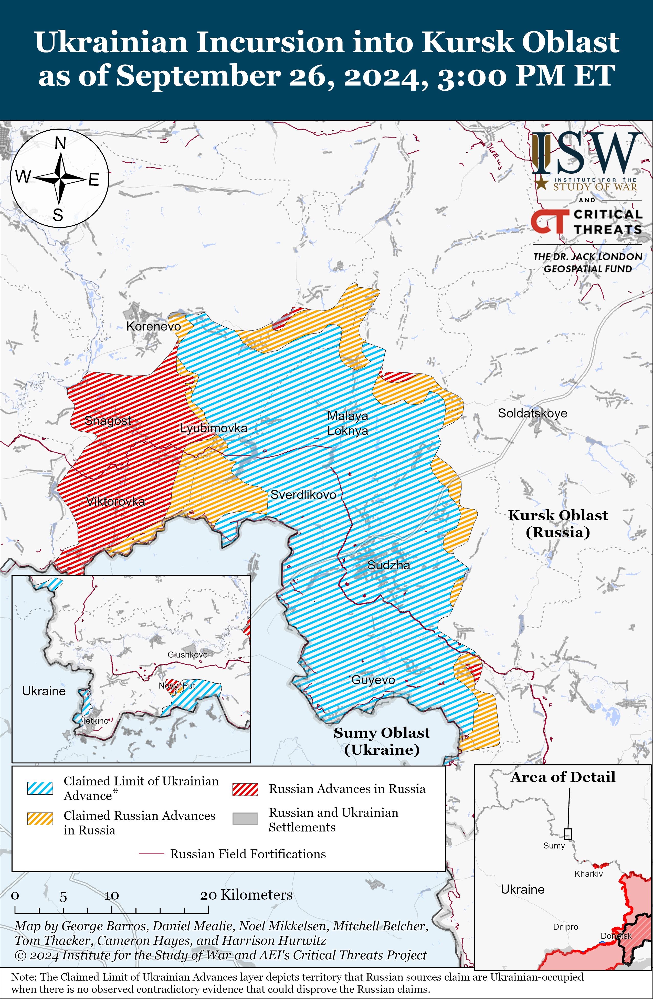
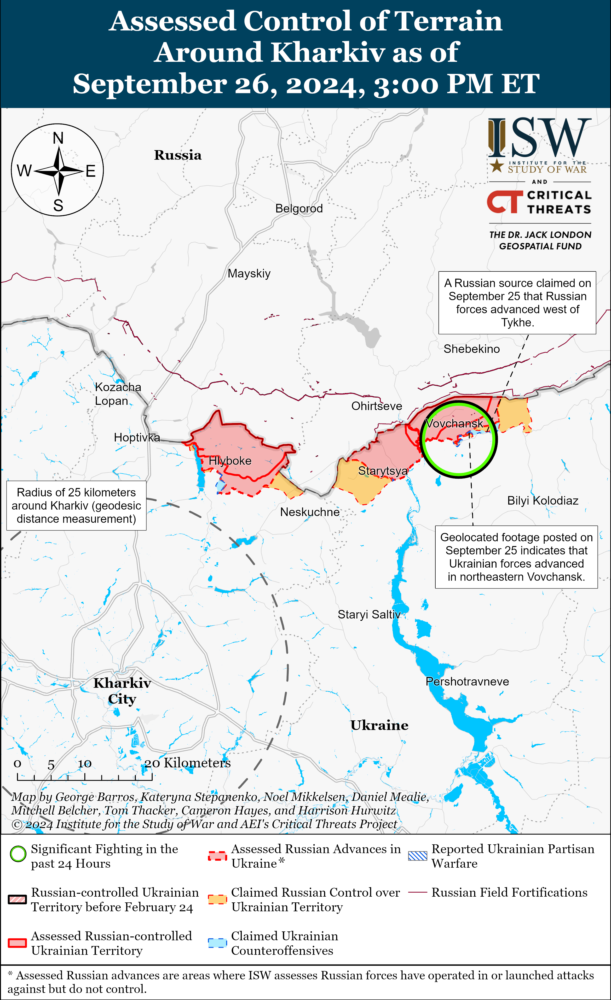
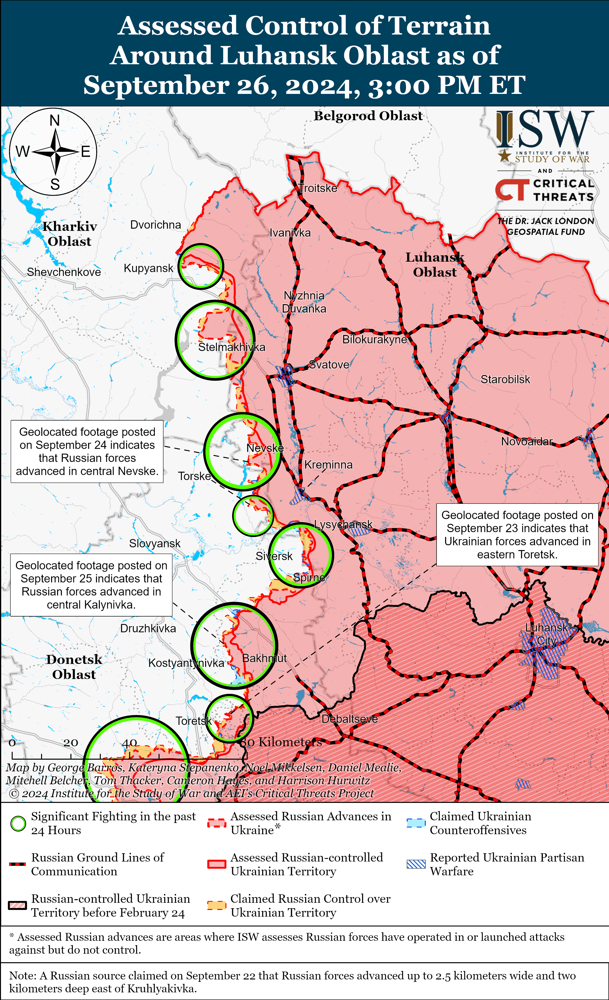
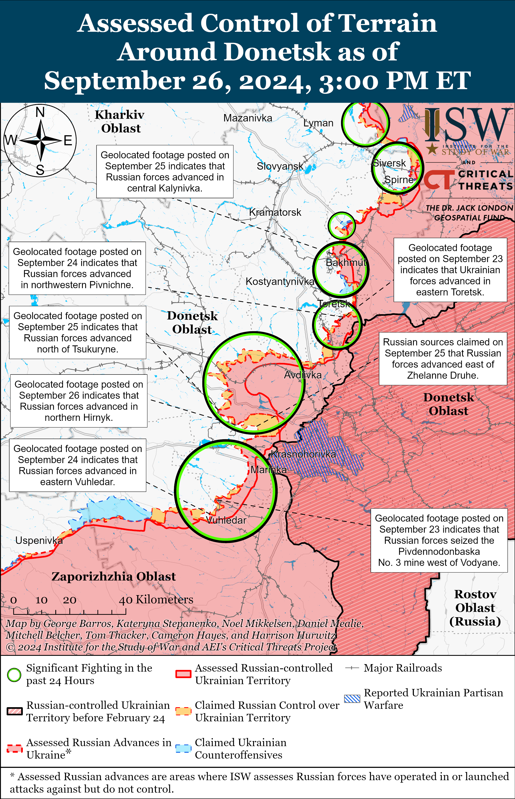
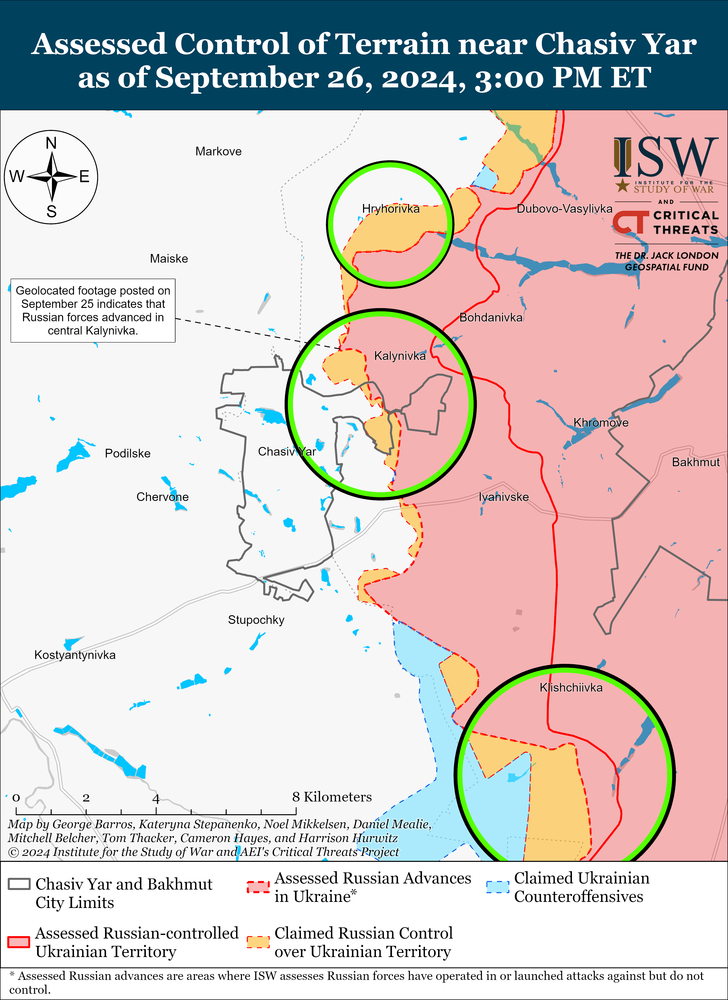
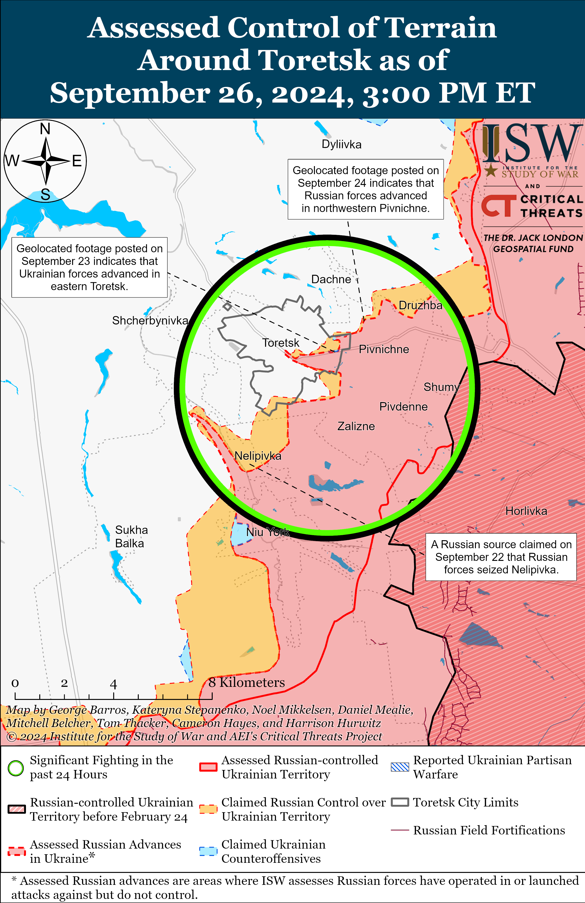
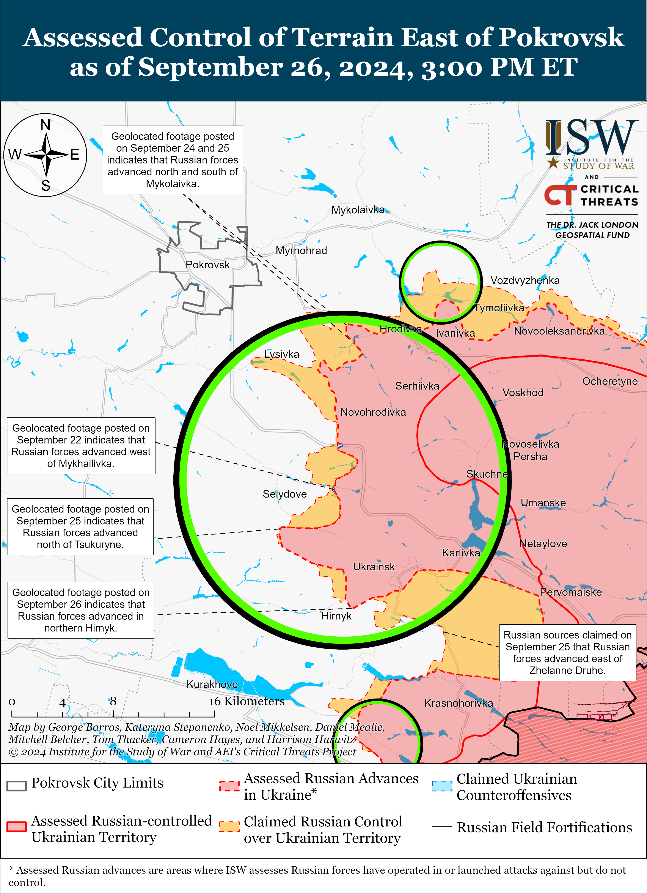
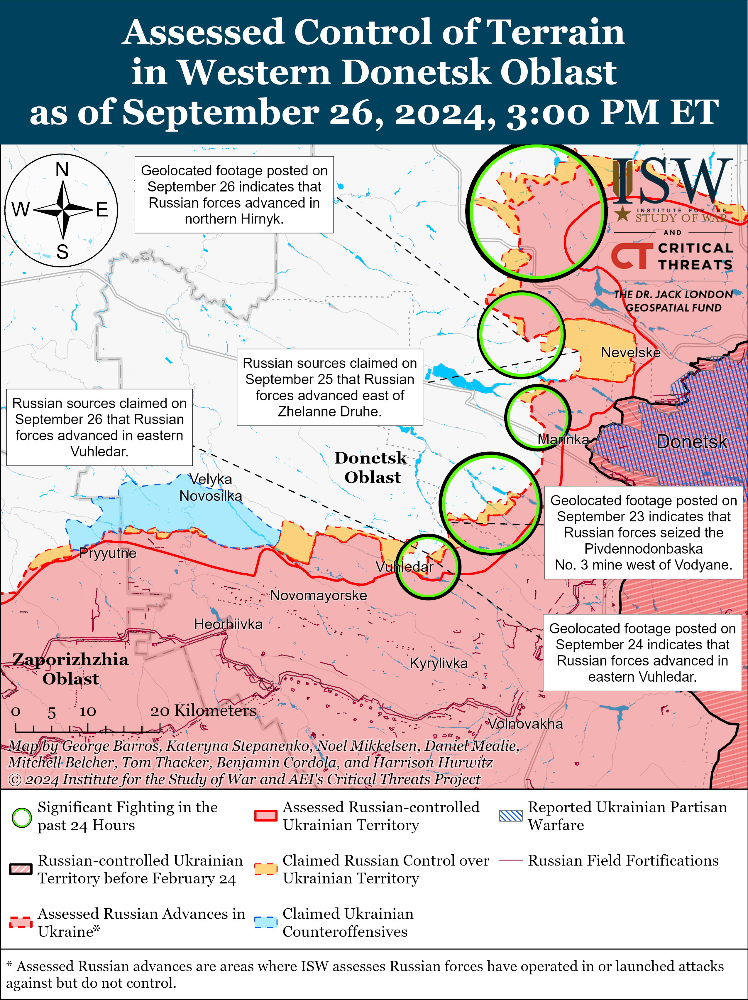
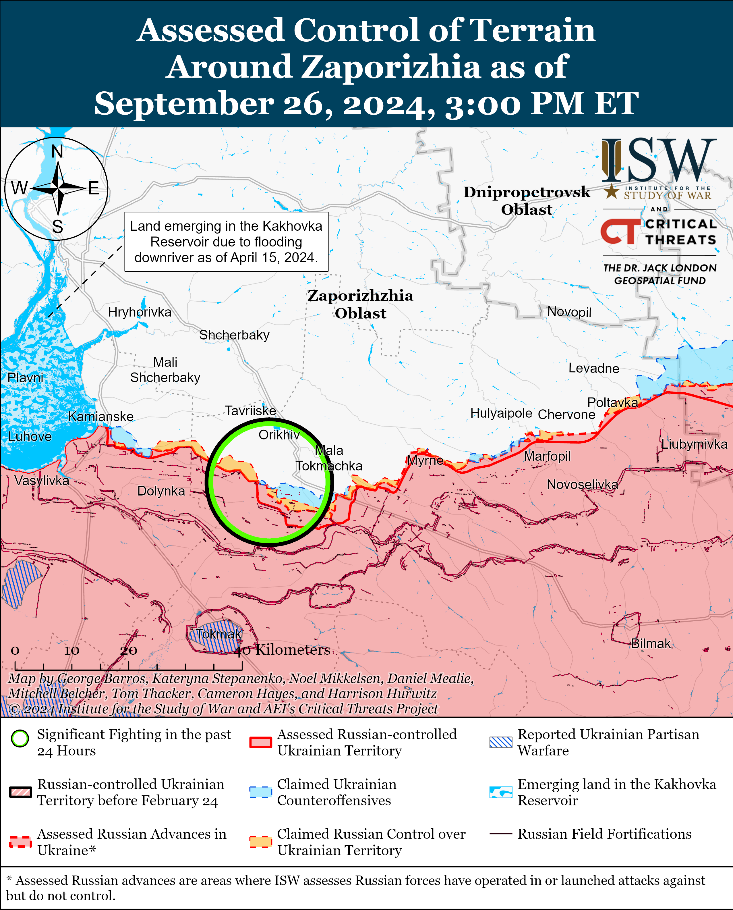
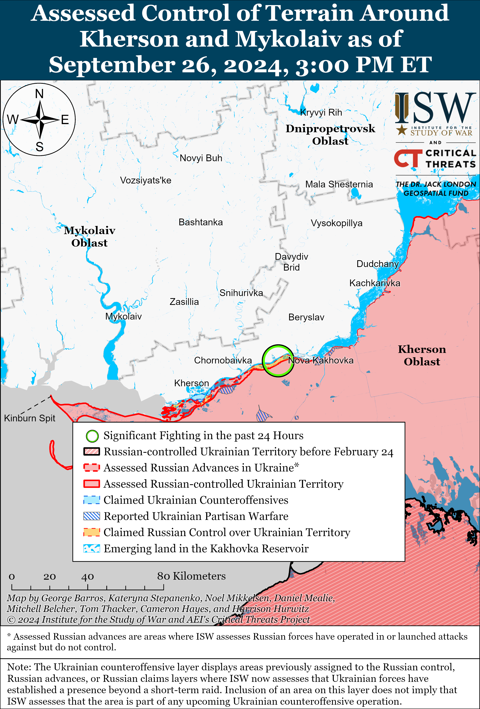

# Russian Offensive Campaign Assessment, September 26, 2024

**Riley Bailey, Angelica Evans, Kateryna Stepanenko, Haley Zehrung, and Frederick W. Kagan**

**September 26, 2024, 5:45pm ET**

**Click** [**here**](https://storymaps.arcgis.com/stories/36a7f6a6f5a9448496de641cf64bd375) **to see ISW’s interactive map of the Russian invasion of Ukraine. This map is updated daily alongside the static maps present in this report.**

**Click** [**here**](https://storymaps.arcgis.com/stories/83a2f24901c941d581c0c523ecd2619b) **to see ISW’s interactive map of Ukraine’s offensive in Kursk Oblast.**

**Click** [**here**](https://understandingwar.maps.arcgis.com/apps/instant/3dviewer/index.html?appid=1602762dbcde419bb957dea358449580) **to see ISW’s 3D control of terrain topographic map of Ukraine. Use of a computer (not a mobile device) is strongly recommended for using this data-heavy tool.**

**Click** [**here**](https://storymaps.arcgis.com/stories/733fe90805894bfc8562d90b106aa895) **to access ISW’s archive of interactive time-lapse maps of the Russian invasion of Ukraine. These maps complement the static control-of-terrain map that ISW produces daily by showing a dynamic frontline. ISW will update this time-lapse map archive monthly.**

**Note: The data cut-off for this product was 1pm ET on September 26. ISW will cover subsequent reports in the September 27 Russian Offensive Campaign Assessment.**

**Germany, France, and the US announced several immediate and more long-term aid packages for Ukraine on September 25 and 26.** The German Ministry of Development announced on September 25 that it will provide support to Ukraine this winter for heat and energy in a package totaling around 70 million euros ($78.2 million).[1] Germany will provide Ukrainian cities and municipalities with combined heat and power plants, boiler systems, generators, and solar-power systems to support communities that have been most affected by heat and electricity shortages resulting from heavy Russian strikes. The German Bundestag also announced on September 25 a 400 million euro ($447 million) increase in military funding for Ukraine to enable the purchase of additional air defense systems, tanks, drones, ammunition, and spare parts.[2] French President Emmanuel Macron said during a meeting with Zelensky on September 25 that France will train and fully equip a Ukrainian brigade in the “near future.”[3]

The US Department of Defense (DoD) announced on September 25 that the Pentagon will send an additional military assistance package to Ukraine worth roughly $375 million and that the package will include: air-to-ground munitions; HIMARS ammunition; 155mm and 105mm artillery ammunition; Tube-launched, Optically-tracked, Wire-guided (TOW) missiles; Javelin and AT-4 anti-armor systems; M1117 armored security vehicles; Mine Resistant Ambush Protected (MRAP) vehicles; light tactical vehicles; armored bridging systems; small arms, patrol boats; demolitions equipment and munitions; and other miscellaneous equipment and support materiel.[4] US President Joe Biden announced on September 26 that he directed the DoD to allocate all of the remaining security assistance funding to Ukraine (roughly $8 billion) by the end of Biden’s presidential term, including funding from the Ukraine Security Assistance Initiative, and that he authorized $5.5 billion in Presidential Drawdown Authority to fund the drawdown of US equipment for Ukraine and replenish US stockpiles.[5] Biden stated that the DoD will also announce an additional assistance package worth $2.4 billion to provide Ukraine with additional air defense systems, unmanned aerial systems, and air-to-ground munitions; strengthen Ukraine’s defense industry; and support Ukraine’s maintenance and sustainment requirements. Biden also announced that the US will provide Ukraine with Joint Standoff Weapon (JOW) long-range munitions, a refurbished Patriot air defense battery, and additional Patriot missiles and will expand F-16 training capabilities to accommodate training 18 additional Ukrainian pilots in 2025. Biden noted that he will also convene a meeting of the Ukraine Defense Contact Group in October 2024 to coordinate further Western support for Ukraine.

**The Russian Federal Security Service (FSB) is reportedly struggling to coordinate combat tasks with the Russian military despite having control over the counterterrorism operation against the Ukrainian incursion in Kursk Oblast.** Russian exiled opposition outlet *Novaya Gazeta Europe* reported on September 25 that it identified an FSB Spetsnaz service member who died fighting in Kursk Oblast in August 2024 — confirming that elements of FSB Spetsnaz are fighting in Kursk Oblast.[6] *Novaya Gazeta Europe* reported that an FSB officer stated that the FSB has tasked FSB Spetsnaz, including elements of the Alpha and Vympel groups, with identifying and destroying Ukrainian sabotage and reconnaissance groups in Kursk Oblast.[7] The FSB officer reportedly stated that the Alpha and Vympel groups are ill-suited for combined arms battles involving heavy equipment against regular military forces, however.[8] FSB Spetsnaz has typically conducted counterterrorism operations against small terrorist groups and likely lacks the training and equipment needed to respond to Ukrainian units conducting combined arms assaults. Another source close to Russian special services reportedly told *Novaya Gazeta Europe* that the FSB’s Special Operations Center does not have a “common connection” with Russian military units and that there is still no common headquarters for coordinating combat tasks between the FSB and the Russian military.[9] Putin tasked the FSB with conducting a counterterrorism operation in Belgorod, Bryansk, and Kursk oblasts on August 9 following the start of the Ukrainian incursion into Kursk Oblast on August 6, but then proceeded to assign overlapping tasks to the Russian Ministry of Defense (MoD), FSB, and Rosgvardia.[10] The Kremlin and the Russian military command have struggled to establish a cohesive and effective command and control (C2) structure during the response to the Ukrainian incursion in Kursk Oblast, and it remains unclear what responsibilities fall under the purview of the FSB’s counterterrorism operation or the MoD’s Coordination Council.[11] ISW has previously assessed that overlapping tasks and poor C2 structures will likely continue to generate friction between the FSB and the Russian MoD.[12]

**Key Takeaways:**

- **Germany, France, and the US announced several immediate and more long-term aid packages for Ukraine on September 25 and 26.**
- **The Russian Federal Security Service (FSB) is reportedly struggling to coordinate combat tasks with the Russian military despite having control over the counterterrorism operation against the Ukrainian incursion in Kursk Oblast.**
- **Russian and Ukrainian forces continued assaults in Kursk Oblast but neither side made further advances in the area.**
- **Russian forces recently advanced north of Kharkiv City and Chasiv Yar and east and southeast of Pokrovsk.**
- **Russian milbloggers criticized the Russian military command for holding joint military exercises with Laos, arguing that such exercises demonstrate that Russia is not learning from its battlefield experience in Ukraine.**

[****](https://understandingwar.org/wp-content/uploads/2025/05/DraftUkraineCoT20September20262C202024.png)

***We do not report in detail on Russian war crimes because these activities are well-covered in Western media and do not directly affect the military operations we are assessing and forecasting. We will continue to evaluate and report on the effects of these criminal activities on the Ukrainian military and the Ukrainian population and specifically on combat in Ukrainian urban areas. We utterly condemn Russian violations of the laws of armed conflict and the Geneva Conventions and crimes against humanity even though we do not describe them in these reports.***

- Ukrainian Operations in the Russian Federation
- Russian Main Effort – Eastern Ukraine (comprised of three subordinate main efforts)
- Russian Subordinate Main Effort #1 – Push Ukrainian forces back from the international border with Belgorod Oblast and approach to within tube artillery range of Kharkiv City
- Russian Subordinate Main Effort #2 – Capture the remainder of Luhansk Oblast and push westward into eastern Kharkiv Oblast and encircle northern Donetsk Oblast
- Russian Subordinate Main Effort #3 – Capture the entirety of Donetsk Oblast
- Russian Supporting Effort – Southern Axis
- Russian Air, Missile, and Drone Campaign
- Russian Mobilization and Force Generation Efforts
- Russian Technological Adaptations
- Activities in Russian-occupied areas
- Ukrainian Defense Industrial Base Efforts
- Russian Information Operations and Narratives
- Significant Activity in Belarus

**Ukrainian Operations in the Russian Federation**

Ukrainian forces continued ground assaults in Glushkovsky Raion, Kursk Oblast on September 26 but did not make any confirmed advances. Russian sources, including the Russian Ministry of Defense (MoD), claimed that Russian forces repelled Ukrainian assaults south of Glushkovo near Novy Put, Veseloye, and Medvezhye.[13] The Russian MoD also claimed that Russian forces also attacked near Novy Put.[14] A Russian milblogger claimed on September 25 that Russian forces repelled a Ukrainian mechanized assault of an unspecified size in the direction of Veseloye (south of Glushkovo).[15]

Ukrainian forces continued assaults in the Ukrainian salient in Kursk Oblast on September 26 but did not make any confirmed advances. The Russian MoD claimed on September 26 that Russian forces repelled a Ukrainian assault in the direction of Obukhovka (south of Korenevo).[16] A Russian milblogger claimed that Ukrainian forces attacked Russian positions on the outskirts of Lyubimovka (southeast of Korenevo) on September 25.[17]

Russian forces continued ground assaults against the Ukrainian salient in Kursk Oblast on September 26 but did not make any confirmed gains. Russian sources, including the Russian MoD, claimed that Russian forces conducted assaults southeast of Korenevo near Lyubimovka, Darino, and Nikolayevo-Daryino and south of Sudzha near Plekhovo on September 25 and 26.[18] The Ukrainian General Staff reported that Russian forces conducted 15 airstrikes with 26 glide bombs against unspecified targets within Kursk Oblast on September 25.[19] Elements of the Russian 83rd Airborne (VDV) Brigade, the 106th VDV Division, the 56th VDV Regiment (7th VDV Division), the 155th Naval Infantry Brigade (Pacific Fleet, Eastern Military District [EMD]), and the 810th Naval Infantry Brigade (Black Sea Fleet, Southern Military District [SMD]) are reportedly operating in Kursk Oblast.[20]

[****](https://understandingwar.org/wp-content/uploads/2025/05/UAF20Kursk20Incursion20September20262C202024.png)

**Russian Main Effort – Eastern Ukraine**

**Russian Subordinate Main Effort #1 – Kharkiv Oblast (Russian objective: Push Ukrainian forces back from the international border with Belgorod Oblast and approach to within tube artillery range of Kharkiv City)**

Russian forces recently reportedly made marginal advances north of Kharkiv City, but there were no confirmed changes to the frontline in northern Kharkiv Oblast on September 26. A Russian milblogger claimed on September 25 that Russian forces advanced roughly 500 meters southward of Hlyboke (north of Kharkiv City) along the Travyanske Reservoir, although ISW has not observed confirmation of this claim.[21] Russian forces continued ground assaults north of Kharkiv City near Lyptsi and Hlyboke and northeast of Kharkiv City near Vovchansk and Tykhe.[22] A Russian milblogger amplified footage purporting to show Russian forces striking the bridge across the Vovcha River along Soborna Street in Vovchansk and claimed that Ukrainian infantry can no longer use the bridge to cross the river.[23] Ukrainian officials reported that unspecified Chechen “Akhmat” forces are operating near Lukyantsi (north of Kharkiv City) and that former Wagner personnel are operating in northern Kharkiv Oblast.[24]

[****](https://understandingwar.org/wp-content/uploads/2025/05/Kharkiv20Battle20Map20Draft20September20262C202024.png)

**Russian Subordinate Main Effort #2 – Luhansk Oblast (Russian objective: Capture the remainder of Luhansk Oblast and push westward into eastern Kharkiv Oblast and northern Donetsk Oblast)**

Russian forces continued offensive operations along the Kupyansk-Svatove-Kreminna line on September 25 and 26 but there were no confirmed changes to the front line. Russian milbloggers claimed on September 25 that Russian forces advanced to a depth of 450 meters in northern Makiivka and that Russian forces have seized most of Nevske (both northwest of Kreminna), but ISW has not observed visual confirmation of these claims.[25] Another Russian source claimed on September 26 that Russian forces advanced north of Pishchane (southeast of Kupyansk) and pushed Ukrainian forces from positions in the direction of Kruhlyakivka (southeast of Kupyansk).[26] The Ukrainian General Staff reported that Russian forces attacked northeast of Kupyansk near Synkivka; east of Kupyansk near Petropavlivka; southeast of Kupyansk near Kolisnykivka; northwest of Svatove near Hlushkivka, Stelmakhivka, Kruhlyakivka, and Lozova; northwest of Kreminna near Novosadove, Hrekivka, Nevske, and Novolyubivka; west of Kreminna near Torske and Zarichne; and southwest of Kreminna in the direction of Yampil on September 25 and 26.[27]

[****](https://understandingwar.org/wp-content/uploads/2025/05/Luhansk20Battle20Map20Draft20September20262C202024.png)

**Russian Subordinate Main Effort #3 – Donetsk Oblast (Russian objective: Capture the entirety of Donetsk Oblast, the claimed territory of Russia’s proxies in Donbas)**

Russian forces continued offensive operations northeast of Siversk near Bilohorivka, east of Siversk near Verkhnokamyanske, and southeast of Siversk near Spirne on September 26, but there were no confirmed changes to the frontline.[28]

Russian forces recently marginally advanced north of Chasiv Yar amid continued fighting in the area on September 26. Geolocated footage published on September 26 indicates that Russian forces recently marginally advanced in western Kalynivka (north of Chasiv Yar).[29] Russian milbloggers claimed that Russian forces also advanced south of Chasiv Yar towards Stupochky, but ISW has not observed confirmation of these claims.[30] Russian forces continued attacks north of Chasiv Yar near Mynkivka and Hryhorivka, near Chasiv Yar itself, southeast of Chasiv Yar near Klishchiivka, and south of Chasiv Yar near Bila Hora on September 25 and 26.[31] Elements of the Russian 17th Artillery Brigade (3rd Army Corps [AC]) are reportedly operating south of Chasiv Yar in the direction of Chervone.[32]

Russian forces continued offensive operations near Toretsk on September 26, but there were no confirmed changes to the frontline. Russian milbloggers claimed that Russian forces marginally advanced within central Toretsk, but ISW has not observed confirmation of these claims.[33] Russian forces continued assaults near Toretsk itself, south of Toretsk near Nelipivka, and southwest of Toretsk near Leonidivka and in the direction of Shcherbynivka on September 25 and 26.[34]

Russian forces recently advanced east and southeast of Pokrovsk amid continued offensive operations near Pokrovsk on September 26. Geolocated footage published on September 24, 25, and 26 indicates that Russian forces recently advanced into eastern Mykolaivka (east of Pokrovsk and just west of Hrodivka), north and northeast of Mykolaivka, and into northern Hirnyk (southeast of Pokrovsk and Selydove).[35] Russian milbloggers claimed that Russian forces also advanced along a railway line north of Tsukuryne (southeast of Pokrovsk), but ISW has not observed confirmation of these claims.[36] The Russian Ministry of Defense (MoD) claimed that Russian forced seized Ukrainsk (southeast of Pokrovsk) on September 26, although ISW assessed that Russian forces likely seized Ukrainsk as of September 17.[37] Russian forces continued offensive operations east of Pokrovsk near Zelene Pole, Novotoretske, Hrodivka, Mykolaivka, and Krutyi Yar and southeast of Pokrovsk near Novohrodivka, Lysivka, Selydove, Marynivka, Tsukuryne, Hirnyk, and Zhelanne Druhe on September 25 and 26.[38]

Russian forces continued offensive operations west of Donetsk City on September 26, but there were no confirmed changes to the frontline. Russian forces continued assaults near Heorhiivka and Maksymilyanivka on September 25 and 26.[39] Russian milbloggers reiterated claims that Russian forces seized Hostre, although ISW has yet to observe confirmation of these claims.[40]

Ukrainian forces maintain positions in Vuhledar and Kostyantynivka amid continued Russian offensive operations southwest of Donetsk City on September 26. The Ukrainian brigade defending in Vuhledar reported that Ukrainian forces are maintaining positions in the settlement in response to recent Western reporting to the contrary.[41] Russian milbloggers claimed that elements of the Russian 29th Combined Arms Army (CAA) (Eastern Military District [EMD]) advanced at least 200 additional meters in eastern Vuhledar, roughly five square kilometers north of Prechystivka (west of Vuhledar), and south of Vodyane (northeast of Vuheldar).[42] ISW has not observed visual confirmation of these claims, however. Russian milbloggers claimed that Russian forces have fire control over all the roads leading to Vuheldar, and ISW has not observed confirmation of these claims either.[43] The spokesperson for a Ukrainian brigade defending near Kostyantynivka reported that Ukrainian forces also maintain defensive positions near the settlement and are defending against ongoing Russian mechanized assaults in the area.[44] A Russian milblogger claimed that Russian forces also advanced in an area 1.1 kilometers in depth and 3 kilometers wide in the direction of Katerynivka (west of Kostyantynivka), but ISW has not observed visual confirmation of that claim.[45] Russian forces also conducted assaults near Kostyantynivka and in the direction of Bohoyavlenka (north of Vuhledar) on September 25 and 26.[46] Elements of the Russian 40th Naval Infantry Brigade (Pacific Fleet, EMD), 14th Guards Spetsnaz Brigade (Russian General Staff’s Main Intelligence Directorate [GRU]), and 36th Motorized Rifle Brigade (29th CAA, EMD) are reportedly operating near Vuhledar.[47]

A Russian milblogger claimed that Russian forces recently advanced north of Staromayorske (south of Velyka Novosilka) amid continued Russian assaults in the Donetsk-Zaporizhia Oblast border area on September 26.[48] Ukrainian Tavriisk Group of Forces Spokesperson Colonel Vladyslav Voloshyn stated on September 26 that the situation in the Donetsk-Zaporizhia Oblast border area may escalate given that Ukrainian intelligence observed Russian forces gathering assault groups near Pryyutne (southwest of Velyka Novosilka) and receiving 25 light vehicles and buggies from the Southern Military District’s (SMD) reserve storage base.[49] Voloshyn stated that these actions indicate that Russia is preparing for renewed assaults in the Donetsk-Zaporizhia Oblast border area.[50]

**Russian Supporting Effort – Southern Axis (Russian objective: Maintain frontline positions and secure rear areas against Ukrainian strikes)**

Positional battles continued in western Zaporizhia Oblast near Robotyne and Novoandriivka (northwest of Robotyne) on September 25 and 26, but there were no confirmed changes on the frontlines.[51] Russian milbloggers claimed that elements of the Russian 503rd Motorized Rifle Regiment (19th Motorized Rifle Division, 58th Combined Arms Army [CAA], Southern Military District [SMD]), 239th Separate Reconnaissance Battalion (presumably part of the 19th Motorized Rifle Division), and North Ossetian ”Alania” battalion advanced north of Nesteryanka (northwest of Robotyne).[52] A Russian milblogger noted that elements of the Russian 42nd Motorized Rifle Division (58th CAA) are improving unspecified tactical positions in western Zaporizhia Oblast.[53] The milblogger also claimed that Ukraine’s large frontline defensive areas in Zaporizhia Oblast — Orikhiv and Hulyaipole — are almost completely defenseless against Russian glide bomb strikes and that Russian aviation can easily conduct glide bomb strikes all the way up to Zaporizhzhia City.[54] Elements of the 2nd Company of the Russian 70th Motorized Rifle Regiment (42nd Motorized Rifle Division) are reportedly operating in the Zaporizhia direction.[55] Geolocated footage published on September 25 indicates that Ukrainian forces struck a Russian command post and living quarters in Novohrodivka (northwest of Tokmak).[56]

The Ukrainian General Staff stated on September 24 and 25 that Russian forces attacked multiple times in the Dnipro (Kherson) direction, likely in reference to east (left) bank Kherson Oblast and the islands in the Dnipro River delta.[57]

Ukrainian Navy Spokesperson Captain Third Rank Dmytro Pletenchuk stated on September 26 that Russian forces continued to construct a “mysterious” structure next to the Kerch Strait Bridge.[58] Pletenchuk speculated that the structure may be either a hydrotechnical or barrier structure, and that the purpose of the structure will be clear after its completion. Pletenchuk added that Russian forces are unlikely to finish this construction prior to the start of the stormy season, which complicates any construction efforts.

**Russian Air, Missile, and Drone Campaign (Russian Objective: Target Ukrainian military and civilian infrastructure in the rear and on the frontline)**

Russian forces launched a series of missile and drone strikes against Ukraine on the night of September 25 to 25. The Ukrainian Air Force reported on September 26 that Russian forces launched two unidentified missiles from Belgorod Oblast at Sumy Oblast; four Kh-59/69 cruise missiles at Odesa Oblast from over the Black Sea; and 78 Shahed-136/131 drones from Primorsko-Akhtarsk, Oryol Oblast, and Kursk Oblast.[59] Ukrainian forces reportedly shot down all four Kh-59/69 missiles and 66 Shaheds. The Ukrainian Air Force noted that eight Shaheds were lost over several unspecified oblasts, one Shahed returned to Russia, and the remaining Shahed remained in Ukrainian airspace as of 0900 local time.[60] The Ukrainian Air Force later reported that Russian forces also conducted three launches of an unspecified number of Kh-47 M2 Kinzhal ballistic missiles from four MiG-31K supersonic interceptor aircraft in Russian airspace towards Starokostyantyniv, Khmelnytskyi Oblast.[61] The Ukrainian Air Force did not disclose the result of the Russian strikes, but Ukrainian sources reported a series of explosions in the area.[62] Russian milbloggers claimed that Russian Aerospace Forces (VKS) struck the Starokostyantyniv Airfield and destroyed two F-16 fighter jets, but did not provide visual confirmation of these claims.[63] Ukrainian regional officials reported that Russian drone strikes resulted in damage to energy infrastructure in Ivano-Frankivsk and Mykolaiv oblasts, and Ukrainian Prime Minister Denys Shmyhal reported that Russian forces attacked three electricity transmission facilities with drones and missiles.[64] Ukraine’s state nuclear enterprise Energoatom reported that a Russian drone strike flew at a ”critically low altitude” near the industrial site of the Rivne Nuclear Power Plant.[65] Independent Belarusian monitoring group *The Hajun Project,* citing Ukrainian monitoring groups, reported thatat least four Shahed drones entered Belarusian airspace on the night of September 25 to 26, with at least one flying from Russian territory and the rest from Ukraine.[66]

**Russian Mobilization and Force Generation Efforts (Russian objective: Expand combat power without conducting general mobilization)**

Russian milbloggers criticized the Russian military command for holding joint military exercises with Laos, arguing that such exercises demonstrate that Russia is not learning from its battlefield experience in Ukraine. The Russian Ministry of Defense (MoD) announced that Russia and Laos concluded the joint “Laros-2024” military exercises on September 26 and that the final exercise practiced joint operations to eliminate terrorists.[67] Russia and Laos began joint military exercises on September 18 in Primorsky Krai.[68] Russian milbloggers claimed that these joint military exercises only teach Russian personnel poor fighting tactics and criticized the Russian military for not incorporating drones into the exercises.[69] One milblogger claimed that the Russian military command continues to train Russian military units with outdated material that excludes drone training and other lessons learned from Russia’s full-scale invasion of Ukraine.[70] The Russian MoD, however, reported on September 26 that Russia’s Pacific Fleet continued joint exercises with the People’s Liberation Army (PLA) Navy in the Sea of Okhotsk on September 26, including training to repel a mock attack with unmanned boats.[71]

Russian state media continued efforts to absolve the commander of the 87th Separate Rifle Regiment (1st “Slavic” Motorized Rifle Brigade, 51st Combined Arms Army [CAA], formerly 1st Donetsk People’s Republic Army Corps [DNR AC]) of any responsibility for the death of two prominent drone operators – Junior Sergeant Dmitry Lysakovsky (alias Goodwin) and Lieutenant Colonel Sergey Gritsai (alias Ernest).[72] Russian milbloggers amplified a clip of Russian propagandist Vladmir Solovyov justifying the commander’s decision to disband Lysakovsky’s and Gritsai’s specialized, decentralized drone platoon as ”restoring order” in the brigade.[73] ISW continues to assess that the Russian military command had been indiscriminately committing specialists to grinding assault operations, partly in support of Russia’s ongoing force centralization efforts and in an attempt to maintain the offensive tempo in eastern Ukraine.[74]

The Russian government is continuing efforts to address persistent labor and demographic shortages. The Russian Ministry of Labor proposed to reduce the list of restricted positions and industries for women, including working in active mines.[75] A Russian insider source claimed that the Kremlin is supportive of Presidential Aide Vladimir Medynsky’s proposal to reduce the length of the school education to educate specialists within a shorter timeframe.[76] The insider source claimed that the main reason behind the proposed educational reforms is the technological changes in the labor market.

The Russian MoD continues to posture as providing adequate medical care to wounded Russian veterans. Deputy Defense Minister Pavel Fradkov visited medical facilities of the Eastern Military District (EMD) in Yuzhno-Sakhalinsk, Sakhalin Oblast on September 26.[77]

**Russian Technological Adaptations (Russian objective: Introduce technological innovations to optimize systems for use in Ukraine)**

The Russian government plans to designate over 200 unmanned aerial vehicle (UAVs) takeoff and landing zones, including at small Russian airfields, over the next six years. Russian state business outlet *Vedomosti,* citing the Russian federal project titled “Development of infrastructure, ensuring security and formation of a specialized certification system for UAVs,” reported that Russia seeks to establish 241 areas for receiving and operating drones, of which 49 would be established at Russian airfields by 2030.[78] *Vedomosti* reported that Russia has allocated about five billion rubles (almost $54 million) from the federal budget to construct these areas and that the Russian government approved this project in late 2023. *Vedomosti* estimated in August 2023 that the entire project would cost 900 billion rubles ($9.7 billion) to complete by 2030.

Russian experts are reportedly creating a theoretical guide to help defend Russian infrastructure from UAVs, although Russian security experts remain skeptical that Russia will adopt these theories into practice.[79] A Russian insider source claimed that experts from various Russian institutes; state-owned defense conglomerate Rostec; ministries of transport, construction, industry and trade, and emergency services; petrochemical companies Sibur and Transneft; and power company Rosseti published an official set of rules to protect Russian power stations, storage facilities, reactors, and other critical infrastructure from Ukrainian drone strikes. Russian security and construction experts told the insider source that this guide is unlikely to have a long-term practical application given the high-pace of the UAV development cycle.

**Ukrainian Defense Industrial Efforts (Ukrainian objective: Develop its defense industrial base to become more self-sufficient in cooperation with US, European, and international partners)**

*ISW is suspending publishing coverage of Ukrainian defense industrial efforts until further notice.*

**Activities in Russian-occupied areas (Russian objective: Consolidate administrative control of annexed areas; forcibly integrate Ukrainian citizens into Russian sociocultural, economic, military, and governance systems)**

*ISW is not publishing coverage of Russian-occupied areas today.*

**Russian Information Operations and Narratives**

Russian Security Council Deputy Chairperson Dmitry Medvedev and Kremlin Spokesperson Dmitry Peskov continued promoting rhetoric threatening the West with nuclear escalation following Putin’s September 25 attempt to use “clarifications” to Russia’s nuclear doctrine to influence Western decision-making.[80] ISW has long identified Russia’s nuclear saber-rattling as part of the Kremlin’s effort to promote Western self-deterrence and not as indicative of Russia’s willingness to use nuclear weapons.[81] ISW continues to assess that Russia is very unlikely to use nuclear weapons in Ukraine or elsewhere.[82]

Russian officials continue to accuse the West of human rights violations in an effort to distract from Russia’s own human rights violations. The Russian Ministry of Foreign Affairs (MFA) released a report on September 26 alleging that Denmark, Canada, Norway, the US, Finland, Sweden, Australia, New Zealand, and Japan are actively violating the rights of indigenous peoples and that the West is now falsely accusing Russia of infringing on the rights of its own indigenous peoples.[83] The MFA routinely releases reports accusing Western countries of violating human rights, but the focus on indigenous peoples likely aims to support the Kremlin’s efforts to portray Russia as a harmonious multi-ethnic country despite the growing anti-migrant and ultranationalist sentiments in Russia.

**Significant activity in Belarus (Russian efforts to increase its military presence in Belarus and further integrate Belarus into Russian-favorable frameworks and Wagner Group activity in Belarus)**

The Belarusian Ministry of Defense (MoD) announced on September 26 that the peacekeeping company of the 103rd Vitebsk Separate Guards Airborne Brigade is traveling to Kazakhstan to participate in the “Indestructible Brotherhood-2024” command and staff exercises of the Russian-led Collective Security Treaty Organization’s (CSTO) Collective Peacekeeping Forces.[84] The Belarusian MoD stated that Belarusian Special Operations Forces Deputy Commander Colonel Alexei Yelfimov will lead the peacekeeping contingent in the exercises scheduled at the “Bereg” training ground in Almaty Oblast.[85]

**Note: ISW does not receive any classified material from any source, uses only publicly available information, and draws extensively on Russian, Ukrainian, and Western reporting and social media as well as commercially available satellite imagery and other geospatial data as the basis for these reports. References to all sources used are provided in the endnotes of each update.**

---

[1] https://www.bmz dot de/de/aktuelles/aktuelle-meldungen/waerme-fuer-den-winter-in-der-ukraine-226122 ; https://suspilne dot media/844985-nimeccina-vidilila-70-mln-evro-dla-pidtrimki-ukrainskoi-energetiki-vzimku/

[2] https://www.bundesregierung dot de/breg-de/aktuelles/zweites-treffen-der-teilnehmer-des-ukraine-compact-in-new-york-2311578; https://suspilne dot media/845143-parlament-frn-pogodiv-vidilenna-dodatkovih-400-mln-evro-na-vijskovu-pidtrimku-ukraini/

[3] https://armyinform dot com.ua/2024/09/25/posylennya-ppo-ta-pidgotovka-ukrayinskoyi-brygady-peregovory-volodymyra-zelenskogo-ta-emmanyuelya-makrona/; https://www.president dot gov.ua/news/franciya-pidgotuye-ukrayinsku-brigadu-peregovori-volodimira-93509

[4] https://www.defense.gov/News/Releases/Release/Article/3917590/biden-administration-announces-additional-security-assistance-for-ukraine/

[5] https://www.whitehouse.gov/briefing-room/statements-releases/2024/09/26/statement-from-president-joe-biden-on-u-s-support-for-ukraine/

[6] https://novayagazeta dot eu/articles/2024/09/25/u-spetsnaza-fsb-est-poteri-v-kurskoi-oblasti

[7] https://novayagazeta dot eu/articles/2024/09/25/u-spetsnaza-fsb-est-poteri-v-kurskoi-oblasti

[8] https://novayagazeta dot eu/articles/2024/09/25/u-spetsnaza-fsb-est-poteri-v-kurskoi-oblasti

[9] https://novayagazeta dot eu/articles/2024/09/25/u-spetsnaza-fsb-est-poteri-v-kurskoi-oblasti

[10] https://understandingwar.org/backgrounder/russian-offensive-campaign-assessment-august-15-2024

[11] https://isw.pub/UkrWar082024 ; https://understandingwar.org/backgrounder/russian-offensive-campaign-assessment-august-15-2024

[12] https://isw.pub/UkrWar082024 ; https://understandingwar.org/backgrounder/russian-offensive-campaign-assessment-august-15-2024 ; https://isw.pub/UkrWar081024

[13] https://t.me/mod\_russia/43820

[14] https://t.me/mod\_russia/43820 ; https://t.me/dva\_majors/53639

[15] https://t.me/rybar/63832

[16] https://t.me/mod\_russia/43820

[17] https://t.me/rybar/63832

[18] https://t.me/mod\_russia/43820 ; https://t.me/dva\_majors/53639 ; https://t.me/rybar/63832

[19] https://www.facebook.com/GeneralStaff.ua/posts/pfbid02zTegYjWBEcN4cStBgbV3oHYNxsMYoVgP6Bo8QEAQa6AwJvbncjy6fS7hsqvwFbhDl

[20] https://t.me/rusich\_army/17324 ; https://t.me/voin\_dv/10993 ; https://t.me/rusich\_army/17322 ; https://t.me/DnevnikDesantnika/16068 ; https://t.me/wargonzo/22311

[21] https://t.me/DnevnikDesantnika/16056

[22] https://www.facebook.com/GeneralStaff.ua/posts/pfbid0hf4TsM9ZtynauX7tPUWF9QU12D6LUSMwByM7aUiZKeWgMpBnG96eGtvPY38cQMiGl ; https://www.facebook.com/GeneralStaff.ua/posts/pfbid0dq9Q1XXXSzVWTafLsEq8JgUAGGJDfQg4ix1RWwMKr6nSfG5Zyo3BkHKjdRpSDdKml ; https://www.facebook.com/GeneralStaff.ua/posts/pfbid02zTegYjWBEcN4cStBgbV3oHYNxsMYoVgP6Bo8QEAQa6AwJvbncjy6fS7hsqvwFbhDl ; https://t.me/wargonzo/22313 ; https://t.me/dva\_majors/53639

[23] https://t.me/boris\_rozhin/138711

[24] https://armyinform dot com.ua/2024/09/26/zbirna-solyanka-kym-voyuye-rosiya-na-pivnochi-harkivshhyny/ ; https://t.me/otukharkiv/1625

[25] https://t.me/RVvoenkor/77645; https://t.me/motopatriot/27929

[26] https://t.me/rusich\_army/17333

[27]https://www.facebook.com/GeneralStaff.ua/posts/pfbid0hf4TsM9ZtynauX7tPUWF9QU12D6LUSMwByM7aUiZKeWgMpBnG96eGtvPY38cQMiGl; https://www.facebook.com/GeneralStaff.ua/posts/pfbid0dq9Q1XXXSzVWTafLsEq8JgUAGGJDfQg4ix1RWwMKr6nSfG5Zyo3BkHKjdRpSDdKml; https://www.facebook.com/GeneralStaff.ua/posts/pfbid02zTegYjWBEcN4cStBgbV3oHYNxsMYoVgP6Bo8QEAQa6AwJvbncjy6fS7hsqvwFbhDl

[28] https://www.facebook.com/GeneralStaff.ua/posts/pfbid0hf4TsM9ZtynauX7tPUWF9QU12D6LUSMwByM7aUiZKeWgMpBnG96eGtvPY38cQMiGl

[29] https://t.me/YasniOchiUa/79; https://t.me/creamy\_caprice/6938

[30] https://t.me/DnevnikDesantnika/16056

[31] https://www.facebook.com/GeneralStaff.ua/posts/pfbid0hf4TsM9ZtynauX7tPUWF9QU12D6LUSMwByM7aUiZKeWgMpBnG96eGtvPY38cQMiGl ; https://www.facebook.com/GeneralStaff.ua/posts/pfbid0dq9Q1XXXSzVWTafLsEq8JgUAGGJDfQg4ix1RWwMKr6nSfG5Zyo3BkHKjdRpSDdKml ; https://www.facebook.com/GeneralStaff.ua/posts/pfbid02zTegYjWBEcN4cStBgbV3oHYNxsMYoVgP6Bo8QEAQa6AwJvbncjy6fS7hsqvwFbhDl ; https://t.me/wargonzo/22313

[32] https://t.me/boris\_rozhin/138723

[33] https://t.me/motopatriot/27935 ; https://t.me/motopatriot/27939 ; https://t.me/wargonzo/22313

[34] https://www.facebook.com/GeneralStaff.ua/posts/pfbid0hf4TsM9ZtynauX7tPUWF9QU12D6LUSMwByM7aUiZKeWgMpBnG96eGtvPY38cQMiGl ; https://www.facebook.com/GeneralStaff.ua/posts/pfbid0dq9Q1XXXSzVWTafLsEq8JgUAGGJDfQg4ix1RWwMKr6nSfG5Zyo3BkHKjdRpSDdKml ; https://www.facebook.com/GeneralStaff.ua/posts/pfbid02zTegYjWBEcN4cStBgbV3oHYNxsMYoVgP6Bo8QEAQa6AwJvbncjy6fS7hsqvwFbhDl

[35] https://t.me/BRODIAHY\_UKR/233; https://t.me/creamy\_caprice/6934 ; https://t.me/dva\_majors/53612; https://t.me/creamy\_caprice/6926 ; https://t.me/RVvoenkor/77673; https://t.me/creamy\_caprice/6936

[36] https://t.me/DnevnikDesantnika/16052 ; https://t.me/DnevnikDesantnika/16056 ;

[37] https://t.me/mod\_russia/43816 ; https://understandingwar.org/backgrounder/russian-offensive-campaign-assessment-september-17-2024

[38] https://www.facebook.com/GeneralStaff.ua/posts/pfbid0hf4TsM9ZtynauX7tPUWF9QU12D6LUSMwByM7aUiZKeWgMpBnG96eGtvPY38cQMiGl ; https://www.facebook.com/GeneralStaff.ua/posts/pfbid0dq9Q1XXXSzVWTafLsEq8JgUAGGJDfQg4ix1RWwMKr6nSfG5Zyo3BkHKjdRpSDdKml ; https://www.facebook.com/GeneralStaff.ua/posts/pfbid02zTegYjWBEcN4cStBgbV3oHYNxsMYoVgP6Bo8QEAQa6AwJvbncjy6fS7hsqvwFbhDl ; https://t.me/dva\_majors/53639 ; https://t.me/wargonzo/22313

[39] https://www.facebook.com/GeneralStaff.ua/posts/pfbid0dq9Q1XXXSzVWTafLsEq8JgUAGGJDfQg4ix1RWwMKr6nSfG5Zyo3BkHKjdRpSDdKml ; https://www.facebook.com/GeneralStaff.ua/posts/pfbid02zTegYjWBEcN4cStBgbV3oHYNxsMYoVgP6Bo8QEAQa6AwJvbncjy6fS7hsqvwFbhDl

[40] https://t.me/RVvoenkor/77627 ; https://t.me/DnevnikDesantnika/16056

[41] https://armyinform dot com.ua/2024/09/26/chorni-zaporozhczi-zayavyly-shho-zalyshayutsya-u-vugledari/; https://t.me/ombr72/10296 ; https://understandingwar.org/backgrounder/russian-offensive-campaign-assessment-september-25-2024

[42] https://t.me/dva\_majors/53639 ; https://t.me/wargonzo/22313 ; https://t.me/motopatriot/27915 ; https://t.me/motopatriot/27950 ; https://t.me/boris\_rozhin/138697 ; https://t.me/zovpobedy/13227 ; https://t.me/DnevnikDesantnika/16051 ; https://t.me/warreportss/1731 ; https://t.me/boris\_rozhin/138630 ; https://t.me/don\_partizan/5489 ; https://t.me/boris\_rozhin/138716

[43] https://t.me/epoddubny/21171 ; https://t.me/smotri\_z/34929 ; https://t.me/sashakots/49198

[44] https://suspilne dot media/donbas/845035-linia-frontu-zalisaetsa-stijkou-79-brigada-trimae-selo-miz-vugledarom-ta-kostantinivkou/

[45] https://t.me/RVvoenkor/77645

[46] https://www.facebook.com/GeneralStaff.ua/posts/pfbid0hf4TsM9ZtynauX7tPUWF9QU12D6LUSMwByM7aUiZKeWgMpBnG96eGtvPY38cQMiGl ; https://www.facebook.com/GeneralStaff.ua/posts/pfbid0dq9Q1XXXSzVWTafLsEq8JgUAGGJDfQg4ix1RWwMKr6nSfG5Zyo3BkHKjdRpSDdKml ; https://t.me/RVvoenkor/77645 ; https://t.me/NgP\_raZVedka/19128

[47] https://t.me/boris\_rozhin/138719 ; https://t.me/voin\_dv/11002 ; https://t.me/voin\_dv/10996

[48] https://t.me/RVvoenkor/77645 ; https://t.me/motopatriot/27919

[49] https://armyinform dot com.ua/2024/09/26/na-pivdni-vorog-hoche-shturmuvaty-ukrayinski-pozycziyi-na-baggi/

[50] https://armyinform dot com.ua/2024/09/26/na-pivdni-vorog-hoche-shturmuvaty-ukrayinski-pozycziyi-na-baggi/

[51] https://www.facebook.com/GeneralStaff.ua/posts/pfbid0hf4TsM9ZtynauX7tPUWF9QU12D6LUSMwByM7aUiZKeWgMpBnG96eGtvPY38cQMiGl; https://www.facebook.com/GeneralStaff.ua/posts/pfbid0dq9Q1XXXSzVWTafLsEq8JgUAGGJDfQg4ix1RWwMKr6nSfG5Zyo3BkHKjdRpSDdKml; https://www.facebook.com/GeneralStaff.ua/posts/pfbid02zTegYjWBEcN4cStBgbV3oHYNxsMYoVgP6Bo8QEAQa6AwJvbncjy6fS7hsqvwFbhDl

[52] https://t.me/dva\_majors/53639; https://t.me/wargonzo/22313; https://t.me/dva\_majors/53632 ; https://t.me/NgP\_raZVedka/19117

[53] https://t.me/NgP\_raZVedka/19116

[54] https://t.me/NgP\_raZVedka/19116

[55] https://t.me/dva\_majors/53626

[56] https://x.com/666\_mancer/status/1838990612537688153 https://t.me/savelifeua/3094

[57] https://www.facebook.com/GeneralStaff.ua/posts/pfbid0hf4TsM9ZtynauX7tPUWF9QU12D6LUSMwByM7aUiZKeWgMpBnG96eGtvPY38cQMiGl; https://www.facebook.com/GeneralStaff.ua/posts/pfbid0dq9Q1XXXSzVWTafLsEq8JgUAGGJDfQg4ix1RWwMKr6nSfG5Zyo3BkHKjdRpSDdKml; https://www.facebook.com/GeneralStaff.ua/posts/pfbid02zTegYjWBEcN4cStBgbV3oHYNxsMYoVgP6Bo8QEAQa6AwJvbncjy6fS7hsqvwFbhDl

[58] https://armyinform dot com.ua/2024/09/26/shopopalo-yake-zvodyat-poruch-z-kerchenskym-mostom-v-czomu-sezoni-vzhe-ne-dobuduyut/

[59] https://t.me/kpszsu/20028

[60] https://t.me/kpszsu/20028

[61] https://t.me/kpszsu/20048 ; https://t.me/suspilnekhmelnytskyi/20184

[62] https://t.me/suspilnekhmelnytskyi/20184; https://t.me/suspilnekhmelnytskyi/20185

[63] https://lenta dot ru/news/2024/09/26/rossiya-udarila-kinzhalami-po-aerodromu-vsu-pod-udar-mogli-popast-pytavshiesya-vzletet-istrebiteli-f-16/; https://t.me/rusich\_army/17329; https://t.me/rybar/63847 ; https://t.me/sashakots/49195

[64] https://t.me/VA\_Kyiv/8204; https://armyinform dot com.ua/2024/09/26/dytynu-z-chyslennymy-rizanymy-ranamy-gospitalizuvaly-vnaslidok-ataky-na-kyyiv/; https://suspilne dot media/kyiv/844709-ataka-sahediv-na-kiivsini-vlucan-v-obekti-kriticnoi-ci-zitlovoi-infrastrukturi-nemae/; https://t.me/VA\_Kyiv/8198; https://t.me/Denys\_Smyhal/8522 ; https://suspilne dot media/845159-vnoci-rosia-atakuvala-tri-energoobekti-ukraini-smigal/

[65] https://t.me/energoatom\_ua/19375; https://suspilne dot media/rivne/844891-nepodalik-promislovogo-majdancika-rivnenskoi-aes-proletiv-bezpilotnik/

[66] https://t.me/Hajun\_BY/8129; https://suspilne dot media/845003-do-bilorusi-vcergove-zaletili-rosijski-droni-belaruski-gaun/

[67] https://t.me/tass\_agency/275349; https://t.me/tass\_agency/273551

[68] https://t.me/tass\_agency/273551

[69] https://t.me/dva\_majors/53697; https://t.me/Mestb\_Dobroj\_Voli/12764; https://t.me/rybar/63858

[70] https://t.me/dva\_majors/53697

[71] https://t.me/tass\_agency/275188; https://t.me/mod\_russia/43803

[72] https://understandingwar.org/backgrounder/russian-offensive-campaign-assessment-september-24-2024

[73] https://t.me/regnum\_na/63664; https://t.me/regnum\_na/63632

[74] https://understandingwar.org/backgrounder/russian-offensive-campaign-assessment-september-24-2024

[75] https://t.me/tass\_agency/275132

[76] https://t.me/kremlin\_sekret/16122

[77] https://t.me/tass\_agency/275307

[78] https://www.vedomosti dot ru/technology/articles/2024/09/26/1064604-na-sozdanie-ploschadok-dlya-dronov-5-mlrd?utm\_campaign=vedomosti\_public&utm\_content=1064604-na-sozdanie-ploschadok-dlya-dronov-5-mlrd&utm\_medium=social&utm\_source=telegram\_ved

[79] https://t.me/vchkogpu/51216

[80] https://understandingwar.org/backgrounder/russian-offensive-campaign-assessment-september-25-2024 ; https://t.me/tass\_agency/275155 ; https://t.me/tass\_agency/275186; https://t.me/tass\_agency/275257 ; https://t.me/tass\_agency/275258 ; https://t.me/tass\_agency/275260

[81] https://isw.pub/UkrWar090824

[82] https://understandingwar.org/backgrounder/russian-offensive-campaign-assessment-september-22-2024 ; https://understandingwar.org/backgrounder/special-report-assessing-putin%E2%80%99s-implicit-nuclear-threats-after-annexation ; https://understandingwar.org/backgrounder/russian-offensive-campaign-assessment-september-8-2024

[83] https://t.me/MID\_Russia/45741

[84] https://t.me/modmilby/42109

[85] https://t.me/modmilby/42109
