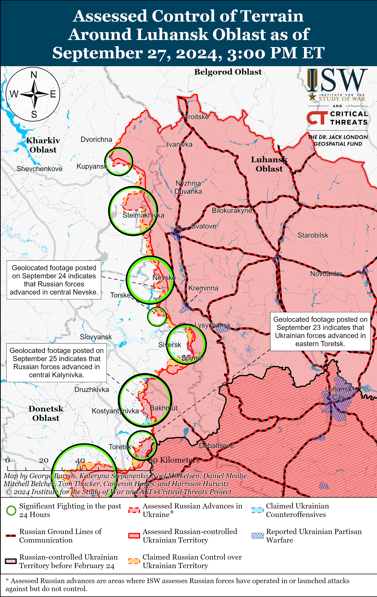
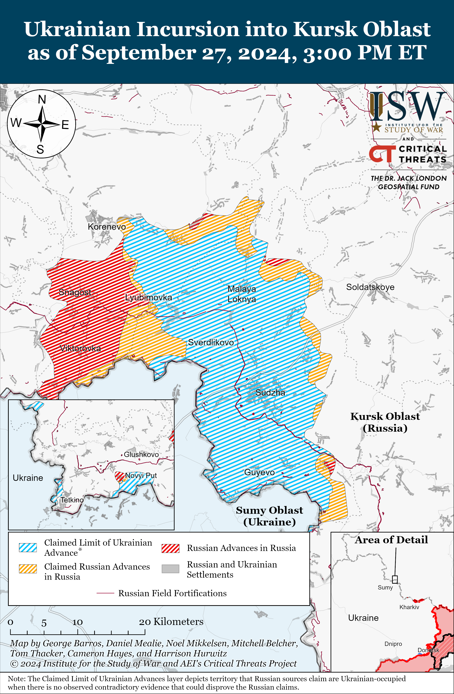
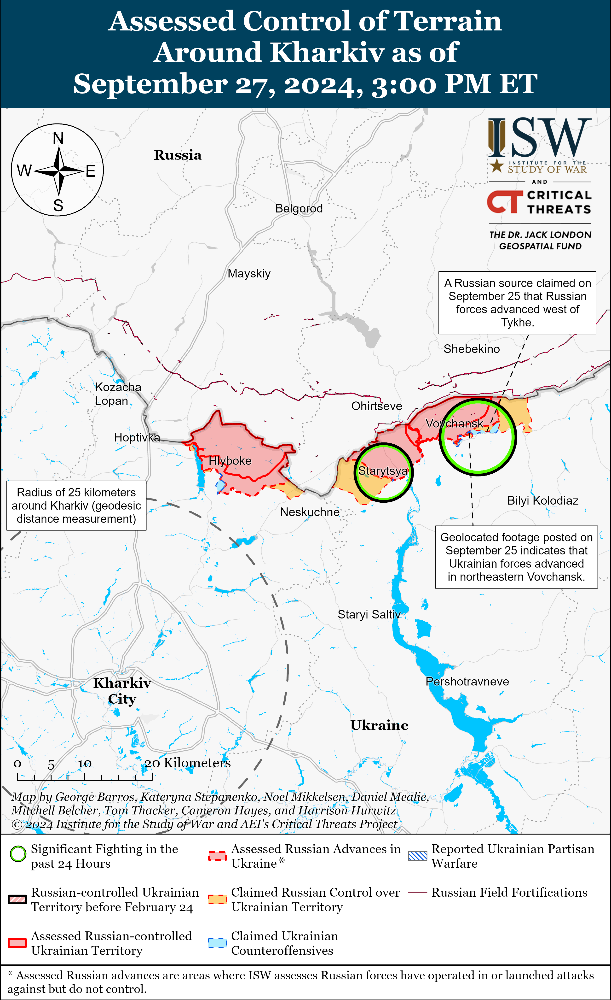
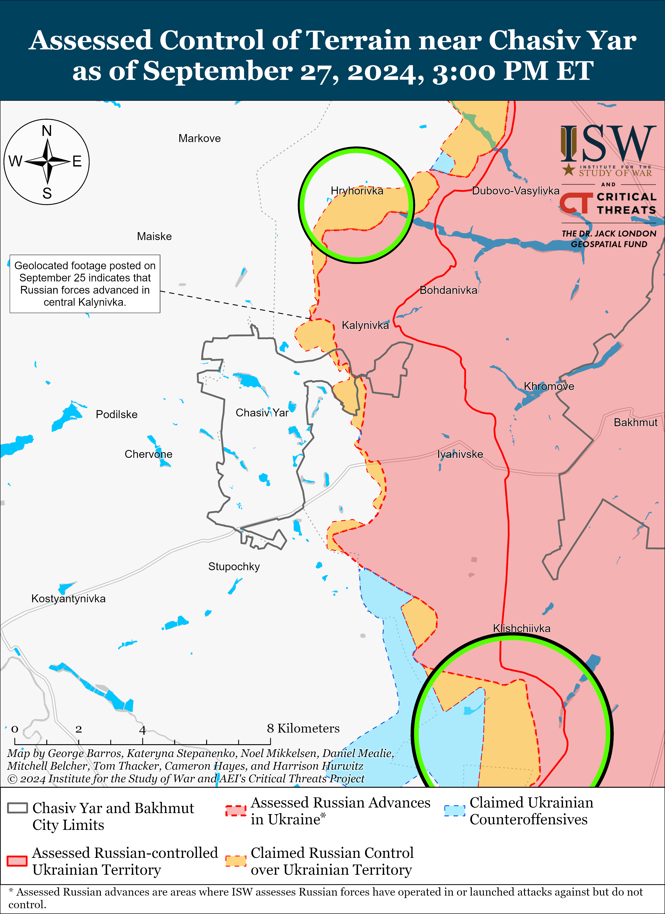
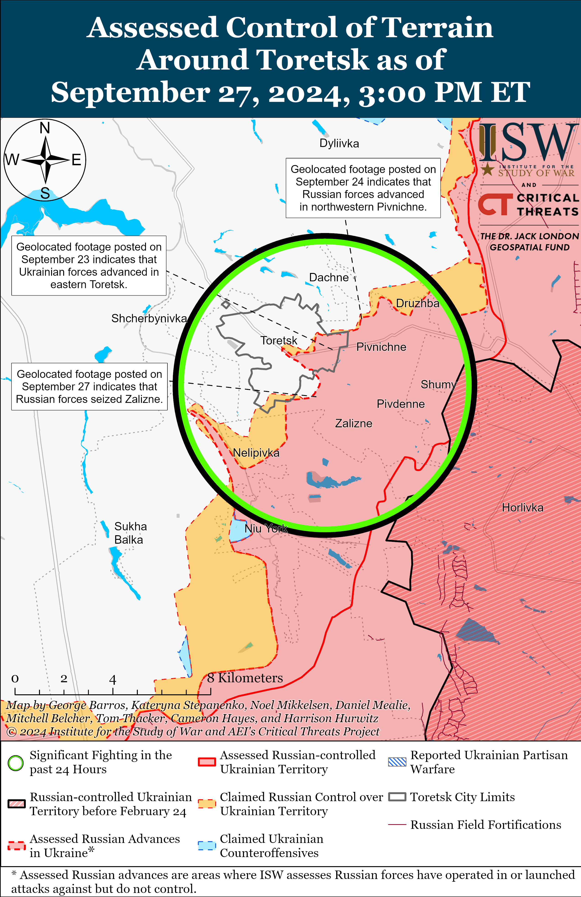
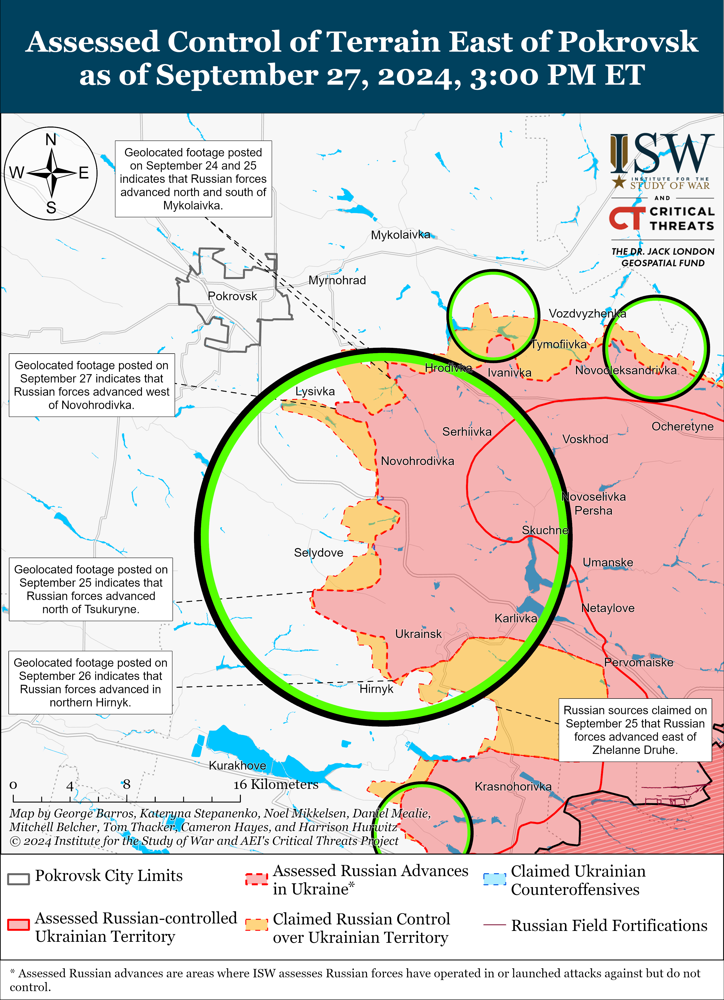
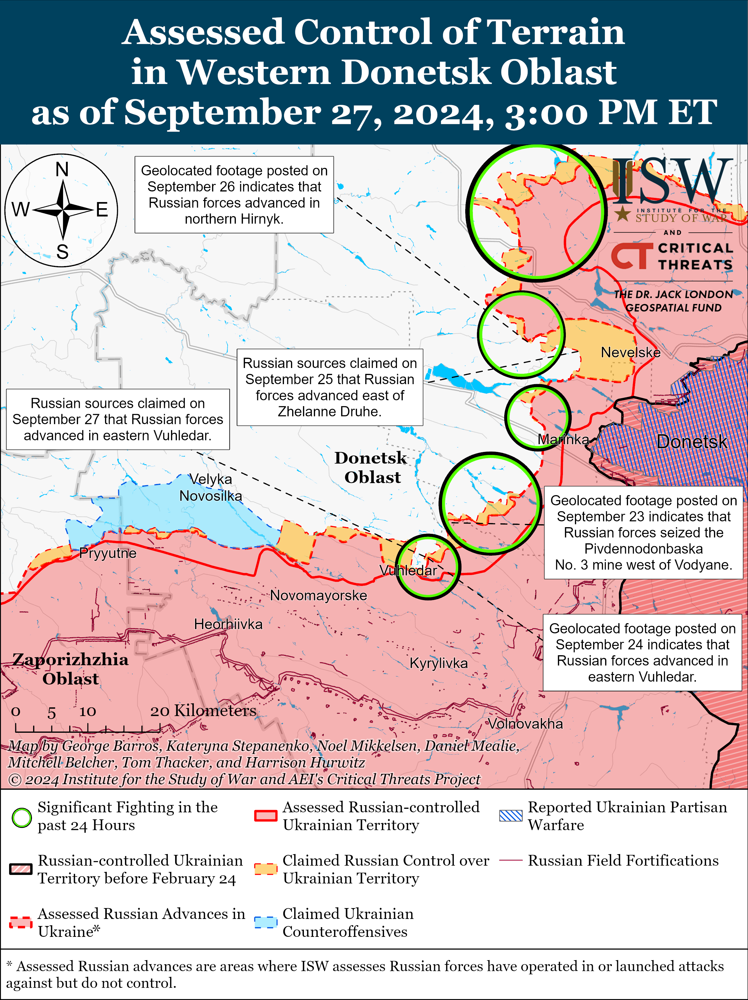
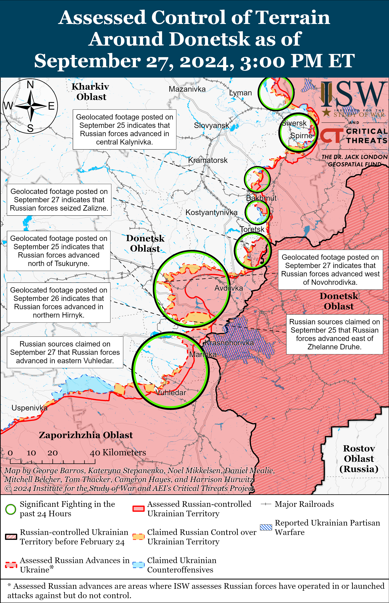
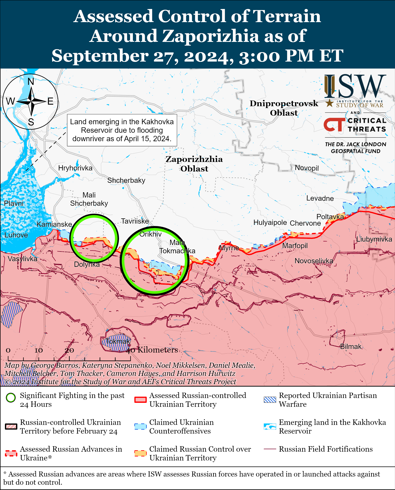
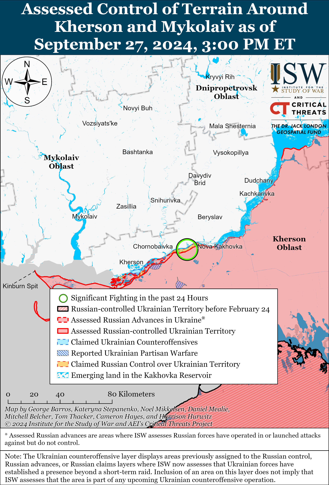

# Russian Offensive Campaign Assessment, September 27, 2024

**Riley Bailey, Angelica Evans, Kateryna Stepanenko, Grace Mappes, Haley Zehrung, and Frederick W. Kagan**

**September 27, 2024, 8:15pm ET**

**Click**[**here**](https://storymaps.arcgis.com/stories/36a7f6a6f5a9448496de641cf64bd375)**to see ISW’s interactive map of the Russian invasion of Ukraine. This map is updated daily alongside the static maps present in this report.**

**Click**[**here**](https://storymaps.arcgis.com/stories/83a2f24901c941d581c0c523ecd2619b)**to see ISW’s interactive map of Ukraine’s offensive in Kursk Oblast.**

**Click**[**here**](https://understandingwar.maps.arcgis.com/apps/instant/3dviewer/index.html?appid=1602762dbcde419bb957dea358449580)**to see ISW’s 3D control of terrain topographic map of Ukraine. Use of a computer (not a mobile device) is strongly recommended for using this data-heavy tool.**

**Click**[**here**](https://storymaps.arcgis.com/stories/733fe90805894bfc8562d90b106aa895)**to access ISW’s archive of interactive time-lapse maps of the Russian invasion of Ukraine. These maps complement the static control-of-terrain map that ISW produces daily by showing a dynamic frontline. ISW will update this time-lapse map archive monthly.**

**Note: The data cut-off for this product was 1:30pm ET on September 27. ISW will cover subsequent reports in the September 28 Russian Offensive Campaign Assessment.**

**Ukrainian forces repelled a reinforced battalion-size Russian mechanized assault in the Kupyansk direction on September 26 — the first large Russian mechanized assault along the Kupyansk-Svatove-Kreminna line since Winter 2024.**A Ukrainian battalion operating near Pishchane (northwest of Svatove and southeast of Kupyansk) posted geolocated footage on September 26 showing Ukrainian forces repelling the reinforced battalion-size Russian mechanized assault in fields around Pishchane and reported that Russian forces attacked in the direction of Kolisnykivka and Kruhlyakivka (west of Pishchane and directly on the Oskil River).[1] The Ukrainian battalion reported that Russian forces used 50 armored vehicles in the assault, and the Ukrainian Airborne Assault Forces Command reported that Russian forces attacked Ukrainian positions in two columns, one with 37 armored vehicles and the other with 13.[2] The Ukrainian battalion reported that Ukrainian forces destroyed three tanks and 11 armored vehicles and damaged 10 tanks and 16 armored vehicles.[3] The Ukrainian Airborne Assault Forces Command posted footage showing damaged and destroyed Russian armored vehicles crowded close to one another, suggesting that Russian armored vehicles attacked in tight columns and became jammed once Ukrainian fire elements started to strike the column— a common occurrence in failed Russian mechanized assaults.[4] Ukrainian military sources reported that Ukrainian forces repelled Russian forces back to their starting positions near Pishchane, and none of the geolocated footage that ISW has observed of the assault indicates that Russian forces advanced during the assault.[5]

The Russian Western Grouping of Forces conducted several large mechanized assaults between January and February 2024 at the start of the Russian offensive operation along the Kupyansk-Svatove-Kreminna line, with the last observed battalion-size Russian mechanized assault occurring west of Kreminna in late January.[6] Russian forces have since conducted infantry assaults and occasional roughly platoon-size mechanized assaults along the Kupyansk-Svatove-Kreminna line, and the tempo of the Russian offensive operation along this sector of the front has generally been much lower than Russian offensive operations elsewhere in Ukraine.[7]

**Russian forces may be intensifying their efforts to reach the Oskil River, although Russian advances on the east (left) bank of the Oskil River will likely continue to be relatively gradual.**Russian forces have created a small tactical salient around Pishchane in recent weeks and have focused on advancing toward Kolisnykivka and Kruhlyakivka.[8] Russian forces advanced along a ravine running east of Pishchane and in fields south and north of the settlement but have struggled to advance in the fields immediately east of Kolisnykivka and Kruhlyakivka. The command of the Western Grouping of Forces may have intended for the large mechanized assault to allow Russian forces to advance rapidly through these fields and consolidate positions within Kolisnykivka and Kruhlyakivka and enable Russian infantry to establish a more enduring foothold within the two settlements on the Oskil River.

Russian forces are likely focusing on establishing a foothold directly on the Oskil River because it would allow Russian forces to envelop Ukrainian positions on the east bank of the river both to the north and south – creating a narrower Ukrainian salient between Kupyansk-Vuzlovyi and Hlushkivka and a wider Ukrainian salient south of Kruhlyakivka since the Oskil River acts as a barrier. The Western Grouping of Forces has conducted the offensive operation along the Kupyansk-Svatove-Kreminna line in four mutually supporting axes of advance (northeast of Kupyansk, northwest of Svatove, southwest of Svatove, and west of Kreminna) specifically so that Russian territorial gains on any route of advance would generate opportunities to create Ukrainian salients on the east bank of the Oskil River and envelop Ukrainian positions both to the north and south of any advance.[9] The desired Russian seizure of Kolisnykivka and Kruhlyakivka does not ensure that Russian forces would be able to more quickly reduce the potential Ukrainian salient between Kupyansk-Vuzlovyi and Hlushkivka nor increase the pace of advance south of Kruhlyakivka, however. Russian forces have not demonstrated the ability to quicken the pace of their advance along the Kupyansk-Svatove-Kreminna line in recent months, and Russian forces have also failed to make even marginal gains on other axes of advance, notably spending weeks to enter small settlements like Nevske and Makiivka (both northwest of Kreminna). Russian sources claimed as of September 27 that Ukrainian forces are actively counterattacking near Nevske, and Ukrainian forces have previously conducted tactically successful counterattacks in the Kreminna area — suggesting that Ukrainian forces have more flexibility to contest the tactical initiative in the area than elsewhere in eastern Ukraine.[10]

**The Russian military command has demonstrated that it will likely accept continued gradual gains along the Kupyansk-Svatove-Kreminna line, however.**The Western Grouping of Forces established the Russian offensive operation towards the Oskil River as a much more sustainable effort than previous offensive operations and has repeatedly slowed offensive tempo along the Kupyansk-Svatove-Kreminna line to allow participating Russian units to rest, reconstitute, and rotate.[11] Russian forces began the effort to reach the Oskil River in Winter 2024 and have not abandoned the effort despite several brief operational culminations in the previous months.[12]

Russian President Vladimir Putin and the Russian military command are currently pursuing a theory of victory in Ukraine that posits that Russian forces can continue gradual creeping advances indefinitely, and gradual Russian advances along the Kupyansk-Svatove-Kreminna line cohere with this strategic calculus.[13] ISW continues to assess that Russia’s objective to push Ukrainian forces off the east bank of the Oskil River is an operationally significant objective since it would allow Russian forces to establish an easily defensible front along the river and free up combat power.[14] The Russian military command continues to deprioritize other offensive operations with operationally significant objectives, however, as seen with the current Russian offensive operation around the operationally significant town of Chasiv Yar.

**The Western Grouping of Forces likely has limited capacity to maintain an intensified offensive effort along the Kupyansk-Svatove-Kreminna line or conduct effective combat operations that result in more rapid gains.**The Western Grouping of Forces initially was comprised of both Moscow and Leningrad Military District (MMD/LMD) elements when it launched the offensive operation along the Kupyansk-Svatove-Kreminna line in Winter 2024, and the Russian military redeployed the majority of the LMD elements to the Northern Grouping of Forces to conduct the Russian offensive operation into northern Kharkiv Oblast in May 2024.[15] Ukraine’s incursion into Kursk Oblast has since drawn additional elements from the Western Grouping of Forces to defend in Kursk Oblast from the Kupyansk-Svatove-Kreminna line.[16] The Western Grouping of Forces has now tasked the MMD’s 1st Guards Tank Army (GTA) with a wider area of responsibility from northeast of Kupyansk to west of Svatove while continuing to task primarily the MMD’s 20th Combined Arms Army [CAA] with the front southwest of Svatove to west of Kreminna.[17] Ukrainian military observer Kostyantyn Mashovets stated on September 25 that the 1st GTA has created an operational reserve of elements of the 1st GTA’s 153rd Tank Regiment (47th Tank Division), 371st Motorized Rifle Regiment (mobilized unit), and several combined rifle battalions from the 1st GTA’s 4th and 47th tank divisions to support the Russian offensive operation in the Kupyansk direction, and this reserve will likely be unable to support prolonged intensified offensive operations.[18] The command of the Western Grouping of Forces has previously overseen costly and ineffective mechanized assaults. Continued pronounced failures with mechanized assaults suggest that the Western Grouping of Forces is not learning tactical lessons that other Russian groupings of forces have learned.[19]

**Russian authorities appear to be expending a significant amount of effort to influence the Western debate about allowing Ukraine to use Western-provided weapons to conduct long-range strikes against military objects in Russia. This Russian effort suggests a deep concern with the operational pressures that such strikes into Russia would generate on Russian offensive operations in Ukraine, although US officials remain hesitant to permit Ukraine to conduct such strikes.** The*New York Times*(*NYT*), citing unnamed US officials, reported on September 26 that US intelligence assessments “play down” the effect that Ukrainian strikes into Russia with US-, UK-, and French-provided long-range missile systems could have on the course of the war in Ukraine due to Ukraine’s limited number of such weapons and uncertainty around the future provision of more long-range systems.[20] *NYT* noted that officials within the US military and Biden administration who support the policy change stated that Western-provided weapons would allow Ukraine to strike more distant Russian bases and ammunition warehouses and force the Russian military to relocate ammunition depots, command posts, attack helicopters, and other materiel out of the range of Western missiles, which the officials noted would significantly complicate Russian supply lines in Ukraine.[21]

Even a small number of successful Ukrainian long-range strikes could have asymmetric impacts and prompt Russian forces to move significant military and storage facilities outside the range of Western-provided weapons and further away from the frontline – complicating Russian logistics in the vicinity of Ukraine. Ukrainian forces previously conducted a series of HIMARS strikes against Russian ammunition depots throughout occupied Ukraine in Summer 2022, which prompted Russian forces to disperse ammunition storage facilities and degraded the efficiency of Russian logistics.[22] Russian authorities are likely concerned about how moving ammunition depots and other critical storage facilities further away from the frontline and outside the range of Western-provided systems will impact Russian offensive capabilities in Ukraine and appear to be engaged in a significant rhetorical effort to prevent the West from allowing Ukraine to conduct another similarly significant strike campaign.

**Russian President Vladimir Putin reintroduced several of the Kremlin’s previously most effective narratives back into the Western and Russian information spaces in recent weeks and tailored his typical boilerplate language to specifically target the ongoing Western debate about allowing Ukraine to conduct long-range strikes into Russia with Western-provided equipment.** Putin invoked the Kremlin’s ongoing narrative about its supposed “red lines” and stated on September 11 that Ukrainian strikes against Russia using Western-provided weapons would represent an escalation in the war in Ukraine and directly involve Western countries in the war.[23] Putin invoked the threat of nuclear confrontation between Russia and the West on September 25 and claimed that “aggression against Russia by a non-nuclear state with support or participation from a nuclear state” or the “receipt of reliable information about the massive launch of air and space weapons” at Russia are two possible conditions that Russia could use to justify using a nuclear weapon.[24] The Kremlin’s information operations threatening nuclear war if the West crosses Russia’s “red lines” were successful at prompting the West into self-deterrence and delaying Western security assistance during critical moments in 2022 and 2024.[25] Officials close to senior Russian diplomats recently claimed that Putin may be doubting the impact of his nuclear saber-rattling against Western policymakers, although Putin may continue to employ such rhetoric if he assesses that these information operations will continue to have even minimal impacts on Western decision-makers.[26]

**The benefits of allowing Ukraine to use Western-provided long-range strike systems against Russia may outweigh the risk of Russian retaliation more than Western policymakers are currently considering.** Western media outlets have repeatedly reported that the US and other Western governments are hesitant to greenlight Ukraine to use Western-provided systems to strike targets in Russia due to previous assessments that the risk of Russian retaliation for such strikes outweighs the possible benefits that Ukraine could generate with such strikes.[27] *NYT*reported that the assessment notes that Russia is likely to retaliate with greater force against the US and its allies, possibly with covert attacks on US and European strategic facilities and military bases in Europe, in the event that the West allows Ukraine to use Western-provided systems to strike objects in Russia.[28]

The Kremlin has been conducting covert operations against Western powers since long before the ongoing debate about Ukraine’s use of Western-provided weapons to strike Russia and the Kremlin may intend to intensify these operations regardless of the West’s decision as these operations support other Kremlin objectives to destabilize European countries and undermine NATO’s military readiness.[29] ISW continues to assess that Russian forces are still benefiting from and exploiting territory within the range of Western-provided systems for further Russian offensive operations against Ukraine and Western policymakers maintain the decision-making power to remove this sanctuary and further complicate Russia’s war effort.[30]

**Russian Defense Minister Andrei Belousov met with Kremlin-affiliated milbloggers on September 27, likely as part of the ongoing Kremlin effort to coopt Russian milbloggers and downplay recent backlash in the ultranationalist information space over the death of two prominent drone operators.**Russian state-run news agencies *TASS* and*RIA Novosti* reported on September 27 that Belousov met with several milbloggers to discuss issues relating to unspecified frontline areas in Ukraine.[31] Several Kremlin-affiliated milbloggers (some of whom were present at previous meetings between MoD officials and milbloggers) praised Belousov for being receptive to their feedback about the situation on the frontlines and being in tune with the situation on the frontline.[32] One Kremlin-affiliated milblogger in attendance had recently published the claimed results of Belousov’s investigation into the deaths of drone operators of the 87th Separate Rifle Regiment (1st “Slavic” Motorized Rifle Brigade, 51st Combined Arms Army [CAA], formerly 1st Donetsk People’s Republic Army Corps [DNR AC]) Junior Sergeant Dmitry Lysakovsky (alias Goodwin) and Lieutenant Colonel Sergey Gritsai (alias Ernest).[33] Some milbloggers accused this Kremlin-affiliated milblogger of working with the Russian MoD to gauge the public reaction to the claimed results of the investigation, which allegedly found the commander of the 87th Separate Rifle Regiment not guilty of exceeding his powers by committing the drone platoon to combat operations, which ultimately resulted in Lysakovsky and Gritsai’s deaths.[34] Belousov may have met with coopted Russian milbloggers to downplay the controversy generated by the deaths of Lysakovsky and Gritsai likely in an attempt to further the Russian Ministry of Defense’s (MoD) influence in the Russian information space.

**The People’s Republic of China (PRC) announced a new initiative to draw international support for its alternative peace plan for Ukraine amid increasing cooperation with Russia.**PRC Foreign Minister Wang Yi announced on September 26 that the PRC, Brazil, Pakistan, and “other like-minded countries in the global south” will soon establish the “Friends of Peace” platform that allegedly aims to foster “inclusive dialogue” to find a solution to end the war in Ukraine.[35] The PRC routinely promoted its alternative peace plan, allowing Russian officials to posture as willing to negotiate with Ukraine in good faith despite consistent Kremlin statements either insisting on its terms amounting to total Ukrainian capitulation or rejecting negotiations outright.[36] The Kremlin will likely promote this new Friends of Peace platform and use its support of multiple alternative peace efforts to falsely portray Ukraine as unwilling to negotiate.

**Ukrainian President Volodymyr Zelensky continued to meet with US officials about the war in Ukraine during his visit to the US on September 26 and 27.**Zelensky met with a bipartisan delegation from the US Senate and with US President Joe Biden on September 26 and with US Vice President Kamala Harris and former US President Donald Trump on September 27.[37]

**Key Takeaways:**

- **Ukrainian forces repelled a reinforced battalion-size Russian mechanized assault in the Kupyansk direction on September 26 — the first large Russian mechanized assault along the Kupyansk-Svatove-Kreminna line since Winter 2024.**
- **Russian forces may be intensifying their efforts to reach the Oskil River, although Russian advances on the east (left) bank of the Oskil River will likely continue to be relatively gradual.**
- **The Russian military command has demonstrated that it will likely accept continued gradual gains along the Kupyansk-Svatove-Kreminna line, however.**
- **The Western Grouping of Forces likely has limited capacity to maintain an intensified offensive effort along the Kupyansk-Svatove-Kreminna line or conduct effective combat operations that result in more rapid gains.**
- **Russian authorities appear to be expending a significant amount of effort to influence the Western debate about allowing Ukraine to use Western-provided weapons to conduct long-range strikes against military objects in Russia. This Russian effort suggests a deep concern with the operational pressures that such strikes into Russia would generate on Russian offensive operations in Ukraine, although US officials remain hesitant to permit Ukraine to conduct such strikes.**
- **The benefits of allowing Ukraine to use Western-provided long-range strike systems against Russia may outweigh the risk of Russian retaliation more than Western policymakers are currently considering.**
- **Russian Defense Minister Andrei Belousov met with Kremlin-affiliated milbloggers on September 27, likely as part of the ongoing Kremlin effort to coopt Russian milbloggers and downplay recent backlash in the ultranationalist information space over the death of two prominent drone operators.**
- **The People’s Republic of China (PRC) announced a new initiative to draw international support for its alternative peace plan for Ukraine amid increasing cooperation with Russia.**
- **Ukrainian President Volodymyr Zelensky continued to meet with US officials about the war in Ukraine during his visit to the US on September 26 and 27.**
- **Russian and Ukrainian forces continued assaults in Kursk Oblast, but neither side made further advances.**
- **Russian forces recently advanced within and around Toretsk and southeast of Pokrovsk.**
- **Russian authorities continue to threaten Russian frontline soldiers’ ad-hoc communications networks.**

[****](https://understandingwar.org/wp-content/uploads/2025/05/DraftUkraineCoT20September20272C202024.png)

***We do not report in detail on Russian war crimes because these activities are well-covered in Western media and do not directly affect the military operations we are assessing and forecasting. We will continue to evaluate and report on the effects of these criminal activities on the Ukrainian military and the Ukrainian population and specifically on combat in Ukrainian urban areas. We utterly condemn Russian violations of the laws of armed conflict and the Geneva Conventions and crimes against humanity even though we do not describe them in these reports.***

- Ukrainian Operations in the Russian Federation
- Russian Main Effort – Eastern Ukraine (comprised of three subordinate main efforts)
- Russian Subordinate Main Effort #1 – Push Ukrainian forces back from the international border with Belgorod Oblast and approach to within tube artillery range of Kharkiv City
- Russian Subordinate Main Effort #2 – Capture the remainder of Luhansk Oblast and push westward into eastern Kharkiv Oblast and encircle northern Donetsk Oblast
- Russian Subordinate Main Effort #3 – Capture the entirety of Donetsk Oblast
- Russian Supporting Effort – Southern Axis
- Russian Air, Missile, and Drone Campaign
- Russian Mobilization and Force Generation Efforts
- Russian Technological Adaptations
- Activities in Russian-occupied areas
- Ukrainian Defense Industrial Base Efforts
- Russian Information Operations and Narratives
- Significant Activity in Belarus

**Ukrainian Operations in the Russian Federation**

**Russian Main Effort – Eastern Ukraine**

Ukrainian forces continued ground assaults in Glushkovsky Raion, Kursk Oblast on September 27 but did not make any confirmed gains. Russian sources, including the Russian Ministry of Defense (MoD), claimed that Russian forces repelled Ukrainian assaults south of Glushkovo near Veseloye, Krasnooktyabrskoye, Novy Put, and Medvezhye on September 26 and 27.[38] The Russian MoD claimed that Russian forces also counterattacked near Novy Put.[39] Elements of the Russian 56th Airborne (VDV) Regiment (7th VDV Division) are reportedly defending against Ukrainian assaults in Glushkovsky Raion.[40]

Ukrainian forces continued assaults in the Ukrainian salient in Kursk Oblast on September 27 but did not make any confirmed advances. Russian sources, including the Russian MoD, claimed that Ukrainian forces attacked southeast of Korenevo near Lyubimovka and south of Sudzha near Plekhovo.[41]

Russian forces conducted counterattacks in the Ukrainian salient in Kursk Oblast on September 27 but did not make any confirmed gains. A Russian milblogger claimed that Russian forces advanced near Plekhovo, but ISW has not observed visual confirmation of this claim.[42] Russian milbloggers claimed on September 26 and 27 that fighting is ongoing in forest areas between Plekhovo and Borki (immediately east of Plekhovo) and that dense minefields in the area are slowing Russian progress.[43] The Russian MoD claimed that Russian forces conducted assaults southeast of Korenevo near Lyubimovka, Darino, and Nikolayevo-Daryino and south of Sudzha near Plekhovo.[44] Elements of the Russian 83rd VDV Brigade are also reportedly operating in Kursk Oblast.[45]

[****](https://understandingwar.org/wp-content/uploads/2025/05/UAF20Kursk20Incursion20September20272C202024.png)

**Russian Subordinate Main Effort #1 – Kharkiv Oblast (Russian objective: Push Ukrainian forces back from the international border with Belgorod Oblast and approach to within tube artillery range of Kharkiv City)**

Russian forces recently marginally advanced north of Kharkiv City amid continued Russian assaults north and northeast of Kharkiv City on September 27. Geolocated footage published on September 26 indicates that Russian forces recently marginally advanced northwest of Zelene (north of Kharkiv City).[46] A Ukrainian bridge operating in the Kharkiv direction posted footage on September 26 showing Ukrainian forces repelling a platoon-size Russian mechanized assault in an unspecified area of the Kharkiv direction.[47] Ukrainian Kharkiv Group of Forces Spokesperson Colonel Vitaliy Sarantsev reported that Russian forces are digging tunnels and underground passageways between buildings in Vovchansk (northeast of Kharkiv City) in order to conceal troop movements.[48] Sarantsev noted that Russian forces have gone on the defensive in some unspecified areas of the Kharkiv direction and appear to be preparing for future assaults in other unspecified areas.[49] Russian forces continued assaults north of Kharkiv City near Hlyboke and northeast of Kharkiv City near Starytsya, Vovchansk, and Tykhe on September 26 and 27.[50] Elements of the Russian 380th Motorized Rifle Regiment (47th Tank Division, 1st Guard Tank Army [GTA], Moscow Military District [MMD]) are reportedly operating near Lukyantsi (north of Kharkiv City).[51] Elements of the Russian “Enot” drone detachment of the 136th Motorized Rifle Brigade (58th Combined Arms Army [CAA], Southern Military District [SMD]) are reportedly operating in Vovchansk.[52]

[****](https://understandingwar.org/wp-content/uploads/2025/05/Kharkiv20Battle20Map20Draft20September20272C202024.png)

**Russian Subordinate Main Effort #2 – Luhansk Oblast (Russian objective: Capture the remainder of Luhansk Oblast and push westward into eastern Kharkiv Oblast and northern Donetsk Oblast)**

*See topline text for details about the Kupyansk-Svatove-Kreminna line.*

**Russian Subordinate Main Effort #3 – Donetsk Oblast (Russian objective: Capture the entirety of Donetsk Oblast, the claimed territory of Russia’s proxies in Donbas)**

Russian forces reportedly continued offensive operations northeast of Siversk near Bilohorivka, east of Siversk near Verkhnokamyanske, and southeast of Siversk near Spirne on September 26 and 27 but did not advance.[53]

Russian forces continued offensive operations in the Chasiv Yar direction on September 26 and 27 but did not make confirmed advances. The Ukrainian General Staff reported that Russian forces attacked north of Chasiv Yar near Hryhorivka and Minkivka and south of Chasiv Yar near Stupochky and Bila Hora.[54] Advisor to the Donetsk People’s Republic (DNR) Head Igor Kimakovsky claimed that Russian forces seized an unspecified height near Chasiv Yar and are continuing offensive operations near Kalynivka (northeast of Chasiv Yar) and Hryhorivka, although ISW has not observed visual evidence of these claims.[55] A Russian milblogger affiliated with the Russian Airborne Forces (VDV) claimed on September 27 that previously prepared defensive positions and the Siverskyi Donets-Donbas Canal are slowing Russian advances near Chasiv Yar and impeding Russian assault groups trying to cross the canal.[56] The milblogger claimed that forests around Chasiv Yar allow Ukrainian forces to conceal military equipment, that Ukrainian forces have an advantage in drone operations in the area, and that Russian forces are struggling to secure positions in the ruins of Chasiv Yar’s private sector.[57]

Russia forces recently made confirmed advances in Toretsk and southeast of Toretsk amid continued offensive operations on September 26 and 27. Geolocated footage published on September 21 and September 27 indicates that Russian forces recently advanced in eastern Toretsk along Darvina and Pushkarenko streets, respectively.[58] Russian milbloggers also claimed that Russian forces advanced in eastern Toretsk along Heroiv Pratsi Street and in central Toretsk along Pyaboshapky Street.[59] Geolocated footage published on September 27 also indicates that Russian forces recently advanced in northwestern Zalizne (southeast of Toretsk), indicating that Russian forces have seized the settlement.[60] The Ukrainian General Staff reported that Russian forces continued offensive operations near Toretsk; south of Toretsk; and southwest of Toretsk near Leonidivka and Shcherbynivka.[61]

Russian forces recently advanced southeast of Pokrovsk amid continued offensive operations on September 26 and 27. Geolocated footage published on September 27 indicates that Russian forces advanced south of Sukhyi Yar and seized the Novohrodivska No. 1/3 mine west of Novohrodivka (southeast of Sukhyi Yar).[62] The Russian Ministry of Defense (MoD) claimed on September 27 that Russian forces seized Marynivka (southeast of Pokrovsk and south of Novohrodivka) during the week of September 21 and 27, and ISW assessed that Russian forces seized the settlement on September 10.[63] A Russian milblogger also claimed that Russian forces advanced in northern Hirnyk (southeast of Pokrovsk).[64] Russian forces continued offensive operations east of Pokrovsk near Zelene Pole, Krutyi Yar, Vozdvyzhenka, Novotoretske, and Hrodivka; south of Pokrovsk near Dachenske; and southeast of Pokrovsk near Novohrodivka, Selydove, Mykolaivka, Lysivka, Marynivka, Krasnyi Yar, Tsukuryne, and Zhelanne Druhe.[65] A Russian long-range reconnaissance company of a reconnaissance battalion belonging to the 35th Separate Motorized Rifle Brigade (41st Combined Arms Army [CAA], Central Military District [CMD]) is reportedly mining Ukrainian logistics routes near Mykolaivka.[66]

Russian forces reportedly continued offensive operations west of Donetsk City near Heorhiivka on September 26 and 27, but there were no confirmed changes to the frontline.[67]

Russian sources claimed that Russian forces advanced in and near Vuhledar amid continued offensive operations southwest of Donetsk City on September 26 and 27. Russian milbloggers claimed that Russian forces with armored vehicle support advanced in eastern Vuhledar, west of Vuhledar, and northwest of the Pivdennodonbaska No. 3 mine northeast of Vuhledar.[68] ISW has not observed visual confirmation of these claims. The Ukrainian General Staff reported that Russian forces continued offensive operations southwest of Donetsk City near Paraskoviivka, Kostyantynivka, and Katerynivka; near Vuhledar; north of Vuhledar in the direction of Bohoyavlenka; and northeast of Vuhledar near Vodyane.[69] The deputy commander of a Ukrainian brigade operating in the area reported that the Vremivka direction west of Vuhledar remains an important section of the frontline and that Russian forces conduct attacks using columns of five to 10 vehicles in this direction.[70] The deputy commander added that Russian forces conduct new assaults about an hour apart and that Russian forces can conduct three to four attacks per day. Ukrainian military observer Kostyantyn Mashovets stated that elements of the Russian 39th Motorized Rifle Brigade (68th Army Corps [AC], Eastern Military District [EMD]) and the 430th Motorized Rifle Regiment (likely a mobilized unit) advanced in eastern and central Vuhledar and that other Russian units are advancing near the western outskirts of Vuhledar.[71] Drone operators of the Russian 14th Spetsnaz Brigade (Russian General Staff’s Main Intelligence Directorate [GRU]) are reportedly operating within Vuhledar.[72]

Russian forces reportedly attacked southwest of Velyka Novosilka near Novodarivka on September 27 but did not advance.[73]

[****](https://understandingwar.org/wp-content/uploads/2025/05/Donetsk20Battle20Map20Draft20September20272C202024.png)

**Russian Supporting Effort – Southern Axis (Russian objective: Maintain frontline positions and secure rear areas against Ukrainian strikes)**

Positional fighting continued in western Zaporizhia Oblast on September 26 and 27 near Novoandriivka and Mali Shcherbaky (both northwest of Robotyne) and near Robotyne, but there were no confirmed changes to the front line.[74] Elements of the Russian “Valkyrie” Special Detachment (4th Military Base, 58th Combined Arms Army [CAA], Southern Military District [SMD]) are reportedly correcting Russian artillery fire against Ukrainian positions near Kamyanske (northwest of Robotyne).[75] Russian sources claimed that Ukrainian forces fired on Tokmak with multiple launch rocket systems (MLRS).[76]

Ukrainian Tavriisk Group of Forces Spokesperson Colonel Vladyslav Voloshyn said on September 26 that a large contingent of Russian forces, including Rosgvardia personnel, are using the occupied Zaporizhzhia Nuclear Power Plant (ZNPP) as a training base for drone crews to shield these Russian forces from Ukrainian strikes.[77] ISW has reported at length about Russia’s militarization of the ZNPP, including visual evidence of Russian forces storing and operating weapons on the ZNPP’s grounds.[78]

The Ukrainian General Staff reported on September 27 that Russian forces attacked multiple times in the Dnipro (Kherson) direction[79] Elements of the Russian 61st Naval Infantry Brigade (Leningrad Military District [LMD], formerly Northern Fleet) are reportedly operating in the Kherson direction.[80]

The Ukrainian Crimean-based “Atesh” partisan group published photographs and reported on September 27 that Russian forces are building new defensive structures along the beach near occupied Andriivka-Uhlove (north of Sevastopol), Crimea.[81]

**Russian Air, Missile, and Drone Campaign (Russian Objective: Target Ukrainian military and civilian infrastructure in the rear and on the frontline)**

Russian forces conducted a limited series of drone and missile strikes against Ukraine on the night of September 26 to 27. The Ukrainian Air Force reported that Russian forces launched an Iskander-M/KN-23 ballistic missile from occupied Crimea, two Kh-22 cruise missiles from airspace over the Black Sea, and 32 Shahed-136/131 drones from Primorsko-Akhtarsk, Krasnodar Krai.[82] The Ukrainian Air Force reported that Ukrainian forces downed 24 Shahed drones over Dnipropetrovsk, Mykolaiv, and Odesa oblasts and that one Shahed drone entered Romanian air space and another drone was “lost” due to unspecified Ukrainian drone countermeasures. The Romanian Ministry of Defense (MoD) stated that a Russian drone briefly crossed into Romanian air space on the night of September 26 to 27 but did not confirm whether the drone crashed in Romanian territory.[83] Odesa Oblast Military Administration Head Oleh Kiper reported that Russian forces also struck residential areas in Izmail, Odesa Oblast.[84]

The Ukrainian Air Force reported on September 27 that Russian forces launched two unspecified missiles at Starokostyantniv, Khmelnytskyi Oblast, but did not specify if the missiles struck their targets.[85]

**Russian Mobilization and Force Generation Efforts (Russian objective: Expand combat power without conducting general mobilization)**

Russian authorities continue to threaten Russian frontline soldiers’ ad-hoc communications networks. Kremlin-affiliated business outlet *Kommersant*reported that Russian federal censor Roskomnadzor may block access to Discord, a partially encrypted communications platform that allows users to communicate over text, voice, and video, in the coming days.[86] Roskomnadzor censored 14 links to the Discord social media platform on September 27 and has issued five findings since September 20 that Discord has violated Russian censorship laws.[87] A Russian milblogger complained that Russian forces use Discord to coordinate combat operations and claimed that Russian forces are usually able to use Discord while illegally connected to Starlink terminals but can no longer reliably use the platform otherwise.[88] The Russian Ministry of Defense (MoD) has recently been attempting to further standardize its ineffective command-and-control (C2) system and undermine the ad-hoc communications systems that frontline Russian soldiers have established in an attempt to compensate for it.[89]

The Russian MoD continues efforts to deny financial and social benefits to Russian penal recruits who fought in Ukraine.[90] BBC Russian Service reported that Russian penal recruits, whom the MoD recruited from February 24 to September 1, 2023, and who fought in “Storm-Z” units, are suing the Russian MoD for promised payments and combat veteran status following their return to Russia and are frequently losing these cases. BBC Russian Service noted that the MoD is categorizing these penal recruits as “special contingent volunteers” and had the penal recruits sign special agreements in which the prisoners “give consent” to fight for Russia in lieu of signing contracts like standard Russian contract recruits. BBC Russian Service noted that Russian law forbids these penal recruits from serving in assault battalions, but ISW has frequently observed reports of Storm-Z penal recruits conducting attritional, infantry-led “meat” assaults and suffering high casualties as a result.[91]

**Russian Technological Adaptations (Russian objective: Introduce technological innovations to optimize systems for use in Ukraine)**

Nothing significant to report.

**Ukrainian Defense Industrial Efforts (Ukrainian objective: Develop its defense industrial base to become more self-sufficient in cooperation with US, European, and international partners)**

*ISW is suspending publishing coverage of Ukrainian defense industrial efforts until further notice.*

**Activities in Russian-occupied areas (Russian objective: Consolidate administrative control of annexed areas; forcibly integrate Ukrainian citizens into Russian sociocultural, economic, military, and governance systems)**

*ISW is not publishing coverage of Russian-occupied areas today.*

**Russian Information Operations and Narratives**

Nothing significant to report.

**Significant activity in Belarus (Russian efforts to increase its military presence in Belarus and further integrate Belarus into Russian-favorable frameworks and Wagner Group activity in Belarus)**

The Belarusian Ministry of Defense (MoD) reported on September 27 that a Belarusian peacekeeping contingent arrived at the Taldykorgan airfield in Almaty, Kazakhstan for the Collective Security Treaty Organization (CSTO) “Indestructible Brotherhood-2024” military exercises.[92]

**Note: ISW does not receive any classified material from any source, uses only publicly available information, and draws extensively on Russian, Ukrainian, and Western reporting and social media as well as commercially available satellite imagery and other geospatial data as the basis for these reports. References to all sources used are provided in the endnotes of each update.**

---

[1] https://t.me/fedorenkoys/548; https://x.com/MikiValbuena/status/1839609872947552735; https://x.com/MikiValbuena/status/1839606930949497159; https://x.com/MikiValbuena/status/1839605411831312819; https://x.com/MikiValbuena/status/1839602670442590646; https://x.com/MikiValbuena/status/1839598293573157195

[2] https://www.facebook.com/watch/uaairborne/?ref=embed\_video ; https://armyinform.com dot ua/2024/09/27/syly-oborony-vidbyly-na-kupyanskomu-napryamku-shturm-kolony-z-50-odynycz-tehniky/ ; https://t.me/fedorenkoys/548 ; https://armyinform.com dot ua/2024/09/27/drony-storukogo-ahillesa-oboronczi-vidbyly-potuzhnyj-rosijskyj-broneshturm-na-kupʼyanskomu-napryamku/

[3] https://t.me/fedorenkoys/548 ; https://armyinform.com dot ua/2024/09/27/drony-storukogo-ahillesa-oboronczi-vidbyly-potuzhnyj-rosijskyj-broneshturm-na-kupʼyanskomu-napryamku/

[4] https://www.facebook.com/watch/uaairborne/?ref=embed\_video ; https://armyinform.com dot ua/2024/09/27/syly-oborony-vidbyly-na-kupyanskomu-napryamku-shturm-kolony-z-50-odynycz-tehniky/

[5] https://www.facebook.com/watch/uaairborne/?ref=embed\_video ; https://armyinform.com dot ua/2024/09/27/syly-oborony-vidbyly-na-kupyanskomu-napryamku-shturm-kolony-z-50-odynycz-tehniky/ ; https://t.me/fedorenkoys/548; https://x.com/MikiValbuena/status/1839609872947552735; https://x.com/MikiValbuena/status/1839606930949497159; https://x.com/MikiValbuena/status/1839605411831312819; https://x.com/MikiValbuena/status/1839602670442590646; https://x.com/MikiValbuena/status/1839598293573157195

[6] https://understandingwar.org/backgrounder/russian-winter-spring-2024-offensive-operation-kharkiv-luhansk-axis

[7] https://understandingwar.org/backgrounder/how-delays-western-aid-gave-russia-initiative-ukrainian-counteroffensive-kharkiv

[8] https://understandingwar.org/backgrounder/russian-offensive-campaign-assessment-july-20-2024 ; https://isw.pub/UkrWar092624

[9] https://understandingwar.org/backgrounder/russian-winter-spring-2024-offensive-operation-kharkiv-luhansk-axis

[10] https://understandingwar.org/backgrounder/russian-offensive-campaign-assessment-july-30-2024 ; https://t.me/vysokygovorit/17461 ; https://t.me/motopatriot/27987

[11] https://understandingwar.org/backgrounder/how-delays-western-aid-gave-russia-initiative-ukrainian-counteroffensive-kharkiv ; https://understandingwar.org/backgrounder/russian-winter-spring-2024-offensive-operation-kharkiv-luhansk-axis

[12] https://understandingwar.org/backgrounder/how-delays-western-aid-gave-russia-initiative-ukrainian-counteroffensive-kharkiv ; https://understandingwar.org/backgrounder/russian-winter-spring-2024-offensive-operation-kharkiv-luhansk-axis

[13] https://understandingwar.org/backgrounder/how-delays-western-aid-gave-russia-initiative-ukrainian-counteroffensive-kharkiv ; https://understandingwar.org/backgrounder/russian-winter-spring-2024-offensive-operation-kharkiv-luhansk-axis

[14] https://understandingwar.org/backgrounder/russian-winter-spring-2024-offensive-operation-kharkiv-luhansk-axis

[15] https://isw.pub/UkrWar052524

[16] https://isw.pub/UkrWar083124 ; https://understandingwar.org/backgrounder/russian-offensive-campaign-assessment-september-3-2024

[17] https://understandingwar.org/backgrounder/russian-winter-spring-2024-offensive-operation-kharkiv-luhansk-axis ; https://isw.pub/UkrWar052524 ; https://understandingwar.org/backgrounder/russian-offensive-campaign-assessment-august-22-2024 ;

[18] https://t.me/zvizdecmanhustu/2213

[19] https://understandingwar.org/backgrounder/russian-winter-spring-2024-offensive-operation-kharkiv-luhansk-axis ; https://isw.pub/UkrWar073024 ; https://understandingwar.org/backgrounder/russian-offensive-campaign-assessment-august-1-2024

[20] https://www.nytimes.com/2024/09/26/us/politics/us-intelligence-stresses-risks-in-allowing-long-range-strikes-by-ukraine.html

[21] https://www.nytimes.com/2024/09/26/us/politics/us-intelligence-stresses-risks-in-allowing-long-range-strikes-by-ukraine.html

[22] https://isw.pub/RusCampaignJuly3 ; https://isw.pub/RusCampaignJuly4 ; https://understandingwar.org/backgrounder/russian-offensive-campaign-assessment-july-16 ; https://isw.pub/RusCampaignJuly24 ; https://isw.pub/UkrWar102922

[23] https://isw.pub/UkrWar091224

[24] https://isw.pub/UkrWar092524

[25] https://understandingwar.org/backgrounder/how-delays-western-aid-gave-russia-initiative-ukrainian-counteroffensive-kharkiv ; https://understandingwar.org/backgrounder/putin-vulnerable-western-policy-masks-russian-weakness

[26] https://understandingwar.org/backgrounder/russian-offensive-campaign-assessment-september-22-2024

[27] https://isw.pub/UkrWar082824 ; https://isw.pub/UkrWar082424 ; https://isw.pub/UkrWar071224

[28] https://www.nytimes.com/2024/09/26/us/politics/us-intelligence-stresses-risks-in-allowing-long-range-strikes-by-ukraine.html

[29] https://understandingwar.org/backgrounder/russian-offensive-campaign-assessment-june-6-2024; https://understandingwar.org/backgrounder/russian-offensive-campaign-assessment-june-4-2024; https://isw.pub/UkrWar050324; https://isw.pub/UkrWar052724 ; https://isw.pub/UkrWar052224 ; https://understandingwar.org/backgrounder/russian-offensive-campaign-assessment-may-5-2024; https://understandingwar.org/backgrounder/russian-offensive-campaign-assessment-april-29-2024 ;; https://understandingwar.org/backgrounder/russian-offensive-campaign-assessment-july-10-2024; https://isw.pub/UkrWar052724 ; https://understandingwar.org/backgrounder/russian-offensive-campaign-assessment-july-11-2024

[30] https://isw.pub/UkrWar062224

[31] https://ria dot ru/20240927/belousov-1975129068.html; https://tass dot ru/armiya-i-opk/21978283; https://t.me/tass\_agency/275599

[32] https://t.me/wargonzo/22335; https://t.me/Sladkov\_plus/11465 ; https://t.me/RVvoenkor/77728

[33] https://understandingwar.org/backgrounder/russian-offensive-campaign-assessment-september-24-2024

[34] https://understandingwar.org/backgrounder/russian-offensive-campaign-assessment-september-24-2024

[35] https://www.fmprc dot gov.cn/wjbzhd/202409/t20240927\_11498592.shtml ; https://suspilne dot media/845785-kitaj-ta-brazilia-stvoruut-druziv-miru-dla-vreguluvanna-ukrainskoi-krizi/

[36] https://understandingwar.org/backgrounder/russian-offensive-campaign-assessment-september-11-2024; https://isw.pub/UkrWar072424; https://understandingwar.org/backgrounder/russian-offensive-campaign-assessment-september-3-2024; https://understandingwar.org/backgrounder/russian-offensive-campaign-assessment-june-26-2024

[37] https://www.cnn.com/2024/09/26/politics/zelensky-biden-harris-washington-visit/index.html; https://www.president dot gov.ua/news/volodimir-zelenskij-oznajomiv-chleniv-senatu-ssha-z-planom-p-93541 ; https://armyinform.com dot ua/2024/09/26/volodymyr-zelenskyj-oznajomyv-chleniv-senatu-ssha-z-planom-peremogy/; https://t.me/V\_Zelenskiy\_official/11844 ; https://armyinform.com dot ua/2024/09/27/prezydent-ukrayiny-predstavyv-prezydentu-ssha-plan-peremogy/ ; https://suspilne dot media/845407-bajden-u-bilomu-domi-zustriv-zelenskogo-j-skazav-so-priskorit-finansovu-dopomogu-ukraini/; https://suspilne dot media/846067-zelenskij-zustrivsa-z-trampom-u-nu-jorku/ ; https://www.reuters.com/world/us/donald-trump-meet-zelenskiy-after-criticizing-ukrainian-leader-2024-09-27/

[38] https://t.me/rybar/63865 ; https://t.me/sashakots/49215 ; https://t.me/mod\_russia/43866 ; https://t.me/wargonzo/22327 ; https://t.me/rusich\_army/17346

[39] https://t.me/mod\_russia/43866

[40] https://t.me/RVvoenkor/77707

[41] https://t.me/mod\_russia/43866 ; https://t.me/rusich\_army/17346 ;

[42] https://t.me/dva\_majors/53709

[43] https://t.me/DnevnikDesantnika/16116  ; https://t.me/rybar/63865

[44] https://t.me/mod\_russia/43866

[45] https://t.me/rusich\_army/17346 ; https://t.me/DnevnikDesantnika/16108

[46] https://t.me/kharkiv\_127\_brigada\_tro/5004; https://t.me/creamy\_caprice/6939

[47] https://t.me/ab3army/4676 ; https://t.me/ButusovPlus/13893

[48] https://youtu.be/aDXWlQ2K0dM ; https://armyinform.com dot ua/2024/09/26/pidzemni-hody-u-vovchansku-navishho-vony-okupantam/

[49] https://youtu.be/aDXWlQ2K0dM ; https://armyinform.com dot ua/2024/09/26/pidzemni-hody-u-vovchansku-navishho-vony-okupantam/

[50] https://www.facebook.com/GeneralStaff.ua/posts/pfbid0ULj87KJWJrxzQWPsWJ2nUVXssYDFBiXVA6aeianz3KBcPh8f9D8KGe9G1vvy8aX4l ; https://www.facebook.com/GeneralStaff.ua/posts/pfbid02JswoUvVwfDviQ5ZtkknwfKyAYcpQfmDcmCuBfHwJh4gt3JiFTMTJMsdXeNmhhLAKl ; https://www.facebook.com/GeneralStaff.ua/posts/pfbid0MWqhSePUy5PuL5cbKnSKL7WPwkzAQv2mFvVcVfjke8Zd78WP4FvKK3rxtJ21Xmz1l ; https://t.me/wargonzo/22327

[51] https://t.me/otukharkiv/1670

[52] https://t.me/wargonzo/22334

[53] https://www.facebook.com/GeneralStaff.ua/posts/pfbid02JswoUvVwfDviQ5ZtkknwfKyAYcpQfmDcmCuBfHwJh4gt3JiFTMTJMsdXeNmhhLAKl; https://www.facebook.com/GeneralStaff.ua/posts/pfbid0MWqhSePUy5PuL5cbKnSKL7WPwkzAQv2mFvVcVfjke8Zd78WP4FvKK3rxtJ21Xmz1l

[54] https://www.facebook.com/GeneralStaff.ua/posts/pfbid0ULj87KJWJrxzQWPsWJ2nUVXssYDFBiXVA6aeianz3KBcPh8f9D8KGe9G1vvy8aX4l; https://www.facebook.com/GeneralStaff.ua/posts/pfbid02JswoUvVwfDviQ5ZtkknwfKyAYcpQfmDcmCuBfHwJh4gt3JiFTMTJMsdXeNmhhLAKl; ongoing https://www.facebook.com/GeneralStaff.ua/posts/pfbid0MWqhSePUy5PuL5cbKnSKL7WPwkzAQv2mFvVcVfjke8Zd78WP4FvKK3rxtJ21Xmz1l

[55] https://t.me/tass\_agency/275558

[56] https://t.me/rusich\_army/17355

[57] https://t.me/rusich\_army/17355

[58] https://t.me/Volyn100obrTrO/1560; https://x.com/AudaxonX/status/1839658579382395018; https://t.me/OBiloshytskiy/953; https://t.me/creamy\_caprice/6940

[59] https://t.me/OBiloshytskiy/953; https://t [dot] me/creamy\_caprice/6940; https://t.me/z\_arhiv/28261; https://t.me/motopatriot/27990; https://t.me/boris\_rozhin/138825; https://t.me/Volyn100obrTrO/1560; https://x.com/AudaxonX/status/1839658579382395018

[60] https://t.me/voron1OO/69; https://t.me/creamy\_caprice/6952

[61] https://www.facebook.com/GeneralStaff.ua/posts/pfbid02JswoUvVwfDviQ5ZtkknwfKyAYcpQfmDcmCuBfHwJh4gt3JiFTMTJMsdXeNmhhLAKl; https://www.facebook.com/GeneralStaff.ua/posts/pfbid0MWqhSePUy5PuL5cbKnSKL7WPwkzAQv2mFvVcVfjke8Zd78WP4FvKK3rxtJ21Xmz1l; https://www.facebook.com/GeneralStaff.ua/posts/pfbid0ULj87KJWJrxzQWPsWJ2nUVXssYDFBiXVA6aeianz3KBcPh8f9D8KGe9G1vvy8aX4l

[62] https://t.me/Airborne1126/18275; https://t.me/creamy\_caprice/6953;

[63] https://understandingwar.org/backgrounder/russian-offensive-campaign-assessment-september-11-2024; https://t.me/mod\_russia/43865; https://t.me/sashakots/49222

[64] https://t.me/motopatriot/27955

[65] https://www.facebook.com/GeneralStaff.ua/posts/pfbid0ULj87KJWJrxzQWPsWJ2nUVXssYDFBiXVA6aeianz3KBcPh8f9D8KGe9G1vvy8aX4l; ttps://t.me/smotri\_z/34954 ; https://t.me/NeoficialniyBeZsonoV/40022; https://t.me/tass\_agency/275469; https://t.me/boris\_rozhin/138827; https://t.me/voenkorKotenok/59240; https://t.me/z\_arhiv/28280; https://t.me/RVvoenkor/77718; https://t.me/sashakots/49218; https://t.me/rybar/63885

[66] https://t.me/z\_arhiv/28263?single

[67] https://www.facebook.com/GeneralStaff.ua/posts/pfbid02JswoUvVwfDviQ5ZtkknwfKyAYcpQfmDcmCuBfHwJh4gt3JiFTMTJMsdXeNmhhLAKl; https://www.facebook.com/GeneralStaff.ua/posts/pfbid0ULj87KJWJrxzQWPsWJ2nUVXssYDFBiXVA6aeianz3KBcPh8f9D8KGe9G1vvy8aX4l; https://www.facebook.com/GeneralStaff.ua/posts/pfbid0MWqhSePUy5PuL5cbKnSKL7WPwkzAQv2mFvVcVfjke8Zd78WP4FvKK3rxtJ21Xmz1l

[68] https://t.me/RVvoenkor/77675; https://t.me/RVvoenkor/77698; https://t.me/z\_arhiv/28253; https://t.me/motopatriot/27984; https://t.me/boris\_rozhin/138758; https://t.me/boris\_rozhin/138760; https://t.me/boris\_rozhin/138790

[69] https://www.facebook.com/GeneralStaff.ua/posts/pfbid0ULj87KJWJrxzQWPsWJ2nUVXssYDFBiXVA6aeianz3KBcPh8f9D8KGe9G1vvy8aX4l; https://www.facebook.com/GeneralStaff.ua/posts/pfbid02JswoUvVwfDviQ5ZtkknwfKyAYcpQfmDcmCuBfHwJh4gt3JiFTMTJMsdXeNmhhLAKl; https://www.facebook.com/GeneralStaff.ua/posts/pfbid0MWqhSePUy5PuL5cbKnSKL7WPwkzAQv2mFvVcVfjke8Zd78WP4FvKK3rxtJ21Xmz1l

[70] https://www.facebook.com/story.php?story\_fbid=845981814315474&id=100067109882285&rdid=9hVzV87MvvkV3oEW ; https://armyinform dot com.ua/2024/09/27/u-nas-ne-zavedeno-unykaty-dvizhuhy-zamkombata-arkas-pro-sytuacziyu-zahidnishe-vugledara/

[71] https://www.facebook.com/pashtetof/posts/pfbid02GHZdMrEHHz7beii6MGeuWCspQ4FtsvxQ8icxfHedvhtkQbmLSmJyc1WJEXYu5w3Dl

[72] https://t.me/voin\_dv/11024 ; https://t.me/voin\_dv/11021 ; https://t.me/voin\_dv/11028

[73] https://www.facebook.com/GeneralStaff.ua/posts/pfbid0ULj87KJWJrxzQWPsWJ2nUVXssYDFBiXVA6aeianz3KBcPh8f9D8KGe9G1vvy8aX4l

[74]https://www.facebook.com/GeneralStaff.ua/posts/pfbid0ULj87KJWJrxzQWPsWJ2nUVXssYDFBiXVA6aeianz3KBcPh8f9D8KGe9G1vvy8aX4l; https://www.facebook.com/GeneralStaff.ua/posts/pfbid02JswoUvVwfDviQ5ZtkknwfKyAYcpQfmDcmCuBfHwJh4gt3JiFTMTJMsdXeNmhhLAKl; https://www.facebook.com/GeneralStaff.ua/posts/pfbid0MWqhSePUy5PuL5cbKnSKL7WPwkzAQv2mFvVcVfjke8Zd78WP4FvKK3rxtJ21Xmz1l

[75] https://t.me/boris\_rozhin/138749 ; https://t.me/voin\_dv/11013

[76] https://t.me/vrogov/17550; https://t.me/motopatriot/27991; https://t.me/polk\_1430/7154

[77] https://youtu.be/j5TqaWCCdUg ; https://armyinform.com dot ua/2024/09/26/yadernyj-shhyt-zagarbnykiv-shho-roblyat-rosiyany-na-terytoriyi-zaporizkoyi-aes/

[78] https://understandingwar.org/backgrounder/russian-offensive-campaign-assessment-august-11-2024; https://understandingwar.org/backgrounder/russian-offensive-campaign-assessment-april-26-2024; https://understandingwar.org/backgrounder/russian-offensive-campaign-assessment-may-2-2024; https://understandingwar.org/backgrounder/russian-offensive-campaign-assessment-august-25

[79]https://www.facebook.com/GeneralStaff.ua/posts/pfbid0ULj87KJWJrxzQWPsWJ2nUVXssYDFBiXVA6aeianz3KBcPh8f9D8KGe9G1vvy8aX4l; https://www.facebook.com/GeneralStaff.ua/posts/pfbid02JswoUvVwfDviQ5ZtkknwfKyAYcpQfmDcmCuBfHwJh4gt3JiFTMTJMsdXeNmhhLAKl; https://www.facebook.com/GeneralStaff.ua/posts/pfbid0MWqhSePUy5PuL5cbKnSKL7WPwkzAQv2mFvVcVfjke8Zd78WP4FvKK3rxtJ21Xmz1l

[80] https://t.me/mod\_russia/43862

[81] https://t.me/atesh\_ua/5517 ; https://suspilne dot media/845431-zelenskij-zustrivsa-z-bajdenom-ta-garris-na-vijskovij-oblik-mozut-dozvoliti-stavati-onlajn-947-den-vijni-onlajn/

[82] https://t.me/kpszsu/20107

[83] https://www.mapn dot ro/cpresa/18593\_comunicat-de-presa

[84] https://t.me/odeskaODA/6801

[85] https://t.me/kpszsu/20130 ; https://t.me/kpszsu/20132

[86] https://www.kommersant dot ru/doc/7183348; https://t.me/tass\_agency/275483

[87] https://www.kommersant dot ru/doc/7183348; https://t.me/tass\_agency/275483

[88] https://t.me/milinfolive/131447; https://t.me/milinfolive/126841

[89] https://understandingwar.org/backgrounder/russian-offensive-campaign-assessment-august-21-2024-0; https://understandingwar.org/backgrounder/russian-offensive-campaign-assessment-august-20-2024; https://understandingwar.org/backgrounder/russian-offensive-campaign-assessment-august-25-2024

[90] https://www.bbc.com/russian/articles/c8j7gm2lwr8o

[91] https://understandingwar.org/backgrounder/russian-offensive-campaign-assessment-march-22-2024; https://understandingwar.org/backgrounder/russian-offensive-campaign-assessment-may-5-2024; https://understandingwar.org/backgrounder/russian-offensive-campaign-assessment-october-30-2023

[92] https://t.me/modmilby/42131
