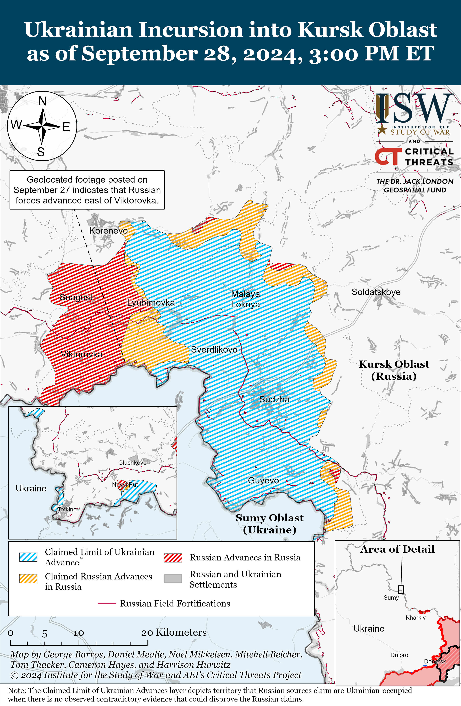
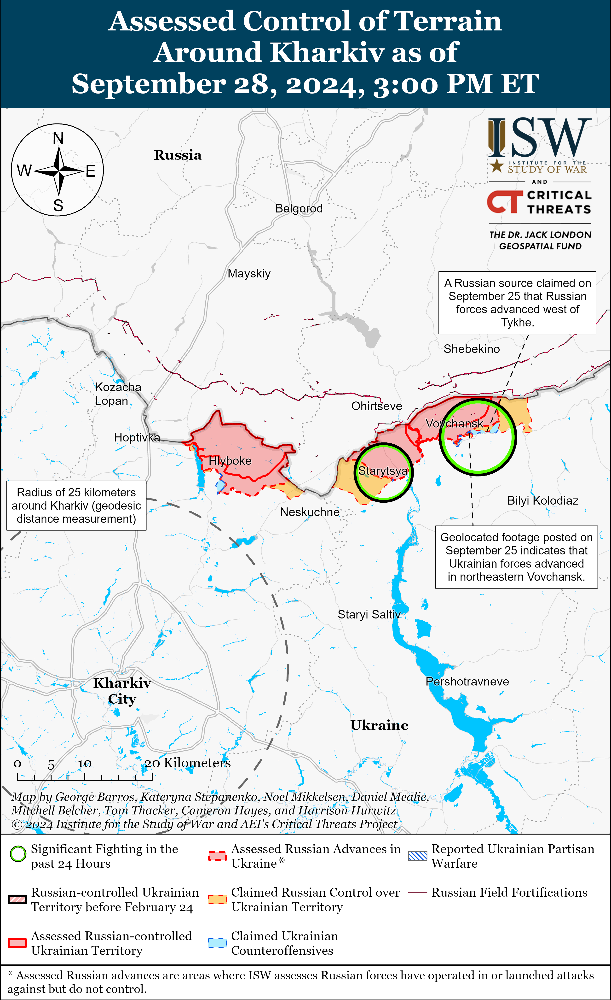
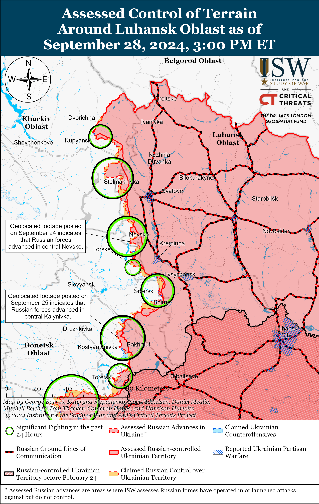
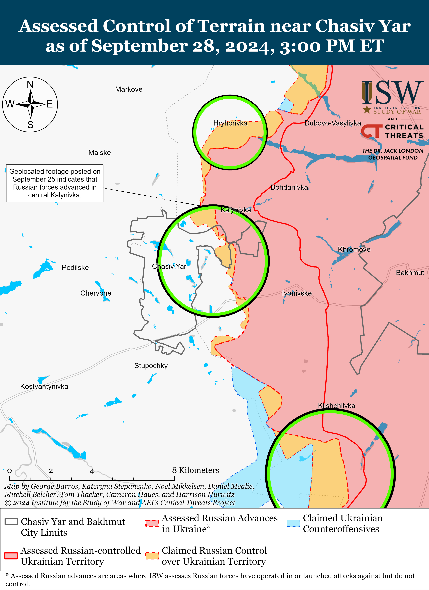
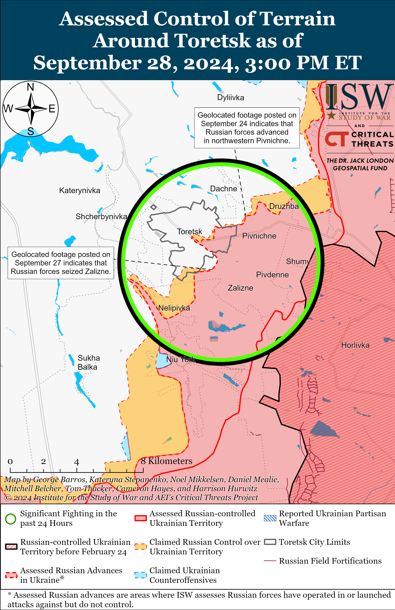
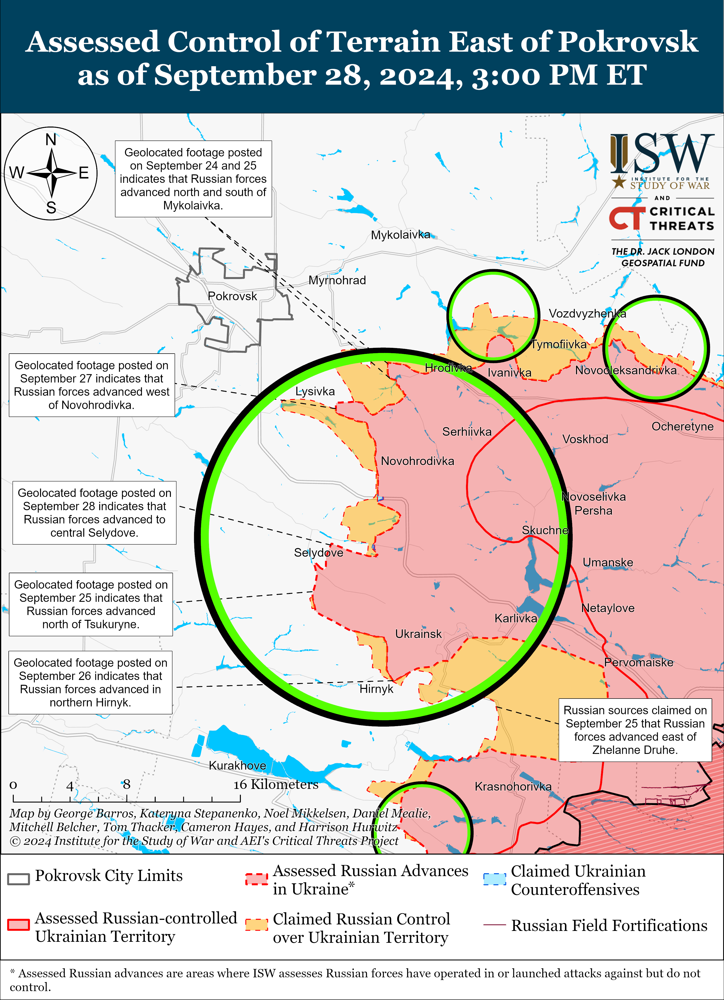
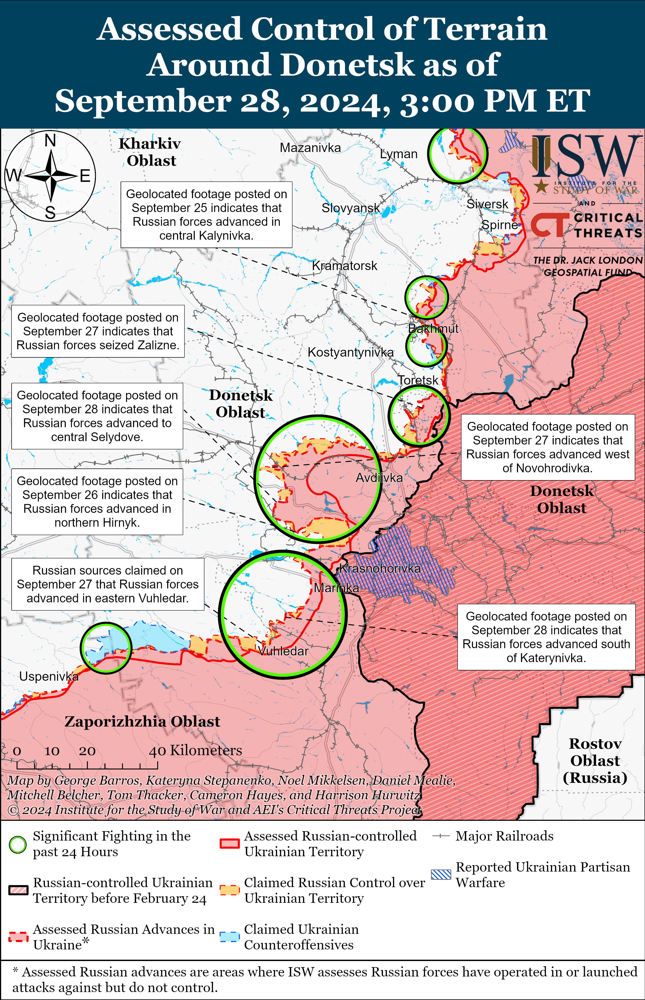
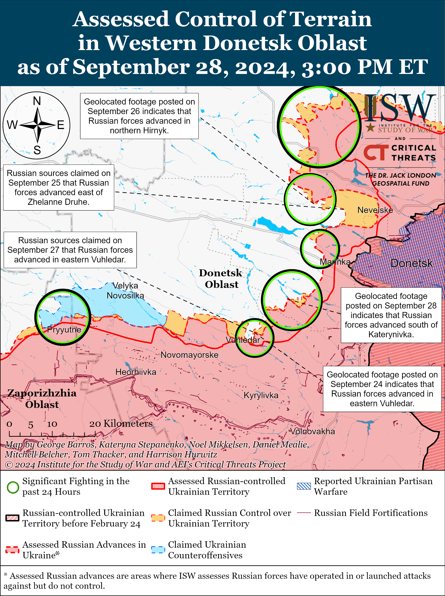
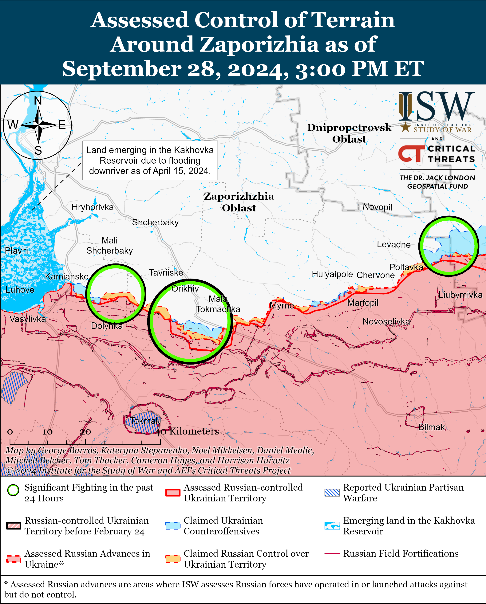
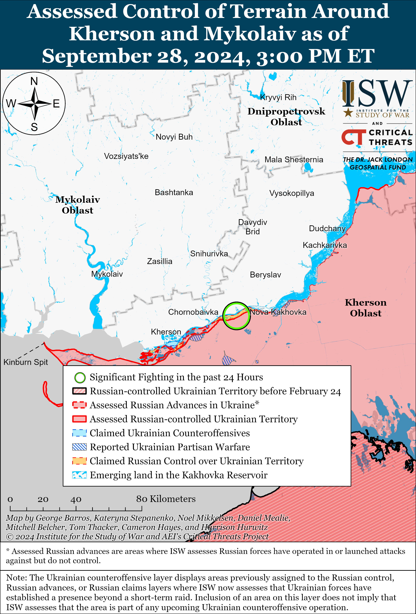

# Russian Offensive Campaign Assessment, September 28, 2024

**Christina Harward, Davit Gasparyan, Angelica Evans, Riley Bailey, and Frederick W. Kagan**

**September 28, 2024, 3:30pm ET**

**Click**[**here**](https://storymaps.arcgis.com/stories/36a7f6a6f5a9448496de641cf64bd375)**to see ISW’s interactive map of the Russian invasion of Ukraine. This map is updated daily alongside the static maps present in this report.**

**Click**[**here**](https://storymaps.arcgis.com/stories/83a2f24901c941d581c0c523ecd2619b)**to see ISW’s interactive map of Ukraine’s offensive in Kursk Oblast.**

**Click**[**here**](https://understandingwar.maps.arcgis.com/apps/instant/3dviewer/index.html?appid=1602762dbcde419bb957dea358449580)**to see ISW’s 3D control of terrain topographic map of Ukraine. Use of a computer (not a mobile device) is strongly recommended for using this data-heavy tool.**

**Click**[**here**](https://storymaps.arcgis.com/stories/733fe90805894bfc8562d90b106aa895)**to access ISW’s archive of interactive time-lapse maps of the Russian invasion of Ukraine. These maps complement the static control-of-terrain map that ISW produces daily by showing a dynamic frontline. ISW will update this time-lapse map archive monthly.**

**Note: The data cut-off for this product was 11:30am ET on September 28. ISW will cover subsequent reports in the September 29 Russian Offensive Campaign Assessment.**

**Western officials continue to highlight efforts by the People’s Republic of China (PRC) to support the Russian war effort in Ukraine.***The Times*reported on September 27 that Western officials revealed that an unspecified PRC company is sending a range of military drones to Russia for testing and eventual use by Russian forces in Ukraine.[1] A Western official reportedly stated that the PRC company signed the agreement with Russia in 2023 and that there is “clear evidence that PRC companies are supplying Russia with deadly weapons for use in Ukraine.” *The Times*reported that the Western official confirmed a September 25 report from *Reuters*about Russia’s secret weapons program in the PRC to develop long-range attack drones for use in Ukraine.[2] US Secretary of State Antony Blinken stated on September 27 that roughly 70 percent of Russian imports of machine tools and 90 percent of microelectronic imports come from the PRC and Hong Kong and that Russia is using these imports to produce missiles, rockets, armored vehicles, and munitions.[3] Blinken stated that the PRC’s actions do not “add up” since the PRC speaks about wanting peace in Ukraine but is allowing PRC companies to take actions that are helping the Russian war effort. The PRC has repeatedly attempted to depict itself as a neutral mediator in the war in Ukraine, and continued reports of PRC aid to Russia’s war effort undermine this claim.[4]

**Ukrainian media reported on September 28 that unspecified Russian resistance movements, in coordination with the Ukrainian Main Military Intelligence Directorate (GUR), killed the Head of the Russian Ministry of Defense’s (MoD) 924th State Center for Unmanned Aviation Colonel Aleksei Kolomeystev in Koloma, Moscow Oblast.**[5] GUR stated that Kolomeystev was involved in training Russian drone operators, including operators and support staff for Shahed-type kamikaze drones.[6] GUR posted a photo of Kolomeystev’s body but did not acknowledge any involvement in the killing.[7] Russian officials have not officially acknowledged the assassination.

**The Russian Ministry of Foreign Affairs (MFA) strongly condemned on September 28 Israel’s “political assassination” of Hezbollah Secretary General Sayyed Hassan Nasrallah.**[8] The Russian MFA responded to the Israeli airstrike on Beirut, Lebanon that killed Nasrallah and advocated for an immediate cessation to hostilities, stating that Israel will bear full responsibility for any subsequent escalation in the Middle East. Russian Foreign Minister Sergei Lavrov also issued a joint condemnation of Israel’s airstrikes in Syria on September 28 during a meeting with the Turkish and Iranian foreign ministers.[9]

**Key Takeaways:**

- **Western officials continue to highlight efforts by the People’s Republic of China (PRC) to support the Russian war effort in Ukraine.**
- **Ukrainian media reported on September 28 that unspecified Russian resistance movements, in coordination with the Ukrainian Main Military Intelligence Directorate (GUR), killed the Head of the Russian Ministry of Defense’s (MoD) 924th State Center for Unmanned Aviation Colonel Aleksei Kolomeystev in Koloma, Moscow Oblast.**
- **The Russian Ministry of Foreign Affairs (MFA) strongly condemned on September 28 Israel’s “political assassination” of Hezbollah Secretary General Sayyed Hassan Nasrallah.**
- **Russian forces recently marginally advanced in Kursk Oblast.**
- **Russian forces recently advanced near Kupyansk, Selydove, and Vuhledar.**
- **Russia is reportedly implementing legislation that allows Russian authorities to release those accused of crimes from criminal liabilities if the accused signs a contract with the Russian Ministry of Defense (MoD).**

****

***We do not report in detail on Russian war crimes because these activities are well-covered in Western media and do not directly affect the military operations we are assessing and forecasting. We will continue to evaluate and report on the effects of these criminal activities on the Ukrainian military and the Ukrainian population and specifically on combat in Ukrainian urban areas. We utterly condemn Russian violations of the laws of armed conflict and the Geneva Conventions and crimes against humanity even though we do not describe them in these reports.***

- Ukrainian Operations in the Russian Federation
- Russian Main Effort – Eastern Ukraine (comprised of three subordinate main efforts)
- Russian Subordinate Main Effort #1 – Push Ukrainian forces back from the international border with Belgorod Oblast and approach to within tube artillery range of Kharkiv City
- Russian Subordinate Main Effort #2 – Capture the remainder of Luhansk Oblast and push westward into eastern Kharkiv Oblast and encircle northern Donetsk Oblast
- Russian Subordinate Main Effort #3 – Capture the entirety of Donetsk Oblast
- Russian Supporting Effort – Southern Axis
- Russian Air, Missile, and Drone Campaign
- Russian Mobilization and Force Generation Efforts
- Russian Technological Adaptations
- Activities in Russian-occupied areas
- Ukrainian Defense Industrial Base Efforts
- Russian Information Operations and Narratives
- Significant Activity in Belarus

**Ukrainian Operations in the Russian Federation**

Ukrainian forces continued offensive operations in Glushkovsky Raion, Kursk Oblast on September 28 but did not make any confirmed gains. The Russian Ministry of Defense (MoD) claimed that Ukrainian forces unsuccessfully attacked near Novy Put and Medvezhye (both south of Glushkovo).[10]

Ukrainian forces continued offensive operations within the Ukrainian salient in Kursk Oblast on September 28 but did not make any confirmed gains. Russian sources, including the Russian MoD, claimed that Russian forces repelled Ukrainian attacks southeast of Korenevo near Lyubimovka, east of Korenevo near Olgovka and Kremyanoye, north of Sudzha near Kamyshevka, and northeast of Sudzha near Cherkasskoye Porechnoye.[11]

Russian forces recently regained lost positions within the Ukrainian salient in Kursk Oblast. Geolocated footage published on September 27 indicates that Russian forces recently marginally advanced east of Viktorovka (south of Korenevo).[12] Russian sources claimed that Chechen “Akhmat” Spetsnaz forces advanced almost one kilometer near Nizhnaya Parovaya (northeast of Sudzha) and that Russian forces advanced near Plekhovo (southeast of Sudzha).[13] ISW has not observed confirmation of these claims, however. Elements of the Russian 83rd Airborne (VDV) Brigade are reportedly operating in Kursk Oblast.[14]

**Russian Main Effort – Eastern Ukraine**

**Russian Subordinate Main Effort #1 – Kharkiv Oblast (Russian objective: Push Ukrainian forces back from the international border with Belgorod Oblast and approach to within tube artillery range of Kharkiv City)**

Russian forces continued ground assaults north of Kharkiv City near Hlyboke and northeast of Kharkiv City near Vovchansk and Tykhe on September 27 and 28.[15] A Russian milblogger claimed that Russian forces advanced 100 meters from northern Tykhe on September 27, but ISW has not observed visual confirmation of this claim.[16] Russian milbloggers claimed on September 27 and 28 that Russian forces repelled a Ukrainian assault within Vovchansk and that Ukrainian forces do not have full control over the Vovchansk Aggregate Plant.[17]

**Russian Subordinate Main Effort #2 – Luhansk Oblast (Russian objective: Capture the remainder of Luhansk Oblast and push westward into eastern Kharkiv Oblast and northern Donetsk Oblast)**

Russian forces recently advanced southeast of Kupyansk amid ongoing Russian offensive operations along the Kupyansk-Svatove-Kreminna line on September 28. Geolocated footage published on September 28 indicates that Russian forces recently advanced southeast of Hlushkivka (southeast of Kupyansk).[18] Russian forces conducted offensive operations northeast of Kupyansk near Synkivka and Kucherivka; southeast of Kupyansk near Stepova Novoselivka; northwest of Svatove near Lozova, Tabaivka, Hlushkivka, and Kruhlyakivka; northwest of Kreminna near Hrekivka, Nevske, Makiivka, and Novosadove; and west of Kreminna near Terny, Torske, and Zarichne on September 27 and 28.[19] A Russian milblogger claimed that Ukrainian forces counterattacked near Nevske.[20] The commander of a Ukrainian battalion operating in the Svatove direction stated that Russian forces have completely seized Pishchane (northwest of Svatove) and are two kilometers from the Oskil River.[21] ISW has only observed confirmation that Russian forces are roughly three kilometers from the Oskil River. The Ukrainian commander stated that Russian forces have changed tactics and are using armored vehicles to conduct assaults again. The spokesperson of a Ukrainian brigade operating in the Lyman direction stated that Russian forces have accumulated armored vehicles and replenished units with poorly trained personnel in order to resume assault operations in the area.[22] Elements of the Russian 144th Motorized Rifle Division (20th Combined Arms Army, Moscow Military District [MMD]) are reportedly operating near Nevske.[23]

**Russian Subordinate Main Effort #3 – Donetsk Oblast (Russian objective: Capture the entirety of Donetsk Oblast, the claimed territory of Russia’s proxies in Donbas)**

Russian forces attacked northeast of Siversk near Bilohorivka on September 28, but there were no confirmed changes to the frontline in the Siversk direction.[24]

Russian forces continued offensive operations near Chasiv Yar on September 28, but there were no confirmed changes to the frontline. A Russian milblogger claimed that Russian forces advanced north of Chasiv Yar near Kalynivka, but ISW has not observed visual confirmation of this claim.[25] Russian forces continued assaults north of Chasiv Yar near Kalynivka and Hryhorivka; near Chasiv Yar itself; south of Chasiv Yar near Predtechyne, Bila Hora, and Stupochky; and southeast of Chasiv Yar near Kurdyumivka on September 27 and 28.[26] Elements of the Russian “Volki” Brigade’s 1st Assault Detachment and the 88th “Hispaniola” Volunteer Brigade (both of the Russian Volunteer Corps) are reportedly operating near Chasiv Yar.[27]

Russian forces continued offensive operations near Toretsk on September 27, but there were no confirmed changes to the frontline. Russian milbloggers claimed that Russian forces advanced further in central Toretsk, but ISW has not observed confirmation of this claim.[28] Russian forces continued assaults near Toretsk itself, south of Toretsk near Nelipivka and Niu York, and west of Toretsk in the direction of Shcherbynivka on September 27 and 28.[29]

Russian forces recently advanced into Selydove (southeast of Pokrovsk) amid continued offensive operations east and southeast of Pokrovsk on September 28. Geolocated footage published on September 27 indicates that Russian forces recently advanced into southern Selydove along Shevchenka Street and south of the settlement.[30] Russian milbloggers noted that the footage shows a single Russian vehicle advancing from the direction of Ukrainsk (southeast of Selydove) and questioned why Russian forces are conducting assaults with such limited forces and means in the area.[31] The spokesperson of a Ukranian brigade operating near Selydove stated on September 28 that Russian forces attacked near Selydove in small infantry groups over the last week and that Russian forces are not using armored vehicles during their attacks.[32] The spokesperson noted that Russian forces are not conducting frontal assaults against Selydove but appear to be trying to encircle the settlement from the north and south. Russian milbloggers claimed that Russian forces also advanced 450 meters in depth north of Mykolaivka (east of Pokrovsk and just west of Hrodivka) and advanced northwest of Novohrodivka in the direction of Sukhyi Yar (both southeast of Pokrovsk), but ISW has not observed visual confirmation of these claims.[33] Russian forces continued assaults east of Pokrovsk near Vozdvyzhenka, Novotoretske, Mykolaivka, Hrodivka, and Krutyi Yar; south of Pokrovsk near Dachenske; and southeast of Pokrovsk near Novohrodivka, Lysivka, Marynivka, Selydove, and Tsukuryne on September 27 and 28.[34] Elements of the Russian 15th Motorized Rifle Brigade (2nd Combined Arms Army [CAA], Central Military District [CMD]) are reportedly operating near Mykolaivka (west of Hrodivka).[35]

Russian forces conducted assaults west of Donetsk City near Heorhiivka on September 27 and 28, but there were no confirmed changes to the frontline in this area.[36]

Russian forces recently advanced southwest of Donetsk City amid continued offensive operations in the area on September 28. Geolocated footage published on September 28 indicates that Russian forces recently advanced south of Katerynivka (northeast of Vuhledar) during a reinforced platoon-sized mechanized assault.[37] Russian milbloggers claimed that Russian forces continued to advance in eastern Vuhledar and on Vuheldar’s eastern and western flanks, but ISW has not observed visual evidence of further Russian advances in the area.[38] Russian forces conducted assaults northeast of Vuhledar near Kostyantynivka, Katerynivka, and Vodyane; near and in Vuhledar itself; and west of Vuhledar in the direction of Bohoyavlenka on September 27 and 28.[39] Elements of the Russian 36th Motorized Rifle Brigade and 43rd Spetsnaz Company (both of the 29th CAA, EMD) are reportedly operating near Vuhledar.[40]

Russian forces continued assaults in the Donetsk-Zaporizhia Oblast border area near Novodarivka (southeast of Velyka Novosilka) on September 27 and 28, but there were no confirmed changes to the frontline in this area.[41] Ukrainian Tavriisk Group of Forces Spokesperson Colonel Vladyslav Voloshyn stated on September 28 that Russian forces are concentrating personnel near Pryyutne (southwest of Velyka Novosilka) in preparation for future assaults in the area.[42]

**Russian Supporting Effort – Southern Axis (Russian objective: Maintain frontline positions and secure rear areas against Ukrainian strikes)**

A Russian milblogger claimed on September 27 that Russian forces advanced to the outskirts of Hulyaipole in eastern Zaporizhia Oblast, but ISW has not observed confirmation of this claim.[43]

Russian forces conducted offensive operations in western Zaporizhia Oblast on September 28, but there were no confirmed changes to the frontline. The Ukrainian General Staff reported that Russian forces attacked near Robotyne and Mali Shcherbaky (northwest of Robotyne) on September 28.[44] A Russian milblogger claimed that Russian forces are unlikely to conduct major offensive operations in the Zaporizhia direction and that significant Ukrainian and Russian defensive lines in the area will make any assault costly and unlikely to result in significant gains.[45] Elements of the Russian 503rd Motorized Rifle Regiment (19th Motorized Rifle Division, 58th Combined Arms Army [CAA], Southern Military District [SMD]) are reportedly operating in the Orikhiv direction.[46]

The Ukrainian General Staff reported that Russian forces conducted multiple attacks in the Dnipro (Kherson) direction on September 27 and 28.[47] A Russian milblogger claimed that Russian forces have pushed Ukrainian forces out of unspecified, large islands in the Dnipro River Delta but that Ukrainian forces continue to operate in unspecified areas of the delta.[48] Elements of the Russian 76th Airborne (VDV) Division are reportedly clearing Krynky in east (left) bank Kherson Oblast.[49]

**Russian Air, Missile, and Drone Campaign (Russian Objective: Target Ukrainian military and civilian infrastructure in the rear and on the frontline)**

Russian forces conducted a series of drone and missile strikes against Ukraine on the night of September 27 to 28. The Ukrainian Air Force reported that Russian forces launched two Iskander-M/KN-23 ballistic missiles from occupied Crimea; two Kh-59/69 cruise missiles from airspace over occupied Zaporizhia Oblast; and 73 Shahed-136/131 drones from Kursk and Oryol oblasts; Primorsko-Akhtarsk, Krasnodar Krai; and occupied Cape Chauda, Crimea.[50] The Ukrainian Air Force reported that Ukrainian forces downed two Kh-59/69 cruise missiles and 69 Shahed drones over Kyiv, Cherkasy, Vinnytsia, Kirovohrad, Rivne, Dnipropetrovsk, Zaporizhia, Poltava, Sumy, Kharkiv, Kherson, Odesa, and Mykolaiv oblasts; that three drones were “lost” due to unspecified Ukrainian drone countermeasures; and that one drone flew back into Russian airspace. Russian sources claimed on September 28 that Russian forces struck an ammunition depot at the Pivdenmash plant in Dnipro City, Dnipropetrovsk Oblast with an Iskander-M ballistic missile.[51] Kyiv City Military Administration Head Serhiy Popko stated on September 28 that Russian forces conducted the tenth drone strike targeting Kyiv City since the beginning of September 2024 and that Ukrainian forces downed 18 drones near the city.[52] Odesa Oblast Military Administration Head Oleh Kiper reported on September 28 that Russian forces struck a recreation center in Bilhorod-Dnistrovskyi Raion, Odesa Oblast with an unspecified missile.[53] Ukrainian officials reported on September 28 that Russian forces targeted Sumy Oblast with Shahed drones and struck a medical facility.[54]

**Russian Mobilization and Force Generation Efforts (Russian objective: Expand combat power without conducting general mobilization)**

Russia is reportedly implementing legislation that allows Russian authorities to release those accused of crimes from criminal liabilities if the accused signs a contract with the Russian MoD.[55] Russian opposition outlets reported on September 28 that Russian authorities are actively offering detainees in Bryansk, Nizhny Novgorod, and Novosibirsk oblasts; Komi Republic; Altai Krai; and occupied Crimea the opportunity of release from criminal liabilities in exchange for signing a military contract.[56]

The Institute for Science and International Security published a report on September 26 estimating that the Alabuga Special Economic Zone (SEZ) in the Republic of Tatarstan achieved an annual production rate of roughly 4,500 Shahed-136 drones as of late April 2024 and may have achieved an annual production rate of over 6,000 Shaheds by the end of August 2024.[57] The Institute for Science and International Security estimated that the Alabuga SEZ manufactured 256 Shahed drones on average per month between April and December 2023 and that the Alabuga SEZ produced 444 Shahed drones on average per month in 2024 as of August 2024.[58] The Institute for Science and International Security added that Ukraine’s high interception rate of Shaheds during Russian strikes means that the Alabuga SEZ must maintain a high production rate and acquire a larger number of electronics and other components from abroad.[59]

**Russian Technological Adaptations (Russian objective: Introduce technological innovations to optimize systems for use in Ukraine)**

Nothing significant to report.

**Ukrainian Defense Industrial Efforts (Ukrainian objective: Develop its defense industrial base to become more self-sufficient in cooperation with US, European, and international partners)**

*ISW is suspending publishing coverage of Ukrainian defense industrial efforts until further notice.*

**Activities in Russian-occupied areas (Russian objective: Consolidate administrative control of annexed areas; forcibly integrate Ukrainian citizens into Russian sociocultural, economic, military, and governance systems)**

*ISW is not publishing coverage of Russian-occupied areas today.*

**Russian Information Operations and Narratives**

Russian authorities continue to charge Western journalists for illegally crossing into Kursk Oblast in an effort to directly tie the West to the Ukrainian incursion in Kursk Oblast and accuse the West of escalation.[60]

Ukrainian Donetsk Oblast Military Administration Head Vadym Filashkin stated on September 23 that Russian sources circulated a video of him dubbed with a false voice in order to promote false information about the situation in Pokrovsk Raion and cause panic.[61]

**Significant activity in Belarus (Russian efforts to increase its military presence in Belarus and further integrate Belarus into Russian-favorable frameworks and Wagner Group activity in Belarus)**

Belarusian Foreign Minister Maxim Ryzhenkov claimed on September 27 that Russia and Belarus will sign an agreement on security guarantees for the 25th anniversary of the formation of the Union State, which will include an unspecified provision on nuclear weapons.[62]

**Note: ISW does not receive any classified material from any source, uses only publicly available information, and draws extensively on Russian, Ukrainian, and Western reporting and social media as well as commercially available satellite imagery and other geospatial data as the basis for these reports. References to all sources used are provided in the endnotes of each update.**

---

[1] https://www.thetimes.com/world/russia-ukraine-war/article/china-supplied-weapons-to-russia-ukraine-war-lk7j2jb8v

[2] https://isw.pub/UkrWar092524; https://www.thetimes.com/world/russia-ukraine-war/article/china-supplied-weapons-to-russia-ukraine-war-lk7j2jb8v

[3] https://www.reuters.com/world/blinken-chinas-wang-meet-un-sidelines-2024-09-27/

[4] https://isw.pub/UkrWar092524

[5] https://armyinform.com dot ua/2024/09/28/na-rosiyi-likviduvaly-polkovnyka-yakyj-vidav-shahedamy/; https://gur.gov dot ua/content/likvidatsiia-voiennoho-zlochyntsia-na-rosii-znaishly-mertvym-polkovnyka-armii-rf.html; ; https://t.me/DIUkraine/4556;

[6] https://t.me/DIUkraine/4556;

[7] https://t.me/DIUkraine/4556

[8] https://t.me/tass\_agency/275801

[9] https://t.me/tass\_agency/275704

[10] https://t.me/mod\_russia/43898

[11] https://t.me/rybar/63900; https://t.me/dva\_majors/53792

[12] https://t.me/officer\_alex33/3831; https://t.me/creamy\_caprice/6955

[13] https://t.me/tass\_agency/275702; https://t.me/dva\_majors/53792

[14] https://t.me/DnevnikDesantnika/16167

[15] https://www.facebook.com/GeneralStaff.ua/posts/pfbid02rGoiREqQCq1xdGGmgovHDW8Et6S2qFuhpis3Gx1bMNQNZ5qwM9u1ENXNvw1hRxRMl ; https://www.facebook.com/GeneralStaff.ua/posts/pfbid0tTvmUNFEFzqrW5wcm1Gvq7snAH9KSpiq7v1TxJZyuXBJD3J6bZrRseNo1WB198KMl ; https://www.facebook.com/GeneralStaff.ua/posts/pfbid024yks44gkGnDsnUMVu27tBhF9LcmkLrGEvBffSXYUPKBSRtNmW9VG3dvvafcCX7TEl ; https://t.me/wargonzo/22341

[16] https://t.me/DnevnikDesantnika/16156

[17] https://t.me/DnevnikDesantnika/16156 ; https://t.me/pograni4nik\_iz\_ada/7625 ; https://t.me/motopatriot/28045

[18] https://t.me/WarArchive\_ua/20598; https://t.me/WarArchive\_ua/20599; https://t.me/fedorenkoys/548

[19] https://www.facebook.com/GeneralStaff.ua/posts/pfbid02rGoiREqQCq1xdGGmgovHDW8Et6S2qFuhpis3Gx1bMNQNZ5qwM9u1ENXNvw1hRxRMl; https://www.facebook.com/GeneralStaff.ua/posts/pfbid0tTvmUNFEFzqrW5wcm1Gvq7snAH9KSpiq7v1TxJZyuXBJD3J6bZrRseNo1WB198KMl; https://www.facebook.com/GeneralStaff.ua/posts/pfbid024yks44gkGnDsnUMVu27tBhF9LcmkLrGEvBffSXYUPKBSRtNmW9VG3dvvafcCX7TEl

[20] https://t.me/motopatriot/28021

[21] https://t.me/weukrainetv/77968

[22] https://armyinform dot com.ua/2024/09/27/u-sylah-oborony-poyasnyly-aktyvizacziyu-rosiyan-na-lymanskomu-napryamku/; https://www.youtube.com/watch?v=MPWbKX6T75k

[23] https://t.me/boris\_rozhin/138866

[24] https://www.facebook.com/GeneralStaff.ua/posts/pfbid02rGoiREqQCq1xdGGmgovHDW8Et6S2qFuhpis3Gx1bMNQNZ5qwM9u1ENXNvw1hRxRMl

[25] https://t.me/wargonzo/22341

[26] https://www.facebook.com/GeneralStaff.ua/posts/pfbid02rGoiREqQCq1xdGGmgovHDW8Et6S2qFuhpis3Gx1bMNQNZ5qwM9u1ENXNvw1hRxRMl ; https://www.facebook.com/GeneralStaff.ua/posts/pfbid0tTvmUNFEFzqrW5wcm1Gvq7snAH9KSpiq7v1TxJZyuXBJD3J6bZrRseNo1WB198KMl ; https://www.facebook.com/GeneralStaff.ua/posts/pfbid024yks44gkGnDsnUMVu27tBhF9LcmkLrGEvBffSXYUPKBSRNmW9VG3dvvafcCX7TEl ; https://t.me/dva\_majors/53792

[27] https://t.me/dva\_majors/53799 ; https://t.me/dva\_majors/53809 ; https://t.me/tass\_agency/275733

[28] https://t.me/DnevnikDesantnika/16178 ; https://t.me/motopatriot/28021

[29] https://www.facebook.com/GeneralStaff.ua/posts/pfbid02rGoiREqQCq1xdGGmgovHDW8Et6S2qFuhpis3Gx1bMNQNZ5qwM9u1ENXNvw1hRxRMl ; https://www.facebook.com/GeneralStaff.ua/posts/pfbid0tTvmUNFEFzqrW5wcm1Gvq7snAH9KSpiq7v1TxJZyuXBJD3J6bZrRseNo1WB198KMl ; https://www.facebook.com/GeneralStaff.ua/posts/pfbid024yks44gkGnDsnUMVu27tBhF9LcmkLrGEvBffSXYUPKBSRtNmW9VG3dvvafcCX7TEl

[30] https://t.me/karadag15brop/58; https://t.me/creamy\_caprice/6954; https://x.com/EjShahid/status/1839778198063587696 ; https://t.me/ghost\_of\_khortytsia/151; https://t.me/WarArchive\_ua/20600

[31] https://t.me/z\_arhiv/28285 ; https://t.me/motopatriot/28037 ; https://t.me/motopatriot/28040 ;

[32] https://suspilne dot media/donbas/846241-vnoci-diali-bils-pidgotovleni-grupi-oborona-mista-selidove-ak-die-armia-rf-rozkazali-u-brigadi-kara-dag/

[33] https://t.me/dva\_majors/53792 ; https://t.me/motopatriot/28021 ; https://t.me/DnevnikDesantnika/16175 ; https://t.me/RVvoenkor/77737

[34] https://www.facebook.com/GeneralStaff.ua/posts/pfbid02rGoiREqQCq1xdGGmgovHDW8Et6S2qFuhpis3Gx1bMNQNZ5qwM9u1ENXNvw1hRxRMl ; https://www.facebook.com/GeneralStaff.ua/posts/pfbid0tTvmUNFEFzqrW5wcm1Gvq7snAH9KSpiq7v1TxJZyuXBJD3J6bZrRseNo1WB198KMl ; https://www.facebook.com/GeneralStaff.ua/posts/pfbid024yks44gkGnDsnUMVu27tBhF9LcmkLrGEvBffSXYUPKBSRtNmW9VG3dvvafcCX7TEl ; https://t.me/RVvoenkor/77737 ; https://t.me/dva\_majors/53792

[35] https://t.me/boris\_rozhin/138951

[36] https://www.facebook.com/GeneralStaff.ua/posts/pfbid02rGoiREqQCq1xdGGmgovHDW8Et6S2qFuhpis3Gx1bMNQNZ5qwM9u1ENXNvw1hRxRMl ; https://www.facebook.com/GeneralStaff.ua/posts/pfbid0tTvmUNFEFzqrW5wcm1Gvq7snAH9KSpiq7v1TxJZyuXBJD3J6bZrRseNo1WB198KMl ; https://www.facebook.com/GeneralStaff.ua/posts/pfbid024yks44gkGnDsnUMVu27tBhF9LcmkLrGEvBffSXYUPKBSRtNmW9VG3dvvafcCX7TEl

[37] https://t.me/voin\_dv/11040; https://t.me/creamy\_caprice/6956

[38] https://t.me/dva\_majors/53792 ; https://t.me/motopatriot/28021 ; https://t.me/DnevnikDesantnika/16169 ; https://t.me/wargonzo/22341 ; https://t.me/DnevnikDesantnika/16180 ; https://t.me/wargonzo/22348 ; https://t.me/boris\_rozhin/138954

[39] https://www.facebook.com/GeneralStaff.ua/posts/pfbid02rGoiREqQCq1xdGGmgovHDW8Et6S2qFuhpis3Gx1bMNQNZ5qwM9u1ENXNvw1hRxRMl ; https://www.facebook.com/GeneralStaff.ua/posts/pfbid0tTvmUNFEFzqrW5wcm1Gvq7snAH9KSpiq7v1TxJZyuXBJD3J6bZrRseNo1WB198KMl ; https://www.facebook.com/GeneralStaff.ua/posts/pfbid024yks44gkGnDsnUMVu27tBhF9LcmkLrGEvBffSXYUPKBSRtNmW9VG3dvvafcCX7TEl

[40] https://t.me/voin\_dv/11045 ; https://t.me/voin\_dv/11046

[41] https://www.facebook.com/GeneralStaff.ua/posts/pfbid024yks44gkGnDsnUMVu27tBhF9LcmkLrGEvBffSXYUPKBSRtNmW9VG3dvvafcCX7TEl ; https://www.facebook.com/GeneralStaff.ua/posts/pfbid0tTvmUNFEFzqrW5wcm1Gvq7snAH9KSpiq7v1TxJZyuXBJD3J6bZrRseNo1WB198KMl

[42] https://armyinform.com dot ua/2024/09/28/okupanty-gotuyutsya-shturmuvaty-na-pivdni-de-same-planuye-vdaryty-vorog-povidomyly-v-zsu/

[43] https://t.me/DnevnikDesantnika/16163

[44] https://www.facebook.com/GeneralStaff.ua/posts/pfbid0tTvmUNFEFzqrW5wcm1Gvq7snAH9KSpiq7v1TxJZyuXBJD3J6bZrRseNo1WB198KMl

[45] https://t.me/rybar/63921

[46] https://t.me/rogozin\_do/6388

[47] https://www.facebook.com/GeneralStaff.ua/posts/pfbid02rGoiREqQCq1xdGGmgovHDW8Et6S2qFuhpis3Gx1bMNQNZ5qwM9u1ENXNvw1hRxRMl; https://www.facebook.com/GeneralStaff.ua/posts/pfbid0tTvmUNFEFzqrW5wcm1Gvq7snAH9KSpiq7v1TxJZyuXBJD3J6bZrRseNo1WB198KMl; https://www.facebook.com/GeneralStaff.ua/posts/pfbid024yks44gkGnDsnUMVu27tBhF9LcmkLrGEvBffSXYUPKBSRtNmW9VG3dvvafcCX7TEl

[48] https://t.me/boris\_rozhin/138949

[49] https://t.me/DnevnikDesantnika/16167

[50] https://t.me/kpszsu/20159 ; https://www.facebook.com/GeneralStaff.ua/posts/pfbid02DraDbSWLc81MpDi281vG6WxPQKmKiHe7v5aZEnDp8nKoVgJWF1FDjCd1VZX3p73rl

[51] https://t.me/RVvoenkor/77755; https://t.me/mod\_russia/43889 ; https://t.me/epoddubny/21182 ; https://t.me/epoddubny/21192

[52] https://t.me/VA\_Kyiv/8256

[53] https://t.me/odeskaODA/6815 ; https://armyinform.com dot ua/2024/09/28/okupanty-vdaryly-raketoyu-po-bazi-vidpochynku-na-odeshhyni/

[54] https://t.me/Klymenko\_MVS/1160 ; https://t.me/sotaproject/87799 ; https://armyinform.com dot ua/2024/09/28/unaslidok-ataky-po-likarni-u-sumah-zbilshylas-kilkist-zagyblyh-ta-postrazhdalyh/ ; https://t.me/dsns\_telegram/33152 ; https://t.me/Sumy\_news\_ODA/30211 ; https://t.me/kpszsu/20165 ; https://t.me/kobzarartemsn/3825; https://suspilne dot media/sumy/846313-u-sumah-bulo-dva-vlucanna-sahediv/ ; https://t.me/V\_Zelenskiy\_official/11848

[55] https://t.me/astrapress/65316 ; https://t.me/mobilizationnews/20390

[56] https://t.me/astrapress/65316 ; https://t.me/mobilizationnews/20390

[57] https://isis-online.org/isis-reports/mobile/update-alabugas-production-rate-of-shahed-136-drones

[58] https://isis-online.org/isis-reports/mobile/update-alabugas-production-rate-of-shahed-136-drones

[59] https://isis-online.org/isis-reports/mobile/update-alabugas-production-rate-of-shahed-136-drones

[60] https://t.me/MID\_Russia/45860

[61] https://t.me/VadymFilashkin/4358

[62] https://t.me/tass\_agency/275693
