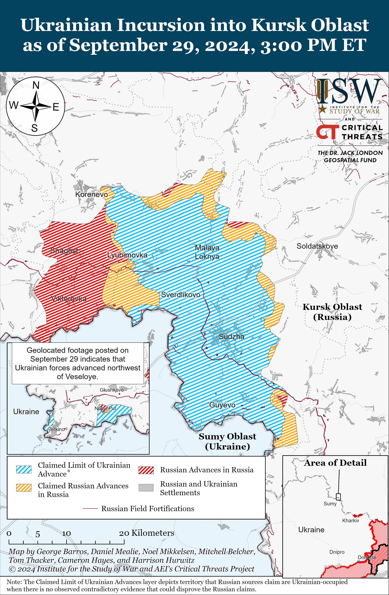
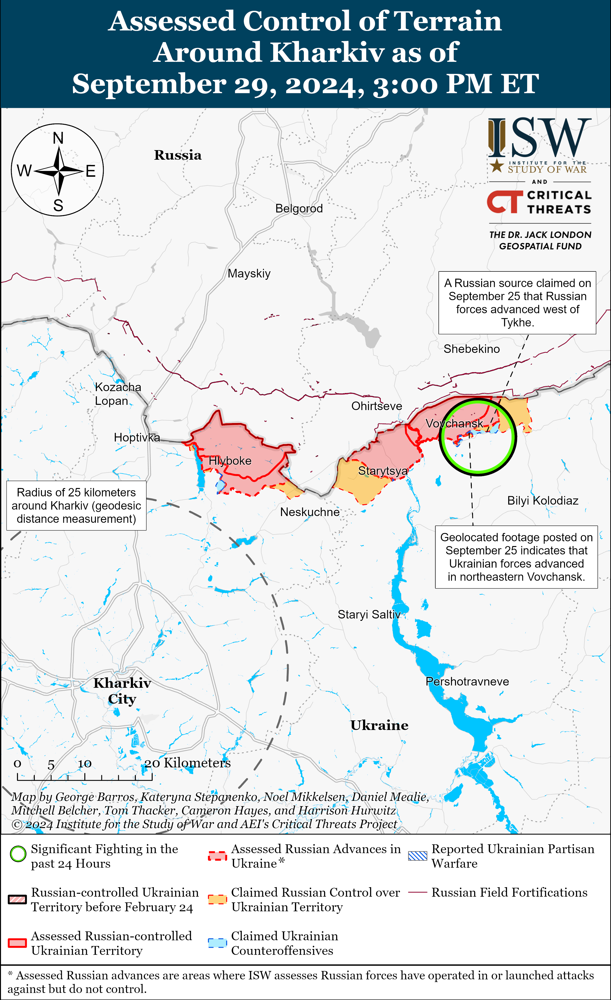
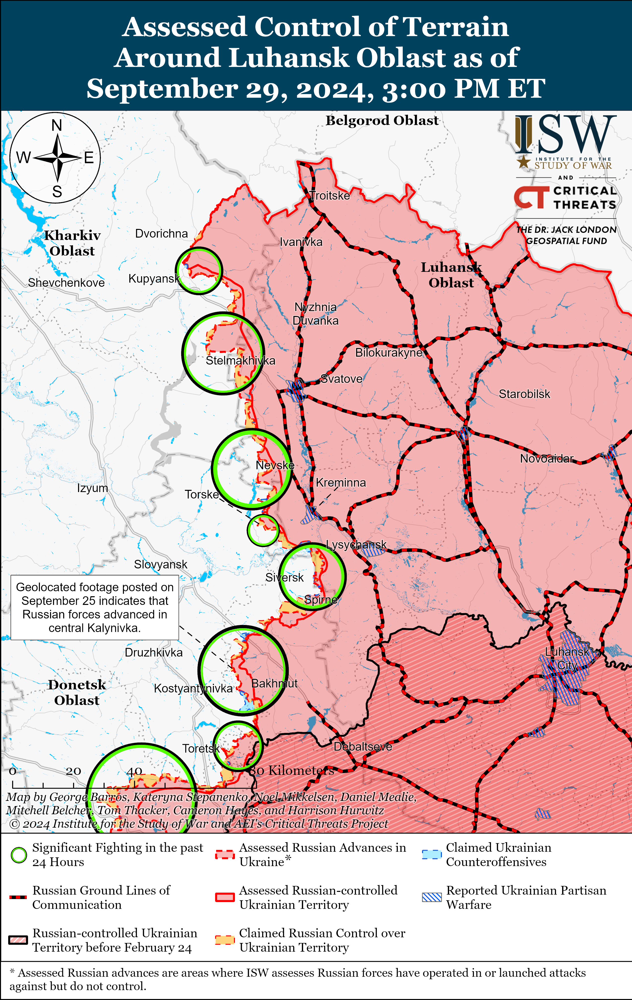
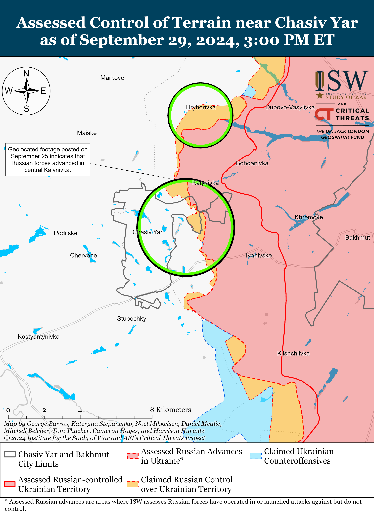
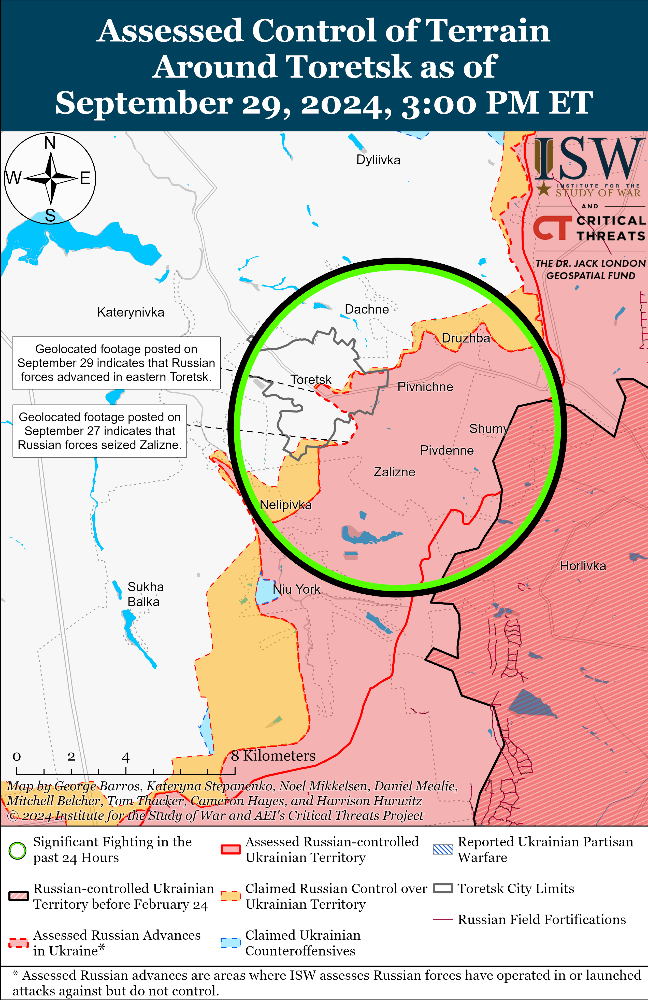
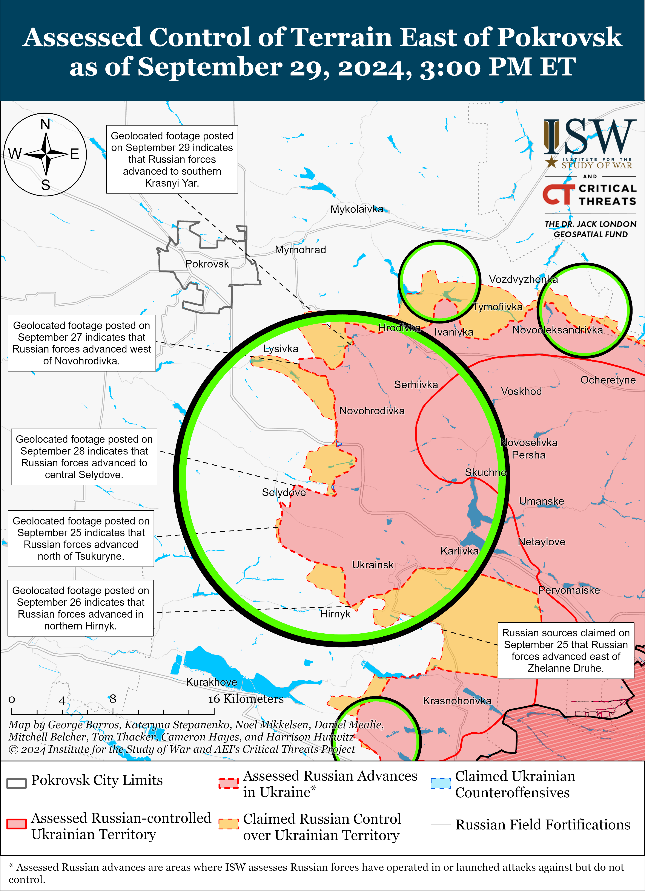
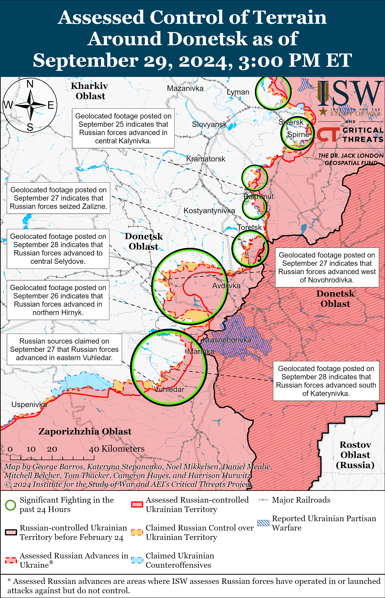
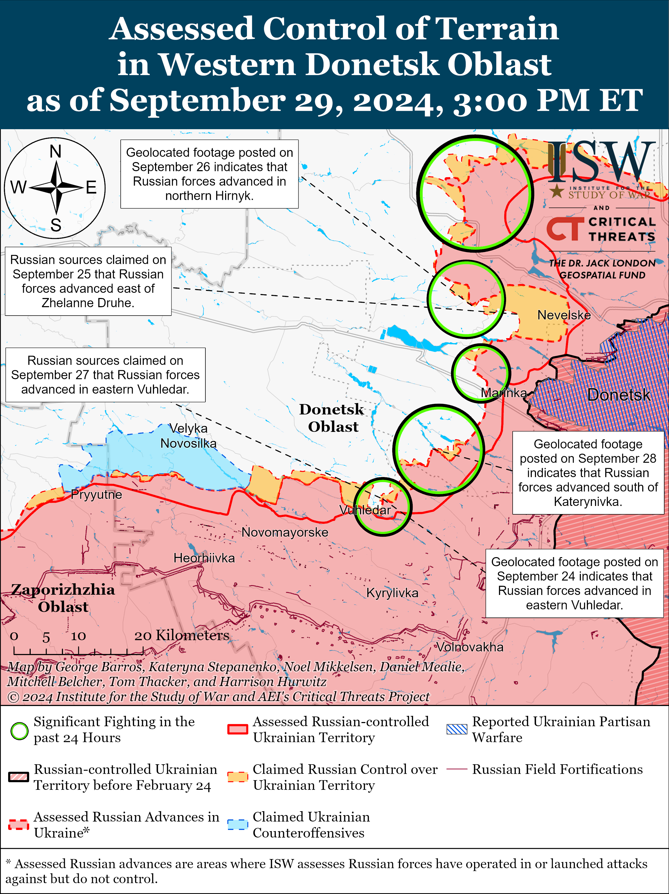
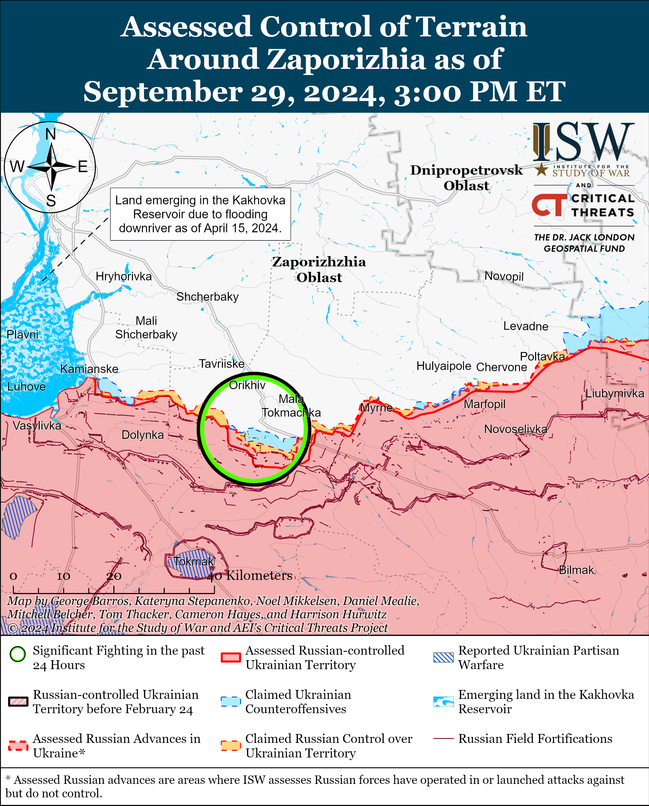
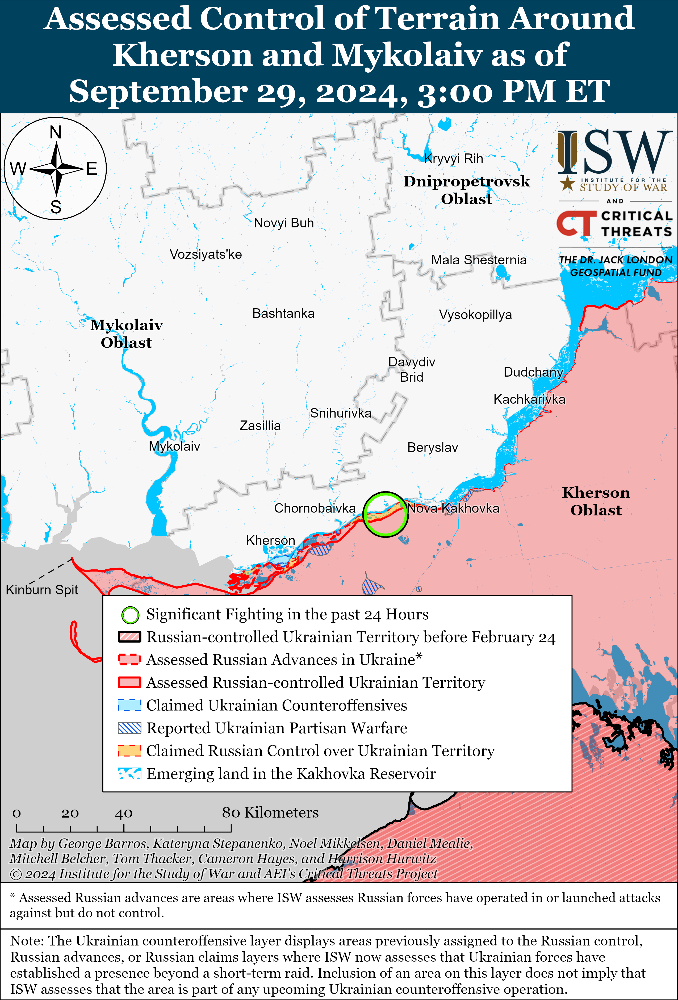

# Russian Offensive Campaign Assessment, September 29, 2024

**Davit Gasparyan, Christina Harward, Nicole Wolkov, Angelica Evans, and Frederick W. Kagan**

**September 29, 2024, 4:45pm ET**

**Click** [**here**](https://storymaps.arcgis.com/stories/36a7f6a6f5a9448496de641cf64bd375) **to see ISW’s interactive map of the Russian invasion of Ukraine. This map is updated daily alongside the static maps present in this report.**

**Click** [**here**](https://storymaps.arcgis.com/stories/83a2f24901c941d581c0c523ecd2619b) **to see ISW’s interactive map of Ukraine’s offensive in Kursk Oblast.**

**Click** [**here**](https://understandingwar.maps.arcgis.com/apps/instant/3dviewer/index.html?appid=1602762dbcde419bb957dea358449580) **to see ISW’s 3D control of terrain topographic map of Ukraine. Use of a computer (not a mobile device) is strongly recommended for using this data-heavy tool.**

**Click** [**here**](https://storymaps.arcgis.com/stories/733fe90805894bfc8562d90b106aa895) **to access ISW’s archive of interactive time-lapse maps of the Russian invasion of Ukraine. These maps complement the static control-of-terrain map that ISW produces daily by showing a dynamic frontline. ISW will update this time-lapse map archive monthly.**

**Note: The data cut-off for this product was 12pm ET on September 29. ISW will cover subsequent reports in the September 30 Russian Offensive Campaign Assessment.**

**Western countries continue to invest in the growth of Ukraine’s defense industrial base (DIB).** The Danish Ministry of Defense (MoD), in collaboration with the Danish DIB, announced on September 29 the establishment of a defense industrial hub at the Danish embassy in Kyiv with the aim of enhancing Danish-Ukrainian defense industrial cooperation.[1] The Danish initiative aims to support Danish defense and dual-use companies that want to establish production or partnerships with Ukraine. Ukrainian Defense Minister Rustem Umerov and Danish Defense Minister and Deputy Prime Minister Troels Lund Poulsen also signed a Letter of Intent on September 29 that pledges Danish financial support for defense production in Ukraine.[2] Denmark will allocate a total of 575 million euros ($641 million) for investment in the Ukrainian DIB, with 175 million euros ($195 million) coming directly from the Danish budget and an additional 400 million euros ($446 million) from profits from frozen Russian assets.[3] Ukrainian Defense Minister Rustem Umerov stated on September 14 that Ukraine will be able to domestically produce $20 billion worth of defense equipment in 2025 if Ukraine receives additional funding from its partners.[4] ISW has assessed the importance of sustained and timely Western military support for Ukraine, particularly Western assistance to develop Ukraine’s DIB, so that Ukraine can become more self-sufficient and reduce its reliance on Western military aid in the long-term.[5]

**Ukrainian forces reportedly struck a Russian ammunition depot and missile storage facility near Kotluban, Volgograd Oblast on September 29.** The Ukrainian General Staff and Ukrainian media reported on September 29 that drone operators of the Unmanned Systems Forces, Special Operations Forces (SSO), Ukrainian Main Military Intelligence Directorate (GUR), and Ukraine’s Security Service (SBU) struck the facility and suggested that a shipment of an unspecified number of Iranian missiles recently arrived at the facility.[6] The Ukrainian General Staff noted that the strike caused a fire and secondary ammunition denotations at the facility. Satellite imagery captured on September 29 shows that the strikes likely caused a fire just northwest of the facility, and data available from NASA FIRMS shows heat anomalies in this area.[7] Kotluban Head Igor Davydenko stated that Ukrainian drones attempted to strike the area but did not cause any damage to the facility, although a local Volgograd Oblast outlet reported that firefighters extinguished a fire caused by falling drone debris near an unspecified military facility.[8] Russian opposition outlet *Astra* noted that internet sources are falsely attributing footage from a 2021 explosion in Dubai, United Arab Emirates to the Kutluban strike.[9] *Astra* also reported that its sources in Rostov Oblast’s emergency services stated that Russian forces shot down over 20 Ukrainian drones targeting the Millerovo Air Base on the night of September 28 to 29 and noted that data available from NASA FIRMS shows heat anomalies near the air base.[10] Footage published on September 29 purportedly shows a fire near the Millerovo Air Base.[11] A Russian insider source published footage purportedly showing a fire near the Yeysk Air Base in Krasnodar Krai, but ISW cannot confirm the authenticity of this footage.[12] The Russian Ministry of Defense (MoD) claimed that Russian forces shot down 125 Ukrainian drones on the night of September 28 to 29, including 67 drones over Volgograd Oblast, 17 drones over Voronezh Oblast, and 18 drones over Rostov Oblast.[13]

**The Russian government is reportedly planning to further increase defense spending in 2025, although Kremlin officials appear to be highlighting planned social spending while avoiding discussions of increased defense spending.** The Russian Cabinet of Ministers approved on September 29 a draft federal budget for 2025 to 2027 and will submit the budget to the State Duma by October 1.[14] The draft budget states that Russia’s federal revenues are expected to grow by almost 12 percent in 2025 compared to 2024 and that the share of non-oil and gas revenues in the federal budget is expected to increase to 73 percent. *Bloomberg* reported on September 23 that it viewed draft proposals of the three-year draft budget, which showed that the Russian government plans to spend 13.2 trillion rubles (about $140 billion) on defense in 2025 — an increase from 10.4 trillion rubles (about $110 billion) projected for 2024.[15] *Bloomberg* stated that Russia plans to spend roughly 40 percent on national defense and domestic security in 2025 — more than spending for education, health care, social policies, and the federal economy combined. The Kremlin will reportedly increase spending on classified items from 11.1 trillion rubles (about $117 billion) in 2024 to 12.9 trillion rubles (about $136 billion) in 2025.

Russian Prime Minister Mikhail Mishustin claimed on September 24 that the government plans to fulfill “all social obligations to citizens” and highlighted planned funding for medical care, pensions, and national projects.[16] Russian Finance Minister Anton Siluanov acknowledged that “significant resources” are going towards Russia’s “special military operation,” but emphasized that 40 trillion rubles (about $424 billion) will go towards 19 national projects over six years — twice as much as the funding allocated for the period of 2019 to 2024.[17] Siluanov also highlighted that Russia plans to spend 180 billion rubles (about $1.9 billion) on modernized public utilities infrastructure and preferential mortgage programs. Kremlin officials are likely wary of war fatigue among the Russian population and are attempting to maintain public support for the war by highlighting the Kremlin’s attention to social projects.

**Key Takeaways:**

- **Western countries continue to invest in the growth of Ukraine’s defense industrial base (DIB).**
- **Ukrainian forces reportedly struck a Russian ammunition depot and missile storage facility near Kotluban, Volgograd Oblast on September 29.**
- **The Russian government is reportedly planning to further increase defense spending in 2025, although Kremlin officials appear to be highlighting planned social spending while avoiding discussions of increased defense spending.**
- **Ukrainian forces recently advanced in Glushkovsky Raion, west of the Ukrainian salient in Kursk Oblast.**
- **Russian forces recently advanced in the Toretsk and Pokrovsk directions.**

***We do not report in detail on Russian war crimes because these activities are well-covered in Western media and do not directly affect the military operations we are assessing and forecasting. We will continue to evaluate and report on the effects of these criminal activities on the Ukrainian military and the Ukrainian population and specifically on combat in Ukrainian urban areas. We utterly condemn Russian violations of the laws of armed conflict and the Geneva Conventions and crimes against humanity even though we do not describe them in these reports.***

- Ukrainian Operations in the Russian Federation
- Russian Main Effort – Eastern Ukraine (comprised of three subordinate main efforts)
- Russian Subordinate Main Effort #1 – Push Ukrainian forces back from the international border with Belgorod Oblast and approach to within tube artillery range of Kharkiv City
- Russian Subordinate Main Effort #2 – Capture the remainder of Luhansk Oblast and push westward into eastern Kharkiv Oblast and encircle northern Donetsk Oblast
- Russian Subordinate Main Effort #3 – Capture the entirety of Donetsk Oblast
- Russian Supporting Effort – Southern Axis
- Russian Air, Missile, and Drone Campaign
- Russian Mobilization and Force Generation Efforts
- Russian Technological Adaptations
- Activities in Russian-occupied areas
- Ukrainian Defense Industrial Base Efforts
- Russian Information Operations and Narratives
- Significant Activity in Belarus

**Ukrainian Operations in the Russian Federation**

Ukrainian forces recently advanced in Glushkovsky Raion west of the Ukrainian salient in Kursk Oblast amid continued Ukrainian offensive operations in the area on September 29. Geolocated footage published on September 29 indicates that Ukrainian forces recently advanced west and northwest of Veseloye (south of Glushkovo) and likely seized the northwestern part of the settlement.[18] Russian milbloggers credited elements of the Russian 56th Airborne (VDV) Regiment (7th VDV Division) with repelling Ukrainian attacks near Veseloye.[19]

Ukrainian forces continued assaults in the Ukrainian salient in Kursk Oblast on September 29, but did not make any confirmed advances. Russian sources claimed that Ukrainian forces attacked southeast of Korenevo near Lyubimovka; east of Korenevo near Kremyanoye; and north of Sudzha near Pogrebki, Kamyshevka, and Cherkasskoye Porechnoye.[20] Russian milbloggers noted that Ukrainian forces are likely operating within Olgovka (east of Korenevo).[21]

Russian forces counterattacked near the Ukrainian salient in Kursk Oblast on September 29, but did not make any confirmed advances in the area. Russian sources claimed that Russian forces counterattacked southeast of Korenevo near Lyubimovka, Darino and Nikolayevo-Darino and south of Sudzha near Plekhovo.[22] Ukrainian military observer Kostyantyn Mashovets noted that elements of the Russian 7th and 106th VDV divisions, 810th Naval Infantry Brigade (Black Sea Fleet [BSF], Southern Military District [SMD]), and 155th Naval Infantry Brigade (Pacific Fleet, Eastern Military District [EMD]) are attempting to consolidate their current positions and are preparing to defend against future Ukrainian attacks in Kursk Oblast.[23] Mashovets estimated that Russian forces have concentrated between 40,000 and 41,000 personnel in Kursk Oblast and intend to redeploy an additional 6,000 personnel to the area.[24]

**Russian Main Effort – Eastern Ukraine**

**Russian Subordinate Main Effort #1 – Kharkiv Oblast** **(Russian objective: Push Ukrainian forces back from the international border with Belgorod Oblast and approach to within tube artillery range of Kharkiv City)**

Russian forces continued offensive operations in northern Kharkiv Oblast on September 29 but did not make any confirmed advances. Russian forces attacked north of Kharkiv City near Hlyboke and northeast of Kharkiv City near Vovchansk and Tykhe on September 28 and 29.[25] Russian milbloggers claimed that neither Russian nor Ukrainian forces are operating within the Vovchansk Aggregate Plant, that the plant is a contested “gray zone,” and that Russian forces are conducting glide bomb strikes on the plant.[26] Ukraine’s Kharkiv Group of Forces reported that the Russian military reinforced elements of the 79th Motorized Rifle Regiment (18th Motorized Rifle Division, 11th Army Corps [AC], Leningrad Military District [LMD]) operating near Hlyboke with a “Storm” unit of the 11th Tank Regiment (18th Motorized Rifle Division).[27] Ukraine’s Kharkiv Group of Forces also reported that the Russian military deployed additional personnel to positions of the 82nd Motorized Rifle Regiment (69th Motorized Rifle Division, 6th Combined Arms Army [CAA], LMD) in Vovchansk in order to replenish losses. Ukrainian military observer Kostyantyn Mashovets stated that Russian forces have deployed most of the 6th CAA, including the newly formed 69th Motorized Rifle Division, to the Vovchansk and Lyptsi directions and that most of the 11th AC is operating in the Lyptsi and Hlyboke areas.[28] Mashovets also stated that the main element of the 72nd Motorized Rifle Division and 128th Motorized Rifle Brigade (both of the 44th AC, LMD) are operating in the Kharkiv direction. Mashovets stated that the Russian military is still in the process of fully staffing the newly formed 68th Motorized Rifle Division (6th CAA) and plans to deploy the understrength division to the frontline between the end of October and the beginning of November. Mashovets stated the Russian Belgorod Grouping of Forces, which operates in the Vovchansk and Lyptsi direction, consists of roughly 46,000 to 47,000 personnel.

**Russian Subordinate Main Effort #2 – Luhansk Oblast** **(Russian objective: Capture the remainder of Luhansk Oblast and push westward into eastern Kharkiv Oblast and northern Donetsk Oblast)**

Russian forces continued offensive operations along the Kupyansk-Svatove-Kreminna line on September 29 but did not make any confirmed advances. A Russian milblogger claimed on September 28 that Russian forces advanced to the southern outskirts of Andriivka (west of Svatove), and the Russian Ministry of Defense (MoD) claimed that Russian forces seized Makiivka (northwest of Kreminna), although ISW has not observed visual confirmation of these claims.[29] Russian forces continued ground attacks northeast of Kupyansk near Synkivka; east of Kupyansk near Kucherivka; southeast of Kupyansk near Kruhlyakivka, Lozova, and Tabaivka; west of Svatove near Vyshneve; northwest of Kreminna near Makiivka and Nevske; and west of Kreminna near Zarichne on September 28 and 29.[30] Ukrainian military observer Kostyantyn Mashovets stated that elements of the Russian 25th Motorized Rifle Brigade (6th Combined Arms Army [CAA], Leningrad Military District [LMD]) are operating in the Synkivka-Petropavlivka area (northeast and east of Kupyansk).[31]

**Russian Subordinate Main Effort #3 – Donetsk Oblast (Russian objective: Capture the entirety of Donetsk Oblast, the claimed territory of Russia’s proxies in Donbas)**

Russian forces continued offensive operations northeast of Siversk near Bilohorivka, east of Siversk near Verkhnokamyanske, and southeast of Siversk near Vyimka on September 28 and 29, but there were no confirmed changes to the frontline.[32]

Russian forces continued offensive operations in the Chasiv Yar direction on September 29 but did not make any confirmed advances. The Ukrainian General Staff reported that Russian forces continued assaults near Chasiv Yar, north of Chasiv Yar near Kalynivka, south of Chasiv Yar near Bila Hora, and southeast of Chasiv Yar near Kurdyumivka on September 28 and 29.[33] Elements of the Russian 98th Airborne (VDV) Division are reportedly operating near Chasiv Yar.[34]

Russian forces recently marginally advanced in Toretsk amid continued assaults in the area on September 29. Geolocated footage published on September 29 indicates that Russian forces recently advanced westward along Druzhby Street in central Toretsk.[35] Russian forces continued offensive operations near Toretsk itself, south of Toretsk near Nelipivka, and west of Toretsk in the direction of Shcherbynivka on September 28 and 29.[36]

Russian forces advanced southeast of Pokrovsk amid continued assaults in the area on September 29. Geolocated footage published on September 29 indicates that Russian forces marginally advanced near the railway line south of Selydove (southeast of Pokrovsk) and advanced into southern Krasnyi Yar and likely seized the remainder of Krutyi Yar (both southeast of Pokrovsk and north of Novohrodivka).[37] Russian milbloggers claimed on September 29 that Russian forces advanced further south of Selydove and east and northwest of Tsukuryne (southeast of Pokrovsk and Selydove), however ISW has not observed confirmation of these claims.[38] A Russian milblogger also claimed that Russian forces continue to advance towards Pokrovsk and are trying to encircle Selydove from several directions.[39] Russian forces continued offensive operations east of Pokrovsk near Vozdvyzhenka, Myrolyubivka, Novotoretske, Mykolaivka, and Hrodivka and southeast of Pokrovsk near Krutyi Yar, Marynivka, Lysivka, Selydove, and Tsukuryne on September 28 and 29.[40] Elements of the Russian 24th Spetsnaz Brigade (Main Intelligence Directorate of the Russian General Staff [GUR]) are reportedly operating in the Pokrovsk direction.[41]

[****](https://understandingwar.org/wp-content/uploads/2025/05/East20of20Pokrovsk20Battle20Map20Draft20September20292C202024.png)

Russian forces continued offensive operations west of Donetsk City on September 29, but there were no confirmed changes to the frontline. Russian forces conducted offensive operations near Heorhiivka, Oleksandropil, and Hostre on September 28 and 29.[42] Russian milbloggers claimed that Russian forces have completely cleared the Selydivska Colony No. 82 (west of Hostre) and advanced from Maksymilyanivka, but ISW has not observed confirmation of these claims.[43] A Russian source claimed that Ukrainian forces are counterattacking near Hostre.[44] Elements of the Russian 33rd Motorized Rifle Regiment (20th Motorized Rifle Division, 8th Combined Arms Army [CAA], Southern Military District [SMD]) are reportedly operating in the Kurakhove direction (west and southwest of Donetsk City), and elements of the 238th Artillery Brigade and 5th Motorized Rifle Brigade (both of the 51st CAA, formerly 1st Donetsk People’s Republic [DNR] Army Corps) are reportedly operating near Hostre.[45]

Russian forces continued offensive operations southwest of Donetsk City, including near Vuhledar, on September 29, but there were no confirmed changes to the frontline. Russian forces conducted offensive operations northeast of Vuhledar near Katerynivka, Kostyantynivka, Yelyzavetivka, and Vodyane; north of Vuhledar in the direction of Bohoyavlenka; and near and in Vuhledar itself on September 28 and 29.[46] Ukrainian sources stated that Ukrainian forces recently repelled a reinforced platoon-sized Russian mechanized assault north of Kostyantynivka (northeast of Vuhledar).[47] Russian milbloggers claimed that Russian forces marginally advanced within eastern Vuhledar and have consolidated on the eastern outskirts of settlement.[48] A Russian source claimed that Ukrainian forces maintain positions at the ventilation shafts of the Pivdennodonbaska No. 3 mine (west of Vodyane) and west of the mine itself.[49]

Neither Ukrainian nor Russian sources reported fighting in the Donetsk-Zaporizhia Oblast border area on September 29.

**Russian Supporting Effort – Southern Axis** **(Russian objective: Maintain frontline positions and secure rear areas against Ukrainian strikes)**

Russian forces continued assaults in western Zaporizhia Oblast, including near Robotyne and northwest of Robotyne near Kamyanske, on September 28 and 29, but there were no confirmed changes to the frontline in the area.[50] Elements of the Russian BARS-11 “Kuban” detachment (Russian Combat Army Reserve) are reportedly operating in the Zaporizhia direction, and elements of the Russian 4th Military Base (58th Combined Arms Army [CAA], Southern Military District [SMD]) are reportedly operating near Kamyanske.[51]

The Ukrainian General Staff reported that Russian forces attacked in the Dnipro (Kherson) direction on September 28 and 29, but there were no confirmed changes to the frontline.[52]

**Russian Air, Missile, and Drone Campaign** **(Russian Objective: Target Ukrainian military and civilian infrastructure in the rear and on the frontline)**

Russian forces conducted a series of drone strikes against Ukraine on the night of September 28 to 29. The Ukrainian Air Force reported on September 29 that Russian forces launched 22 Shahed-136/131 drones from Krasnodar Krai, Kursk Oblast, and occupied Crimea.[53] The Ukrainian Air Force reported that Ukrainian forces downed 15 Shahed drones over Sumy, Mykolaiv, and Odesa oblasts. Ukrainian officials reported that Russian drones damaged a school in Shevchenkivska Hromada, Mykolaiv Oblast and a building in Odesa Raion, Odesa Oblast.[54] Ukrainian authorities reported that Russian forces also conducted a large glide bomb strike against Zaporizhzhia City on the morning of September 29 and destroyed several buildings.[55]

Ukrainian President Volodymyr Zelensky stated on September 29 that Russian forces have used almost 900 aerial bombs, over 300 Shahed drones, and over 40 missiles against Ukraine over the past week (September 22 to 29).[56]

**Russian Mobilization and Force Generation Efforts** **(Russian objective: Expand combat power without conducting general mobilization)**

Nothing significant to report.

**Russian Technological Adaptations** **(Russian objective: Introduce technological innovations to optimize systems for use in Ukraine)**

Russian drone company Uraldrone claimed on September 29 that it developed the “Berdysh” heavy combat drone that can attack enemy positions with a flamethrower and grenade launcher, remotely mine areas, transport cargo, and conduct reconnaissance.[57] The drone can reportedly carry a payload of 20 kilograms, has a flight range of 25 kilometers, and is undergoing field tests.

**Ukrainian Defense Industrial Efforts** **(Ukrainian objective: Develop its defense industrial base to become more self-sufficient in cooperation with US, European, and international partners)**

*ISW is suspending publishing coverage of Ukrainian defense industrial efforts until further notice.*

**Activities in Russian-occupied areas** **(Russian objective: Consolidate administrative control of annexed areas; forcibly integrate Ukrainian citizens into Russian sociocultural, economic, military, and governance systems)**

*ISW is not publishing coverage of Russian-occupied areas today.*

**Russian Information Operations and Narratives**

Nothing significant to report.

**Significant activity in Belarus** **(Russian efforts to increase its military presence in Belarus and further integrate Belarus into Russian-favorable frameworks and Wagner Group activity in Belarus)**

Nothing significant to report.

**Note: ISW does not receive any classified material from any source, uses only publicly available information, and draws extensively on Russian, Ukrainian, and Western reporting and social media as well as commercially available satellite imagery and other geospatial data as the basis for these reports. References to all sources used are provided in the endnotes of each update.**

---

[1] https://www.fmn dot dk/da/nyheder/2024/danmark-etablerer-forsvarsindustriel-hub-i-kyiv/ ; https://t.me/bbcrussian/71016 ; https://armyinform.com dot ua/2024/09/29/ukrayina-otrymaye-blyzko-e600-mln-yevro-investyczij-v-oboronnu-promyslovist/

[2] https://www.facebook.com/share/p/YRsgAkGHbBZsHNEg/; https://armyinform.com dot ua/2024/09/29/ukrayina-otrymaye-blyzko-e600-mln-yevro-investyczij-v-oboronnu-promyslovist/

[3] https://x.com/DefensieMin/status/1839689145280500024; https://armyinform dot com.ua/2024/09/28/rosiyan-vzhe-bombyt-niderlandski-f-16-provely-ostannij-polit-pered-ukrayinoyu/

[4] https://understandingwar.org/backgrounder/russian-offensive-campaign-assessment-september-20-2024

[5] https://understandingwar.org/backgrounder/ukraine%E2%80%99s-long-term-path-success-jumpstarting-self-sufficient-defense-industrial-base

[6] https://t.me/GeneralStaffZSU/17605 ; https://www.kyivpost.com/post/39757

[7] https://x.com/kromark/status/1840395731321925778 ; https://firms.modaps.eosdis.nasa.gov/map/#d:24hrs;@44.23,49.00,14.00z

[8] https://v1 dot ru/text/gorod/2024/09/29/74148758/

[9] https://t.me/astrapress/65387

[10] https://t.me/astrapress/65408

[11] https://t.me/vchkogpu/51322

[12] https://t.me/vchkogpu/51288 ; https://t.me/vchkogpu/51292

[13] https://t.me/mod\_russia/43915

[14] https://tass dot ru/ekonomika/21988729; http://government dot ru/news/52832/; https://www.forbes dot ru/society/522146-pravitel-stvo-odobrilo-proekt-budzeta-na-sleduusie-tri-goda

[15] https://www.bloomberg.com/news/articles/2024-09-23/russia-budget-plans-show-no-let-up-in-putin-s-war-on-ukraine?ref=en.thebell.io

[16] https://www.vedomosti dot ru/economics/articles/2024/09/24/1064295-pravitelstvo-zavershaet; https://t.me/government\_rus/15533

[17] https://www.forbes dot ru/society/522146-pravitel-stvo-odobrilo-proekt-budzeta-na-sleduusie-tri-goda; https://minfin dot gov.ru/ru/press-center?id\_4=39297

[18] https://t.me/creamy\_caprice/6959; https://t.me/warriorofnorth/2983

[19] https://t.me/RVvoenkor/77794  ;  https://t.me/motopatriot/28105

[20] https://t.me/RVvoenkor/77785 ; https://t.me/rybar/63925 ; https://t.me/RVvoenkor/77831 ; https://t.me/mod\_russia/43924

[21] https://t.me/rybar/63925 ; https://t.me/RVvoenkor/77828 ; https://t.me/motopatriot/28077

[22] https://t.me/RVvoenkor/77785 ; https://t.me/rybar/63925 ; https://t.me/RVvoenkor/77831  ; https://t.me/RVvoenkor/77831

[23] https://t.me/zvizdecmanhustu/2219

[24] https://t.me/zvizdecmanhustu/2219

[25] https://www.facebook.com/GeneralStaff.ua/posts/pfbid02ifAHntKuiQxuQdCcietZrPGW97VvwCSLz2ERUUZc4eSgUEYPUeaP7QEDsZgiw5DGl ; https://www.facebook.com/GeneralStaff.ua/posts/pfbid0axmaYqETomtqRcezrCgFTHmgP9PBrWcmng6LM7b3D4UjBKf69L7K1NbKm2356Pgl ; https://www.facebook.com/GeneralStaff.ua/posts/pfbid0K5rLYhwjxiz4EJUzmo8LkgB4qeN4D6tQpvkCtNFEEkKUZNAyEJM8sMuSnt8pgn7kl ; https://t.me/wargonzo/22363

[26] https://t.me/wargonzo/22363 ; https://t.me/motopatriot/28072 ; https://t.me/motopatriot/28080 ; https://t.me/dva\_majors/53837 ; https://t.me/dva\_majors/53838 ; https://t.me/boris\_rozhin/138985

[27] https://t.me/otukharkiv/1715

[28] https://t.me/zvizdecmanhustu/2222

[29] https://t.me/motopatriot/28088 ; https://t.me/mod\_russia/43921

[30] https://www.facebook.com/GeneralStaff.ua/posts/pfbid02ifAHntKuiQxuQdCcietZrPGW97VvwCSLz2ERUUZc4eSgUEYPUeaP7QEDsZgiw5DGl ; https://www.facebook.com/GeneralStaff.ua/posts/pfbid0axmaYqETomtqRcezrCgFTHmgP9PBrWcmng6LM7b3D4UjBKf69L7K1NbKm2356Pgl ; https://www.facebook.com/GeneralStaff.ua/posts/pfbid0K5rLYhwjxiz4EJUzmo8LkgB4qeN4D6tQpvkCtNFEEkKUZNAyEJM8sMuSnt8pgn7kl ; https://t.me/DnevnikDesantnika/16245

[31] https://t.me/zvizdecmanhustu/2222

[32] https://www.facebook.com/GeneralStaff.ua/posts/pfbid02ifAHntKuiQxuQdCcietZrPGW97VvwCSLz2ERUUZc4eSgUEYPUeaP7QEDsZgiw5DGl; https://www.facebook.com/GeneralStaff.ua/posts/pfbid0axmaYqETomtqRcezrCgFTHmgP9PBrWcmng6LM7b3D4UjBKf69L7K1NbKm2356Pgl ; https://www.facebook.com/GeneralStaff.ua/posts/pfbid0K5rLYhwjxiz4EJUzmo8LkgB4qeN4D6tQpvkCtNFEEkKUZNAyEJM8sMuSnt8pgn7kl

[33] https://www.facebook.com/GeneralStaff.ua/posts/pfbid02ifAHntKuiQxuQdCcietZrPGW97VvwCSLz2ERUUZc4eSgUEYPUeaP7QEDsZgiw5DGl; https://www.facebook.com/GeneralStaff.ua/posts/pfbid0axmaYqETomtqRcezrCgFTHmgP9PBrWcmng6LM7b3D4UjBKf69L7K1NbKm2356Pgl ; https://www.facebook.com/GeneralStaff.ua/posts/pfbid0K5rLYhwjxiz4EJUzmo8LkgB4qeN4D6tQpvkCtNFEEkKUZNAyEJM8sMuSnt8pgn7kl

[34] https://t.me/boris\_rozhin/139034

[35] https://x.com/AudaxonX/status/1840391441635258405; https://www.instagram.com/stories/ppilyaa/3467813273220710635/

[36]https://www.facebook.com/GeneralStaff.ua/posts/pfbid02ifAHntKuiQxuQdCcietZrPGW97VvwCSLz2ERUUZc4eSgUEYPUeaP7QEDsZgiw5DGl; https://www.facebook.com/GeneralStaff.ua/posts/pfbid0axmaYqETomtqRcezrCgFTHmgP9PBrWcmng6LM7b3D4UjBKf69L7K1NbKm2356Pgl ; https://www.facebook.com/GeneralStaff.ua/posts/pfbid0K5rLYhwjxiz4EJUzmo8LkgB4qeN4D6tQpvkCtNFEEkKUZNAyEJM8sMuSnt8pgn7kl

[37] https://t.me/creamy\_caprice/6958; https://t.me/immitis71/693  ; https://t.me/ghost\_of\_khortytsia/153; https://t.me/creamy\_caprice/6964

[38] https://t.me/motopatriot/28097; https://t.me/z\_arhiv/28289

[39] https://t.me/wargonzo/22363

[40] https://www.facebook.com/GeneralStaff.ua/posts/pfbid02ifAHntKuiQxuQdCcietZrPGW97VvwCSLz2ERUUZc4eSgUEYPUeaP7QEDsZgiw5DGl; https://www.facebook.com/GeneralStaff.ua/posts/pfbid0axmaYqETomtqRcezrCgFTHmgP9PBrWcmng6LM7b3D4UjBKf69L7K1NbKm2356Pgl ; https://www.facebook.com/GeneralStaff.ua/posts/pfbid0K5rLYhwjxiz4EJUzmo8LkgB4qeN4D6tQpvkCtNFEEkKUZNAyEJM8sMuSnt8pgn7kl

[41] https://t.me/RVvoenkor/77807

[42] https://www.facebook.com/GeneralStaff.ua/posts/pfbid0K5rLYhwjxiz4EJUzmo8LkgB4qeN4D6tQpvkCtNFEEkKUZNAyEJM8sMuSnt8pgn7kl; https://www.facebook.com/GeneralStaff.ua/posts/pfbid0axmaYqETomtqRcezrCgFTHmgP9PBrWcmng6LM7b3D4UjBKf69L7K1NbKm2356Pgl ; https://www.facebook.com/GeneralStaff.ua/posts/pfbid02ifAHntKuiQxuQdCcietZrPGW97VvwCSLz2ERUUZc4eSgUEYPUeaP7QEDsZgiw5DGl; https://t.me/motopatriot/28080

[43] https://t.me/motopatriot/28080; https://t.me/motopatriot/28079; https://t.me/DnevnikDesantnika/16249

[44] https://t.me/DnevnikDesantnika/16249

[45] https://t.me/dva\_majors/53852; https://t.me/nm\_dnr/12760

[46] https://www.facebook.com/GeneralStaff.ua/posts/pfbid02ifAHntKuiQxuQdCcietZrPGW97VvwCSLz2ERUUZc4eSgUEYPUeaP7QEDsZgiw5DGl; https://www.facebook.com/GeneralStaff.ua/posts/pfbid0axmaYqETomtqRcezrCgFTHmgP9PBrWcmng6LM7b3D4UjBKf69L7K1NbKm2356Pgl ; https://www.facebook.com/GeneralStaff.ua/posts/pfbid0K5rLYhwjxiz4EJUzmo8LkgB4qeN4D6tQpvkCtNFEEkKUZNAyEJM8sMuSnt8pgn7kl; https://t.me/RVvoenkor/77814

[47] https://t.me/mechanized33/406 ; https://t.me/ButusovPlus/13949

[48] https://t.me/wargonzo/22363; https://t.me/voin\_dv/11060

[49] https://t.me/voin\_dv/11063

[50] https://www.facebook.com/GeneralStaff.ua/posts/pfbid02ifAHntKuiQxuQdCcietZrPGW97VvwCSLz2ERUUZc4eSgUEYPUeaP7QEDsZgiw5DGl ; https://www.facebook.com/GeneralStaff.ua/posts/pfbid0axmaYqETomtqRcezrCgFTHmgP9PBrWcmng6LM7b3D4UjBKf69L7K1NbKm2356Pgl ; https://www.facebook.com/GeneralStaff.ua/posts/pfbid0K5rLYhwjxiz4EJUzmo8LkgB4qeN4D6tQpvkCtNFEEkKUZNAyEJM8sMuSnt8pgn7kl ; https://t.me/wargonzo/22363  ;

[51] https://t.me/wargonzo/22370 (Zaporizhia direction) ; https://t.me/dva\_majors/53844 (Kamyanske)

[52] https://www.facebook.com/GeneralStaff.ua/posts/pfbid0axmaYqETomtqRcezrCgFTHmgP9PBrWcmng6LM7b3D4UjBKf69L7K1NbKm2356Pgl ; https://www.facebook.com/GeneralStaff.ua/posts/pfbid0K5rLYhwjxiz4EJUzmo8LkgB4qeN4D6tQpvkCtNFEEkKUZNAyEJM8sMuSnt8pgn7kl

[53] https://t.me/kpszsu/20205**;** https://www.facebook.com/GeneralStaff.ua/posts/pfbid02cR8To3P2Aw2qs9rHo4WG5ekiX3aEfYX6vJHUUN4FbveNHPM4THo5yJmGJkfPZBE3l

[54] https://t.me/odeskaODA/6831; https://armyinform dot com.ua/2024/09/29/vorog-atakuvav-odeshhynu-dronamy-rujnuvannya-u-dvoh-rajonah-oblasti/ ; https://t.me/mykolaivskaODA/11571

[55] https://t.me/dsns\_telegram/33166 ; https://t.me/mvs\_ukraine/42338

[56] https://www.facebook.com/zelenskyy.official/videos/412141971627377/; https://armyinform.com dot ua/2024/09/29/czogo-tyzhnya-rosijska-armiya-zastosuvala-majzhe-900-aviaczijnyh-bomb-bilsh-nizh-300-shahediv-i-ponad-40-raket/

[57] https://tass dot ru/armiya-i-opk/21988787
