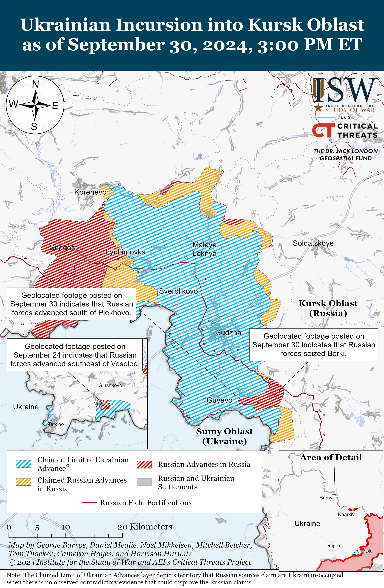
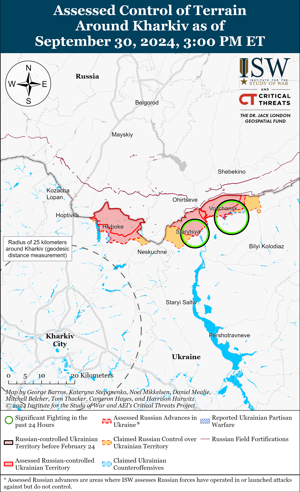
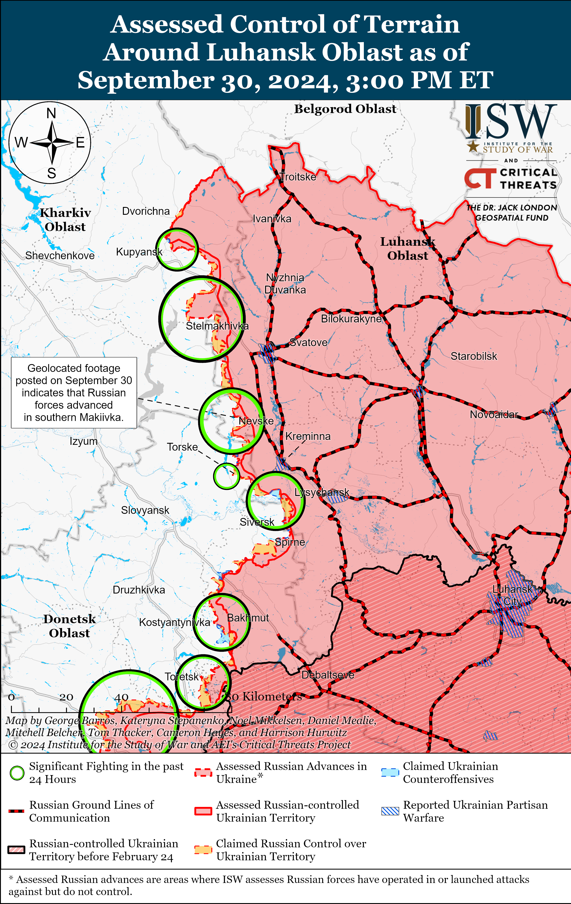
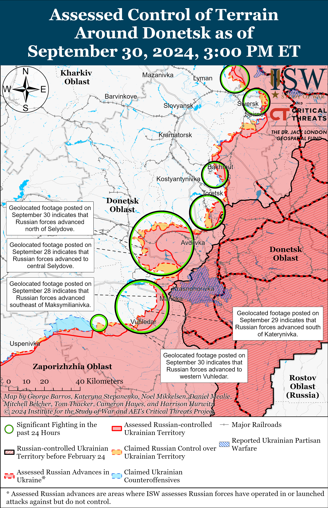
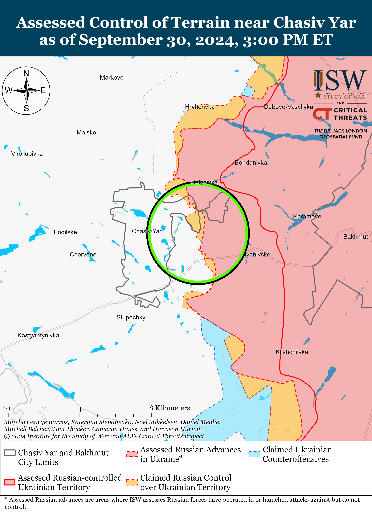
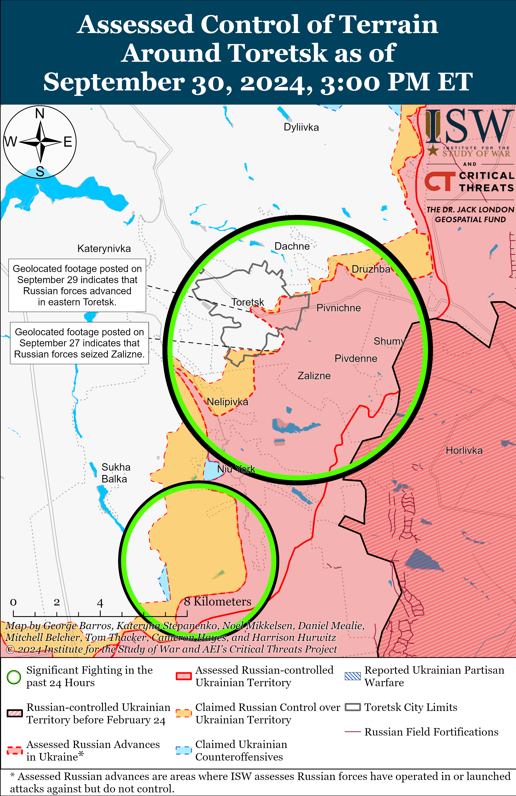
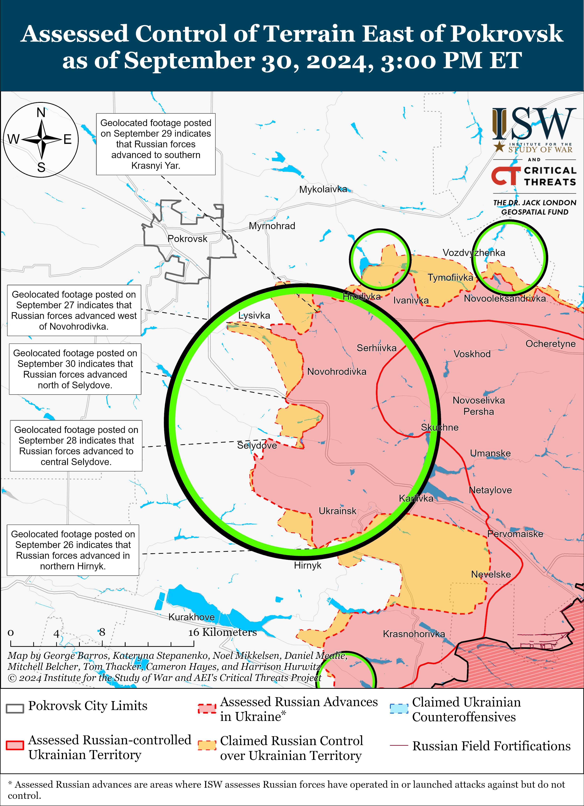
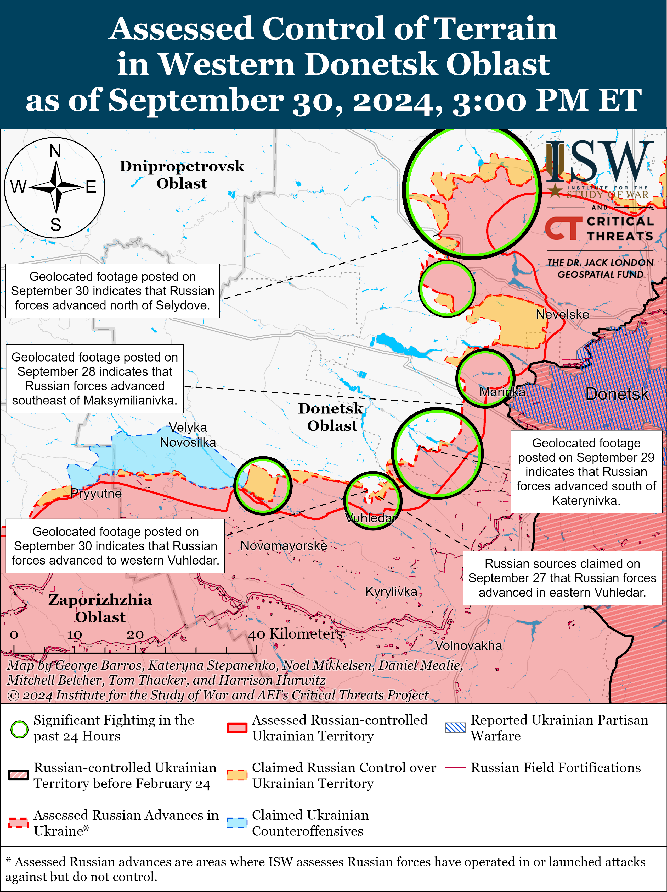
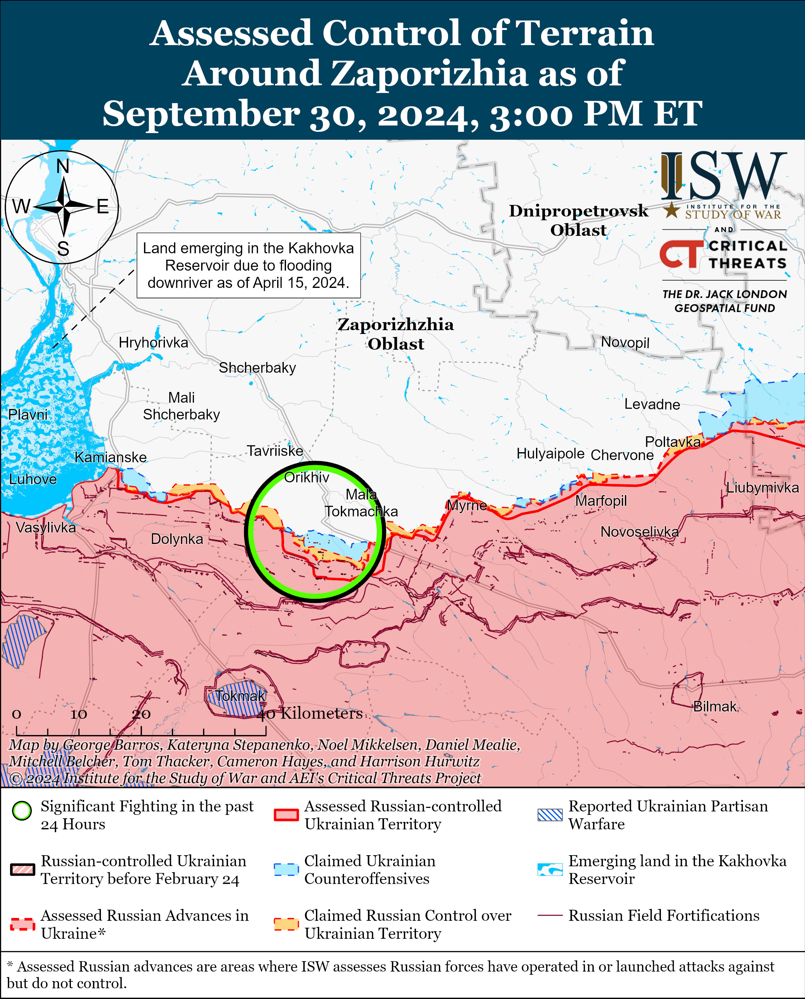
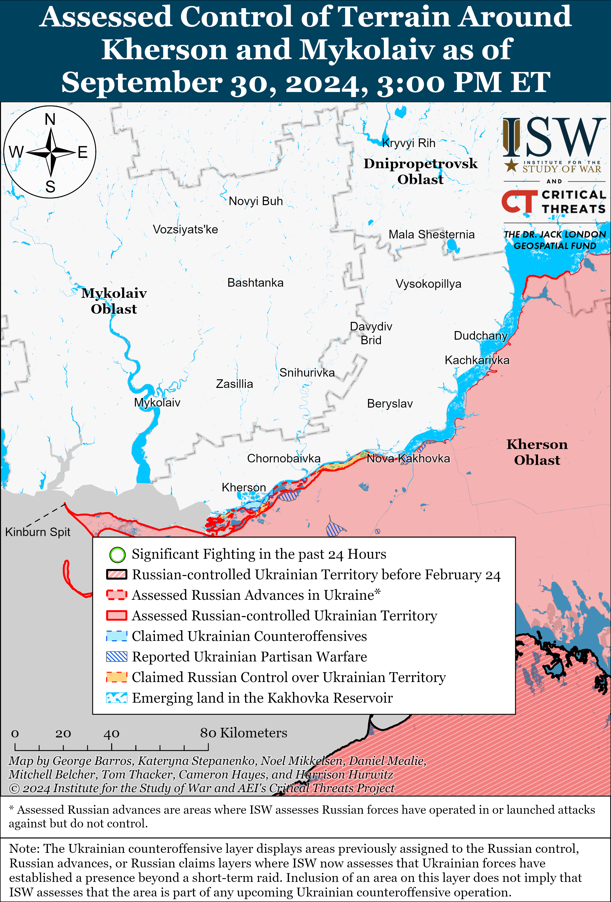

# Russian Offensive Campaign Assessment, September 30, 2024

**Christina Harward, Kateryna Stepanenko, Karolina Hird, George Barros,** **and Frederick W. Kagan**

**The Russian government plans to spend 17 trillion rubles ($183 billion) on national security and defense in 2025 — about 41 percent of its annual expenditures.** The Russian government submitted a bill on the federal budget for 2025 to 2027 to the State Duma on September 30.[1] The bill projects federal revenues to be 40.3 trillion rubles ($433 billion) in 2025 and federal expenditures to amount to 41.5 trillion rubles ($446 billion). The budget calls for 13.5 trillion rubles ($145 billion) to go towards “National Defense” expenditures in 2025 and projects that defense spending will decrease to 12.8 trillion rubles ($137 billion) in 2026 but increase to 13 trillion rubles ($139 billion) in 2027.[2] The 2025 budget also calls for 3.5 trillion rubles ($37 billion) towards “National Security” — meaning that Russia plans to commit about 41 percent of its expenditures in 2025 to combined “defense” and “security” expenses. The budget notably allocates 14.03 billion rubles ($151 million) annually from 2025 to 2027 to the creation of a mobilization reserve in the Russian Armed Forces.[3] The bill calls for about 40 billion rubles ($430 million) in 2025 to fund the “Defenders of the Fatherland Fund,” which supports Russian veterans and their families.[4] The Russian government is also earmarking significant funding towards developing new technologies. The 2025–2027 budget allocates 6.1 trillion rubles ($65 billion) for measures to “achieve technological leadership,” 234.4 billion rubles ($2.5 billion) for machine-tool production, 112.1 billion rubles ($1.2 billion) for the “Unmanned Aircraft Systems” production project, 46.9 billion rubles ($504 million) for the development of new nuclear and energy technologies, and 175.3 billion rubles ($1.8 billion) for the development of radio and microelectronics.[5] Increases in defense spending do not necessarily equate to increased military capabilities, however, especially when significant funding is going towards paying benefits to Russian soldiers, veterans, and their families.

**The Russian budget will continue to support various social programs, including the Kremlin’s pro-natalist programs, but a continued focus on defense spending is likely affecting the effectiveness and sustainability of these programs.** The “Social Policy” section of the 2025 budget accounts for 6.4 trillion rubles ($69 billion).[6] The bill allocates about 4 trillion rubles ($43 billion) between 2025 and 2027 for payments to people with children and about 1.7 trillion rubles ($18 billion) for Russia’s maternity capital program through 2030. The budget accounts for 1.57 trillion rubles ($16 billion) for education in 2025, and healthcare spending accounts for 1.86 trillion rubles ($20 billion) in 2025 and 2026. The Russian government has allocated 824 billion rubles ($8.8 million) for the payment of state pensions in 2025 and 1.36 trillion rubles ($14 billion) for recently announced pension increases.[7] Russian opposition outlet *Meduza* noted that the Russian government press release highlighted funding for pregnant women, families with children, national projects, and regional support but did not mention defense spending.[8] Kremlin officials similarly highlighted social spending while avoiding discussions of increased defense spending on September 29 when the Cabinet of Ministers initially approved the draft federal budget, likely due to the Kremlin’s wariness about war fatigue among the Russian population.[9] Sustained high levels of defense spending in the coming years during a protracted war in Ukraine and continued military preparations for a possible conflict with NATO will make it more difficult for the Kremlin to sustain funding for the social programs that the Russian population cares about, such as pension increases and healthcare. Increased defense spending will also affect the long-term effectiveness of the Kremlin’s efforts to use financial incentives to increase Russia’s birth rate and reverse Russia’s demographic crisis.[10] Popular demands for increased social and decreased defense funding in the future may also hamper the Kremlin’s ability to sustain its war in Ukraine as Russian President Vladimir Putin must take his regime’s stability and domestic support into account.

**Russian President Vladimir Putin promoted presidential aide and close personal ally Alexei Dyumin to the Russian Security Council alongside three other officials.[11]** Putin signed a decree on September 30 updating the membership of the Russian Security Council — a key Russian consultative body that informs Putin’s decisions on national security issues. Putin added Dyumin, Russian First Deputy Prime Minister Denis Manturov, Head of the Russian Federal Medical-Biological Agency (FMBA) Veronika Skvortsova, and Head of the Kremlin’s Main Directorate for Special Programs (GUSP) Alexander Linets to the Russian Security Council.[12] Putin removed First Deputy Speaker of the Russian Federal Council Vladimir Yakushev from the Russian Security Council after removing Yakushev from his role as the Kremlin Representative to the Urals Federal District on September 24.[13] Dyumin is the youngest ever member of the Russian Security Council at 52 years old and has been a loyal supporter of Putin’s regime since he served as Putin’s bodyguard beginning in 1999.[14] The Russian Security Council is mostly composed of officials of Putin’s generation (with most born in the 1950s), and Dyumin’s appointment suggests that Putin is preparing a new generation of officials.[15] Putin has been steadily promoting Dyumin since the Wagner Group armed rebellion in June 2023, with Dyumin becoming the presidential aide for the defense industrial base (DIB) and secretary of the advisory State Council in May 2024.[16] Putin later tasked Dyumin with supervising the Russian response to Ukraine’s incursion into Kursk Oblast in August 2024.[17] Putin also recently promoted Manturov (who is 55 years old) to the position of first deputy prime minister in May 2024, despite previously using Manturov as a scapegoat for Russian DIB problems and the inadequate response to Ukraine’s incursion into Kursk Oblast.[18] Skvortsova (63 years old) previously served as the Russian Minister of Health between 2012 and 2020 before becoming the head of FMBA, and Putin recently reappointed Skvortsova to the position of FMBA head in late June 2024.[19] Linets (61 years old) previously served as the deputy chief of the Russian Federal Security Service (FSB) of the 20th Combined Arms Army and as head of FSB Directorate for the Southern Military District (SMD) before assuming his current role in 2015.[20] Linets has also served as a member of the Russian Military-Industrial Commission since 2015.

**The Kremlin continues to use state and regional awards to co-opt previously critical milbloggers as part of wider efforts to gain control over the information space.** Russian President Vladimir Putin awarded Russian milblogger and Russian State Television and Radio Broadcasting Company (VGTRK) correspondent Yevgeny Poddubny with the Hero of Russia award on September 30 for “demonstrating heroism” while performing official duties.[21] Putin personally called Poddubny in August 2024 after Poddubny sustained injuries while reporting from Kursk Oblast.[22] Poddubny served as a “trusted person” in Putin’s presidential campaigns in 2018 and 2024.[23]  The Kremlin had been increasingly trying to use Poddubny to disseminate official narratives in the Russian ultranationalist information space by appointing him to Kremlin-run initiatives and highlighting his reports on Russian state media since late 2022.[24]

Russian milblogger Roman Alekhin claimed on September 30 that Russian authorities awarded him the “Defender of Kursk Oblast” medal, thanked Kursk Oblast Governor Alexey Smirnov for trusting him, and proclaimed that he serves Russia and the Russian people.[25] Alekhin has long been critical of Russian authorities and rhetorically attacked Smirnov on his Telegram channel in July 2024.[26] Smirnov appointed Alekhin as a volunteer advisor following these July 2024 attacks, at which point Alekhin claimed that he is taking responsibility for and acting upon his previous criticisms of the Kursk Oblast government.[27]  Alekhin’s September 30 statements suggest that Russian authorities have successfully used appointments and awards to coopt a critical voice. The Kremlin has used similar methods in the past, such as by including Alexander “Sasha” Kots in the Russian Presidential Council for Civil Society and Human Rights in 2022 and awarding Mikhail Zvinchuk of the *Rybar* Telegram channel with presidential and Ministry of Defense (MoD) honors in late 2023.[28]

**Russian Prime Minister Mikhail Mishustin arrived in Tehran on September 30 to meet with various Iranian officials and highlight Russo–Iranian economic cooperation.[29]** Mishustin met Iranian President Masoud Pezeshkian and stated that he expects that Russia and Iran will sign the anticipated comprehensive strategic cooperation agreement at the upcoming BRICS summit in Kazan, Republic of Tatarstan, from October 22 to 24.[30] Mishustin also met with Iran’s First Vice President Mohammad Reza Aref to talk about opportunities for Russian investment in “various fields” in Iran and notably met with Iranian Oil Minister Mohsen Paknejad.[31] Iranian Ambassador to Russia Kazem Jalali reported that Mishustin’s visit to Iran will particularly focus on developing trade and economic ties between the two countries.[32] Russian and Iranian officials likely view expanded economic and financial cooperation as a necessary component of generally intensified Russo–Iranian relations.

## Key Takeaways

1. The Russian government plans to spend 17 trillion rubles ($183 billion) on national security and defense in 2025 — about 41 percent of its annual expenditures. The Russian budget will continue to support various social programs, including the Kremlin’s pronatalist programs, but a continued focus on defense spending is likely affecting the effectiveness and sustainability of these programs.
2. Russian President Vladimir Putin promoted Presidential Aide and close personal ally Alexei Dyumin to the Russian Security Council alongside three other officials.
3. The Kremlin continues to use state and regional awards to coopt previously critical milbloggers as part of wider efforts to gain control over the information space.
4. Russian Prime Minister Mikhail Mishustin arrived in Tehran on September 30 to meet with various Iranian officials and highlight Russo-Iranian economic cooperation.
5. Russian forces recently advanced in Glushkvosky Raion, Kursk Oblast, and Ukrainian and Russian forces recently advanced within the Ukrainian salient in Kursk Oblast.
6. Russian forces recently advanced near Svatove, Chasiv Yar, Toretsk, Pokrovsk, and Donetsk City.
7. Russian President Vladimir Putin signed on September 30 the decree on Russia’s usual semi-annual fall conscription for 133,000 draftees.

***We do not report in detail on Russian war crimes because these activities are well-covered in Western media and do not directly affect the military operations we are assessing and forecasting. We will continue to evaluate and report on the effects of these criminal activities on the Ukrainian military and the Ukrainian population and specifically on combat in Ukrainian urban areas. We utterly condemn Russian violations of the laws of armed conflict and the Geneva Conventions and crimes against humanity even though we do not describe them in these reports.***

### **Ukrainian Operations in the Russian Federation**

Russian forces recently advanced west of the Ukrainian salient in Kursk Oblast in Gluskovsky Raion amid continued Ukrainian offensive operations in the area on September 29 and 30.[33] Geolocated footage published on September 24 indicates that Russian forces recently advanced in the fields southeast of Veseloye (southwest of Glushkovo).[34] The Russian Ministry of Defense (MoD) claimed that Ukrainian forces unsuccessfully attacked on the international border near Novy Put (southwest of Glushkovo), and Russian milbloggers claimed that Ukrainian forces attacked near Veseloye and Medvezhye (southeast of Glushkovo).[35] Elements of the Russian 56th Airborne (VDV) Regiment (7th VDV Division) are continuing to repel Ukrainian attacks near Veseloye and towards Glushkovo.[36]

Ukrainian forces recently advanced on the western edge of the Ukrainian salient in Kursk Oblast near Korenevo amid continued offensive operations on September 29 and 30. Geolocated footage published on September 29 shows elements of the Russian 56th VDV Regiment targeting Ukrainian forces southeast of Korenevo, indicating that Ukrainian forces recently marginally advanced in the area.[37] Russian sources, including the Russian MoD, claimed that Russian forces repelled Ukrainian attacks southeast of Korenevo near Lyubimovka; east of Korenevo near Olgovka and Kremyanoye; north of Sudzha near Kamyshevka; and southeast of Sudzha near Plekhovo.[38]

Russian forces recently made confirmed advances southeast of Sudzha near Plekhovo amid continued Russian counterattacks within the Ukrainian salient in Kursk Oblast. Geolocated footage published on September 29 shows Ukrainian forces attempting to repel a Russian platoon-sized mechanized assault south of Plekhovo, indicating that Russian forces recently advanced in this area.[39] *Forbes‘* analysis of the geolocated footage stated that the Russian mechanized column — possibly composed of elements of the Russian 15th ”Pyatnashka” International Volunteer Brigade — got stuck in Russian anti-tank traps set prior to the Ukrainian Kursk Oblast incursion near Plekhovo, allowing Ukrainian forces to strike the Russian column outside of the settlement.[40] Russian sources also claimed that Russian forces seized Obukhovka (southeast of Korenevo) and advanced 800 meters north of Uspenovka (southeast of Korenevo on the international border), although ISW has not observed visual evidence confirming that Russian forces seized the entirety of Obukhovka.[41] The Russian MoD also claimed that Russian naval infantry elements of the Russian Northern Grouping of Forces, likely referring to 155th Naval Infantry Brigade (Pacific Fleet, Eastern Military District [EMD]), seized “long-term fortified positions” in an unspecified part of Kursk Oblast.[42] The Russian ”Smuglyanka” Detachment is reportedly operating near Kremyanoye.[43]

### **Russian Main Effort — Eastern Ukraine**

#### **Russian Subordinate Main Effort #1 — Kharkiv Oblast (Russian objective: Push Ukrainian forces back from the international border with Belgorod Oblast and approach to within tube artillery range of Kharkiv City)**

Russian forces recently marginally advanced northeast of Kharkiv City amid continued offensive operations north and northeast of Kharkiv City on September 30. Geolocated footage published on September 30 indicates that Russian forces recently marginally advanced in the northern part of the Aggregate Plant in central Vovchansk.[44] Russian forces conducted ground attacks northeast of Kharkiv City near Burhuvatka, Starytsya, and Vovchansk on September 29 and 30.[45] Ukrainian Kharkiv Group of Forces Spokesperson Colonel Vitaliy Sarantsev reported that Russian forces remain on the defensive north of Kharkiv City along the Lyptsi-Hlyboke-Krasne line and continue to engineer positions, establish firing positions, and conduct aerial reconnaissance.[46] The Ukrainian Kharkiv Group of Forces reported that elements of the Russian 3rd Motorized Rifle Battalion of the 7th Separate Motorized Rifle Regiment (11th Army Corps [AC], Leningrad Military District [LMD]) are using anti-tank mines near Krasne.[47] Sarantsev added that Russian forces continue to target the Aggregate Plant in Vovchansk with TOS-1A thermobaric artillery systems and aerial bombs and are rotating personnel without significantly increasing the number of troops in the Vovchansk direction.[48] Sarantsev added that Ukrainian forces recently observed Russian forces constructing tunnels and underground pathways in urban areas of Vovchansk, but that it is unclear if Russian forces have since continued tunnel constructions.[49] A Russian milblogger claimed that Russian forces recently attacked the Aggregate Plant, but did not specify the outcome.[50]

### **Russian Subordinate Main Effort #2 — Luhansk Oblast**

#### **(Russian objective: Capture the remainder of Luhansk Oblast and push westward into eastern Kharkiv Oblast and northern Donetsk Oblast)**

Russian forces recently advanced near Svatove amid continued offensive operations along the Kupyansk-Svatove-Kreminna line on September 30. Geolocated footage published on September 30 indicates that Russian forces recently advanced in southern Makiivkva (southwest of Svatove).[51] A Russian milblogger claimed that Russian forces seized Andriivka (just west of Svatove) and advanced south of Stepova Novosilka (east of Kupyansk) and near Nevske (northwest of Kreminna).[52] ISW has not observed confirmation of these claims, however. Russian forces conducted offensive operations northeast of Kupyansk near Synkivka; east of Kupyansk towards Kucherivka; northwest of Svatove near Novoosynove, Hlushkivka, Kruhlyakivka, and Stelmakhivka and towards Lozova; west of Svatove near Vyshneve and Zarichne; northwest of Kreminna near Hrekivka, Makiivka, Nevske, and Novosadove; southwest of Kremmina near Dibrova and in the Serebryanske forest area; and south of Kreminna near Serebryanka and Hryhorivka on September 29 and 30.[53] Elements of the Russian 375th Separate Anti-Tank Artillery Battalion (47th Tank Division, 1st Guards Tank Army [GTA], Moscow Military District [MMD]) are reportedly operating in the Kupyansk direction, and elements of the 144th Motorized Rifle Division (20th Combined Arms Army, MMD) are reportedly operating near Nevske.[54]

### **Russian Subordinate Main Effort #3 — Donetsk Oblast**

#### **(Russian objective: Capture the entirety of Donetsk Oblast, the claimed territory of Russia’s proxies in Donbas)**

The Ukrainian General Staff reported that Russian forces conducted unsuccessful ground attacks northeast of Siversk near Bilohorivka and east of Siversk near Verkhnokamyanske on September 29 and 30.[55]

Russian forces recently advanced northeast of Chasiv Yar. Geolocated footage published on September 30 indicates that Russian forces recently advanced northwestward along the E40 Bakhmut-Slovyansk highway near Zaliznianske (northeast of Chasiv Yar) during a squad-sized motorcycle assault.[56] Ukrainian and Russian sources reported that fighting continued on the eastern outskirts of Chasiv Yar and south of Chasiv Yar near Bila Hora on September 29 and 30.[57] Drone reconnaissance and other elements of the Russian 98th Airborne (VDV) Division and Sever-V Reconnaissance and Assault Brigade (Russian Volunteer Corps) reportedly continue operating near Chasiv Yar.[58]

Russian forces recently advanced in the Toretsk direction. Geolocated footage published on September 29 shows that Russian forces recently made marginal gains along Haydara Street in western Druzhba (northeast of Toretsk).[59] The Russian Ministry of Defense (MoD) claimed on September 30 that elements of the Central Grouping of Forces seized Nelipivka (south of Toretsk), although ISW has not yet observed confirmation of Russian forces operating in northern Nelipivka.[60] Russian milbloggers claimed that fighting continues in eastern and southeastern Toretsk, including towards Zabalka Microraion (southern Toretsk), and in forest areas southwest of Toretsk in the direction of Shcherbynivka.[61] One milblogger claimed that Russian forces captured several positions in forest belts further southwest of Toretsk and are advancing towards Panteleymonivka and Sukha Balka.[62] The Ukrainian General Staff reported that Russian forces conducted ground attacks near Toretsk itself; southeast of Toretsk near Zalizne; south of Toretsk near Nelipivka; and west of Toretsk towards Shcherbynivka.[63]

Russian forces appear to be attempting to bypass Selydove (southeast of Pokrovsk) via its northern and southern flanks and recently advanced on both flanks. Geolocated footage published on September 30 indicates that Russian forces recently advanced along the M04 Donetsk City-Pokrovsk highway just north of Selydove.[64] Additional geolocated footage published on September 30 shows that Russian forces recently made further advances towards the rail line south of Selydove.[65] ISW observed geolocated footage on September 29 showing Russian gains in this same area near the railway line south of Selydove.[66] Several Russian milbloggers claimed that Russian forces are trying to encircle Selydove and compared the situation to current Russian efforts to bypass and encircle Vuhledar.[67] Russian milbloggers claimed that Russian forces seized the remainder of Krasnyi Yar and Krutyi Yar and are moving towards Mykolaivka (all north of Selydove and southeast of Pokrovsk), although ISW has yet to observe confirmation of Russian forces in northern Krasnyi Yar.[68] The Ukrainian General Staff reported fighting east of Pokrovsk near Vozdvyzhenka, Myrolyubivka, Novotoretske, and Zelene Pole and southeast of Pokrovsk near Lysivka, Mykolaivka, Mykhailivka, Selydove, Krutyi Yar, Tsukuryne, and Zhuravka.[69] First-person view (FPV) drone operators of the “Black Hussars” detachment of the Russian 15th Motorized Rifle Brigade (2nd Combined Arms Army [CAA], Central Military District [CMD]) are reportedly operating north of Selydove, while elements of the “Black Leopards” detachment of the Central Grouping of Forces are reportedly operating in the general Pokrovsk direction.[70]

Russian forces continued offensive operations west of Donetsk City on September 30, but did not make any confirmed advances in this direction. Russian and Ukrainian sources reported continued fighting near Heorhiivka, Hostre, and Oleksandropil.[71] Russian sources claimed that a Russian missile strike damaged a bridge across the Kurakhivske Reservoir.[72]

Russian forces recently advanced northeast of Vuhledar (southwest of Donetsk City). Geolocated footage published on September 28 shows that Russian forces recently advanced to a windbreak south of Maksymilyanivka (about 20km northeast of Vuhledar).[73] Additional geolocated footage published on September 29 indicates that Russian forces recently advanced south of Katerynivka (also northeast of Vuhledar), and Russian milbloggers claimed that Russian forces are breaking through Ukrainian positions along the Solonenka Gully south of Katerynivka.[74] Russian forces continued ground attacks northeast of Vuhledar near Katerynivka, Yelyzavetivka, and Vodyane.[75] Elements of the Russian 238th Artillery Brigade (51st CAA, formerly 1st Donetsk People’s Republic Army Corps [DNR AC]) and 20th Motorized Rifle Division (8th CAA, Southern Military District [SMD]) are reportedly operating near Dalnye (north of Vuhledar); elements of the 2nd Motorized Rifle Battalion of the 39th Motorized Rifle Brigade (68th AC, Eastern Military District [EMD]) are reportedly operating near Katerynivka; and elements of the 57th Motorized Rifle Brigade (5th CAA, EMD) are reportedly operating near the Pivdennodonbaska No. 3 Mine in western Vodyane.[76]

Russian forces recently made confirmed advances on the western outskirts of Vuhledar. Geolocated footage published on September 30 shows a Russian service member of the 403rd Motorized Rifle Regiment (likely a mobilized regiment) planting a flag in western Vuhledar.[77] Russian forces have likely not yet seized the entire settlement, however–the 403rd Motorized Rifle Regiment has been operating north of Pavlivka (southwest of Vuhledar), and likely advanced north along the western flank of Vuhledar to plant the flag.[78] ISW has not yet observed footage of Russian forces operating through central Vuhledar, further suggesting that Russian forces made gains on the western flank as opposed to within the settlement. A Russian milblogger notably claimed on September 30 that Russian forces have not yet seized Vuhledar and are still fighting on the eastern outskirts.[79] Geolocated footage published on September 24 indicates additional recent Russian advances north of Pavlivka (just southwest of Vuhledar) along the Kashlahach River.[80] A Ukrainian soldier operating near Vuhledar noted that the situation in the settlement is very difficult and reported that Russian forces are attacking Vuhledar from three directions—from Pavlivka in the south; from Prechystivka in the southwest; and from Vodyane in the northeast.[81]Russian milbloggers claimed that Russian forces continue efforts to surround Vuhledar from its flanks and are attacking within eastern Vuhledar itself.[82] Russian forces continued ground attacks near Vuhledar itself and towards Bohoyavlenka (northwest of Vuhledar).[83] Elements of the Russian 14th Spetsnaz Brigade (Russian General Staff’s Main Intelligence Directorate [GRU]), 29th Combined Arms Army (EMD), and 5th Tank Brigade (36th CAA, EMD) reportedly continue operating near and in Vuhledar itself.[84]

Neither Russian nor Ukrainian sources reported fighting in the Donetsk-Zaporizhia Oblast border area on September 30.

### **Russian Supporting Effort — Southern Axis**

#### **(Russian objective: Maintain frontline positions and secure rear areas against Ukrainian strikes)**

Russian forces conducted offensive operations in western Zaporizhia Oblast, including near Novodanylivka (north of Robotyne), on September 29 and 30, but there were no confirmed changes to the frontline.[85] Elements of the Russian 70th Motorized Rifle Regiment (42nd Motorized Rifle Division, 58th Combined Arms Army [CAA], Southern Military District [SMD]) are reportedly operating in the Zaporizhia direction, and elements of the “Valkiriya” Special Detachment (4th Military Base, 58th CAA) are reportedly operating near Kamyanske (northwest of Robotyne).[86]

Neither Ukrainian nor Russian sources reported fighting in the Kherson direction on September 30. A Russian milblogger complained about Russian forces’ insufficient supplies of drones on the islands in the Dnipro River Delta.[87]

### **Russian Air, Missile, and Drone Campaign (Russian Objective: Target Ukrainian military and civilian infrastructure in the rear and on the frontline)**

Russian forces conducted a series of drone and missile strikes against Ukraine on the night of September 29 to 30. The Ukrainian Air Force reported that Russian forces launched one Iskander-M ballistic missile from occupied Crimea; one Kh-59/69 cruise missile from occupied Zaporizhia Oblast; one Kh-31P anti-radar missile over the Black Sea; and 73 Shahed-136/131 drones from Kursk and Oryol oblasts and Yeysk, Krasnodar Krai.[88] The Ukrainian Air Force reported that Ukrainian forces shot down the Kh-59/69 and 67 Shaheds over Kyiv, Cherkasy, Vinnytsia, Kirovohrad, Zhytomyr, Poltava, Chernihiv, Sumy, Kharkiv, Dnipropetrovsk, and Mykolaiv oblasts; that one drone flew towards Belarus; and that three drones were “lost” due to Ukrainian electronic warfare (EW) countermeasures. One drone was reportedly still in the air as of the morning of September 30. Kharkiv Oblast Military Administration Head Oleh Synehubov stated that a downed Shahed drone started a forest fire in Bohodukhivskyi Raion, northwestern Kharkiv Oblast.[89] Kyiv City and Oblast officials stated that Russian forces launched Shaheds towards Kyiv City in waves and from different directions, that downed drones caused fires in five unspecified raions of Kyiv Oblast, and that there was no damage to critical or residential infrastructure.[90] The Mykolaiv Oblast Military Administration stated that Ukrainian forces destroyed three Shaheds over Mykolaiv Oblast and that a fire started at a critical infrastructure facility in Bashtanskyi Raion as a result of the drone strike.[91] The Russian Ministry of Defense (MoD) claimed that a Russian Iskander-M ballistic missile struck a railway train ammunition unloading site in Kazanka, Mykolaiv Oblast.[92]

Ukrainian outlet *Armiya Inform* noted that Russian forces launched Shahed drones against Ukraine every night throughout September 2024.[93]

### **Russian Mobilization and Force Generation Efforts**

#### **(Russian objective: Expand combat power without conducting general mobilization)**

Russian President Vladimir Putin signed on September 30 the decree on Russia’s usual semi-annual fall conscription for 133,000 draftees.[94] Russian recruiters will begin sending conscription notices to military-aged Russian men starting on October 1 and continuing until December 31.[95] Russia’s previous spring 2024 conscription cycle, which Putin authorized in a similar decree signed on March 31, authorized the conscription of 150,000 Russian servicemen.[96] Russian authorities will likely intensify crypto-mobilization efforts to entice or coerce many of these 2024 draftees into signing military contracts with the Russian Ministry of Defense (MoD) so that the Russian military can deploy them to fight in Ukraine. Russian Defense Minister Andrei Belousov stated on September 30 that the Russian MoD is not currently considering another wave of general mobilization and is instead focused on having Russian servicemembers sign military contracts.[97]

## **Russian Technological Adaptations**

#### **(Russian objective: Introduce technological innovations to optimize systems for use in Ukraine)**

Kremlin newswire *TASS* reported on September 29 that the Russian government largely supported a bill aimed at developing Russian analogues of imported components for aircraft and other aviation equipment.[98] The bill would allow Russian Federal Air Transport Agency (Rosaviatsiya) to issue approval for the production and installation of non-original aircraft parts.

### **Ukrainian Defense Industrial Efforts**

#### **(Ukrainian objective: Develop its defense industrial base to become more self-sufficient in cooperation with US, European, and international partners)**

*ISW is suspending publishing coverage of Ukrainian defense industrial efforts until further notice.*

### **Activities in Russian-occupied areas**

#### **(Russian objective: Consolidate administrative control of annexed areas; forcibly integrate Ukrainian citizens into Russian sociocultural, economic, military, and governance systems)**

*ISW is not publishing coverage of Russian-occupied areas today.*

### **Russian Information Operations and Narratives**

Russian ultranationalist milbloggers continue to advocate the complete destruction of the Ukrainian state. Russian President Vladimir Putin gave a speech on September 30 commemorating the two-year anniversary of Russia’s illegal annexation of Donetsk, Luhansk, Kherson, and Zaporizhia oblasts.[99] Numerous Russian milbloggers congratulated their fellow Russians on the anniversary and used the occasion to advocate that Russia continue its war to completely dismantle the Ukrainian state and gain control over all of Ukraine.[100] These statements indicate that significant segments of Russian society are unlikely to accept any outcome to Russia’s war in Ukraine less than Ukraine’s capitulation.

Likely Russian-linked actors continue to use Telegram as a recruitment platform to hire saboteurs to conduct kinetic attacks against European NATO countries. The Organized Crime and Corruption Reporting Project (OCCRP) published the findings of an investigation on September 26 into how likely Russian-linked actors are using anonymous Telegram channels to send contracts to young people with pro-Russian views to conduct a variety of sabotage attacks within European countries.[101] The OCCRP report found that an anonymous Telegram account encouraged an undercover researcher posing as a Russian-speaking Estonian man to commit crimes in Estonia, including spying on NATO military bases, conducting arson attacks against NATO vehicles and military installations, and even committing murder with a reward of $10,000 “a head.”[102] Several Russian milbloggers, including bloggers connected to the Wagner Group, have promoted the sabotage contractor channel which the OCCRP studied.[103] Officials at the Estonian Internal Security Service (KAPO) told OCCRP’s researchers that Telegram is a popular recruitment venue for Russian intelligence services, suggesting that the Russian government manages the sabotage contractors.[104] The Russian government began intensifying its sabotage operations against NATO in the mid 2010’s and will likely intensify sabotage attacks against NATO in the foreseeable future.[105]

### **Significant activity in Belarus**

#### **(Russian efforts to increase its military presence in Belarus and further integrate Belarus into Russian-favorable frameworks and Wagner Group activity in Belarus)**

Belarusian President Alexander Lukashenko met with Republic of Sakha (Yakutia) Head Aisen Nikolaev on September 30 to discuss trade relations and various cooperation efforts between Belarus and Yakutia.[106]

**Note: ISW does not receive any classified material from any source, uses only publicly available information, and draws extensively on Russian, Ukrainian, and Western reporting and social media as well as commercially available satellite imagery and other geospatial data as the basis for these reports. References to all sources used are provided in the endnotes of each update.**

ENDNOTES

[1] https://www.interfax dot ru/business/984358; http://duma.gov dot ru/news/60081/

[2] https://t.me/thebell\_io/29436; https://tass dot ru/ekonomika/21998005

[3] https://tass dot ru/ekonomika/21998159

[4] https://aif dot ru/politics/russia/vremya-i-dengi-v-gosdumu-vnesen-proekt-byudzheta-na-budushchuyu-trehletku

[5] https://www.interfax dot ru/business/984358

[6] https://rg dot ru/2024/09/30/s-dumoj-o-biudzhete.html; https://www.interfax dot ru/business/984358

[7] https://t.me/tass\_agency/276203; https://isw.pub/UkrWar060724

[8] https://meduza dot .io/news/2024/09/30/pravitelstvo-rf-vneslo-v-gosdumu-proekt-trehletnego-byudzheta-na-voynu-predusmotreny-znachitelnye-sredstva

[9] https://understandingwar.org/backgrounder/russian-offensive-campaign-assessment-september-29-2024

[10] https://isw.pub/UkrWar060724; https://understandingwar.org/backgrounder/russian-offensive-campaign-assessment-may-30-2024; https://isw.pub/UkrWar022924

[11] https://t.me/tass\_agency/276216; https://t.me/wargonzo/22389

[12] https://t.me/tass\_agency/276216

[13] https://tass dot ru/info/21110011; https://ukraina dot ru/20240930/1057790639.html; https://t.me/wargonzo/22389

[14] https://www.rferl.org/a/russia-kremlin-dyumin-promotion/32970315.html

[15] https://uk.news.yahoo.com/putin-decree-promotes-ally-dyumin-134746984.html?

[16] https://understandingwar.org/backgrounder/russian-offensive-campaign-assessment-may-29-2024; https://understandingwar.org/backgrounder/russian-offensive-campaign-assessment-may-14-2024

[17] https://understandingwar.org/backgrounder/russian-offensive-campaign-assessment-august-19-2024

[18] https://understandingwar.org/backgrounder/russian-offensive-campaign-assessment-january-12-2023; https://understandingwar.org/backgrounder/russian-offensive-campaign-assessment-august-12-2024; https://understandingwar.org/backgrounder/russian-offensive-campaign-assessment-may-10-2024

[19] https://vademec dot ru/news/2024/06/26/putin-perenaznachil-veroniku-skvortsovu-na-post-rukovoditelya-fmba/

[20] https://tass dot ru/encyclopedia/person/linec-aleksandr-leonidovich

[21] https://ria dot ru/20240930/poddubnyy-1975539760.html

[22] https://tass dot ru/obschestvo/21661525; https://t.me/news\_kremlin/4180

[23] https://www.rbc dot ru/society/30/09/2024/66fa94b19a7947efec4475b1

[24] https://understandingwar.org/backgrounder/russian-offensive-campaign-assessment-january-2-2023; https://understandingwar.org/backgrounder/russian-offensive-campaign-assessment-august-18-2023 ; https://understandingwar.org/backgrounder/russian-offensive-campaign-assessment-december-21

[25] https://t.me/Alekhin\_Telega/11751

[26] https://isw.pub/UkrWar072224

[27] https://isw.pub/UkrWar072224

[28] https://isw.pub/UkrWar072224

[29] https://t.me/MID\_Russia/45909; https://t.me/tass\_agency/276159; https://t.me/tass\_agency/276212; https://t.me/tass\_agency/276224; https://defapress dot ir/fa/news/695187

[30] https://ria dot ru/20240930/mishustin-1975601044.html

[31] https://t.me/government\_rus/15674; https://t.me/MID\_Russia/45909; https://t.me/MID\_Russia/45909;https://t.me/MID\_Russia/45909; https://t.me/tass\_agency/276159

[32] https://ru.irna dot ir/news/85613214/%D0%9C%D0%B8%D1%88%D1%83%D1%81%D1%82%D0%B8%D0%BD-%D0%BF%D1%80%D0%B8%D0%B1%D1%8B%D0%BB-%D0%B2-%D0%A2%D0%B5%D0%B3%D0%B5%D1%80%D0%B0%D0%BD

[33] https://www.facebook.com/GeneralStaff.ua/posts/pfbid02E4hMxQZXLWALZaJZugriTF1mXQqMcXqa2ntt4zxjS6ziFGx4DX5jgMrkasakKe28l; https://www.facebook.com/GeneralStaff.ua/posts/pfbid0BGQr1hZh3vAqxJQufdNwdN6oXxuVq5kQCiE6geGZcK2UbVgRZhUJMTgnjRxHmKMhl

[34] https://t.me/WarArchive\_ua/20637; https://t.me/khornegroup/2776

[35] https://t.me/mod\_russia/43963; https://t.me/DnevnikDesantnika/16306; https://t.me/rybar/63943; https://t.me/dva\_majors/53916; https://t.me/wargonzo/22376

[36] https://t.me/boris\_rozhin/139145 (Veseloye); https://t.me/DnevnikDesantnika/16264; k https://t.me/DnevnikDesantnika/16251 (Glushkovo)

[37] https://x.com/AudaxonX/status/1840412879050142100; https://t.me/DKulko/653;

[38] https://t.me/mod\_russia/43963; https://t.me/rybar/63943; https://t.me/dva\_majors/53916; https://t.me/wargonzo/22376; https://t.me/rusich\_army/17396

[39] https://t.me/creamy\_caprice/6965; https://t.me/ButusovPlus/13966

[40] https://www.forbes.com/sites/davidaxe/2024/09/29/counterattacking-in-kursk-russian-tanks-got-stuck-in-russias-own-anti-tank-traps/

[41] https://t.me/DnevnikDesantnika/16278; https://t.me/dva\_majors/53896; https://t.me/DnevnikDesantnika/16257

[42] https://t.me/epoddubny/21203

[43] https://t.me/dva\_majors/53957

[44] https://t.me/stanislav\_osman/7224; https://x.com/moklasen/status/1840813064024695272

[45] https://www.facebook.com/GeneralStaff.ua/posts/pfbid02k5Hd6XXXgsee5bBqjUKCQDyErCAwqtKXJYeHCeo8vxBtKTgj7GupWpNMtLtrt1L6l; https://www.facebook.com/GeneralStaff.ua/posts/pfbid02E4hMxQZXLWALZaJZugriTF1mXQqMcXqa2ntt4zxjS6ziFGx4DX5jgMrkasakKe28l; https://www.facebook.com/GeneralStaff.ua/posts/pfbid0BGQr1hZh3vAqxJQufdNwdN6oXxuVq5kQCiE6geGZcK2UbVgRZhUJMTgnjRxHmKMhl; https://suspilne dot media/kharkiv/847323-masini-z-rosijskim-desantom-30-veresna-buli-urazeni-pid-vovcanskom-na-harkivsini-so-vidomo/; https://armyinform.com dot ua/2024/09/30/bronemashynamy-shturmuvav-vorog-u-vovchansku-chotyry-panczernyky-urazyly-desant-rozbigsya/

[46] https://armyinform.com dot ua/2024/09/30/najblyzhche-do-harkova-vorog-pryzupynyv-nastupalni-diyi-ale-vid-poperednih-planiv-ne-vidmovyvsya/

[47] https://t.me/otukharkiv/1743

[48] https://armyinform dot com.ua/2024/09/30/solnczepokom-po-imidzhevij-porazczi-u-vovchansku-czillyu-nomer-odyn-dlya-okupantiv-stav-agregatnyj-zavod/

[49] https://armyinform dot com.ua/2024/09/30/solnczepokom-po-imidzhevij-porazczi-u-vovchansku-czillyu-nomer-odyn-dlya-okupantiv-stav-agregatnyj-zavod/; https://armyinform dot com.ua/2024/09/30/lizut-po-pidvalah-yak-rosiyany-oblashtovuyut-pidkopy-tuneli-ta-pidzemni-hody-u-vovchansku/

[50] https://t.me/motopatriot/28158; https://t.me/motopatriot/28160

[51] https://t.me/creamy\_caprice/6973; https://t.me/seekservice/2112

[52] https://t.me/DnevnikDesantnika/16295; https://t.me/DnevnikDesantnika/16284; https://t.me/z\_arhiv/28303

[53] https://www.facebook.com/GeneralStaff.ua/posts/pfbid02k5Hd6XXXgsee5bBqjUKCQDyErCAwqtKXJYeHCeo8vxBtKTgj7GupWpNMtLtrt1L6l; https://www.facebook.com/GeneralStaff.ua/posts/pfbid02E4hMxQZXLWALZaJZugriTF1mXQqMcXqa2ntt4zxjS6ziFGx4DX5jgMrkasakKe28l; https://www.facebook.com/GeneralStaff.ua/posts/pfbid0BGQr1hZh3vAqxJQufdNwdN6oXxuVq5kQCiE6geGZcK2UbVgRZhUJMTgnjRxHmKMhl; https://t.me/DnevnikDesantnika/16295

[54] https://t.me/belarusian\_silovik/42047; https://t.me/dva\_majors/53948; https://t.me/z\_arhiv/28303

[55] https://www.facebook.com/GeneralStaff.ua/posts/pfbid02k5Hd6XXXgsee5bBqjUKCQDyErCAwqtKXJYeHCeo8vxBtKTgj7GupWpNMtLtrt1L6l; https://www.facebook.com/GeneralStaff.ua/posts/pfbid02E4hMxQZXLWALZaJZugriTF1mXQqMcXqa2ntt4zxjS6ziFGx4DX5jgMrkasakKe28l; https://www.facebook.com/GeneralStaff.ua/posts/pfbid0BGQr1hZh3vAqxJQufdNwdN6oXxuVq5kQCiE6geGZcK2UbVgRZhUJMTgnjRxHmKMhl

[56] https://t.me/WarArchive\_ua/20642; https://t.me/media\_30\_ombr/688 ; https://x.com/GermanObserver1/status/1840508142876041338; https://x.com/666\_mancer/status/1840638122343706837

[57] https://www.facebook.com/GeneralStaff.ua/posts/pfbid02k5Hd6XXXgsee5bBqjUKCQDyErCAwqtKXJYeHCeo8vxBtKTgj7GupWpNMtLtrt1L6l; https://www.facebook.com/GeneralStaff.ua/posts/pfbid02E4hMxQZXLWALZaJZugriTF1mXQqMcXqa2ntt4zxjS6ziFGx4DX5jgMrkasakKe28l; https://www.facebook.com/GeneralStaff.ua/posts/pfbid0BGQr1hZh3vAqxJQufdNwdN6oXxuVq5kQCiE6geGZcK2UbVgRZhUJMTgnjRxHmKMhl; https://t.me/wargonzo/22376

[58] https://t.me/voin\_dv/11067; https://t.me/Sever\_Z/6676 ; https://t.me/basurin\_e/14566; https://t.me/DnevnikDesantnika/16264

[59] https://x.com/AudaxonX/status/1840509588396798420; https://x.com/giK1893/status/1840516343126241526; https://t.me/WarArchive\_ua/20639

[60] https://t.me/sashakots/49273; https://t.me/mod\_russia/43957; https://t.me/RVvoenkor/77876; https://t.me/DnevnikDesantnika/16285; https://t.me/voenkorKotenok/59271; https://t.me/z\_arhiv/28309; https://t.me/motopatriot/28147; https://t.me/boris\_rozhin/139148

[61] https://t.me/rybar/63957; https://t.me/DnevnikDesantnika/16252 ; https://t.me/DnevnikDesantnika/16261

[62] https://t.me/rybar/63957

[63] https://www.facebook.com/GeneralStaff.ua/posts/pfbid02k5Hd6XXXgsee5bBqjUKCQDyErCAwqtKXJYeHCeo8vxBtKTgj7GupWpNMtLtrt1L6l; https://www.facebook.com/GeneralStaff.ua/posts/pfbid02E4hMxQZXLWALZaJZugriTF1mXQqMcXqa2ntt4zxjS6ziFGx4DX5jgMrkasakKe28l

[64] https://t.me/creamy\_caprice/6974; https://t.me/jagers68/236

[65] https://x.com/klinger66/status/1840785424467337676; https://x.com/small10space/status/1840438991763472605

[66] https://understandingwar.org/backgrounder/russian-offensive-campaign-assessment-september-29-2024

[67] https://t.me/dva\_majors/53896; https://t.me/z\_arhiv/28299; https://t.me/DnevnikDesantnika/16261; https://t.me/RVvoenkor/77856; https://t.me/wargonzo/22376; https://t.me/z\_arhiv/28316; https://t.me/dva\_majors/53916

[68] https://t.me/RVvoenkor/77887; https://t.me/DnevnikDesantnika/16261; https://t.me/RVvoenkor/77861; https://t.me/DnevnikDesantnika/16256

[69] https://www.facebook.com/GeneralStaff.ua/posts/pfbid02k5Hd6XXXgsee5bBqjUKCQDyErCAwqtKXJYeHCeo8vxBtKTgj7GupWpNMtLtrt1L6l; https://www.facebook.com/GeneralStaff.ua/posts/pfbid02E4hMxQZXLWALZaJZugriTF1mXQqMcXqa2ntt4zxjS6ziFGx4DX5jgMrkasakKe28l

[70] https://t.me/btr80/20841; https://t.me/RVvoenkor/77874; https://t.me/milinfolive/131687

[71] https://www.facebook.com/GeneralStaff.ua/posts/pfbid02k5Hd6XXXgsee5bBqjUKCQDyErCAwqtKXJYeHCeo8vxBtKTgj7GupWpNMtLtrt1L6l; https://www.facebook.com/GeneralStaff.ua/posts/pfbid02E4hMxQZXLWALZaJZugriTF1mXQqMcXqa2ntt4zxjS6ziFGx4DX5jgMrkasakKe28l; https://t.me/tass\_agency/276101; https://t.me/DnevnikDesantnika/16282

[72] https://t.me/DnevnikDesantnika/16282

[73] https://x.com/klinger66/status/1840751451217305746; https://x.com/klinger66/status/1840760298833146002

[74] https://t.me/creamy\_caprice/6966; https://t.me/odshbr79/377; https://t.me/RVvoenkor/77872; https://t.me/DnevnikDesantnika/16259 ; https://t.me/DnevnikDesantnika/16261

[75] https://www.facebook.com/GeneralStaff.ua/posts/pfbid02k5Hd6XXXgsee5bBqjUKCQDyErCAwqtKXJYeHCeo8vxBtKTgj7GupWpNMtLtrt1L6l; https://www.facebook.com/GeneralStaff.ua/posts/pfbid02E4hMxQZXLWALZaJZugriTF1mXQqMcXqa2ntt4zxjS6ziFGx4DX5jgMrkasakKe28l;

[76] https://t.me/nm\_dnr/12761; https://t.me/voin\_dv/11065 (Katerynivka); https://t.me/nm\_dnr/12762 (Dalnye); https://t.me/NgP\_raZVedka/19139; https://t.me/dugout\_uncle\_zhora/586 ; https://t.me/DnevnikDesantnika/16305; https://t.me/voin\_dv/11072; https://t.me/motopatriot/28144 (Vodyane)

[77] https://t.me/voin\_dv/11084; https://t.me/creamy\_caprice/6975

[78] https://t.me/NgP\_raZVedka/19139; https://t.me/dugout\_uncle\_zhora/586 ; https://t.me/DnevnikDesantnika/16305; https://t.me/motopatriot/28159

[79] https://t.me/voin\_dv/11084

[80] https://t.me/totem\_72/109; https://t.me/WarArchive\_ua/20644

[81] https://t.me/stanislav\_osman/7221 ; https://t.me/rusich\_army/17400 ; https://t.me/voin\_dv/11077

[82] https://t.me/dva\_majors/53916; https://t.me/DnevnikDesantnika/16259 ; https://t.me/DnevnikDesantnika/16261; https://t.me/motopatriot/28148

[83] https://www.facebook.com/GeneralStaff.ua/posts/pfbid02k5Hd6XXXgsee5bBqjUKCQDyErCAwqtKXJYeHCeo8vxBtKTgj7GupWpNMtLtrt1L6l; https://www.facebook.com/GeneralStaff.ua/posts/pfbid02E4hMxQZXLWALZaJZugriTF1mXQqMcXqa2ntt4zxjS6ziFGx4DX5jgMrkasakKe28l; https://t.me/RVvoenkor/77872

[84] https://t.me/nm\_dnr/12761; https://t.me/voin\_dv/11065 (Katerynivka); https://t.me/nm\_dnr/12762 (Dalnye); https://t.me/NgP\_raZVedka/19139; https://t.me/dugout\_uncle\_zhora/586 ; https://t.me/DnevnikDesantnika/16305; https://t.me/motopatriot/28159 (Pavlivka); https://t.me/voin\_dv/11072; https://t.me/motopatriot/28144 (Vodyane); https://t.me/voin\_dv/11066; https://t.me/voin\_dv/11068; https://t.me/voin\_dv/11069; https://t.me/voin\_dv/11072 (Vuhledar)

[85] https://www.facebook.com/GeneralStaff.ua/posts/pfbid02E4hMxQZXLWALZaJZugriTF1mXQqMcXqa2ntt4zxjS6ziFGx4DX5jgMrkasakKe28l; https://www.facebook.com/GeneralStaff.ua/posts/pfbid0BGQr1hZh3vAqxJQufdNwdN6oXxuVq5kQCiE6geGZcK2UbVgRZhUJMTgnjRxHmKMhl; https://www.facebook.com/GeneralStaff.ua/posts/pfbid02k5Hd6XXXgsee5bBqjUKCQDyErCAwqtKXJYeHCeo8vxBtKTgj7GupWpNMtLtrt1L6l

[86] https://t.me/dva\_majors/53930; https://t.me/DnevnikDesantnika/16304

[87] https://t.me/osetin20/9358; https://t.me/motopatriot/28156

[88] https://t.me/kpszsu/20251

[89] https://t.me/synegubov/11391

[90] https://t.me/VA\_Kyiv/8282; https://www.facebook.com/RuslanKravchenkoKyiv/posts/pfbid0adAQGZQqdsd7ETpez774VwzhET9kqibas9itn9ADehJ8x5uUVy6bCXiuxYoJgej4l?locale=uk\_UA

[91] https://t.me/mykolaivskaODA/11580

[92] https://t.me/mod\_russia/43953

[93] https://armyinform dot com.ua/2024/09/30/veresen-stav-pershym-misyaczem-zi-shhodennymy-atakamy-shahediv/

[94] https://suspilne dot media/847147-udar-po-rosijskomu-arsenalu-dania-investue-v-ukrainsku-oboronnu-promislovist-950-den-vijni-onlajn/?anchor=live\_1727689877&utm\_source=copylink&utm\_medium=ps; https://t.me/mod\_russia/43959; http://publication.pravo dot gov.ru/document/0001202409300012; https://iz dot ru/1767054/2024-09-30/putin-podpisal-ukaz-ob-osennem-prizyve-v-vooruzhennye-sily-rf; https://t.me/tass\_agency/276153; https://t.me/tass\_agency/276151; https://t.me/dva\_majors/53934; https://meduza dot io/news/2024/09/30/putin-podpisal-ukaz-o-prizyve-na-srochnuyu-sluzhbu-v-armiyu-sobirayutsya-zabrat-133-tysyachi-rossiyan; https://t.me/bbcrussian/71037; https://t.me/mod\_russia/43952; https://t.me/mod\_russia/43951; https://t.me/mod\_russia/43950; https://t.me/bbcrussian/71036

[95] https://suspilne dot media/847147-udar-po-rosijskomu-arsenalu-dania-investue-v-ukrainsku-oboronnu-promislovist-950-den-vijni-onlajn/?anchor=live\_1727689877&utm\_source=copylink&utm\_medium=ps; https://t.me/mod\_russia/43959; http://publication.pravo dot gov.ru/document/0001202409300012; https://iz dot ru/1767054/2024-09-30/putin-podpisal-ukaz-ob-osennem-prizyve-v-vooruzhennye-sily-rf; https://t.me/tass\_agency/276153; https://t.me/tass\_agency/276151; https://t.me/dva\_majors/53934; https://meduza dot io/news/2024/09/30/putin-podpisal-ukaz-o-prizyve-na-srochnuyu-sluzhbu-v-armiyu-sobirayutsya-zabrat-133-tysyachi-rossiyan; https://t.me/bbcrussian/71037; https://t.me/mod\_russia/43952; https://t.me/mod\_russia/43951; https://t.me/mod\_russia/43950; https://t.me/bbcrussian/71036

[96] https://understandingwar.org/backgrounder/russian-offensive-campaign-assessment-march-31-2024

[97] https://bataysk-gorod dot ru/ministr-oborony-rossii-andrej-belousov-vystupil-s-vazhnym-zayavleniem/; https://www.rbc dpt ru/politics/14/05/2024/66434dcc9a79478b4012f65d

[98] https://tass dot ru/ekonomika/21992415

[99] https://www.rbc dot ru/politics/30/09/2024/66fa425e9a7947f7745416f9

[100] https://t.me/notes\_veterans/19784; https://t.me/epoddubny/21202; https://t.me/rybar/63967

[101] https://www.occrp.org/en/investigation/make-a-molotov-cocktail-how-europeans-are-recruited-through-telegram-to-commit-sabotage-arson-and-murder

[102] https://www.occrp.org/en/investigation/make-a-molotov-cocktail-how-europeans-are-recruited-through-telegram-to-commit-sabotage-arson-and-murder

[103] https://www.occrp.org/en/investigation/make-a-molotov-cocktail-how-europeans-are-recruited-through-telegram-to-commit-sabotage-arson-and-murder

[104] https://www.occrp.org/en/investigation/make-a-molotov-cocktail-how-europeans-are-recruited-through-telegram-to-commit-sabotage-arson-and-murder

[105] https://www.rferl.org/a/czech-police-vrbetice-blasts-russia-gru-ammunition-depots/32925105.html

[106] https://t.me/kremlin\_sekret/16166; https://t.me/ctrs2018/26100 ; https://t.me/pul\_1/13727; https://t.me/pul\_1/13731; https://t.me/belta\_telegramm/270780
