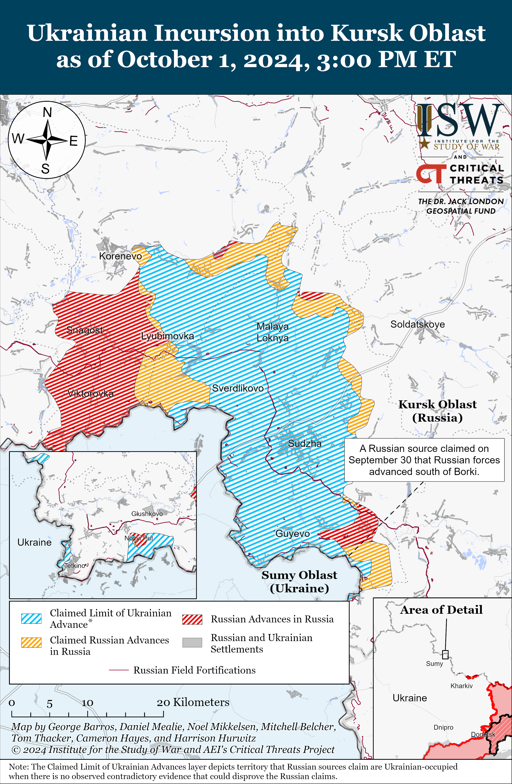
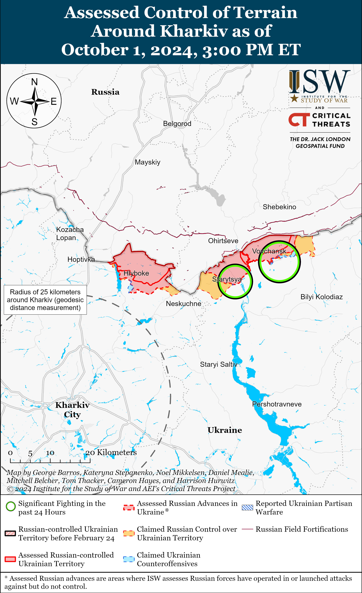
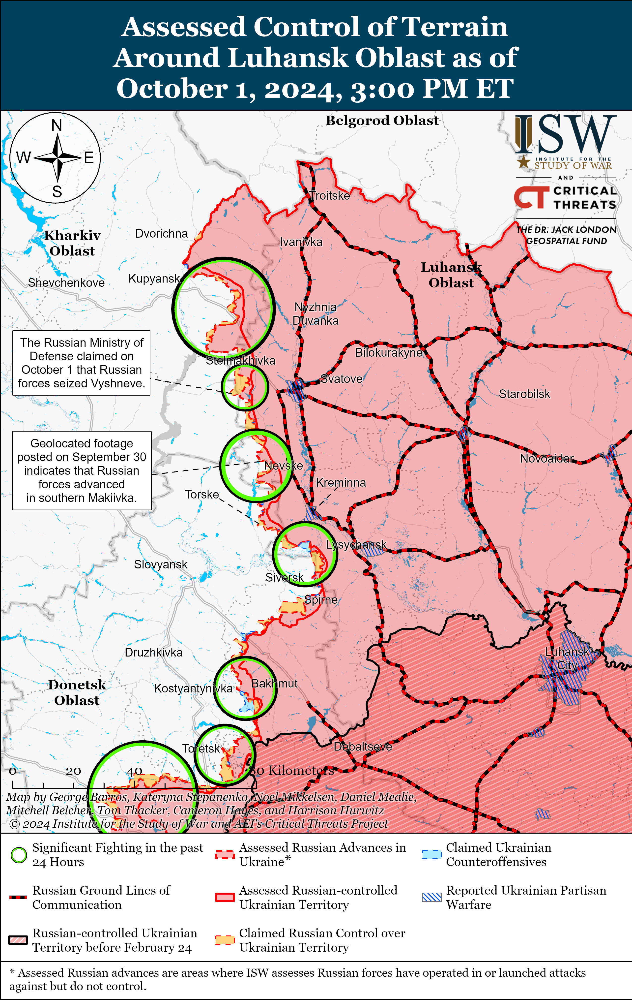
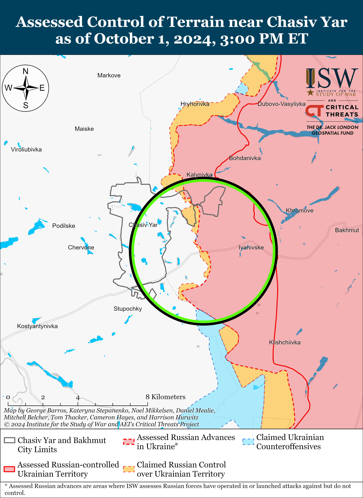
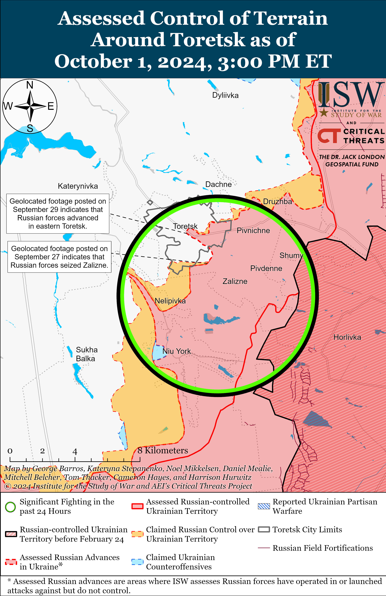
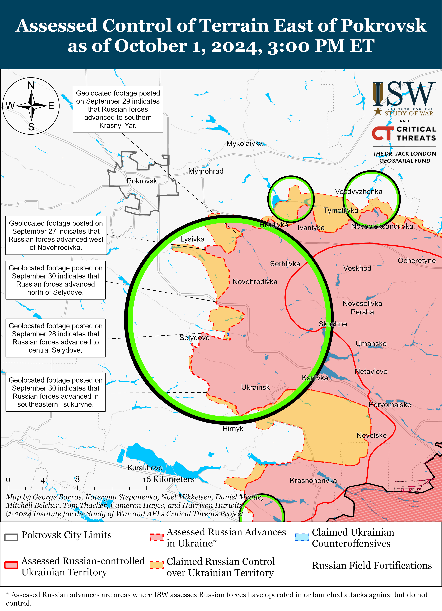
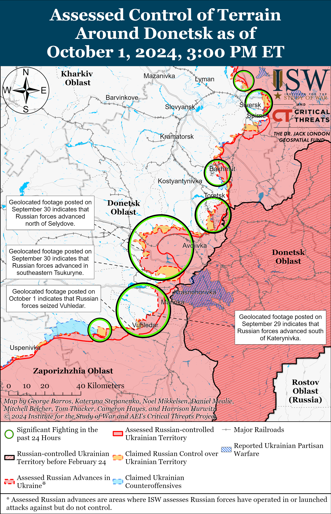
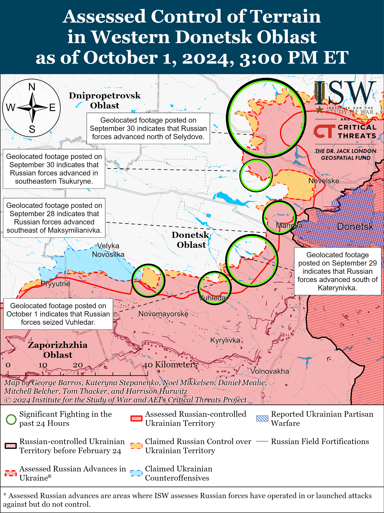
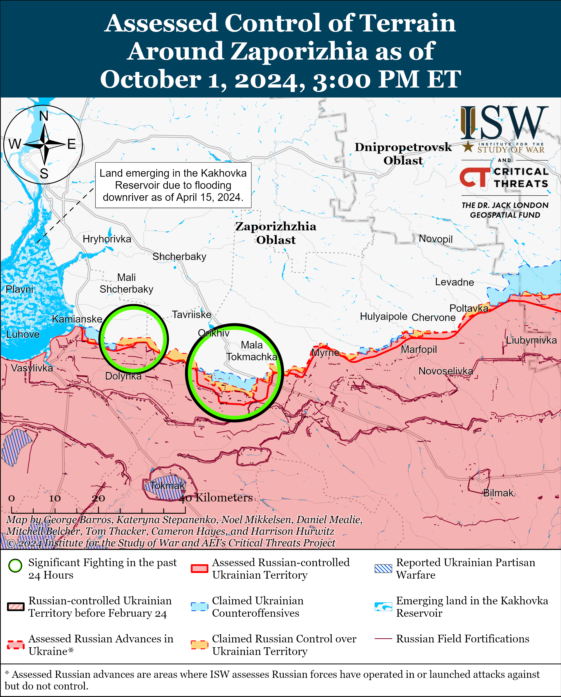
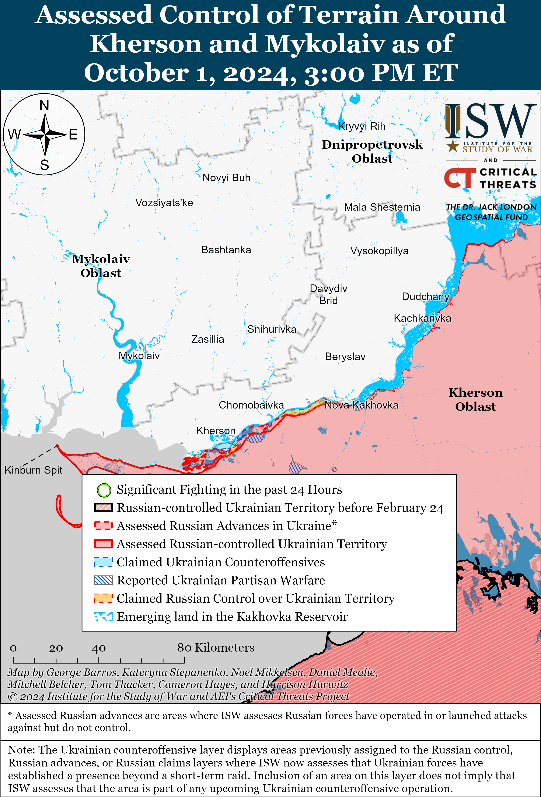

# Russian Offensive Campaign Assessment, October 1, 2024

**Kateryna Stepanenko, Christina Harward, Karolina Hird, and George Barros**

**October 1, 2024, 8:15pm ET**

**Click**[**here**](https://storymaps.arcgis.com/stories/36a7f6a6f5a9448496de641cf64bd375)**to see ISW’s interactive map of the Russian invasion of Ukraine. This map is updated daily alongside the static maps present in this report.**

**Click**[**here**](https://storymaps.arcgis.com/stories/83a2f24901c941d581c0c523ecd2619b)**to see ISW’s interactive map of Ukraine’s offensive in Kursk Oblast.**

**Click**[**here**](https://understandingwar.maps.arcgis.com/apps/instant/3dviewer/index.html?appid=1602762dbcde419bb957dea358449580)**to see ISW’s 3D control of terrain topographic map of Ukraine. Use of a computer (not a mobile device) is strongly recommended for using this data-heavy tool.**

**Click**[**here**](https://storymaps.arcgis.com/stories/733fe90805894bfc8562d90b106aa895)**to access ISW’s archive of interactive time-lapse maps of the Russian invasion of Ukraine. These maps complement the static control-of-terrain map that ISW produces daily by showing a dynamic frontline. ISW will update this time-lapse map archive monthly.**

**Note: The data cut-off for this product was 12:45pm ET on October 1. ISW will cover subsequent reports in the October 2 Russian Offensive Campaign Assessment.**

**Russian forces likely seized Vuhledar as of October 1 following a reported Ukrainian withdrawal from the settlement, though it is unclear if Russian forces will make rapid gains beyond Vuhledar in the immediate future.**Geolocated footage published on September 30 and October 1 shows Russian forces planting Russian flags and freely operating in various parts of Vuhledar, and Russian milbloggers claimed on October 1 that Russian forces seized the settlement.[1] A Ukrainian servicemember reported on October 1 that a part of the Ukrainian force grouping conducted a planned withdrawal from Vuhledar to avoid encirclement, and Russian milbloggers claimed that Ukrainian forces began to withdraw from Vuhledar as of the end of September 30.[2] Russian milbloggers claimed that Russian forces did not completely interdict Ukrainian egress routes before Ukrainian forces withdrew but that Russian artillery and drones inflicted unspecified losses on withdrawing Ukrainian personnel.[3] The scale of Ukrainian casualties is unknown at this time, however, but the widespread reports of Ukrainian withdrawal suggest that the larger Ukrainian contingent likely avoided a Russian encirclement that would have generated greater casualties. Russian sources credited elements of the Russian 40th Naval Infantry Brigade (Pacific Fleet, Eastern Military District [EMD]), 36th Motorized Rifle Brigade (29th Combined Arms Army [CAA], EMD), 5th Tank Brigade and 37th Motorized Rifle Brigade (both part of 36th CAA, EMD), 430th Motorized Rifle Regiment (likely a mobilized unit of the 29th CAA), and 14th Spetsnaz Brigade (Special Forces of the Main Directorate of the General Staff of the Russian Armed Forces [GRU]) for directly seizing or assisting in the seizure of Vuhledar.[4] Russian sources also claimed that Russian forces continued to advance west of Vodyane (northeast of Vuhledar).[5]

**The Russian seizure of Vuhledar follows a series of costly, failed Russian assaults near the settlement over the past two and a half years.** A prominent Russian milblogger celebrated reports of Vuhledar’s seizure by recalling an alleged conversation he had with a Russian high-ranking officer, who told him that the Russian decision to attack in the Vuhledar direction in March 2022 was ill-advised because Russian forces would get “stuck” on the settlement.[6] The milblogger implied that the officer was wrong given that Russian forces eventually seized Vuhledar, although the milblogger failed to acknowledge that Russian forces struggled to advance in the Vuhledar area for over two years. Russia attempted at least two major offensive efforts to seize Vuhledar in October-November 2022 and January-February 2023, both of which resulted in heavy personnel and military equipment losses.[7] Russia’s previous defeats around Vuhledar notably resulted in the attrition of the 155th Naval Infantry Brigade (Pacific Fleet, EMD).[8]

**Some Russian sources expressed doubts that Russian forces will be able to rapidly advance and achieve operationally-significant breakthroughs immediately after seizing Vuhledar.**Some Russian milbloggers noted that they do not expect the frontline to collapse following the seizure of Vuhledar, citing Ukrainian defensive positions northeast of Vuhledar and the need for Russian forces to completely clear Vuhledar to make it a useable position from which they can launch future assaults.[9] One Kremlin-affiliated milblogger attempted to misrepresent Vuhledar as “the last Ukrainian city in the southern Donetsk direction” which underpins the “entire Ukrainian defense” in western Donetsk Oblast — implying that Russia can steadily advance in western Donetsk Oblast following the capture of Vuhledar.[10] Another Kremlin-affiliated milblogger criticized a similar argument that the Russian seizure of Vuhledar would lead to the destruction of Ukrainian defenses in Donetsk Oblast and allow Russian forces to advance towards Kramatorsk and Slovyansk (both approximately 170km northeast of Vuhledar) after seizing Kurakhove and Pokrovsk. The milblogger implied that the argument dismisses the fact that Russian forces will need to fight through heavily fortified settlements far north and northeast of Vuhledar, such as Kostyantynivka, Dobropillya, Pokrovsk, Selydove, Kurakhove, Slovyansk, and Kramatorsk.[11] ISW previously assessed that Russia’s seizure of Vuhledar is unlikely to fundamentally alter the course of offensive operations in western Donetsk Oblast, largely because Vuhledar is not a particularly crucial logistics node and because Russian forces have controlled most of the main roads running into Vuhledar prior to October 1, meaning that Russian forces have already had the ability to interdict Ukrainian logistics in this part of the front to some extent.[12] Vuhledar is also about 30 kilometers south of Russia’s current main effort in the Pokrovsk direction, so Russian forces would need to maneuver across 30 kilometers of open terrain to meaningfully support offensive operations southeast of Pokrovsk. Vuhledar is also located 23 kilometers south of the H-15 highway that stretches between Donetsk City and the Donetsk-Zaporizhia Oblast border area, but Russian forces would need to advance across an open field area during the upcoming muddy season to reach the highway. Advisor to the Donetsk People’s Republic (DNR) Head Igor Kimakovsky notably assessed before the Russian seizure of Vuhledar that the dirt road that Ukrainian forces could have used to withdraw from Vuhledar would soon become unusable due to mud, and it is likely that Russian forces will face similar problems if they soon resume mechanized assaults in the area.[13]

**Ukrainian officials continue to highlight how Ukraine is reducing Russia’s battlefield artillery ammunition advantage, likely in part due to recent Ukrainian strikes on Russian ammunition depots.**Ukrainian First Deputy Defense Minister Lieutenant General Ivan Havryliuk stated on October 1 that the ratio of Russian to Ukrainian artillery ammunition usage decreased from 8-to-1 in favor of Russian forces in Winter 2024 to 3-to-1 as of early October 2024.[14] A Russian milblogger, who is often critical of Russian authorities, claimed on September 30 that Russian forces in various sectors of the front are suffering from artillery ammunition shortages, possibly due to recent Ukrainian strikes on Russian ammunition depots, including the September 18 strike against a Russian missile and storage ammunition storage facility near Toropets, Tver Oblast and the September 21 strike against the Tikhoretsk Arsenal in Krasnodar Krai.[15] The milblogger complained that Russian defense industrial factories, which are operating every day, should still be able to produce and deliver ammunition to the Russian military but appear to be failing to do so. Ukrainian Commander-in-Chief General Oleksandr Syrskyi stated on September 5 that Russian forces were firing two to 2.5 more artillery shells than Ukrainian forces but that Ukrainian forces were narrowing the gap.[16] Ukrainian President Volodymyr Zelensky also stated on September 13 that the ratio of Russian to Ukrainian artillery ammunition usage in the Pokrovsk direction decreased from12-to-1 in favor of Russian forces to 2.5-to-1 after the start of the Ukrainian incursion into Kursk Oblast in August 2024.[17] Ukrainian officials’ statements in early September 2024 about Russia’s decreased artillery ammunition advantage suggest that although the recent Ukrainian strikes on Russian ammunition depots have likely decreased Russian artillery supplies, the strikes are likely not the only contributor to reportedly reduced Russian shell supplies. Western-provided military aid and increasing Ukrainian domestic ammunition production may have also allowed Ukraine to increase its ammunition usage.[18]

**The United Nations Office of the High Commissioner for Human Rights (UN OHCHR) issued its June-August 2024 report detailing Ukrainian civilian casualties, systemic Russian mistreatment of Ukrainian prisoners of war (POWs), and limited Ukrainian mistreatment of Russian POWs.**The UN OHCHR reported that 589 Ukrainian civilians died and 2,685 sustained injuries from conflict-related violence from June 1 to August 31 – a 45 percent increase from the previous three-month period from March 1 to May 31.[19] The UN OHCHR assessed that Russian large-scale missile strikes against Ukraine on July 8 and Russian forces’ intensified efforts to advance in Donetsk Oblast were the main reasons for the high civilian casualty numbers. The UN OHCHR interviewed 169 recently-released Ukrainian POWs, five Ukrainian retained medical personnel, and 205 Russian POWs held in Ukrainian captivity. The UN OHCHR reported that 104 of the 205 interviewed Russian POWs stated that they had faced torture or ill-treatment, mostly at the initial stage of their detainment before being transferred to official facilities, but that conditions in official Ukrainian-run POW locations generally complied with international humanitarian law. The UN OHCHR found that Russian authorities, in contrast, have subjected Ukrainian POWs to torture, ill-treatment, and inhumane conditions “in a widespread and systematic manner” and that almost all Ukrainians interviewed since March 2023 discussed a wide range of methods of torture and ill-treatment during all stages of captivity and interrogation. The UN OHCHR assessed that it is highly unlikely that Russian military superiors and administrators are not aware of the treatment of Ukrainian POWs and that Russian state entities may be coordinating the use of torture. Geolocated drone footage published on October 1 shows Russian forces executing 16 surrendering Ukrainian soldiers near Mykolaivka in the Pokrovsk direction, highlighting the most recent instance of clear Russian abuse of Ukrainian POWs.[20] ISW has extensively reported on footage and reports of Russian service members executing Ukrainian POWs and observed a wider trend of prolific Russian abuses against Ukrainian POWs across various sectors of the front that appeared to be enabled, if not explicitly endorsed, by individual Russian commanders and upheld by Russian field commanders.[21]

**The UN OHCHR report highlighted the difference between official Russian and Ukrainian reactions to the mistreatment of POWs, and Russian state media largely misrepresented the report by ignoring assessments about Russia’s systemic mistreatment of Ukrainian POWs.**The report noted that Russian government officials and state-owned media regularly use “dehumanizing” language about Ukrainian POWs, that some Russian public figures have explicitly called for the unlawful treatment of Ukrainian POWs, and that there are no known prosecutions or convictions against the Russian perpetrators of torture or ill-treatment of Ukrainian POWs. The report noted how the Ukrainian Prosecutor General’s Office reported that it had conducted five pre-trial investigations into possible ill-treatment and murder of Russian POWs since mid-August 2024. The UN OHCHR reported that Ukrainian authorities continue to give the organization “regular and unimpeded” access to Russian POWs, whereas Russia has denied access to Ukrainian POWs since the start of the full-scale invasion. Russian state media only reported on the UN OHCHR’s assessments about Ukrainian mistreatment of Russian POWs, withholding the details of the report about Russia’s systemic abuse of Ukrainian POWs.[22]

**The Russian federal budget for 2025-2027 has carved out funding to support online platforms belonging to a prominent Kremlin propagandist and a former opposition outlet, further highlighting the Kremlin’s efforts to adapt its propaganda machine to Russians’ growing reliance on social media for information.**Russian opposition outlet *Astra*reported on September 30 that the 2025-2027 draft budget allocates 4.5 billion rubles ($47 million) and 49 million rubles ($511,000) in state funding towards the *Solovyov Live*Telegram channel and *Readovka* online news aggregator, respectively.[23] *Astra*noted that this is the first time these online platforms are receiving federal funding. A 2023 joint investigation by Russian opposition outlets *Meduza* and *The Bell* found that *Readovka* posed itself as a semi-opposition outlet prior to Russia’s full-scale invasion of Ukraine in 2022, but then actively started voicing pro-Kremlin views and working with the Russian Ministry of Defense (MoD) after March 2022.[24] The joint investigation noted that *Readovka*founder Alexei Kostylev “always wanted to be in the center,” suggesting that the Kremlin viewed Kostylev’s personal ambitions and affiliations as exploitable factors and coopted *Readovka*to further the Kremlin rhetorical line following the full-scale invasion. *Solovyov Live*is a Telegram channel run by Russian propagandist Vladimir Solovyov and has been a major platform through which the Kremlin has sustained its information narratives and dispelled the information space’s criticism since the start of the war. Solovyov has been using the *Solovyov Live* Telegram channel to amplify his other online initiatives, such as podcasts, and most recently used the platform to defend the commander of a Donetsk People’s Republic (DNR) unit who disbanded a specialized drone unit and sent specialized drone operators to their deaths while conducting an infantry assault.[25] Both *Readovka* and *Solovyov Live* have a decidedly pro-Kremlin bent, and the Kremlin’s sponsorship of these online platforms and initiatives suggests that the Kremlin is increasingly adapting its state-run propaganda machine, which previously focused on traditional TV and print media, to emerging social media platforms.

**Key Takeaways:**

- **Russian forces likely seized Vuhledar as of October 1 following a reported Ukrainian withdrawal from the settlement, though it is unclear if Russian forces will make rapid gains beyond Vuhledar in the immediate future.**
- **Some Russian sources expressed doubts that Russian forces would be able to rapidly advance and achieve operationally-significant breakthroughs immediately after seizing Vuhledar.**
- **Ukrainian officials continue to highlight how Ukraine is reducing Russia’s battlefield artillery ammunition advantage, likely in part due to recent Ukrainian strikes on Russian ammunition depots.**
- **The United Nations Office of the High Commissioner for Human Rights (UN OHCHR) issued its June-August 2024 report detailing Ukrainian civilian casualties, systemic Russian mistreatment of Ukrainian prisoners of war (POWs), and limited Ukrainian mistreatment of Russian POWs. The UN OHCHR report highlighted the difference between official Russian and Ukrainian reactions to the mistreatment of POWs, and Russian state media largely misrepresented the report by ignoring assessments about Russia’s systemic mistreatment of Ukrainian POWs.**
- **The Russian federal budget for 2025-2027 has carved out funding to support online platforms belonging to a prominent Kremlin propagandist and a former opposition outlet, further highlighting the Kremlin’s efforts to adapt its propaganda machine to Russians’ growing reliance on social media for information.**
- **Russian forces recently advanced near Vovchansk, Kreminna, Toretsk, Pokrovsk, and Vuhledar.**
- **Russian authorities are reportedly planning to increase recruitment within Russian pre-trial detention centers.**

***We do not report in detail on Russian war crimes because these activities are well-covered in Western media and do not directly affect the military operations we are assessing and forecasting. We will continue to evaluate and report on the effects of these criminal activities on the Ukrainian military and the Ukrainian population and specifically on combat in Ukrainian urban areas. We utterly condemn Russian violations of the laws of armed conflict and the Geneva Conventions and crimes against humanity even though we do not describe them in these reports.***

- Ukrainian Operations in the Russian Federation
- Russian Main Effort – Eastern Ukraine (comprised of three subordinate main efforts)
- Russian Subordinate Main Effort #1 – Push Ukrainian forces back from the international border with Belgorod Oblast and approach to within tube artillery range of Kharkiv City
- Russian Subordinate Main Effort #2 – Capture the remainder of Luhansk Oblast and push westward into eastern Kharkiv Oblast and encircle northern Donetsk Oblast
- Russian Subordinate Main Effort #3 – Capture the entirety of Donetsk Oblast
- Russian Supporting Effort – Southern Axis
- Russian Air, Missile, and Drone Campaign
- Russian Mobilization and Force Generation Efforts
- Russian Technological Adaptations
- Activities in Russian-occupied areas
- Ukrainian Defense Industrial Base Efforts
- Russian Information Operations and Narratives
- Significant Activity in Belarus

**Ukrainian Operations in the Russian Federation**

Ukrainian forces continued offensive operations west of the Ukrainian salient in Kursk Oblast in Glushkovsky Raion on September 30 and October 1, but did not advance.[26] Russian sources, including the Russian MoD, claimed that Russian forces repelled Ukrainian offensive operations near Novy Put and Veseloye (both southwest of Glushkovo) and that Ukrainian strikes on Krasnooktyabrsky (southeast of Veseloye) suggest that Russian forces still control the settlement.[27] Elements of the Russian 56th Airborne (VDV) Regiment (7th VDV Division) continue to operate in Glushkovsky Raion.[28]

Russian sources claimed that Russian forces recently advanced southeast of Sudzha within the Ukrainian salient in Kursk Oblast. Russian sources claimed that Russian forces repelled Ukrainian attacks near Plekhovo and advanced near Borki (both southeast of Sudzha), although ISW has not observed visual evidence of Russian advances near Borki.[29] Russian sources also claimed that Russian forces made unconfirmed advances between the forest areas of Kucherov and the Brodina gully (on the international border southeast of Sudzha) and that Ukrainian forces continued attacking near Kremyanoye (east of Korenevo).[30] Chechen Akhmat Spetsnaz Commander Apty Alaudinov claimed on October 1 that Russian forces seized two unspecified settlements in Kursk Oblast.[31] Drone elements of the Russian 810th Naval Infantry Brigade (Black Sea Fleet [BSF], Southern Military District [SMD]), artillery elements of the 83rd Separate VDV Brigade, and the ”Smuglyanka” Detachment are reportedly operating in Kursk Oblast.[32]

Ukrainian Pivnich (Northern) Operational Command Spokesperson Vadym Mysnyk stated on September 30 that Russian forces have significantly increased the size of their grouping of forces in Kursk Oblast but are still unable to use the quantitative manpower advantage to decisively push Ukrainian forces from the region.[33] Mysnyk implied that Russian personnel lack the necessary training and combat experience to fully leverage their manpower advantage and that Russian manpower deployments are dependent on Russian transportation infrastructure and geographical terrain features. Mysnyk added that Russia continues to use conscripts and border guards in Kursk Oblast.

**Russian Main Effort – Eastern Ukraine**

**Russian Subordinate Main Effort #1 – Kharkiv Oblast (Russian objective: Push Ukrainian forces back from the international border with Belgorod Oblast and approach to within tube artillery range of Kharkiv City)**

Russian forces made marginal confirmed advances northeast of Kharkiv City during a reinforced company-sized mechanized assault in Vovchansk on September 30. Ukrainian sources began reporting on September 30 that Russian forces launched a mechanized assault in Vovchansk with 17 MT-LB armored fighting vehicles, three tanks, and over 100 personnel and that Ukrainian forces repelled the assault, destroying 16 MT-LBs and damaging one tank.[34] Geolocated footage of the assault indicates that Russian forces made very marginal advances along the T2108 road (Soborna Street) just west of the Vovchansk Aggregate Plant before Ukrainian forces stopped the attack.[35] Ukrainian Kharkiv Group of Forces Spokesperson Colonel Vitaliy Sarantsev stated that Russian forces began the assault on the morning of September 30, using the armored vehicles to transport infantry using two tanks for covering fire.[36] Sarantsev noted that Ukrainian forces repelled the assault with a combination of first-person view (FPV) drone and artillery strikes.[37] A Russian milblogger claimed that elements of the Russian 138th Motorized Rifle Brigade (6th Combined Arms Army [CAA], Leningrad Military District [LMD]) and 1009th Motorized Rifle Regiment (a mobilized unit reportedly subordinated to the 6th CAA) participated in attacks near the Aggregate Plant, potentially in reference to the unsuccessful mechanized assault.[38] Ukrainian military observer Yuri Butusov noted that elements of the Russian Volunteer Corps also participated in the assault near the Aggregate Plant.[39] The Ukrainian General Staff reported that Russian forces conducted ground attacks near Vovchansk; east of Vovchansk near Tykhe; and southwest of Vovchansk near Starytsya and Burhuvatka on September 30 and October 1.[40]

Russian forces continued limited offensive operations north of Kharkiv City on October 1 but did not make any confirmed advances. A Russian milblogger claimed that Russian forces made small gains in a forest area north of Zelene (north of Kharkiv City), but ISW has not yet observed visual evidence of this claim.[41] Ukraine’s Kharkiv Group of Forces stated that Russian forces are largely on the defensive along the Hlyboke-Lyptsi line, where they are fortifying and equipping positions.[42] Elements of the Russian 380th Motorized Rifle Regiment (47th Tank Division, 1st Guards Tank Army, Moscow Military District [MMD]) are reportedly securing their positions near Lukyantsi (east of the Hlyboke-Lyptsi area).[43]

**Russian Subordinate Main Effort #2 – Luhansk Oblast (Russian objective: Capture the remainder of Luhansk Oblast and push westward into eastern Kharkiv Oblast and northern Donetsk Oblast)**

Russian forces recently made confirmed advances northwest of Kreminna and unconfirmed advances west of Svatove amid continued offensive operations on September 30 and October 1. Geolocated footage published on October 1 shows that Russian forces recently marginally advanced west of Makiivka (northwest of Kreminna), and a Russian milblogger claimed that Russian forces also advanced south of Makiivka.[44] A Russian milblogger claimed that Russian forces advanced southward in fields east of Kruhlyakivka (southeast of Kupyansk), and the Russian MoD claimed that elements of the Russian Western Grouping of Forces seized Vyshneve (west of Svatove), although ISW had not observed confirmation of either of these claims.[45] Russian forces continued assaults northeast of Kupyansk near Synkivka; southeast of Kupyansk near Novoosynove, Stepova Novoselivka, Kolisynkivka, Kruhlyakivka, Hlushkivka, and in the direction of Kurylivka; northwest of Svatove near Stelmakhivka; west of Svatove near Andriivka and Vyshneve; northwest of Kreminna near Hrekivka, Makiivka, Nevske, and Novosadove; and southwest of Kreminna near Dibrova, Hryhorivka, the Serebryanske forest, and Serebryanka.[46]

**Russian Subordinate Main Effort #3 – Donetsk Oblast (Russian objective: Capture the entirety of Donetsk Oblast, the claimed territory of Russia’s proxies in Donbas)**

Russian forces continued offensive operations northeast of Siversk near Bilohorivka and east of Siversk near Verkhnokamyanske on September 30 and October 1, but there were no confirmed changes to the frontline.[47]

Russian forces continued offensive operations in the Chasiv Yar direction on October 1, but there were no confirmed changes to the frontline. The Ukrainian General Staff reported that Russian forces conducted offensive operations near Chasiv Yar itself; northeast of Chasiv Yar near Hryhorivka; and south of Chasiv Yar in the direction of Stupochky on September 30 and October 1.[48] A Russian milblogger claimed that Ukrainian forces are counterattacking in the Chasiv Yar direction and called for Russian forces to reinforce the area.[49] The milblogger claimed that Ukrainian forces have strengthened their defenses and are preventing Russian forces from making further advances east of Stupochky. Drone operators of the Russian 98th Airborne (VDV) Division are reportedly operating near Chasiv Yar.[50]

Russian forces recently advanced in Toretsk amid continued offensive operations in the area on October 1. Geolocated footage published on September 30 indicates that Russian forces recently marginally advanced along Maiakovskhoho Street in central Toretsk.[51] Russian forces conducted offensive operations near Toretsk itself; southeast of Toretsk near Zalizne; south of Toretsk near Nelipivka and Niu York; and west of Toretsk towards Shcherbynivka on September 30 and October 1.[52]

Russian forces recently advanced east and southeast of Pokrovsk amid continued offensive operations in the area on October 1. Geolocated footage published on September 30 indicates that Russian forces recently advanced within southeastern Tsukuryne (southeast of Pokrovsk and south of Selydove).[53] A Russian milblogger claimed that Russian forces are attempting to envelop Tsukuryne from the north and south.[54] Additional geolocated footage published on October 1 indicates that Russian forces recently advanced north of Mykolaivka (east of Pokrovsk).[55] The Russian MoD claimed that Russian forces seized Krutyi Yar (southeast of Pokrovsk).[56] ISW assessed that Russian forces had likely seized the entirety of Krutyi Yar as of September 29.[57] A Russian milblogger claimed that Russian forces advanced west of Novohrodivka, north of Selydove, and further within southeastern Tsukuryne, but ISW has not observed confirmation of these claims.[58] Russian forces conducted offensive operations east of Pokrovsk near Novotoretske, Myrolyubivka, Vozdvyzhenka, and Mykolaivka and southeast of Pokrovsk near Lysivka, Selydove, Novohrodivka, Hirnyk, Tsukuryne, and Mykhailivka on September 30 and October 1.[59] A Russian milblogger claimed that Ukrainian forces counterattacked in the direction of Krutyi Yar.[60] A Ukrainian officer operating in the Pokrovsk direction stated that Russian forces have increased the number of infantry assaults in the past three to four days and are using armored vehicles.[61] The Ukrainian officer stated that Russian forces were previously focusing on advancing towards Mykhailivka and are now focusing on the area further south near Tsukuryne and Ukrainsk.

Ukrainian military observer Kostyantyn Mashovets stated on October 1 that Russian “agent combat” groups previously infiltrated the Ukrainian rear in the Pokrovsk direction at an unspecified time.[62] Mashovets stated that the Russian military command tasked elements of the 907th Reconnaissance Battalion and combined tactical detachments of the 3rd and 24th Spetsnaz brigades with conducting sabotage in Ukrainian forces’ tactical and operational-tactical rear; disorganizing Ukrainian command and control (C2) and logistics; and seizing tactically significant structures, such as infrastructure, bridges, and overpasses.

Russian forces continued offensive operations west of Donetsk City on October 1, but there were no confirmed changes to the frontline. Russian forces conducted offensive operations near Heorhiivka and Kurakhove on September 30 and October 1.[63] A Ukrainian brigade operating in the Kurakhove direction (west and southwest of Donetsk City) stated that Russian forces conducted a roughly reinforced company-sized mechanized assault consisting of 11 armored combat vehicles and eight tanks.[64] Ukrainian forces reportedly destroyed four tanks and two armored combat vehicles. A Russian milblogger claimed that Ukrainian drones are preventing Russian forces from advancing near Maksymilyanivka.[65]

Russian forces continued offensive operations southwest of Donetsk City on October 1, but there were no confirmed changes to the frontline. Russian forces conducted offensive operations near Kostyantynivka and Katerynivka on September 30 and October 1.[66] A Russian milblogger claimed that Russian forces advanced 400 meters south of Katerynivka, but ISW has not observed confirmation of this claim.[67] Elements of the Russian 39th Motorized Rifle Brigade (68th Army Corps [AC], Eastern Military District [EMD]) and 1472nd Motorized Rifle Regiment (68th AC) are reportedly operating near Katerynivka.[68]

*See topline text for details about Russian offensive operations in the Vuhledar direction.*

Russian forces continued offensive operations in the Donetsk-Zaporizhia Oblast border area on October 1, but there were no confirmed changes to the frontline. The Ukrainian General Staff reported that Russian forces attacked southeast of Velyka Novosilka near Zolota Nyva on September 30 and October 1.[69] A Russian milblogger claimed that Russian forces advanced three kilometers from Prechystivka (southeast of Velyka Novosilka and west of Vuhledar) towards Zolota Nyva, but ISW has not observed confirmation of this claim.[70] Ukrainian Tavriisk Group of Forces Spokesperson Colonel Vladyslav Voloshyn stated on September 30 that Russian forces are accumulating forces and vehicles near Pryyutne (southwest of Velyka Novosilka) to prepare for assaults.[71]

**Russian Supporting Effort – Southern Axis (Russian objective: Maintain frontline positions and secure rear areas against Ukrainian strikes)**

Russian forces conducted limited ground attacks in western Zaporizhia Oblast near Mala Tokmachka (northeast of Robotyne), Mali Shcherbaky (northwest of Robotyne), and Novodanylivka (north of Robotyne) on October 1 but did not make any confirmed advances in this direction.[72] Elements of the North Ossetian “Alania” battalion and Russian “Smuglyanka” detachment are reportedly operating in the western Zaporizhia Oblast direction.[73]

The Ukrainian Ministry of Energy reported on October 1 that Russian artillery strikes on the main substation of the Russian-occupied Zaporizhzhia Nuclear Power Plant (ZNPP) disconnected one of the ZNPP power lines, causing the ZNPP to be on the “verge of blackout.”[74] The Russian occupation authorities at the ZNPP claimed that the “Ferrosplavnaya-1” high-voltage power line disconnected, but did not specify the cause of the disconnection.[75]

Neither Russian nor Ukrainian forces conducted ground attacks in Kherson Oblast on October 1.[76] Elements of the Russian BARS-33 (Russian Combat Army Reserve) are reportedly striking Ukrainian boats in the Dnipro River.[77]

**Russian Air, Missile, and Drone Campaign (Russian Objective: Target Ukrainian military and civilian infrastructure in the rear and on the frontline)**

Russian forces conducted a mid-sized Shahed-136/131 drone strike against Ukraine on the night of September 31 to October 1. The Ukrainian Air Force reported that Russian forces launched 32 Shaheds from Kursk Oblast; Primorsko-Akhtarsk, Krasnodar Krai; and occupied Cape Chauda, Crimea, 29 of which Ukrainian forces destroyed over Cherkasy, Kirovohrad, Mykolaiv, Kherson, Poltava, Sumy, and Dnipropetrovsk oblasts.[78] The remaining three Shaheds reportedly did not reach their targets due to Ukrainian electronic warfare (EW) interference.[79] Ukrainian Ground Forces Commander Lieutenant General Oleksandr Pavlyuk noted on September 30 that Ukrainian forces have shot down a total of 143 Shahed drones over the past week (September 23 to 30).[80]

Russian forces struck civilian infrastructure in Zaporizhzhia City with guided aerial bombs on October 1.[81] Zaporizhia Oblast Head Ivan Fedorov stated that the strikes damaged high-rise buildings and homes in Komunarskyi Raion, killing one and injuring nine.[82] Ukrainian Tavriisk Group of Forces Spokesperson Colonel Vladyslav Voloshyn noted that Russian forces recently began using guided aerial bombs to strike Zaporizhzhia City after Russian forces recently made tactical and technical adaptations to the bombs that allowed them to travel longer distances.[83]

**Russian Mobilization and Force Generation Efforts (Russian objective: Expand combat power without conducting general mobilization)**

Russian Defense Minister Andrei Belousov inspected the Central Grouping of Forces on October 1 and praised the grouping’s combat work.[84] Belousov heard reports from Central Grouping of Forces Commander Colonel General Andrei Mordvichev about Russian operational-tactical and army aviation, artillery, and drone use. Mordvichev claimed that Russian forces seized 12 settlements in the Central Grouping of Forces’ area of responsibility in the Toretsk and Pokrovsk directions in September 2024 and a total of 130 square kilometers.

Russian authorities are reportedly planning to increase recruitment within Russian pre-trial detention centers. Russian opposition outlet *Vazhnye Istorii*reported on October 1 that sources within the Russian MoD stated that Russian authorities tasked military personnel in charge of recruitment to collect information about how many defendants in pre-trial detention centers are fit for military service and how many are willing to sign MoD contracts.[85] *Vazhnye Istorii*‘s sources stated that Russian authorities expect to recruit about 100 defendants in each of Russia’s 210 pre-trial detention centers to join the Russian military – about 40 percent of all defendants. A source close to the Russian General Staff reportedly stated that the number of prisoners going to fight in Ukraine is decreasing. The Russian State Duma adopted a bill on September 24 allowing Russian prosecutors to drop criminal charges against defendants if a defendant signs a contract with the Russian MoD to serve in Ukraine during mobilization, martial law, and wartime.[86]

Russian opposition outlet *Astra*reported on September 30 that the Russian Investigative Committee in occupied Luhansk Oblast published a resolution to the March 2024 criminal case against seven members of the command of the 6th Motorized Rifle Division (3rd Combined Arms Army, formerly 2nd Luhansk People’s Republic [LNR] Army Corps) for abuse of office, illegal deprivation of liberty, and murder of two or more persons.[87] The Russian commanders reportedly murdered seven service members in occupied Donetsk Oblast in July 2023 and tortured 19 service members in basements and buildings in occupied Luhansk Oblast for their refusal to follow orders. Ukrainian outlet *Suspilne*first reported on July 27 about the internal Russian Investigative Committee resolution that found that commanders and deputy commanders of the Russian 6th Motorized Rifle Division ordered Russian service members to imprison, torture, and kill other service members in Ukraine in 2023.[88] *Suspilne*reported that representatives of the Russian MoD inspected the division, after which the division’s commanders and deputy commanders continued and tried to conceal these practices.

*BBC Russian Service* reported on October 1 that an analysis of vacancies within the Russian defense industrial base (DIB) posted on Russia’s largest job search portals shows that Russia’s DIB is suffering from severe labor shortages.[89] *BBC Russian Service*reported that there were more than 90,000 vacancies related to the Russian DIB between August 15 and September 15 and that salaries are three to four times higher than the regional averages.

Russian President Vladimir Putin signed a decree on September 30 suspending the all-Russian population census, possibly to conceal Russian losses from the war in Ukraine.[90]

Belgorod Oblast Governor Vyacheslav Gladkov stated that the BARS-Belgorod volunteer detachment began its duty on October 1 and will perform combat missions and guard critical infrastructure facilities.[91]

**Russian Technological Adaptations (Russian objective: Introduce technological innovations to optimize systems for use in Ukraine)**

Russia may be attempting to reverse-engineer captured Western military equipment, despite lacking the necessary components to reproduce Western equipment. Russia’s primary tank manufacturer Uralvagonzavod announced on September 30 that it received a German Leopard 2A6 tank for research and claimed that Russian experts will look at the components, systems, and assembly of the tank.[92]

**Ukrainian Defense Industrial Efforts (Ukrainian objective: Develop its defense industrial base to become more self-sufficient in cooperation with US, European, and international partners)**

*ISW is suspending publishing coverage of Ukrainian defense industrial efforts until further notice.*

**Activities in Russian-occupied areas (Russian objective: Consolidate administrative control of annexed areas; forcibly integrate Ukrainian citizens into Russian sociocultural, economic, military, and governance systems)**

Russian officials are reckoning with the challenges of forcibly integrating deported Ukrainian children into Russian schools, highlighting the extremely destructive psychological ramifications of Russia’s continued campaign to deport and Russify Ukrainian children. The Chelyabinsk Research Center for Monitoring and Prevention of Destructive Manifestations in the Educational Environment issued a list of recommendations for teachers in Chelyabinsk Oblast schools on how to deal with possible tensions “due to the appearance of students from the new regions” in Chelyabinsk Oblast.[93] Russian sources and officials use “new regions” as a rhetorical stand-in for the regions of Ukraine that Russia has illegally occupied and annexed since its full-scale invasion in 2022. The recommendations include ensuring that teachers pay “special attention to the formation of patriotism” in Ukrainian children’s education and warning that children from Ukraine may have “poor command of the Russian language,” which teachers should focus on correcting.[94] These recommendations serve as an additional acknowledgment that Russia is forcibly deporting Ukrainian children to Russia and further underline the efforts that Russia is undertaking to Russify deported Ukrainian children by stripping them of their Ukrainian identity and enforcing Russian linguistic and educational standards on them. The recommendations point to high rates of psychological and emotional distress amongst deported children — undermining the prevalent Russian narrative that Russia deports Ukrainian children for their own safety and wellbeing. Independent investigations have highlighted the psychological impacts and trauma that deported Ukrainian children face, both as a result of their deportation and the circumstances of their lives in Russia; their potential forcible separation from their families; and Russia’s systemic efforts to strip them of their Ukrainian identities.[95]

Ukraine’s Security Service (SBU)’s Luhansk and Donetsk Oblast branch implicated Donetsk People’s Republic Head Denis Pushilin in the forcible deportation of at least 31 Ukrainian children from occupied Donetsk Oblast to a children’s camp near Moscow.[96] The SBU’s investigation found that Pushilin signed “Resolution No. 84,” which provided for the deportation of children to Russia for “rehabilitation” and “recreation.” The SBU stated that under Pushilin’s directive, Russian authorities deported 16 boys and 15 girls (all minors) to the “Polyany” children’s camp near Moscow. The SBU noted that Russian authorities took three children from their father in Mariupol, 19 children from an orphanage in Mariupol, and 9 others from orphanages and children’s care homes in Shakhtarsk and Kharsyzk. *Radio Svoboda* reported in February 2023 that Russian authorities deported the three children of a man from Mariupol to the “Polyany” camp, where the children were reportedly put up for adoption into Russian families.[97] Kremlin-appointed Commissioner on Children’s Rights Maria Lvova-Belova adopted a teenager from Mariupol in late 2022, whom Russian authorities had previously deported to the “Polyany” camp along with the other children from Mariupol.[98]

**Russian Information Operations and Narratives**

Nothing significant to report.

**Significant activity in Belarus (Russian efforts to increase its military presence in Belarus and further integrate Belarus into Russian-favorable frameworks and Wagner Group activity in Belarus)**

Russian Prime Minister Mikhail Mishustin met with Belarusian Prime Minister Roman Golovchenko on October 1 to discuss speeding up Union State integration efforts over the coming three years.[99] Mishustin and Golovchenko also discussed strengthening bilateral trade and economic cooperation and the Union State’s “technological sovereignty” through 27 joint industrial cooperation projects. Mishustin and Golovchenko noted the development of humanitarian exchanges within the Union State framework.

**Note: ISW does not receive any classified material from any source, uses only publicly available information, and draws extensively on Russian, Ukrainian, and Western reporting and social media as well as commercially available satellite imagery and other geospatial data as the basis for these reports. References to all sources used are provided in the endnotes of each update.**

---

[1] https://t.me/volnovaha\_news/11815 ; https://t.me/volnovaha\_news/11816 ; https://t.me/creamy\_caprice/6984 ; https://t.me/tehnofrontrv/1972 ; https://t.me/creamy\_caprice/6978 ; https://t.me/RVvoenkor/77931 ; https://t.me/z\_arhiv/28355 ; https://t.me/motopatriot/28211 ; https://t.me/dva\_majors/54006 ; https://t.me/WarArchive\_ua/20670 ; https://t.me/boris\_rozhin/139250

[2] https://t.me/dva\_majors/54021; https://t.me/voin\_dv/11090; https://t.me/dva\_majors/54050; https://t.me/vysokygovorit/17503; https://t.me/vysokygovorit/17503; https://t.me/boris\_rozhin/139229; https://t.me/stanislav\_osman/7237; https://t.me/tass\_agency/276447; https://t.me/voin\_dv/11093

[3] https://t.me/vysokygovorit/17503; https://t.me/boris\_rozhin/139214; https://t.me/stanislav\_osman/7237

[4] https://ura dot news/news/1052823930;

https://t.me/dva\_majors/54021; https://t.me/voin\_dv/11090; https://t.me/dva\_majors/54047; https://t.me/boris\_rozhin/139242; https://t.me/relatives155/18269; https://t.me/dva\_majors/54048; https://t.me/dva\_majors/54049; https://t.me/dva\_majors/54051; https://t.me/z\_arhiv/28326; https://t.me/voin\_dv/11084; https://t.me/voin\_dv/11087; https://t.me/boris\_rozhin/139179; https://t.me/volnovaha\_news/11815; https://t.me/creamy\_caprice/6984; https://t.me/voenkorKotenok/59305; https://t.me/volnovaha\_news/11816; https://t.me/creamy\_caprice/6984; https://t.me/tehnofrontrv/1972; https://t.me/creamy\_caprice/6978; https://t.me/voenkorKotenok/59302; https://t.me/boris\_rozhin/139241; https://t.me/voin\_dv/11094; https://t.me/voin\_dv/11093

[5] https://t.me/z\_arhiv/28355

[6] https://t.me/boris\_rozhin/139229

[7] https://understandingwar.org/backgrounder/russian-offensive-campaign-assessment-october-26-2023; https://understandingwar.org/backgrounder/russian-offensive-campaign-assessment-september-24-2024; https://isw.pub/UkrWar110722; https://isw.pub/UkrWar110322; https://isw.pub/UkrWar021123; https://isw.pub/UkrWar021323; https://isw.pub/UkrWar102922

[8] https://understandingwar.org/backgrounder/russian-offensive-campaign-assessment-february-13-2023; https://understandingwar.org/backgrounder/russian-offensive-campaign-assessment-february-10-2023

[9] https://t.me/dva\_majors/54006; https://t.me/dva\_majors/54009; https://t.me/dva\_majors/54021; https://t.me/voin\_dv/11090; https://t.me/RVvoenkor/77942; https://t.me/DnevnikDesantnika/16365

[10] https://t.me/sashakots/49296

[11] https://t.me/rybar/63999; https://t.me/sashakots/49296

[12] https://understandingwar.org/backgrounder/russian-offensive-campaign-assessment-september-24-2024

[13] https://t.me/tass\_agency/276460

[14] https://armyinform.com dot ua/2024/10/01/odyn-do-troh-perevaga-voroga-v-snaryadah-skorotylasya/; https://youtu.be/j5TqaWCCdUg

[15] https://t.me/astrapress/65546; https://t.me/Z13\_Separ/32642 ; https://t.me/Z13\_Separ/32643; https://understandingwar.org/backgrounder/russian-offensive-campaign-assessment-september-8-2024; https://understandingwar.org/backgrounder/russian-offensive-campaign-assessment-september-29-2024; https://understandingwar.org/backgrounder/russian-offensive-campaign-assessment-september-22-2024 ; https://understandingwar.org/backgrounder/russian-offensive-campaign-assessment-september-21-2024

[16] https://kyivindependent dot com/russia-fires-2-times-more-shells-than-ukraine/

[17] https://isw.pub/UkrWar09162024; https://isw.pub/UkrWar091324

[18] https://isw.pub/UkrWar091524 ; https://isw.pub/UkrWar09162024

[19] https://www.ohchr.org/sites/default/files/documents/countries/ukraine/2024/Ukraine-OHCHR-40th-periodic-report.pdf

[20] [Warning: this footage contains graphic content] https://t.me/mtt\_SF/530; https://t.me/creamy\_caprice/6990

[21] https://understandingwar.org/backgrounder/russian-offensive-campaign-assessment-july-10-2024; https://isw.pub/UkrWar032724; https://isw.pub/UkrWar090624; https://understandingwar.org/backgrounder/russian-offensive-campaign-assessment-february-20-2024; https://isw.pub/UkrWar022524; https://understandingwar.org/backgrounder/russian-offensive-campaign-assessment-september-17-2024

[22] https://tass dot ru/mezhdunarodnaya-panorama/22006309; https://ria dot ru/20241001/ukraina-1975678475.html; https://ria dot ru/20241001/ukraina-1975676740.html; https://www.rbc dot ru/politics/01/10/2024/66fbb42d9a7947148d506e26

[23] https://t.me/astrapress/65517

[24] https://meduza dot io/feature/2023/03/22/kak-kreml-ispolzuet-telegram-kanaly-chtoby-rasprostranyat-voennuyu-propagandu-i-feyki

[25] https://understandingwar.org/backgrounder/russian-offensive-campaign-assessment-september-26-2024

[26] https://t.me/mod\_russia/44007; https://t.me/rybar/63978; https://t.me/dva\_majors/54009; https://t.me/wargonzo/22397; https://t.me/DnevnikDesantnika/16323 ; https://t.me/rusich\_army/17414

[27] https://t.me/mod\_russia/44007; https://t.me/rybar/63978; https://t.me/dva\_majors/54009; https://t.me/wargonzo/22397; https://t.me/DnevnikDesantnika/16323 ; https://t.me/rusich\_army/17414

[28] https://t.me/RVvoenkor/77903; https://t.me/RVvoenkor/77963

[29] https://t.me/z\_arhiv/28336; https://t.me/mod\_russia/44007; https://t.me/dva\_majors/54009

[30] https://t.me/rybar/63978; https://t.me/rusich\_army/17414

[31] https://t.me/tass\_agency/276359

[32] https://t.me/dva\_majors/53979; https://t.me/warhistoryalconafter/187123; https://t.me/DnevnikDesantnika/16331; https://t.me/dva\_majors/54023

[33] https://youtu.be/aDXWlQ2K0dM; https://armyinform.com dot ua/2024/09/30/yakist-proty-kilkosti-na-kurshhyni-sylam-oborony-protystoyat-vorozhi-pidrozdily-riznogo-gatunku/

[34] \*GRAPHIC\* https://t.me/stanislav\_osman/7222; https://t.me/ButusovPlus/13982; https://armyinform dot com.ua/2024/10/01/vovchansk-zavod-ta-20-bronemashyn-rosiyany-sprobuvaly-prykryty-bronyu-tilamy/

[35] \*GRAPHIC\* https://x.com/Danspiun/status/1840882972649472398

[36] \*GRAPHIC\* https://armyinform dot com.ua/2024/10/01/vovchansk-zavod-ta-20-bronemashyn-rosiyany-sprobuvaly-prykryty-bronyu-tilamy/

[37] https://t.me/otukharkiv/1773

[38] https://t.me/motopatriot/28170

[39] https://t.me/ButusovPlus/14000

[40] https://www.facebook.com/GeneralStaff.ua/posts/pfbid02sGMvtz92p4o5jGTbtg6TkmmRfYsFE6kXtGwmwX6goXN8Dv6bPP7AimmFeEG2k1Knl; https://www.facebook.com/GeneralStaff.ua/posts/pfbid02g3MqztAUoNRSVCSwyrPRTALHZrZESjEz7SF2TufV3QbeHjFUen2KX7og6qxy5nihl; https://www.facebook.com/GeneralStaff.ua/posts/pfbid02vSpNTHtNpvMQx8zuM5CZvj6zEhsNospitQ17PYvCesQ8vt6Pa3VYW8mqkRSjnVU3l

[41] https://t.me/DnevnikDesantnika/16343

[42] https://t.me/otukharkiv/1769; https://youtu.be/j5TqaWCCdUg; https://armyinform dot com.ua/2024/09/30/pidgotuvatysya-do-shturmiv-v-zsu-nazvaly-golovne-zavdannya-okupantiv-na-pivnochi-harkivshhyny/

[43] https://t.me/otukharkiv/1769

[44] https://t.me/seekservice/2126; https://t.me/creamy\_caprice/6988; https://t.me/z\_arhiv/28323

[45] https://t.me/mod\_russia/44003; https://t.me/DnevnikDesantnika/16347

[46] https://www.facebook.com/GeneralStaff.ua/posts/pfbid02g3MqztAUoNRSVCSwyrPRTALHZrZESjEz7SF2TufV3QbeHjFUen2KX7og6qxy5nihl; https://www.facebook.com/GeneralStaff.ua/posts/pfbid02sGMvtz92p4o5jGTbtg6TkmmRfYsFE6kXtGwmwX6goXN8Dv6bPP7AimmFeEG2k1Knl; https://www.facebook.com/GeneralStaff.ua/posts/pfbid02vSpNTHtNpvMQx8zuM5CZvj6zEhsNospitQ17PYvCesQ8vt6Pa3VYW8mqkRSjnVU3l; https://t.me/dva\_majors/54009; https://t.me/DnevnikDesantnika/16363; https://t.me/motopatriot/28169; https://t.me/DnevnikDesantnika/16323

[47] https://www.facebook.com/GeneralStaff.ua/posts/pfbid02sGMvtz92p4o5jGTbtg6TkmmRfYsFE6kXtGwmwX6goXN8Dv6bPP7AimmFeEG2k1Knl; https://www.facebook.com/GeneralStaff.ua/posts/pfbid02vSpNTHtNpvMQx8zuM5CZvj6zEhsNospitQ17PYvCesQ8vt6Pa3VYW8mqkRSjnVU3l

[48] https://www.facebook.com/GeneralStaff.ua/posts/pfbid02g3MqztAUoNRSVCSwyrPRTALHZrZESjEz7SF2TufV3QbeHjFUen2KX7og6qxy5nihl; https://www.facebook.com/GeneralStaff.ua/posts/pfbid02sGMvtz92p4o5jGTbtg6TkmmRfYsFE6kXtGwmwX6goXN8Dv6bPP7AimmFeEG2k1Knl; https://www.facebook.com/GeneralStaff.ua/posts/pfbid02vSpNTHtNpvMQx8zuM5CZvj6zEhsNospitQ17PYvCesQ8vt6Pa3VYW8mqkRSjnVU3l

[49] https://t.me/DnevnikDesantnika/16311

[50] https://t.me/mod\_russia/44010; https://t.me/DnevnikDesantnika/16331

[51] https://x.com/AudaxonX/status/1841177371128299558; https://t.me/b4\_101/16

[52] https://www.facebook.com/GeneralStaff.ua/posts/pfbid02g3MqztAUoNRSVCSwyrPRTALHZrZESjEz7SF2TufV3QbeHjFUen2KX7og6qxy5nihl ; https://www.facebook.com/GeneralStaff.ua/posts/pfbid02sGMvtz92p4o5jGTbtg6TkmmRfYsFE6kXtGwmwX6goXN8Dv6bPP7AimmFeEG2k1Knl ; https://www.facebook.com/GeneralStaff.ua/posts/pfbid02vSpNTHtNpvMQx8zuM5CZvj6zEhsNospitQ17PYvCesQ8vt6Pa3VYW8mqkRSjnVU3l ; https://t.me/dva\_majors/54009

[53] https://t.me/syly\_pox/39; https://t.me/creamy\_caprice/6977

[54] https://t.me/DnevnikDesantnika/16323

[55] [Warning: this footage contains graphic content] https://t.me/mtt\_SF/530; https://t.me/creamy\_caprice/6990

[56] https://t.me/mod\_russia/44004;

[57] https://understandingwar.org/backgrounder/russian-offensive-campaign-assessment-september-29-2024

[58] https://t.me/dva\_majors/54009; https://t.me/z\_arhiv/28337

[59] https://www.facebook.com/GeneralStaff.ua/posts/pfbid02g3MqztAUoNRSVCSwyrPRTALHZrZESjEz7SF2TufV3QbeHjFUen2KX7og6qxy5nihl; https://www.facebook.com/GeneralStaff.ua/posts/pfbid02sGMvtz92p4o5jGTbtg6TkmmRfYsFE6kXtGwmwX6goXN8Dv6bPP7AimmFeEG2k1Knl; https://www.facebook.com/GeneralStaff.ua/posts/pfbid02vSpNTHtNpvMQx8zuM5CZvj6zEhsNospitQ17PYvCesQ8vt6Pa3VYW8mqkRSjnVU3l ; https://t.me/RVvoenkor/77931

[60] https://t.me/DnevnikDesantnika/16323

[61] https://www.youtube.com/watch?v=aDXWlQ2K0dM; https://armyinform dot com.ua/2024/10/01/na-pokrovskomu-napryamku-vorog-zbilshyv-kilkist-pihotnyh-shturmiv-zaluchaye-bronetehniku/

[62] https://t.me/zvizdecmanhustu/2229

[63] https://www.facebook.com/GeneralStaff.ua/posts/pfbid02g3MqztAUoNRSVCSwyrPRTALHZrZESjEz7SF2TufV3QbeHjFUen2KX7og6qxy5nihl; https://www.facebook.com/GeneralStaff.ua/posts/pfbid02sGMvtz92p4o5jGTbtg6TkmmRfYsFE6kXtGwmwX6goXN8Dv6bPP7AimmFeEG2k1Knl ; https://www.facebook.com/GeneralStaff.ua/posts/pfbid02vSpNTHtNpvMQx8zuM5CZvj6zEhsNospitQ17PYvCesQ8vt6Pa3VYW8mqkRSjnVU3l

[64] https://t.me/odshbr79/379; https://t.me/ButusovPlus/13998; https://mil.in dot ua/uk/news/desantnyky-vidbyly-masovanu-rosijsku-ataku-na-kurahivskomu-napryamku/

[65] https://t.me/DnevnikDesantnika/16312 ; https://t.me/DnevnikDesantnika/16323

[66] https://www.facebook.com/GeneralStaff.ua/posts/pfbid02g3MqztAUoNRSVCSwyrPRTALHZrZESjEz7SF2TufV3QbeHjFUen2KX7og6qxy5nihl; https://www.facebook.com/GeneralStaff.ua/posts/pfbid02sGMvtz92p4o5jGTbtg6TkmmRfYsFE6kXtGwmwX6goXN8Dv6bPP7AimmFeEG2k1Knl ; https://www.facebook.com/GeneralStaff.ua/posts/pfbid02vSpNTHtNpvMQx8zuM5CZvj6zEhsNospitQ17PYvCesQ8vt6Pa3VYW8mqkRSjnVU3l

[67] https://t.me/DnevnikDesantnika/16366

[68] https://t.me/voin\_dv/11091

[69] https://www.facebook.com/GeneralStaff.ua/posts/pfbid02sGMvtz92p4o5jGTbtg6TkmmRfYsFE6kXtGwmwX6goXN8Dv6bPP7AimmFeEG2k1Knl; https://www.facebook.com/GeneralStaff.ua/posts/pfbid02vSpNTHtNpvMQx8zuM5CZvj6zEhsNospitQ17PYvCesQ8vt6Pa3VYW8mqkRSjnVU3l

[70] https://t.me/DnevnikDesantnika/16369

[71] https://youtu.be/j5TqaWCCdUg; https://armyinform.com dot ua/2024/09/30/konczentruyutsya-v-rajoni-pryyutnogo-na-zaporizhzhi-rosiyany-gotuyutsya-shturmuvaty-na-bagi/

[72] https://www.facebook.com/GeneralStaff.ua/posts/pfbid02g3MqztAUoNRSVCSwyrPRTALHZrZESjEz7SF2TufV3QbeHjFUen2KX7og6qxy5nihl; https://www.facebook.com/GeneralStaff.ua/posts/pfbid02sGMvtz92p4o5jGTbtg6TkmmRfYsFE6kXtGwmwX6goXN8Dv6bPP7AimmFeEG2k1Knl

[73] https://t.me/wargonzo/22403; https://t.me/dva\_majors/54057

[74] https://t.me/energyofukraine/2975

[75] https://t.me/tass\_agency/276405

[76] https://www.facebook.com/GeneralStaff.ua/posts/pfbid02sGMvtz92p4o5jGTbtg6TkmmRfYsFE6kXtGwmwX6goXN8Dv6bPP7AimmFeEG2k1Knl

[77] https://t.me/dva\_majors/53981; https://t.me/dva\_majors/54031

[78] https://t.me/kpszsu/20348

[79] https://t.me/kpszsu/20348

[80] https://t.me/Pavliuk\_KSV/5622; https://armyinform.com dot ua/2024/09/30/u-suhoputnyh-vijsk-povidomyly-skilky-vorozhyh-povitryanyh-czilej-znyshhyly-za-tyzhden/

[81] https://t.me/ivan\_fedorov\_zp/12015; https://t.me/ivan\_fedorov\_zp/12016; https://t.me/ivan\_fedorov\_zp/12017; https://t.me/ivan\_fedorov\_zp/12018; https://t.me/ivan\_fedorov\_zp/12026

[82] https://t.me/ivan\_fedorov\_zp/12026

[83] https://armyinform.com dot ua/2024/09/30/kabamy-po-zaporizhzhyu-chomu-rosijski-okupanty-teroryzuyut-myrnyh-meshkancziv/

[84] https://t.me/mod\_russia/44006

[85] https://storage dot googleapis.com/istories/news/2024/10/01/v-rossii-planiruyut-zabrat-na-voinu-40-protsentov-podsudimikh/index.html; https://meduza dot io/news/2024/10/01/vazhnye-istorii-v-rossii-iz-sizo-planiruyut-zabrat-na-voynu-40-podsudimyh-okolo-20-tysyach-chelovek; https://www.idelreal.org/a/rossiya-ukraina-voyna-sizo/33141927.html; https://t.me/istories\_media/7734

[86] https://understandingwar.org/backgrounder/russian-offensive-campaign-assessment-september-24-2024

[87] https://t.me/astrapress/65507

[88] https://understandingwar.org/backgrounder/russian-offensive-campaign-assessment-july-27-2024

[89] https://t.me/bbcrussian/71081

[90] https://t.me/mobilizationnews/20417 ; http://kremlin dot ru/acts/news/75217

[91] https://ria dot ru/20241001/otryad-1975678849.html

[92] https://t.me/milinfolive/131764

[93] https://pgtk74 dot ru/deyatelnost/vospitatelnaya-deyatelnost/metodicheskie-materialy/nicmp-metodicheskie-rekomendacii-po-adaptacii-obuchayuschihsya-iz-novyh-regionov?ysclid=m1q36idyuf659534471; https://t.me/rasstriga/12716

[94] https://t.me/rasstriga/12716; https://t.me/ostorozhno\_novosti/30010?single

[95] https://spektr dot press/ukradennoe-buduschee/; https://adcmemorial dot org/novosti/narusheniya-prav-detej-iz-ukrainy-vyvezennyh-v-rossiyu-i-belarus-v-rezultate-rossijskoj-voennoj-agressii/; https://www.bbc.com/russian/features-66328530; https://www.currenttime dot tv/a/deti-systema/32438220.html

[96] https://www.facebook.com/ssu.sievierodonetsk/posts/pfbid093YWJYyda8EkHnke2ZsAreej1199D7HZEbHhymzotsBoWqB199xpTRoaBrnznrP3l

[97] https://www.svoboda dot org/a/papa-nas-hotyat-usynovitj-pohischennye-ukrainskie-deti-v-rossii/32270905.html

[98] https://www.svoboda dot org/a/ukradennyy-iz-mariupolya-nastoyaschaya-istoriya-filippa-golovni/32371806.html; https://www.facebook.com/ssu.sievierodonetsk/posts/pfbid093YWJYyda8EkHnke2ZsAreej1199D7HZEbHhymzotsBoWqB199xpTRoaBrnznrP3l

[99] https://t.me/MID\_Russia/45926; https://t.me/government\_rus/15687
