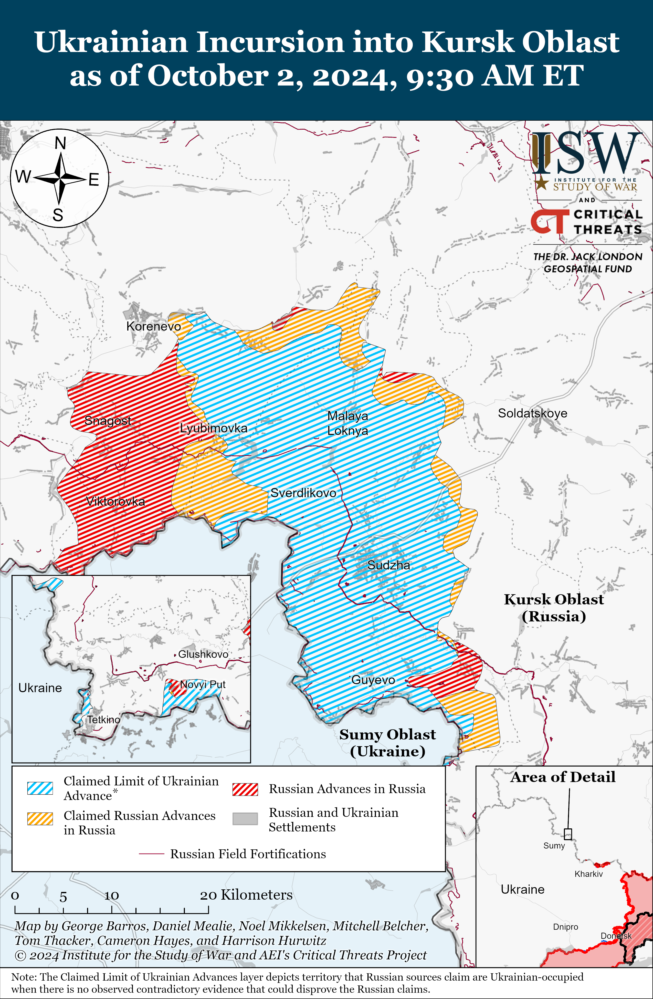
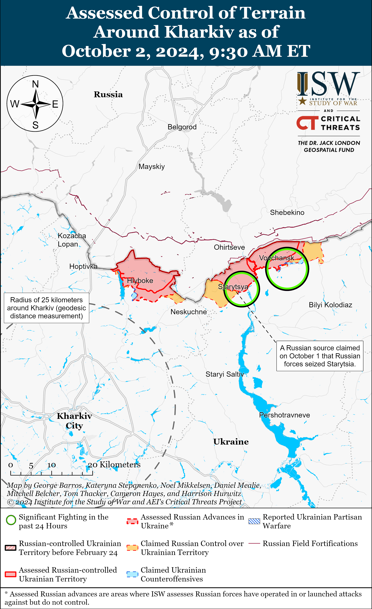
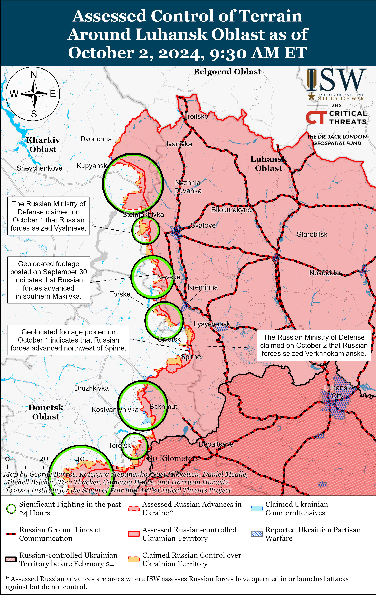
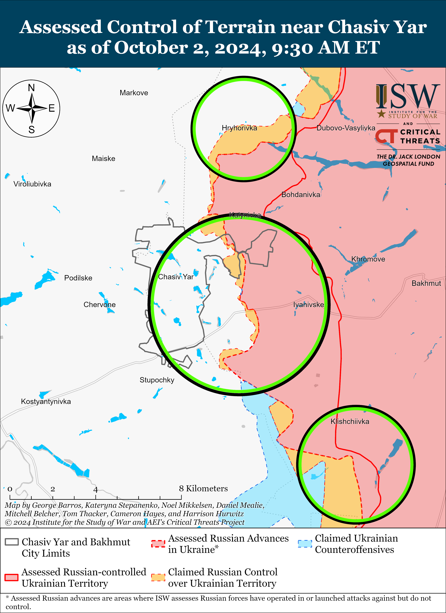
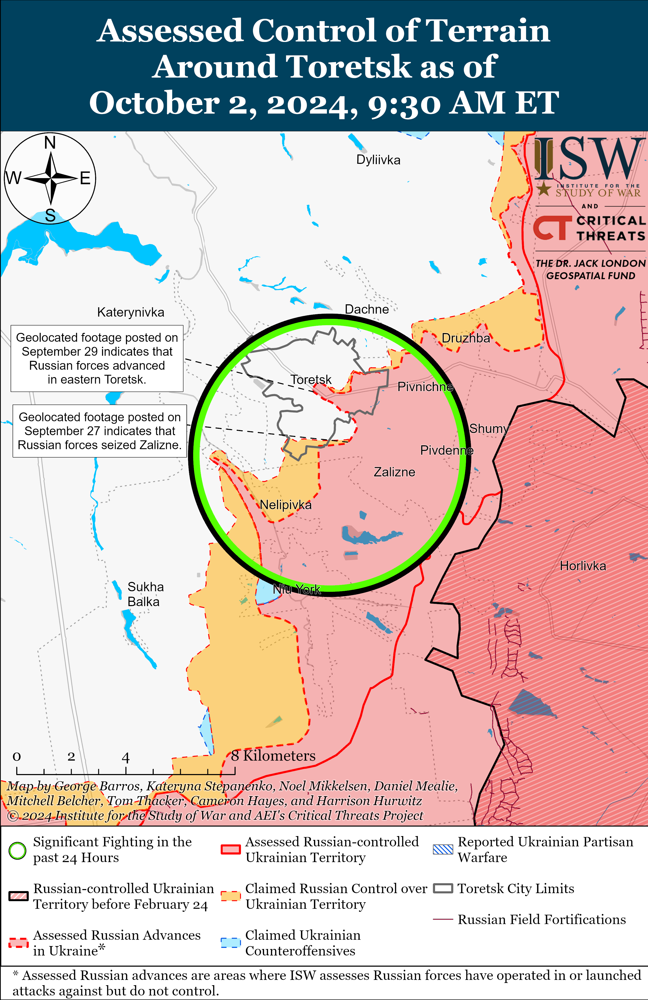
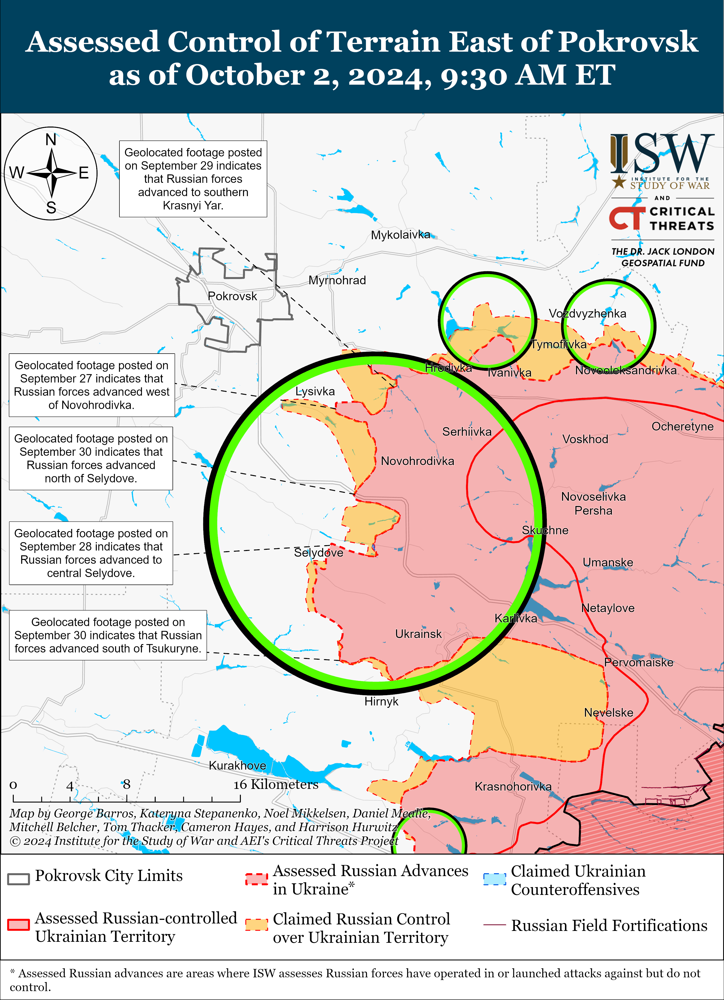
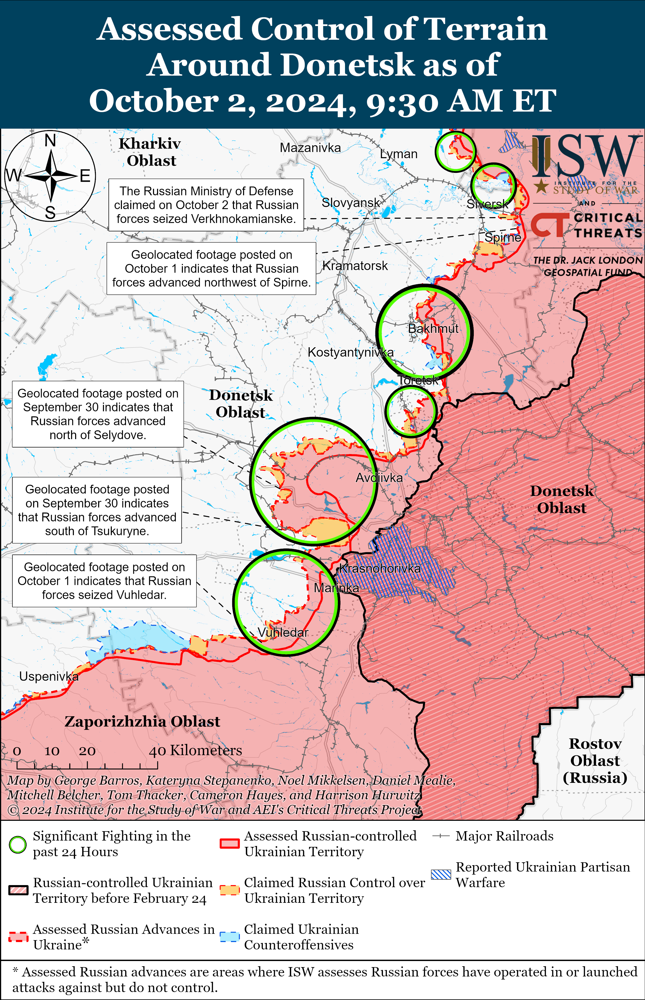
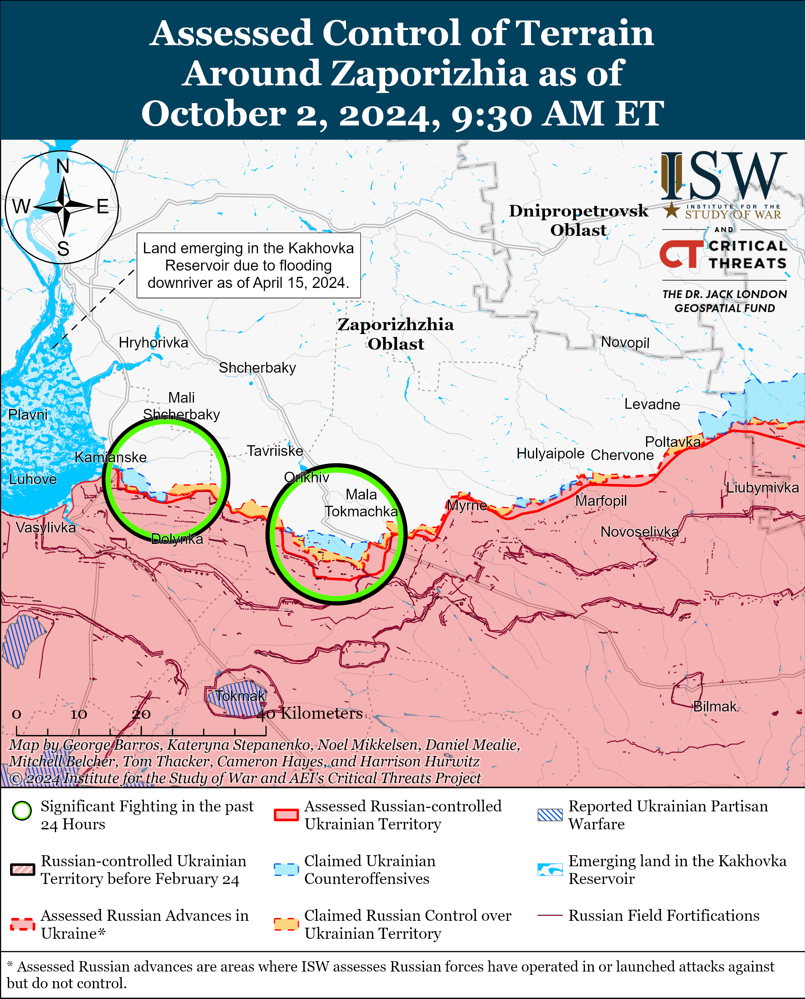
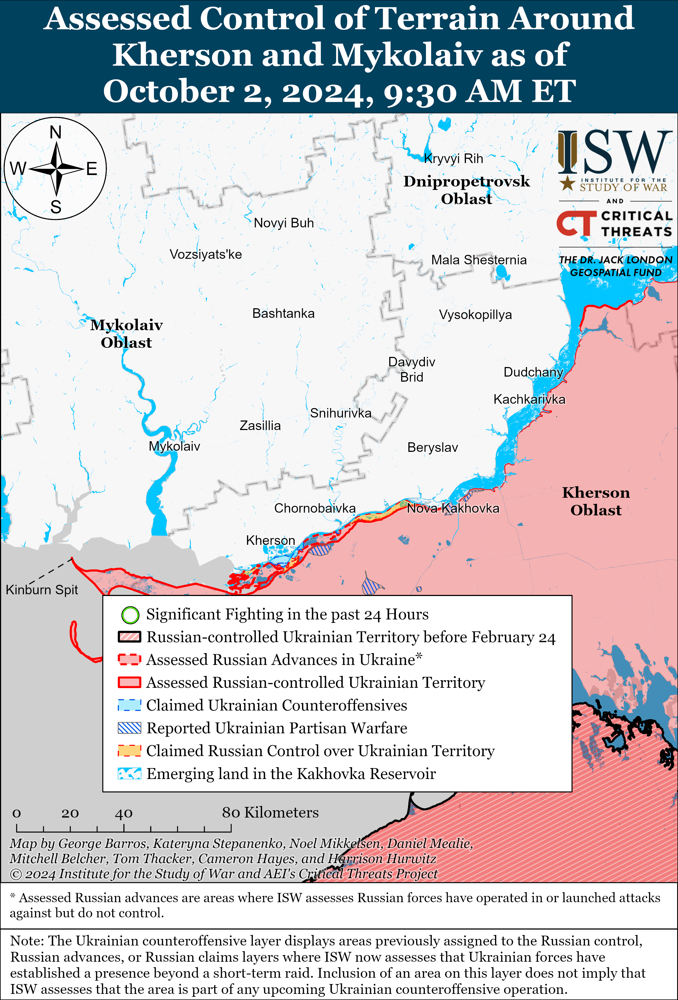

# Russian Offensive Campaign Assessment, October 2, 2024

**Riley Bailey, Angelica Evans, Davit Gasparyan, Grace Mappes, Nate Trotter, and George Barros**

**October 2, 2024, 1:15pm ET**

**Click**[**here**](https://storymaps.arcgis.com/stories/36a7f6a6f5a9448496de641cf64bd375)**to see ISW’s interactive map of the Russian invasion of Ukraine. This map is updated daily alongside the static maps present in this report.**

**Click**[**here**](https://storymaps.arcgis.com/stories/83a2f24901c941d581c0c523ecd2619b)**to see ISW’s interactive map of Ukraine’s offensive in Kursk Oblast.**

**Click**[**here**](https://understandingwar.maps.arcgis.com/apps/instant/3dviewer/index.html?appid=1602762dbcde419bb957dea358449580)**to see ISW’s 3D control of terrain topographic map of Ukraine. Use of a computer (not a mobile device) is strongly recommended for using this data-heavy tool.**

**Click**[**here**](https://storymaps.arcgis.com/stories/733fe90805894bfc8562d90b106aa895)**to access ISW’s archive of interactive time-lapse maps of the Russian invasion of Ukraine. These maps complement the static control-of-terrain map that ISW produces daily by showing a dynamic frontline. ISW will update this time-lapse map archive monthly.**

**Note: The data cut-off for this product was 10:30am ET on October 2. ISW will cover subsequent reports in the October 1 Russian Offensive Campaign Assessment.**

**Ukraine continues efforts to expand domestic production of significant military equipment and maintain its drone advantage over Russia.**Ukrainian President Volodymyr Zelensky stated on October 1 that Ukrainian companies can currently produce four million drones annually and that Ukraine has already contracted the domestic production of 1.5 million drones (presumably in 2024).[1] Russian President Vladimir Putin recently claimed that Russia plans to increase drone production by tenfold to 1.4 million drones in 2024, which will be lower than the two million drones that Ukraine aims to produce in 2024.[2] Zelensky also stated that Ukraine can produce 15 “Bohdan” self-propelled artillery systems every month and recently conducted a successful flight test for an unspecified domestically produced ballistic missile.[3] Ukrainian Defense Minister Rustem Umerov stated on October 2 that Ukraine will continue prioritizing domestic production of drones and long-range missiles, including ballistic missiles.[4] Ukrainian Prime Minister Denys Shmyhal stated on October 2 that Ukraine has allocated $7 billion for the purchase of weapons and military equipment in the Ukrainian draft 2025 state budget — a 65 percent increase from the 2024 state budget.[5] Shmyhal stated that Ukraine increased domestic weapons production by a factor of three in 2023 and by factor of two in the first eight months of 2024.[6] ISW continues to assess that Ukrainian efforts to expand domestic military production will allow Ukraine to reduce its dependence on Western military assistance in the long-term, but that Ukraine still requires considerable Western assistance for the next several years in order to defend against Russian aggression and liberate strategically vital areas that Russian forces currently occupy.[7]

**Russian Deputy Foreign Minister Mikhail Bogdanov condemned the Israel Defense Force’s (IDF) ground operation in southern Lebanon during a meeting with the Lebanese ambassador to Russia on October 1.[8]**Bogdanov met with Lebanese Ambassador Shawki Bou Nassar and discussed the military-political situation in the Middle East. Bogdanov expressed “strong condemnation of Israel’s ground invasion of Lebanon and emphasized Russia’s opposition to alleged Israeli political assassinations. Bogdanov highlighted the importance of providing humanitarian assistance to Lebanon and safely evacuating Russian citizens from Lebanon. Russian Ambassador to Israel Anatoly Viktorov called for an immediate end to the conflict in the Middle East, and Russian Foreign Minister Sergei Lavrov met with ambassadors of unspecified Arab states and called for the immediate end of military operations in the Israeli-Palestinian conflict area.[9] The Kremlin likely seeks to take advantage of the conflict in the Middle East to promote Russian-dominated international structures, including some connected to the Kremlin’s effort to establish an alternative “Eurasian security architecture.” Russian Deputy Foreign Minister Sergei Ryabkov stated on October 2 that Palestinian Authority (PA) President Mahmoud Abbas has accepted Russia’s invitation to attend the BRICS summit in Kazan on October 22–24 and that participants will discuss the situation in the Middle East.[10] The Russian Ministry of Foreign Affairs (MFA) recently condemned Israel’s “political assassination” of Hezbollah Secretary General Sayyed Hassan Nasrallah, Israel’s decision to simultaneously detonatethousands of pagers belonging to Lebanese Hezbollah (LH) members across Lebanon and Syria, and previous Israeli strikes against Iran.[11]

**Latvian forces enhanced air defense near the Russian border following a recent Russian drone crash in the country.** Latvian Defense Minister Andris Spruds announced on October 2 that the Latvian Air Force deployed mobile combat groups equipped with air defense missiles in Latgale near the Russian-Latvian border and set up specialized radars along the border to detect drones.[12] Spruds confirmed that both professional military personnel and members of the Latvian National Defense Service are actively participating in the air defense operation. This decision comes in response to the September 7 Russian Shahed-type drone crash in Latvia’s Rezekne municipality, close to the Russian border.[13]

**Key Takeaways:**

- **Ukraine continues efforts to expand domestic production of significant military equipment and maintain its drone advantage over Russia.**
- **Russian Deputy Foreign Minister Mikhail Bogdanov condemned the Israel Defense Force’s (IDF) ground operation in southern Lebanon during a meeting with the Lebanese ambassador to Russia on October 1.**
- **Latvian forces enhanced air defense near the Russian border following a recent Russian drone crash in the country.**
- **Russian and Ukrainian forces continued assaults in Kursk Oblast.**
- **Russian forces recently marginally advanced near Svatove, Siversk, and Vuhledar and east and southeast of Pokrovsk**
- **Russian defense enterprises are recruiting tens of thousands of new workers due to acute personnel shortages amid increased production of weapons due to the war in Ukraine.**

    
    
  

***We do not report in detail on Russian war crimes because these activities are well-covered in Western media and do not directly affect the military operations we are assessing and forecasting. We will continue to evaluate and report on the effects of these criminal activities on the Ukrainian military and the Ukrainian population and specifically on combat in Ukrainian urban areas. We utterly condemn Russian violations of the laws of armed conflict and the Geneva Conventions and crimes against humanity even though we do not describe them in these reports.***

- Ukrainian Operations in the Russian Federation
- Russian Main Effort – Eastern Ukraine (comprised of three subordinate main efforts)
- Russian Subordinate Main Effort #1 – Push Ukrainian forces back from the international border with Belgorod Oblast and approach to within tube artillery range of Kharkiv City
- Russian Subordinate Main Effort #2 – Capture the remainder of Luhansk Oblast and push westward into eastern Kharkiv Oblast and encircle northern Donetsk Oblast
- Russian Subordinate Main Effort #3 – Capture the entirety of Donetsk Oblast
- Russian Supporting Effort – Southern Axis
- Russian Air, Missile, and Drone Campaign
- Russian Mobilization and Force Generation Efforts
- Russian Technological Adaptations
- Activities in Russian-occupied areas
- Ukrainian Defense Industrial Base Efforts
- Russian Information Operations and Narratives
- Significant Activity in Belarus

**Ukrainian Operations in the Russian Federation**

Ukrainian forces continued ground assaults in Glushkovsky Raion on October 2, but did not make any confirmed gains. A Russian milblogger claimed on October 1 that Ukrainian forces conducted a platoon-sized mechanized assault and temporarily reached the northern outskirts of Veseloye (south of Glushkovo) after bypassing Obukhovka (immediately south of Veseloye).[14] The milblogger claimed that Russian forces destroyed a Ukrainian armored vehicle that reached Veseloye’s outskirts and that Russian forces eventually repelled Ukrainian forces back to their initial positions.[15] Russian sources, including the Russian Ministry of Defense (MoD), claimed that Russian forces repelled Ukrainian assaults in the direction of Veseloye and near Novy Put (south of Veseloye) and that fighting was ongoing near Obukhovka on October 2.[16] The Russian MoD also claimed that Russian forces counterattacked near Novy Put.[17]

Ukrainian forces continued ground attacks in the main Ukrainian salient in Kursk Oblast on October 2 but did not make any confirmed gains. Russian sources, including the Russian MoD, claimed that Russian forces repelled Ukrainian assaults east of Korenevo near Olgovka, north of Sudzha near Cherkasskoye Porechnoye, and southeast of Sudzha near Plekhovo.[18]

Russian forces continued ground assaults in the main Ukrainian salient in Kursk Oblast on October 2 but did not make any confirmed gains. A Russian milblogger claimed on October 2 that Russian forces recaptured Novosyolovka (north of Sudzha), although ISW has not observed recent Russian claims that Ukrainian forces were operating in the settlement.[19] A Russian milblogger claimed that Russian forces advanced near Plekhovo, but that Ukrainian forces still control the settlement.[20] Russian sources, including the Russian MoD, claimed that Russian forces attacked southeast of Korenevo near Lyubimovka and Nikolayevo-Darino, north of Sudzha near Novosyolovka, and southeast of Sudzha near Plekhovo.[21] Elements of the Russian 155th Naval Infantry Brigade (Pacific Fleet, Eastern Military District [EMD]) are reportedly operating near Apanasovka (southwest of Korenevo), and elements of the 56th Airborne (VDV) Regiment (7th VDV Division) are reportedly operating in Kursk Oblast.[22]

**Russian Main Effort – Eastern Ukraine**

**Russian Subordinate Main Effort #1 – Kharkiv Oblast****(Russian objective: Push Ukrainian forces back from the international border with Belgorod Oblast and approach to within tube artillery range of Kharkiv City)**

Russian forces continued offensive operations north and northeast of Kharkiv City on October 2, but there were no confirmed changes to the frontline. Russian milbloggers claimed that elements of the Russian 41st Motorized Rifle Regiment (72nd Motorized Rifle Division, 44th Army Corps [AC], Leningrad Military District [LMD]) seized Starytsya (northeast of Kharkiv City and southwest of Vovchansk) and  that Russian forces seized part of a forest north of Zelene (northeast of Kharkiv City and Lyptsi), although ISW has not observed visual confirmation of these claims.[23] Russian forces conducted ground assaults  near Starytsya and north of Kharkiv City within Vovchansk (northeast of Kharkiv City) on October 1 and 2.[24] Russian milbloggers claimed that Russian forces struck Vovchansk with an ODAB-9000 thermobaric glide bomb on October 2, but Kharkiv Group of Forces Spokesperson Colonel Vitaly Sarantsev rejected this claim and stated that Russian forces used a smaller glide bomb during the strike.[25]

**Russian Subordinate Main Effort #2 – Luhansk Oblast****(Russian objective: Capture the remainder of Luhansk Oblast and push westward into eastern Kharkiv Oblast and northern Donetsk Oblast)**

Russian forces recently advanced southwest of Svatove amid continued offensive operations along the Kupyansk-Svatove-Kreminna line on October 2. Geolocated footage published on October 2 indicates that Russian forces recently advanced northwest of Novovodyane (southwest of Svatove).[26]  Russian Defense Minister Andrei Belousov claimed on October 2 that elements of the 3rd Motorized Rifle Division (20th Combined Arms Army [CAA], Moscow Military District [MMD]) recently seized Makiivka and are currently advancing in the direction of Rubtsi (west of Makiivka and east of Oskil).[27]  ISW has not observed confirmation that Russian forces have seized Makiivka, however. Russian forces continued offensive operations northeast of Kupyansk near Synkivka; southwest of Kupyansk near Novoosynove, Kurelivka, Stepova Novoselivka, Vyshneve, Kolisnykivka, Hlushkivka, and Kruhlyakivka; west of Svatove near Andriivka; northwest of Kreminna near Hrekivka, Novosadove, Makiivka, and Nevske; west of Kreminna near Torske; and south of Kreminna in the Serebryanske forest area on October 1 and 2.[28]

**Russian Subordinate Main Effort #3 – Donetsk Oblast (Russian objective: Capture the entirety of Donetsk Oblast, the claimed territory of Russia’s proxies in Donbas)**

Russian forces recently marginally advanced southeast of Siversk amid continued Russian offensive operations in the area on October 2. Geolocated footage published on October 1 indicates that Russian forces recently marginally advanced north of Spirne (southeast of Siversk).[29] Russian sources claimed on October 2 that Russian forces seized Verkhnokamyanske (east of Siversk), but ISW has not observed confirmation of these claims.[30] Elements of the Russian 2nd Artillery Brigade (3rd Combined Arms Army [CAA], formerly 2nd Luhansk People’s Republic [LNR] Army Corps [AC]).[31]

Russian forces continued offensive operations near Chasiv Yar on October 2, but there were no confirmed changes to the frontline in this area. Russian forces continued assaults near Chasiv Yar itself, north of Chasiv Yar near Hryhorivka and in the direction of Mayske and Markove; east of Chasiv Yar near Ivanivske; southeast of Chasiv Yar near Andriivka and Klishchiivka; and south of Chasiv Yar near Bila Hora and in the direction of Stupochky on October 1 and 2.[32] Elements of the Russian 98th Airborne (VDV) Division reportedly continue to operate near Chasiv Yar.[33]

Russian forces continued offensive operations near Toretsk on October 2, but there were no confirmed changes to the frontline in this area. Russian milbloggers claimed that Russian forces advanced 200 meters within central Toretsk and are trying to encircle Ukrainian forces in Toretsk, although ISW has not observed visual confirmation of this claimed advance.[34] Russian forces continued assaults near Toretsk itself and south of Toretsk near Nelipivka and southwest of Toretsk in the direction of Shcherbynivka on October 1 and 2.[35]

Russian forces recently marginally advanced east and southeast of Pokrovsk amid continued offensive operations on October 2. Geolocated footage published on September 30 and October 2 indicates that Russian forces recently marginally advanced east of Hrodivka (east of Pokrovsk) and south of Tsukuryne (southeast of Pokrovsk).[36] A Kremlin-affiliated Russian milblogger claimed that Russian forces conducted a mechanized assault of an unspecified size along the M-30 highway from Marynivka in the direction of Selydove (southeast of Pokrovsk) and that Russian forces are advancing near the Selydove City Hospital in southern Selydove.[37] The milblogger also claimed that Russian forces advanced west of Novotoretske (east of Pokrovsk) and have likely seized the fields west of Nevelske (southeast of Pokrovsk and Selydove).[38] A Russian milblogger claimed that Russian forces advanced further southeast of Pokrovsk near Tsukuryne, although another milblogger claimed that Russian forces are struggling to advance further in the area due to pervasive Ukrainian drone strikes and reconnaissance.[39] Russian forces continued assaults east of Pokrovsk near Vozdvyzhenka, Novotoretske, Yelizavetivka, Myrolyubivka, Mykolaivka, Krasnyi Yar, Krutyi Yar, and Lysivka and southeast of Pokrovsk near Novohrodivka, Selydove, Ukrainsk, Tsukuryne, Hirnyk, and Nevelske.[40]

Russian forces continued offensive operations west of Donetsk City near Heorhiivka and Kurakhove on October 1 and 2, but there were no confirmed changes to the frontline in the area.[41] A Russian milblogger claimed that Russian forces advanced within Maksymilyanivka, although ISW has not observed visual confirmation of this claim.[42]

Official Ukrainian military sources acknowledged that Russian forces have seized Vuhledar (southwest of Donetsk City) amid further Russian advances northwest of Vuhledar on October 2. Ukraine’s Khortytsia Group of Forces reported on October 2 that Russian forces suffered significant losses during their efforts to seize Vuhledar and that the Ukrainian high command gave Ukrainian forces permission to withdraw from Vuhledar to preserve personnel and combat equipment.[43] Geolocated footage published on October 1 indicates that Russian forces recently marginally advanced along the Pavlivka-Bohoyavlenka road northwest of Vuhledar.[44] Russian milbloggers claimed that Russian forces advanced 400 meters in depth and entered a forest area south of Katerynivka (northeast of Vuhledar) and are advancing from Vodyane in the direction of Bohoyavlenka (north of Vuhledar).[45] ISW has not observed confirmation of these claims, however. Russian forces continued assaults northeast of Vuhledar near Kostyantynivka and Katerynivka and near Bohoyavlenka on October 1 and 2.[46] Elements of the Russian 36th Motorized Rifle Brigade (29th CAA, Eastern Military District [EMD]) and the 95th Rifle Regiment (reportedly staffed by mobilized personnel from occupied Donetsk Oblast) are reportedly operating near Vuhledar.[47]

Russian and Ukrainian sources did not report any fighting in the Donetsk-Zaporizhia Oblast border area on October 2. A Russian milblogger claimed on October 2 that Russian forces are consolidating their positions near Staromayorske (south of Velyka Novosilka) in preparation for future assaults in the Donetsk-Zaporizhia Oblast border area.[48] Elements of the Russian 37th Motorized Rifle Brigade (36th CAA, EMD) and 14th Spetsnaz Brigade (Main Directorate of the General Staff of the Russian Armed Forces [GRU]) are reportedly operating near Novodonetske (southeast of Velyka Novosilka).[49]

**Russian Supporting Effort – Southern Axis****(Russian objective: Maintain frontline positions and secure rear areas against Ukrainian strikes)**

Positional fighting continued in western Zaporizhia Oblast near Novodanylivka (north of Robotyne), Mali Shcherbaky, and Kamyanske (both northwest of Robotyne) on October 1 and 2, but there were no changes to the frontline.[50] Elements of the Russian 503rd Motorized Rifle Regiment (19th Motorized Rifle Division, 58th Combined Arms Army [CAA], Southern Military District [SMD]) reportedly continue operating in the Orikhiv direction.[51]

The Ukrainian General Staff reported on October 2 that Russian forces did not conduct any offensive operations in the Kherson direction.[52]

**Russian Air, Missile, and Drone Campaign****(Russian Objective: Target Ukrainian military and civilian infrastructure in the rear and on the frontline)**

Russian forces conducted drone strikes against Ukraine on the night of October 1 to 2. The Ukrainian Air Force reported that Russian forces launched 32 Shahed-136/131 drones from Primorsko-Akhtarsk, Krasnodar Krai and Kursk Oblast.[53] The Ukrainian Air Force reported that Ukrainian forces downed 11 Shahed drones over Kirovohrad, Odesa, and Sumy oblasts; that four drones returned to Russian air space; and that Ukrainian electronic warfare (EW) interference caused 10 additional Shahed drones to miss their targets and fall over northern and central Ukraine. Kharkiv Oblast Military Administration Head Oleh Synehubov reported that Russian forces also struck Kharkiv City, Derhachy, and Cherkaska Lozova with KAB glide bombs on the morning of October 2.[54] Derhachy City Military Administration Head Vyacheslav Zadorenko stated that Russian forces struck Derhachy with two KAB glide bombs and Kharkiv City Mayor Ihor Terekhov stated that Russian bombs damaged a garage cooperative, several cars, and residential buildings in Kharkiv City.[55] Odesa Oblast Military Administration Head Oleh Kiper reported that Russian drones also struck port infrastructure in Izmail Raion.[56]

Ukraine’s State Border Guard Service reported on October 2 that Ukrainian authorities temporarily closed the Orlivka ferry crossing between Ukraine and Romania due to Russian strikes.[57] Ukraine’s State Border Guard Service reported that Russian forces struck the checkpoint and port infrastructure in Reni Raion, Odesa Oblast. A Russian milblogger claimed that Russian forces stuck the ferry crossing with loitering munitions.[58]

**Russian Mobilization and Force Generation Efforts****(Russian objective: Expand combat power without conducting general mobilization)**

Russian defense enterprises are recruiting tens of thousands of new workers due to acute personnel shortages amid increased production of weapons due to the war in Ukraine. *BBC*reported on October 1 that, according to its investigation, the war in Ukraine has depleted the Russian labor market while increasing Russia’s demand for weapons and military equipment.[59] The investigation found that Russia had published thousands of job postings for shift workers at defense companies, attracting workers at triple pay, hiring young people, and offering rewards for referrals. According to *BBC*, more than 90,000 vacancies appeared on the Russian employment portals from August 15 to September 15, 2024, alone. Russian defense enterprises are particularly facing shortages of engineers, turners (who produce components), and operators of numerical control machine tools. The shortage of personnel for defense facilities corresponds to the general shortage of labor and continued demographic issues in Russia.[60]

A Russian milblogger argued on October 2 that it would be more effective for Russian forces to saturate the frontline with more drone operators than with infantry en masse.[61] The milblogger argued that increasing the number of drone operators and modernizing control systems and military technology would decrease Russian reliance on attritional ground assaults that achieve marginal battlefield gains at the expense of high personnel losses. The milblogger emphasized that Russian forces still require new infantry personnel for three key reasons: Ukrainian technological advantages, urban combat, and regular personnel rotations. Russian forces have widely relied on infantry-led “meat” assaults to make relatively small advances at the expense of high casualties for much of the war in Ukraine, and recent reports of Russian drone specialists dying after the military command disbanded their specialist drone unit and reassigning the operators to infantry assaults has sparked anger among Russian ultranationalists.[62]

Russian occupation authorities in Kherson Oblast claimed that occupied Kherson Oblast is participating in Russia’s Fall 2024 conscription cycle. Kherson Oblast occupation administration head Vladimir Saldo announced on October 1 that Kherson Oblast occupation authorities are conscripting residents of occupied Kherson Oblast for the first time in the Fall 2024 conscription cycle, which started on October 1 and ends on December 31, 2024.[63] Ukrainian Kherson Oblast Council Deputy Chairperson Yuriy Sobolevskyi responded to Saldo’s claim by noting that Ukrainian authorities have not yet observed Russian occupation authorities conduct mass preparations for conscription.[64]

Russian authorities continue to intensify recruitment efforts among Russians accused of committing crimes likely to avoid further mobilization. Russian President Vladimir Putin signed a bill on October 2 that allows Russian authorities to drop criminal charges against defendants who are mobilized or sign military service contracts.[65]

The Russian Ministry of Defense (MoD) claimed on October 2 that Russian peacekeepers from the Russian 201st Military Base in Dushanbe, Tajikistan, along with elements of the Kazakh National Guard and Kyrgyz and Tajik police forces repelled a mock attack on a border checkpoint as a part of the “Indestructible Brotherhood-2024″ CSTO exercises in Almaty, Kazakhstan.[66] The Russian MoD stated that the exercise included drone reconnaissance operations and that the joint group encircled and detained the mock enemy personnel, possibly drawing from Russian combat experience during the war in Ukraine.

**Russian Technological Adaptations****(Russian objective: Introduce technological innovations to optimize systems for use in Ukraine)**

Nothing significant to report.

**Ukrainian Defense Industrial Efforts****(Ukrainian objective: Develop its defense industrial base to become more self-sufficient in cooperation with US, European, and international partners)**

*ISW is suspending publishing coverage of Ukrainian defense industrial efforts until further notice.*

**Activities in Russian-occupied areas****(Russian objective: Consolidate administrative control of annexed areas; forcibly integrate Ukrainian citizens into Russian sociocultural, economic, military, and governance systems)**

*ISW is not publishing reporting on activities in Russian-occupied areas today.*

**Russian Information Operations and Narratives**

Senior Russian officials continue to set conditions to justify possible future aggression against the Baltic states. Russian Deputy Foreign Minister Alexander Grushko gave an interview to Russian state-sponsored media outlet *Baltnews*that was published on September 30 that portrays Latvia, Lithuania, and Estonia as enemies of Russia that have chosen “confrontation” over peace and are supporters of Nazis and neo-Nazism.[67] Grushko claimed that the Baltic states gave up their sovereignty to bolster NATO even though NATO would use these states as the main defensive barrier in a future confrontation with Russia. Kremlin officials have previously used similar accusations of supporting Nazism to justify the invasion of Ukraine, and Grushko’s narrative is also likely aimed at scaring Baltic states from supporting policies that are contrary to Russia’s interests in Europe.[68]

Russia continues efforts to codify state ideological values and is using these values to distinguish itself from Western countries. Russian Ministry of Foreign Affairs (MFA) Consular Department Head Alexei Klimov stated that Russia may expand a list of countries whose citizens can move to Russia under simplified procedures for those individuals who reject “destructive neoliberal values” in their home countries.[69] Russian President Vladimir Putin instructed the Russian MFA on August 19 to create this list, which Prime Minister Mikhail Mishustin approved on September 20, and the list includes 47 states that the Kremlin claims have “destructive” attitudes that clash with Russian “spiritual and moral” values.[70] The original list notably includes countries that have largely supported Ukraine since the start of the full-scale invasion, and Klimov did not offer an explanation as to which additional countries would be added to the list.[71]

**Significant activity in Belarus****(Russian efforts to increase its military presence in Belarus and further integrate Belarus into Russian-favorable frameworks and Wagner Group activity in Belarus)**

Belarus and Russia continue to increase industrial and defense cooperation to offset the effects of Western sanctions against Russia. Chelyabinsk Oblast First Deputy Head Ivan Kutsevlyak stated in Minsk on October 1 that Chelyabinsk’s Magnitogorsk Iron and Steel Works is working to provide components for Russian Ural and MAZ trucks as well as other automotive components and that Chelyabinsk Oblast seeks to deepen industrial cooperation with Belarusian entities.[72]

**Note: ISW does not receive any classified material from any source, uses only publicly available information, and draws extensively on Russian, Ukrainian, and Western reporting and social media as well as commercially available satellite imagery and other geospatial data as the basis for these reports. References to all sources used are provided in the endnotes of each update.**

---

[1] https://www.president.gov dot ua/news/zavdyaki-oboronnim-industriyam-ukrayina-maye-stati-odnim-iz-93617

[2] https://isw.pub/UkrWar091924

[3] https://www.president.gov dot ua/news/zavdyaki-oboronnim-industriyam-ukrayina-maye-stati-odnim-iz-93617

[4] https://armyinform dot com.ua/2024/10/02/ministr-oborony-nash-priorytet-rozrobka-dalekobijnoyi-zbroyi-vklyuchno-z-balistychnymy-raketamy/ ;

[5] https://www.ukrinform dot ua/rubric-ato/3911891-strategicnim-zavdannam-opk-e-posilenna-dalekobijnosti-ukrainskoi-zbroi-smigal.html ; https://t.me/Denys\_Smyhal/8580

[6] https://www.ukrinform dot ua/rubric-ato/3911891-strategicnim-zavdannam-opk-e-posilenna-dalekobijnosti-ukrainskoi-zbroi-smigal.html ; https://t.me/Denys\_Smyhal/8580

[7] https://understandingwar.org/backgrounder/ukraine%E2%80%99s-long-term-path-success-jumpstarting-self-sufficient-defense-industrial-base

[8] https://t.me/MID\_Russia/45939

[9] https://t.me/tass\_agency/276682; https://t.me/tass\_agency/276747 ; https://t.me/tass\_agency/276752; https://tass dot ru/politika/22022713

[10] https://tass dot ru/politika/22021713; https://t.me/tass\_agency/276727 ; https://tass dot ru/politika/22021691 ; https://t.me/tass\_agency/276729

[11] https://understandingwar.org/backgrounder/russian-offensive-campaign-assessment-september-28-2024 ; https://understandingwar.org/backgrounder/russian-offensive-campaign-assessment-september-18-2024 ; https://understandingwar.org/backgrounder/russian-offensive-campaign-assessment-july-31-2024

[12] https://www.sargs dot lv/lv/nbs/2024-09-30/sargslv-reportaza-gaisa-speki-uzsakusi-pretgaisa-aizsardzibas-operaciju-latgale ; https://rus.delfi dot lv/57860/latvia/120044666/minoborony-v-latgale-razmeshcheny-boevye-gruppy-s-raketami-pvo ; https://t.me/tass\_agency/276740

[13] https://meduza dot io/news/2024/10/02/latviya-usilila-sistemu-pvo-v-granichaschem-s-rossiey-regione  ; https://eng.lsm dot lv/article/society/defense/09.09.2024-russian-drone-that-fell-in-latvia-had-explosives-attached.a568090/

[14] https://t.me/RVvoenkor/77999

[15] https://t.me/RVvoenkor/77999

[16] https://t.me/mod\_russia/44045 ; https://t.me/wargonzo/22416 ; https://t.me/mod\_russia/44045 ; https://t.me/rusich\_army/17441 ; https://t.me/motopatriot/28242

[17] https://t.me/mod\_russia/44045

[18] https://t.me/mod\_russia/44045

[19] https://t.me/motopatriot/28239

[20] https://t.me/dva\_majors/54137 ;

[21] https://t.me/rusich\_army/17441 ; https://t.me/mod\_russia/44045 ; https://t.me/wargonzo/22416

[22] https://t.me/rusich\_army/17444 ; https://t.me/boris\_rozhin/139262 ; https://t.me/DnevnikDesantnika/16409

[23] https://t.me/voenkorKotenok/59338; https://t.me/notes\_veterans/19819; https://t.me/DnevnikDesantnika/16393

[24] https://www.facebook.com/GeneralStaff.ua/posts/pfbid0E3HBBwD24HJ55XY5CR1bxWNi5HKPr7B4F23CikqvCLMkPWnM3Fgag8UeDtqoMFcEl; https://www.facebook.com/GeneralStaff.ua/posts/pfbid0Ef6mKB7ziqk3Gjy9sDGWvZjva8pYCRP1gqahEcqPVtobNtHxRiguhqvWTQXJmrPDl; https://www.facebook.com/GeneralStaff.ua/posts/pfbid02iLvabyqx34abMHwJxGnSjo7q5suRoRkJZU2mcQ8kW5fHSRWeCMqr288qa9sAJSWEl; https://t.me/otukharkiv/1784; https://t.me/dva\_majors/54137; https://t.me/wargonzo/22416; https://t.me/voenkorKotenok/59338

[25] https://t.me/Sladkov\_plus/11500; https://t.me/motopatriot/28237 ; https://t.me/vysokygovorit/17515; https://t.me/otukharkiv/1794; https://armyinform dot com.ua/2024/10/02/czar-bomba-u-vovchansku-vyhvalyannya-rosiyan-vykorystannyam-odab-9000-prokomentuvaly-u-zsu/; https://t.me/NeoficialniyBeZsonoV/40194

[26] https://t.me/kiber\_boroshno/10196; https://t.me/parapax/564

[27] https://tass dot ru/armiya-i-opk/22016573 ; https://t.me/tass\_agency/276618

[28] https://t.me/tass\_agency/276642 ; https://www.facebook.com/GeneralStaff.ua/posts/pfbid0E3HBBwD24HJ55XY5CR1bxWNi5HKPr7B4F23CikqvCLMkPWnM3Fgag8UeDtqoMFcEl ; https://www.facebook.com/GeneralStaff.ua/posts/pfbid0Ef6mKB7ziqk3Gjy9sDGWvZjva8pYCRP1gqahEcqPVtobNtHxRiguhqvWTQXJmrPDl ; https://www.facebook.com/GeneralStaff.ua/posts/pfbid02iLvabyqx34abMHwJxGnSjo7q5suRoRkJZU2mcQ8kW5fHSRWeCMqr288qa9sAJSWEl ; https://t.me/dva\_majors/54137 ;

[29] https://t.me/svoboda\_army/2352;  https://t.me/creamy\_caprice/6992

[30] https://t.me/mod\_russia/44034 ; https://t.me/RVvoenkor/78028 ; https://t.me/tass\_agency/276706 ; https://t.me/boris\_rozhin/139395

[31] https://t.me/epoddubny/21225

[32] https://www.facebook.com/GeneralStaff.ua/posts/pfbid0E3HBBwD24HJ55XY5CR1bxWNi5HKPr7B4F23CikqvCLMkPWnM3Fgag8UeDtqoMFcEl ; https://www.facebook.com/GeneralStaff.ua/posts/pfbid0Ef6mKB7ziqk3Gjy9sDGWvZjva8pYCRP1gqahEcqPVtobNtHxRiguhqvWTQXJmrPDl ; https://www.facebook.com/GeneralStaff.ua/posts/pfbid02iLvabyqx34abMHwJxGnSjo7q5suRoRkJZU2mcQ8kW5fHSRWeCMqr288qa9sAJSWEl ; https://t.me/wargonzo/22416

[33] https://t.me/DnevnikDesantnika/16409

[34] https://t.me/DnevnikDesantnika/16427 ; https://t.me/z\_arhiv/28375 ; https://t.me/RVvoenkor/78026

[35] https://www.facebook.com/GeneralStaff.ua/posts/pfbid0E3HBBwD24HJ55XY5CR1bxWNi5HKPr7B4F23CikqvCLMkPWnM3Fgag8UeDtqoMFcEl ; https://www.facebook.com/GeneralStaff.ua/posts/pfbid0Ef6mKB7ziqk3Gjy9sDGWvZjva8pYCRP1gqahEcqPVtobNtHxRiguhqvWTQXJmrPDl ; https://www.facebook.com/GeneralStaff.ua/posts/pfbid02iLvabyqx34abMHwJxGnSjo7q5suRoRkJZU2mcQ8kW5fHSRWeCMqr288qa9sAJSWEl

[36] https://t.me/creamy\_caprice/6994; https://www.facebook.com/watch/?v=1319358599447825 ; https://t.me/c/1823685609/67281 ; https://t.me/ChervonaKalynaBrigade/1780

[37] https://t.me/rybar/64020

[38] https://t.me/rybar/64020

[39] https://t.me/boris\_rozhin/139393

[40] https://t.me/wargonzo/22416 ; https://www.facebook.com/GeneralStaff.ua/posts/pfbid0E3HBBwD24HJ55XY5CR1bxWNi5HKPr7B4F23CikqvCLMkPWnM3Fgag8UeDtqoMFcEl ; https://www.facebook.com/GeneralStaff.ua/posts/pfbid0Ef6mKB7ziqk3Gjy9sDGWvZjva8pYCRP1gqahEcqPVtobNtHxRiguhqvWTQXJmrPDl ; https://www.facebook.com/GeneralStaff.ua/posts/pfbid02iLvabyqx34abMHwJxGnSjo7q5suRoRkJZU2mcQ8kW5fHSRWeCMqr288qa9sAJSWEl ; https://t.me/dva\_majors/54137 ; https://t.me/rybar/64020 ; https://t.me/wargonzo/22416

[41] https://www.facebook.com/GeneralStaff.ua/posts/pfbid0E3HBBwD24HJ55XY5CR1bxWNi5HKPr7B4F23CikqvCLMkPWnM3Fgag8UeDtqoMFcEl ; https://www.facebook.com/GeneralStaff.ua/posts/pfbid0Ef6mKB7ziqk3Gjy9sDGWvZjva8pYCRP1gqahEcqPVtobNtHxRiguhqvWTQXJmrPDl ; https://www.facebook.com/GeneralStaff.ua/posts/pfbid02iLvabyqx34abMHwJxGnSjo7q5suRoRkJZU2mcQ8kW5fHSRWeCMqr288qa9sAJSWEl

[42] https://t.me/motopatriot/28236

[43] https://t.me/Khortytsky\_wind/1188 ; https://suspilne dot media/donbas/849199-z-vugledara-viveli-ukrainski-pidrozdili-osuv-hortica/; https://armyinform dot com.ua/2024/10/02/zsu-zalyshyly-vugledar-cherez-zagrozu-otochennya-vorog-aktyvizuvav-rezervy/; https://meduza dot io/news/2024/10/02/voznikla-ugroza-otsepleniya-goroda-vsu-podtverdili-poteryu-ugledara

[44] https://x.com/moklasen/status/1841201005196952024; https://x.com/bayraktar\_1love/status/1841198728302166168; https://t.me/totem\_72/112; https://t.me/kiber\_boroshno/10189 ; https://t.me/WarArchiveChat/294546

[45] https://t.me/DnevnikDesantnika/16393 ; https://t.me/wargonzo/22416

[46] https://www.facebook.com/GeneralStaff.ua/posts/pfbid0E3HBBwD24HJ55XY5CR1bxWNi5HKPr7B4F23CikqvCLMkPWnM3Fgag8UeDtqoMFcEl ; https://www.facebook.com/GeneralStaff.ua/posts/pfbid0Ef6mKB7ziqk3Gjy9sDGWvZjva8pYCRP1gqahEcqPVtobNtHxRiguhqvWTQXJmrPDl ; https://www.facebook.com/GeneralStaff.ua/posts/pfbid02iLvabyqx34abMHwJxGnSjo7q5suRoRkJZU2mcQ8kW5fHSRWeCMqr288qa9sAJSWEl

[47] https://t.me/sashakots/49304 ; https://t.me/rusich\_army/17437 ; https://t.me/epoddubny/21222 ; https://t.me/voin\_dv/11114

[48] https://t.me/DnevnikDesantnika/16425

[49] https://t.me/voin\_dv/11111 ; https://t.me/voin\_dv/11102 ; https://t.me/voin\_dv/11110

[50] https://www.facebook.com/GeneralStaff.ua/posts/pfbid0Ef6mKB7ziqk3Gjy9sDGWvZjva8pYCRP1gqahEcqPVtobNtHxRiguhqvWTQXJmrPDl; https://www.facebook.com/GeneralStaff.ua/posts/pfbid02iLvabyqx34abMHwJxGnSjo7q5suRoRkJZU2mcQ8kW5fHSRWeCMqr288qa9sAJSWEl; ttps://t.me/wargonzo/22416

[51] https://t.me/wargonzo/22422

[52] https://www.facebook.com/GeneralStaff.ua/posts/pfbid0E3HBBwD24HJ55XY5CR1bxWNi5HKPr7B4F23CikqvCLMkPWnM3Fgag8UeDtqoMFcEl

[53] https://t.me/kpszsu/20425

[54] https://t.me/synegubov/11416; https://t.me/synegubov/11417; https://armyinform dot com.ua/2024/10/02/zranku-rosiya-vdaryla-kabamy-po-harkivshhyni-pyatero-postrazhdalyh-sered-yakyh-14-richnyj-hlopchyk/

[55] https://suspilne dot media/kharkiv/848893-dergaci-harkiv-ta-cerkaska-lozova-potrapili-pid-aviaudari-rf-vranci-2-zovtna-e-poraneni/; https://t.me/zadorenko\_v/10202 ; https://t.me/ihor\_terekhov/1761

[56] https://t.me/suspilneodesa/40122; https://t.me/odeskaODA/6908; https://suspilne dot media/odesa/848945-armia-rf-atakuvala-priportovu-infrastrukturu-odesini-e-poraneni-zdijnalas-pozeza/

[57] https://www.facebook.com/DPSUkraine/posts/pfbid0kBqoqcdULm6XQt5eQJBNwCoaSR389WWkH2iBu871PJsj9TnGzjH7sqEBn2tQwDV9l ; https://www.facebook.com/DPSUkraine/posts/pfbid0JzW5xxAHfiUp8eK4Z98gHPRV7EV61wNnveJkcWSVRyt1TVoHJAj43pAF3wAkwYcQl

[58] https://t.me/epoddubny/21223

[59] https://www.bbc.com/russian/articles/cd6qndy200xo; https://suspilne dot media/848855-bbc-rosia-namagaetsa-nabrati-pracivnikiv-na-oboronni-pidpriemstva-cerez-deficit-personalu/

[60] https://understandingwar.org/backgrounder/russian-offensive-campaign-assessment-march-29-2024; https://understandingwar.org/backgrounder/fact-sheet-kremlins-occupation-playbook-coerced-russification-and-ethnic-cleansing

[61] https://t.me/philologist\_zov/1514

[62] https://understandingwar.org/backgrounder/russian-offensive-campaign-assessment-september-14-2024; https://isw.pub/UkrWar100124; https://isw.pub/UkrWar092724; https://isw.pub/UkrWar092424

[63] https://t.me/SALDO\_VGA/4378

[64] https://suspilne dot media/kherson/849201-na-tot-hersonsini-ogolosili-prizov-na-sluzbu-do-armii-rf-so-zagrozue-colovikam/

[65] https://t.me/tass\_agency/276766 ; https://t.me/milinfolive/131917

[66] https://t.me/mod\_russia/44036

[67] https://t.me/MID\_Russia/45950 ; https://baltnews dot com/Russia\_West/20240930/1026358474/Zamglavy-MID-RF-Grushko-Pribaltika-podpevaet-amerikanskim-i-bryusselskim-strategam.html

[68] https://understandingwar.org/backgrounder/russian-offensive-campaign-assessment-january-27-2024; https://understandingwar.org/backgrounder/russian-offensive-campaign-assessment-may-9-2024

[69] https://tass dot ru/politika/22018299; https://t.me/tass\_agency/276653

[70] https://tass dot ru/politika/22018299; https://understandingwar.org/backgrounder/russian-offensive-campaign-assessment-september-21-2024

[71] https://understandingwar.org/backgrounder/russian-offensive-campaign-assessment-september-21-2024; https://www.rferl.org/a/russia-putin-decree-citizenship-crimeans-foreigners-fast-track/32760081.html; https://understandingwar.org/backgrounder/russian-offensive-campaign-assessment-august-19-2024; https://t.me/tass\_agency/274059 ; https://t.me/tass\_agency/274060

[72] https://belta dot by/economics/view/cheljabinskaja-oblast-zainteresovana-rasshirit-kooperatsiju-s-belorusskimi-predprijatijami-665295-2024/; https://t.me/belta\_telegramm/271089
