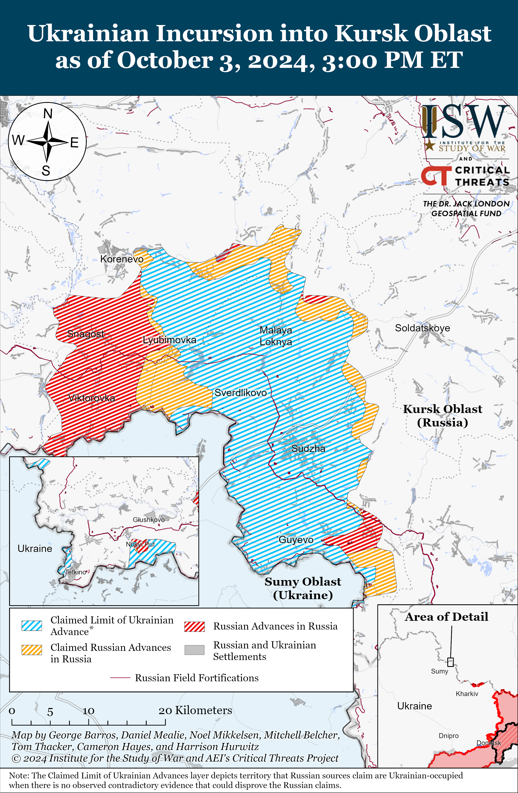
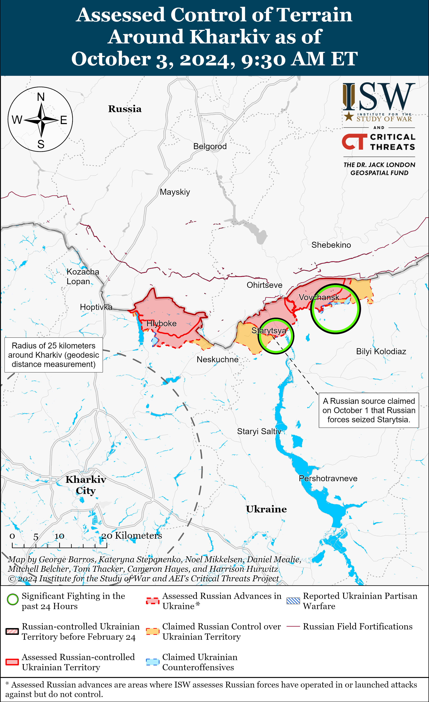
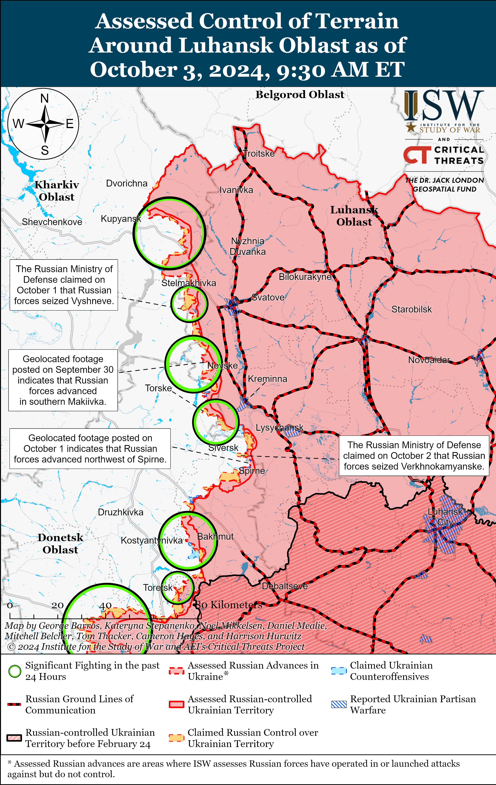
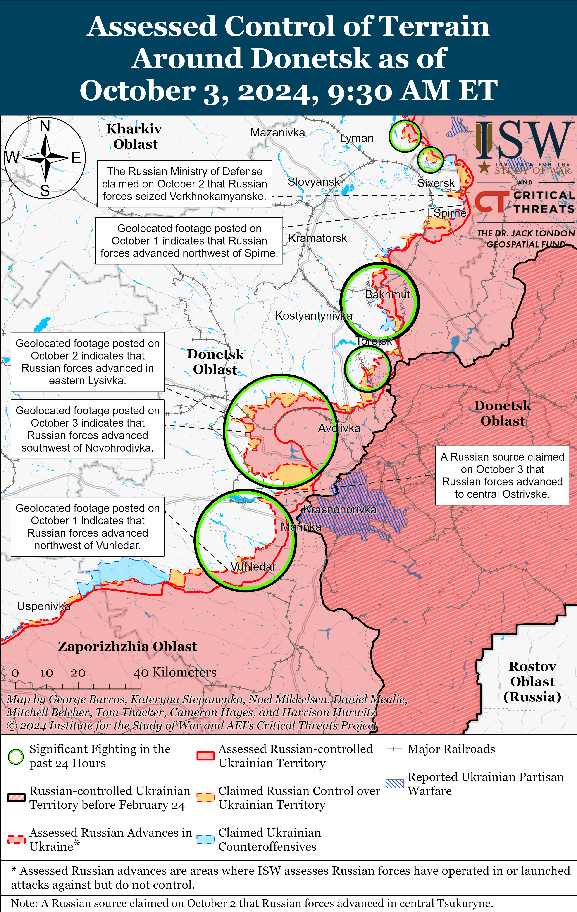
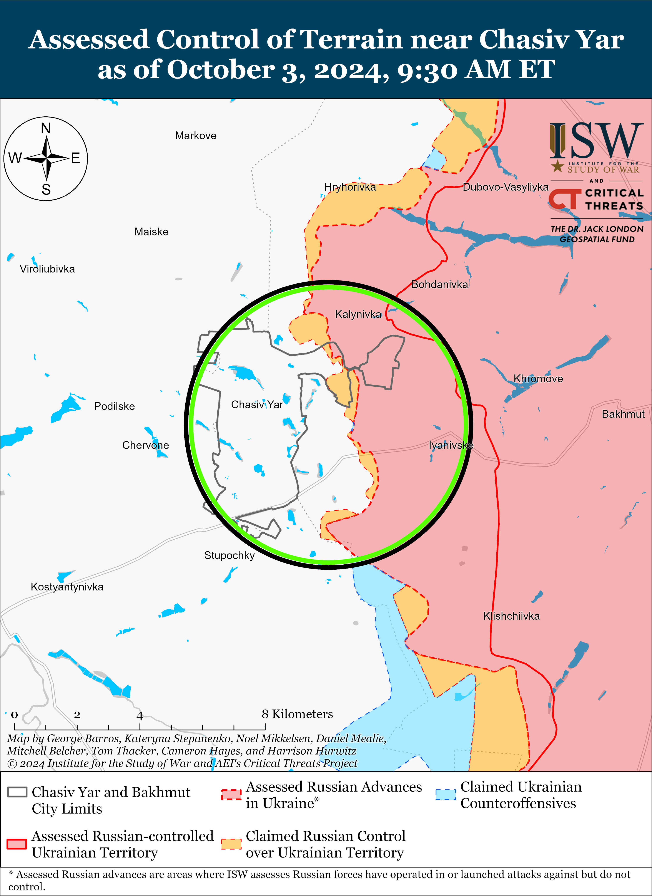
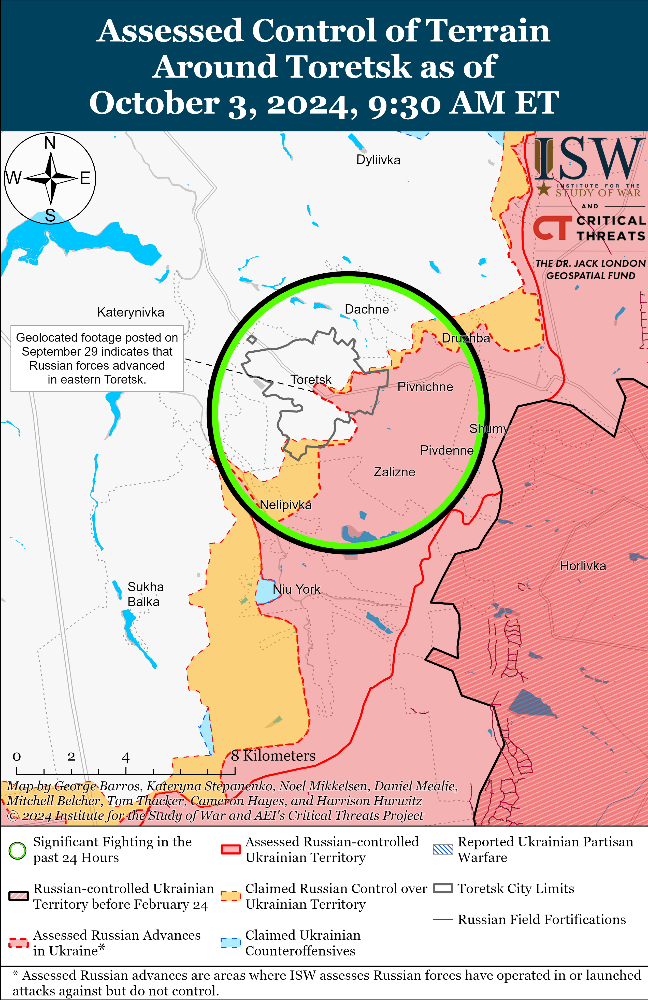
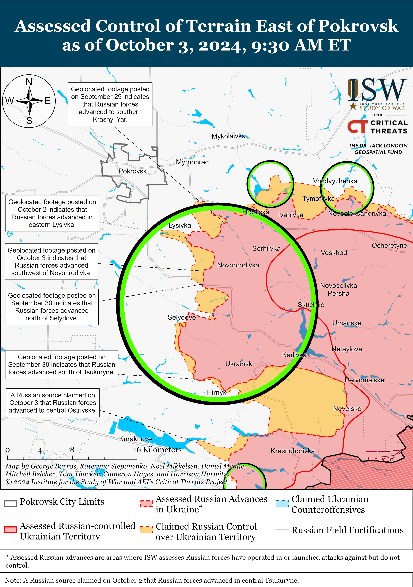
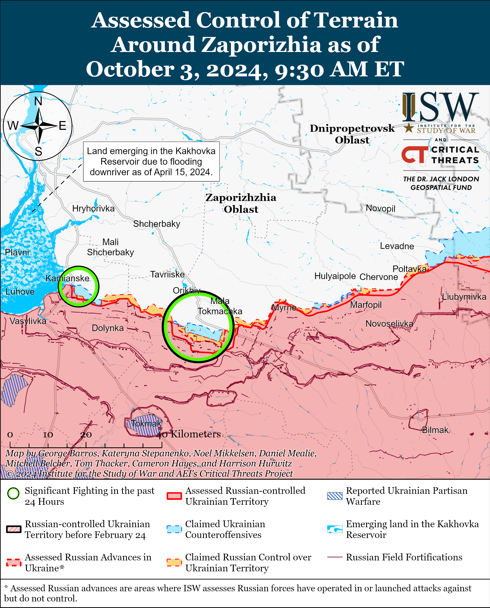
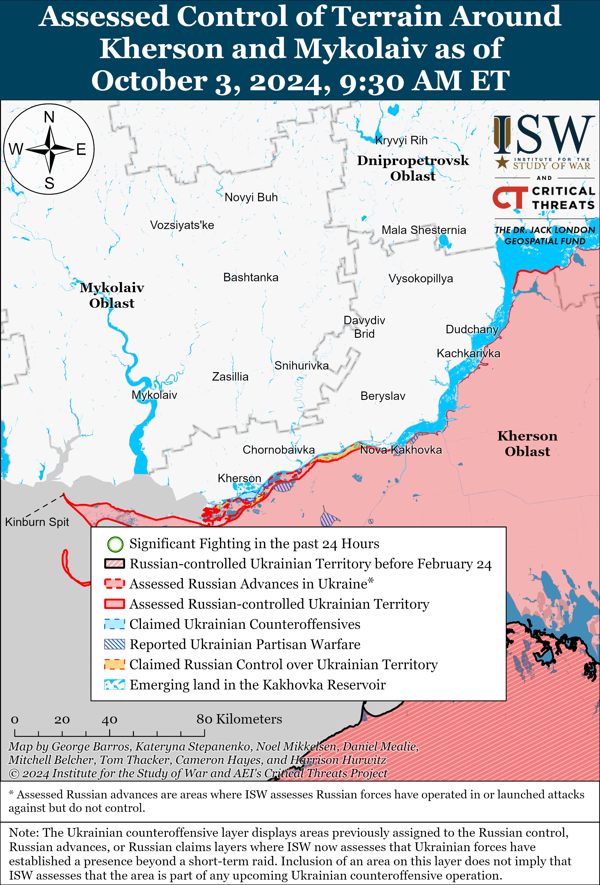

# Russian Offensive Campaign Assessment, October 3, 2024

**Riley Bailey, Angelica Evans, Grace Mappes, Davit Gasparyan, Nate Trotter, and Frederick W. Kagan**

**October 3, 2024, 1:00pm ET**

**Click** [**here**](https://storymaps.arcgis.com/stories/36a7f6a6f5a9448496de641cf64bd375) **to see ISW’s interactive map of the Russian invasion of Ukraine. This map is updated daily alongside the static maps present in this report.**

**Click** [**here**](https://storymaps.arcgis.com/stories/83a2f24901c941d581c0c523ecd2619b) **to see ISW’s interactive map of Ukraine’s offensive in Kursk Oblast.**

**Click** [**here**](https://understandingwar.maps.arcgis.com/apps/instant/3dviewer/index.html?appid=1602762dbcde419bb957dea358449580) **to see ISW’s 3D control of terrain topographic map of Ukraine. Use of a computer (not a mobile device) is strongly recommended for using this data-heavy tool.**

**Click** [**here**](https://storymaps.arcgis.com/stories/733fe90805894bfc8562d90b106aa895) **to access ISW’s archive of interactive time-lapse maps of the Russian invasion of Ukraine. These maps complement the static control-of-terrain map that ISW produces daily by showing a dynamic frontline. ISW will update this time-lapse map archive monthly.**

**Note: The data cut-off for this product was 9:30am ET on October 3. ISW will cover subsequent reports in the October 4 Russian Offensive Campaign Assessment.**

**The Russian offensive effort in eastern Ukraine that began in fall 2023 continues to produce gradual Russian tactical gains in specific sectors of the front, but operationally significant gains will likely continue to elude Russian forces. Ukrainian forces are conducting an effective defense in depth along the frontline, inflicting significant losses upon Russian forces while slowly giving ground but preventing the Russian military from making more rapid gains on the battlefield. Ukrainian forces do face serious operational challenges and constraints, which are providing Russian forces with opportunities to pursue tactically significant gains. Russian forces do not have the available manpower and materiel to continue intensified offensive efforts indefinitely, however, and current Russian offensive operations in eastern Ukraine will likely culminate in the coming months, if not weeks, as Ukrainian officials and ISW have previously assessed.**

**Russian forces have recently made notable tactical gains but have not demonstrated a capacity to seize operationally significant objectives. *ISW distinguishes between tactical gains, which are relevant at the tactical level of war in the near vicinity of the fighting, and operational gains, which are significant at the operational level of war and affect large sectors of the entire frontline.*** Russian forces seized Vuhledar in western Donetsk Oblast as of October 1, and the settlement will likely afford Russian forces an improved tactical position for pursuing their operational effort to advance towards the H-15 (Donetsk City–Zaporizhzhia City) highway and eliminate the wide Ukrainian salient in western Donetsk Oblast.[1] The Russian seizure of Vuhledar will not on its own radically change the operational situation in western Donetsk Oblast, however, and Russian forces will likely struggle to achieve their operational objectives in the area during the ongoing offensive operation in western Donetsk Oblast.[2] Russian offensive operations that are pursuing operationally significant objectives, like the Russian effort to seize Chasiv Yar or to push Ukrainian forces off the left (east) bank of the Oskil River, have either stalled or are resulting in particularly gradual gains over long stretches of time, respectively.[3] Russian forces continue to prioritize their offensive push towards Pokrovsk, and the operational significance of seizing the city will likely in part depend on the Russian military’s ability to leverage the city in wider operational maneuver in Donetsk Oblast.[4] Russian forces have tried and failed to conduct wide operational maneuver across several axes throughout Donetsk Oblast on several occasions during the full-scale invasion and are currently conducting intensified offensive operations in pursuit of more limited objectives on only two mutually supporting sectors of the frontline in Donetsk Oblast (western Donetsk Oblast and the Pokrovsk direction).[5]

**The Russian military command prepared the ongoing Russian summer 2024 offensive operation for months in advance and accumulated operational reserves and resources for the operation that the recent months of attritional fighting have likely heavily degraded.** Russian forces reportedly aimed to establish a new operational grouping of forces with uncommitted operational reserves of up to 70,000 personnel for the offensive operation into northern Kharkiv Oblast in May 2024 while also establishing operational reserves for the Central Grouping of Forces’ push to Pokrovsk this summer.[6] Russian forces have likely expended a good portion of these reserves on the stalling offensive operation into northern Kharkiv Oblast, the intensified offensive tempo in the Pokrovsk direction and western Donetsk Oblast, and the response to the Ukrainian incursion into Kursk Oblast.[7] Russian forces also continue to suffer heavy armored vehicle losses in large, unsuccessful mechanized assaults throughout the frontline, particularly in western Donetsk Oblast.[8] Russian forces likely accumulated a large amount of equipment for such mechanized assaults, but significant medium- to long-term constraints on Russian armored vehicle stocks will become more salient as losses grow and may force the Russian military command to rethink the benefit of continuing such intensified mechanized activity in Ukraine.[9] Continued heavy Russian attrition in Donetsk Oblast and further Russian redeployments to Kursk Oblast will weaken Russia’s ability to sustain offensive operations in northeastern and eastern Ukraine, although Russian forces are more likely to continue decreasing offensive activity on lower-priority sectors of the front than to do so equally along the entire frontline.[10] The current Russian summer 2024 offensive operation will likely culminate in the coming weeks and months, but Russian forces may nevertheless continue to conduct offensive operations at a much lower tempo throughout Ukraine in hopes that consistent offensive pressure would prevent Ukrainian forces from accumulating the manpower and resources needed to contest the theater-wide initiative.[11]

**Russian forces have reportedly committed a significant portion of their intended operational reserves to offensive operations in Donetsk and northern Kharkiv oblasts, indicating that the Russian military command may have prioritized forming operational reserves to support offensive operations in priority sectors of the frontline over developing theater-wide strategic reserves for the entire offensive campaign in Ukraine.** Ukrainian military observer Kostyantyn Mashovets stated on October 3 that the Russian military command originally intended to commit most of Russia’s “strategic reserves” to the Kharkiv and Pokrovsk-Toretsk directions, but that the Ukrainian incursion into Kursk Oblast and slowing Russian advances in northern Kharkiv Oblast complicated this plan.[12] Mashovets noted that the creation of the Russian Northern Grouping of Forces and the reinforcement of the Central Military District [CMD] in the Toretsk, Pokrovsk, and Kurakhove directions throughout 2024 comprised most of Russia’s efforts to develop “strategic reserves.” Mashovets noted that within the Leningrad Military District [LMD] Russian forces have established the newly-formed 69th Motorized Rifle Division and another unspecified motorized rifle division (both part of the 6th Combined Arms Army [CAA], the 44th Army Corps (AC) and its 72nd Motorized Rifle Division and another unspecified motorized rifle brigade, and are continuing to staff the 68th Motorized Rifle Division (6th CAA) and the 71st Motorized Rifle Division (14th AC).[13] Mashovets stated that Russian forces also established the 51st and 3rd CAAs and the 27th Motorized Rifle Division (2nd CAA) under the CMD in 2024. Mashovets noted that the Russian military command has already introduced some of these units and formations into combat below their doctrinal end strength and may introduce other formations as understrength “combined-reduced divisional tactical groups” in the near future.[14]

ISW has recently observed confirmation that some of these formations have been deployed to the Kharkiv and Pokrovsk directions. Ukraine’s Kharkiv Group of Forces recently reported that the Russian military deployed elements of the 69th Motorized Rifle Division near Vovchansk, Kharkiv Oblast.[15] Russian milbloggers claimed that elements of the Russian 72nd Motorized Rifle Division are also operating in northern Kharkiv Oblast.[16] The Russian military command has reportedly deployed elements of the 68th Motorized Rifle Division to northern Kharkiv Oblast as well, and Mashovets recently stated that the Russian military command intends to deploy the remainder of the understrength division to the frontline in northern Kharkiv Oblast between the end of October and the beginning of November 2024.[17] Elements of the Russian 27th Motorized Rifle Division are reportedly operating southeast of Pokrovsk.[18] ISW has not observed reports of elements of the 71st Motorized Rifle Division participating in offensive operations in Ukraine, however. Mashovets’ report likely does not encompass all of the reserve units and formations that Russia recently formed or is currently forming, although it is notable that Russia has already introduced elements of most of these formations to combat.

**The Russian military command is continuing to prioritize offensive operations in priority sectors of the frontline over long-term planning for Russia’s theater-wide campaign in Ukraine, but the Ukrainian incursion into Kursk Oblast appears to have significantly complicated the development of Russia’s operational reserves.** The Russian military command’s reported intention for these reserves to participate in a specific priority of the sector instead of being committable throughout the theater indicates that these are “operational” and not “strategic” level reserves. Unspecified US officials told the *New York Times* (*NYT*) in August 2024 that Russia likely needs to deploy 15 to 20 brigades — at least 50,000 troops — from Ukraine or Russia’s operational reserves to push Ukrainian forces out of Kursk Oblast.[19] The Russian military command will likely continue to grapple with the impacts of manpower constraints on Russia’s offensive capabilities until Russian President Vladimir Putin decides that the benefits of more effective force-generation policies, such as another partial mobilization call up of Russian reservists, outweigh the risk of societal backlash.

**Russian President Vladimir Putin appears to be using the “Time of Heroes” veteran support program to militarize regional and local government administrations and further solidify a pro-war ideology into the Russian state and society.** Putin met with former Donetsk People’s Republic (DNR) “Sparta” Battalion Commander and Speaker of the DNR Parliament Artem Zhoga on October 2 and offered him the position of Presidential Representative to the Ural Federal Okrug, which Zhoga accepted.[20] Zhoga previously served as a member of Putin’s re-election campaign initiatives group, and the Kremlin previously highlighted Zhoga and used an interaction between Zhoga and Putin to announce Putin’s presidential bid in December 2023.[21] Putin signed a decree on October 2 confirming the recent appointments of Zhoga and nine other “Time of Heroes” participants to various federal, regional, and local appointments: Artur Orlov as chairperson of the Russian patriotic youth organization “Movement of the First,” Alexei Kondratyev as a Russian senator, Igor Yurin as Sakha Republic Minister of Youth Affairs and Social Communications, Alexander Surazov as Altai Republic Committee for Physical Culture and Sports head, Yevgeny Chintsov as head of the Nizhny Novgorod City Duma, Zaur Gurtsiev as Stavropol City first deputy head, Roman Kulakov as Sevastopol occupation legislative assembly deputy, Konstantin Yashin as head of the Samara Research and Production Center for Unmanned Aircraft Systems, and Vladimir Saibel as deputy head of Russian Railways’ social development department.[22] The “Movement of the First” is a Kremlin-affiliated youth organization that promotes military-patriotic education and ideology to youth within Russia and occupied Ukraine to set long term conditions for the militarization of Russian society and Russification of occupied Ukraine.[23] Putin noted that the Russian government has extended job offers to 10 additional “Time of Heroes” participants within the Russian Presidential Administration, federal and regional entities, and state-owned companies.[24] The increasing appointments of Russian military veterans of the war in Ukraine in government and state entities throughout Russia is likely part of an effort to establish pro-war, ultranationalist individuals loyal to Putin in prominent places within local government and society as Russia seeks ways to reintegrate war veterans into Russian society and subtly message Putin’s vision for a future Russian class of elites and wider society comprised of such individuals.[25] Putin’s publicized and likely scripted meeting with Zhoga was likely aimed at establishing Putin’s public expectations of “Time of Heroes” participants. Zhoga repeatedly emphasized in his meeting with Putin that he is a “soldier first and foremost” who will serve Russia “where [he] is most needed,” indicating that Putin likely expects loyalty from these handpicked individuals above all else.[26]

**Russian authorities continue to arrest Russian officials on charges related to mismanagement and corruption within the Russian Ministry of Defense (MoD).** The Russian Investigative Committee announced on October 2 that it placed former MoD Forestry Department Deputy Head Alexander Sluchak under house arrest and detained the General Director of “Translesstroy” LLC Ozman Avdolyan for embezzling 20 million rubles (about $210,248) related to the mismanagement of MoD contracts.[27] Russian sources stated on October 2 that Russian law enforcement initiated a case into a theft of military property worth over 1 million rubles (about $10,500) at the Tyumen Higher Military Engineering Command School, detaining two suspects including the driver of Major General D. Yevmenenko.[28] The Russian Investigative Committee also placed Deputy Head of the Russian MoD’s Military Construction company, Dmitry Sergel, on the interstate wanted list for embezzling funds from the Russian MoD.[29] Sergel reportedly embezzled over 35 million rubles (about $367,935) as part of a contract for overhauling a military hospital in Perm valued at more than 190 million rubles (about $ 1,997,363). ISW has observed an increase in MoD-related arrests particularly under the leadership of Russian Defense Minister Andrei Belousov in a likely effort to not only “cleanse” widespread corruption prominent under the leadership of former Defense Minister Sergei Shoigu, but also satisfy the Russian public’s demand for justice and demonstrate that the Kremlin is fighting corruption.[30]

**Strikes reportedly targeted an ammunition depot near Russia’s Hmeimim Airbase in Latakia Province, Syria overnight on October 2 to 3.** Footage published on October 3 shows a fire and secondary detonations overnight reportedly near Hmeimim Airbase, and the Syrian Observatory for Human Rights claimed on October 3 that unknown drone strikes destroyed an ammunition depot near Jableh City near the airbase.[31] The Syrian Observatory for Human Rights claimed that the unknown drone strikes coincided with the presence of Israeli warplanes in the area and that both Syrian and Russian air defenses attempted to shoot down incoming Israeli missiles for roughly 40 minutes.[32] A prominent, Kremlin-affiliated Russian milblogger also claimed that Russian air defenses activated and claimed that Iranian and Syrian forces used the ammunition depot and that the Israeli strikes did not target Russia’s Hmeimim Airbase directly.[33] ISW is unable to confirm the actor responsible for the October 3 Latakia strike. CTP-ISW observed a strike, reportedly conducted by Israeli forces, targeting a weapons shipment near Jableh on July 9 after an Iranian weapons shipment arrived at the nearby port of Latakia.[34] Syrian sources claimed that Syrian air defenses intercepted 17 reportedly Israeli missiles near Jableh and Tartus (south of Latakia) and reported explosions near Tartus on September 24, but the actors involved and the result of the strike remain unconfirmed.[35]

**Key Takeaways:**

- **The Russian offensive effort in eastern Ukraine that began in fall 2023 continues to produce gradual Russian tactical gains in specific sectors of the front, but operationally significant gains will likely continue to elude Russian forces.**
- **Ukrainian forces are conducting an effective defense in depth along the frontline, inflicting significant losses upon Russian forces while slowly giving ground but preventing the Russian military from making more rapid gains on the battlefield.**
- **Ukrainian forces do face serious operational challenges and constraints, which are providing Russian forces with opportunities to pursue tactically significant gains.**
- **Russian forces do not have the available manpower and materiel to continue intensified offensive efforts indefinitely, however, and current Russian offensive operations in eastern Ukraine will likely culminate in the coming months, if not weeks, as Ukrainian officials and ISW have previously assessed.**
- **Russian forces have recently made notable tactical gains but have not demonstrated a capacity to seize operationally significant objectives.**
- **The Russian military command prepared the ongoing Russian summer 2024 offensive operation for months in advance and accumulated operational reserves and resources for the operation that the recent months of attritional fighting have likely heavily degraded.**
- **Russian forces have reportedly committed a significant portion of their intended operational reserves to offensive operations in Donetsk and northern Kharkiv oblasts, indicating that the Russian military command may have prioritized forming operational reserves to support offensive operations in priority sectors of the frontline over developing theater-wide strategic reserves for the entire offensive campaign in Ukraine.**
- **The Russian military command is continuing to prioritize offensive operations in priority sectors of the frontline over long-term planning for Russia’s theater-wide campaign in Ukraine, but the Ukrainian incursion into Kursk Oblast appears to have significantly complicated the development of Russia’s operational reserves.**
- **Russian President Vladimir Putin appears to be using the “Time of Heroes” veteran support program to militarize regional and local government administrations and further solidify a pro-war ideology into the Russian state and society.**
- **Russian authorities continue to arrest Russian officials on charges related to mismanagement and corruption within the Russian Ministry of Defense (MoD).**
- **Strikes reportedly targeted an ammunition depot near Russia’s Hmeimim Airbase in Latakia Province, Syria overnight on October 2 to 3.**
- **Russian forces recently advanced south of Siversk and east and southeast of Pokrovsk in Donetsk Oblast.**
- **Russian authorities continue to nationalize Russian enterprises for the benefit of the federal government.**

***We do not report in detail on Russian war crimes because these activities are well-covered in Western media and do not directly affect the military operations we are assessing and forecasting. We will continue to evaluate and report on the effects of these criminal activities on the Ukrainian military and the Ukrainian population and specifically on combat in Ukrainian urban areas. We utterly condemn Russian violations of the laws of armed conflict and the Geneva Conventions and crimes against humanity even though we do not describe them in these reports.***

- Ukrainian Operations in the Russian Federation
- Russian Main Effort — Eastern Ukraine (comprised of three subordinate main efforts)
- Russian Subordinate Main Effort #1 — Push Ukrainian forces back from the international border with Belgorod Oblast and approach to within tube artillery range of Kharkiv City
- Russian Subordinate Main Effort #2 — Capture the remainder of Luhansk Oblast and push westward into eastern Kharkiv Oblast and encircle northern Donetsk Oblast
- Russian Subordinate Main Effort #3 — Capture the entirety of Donetsk Oblast
- Russian Supporting Effort — Southern Axis
- Russian Air, Missile, and Drone Campaign
- Russian Mobilization and Force Generation Efforts
- Russian Technological Adaptations
- Activities in Russian-occupied areas
- Ukrainian Defense Industrial Base Efforts
- Russian Information Operations and Narratives
- Significant Activity in Belarus

**Ukrainian Operations in the Russian Federation**

Ukrainian forces continued ground assaults in Glushkovsky Raion on October 3 but did not make any confirmed advances. The Russian Ministry of Defense (MoD) claimed on October 3 that Ukrainian forces tried to break through Russian positions near Novy Put (south of Veseloye).[36] A Russian milblogger claimed on October 2 that Russian forces regained lost positions near Veseloye (south of Glushkovo) and that fighting continued near the settlement.[37] Elements of the Russian 83rd Airborne (VDV) Brigade are reportedly operating in Glushkovsky Raion.[38]

Fighting continued in the main Ukrainian salient in Kursk Oblast on October 3, but there were no confirmed changes to the frontline. Russian sources, including the Russian MoD, claimed that fighting continued east of Korenevo near Olgovka and Kremyanoye, southeast of Korenevo near Obukhovka and Nikolayevo-Darino, north of Sudzha near Novosyolovka, and southeast of Sudzha near Plekhovo.[39] Elements of the Russian 51st VDV Regiment (106th VDV Division) and the ”Aida” group of ”Akhmat” Spetsnaz are reportedly operating in Kursk Oblast.[40] Elements of the Russian 810th Guards Naval Infantry Brigade (Black Sea Fleet [BSF], Southern Military District [SMD]) are reportedly operating near Plekhovo (southeast of Sudzha).[41]

Ukrainian outlet *Suspilne* published a report on October 3 investigating the number of Russian conscripts fighting in Kursk Oblast*.*[42] *Suspilne* amplified Russian lawyer Regina Ivshina who claimed that her law enforcement agency received appeals from relatives of Russian conscripts asking for the return of their relative fighting in Kursk Oblast from at least 10 military units and stated that this indicates that Russian authorities may have sent more than 1,000 Russian conscripts to Kursk Oblast. The *BBC* reported that a significant portion of Russian conscripts captured by Ukrainian forces in Kursk Oblast served in the 488th Motorized Rifle Regiment (144th Motorized Rifle Division, 20th Combined Arms Army [CAA], Moscow Military District [MMD]) and the 245th Motorized Rifle Regiment (1st Guards Tank Army [GTA], Moscow Military District [MMD]), which is consistent with previous ISW observations about the Russian order of battle in Kursk Oblast.

The Russian Ministry of Defense (MoD) claimed on October 3 that Russian forces downed 113 Ukrainian drones over Russian territory on the night of October 2 to 3.[43] The Russian MoD claimed that Russian forces downed 73 drones over Belgorod Oblast; 25 drones over Voronezh Oblast; 14 drones over Kursk Oblast; and one drone over Bryansk Oblast. Voronezh Oblast Governor Aleksandr Gusev claimed on October 2 that Russian forces downed 10 Ukrainian drones over Voronezh Oblast.[44] Ukrainian outlet *Kyiv Independent*, citing Ukraine’s Security Service (SBU), reported on October 3 that the SBU conducted a drone strike against the Borisoglebsk airfield in Voronezh Oblast on the night of October 2 to 3 and targeted warehouses, hangars holding Su-35/34 fighter jets, and aviation storage facilities with glide bombs.[45] Russian and Ukrainian sources published footage of fires near the Borisoglebsk airfield.[46]

**Russian Main Effort — Eastern Ukraine**

**Russian Subordinate Main Effort #1 — Kharkiv Oblast (Russian objective: Push Ukrainian forces back from the international border with Belgorod Oblast and approach to within tube artillery range of Kharkiv City)**

Russian forces continued ground assaults north of Kharkiv City near Hlyboke and northeast of Kharkiv City near Tykhe and Vovchansk on October 2 and 3 but did not make any confirmed gains in northern Kharkiv Oblast.[47] Ukraine’s Kharkiv Group of Forces reported that elements of the Russian 82nd Motorized Rifle Regiment (69th Guards Motorized Rifle Division, 6th Combined Arms Army [CAA], Leningrad Military District [LMD]) are reportedly operating near Vovchansk.[48]

**Russian Subordinate Main Effort #2 — Luhansk Oblast (Russian objective: Capture the remainder of Luhansk Oblast and push westward into eastern Kharkiv Oblast and northern Donetsk Oblast)**

Russian forces continued offensive operations along the Kupyansk-Svatove-Kreminna line on October 3, but there were no confirmed changes to the frontline. Russian forces conducted offensive operations northeast of Kupyansk near Pershotravneve and Synkivka; east of Kupyansk near Petropavlivka; southeast of Kupyansk near Kurylivka and Pishchane; northwest of Svatove near Stelmakhivka; west of Svatove near Andriivka and Vyshneve; northwest of Kreminna near Hrekivka, Makiivka, Nevske, and Novosadove; west of Kreminna near Torske; and southwest of Kreminna near Dronivka on October 2 and 3.[49]

**Russian Subordinate Main Effort #3 — Donetsk Oblast (Russian objective: Capture the entirety of Donetsk Oblast, the claimed territory of Russia’s proxies in Donbas)**

Russian forces recently advanced south of Siversk and continued offensive operations in the area on October 3. Geolocated footage published on October 2 indicates that Russian forces recently advanced north of Vesele (south of Siversk).[50] The Ukrainian General Staff reported that Russian forces conducted a ground assault near Spirne (southeast of Siversk) on October 3.[51] Elements of the Russian 6th Motorized Rifle Brigade (3rd Combined Arms Army [CAA], formerly 2nd Luhansk People’s Republic Army Corps [LNR AC]) reportedly participated in the unconfirmed Russian seizure of Verkhnokamyanske (east of Siversk).[52]

Russian forces continued offensive operations near Chasiv Yar on October 3 but did not make any confirmed gains. Russian forces continued offensive operations north of Chasiv Yar near Kalynivka, east of Chasiv Yar near Ivanivske, south of Chasiv Yar near Bila Hora and Stupochky, and southeast of Chasiv Yar near Andriivka.[53] A Russian milblogger claimed that Russian forces are regularly repelling Ukrainian counterattacks near Kanal Microraion (easternmost Chasiv Yar).[54] Elements of the Russian 1442nd Motorized Rifle Regiment (6th Motorized Rifle Division, 3rd Army Corps [AC]) are reportedly operating in the direction of Stupochky (south of Chasiv Yar).[55]

Russian forces continued offensive operations near Toretsk, northeast of Toretsk near Dyliivka, south of Toretsk near Nelipivka; and southwest of Toretsk in the direction of Shcherbynivka and Sukha Balka on October 2 and 3 but did not make any confirmed gains.[56]

Russian forces recently advanced east and southeast of Pokrovsk amid continued Russian offensive operations in the Pokrovsk direction. Geolocated footage published on October 2 indicates that Russian forces recently advanced south of Novotoretske (east of Pokrovsk) and into the eastern outskirts of Lysivka (southeast of Pokrovsk and west of Novohrodivka).[57] Additional geolocated footage published on October 3 indicates that Russian forces also advanced further west and southwest of Novohrodivka.[58] Russian sources claimed on October 2 and 3 that Russian forces operating southeast of Pokrovsk also seized eastern Tsukuryne, advanced into the center of the town, and made gains south and north of Tsukuryne.[59] Another Russian milblogger claimed on October 3 that Russian forces advanced west along the E-50 (Donetsk City-Pokrovsk) highway north of Selydove (southwest of Pokrovsk).[60] ISW has not observed visual confirmation of these Russian claims, however. Russian forces continued offensive operations east of Pokrovsk near Vozdvyzhenka, Novooleksandrivka, Novotoretske, and Zelene Pole and southeast of Pokrovsk near Myrolyubivka, Mykolaivka, Krutyi Yar, Krasnyi Yar, Novohrodivka, Selydove, Tsukuryne, Hirnyk, and Zhelanne Druhe on October 2 and 3.[61]

Russian forces continued offensive operations west of Donetsk City on October 3, but there were no confirmed changes to the frontline in this area. Russian milbloggers claimed that Russian forces advanced into central Maksymilyanivka and Ostrivske (further west of Maksymilyanivka) and are struggling to advance further due to Ukrainian drone strikes and reconnaissance.[62] ISW has not observed confirmation of these claims, however. Russian forces continued assaults near Heorhiivka and Kurakhove on October 2 and 3.[63]

Russian forces recently advanced southwest of Donetsk City amid continued Russian offensive operations in the area on October 3. Geolocated footage published on October 2 indicates that Russian forces recently advanced along the Pavlivka-Bohoyavlenka road northwest of Vuhledar during a recent attack.[64] A Russian milblogger claimed that elements of the Russian 57th Motorized Rifle Brigade (5th Combined Arms Army [CAA], Eastern Military District [EMD]) and unspecified Russian units recently seized the Pivdennodonbaska Mine No. 3’s northern ventilation shaft north of Vuhledar, although ISW has not observed confirmation of this claim.[65] Russian forces continued assaults near Katerynivka, Kostyantynivka, Bohoyavlenka, and Vuhledar and in the direction of Trudove (north of Vuhledar) and Maksymivka (northwest of Vuhledar) on October 2 and 3.[66] Elements of the Russian 36th Motorized Rifle Brigade (29th CAA, EMD) are reportedly operating near Vuheldar, and elements of the 39th Motorized Rifle Brigade (68th AC, EMD) are reportedly operating near Katerynivka.[67]

Russian and Ukrainian sources did not report any fighting in the Donetsk-Zaporizhia Oblast border area on October 3.

**Russian Supporting Effort — Southern Axis (Russian objective: Maintain frontline positions and secure rear areas against Ukrainian strikes)**

Russian forces continued assaults in western Zaporizhia Oblast north of Robotyne near Novodanylivka and south of Stepnohirsk near Kamyanske on October 2 and 3, but there were no confirmed changes to the frontline in this area.[68] A Russian milblogger claimed that Russian forces marginally advanced further northwest of Verbove (east of Robotyne), but ISW has not observed visual confirmation of this claim.[69] Elements of the Russian BARS-3 “Rodina” Battalion (Combat Army Reserve) are reportedly operating near Robotyne, and elements of the 2nd Battalion of the Russian 70th Motorized Rifle Regiment (42nd Motorized Rifle Division, 58th Combined Arms Army [CAA], Southern Military District [SMD]) are reportedly operating in the Zaporizhia direction.[70]

Russian forces continued ground assaults in the Kherson direction on October 3, but there were no confirmed changes to the frontline in this area. A Russian milblogger claimed that unspecified elements of Russian Airborne (VDV) Spetsnaz cleared the islands in the Dnipro River near Krynky and Kozachi Laheri (both east of Kherson City), but ISW has not observed confirmation of this claim.[71]

**Russian Air, Missile, and Drone Campaign (Russian Objective: Target Ukrainian military and civilian infrastructure in the rear and on the frontline)**

Russian forces conducted a large-scale drone strike against Ukraine on the night of October 2 to 3. The Ukrainian Air Force reported that Russian forces launched 105 Shahed-136/131 drones from Oryol and Kursk oblasts, Primorsko-Akhtarsk, Krasnodar Krai, and occupied Cape Chauda, Crimea and that Ukrainian forces downed 78 Shahed drones over Kyiv, Cherkasy, Vinnytsia, Khmelnytskyi, Kirovohrad, Zhytomyr, Poltava, Chernihiv, Kherson, Odesa, Kharkiv, Sumy, Dnipro, Rivne and Ivano-Frankivsk oblasts.[72] The Ukrainian Air Force reported that one Russian Shahed drone flew in the direction of Belarus and that likely Ukrainian electronic warfare (EW) interference caused 23 Shahed drones to miss their targets and become “lost” in Ukrainian airspace. Kyiv City Military Administration Head Serhiy Popko reported that Ukrainian forces downed 15 drones near Kyiv City and that debris from one drone crashed in Kyiv City’s Desnyan Raion.[73] The Kharkiv Oblast Prosecutor’s Office reported that Russian forces struck Kharkiv City and its suburbs with five glide bombs from airspace over Stroitel, Belgorod Oblast and damaged a residential building.[74]

**Russian Mobilization and Force Generation Efforts (Russian objective: Expand combat power without conducting general mobilization)**

Russian authorities continue to nationalize Russian enterprises for the benefit of the federal government. Russian state outlet *RBK* reported on October 3 that the Russian Government submitted amendments to the Russian State Duma that would legally oblige Russian state corporations to pay 50 percent of the market value of their nationalized assets to the Russian federal budget starting in 2025.[75] The Kremlin has intensified efforts to nationalize Russian enterprises, particularly defense enterprises, in recent months, and this amendment would augment the Russian federal government’s direct financial benefit from these nationalization efforts.[76]

**Russian Technological Adaptations (Russian objective: Introduce technological innovations to optimize systems for use in Ukraine)**

Nothing significant to report.

**Ukrainian Defense Industrial Efforts (Ukrainian objective: Develop its defense industrial base to become more self-sufficient in cooperation with US, European, and international partners)**

*ISW is suspending publishing coverage of Ukrainian defense industrial efforts until further notice.*

**Activities in Russian-occupied areas (Russian objective: Consolidate administrative control of annexed areas; forcibly integrate Ukrainian citizens into Russian sociocultural, economic, military, and governance systems)**

*ISW is not publishing reporting on activities in Russian-occupied areas today.*

**Russian Information Operations and Narratives**

Russian Ministry of Foreign Affairs Spokesperson Maria Zakharova accused on October 2 outgoing NATO Secretary General Josep Borrell and new NATO Secretary General Mark Rutte, who assumed the position on October 1, of Russophobia.[77]

Russian Deputy Foreign Minister Sergei Ryabkov reiterated on October 2 Russia’s unwillingness to engage in meaningful negotiations with Ukraine.[78]

**Significant activity in Belarus (Russian efforts to increase its military presence in Belarus and further integrate Belarus into Russian-favorable frameworks and Wagner Group activity in Belarus)**

Nothing significant to report.

**Note: ISW does not receive any classified material from any source, uses only publicly available information, and draws extensively on Russian, Ukrainian, and Western reporting and social media as well as commercially available satellite imagery and other geospatial data as the basis for these reports. References to all sources used are provided in the endnotes of each update.**

---

[1] https://isw.pub/UkrWar100124 ; https://isw.pub/UkrWar090524

[2] https://isw.pub/UkrWar100124 ; https://isw.pub/UkrWar090524

[3] https://understandingwar.org/backgrounder/how-delays-western-aid-gave-russia-initiative-ukrainian-counteroffensive-kharkiv ; https://understandingwar.org/backgrounder/russian-winter-spring-2024-offensive-operation-kharkiv-luhansk-axis ; https://isw.pub/UkrWar041324

[4] https://understandingwar.org/backgrounder/russian-offensive-campaign-assessment-august-17-2024

[5] https://isw.pub/UkrWar090524

[6] https://understandingwar.org/backgrounder/russian-offensive-campaign-assessment-august-17-2024 ; https://isw.pub/UkrWar052524 ; https://isw.pub/UkrWar052124

[7] https://understandingwar.org/backgrounder/russian-offensive-campaign-assessment-august-17-2024 ; https://isw.pub/UkrWar052524 ; https://isw.pub/UkrWar052124

[8] https://isw.pub/UkrWar092724 ; https://isw.pub/UkrWar091324 ; https://isw.pub/UkrWar090524

[9] https://isw.pub/UkrWar091524

[10] https://understandingwar.org/backgrounder/russian-offensive-campaign-assessment-august-17-2024

[11] https://understandingwar.org/backgrounder/russian-offensive-campaign-assessment-august-17-2024 ; https://understandingwar.org/backgrounder/how-delays-western-aid-gave-russia-initiative-ukrainian-counteroffensive-kharkiv

[12] https://t.me/zvizdecmanhustu/2237 ; https://t.me/zvizdecmanhustu/2238

[13] https://t.me/zvizdecmanhustu/2237

[14] https://t.me/zvizdecmanhustu/2238

[15] https://understandingwar.org/backgrounder/russian-offensive-campaign-assessment-september-29-2024

[16] https://understandingwar.org/backgrounder/russian-offensive-campaign-assessment-october-2-2024

[17] https://censor dot net/en/news/3505319/combat\_operations\_in\_the\_kharkiv\_region\_as\_of\_the\_morning\_of\_august\_18 ; https://understandingwar.org/backgrounder/russian-offensive-campaign-assessment-september-29-2024

[18] https://understandingwar.org/backgrounder/russian-offensive-campaign-assessment-september-23-2024 ; https://understandingwar.org/backgrounder/russian-offensive-campaign-assessment-august-31-2024

[19] https://isw.pub/UkrWar082424 ; https://understandingwar.org/backgrounder/russian-offensive-campaign-assessment-august-17-2024

[20] http://kremlin dot ru/events/president/news/75253

[21] https://isw.pub/UkrWar120923 ; https://isw.pub/UkrWar120823

[22] http://kremlin dot ru/supplement/6195

[23] https://understandingwar.org/backgrounder/russian-offensive-campaign-assessment-june-28-2024; https://understandingwar.org/backgrounder/russian-offensive-campaign-assessment-june-2-2024; https://understandingwar.org/backgrounder/russian-offensive-campaign-assessment-february-3-2024;

[24] http://kremlin dot ru/events/president/news/75253

[25] https://understandingwar.org/backgrounder/russian-offensive-campaign-assessment-september-9-2024; https://understandingwar.org/backgrounder/russian-offensive-campaign-assessment-september-15-2024; https://understandingwar.org/backgrounder/russian-offensive-campaign-assessment-september-18-2024; https://understandingwar.org/backgrounder/russian-offensive-campaign-assessment-september-18-2024

[26] http://kremlin dot ru/events/president/news/75253

[27] https://t.me/tass\_agency/276821 ; https://t.me/DnevnikDesantnika/16458

[28] https://t.me/dva\_majors/54175 ; https://t.me/Mestb\_Dobroj\_Voli/12860 ; https://t.me/dva\_majors/54176; https://park72 dot ru/corruption/277372/

[29] https://t.me/milinfolive/131982 ; https://t.me/z\_arhiv/28381; https://t.me/sledcom\_press/16266

[30] https://understandingwar.org/backgrounder/russian-offensive-campaign-assessment-september-2-2024; https://t.me/rybar/63227

[31] https://www.syriahr dot com/en/345589/; https://twitter.com/TumultoBR/status/1841778474156982572; https://twitter.com/YManish1994/status/1841723732156678386;

[32] https://www.syriahr dot com/en/345589/

[33] https://t.me/rybar/64077

[34] https://understandingwar.org/backgrounder/iran-update-july-9-2024

[35] https://x.com/SAMSyria0/status/1838704535675527651; https://x.com/SAMSyria0/status/1838690496182419534: https://x.com/thiqanewsagency/status/1838654172474020263

[36] https://t.me/mod\_russia/44077

[37] https://t.me/rybar/64055

[38] https://t.me/rusich\_army/17458

[39] https://t.me/rusich\_army/17458; https://t.me/RVvoenkor/78079 ; https://t.me/wargonzo/22431

[40] https://suspilne dot media/848651-ih-tam-e-skilki-soldativ-strokovoi-sluzbi-vtratila-rf-v-kurskij-oblasti/; https://t.me/dva\_majors/54204 ; https://t.me/dva\_majors/54205 ; https://t.me/iamsniper/7720 ; https://t.me/dva\_majors/54177 ; https://t.me/boris\_rozhin/139452

[41] https://t.me/RVvoenkor/78079

[42] https://suspilne dot media/848651-ih-tam-e-skilki-soldativ-strokovoi-sluzbi-vtratila-rf-v-kurskij-oblasti/

[43] https://t.me/mod\_russia/44064

[44] https://t.me/z\_arhiv/28381

[45] https://kyivindependent dot com/ukrainian-drones-attack-russian-airfield-in-voronezh-oblast-targets-guided-bombs-warehouses-source-claims/

[46] https://t.me/vchkogpu/51444; https://t.me/vchkogpu/51445 ; https://t.me/vchkogpu/51446 ; https://kyivindependent dot com/ukrainian-drones-attack-russian-airfield-in-voronezh-oblast-targets-guided-bombs-warehouses-source-claims/

[47] https://www.facebook.com/GeneralStaff.ua/posts/pfbid0W1bmaCWWL1zMhXjn7ayDs5hzjd5Bdi7cuYY3PkvK5Ft1VcbevwnuWLMLrN1FMB7Zl ; https://www.facebook.com/GeneralStaff.ua/posts/pfbid0vychJuG5u8QTPGLt7pP6DXvJgDSAeUGHSJ6Z8iq6z8L9oiLuwiSDQgNwVburF36al ; https://www.facebook.com/GeneralStaff.ua/posts/pfbid0256K4ddoq1gCPUcq7KJJ8bpdM8Xspe8YpgjdHcr76a2Cc8juhUyHZwqVsxqgpMX8Fl ; https://t.me/wargonzo/22431

[48] https://t.me/otukharkiv/1807 ; https://armyinform.com dot ua/2024/10/03/bez-likiv-ta-matzabezpechennya-u-vovchansku-rosiyany-popovnyuyut-vtraty/

[49] https://www.facebook.com/GeneralStaff.ua/posts/pfbid0256K4ddoq1gCPUcq7KJJ8bpdM8Xspe8YpgjdHcr76a2Cc8juhUyHZwqVsxqgpMX8Fl; https://www.facebook.com/GeneralStaff.ua/posts/pfbid0W1bmaCWWL1zMhXjn7ayDs5hzjd5Bdi7cuYY3PkvK5Ft1VcbevwnuWLMLrN1FMB7Zl; https://www.facebook.com/GeneralStaff.ua/posts/pfbid0vychJuG5u8QTPGLt7pP6DXvJgDSAeUGHSJ6Z8iq6z8L9oiLuwiSDQgNwVburF36al

[50] https://t.me/creamy\_caprice/7000; https://t.me/SkyFury3mb/710

[51] https://www.facebook.com/GeneralStaff.ua/posts/pfbid0256K4ddoq1gCPUcq7KJJ8bpdM8Xspe8YpgjdHcr76a2Cc8juhUyHZwqVsxqgpMX8Fl

[52] https://t.me/mod\_russia/44061 ; https://t.me/dva\_majors/54230

[53] https://www.facebook.com/GeneralStaff.ua/posts/pfbid0W1bmaCWWL1zMhXjn7ayDs5hzjd5Bdi7cuYY3PkvK5Ft1VcbevwnuWLMLrN1FMB7Zl ; https://www.facebook.com/GeneralStaff.ua/posts/pfbid0vychJuG5u8QTPGLt7pP6DXvJgDSAeUGHSJ6Z8iq6z8L9oiLuwiSDQgNwVburF36al; https://www.facebook.com/GeneralStaff.ua/posts/pfbid0256K4ddoq1gCPUcq7KJJ8bpdM8Xspe8YpgjdHcr76a2Cc8juhUyHZwqVsxqgpMX8Fl

[54] https://t.me/wargonzo/22442

[55] https://t.me/dva\_majors/54266

[56] https://www.facebook.com/GeneralStaff.ua/posts/pfbid0W1bmaCWWL1zMhXjn7ayDs5hzjd5Bdi7cuYY3PkvK5Ft1VcbevwnuWLMLrN1FMB7Zl ; https://www.facebook.com/GeneralStaff.ua/posts/pfbid0vychJuG5u8QTPGLt7pP6DXvJgDSAeUGHSJ6Z8iq6z8L9oiLuwiSDQgNwVburF36al ; https://t.me/wargonzo/22431 ; https://t.me/dva\_majors/54230 ; https://www.facebook.com/GeneralStaff.ua/posts/pfbid0256K4ddoq1gCPUcq7KJJ8bpdM8Xspe8YpgjdHcr76a2Cc8juhUyHZwqVsxqgpMX8Fl

[57] https://t.me/creamy\_caprice/6999; https://t.me/ChervonaKalynaBrigade/1780 ; https://t.me/creamy\_caprice/7001; https://t.me/Airborne1126/18472

[58] https://t.me/creamy\_caprice/7002; https://t.me/jagers68/250

[59] https://t.me/dva\_majors/54218 ; https://t.me/warhistoryalconafter/187531 ; https://t.me/wargonzo/22431 ; https://t.me/tass\_agency/276986 ; https://t.me/boris\_rozhin/139461 ; https://t.me/motopatriot/28257 ; https://t.me/motopatriot/28259?single ; https://t.me/motopatriot/28261

[60] https://t.me/motopatriot/28263 ; https://t.me/motopatriot/28264

[61] https://www.facebook.com/GeneralStaff.ua/posts/pfbid0W1bmaCWWL1zMhXjn7ayDs5hzjd5Bdi7cuYY3PkvK5Ft1VcbevwnuWLMLrN1FMB7Zl ; https://www.facebook.com/GeneralStaff.ua/posts/pfbid0vychJuG5u8QTPGLt7pP6DXvJgDSAeUGHSJ6Z8iq6z8L9oiLuwiSDQgNwVburF36al; https://www.facebook.com/GeneralStaff.ua/posts/pfbid0256K4ddoq1gCPUcq7KJJ8bpdM8Xspe8YpgjdHcr76a2Cc8juhUyHZwqVsxqgpMX8Fl

[62] https://t.me/DnevnikDesantnika/16456 ; https://t.me/motopatriot/28265

[63] https://www.facebook.com/GeneralStaff.ua/posts/pfbid0W1bmaCWWL1zMhXjn7ayDs5hzjd5Bdi7cuYY3PkvK5Ft1VcbevwnuWLMLrN1FMB7Zl ; https://www.facebook.com/GeneralStaff.ua/posts/pfbid0vychJuG5u8QTPGLt7pP6DXvJgDSAeUGHSJ6Z8iq6z8L9oiLuwiSDQgNwVburF36al ; https://t.me/dva\_majors/54218 ; https://t.me/warhistoryalconafter/187531; https://www.facebook.com/GeneralStaff.ua/posts/pfbid0256K4ddoq1gCPUcq7KJJ8bpdM8Xspe8YpgjdHcr76a2Cc8juhUyHZwqVsxqgpMX8Fl

[64] https://x.com/666\_mancer/status/1841378638068846716 https://t.me/totem\_72/112

[65] https://t.me/voin\_dv/11129

[66] https://t.me/wargonzo/22431 ; https://t.me/dva\_majors/54230 ; https://www.facebook.com/GeneralStaff.ua/posts/pfbid0W1bmaCWWL1zMhXjn7ayDs5hzjd5Bdi7cuYY3PkvK5Ft1VcbevwnuWLMLrN1FMB7Zl ; https://www.facebook.com/GeneralStaff.ua/posts/pfbid0vychJuG5u8QTPGLt7pP6DXvJgDSAeUGHSJ6Z8iq6z8L9oiLuwiSDQgNwVburF36al ; https://www.facebook.com/GeneralStaff.ua/posts/pfbid0256K4ddoq1gCPUcq7KJJ8bpdM8Xspe8YpgjdHcr76a2Cc8juhUyHZwqVsxqgpMX8Fl

[67] https://t.me/voin\_dv/11118 ; https://t.me/voin\_dv/11138

[68] https://t.me/wargonzo/22431 ; https://www.facebook.com/GeneralStaff.ua/posts/pfbid0W1bmaCWWL1zMhXjn7ayDs5hzjd5Bdi7cuYY3PkvK5Ft1VcbevwnuWLMLrN1FMB7Zl ; https://www.facebook.com/GeneralStaff.ua/posts/pfbid0vychJuG5u8QTPGLt7pP6DXvJgDSAeUGHSJ6Z8iq6z8L9oiLuwiSDQgNwVburF36al; https://www.facebook.com/GeneralStaff.ua/posts/pfbid0256K4ddoq1gCPUcq7KJJ8bpdM8Xspe8YpgjdHcr76a2Cc8juhUyHZwqVsxqgpMX8Fl

[69] https://t.me/z\_arhiv/28378

[70] https://t.me/dva\_majors/54240 ; https://t.me/dva\_majors/54217

[71] https://t.me/RVvoenkor/78067

[72] https://t.me/kpszsu/20480

[73] https://t.me/VA\_Kyiv/8371 ; https://armyinform.com dot ua/2024/10/03/povitryana-tryvoga-u-kyyevi-tryvala-ponad-5-godyn-ulamky-shahediv-vpaly-v-odnomu-z-rajoniv-mista/

[74] https://t.me/prokuratura\_kharkiv/19404 ; https://armyinform.com dot ua/2024/10/03/aviabomba-vluchyla-u-pyatypoverhivku-v-harkovi-postrazhdalo-10-lyudej-sered-nyh-tryrichna-dytyna/ ; https://t.me/synegubov/11437

[75] https://www.rbc dot ru/business/03/10/2024/66fc1dd29a794775777f831e

[76] https://understandingwar.org/backgrounder/russian-offensive-campaign-assessment-february-5-2024; https://understandingwar.org/backgrounder/russian-offensive-campaign-assessment-february-13-2024; v https://understandingwar.org/backgrounder/russian-offensive-campaign-assessment-april-25-2024; https://understandingwar.org/backgrounder/russian-offensive-campaign-assessment-may-21-2024; https://understandingwar.org/backgrounder/russian-offensive-campaign-assessment-march-5-2024

[77] https://t.me/tass\_agency/276784; https://t.me/tass\_agency/276807

[78] https://t.me/tass\_agency/277086
