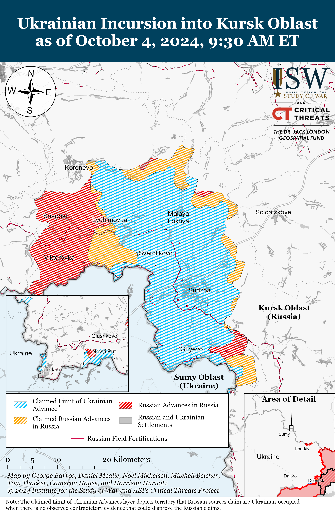
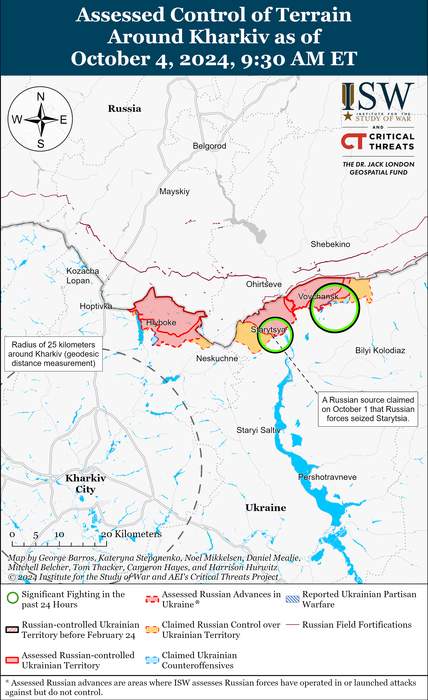
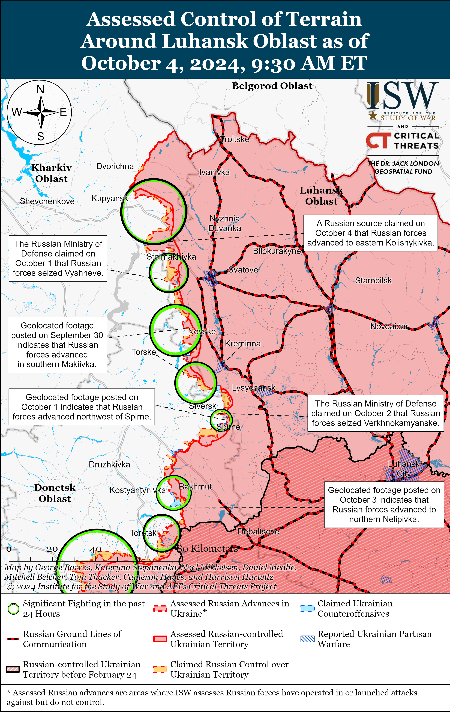
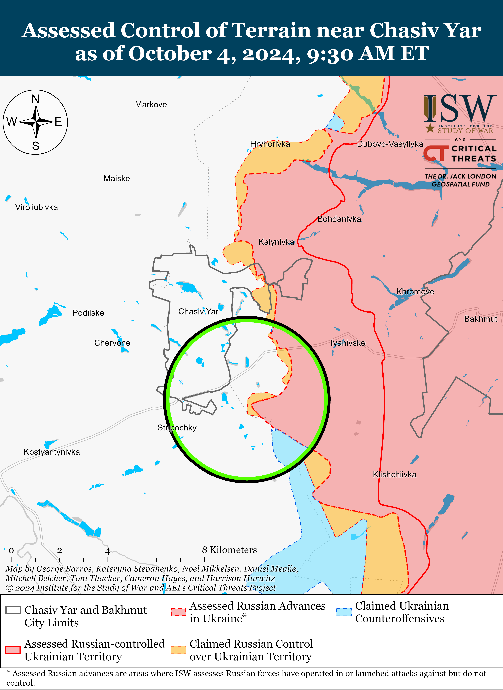
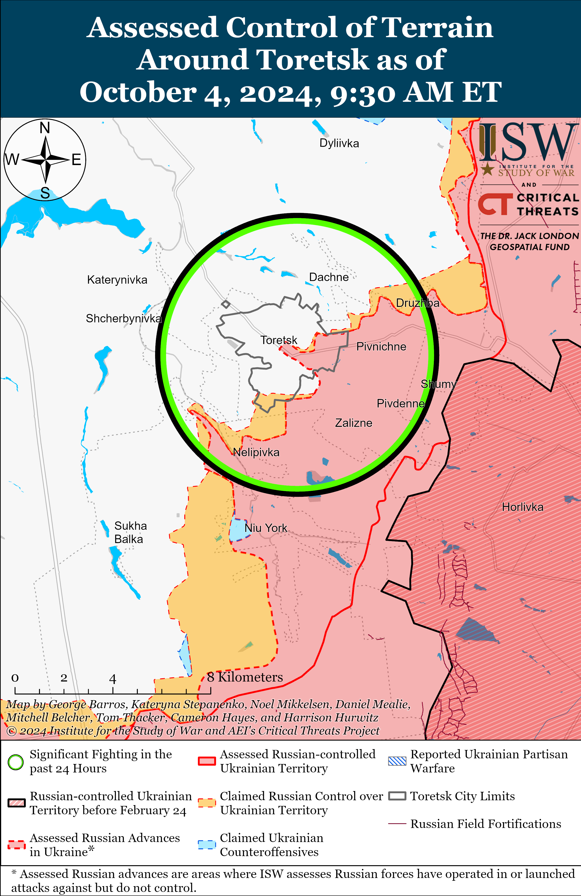
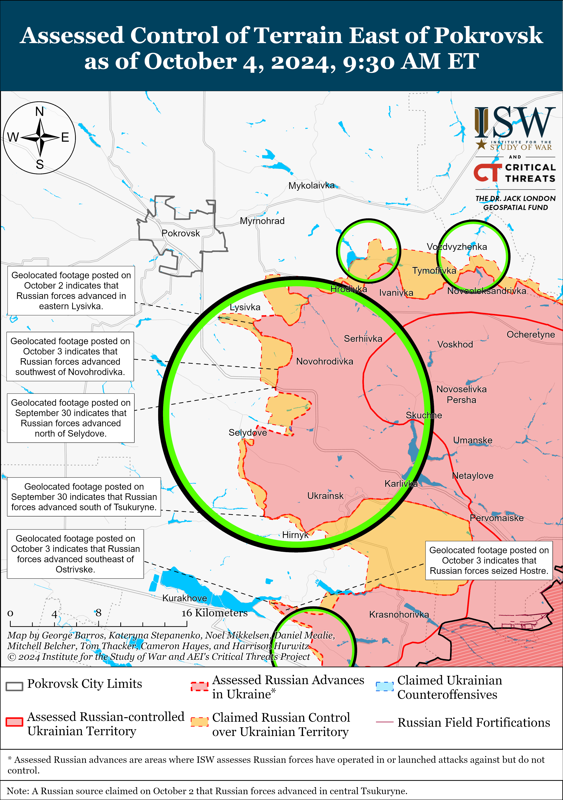
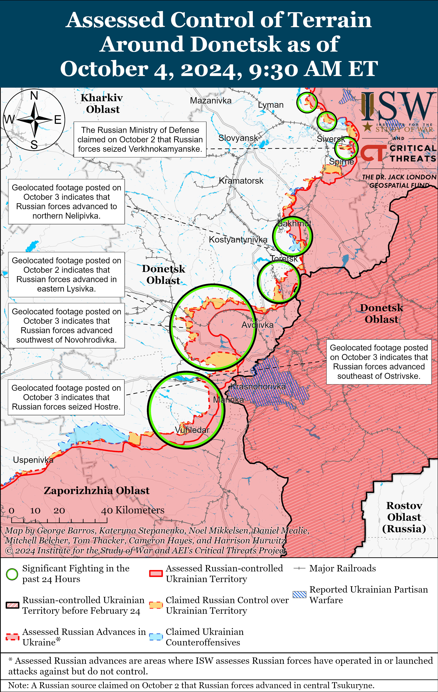
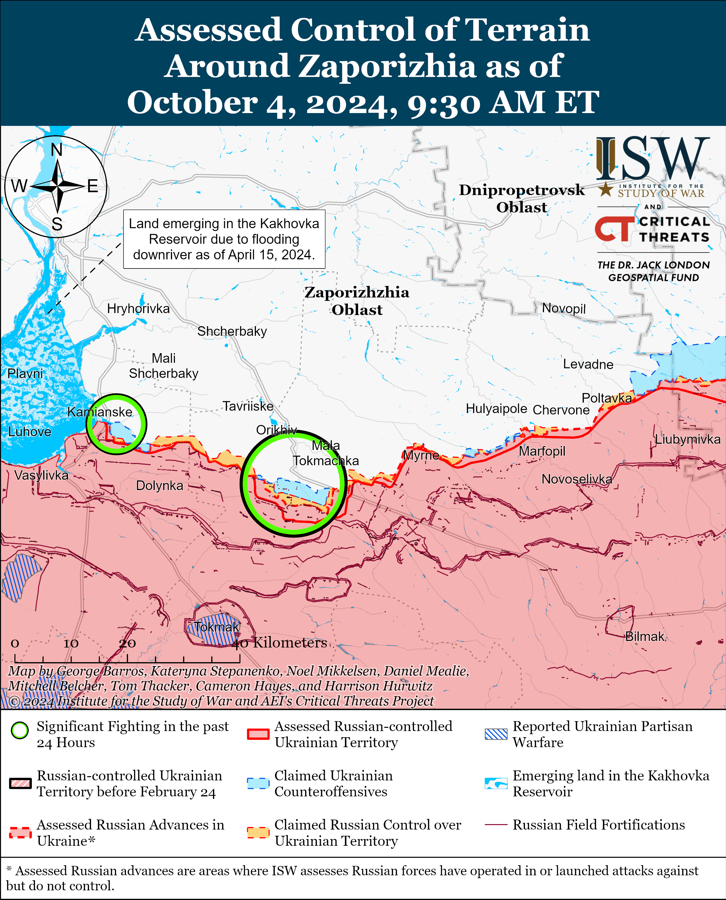
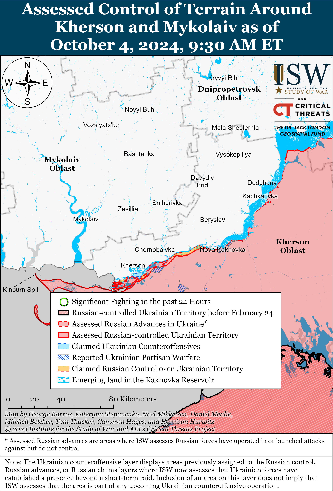

# Russian Offensive Campaign Assessment, October 4, 2024

**Grace Mappes, Davit Gasparyan, Nicole Wolkov, Riley Bailey, and Frederick W. Kagan**

**October 4, 2024, 10am ET**

**Click**[**here**](https://storymaps.arcgis.com/stories/36a7f6a6f5a9448496de641cf64bd375)**to see ISW’s interactive map of the Russian invasion of Ukraine. This map is updated daily alongside the static maps present in this report.**

**Click**[**here**](https://storymaps.arcgis.com/stories/83a2f24901c941d581c0c523ecd2619b)**to see ISW’s interactive map of Ukraine’s offensive in Kursk Oblast.**

**Click**[**here**](https://understandingwar.maps.arcgis.com/apps/instant/3dviewer/index.html?appid=1602762dbcde419bb957dea358449580)**to see ISW’s 3D control of terrain topographic map of Ukraine. Use of a computer (not a mobile device) is strongly recommended for using this data-heavy tool.**

**Click**[**here**](https://storymaps.arcgis.com/stories/733fe90805894bfc8562d90b106aa895)**to access ISW’s archive of interactive time-lapse maps of the Russian invasion of Ukraine. These maps complement the static control-of-terrain map that ISW produces daily by showing a dynamic frontline. ISW will update this time-lapse map archive monthly.**

**Note: The data cut-off for this product was 9:40am ET on October 4. ISW will cover subsequent reports in the October 5 Russian Offensive Campaign Assessment.**

**Ukrainian forces struck a fuel storage facility in Anna, Voronezh Oblast on the night of October 3 to 4.**The Ukrainian General Staff reported that the Ukrainian Security Service (SBU) and Ukrainian military struck at least one vertical fuel reservoir at the Annaneftprodukt fuel and oil storage facility and that Ukrainian military officials are still clarifying the damage at the facility.[1] Voronezh Oblast Governor Alexander Gusev claimed that Russian electronic warfare (EW) interference caused a Ukrainian drone to fall onto the fuel storage facility and start a fire at an empty fuel reservoir.[2] Footage published on October 4 shows a fire at a purported fuel storage facility near Anna.[3]

**Key Takeaways:**

- **Ukrainian forces struck a fuel storage facility in Anna, Voronezh Oblast on the night of October 3 to 4.**
- **Russian forces recently advanced in Vovchansk, near Kreminna, Toretsk, Pokrovsk, and Donetsk City.**

***We do not report in detail on Russian war crimes because these activities are well-covered in Western media and do not directly affect the military operations we are assessing and forecasting. We will continue to evaluate and report on the effects of these criminal activities on the Ukrainian military and the Ukrainian population and specifically on combat in Ukrainian urban areas. We utterly condemn Russian violations of the laws of armed conflict and the Geneva Conventions and crimes against humanity even though we do not describe them in these reports.***

- Ukrainian Operations in the Russian Federation
- Russian Main Effort – Eastern Ukraine (comprised of three subordinate main efforts)
- Russian Subordinate Main Effort #1 – Push Ukrainian forces back from the international border with Belgorod Oblast and approach to within tube artillery range of Kharkiv City
- Russian Subordinate Main Effort #2 – Capture the remainder of Luhansk Oblast and push westward into eastern Kharkiv Oblast and encircle northern Donetsk Oblast
- Russian Subordinate Main Effort #3 – Capture the entirety of Donetsk Oblast
- Russian Supporting Effort – Southern Axis
- Russian Air, Missile, and Drone Campaign
- Russian Mobilization and Force Generation Efforts
- Russian Technological Adaptations
- Activities in Russian-occupied areas
- Ukrainian Defense Industrial Base Efforts
- Russian Information Operations and Narratives
- Significant Activity in Belarus

**Ukrainian Operations in the Russian Federation**

Ukrainian forces continued ground assaults in Glushkovsky Raion west of the main Ukrainian salient in Kursk Oblast on October 4 but did not make confirmed advances. Russian sources reported continued fighting near Veseloye (south of Glushkovo), and the Russian Ministry of Defense (MoD) claimed that Russian forces repelled Ukrainian attacks towards Novy Put (south of Veseloye).[4] A Russian milblogger claimed that Russian forces recently regained positions near Veseloye but have not fully recaptured Medvezhye (southeast of Glushkovo).[5] Elements of the Russian 83rd Airborne (VDV) Brigade reportedly continue fighting in Glushkovsky Raion.[6]

Fighting continued in the main Ukrainian salient in Kursk Oblast on October 4, but there were no confirmed changes to the frontline. Russian sources, including the Russian MoD, claimed that fighting continued near Kremyanoye and Olgovka (both east of Korenevo), Lyubimovka (southeast of Korenevo), and Plekhovo (southeast of Sudzha).[7] Elements of the Russian 810th Naval Infantry Brigade (Black Sea Fleet [BSF], Southern Military District [SMD]) reportedly continue operating in Kursk Oblast.[8]

**Russian Main Effort – Eastern Ukraine**

**Russian Subordinate Main Effort #1 – Kharkiv Oblast (Russian objective: Push Ukrainian forces back from the international border with Belgorod Oblast and approach to within tube artillery range of Kharkiv City)**

Russian forces recently marginally advanced in Vovchansk amid continued offensive operations north and northeast of Kharkiv City on October 4. Geolocated images published on October 3 show that Russian forces advanced along Kolokoltsova and Pushkinska streets in central Vovchansk (northeast of Kharkiv City) during an assault on September 30.[9] Ukrainian Kharkiv Group of Forces Spokesperson Colonel Vitaliy Sarantsev stated on October 3 that Russian forces have decreased the tempo of offensive operations within Vovchansk in the past few days and that Russian forces continue to replenish assault groups through internal rotations and replacements.[10] The Ukrainian Kharkiv Group of Forces reported on October 4 that Ukrainian forces recently conducted a successful operation and seized seven Russian positions north of Lyptsi (north of Kharkiv City) and a milblogger claimed on October 3 that Russian forces repelled Ukrainian counterattacks in the area.[11] Russian forces also continued ground attacks near Hlyboke (north of Kharkiv City) and Starytsya (northeast of Kharkiv City and southwest of Vovchansk) on October 3 and 4.[12]

**Russian Subordinate Main Effort #2 – Luhansk Oblast (Russian objective: Capture the remainder of Luhansk Oblast and push westward into eastern Kharkiv Oblast and northern Donetsk Oblast)**

Russian forces recently made a confirmed advance near Kreminna amid continued offensive operations along the Kupyansk-Svatove-Kreminna line on October 4. Geolocated footage published on October 3 indicates that Russian forces recently advanced northeast of Terny (northwest of Kreminna).[13] A Russian milblogger claimed that Russian forces advanced into the eastern outskirts of Kolisnykivka and southeast of the settlement, although ISW has not observed visual confirmation of these claims.[14] A Russian milblogger claimed that Russian forces are attempting to interdict the P-79 Kurylivka-Borova highway between Kolisnykivka and Kruhlyakivka and reach the Oskil River.[15] Russian forces continued offensive operations northeast of Kupyansk near Pershotravneve and Synkivka; east of Kupyansk near Petropavlivka; southeast of Kupyansk near Kurylivka and Pishchane; northwest of Svatove near Stelmakhivka and Lozova; west of Svatove near Andriivka and Vyshneve; northwest of Kreminna near Druzhelyubivka, Hrekivka, Makiivka, Nevske, and Novosadove; west of Kreminna near Torske; and southwest of Kreminna near Dronivka on October 3 and 4.[16] Elements of the Russian 144th Motorized Rifle Division (20th Combined Arms Army [CAA], Moscow Military District [MMD]) reportedly continue operating near Nevske.[17]

**Russian Subordinate Main Effort #3 – Donetsk Oblast (Russian objective: Capture the entirety of Donetsk Oblast, the claimed territory of Russia’s proxies in Donbas)**

Russian forces continued offensive operations east of Siversk near Verkhnokamyanske and southeast of Siversk near Spirne on October 3 and 4 but did not make any confirmed advances in this direction.[18]

Russian forces continued offensive operations near Chasiv Yar on October 4 but did not make any confirmed gains. Russian forces continued offensive operations near Chasiv Yar; south of Chasiv Yar near Bila Hora and Stupochky; and southeast of Chasiv Yar near Andriivka on October 3 and 4.[19]

Russian forces recently advanced south of Toretsk amid continued fighting in this direction on October 4. Geolocated footage published on October 3 indicates that Russian forces recently advanced west of Nelipivka (south of Toretsk).[20] Russian forces conducted ground attacks near Toretsk itself; northeast of Toretsk near Dachne; south of Toretsk near Nelipivka; and southwest of Toretsk near Shcherbynivka and Sukha Balka on October 3 and 4.[21] A Ukrainian brigade published footage on October 3 showing that Russian forces recently conducted combined mechanized and infantry assaults of an unspecified and indeterminate size near Niu York (south of Toretsk).[22]

Russian forces continued offensive operations near Pokrovsk on October 4, but there were no confirmed changes to the frontline. A Russian milblogger claimed on October 4 that Russian forces advanced west of Novohrodivka, although ISW has not observed confirmation of this claim.[23] Fighting continued east of Pokrovsk near Promin, Vozdvyzhenka, Novooleksandrivka, Novotoretske, and southeast of Pokrovsk near Tsukuryne, Lysivka, Krutyi Yar, Hirnyk, Mykolaivka, and Selydove on October 3 and 4.[24] A Russian milblogger published footage on October 4 purportedly showing Russian forces repelling a Ukrainian counterattack near Hrodivka (east of Pokrovsk).[25]

Russian forces recently advanced west of Donetsk City amid continued Russian offensive operations on October 4. Geolocated footage published on October 3 and 4 indicates that Russian forces recently advanced along 1 Travnia Street in southeastern Maksymilyanivka, east of Ostrivske, and west of Hostre — likely seizing the settlement.[26] Russian forces continued offensive operations near Hostre and Heorhiivka on October 3 and 4.[27] Elements of the Russian 33rd Motorized Rifle Regiment (20th Motorized Rifle Division, 8th Combined Arms Army [CAA], Southern Military District [SMD]) are reportedly operating in the Kurakhove direction.[28]

Russian forces continued offensive operations southwest of Donetsk city on October 4, but there were no confirmed changes to the frontline. A Russian milblogger claimed on October 3 that Russian forces advanced north of Vuhledar, but ISW has not observed confirmation of this claim.[29] Russian forces continued assaults near Antonivka, Katerynivka, Kostyantynivka, Bohoyavlenka, and Vuhledar and in the direction of Trudove (north of Vuhledar) and Maksymivka (northwest of Vuhledar) on October 3 and 4.[30] Elements of the Russian 5th Tank Brigade (36th CAA, Eastern Military District [EMD]) are reportedly operating near Vuhledar.[31] Elements of the Russian 57th Motorized Rifle Brigade (5th Combined Arms Army [CAA], Eastern Military District [EMD]) and the 200th Artillery Brigade (29th CAA, EMD) are reportedly operating near the Pivdennodonbaska Mine No. 3.[32] Elements of the Russian 35th CAA (EMD) are reportedly operating in the Polohy direction.[33]

Russian and Ukrainian sources did not report any fighting in the Donetsk-Zaporizhia Oblast border area on October 4.

**Russian Supporting Effort – Southern Axis (Russian objective: Maintain frontline positions and secure rear areas against Ukrainian strikes)**

Positional fighting continued in western Zaporizhia Oblast near Robotyne, Mali Shcherbaky (northwest of Robotyne), Kamyanske (south of Stepnohirsk), and Novodanylivka (north of Robotyne) on October 3 and 4, but there were no confirmed changes to the frontline.[34] Ukrainian Khortytsia Group of Forces Spokesperson Colonel Vladyslav Voloshyn stated that Russian forces are preparing assault groups for offensive operations in western Zaporizhia Oblast in the near future but that Ukrainian forces have not identified large force concentrations in southern Ukraine.[35]

Likely Ukrainian partisan attacks recently killed at least one Russian occupation official in occupied Zaporizhia Oblast. The Ukrainian Main Military Intelligence Directorate (GUR) reported that a car carrying the occupation Zaporizhzhia Nuclear Power Plant (ZNPP) Chief of Physical Security Andrei Korotky exploded in an unspecified location, likely in occupied Zaporizhia Oblast, on the morning of October 4, and the Russian Investigative Committee reported that the explosion killed Korotky.[36] The GUR reported on October 2 that a car detonated in occupied Berdyansk, killing occupation official Vitaly Lomeiko.[37] Zaporizhia Oblast occupation senator Vladimir Rogov claimed on October 2 that unspecified actors detonated a homemade bomb in the car of a “former” occupation official, likely referring to Lomeiko, and claimed that the official survived the attack.[38]

Russian and Ukrainian sources did not report fighting in east (left) bank Kherson Oblast on October 4.

**Russian Air, Missile, and Drone Campaign (Russian Objective: Target Ukrainian military and civilian infrastructure in the rear and on the frontline)**

Russian forces conducted limited drone strikes against Ukraine on the night of October 3 to 4. The Ukrainian Air Force reported that Russian forces launched 19 Shahed-136/131 drones from Primorsko-Akhtarsk, Krasnodar Krai; Kursk Oblast; and occupied Cape Chauda, Crimea.[39] The Ukrainian Air Force reported that Ukrainian forces shot down nine Shahed drones over Kyiv, Cherkasy, Kirovohrad, and Kherson oblasts and that likely Ukrainian electronic warfare (EW) interference caused seven Shahed drones to miss their targets and become “lost” in Ukrainian airspace.

**Russian Mobilization and Force Generation Efforts (Russian objective: Expand combat power without conducting general mobilization)**

Senior Russian officials continue to promote contract service in the Russian military, likely as part of ongoing crypto-mobilization efforts. Russian Security Council Deputy Chairperson Dmitry Medvedev stated on October 3 that Russian military contract service is “the only way to attract” Russians to participate in the war in Ukraine.[40] Medvedev’s statement is likely also an attempt to assuage concerns among the Russian domestic population about another potential wave of partial mobilization.

**Russian Technological Adaptations (Russian objective: Introduce technological innovations to optimize systems for use in Ukraine)**

Nothing significant to report.

**Ukrainian Defense Industrial Efforts (Ukrainian objective: Develop its defense industrial base to become more self-sufficient in cooperation with US, European, and international partners)**

*ISW is suspending publishing coverage of Ukrainian defense industrial efforts until further notice.*

**Activities in Russian-occupied areas (Russian objective: Consolidate administrative control of annexed areas; forcibly integrate Ukrainian citizens into Russian sociocultural, economic, military, and governance systems)**

*ISW is not reporting on activities in Russian-occupied areas today.*

**Russian Information Operations and Narratives**

Russian Federal Security Service (FSB) Director Alexander Bortnikov, Foreign Intelligence Service (SVR) Director Sergei Naryshkin, Deputy Foreign Minister Sergei Ryabkov, and Ambassador to the US Anatoly Antonov intensified standard Kremlin rhetoric on October 3 and 4 accusing the West of escalating the war in Ukraine and promoting the Kremlin’s nuclear saber-rattling.[41]

**Significant activity in Belarus (Russian efforts to increase its military presence in Belarus and further integrate Belarus into Russian-favorable frameworks and Wagner Group activity in Belarus)**

Belarusian President Alexander Lukashenko discussed bilateral relations and economic cooperation with Azerbaijani Prime Minister Ali Asadov in Minsk on October 3.[42]

A peacekeeping company of the Belarusian 103rd Separate Guards Air Assault Brigade conducted a defensive exercise at a border post in Kazakhstan as part of the Collective Security Treaty Organization’s (CSTO) “Indestructible Brotherhood-2024” exercise.[43]

**Note: ISW does not receive any classified material from any source, uses only publicly available information, and draws extensively on Russian, Ukrainian, and Western reporting and social media as well as commercially available satellite imagery and other geospatial data as the basis for these reports. References to all sources used are provided in the endnotes of each update.**

---

[1] https://www.facebook.com/GeneralStaff.ua/posts/pfbid02JGEkDmTYdp6hCQg53Dvz9yJfGYWuSvjhYrqrUbUC3xNpdkWkRVmxGLrkVREw5KNel

[2] https://t.me/tass\_agency/277233 ; https://t.me/tass\_agency/277256

[3] https://t.me/astrapress/65723 ; https://t.me/vchkogpu/51470

[4] https://t.me/rybar/64098; https://t.me/rusich\_army/17481; https://t.me/mod\_russia/44122

[5] https://t.me/DnevnikDesantnika/16535

[6] https://t.me/rusich\_army/17481

[7] https://t.me/gubernator\_46/9213 ; https://t.me/dva\_majors/54319; https://t.me/rybar/64098; https://t.me/wargonzo/22449; https://t.me/rusich\_army/17481; https://t.me/DnevnikDesantnika/16535; https://t.me/mod\_russia/44122

[8] https://t.me/RVvoenkor/78113

[9] https://x.com/Danspiun/status/1840795034620137885; https://x.com/Danspiun/status/1840862193849340324; https://x.com/Danspiun/status/1840886373491802398; https://x.com/Danspiun/status/1841119356258005328; https://x.com/Danspiun/status/1841121907447394623; https://x.com/Danspiun/status/1841878067553185820; https://x.com/Danspiun/status/1841899728419852797; https://x.com/Danspiun/status/1841930103116181564; https://x.com/Danspiun/status/1841954337138082127

[10] https://armyinform.com dot ua/2024/10/03/farshyruyutsya-u-pidvalah-u-vovchansku-intensyvnist-vorozhyh-shturmiv-znyzylas/

[11] https://t.me/otukharkiv/1845; https://t.me/DnevnikDesantnika/16534

[12] https://www.facebook.com/GeneralStaff.ua/posts/pfbid02UzBwHxg3haWuz6s4YNY1FUjetuzLc7Yig7yGUisKMVXkoJJV2vPLwAvVzVU64aQjl; https://www.facebook.com/GeneralStaff.ua/posts/pfbid02pYLSHRxSyrQFwecFBLVFMBCQz3KxfpbozEwJGbcgNLYhTYHiY4FDAjnmAxZD5T89l; https://t.me/wargonzo/22449; https://www.facebook.com/GeneralStaff.ua/posts/pfbid02EmmAW2BPSY3oRNka5kdu5rZSFiNgQ4R2uyEYQ7Qx6TPEL6Z33oWSR9BGFrALzZgVl

[13] https://t.me/DeepStateUA/20450; https://t.me/creamy\_caprice/7005

[14] https://t.me/z\_arhiv/28385

[15] https://t.me/boris\_rozhin/139654

[16] https://www.facebook.com/GeneralStaff.ua/posts/pfbid02UzBwHxg3haWuz6s4YNY1FUjetuzLc7Yig7yGUisKMVXkoJJV2vPLwAvVzVU64aQjl ; https://www.facebook.com/GeneralStaff.ua/posts/pfbid02pYLSHRxSyrQFwecFBLVFMBCQz3KxfpbozEwJGbcgNLYhTYHiY4FDAjnmAxZD5T89l ; https://www.facebook.com/GeneralStaff.ua/posts/pfbid02EmmAW2BPSY3oRNka5kdu5rZSFiNgQ4R2uyEYQ7Qx6TPEL6Z33oWSR9BGFrALzZgVl

[17] https://t.me/vysokygovorit/17537 ; ttps://t.me/sashakots/49342 ; https://t.me/epoddubny/21245

[18]https://www.facebook.com/GeneralStaff.ua/posts/pfbid02UzBwHxg3haWuz6s4YNY1FUjetuzLc7Yig7yGUisKMVXkoJJV2vPLwAvVzVU64aQjl; https://www.facebook.com/GeneralStaff.ua/posts/pfbid02pYLSHRxSyrQFwecFBLVFMBCQz3KxfpbozEwJGbcgNLYhTYHiY4FDAjnmAxZD5T89l; https://www.facebook.com/GeneralStaff.ua/posts/pfbid02EmmAW2BPSY3oRNka5kdu5rZSFiNgQ4R2uyEYQ7Qx6TPEL6Z33oWSR9BGFrALzZgVl

[19] https://www.facebook.com/GeneralStaff.ua/posts/pfbid02UzBwHxg3haWuz6s4YNY1FUjetuzLc7Yig7yGUisKMVXkoJJV2vPLwAvVzVU64aQjl; https://www.facebook.com/GeneralStaff.ua/posts/pfbid02pYLSHRxSyrQFwecFBLVFMBCQz3KxfpbozEwJGbcgNLYhTYHiY4FDAjnmAxZD5T89l ; https://www.facebook.com/GeneralStaff.ua/posts/pfbid02EmmAW2BPSY3oRNka5kdu5rZSFiNgQ4R2uyEYQ7Qx6TPEL6Z33oWSR9BGFrALzZgVl

[20] https://x.com/Arvelleg1/status/1841892984314355879; https://x.com/bayraktar\_1love/status/1841856435304472845; https://t [dot] me/azov\_media/6118

[21] https://www.facebook.com/GeneralStaff.ua/posts/pfbid02UzBwHxg3haWuz6s4YNY1FUjetuzLc7Yig7yGUisKMVXkoJJV2vPLwAvVzVU64aQjl; https://www.facebook.com/GeneralStaff.ua/posts/pfbid02pYLSHRxSyrQFwecFBLVFMBCQz3KxfpbozEwJGbcgNLYhTYHiY4FDAjnmAxZD5T89l ; https://www.facebook.com/GeneralStaff.ua/posts/pfbid02EmmAW2BPSY3oRNka5kdu5rZSFiNgQ4R2uyEYQ7Qx6TPEL6Z33oWSR9BGFrALzZgVl

[22] https://www.youtube.com/watch?v=-ja9enACkmg; https://mil.in dot ua/uk/news/azovtsi-znyshhyly-bronetehniku-i-pihotu-okupantiv-bilya-nyu-jorku/

[23] https://t.me/RVvoenkor/78133

[24] https://www.facebook.com/GeneralStaff.ua/posts/pfbid02UzBwHxg3haWuz6s4YNY1FUjetuzLc7Yig7yGUisKMVXkoJJV2vPLwAvVzVU64aQjl; https://www.facebook.com/GeneralStaff.ua/posts/pfbid02pYLSHRxSyrQFwecFBLVFMBCQz3KxfpbozEwJGbcgNLYhTYHiY4FDAjnmAxZD5T89l ; https://www.facebook.com/GeneralStaff.ua/posts/pfbid02EmmAW2BPSY3oRNka5kdu5rZSFiNgQ4R2uyEYQ7Qx6TPEL6Z33oWSR9BGFrALzZgVl

[25] https://t.me/RVvoenkor/78136

[26] https://x.com/blinzka/status/1841994699227202021; https://x.com/666\_mancer/status/1841899519845314616; https://t [dot] me/ssternenko/34473; https://t [dot] me/voenkorKotenok/59390 ; https://x.com/blinzka/status/1841998222484480065; https://t [dot] me/ssternenko/34473; https://x.com/666\_mancer/status/1841899519845314616 ; https://x.com/blinzka/status/1841998222484480065; https://t [dot] me/ssternenko/34473; https://x.com/666\_mancer/status/1841899519845314616; https://t [dot] me/z\_arhiv/28388

[27] https://www.facebook.com/GeneralStaff.ua/posts/pfbid02UzBwHxg3haWuz6s4YNY1FUjetuzLc7Yig7yGUisKMVXkoJJV2vPLwAvVzVU64aQjl; https://www.facebook.com/GeneralStaff.ua/posts/pfbid02pYLSHRxSyrQFwecFBLVFMBCQz3KxfpbozEwJGbcgNLYhTYHiY4FDAjnmAxZD5T89l  ; https://www.facebook.com/GeneralStaff.ua/posts/pfbid02EmmAW2BPSY3oRNka5kdu5rZSFiNgQ4R2uyEYQ7Qx6TPEL6Z33oWSR9BGFrALzZgVl

[28] https://t.me/dva\_majors/54298

[29] https://t.me/z\_arhiv/28382

[30] https://www.facebook.com/GeneralStaff.ua/posts/pfbid02UzBwHxg3haWuz6s4YNY1FUjetuzLc7Yig7yGUisKMVXkoJJV2vPLwAvVzVU64aQjl; https://www.facebook.com/GeneralStaff.ua/posts/pfbid02pYLSHRxSyrQFwecFBLVFMBCQz3KxfpbozEwJGbcgNLYhTYHiY4FDAjnmAxZD5T89l  ; https://www.facebook.com/GeneralStaff.ua/posts/pfbid02EmmAW2BPSY3oRNka5kdu5rZSFiNgQ4R2uyEYQ7Qx6TPEL6Z33oWSR9BGFrALzZgVl

[31] https://t.me/boris\_rozhin/139469 https://t.me/miayEpta/882

[32] https://t.me/voin\_dv/11140; https://t.me/voin\_dv/11139

[33] https://t.me/voin\_dv/11148

[34] https://www.facebook.com/GeneralStaff.ua/posts/pfbid02UzBwHxg3haWuz6s4YNY1FUjetuzLc7Yig7yGUisKMVXkoJJV2vPLwAvVzVU64aQjl; https://www.facebook.com/GeneralStaff.ua/posts/pfbid02pYLSHRxSyrQFwecFBLVFMBCQz3KxfpbozEwJGbcgNLYhTYHiY4FDAjnmAxZD5T89l; https://t.me/DnevnikDesantnika/16553; https://t.me/wargonzo/22449; https://www.facebook.com/GeneralStaff.ua/posts/pfbid02EmmAW2BPSY3oRNka5kdu5rZSFiNgQ4R2uyEYQ7Qx6TPEL6Z33oWSR9BGFrALzZgVl

[35] https://armyinform dot com.ua/2024/10/03/vorozhi-shturmy-tryvayut-na-pivdni-chy-ye-oznaky-pidgotovky-rosiyan-do-velykogo-nastupu/

[36] https://t.me/DIUkraine/4592 ; https://gur.gov dot ua/content/v-enerhodari-vybukhnuv-voiennyi-zlochynets-nachalnyk-okhorony-okupovanoi-zaes.html; https://t.me/tass\_agency/277291; https://t.me/tass\_agency/277289; https://t.me/tass\_agency/277294

[37] https://euromaidanpress dot com/2024/10/02/hur-ukrainian-judge-who-collaborated-with-russian-occupiers-found-dead-in-berdiansk/

[38] https://tass dot ru/proisshestviya/22026579

[39] https://t.me/kpszsu/20604

[40] https://tass dot ru/politika/22039069 ; https://t.me/tass\_agency/277199

[41] https://t.me/RVvoenkor/78138 ; https://t.me/tass\_agency/277272; https://t.me/tass\_agency/277276; https://t.me/tass\_agency/277275; https://t.me/sashakots/49354; https://t.me/sashakots/49355; https://t.me/epoddubny/21246; https://t.me/tass\_agency/277135; https://t.me/tass\_agency/277138; https://t.me/tass\_agency/277218; https://t.me/tass\_agency/277103

[42] https://belta dot by/president/view/lukashenko-ob-otnoshenijah-s-azerbajdzhanom-my-ne-druzhim-protiv-tretjih-stran-a-delaem-vse-vo-imja-665644-2024/

[43] https://t.me/modmilby/42257
