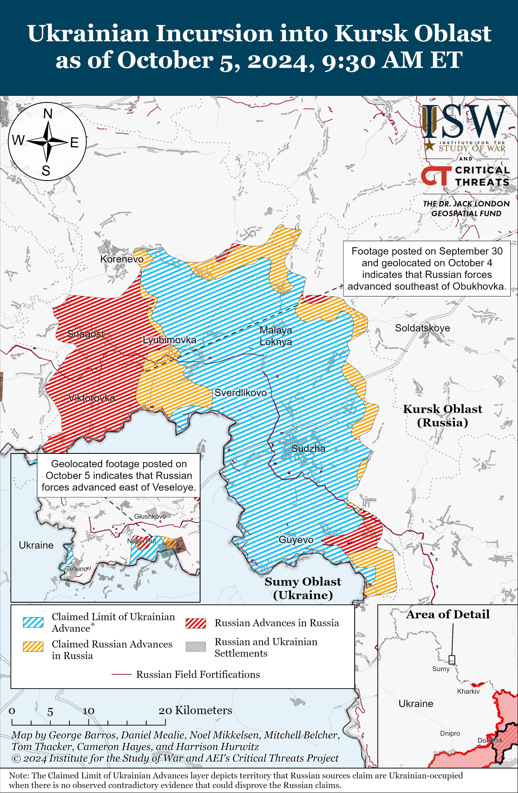
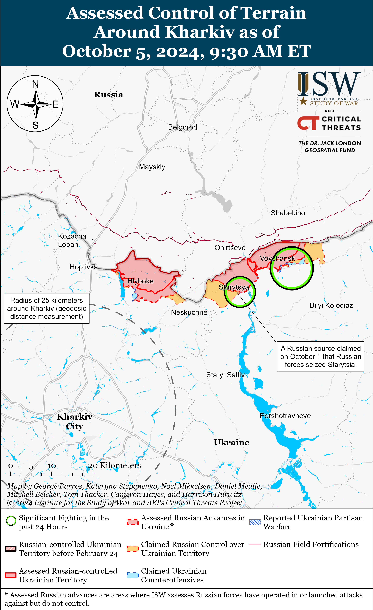
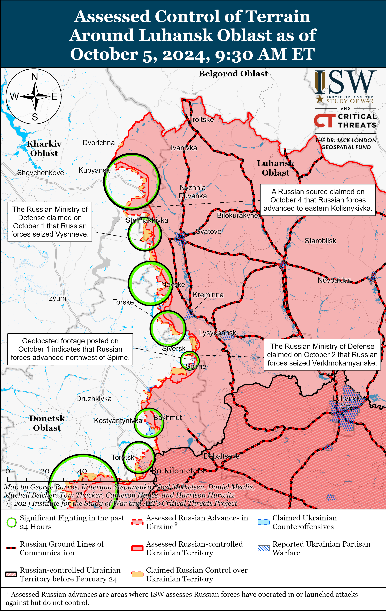
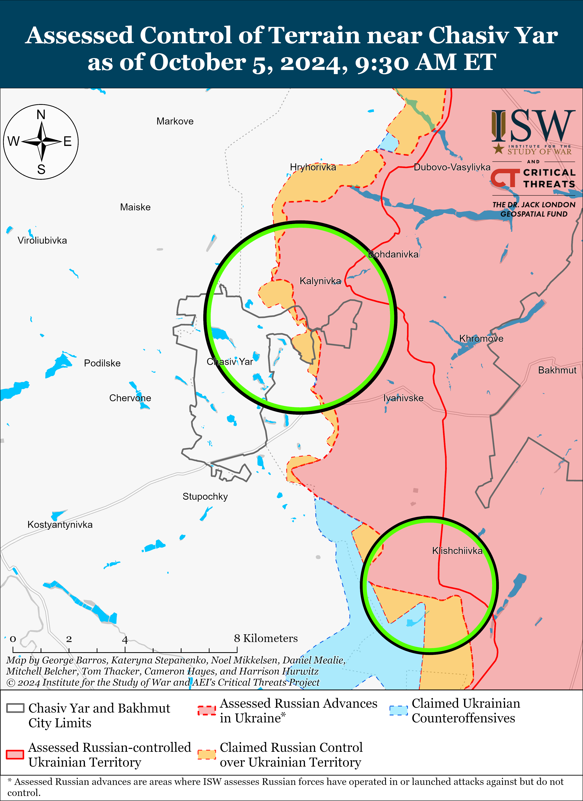
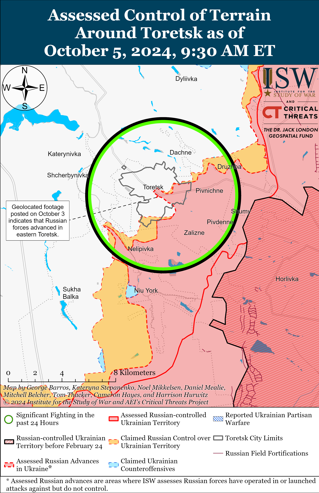
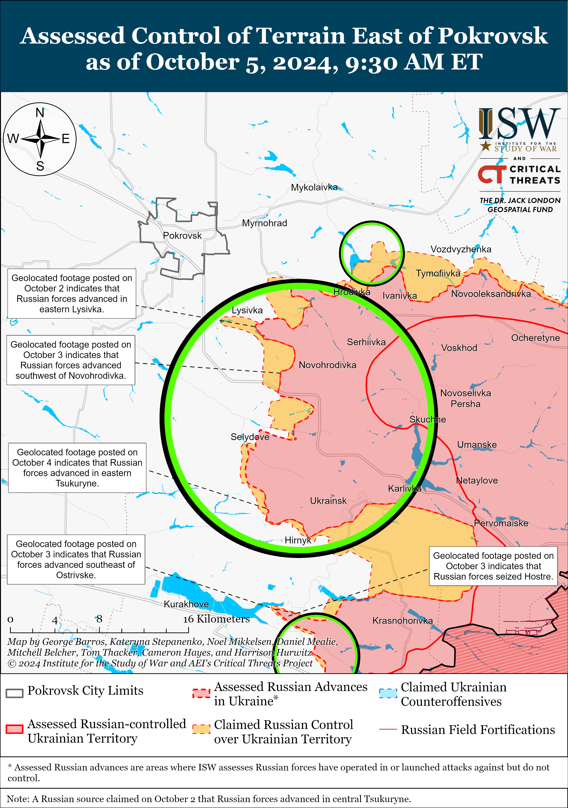
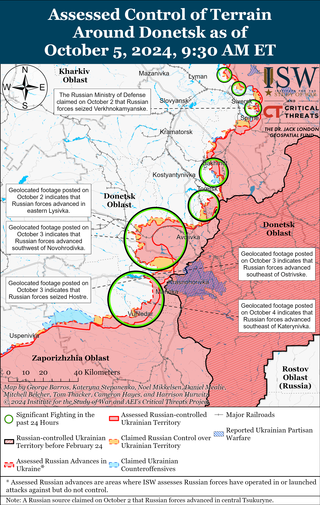
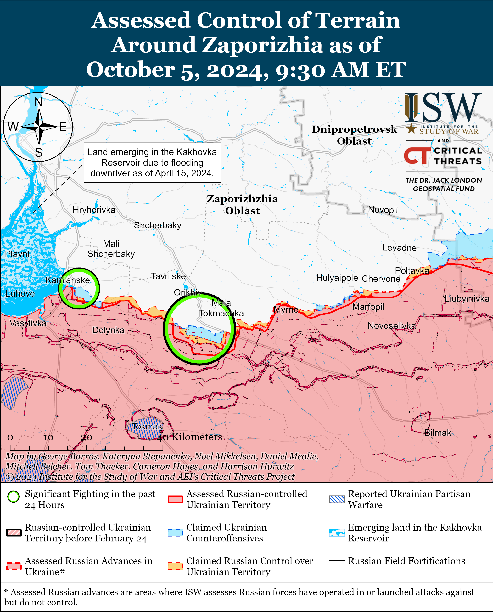
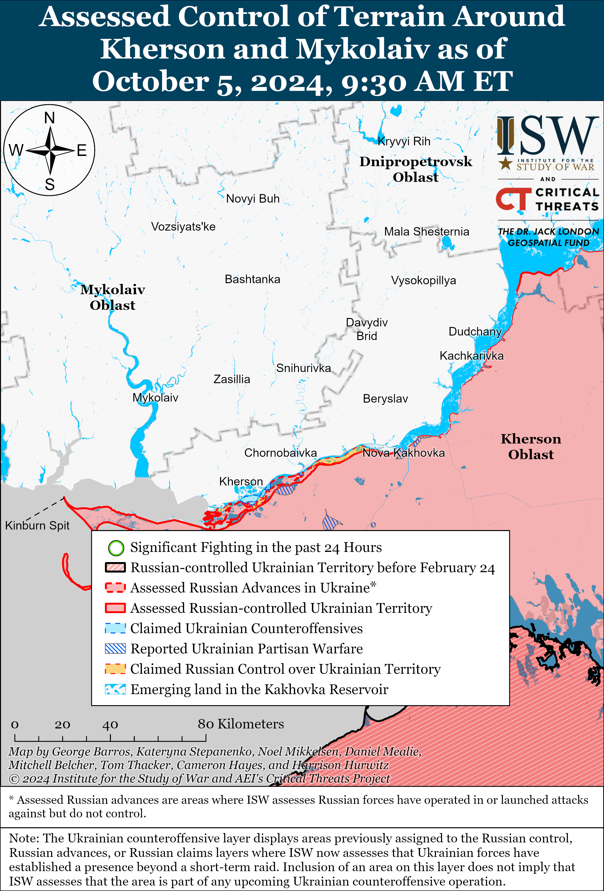

# Russian Offensive Campaign Assessment, October 5, 2024

**Riley Bailey, Davit Gasparyan, Nicole Wolkov, Angelica Evans, and George Barros**

**October 5, 2024, 11:10 am ET**

**Click**[**here**](https://storymaps.arcgis.com/stories/36a7f6a6f5a9448496de641cf64bd375)**to see ISW’s interactive map of the Russian invasion of Ukraine. This map is updated daily alongside the static maps present in this report.**

**Click**[**here**](https://storymaps.arcgis.com/stories/83a2f24901c941d581c0c523ecd2619b)**to see ISW’s interactive map of Ukraine’s offensive in Kursk Oblast.**

**Click**[**here**](https://understandingwar.maps.arcgis.com/apps/instant/3dviewer/index.html?appid=1602762dbcde419bb957dea358449580)**to see ISW’s 3D control of terrain topographic map of Ukraine. Use of a computer (not a mobile device) is strongly recommended for using this data-heavy tool.**

**Click**[**here**](https://storymaps.arcgis.com/stories/733fe90805894bfc8562d90b106aa895)**to access ISW’s archive of interactive time-lapse maps of the Russian invasion of Ukraine. These maps complement the static control-of-terrain map that ISW produces daily by showing a dynamic frontline. ISW will update this time-lapse map archive monthly.**

**Note: The data cut-off for this product was 9:30am ET on October 5. ISW will cover subsequent reports in the October 6 Russian Offensive Campaign Assessment.**

**The Russian Government plans to allocate 90 billion rubles ($948 million) to one-time payments for concluding a military contract with the Russian Ministry of Defense (MoD) between 2025 and 2027, indicating that the Kremlin plans to continue relying on ongoing crypto-mobilization efforts to meet the manpower requirements of its war in Ukraine for as long as the crypto-mobilization system works.[1]**The Russian federal government currently offers 400,000 rubles ($4,200) one-time payments for signing a military contract (in addition to one-time payments offered by regional governments, some of which recently exceed one million rubles), suggesting that the Kremlin intends to recruit 225,000 new personnel through contract service between 2025 and 2027, assuming current rates hold, which is unlikely given these rates have steadily increased since 2022.[2] Russian authorities have significantly increased financial incentives, particularly one-time payments, in recent months for signing military contracts, and the Kremlin may have allocated 90 billion rubles to one-time payments with the intent of further raising federal payments between 2025 and 2027.[3] Russian authorities have reportedly expressed concerns that ongoing recruitment efforts are producing diminishing results, however, and the significant increase in financial incentives in recent months suggests that existing recruitment efforts were insufficient for maintaining the consistent generation of new forces that the Russian military relies on for sustaining its offensive tempo in Ukraine.[4] ISW assesses that there are medium- to long-term constraints on how many recruits the ongoing Russian crypto-mobilization campaign can generate, and increased financial incentives are unlikely to significantly address these constraints.[5] Russian President Vladimir Putin remains committed to the ongoing crypto-mobilization campaign in order to avoid declaring another widely unpopular partial mobilization call-up of reservists, although he maintains the option to call another round of partial mobilization — as he did in Fall 2022.[6] Putin and the Russian military command appear unwilling to accept reducing the intensity of Russian combat operations in Ukraine since they view maintaining the theater-wide initiative as a strategic imperative, and it remains unclear whether Putin will respond with another round of mobilization if faced with another crisis similar to or worse than the crisis the Kremlin faced in Fall 2022.[7]

**Ukrainian officials continue to provide statistics regarding Russian war crimes, shedding light on the extent of violations committed by Russian forces and authorities**. Head of the Ukrainian Department for Combating Crimes in Conditions of Armed Conflict Yuri Bilousov stated on October 4 that Ukrainian sources documented evidence indicating that Russian forces have executed 93 Ukrainian prisoners of war (POW) on the battlefield since the start of the full-scale invasion and that 80 percent of the recorded cases occurred in 2024.[8] Bilousov noted that Russian servicemembers’ discipline and attitude towards committing such war crimes have deteriorated further. Bilousov stated on October 5 that such war crimes are systemic and Russian authorities clearly condone these crimes, as evidenced by repeated calls for violence against Ukrainian POWs by high-ranking Russian officials such as Russian Security Council Deputy Chairperson Dmitry Medvedev.[9] The Geneva Convention on POWs prohibits the “mutilation, cruel treatment, and torture” of POWs, as well as the execution of POWs or persons who are clearly *hors de combat*.[10] *Politico*reported on October 4 that a representative of Ukraine’s Coordination Headquarters for POWs, Victoria Tsymbalyuk, reported that at least 177 Ukrainian personnel and civilians have died in Russian captivity since the beginning of Russia’s full-scale invasion in February 2022.[11] Tsymbalyuk emphasized that the actual number of casualties could be significantly higher due to a lack of international oversight. Tsymbalyuk noted that Ukrainian authorities have returned approximately 3,600 Ukrainian POWs and civilians through exchanges with Moscow but that thousands remain imprisoned in Russia. ISW has repeatedly observed widespread and systemic war crimes committed by Russian forces and authorities against POWs and civilians with the most recent case being the execution of 16 Ukrainian POWs near Pokrovsk, the largest recorded case of such execution during the war.[12]

**The Russian government appears to have amended its plan to deanonymize Russian social media accounts following significant backlash within the Russian ultranationalist information space.**Russian federal censor Roskomnadzor and the Russian Ministry of Finance published a draft resolution on October 4 requiring social media pages with an audience of over 10,000 subscribers to register their identity and contact information with the Russian government.[13] The draft resolution requires that social media pages with 10,000 or more subscribers register and submit their contact information (including full name, phone number, and email address) through the Russian government services portal, Roskomnadzor’s website, or a chat bot on social media platforms. The draft resolution states that Roskomnadzor will publish a public list of all “verified” social media pages after the owner registers their information and that Roskomnadzor will require the page to include a link to Roskomnadzor’s list for subscribers. The draft resolution also states that Russian authorities will not allow “unverified” social media pages to advertise or accept donations, which could be an effective enforcement mechanism as many milbloggers depend on income from advertisements to sustain their channels documenting the war in Ukraine and often collect donations for frontline Russian units.[14] Many Russian milbloggers decried this new version of the registration law and argued that it could lead to the Russian state censoring the Russian-language internet and the milbloggers’ coverage of the war.[15] Roskomnadzor published and immediately deleted a previous version of this resolution that required social media pages to also submit IP addresses to Roskomnadzor in September 2024 amid outcry among Russian milbloggers about the effort and ongoing concerns about the Kremlin’s intensifying censorship efforts.[16] ISW noted at the time that Roskomnadzor’s decision to delete the draft resolution indicates that the Russian ultranationalist milblogger community maintains some influence on the Kremlin’s decisions, Roskomnadzor’s decision to amend the draft resolution further indicates the milblogger community’s influence over the Kremlin. It remains unclear how the Kremlin will react to the latest wave of milblogger criticism against the new watered-down version of the Telegram deanonymization law. Prominent Kremlin-linked and co-opted milbloggers such as Rybar, Evgeniy Poddubny, and Alexander “Sasha” Kots have not commented on the new draft regulation as of this publication. ISW continues to assess that the Kremlin is working to secure further control over the Russian information space via both codified regulations and reflexive control campaigns aimed at encouraging milbloggers and other critical voices in the Russian information space to self-censor.[17]

**A recent Ukrainian missile strike near occupied Donetsk City reportedly killed several North Korean military officials.**Unspecified sources in Ukraine’s intelligence community told the *Kyiv Post* that an October 3 Ukrainian missile strike near occupied Donetsk City killed 20 Russian soldiers, including six unidentified North Korean officers “who came to confer with their Russian counterparts,” and injured three other North Korean soldiers.[18] The *Kyiv Post*, citing Russian social media posts, reported that Russian forces were demonstrating infantry assault and defense training to the North Korean military personnel. ISW cannot independentlyconfirm the presence of North Korean military officials in occupied Donetsk City. ISW has previously observed unconfirmed reports in June 2024 that North Korea planned to dispatch a large-scale engineering force to occupied Donetsk Oblast as early as July 2024.[19] ISW also observed reports in July 2024 that a delegation from North Korea’s Kim Il Sung Military University visited Russia, which against the backdrop of deepening bilateral relations, suggests that the North Korean military likely intends to learn from the Russian military’s experience in the war in Ukraine.[20]

**Key Takeaways:**

- **The Russian Government plans to allocate 90 billion rubles ($948 million) to one-time payments for concluding a military contract with the Russian Ministry of Defense (MoD) between 2025 and 2027, indicating that the Kremlin plans to continue relying on ongoing crypto-mobilization efforts to meet the manpower requirements of its war in Ukraine for as long as the crypto-mobilization system works.**
- **Ukrainian officials continue to provide statistics regarding Russian war crimes, shedding light on the extent of violations committed by Russian forces and authorities.**
- **The Russian government appears to have amended its plan to deanonymize Russian social media accounts following significant backlash within the Russian ultranationalist information space.**
- **A recent Ukrainian missile strike near occupied Donetsk City reportedly killed several North Korean military officials.**
- **Russian forces recently advanced within the main Ukrainian salient in Kursk Oblast, near Toretsk, near Pokrovsk, and southwest of Donetsk City.**

***We do not report in detail on Russian war crimes because these activities are well-covered in Western media and do not directly affect the military operations we are assessing and forecasting. We will continue to evaluate and report on the effects of these criminal activities on the Ukrainian military and the Ukrainian population and specifically on combat in Ukrainian urban areas. We utterly condemn Russian violations of the laws of armed conflict and the Geneva Conventions and crimes against humanity even though we do not describe them in these reports.***

- Ukrainian Operations in the Russian Federation
- Russian Main Effort – Eastern Ukraine (comprised of three subordinate main efforts)
- Russian Subordinate Main Effort #1 – Push Ukrainian forces back from the international border with Belgorod Oblast and approach to within tube artillery range of Kharkiv City
- Russian Subordinate Main Effort #2 – Capture the remainder of Luhansk Oblast and push westward into eastern Kharkiv Oblast and encircle northern Donetsk Oblast
- Russian Subordinate Main Effort #3 – Capture the entirety of Donetsk Oblast
- Russian Supporting Effort – Southern Axis
- Russian Air, Missile, and Drone Campaign
- Russian Mobilization and Force Generation Efforts
- Russian Technological Adaptations
- Activities in Russian-occupied areas
- Ukrainian Defense Industrial Base Efforts
- Russian Information Operations and Narratives
- Significant Activity in Belarus

**Ukrainian Operations in the Russian Federation**

Ukrainian forces continued ground assaults in Glushkovsky Raion west of the main Ukrainian salient in Kursk Oblast on October 5 but did not make confirmed advances. Russian milbloggers claimed on October 4 that Russian forces recaptured Medvezhye (southeast of Glushkovo), but ISW has not observed confirmation of these claims.[21] Ukrainian forces attacked southwest of Glushkovo near Veseloye and Novy Put; and southeast of Glushkovo near Medvezhye.[22] Elements of the Russian 83rd Separate Guards Airborne (VDV) Brigade are reportedly operating in Glushkovsky Raion.[23] Elements of the Russian 106th Guards VDV Division, the 56th VDV Regiment (7th VDV Division), and the 1427th Motorized Rifle Regiment (Territorial Troops) are reportedly operating near Medvezhye.[24]

Russian forces recently made advances in the main Ukrainian salient in Kursk Oblast amid continued fighting on October 5. Geolocated footage published on September 30 indicates that Russian forces recently advanced during a platoon-sized mechanized assault southeast of Obukhovka (southeast of Korenevo).[25] Ukrainian forces attacked southeast of Korenevo in the direction of Lyubimovka and Obukhovka; north of Sudzha towards Kamyshevka; and southeast of Sudzha near Plekhovo.[26] Elements of the Russian 155th Naval Infantry Brigade (Pacific Fleet, Eastern Military District [EMD]) are reportedly operating near Obukhovka.[27]

**Russian Main Effort – Eastern Ukraine**

**Russian Subordinate Main Effort #1 – Kharkiv Oblast (Russian objective: Push Ukrainian forces back from the international border with Belgorod Oblast and approach to within tube artillery range of Kharkiv City)**

Russian forces continued assaults north of Kharkiv City near Hlyboke and northeast of Kharkiv City near Starytsya, Vovchansk, and Tykhe on October 4 and 5, but there were no confirmed changes to the frontline.[28] A Ukrainian brigade operating in northern Kharkiv Oblast reported that Russian forces used an unspecified chemical agent against advancing Ukrainian forces in an unspecified area of the Kharkiv direction.[29] Elements of the Russian 7th Motorized Rifle Regiment (11th Army Corps [AC], Leningrad Military District [LMD]) are reportedly operating near Lukyantsi (north of Kharkiv City).[30]

**Russian Subordinate Main Effort #2 – Luhansk Oblast (Russian objective: Capture the remainder of Luhansk Oblast and push westward into eastern Kharkiv Oblast and northern Donetsk Oblast)**

Russian forces continued assaults along the Kupyansk-Svatove-Kreminna line on October 5, but there were no confirmed changes to the frontline in this area. A Russian milblogger claimed that Russian forces advanced two kilometers in depth east of Terny (west of Kreminna) and are trying to level the frontline along the Torske-Makiivka road, but ISW has not observed visual confirmation of the claimed Russian advance.[31] Russian milbloggers also claimed that Russian forces recently seized part of the road between Kruhlyakivka and Kolisnykivka (both southeast of Kupyansk), but ISW has not observed visual confirmation of this claim.[32] Russian forces continued assaults northeast of Kupyansk near Synkivka; southeast of Kupyansk near Stepova Novoselivka, Novoosynove, Pishchane, Stelmakhivka, and Lozova; west of Svatove in the direction of Borova; southwest of Svatove near Hrekivka, Makiivka, and Nevske; northwest of Kreminna near Novosadove; and west of Kreminna near Torske on October 4 and 5.[33] Elements of the Russian 39th Radiological, Chemical, and Biological Defense Protection Regiment (3rd Combined Arms Army [CAA], formerly 2nd Luhansk People’s Republic Army Corps [LNR AC]) are reportedly operating near Serebryanka (south of Kreminna).[34]

**Russian Subordinate Main Effort #3 – Donetsk Oblast (Russian objective: Capture the entirety of Donetsk Oblast, the claimed territory of Russia’s proxies in Donbas)**

Russian forces continued offensive operations in the Siversk direction near Bilohorivka (northeast of Siversk), Verknokamyanske (east of Siversk), and Vyimka (southeast of Siversk) on October 4 and 5 but did not make any confirmed advances.[35]

Russian forces continued offensive operations near Chasiv Yar on October 5 but did not make any confirmed advances. Russian forces attacked near Chasiv Yar; north of Chasiv Yar near Kalynivka; south of Chasiv Yar near Stupochky; and southeast of Chasiv Yar near Andriivka on October 4 and 5.[36] Elements of the Russian 58th Spetsnaz Battalion (51st Combined Arms Army [CAA], formerly 1st Donetsk People’s Republic Army Corps [DNR AC]) reportedly continue operating near the Novyi Microraion in eastern Chasiv Yar.[37]

Russian forces recently advanced in Toretsk amid continued Russian offensive operations in the area on October 5. Geolocated footage published on October 3 indicates that Russian forces recently advanced along Tsentralna Street in central Toretsk.[38] Russian forces continued ground attacks near Toretsk, Dachne, northeast of Toretsk, and southwest of Toretsk near Shcherbynivka on October 4 and 5.[39]

Russian forces recently advanced in the Pokrovsk direction amid continued Russian offensive operations in the area on October 5. Geolocated footage published on October 4 indicates that Russian forces recently advanced within eastern Tsukuryne (southeast of Pokrovsk).[40] A Russian milblogger claimed that Russian forces seized most of Tsukuryne and that fighting is ongoing near Ismailivka (southeast of Pokrovsk and Tsukuryne), although ISW has not observed visual confirmation of these claims.[41] The Russian Ministry of Defense (MoD) claimed that Russian forces seized Zhelanne Druhe (southeast of Pokrovsk), although ISW has not observed visual evidence confirming this claim.[42] Russian forces continued offensive operations east of Pokrovsk near Novotoretske, southeast of Pokrovsk near Selydove, Krutyi Yar, Mykolaivka, Lysivka, and Tsukuryne on October 4 and 5.[43] Elements of the Russian 74th Motorized Rifle Brigade (41st CAA, Central Military District [CMD]) are reportedly operating near Hrodivka (east of Pokrovsk) and elements of the 3rd “Atlant” Motorized Rifle Battalion of the Russian 35th Motorized Rifle Brigade (41st CAA, CMD) are reportedly operating in the Pokrovsk direction.[44]

The Ukrainian General Staff reported on October 5 that the Ukrainian military recently conducted Storm Shadow missile and GMLRS strikes on three Russian military command posts.[45] The Ukrainian General Staff reported that Ukrainian forces struck command posts of the 35th Motorized Rifle Brigade (41st CAA, CMD), 27th Motorized Rifle Brigade (2nd CAA, CMD), and the 2nd CAA – elements of which ISW has recently observed operating in the Pokrovsk direction.[46]

Russian forces continued offensive operations west of Donetsk City on October 5 but did not make any confirmed advances. Russian forces attacked near Heorhiivka, Hostre, and Ostrivske on October 4 and 5.[47] Elements of the Russian 238th Artillery Brigade (8th CAA, Southern Military District [SMD]) reportedly continue operating near Maksymilyanivka and Krasnohorivka.[48]

Russian forces recently advanced southwest of Donetsk City during a company-sized mechanized assault and continued offensive operations in the area on October 5. Geolocated footage published by a Ukrainian brigade operating southwest of Donetsk City indicates that Russian forces recently advanced north of Kostyantynivka and up to the southern outskirts of Katerynivka during a company-sized mechanized assault.[49] The Ukrainian brigade stated that Ukrainian forces destroyed a tank and five armored vehicles and damaged another armored vehicle during the Russian mechanized assault.[50] Russian milbloggers claimed that Russian forces advanced further into southern Katerynivka on October 4 and 5.[51] Russian milbloggers claimed on October 5 that Russian forces operating southwest of Donetsk City also advanced northwest of Vuhledar in the direction of Bohoyavlenka.[52] ISW has not observed visual confirmation of these Russian claims, however. A Russian milblogger claimed that Russian forces are attempting to seize Illiinka before fall weather conditions may start constraining mechanized maneuver southwest of Donetsk City.[53] Russian forces continued offensive operations near Antonivka, Kostyantynivka, and Katerynivka and in the direction of Bohoyavlenka on October 4 and 5.[54] Social media sources amplified footage on October 5 purporting to show the wreckage of a downed Russian S-70 heavy stealth fixed-wing drone near Kostyantynivka.[55] If confirmed, the loss of the S-70 would be the first loss in the drone’s service history. Russia has only produced two S-70 drones.

Russian and Ukrainian sources did not report any fighting in the Donetsk-Zaporizhia Oblast border area on October 5.

**Russian Supporting Effort – Southern Axis (Russian objective: Maintain frontline positions and secure rear areas against Ukrainian strikes)**

Russian forces continued ground attacks in western Zaporizhia Oblast near Robotyne, Mali Shcherbaky (west of Orikhiv and southeast of Stepnohirsk), and Kamyanske (south of Stepnohirsk) on October 4 and 5, but did not make any confirmed gains.[56] A Russian milblogger claimed that Ukrainian forces have been trying to conduct reconnaissance-in-force attacks with limited forces near Kamyanske since October 4.[57]

ARussian milblogger claimed on October 5 that fighting resumed on islands in the Dnipro River Delta, but the Ukrainian General Staff reported no Russian ground assaults in the Kherson direction on October 4 and 5.[58] Elements of the Russian 80th Arctic Brigade (14th Army Corps [AC], Leningrad Military District [LMD]) are reportedly operating in the Kherson direction.[59]

**Russian Air, Missile, and Drone Campaign (Russian Objective: Target Ukrainian military and civilian infrastructure in the rear and on the frontline)**

Russian forces conducted a limited series of missile and drone strikes against Ukraine on the night of October 4 to 5. The Ukrainian Air Force reported that Russian forces launched three Kh-59/69 cruise missiles and 13 Shahed-136/131 drones from Kursk Oblast and occupied Crimea and that Ukrainian forces shot down three of the drones.[60] The Ukrainian Air Force stated that 10 Shaheds were “lost in location” in northern and southern Ukraine, likely referring to Ukrainian electronic warfare (EW) interference disrupting the Shahed strikes.[61] The Ukrainian Air Force added that the three Kh-59/69 cruise missiles did not reach their intended targets, and Mykolaiv Oblast Military Administration Head Vitaliy Kim stated that an unspecified number of the Kh-59/69 missiles struck an infrastructure facility in Mykolaiv City.[62] The Russian Ministry of Defense (MoD) posted footage on October 4 purporting to show Russian forces striking Ukrainian manpower concentrations in Sumy Oblast with an Iskander-M ballistic missile.[63]

**Russian Mobilization and Force Generation Efforts (Russian objective: Expand combat power without conducting general mobilization)**

Russian First Deputy Prime Minister Denis Manturov met with Russian Deputy Defense Minister Alexei Krivoruchko, members of the Russian Military-Industry Commission and Federation Council Committee on Defense and Security, and defense industrial and military administration officials at the “ERA” Military Innovation Technopolis on October 4.[64] Russian officials discussed developing unmanned ground and naval vehicles for Russian forces and emphasized the need to improve drone training for Russian servicemembers. Manturov and All-Russia People’s Front Executive Committee Head Mikhail Kuznetsov delivered an unspecified number of vehicles and all-terrain vehicles reportedly equipped with electronic warfare (EW) and drone detection systems to elements of the Russian 7th Airborne (VDV) Division.[65]

Russian Deputy Defense Minister Pavel Fradkov visited servicemembers of the Russian Southern Military District (SMD) in occupied Luhansk Oblast on October 4 and inspected the construction of new medical facilities in occupied Luhansk Oblast.[66] Fradkov emphasized that the Russian MoD is developing a new military medical support system for servicemembers. Fradkov also met with Luhansk People’s Republic (LNR) Head Leonid Pasechnik in occupied Luhansk City to discuss future military construction plans in occupied Luhansk Oblast.[67]

**Russian Technological Adaptations (Russian objective: Introduce technological innovations to optimize systems for use in Ukraine)**

Nothing significant to report.

**Ukrainian Defense Industrial Efforts (Ukrainian objective: Develop its defense industrial base to become more self-sufficient in cooperation with US, European, and international partners)**

*ISW is suspending publishing coverage of Ukrainian defense industrial efforts until further notice.*

**Activities in Russian-occupied areas (Russian objective: Consolidate administrative control of annexed areas; forcibly integrate Ukrainian citizens into Russian sociocultural, economic, military, and governance systems)**

*ISW is not publishing reporting on activities in Russian-occupied areas today.*

**Russian Information Operations and Narratives**

Nothing significant to report.

**Significant activity in Belarus (Russian efforts to increase its military presence in Belarus and further integrate Belarus into Russian-favorable frameworks and Wagner Group activity in Belarus)**

Belarusian President Alexander Lukashenko claimed on October 5 that Ukrainian and Russian drones, including Shahed-136/131 drones, have been violating Belarusian airspace due to “inexperienced hands” and suppression by electronic warfare (EW) systems.[68] Lukashenko voiced concern over increasing Ukrainian and Russian drone production, suggesting that neither side has fully mastered drone operations, which could lead to further violations of the Belarusian airspace. Lukashenko also claimed that Belarusian forces shoot down any drones that trespass into Belarusian airspace, regardless of its origin. ISW has recently observed reports of Russian Shahed drones crossing into Belarusian airspace and crashing, and Lukashenko’s statement highlights a possible point of tension between Russia and Belarus.[69]

**Note: ISW does not receive any classified material from any source, uses only publicly available information, and draws extensively on Russian, Ukrainian, and Western reporting and social media as well as commercially available satellite imagery and other geospatial data as the basis for these reports. References to all sources used are provided in the endnotes of each update.**

---

[1] https://sozd.duma.gov dot ru/bill/727320-8

[2] https://t.me/istories\_media/7754 ; https://sozd.duma.gov dot ru/bill/727320-8

[3] https://isw.pub/UkrWar091524

[4] https://isw.pub/UkrWar091524 ; https://isw.pub/UkrWar032224 ; https://understandingwar.org/backgrounder/how-delays-western-aid-gave-russia-initiative-ukrainian-counteroffensive-kharkiv

[5] https://isw.pub/UkrWar091524

[6] https://isw.pub/UkrWar091924

[7] https://isw.pub/UkrWar091524

[8] https://armyinform.com dot ua/2024/10/04/93-ukrayinskyh-vijskovopolonenyh-stratyly-rosiyany-na-poli-boyu-80-czogo-roku/; https://suspilne dot media/851175-rosiani-stratili-na-poli-bou-93-ukrainskih-vijskovih-aki-zdalisa-u-polon-ofis-genprokurora/; https://www.voanews.com/a/kyiv-says-russia-has-executed-93-ukrainian-pows-since-start-of-war/7811441.html

[9] https://armyinform.com dot ua/2024/10/05/poturannya-nyzovij-inicziatyvi-shho-sponukaye-rosiyan-vchynyaty-voyenni-zlochyny/

[10] https://www.ohchr.org/en/instruments-mechanisms/instruments/geneva-convention-relative-treatment-prisoners-war

[11] https://www.politico.eu/article/ukraine-death-toll-russia-captive-kremlin-defense-ministry/; https://suspilne dot media/851199-sonajmense-177-ukrainciv-zaginuli-u-rosijskomu-poloni-z-pocatku-povnomasstabnoi-vijni-minoboroni/

[12] https://kyivindependent dot com/russian-forces-execute-16-ukrainian-pows-prosecutors-say/; https://understandingwar.org/backgrounder/russian-offensive-campaign-assessment-october-1-2024; https://understandingwar.org/backgrounder/russian-offensive-campaign-assessment-july-10-2024; https://isw.pub/UkrWar032724; https://isw.pub/UkrWar090624; https://understandingwar.org/backgrounder/russian-offensive-campaign-assessment-february-20-2024; https://isw.pub/UkrWar022524; https://understandingwar.org/backgrounder/russian-offensive-campaign-assessment-september-17-2024

[13] https://regulation.gov dot ru/Regulation/Npa/PublicView?npaID=151326 ; https://meduza dot io/news/2024/10/05/roskomnadzor-opublikoval-novuyu-versiyu-proekta-o-reestre-blogerov-s-auditoriey-bolee-10-tysyach-podpischikov ; https://t.me/tass\_agency/277445

[14] https://understandingwar.org/backgrounder/russian-offensive-campaign-assessment-february-10-2024; https://understandingwar.org/backgrounder/russian-offensive-campaign-assessment-february-28-2024 ; https://understandingwar.org/backgrounder/russian-offensive-campaign-assessment-july-30-2024

[15] https://t.me/dva\_majors/54409 ; https://t.me/belarusian\_silovik/42336

[16] https://understandingwar.org/backgrounder/russian-offensive-campaign-assessment-july-30-2024 ; https://isw.pub/UkrWar080224 ; https://isw.pub/UkrWar080924 ; https://isw.pub/UkrWar090624

[17] https://isw.pub/UkrWar071124 ; https://isw.pub/UkrWar091024

[18] https://www.kyivpost.com/post/40037

[19] https://understandingwar.org/backgrounder/russian-offensive-campaign-assessment-june-26-2024

[20] https://understandingwar.org/backgrounder/russian-offensive-campaign-assessment-july-9-2024 ; https://isw.pub/UkrWar061824 ; https://understandingwar.org/backgrounder/russian-offensive-campaign-assessment-june-19-2024

[21] https://t.me/dva\_majors/54412; https://t.me/zovpobedy/13319; https://t.me/DnevnikDesantnika/16594

[22] https://t.me/dva\_majors/54419; https://t.me/mod\_russia/44176

[23] https://t.me/DnevnikDesantnika/16592

[24] https://t.me/DnevnikDesantnika/16594

[25] https://t.me/creamy\_caprice/7014; https://www.facebook.com/watch/?v=1092725362474582

[26] https://t.me/dva\_majors/54419; https://t.me/rybar/64132; https://t.me/mod\_russia/44176

[27] https://t.me/milinfolive/132137

[28] https://www.facebook.com/GeneralStaff.ua/posts/pfbid02keAMvwYJAXQQtCzuAMEcqcKKMbVjzgi1qPXWLJgv3KMYWKAGA3DiJcvHtNu2mXS9l ; https://www.facebook.com/GeneralStaff.ua/posts/pfbid02rnQUe3V8WX7LQKyTrwQD96tR44iS6S9XzUEVgi93iwsStmZw1bURHU2FDTXgYKq7l ; https://t.me/wargonzo/22460v ; https://t.me/wargonzo/22460v

[29] https://t.me/ab3army/4703

[30] https://t.me/otukharkiv/1853

[31] https://t.me/DnevnikDesantnika/16631

[32] https://t.me/boris\_rozhin/139700 ; https://t.me/DnevnikDesantnika/16604

[33] https://t.me/DnevnikDesantnika/16604 ; https://www.facebook.com/GeneralStaff.ua/posts/pfbid02keAMvwYJAXQQtCzuAMEcqcKKMbVjzgi1qPXWLJgv3KMYWKAGA3DiJcvHtNu2mXS9l ; https://www.facebook.com/GeneralStaff.ua/posts/pfbid02rnQUe3V8WX7LQKyTrwQD96tR44iS6S9XzUEVgi93iwsStmZw1bURHU2FDTXgYKq7l ; https://www.facebook.com/GeneralStaff.ua/posts/pfbid02rV3NDNypwQLkmYDcn2MsSjnzQdCtRh5BCGr3yhsSASZCpHdBKrhAPpHrdFaHPfSol

[34] https://t.me/epoddubny/21250 ; https://t.me/sashakots/49360

[35] https://www.facebook.com/GeneralStaff.ua/posts/pfbid02keAMvwYJAXQQtCzuAMEcqcKKMbVjzgi1qPXWLJgv3KMYWKAGA3DiJcvHtNu2mXS9l ; https://www.facebook.com/GeneralStaff.ua/posts/pfbid02rnQUe3V8WX7LQKyTrwQD96tR44iS6S9XzUEVgi93iwsStmZw1bURHU2FDTXgYKq7l ; https://t.me/rybar/64121 ; https://t.me/dva\_majors/54407

[36] https://www.facebook.com/GeneralStaff.ua/posts/pfbid02keAMvwYJAXQQtCzuAMEcqcKKMbVjzgi1qPXWLJgv3KMYWKAGA3DiJcvHtNu2mXS9l ; https://www.facebook.com/GeneralStaff.ua/posts/pfbid02rnQUe3V8WX7LQKyTrwQD96tR44iS6S9XzUEVgi93iwsStmZw1bURHU2FDTXgYKq7l ; https://t.me/wargonzo/22460

[37] https://t.me/boris\_rozhin/139677 ; https://t.me/nm\_dnr/12788

[38] https://x.com/AudaxonX/status/1842333531067777355; https://t.me/voron1OO/71; https://t.me/RVvoenkor/78204

[39] https://www.facebook.com/GeneralStaff.ua/posts/pfbid02keAMvwYJAXQQtCzuAMEcqcKKMbVjzgi1qPXWLJgv3KMYWKAGA3DiJcvHtNu2mXS9l ; https://www.facebook.com/GeneralStaff.ua/posts/pfbid02rnQUe3V8WX7LQKyTrwQD96tR44iS6S9XzUEVgi93iwsStmZw1bURHU2FDTXgYKq7l ; https://www.facebook.com/GeneralStaff.ua/posts/pfbid02rV3NDNypwQLkmYDcn2MsSjnzQdCtRh5BCGr3yhsSASZCpHdBKrhAPpHrdFaHPfSol ; https://t.me/wargonzo/22460 ; https://t.me/rusich\_army/17504

[40] https://t.me/creamy\_caprice/7016; https://t.me/syly\_pox/42

[41] https://t.me/rybar/64133

[42] https://t.me/mod\_russia/44172

[43] https://www.facebook.com/GeneralStaff.ua/posts/pfbid02keAMvwYJAXQQtCzuAMEcqcKKMbVjzgi1qPXWLJgv3KMYWKAGA3DiJcvHtNu2mXS9l ; https://www.facebook.com/GeneralStaff.ua/posts/pfbid02rnQUe3V8WX7LQKyTrwQD96tR44iS6S9XzUEVgi93iwsStmZw1bURHU2FDTXgYKq7l ; https://www.facebook.com/GeneralStaff.ua/posts/pfbid02rV3NDNypwQLkmYDcn2MsSjnzQdCtRh5BCGr3yhsSASZCpHdBKrhAPpHrdFaHPfSol ; https://t.me/DnevnikDesantnika/16602 ; https://t.me/wargonzo/22460 ; https://t.me/voenkorKotenok/59419

[44] https://t.me/voin\_dv/11157 ; https://t.me/urga\_74 (Hrodivka)

https://t.me/boris\_rozhin/139718 (Pokrovsk)

[45] https://www.facebook.com/GeneralStaff.ua/posts/pfbid02Y9mjECt4LBMS8ErSMxcwn7FMKK4ZGeG86FYFGTugBxYb5g9tG2wRmvabkpbKcQ6Yl

[46] https://understandingwar.org/backgrounder/russian-offensive-campaign-assessment-september-23-2024 ; https://understandingwar.org/backgrounder/russian-offensive-campaign-assessment-october-3-2024

[47] https://www.facebook.com/GeneralStaff.ua/posts/pfbid02keAMvwYJAXQQtCzuAMEcqcKKMbVjzgi1qPXWLJgv3KMYWKAGA3DiJcvHtNu2mXS9l ; https://www.facebook.com/GeneralStaff.ua/posts/pfbid02rnQUe3V8WX7LQKyTrwQD96tR44iS6S9XzUEVgi93iwsStmZw1bURHU2FDTXgYKq7l ; https://t.me/RVvoenkor/78193 ; https://t.me/dva\_majors/54419 ; https://www.facebook.com/GeneralStaff.ua/posts/pfbid02rV3NDNypwQLkmYDcn2MsSjnzQdCtRh5BCGr3yhsSASZCpHdBKrhAPpHrdFaHPfSol ; https://t.me/wargonzo/22460 ; https://t.me/voenkorKotenok/59418

[48] https://t.me/nm\_dnr/12790 ; https://t.me/nm\_dnr/12787

[49] https://t.me/creamy\_caprice/7015; https://t.me/odshbr79/391

[50] https://t.me/odshbr79/391

[51] https://t.me/RVvoenkor/78193 ; https://t.me/z\_arhiv/28400 ; https://t.me/z\_arhiv/28403 ; https://t.me/voenkorKotenok/59419

[52] https://t.me/z\_arhiv/28412 ; https://t.me/dva\_majors/54420

[53] https://t.me/voenkorKotenok/59419

[54] https://www.facebook.com/GeneralStaff.ua/posts/pfbid02keAMvwYJAXQQtCzuAMEcqcKKMbVjzgi1qPXWLJgv3KMYWKAGA3DiJcvHtNu2mXS9l ; https://www.facebook.com/GeneralStaff.ua/posts/pfbid02rnQUe3V8WX7LQKyTrwQD96tR44iS6S9XzUEVgi93iwsStmZw1bURHU2FDTXgYKq7l ; https://www.facebook.com/GeneralStaff.ua/posts/pfbid02rV3NDNypwQLkmYDcn2MsSjnzQdCtRh5BCGr3yhsSASZCpHdBKrhAPpHrdFaHPfSol ; https://t.me/RVvoenkor/78193 ;

[55] https://t.me/officer\_alex33/3893 ; https://t.me/ssternenko/34533 ; https://x.com/GloOouD/status/1842512260809330761

[56] https://www.facebook.com/GeneralStaff.ua/posts/pfbid02keAMvwYJAXQQtCzuAMEcqcKKMbVjzgi1qPXWLJgv3KMYWKAGA3DiJcvHtNu2mXS9l ; https://www.facebook.com/GeneralStaff.ua/posts/pfbid02rnQUe3V8WX7LQKyTrwQD96tR44iS6S9XzUEVgi93iwsStmZw1bURHU2FDTXgYKq7l

[57] https://t.me/dva\_majors/54419

[58] https://www.facebook.com/GeneralStaff.ua/posts/pfbid02keAMvwYJAXQQtCzuAMEcqcKKMbVjzgi1qPXWLJgv3KMYWKAGA3DiJcvHtNu2mXS9l ; https://www.facebook.com/GeneralStaff.ua/posts/pfbid02rnQUe3V8WX7LQKyTrwQD96tR44iS6S9XzUEVgi93iwsStmZw1bURHU2FDTXgYKq7l ; https://www.facebook.com/GeneralStaff.ua/posts/pfbid02rV3NDNypwQLkmYDcn2MsSjnzQdCtRh5BCGr3yhsSASZCpHdBKrhAPpHrdFaHPfSol

[59] https://t.me/NeoficialniyBeZsonoV/40278

[60] https://t.me/kpszsu/20656

[61] https://t.me/kpszsu/20656

[62] https://armyinform.com dot ua/2024/10/05/raketnyj-udar-po-mykolayevu-okupanty-atakuvaly-infrastrukturu-mista/ ; https://t.me/kpszsu/20656

[63] https://t.me/mod\_russia/44147

[64] https://t.me/mod\_russia/44130

[65] https://t.me/mod\_russia/44131

[66] https://t.me/mod\_russia/44132

[67] https://t.me/mod\_russia/44141

[68] https://meduza dot io/news/2024/10/04/teryayut-orientatsiyu-lukashenko-o-tom-chto-rossiyskie-i-ukrainskie-bespilotniki-zaletayut-v-belarus

[69] https://understandingwar.org/backgrounder/russian-offensive-campaign-assessment-august-26-2024;
