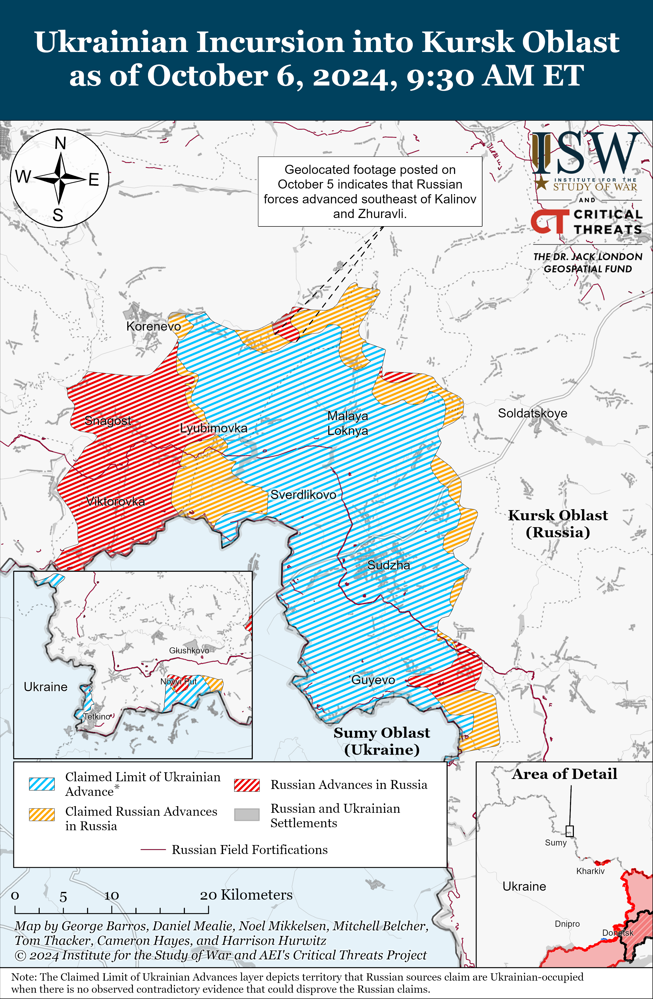
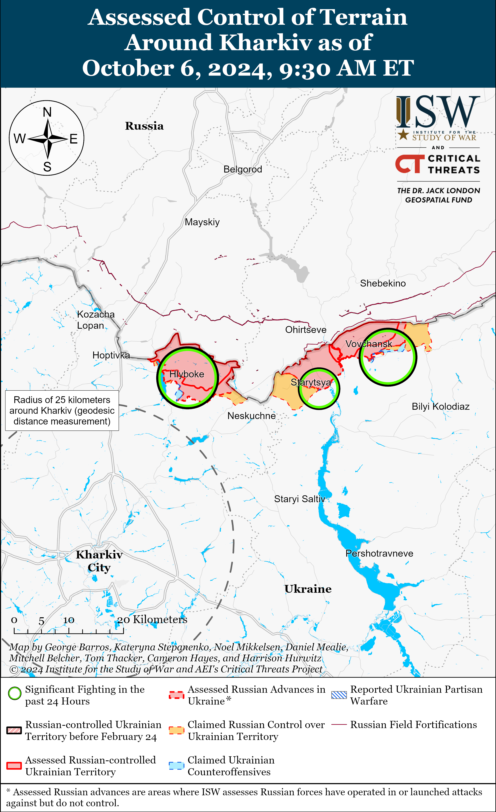
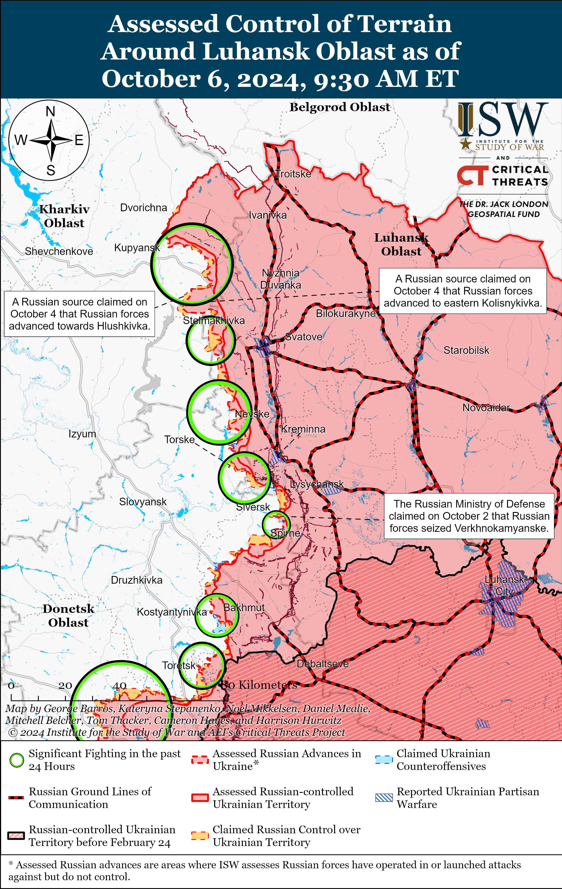
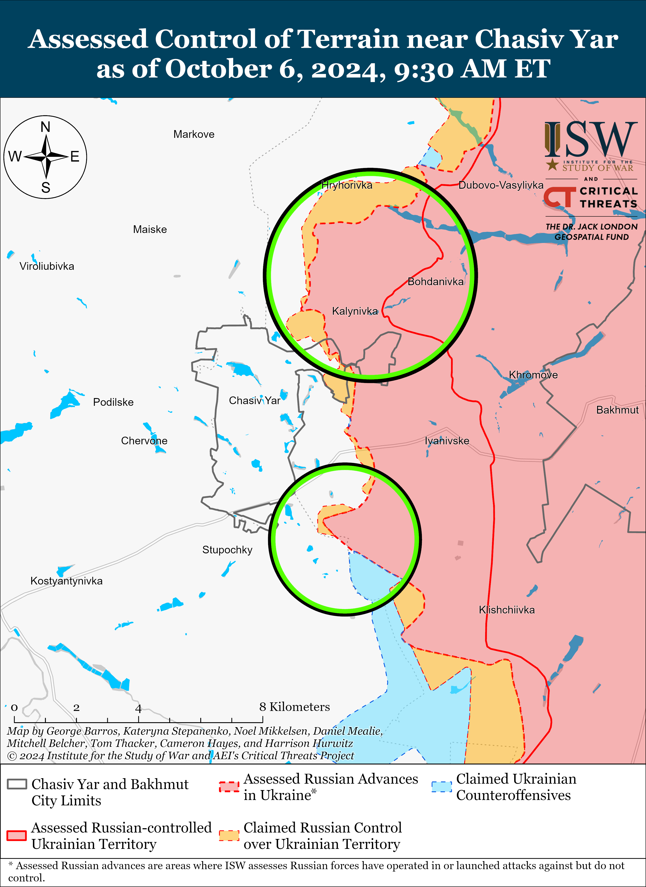
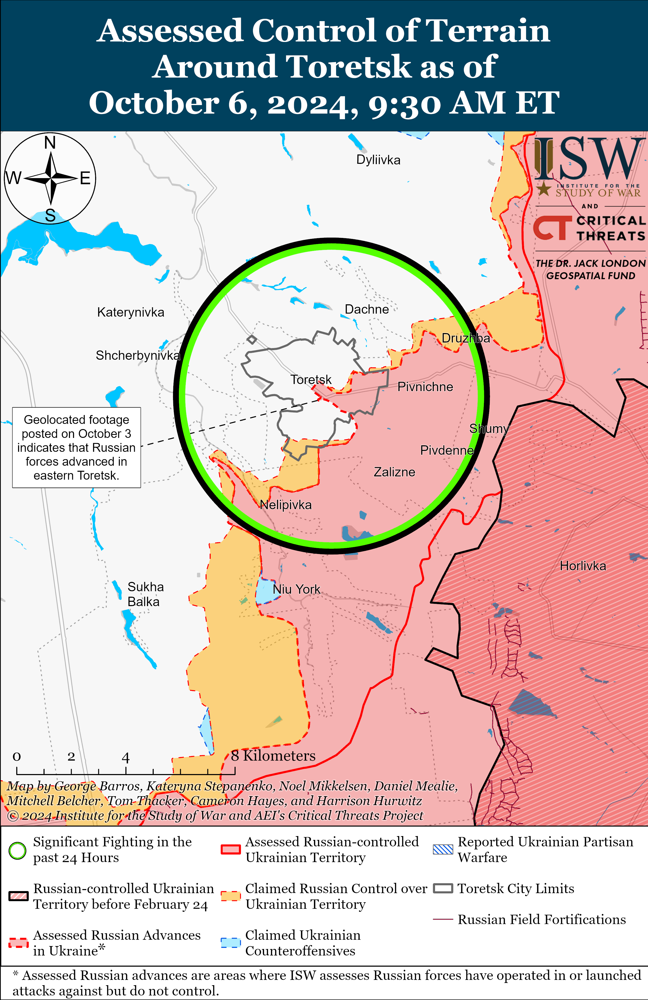
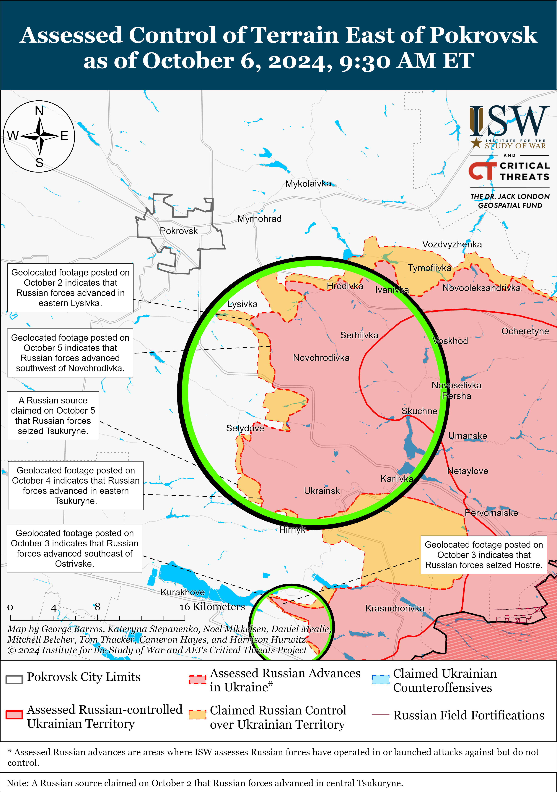
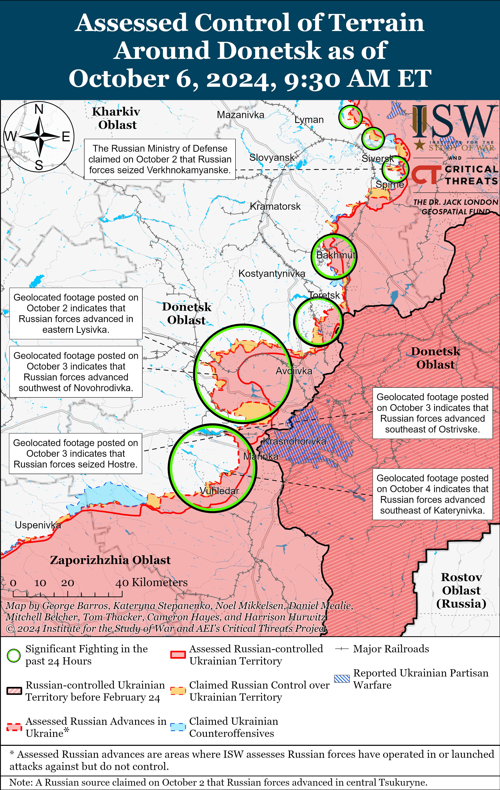
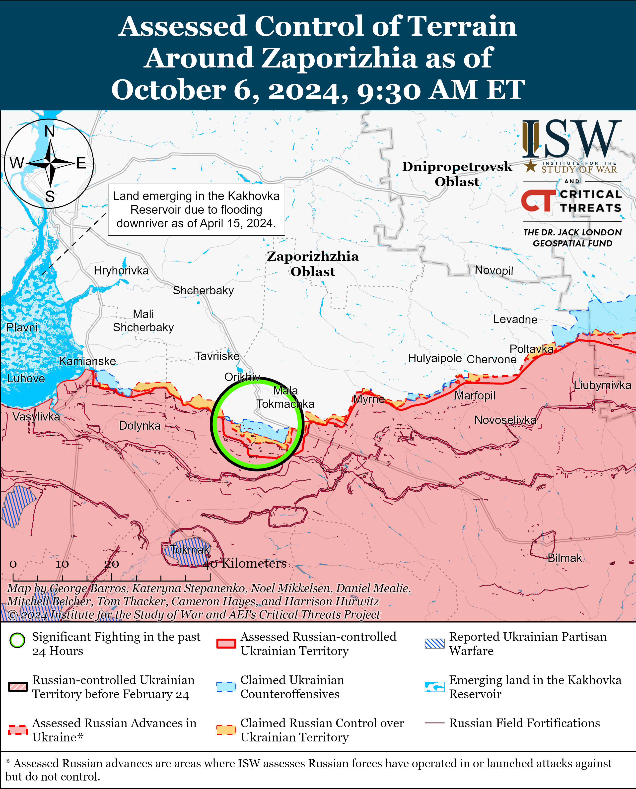
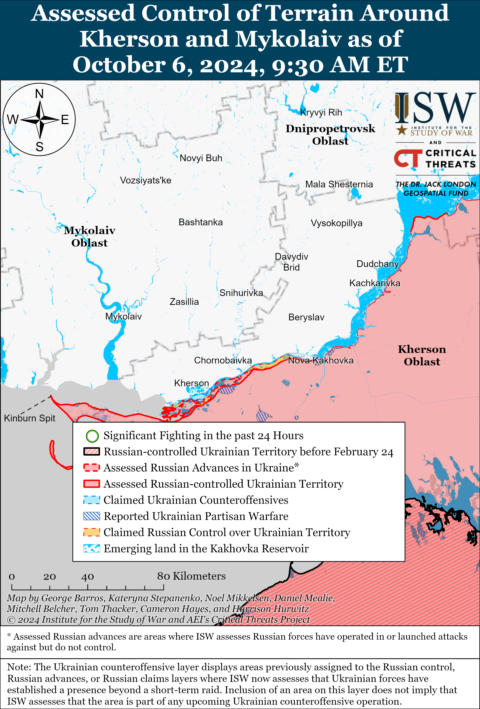

# Russian Offensive Campaign Assessment, October 6, 2024

**Angelica Evans, Davit Gasparyan, Nicole Wolkov, Riley Bailey, and George Barros**

**October 6, 2024, 10:45am ET**

**Click**[**here**](https://storymaps.arcgis.com/stories/36a7f6a6f5a9448496de641cf64bd375)**to see ISW’s interactive map of the Russian invasion of Ukraine. This map is updated daily alongside the static maps present in this report.**

**Click**[**here**](https://storymaps.arcgis.com/stories/83a2f24901c941d581c0c523ecd2619b)**to see ISW’s interactive map of Ukraine’s offensive in Kursk Oblast.**

**Click**[**here**](https://understandingwar.maps.arcgis.com/apps/instant/3dviewer/index.html?appid=1602762dbcde419bb957dea358449580)**to see ISW’s 3D control of terrain topographic map of Ukraine. Use of a computer (not a mobile device) is strongly recommended for using this data-heavy tool.**

**Click**[**here**](https://storymaps.arcgis.com/stories/733fe90805894bfc8562d90b106aa895)**to access ISW’s archive of interactive time-lapse maps of the Russian invasion of Ukraine. These maps complement the static control-of-terrain map that ISW produces daily by showing a dynamic frontline. ISW will update this time-lapse map archive monthly.**

**Note: The data cut-off for this product was 9:30 am ET on October 6. ISW will cover subsequent reports in the October 7 Russian Offensive Campaign Assessment.**

**Russian forces have reportedly lost at least five divisions’ worth of armored vehicles and tanks in Pokrovsk Raion since beginning their offensive operation to seize Avdiivka in October 2023 and during intensified Russian offensive operations in western Donetsk Oblast in Summer 2024.**An open-source X (formerly Twitter) user tracking visually confirmed Russian vehicle and equipment losses in Ukraine stated on October 4 that the user has confirmed that Russian forces have lost 1,830 pieces of heavy equipment in Pokrovsk Raion since October 9, 2023.[1] The X user stated that Russian forces have lost a total of 539 tanks (roughly a division and a half’s worth of Russian tanks) and 1,020 infantry fighting vehicles (roughly four to five mechanized infantry divisions’ worth of vehicles) during offensive operations in Pokrovsk Raion and specified that Ukrainian forces destroyed 381 of the 539 Russian tanks and 835 of the 1,020 armored vehicles. The X user noted that Russian forces have also lost 26 infantry mobility vehicles, 22 multiple launch rocket systems (MLRS), 11 towed artillery systems, and 92 unarmored trucks. The X user noted that he confirmed that Russian forces lost 25 tanks and 59 armored vehicles (roughly two battalions’ worth of mechanized equipment) in Pokrovsk Raion since September 6, 2024. Russian forces launched an intensified four-month-long offensive operation to seize Avdiivka in October 2023 and later continued assaults west of Avdiivka and west and southwest of Donetsk City in spring and summer 2024, and the user’s data should reflect Russian vehicle losses accrued during these offensive efforts.[2] The X user’s assessment based on visually confirmed vehicle losses is likely conservative given that not all Russian vehicle losses are visually documented. The actual number of Russian vehicle losses in the Pokrovsk area is likely higher than reported.

**The Russian military command may not be willing or able to accept the current scale and rate of vehicle loss in the coming months and years given the constraints in Russia’s defense industrial production, limits to Russia’s Soviet-era vehicle stockpiles, and the Russian military’s failure to achieve operationally significant territorial advances through mechanized maneuver.** Russian forces expended a significant number of armored vehicles during the first weeks of their offensive effort to seize Avdiivka in October 2023 and later limited their armored vehicle usage while fighting within Avdiivka’s administrative boundaries.[3] Russian forces appear to have limited their armored vehicle use in the area immediately west of Avdiivka in recent months, although Russian forces have simultaneously intensified their offensive operations west and southwest of Donetsk city and frequently conduct largely unsuccessful platoon- and company-sized mechanized assaults in the area.[4] Russian forces have conducted several battalion-sized mechanized assaults in western Donetsk Oblast since July 2024, the majority of which resulted in significant armored vehicle losses in exchange for marginal territorial advances.[5] The commander of a Ukrainian bridge operating in the Donetsk direction recently reported that Russian forces are losing up to 90 percent of the vehicles used in mechanized assaults in the Donetsk direction.[6] The British International Institute for Strategic Studies (IISS) think tank previously estimated that Russian forces were losing over 3,000 armored fighting vehicles annually as of February 2024, although Russia’s current rate of armored vehicle losses may be higher given that the*X*user’s data notably does not account for Russian equipment losses throughout the entire frontline.[7] Russian forces have only advanced about 40 km in the Avdiivka/Pokrovsk operational direction since October 2023 and a loss of over five divisions’ worth of equipment for such tactical gains is not sustainable indefinitely without a fundamental shift in Russia‘s capability to resource its war.

Russian forces have likely accumulated a large amount of equipment for these assaults, although the medium- to long-term constraints of Russia’s armored vehicle stocks and production rates alongside mounting equipment losses may force the Russian military to rethink the benefit of intensified mechanized activity in this sector over Russia’s longer-term war effort in Ukraine.[8] The Russian military command’s willingness to pursue limited tactical advances in exchange for significant armored vehicle losses will become increasingly costly as Russian forces burn through finite Soviet-era weapons and equipment stocks in the coming months and years.[9] Russia will likely struggle to adequately supply its units with materiel in the long term without transferring the Russian economy to a wartime footing and significantly increasing Russia’s defense industrial production rates — a move that Russian President Vladimir Putin has sought to avoid thus far.[10]

**Ukrainian officials continue to document and prosecute Russian war crimes committed against Ukrainian forces.**Kharkiv Oblast Prosecutor’s Office Head Oleksandr Filchakov announced on October 5 that his office has initiated a pre-trial investigation into the execution of four Ukrainian prisoners of war (POWs) ordered by Russian commanders at the Vovchansk aggregate plant in Summer 2024.[11] Filchakov noted that Russian POWs provided testimony about the executions during interrogations in Ukrainian detention. Filchakov suggested that Ukrainian forces might already have the perpetrator in custody, allowing for a fair trial and sentencing regarding the crime.

**Russian authorities reportedly arrested the administrator of the Russian Telegram channel *Thirteenth*, who has previously criticized the Kremlin and Russian Ministry of Defense (MoD), on October 5.**Russian milbloggers and Russian opposition media stated on October 5 that Russian police detained *Thirteenth*administrator Yegor Guzenko at a concert in Novopavlovsk, Stavropol Krai.[12] Russian sources speculated that Russian authorities may have arrested Guzenko due to his refusal to undergo drug tests or after an altercation with Russian police.[13] Several Russian sources claimed that Russian authorities placed Guzenko under house arrest in 2021 but that Guzenko later violated house arrest in March 2022, causing Russian authorities to place him on the Russian and international wanted list.[14] Guzenko has frequently criticized Russian authorities, and his arrest may be part of the ongoing Kremlin effort to crack down against critical voices within the Russian ultranationalist information space while encouraging a culture of self-censorship among the pro-war information space.[15] It is not yet clear whether Guzenko’s arrest is directly related to the Kremlin’s effort to exert control over the pro-war ultranationalist information space, however.

**Key Takeaways:**

- **Russian forces have reportedly lost at least five divisions’ worth of armored vehicles and tanks in Pokrovsk Raion since beginning their offensive operation to seize Avdiivka in October 2023 and during intensified Russian offensive operations in western Donetsk Oblast in Summer 2024.**
- **The Russian military command may not be willing or able to accept the current scale and rate of vehicle loss in the coming months and years given the constraints in Russia’s defense industrial production, limits to Russia’s Soviet-era vehicle stockpiles, and the Russian military’s failure to achieve operationally significant territorial advances through mechanized maneuver.**
- **Ukrainian officials continue to document and prosecute Russian war crimes committed against Ukrainian forces.**
- **Russian authorities reportedly arrested the administrator of the Russian Telegram channel Thirteenth, who has previously criticized the Kremlin and Russian Ministry of Defense (MoD), on October 5.**
- **Russian forces recently advanced southeast of Pokrovsk.**

***We do not report in detail on Russian war crimes because these activities are well-covered in Western media and do not directly affect the military operations we are assessing and forecasting. We will continue to evaluate and report on the effects of these criminal activities on the Ukrainian military and the Ukrainian population and specifically on combat in Ukrainian urban areas. We utterly condemn Russian violations of the laws of armed conflict and the Geneva Conventions and crimes against humanity even though we do not describe them in these reports.***

- Ukrainian Operations in the Russian Federation
- Russian Main Effort – Eastern Ukraine (comprised of three subordinate main efforts)
- Russian Subordinate Main Effort #1 – Push Ukrainian forces back from the international border with Belgorod Oblast and approach within tube artillery range of Kharkiv City
- Russian Subordinate Main Effort #2 – Capture the remainder of Luhansk Oblast and push westward into eastern Kharkiv Oblast and encircle northern Donetsk Oblast
- Russian Subordinate Main Effort #3 – Capture the entirety of Donetsk Oblast
- Russian Supporting Effort – Southern Axis
- Russian Air, Missile, and Drone Campaign
- Russian Mobilization and Force Generation Efforts
- Russian Technological Adaptations
- Activities in Russian-occupied areas
- Ukrainian Defense Industrial Base Efforts
- Russian Information Operations and Narratives
- Significant Activity in Belarus

**Ukrainian Operations in the Russian Federation**

Ukrainian forces reportedly continued assaults in Glushkovsky Raion west of the main Ukrainian salient in Kursk Oblast including south of Glushkovo near Novyi Put and Veseloye on October 5 and 6 but did not make confirmed advances.[16]

Russian forces reportedly continued assaults in Glushkovsky Raion west of the main Ukrainian salient in Kursk Oblast including near Novyi Put on October 6 but did not make confirmed advances.[17] A Russian milblogger claimed on October 6 that elements of the Russian 83rd Air Assault (VDV) Brigade are advancing near Veseloye (south of Glushkovo), but ISW has not observed visual confirmation of this claim.[18] Russian forces are also attacking southeast of Glushkovo near Medvezhye.[19]

Ukrainian forces continued offensive operations within the main Ukrainian salient in Kursk Oblast on October 6, but Ukrainian forces did not make any confirmed advances in the area. Ukrainian forces reportedly attacked near Lyubimovka (southeast of Korenevo) and Plekhovo (southeast of Sudzha).[20]

Russian forces recently advanced in the main Ukrainian salient in Kursk Oblast on October 6. Geolocated footage published on October 6 indicates that Russian forces recently advanced east of Kremyanoye and southeast of Zhuravli (both east of Korenevo).[21] A Russian milblogger claimed that Russian forces advanced near Plekhovo, but ISW has not observed visual confirmation of this claim.[22] Russian forces continued assaults southeast of Korenevo near Daryino and Nikolayevo-Darino and near Lyubimovka and Plekhovo.[23] Drone operators of the Russian “Smuglyanka” Detachment reportedly continue to operate near Kremyanoye (east of Korenevo).[24]

**Russian Main Effort – Eastern Ukraine**

**Russian Subordinate Main Effort #1 – Kharkiv Oblast (Russian objective: Push Ukrainian forces back from the international border with Belgorod Oblast and approach within tube artillery range of Kharkiv City)**

Russian forces continued offensive operations in northern Kharkiv Oblast on October 6 but did not make any confirmed advances. Russian forces attacked north of Kharkiv City near Lyptsi and Hlyboke and northeast of Kharkiv City near Vovchansk and Starytsya on October 5 and 6.[25] Ukraine’s Kharkiv Group of Forces reported that Russian forces are conducting individual personnel rotations near Hlyboke and are engineering positions near Lukyantsi (north of Kharkiv City).[26] The spokesperson of a Ukrainian brigade operating in the Kharkiv direction stated on October 6 that the Russian 7th Motorized Rifle Regiment (11th Army Corps [AC], Leningrad Military District [LMD]) is staffed mostly with convicts with little training, although they are equipped with sufficient technology, including electronic warfare (EW) systems.[27]

**Russian Subordinate Main Effort #2 – Luhansk Oblast (Russian objective: Capture the remainder of Luhansk Oblast and push westward into eastern Kharkiv Oblast and northern Donetsk Oblast)**

Russian forces continued offensive operations along the Kupyansk-Svatove-Kreminna line on October 6 but did not make any confirmed advances. A Russian milblogger claimed that Russian forces advanced to the southeastern outskirts of Hlushkivka and up to Kruhlyakivka (both southeast of Kupyansk), although ISW has not observed visual confirmation of these claims.[28] Russian forces continued assaults northeast of Kupyansk near Synkivka; east of Kupyansk near Kucherivka and Petropavlivka; southeast of Kupyansk near Kruhlyakivka, Kolisnykivka, Hlushkivka, Stepova Novoselivka, Novoosynove, Pishchane, and Lozova; west of Svatove in the direction of Borova; southwest of Svatove near Hrekivka, Makiivka, and Nevske; northwest of Kreminna near Novosadove; west of Kreminna near Torske; southwest of Kreminna near Dibrova; and south of Kreminna near Hryhorivka on October 5 and 6.[29] Elements of the Russian 12th Tank Regiment (4th Tank Division, 1st Guards Tank Army [GTA], Moscow Military District [MMD]) reportedly continue operating in the Kupyansk direction.[30] Elements of the Russian 144th Motorized Rifle Division (20th Combined Arms Army [CAA], MMD) reportedly continue operating near Novosadove, Terny, and Nevske.[31]

**Russian Subordinate Main Effort #3 – Donetsk Oblast (Russian objective: Capture the entirety of Donetsk Oblast, the claimed territory of Russia’s proxies in Donbas)**

Russian forces continued offensive operations northeast of Siversk near Bilohorivka and east of Siversk near Verkhnokamyanske on October 5 and 6, but there were no confirmed changes to the frontline in this area.[32]

Russian forces continued offensive operations near Chasiv Yar, north of Chasiv Yar near Kalynivka and Hryhorivka, and south of Chasiv Yar near Stupochky and Bila Hora on October 5 and 6.[33] Elements of the Russian 98th Airborne (VDV) Division reportedly continue to operate near Chasiv Yar.[34]

Russian forces continued offensive operations near Toretsk on October 6 but did not make any confirmed gains in the area. A Russian milblogger claimed on October 5 that Russian forces recently made marginal advances near the intersection of Rudnychna and Shakhtariv streets in central Toretsk, although ISW has not observed visual confirmation of this claim.[35] Russian forces continued offensive operations northeast of Toretsk near Dachne, near Toretsk itself, and southwest of Toretsk in the direction of Shcherbynivka on October 5 and 6.[36]

Russian forces recently advanced southeast of Pokrovsk and reportedly made further gains in the area as of October 6. Geolocated footage published on October 5 indicates that Russian forces recently advanced along a country road southwest of Novohrodivka (southeast of Pokrovsk).[37] Russian milbloggers claimed on October 5 and 6 that Russian forces operating southeast of Pokrovsk also advanced further west within Tsukuryne and seized the entire administrative boundaries of the settlement, although ISW has not observed confirmation of these claims.[38] Russian forces continued offensive operations east of Pokrovsk near Myrnohrad, Novotoretske, and Promin and southeast of Pokrovsk near Krutyi Yar, Lysivka, Selydove, Novohrodivka, Tsukuryne, Hirnyk, Novoselydivka, Izmailivka, and Zhelanne Druhe on October 5 and 6.[39] A Ukrainian officer operating in the Pokrovsk direction stated on October 5 that Russian forces have resumed using armored vehicles as a part of small reconnaissance-in-force attacks south of Selydove from Tsukuryne in the past week.[40] The officer stated that Russian forces are preparing to further use armored vehicles in the Pokrovsk direction and are intensifying artillery fire and first-person view (FPV) drone operations.[41] The officer added that Russian forces are conducting unspecified rotations and transferring reinforcements to the Selydove direction.[42]

Geolocated footage published on October 5 shows Ukrainian forces striking a reported Russian command post in Avdiivka.[43] The Ukrainian General Staff reported earlier on October 5 that the Ukrainian military recently conducted Storm Shadow missile and GMLRS strikes on military command posts of the 35th Motorized Rifle Brigade (41st CAA, CMD), 27th Motorized Rifle Brigade (2nd CAA, CMD), and the 2nd CAA – elements of which ISW has recently observed operating in the Pokrovsk direction.[44]

Russian forces continued offensive operations west of Donetsk City near Maksymilyanivka, Hostre, and Ostrivske on October 5 and 6 but did not make any confirmed advances.[45] A Russian milblogger claimed that Russian forces are close to seizing all of Ostrivske, although ISW has only observed confirmation of Russian forces operating on the eastern outskirts of the settlement.[46] Another Russian milblogger claimed on October 5 that Russian forces advanced up to 400 meters within Maksymilyanivka, but ISW has not observed confirmation of this claim.[47] The spokesperson for a Ukrainian brigade operating in the Kurakhove direction (west and southwest of Donetsk City) stated on October 5 that Russian forces generally accumulate personnel and armored vehicles for a week or two weeks to conduct intensified assaults against Ukrainian positions that last for a day or two.[48] The spokesperson stated that Russian forces have recently accumulated more personnel and armored vehicles in the Kurakhove direction but that the combat quality of Russian personnel in the area has declined in recent months.[49] The spokesperson added that elements of the Russian 255th Motorized Rifle Regiment (20th Motorized Rifle Division, 8th CAA, Southern Military District [SMD]) are operating in the Kurakhove direction.[50]

Russian forces continued offensive operations southwest of Donetsk City on October 6 but did not make any confirmed gains. Russian milbloggers claimed on October 5 and 6 that Russian forces continued to advance north of Vuhledar towards Bohoyavlenka, but ISW has not observed confirmation of these claims.[51] A Ukrainian brigade operating in the Kurakhove direction posted footage on October 6 showing Ukrainian forces recently repelling a roughly company-sized Russian mechanized assault near Kostyantynivka and reported that Ukrainian forces destroyed two tanks and six armored vehicles and damaged another tank.[52] Russian forces continued offensive operations near Katerynivka, Kostyantynivka, Antonivka, Vuhledar, Bohoyavlenka, and Zolota Nyva on October 5 and 6.[53] Elements of the Russian 39th Motorized Rifle Brigade (68th Army Corps [AC], Eastern Military District [EMD]) are reportedly operating near Katerynivka.[54] Donetsk Oblast occupation head Denis Pushilin awarded on October 5 service members of the 36th Motorized Rifle Brigade, 430th Motorized Rifle Regiment, and the 91st and 95th rifle regiments (29th CAA, EMD) for their participation in the seizure of Vuhledar.[55]

Russian sources speculated about the cause of the downing of a Russian S-70 heavy stealth fixed-wing drone near Kostyantynivka on October 5. Some Russian sources claimed that Russian forces accidentally downed the drone in a friendly fire accident, while other Russian sources claimed that Russian forces purposefully shot the drone down to prevent Ukrainian forces from acquiring the more advanced drone technology after Russian operators lost control of the S-70.[56] Select Russian milbloggers claimed that Russian forces later struck the crash site of the S-70 drone with an Iskander-M ballistic missile to prevent Ukrainian specialists from studying the drone, but ISW cannot independently verify these claims.[57]

The Ukrainian General Staff reported on October 6 that Russian forces conducted ground assaults in the Donetsk-Zaporizhia Oblast border area near Novodarivka and Poltavka (both southwest of Velyka Novosilka).[58]

**Russian Supporting Effort – Southern Axis (Russian objective: Maintain frontline positions and secure rear areas against Ukrainian strikes)**

Russian forces continued assaults in western Zaporizhia Oblast including north of Robotyne in the direction of Novodanylivka on October 5 and 6, but there were no confirmed changes to the frontline.[59] Ukrainian Tavriisk Group of Forces Spokesperson Colonel Vladyslav Voloshyn stated that Russian forces have recently conducted fewer assaults in the Zaporizhia direction but noted that fresh Russian assault groups are concentrating near Robotyne, likely in preparation to launch renewed assaults in the area in the coming days.[60] Voloshyn noted that Russian forces rarely use armored vehicles during assaults in southern Ukraine and are instead relying on small assault groups with unarmored, high-speed vehicles such as motorcycles, buggies, and all-terrain vehicles (ATVs) to quickly attack Ukrainian positions in the area while avoiding nearby minefields.[61] Elements of the Russian 4th Military Base (58th Combined Arms Army [CAA], Southern Military District [SMD]) are reportedly operating near Kamyanske (northwest of Robotyne).[62]

The Ukrainian General Staff reported on October 6 that Russian forces conducted two assaults in unspecified areas of the Kherson direction, likely referring to areas of east (left) bank Kherson Oblast.[63]

**Russian Air, Missile, and Drone Campaign (Russian Objective: Target Ukrainian military and civilian infrastructure in the rear and on the frontline)**

Russian forces conducted a large series of missile and drone strikes against Ukraine on the night of October 5 to 6. The Ukrainian Air Force reported that Russian forces launched one Kh-59/69 cruise missile, two Iskander-M ballistic missiles, an Iskander-K cruise missile, and 87 Shahed-136/131 drones from Primorsko-Akhtarsk, Krasnodar Krai and Oryol and Kursk oblasts.[64] The Ukrainian Air Force stated that Ukrainian forces downed two unspecified missiles and 56 Shahed-136/131 drones over Mykolaiv, Odesa, Kyiv, Cherkasy, Kirovohrad, Dnipropetrovsk, Sumy, Chernihiv, Poltava, Vinnytsia, Khmelnytskyi, Zaporizhia, Zhytomyr, and Kharkiv oblasts; 25 Shahed drones were “lost” due to Ukrainian electronic warfare (EW) interference; and that four Shahed drones remained in Ukrainian airspace as of the morning of October 6. Odesa Oblast Military Administration Head Oleh Kiper reported on October 6 that Russian forces targeted Odesa City with drones and ballistic missiles on the night of October 5 to 6, striking a trade equipment warehouse causing fire, causing a gas leak in an unspecified location, and damaging a civilian cargo ship.[65] Russian milbloggers claimed on October 5 and 6 that Russian forces struck an ammunition depot where Ukrainian forces stored long-range missiles, an oil depot, the Odesa Shkilnyi airfield, and port infrastructure in Odesa City.[66]

**Russian Mobilization and Force Generation Efforts (Russian objective: Expand combat power without conducting general mobilization)**

The Head of the Ukrainian Center for Countering Disinformation, Lieutenant Andriy Kovalenko, stated on October 5 that a small number of North Korean military personnel, mainly engineering personnel, are operating in occupied Donetsk Oblast and are repairing or somehow improving the quality of a large amount of the low-quality ammunition that North Korea provided to the Russian military for use in Ukraine.[67] Kovalenko stated that North Korean engineering personnel are helping Russian forces transport cargo, recording ammunition shortages, and monitoring the Russian military’s use of ammunition.

**Russian Technological Adaptations (Russian objective: Introduce technological innovations to optimize systems for use in Ukraine)**

Russian milbloggers amplified footage on October 5 purportedly showing Russian forces striking Ukrainian forces with the new “Prince Vandal Novogorodsky” kamikaze drone in Kursk Oblast.[68] The “Prince Vandal Novogorodsky” kamikaze drone is reportedly controlled via a fiber-optic cable, making it resistant to electronic warfare (EW) suppression at lower altitudes at the expense of the drone’s range.

**Ukrainian Defense Industrial Efforts (Ukrainian objective: Develop its defense industrial base to become more self-sufficient in cooperation with US, European, and international partners)**

*ISW is suspending coverage of Ukrainian defense industrial efforts until further notice.*

**Activities in Russian-occupied areas (Russian objective: Consolidate administrative control of annexed areas; forcibly integrate Ukrainian citizens into Russian sociocultural, economic, military, and governance systems)**

*ISW is not reporting on activities in Russian-occupied areas today.*

**Russian Information Operations and Narratives**

Nothing significant to report.

**Significant activity in Belarus (Russian efforts to increase its military presence in Belarus and further integrate Belarus into Russian-favorable frameworks and Wagner Group activity in Belarus)**

The Belarusian Ministry of Internal Affairs (MVD) reportedly detained a Belarusian civilian for posting footage of a falling Russian Shahed drone on the internet.[69] The Belarusian MVD stated on October 4 that it detained a resident of Kalinkovichi, Gomel Oblast for cooperating with ”extremist resources” by providing information, images, and footage to “destructive Telegram channels.”[70] This is the first instance that ISW has observed of Belarusian authorities detaining a civilian for publishing footage of Russian Shahed drones in Belarusian airspace.

**Note: ISW does not receive any classified material from any source, uses only publicly available information, and draws extensively on Russian, Ukrainian, and Western reporting and social media as well as commercially available satellite imagery and other geospatial data as the basis for these reports. References to all sources used are provided in the endnotes of each update.**

---

[1] https://x.com/naalsio26/status/1842341054428700784 ; https://docs.google.com/spreadsheets/d/1NKsPyUhtaVer8RBbUPOeyD5LL\_Clu77FyBxBBEOSPrg/edit?gid=1002650519#gid=1002650519

[2] https://isw.pub/UkrWar101223 ; https://isw.pub/UkrWar101023 ; https://isw.pub/UkrWar021624 ; https://isw.pub/UkrWar021724 ; https://understandingwar.org/backgrounder/russian-offensive-campaign-assessment-march-31-2024 ; https://isw.pub/UkrWar040524; https://isw.pub/UkrWar040324 ; https://understandingwar.org/backgrounder/russian-offensive-campaign-assessment-july-30-2024 ; https://understandingwar.org/backgrounder/russian-offensive-campaign-assessment-september-13-2024

[3] https://isw.pub/UkrWar102023 ; https://isw.pub/UkrWar122623

[4] https://isw.pub/UkrWar072524 ; https://isw.pub/UkrWar090524

[5] https://understandingwar.org/backgrounder/russian-offensive-campaign-assessment-september-13-2024; https://isw.pub/UkrWar072524 ; https://isw.pub/UkrWar073024 ;

[6] https://understandingwar.org/backgrounder/russian-offensive-campaign-assessment-september-13-2024

[7] https://isw.pub/UkrWar050824

[8] https://isw.pub/UkrWar100324 ; https://isw.pub/UkrWar092724 ; https://isw.pub/UkrWar091324 ; https://isw.pub/UkrWar090524 ; https://isw.pub/UkrWar091524

[9] https://isw.pub/UkrWar073024

[10] https://isw.pub/UkrWar050824 ; https://isw.pub/UkrWar040424; https://isw.pub/UkrWar020224

[11] https://armyinform.com dot ua/2024/10/05/okupanty-stratyly-chotyroh-ukrayinskyh-vijskovyh-u-vovchansku-prokuratura/; https://suspilne dot media/kharkiv/848439-rosiani-stratili-cotiroh-ukrainskih-vijskovih-na-agregatnomu-zavodi-u-vovcansku-vlitku-2024-roku-prokuratura/

[12] https://meduza dot io/news/2024/10/05/v-stavropolskom-krae-zaderzhali-z-blogera-egora-guzenko ; https://www.rbc dot ru/society/05/10/2024/67015ce99a7947878c39064b ; https://ura dot news/news/1052826018 ; https://t.me/Alekhin\_Telega/11805 ; https://t.me/dva\_majors/54447 ; https://t.me/akashevarova/7533

[13] https://meduza dot io/news/2024/10/05/v-stavropolskom-krae-zaderzhali-z-blogera-egora-guzenko ; https://t.me/istories\_media/7764 ;

[14] https://meduza dot io/news/2024/10/05/v-stavropolskom-krae-zaderzhali-z-blogera-egora-guzenko; https://www.rbc dot ru/politics/06/10/2024/67024c119a79472e1bf6734d ; https://t.me/dva\_majors/54447 ; https://t.me/bazabazon/31883 ; https://t.me/bazabazon/31885 ; https://t.me/bazabazon/31886 ; https://t.me/milinfolive/132166

[15] https://understandingwar.org/backgrounder/russian-offensive-campaign-assessment-october-1-2024 ; https://understandingwar.org/backgrounder/russian-offensive-campaign-assessment-september-14-2024 ; https://understandingwar.org/backgrounder/russian-offensive-campaign-assessment-september-8-2024 ; https://understandingwar.org/backgrounder/russian-offensive-campaign-assessment-july-21-2023 ; https://understandingwar.org/backgrounder/russian-offensive-campaign-assessment-august-7-2024 ; https://understandingwar.org/backgrounder/russian-offensive-campaign-assessment-april-20-2024

[16] https://t.me/RVvoenkor/78213 ; https://t.me/dva\_majors/54477 ; https://t.me/wargonzo/22482 ; https://t.me/mod\_russia/44207

[17] https://t.me/mod\_russia/44207

[18] https://t.me/rusich\_army/17531

[19] https://t.me/dva\_majors/54477

[20] https://t.me/rusich\_army/17531 ; https://t.me/dva\_majors/54477 ; https://t.me/mod\_russia/44207

[21] https://x.com/fGr6JW3waJ1FKMN/status/1842816157038129523; https://x.com/blinzka/status/1842862028186058993; https://x.com/blinzka/status/1842865998111613039; https://t.me/ombr41/841; https://t.me/creamy\_caprice/7027 ; https://x.com/fGr6JW3waJ1FKMN/status/1842816157038129523; https://x.com/blinzka/status/1842862028186058993; https://x.com/blinzka/status/1842865998111613039; https://t.me/ombr41/841

[22] https://t.me/dva\_majors/54477

[23] https://t.me/mod\_russia/44207

[24] https://t.me/dva\_majors/54474

[25] https://www.facebook.com/GeneralStaff.ua/posts/pfbid0x1nxR5BAqByuQZjR4utTNHP3UQW6KQp8GMArzPio7YWeJsA5WkuTnXHNRRGTqyWnl ; https://www.facebook.com/GeneralStaff.ua/posts/pfbid0s84iTJjb66qeYcHfDhdVTnPvFGFQSDk32NrmTz6RNhU494yqvj6CRgDHBnfv67apl ; https://t.me/otukharkiv/1865 ; https://t.me/wargonzo/22482

[26] https://t.me/otukharkiv/1865

[27] https://armyinform.com dot ua/2024/10/06/vorog-prokladaye-pidzemni-marshruty-ta-formuye-polk-iz-zekiv/

[28] https://t.me/motopatriot/28282 ; https://t.me/dva\_majors/54477 ; https://t.me/DnevnikDesantnika/16662

[29] https://www.facebook.com/GeneralStaff.ua/posts/pfbid0x1nxR5BAqByuQZjR4utTNHP3UQW6KQp8GMArzPio7YWeJsA5WkuTnXHNRRGTqyWnl ; https://www.facebook.com/GeneralStaff.ua/posts/pfbid0s84iTJjb66qeYcHfDhdVTnPvFGFQSDk32NrmTz6RNhU494yqvj6CRgDHBnfv67apl ; https://t.me/Sladkov\_plus/11519 ; https://t.me/RVvoenkor/78262 ; https://t.me/dva\_majors/54477 ; https://t.me/DnevnikDesantnika/16659

[30] https://t.me/voin\_dv/11173

[31] https://t.me/z\_arhiv/28421 ; https://t.me/vysokygovorit/17556

[32] https://www.facebook.com/GeneralStaff.ua/posts/pfbid0s84iTJjb66qeYcHfDhdVTnPvFGFQSDk32NrmTz6RNhU494yqvj6CRgDHBnfv67apl ; https://www.facebook.com/GeneralStaff.ua/posts/pfbid0x1nxR5BAqByuQZjR4utTNHP3UQW6KQp8GMArzPio7YWeJsA5WkuTnXHNRRGTqyWnl ; https://www.facebook.com/GeneralStaff.ua/posts/pfbid02EFjK75mL24VXgWsLoa1Ztj4ePx6ZqBAitkWzp5hUGz4v4DW7bLeDxZ7ALQvxApcml

[33] https://www.facebook.com/GeneralStaff.ua/posts/pfbid0x1nxR5BAqByuQZjR4utTNHP3UQW6KQp8GMArzPio7YWeJsA5WkuTnXHNRRGTqyWnl ; https://www.facebook.com/GeneralStaff.ua/posts/pfbid0s84iTJjb66qeYcHfDhdVTnPvFGFQSDk32NrmTz6RNhU494yqvj6CRgDHBnfv67apl ; https://www.facebook.com/GeneralStaff.ua/posts/pfbid02EFjK75mL24VXgWsLoa1Ztj4ePx6ZqBAitkWzp5hUGz4v4DW7bLeDxZ7ALQvxApcml

[34] https://t.me/voin\_dv/11181

[35] https://t.me/z\_arhiv/28424

[36] https://www.facebook.com/GeneralStaff.ua/posts/pfbid0x1nxR5BAqByuQZjR4utTNHP3UQW6KQp8GMArzPio7YWeJsA5WkuTnXHNRRGTqyWnl ; https://www.facebook.com/GeneralStaff.ua/posts/pfbid0s84iTJjb66qeYcHfDhdVTnPvFGFQSDk32NrmTz6RNhU494yqvj6CRgDHBnfv67apl ; https://www.facebook.com/GeneralStaff.ua/posts/pfbid02EFjK75mL24VXgWsLoa1Ztj4ePx6ZqBAitkWzp5hUGz4v4DW7bLeDxZ7ALQvxApcml

[37] https://t.me/creamy\_caprice/7020; https://t.me/shershni68/294

[38] https://t.me/z\_arhiv/28428 ; https://t.me/motopatriot/28289 ; https://t.me/boris\_rozhin/139794 ; https://t.me/boris\_rozhin/139794 ; https://t.me/boris\_rozhin/139781 ; https://t.me/dva\_majors/54477 ; https://t.me/DnevnikDesantnika/16656

[39] https://t.me/boris\_rozhin/139794 ; https://t.me/boris\_rozhin/139794 ; https://t.me/boris\_rozhin/139781 ; https://t.me/dva\_majors/54477 ; https://www.facebook.com/GeneralStaff.ua/posts/pfbid0s84iTJjb66qeYcHfDhdVTnPvFGFQSDk32NrmTz6RNhU494yqvj6CRgDHBnfv67apl ; https://www.facebook.com/GeneralStaff.ua/posts/pfbid0x1nxR5BAqByuQZjR4utTNHP3UQW6KQp8GMArzPio7YWeJsA5WkuTnXHNRRGTqyWnl ; https://www.facebook.com/GeneralStaff.ua/posts/pfbid02EFjK75mL24VXgWsLoa1Ztj4ePx6ZqBAitkWzp5hUGz4v4DW7bLeDxZ7ALQvxApcml

[40] https://armyinform.com dot ua/2024/10/05/na-pokrovskomu-napryamku-vorog-znovu-aktyvno-zastosovuye-bronetehniku-dlya-shturmiv/

[41] https://armyinform.com dot ua/2024/10/05/na-pokrovskomu-napryamku-vorog-znovu-aktyvno-zastosovuye-bronetehniku-dlya-shturmiv/

[42] https://armyinform.com dot ua/2024/10/05/na-pokrovskomu-napryamku-vorog-znovu-aktyvno-zastosovuye-bronetehniku-dlya-shturmiv/

[43] https://t.me/c/1433922609/7990154; https://x.com/666\_mancer/status/1842664423728492922

[44] https://www.facebook.com/GeneralStaff.ua/posts/pfbid02Y9mjECt4LBMS8ErSMxcwn7FMKK4ZGeG86FYFGTugBxYb5g9tG2wRmvabkpbKcQ6Yl ; https://understandingwar.org/backgrounder/russian-offensive-campaign-assessment-september-23-2024 ; https://understandingwar.org/backgrounder/russian-offensive-campaign-assessment-october-3-2024 ; https://understandingwar.org/backgrounder/russian-offensive-campaign-assessment-october-5-2024

[45] https://www.facebook.com/GeneralStaff.ua/posts/pfbid0x1nxR5BAqByuQZjR4utTNHP3UQW6KQp8GMArzPio7YWeJsA5WkuTnXHNRRGTqyWnl ; https://www.facebook.com/GeneralStaff.ua/posts/pfbid0s84iTJjb66qeYcHfDhdVTnPvFGFQSDk32NrmTz6RNhU494yqvj6CRgDHBnfv67apl ; https://t.me/dva\_majors/54477

[46] https://t.me/boris\_rozhin/139794 ; https://t.me/boris\_rozhin/139794

[47] https://t.me/RVvoenkor/78262

[48] https://armyinform.com dot ua/2024/10/05/u-sylah-oborony-rozpovily-pro-bezuspishni-ataky-voroga-na-kurahivskomu-napryamku/

[49] https://armyinform.com dot ua/2024/10/05/u-sylah-oborony-rozpovily-pro-bezuspishni-ataky-voroga-na-kurahivskomu-napryamku/

[50] https://armyinform.com dot ua/2024/10/05/u-sylah-oborony-rozpovily-pro-bezuspishni-ataky-voroga-na-kurahivskomu-napryamku/

[51] https://t.me/dva\_majors/54477 ; https://t.me/wargonzo/22482 ; https://t.me/boris\_rozhin/139741 ;

[52] https://t.me/odshbr79/392

[53] https://www.facebook.com/GeneralStaff.ua/posts/pfbid0x1nxR5BAqByuQZjR4utTNHP3UQW6KQp8GMArzPio7YWeJsA5WkuTnXHNRRGTqyWnl ; https://www.facebook.com/GeneralStaff.ua/posts/pfbid0s84iTJjb66qeYcHfDhdVTnPvFGFQSDk32NrmTz6RNhU494yqvj6CRgDHBnfv67apl ; https://t.me/boris\_rozhin/139794 ; https://t.me/dva\_majors/54477 ; https://t.me/wargonzo/22482 ; https://t.me/voenkorKotenok/59424 ; https://www.facebook.com/GeneralStaff.ua/posts/pfbid02EFjK75mL24VXgWsLoa1Ztj4ePx6ZqBAitkWzp5hUGz4v4DW7bLeDxZ7ALQvxApcml

[54] https://t.me/voin\_dv/11165

[55] https://t.me/PushilinDenis/5227

[56] https://t.me/motopatriot/28277 ; https://t.me/rybar/64147 ; https://t.me/milinfolive/132152 ; https://t.me/NeoficialniyBeZsonoV/40282 ; https://t.me/milinfolive/132152 ; https://t.me/milinfolive/132153 ; https://t.me/notes\_veterans/19868 ; https://t.me/dva\_majors/54439 ; https://t.me/dva\_majors/54446

[57] https://t.me/boris\_rozhin/139863 ; https://t.me/Mestb\_Dobroj\_Voli/12936

[58] https://www.facebook.com/GeneralStaff.ua/posts/pfbid02EFjK75mL24VXgWsLoa1Ztj4ePx6ZqBAitkWzp5hUGz4v4DW7bLeDxZ7ALQvxApcml

[59] https://www.facebook.com/GeneralStaff.ua/posts/pfbid0x1nxR5BAqByuQZjR4utTNHP3UQW6KQp8GMArzPio7YWeJsA5WkuTnXHNRRGTqyWnl ; https://www.facebook.com/GeneralStaff.ua/posts/pfbid0s84iTJjb66qeYcHfDhdVTnPvFGFQSDk32NrmTz6RNhU494yqvj6CRgDHBnfv67apl ; https://t.me/wargonzo/22482

[60] https://armyinform.com dot ua/2024/10/05/na-zaporizkomu-napryamku-zmenshylas-kilkist-shturmiv-ale-intensyvnist-udariv-ne-spadaye/ ; https://armyinform.com dot ua/2024/10/05/u-zsu-poyasnyly-zaczikavlenist-rosiyan-u-dvoh-naselenyh-punktah-pivdnya/

[61] https://armyinform.com dot ua/2024/10/05/vijskovi-rozpovily-yaku-taktyku-vykorystovuye-vorog-na-pivdni/

[62] https://t.me/dva\_majors/54480 ; https://t.me/dva\_majors/54485

[63] https://www.facebook.com/GeneralStaff.ua/posts/pfbid02EFjK75mL24VXgWsLoa1Ztj4ePx6ZqBAitkWzp5hUGz4v4DW7bLeDxZ7ALQvxApcml

[64] https://t.me/kpszsu/20705

[65] https://t.me/odeskaODA/6943 ; https://meduza dot io/news/2024/10/06/rossiya-atakovala-odesskuyu-oblast-dronami-i-raketami-pod-udar-popali-sklady-gazoprovod-i-suhogruz

[66] https://t.me/DnevnikDesantnika/16686; https://t.me/RVvoenkor/78249 ; https://t.me/milinfolive/132184; https://t.me/epoddubny/21257

[67] https://t.me/akovalenko1989/8030 ; https://mil.in dot ua/uk/news/na-donbasi-vijskovi-kndr-slidkuyut-za-peredanymy-boyeprypasamy-tspd-rnbo/

[68] https://t.me/dva\_majors/54466

[69] https://mil.in dot ua/uk/news/u-bilorusi-zatrymaly-zhinku-yaka-znyala-padinnya-shaheda/

[70] https://t.me/vvmvdrb/46518 ; https://mil.in dot ua/uk/news/u-bilorusi-zatrymaly-zhinku-yaka-znyala-padinnya-shaheda/
