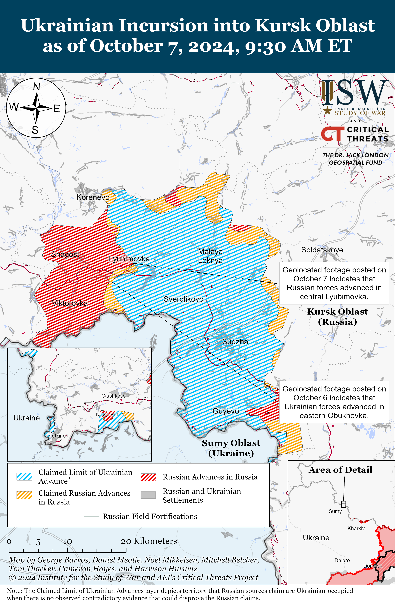
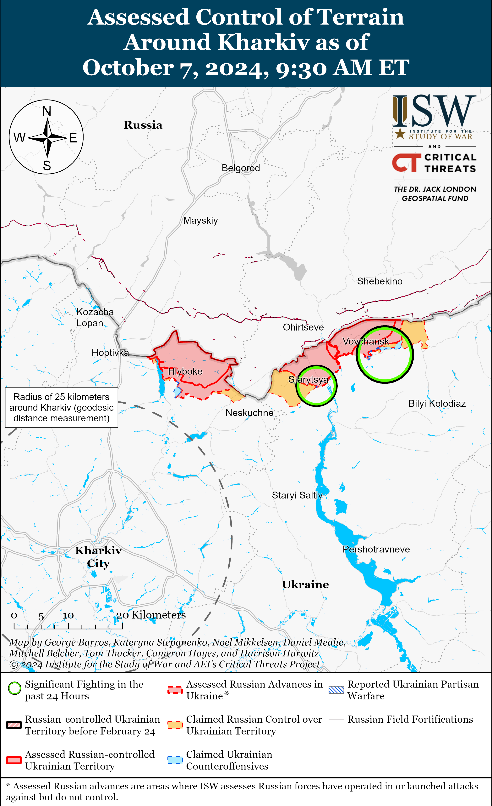
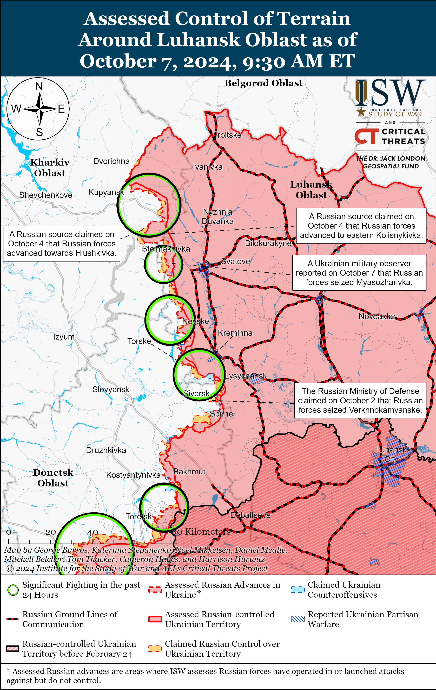
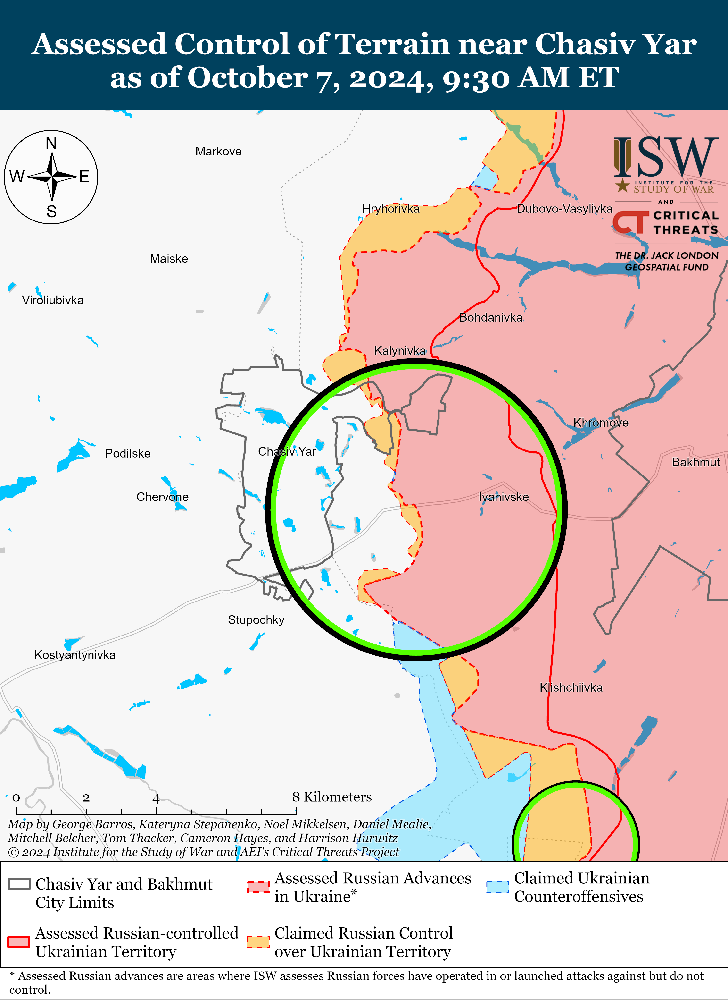
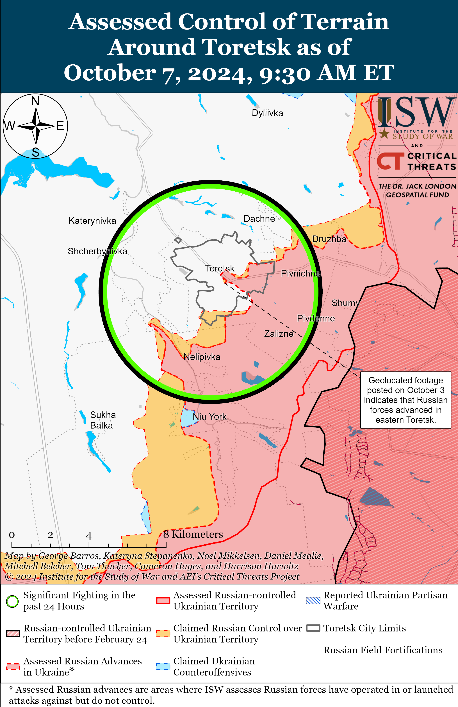
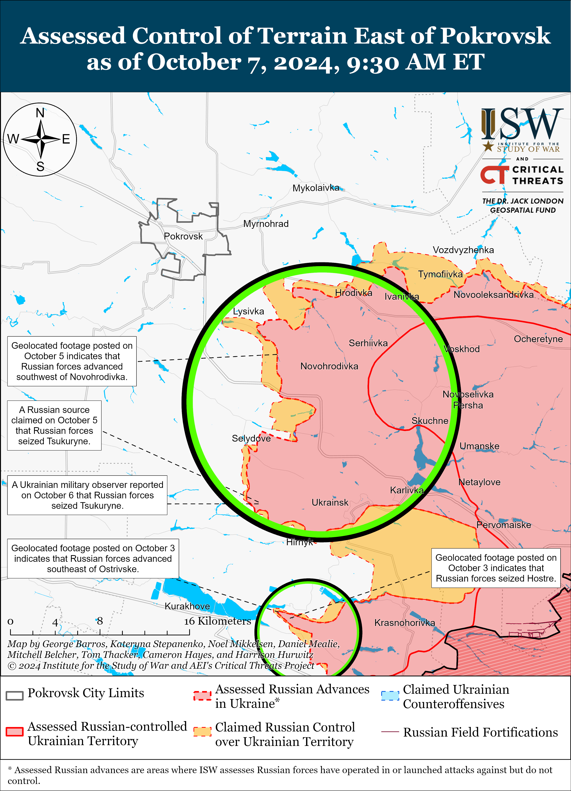
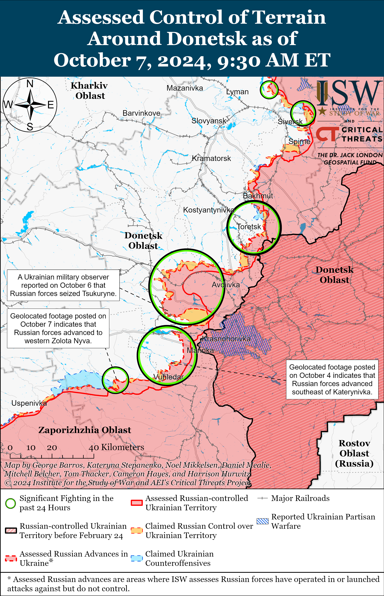
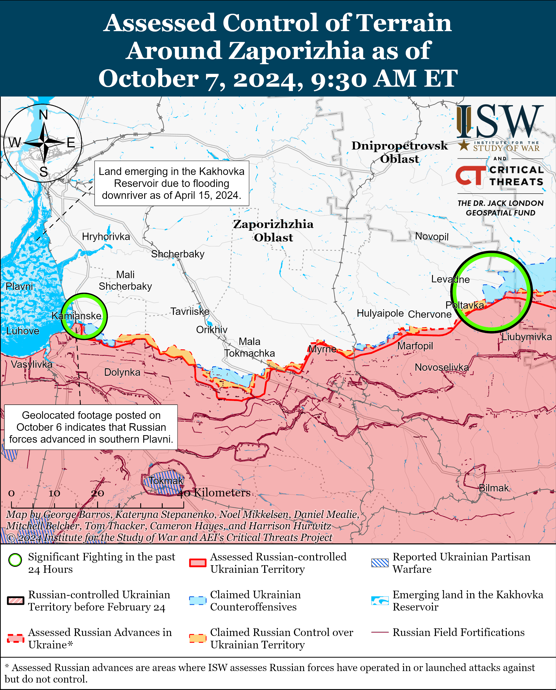
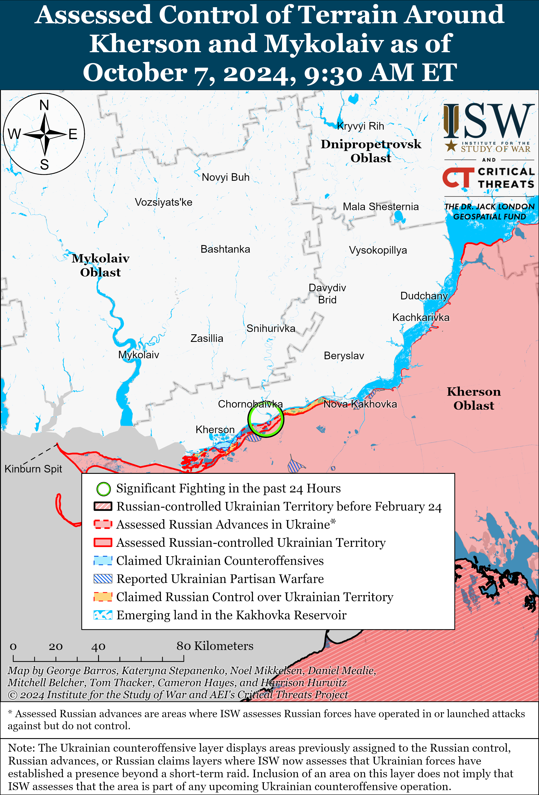

# Russian Offensive Campaign Assessment, October 7, 2024

**Angelica Evans, Nicole Wolkov, Grace Mappes, George Barros, and Frederick W. Kagan**

**October 7, 2024, 12pm ET**

**Click** [**here**](https://storymaps.arcgis.com/stories/36a7f6a6f5a9448496de641cf64bd375) **to see ISW’s interactive map of the Russian invasion of Ukraine. This map is updated daily alongside the static maps present in this report.**

**Click** [**here**](https://storymaps.arcgis.com/stories/83a2f24901c941d581c0c523ecd2619b) **to see ISW’s interactive map of Ukraine’s offensive in Kursk Oblast.**

**Click** [**here**](https://understandingwar.maps.arcgis.com/apps/instant/3dviewer/index.html?appid=1602762dbcde419bb957dea358449580) **to see ISW’s 3D control of terrain topographic map of Ukraine. Use of a computer (not a mobile device) is strongly recommended for using this data-heavy tool.**

**Click** [**here**](https://storymaps.arcgis.com/stories/733fe90805894bfc8562d90b106aa895) **to access ISW’s archive of interactive time-lapse maps of the Russian invasion of Ukraine. These maps complement the static control-of-terrain map that ISW produces daily by showing a dynamic frontline. ISW will update this time-lapse map archive monthly.**

**Note: The data cut-off for this product was 10:15am ET on October 7. ISW will cover subsequent reports in the October 9 Russian Offensive Campaign Assessment.**

**Note: ISW will not be publishing a Russian Offensive Campaign Assessment tomorrow, October 8. The ISW Russia and Geospatial teams will be participating in a wreath-laying ceremony honoring heroes of an earlier generation who gave their lives defending freedom and liberating others. Updates will resume on October 9.**

**Ukrainian forces struck an oil terminal in occupied Feodosia, Crimea on the night of October 6 to 7.** The Ukrainian General Staff reported on October 7 that Ukrainian forces struck an oil terminal in occupied Feodosia causing a fire near the facility and that Ukrainian authorities are clarifying the damage to the facility.[1] The Ukrainian General Staff also reported that Feodosia houses the largest oil terminal in occupied Crimea and that Russia uses this terminal to transport petroleum products to the Russian military. Feodosia occupation mayor Igor Tkachenko acknowledged the fire at the oil depot and claimed that it did not cause an oil spill.[2] A Crimea-focused source claimed that the Russian military had deployed a Pantsir-S1 air defense system to the area in June 2024 to protect the Feodosia oil terminal.[3] Footage published on October 7 shows a fire purportedly at the Feodosia oil terminal.[4]

**Ukrainian Verkhovna Rada Human Rights Commissioner Dmytro Lyubinets reported on October 7 that Ukrainian authorities are investigating another case of Russian forces’ unjust abuse and execution of Ukrainian prisoners of war (POWs).** Lyubinets reported that he sent letters to the United Nations (UN) and the International Committee of the Red Cross (ICRC) in response to recent aerial footage of Russian forces torturing and executing three unarmed Ukrainian POWs near Niu York, Donetsk Oblast.[5] Lyubinets noted that a Ukrainian brigade operating in the area published the footage on October 6 and highlighted that the highest levels of the Russian military command appear to be tolerating Russian war crimes in Ukraine. The Geneva Convention on POWs prohibits the “mutilation, cruel treatment, and torture” of POWs, as well as the execution of POWs or persons who are clearly rendered *hors de combat*.[6] Head of the Ukrainian Department for Combating Crimes in Conditions of Armed Conflict Yuri Bilousov stated on October 4 that Ukrainian sources documented evidence indicating that Russian forces have executed 93 Ukrainian prisoners of war (POW) on the battlefield since the start of the full-scale invasion and that 80 percent of the recorded cases occurred in 2024.[7] Bilousov noted on October 5 that these war crimes are systemic and that Russian authorities clearly condone these crimes. ISW has extensively reported on previous footage and reports of Russian servicemembers executing Ukrainian prisoners of war (POWs) and observed a wider trend of Russian abuses against Ukrainian POWs across various sectors of the front that appeared to be enabled, if not explicitly endorsed, by individual Russian commanders and unpunished by Russian field commanders.[8]

**Russian authorities announced an “unprecedented” cyberattack against Russian state media infrastructure on October 7.** The All-Russia State Television and Radio Broadcasting Company (VGTRK) reported that unspecified actors hacked VGTRK’s online services overnight in an “unprecedented” attack, and pro-Kremlin Russian news outlet *Gazeta* reported that the attack took down broadcasts of Russian state television channels *Rossiya-1, Rossiya-24, Rossiya Kultura, Karusel*, and roughly 80 regional television and radio companies.[9] *Gazeta* cited a source in the Russian information security field claiming that hacker group “sudo rm -RF,” which is allegedly linked to Ukraine, conducted the cyberattack.[10] (The group’s name refers to a Linux command to delete files.) Ukrainian news outlet *Suspilne,* citing its own sources, stated that “sudo rm -RF” has claimed responsibility and that VGTRK employees complained that the attack deleted all backup information.[11] The information security expert claimed to *Gazeta* that the hackers most likely used a type of encryption virus that deletes files rather than just encrypting them and warned that VGTRK will now have to close the vulnerability in addition to recovering backups of its systems.[12] VGTRK claimed that its systems did not suffer significant damage despite the attack and that its systems are operating normally.[13] Kremlin Spokesperson Dmitry Peskov expressed support for VGTRK and characterized the cyberattack as an attack on Russian critical infrastructure.[14]

**Key Takeaways:**

- **Ukrainian forces struck an oil terminal in occupied Feodosia, Crimea on the night of October 6 to 7.**
- **Ukrainian Verkhovna Rada Human Rights Commissioner Dmytro Lyubinets reported on October 7 that Ukrainian authorities are investigating another case of Russian forces’ unjust abuse and execution of Ukrainian prisoners of war (POWs).**
- **Russian authorities announced an “unprecedented” cyberattack against Russian state media infrastructure on October 7.**
- **Russian forces recently advanced in northern Kharkiv Oblast, in Donetsk Oblast, and in western Zaporizhia Oblast.**

***We do not report in detail on Russian war crimes because these activities are well-covered in Western media and do not directly affect the military operations we are assessing and forecasting. We will continue to evaluate and report on the effects of these criminal activities on the Ukrainian military and the Ukrainian population and specifically on combat in Ukrainian urban areas. We utterly condemn Russian violations of the laws of armed conflict and the Geneva Conventions and crimes against humanity even though we do not describe them in these reports.***

- Ukrainian Operations in the Russian Federation
- Russian Main Effort – Eastern Ukraine (comprised of three subordinate main efforts)
- Russian Subordinate Main Effort #1 – Push Ukrainian forces back from the international border with Belgorod Oblast and approach to within tube artillery range of Kharkiv City
- Russian Subordinate Main Effort #2 – Capture the remainder of Luhansk Oblast and push westward into eastern Kharkiv Oblast and encircle northern Donetsk Oblast
- Russian Subordinate Main Effort #3 – Capture the entirety of Donetsk Oblast
- Russian Supporting Effort – Southern Axis
- Russian Air, Missile, and Drone Campaign
- Russian Mobilization and Force Generation Efforts
- Russian Technological Adaptations
- Activities in Russian-occupied areas
- Ukrainian Defense Industrial Base Efforts
- Russian Information Operations and Narratives
- Significant Activity in Belarus

**Ukrainian Operations in the Russian Federation**

Ukrainian forces reportedly continued assaults in Glushkovsky Raion west of the main Ukrainian salient in Kursk Oblast including south of Glushkovo near Veseloye on October 6 and 7 but did not make any confirmed advances.[15] Elements of the Russian 83rd Airborne (VDV) Brigade and 56th VDV Regiment (7th VDV Division) reportedly continue operating in Glushkovsky Raion.[16]

Ukrainian forces recently advanced within the main Ukrainian salient in Kursk Oblast amid continued operations in the area on October 7. Geolocated footage published on October 6 indicates that Ukrainian forces advanced south of Obukhovka (south of Korenevo).[17] Ukrainian forces reportedly attacked south of Korenevo near Obukhovka; east of Korenevo near Kremyanoye; southeast of Korenevo near Lyubimovka and Plekhovo; and north of Sudzha near Kamyshevka on October 6 and 7.[18]

Russian forces recently advanced within the main Ukrainian salient in Kursk Oblast amid continued fighting in the area on October 7. Geolocated footage published on October 7 indicates that Russian forces advanced within Lyubimovka (southeast of Korenevo).[19] Russian sources also claimed that fighting reportedly continued south of Korenevo near Uspenivka and east of Korenevo near Kremyanoye.[20]

**Russian Main Effort – Eastern Ukraine**

**Russian Subordinate Main Effort #1 – Kharkiv Oblast** **(Russian objective: Push Ukrainian forces back from the international border with Belgorod Oblast and approach to within tube artillery range of Kharkiv City)**

Russian forces recently advanced in northern Kharkiv Oblast amid continued offensive operations in the area on October 7. Geolocated footage published on September 27 indicates that Russian forces advanced within central Vovchansk, although not likely within the past week.[21] Russian milbloggers claimed on October 7 that Russian forces seized the Vovchansk Aggregate Plant, although ISW has not observed visual confirmation of this claim.[22] Russian forces continued attacks northeast of Kharkiv City near Vovchansk, Tykhe, and Starytsya on October 6 and 7.[23] Ukrainian Kharkiv Group of Forces Spokesperson Colonel Vitaliy Sarantsev stated on October 7 that Russian forces have conducted attacks with a total of more than 100 armored personnel carriers (APCs) and a large number of personnel in Vovchansk within the past week.[24] Sarantsev also stated that Russian forces have increased tactical aviation and drone operations in the Kharkiv direction within the past week.[25]

**Russian Subordinate Main Effort #2 – Luhansk Oblast** **(Russian objective: Capture the remainder of Luhansk Oblast and push westward into eastern Kharkiv Oblast and northern Donetsk Oblast)**

Russian forces recently advanced west of Svatove amid continued offensive operations along the Kupyansk-Svatove-Kreminna line on October 7. A Ukrainian military observer stated that Russian forces seized Myasozharivka (west of Svatove).[26] A Russian milblogger claimed that Russian forces advanced east of Kolisnykivka and Kruhlyakivka (both southeast of Kupyansk), although ISW has not observed visual evidence of these claims.[27] Russian forces attacked northeast of Kupyansk near Synkivka; east of Kupyansk near Kucherivka; southeast of Kupyansk near Kruhlyakivka, Novoosynove, and Stepova Novoselivka; west of Svatove near Vyshneve; northwest of Kreminna near Druzhelyubivka, Novosadove, Nevske, and Hrekivka; west of Kreminna near Zarichne; south of Kreminna near the Serebryanske forest area; and southwest of Kreminna near Dibrova on October 6 and 7.[28] Ukraine’s Luhansk Group of Forces Spokesperson Anastasiya Bobovnikova stated that Russian forces are conducting roughly a dozen infantry assaults per day using three to four personnel in the Luhansk direction and only occasionally attempting to conduct mechanized assaults.[29]

**Russian Subordinate Main Effort #3 – Donetsk Oblast (Russian objective: Capture the entirety of Donetsk Oblast, the claimed territory of Russia’s proxies in Donbas)**

Russian forces continued assaults northeast of Siversk near Bilohorivka on October 6 and 7, but there were no confirmed changes to the frontline in the area.[30] Ukraine’s Luhansk Group of Forces Spokesperson Anastasiya Bobovnikova stated that Russian forces are conducting armored assaults in the Siversk direction.[31]

Russian forces continued offensive operations near Chasiv Yar itself and south of Chasiv Yar near Bila Hora and Stupochky on October 6 and 7, but there were no confirmed changes to the frontline in this area.[32] Bobovnikova stated that Russian forces are conducting small infantry assaults without armored equipment near Chasiv Yar.[33] Elements of the Russian 98th Airborne (VDV) Division are reportedly operating near Chasiv Yar.[34]

Russian forces continued offensive operations north of Toretsk near Dyliivka; near Toretsk itself; and south of Toretsk near Niu York, Nelipivka, and in the direction of Shcherbynivka on October 6 and 7, but there were no confirmed changes to the frontline.[35] Russian milbloggers claimed that Russian forces advanced along Rudnychna and Torhova streets in central Toretsk and are approaching the Tsentralna mine in central Toretsk, but ISW has not observed visual confirmation of these claims.[36]

Russian forces reportedly seized Tsukuryne (southeast of Pokrovsk) amid continued offensive operations east and southeast of Pokrovsk on October 6 and 7. Ukrainian military observers stated on October 6 that Russian forces pushed Ukrainian forces from the poultry farm in eastern Tsukuryne and seized the remainder of the settlement.[37] The Russian Ministry of Defense (MoD) claimed that Russian forces seized Hrodivka (east of Pokrovsk), and Russian Defense Minister Andrei Belousov credited elements of the 55th Motorized Rifle Brigade (41st Combined Arms Army [CAA], Central Military District [CMD]), 74th Motorized Rifle Brigade (41st CAA, CMD), 35th Motorized Rifle Brigade (41st CAA, CMD), and 201st Military Base (CMD) with seizing the settlement.[38] ISW has not observed visual confirmation of Russian forces operating in the northern or eastern areas of Hrodivka, however. Russian milbloggers claimed that Russian forces seized Zhelanne Druhe (southeast of Pokrovsk) and advanced east of Pokrovsk near Novohrodivka and Lysivka and southeast of Pokrovsk near Seldyove, Novoselydivka, Izmailivka, Hirnyk, and Nevske.[39] ISW has not observed confirmation of these claims, however. Russian forces also continued offensive operations east of Pokrovsk near Novotroitske, Promin, Novotoretske, Myrnohrad, Lysivka, and Krutyi Yar; south of Pokrovsk in the direction of Petrivka; and southeast of Pokrovsk near Novohrodivka, Mykolaivka, Seldyove, Novoselydivka, Hirnyk, Tsukuryne, and Zhelanne Druhe on October 6 and 7.[40]

Russian forces reportedly advanced west of Donetsk City amid continued offensive operations in the area on October 7. Ukrainian and Russian sources stated that Russian forces have seized half of Maksymilyanivka, indicating that Russian forces have likely advanced into the central part of the settlement.[41] A Kremlin-affiliated Russian milblogger claimed that Russian forces seized the western outskirts of Hostre and are advancing towards the Ostrivske railway line and north of Maksymilyanivka, although ISW has not observed visual confirmation of this claim.[42] Russian forces continued offensive operations west of Donetsk City near Hostre, Ostrivske, and Heorhiivka and from the direction of Oleksandrivka on October 6 and 7.[43] Elements of the Russian 33rd Motorized Rifle Regiment (20th Motorized Rifle Division, 8th CAA, Southern Military District [SMD]) are reportedly operating in the Kurakhove direction.[44]

Russian forces recently marginally advanced southwest of Donetsk City amid continued offensive operations in the area on October 7. Geolocated footage published on October 7 indicates that elements of the Russian 40th Naval Infantry Brigade (Pacific Fleet, Eastern Military District [EMD]) recently advanced into western Zolota Nyva during a reinforced platoon-sized mechanized assault.[45]  Russian milbloggers claimed that Russian forces are also advancing towards Bohoyavlenka (north of Vuhledar).[46] Russian forces continued offensive operations southwest of Donetsk City near Kostyantynivka, Bohoyavlenka, Zolota Nyva, and in the direction of Yasna Polyana on October 6 and 7.[47] Ukrainian military observer Kostyantyn Mashovets stated that elements of the Russian 39th Motorized Rifle Brigade (68th Army Corps [AC], EMD), 430th Motorized Rifle Regiment (likely a mobilized regiment), and a group of the Russian 18th Machine Gun Artillery Division (68th AC, EMD) participated in the seizure of Vuhledar.[48] A Russian milblogger claimed that Ukrainian forces counterattacked near Katerynivka.[49]

Russian and Ukrainian sources did not report on ground attacks in the Donetsk-Zaporizhia Oblast border area on October 7.

**Russian Supporting Effort – Southern Axis** **(Russian objective: Maintain frontline positions and secure rear areas against Ukrainian strikes)**

Russian sources reported that the operational tempo in the southern frontline near Kamyanske, Zaporizhia Oblast, is increasing after a protracted operational lull following the Summer 2023 Ukrainian counteroffensive. Geolocated footage published on October 6 indicates that Russian forces marginally advanced near Kamyanske and Plavni on the eastern shore of the Kakhovka Reservoir, reportedly between October 6 and 7.[50] Several Russian milbloggers claimed on October 6 that Russian forces counterattacked after Ukrainian forces unsuccessfully attempted to break through near Kamyanske and that Russian forces advanced to positions north of dried-up sections of the Kakhovka Reservoir immediately west of Kamyanske and entered the area west of Kamyanske.[51] Artillery elements of the Russian 4th Military Base (58th Combined Arms Army [CAA], Southern Military District [SMD]) reportedly repelled a Ukrainian attack near Kamyanske.[52] One Russian source claimed on October 7 that the Russian advance into northwestern Kamyanske occurred in early October, although most Russian sources claimed that the advance occurred on October 6 or 7.[53] One Russian source claimed that both Russian and Ukrainian forces are deploying reserves to the Kamyanske area, although ISW is unable to independently verify this claim.[54] The Russian advance remains tactical, and it remains unclear how operations may evolve in western Zaporizhia Oblast.

The Ukrainian General Staff reported that Russian forces also conducted ground attacks near Robotyne on October 7.[55] A Russian source claimed that elements of the Russian 4th Military Base (58th CAA, SMD) are disrupting Ukrainian forces’ Starlink systems in the Zaporizhia direction (likely with electronic warfare) and that Russian aviation continues striking Ukrainian forces near Orikhiv with FAB-1500 bombs.[56] Elements of the Russian 35th CAA (Eastern Military District [EMD]) reportedly continue operating near Polohy and Hulyaipole (both northeast of Robotyne) and elements of the Russian BARS-11 “Kuban” detachment (Russian Combat Army Reserve) reportedly continue operating in the Zaporizhia direction.[57]

The Ukrainian General Staff reported on October 6 and 7 that Ukrainian forces repelled Russian assaults in unspecified areas of the Kherson direction, likely referring to areas in east (left) bank Kherson Oblast.[58]

**Russian Air, Missile, and Drone Campaign** **(Russian Objective: Target Ukrainian military and civilian infrastructure in the rear and on the frontline)**

Russian force conducted another series of missile and drone strikes against Ukraine overnight on October 6 to 7 and on the morning of October 7. The Ukrainian Air Force reported that Russian forces launched more than 80 drones and missiles, including one Iskander-M ballistic missile, a Kh-59 cruise missile, and another missile of an unknown type from Belgorod and Kursk oblasts, and an unspecified number of strike drones, likely Shaheds, from Primorsko-Akhtarsk and Yeysk, Krasnodar Krai, Oryol Oblast, and Kursk Oblast overnight.[59] The Ukrainian Air Force reported that Russian forces also launched three Kh-47M2 Kinzhal ballistic missiles at Kyiv Oblast from airspace over Tambov Oblast on the morning of October 7. The Ukrainian Air Force reported that Ukrainian forces downed two Kinzhal missiles and 32 drones in Mykolaiv, Kyiv, Dnipropetrovsk, Sumy, Chernihiv, Poltava, and Kharkiv oblasts, and that likely Ukrainian electronic warfare (EW) interference caused another 37 Russian strike drones to become lost and fail to hit their targets. The Air Force reported that several Russian drones struck the frontline in Kharkiv Oblast and that one Kinzhal missile struck Starokostyantyniv Air Base in Dnipropetrovsk Oblast. Dnipropetrovsk Oblast Military Administration Head Serhiy Lysak stated that Russian forces also struck Pavlohrad overnight.[60] Kyiv City Military Administration Head Serhiy Popko stated that debris from the Kinzhal missiles damaged residential areas in Kyiv City and characterized the October 7 strike as the fourth Russian strike series against Kyiv since October 1.[61] Russian sources claimed that Russian forces hit a Ukrainian ammunition depot near the Pivdennyi Port, Odesa Oblast on October 6.[62]

**Russian Mobilization and Force Generation Efforts** **(Russian objective: Expand combat power without conducting general mobilization)**

The Kremlin reportedly aims to significantly increase the number of Russian military veterans of the war in Ukraine who hold prominent positions in Russian local and regional governments. Russian sources claimed on October 7 citing informed sources that Russian Presidential Administration Deputy Head Sergei Kiriyenko promised Russian President Vladimir Putin that at least 50 Russian veterans of the war in Ukraine will become mayors and regional governors through the “Time of Heroes” veteran reintegration program by 2026.[63]

Russian regional authorities continue to significantly increase one-time payments for Russian contract personnel to financially incentivize contract recruitment to support crypto-mobilization efforts. Belgorod Oblast Head Vyacheslav Gladkov announced on October 7 that one-time payments for Russian military volunteers and contract personnel will increase to three million rubles (about $31,103) through December 31, 2024.[64] Russian regional authorities have been significantly increasing these one-time payments to Russian contract personnel as the Kremlin continues to lean into its struggling voluntary recruitment effort to avoid a potential future wave of partial mobilization.[65]

**Russian Technological Adaptations** **(Russian objective: Introduce technological innovations to optimize systems for use in Ukraine)**

Nothing significant to report.

**Ukrainian Defense Industrial Efforts** **(Ukrainian objective: Develop its defense industrial base to become more self-sufficient in cooperation with US, European, and international partners)**

*ISW is suspending publishing coverage of Ukrainian defense industrial efforts until further notice.*

**Activities in Russian-occupied areas** **(Russian objective: Consolidate administrative control of annexed areas; forcibly integrate Ukrainian citizens into Russian sociocultural, economic, military, and governance systems)**

*ISW is not publishing reporting on activities in Russian-occupied areas today.*

**Russian Information Operations and Narratives**

Nothing significant to report.

**Significant activity in Belarus** **(Russian efforts to increase its military presence in Belarus and further integrate Belarus into Russian-favorable frameworks and Wagner Group activity in Belarus)**

Nothing significant to report.

**Note: ISW does not receive any classified material from any source, uses only publicly available information, and draws extensively on Russian, Ukrainian, and Western reporting and social media as well as commercially available satellite imagery and other geospatial data as the basis for these reports. References to all sources used are provided in the endnotes of each update.**

---

[1] https://www.facebook.com/GeneralStaff.ua/posts/pfbid0LagGEWDLcZyHPUA6E6AHaAHzeShQ49HP5C2cyUYNkkvM94bKdb8QpPnjjNf5b722l

[2] https://t.me/tass\_agency/277716 ; https://t.me/tass\_agency/277736 ; https://t.me/rk\_gov/22011

[3] https://t.me/Crimeanwind/68290; https://t.me/Crimeanwind/61670

[4] https://t.me/Crimeanwind/68285 ; https://t.me/Crimeanwind/68288 ; https://t.me/Crimeanwind/68273 ; https://t.me/vchkogpu/51532 ; https://t.me/vchkogpu/51522

[5] [Warning: Graphic Content] https://t.me/dmytro\_lubinetzs/6899; https://t.me/azov\_media/6129; https://armyinform dot com.ua/2024/10/06/chergovyj-voyennyj-zlochyn-okupantiv-rozstrilyaly-ukrayinskyh-vijskovyh-poblyzu-nyu-jorka/ ; https://t.me/ButusovPlus/14126

[6] https://www.ohchr.org/en/instruments-mechanisms/instruments/geneva-convention-relative-treatment-prisoners-war

[7] https://isw.pub/UkrWar100524

[8] https://isw.pub/UkrWar100624 ; https://isw.pub/UkrWar100124 ; https://isw.pub/UkrWar090624 ; https://understandingwar.org/backgrounder/russian-offensive-campaign-assessment-june-19-2024 ; https://isw.pub/UkrWar122823 ; https://understandingwar.org/backgrounder/russian-offensive-campaign-assessment-june-3-2024 ; https://isw.pub/UkrWar032724 ; https://isw.pub/UkrWar052924 ; https://isw.pub/UkrWar090424 ; https://understandingwar.org/backgrounder/russian-offensive-campaign-assessment-july-10-2024 ; https://isw.pub/UkrWar062324

[9] https://www.gazeta dot ru/tech/news/2024/10/07/24093961.shtml?updated; https://tass dot ru/ekonomika/22058215

[10] https://www.gazeta dot ru/tech/news/2024/10/07/24093961.shtml?updated

[11] https://suspilne dot media/852611-ukrainski-hakeri-vimknuli-ponad-20-rosijskih-telekanaliv-zokrema-rossiu-1-ta-rossiu-24-dzerela/

[12] https://www.gazeta dot ru/tech/news/2024/10/07/24093961.shtml?updated

[13] https://meduza dot io/news/2024/10/07/smi-soobschili-o-hakerskoy-atake-na-vgtrk-prervano-onlayn-veschanie-telekanalov-rossiya-1-i-rossiya-24; https://tass dot ru/ekonomika/22058215

[14] https://www.interfax dot ru/russia/985556

[15] https://t.me/rybar/64192 ; https://t.me/rusich\_army/17554 ; https://t.me/voenkorKotenok/59439

[16] https://t.me/DnevnikDesantnika/16733 ; https://t.me/RVvoenkor/78319

[17] https://t.me/frontline\_pvt/3181; https://x.com/moklasen/status/1843225901812826545; https://x.com/moklasen/status/1843226340176347302

[18] https://t.me/rusich\_army/17554 ; https://t.me/voenkorKotenok/59439 ; https://t.me/dva\_majors/54544 ; https://t.me/rybar/64192

[19] https://t.me/creamy\_caprice/7033; https://t.me/DeepStateUA/20469

[20] https://t.me/dva\_majors/54548

[21] https://t.me/murchikibest/111; https://x.com/GermanObserver1/status/1843091030494855225; https://x.com/GermanObserver1/status/1843091035158880399

[22] https://t.me/dva\_majors/54549 ; https://t.me/warriorofnorth/3159 ; https://t.me/sashakots/49391 ; https://t.me/s/milinfolive ; https://t.me/boris\_rozhin/139953

[23] https://www.facebook.com/GeneralStaff.ua/posts/pfbid0ifAd427wausNP6c2yki6rgUvUbQjZ9HBWaLhK2xnQ3X3qnQ633ApDKdmopaC5uLJl ; https://www.facebook.com/GeneralStaff.ua/posts/pfbid036Rk4kc59CMuoxD9maibZvAV4KeJdjwyRCf2MVFSr5c2Wrpf8FDtiQAKkLYAmMdX2l ; https://armyinform dot com.ua/2024/10/06/otu-harkiv-protyvnyk-aktyvno-zadiyuye-taktychnu-aviacziyu/ ; https://www.facebook.com/GeneralStaff.ua/posts/pfbid0ti8WTrtuDwc8fi8w3oH6AFs5gdJoDKFWKrKysgUCZtiztmhZv3mzmGr1xtCq4fZul

[24]  https://armyinform dot com.ua/2024/10/06/kilkist-zagyblyh-perevyshhyla-kilkist-poranenyh-v-otu-harkiv-poyasnyly-prychynu-velycheznyh-vtrat-voroga-u-vovchansku/ ; https://understandingwar.org/backgrounder/russian-offensive-campaign-assessment-september-24-2024

[25] https://armyinform dot com.ua/2024/10/06/otu-harkiv-protyvnyk-aktyvno-zadiyuye-taktychnu-aviacziyu/

[26] https://t.me/myro\_shnykov/6241

[27] https://t.me/motopatriot/28301

[28] https://www.facebook.com/GeneralStaff.ua/posts/pfbid036Rk4kc59CMuoxD9maibZvAV4KeJdjwyRCf2MVFSr5c2Wrpf8FDtiQAKkLYAmMdX2l ; https://www.facebook.com/GeneralStaff.ua/posts/pfbid0ifAd427wausNP6c2yki6rgUvUbQjZ9HBWaLhK2xnQ3X3qnQ633ApDKdmopaC5uLJl ; https://www.facebook.com/GeneralStaff.ua/posts/pfbid0ti8WTrtuDwc8fi8w3oH6AFs5gdJoDKFWKrKysgUCZtiztmhZv3mzmGr1xtCq4fZul

[29] https://armyinform.com dot ua/2024/10/06/motlohom-ta-myasom-na-shodi-rosiyany-bezperervno-shturmuyut-pihotoyu-ta-radyanskym-drantyam/

[30] https://www.facebook.com/GeneralStaff.ua/posts/pfbid0ifAd427wausNP6c2yki6rgUvUbQjZ9HBWaLhK2xnQ3X3qnQ633ApDKdmopaC5uLJl ; https://www.facebook.com/GeneralStaff.ua/posts/pfbid036Rk4kc59CMuoxD9maibZvAV4KeJdjwyRCf2MVFSr5c2Wrpf8FDtiQAKkLYAmMdX2l

[31] https://armyinform dot com.ua/2024/10/06/siversk-chasiv-yar-toreczk-nyu-jork-de-na-shodi-sytuacziya-najskladnisha/

[32] https://www.facebook.com/GeneralStaff.ua/posts/pfbid0ifAd427wausNP6c2yki6rgUvUbQjZ9HBWaLhK2xnQ3X3qnQ633ApDKdmopaC5uLJl ; https://www.facebook.com/GeneralStaff.ua/posts/pfbid036Rk4kc59CMuoxD9maibZvAV4KeJdjwyRCf2MVFSr5c2Wrpf8FDtiQAKkLYAmMdX2l ; https://www.facebook.com/GeneralStaff.ua/posts/pfbid0ti8WTrtuDwc8fi8w3oH6AFs5gdJoDKFWKrKysgUCZtiztmhZv3mzmGr1xtCq4fZul ; https://t.me/wargonzo/22491

[33] https://armyinform dot com.ua/2024/10/06/siversk-chasiv-yar-toreczk-nyu-jork-de-na-shodi-sytuacziya-najskladnisha/

[34] https://t.me/DnevnikDesantnika/16733

[35] https://www.facebook.com/GeneralStaff.ua/posts/pfbid0ifAd427wausNP6c2yki6rgUvUbQjZ9HBWaLhK2xnQ3X3qnQ633ApDKdmopaC5uLJl ; https://www.facebook.com/GeneralStaff.ua/posts/pfbid036Rk4kc59CMuoxD9maibZvAV4KeJdjwyRCf2MVFSr5c2Wrpf8FDtiQAKkLYAmMdX2l ; https://t.me/wargonzo/22491 ; https://armyinform dot com.ua/2024/10/06/siversk-chasiv-yar-toreczk-nyu-jork-de-na-shodi-sytuacziya-najskladnisha/ ; https://www.facebook.com/GeneralStaff.ua/posts/pfbid0ti8WTrtuDwc8fi8w3oH6AFs5gdJoDKFWKrKysgUCZtiztmhZv3mzmGr1xtCq4fZul

[36] https://t.me/dva\_majors/54544 ; https://t.me/DnevnikDesantnika/16717

[37] https://t.me/muchnoyairborne/10660 ; https://t.me/myro\_shnykov/6239

[38] https://t.me/mod\_russia/44241 ; https://t.me/mod\_russia/44242 ; https://t.me/brussinf/8418; https://t.me/epoddubny/21266; https://t.me/sashakots/49394 ; https://t.me/boris\_rozhin/139971

[39] https://t.me/z\_arhiv/28445 ; https://t.me/z\_arhiv/28445 ; https://t.me/rybar/64182 ; https://t.me/voenkorKotenok/59457

[40] https://www.facebook.com/GeneralStaff.ua/posts/pfbid0ifAd427wausNP6c2yki6rgUvUbQjZ9HBWaLhK2xnQ3X3qnQ633ApDKdmopaC5uLJl ; https://www.facebook.com/GeneralStaff.ua/posts/pfbid036Rk4kc59CMuoxD9maibZvAV4KeJdjwyRCf2MVFSr5c2Wrpf8FDtiQAKkLYAmMdX2l ; https://t.me/rybar/64182 ; https://t.me/dva\_majors/54579 ; https://www.facebook.com/GeneralStaff.ua/posts/pfbid0ti8WTrtuDwc8fi8w3oH6AFs5gdJoDKFWKrKysgUCZtiztmhZv3mzmGr1xtCq4fZul

[41] https://t.me/myro\_shnykov/6242 ; https://t.me/RVvoenkor/78332

[42] https://t.me/rybar/64182

[43] https://www.facebook.com/GeneralStaff.ua/posts/pfbid0ifAd427wausNP6c2yki6rgUvUbQjZ9HBWaLhK2xnQ3X3qnQ633ApDKdmopaC5uLJl ; https://www.facebook.com/GeneralStaff.ua/posts/pfbid036Rk4kc59CMuoxD9maibZvAV4KeJdjwyRCf2MVFSr5c2Wrpf8FDtiQAKkLYAmMdX2l ; https://t.me/boris\_rozhin/139891 ; https://t.me/voenkorKotenok/59442 ; https://www.facebook.com/GeneralStaff.ua/posts/pfbid0ti8WTrtuDwc8fi8w3oH6AFs5gdJoDKFWKrKysgUCZtiztmhZv3mzmGr1xtCq4fZul

[44] https://t.me/dva\_majors/54538

[45] https://t.me/dva\_majors/54559 ; https://t.me/sashakots/49393  ; https://t.me/epoddubny/21264 ; https://t.me/creamy\_caprice/7030?single

[46] https://t.me/dva\_majors/54544 ; https://t.me/DnevnikDesantnika/16736

[47] https://www.facebook.com/GeneralStaff.ua/posts/pfbid0ifAd427wausNP6c2yki6rgUvUbQjZ9HBWaLhK2xnQ3X3qnQ633ApDKdmopaC5uLJl ; https://www.facebook.com/GeneralStaff.ua/posts/pfbid036Rk4kc59CMuoxD9maibZvAV4KeJdjwyRCf2MVFSr5c2Wrpf8FDtiQAKkLYAmMdX2l ; https://t.me/dva\_majors/54544 ; https://www.facebook.com/GeneralStaff.ua/posts/pfbid0ti8WTrtuDwc8fi8w3oH6AFs5gdJoDKFWKrKysgUCZtiztmhZv3mzmGr1xtCq4fZul

[48] https://t.me/zvizdecmanhustu/2250 ; https://www.facebook.com/pashtetof/posts/pfbid037PDqDZUeoqQtKcSxC3boUMmtHpcR7LKFLq2R1ZVJMVvDTprvpz4jdVCu3tRoMHuol

[49] https://t.me/dva\_majors/54544

[50] https://t.me/creamy\_caprice/7028; https://t.me/dva\_majors/54533; https://t.me/RVvoenkor/78322; https://t.me/boris\_rozhin/139915

[51] https://t.me/vdv\_za\_chestnost\_a\_spavedlivost/4590; https://t.me/osetin20/9406; https://t.me/zovpobedy/13339 ; https://t.me/dva\_majors/54541; https://t.me/creamy\_caprice/7028; https://t.me/dva\_majors/54533; https://t.me/dva\_majors/54544; https://t.me/RVvoenkor/78322; https://t.me/boris\_rozhin/139915; https://t.me/dva\_majors/54551; https://t.me/yurasumy/18408 ; https://t.me/dva\_majors/54557; https://t.me/voenkorKotenok/59440; https://t.me/wargonzo/22491; https://t.me/z\_arhiv/28441

[52] https://t.me/RVvoenkor/78313

[53] https://t.me/yurasumy/18408 ; https://t.me/dva\_majors/54557

[54] https://t.me/yurasumy/18408 ; https://t.me/dva\_majors/54557

[55] https://www.facebook.com/GeneralStaff.ua/posts/pfbid0ti8WTrtuDwc8fi8w3oH6AFs5gdJoDKFWKrKysgUCZtiztmhZv3mzmGr1xtCq4fZul

[56] https://t.me/DnevnikDesantnika/16725

[57] https://t.me/voin\_dv/11195; https://t.me/voin\_dv/11201; https://t.me/wargonzo/22488

[58] https://www.facebook.com/GeneralStaff.ua/posts/pfbid036Rk4kc59CMuoxD9maibZvAV4KeJdjwyRCf2MVFSr5c2Wrpf8FDtiQAKkLYAmMdX2l ; https://www.facebook.com/GeneralStaff.ua/posts/pfbid0ifAd427wausNP6c2yki6rgUvUbQjZ9HBWaLhK2xnQ3X3qnQ633ApDKdmopaC5uLJl; https://www.facebook.com/GeneralStaff.ua/posts/pfbid0ti8WTrtuDwc8fi8w3oH6AFs5gdJoDKFWKrKysgUCZtiztmhZv3mzmGr1xtCq4fZul

[59] https://t.me/kpszsu/20793

[60] https://t.me/dnipropetrovskaODA/16597; https://armyinform dot com.ua/2024/10/07/raketnyj-udar-po-pavlogradu-okupanty-atakuvaly-misczeve-pidpryyemstvo/

[61] https://armyinform dot com.ua/2024/10/07/ataka-raketamy-kyndzhal-po-kyyevu-zafiksovano-padinnya-ulamkiv-u-troh-rajonah/; https://t.me/VA\_Kyiv/8475; https://armyinform dot com.ua/2024/10/07/nichna-ataka-droniv-na-kyyiv-rosiya-zastosuvala-pivtora-desyatka-bpla/; https://t.me/VA\_Kyiv/8465 ; https://suspilne dot media/852167-armia-rf-atakuvala-kiiv-bezpilotnikami-so-vidomo/

[62] https://t.me/sashakots/49382; https://t.me/mod\_russia/44210; https://t.me/vysokygovorit/17560;

[63] https://t.me/grajdaninmoldovi/40739; https://www.ostro dot org/ru/news/putynu-poobeshhaly-chto-bojtsy-svo-stanut-meramy-y-gubernatoramy-rossyjskyh-gorodov-i493598; https://t.me/DnevnikDesantnika/16740

[64] https://www.interfax-russia dot ru/center/news/zaklyuchivshim-kontrakt-dlya-uchastiya-v-svo-na-belgorodchine-vyplatyat-po-3-mln-rub; https://meduza dot io/news/2024/10/07/glava-belgorodskoy-oblasti-ob-yavil-o-edinovremennoy-vyplate-treh-millionov-rubley-za-podpisanie-kontrakta-na-sluzhbu-v-armii

[65] https://understandingwar.org/backgrounder/russian-offensive-campaign-assessment-october-5-2024; https://understandingwar.org/backgrounder/russian-offensive-campaign-assessment-august-20-2024; https://understandingwar.org/wp-content/uploads/2024/10/Russian20Offensive20Campaign20Assessment2C20September20152C20202420PDF.pdf
