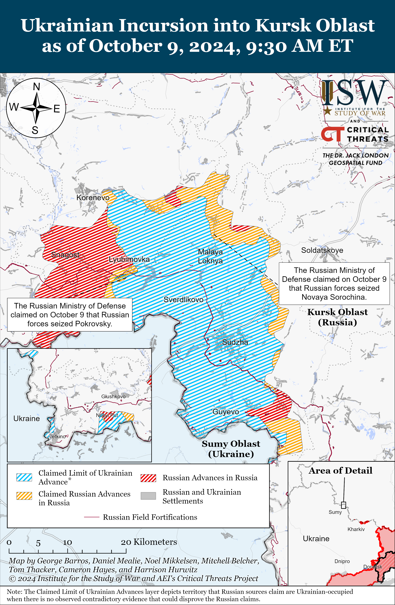
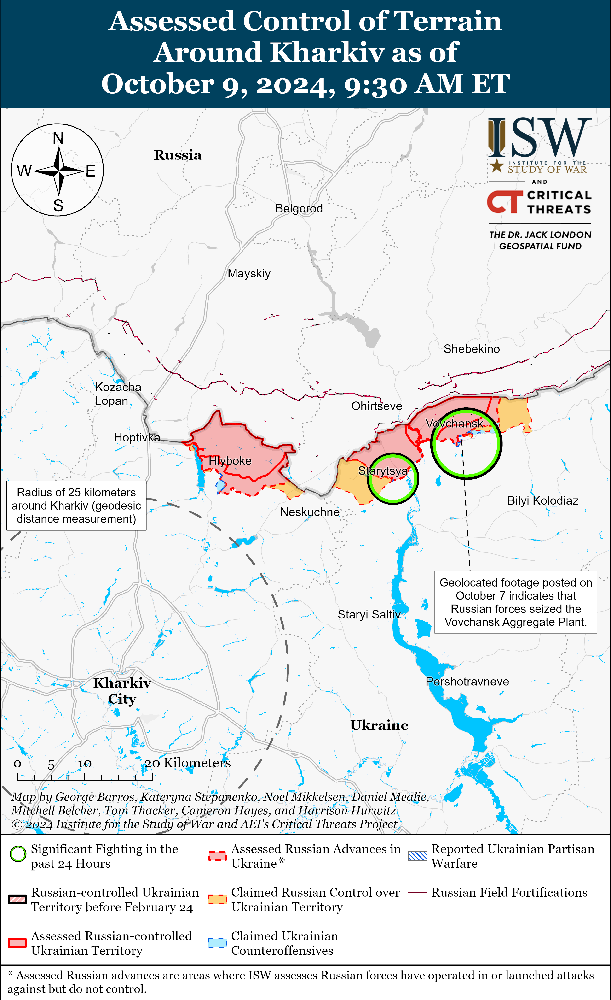
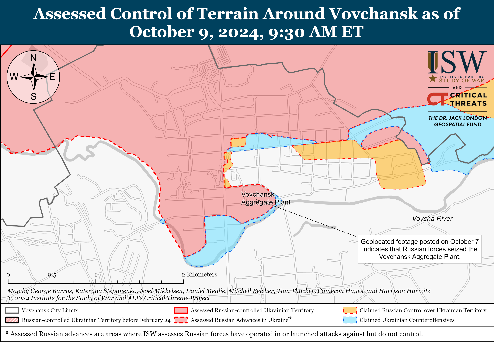
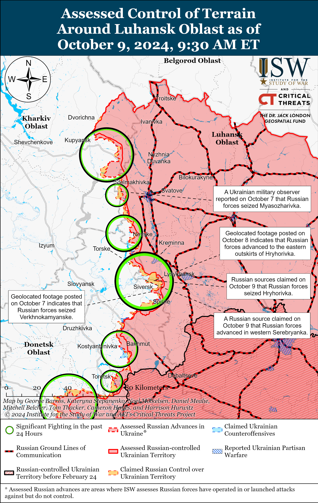
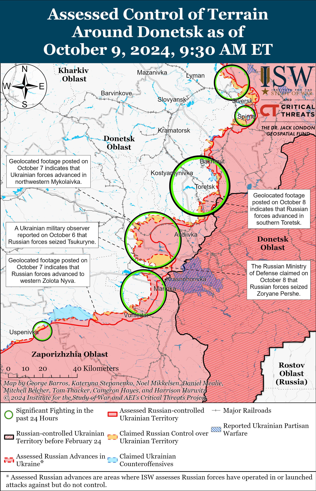
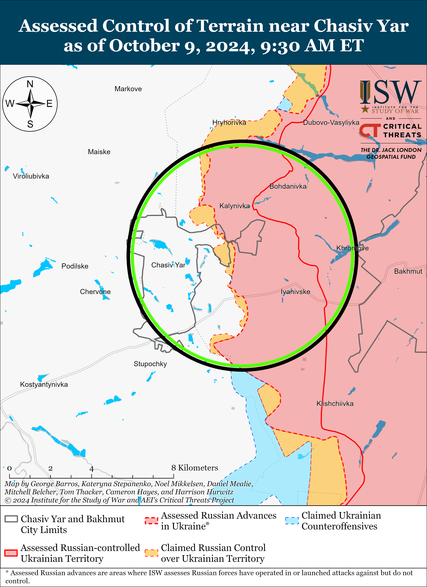
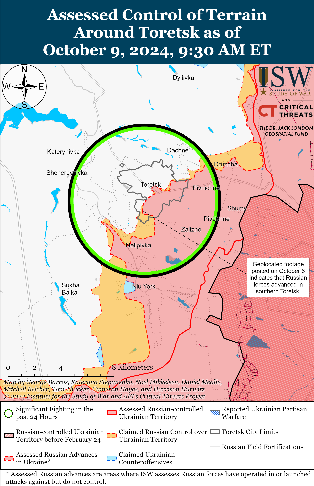
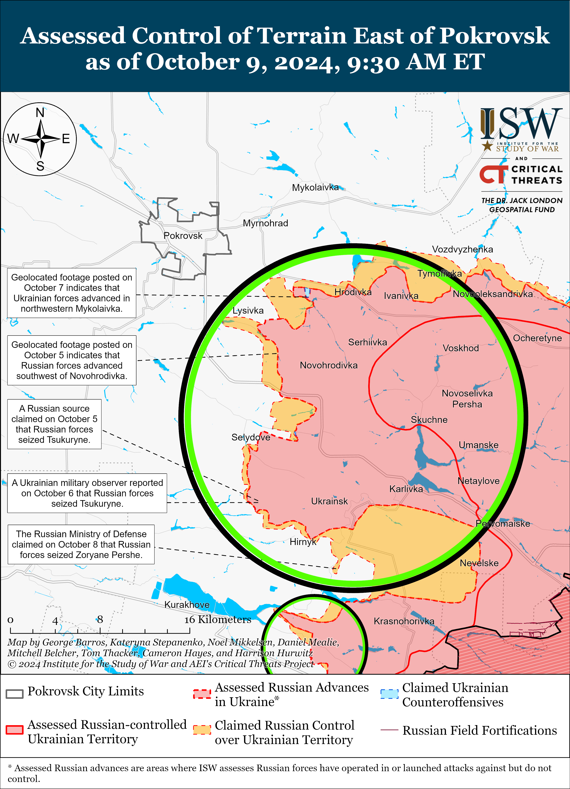
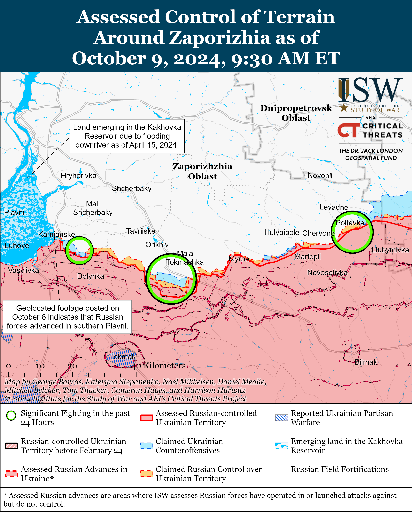
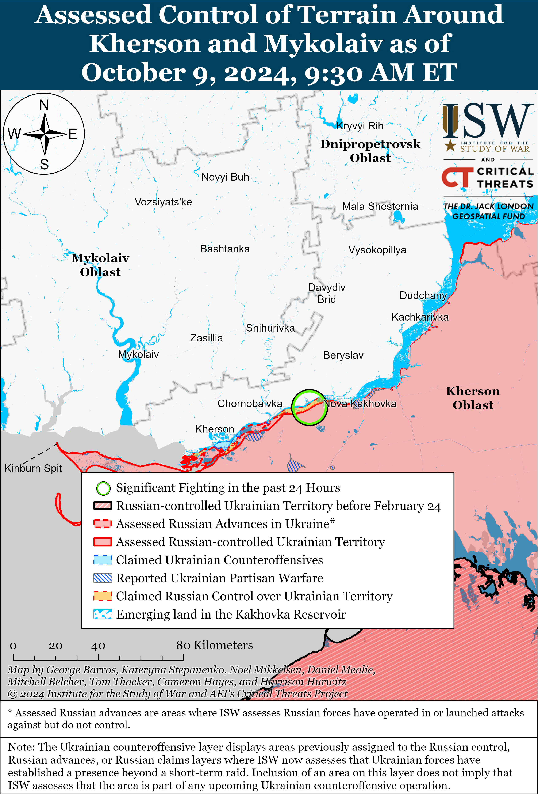

# Russian Offensive Campaign Assessment, October 9, 2024

**Riley Bailey, Grace Mappes, Nicole Wolkov, Davit Gasparyan, Angelica Evan**s **and George Barros**

**October 9, 2024, 12:15pm ET**

**Click** [**here**](https://storymaps.arcgis.com/stories/36a7f6a6f5a9448496de641cf64bd375) **to see ISW’s interactive map of the Russian invasion of Ukraine. This map is updated daily alongside the static maps present in this report.**

**Click** [**here**](https://storymaps.arcgis.com/stories/83a2f24901c941d581c0c523ecd2619b) **to see ISW’s interactive map of Ukraine’s offensive in Kursk Oblast.**

**Click** [**here**](https://understandingwar.maps.arcgis.com/apps/instant/3dviewer/index.html?appid=1602762dbcde419bb957dea358449580) **to see ISW’s 3D control of terrain topographic map of Ukraine. Use of a computer (not a mobile device) is strongly recommended for using this data-heavy tool.**

**Click** [**here**](https://storymaps.arcgis.com/stories/733fe90805894bfc8562d90b106aa895) **to access ISW’s archive of interactive time-lapse maps of the Russian invasion of Ukraine. These maps complement the static control-of-terrain map that ISW produces daily by showing a dynamic frontline. ISW will update this time-lapse map archive monthly.**

**Note: The data cut-off for this product was 10:20am ET on October 9 and covers both October 8 and 9 due to the fact that ISW did not publish a campaign assessment on October 8. ISW will cover subsequent reports in the October 10 Russian Offensive Campaign Assessment.**

**The Russian military command has likely ordered Russian forces to conduct a relatively high tempo of mechanized assaults in Ukraine to pursue significant tactical advances before muddy ground conditions in fall 2024 constrain mechanized maneuver. Poor weather conditions in fall 2024 and early winter 2024-2025 will likely complicate and constrain both mechanized and infantry maneuver, but Russian forces may seek to maintain their consistent offensive pressure in eastern Ukraine despite these difficulties.** Ukrainian National Guard Spokesperson Ruslan Muzychuk stated on October 8 that Russian forces are increasing their use of armored vehicles on the battlefield — specifically in the Kharkiv and Pokrovsk directions — in order to take advantage of dry road and terrain conditions before rainy seasonal weather causes muddy grounds conditions.[1] Russian forces have been conducting a high tempo of mechanized assaults in western Donetsk Oblast since late July 2024 and have conducted at least four observed battalion-sized mechanized assaults in eastern Ukraine since July 25, 2024.[2] Russian forces have also resumed relatively large mechanized assaults along the Kupyansk-Svatove-Kreminna line since late September 2024.[3] The Russian military command likely aims for intensified mechanized offensive activity to allow Russian forces to advance across open fields and consolidate in nearby frontline settlements that Russian forces can then use as a foothold for staging and launching offensive operations that seek to achieve operational objectives — such as the seizure of Kurakhove in western Donetsk Oblast or the seizure of Pokrovsk.[4] A Russian milblogger claimed on October 9 that muddy seasonal conditions have already started in Kursk Oblast and are constraining maneuver for wheeled vehicles.[5] ISW has not yet observed wide reporting that muddy terrain is constraining mechanized maneuver on any sector of the front in Kursk Oblast or in Ukraine, however.

Fall weather conditions will also likely constrain Russian infantry maneuver, and the Russian military command likely hopes that mechanized advances that Russian forces can achieve now will limit the number of open fields that Russian infantry will have to cross after weather conditions deteriorate. Russian forces have relied on small infantry groups to advance under the concealment of windbreaks in open fields from settlement to settlement, particularly in the Pokrovsk direction.[6] Fall weather will cause many windbreaks comprised of deciduous trees to lose most of their foliage and will provide less concealment for Russian infantry groups during fall 2024 and winter 2024-2025 — leaving Russian infantrymen more vulnerable to pervasive Ukrainian drone reconnaissance and tactical fires.

Russian forces will likely not cease offensive operations following the fall mud season, though adverse weather conditions will likely degrade Russian infantry effectiveness. Russian forces made a concerted effort to regain the theater-wide initiative during the period of the most difficult weather conditions for mechanized offensive operations in fall 2023, however, and may seek to retain the theater-wide initiative though consistent offensive pressure in fall 2024 under similar weather conditions.[7] Russian President Vladimir Putin and the Russian military command are pursuing a strategy that aims to prevent Ukraine from accumulating manpower and materiel to contest the theater-wide initiative by maintaining consistent offensive pressure on Ukrainian forces throughout the frontline and will likely continue to pursue this strategy despite seasonal constraints on mechanized and infantry maneuver.[8] Russian forces have exhausted many of the reserves that they established for their intensified Summer 2024 offensive operation that has heavily focused on advancing in Donetsk Oblast, and ISW continues to assess that the ongoing Russian offensive operation will likely culminate within the coming months.[9] Poor weather conditions that constrain battlefield maneuver will likely contribute to culmination, but the culmination of the Russian Summer 2024 offensive operation will not necessarily result in a complete end of consistent Russian offensive operations throughout eastern Ukraine in fall 2024 and early winter 2024-2025. Russian forces have an established pattern of fighting beyond their culmination points as well as fighting through adverse weather conditions.

**US European Command (EUCOM) Commander and NATO Supreme Allied Commander Europe (SACEUR) General Christopher Cavoli reportedly stated that the US is withholding several US weapon systems and other military communications networks from Ukraine that could support Ukraine’s war effort.** *CNN* reported on October 8, citing sources familiar with the situation, that Cavoli outlined a list of several US capabilities that could better support Ukraine’s war effort in a September 2024 report to the US Congress.[10] Another source familiar with the matter told *CNN* that that the list included the air-launched Joint Air-to-Surface Standoff Missile (JASSMs) cruise missile and the Link 16 system – a data sharing network that the US and other NATO countries use for communication and command and control (C2). *CNN* reported that Cavoli’s report does not explain why the US has not yet provided Ukraine with systems that the US assesses could aid Ukraine’s war effort. An unspecified source told *CNN* that the US has likely refrained from providing Ukraine with the Link 16 system over operational security concerns.

**South Korean Defense Minister Kim Yong-hyun stated on October 8 that a limited number of North Korean military personnel are likely operating near occupied Donetsk City.[11]** Kim stated that North Korea likely deployed several military personnel to Ukraine to support Russia’s war effort in response to a report that a Ukrainian missile strike near occupied Donetsk City killed several North Korean military officials on October 3.[12] Head of the Ukrainian Center for Countering Disinformation, Lieutenant Andriy Kovalenko, stated on October 5 that a small number of North Korean military personnel, mainly engineering personnel, are operating in occupied Donetsk Oblast and are repairing or somehow improving the quality of a large amount of low-quality ammunition that North Korea provided to the Russian military.[13]

**Russian illegal arms dealer and Ulyanovsk Oblast parliamentarian Viktor Bout reportedly helped broker a deal for Russia to sell arms worth $10 million to Yemen’s Houthi rebels in August 2024 amid increasing reports of potential Russian arms transfers to the Houthis and deepening Russo-Iranian cooperation.** The *Wall Street Journal* (*WSJ*) reported on October 7, citing a European security official and other sources familiar with the matter, that Bout assisted in negotiations for small arms sales worth $10 million when a Houthi delegation visited Moscow in August 2024.[14] The *WSJ’*s sources stated that the first two deliveries would consist of mostly AK-74 assault rifles and that the Houthis also discussed the potential transfer of Kornet antitank missiles and anti-air weapons. The sources stated that they were unsure whether Bout negotiated the deal on behalf of the Kremlin or just with the Kremlin’s tacit approval, and the *WSJ* noted that the transfer has not yet occurred and the source of the arms is still unclear.[15] The *WSJ* reported that these deliveries could begin as soon as October 2024 to Hodeidah Port under the guise of food supplies. Both Bout and Kremlin Spokesperson Dmitry Peskov denied the *WSJ* report.[16] Russia has reportedly been involved in Iranian-brokered “secret talks” to transfer Russian Yakhont (P-800 Oniks) anti-ship cruise missiles and other military equipment to the Houthis, but it is unclear whether these transfers have or will occur.[17] ISW continues to assess that Russia likely aims to leverage Iranian proxies to indirectly confront the West and shape Western decision making, particularly to deter the West from supporting Ukraine over fears of Russian escalation against the West, including escalating in a different theater.[18]

**Russia banned the partially-encrypted communications platform Discord on October 8, likely degrading some frontline Russian forces’ ad-hoc communications in the near term.** Russian federal censor Roskomnadzor announced on October 8 that it had banned Discord within Russia on October 8 following recent Russian fines against Discord for failing to comply with Russian censorship laws.[19] Some frontline Russian forces use Discord for coordinating operations, including combat drone operations, and this ban will likely impede some Russian military communications on the frontline in the near term.[20] The Kremlin has recently implemented several measures that have threatened frontline ad-hoc communication systems, including limiting the use of personal electronic devices on the frontline, and the Russian Ministry of Defense (MoD) has failed to establish a secure and effective official communications system for Russian forces to use instead.[21] Some Russian milbloggers responded to the Discord ban by reiterating complaints about the lack of adequate alternative communications systems for Russian forces on the frontline.[22] A Kremlin-affiliated milblogger complained that the Russian MoD has failed to address this issue for the past three years but claimed that Russian forces have been able to use other communications services to coordinate combat operations successfully.[23]

**Russian forces continue to use chemical weapons in Ukraine in a continued apparent violation of the Chemical Weapons Convention (CWC), to which Russia is a party.** The Ukrainian Support Forces Command reported on October 8 that Russian forces continue to use K-51 and RG-VO grenade launchers to launch munitions containing harmful but not necessarily lethal riot control agents (RCA), which are prohibited in combat by the CWC.[24] The Ukrainian Support Forces Command reported that there have been 250 cases of Russian forces using munitions containing unknown types of dangerous chemical agents in Ukraine in September 2024. The Ukrainian Support Forces Command reported that Russian chemical weapons use has been systematic since February 2023 and that as of September 24 Ukraine has recorded Russian forces using munitions equipped with chemical weapons 4,228 times. ISW has consistently reported on increasingly common instances of Russian forces using chemical substances in combat that are banned by the CWC.[25]

**Key Takeaways:**

- **The Russian military command has likely ordered Russian forces to conduct a relatively high tempo of mechanized assaults in Ukraine to pursue significant tactical advances before muddy ground conditions in fall 2024 constrain mechanized maneuver. Poor weather conditions in fall 2024 and early winter 2024-2025 will likely complicate and constrain both mechanized and infantry maneuver, but Russian forces may seek to maintain their consistent offensive pressure in eastern Ukraine despite these difficulties.**
- **US European Command (EUCOM) Commander and NATO Supreme Allied Commander Europe (SACEUR) General Christopher Cavoli reportedly stated that US is withholding several US weapon systems and other military communications networks from Ukraine that could support Ukraine’s war effort.**
- **South Korean Defense Minister Kim Yong-hyun stated on October 8 that a limited number of North Korean military personnel are likely operating near occupied Donetsk City.**
- **Russian illegal arms dealer and Ulyanovsk Oblast parliamentarian Viktor Bout reportedly helped broker a deal for Russia to sell arms worth $10 million to Yemen’s Houthi rebels in August 2024 amid increasing reports of potential Russian arms transfers to the Houthis and deepening Russo-Iranian cooperation.**
- **Russia banned partially-encrypted communications platform Discord on October 8, likely degrading some frontline Russian forces’ ad-hoc communications in the near term.**
- **Russian forces continue to use chemical weapons in Ukraine in a continued apparent violation of the Chemical Weapons Convention (CWC), to which Russia is a party.**
- **Russian forces recently advanced near Kreminna, Siversk, Toretsk, Pokrovsk, and Robotyne.**
- **Ukrainian Kharkiv Group of Forces Spokesperson Vitaliy Sarantsev stated on October 8 that Russian forces may have exhausted their preexisting stocks of aerial bombs for glide bomb strikes.**

***We do not report in detail on Russian war crimes because these activities are well-covered in Western media and do not directly affect the military operations we are assessing and forecasting. We will continue to evaluate and report on the effects of these criminal activities on the Ukrainian military and the Ukrainian population and specifically on combat in Ukrainian urban areas. We utterly condemn Russian violations of the laws of armed conflict and the Geneva Conventions and crimes against humanity even though we do not describe them in these reports.***

- Ukrainian Operations in the Russian Federation
- Russian Main Effort – Eastern Ukraine (comprised of three subordinate main efforts)
- Russian Subordinate Main Effort #1 – Push Ukrainian forces back from the international border with Belgorod Oblast and approach to within tube artillery range of Kharkiv City
- Russian Subordinate Main Effort #2 – Capture the remainder of Luhansk Oblast and push westward into eastern Kharkiv Oblast and encircle northern Donetsk Oblast
- Russian Subordinate Main Effort #3 – Capture the entirety of Donetsk Oblast
- Russian Supporting Effort – Southern Axis
- Russian Air, Missile, and Drone Campaign
- Russian Mobilization and Force Generation Efforts
- Russian Technological Adaptations
- Activities in Russian-occupied areas
- Ukrainian Defense Industrial Base Efforts
- Russian Information Operations and Narratives
- Significant Activity in Belarus

**Ukrainian Operations in the Russian Federation**

Ukrainian and Russian forces continued assaults in Glushkovsky Raion west of the main Ukrainian salient in Kursk Oblast on October 7, 8, and 9 but did not make any confirmed advances. Russian milbloggers claimed that Ukrainian forces conducted ground attacks near Veseloye (south of Glushkovo).[26] Russian sources, including the Russian Ministry of Defense (MoD), claimed that Russian forces conducted offensive operations near Novy Put on October 9.[27] Elements of the Russian 83rd Airborne (VDV) Brigade and 56th VDV Regiment (7th VDV Division) reportedly continue operating in Glushkovsky Raion.[28]

Ukrainian forces continued attacks in the main Ukrainian salient in Kursk Oblast on October 7, 8, and 9. Russian sources claimed that Ukrainian forces continued ground attacks east of Korenevo near Olgovka; southeast of Korenevo near Lyubimovka and Plekhovo; and northeast of Sudzha near Russkoye Porechnoye, Cherkasskoye Porechnoye, and Marynovka on October 7, 8, and 9.[29]

Russian forces reportedly recently advanced in the main Ukrainian salient in Kursk Oblast amid continued fighting in the area on October 7, 8, and 9. The Russian Ministry of Defense (MoD) claimed on October 9 that Russian forces seized Novaya Sorochina (north of Sudzha) and Pokrovsky (southeast of Korenevo).[30] Russian milbloggers also claimed that elements of the Russian 106th VDV Division have seized over half of Lyubimovka.[31] ISW has not observed visual confirmation of these claims, however. Russian forces reportedly attacked near Daryino (southeast of Korenevo), Lyubimovka, and Plekhovo.[32]

Ukraine’s Main Military Intelligence Directorate (GUR) reported on October 7 that it successfully disabled the Russian Baltic Fleet’s Alexandrit-class (Project 12700) *Alexander Obukhov* minesweeper while it was docked in Baltiysk, Kaliningrad Oblast.[33] The GUR reported that a successful operation created a hole in the *Alexander Obukhov’s* gas pipe causing water to seep into the engine and severely damaged it before the vessel’s scheduled sortie. The GUR noted that the Russian military is repairing the *Alexander Obukhov.*

Ukrainian military authorities reported on October 9 that Ukrainian forces struck a Russian missile and storage ammunition storage facility in Karachev, Bryansk Oblast.[34] Ukrainian military officials stated that the facility stores glide bombs, missile and artillery systems, and North Korean- and Iranian-provided weapons. Geolocated footage published on October 9 shows a fire and secondary detonations near Karachev.[35] The Russian MoD claimed that Russian forces downed 24 Ukrainian drones over Bryansk Oblast on the night of October 8 to 9.[36]

**Russian Main Effort – Eastern Ukraine**

**Russian Subordinate Main Effort #1 – Kharkiv Oblast** **(Russian objective: Push Ukrainian forces back from the international border with Belgorod Oblast and approach to within tube artillery range of Kharkiv City)**

Russian forces recently advanced within Vovchansk amid continued offensive operations in northern Kharkiv Oblast on October 7, 8, and 9. Geolocated footage published on October 7 showing a Russian soldier raising a Russian flag in a building at the Vovchansk Aggregate Plant indicates that Russian forces likely recaptured the plant.[37] Russian forces continued ground attacks northeast of Kharkiv City near Vovchansk and Starytsya on October 7, 8, and 9.[38] A Ukrainian officer operating in the Kharkiv direction stated on October 7 that Russian forces are building elongated trenches in deep ravines and relief streams that are harder to clear as well as interconnected tunnels.[39] Ukrainian Kharkiv Group of Forces Spokesperson Colonel Vitaly Sarantsev stated on October 8 that Russian forces have transferred special engineering units to the Kharkiv direction to build underground communication and logistics routes.[40] Sarantsev added that Russian aviation is intensifying glide bomb strikes in the Kharkiv direction and that Russian forces conduct three to four glide bomb strikes in the area per week.[41] Ukraine’s Kharkiv Group of Forces reported on October 8 that elements of the Russian 2nd Motorized Rifle Battalion of the 380th Motorized Rifle Regiment (47th Tank Division, 1st Guards Tank Army [GTA], Moscow Military District [MMD] are operating near Lukyantsi (northeast of Kharkiv City).[42]

**Russian Subordinate Main Effort #2 – Luhansk Oblast** **(Russian objective: Capture the remainder of Luhansk Oblast and push westward into eastern Kharkiv Oblast and northern Donetsk Oblast)**

Russian forces recently advanced northwest of Kreminna amid continued offensive operations along the Kupyansk-Svatove-Kreminna line on October 8 and 9. Geolocated footage published on October 7 indicates that Russian forces recently advanced southward along the O-131306 highway southeast of Makiivka (northwest of Kreminna).[43] Russian forces continued offensive operations northeast of Kupyansk near Synkivka; east of Kupyansk near Kucherivka; southeast of Kupyansk near Kruhlyakivka, Novoosynove, Stepova Novoselivka, and Lozova; west of Svatove near Vyshneve; southwest of Svatove near Novovodyane; northwest of Kreminna near Novosadove, Makiivka, Nevske, Druzhelyubivka, and Hrekivka; west of Kreminna near Torske; south of Kreminna near the Serebryanske forest area; and southwest of Kreminna near Dibrova on October 7, 8 and 9.[44]  Elements of the Russian ”Uday” drone detachment are reportedly operating in the Kupyansk direction.[45]

**Russian Subordinate Main Effort #3 – Donetsk Oblast (Russian objective: Capture the entirety of Donetsk Oblast, the claimed territory of Russia’s proxies in Donbas)**

Russian forces recently advanced near Siversk amid continued Russian offensive operations in the area on October 7, 8, and 9. Geolocated footage published on October 7 and 8 indicates that Russian forces recently advanced east of Hryhorivka (northeast of Siversk) and into western Verkhnokamyanske (east of Siversk), indicating that Russian forces have likely seized Verkhnokamyanske.[46] Russian milbloggers claimed that elements of the Russian 2nd Motorized Rifle Brigade (3rd Combined Arms Army [CAA], formerly 2nd Luhansk People’s Republic Army Corps [LNR AC] seized Hryhorivka and Serebryanka (north of Siversk) and that Russian forces also advanced north of Verkhnokamyanske and Sprine (southeast of Siversk).[47] ISW has not observed confirmation of these claims, however. Ukraine’s Luhansk Group of Forces Spokesperson Major Anastasya Bobovnikova stated on October 7 that Russian forces are using motorcycles and limited numbers of Soviet-era armored vehicles and tanks during assaults in the Siversk direction.[48] Russian forces continued assaults southeast of Siversk near Ivano-Darivka and Spirne on October 7, 8, and 9.[49]

Russian forces continued offensive operations near Chasiv Yar on October 7, 8, and 9, but there were no confirmed changes to the frontline in this area. Russian milbloggers claimed that Russian forces advanced further within Zhovtnevyi Microraion in Chasiv Yar itself, but ISW has not observed confirmation of this claim.[50] Russian forces continued assaults north of Chasiv Yar near Mynkivka and Kalynivka; in Chasiv Yar itself; and south of Chasiv Year near Stupochky, Bila Hora, and in the direction of Oleksandro-Shultyne on October 7, 8, and 9.[51] Drone operators of the Russian “Burevestnik” volunteer detachment (Russian Volunteer Corps) are reportedly operating near Chasiv Yar.[52]

Russian forces recently advanced in southern Toretsk amid continued offensive operations in the area on October 7, 8, and 9. Geolocated footage published on October 8 indicates that Russian forces recently advanced along Heroiv Pratsi Street in eastern Toretsk and along Peremohy and Konstytutsyi streets in southern Toretsk.[53] Bobovnikova stated on October 7 that Russian forces have entered the eastern outskirts of Toretsk and advanced along Tsentralna Street in the direction of the Tsentralna Mine.[54] Bobovnikova stated that Russian forces are attacking in small squad-sized groups of three-to-five personnel in the area and noted that unspecified Russian Spetsnaz forces (Special Forces of the Main Directorate of the General Staff of the Russian Armed Forces [GRU]) are operating within Toretsk.[55] Ukrainian National Guard Spokesperson Ruslan Muzychuk stated on October 8 that Russian forces are occasionally using armored vehicles during assaults near Toretsk and are focusing on advancing into Toretsk from Niu York and Nelipivka (both south of Toretsk).[56] Russian milbloggers claimed that Russian forces advanced further within central Toretsk and up to the Tsentralna Mine, but ISW has not observed confirmation of these claims.[57] Russian forces continued offensive operations north of Toretsk near Dyliivka; near Toretsk itself; and south of Toretsk near Shcherbynivka, Nelipivka, Niu York, and Sukha Balka on October 7, 8, and 9.[58]

Ukrainian forces recently advanced during a counterattack east of Pokrovsk and Russian forces recently advanced southeast of Pokrovsk. Geolocated footage published on October 8 indicates that Ukrainian forces recently advanced into northwestern Mykolaivka (east of Pokrovsk and west of Hrodivka).[59] Geolocated footage published on October 8 indicates that Russian forces advanced north of Novohrodivka (southeast of Pokrovsk) and marginally advanced in central Zhelanne Pershe (southeast of Pokrovsk).[60] The Russian Ministry of Defense (MoD) claimed on October 8 that Russian forces seized Zoryane Pershe (likely referring to the satellite community of Zoryane), but ISW has not observed confirmation of this claim.[61] Russian milbloggers claimed that Russian forces operating southeast of Pokrovsk also advanced west of Novohrodivka, west of Tsukuryne, south of Zhelanne Druhe, and west of Nevelske.[62] ISW has not observed visual confirmation of these claims, however. Muzychuk stated on October 9 that Russian sabotage and reconnaissance groups are demining positions, conducting reconnaissance, and setting up observation posts near Selydove in preparation for future Russian assaults against the settlement.[63] Russian forces continued assaults east of Pokrovsk near Novotoretske, Myrolyubivka, Promin, Mykolaivka, Krutyi Yar, Sukhyi Yar, and Lysivka and southeast of Pokrovsk near Novohrodivka, Mykolaivka, Selydove, Kalynove, Novoselydivka, Tsukuryne, and Hirnyk on October 7, 8, and 9.[64]

Russian forces continued offensive operations west of Donetsk City near Maksymilyanivka, Heorhiivka, Hostre, Kurakhivka, and Kurakhove  on October 7, 8, and 9.[65] A Ukrainian brigade operating in the Kurakhove direction (west and southwest of Donetsk City) posted footage on October 8 showing Ukrainian forces repelling a company-sized Russian mechanized assault in an unspecified area of this direction and reported that Ukrainian forces damaged four armored vehicles.[66] Elements of the Russian 14th Spetsnaz Brigade (GRU) are reportedly operating in the southern Donetsk direction (west and southwest of Donetsk City).[67]

Russian forces continued offensive operations southwest of Donetsk City on October 9 and reportedly recently advanced. Russian sources, including the Russian MoD, claimed that elements of the 5th Tank Brigade (36th CAA, Eastern Military District [EMD]) seized Zolota Nyva on October 8 and consolidated a foothold within the settlement as of October 9.[68] A Russian milblogger claimed on October 8 that Russian forces advanced immediately north of Vuhledar.[69] ISW has not observed visual confirmation of these claims, however. Russian forces continued offensive operations near Kostyantynivka, Katerynivka, Antonivka, Vodyane, Vuhledar, Bohoyavlenka, and Zolota Nyva on October 7, 8, and 9.[70] Elements of the 36th Motorized Rifle Brigade (29 CAA, EMD) are reportedly operating near Vuhledar and Bohoyavlenka.[71]

Russian and Ukrainian sources did not report any fighting in the Donetsk-Zaporizhia Oblast border area on October 7, 8, and 9.

**Russian Supporting Effort – Southern Axis** **(Russian objective: Maintain frontline positions and secure rear areas against Ukrainian strikes)**

Russian forces recently marginally advanced south of Stepnohirsk amid continued assaults in western Zaporizhia Oblast on October 7, 8, and 9. Geolocated footage published on October 8 indicates that Russian forces recently marginally advanced in southwestern Kamyanske (south of Stepnohirsk).[72] Russian milbloggers noted that Russian forces maintain positions in Kamyanske and claimed that Russian forces are advancing further into central Kamyanske.[73] A Russian milblogger claimed that drone operators of the Russian 49th Special Airborne Brigade (a newly formed brigade that is reportedly subordinated to the 58th CAA) supported the recent Russian assault into Kamyanske.[74] Russian forces also attacked near Robotyne and northwest of Robotyne in the direction of Novodanylivka on October 8 and 9.[75] Elements of the Russian 22nd Spetsnaz Brigade (Russian General Staff Main Directorate [GRU]) are reportedly operating near Kamyanske and artillery units of the Russian 503rd Motorized Rifle Regiment (19th Motorized Rifle Division, 58th Combined Arms Army [CAA], Southern Military District [SMD]) are reportedly operating in the Zaporizhia direction.[76]

Russian forces continued assaults in the Kherson direction on October 7, 8, and 9, but there were no confirmed changes to the frontline in this direction.[77] A Russian milblogger amplified claims that Russian Airborne (VDV) forces do not have enough boats or proper training to conduct successful assaults onto the islands in the Dnipro River.[78] Elements of the Russian BARS-33 Detachment (Russian Combat Army Reserve) are reportedly operating in the Kherson direction.[79]

**Russian Air, Missile, and Drone Campaign** **(Russian Objective: Target Ukrainian military and civilian infrastructure in the rear and on the frontline)**

Russian forces conducted a series of missile and drone strikes against Ukraine on the night of October 8 and 9. The Ukrainian Air Force reported on October 9 that Russian forces launched three Iskander M/KH-23 ballistic missiles from Kursk Oblast and 22 unspecified drones from Primorsko-Akhtarsk, Krasnodar Krai and occupied Cape Chauda, Crimea.[80] The Ukrainian Air Force reported that Ukrainian forces downed 21 drones over Odesa, Vinnytsia, and Kyiv oblasts and that one drone returned to Russian airspace. Kharkiv Oblast Head Oleh Synehubov stated on October 9 that Russian forces struck Kharkiv City twice with glide bombs. [81] Odesa Oblast Military Administration Head Oleh Kiper reported on October 8 and 9 that Russian Shahed drones caused a fire at a multi-story apartment in Chornomorsk, Odesa Oblast and that Russian drones struck a nine-story building in Odesa City.[82]

Russian forces conducted a series of missile and drone strikes against Ukraine on October 7 and 8. The Ukrainian Air Force reported on October 8 that Russian forces struck Odesa Oblast with two Iskander-M ballistic missiles launched from occupied Crimea and targeted Ukrainian territory with 19 attack drones launched from Primorsko-Akhtarsk, Krasnodar Krai.[83]  The Ukrainian Air Force reported that Ukrainian forces downed 18 drones in Mykolaiv, Dnipropetrovsk, Vinnytsia, and Ternopil Oblasts while diverting one attack drone to Russia. Ukrainian officials reported on October 7 that Russian forces struck a civilian Palau-flagged ship in Odesa’s port with a ballistic missile.[84] Russian milbloggers claimed on October 8 that Russian forces launched missile strikes on Ukrainian port infrastructure in Odesa City and Ilychesk and claimed that Russian forces struck Ukrainian forces who were loading ships with supplies for Ukrainian soldiers.[85] Ukrainian officials reported on October 8 that Russian forces struck a high-rise building and a school in Kostyantynivka with three KAB-250 glide bombs, Kharkiv Oblast with 11 glide bombs, and a civilian enterprise building in Kharkiv City with several unspecified missiles.[86] Head of the Kherson City Military Administration Roman Marchko stated on October 7 that Russian forces launched airstrikes on Kherson City using four glide bombs.[87] The Russian Ministry of Defense (MoD) claimed on October 7 that Russian forces struck a Ukrainian ammunition depot near Osoyivka, Sumy Oblast with an unspecified missile.[88]

Independent Belarusian monitoring group Hajun Project reported on October 8 that an unknown air target flew into Ukraine from Belarus on the morning of October 8.[89]

**Russian Mobilization and Force Generation Efforts** **(Russian objective: Expand combat power without conducting general mobilization)**

Ukrainian Kharkiv Group of Forces Spokesperson Vitaliy Sarantsev stated on October 8 that Russian forces may have exhausted their preexisting stocks of aerial bombs for glide bomb strikes.[90] Sarantsev stated that Russian forces have intensified their glide bomb strikes by such a degree that Russian forces are now fielding aerial bombs that Russia has produced only several days ago in September 2024. Sarantsev stated that this indicates that Russian forces are now relying on logistics to bring newly-produced bombs to Russian airfields.[91] ISW has previously observed Ukrainian forces striking Russian ammunition warehouses holding glide bombs.[92] ISW continues to assess that continued Ukrainian strikes against rear Russian logistics facilities within Russia will generate wider operational pressures on the Russian military, including forcing the Russian military command to reorganize and disperse support and logistics systems within Russia to mitigate the impact of such strikes.[93]

The Russian Ministry of Defense (MoD) announced on October 8 that Russian and Chinese People’s Liberation Army (PLA) warships conducted joint patrols and anti-submarine exercises in the northwestern Pacific Ocean following the conclusion of the “Beibu/Interaction-2024” military exercises.[94]

The Russian MoD posted footage on October 8 of Russian forces fielding D-74 122mm artillery guns, which Soviet forces first fielded in 1956, near Vuhledar, Donetsk Oblast.[95] Ukrainian military-focused news outlet *Militarnyi* reported that Russian forces have a small quantity of D-74s after Soviet forces exported most of these systems from their stocks in the 1960s and 1970s and that the North Korean, Vietnamese, PLA, and Algerian militaries still field these systems.[96] A Russian milblogger claimed that many of these countries have mastered serial production of D-74 guns and ammunition, implying that Russia may seek to procure additional systems, spare parts, or ammunition from these countries for its remaining D-74 guns.[97]

Russian state defense conglomerate Rostec announced on October 8 and 9 that its subsidiaries delivered new batches of unspecified quantities of Russian BMP-3 and BDM-4M infantry fighting vehicles (IFVs) and Su-34 bomber jets to the Russian MoD.[98] Rostec reported that its subsidiary Kurganmashzavod increased production of the IFVs by 20 percent from January to September 2024 compared to January to September 2023.[99]

Russian State Secretary and Deputy Defense Minister Anna Tsivileva visited a Russian Southern Military District (SMD) military hospital and met with Donetsk People’s Republic (DNR) Head Denis Pushilin and Luhansk People’s Republic (LNR) Head Leonid Pasechnik in Rostov-on-Don, Rostov Oblast on October 8 as part of the Russian MoD’s continued efforts to posture itself as providing effective and improving medical care to Russian soldiers injured in Ukraine.[100]

The Russian Africa Corps announced on October 9 that it opened a recruitment center in St. Petersburg and advertised a regional one-time payment of 1.7 million rubles (about $17,494) for signing a contract with the Russian MoD in addition to the 400,000-ruble (about $4,116) federal one-time payment upon arrival at a military unit.[101]

**Russian Technological Adaptations** **(Russian objective: Introduce technological innovations to optimize systems for use in Ukraine)**

Nothing significant to report.

**Ukrainian Defense Industrial Efforts** **(Ukrainian objective: Develop its defense industrial base to become more self-sufficient in cooperation with US, European, and international partners)**

*ISW is suspending publishing coverage of Ukrainian defense industrial efforts until further notice.*

**Activities in Russian-occupied areas** **(Russian objective: Consolidate administrative control of annexed areas; forcibly integrate Ukrainian citizens into Russian sociocultural, economic, military, and governance systems)**

*ISW is not publishing reporting on activities in Russian-occupied areas today.*

**Russian Information Operations and Narratives**

Russian Foreign Minister Sergei Lavrov reiterated on October 8 vague Russian threats of escalation as part of the Kremlin’s reflexive control campaign to deter Western decisionmakers from allowing Ukraine to use Western-provided weapons against military targets in Russia.[102]

The Russian-led Commonwealth of Independent States (CIS) held a heads of state meeting in Moscow on October 7 and 8 and adopted a package of decisions, including a document establishing the parameters of the Kremlin-promoted “Eurasian security architecture” and a decree aiming to establish a CIS “deradicalization” system.[103] Russian President Vladimir Putin and Belarusian President Alexander Lukashenko spoke at CIS meetings on October 8 and glorified the historical memory of the Soviet Union’s participation in the Second World War and accused Western states of supporting Nazism in their continued support of Ukraine’s defense.[104]

The Russian Investigative Committee, Russian Ministry of Foreign Affairs (MFA) Spokesperson Maria Zakharova, and the Russian Embassy in the United Kingdom (UK) reiterated existing Kremlin narratives accusing Ukraine of using chemical weapons on the battlefield, likely to distract from Russia’s own documented use of chemical weapons in Ukraine.[105]

**Significant activity in Belarus** **(Russian efforts to increase its military presence in Belarus and further integrate Belarus into Russian-favorable frameworks and Wagner Group activity in Belarus)**

Belarus’ 140th Repair Plant and 814th Maintenance Center may be repairing and restoring armored vehicles for the Russian military. Satellite imagery published on October 3 shows over 60 tanks and 40 BTR armored personnel carriers (APCs) at the 140th Plant and additional APCs at the 814th Center.[106] These Belarusian centers reportedly did not previously have so many vehicles nearby and that the vehicles’ poor conditions indicate that Russian forces may have fielded these vehicles in battle.[107] ISW is unable to confirm whether Russian forces have fielded these vehicles in battle in Ukraine.

**Note: ISW does not receive any classified material from any source, uses only publicly available information, and draws extensively on Russian, Ukrainian, and Western reporting and social media as well as commercially available satellite imagery and other geospatial data as the basis for these reports. References to all sources used are provided in the endnotes of each update.**

---

[1] https://youtu.be/aDXWlQ2K0dM ; https://armyinform.com dot ua/2024/10/08/vstygnuty-do-bagnyshha-na-shodi-vorog-aktyvizuvav-zastosuvannya-bronetehniky/

[2] https://understandingwar.org/backgrounder/russian-offensive-campaign-assessment-july-25-2024 ; https://understandingwar.org/backgrounder/russian-offensive-campaign-assessment-july-30-2024 ; https://isw.pub/UkrWar091324 ; https://isw.pub/UkrWar073024

[3] https://isw.pub/UkrWar092724 ; https://understandingwar.org/backgrounder/russian-offensive-campaign-assessment-september-23-2024

[4] https://isw.pub/UkrWar090524

[5] https://t.me/DnevnikDesantnika/16866

[6] https://understandingwar.org/backgrounder/russian-offensive-campaign-assessment-august-17-2024

[7] https://isw.pub/UkrWar120923 ; https://understandingwar.org/backgrounder/how-delays-western-aid-gave-russia-initiative-ukrainian-counteroffensive-kharkiv

[8] https://understandingwar.org/backgrounder/how-delays-western-aid-gave-russia-initiative-ukrainian-counteroffensive-kharkiv ; https://understandingwar.org/backgrounder/russian-offensive-campaign-assessment-june-7-2024

[9] https://understandingwar.org/backgrounder/russian-offensive-campaign-assessment-october-3-2024 ; https://understandingwar.org/backgrounder/russian-offensive-campaign-assessment-august-17-2024

[10] https://edition.cnn.com/2024/10/08/politics/us-military-weapons-systems-ukraine/index.html

[11] https://en.yna.co dot kr/view/AEN20241008004300315?section=nk/nk

[12] https://en.yna.co. dot kr/view/AEN20241008004300315?section=nk/nk ; https://understandingwar.org/backgrounder/russian-offensive-campaign-assessment-october-5-2024

[13] https://understandingwar.org/backgrounder/russian-offensive-campaign-assessment-october-6-2024

[14] https://www.wsj.com/world/russia/putins-merchant-of-death-is-back-in-the-arms-business-this-time-selling-to-the-houthis-10b7f521

[15] https://www.wsj.com/world/russia/putins-merchant-of-death-is-back-in-the-arms-business-this-time-selling-to-the-houthis-10b7f521

[16] https://www.wsj.com/world/russia/putins-merchant-of-death-is-back-in-the-arms-business-this-time-selling-to-the-houthis-10b7f521

[17] https://understandingwar.org/backgrounder/russian-offensive-campaign-assessment-august-3-2024; https://understandingwar.org/backgrounder/russian-offensive-campaign-assessment-september-25-2024

[18] https://understandingwar.org/backgrounder/russian-offensive-campaign-assessment-august-3-2024; https://understandingwar.org/backgrounder/russian-offensive-campaign-assessment-september-25-2024

[19] https://t.me/tass\_agency/278184; https://meduza dot io/news/2024/10/08/roskomnadzor-zablokiroval-messendzher-discord; https://t.me/tass\_agency/278178; https://understandingwar.org/backgrounder/russian-offensive-campaign-assessment-september-27-2024 ; https://www.kommersant dot ru/doc/7183348; https://t.me/tass\_agency/275483

[20] https://t.me/milinfolive/131447; https://t.me/milinfolive/126841; https://t.me/rybar/64257; https://t.me/belarusian\_silovik/42510 ; https://t.me/dva\_majors/54690

[21] https://understandingwar.org/backgrounder/russian-offensive-campaign-assessment-september-27-2024; https://understandingwar.org/backgrounder/ukraine-conflict-updates-june-1-september-30-2024; https://understandingwar.org/backgrounder/russian-offensive-campaign-assessment-july-23-2024

[22] https://t.me/rybar/64257; https://t.me/belarusian\_silovik/42510 ; https://t.me/dva\_majors/54690

[23] https://t.me/rybar/64257

[24] https://www.facebook.com/KSP.ZSU/posts/pfbid0zpQcHKFnrPV7zYYt7Fq1pd4nskvqjmbiYtBXgX33NMzQdo55sSNzXrdnceafspc4l?rdid=S2JLgfz25650RWKK ; https://armyinform.com dot ua/2024/10/08/u-zsu-povidomyly-skilky-raziv-rosiya-vykorystovuvala-nebezpechni-himrechovyny/; https://suspilne dot media/853861-genstab-u-veresni-zafiksuvali-250-vipadkiv-zastosuvanna-himicnih-boepripasiv-proti-sil-oboroni/; https://www.telegraph.co dot uk/world-news/2024/04/06/russia-using-illegal-chemical-attacks-against-ukraine/

[25] https://isw.pub/UkrWar122323 ; https://understandingwar.org/backgrounder/russian-offensive-campaign-assessment-december-24-2023 ; ; https://isw.pub/UkrWar031124 ; https://isw.pub/UkrWar020924 ; https://isw.pub/UkrWar013024 ; https://isw.pub/UkrWar012524 ; https://isw.pub/UkrWar011324; https://understandingwar.org/backgrounder/russian-offensive-campaign-assessment-april-5-2024

[26] https://t.me/rybar/64258 ; https://t.me/wargonzo/22517

[27] https://t.me/DnevnikDesantnika/16866 ; https://t.me/mod\_russia/44314

[28] https://t.me/rusich\_army/17572 ; https://t.me/boris\_rozhin/140040

[29] https://t.me/mod\_russia/44314 ; https://t.me/rusich\_army/17591 ; https://t.me/rybar/64258 ; https://t.me/dva\_majors/54707 ; https://t.me/dva\_majors/54630

[30] https://t.me/mod\_russia/44314 ; https://t.me/tass\_agency/278329

[31] https://t.me/RVvoenkor/78429 ; https://t.me/dva\_majors/54630 ; https://t.me/boris\_rozhin/140146

[32] https://t.me/mod\_russia/44314 ; https://t.me/RVvoenkor/78429

[33] https://gur.gov dot ua/content/obukhov-zakhlynuvsia-cherhovyi-rosiiskyi-korabel-vyvedeno-z-ladu.html

[34] https://t.me/usf\_army/193 ; https://armyinform.com dot ua/2024/10/09/syly-oborony-urazyly-vazhlyvu-vorozhu-czil-v-bryanskij-oblasti-rosiyi/ ; https://meduza dot io/news/2024/10/09/nad-regionami-rossii-za-noch-sbili-47-ukrainskih-bespilotnikov-v-bryanskoy-oblasti-atakovan-sklad ; https://www.facebook.com/GeneralStaff.ua/posts/pfbid0hBSMrdaALSHRsRLyPPUQw7Mt8pPToS7QLQoVrjjRLWmJTycNJdS94HeqPXtPF7Wvl

[35] https://x.com/GeoConfirmed/status/1843990913263063338 ; https://x.com/Dmojavensis/status/1843902894480994747

[36] https://t.me/mod\_russia/44303

[37] https://x.com/99Dominik\_/status/1843282581019901968;  https://t.me/warriorofnorth/3159; https://t.me/z\_arhiv/28455

[38] https://www.facebook.com/GeneralStaff.ua/posts/pfbid0FnjqJRLDS2jPvT816ESNNsDiXbRRdZDuogSHTNGDBnRQiK7Rq5bWprcSa4AXxrH2l ; https://www.facebook.com/GeneralStaff.ua/posts/pfbid0XkqjV3V419y1AeJ2YRqFVcSuG6zhqYp44sW5wVL5Rt2GkXtqb3jL1gJoifsWU93pl ; https://www.facebook.com/GeneralStaff.ua/posts/pfbid02xyP56iMbTVxY3RGxRSxBLJLohNsdAgVSgvEB4QQybW6yBN7QSAmsHaqipJ4K8Dohl ; https://www.facebook.com/GeneralStaff.ua/posts/pfbid02p6tk9BSRkWXLwcvtZ6z7V3NZ1yaX46bGYQvNngk9ht5diuqPhviG4Bh5imS1PBZdl ; https://www.facebook.com/GeneralStaff.ua/posts/pfbid02V576hahAt1hYPo2nsgFjMs6WMqh1eavgv9HHS9XLWQ5dHAYZ7kDoSG6RQe1WzYb1l

[39] https://youtu.be/aDXWlQ2K0dM ; https://armyinform.com dot ua/2024/10/07/ryyut-navit-nigtyamy-okupanty-vrahovuyut-osoblyvosti-relyefu-na-harkivshhyni/

[40] https://youtu.be/j5TqaWCCdUg ; https://armyinform.com dot ua/2024/10/09/pid-pokrovom-gruntu-rosiyany-obgovoryuyut-stvorennya-speczializovanyh-pidrozdiliv-kopachiv/

[41] https://youtu.be/j5TqaWCCdUg ; https://armyinform.com dot ua/2024/10/08/kaby-z-kolis-koly-vygotovleni-aviabomby-yakymy-rosiyany-byut-po-harkivshhyni/

[42] https://t.me/otukharkiv/1919

[43] https://x.com/GirkinGirkin/status/1843523193124106425 ; https://x.com/klinger66/status/1843530459814171004; https://t.me/WarArchive\_ua/20968; https://t.me/Ci4team\_4mb/170

[44] https://www.facebook.com/GeneralStaff.ua/posts/pfbid0FnjqJRLDS2jPvT816ESNNsDiXbRRdZDuogSHTNGDBnRQiK7Rq5bWprcSa4AXxrH2l ; https://www.facebook.com/GeneralStaff.ua/posts/pfbid0XkqjV3V419y1AeJ2YRqFVcSuG6zhqYp44sW5wVL5Rt2GkXtqb3jL1gJoifsWU93pl ; https://www.facebook.com/GeneralStaff.ua/posts/pfbid02xyP56iMbTVxY3RGxRSxBLJLohNsdAgVSgvEB4QQybW6yBN7QSAmsHaqipJ4K8Dohl ; https://www.facebook.com/GeneralStaff.ua/posts/pfbid02p6tk9BSRkWXLwcvtZ6z7V3NZ1yaX46bGYQvNngk9ht5diuqPhviG4Bh5imS1PBZdl ; https://www.facebook.com/GeneralStaff.ua/posts/pfbid02V576hahAt1hYPo2nsgFjMs6WMqh1eavgv9HHS9XLWQ5dHAYZ7kDoSG6RQe1WzYb1l  ; https://www.facebook.com/GeneralStaff.ua/posts/pfbid0NTztAKG9GbWwHHNh83S8oA1wgwGdubqyCqwKRDPyHqs9eFy33pPT81K9ZXVEEmg1l

[45] https://t.me/dva\_majors/54619

[46] https://t.me/creamy\_caprice/7058; https://t.me/izvestia/187819 ; https://t.me/creamy\_caprice/7061; https://t.me/zimenkin/2452

[47] tps://t.me/boris\_rozhin/140161 ; https://t.me/dva\_majors/54707 ; https://t.me/lost\_armour/3558 ; https://t.me/zimenkin/2452 ; https://t.me/z\_arhiv/28481 ; https://t.me/DnevnikDesantnika/16879

[48] https://youtu.be/j5TqaWCCdUg ; https://armyinform.com dot ua/2024/10/07/vanok-ne-shkoda-rosiyany-atakuyut-v-rajoni-nyu-jorka-ta-chasovogo-yaru/

[49] https://www.facebook.com/GeneralStaff.ua/posts/pfbid0FnjqJRLDS2jPvT816ESNNsDiXbRRdZDuogSHTNGDBnRQiK7Rq5bWprcSa4AXxrH2l ; https://www.facebook.com/GeneralStaff.ua/posts/pfbid0XkqjV3V419y1AeJ2YRqFVcSuG6zhqYp44sW5wVL5Rt2GkXtqb3jL1gJoifsWU93pl ; https://www.facebook.com/GeneralStaff.ua/posts/pfbid02xyP56iMbTVxY3RGxRSxBLJLohNsdAgVSgvEB4QQybW6yBN7QSAmsHaqipJ4K8Dohl

[50] https://t.me/osintxryctik/252 ; https://t.me/z\_arhiv/28459 ; https://t.me/dva\_majors/54630

[51] https://www.facebook.com/GeneralStaff.ua/posts/pfbid0FnjqJRLDS2jPvT816ESNNsDiXbRRdZDuogSHTNGDBnRQiK7Rq5bWprcSa4AXxrH2l ; https://www.facebook.com/GeneralStaff.ua/posts/pfbid0XkqjV3V419y1AeJ2YRqFVcSuG6zhqYp44sW5wVL5Rt2GkXtqb3jL1gJoifsWU93pl ; https://www.facebook.com/GeneralStaff.ua/posts/pfbid02xyP56iMbTVxY3RGxRSxBLJLohNsdAgVSgvEB4QQybW6yBN7QSAmsHaqipJ4K8Dohl ; https://www.facebook.com/GeneralStaff.ua/posts/pfbid02p6tk9BSRkWXLwcvtZ6z7V3NZ1yaX46bGYQvNngk9ht5diuqPhviG4Bh5imS1PBZdl ; https://www.facebook.com/GeneralStaff.ua/posts/pfbid02V576hahAt1hYPo2nsgFjMs6WMqh1eavgv9HHS9XLWQ5dHAYZ7kDoSG6RQe1WzYb1l ; https://youtu.be/j5TqaWCCdUg https://armyinform.com dot ua/2024/10/07/vanok-ne-shkoda-rosiyany-atakuyut-v-rajoni-nyu-jorka-ta-chasovogo-yaru/ ; https://t.me/wargonzo/22517 ; https://www.facebook.com/GeneralStaff.ua/posts/pfbid0NTztAKG9GbWwHHNh83S8oA1wgwGdubqyCqwKRDPyHqs9eFy33pPT81K9ZXVEEmg1l

[52] https://t.me/wargonzo/22503

[53] https://x.com/AudaxonX/status/1843723203237343290; https://t.me/voron1OO/78 ; https://t.me/creamy\_caprice/7060; https://t.me/voron1OO/78; https://x.com/AudaxonX/status/1843725090812481984

[54] https://youtu.be/j5TqaWCCdUg ;  https://armyinform.com dot ua/2024/10/07/u-toreczku-tochatsya-boyi-za-kozhen-pidyizd-rosiyany-uvijshly-na-shidnu-okolyczyu-mista/; https://suspilne dot media/donbas/853023-situacia-ne-stabilna-boi-za-kozen-pidizd-recnica-otu-lugansk-pro-situaciu-na-fronti/

[55] https://armyinform.com dot ua/2024/10/09/vorog-prosunuvsya-u-toreczku-po-vulyczi-czentralnij-u-misti-tryvayut-zapekli-boyi/

[56] https://youtu.be/aDXWlQ2K0dM ;  https://armyinform.com dot ua/2024/10/08/u-sylah-oborony-rozpovily-pro-sproby-vorozhyh-vijsk-ohopyty-toreczk/

[57] https://t.me/RVvoenkor/78378 ; https://t.me/dva\_majors/54630 ; https://t.me/z\_arhiv/28478 ; https://t.me/dva\_majors/54707 ; https://t.me/RVvoenkor/78436 ; https://t.me/RVvoenkor/78458 ; https://t.me/boris\_rozhin/140120 ; https://t.me/DnevnikDesantnika/16873 ; https://t.me/tass\_agency/278320

[58] https://www.facebook.com/GeneralStaff.ua/posts/pfbid0FnjqJRLDS2jPvT816ESNNsDiXbRRdZDuogSHTNGDBnRQiK7Rq5bWprcSa4AXxrH2l ; https://www.facebook.com/GeneralStaff.ua/posts/pfbid0XkqjV3V419y1AeJ2YRqFVcSuG6zhqYp44sW5wVL5Rt2GkXtqb3jL1gJoifsWU93pl ; https://www.facebook.com/GeneralStaff.ua/posts/pfbid02xyP56iMbTVxY3RGxRSxBLJLohNsdAgVSgvEB4QQybW6yBN7QSAmsHaqipJ4K8Dohl ; https://www.facebook.com/GeneralStaff.ua/posts/pfbid02p6tk9BSRkWXLwcvtZ6z7V3NZ1yaX46bGYQvNngk9ht5diuqPhviG4Bh5imS1PBZdl ; https://www.facebook.com/GeneralStaff.ua/posts/pfbid02V576hahAt1hYPo2nsgFjMs6WMqh1eavgv9HHS9XLWQ5dHAYZ7kDoSG6RQe1WzYb1l ; https://youtu.be/j5TqaWCCdUg https://armyinform.com dot ua/2024/10/07/vanok-ne-shkoda-rosiyany-atakuyut-v-rajoni-nyu-jorka-ta-chasovogo-yaru/ ; https://youtu.be/aDXWlQ2K0dM ;  https://armyinform.com dot ua/2024/10/08/u-sylah-oborony-rozpovily-pro-sproby-vorozhyh-vijsk-ohopyty-toreczk/ ; https://www.facebook.com/GeneralStaff.ua/posts/pfbid0NTztAKG9GbWwHHNh83S8oA1wgwGdubqyCqwKRDPyHqs9eFy33pPT81K9ZXVEEmg1l

[59] https://x.com/Playfra0/status/1843715087623954728; https://t.me/skalabatalion/350

[60] https://t.me/creamy\_caprice/7050; https://t.me/tass\_agency/277979   ; https://t.me/WarArchive\_ua/20948; https://t.me/WarArchive\_ua/20571;  https://x.com/moklasen/status/1843424878202097821; https://t.me/skalabatalion/344

[61] https://t.me/mod\_russia/44272

[62] https://t.me/dva\_majors/54630  ; https://t.me/wargonzo/22517   ; https://t.me/DnevnikDesantnika/16775

[63] https://youtu.be/aDXWlQ2K0dM ; https://armyinform.com dot ua/2024/10/09/vorozhi-dyversanty-pronykayut-u-tyl-syl-oborony-na-shodi-yakymy-ye-zavdannya-rosijskyh-drg/

[64] https://t.me/dva\_majors/54630  ; https://t.me/dva\_majors/54632   ; https://t.me/dva\_majors/54707   ; https://www.facebook.com/GeneralStaff.ua/posts/pfbid0FnjqJRLDS2jPvT816ESNNsDiXbRRdZDuogSHTNGDBnRQiK7Rq5bWprcSa4AXxrH2l ; https://www.facebook.com/GeneralStaff.ua/posts/pfbid0XkqjV3V419y1AeJ2YRqFVcSuG6zhqYp44sW5wVL5Rt2GkXtqb3jL1gJoifsWU93pl ; https://www.facebook.com/GeneralStaff.ua/posts/pfbid02xyP56iMbTVxY3RGxRSxBLJLohNsdAgVSgvEB4QQybW6yBN7QSAmsHaqipJ4K8Dohl ; https://www.facebook.com/GeneralStaff.ua/posts/pfbid02p6tk9BSRkWXLwcvtZ6z7V3NZ1yaX46bGYQvNngk9ht5diuqPhviG4Bh5imS1PBZdl ; https://www.facebook.com/GeneralStaff.ua/posts/pfbid02V576hahAt1hYPo2nsgFjMs6WMqh1eavgv9HHS9XLWQ5dHAYZ7kDoSG6RQe1WzYb1l ;https://www.facebook.com/GeneralStaff.ua/posts/pfbid0NTztAKG9GbWwHHNh83S8oA1wgwGdubqyCqwKRDPyHqs9eFy33pPT81K9ZXVEEmg1l

[65] https://www.facebook.com/GeneralStaff.ua/posts/pfbid0FnjqJRLDS2jPvT816ESNNsDiXbRRdZDuogSHTNGDBnRQiK7Rq5bWprcSa4AXxrH2l ; https://www.facebook.com/GeneralStaff.ua/posts/pfbid0XkqjV3V419y1AeJ2YRqFVcSuG6zhqYp44sW5wVL5Rt2GkXtqb3jL1gJoifsWU93pl ; https://www.facebook.com/GeneralStaff.ua/posts/pfbid02xyP56iMbTVxY3RGxRSxBLJLohNsdAgVSgvEB4QQybW6yBN7QSAmsHaqipJ4K8Dohl ; https://www.facebook.com/GeneralStaff.ua/posts/pfbid02p6tk9BSRkWXLwcvtZ6z7V3NZ1yaX46bGYQvNngk9ht5diuqPhviG4Bh5imS1PBZdl ; https://www.facebook.com/GeneralStaff.ua/posts/pfbid02V576hahAt1hYPo2nsgFjMs6WMqh1eavgv9HHS9XLWQ5dHAYZ7kDoSG6RQe1WzYb1l ; https://www.facebook.com/GeneralStaff.ua/posts/pfbid0NTztAKG9GbWwHHNh83S8oA1wgwGdubqyCqwKRDPyHqs9eFy33pPT81K9ZXVEEmg1l

[66] https://www.facebook.com/watch/?v=527150899926003&rdid=BeqLgd7YE0dBCgPJ ; https://armyinform.com dot ua/2024/10/08/rota-okupantiv-z-posylennyam-shturmuvala-nashi-pozycziyi-desantnyky-pryvitaly-kremlivskogo-dyktatora/ ; https://t.me/ButusovPlus/14155

[67] https://t.me/voin\_dv/11227

[68] https://t.me/mod\_russia/44273 ; https://t.me/DnevnikDesantnika/16868 ; https://t.me/rybar/64232 ; https://t.me/rybar/64239 ; https://t.me/wargonzo/22517 ; https://t.me/dva\_majors/54630 ; https://t.me/voin\_dv/11229 ; https://t.me/ChDambiev/31893

[69] https://t.me/z\_arhiv/28462

[70] https://www.facebook.com/GeneralStaff.ua/posts/pfbid0FnjqJRLDS2jPvT816ESNNsDiXbRRdZDuogSHTNGDBnRQiK7Rq5bWprcSa4AXxrH2l ; https://www.facebook.com/GeneralStaff.ua/posts/pfbid0XkqjV3V419y1AeJ2YRqFVcSuG6zhqYp44sW5wVL5Rt2GkXtqb3jL1gJoifsWU93pl ; https://www.facebook.com/GeneralStaff.ua/posts/pfbid02xyP56iMbTVxY3RGxRSxBLJLohNsdAgVSgvEB4QQybW6yBN7QSAmsHaqipJ4K8Dohl ; https://www.facebook.com/GeneralStaff.ua/posts/pfbid02p6tk9BSRkWXLwcvtZ6z7V3NZ1yaX46bGYQvNngk9ht5diuqPhviG4Bh5imS1PBZdl ; https://www.facebook.com/GeneralStaff.ua/posts/pfbid02V576hahAt1hYPo2nsgFjMs6WMqh1eavgv9HHS9XLWQ5dHAYZ7kDoSG6RQe1WzYb1l ; https://t.me/rybar/64239 ; https://t.me/DnevnikDesantnika/16868 ; https://t.me/rybar/64239 ; https://t.me/wargonzo/22517 ; https://t.me/dva\_majors/54707 ; https://t.me/voin\_dv/11230 ; https://www.facebook.com/GeneralStaff.ua/posts/pfbid0NTztAKG9GbWwHHNh83S8oA1wgwGdubqyCqwKRDPyHqs9eFy33pPT81K9ZXVEEmg1l

[71] https://t.me/voin\_dv/11226 ; https://t.me/voin\_dv/11252

[72] https://t.me/creamy\_caprice/7054; https://t.me/ssternenko/34654

[73] https://t.me/boris\_rozhin/140120 ; https://t.me/tass\_agency/278255 ; https://t.me/RVvoenkor/78442 ; https://t.me/dva\_majors/54707 ; https://t.me/wargonzo/22517 ; https://t.me/rybar/64259 ; https://t.me/rybar/64229

[74] https://t.me/RVvoenkor/78442

[75] https://www.facebook.com/GeneralStaff.ua/posts/pfbid0FnjqJRLDS2jPvT816ESNNsDiXbRRdZDuogSHTNGDBnRQiK7Rq5bWprcSa4AXxrH2l ; https://www.facebook.com/GeneralStaff.ua/posts/pfbid0XkqjV3V419y1AeJ2YRqFVcSuG6zhqYp44sW5wVL5Rt2GkXtqb3jL1gJoifsWU93pl ; https://www.facebook.com/GeneralStaff.ua/posts/pfbid02xyP56iMbTVxY3RGxRSxBLJLohNsdAgVSgvEB4QQybW6yBN7QSAmsHaqipJ4K8Dohl ; https://www.facebook.com/GeneralStaff.ua/posts/pfbid02p6tk9BSRkWXLwcvtZ6z7V3NZ1yaX46bGYQvNngk9ht5diuqPhviG4Bh5imS1PBZdl ; https://www.facebook.com/GeneralStaff.ua/posts/pfbid02V576hahAt1hYPo2nsgFjMs6WMqh1eavgv9HHS9XLWQ5dHAYZ7kDoSG6RQe1WzYb1l

[76] https://t.me/motopatriot/28309 ; https://t.me/dva\_majors/54618

[77] https://www.facebook.com/GeneralStaff.ua/posts/pfbid0FnjqJRLDS2jPvT816ESNNsDiXbRRdZDuogSHTNGDBnRQiK7Rq5bWprcSa4AXxrH2l ; https://www.facebook.com/GeneralStaff.ua/posts/pfbid02xyP56iMbTVxY3RGxRSxBLJLohNsdAgVSgvEB4QQybW6yBN7QSAmsHaqipJ4K8Dohl ; https://www.facebook.com/GeneralStaff.ua/posts/pfbid02p6tk9BSRkWXLwcvtZ6z7V3NZ1yaX46bGYQvNngk9ht5diuqPhviG4Bh5imS1PBZdl ; https://www.facebook.com/GeneralStaff.ua/posts/pfbid02V576hahAt1hYPo2nsgFjMs6WMqh1eavgv9HHS9XLWQ5dHAYZ7kDoSG6RQe1WzYb1l

[78] https://t.me/dva\_majors/54591

[79] https://t.me/dva\_majors/54672

[80] https://t.me/kpszsu/20929

[81] https://t.me/synegubov/11542 ; https://armyinform.com dot ua/2024/10/09/kabamy-vdaryly-okupanty-po-harkivshhyni-v-oblasti-zagynuly-3-lyudyny/

[82] https://t.me/odeskaODA/6984 ; https://armyinform.com dot ua/2024/10/09/tretya-nich-teroru-odeshhyny-dronamy-poshkodzheno-fasady-bagatopoverhivok-ta-likarnyu/; https://t.me/odeskaODA/6973 ; https://armyinform.com dot ua/2024/10/08/chotyrygodynnyj-teror-odeshhyny-dronamy-u-chornomorsku-spalahnuly-try-poverhy-budynku/

[83] https://t.me/kpszsu/20874

[84] https://t.me/OleksiyKuleba/4957 ; https://armyinform.com dot ua/2024/10/08/armiya-rf-atakuvala-balistykoyu-czyvilne-sudno-v-portah-odeshhyny-ye-zagybli-ta-poraneni/; https://t.me/odeskaODA/6969; https://suspilne dot media/odesa/853013-armia-rf-skeruvala-na-odesu-balisticni-raketi-e-zagiblij-ta-patero-travmovanih/

[85] https://t.me/DnevnikDesantnika/16792; https://t.me/rybar/64259

[86] https://t.me/UA\_National\_Police/29272 ; https://armyinform.com dot ua/2024/10/08/try-aviabomby-skynuv-vorog-na-kostyantynivku-ye-zagyblyj-i-poraneni/; https://t.me/synegubov/11529; https://t.me/synegubov/11532 ; https://t.me/ihor\_terekhov/1784; https://t.me/ihor\_terekhov/1776 ; https://t.me/ihor\_terekhov/1777 ; https://t.me/ihor\_terekhov/1778 ; https://t.me/ihor\_terekhov/1779 ; https://t.me/ihor\_terekhov/1781

[87] https://t.me/roman\_mrochko/11770

[88] https://t.me/mod\_russia/44250 ; https://t.me/RVvoenkor/78349 ; https://t.me/DnevnikDesantnika/16770

[89] https://suspilne dot media/853327-povitrana-cil-z-bilorusi-zaletila-v-ukrainu-belaruski-gaun/; https://t.me/Hajun\_BY/8143

[90] https://youtu.be/j5TqaWCCdUg ; https://armyinform.com dot ua/2024/10/08/kaby-z-kolis-koly-vygotovleni-aviabomby-yakymy-rosiyany-byut-po-harkivshhyni/

[91] https://youtu.be/j5TqaWCCdUg ; https://armyinform.com dot ua/2024/10/08/kaby-z-kolis-koly-vygotovleni-aviabomby-yakymy-rosiyany-byut-po-harkivshhyni/

[92] https://understandingwar.org/backgrounder/russian-offensive-campaign-assessment-september-22-2024; https://understandingwar.org/backgrounder/interactive-map-hundreds-known-russian-military-objects-are-range-atacms; https://understandingwar.org/backgrounder/russian-offensive-campaign-assessment-september-21-2024; https://understandingwar.org/backgrounder/russian-offensive-campaign-assessment-september-18-2024

[93] https://understandingwar.org/backgrounder/interactive-map-hundreds-known-russian-military-objects-are-range-atacms

[94] https://t.me/mod\_russia/44260

[95] https://t.me/mod\_russia/44271

[96] https://mil.in dot ua/uk/news/rosiyany-vykorystovuyut-122-mm-garmaty-d-74-yaki-mogly-buty-peredani-inshymy-krayinamy/

[97] https://t.me/milinfolive/132387

[98] https://t.me/rostecru/8240; https://t.me/rostecru/8232

[99] https://t.me/rostecru/8232

[100] https://t.me/mod\_russia/44285; https://t.me/mod\_russia/44289; https://t.me/mod\_russia/44290; https://t.me/mod\_russia/44291

[101] https://t.me/KorpusAfrica/827

[102] https://t.me/tass\_agency/278113

[103] http://kremlin dot ru/supplement/6200; https://t.me/MID\_Russia/46184 ; https://t.me/MID\_Russia/46192

[104] http://kremlin dot ru/events/president/transcripts/75290; http://kremlin dot ru/events/president/transcripts/75289

[105] https://t.me/tass\_agency/277899; https://t.me/tass\_agency/277902; https://t.me/tass\_agency/277903; https://t.me/tass\_agency/277906 ; https://t.me/MID\_Russia/46191; https://t.me/tass\_agency/278167

[106] https://x.com/a\_from\_s/status/1841932970502062474; https://t.me/mortisaeterna/8605

[107] https://x.com/a\_from\_s/status/1841932970502062474; https://t.me/mortisaeterna/8605
