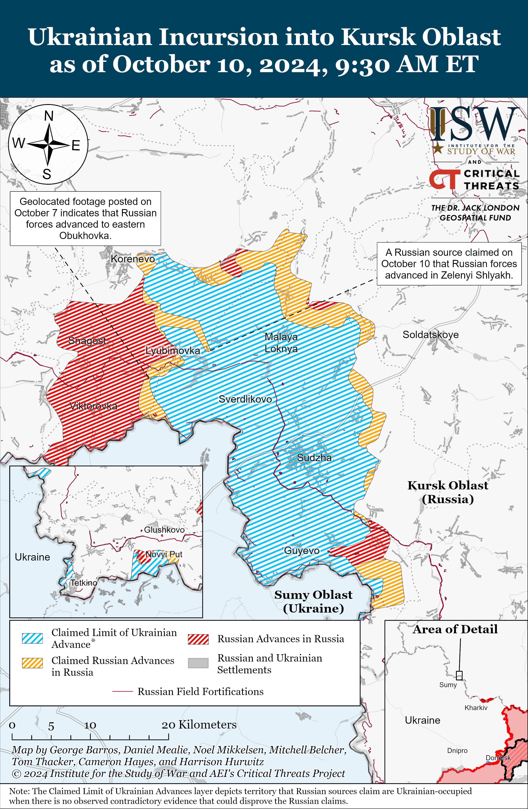
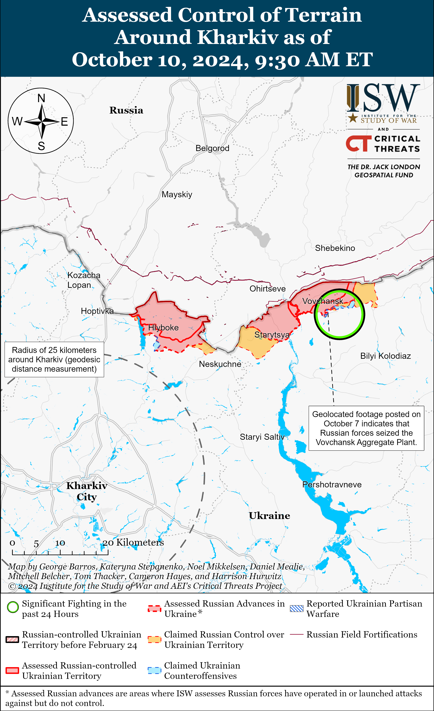
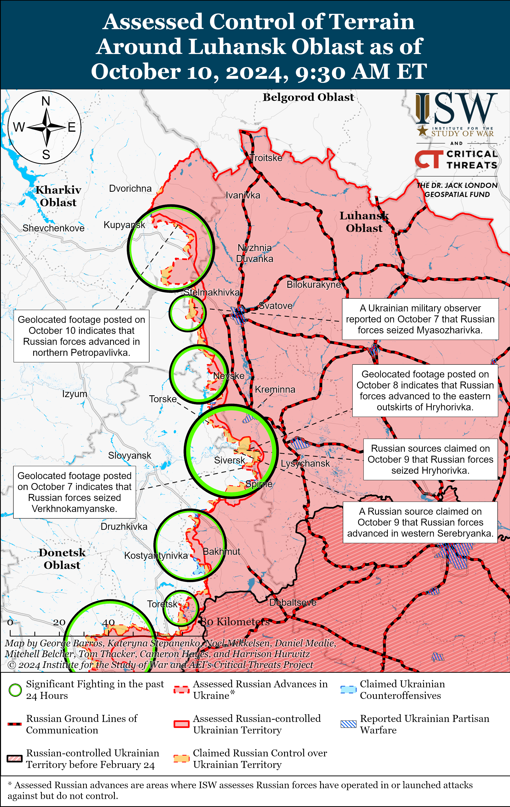
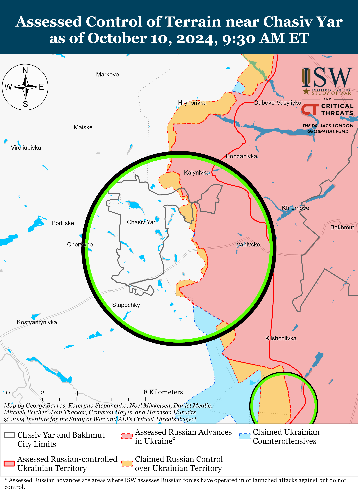
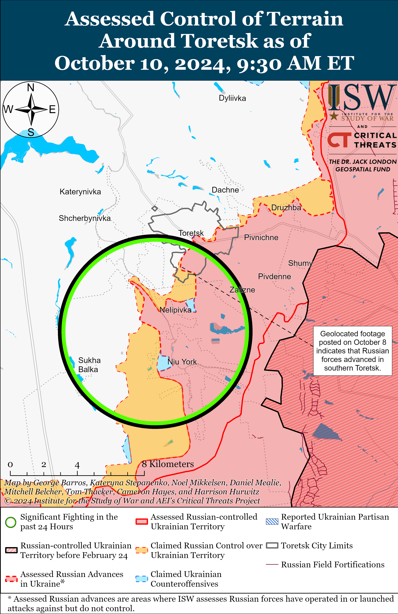
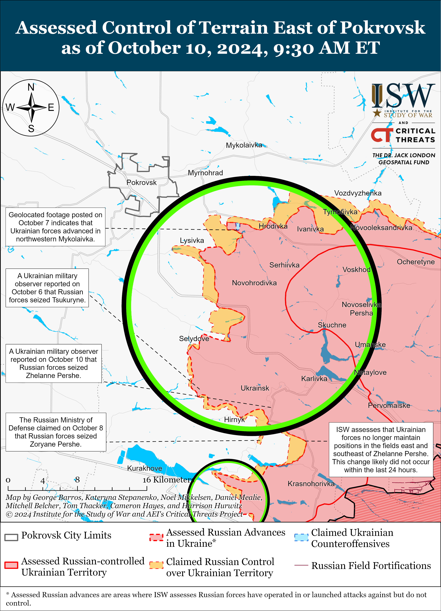
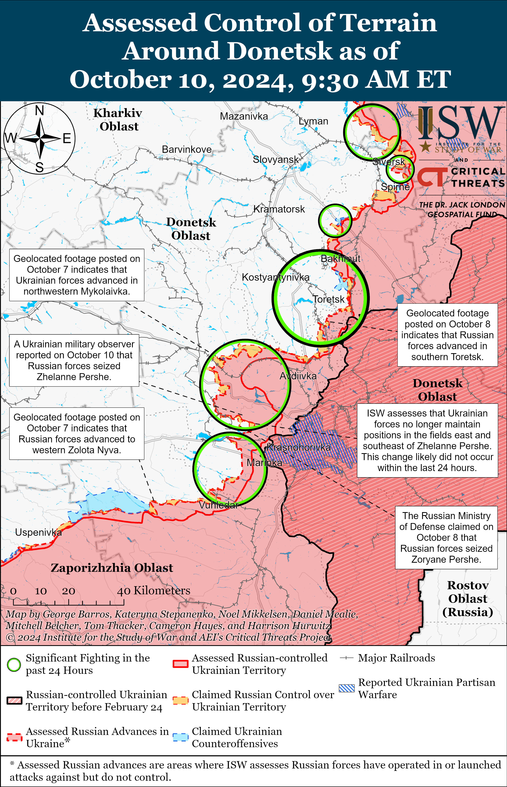
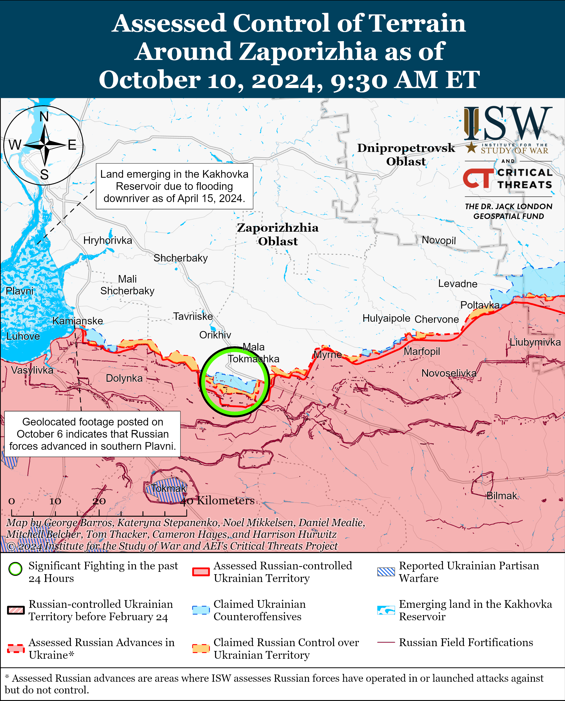
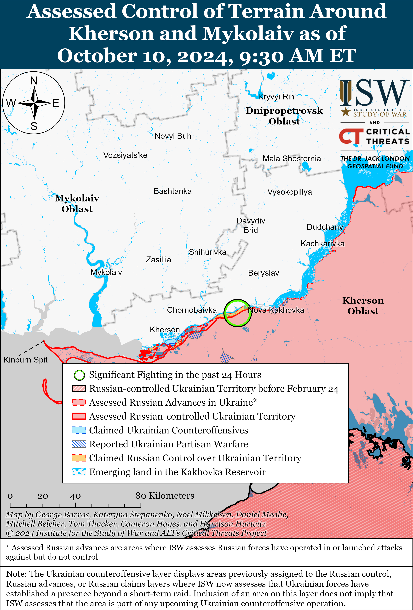

# Russian Offensive Campaign Assessment, October 10, 2024

**Angelica Evans, Grace Mappes, Nicole Wolkov, and George Barros**

**October 10, 2024, 11:50am ET**

**Click** [**here**](https://storymaps.arcgis.com/stories/36a7f6a6f5a9448496de641cf64bd375) **to see ISW’s interactive map of the Russian invasion of Ukraine. This map is updated daily alongside the static maps present in this report.**

**Click** [**here**](https://storymaps.arcgis.com/stories/83a2f24901c941d581c0c523ecd2619b) **to see ISW’s interactive map of Ukraine’s offensive in Kursk Oblast.**

**Click** [**here**](https://understandingwar.maps.arcgis.com/apps/instant/3dviewer/index.html?appid=1602762dbcde419bb957dea358449580) **to see ISW’s 3D control of terrain topographic map of Ukraine. Use of a computer (not a mobile device) is strongly recommended for using this data-heavy tool.**

**Click** [**here**](https://storymaps.arcgis.com/stories/733fe90805894bfc8562d90b106aa895) **to access ISW’s archive of interactive time-lapse maps of the Russian invasion of Ukraine. These maps complement the static control-of-terrain map that ISW produces daily by showing a dynamic frontline. ISW will update this time-lapse map archive monthly.**

**Note: The data cut-off for this product was 10:00am ET on October 10. ISW will cover subsequent reports in the October 11 Russian Offensive Campaign Assessment.**

**Ukrainian forces reportedly struck a Shahed drone storage facility in Krasnodar Krai and an ammunition warehouse in the Republic of Adygea on October 9 and 10.** The Ukrainian General Staff reported on October 9 that Ukrainian naval forces and Ukraine’s Security Service (SBU) struck a Russian Shahed drone storage facility near Oktyabrsky, Krasnodar Krai and that Russian forces stored around 400 Shahed drones at the facility.[1] The Ukrainian General Staff reported that there were secondary detonations at the facility immediately following the strike, and footage published on October 10 shows a large fire and secondary detonations near the facility.[2] Krasnodar Krai officials stated on October 9 that Ukrainian drone strikes damaged several houses near Oktyabrsky and that unspecified warehouses in the area caught fire but claimed that the strike did not significantly damage the facilities.[3] The Ukrainian General Staff reported on October 10 that drone operators from the SBU, Ukraine’s Main Military Intelligence Directorate (GUR), and Ukraine’s Special Operations Forces (SSO) struck an ammunition warehouse at the Khanskaya Air Base in the Republic of Adygea.[4] The Ukrainian General Staff reported that Russian forces base Su-34 fighter-bombers and Su-27 fighter aircraft at the Khanskaya Air Base, and Ukrainian outlet *Suspilne* reported that sources within Ukrainian special services stated that there were 57 Russian training and combat aircraft and helicopters at the airfield at the time of the strike.[5] *Suspilne*‘*s* sources stated that Russian forces use the Khanskaya Air Base to refuel planes during air strikes against frontline Ukrainian units and settlements.[6] Ukrainian forces are still determining the extent of the strike’s damage to the airfield, and it is unclear whether Ukrainian forces struck any Russian aircraft at the Khanskaya Air Base as of the time of this report.[7] Russian sources published footage on October 10 purportedly showing Ukrainian drones striking the airfield and noted that the Russian 272nd Training Aviation Base of the Krasnodar Higher Military Aviation School of Pilots is based at the Khanskaya Air Base.[8]

Russian forces rely on Shahed drones to strike both frontline and rear Ukrainian settlements and cities and expend roughly 10,000 artillery shells per day against frontline Ukrainian positions.[9] Ukrainian forces notably struck the Oktyabrskii and Toropets ammunition depots in Tver Oblast and the Tikhoretsk ammunition depot in Krasnodar Krai in September 2024 and a Russian missile and storage ammunition storage facility in Karachev, Bryansk Oblast on October 8, which resulted in the destruction of dozens of ammunition storage buildings, rail cars, and likely a significant amount of ammunition, missiles, and drones.[10] While the impact of a single strike is unlikely to significantly impact Russia’s war effort, repeated strikes against ammunition depots within Russia may force a decision point on the Russian military command to reorganize and disperse support and logistics systems within Russia‘s rear areas to mitigate the impact of such strikes at the expense of mass-optimized Russian logistics to support the war in Ukraine. The timely lifting of restrictions on the use of Western systems and the continued development of Ukraine’s own long-range strike capabilities may allow Ukrainian forces to more effectively exploit such Russian vulnerabilities before Russia deploys countermeasures. Ukrainian strikes against facilities within Russia could impact offensive operations throughout the theater in Ukraine if Ukrainian forces have the materiel, capabilities, and permission to conduct such a strike campaign against logistics and support facilities within Russia at scale.

**Russian forces have reportedly struck three civilian vessels docked in Ukrainian ports since October 5, likely as part of intensified Russian military, political, and economic pressure to undermine confidence in Ukraine’s grain corridor, Western support for Ukraine, and push Ukraine into premature negotiations.** Ukrainian Odesa Oblast Military Administration Head Oleh Kiper stated on October 9 that Russian ballistic missiles struck port infrastructure in Odesa Raion and that Russian missiles struck a civilian container ship under the flag of Panama.[11] Kiper noted that this was the third Russian strike on a civilian vessel in the last four days and stated that these strikes are an attempt to disrupt Ukraine’s grain corridor, kill civilians, and destroy Ukrainian infrastructure. Ukrainian officials reported that a Russian ballistic missile struck a civilian vessel under the flag of Palau in Odesa’s port on October 7 and that Russian missiles damaged a civilian cargo ship on the night of October 5 to 6 near Odesa City.[12] Russian sources have attempted to justify the recent Russian strikes against civilian ships by claiming that the ships were carrying weapons, but ISW has not observed independent confirmation of these claims.[13] Ukrainian officials reported that Russian forces conducted a cruise missile strike against a civilian cargo ship under the flag of St. Kitts and Nevis transporting Ukrainian wheat to Egypt as it was leaving Ukrainian territorial waters in the Black Sea on the night of September 11.[14] Russian forces have previously heavily targeted Ukrainian ports and grain infrastructure in southern Ukraine and have engaged in threatening military posturing in the Black Sea in an effort to damage Ukrainian grain exports and undermine international confidence in Ukraine’s grain corridor.[15] Russian strikes against civilian vessels in the grain corridor are almost certainly intended to undermine confidence in Ukraine’s ability to enforce and defend the corridor, influence ongoing Western discussions about long-term Western support for Ukraine, and negatively impact Ukraine’s efforts to economically recover amid the ongoing war.**|**

**An unspecified senior US defense official stated on October 9 that Russian forces have suffered over 600,000 casualties since the start of the full-scale invasion in February 2022 — a stark increase from a prior US intelligence assessment that Russian forces suffered about 315,000 casualties in Ukraine as of December 2023.[16]** The senior US defense official stated on October 9 that Russian forces have suffered more battlefield casualties in Ukraine in this past month – likely referring to early September through early October 2024 – than in any other month of the war.[17] US intelligence reportedly assessed as of December 2023 that the then-estimated 315,000 Russian casualties amounted to nearly 90 percent of Russia’s military personnel at the start of the invasion.[18] The UK Ministry of Defense (MoD) assessed in May 2024 that Russian forces have suffered over 465,000 casualties since February 2022 and that the Russian daily casualty rate starting in May 2024 was about 1,000 per day.[19]

**An Iranian outlet affiliated with former Islamic Revolutionary Guards Corps (IRGC) Commander Major General Mohsen Rezaei claimed on October 8 that Russia provided Iran with an S-400 air defense system and a squadron of Su-35 fighter jets but provided no evidence for this claim. *NOTE: A version of this text appears in the October 9 ISW-CTP Iran Update.*** An Iranian outlet affiliated with former Islamic Revolutionary Guards Corps (IRGC) Commander Major General Mohsen Rezaei claimed on October 8 that Russia provided Iran with an S-400 air defense system and a squadron of Su-35 fighter jets but provided no evidence for this claim.[20] ISW has not observed similar reports in prominent Western or Russian media, and ISW cannot independently verify this claim. ISW continues to assess that Russia could supply Iran with advanced military equipment in return for Iran’s ongoing support for the Russian invasion of Ukraine.[21]

**Key Takeaways:**

- **Ukrainian forces reportedly struck a Shahed drone storage facility in Krasnodar Krai and an ammunition warehouse in the Republic of Adygea on October 9 and 10.**
- **Russian forces have reportedly struck three civilian vessels docked in Ukrainian ports since October 5, likely as part of intensified Russian military, political, and economic pressure to undermine confidence in Ukraine’s grain corridor, Western support for Ukraine, and push Ukraine into premature negotiations.**
- **An unspecified senior US defense official stated on October 9 that Russian forces have suffered over 600,000 casualties since the start of the full-scale invasion in February 2022 — a stark increase from a prior US intelligence assessment that Russian forces suffered about 315,000 casualties in Ukraine as of December 2023.**
- **An Iranian outlet affiliated with former Islamic Revolutionary Guards Corps (IRGC) Commander Major General Mohsen Rezaei claimed on October 8 that Russia provided Iran with an S-400 air defense system and a squadron of Su-35 fighter jets but provided no evidence for this claim.**
- **Ukrainian forces recently advanced near Toretsk. Russian forces recently advanced in Kursk Oblast and near Chasiv Yar, southeast of Pokrovsk, and southwest of Donetsk City.**
- **The Russian military appears to be increasingly recruiting older Russian volunteers in order to sustain ongoing crypto-mobilization efforts.**

***We do not report in detail on Russian war crimes because these activities are well-covered in Western media and do not directly affect the military operations we are assessing and forecasting. We will continue to evaluate and report on the effects of these criminal activities on the Ukrainian military and the Ukrainian population and specifically on combat in Ukrainian urban areas. We utterly condemn Russian violations of the laws of armed conflict and the Geneva Conventions and crimes against humanity even though we do not describe them in these reports.***

- Ukrainian Operations in the Russian Federation
- Russian Main Effort – Eastern Ukraine (comprised of three subordinate main efforts)
- Russian Subordinate Main Effort #1 – Push Ukrainian forces back from the international border with Belgorod Oblast and approach to within tube artillery range of Kharkiv City
- Russian Subordinate Main Effort #2 – Capture the remainder of Luhansk Oblast and push westward into eastern Kharkiv Oblast and encircle northern Donetsk Oblast
- Russian Subordinate Main Effort #3 – Capture the entirety of Donetsk Oblast
- Russian Supporting Effort – Southern Axis
- Russian Air, Missile, and Drone Campaign
- Russian Mobilization and Force Generation Efforts
- Russian Technological Adaptations
- Activities in Russian-occupied areas
- Ukrainian Defense Industrial Base Efforts
- Russian Information Operations and Narratives
- Significant Activity in Belarus

**Ukrainian Operations in the Russian Federation**

Ukrainian forces continued offensive operations in Glushkovsky Raion west of the main Ukrainian salient in Kursk Oblast on October 10 but did not make confirmed advances in the area. Russian sources claimed that elements of the Russian 106th Airborne (VDV) Division repelled a Ukrainian attack near Veseloye (south of Glushkovo).[22]

Ukrainian forces continued offensive operations in the main Ukrainian salient in Kursk Oblast southeast of Korenevo near Lyubimovka and east of Korenevo near Kamyshevka on October 10 but did not make confirmed advances in the area.[23]

Russian forces recently advanced in the main Ukrainian salient in Kursk Oblast. Geolocated footage published on October 7 indicates that Russian forces recently marginally advanced in eastern Obukhovka (southeast of Korenevo).[24] The Russian Ministry of Defense (MoD) claimed that unspecified Russian VDV forces seized Pokrovskiy (south of Korenevo).[25] A Russian milblogger claimed that elements of the Russian 155th Naval Infantry Brigade (Pacific Fleet, Eastern Military District [EMD]) advanced into Zeleniy Shlyakh (southeast of Korenevo) and several Russian milbloggers claimed that Russian forces seized Novaya Sorochina (north of Sudzha).[26] A Russian milblogger claimed that Russian forces advanced near Cherkasskaya Konopelka (southeast of Sudzha).[27] ISW has not observed visual evidence confirming these claims, however.

**Russian Main Effort – Eastern Ukraine**

**Russian Subordinate Main Effort #1 – Kharkiv Oblast** **(Russian objective: Push Ukrainian forces back from the international border with Belgorod Oblast and approach to within tube artillery range of Kharkiv City)**

Russian forces continued offensive operations northeast of Kharkiv City near Vovchansk and Tykhe on October 9 and 10, but there were no confirmed changes to the frontline.[28] Ukraine’s Kharkiv Group of Forces reported on October 10 that Russian forces are trying to replenish ammunition stockpiles at forward positions near Starytsya (northeast of Kharkiv City).[29]

**Russian Subordinate Main Effort #2 – Luhansk Oblast** **(Russian objective: Capture the remainder of Luhansk Oblast and push westward into eastern Kharkiv Oblast and northern Donetsk Oblast)**

Russian forces recently advanced east of Kupyansk amid continued assaults along the Kupyansk-Svatove-Kreminna line on October 10. Geolocated footage published on October 10 indicates that Russian forces recently advanced along Luhova Street in northern Petropavlivka (east of Kupyansk) and southwest of Kotlyarivka (southeast of Kupyansk).[30] Russian sources claimed that Russian forces advanced southwest of Kyslivka (southeast of Kupyansk) and up to two kilometers east of Terny (northwest of Kreminna), but ISW has not observed confirmation of these claims.[31] Russian forces continued assaults northeast of Kupyansk near Synkivka and in the direction of Kucherivka; east of Kupyansk near Petropavlivka; southeast of Kupyansk near Stepova Novoselivka, Vishneve, Novoosynove, Kolisnykivka, Kruhlyakivka, and Lozova; west of Svatove near Zhelenyi Hai and Andriivka; southeast of Svatove near Hrekivka, Makiivka, Druzhelyubivka, Novosadove, and Nevske and in the direction of Katerynivka; west of Kreminna near Toretsk; and southwest of Kreminna near the Serebryanske forest area on October 9 and 10.[32]

**Russian Subordinate Main Effort #3 – Donetsk Oblast (Russian objective: Capture the entirety of Donetsk Oblast, the claimed territory of Russia’s proxies in Donbas)**

Russian sources largely disputed recently claimed Russian advances in the Siversk direction amid continued Russian offensive operations in the area on October 10. Russian milbloggers widely claimed on October 9 and 10 that Russian forces did not seize all of Verkhnokamyanske (east of Siversk) and half of Serebryanka (north of Siversk) or advance north of Siversk near Hryhorivka and Bilohorivka.[33] A prominent, Kremlin-affiliated milblogger claimed that there is not enough cover for Russian forces to seize Verkhnokamyanske without taking the heights to the north and south and that the footage of a Russian flag on the outskirts of Hryhorivka is due to a Russian drone dropping the flag rather than marking an enduring infantry position.[34] ISW observed geolocated footage published on October 7 and 8 that indicates that Russian forces at least temporarily advanced east of Hryhorivka and into western Verkhnokamyanske, although it does not indicate that Russian forces have established enduring positions in the area.[35] Other Russian milbloggers criticized so-called “beautiful reports” of exaggerated Russian successes in the area and the broader Russian military culture that encourages such exaggerations.[36] The Ukrainian General Staff reported that Russian forces conducted ground attacks near Verkhnokamyanske on October 10.[37] Elements of the Russian 7th Motorized Rifle Brigade (3rd Combined Arms Army [CAA], formerly 2nd Luhansk People’s Republic [LNR] Army Corps [AC]) reportedly continue to operate in the Siversk direction.[38]

Russian forces recently marginally advanced north of Chasiv Yar amid continued offensive operations in the area on October 10. Geolocated footage published on October 9 shows that Russian forces marginally advanced southwest of Hryhorivka (north of Chasiv Yar).[39] Russian forces continued ground attacks within Kanal Microraion within Chasiv Yar; north of Chasiv Yar near Minkivka and Orikhovo-Vasylivka; and south of Chasiv Yar near Bila Hora, Oleksandro-Shultyne, and Stupochky on October 9 and 10.[40] Artillery elements of the Russian 98th Airborne (VDV) Division reportedly continue to strike Ukrainian positions within eastern Chasiv Yar.[41]

Ukrainian forces recently recaptured some positions within and south of Toretsk amid continued Russian offensive operations in the area on October 10. Geolocated footage published on October 9 and 10 shows that Ukrainian forces recently advanced north of Nelipivka (south of Toretsk) and recaptured a building within central Toretsk.[42] A Russian milblogger claimed that Russian forces seized a building at the Tsentralna Mine in central Toretsk.[43] Russian forces also continued ground attacks north of Toretsk near Dyliivka, east of Toretsk near Druzhba, south of Toretsk near Nelipivka and in the direction of Shcherbynivka, and southwest of Toretsk near Leonidivka on October 9 and 10.[44]

Russian forces recently advanced southeast of Pokrovsk amid continued offensive operations east and southeast of Pokrovsk on October 10. Geolocated footage published on October 9 indicates that Russian forces advanced east of Selydove (southeast of Pokrovsk) and along the railway line south of Selydove.[45] Ukrainian military observer Kostyantyn Mashovets stated on October 10 that Russian forces have seized Zhelanne Pershe (southeast of Pokrovsk), over which the Russian Ministry of Defense (MoD) claimed control on September 14.[46] Russian milbloggers claimed that Russian forces advanced 600 meters in depth east of the railway east of Selydove, 950 meters in depth within western Tsukuryne (southeast of Pokrovsk), and 400 meters in depth south of Selydove.[47] Russian forces also attacked east of Pokrovsk near Sukha Balka, Novotoretske, Myrolyubivka, Krutyi Yar, Promin, Lysyk, and Sukhyi Yar; and southeast of Pokrovsk near Kalynove, Hirnyk, Novoselydivka, and Tsukuryne on October 9 and 10.[48] Mashovets characterized Russian assaults in the Pokrovsk and Kurakhove (west of Donetsk City) directions as “cumulative,” in which Russian forces send continuous waves of assault groups in hopes of indiscriminately gaining a foothold.[49] Mashovets noted that these assault groups are usually consist of infantry with support from artillery and aviation but sometimes include three to four armored vehicles.[50] Mashovets reported that elements of the Russian 15th and 30th motorized rifle brigades (both of the 2nd CAA, Central Military District [CMD]) are fighting towards Myrnohrad (east of Pokrovsk), elements of the 90th Tank Division and 27th Motorized Rifle Division (2nd CAA) are fighting towards Selydove, and likely elements of the 90th Tank Division with support from the 5th and 114th motorized rifle brigades (both of the 51st CAA, formerly of the Donetsk People’s Republic [DNR] AC) are struggling to break through Ukrainian lines southeast of Pokrovsk on the Vozneseka-Zhelanne Pershe line.[51]

ISW has adjusted its assessed Russian advances control of terrain layer over unpopulated fields east and southeast of Zhelanne Pershe given that ISW’s previous map of control of terrain depicted a very deep and narrow salient that Ukrainian forces likely have not controlled for much time. ISW has not observed geolocated evidence of Russian forces operating in the fields, but the other known contours of the battlefield geometry strongly indicate that Russian forces likely have occupied these fields. Russian forces certainly did not capture these fields in the last 24 hours, although ISW only made the corresponding map adjustment on October 10. ISW will continue studying the situation and refining the assessment of control of terrain as more data becomes available.

Russian forces likely seek to widen the Pokrovsk salient’s southern flank to smooth out the forward edge of the battle area (FEBA) to create a more advantageous frontline that connects the Russian frontline west of Donetsk City closer to the Russian frontline south of Pokrovsk. Russian forces can eliminate tactical and operational salients that could become vulnerable to future Ukrainian counterattacks by smoothing out the battlefield geometry of the Russian frontline in this area. Smoothing the frontline also provides Russian forces a wider area from which they can pursue intensified attacks against Pokrovsk after securing terrain southwest of Pokrovsk.

Russian forces continued offensive operations west of Donetsk City on October 10, but there were no confirmed changes to the frontline. Russian forces continued ground attacks west of Donetsk City near Hostre, Heorhiivka, and Kurakhivka on October 9 and 10.[52]

Russian forces recently advanced southwest of Donetsk City amid continued offensive operations in the area on October 10. Geolocated footage published on October 10 indicates that Russian forces recently advanced northeast of Vodyane (southwest of Donetsk City and northeast of Vuhledar).[53] Russian forces continued ground attacks southwest of Donetsk City near Katerynivka, Kostyantynivka, Antonivka, Bohoyavlenka, Vuhledar, and Maksymilyanivka on October 9 and 10.[54] A Russian milblogger claimed that Ukrainian forces counterattacked near Zolota Nyva (west of Vuhledar), and another Russian milblogger claimed that Russian forces advanced near Zolota Nyva and Bohoyavlenka.[55] Elements of the Russian 36th Motorized Rifle Brigade (29th CAA, Eastern Military District [EMD]) are reportedly fighting near Vuhledar.[56]

Russian and Ukrainian sources did not report ongoing fighting in the Donetsk-Zaporizhia Oblast border area on October 10.

**Russian Supporting Effort – Southern Axis** **(Russian objective: Maintain frontline positions and secure rear areas against Ukrainian strikes)**

Russian forces continued offensive operations in western Zaporizhia Oblast, including near Robotyne and northeast of Robotyne near Mala Tokmachka on October 10 but did not make any confirmed advances.[57] Russian milbloggers claimed on October 9 that Russian forces advanced near Robotyne and on the outskirts of Kamyanske (south of Stepnohirsk).[58] Russian sources claimed on October 10 that heavy fighting continued in Kamyanske but notably did not claim any further Russian advances in the area.[59]

A Ukrainian military official warned that Russian forces may soon intensify tactical infantry assaults near Robotyne in western Zaporizhia Oblast and near Pryyutne in the Donetsk-Zaporizhia Oblast border area. Ukrainian Tavriisk Group of Forces Spokesperson Colonel Vladyslav Voloshyn stated on October 9 and 10 that Russian forces are accumulating forces near Robotyne and Pryyutne and may intensify small infantry assaults in the area in three-to-seven days, although Russian forces in the area are not currently conducting assault operations.[60] Voloshyn stated that the Russian military will form small infantry groups of five-to-ten personnel from Russian motorized rifle and Airborne (VDV) units that will conduct assaults after which reinforcement groups will consolidate and hold seized positions

Russian forces continued assaults in the Kherson direction on October 9 and 10, but there were no confirmed changes to the frontline in this direction.[61] Elements of the Russian 80th Arctic Brigade (14th Army Corps [AC], Leningrad Military District [LMD]) reportedly continue operating in the Kherson direction.[62]

**Russian Air, Missile, and Drone Campaign** **(Russian Objective: Target Ukrainian military and civilian infrastructure in the rear and on the frontline)**

Russian forces conducted a series of missile and drone strikes against Ukraine on the night of October 9 to 10. The Ukrainian Air Force reported that Russian forces launched two Iskander-M ballistic missiles, one Kh-31P cruise missile, and two Kh-59/69 cruise missiles from occupied Crimea; three S-300 missiles from occupied Donetsk Oblast; and 62 unspecified drones from Kursk Oblast and Primorsko-Akhtarsk, Krasnodar Krai.[63] The Ukrainian Air Force reported that Ukrainian forces shot down 41 drones over Mykolaiv, Odesa, Kherson, Kiev, Cherkasy, Dnipropetrovsk, Sumy, Poltava, Zaporizhia, and Donetsk oblasts and that Russian missiles and drone strikes damaged civilian and critical infrastructure in Odesa, Poltava, and Donetsk oblasts. Dnipropetrovsk Oblast Military Administration Head Serhiy Lysak reported that a Shahed drone damaged civilian infrastructure in Kryvyi Rih.[64] Mykolaiv Oblast Military Administration Head Vitaliy Kim reported that Russian forces struck the outskirts of Mykolaiv City with a Kh-59/69 cruise missile.[65]

**Russian Mobilization and Force Generation Efforts** **(Russian objective: Expand combat power without conducting general mobilization)**

The Russian military appears to be increasingly recruiting older Russian volunteers in order to sustain ongoing crypto-mobilization efforts. Russian opposition outlet *Verstka* reported on October 9 that a source in an unspecified Russian Airborne (VDV) unit operating in the Kherson direction stated that 40 percent of the unit’s contract recruits and mobilized personnel are over 50 years old and that over 75 percent of new personnel are over 50 years old.[66] *Verstka*, citing an unspecified Moscow City official, stated that half of the Russian military volunteers from Moscow City are over 45 years old. *Verstka* also reported, citing data from Russian opposition outlet *Mediazona*, that 2,475 Russian military volunteers over the age of 45 have died in the war in Ukraine between January and September 2024 – 18 percent more than Russian volunteers who died in the war over the age of 45 in all of 2023.[67]

Chechen Republic Head Ramzan Kadyrov argued on October 9 that criminal “problem youth” in Chechnya should staff a new regiment to fight in Ukraine.[68] Kadyrov claimed that these “problem youth” can choose to serve a prison sentence or serve in the Russian military and noted that Chechnya is currently forming a new regiment of 2,500 personnel that will deploy to Ukraine in the future. Kadyrov stated that Russian State Duma Deputy Adam Delimkhanov will oversee the formation of the new regiment.

**Russian Technological Adaptations** **(Russian objective: Introduce technological innovations to optimize systems for use in Ukraine)**

The press service of Russian President Vladimir Putin’s People’s Front (*Narodnyi Front*) political coalition told Kremlin newswire *TASS* on October 10 that Novosibirsk Oblast authorities and representatives of the People’s Front “Kulibin Club” drone and electronic warfare (EW) system production initiative developed and tested a new multifunctional airplane type drone with a cruising speed on 80 kilometers per hour and a flight range of 200 kilometers.[69] The People’s Front reported that Russian forces can use the drone for reconnaissance, as a false target against Ukrainian air defenses, or as a strike drone.

**Ukrainian Defense Industrial Efforts** **(Ukrainian objective: Develop its defense industrial base to become more self-sufficient in cooperation with US, European, and international partners)**

*ISW is suspending publishing coverage of Ukrainian defense industrial efforts until further notice.*

**Activities in Russian-occupied areas** **(Russian objective: Consolidate administrative control of annexed areas; forcibly integrate Ukrainian citizens into Russian sociocultural, economic, military, and governance systems)**

*ISW is not publishing reporting on activities in Russian-occupied areas today.*

**Russian Information Operations and Narratives**

Nothing significant to report.

**Significant activity in Belarus** **(Russian efforts to increase its military presence in Belarus and further integrate Belarus into Russian-favorable frameworks and Wagner Group activity in Belarus)**

Russian President Vladimir Putin and Belarusian President Alexander Lukashenko met in Moscow on October 10 and discussed strong bilateral economic relations, trade, and industrial cooperation including in aviation production.[70] Putin awarded Lukashenko with the Order of St. Andrew the Apostle, Russia’s highest state honor.[71]

**Note: ISW does not receive any classified material from any source, uses only publicly available information, and draws extensively on Russian, Ukrainian, and Western reporting and social media as well as commercially available satellite imagery and other geospatial data as the basis for these reports. References to all sources used are provided in the endnotes of each update.**

---

[1] https://t.me/GeneralStaffZSU/17847 ; https://armyinform.comdot ua/2024/10/09/syly-oborony-uspishno-urazyly-na-rosiyi-bazu-zberigannya-shahediv/; https://www.facebook.com/GeneralStaff.ua/posts/pfbid02YbmQwrM2KZhpFqYU94d6MN9FvjwRaPdzyfgp5Y3Jueiryu9MhRywqb2uYeFbVB15l

[2] https://t.me/GeneralStaffZSU/17847 ; https://armyinform.comdot ua/2024/10/09/syly-oborony-uspishno-urazyly-na-rosiyi-bazu-zberigannya-shahediv/; https://www.facebook.com/GeneralStaff.ua/posts/pfbid02YbmQwrM2KZhpFqYU94d6MN9FvjwRaPdzyfgp5Y3Jueiryu9MhRywqb2uYeFbVB15l ; https://t.me/dva\_majors/54797 ; https://t.me/milinfolive/132473 ; https://t.me/vchkogpu/51605 ; https://t.me/vchkogpu/51617 ; https://t.me/astrapress/66082

[3] https://t.me/tass\_agency/278486 ; https://meduza dot io/news/2024/10/10/v-krasnodarskom-krae-proizoshel-pozhar-na-sklade-genshtab-vsu-zayavil-chto-ukrainskie-voennye-atakovali-mesto-hraneniya-rossiyskih-dronov

[4] https://t.me/GeneralStaffZSU/17858 ; https://armyinform.com dot ua/2024/10/10/udar-po-rosijskomu-aerodromu-v-adygeyi-pid-pryczilom-litaky-su-34-ta-su-27/ ; https://www.facebook.com/GeneralStaff.ua/posts/pfbid02gjZ6fNoQsxChh6aRz4joCzT81zkEE9m8BATUpPysTMzDZMySbwMVzKdRTiCAjmvAl

[5] https://t.me/GeneralStaffZSU/17858 ; https://armyinform.com dot ua/2024/10/10/udar-po-rosijskomu-aerodromu-v-adygeyi-pid-pryczilom-litaky-su-34-ta-su-27/ ; https://www.facebook.com/GeneralStaff.ua/posts/pfbid02gjZ6fNoQsxChh6aRz4joCzT81zkEE9m8BATUpPysTMzDZMySbwMVzKdRTiCAjmvAl ; https://suspilne dto media/854719-udar-balistikou-po-odesini-bronuvanna-pracivnikiv-v-ukraini-ne-prizupinaut-960-den-vijni-onlajn/?anchor=live\_1728557052&utm\_source=copylink&utm\_medium=ps ; https://suspilne dot media/855111-ataku-na-vijskovij-aerodrom-hanska-v-adigei-zdijsnili-droni-sbu-gur-ta-sso-dzerelo/

[6] https://suspilne dot media/855111-ataku-na-vijskovij-aerodrom-hanska-v-adigei-zdijsnili-droni-sbu-gur-ta-sso-dzerelo/

[7] https://suspilne dot media/854719-udar-balistikou-po-odesini-bronuvanna-pracivnikiv-v-ukraini-ne-prizupinaut-960-den-vijni-onlajn/?anchor=live\_1728557052&utm\_source=copylink&utm\_medium=ps ; https://suspilne dot media/855111-ataku-na-vijskovij-aerodrom-hanska-v-adigei-zdijsnili-droni-sbu-gur-ta-sso-dzerelo/ ; https://t.me/GeneralStaffZSU/17858 ; https://armyinform.com dot ua/2024/10/10/udar-po-rosijskomu-aerodromu-v-adygeyi-pid-pryczilom-litaky-su-34-ta-su-27/ ; https://www.facebook.com/GeneralStaff.ua/posts/pfbid02gjZ6fNoQsxChh6aRz4joCzT81zkEE9m8BATUpPysTMzDZMySbwMVzKdRTiCAjmvAl

[8] https://t.me/astrapress/66089 ; https://t.me/astrapress/66092 ; https://t.me/vchkogpu/51623 ; https://t.me/vchkogpu/51624 ; https://t.me/vchkogpu/51625 ; https://t.me/vchkogpu/51626 ; https://t.me/vchkogpu/51627 ; https://t.me/vchkogpu/51630 ; https://t.me/vchkogpu/51631 ; https://t.me/vchkogpu/51634 ; https://t.me/vchkogpu/51636 ; https://t.me/vchkogpu/51640 ; https://t.me/milinfolive/132496 ; https://t.me/navalnyKRD/16012 ; https://t.me/RVvoenkor/78500

[9] https://understandingwar.org/backgrounder/russian-offensive-campaign-assessment-august-21-2024-0 ; https://isw.pub/UkrWar082224 ; https://isw.pub/UkrWar082624

[10] https://isw.pub/UkrWar092424 ; https://understandingwar.org/backgrounder/russian-offensive-campaign-assessment-september-22-2024 ; https://understandingwar.org/backgrounder/russian-offensive-campaign-assessment-september-21-2024 ; https://understandingwar.org/backgrounder/russian-offensive-campaign-assessment-september-18-2024 ; https://understandingwar.org/backgrounder/russian-offensive-campaign-assessment-october-9-2024

[11] https://t.me/odeskaODA/6995 ; https://armyinform.comdot ua/2024/10/10/tretya-raketna-ataka-na-czyvilne-sudno-za-chotyry-dni-rosiya-zabrala-zhyttya-shesty-lyudej/ ; https://meduza dot io/news/2024/10/09/rossiya-udarila-po-portovoy-infrastrukture-odesskoy-oblasti-pyat-chelovek-pogibli-povrezhdeno-grazhdanskoe-sudno

[12] https://t.me/odeskaODA/6969; https://suspilne dot media/odesa/853013-armia-rf-skeruvala-na-odesu-balisticni-raketi-e-zagiblij-ta-patero-travmovanih/

 ; https://t.me/OleksiyKuleba/4957 ; https://armyinform.com dot ua/2024/10/08/armiya-rf-atakuvala-balistykoyu-czyvilne-sudno-v-portah-odeshhyny-ye-zagybli-ta-poraneni/ ; https://t.me/odeskaODA/6943 ; https://meduza dot io/news/2024/10/06/rossiya-atakovala-odesskuyu-oblast-dronami-i-raketami-pod-udar-popali-sklady-gazoprovod-i-suhogruz

[13] https://t.me/RVvoenkor/78488 ; https://t.me/dva\_majors/54785 ; https://t.me/dva\_majors/54787 ; https://t.me/wargonzo/22537 ; https://t.me/boris\_rozhin/140240

[14] https://isw.pub/UkrWar091224

[15] https://isw.pub/UkrWar090923 ; https://isw.pub/UkrWar090823 ; https://isw.pub/UkrWar081623 ; https://understandingwar.org/backgrounder/russian-offensive-campaign-assessment-september-12-2024

[16] https://www.defense.gov/News/News-Stories/Article/Article/3931856/ukraine-continues-valiant-defense-against-russian-invaders/ ; https://www.reuters.com/world/us-intelligence-assesses-ukraine-war-has-cost-russia-315000-casualties-source-2023-12-12/; https://understandingwar.org/backgrounder/russian-offensive-campaign-assessment-february-24-2024

[17] https://www.defense.gov/News/News-Stories/Article/Article/3931856/ukraine-continues-valiant-defense-against-russian-invaders/

[18] https://www.reuters.com/world/us-intelligence-assesses-ukraine-war-has-cost-russia-315000-casualties-source-2023-12-12/; https://understandingwar.org/backgrounder/russian-offensive-campaign-assessment-february-24-2024

[19] https://www.gov.uk/government/speeches/over-465000-russian-personnel-killed-or-wounded-since-2022-a-terrible-human-loss-for-russians-uk-statement-to-the-osce

[20] https://www.tabnak dot ir/fa/news/1264427 ; https://understandingwar.org/backgrounder/iran-update-october-9-2024

[21] https://understandingwar.org/backgrounder/iran-update-september-6-2024

[22] https://t.me/wargonzo/22530 ; https://t.me/wargonzo/22533 ; https://t.me/boris\_rozhin/140191 ; https://t.me/voin\_dv/11255 ; https://t.me/frontline\_pvt/3245 ; https://t.me/voenkorKotenok/59489 ; https://t.me/milinfolive/132448 ; https://t.me/boris\_rozhin/140191

[23] https://t.me/mod\_russia/44363

[24] https://x.com/AudaxonX/status/1844111827657273823; https://t.me/GRIFON501/535

[25] https://t.me/mod\_russia/44323

[26] https://t.me/motopatriot/28343 ; https://t.me/z\_arhiv/28495 ; https://t.me/wargonzo/22530 ; https://t.me/wargonzo/22533

[27] https://t.me/dva\_majors/54799

[28] https://www.facebook.com/GeneralStaff.ua/posts/pfbid0HXYLVxEPzbUTTrSubQsrxXgZfvTywGy1eBeAGdJiwBExHqWa6cDVAuPpABimfi95l ; https://www.facebook.com/GeneralStaff.ua/posts/pfbid09otUwyw6mWx7u2ezZ9NTwuWSPX31DaDy5EeqpBGfy9Ez2e4mb1PzXDmLz1HDhEFXl ; https://www.facebook.com/GeneralStaff.ua/posts/pfbid0qcUr4BGwa7sWwattDfWmsqzVHagMaPBUKroijjUEHK3DZ5FHZf98m4bbECRMUa6al

[29] https://t.me/otukharkiv/1964

[30] https://t.me/creamy\_caprice/7070; https://t.me/mb2omb30/68 ; https://t.me/creamy\_caprice/7071; https://www.facebook.com/TerritorialDefenseForces/videos/725036269828016/?mibextid=rS40aB7S9Ucbxw6v

[31] https://t.me/motopatriot/28340 ; https://t.me/z\_arhiv/28499 ; https://t.me/basurin\_e/14766; https://t.me/ugra\_ryadom/2238

[32] https://www.facebook.com/GeneralStaff.ua/posts/pfbid0HXYLVxEPzbUTTrSubQsrxXgZfvTywGy1eBeAGdJiwBExHqWa6cDVAuPpABimfi ; https://www.facebook.com/GeneralStaff.ua/posts/pfbid09otUwyw6mWx7u2ezZ9NTwuWSPX31DaDy5EeqpBGfy9Ez2e4mb1PzXDmLz1HDhEFXl ; https://www.facebook.com/GeneralStaff.ua/posts/pfbid0qcUr4BGwa7sWwattDfWmsqzVHagMaPBUKroijjUEHK3DZ5FHZf98m4bbECRMUa6al

[33] https://t.me/rybar/64283 ; https://t.me/dva\_majors/54760; https://t.me/rybar/64284 ; https://t.me/dva\_majors/54761; https://t.me/rybar/64289 ; https://t.me/dva\_majors/54777; https://t.me/rybar/64294 ; https://t.me/dva\_majors/54800; https://t.me/rybar/64295; https://t.me/dva\_majors/54799; https://t.me/rybar/64286 ; https://t.me/brussinf/8439; https://t.me/boris\_rozhin/140216; https://t.me/boris\_rozhin/140216 ; https://t.me/rybar/64291; https://t.me/DnevnikDesantnika/16911; https://t.me/motopatriot/28322

[34] https://t.me/rybar/64284 ; https://t.me/dva\_majors/54761; https://t.me/rybar/64289 ; https://t.me/dva\_majors/54777; https://t.me/rybar/64294 ; https://t.me/dva\_majors/54800; https://t.me/rybar/64295; https://t.me/dva\_majors/54799

[35] https://understandingwar.org/backgrounder/russian-offensive-campaign-assessment-october-9-2024

[36] https://t.me/boris\_rozhin/140216; https://t.me/rybar/64286 ; https://t.me/brussinf/8439; https://t.me/motopatriot/28341;

[37] https://www.facebook.com/GeneralStaff.ua/posts/pfbid0qcUr4BGwa7sWwattDfWmsqzVHagMaPBUKroijjUEHK3DZ5FHZf98m4bbECRMUa6al

[38] https://t.me/epoddubny/21295

[39] https://t.me/kateniata56rubak/177; https://t.me/creamy\_caprice/7065

[40] https://www.facebook.com/GeneralStaff.ua/posts/pfbid09otUwyw6mWx7u2ezZ9NTwuWSPX31DaDy5EeqpBGfy9Ez2e4mb1PzXDmLz1HDhEFXl; https://www.facebook.com/GeneralStaff.ua/posts/pfbid0HXYLVxEPzbUTTrSubQsrxXgZfvTywGy1eBeAGdJiwBExHqWa6cDVAuPpABimfi; https://t.me/wargonzo/22533; https://t.me/DnevnikDesantnika/17003 ; https://www.facebook.com/GeneralStaff.ua/posts/pfbid0qcUr4BGwa7sWwattDfWmsqzVHagMaPBUKroijjUEHK3DZ5FHZf98m4bbECRMUa6al

[41] https://t.me/DnevnikDesantnika/16890

[42] https://x.com/AudaxonX/status/1844095519825723586; https://t.me/drezdennow/602; https://x.com/AudaxonX/status/1844285666374582308; https://www.instagram.com/stories/ppilyaa/3475601760641069562/; https://x.com/AudaxonX/status/1844285945891389771

[43] https://t.me/DnevnikDesantnika/16905

[44] https://www.facebook.com/GeneralStaff.ua/posts/pfbid0HXYLVxEPzbUTTrSubQsrxXgZfvTywGy1eBeAGdJiwBExHqWa6cDVAuPpABimfi; https://www.facebook.com/GeneralStaff.ua/posts/pfbid09otUwyw6mWx7u2ezZ9NTwuWSPX31DaDy5EeqpBGfy9Ez2e4mb1PzXDmLz1HDhEFXl; https://t.me/boris\_rozhin/140178 ; https://www.facebook.com/GeneralStaff.ua/posts/pfbid0qcUr4BGwa7sWwattDfWmsqzVHagMaPBUKroijjUEHK3DZ5FHZf98m4bbECRMUa6al

[45] https://t.me/creamy\_caprice/7064; https://t.me/answertime1/99; https://t.me/creamy\_caprice/7066; https://t.me/ghost\_of\_khortytsia/168

[46] https://t.me/zvizdecmanhustu/2257; https://t.me/mod\_russia/43373

[47] https://t.me/RVvoenkor/78503 ; https://t.me/dva\_majors/54799

[48] https://www.facebook.com/GeneralStaff.ua/posts/pfbid0HXYLVxEPzbUTTrSubQsrxXgZfvTywGy1eBeAGdJiwBExHqWa6cDVAuPpABimfi; https://www.facebook.com/GeneralStaff.ua/posts/pfbid09otUwyw6mWx7u2ezZ9NTwuWSPX31DaDy5EeqpBGfy9Ez2e4mb1PzXDmLz1HDhEFXl; https://www.facebook.com/GeneralStaff.ua/posts/pfbid0qcUr4BGwa7sWwattDfWmsqzVHagMaPBUKroijjUEHK3DZ5FHZf98m4bbECRMUa6al

[49] https://t.me/zvizdecmanhustu/2257; https://t.me/zvizdecmanhustu/2258

[50] https://t.me/zvizdecmanhustu/2258

[51] https://t.me/zvizdecmanhustu/2256 ; https://www.facebook.com/pashtetof/posts/pfbid0343vRPn9xx7JT3HDXB8DRyctDaatGGCc53xraZ6BdDCjtd7ecxTXotorKAtKUxjM4l

[52] https://www.facebook.com/GeneralStaff.ua/posts/pfbid0HXYLVxEPzbUTTrSubQsrxXgZfvTywGy1eBeAGdJiwBExHqWa6cDVAuPpABimfi; https://www.facebook.com/GeneralStaff.ua/posts/pfbid09otUwyw6mWx7u2ezZ9NTwuWSPX31DaDy5EeqpBGfy9Ez2e4mb1PzXDmLz1HDhEFXl; https://t.me/RVvoenkor/78503 ; https://www.facebook.com/GeneralStaff.ua/posts/pfbid0qcUr4BGwa7sWwattDfWmsqzVHagMaPBUKroijjUEHK3DZ5FHZf98m4bbECRMUa6al

[53] https://t.me/creamy\_caprice/7069; https://t.me/BULAVA72b/176

[54] https://www.facebook.com/GeneralStaff.ua/posts/pfbid0HXYLVxEPzbUTTrSubQsrxXgZfvTywGy1eBeAGdJiwBExHqWa6cDVAuPpABimfi; https://www.facebook.com/GeneralStaff.ua/posts/pfbid09otUwyw6mWx7u2ezZ9NTwuWSPX31DaDy5EeqpBGfy9Ez2e4mb1PzXDmLz1HDhEFXl; https://t.me/RVvoenkor/78503; https://t.me/wargonzo/22533; https://www.facebook.com/GeneralStaff.ua/posts/pfbid0qcUr4BGwa7sWwattDfWmsqzVHagMaPBUKroijjUEHK3DZ5FHZf98m4bbECRMUa6al

[55] https://t.me/wargonzo/22533; https://t.me/RVvoenkor/78484

[56] https://t.me/dva\_majors/54794

[57] https://www.facebook.com/GeneralStaff.ua/posts/pfbid0qcUr4BGwa7sWwattDfWmsqzVHagMaPBUKroijjUEHK3DZ5FHZf98m4bbECRMUa6al

[58] https://t.me/DnevnikDesantnika/16902 ; https://t.me/DnevnikDesantnika/16902 ; https://t.me/z\_arhiv/28492

[59] https://t.me/wargonzo/22533 ; https://t.me/dva\_majors/54799

[60] https://armyinform.com dot ua/2024/10/09/koly-pochnutsya-shturmy-na-pivdni-u-zsu-prognozuyut-aktyvizacziyu-vorozhyh-atak/ ; https://armyinform.com dot ua/2024/10/10/na-pivdni-vorog-gotuye-shturmovi-grupy-yaki-dilyanky-priorytetni-dlya-okupantiv/

[61] https://www.facebook.com/GeneralStaff.ua/posts/pfbid0HXYLVxEPzbUTTrSubQsrxXgZfvTywGy1eBeAGdJiwBExHqWa6cDVAuPpABimfi ; https://www.facebook.com/GeneralStaff.ua/posts/pfbid09otUwyw6mWx7u2ezZ9NTwuWSPX31DaDy5EeqpBGfy9Ez2e4mb1PzXDmLz1HDhEFXl ; https://www.facebook.com/GeneralStaff.ua/posts/pfbid0qcUr4BGwa7sWwattDfWmsqzVHagMaPBUKroijjUEHK3DZ5FHZf98m4bbECRMUa6al

[62] https://t.me/NeoficialniyBeZsonoV/40434

[63] https://t.me/kpszsu/21005

[64] https://t.me/dnipropetrovskaODA/16639

[65] https://t.me/mykolaivskaODA/11710

[66] https://t.me/svobodnieslova/5739 ; https://t.me/mobilizationnews/20499

[67] https://t.me/svobodnieslova/5741

[68] https://t.me/RKadyrov\_95/5157

[69] https://tass dot ru/armiya-i-opk/22087899

[70] http://kremlin dot ru/events/president/news/75291; https://t.me/MID\_Russia/46245

[71] http://kremlin dot ru/events/president/news/75291; https://t.me/MID\_Russia/46245; https://t.me/tass\_agency/278352; https://t.me/MID\_Russia/46253
