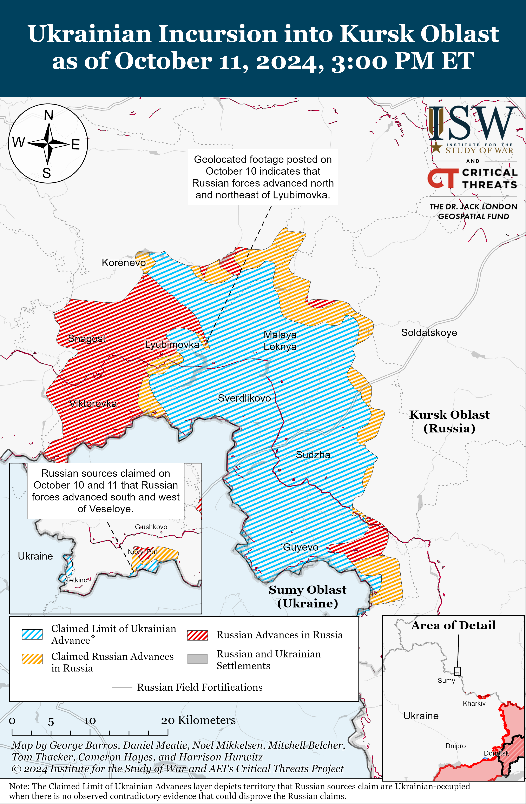
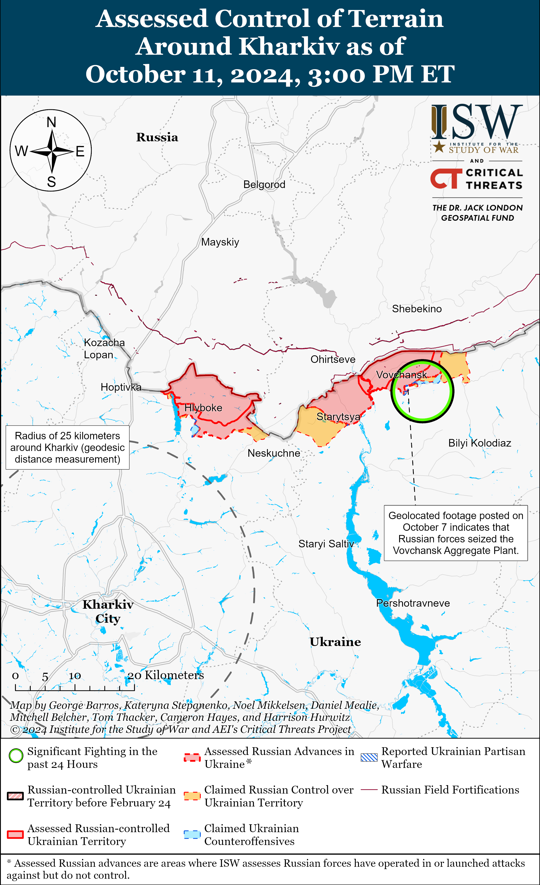
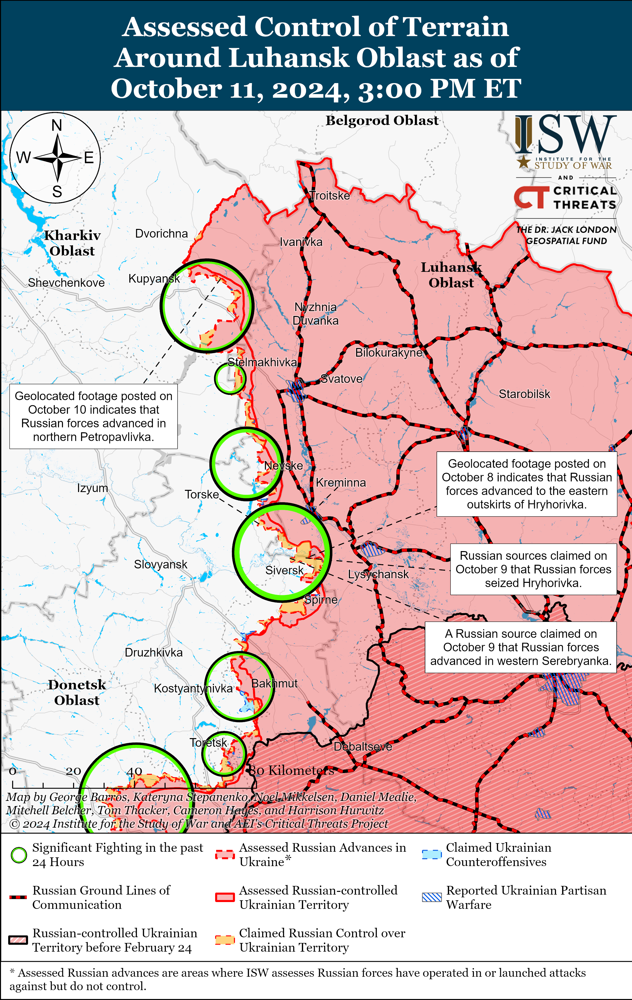
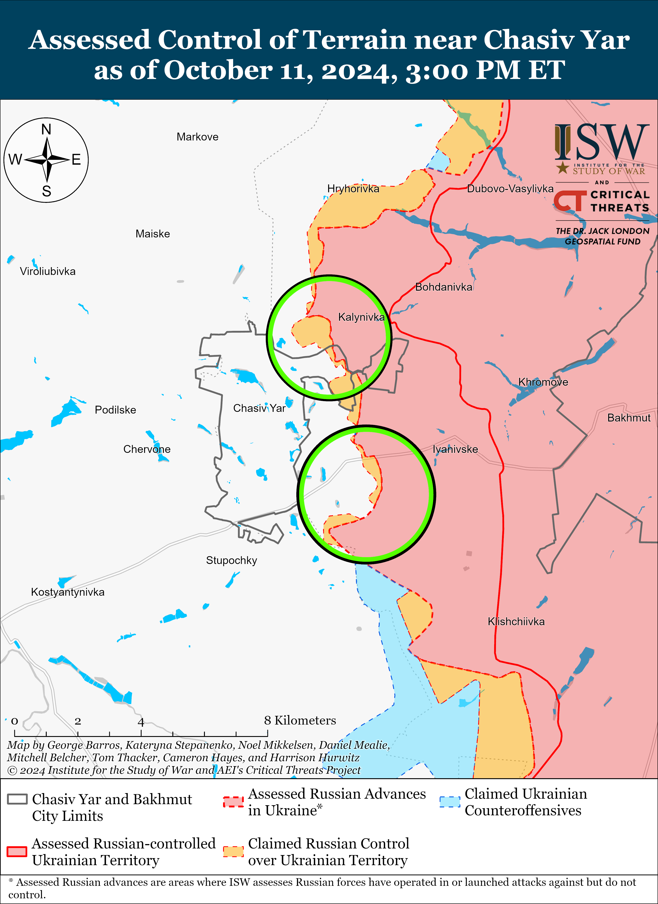
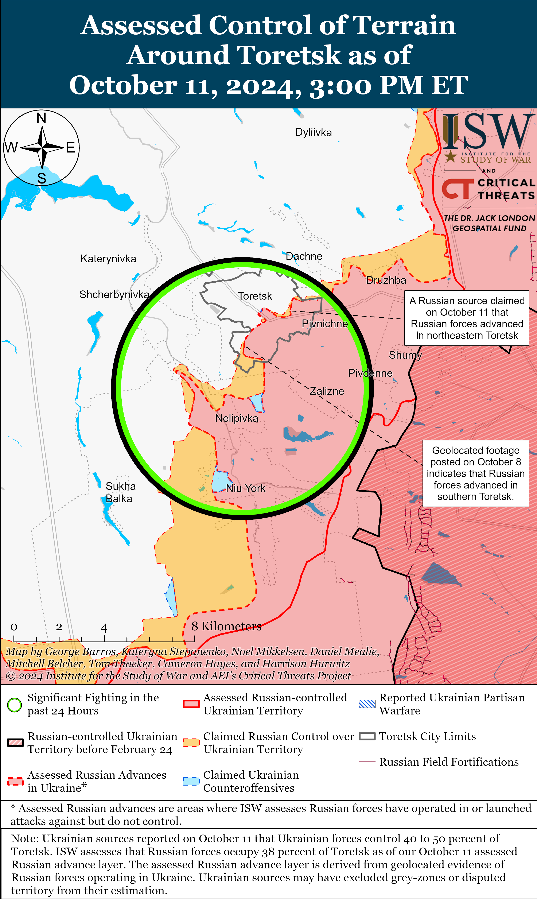
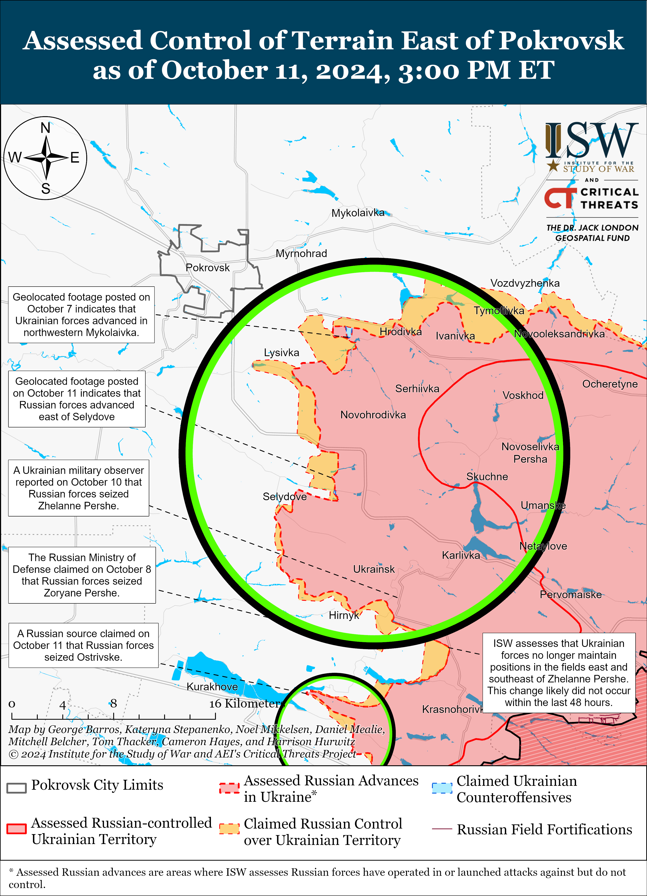
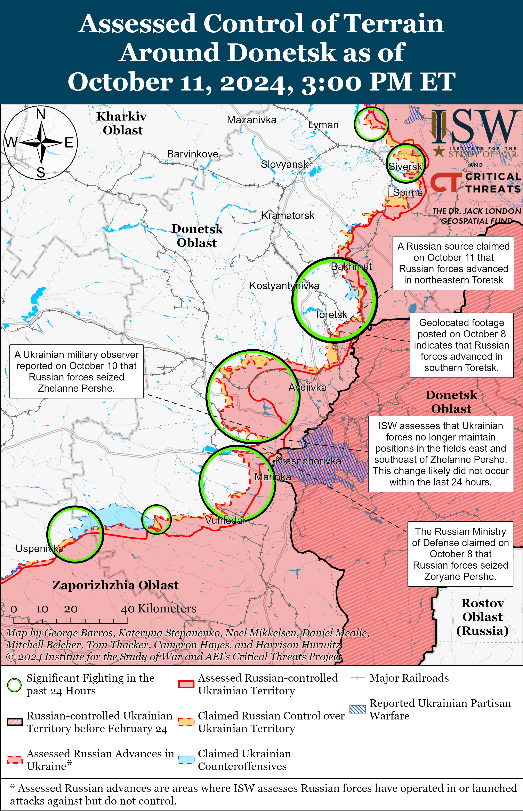
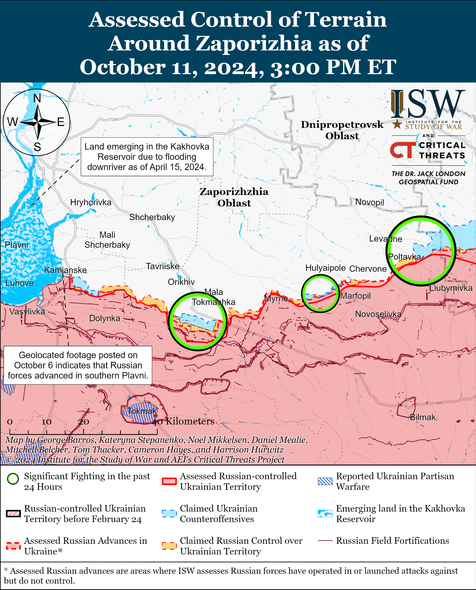
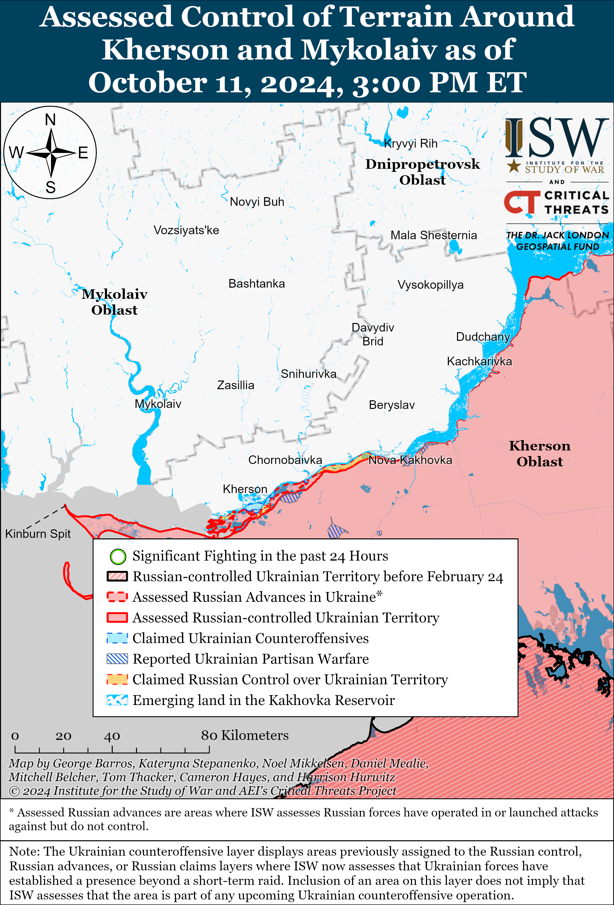

# Russian Offensive Campaign Assessment, October 11, 2024

**Riley Bailey, Christina Harward, Davit Gasparyan, Kateryna Stepanenko, Nate Trotter, and George Barros**

**October 11, 2024, 8:20pm ET**

**Click**[**here**](https://storymaps.arcgis.com/stories/36a7f6a6f5a9448496de641cf64bd375)**to see ISW’s interactive map of the Russian invasion of Ukraine. This map is updated daily alongside the static maps present in this report.**

**Click**[**here**](https://storymaps.arcgis.com/stories/83a2f24901c941d581c0c523ecd2619b)**to see ISW’s interactive map of Ukraine’s offensive in Kursk Oblast.**

**Click**[**here**](https://understandingwar.maps.arcgis.com/apps/instant/3dviewer/index.html?appid=1602762dbcde419bb957dea358449580)**to see ISW’s 3D control of terrain topographic map of Ukraine. Use of a computer (not a mobile device) is strongly recommended for using this data-heavy tool.**

**Click**[**here**](https://storymaps.arcgis.com/stories/733fe90805894bfc8562d90b106aa895)**to access ISW’s archive of interactive time-lapse maps of the Russian invasion of Ukraine. These maps complement the static control-of-terrain map that ISW produces daily by showing a dynamic frontline. ISW will update this time-lapse map archive monthly.**

**Note: The data cut-off for this product was 1pm ET on October 11. ISW will cover subsequent reports in the October 12 Russian Offensive Campaign Assessment.**

**Russian forces intensified their ongoing effort to dislodge Ukrainian forces from Kursk Oblast around the evening of October 10 and have recently advanced further into the main Ukrainian salient in Kursk Oblast while reportedly eliminating almost the entirety of the smaller Ukrainian salient in Glushkovsky Raion.**Russian forces reportedly simultaneously intensified counterattacks in Glushkovksy Raion, on the left flank of the main Ukrainian salient in Korenevsky Raion, and on the right flank of the main Ukrainian salient in Sudzhansky Raion on the evening of October 10.[1] Geolocated footage published on October 10 indicates that Russian forces recently advanced into central Kremyanoye (east of Korenevo) and to the northern outskirts of Zeleny Shlyakh (southeast of Korenevo) and enveloped Ukrainian positions near Lyubimovka (southeast of Korenevo).[2] Russian milbloggers claimed that Russian forces operating in Korenevsky Raion seized Olgovka (east of Korenevo) and Nizhny Klin (southeast of Korenevo and Lyubimovka), advanced up the outskirts of Tolsty Lug and Novoivanovka (both southeast of Korenevo), and broke through Ukrainian defenses near Lyubimovka during an alleged battalion-sized mechanized assault.[3]

ISW has yet to observe confirmation that Russian forces recently conducted a battalion-sized mechanized assault in the area or recaptured any settlements. Russian milbloggers widely claimed that Russian forces enveloped Ukrainian forces in Lyubimovka and Tolsty Lug, although some milbloggers claimed that Russian forces have encircled up to two Ukrainian battalions in Korenevsky Raion.[4] ISW has not observed confirmation that Russian forces have encircled any Ukrainian units in Kursk Oblast, however. Elements of the Russian 155th Naval Infantry Brigade (Pacific Fleet, Eastern Military District [EMD]) and 810th Naval Infantry Brigade (Black Sea Fleet, Southern Military District [SMD]) are reportedly conducting these intensified counterattacks in Korenevsky Raion.[5]

Russian milbloggers claimed that Russian forces operating in Sudzhansky Raion broke through Ukrainian defenses near Martynovka and Mykhailivka (both northeast of Sudzha), advanced two kilometers deep north of Malaya Loknya (north of Sudzha), and are enveloping Ukrainian positions near Plekhovo (southeast of Sudzha).[6] A Russian milblogger claimed that elements of the 155th Naval Infantry Brigade advanced up to the northwestern outskirts of Sudzha, although a prominent Kremlin-affiliated milblogger repeatedly denied these reports.[7] ISW has not observed any visual confirmation of Russian advances in Sudzhansky Raion since the start of intensified Russian counterattacks in the area on the evening of October 10. Elements of the 810th Naval Infantry Brigade, 40th Naval Infantry Brigade (Pacific Fleet, EMD), 11th Airborne (VDV) Brigade, 1220th Motorized Rifle Regiment (likely a mobilized unit), and unspecified Chechen Akhmat units are reportedly conducting the intensified counterattacks in Sudzhansky Raion.[8]

Russian milbloggers claimed that Russian forces pushed Ukrainian forces out of most of Glushkovksy Raion on October 10 and 11, although ISW has yet to observe visual confirmation of these alleged Russian advances. Russian milbloggers claimed that Russian forces operating south of Glushkovo pushed Ukrainian forces back from Veseloye, advanced near Medvezhye, and approached the international border with Sumy Oblast.[9] Russian milbloggers claimed that Ukrainian forces only retain limited positions near Krasnooktyabrskoye and on the outskirts of Novy Put (both south of Glushkovo and immediately on the border with Sumy Oblast) and declared the Ukrainian offensive effort in Glushkovsky Raion a failure.[10] Ukrainian forces began ground assaults into Glushkovsky Raion on September 11, 2024, following the start of Russian counterattacks in Kursk Oblast on September 10, 2024, but have not yet established a significant foothold in the area.[11] Elements of the Russian 155th Naval Infantry Brigade, 1434th Akhmat “Chechnya” Regiment, 56th VDV Regiment (7th VDV Division), 83rd VDV Brigade, and 106th VDV Division are reportedly conducting intensified counterattacks in Glushkovsky Raion.[12]

**Intensified Russian counterattacks likely aim to push Ukrainian forces out of Kursk Oblast before poor weather conditions in Fall 2024 and early Winter 2024-2025 begin to constrain battlefield maneuver.**Ukrainian officials have previously noted that Russian forces are intensifying offensive operations in Ukraine, particularly mechanized offensive operations, to take advantage of dry road and terrain conditions before rainy seasonal weather causes muddy ground conditions.[13] It is likely that this Russian operational calculus also extends to the Russian effort to recapture all of Kursk Oblast, where several Russian sources have reported the start of limited muddy terrain conditions as of October 11.[14] The Russian military command may be concerned that the poor weather conditions in Fall 2024 and early Winter 2024-2025 will encourage positional fighting in Kursk Oblast and afford Ukrainian forces more time to entrench themselves in their main salient and fortify existing positions. Better-entrenched Ukrainian forces with more extensive fortifications in Kursk Oblast will likely further complicate Russian efforts to push Ukrainian forces back across the border. Russian forces may perceive a closing window of opportunity to eliminate the Ukrainian incursion into Kursk Oblast with the current level of manpower and materiel that the Russian military has allocated to the effort. Ukrainian Commander-in-Chief General Oleksandr Syrskyi stated in a documentary published on October 10 that Russian forces have redeployed roughly 50,000 personnel from other operational directions to Kursk Oblast since the start of the incursion on August 6, 2024, and the Russian military likely aims to avoid committing more manpower to the area in the event that the Ukrainian presence persists into 2025.[15] Such redeployments have likely degraded the readiness of Russian operational groups in Kherson, Zaporizhia, and Kharkiv oblasts.

**The Russian military command likely aims to rapidly push Ukrainian forces out of Kursk Oblast in order to free up combat power for its priority offensive operations in Donetsk Oblast and to ease the theater-wide operational pressures that the Ukrainian incursion has generated.**Russian units redeployed from elsewhere in the theater to Kursk Oblast— many of which are VDV elements that the Russian military has routinely used to rapidly reinforce priority operational efforts — could have served as reinforcements for the Russian military’s priority offensive operations in the Pokrovsk direction and western Donetsk Oblast.[16] The Russian military has instead relied on the operational reserves it established ahead of its Summer 2024 offensive operation to sustain its offensive tempo in Donetsk Oblast, and the exhaustion of these operational reserves will contribute to the likely culmination of the Russian Summer 2024 offensive operation in the coming months.[17] The Russian military command likely hopes that by rapidly eliminating the Ukrainian incursion in Kursk Oblast it can redeploy forces from Kursk Oblast to Donetsk Oblast and stave off culmination before it can achieve its operational objectives of seizing Pokrovsk and eliminating the wider Ukrainian salient in western Donetsk Oblast.[18] Russian forces have yet to make rapid gains in Kursk Oblast since starting counterattacks on September 10, however, and intensified counterattacks threaten to exhaust and degrade the very combat power that the Russian military hopes to recommit to the priority offensive operations in Donetsk Oblast.

**South Korean and Ukrainian officials reportedly continue to identify North Korean military personnel already fighting in Ukraine as well as training in Russia for possible future deployments alongside the Russian military.**The *Washington Post*reported on October 11 that South Korean and Ukrainian officials stated that North Korean soldiers are operating alongside Russian forces in Ukraine.[19] A Ukrainian military intelligence official reportedly stated that individual North Korean officers are observing Russian forces and studying the battlefield in Russian-occupied areas of Ukraine, but that Ukraine has not yet observed North Korean units operating in Ukraine. The Ukrainian official reportedly added that “several thousand” North Korean infantry personnel are training within Russia and that the Russian military command could deploy them to the frontline in Ukraine by the end of 2024 or to Russian border areas to free up Russian “reserves” to fight within Ukraine. South Korean and Ukrainian officials have recently reported that North Korean military personnel are likely operating in occupied Donetsk Oblast, and a recent Ukrainian missile strike near occupied Donetsk City reportedly killed several North Korean military officials.[20] The extent of the North Korean force grouping that Russia could deploy to the frontline or that could free up Russian forces along the border is unclear, but these scenarios may also aid Russian efforts to commit additional manpower to priority offensive operations in Ukraine and prolong the culmination of the Russian Summer 2024 offensive operation. North Korean troop deployments to Ukraine could also create opportunities for Ukrainian exploitation, depending on the quality, force structure, arrayment, and interoperability of North Korean forces.

**Western partners continue to announce and provide new military assistance to Ukraine.**The Norwegian government announced on October 11 that Norway will allocate 967 million Norwegian kroner (about $90 million) for projects aimed at increasing Norway’s defense capacity, including to produce defense materiel for Ukraine.[21] German Chancellor Olaf Scholz announced on October 11 that Germany, along with Belgium, Denmark, and Norway, will allocate 1.4 billion euros (about $1.5 billion) in military aid to Ukraine by the end of 2024 which will include the transfer of IRIS-T and Skynex air defense systems as well as Gepard self-propelled anti-aircraft guns, self-propelled artillery guns, armored vehicles, combat drones, radars, and artillery ammunition.[22] Czech Prime Minister Petr Fiala announced that Ukraine will receive approximately 500 thousand 155-mm artillery ammunition as a part of the Czech Initiative by the end of 2024 while stressing that the program may expand with participation from other donor countries.[23] French outlet *Avion legendaires*reported on October 9 that France will deliver between 12 and 20 Dassault Mirage 2000-F5 fighter jets to Ukraine in early 2025 following French Defense Minister Sebastien Lecornu’s announcement that France would send an unspecified number of the fighter jets to Ukraine in the first quarter of 2025.[24] Ukrainian Defense Minister Rustem Umerov announced on October 11 that he met with Italian Defense Minister Guido Crosetto and discussed the possibility of increasing Italian investment in the Ukrainian defense industrial base (DIB).[25] Umerov also noted the potential creation of joint Ukrainian-Italian defense enterprises given Ukraine’s strong industrial capacity.

**Ukrainian President Volodymyr Zelensky continues diplomatic efforts to establish and clarify Ukraine’s strategic vision for peace.** Zelensky denied on October 10 claims that he discussed with Western allies Ukraine’s readiness for a ceasefire along the current frontline and territorial concessions to Russia in exchange for U.S. security guarantees and accelerated EU membership.[26] The Ukrainian Ministry of Foreign Affairs (MFA) announced on October 10 that it refutes allegations voiced in foreign media about Ukraine’s alleged readiness to make concessions to Russia at the expense of its own sovereignty and territorial integrity, emphasizing the inadmissibility of such Ukrainian concessions.[27] The MFA noted that the only realistic approach to just and sustainable peace in Ukraine is Ukraine’s proposed Peace Formula based on principles of the UN Charter and full restoration of Ukraine’s territorial integrity. Zelensky stated during a meeting with Italian Prime Minister Giorgia Meloni on October 11 that Ukraine aims to create the necessary and fair conditions for honest diplomacy regarding achieving lasting peace in Ukraine. Meloni noted that peace in Ukraine cannot mean surrender and that Italy will support Ukraine in establishing conditions conducive to principled peace negotiations.

**Chechen Republic Head Ramzan Kadyrov declared a “blood feud” against Russian legislators, suggesting that Kadyrov is becoming increasingly emboldened in his personal political disputes.**Kadyrov declared a blood feud on October 10 against Republic of Dagestan Senator Suleiman Kerminov and State Duma Deputies Bekkhan Barakhoyev and Rizvan Kurbanov, claiming that they “seized” Russia’s largest online retailer Wildberries from the company’s co-founder Vladislav Bakalchuk and were plotting to assassinate Kadyrov.[28] Vladislav Bakalchuk, who co-founded Wildberries with his ex-wife and current Wildberries CEO Tatyana Bakalchuk, led 20 to 30 armed accomplices on simultaneous assaults of two Wildberries offices in Moscow City in September 2024.[29] Vladislav previously appealed to Kadyrov to help prevent Tatyana from taking over the company and claimed days before the September armed assaults that Kadyrov saved his life and kept him out of prison.[30] Kadyrov notably announced the blood feud in a video in the Chechen language on his Telegram channel but did not mention the feud specifically in the accompanying Russian text, likely in an attempt to prevent its reporting in Russian media.[31] Kadyrov has previously rhetorically attacked Kremlin officials, speaking out against Russian Investigative Committee Head Alexander Bastrykin’s June 2024 statements about religious extremism in Russia.[32] It is unclear if Russian President Vladimir Putin will respond to Kadyrov’s announcement of the blood feud, as Putin has supported Kadyrov’s rule over Chechnya but has consistently attempted to posture Russia as a harmonious multi-ethnic and multi-religious society.[33]

**Ukrainian officials confirmed that Ukrainian journalist Viktoriya Roshchyna died in Russian captivity.**The Ukrainian Humanitarian and Information Policy Committee confirmed on October 10 that Roshchyna died in Russian captivity but that the circumstances surrounding her death are unknown.[34] The Ukrainian Prosecutor General’s Office stated that it upgraded the case surrounding Roshchyna’s death to a war crime and intentional murder.[35] Ukraine’s Main Military Intelligence Directorate (GUR) Spokesperson Andriy Yusov stated on October 10 that Roshchyna was included on a list of prisoners that Ukraine and Russia were to exchange in the near future.[36] Roshchyna disappeared in occupied Ukraine in early August 2023, and the Russian Ministry of Defense (MoD) reportedly sent a letter to Roshchyna’s family on October 10 stating that she had died on September 19.[37] The Ukrainian Ministry of Reintegration of Temporarily Occupied Territories stated that there were 4,337 Ukrainians in Russian captivity as of November 2023, including 763 civilians.[38] These numbers, which rely on data from the Red Cross may be even higher as the Red Cross does not always have access to places where Russian authorities hold Ukrainian civilians, including detention centers and penal colonies in occupied territories.

**Ukrainian officials announced new appointments in the Ministry of Defense (MoD).**Ukrainian Defense Minister Rustem Umerov announced on October 11 the appointment of Serhiy Boyev to the post of Deputy Defense Minister for European Integration and Serhii Melnyk as the Deputy responsible for education, medicine, humanitarian support, and human capital policy.[39] Umerov also noted the creation of supervisory boards for the Defense Procurement Agency and the State Logistics Operator.

**Key Takeaways:**

- **Russian forces intensified their ongoing effort to dislodge Ukrainian forces from Kursk Oblast around the evening of October 10 and have recently advanced further into the main Ukrainian salient in Kursk Oblast while reportedly eliminating almost the entirety of the smaller Ukrainian salient in Glushkovsky Raion.**
- **Intensified Russian counterattacks likely aim to push Ukrainian forces out of Kursk Oblast before poor weather conditions in Fall 2024 and early Winter 2024-2025 begin to constrain battlefield maneuver.**
- **The Russian military command likely aims to rapidly push Ukrainian forces out of Kursk Oblast in order to free up combat power for its priority offensive operations in Donetsk Oblast and to ease the theater-wide operational pressures that the Ukrainian incursion has generated.**
- **South Korean and Ukrainian officials reportedly continue to identify North Korean military personnel already fighting in Ukraine as well as training in Russia for possible future deployments alongside the Russian military.**
- **Western partners continue to announce and provide new military assistance to Ukraine.**
- **Ukrainian President Volodymyr Zelensky continues diplomatic efforts to establish and clarify Ukraine’s strategic vision for peace.**
- **Chechen Republic Head Ramzan Kadyrov declared a “blood feud” against Russian legislators, suggesting that Kadyrov is becoming increasingly emboldened in his personal political disputes.**
- **Ukrainian officials confirmed that Ukrainian journalist Viktoriya Roshchyna died in Russian captivity.**
- **Ukrainian officials announced new appointments in the Ministry of Defense (MoD).**
- **Russian forces recently advanced near Pokrovsk and Kurakhove.**
- **The Kremlin is deceptively recruiting young African women to assemble Iranian-designed Shahed drones in the Republic of Tatarstan, likely to address labor shortages in Russia.**

***We do not report in detail on Russian war crimes because these activities are well-covered in Western media and do not directly affect the military operations we are assessing and forecasting. We will continue to evaluate and report on the effects of these criminal activities on the Ukrainian military and the Ukrainian population and specifically on combat in Ukrainian urban areas. We utterly condemn Russian violations of the laws of armed conflict and the Geneva Conventions and crimes against humanity even though we do not describe them in these reports.***

- Ukrainian Operations in the Russian Federation
- Russian Main Effort – Eastern Ukraine (comprised of three subordinate main efforts)
- Russian Subordinate Main Effort #1 – Push Ukrainian forces back from the international border with Belgorod Oblast and approach to within tube artillery range of Kharkiv City
- Russian Subordinate Main Effort #2 – Capture the remainder of Luhansk Oblast and push westward into eastern Kharkiv Oblast and encircle northern Donetsk Oblast
- Russian Subordinate Main Effort #3 – Capture the entirety of Donetsk Oblast
- Russian Supporting Effort – Southern Axis
- Russian Air, Missile, and Drone Campaign
- Russian Mobilization and Force Generation Efforts
- Russian Technological Adaptations
- Activities in Russian-occupied areas
- Ukrainian Defense Industrial Base Efforts
- Russian Information Operations and Narratives
- Significant Activity in Belarus

**Ukrainian Operations in the Russian Federation**

*See topline text for details about Ukrainian and Russian operations in Kursk Oblast.*

Satellite imagery collected on October 11 shows that Ukrainian forces significantly damaged a Russian storage facility near Oktyabrsky, Krasnodar Krai on the night of October 9 to 10.[40] The Ukrainian General Staff reported on October 9 that Ukrainian naval forces and Ukraine’s Security Service (SBU) struck a Russian Shahed drone storage facility near Oktyabrsky, Krasnodar Krai and that Russian forces stored around 400 Shahed drones at the facility.[41]

**Russian Main Effort – Eastern Ukraine**

**Russian Subordinate Main Effort #1 – Kharkiv Oblast (Russian objective: Push Ukrainian forces back from the international border with Belgorod Oblast and approach to within tube artillery range of Kharkiv City)**

Russian forces continued offensive operations northeast of Kharkiv City near Vovchansk, Starytsya, and Tykhe on October 10 and 11, but there were no confirmed changes to the frontline.[42] The Ukrainian General Staff reported on October 11 that Ukrainian forces recently shot down a Russian Mi-8 helicopter in the Kharkiv direction.[43]

**Russian Subordinate Main Effort #2 – Luhansk Oblast (Russian objective: Capture the remainder of Luhansk Oblast and push westward into eastern Kharkiv Oblast and northern Donetsk Oblast)**

Russian forces continued assaults along the Kupyansk-Svatove-Kreminna line on October 11 but did not make confirmed territorial gains. Russian sources claimed that Russian forces seized Andriivka (west of Svatove) and advanced near Kyslivka (southeast of Kupyansk), and Nevske (northwest of Kreminna).[44] A Russian source claimed that elements of the 144th Guards Motorized Rifle Division (20th Guards Combined Arms Army [CAA], Moscow Military District [MMD]) advanced northwest of Kreminna near Novosadove.[45] ISW has not observed visual confirmation of these Russian claims, however. Russian forces continued assaults northeast of Kupyansk near Synkivka; east of Kupyansk near Petropavlivka; southeast of Kupyansk near Stepova Novoselivka, Kolisnykivka, Lozova, Stelmakhivka, and Pishchane; northwest of Kreminna near Hrekivka, Makiivka, Nevske, Novosadove, Ploshchanka, and Druzhelyubivka; west of Kreminna near Torske; and southwest of Kreminna near the Serebryanske forest area on October 10 and 11.[46]

**Russian Subordinate Main Effort #3 – Donetsk Oblast (Russian objective: Capture the entirety of Donetsk Oblast, the claimed territory of Russia’s proxies in Donbas)**

Russian forces continued offensive operations east of Siversk near Verkhnokamyanske on October 10 and 11, but there were no confirmed changes to the frontline.[47] Elements of the Russian 2nd Artillery Brigade (3rd Combined Arms Army [CAA], formerly 2nd Luhansk People’s Republic [LNR] Army Corps [AC]) are reportedly operating near Siversk.[48]

Russian forces continued offensive operations near Chasiv Yar on October 11, but there were no confirmed changes to the frontline. The Ukrainian General Staff reported that Russian forces conducted offensive operations north of Chasiv Yar near Kalynivka and Orikhovo-Vasylivka; near Chasiv Yar itself; east of Chasiv Yar near Ivanivske; and south of Chasiv Yar towards Stupochky on October 10 and 11.[49] Ukrainian “Luhansk” Group of Forces Spokesperson Anastasia Bobovnikova stated on October 11 that Russian forces have decreased the tempo of their assaults near Chasiv Yar but are transferring reinforcements to the area, suggesting that Russian forces are preparing to increase offensive pressure in the area.[50] Russian security forces claimed to Kremlin newswire *TASS*that Ukrainian forces have withdrawn from positions on the western outskirts of Chasiv Yar, and Head of the “Melodiya” Intelligence Center of the 88th “Hispaniola” Volunteer Brigade (Russian Volunteer Corps) claimed that there is heavy fighting in Zhovtnevyi Microraion (eastern Chasiv Yar), where Russian forces are trying to cut off Ukrainian ground lines of communication (GLOCs).[51]

Russian forces continued offensive operations in the Toretsk direction on October 11, and Ukrainian officials acknowledged that Russian forces have seized about half of Toretsk, though ISW is unable to confirm changes to the frontline. Russian forces conducted offensive operations near Toretsk; west of Toretsk near Shcherbynivka; and south of Toretsk near Niu York on October 10 and 11.[52] Russian milbloggers claimed that Russian forces advanced 1.5 kilometers to the Toretsk Mine waste heap in western Toretsk, 500 meters north of the waste heap, within northeastern Toretsk, and 750 meters north of Niu York (south of Toretsk).[53] ISW has not observed confirmation of these claims, however. Ukrainian Toretsk Military Administration Head Vasily Chinchik stated that Russian forces control 50 to 60 percent of Toretsk and that Russian forces are trying to rapidly seize the settlement.[54] Available visual evidence confirms that Russian forces occupy 38 percent of Toretsk, though Russian forces likely occupy more than what ISW can confirm from open sources at this time. Bobovnikova stated that Russian forces advanced near Tsentralna Street within Toretsk and that Russian forces are suffering significant losses in the Toretsk direction but are replenishing personnel at forward positions.[55] Bobovnikova stated that most of the Russian personnel near Toretsk are contract servicemembers (*kontrakniki*) in motorized rifle brigades but that airborne (VDV) and special forces are also operating in the area.[56] Bobovnikova stated that Russian forces are first conducting artillery strikes to destroy Ukrainian fortifications and buildings to prevent Ukrainian cover and concealment and then searching for weak areas in Ukrainian defenses and conducting assaults in small groups.[57]

Ukrainian and Russian forces recently advanced southeast of Pokrovsk amid continued Russian offensive operations in the area on October 11. Geolocated footage published on October 11 shows Ukrainian forces clearing Russian positions in a forested area north of Novohrodivka (southeast of Pokrovsk), indicating that Russian forces advanced in the area at a prior date but that Ukrainian forces recently pushed Russian forces out of the area.[58] Additional geolocated footage published on October 10 indicates that Russian forces recently advanced to a concrete plant east of Selydove (southeast of Pokrovsk).[59] Russian milbloggers claimed that Russian forces gained a foothold close to the railway near Tsukuryne (southeast of Pokrovsk and south of Selydove) and in eastern Lysivka (southeast of Pokrovsk and west of Novohrodivka).[60] A Russian source claimed that Russian forces are approaching the C050951 Seldyove-Novodmytrivka road and that Russian forces have already blocked two of the five roads out of Selydove.[61] Russian forces conducted offensive operations east of Pokrovsk near Myrolyubivka, Myrnohrad, Promin, and Kalynove and southeast of Pokrovsk near Lysivka, Selydove, Krutyi Yar, Tsukuryne, and Novoselydivka on October 10 and 11.[62] Elements of the Russian “Black Knives Division” and “Somali” Battalion of the 9th Motorized Rifle Brigade (51st CAA, Southern Military District [SMD]) are reportedly operating in the Pokrovsk direction.[63]

Russian forces recently advanced east of Kurakhove amid continued Russian offensive operations in the area on October 11. Geolocated footage published on October 7 indicates that Russian forces recently advanced into western Ostrivske (east of Kurakhove) during a company-sized mechanized assault.[64] Russian sources, including the Russian Ministry of Defense (MoD), claimed on October 11 that Russian forces completely seized Ostrivske and are roughly a kilometer from Kurakhove, although ISW has not observed visual confirmation of these claims.[65] Russian forces continued offensive operations east of Kurakhove near Heorhiivka and Maksymilyanivka on October 10 and 11.[66] The commander of a Ukrainian brigade operating in the Kurakhove direction stated that Russian forces have intensified mechanized assaults in the area in the past month, and ISW has observed a relatively high tempo of mechanized Russian assaults in western Donetsk Oblast since late July 2024.[67] The Ukrainian commander stated that Russian forces typically conduct mechanized assaults in columns comprised of some combination of tanks, MT-LBs, and armored personnel carriers (APCs) and that Russian mechanized assaults continue to result in high armored vehicle losses.[68] The Ukrainian commander stated that Russian forces have strong electronic warfare (EW) systems in the Kurakhove direction and will deploy EW systems with armored vehicles in the middle of a mechanized column.[69]

Russian forces continued offensive operations southwest of Donetsk City on October 11 but did not make any confirmed gains. Russian forces continued offensive operations near Kostyantynivka, Katerynivka, Antonivka, Bohoyavlenka, and Zolota Nyva on October 10 and 11.[70] Elements of the Russian 238th Artillery Brigade (8th CAA, Southern Military District [SMD]) and the 39th Motorized Rifle Brigade (68th AC, Eastern Military District [EMD]) are reportedly operating near Katerynivka, elements of the 14th Spetsnaz Brigade (Special Forces of the Main Directorate of the General Staff of the Russian Armed Forces [GRU]) are reportedly operating in the direction of Kostyantynipilske, and elements of the “Baikal” detachment of the 40th Naval Infantry Brigade (Pacific Fleet, EMD) are reportedly operating near Zolota Nyva.[71]

Russian forces conducted ground attacks in the Donetsk-Zaporizhia Oblast border area southwest of Velyka Novosilka near Rivnopil, Novodarivka, Levadne, and Olhivske on October 11.[72]

**Russian Supporting Effort – Southern Axis (Russian objective: Maintain frontline positions and secure rear areas against Ukrainian strikes)**

Russian forces continued offensive operations in western Zaporizhia Oblast, including near Robotyne and northeast of Robotyne near Mala Tokmachka on October 11 but did not make any confirmed advances.[73] A Russian milblogger claimed that Ukrainian forces conducted an unsuccessful counterattack near Kamyanske (south of Stepnohirsk) on October 10.[74] Elements of the Russian 70th Motorized Rifle Regiment (42nd Motorized Rifle Division, 58th Combined Arms Army [CAA], Southern Military District [SMD]) are reportedly operating near Robotyne.[75] Elements of the Russian 11th Air Force and Air Defense Army (Russian Aerospace Forces [VKS] and Eastern Military District [EMD]) and Russian 38th Motorized Rifle Brigade (38th CAA, EMD) are reportedly operating near Kopani (northwest of Robotyne).[76]

Russian forces continued assaults in the Kherson direction on October 11, but there were no changes to the frontline. Elements of the Russian BARS-33 Detachment (Russian Combat Army Reserve) reportedly continue to operate in the Kherson direction.[77]

**Russian Air, Missile, and Drone Campaign (Russian Objective: Target Ukrainian military and civilian infrastructure in the rear and on the frontline)**

Russian forces conducted a series of missile and drone strikes against Ukraine during the day on October 10 and on the night of October 10 to 11. The Ukrainian Air Force reported that Russian forces launched an Iskander-M ballistic missile from occupied Crimea; a Kh-31P air-guided missile from airspace over the Black Sea; and 66 strike drones from Kursk Oblast.[78] The Ukrainian Air Force reported that Ukrainian forces shot down 29 drones over Kyiv, Cherkasy, Vinnytsia, Sumy, Poltava, Dnipropetrovsk, Kharkiv, Chernihiv, and Zhytomyr oblasts.[79] The Ukrainian Air Force added that 31 drones were “lost” over Ukraine possibly as a result of Ukrainian electronic warfare efforts, two drones returned to Russia, and four drones remained in the Ukrainian airspace as of 1100 local time.[80] Mykolaiv Oblast Administration Head Vitaliy Kim reported on October 11 that Russian forces struck a critical infrastructure facility in Mykolaiv City with an unspecified number of unspecified ballistic missiles on October 10, and a Russian milblogger claimed that two Russian Iskander-M missiles struck a ship-building facility in Mykolaiv City.[81]

Russian missile strikes against Ukrainian port infrastructure on October 10 are reportedly increasing shipping insurance rates, and Russian forces likely view such impacts as a means to constrain maritime traffic to Ukrainian ports through the Black Sea.[82] *Bloomberg*reported on October 10, citing two people involved in the ship insurance market, that insurance coverage rates surged to above one percent of the value of the ship from 0.75 percent last week (the week of September 29 to October 5) likely due to the recent increase in Russian missile strikes against Ukrainian port infrastructure and commercial vessels.[83] Ukrainian officials told *Bloomberg* that Russian forces struck three vessels with missiles within four days – a container vessel with humanitarian cargo on October 9 and two ships loaded with grain on October 6 and 7.[84] A Kremlin-affiliated milblogger commented on the *Bloomberg*report by claiming that Russian strikes against ships entering the Odesa City port could decrease Ukrainian maritime traffic in the Black Sea and accomplish the Russian objective of imposing a blockade on Ukrainian ports, which the Russian Black Sea Fleet (BSF) was unable to accomplish due to successful Ukrainian strikes against Russian naval assets.[85] ISW previously assessed that Russian forces launched the missile and drone strike campaign against Ukrainian port infrastructure in Summer and Fall 2023 to impose a de facto blockade on Ukrainian maritime activity in the Black Sea but failed to do so after Ukrainian forces launched a preemptive strike campaign against Russian BSF assets in occupied Crimea and the Black Sea.[86]

Former Ukrainian Air Force spokesperson Colonel Yuriy Ihnat reported on October 10 that Russian forces damaged Western-provided Patriot air defense systems in Dnipropetrovsk Oblast during a ballistic missile strike on October 9.[87] Ihnat stated that Ukrainian Patriot systems repelled half of the Russian ballistic missiles launched at Dnipropetrovsk Oblast on October 9 and that Ukrainian Patriot systems remain primary targets for Russian forces because of their effectiveness in denying Russian frontline aviation operations.[88] Russian sources claimed that a Russian Iskander-M missile struck a Ukrainian Patriot system to the southwest of Dnipro City near Pashena Balka, Dnipropetrovsk Oblast on October 9.[89]

**Russian Mobilization and Force Generation Efforts (Russian objective: Expand combat power without conducting general mobilization)**

The Kremlin is deceptively recruiting young African women to assemble Iranian-designed Shahed drones in the Republic of Tatarstan, likely to address labor shortages in Russia. The Associated Press(AP)*,*citing interviews with a half-dozen African women, reported that the Kremlin used social media ads promising free plane tickets, money, and participation in a work-study program to lure about 200 18- to 22-year-old women from Uganda, Rwanda, Kenya, South Sudan, Sierra Leone, and Nigeria to work in Tatarstan.[90] AP reported that the Kremlin is also targeting young women in Asia and Latin America and has already recruited women from Sri Lanka. AP noted that inexperienced African women are working alongside Russian vocational students, some of whom are as young as 16, at a plant in Tatarstan’s Alabuga Special Economic Zone.

Russian federal subjects continued to increase one-time enlistment bonuses aimed at incentivizing volunteer recruitment and avoiding the need to declare additional mobilization waves in Russia. Samara Oblast Governor Vyacheslav Fedorishchev signed a decree to increase one-time enlistment bonuses from the original 795,000 rubles (about $8,300) to two million rubles (about $20,880) starting October 16.[91] Samara Oblast previously announced an increase of enlistment bonuses to 1.2 million rubles (about $12,580) starting August 1 and likely increased the bonus to incentivize volunteer recruitment. Ukraine’s Main Military Intelligence Directorate (GUR) reported that Russian officials are increasing financial compensations to avoid announcing another mobilization wave and that mobilization would spark a series of protests in large Russian cities.[92] The GUR added that Kremlin social scientists spread rumors that Russia will announce another mobilization wave following municipal elections on September 8 in an effort to survey the reaction of Russian society to the prospect. The GUR assessed that the Russian public likely did not support the idea of another mobilization wave and that the sudden increases in financial compensations to volunteers indicate that Russian federal subjects are unable to effectively recruit personnel based on ideological motivation alone. The GUR reported that Russian officials assess that Russia will be able to replace their personnel losses via financially incentivized recruitment drives without declaring general mobilization at least until the end of 2024.

Russian municipal officials are also expanding financial incentives to migrants to support the Russian volunteer recruitment drive. The Yekaterinburg City Administration announced that the city would provide migrant families with 200,000 rubles ($2,090) if their family member signs up to fight in Ukraine.[93] A Local Russian outlet reported that Yekaterinburg officials are no longer requiring migrants to have permanent residence in Yekaterinburg.

Russian federal officials continued efforts to appease Russian servicemen who have long complained about their inability to receive veteran statuses due to problems with Russian bureaucratic procedures. Kremlin-affiliated outlets reported that Russian Defense Minister Andrei Belousov introduced an initiative that will allow Russian servicemen to receive certificates confirming their veteran statuses electronically via the Russian State Services (Gosuslugi) portal or at any multifunctional centers for the provision of state and municipal services starting November 1, 2024.[94] Russian servicemen need veteran certificates to obtain financial compensation and state benefits.

The Russian MoD reportedly permitted Russian military registration officers in the Republic of Bashkortostan to conduct medical examinations of military personnel on sick leave and servicemen suspected or accused of crimes against the military at Russian military enlistment centers.[95] A Russian Telegram channel focusing on Russian military law obtained a document that indicates that servicemen on sick leave will no longer need to return to their military unit and wait for their commanders to approve their medical examination referrals in combat conditions.[96]

Russian President Vladimir Putin signed a decree on October 10 expanding the Russian MoD’s powers by granting it the authority to organize and supervise industrial safety procedures at nuclear weapons development facilities.[97]

**Russian Technological Adaptations (Russian objective: Introduce technological innovations to optimize systems for use in Ukraine)**

Russian Defense Minister Andrei Belousov highlighted the development of Russian military drone technology and training on October 11. Belousov inspected the new Rubicon Center for Advanced Unmanned Technologies and held a meeting about the development of unmanned technologies within the Russian military.[98] Belousov ordered the Rubicon Center to form five detachments to operate in Ukraine and to train combat crew specialists and stated that military schools should introduce a “family of new military specialties” related to drones.[99] Belousov reportedly heard reports about the Rubicon Center’s detachments already operating in the Donetsk, Belgorod, and Kursk directions.[100] The Russian Ministry of Defense (MoD) claimed that the center is focused on training drone specialists to become instructors for active military units, and a Russian insider source claimed that Russia will rely on volunteers who have independently developed mass drone training formats.[101] The center also reportedly develops and tests advanced robotic systems, studies drone operating conditions and artificial intelligence (AI), and works with the “people’s defense industry.” The Russian ultranationalist milblogger community recently expressed mass outrage after a Russian military commander disbanded a specialized drone unit and committed drone operators to frontal assaults in Donetsk Oblast, resulting in the operators’ deaths.[102] Milbloggers complained about the Russian MoD investigation into the incident, claiming that the Russian MoD tried to downplay the issue, and Belousov may be highlighting the Russian MoD’s focus on drone specialist training in response to this milblogger outcry.

Russian Navy Deputy Commander-in-Chief for Armament Vice-Admiral Igor Mukhametshin announced on October 11 that Russia released the “Yakutsk” large diesel-electric submarine of the *Project 636.3 Varshavyanka-*class series at the Admiralskiye Verfi (Admiralty Shipyards) shipbuilding enterprise.[103] Mukhametshin stated that the ”Yakutsk” submarine is the sixth and last submarine developed as part of *Project 636.3*for the Pacific Fleet. Mukhametshin also noted that the *Varshavyanka*-class submarines are equipped with high-precision weapons.

Ukrainian sources stated on October 11 that Russian forces are retrofitting drones with radio communication suppression means to protect against Ukrainian first-person view (FPV) drones.[104] Ukrainian forces reportedly shot down a Russian reconnaissance drone with a Russian-made Zerkaltse compact electronic warfare (EW) device that scans video channels in flight, finds the video signal from a Ukrainian drone, and turns on a stronger interference on the same video frequency to disrupt the transmission of video back to Ukrainian operators.

A Russian milblogger group is reportedly developing surface drones built from electric hoverboard-type skateboards.[105] A Polish technology online outlet reported that the group is in the advanced development stage of creating four-wheeled robots made from converted two hoverboards and nicknamed “combat cockroaches” that purportedly have the ability to traverse various types of terrain, including tall grass.[106] The Polish outlet, citing the group, claimed that the hoverboards can lift up to 100 kilograms and travel at speeds of up to 12 kilometers per hour with a three-hour-long battery life. The hoverboards reportedly have a range of two kilometers.

**Ukrainian Defense Industrial Efforts (Ukrainian objective: Develop its defense industrial base to become more self-sufficient in cooperation with US, European, and international partners)**

*ISW is suspending coverage of Ukrainian defense industrial efforts until further notice.*

**Activities in Russian-occupied areas (Russian objective: Consolidate administrative control of annexed areas; forcibly integrate Ukrainian citizens into Russian sociocultural, economic, military, and governance systems)**

*ISW is not reporting on activities in Russian-occupied areas today.*

**Russian Information Operations and Narratives**

Russian President Vladimir Putin spoke at the “Interconnection of Times and Civilizations – the Basis of Peace and Development” international forum in Ashgabat, Turkmenistan on October 11 and postured Russia as a leader in the formation of a “new world order.”[107] Putin claimed that economic and political “centers” are emerging “primarily” in the Global East and the Global South. Putin claimed that Russia is open to discussing the formation of a “new world order” with Russia’s “friends, partners, and like-minded people,” including within the Commonwealth of Independent States (CIS), Eurasian Economic Union (EAEU), Shanghai Cooperation Organization (SCO), and BRICS. Putin and other Kremlin officials have recently promoted Russia’s proposed “Eurasian security architecture” and have advocated for its creation within these international organizations.[108] ISW previously assessed that Russia’s proposal of a Eurasian security architecture is consistent with Russia’s long-term strategic goal of disbanding Western unity, dismantling NATO from within, and destroying the current world order.[109]

**Significant activity in Belarus (Russian efforts to increase its military presence in Belarus and further integrate Belarus into Russian-favorable frameworks and Wagner Group activity in Belarus)**

Belarusian outlet *Zerkalo*reported on October 11 that the Belarusian Ministry of Information has updated its list of “extremist materials” to include a Telegram channel entitled “For the Union State of Belarus and Russia” which, as its title suggests, supports the integration of Belarus and Russia and reportedly has content with an anti-Belarusian orientation.[110] The Myadel District Court of Minsk Oblast previously recognized the materials of the Telegram channel as “extremist” on October 9.

Belarus continues to aid Russia in its systemic efforts to deport and re-educate Ukrainian children. Freedom House, in collaboration with Belarusian insider sources and human rights organizations, published a report in October 2024 that Belarusian officials have deported at least 2,219 Ukrainian children from occupied Ukrainian territories to Belarus from 2021 to June 2024.[111] The report states that at least 27 Ukrainian children who were in Belarusian camps were later transported to camps in Russia and that Belarus hosts 18 confirmed re-education camps that are part of a broader network of 67 institutions in Russia and 13 in occupied Ukraine. The report also noted the militarization of Ukrainian children, aimed at preparing and recruiting children for future service in Russian military organizations, and the indoctrination of anti-Ukrainian sentiment during their time in Belarus.

**Note: ISW does not receive any classified material from any source, uses only publicly available information, and draws extensively on Russian, Ukrainian, and Western reporting and social media as well as commercially available satellite imagery and other geospatial data as the basis for these reports. References to all sources used are provided in the endnotes of each update.**

---

[1] https://t.me/rybar/64351 ; https://t.me/rybar/64324 ; https://t.me/DeepStateUA/20483 ; https://t.me/mig41/37370 ; https://t.me/RVvoenkor/78534 ; https://t.me/dva\_majors/54867 ; https://t.me/warriorofnorth/3246 ; https://t.me/DnevnikDesantnika/17091 ; https://t.me/DnevnikDesantnika/17017 ; https://t.me/sashakots/49485 ; https://t.me/voenkorKotenok/59517 ; https://t.me/dva\_majors/54901 ; https://t.me/NgP\_raZVedka/19176

[2] https://x.com/99Dominik\_/status/1844741766282379758; https://t.me/fakhivtsi/240; https://x.com/PuenteUribarri/status/1844407544846184905; https://x.com/MikiValbuena/status/1844411384509145577 ; https://x.com/EjShahid/status/1844368265818275986; https://t.me/rustroyka1945/18305

[3] https://t.me/sashakots/49485 ; https://t.me/z\_arhiv/28510 ; https://t.me/dva\_majors/54901 ; https://t.me/rybar/64351 ; https://t.me/RVvoenkor/78515 ; https://t.me/milinfolive/132555

[4] https://t.me/dva\_majors/54867 ; https://t.me/warriorofnorth/3246 ; https://t.me/rybar/64351 ; https://t.me/DnevnikDesantnika/17091 ; https://t.me/DnevnikDesantnika/17017 ; https://t.me/motopatriot/28345

[5] https://t.me/divgen/56002 ; https://t.me/boris\_rozhin/140333 ; https://t.me/dva\_majors/54842 ; https://t.me/dva\_majors/54851 ; https://t.me/gefestwar/3472

[6] https://t.me/rybar/64351 ; https://t.me/rybar/64324 ; https://t.me/DnevnikDesantnika/17091 ; https://t.me/DnevnikDesantnika/17017 ; https://t.me/ne\_rybar/2012 ; https://t.me/rybar/64348

[7] https://t.me/NgP\_raZVedka/19176 ; https://t.me/rybar/64351 ; https://t.me/rybar/64324 ;

[8] https://t.me/rybar/64351

[9] https://t.me/rybar/64351 ; https://t.me/rybar/64324 ; https://t.me/sashakots/49485 ; https://t.me/dva\_majors/54904 ; https://t.me/ne\_rybar/2009 ; https://t.me/rybar/64346 ; https://t.me/voenkorKotenok/59528

[10] https://t.me/dva\_majors/54904 ; https://t.me/rybar/64351

[11] https://isw.pub/UkrWar091124 ; https://isw.pub/UkrWar091224

[12] https://t.me/rybar/64351 ; https://t.me/DnevnikDesantnika/17084 ; https://t.me/RVvoenkor/78527 ; https://t.me/rusich\_army/17625

[13] https://isw.pub/UkrWar100924 ; https://youtu.be/aDXWlQ2K0dM ; https://armyinform.com dot ua/2024/10/08/vstygnuty-do-bagnyshha-na-shodi-vorog-aktyvizuvav-zastosuvannya-bronetehniky/

[14] https://t.me/DnevnikDesantnika/16866 ; https://t.me/ne\_rybar/2012 ; https://t.me/rybar/64348 ;

[15] https://suspilne dot media/855525-sirskij-rosia-perekinula-50-tis-vijskovih-do-kurskoi-oblasti/

[16] https://isw.pub/UkrWar091324 ; https://isw.pub/UkrWar082623

[17] https://understandingwar.org/backgrounder/russian-offensive-campaign-assessment-august-17-2024 ; https://isw.pub/UkrWar100924 ; https://isw.pub/UkrWar100324

[18] https://understandingwar.org/backgrounder/russian-offensive-campaign-assessment-august-17-2024 ; https://isw.pub/UkrWar090524

[19] https://www.washingtonpost.com/world/2024/10/11/north-korea-russia-ukraine-military-cooperation/

[20] https://understandingwar.org/backgrounder/russian-offensive-campaign-assessment-october-9-2024; https://isw.pub/UkrWar100524

[21] https://www.regjeringen dot no/no/aktuelt/veikart-for-forsvarsindustrien-regjeringen-oremerker-967-millioner-for-a-styrke-norsk-forsvarsindustri/id3058695/; https://suspilne dot media/855345-norvegia-vidilila-ponad-87-mln-na-rozsirenna-virobnictva-zbroi-dla-ukraini/; https://armyinform dot com.ua/2024/10/10/norvegiya-nadast-majzhe-90-mln-na-rozshyrennya-vyrobnycztva-zbroyi-dlya-ukrayiny/

[22] https://suspilne dot media/856131-nimeccina-nadala-ukraini-cergovij-paket-vijskovoi-dopomogi-na-600-mln-evro-so-vin-vklucae/; https://www.youtube.com/live/hOT1W884pwQ; https://newsukraine dot rbc.ua/news/scholz-unveils-1-4-billion-aid-package-for-1728654436.html; https://t.me/bbcrussian/71503

[23] https://suspilne dot media/854925-postavki-v-ukrainu-boepripasiv-dosagnut-500-tisac-do-kinca-roku-premer-cehii/

[24] https://www.avionslegendaires dot net/2024/10/actu/lukraine-obtiendra-ses-dassault-aviation-mirage-2000-5f-en-2025/

[25] https://www.facebook.com/story.php?story\_fbid=936074461674228&id=100058150476405&mibextid=WC7FNe&rdid=tihOUYTpBBjH6DX6; https://armyinform dot com.ua/2024/10/11/ministry-oborony-ukrayiny-ta-italiyi-obgovoryly-stvorennya-spilnyh-oboronnyh-pidpryyemstv/

[26] https://suspilne dot media/855457-zelenskij-ne-obgovoruvav-z-souznikami-pripinenna-vognu-v-obmin-na-garantii-zahodu/

[27] https://mfa.gov dot ua/news/komentar-mzs-shchodo-manipulyativnih-publikacij-v-nizci-inozemnih-zmi-pro-nibito-gotovnist-ukrayini-do-postupok-agresoru; https://suspilne dot media/855985-mzs-nazvalo-manipulativnimi-publikacii-v-inozmi-pro-gotovnist-ukraini-do-teritorialnih-postupok-rf/

[28] https://t.me/RKadyrov\_95/5157; https://www.reuters.com/world/europe/chechnyas-kadyrov-accuses-russian-mps-plotting-his-murder-tass-says-2024-10-10/; https://fortanga dot org/2024/10/kadyrov-obyavil-krovnuyu-mest-predstavitelyam-federalnoj-vlasti-posle-strelby-v-wildberries/

[29] https://understandingwar.org/backgrounder/russian-offensive-campaign-assessment-september-18-2024

[30] https://understandingwar.org/backgrounder/russian-offensive-campaign-assessment-september-18-2024; https://www.gazeta dot ru/social/2024/09/25/19803265.shtml

[31] https://t.me/RKadyrov\_95/5157; https://fortanga dot org/2024/10/kadyrov-obyavil-krovnuyu-mest-predstavitelyam-federalnoj-vlasti-posle-strelby-v-wildberries/

[32] https://isw.pub/UkrWar063024; https://isw.pub/UkrWar062924

[33] https://understandingwar.org/backgrounder/russian-offensive-campaign-assessment-august-21-2024-0; https://isw.pub/UkrWar103023 ; https://isw.pub/UkrWar122023 ; https://isw.pub/UkrWar033024

[34] https://t.me/komitet\_gi/6993

[35] https://t.me/pgo\_gov\_ua/26677

[36] https://suspilne dot media/855365-rosina-bula-u-spiskah-na-obmin-usov/

[37] https://rsf.org/en/ukrainian-journalist-victoria-roshchyna-has-died-russian-jail-rsf-demands-investigation; https://www.npr.org/2024/10/11/nx-s1-5149881/ukrainian-journalist-dies-russia-captivity; https://suspilne dot media/855365-rosina-bula-u-spiskah-na-obmin-usov/

[38] https://understandingwar.org/backgrounder/russian-offensive-campaign-assessment-january-8-2024

[39] https://t.me/ministry\_of\_defense\_ua/10683; https://armyinform.com dot ua/2024/10/11/rustem-umyerov-rozpoviv-pro-zavdannya-dvoh-novyh-zastupnykiv-ministra-oborony/; https://armyinform dot com.ua/2024/10/11/stvoreno-naglyadovi-rady-agentstva-oboronnyh-zakupivel-i-derzhavnogo-operatora-tylu/; https://armyinform dot com.ua/2024/10/11/uryad-pryznachyv-novogo-zastupnyka-ministra-oborony-ukrayiny-z-pytan-yevropejskoyi-integracziyi/; https://www.mil dot gov.ua/news/2024/10/11/sergiya-boeva-priznacheno-zastupnikom-ministra-oboroni-ukraini-z-pitan-evropejskoi/;

[40] https://t.me/cxemu/4181

[41] https://t.me/GeneralStaffZSU/17847 ; https://armyinform.com dot ua/2024/10/09/syly-oborony-uspishno-urazyly-na-rosiyi-bazu-zberigannya-shahediv/; https://www.facebook.com/GeneralStaff.ua/posts/pfbid02YbmQwrM2KZhpFqYU94d6MN9FvjwRaPdzyfgp5Y3Jueiryu9MhRywqb2uYeFbVB15l

[42] https://www.facebook.com/GeneralStaff.ua/posts/pfbid0Lhn8j67Hzdk2CjnvJjGp8TaXGUzWRL9kdPssbFa4bRxn7W4sgB5qeLMH9nPNkBsil; https://www.facebook.com/GeneralStaff.ua/posts/pfbid023mDNjEDiBRwjPj2YVhRCdF29UMRrFZa7VdGzmoaaj3w2rucX2od5KcvCLQSpPRGYl

[43] https://www.facebook.com/GeneralStaff.ua/posts/pfbid023mDNjEDiBRwjPj2YVhRCdF29UMRrFZa7VdGzmoaaj3w2rucX2od5KcvCLQSpPRGYl

[44] https://t.me/dva\_majors/54854 ; https://t.me/warhistoryalconafter/188844 ; https://t.me/z\_arhiv/28511; https://t.me/motopatriot/28346 ; https://t.me/z\_arhiv/28514

[45] https://t.me/z\_arhiv/28514

[46]

[47] https://www.facebook.com/GeneralStaff.ua/posts/pfbid0Lhn8j67Hzdk2CjnvJjGp8TaXGUzWRL9kdPssbFa4bRxn7W4sgB5qeLMH9nPNkBsil; https://www.facebook.com/GeneralStaff.ua/posts/pfbid023mDNjEDiBRwjPj2YVhRCdF29UMRrFZa7VdGzmoaaj3w2rucX2od5KcvCLQSpPRGYl

[48] https://t.me/epoddubny/21303

[49] https://www.facebook.com/GeneralStaff.ua/posts/pfbid02GTj9oFntwokbzwnQ88oCUNk3Pc946BQ7kUyuXAK6jjC2CFXaPJCpoqgNbf7oBQSAl; https://www.facebook.com/GeneralStaff.ua/posts/pfbid0Lhn8j67Hzdk2CjnvJjGp8TaXGUzWRL9kdPssbFa4bRxn7W4sgB5qeLMH9nPNkBsil ; https://www.facebook.com/GeneralStaff.ua/posts/pfbid023mDNjEDiBRwjPj2YVhRCdF29UMRrFZa7VdGzmoaaj3w2rucX2od5KcvCLQSpPRGYl

[50] https://suspilne dot media/donbas/855903-vijska-rf-planuut-posiliti-nastup-na-casiv-ar-recnica-otu-lugansk/; https://youtu.be/j5TqaWCCdUg; https://armyinform dot com.ua/2024/10/11/sytuacziya-v-toreczku-vorog-zakripyvsya-na-susidnih-iz-czentralnoyu-vulyczyah/

[51] https://t.me/tass\_agency/278713; https://t.me/tass\_agency/278696

[52] https://www.facebook.com/GeneralStaff.ua/posts/pfbid02GTj9oFntwokbzwnQ88oCUNk3Pc946BQ7kUyuXAK6jjC2CFXaPJCpoqgNbf7oBQSAl ; https://www.facebook.com/GeneralStaff.ua/posts/pfbid0Lhn8j67Hzdk2CjnvJjGp8TaXGUzWRL9kdPssbFa4bRxn7W4sgB5qeLMH9nPNkBsil; https://www.facebook.com/GeneralStaff.ua/posts/pfbid023mDNjEDiBRwjPj2YVhRCdF29UMRrFZa7VdGzmoaaj3w2rucX2od5KcvCLQSpPRGYl; https://suspilne dot media/donbas/855491-misto-vipaluut-i-prosuvautsa-recnica-otu-lugansk-rozpovila-pro-situaciu-u-torecku/; https://t.me/RVvoenkor/78545

[53] https://t.me/DnevnikDesantnika/17035; https://t.me/dva\_majors/54867; https://t.me/RVvoenkor/78545; https://t.me/DnevnikDesantnika/17035; https://t.me/RVvoenkor/78553

[54] https://unn dot ua/ru/news/orientirovochno-40-50percent-toretska-nakhoditsya-pod-kontrolem-vsu-nachalnik-mva

[55] https://suspilne dot media/donbas/855491-misto-vipaluut-i-prosuvautsa-recnica-otu-lugansk-rozpovila-pro-situaciu-u-torecku/

[56] https://armyinform dot com.ua/2024/10/11/kadrovi-kontraktnyky-bez-rotacziyi-v-zsu-rozpovily-pro-stan-voroga-u-toreczku/

[57] https://armyinform dot com.ua/2024/10/11/bezlimit-usogo-u-zsu-poyasnyly-shho-dozvolyaye-vorogu-tysnuty-na-shodi/; https://www.youtube.com/watch?v=j5TqaWCCdUg

[58] : https://x.com/TuiteroMartin/status/1844783069913284941; https://t.me/skalabatalion/372

[59] https://t.me/creamy\_caprice/7078; https://www.instagram.com/p/DA9YkR7MpBr/

[60] https://t.me/dva\_majors/54854 ; https://t.me/warhistoryalconafter/188841 ; https://t.me/DnevnikDesantnika/17096

[61] https://t.me/DnevnikDesantnika/17096

[62] https://www.facebook.com/GeneralStaff.ua/posts/pfbid02GTj9oFntwokbzwnQ88oCUNk3Pc946BQ7kUyuXAK6jjC2CFXaPJCpoqgNbf7oBQSAl; https://www.facebook.com/GeneralStaff.ua/posts/pfbid0Lhn8j67Hzdk2CjnvJjGp8TaXGUzWRL9kdPssbFa4bRxn7W4sgB5qeLMH9nPNkBsil ; https://www.facebook.com/GeneralStaff.ua/posts/pfbid023mDNjEDiBRwjPj2YVhRCdF29UMRrFZa7VdGzmoaaj3w2rucX2od5KcvCLQSpPRGYl; https://t.me/DnevnikDesantnika/17039; https://t.me/RVvoenkor/78529

[63] https://t.me/boris\_rozhin/140366; https://t.me/PushilinDenis/5260

[64] https://t.me/creamy\_caprice/7082; https://t.me/motostrelkovaA/7;

[65] https://t.me/rybar/64350 ; https://t.me/ne\_rybar/2015; https://t.me/voenkorKotenok/59523 ; https://t.me/mod\_russia/44390 ; https://t.me/z\_arhiv/28517 ; https://t.me/motopatriot/28357 ; https://t.me/voenkorKotenok/59520

[66] https://www.facebook.com/GeneralStaff.ua/posts/pfbid02GTj9oFntwokbzwnQ88oCUNk3Pc946BQ7kUyuXAK6jjC2CFXaPJCpoqgNbf7oBQSAl ; https://www.facebook.com/GeneralStaff.ua/posts/pfbid0Lhn8j67Hzdk2CjnvJjGp8TaXGUzWRL9kdPssbFa4bRxn7W4sgB5qeLMH9nPNkBsil ; https://www.facebook.com/GeneralStaff.ua/posts/pfbid023mDNjEDiBRwjPj2YVhRCdF29UMRrFZa7VdGzmoaaj3w2rucX2od5KcvCLQSpPRGYl

[67] https://sprotyv dot info/analitica/vorog-posilyu%D1%94-shturmovi-di%D1%97-na-kurahivskomu-napryamku-zastupnik-komandira-46-%D1%97-brigadi-dshv-zsu/ ; https://isw.pub/UkrWar100924

[68] https://sprotyv dot info/analitica/vorog-posilyu%D1%94-shturmovi-di%D1%97-na-kurahivskomu-napryamku-zastupnik-komandira-46-%D1%97-brigadi-dshv-zsu/

[69] https://sprotyv dot info/analitica/vorog-posilyu%D1%94-shturmovi-di%D1%97-na-kurahivskomu-napryamku-zastupnik-komandira-46-%D1%97-brigadi-dshv-zsu/

[70] https://www.facebook.com/GeneralStaff.ua/posts/pfbid02GTj9oFntwokbzwnQ88oCUNk3Pc946BQ7kUyuXAK6jjC2CFXaPJCpoqgNbf7oBQSAl ; https://www.facebook.com/GeneralStaff.ua/posts/pfbid0Lhn8j67Hzdk2CjnvJjGp8TaXGUzWRL9kdPssbFa4bRxn7W4sgB5qeLMH9nPNkBsil ; https://www.facebook.com/GeneralStaff.ua/posts/pfbid023mDNjEDiBRwjPj2YVhRCdF29UMRrFZa7VdGzmoaaj3w2rucX2od5KcvCLQSpPRGYl

[71] https://t.me/voin\_dv/11276 ; https://t.me/voin\_dv/11284 ; https://t.me/voin\_dv/11274 ; https://t.me/nm\_dnr/12809

[72] https://www.facebook.com/GeneralStaff.ua/posts/pfbid02GTj9oFntwokbzwnQ88oCUNk3Pc946BQ7kUyuXAK6jjC2CFXaPJCpoqgNbf7oBQSAl

[73] https://www.facebook.com/GeneralStaff.ua/posts/pfbid0Lhn8j67Hzdk2CjnvJjGp8TaXGUzWRL9kdPssbFa4bRxn7W4sgB5qeLMH9nPNkBsil; https://www.facebook.com/GeneralStaff.ua/posts/pfbid023mDNjEDiBRwjPj2YVhRCdF29UMRrFZa7VdGzmoaaj3w2rucX2od5KcvCLQSpPRGYl

[74] https://t.me/rusich\_army/17626

[75] https://t.me/dva\_majors/54902

[76] https://t.me/voin\_dv/11270

[77] https://t.me/dva\_majors/54878 ; https://t.me/dva\_majors/54905

[78] https://t.me/kpszsu/21090

[79] https://t.me/kpszsu/21090

[80] https://t.me/kpszsu/21090

[81] https://armyinform dot com.ua/2024/10/11/podvijnyj-udar-iskanderamy-po-mykolayevu-troye-lyudej-otrymaly-poranennya/; https://t.me/mykolaivskaODA/11726 ; https://t.me/voenkorKotenok/59500

[82] https://www.bloomberg.com/news/articles/2024-10-10/russian-attacks-spark-surge-in-war-insurance-for-ukraine-grains

[83] https://www.bloomberg.com/news/articles/2024-10-10/russian-attacks-spark-surge-in-war-insurance-for-ukraine-grains; https://understandingwar.org/backgrounder/russian-offensive-campaign-assessment-october-10-2024

[84] https://www.bloomberg.com/news/articles/2024-10-10/russian-attacks-spark-surge-in-war-insurance-for-ukraine-grains

[85] https://t.me/rybar/64353

[86] https://understandingwar.org/backgrounder/ukrainian-strikes-have-changed-russian-naval-operations-black-sea ; https://understandingwar.org/backgrounder/special-edition-campaign-assessment-ukraine%E2%80%99s-strike-campaign-against-crimea

[87] https://armyinform dot com.ua/2024/10/10/vorog-poshkodyv-patriot-a-ne-znyshhyv-povitryani-syly-rozpovily-podrobyczi-ataky-rosiyan/; https://www.facebook.com/yuriy.ignat/posts/pfbid037i1SEbVPgfZU18jhbPxBiS4kF3G25WajFTFt1LxiDqq5Yrz7BbEtvqXF6s5krhjHl

[88] https://armyinform dot com.ua/2024/10/10/vorog-poshkodyv-patriot-a-ne-znyshhyv-povitryani-syly-rozpovily-podrobyczi-ataky-rosiyan/; https://www.facebook.com/yuriy.ignat/posts/pfbid037i1SEbVPgfZU18jhbPxBiS4kF3G25WajFTFt1LxiDqq5Yrz7BbEtvqXF6s5krhjHl

[89] https://t.me/DnevnikDesantnika/17028%20;%20https://t.me/NeoficialniyBeZsonoV/40452

[90] https://apnews.com/article/russia-ukraine-war-drones-shahed-africans-11602ab837f0ff4635926d884b422185

[91] https://t.me/idelrealii/37951 ; https://t.me/Fedorischev63/1060 ; https://www.samregion dot ru/press\_center/events/vyplata-za-sluzhbu-po-kontraktu-s-16-oktyabrya-sostavit-2-mln-rublej/?ysclid=m24l3eb6tt269551077 ; https://t.me/horizontal\_russia/40699; https://t.me/sotaproject/88409

[92] https://t.me/DIUkraine/4640; https://armyinform dot com.ua/2024/10/11/bilshe-rubliv-i-propagandy-yak-rosiya-zamishhuye-velychezni-vtraty-svoyeyi-armiyi-v-ukrayini/

[93] https://ural-meridian dot ru/news/523091/

[94] https://iz dot ru/1772691/2024-10-10/spravku-ob-uchastii-v-svo-mozhno-budet-poluchit-cherez-gosuslugi-i-v-mftc

[95] https://t.me/voen\_advokaty/1269

[96] https://t.me/voen\_advokaty/1269

[97] https://t.me/tass\_agency/278570

[98] https://tass dot ru/armiya-i-opk/22099195

[99] https://www.pnp dot ru/social/na-baze-centra-minoborony-rubikon-sozdadut-pyat-otryadov-dlya-svo.html; https://t.me/tass\_agency/278733

[100] https://t.me/wargonzo/22543

[101] https://t.me/kremlin\_sekret/16273; https://www.pnp dot ru/social/na-baze-centra-minoborony-rubikon-sozdadut-pyat-otryadov-dlya-svo.html; https://t.me/tass\_agency/278733

[102] https://isw.pub/UkrWar092424

[103] https://tass dot ru/armiya-i-opk/22099861

[104] https://mil.in dot ua/uk/news/rosiyany-pochaly-osnashhuvaty-drony-zasobamy-reb/; https://t.me/serhii\_flash/4081?single

[105] https://t.me/dva\_majors/54859; https://geekweek dot interia.pl/militaria/news-nietypowy-wynalazek-rosjan-bojowe-drony-zbudowane-z-deskorol,nId,7653135

[106] https://geekweek dot interia.pl/militaria/news-nietypowy-wynalazek-rosjan-bojowe-drony-zbudowane-z-deskorol,nId,7653135#google\_vignette; https://interestingengineering dot com/military/russia-turns-hoverboards-into-kamikaze-robots

[107] http://kremlin dot ru/events/president/news/75303

[108] https://isw.pub/UkrWar071824; https://isw.pub/UkrWar070924; https://isw.pub/UkrWar070324

[109] https://understandingwar.org/backgrounder/russian-offensive-campaign-assessment-june-21-2024; https://understandingwar.org/backgrounder/russian-offensive-campaign-assessment-june-14-2024

[110] https://news.zerkalo dot io/amp/life/80552.html; http://mininform dot gov.by/documents/respublikanskiy-spisok-ekstremistskikh-materialov/

[111] https://suspilne dot media/855131-bilorus-peremistila-sonajmense-2219-ukrainskih-ditej-z-okupovanih-teritorij-doslidzenna/; https://freedomhouse dot org/report/special-report/2024/stolen-childhood-how-belarusian-regime-erasing-ukrainian-childrens?fbclid=IwZXh0bgNhZW0CMTEAAR2K2qtRf4saG\_MeV\_76bbuJGaqqenvCkcNq93bnPrCAtNb7S7oh\_geTEiU\_aem\_dwsitTvWd2XJ4Lw9Ph5O3w
