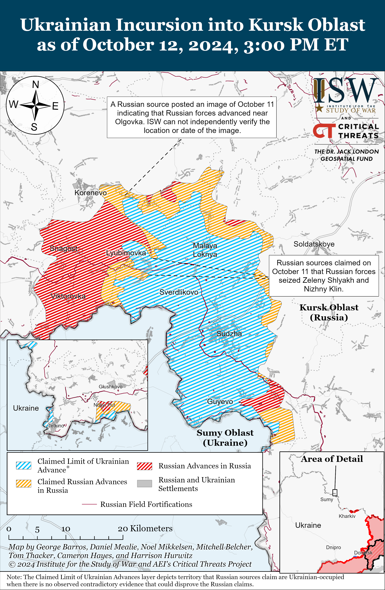
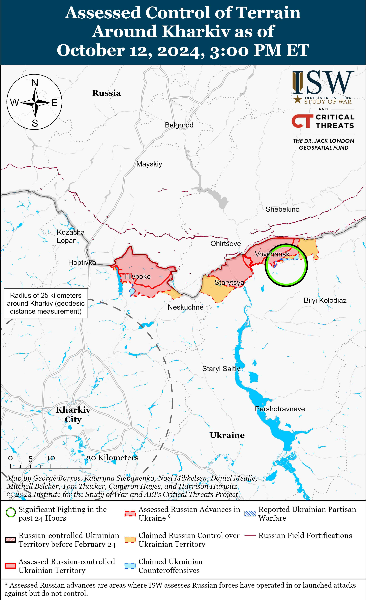
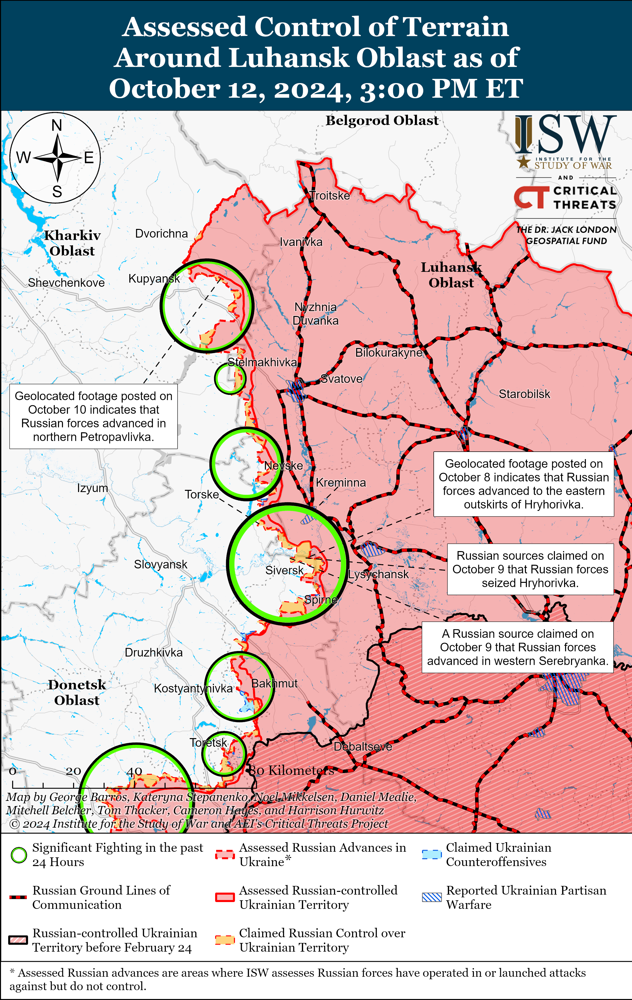
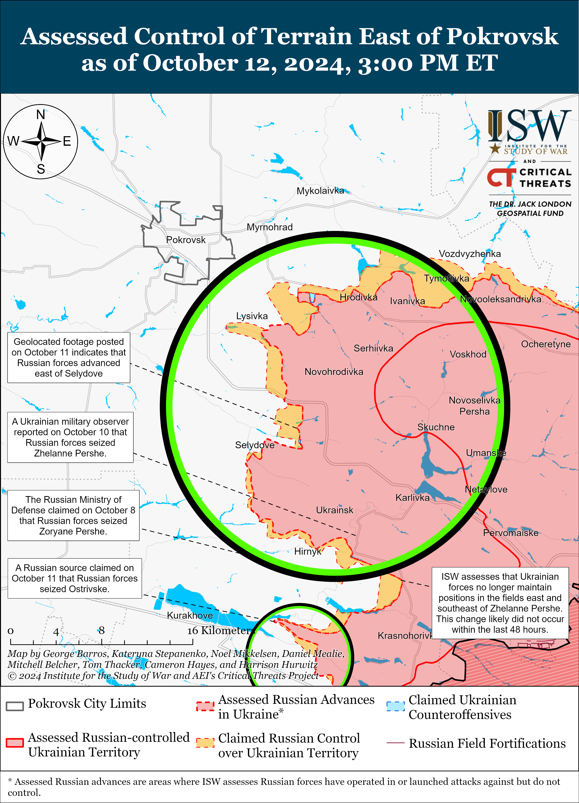
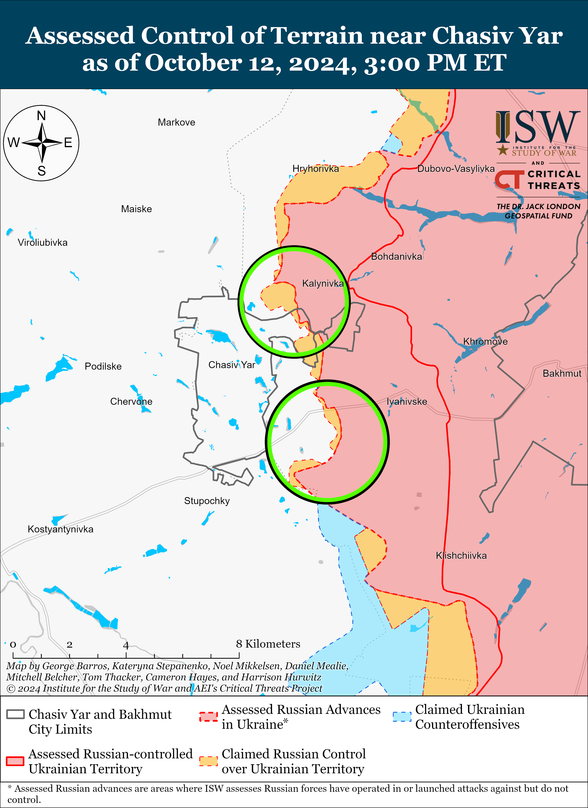
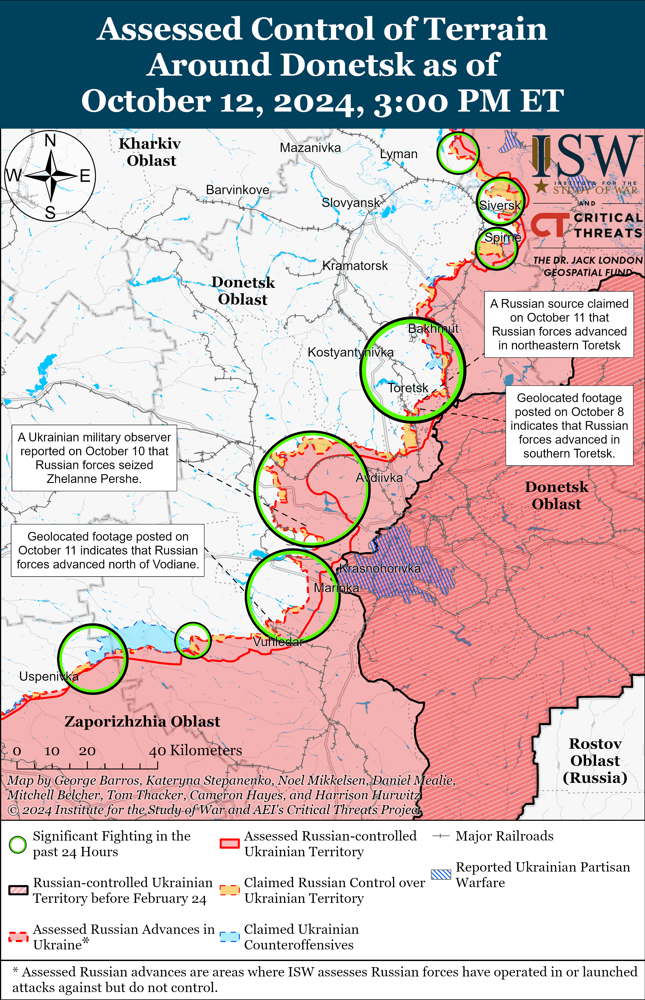
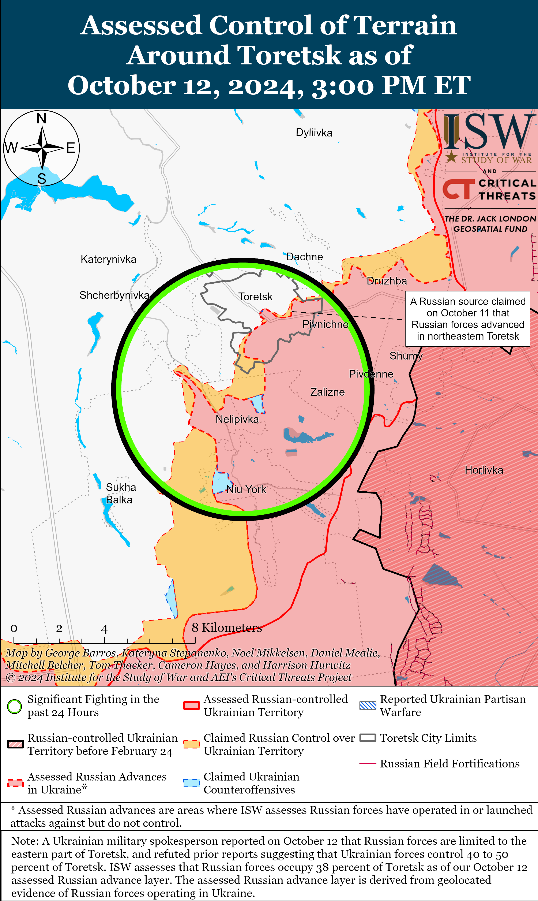
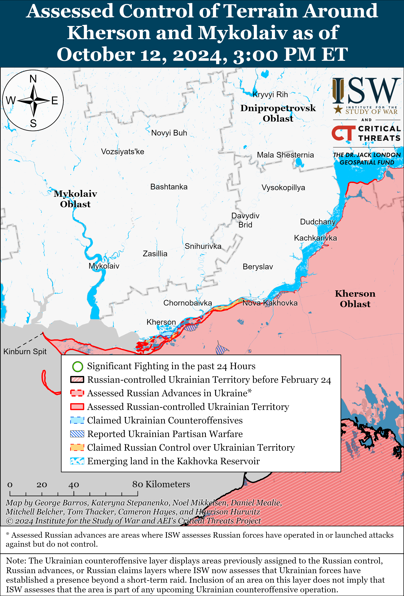
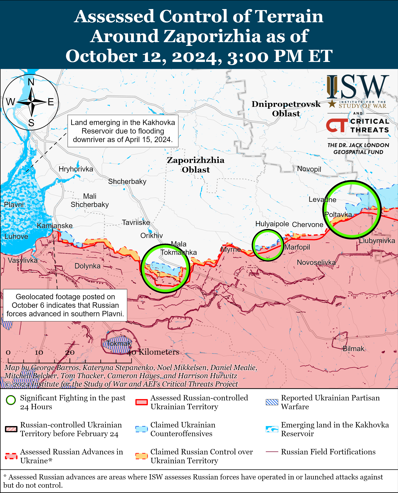

# Russian Offensive Campaign Assessment, October 12, 2024

**October 12, 2024, 5:55pm ET**

**Click** [**here**](https://storymaps.arcgis.com/stories/36a7f6a6f5a9448496de641cf64bd375) **to see ISW’s interactive map of the Russian invasion of Ukraine. This map is updated daily alongside the static maps present in this report.**

**Click** [**here**](https://storymaps.arcgis.com/stories/83a2f24901c941d581c0c523ecd2619b) **to see ISW's interactive map of Ukraine's offensive in Kursk Oblast.**

**Click** [**here**](https://understandingwar.maps.arcgis.com/apps/instant/3dviewer/index.html?appid=1602762dbcde419bb957dea358449580) **to see ISW’s 3D control of terrain topographic map of Ukraine. Use of a computer (not a mobile device) is strongly recommended for using this data-heavy tool.**

**Click** [**here**](https://storymaps.arcgis.com/stories/733fe90805894bfc8562d90b106aa895) **to access ISW’s archive of interactive time-lapse maps of the Russian invasion of Ukraine. These maps complement the static control-of-terrain map that ISW produces daily by showing a dynamic frontline. ISW will update this time-lapse map archive monthly.**

**Note: The data cut-off for this product was 12pm ET on October 12. ISW will cover subsequent reports in the October 13 Russian Offensive Campaign Assessment.**

**Russian forces are reportedly relying on illicitly obtained Starlink terminals to improve combat coordination and the effectiveness of their tactical reconnaissance strike complex (TRSC) in Ukraine as part of an overarching effort to reach technological parity with Ukrainian forces.[[1]](#_edn1a68d35fc24417b49339643aa472242d1)** Ukrainian military personnel operating in Donetsk Oblast told the *Washington Post* in an article published on October 12 that Starlink terminals have increasingly appeared at Russian frontline positions and that the illicitly obtained technology is helping Russian forces fix persisting issues with combat coordination and communications while improving the precision of Russian tactical fires.[[2]](#_edn1a68d35fc24417b49339643aa472242d2) The commander of a Ukrainian drone platoon operating near Novohrodivka (southeast of Pokrovsk) told the *Washington Post* that Ukrainian reconnaissance drones started widely recording Starlink terminals at Russian positions in the area in September 2024 and that the arrival of the terminals corresponded with a decrease in intercepted Russian radio transmissions in which Russian soldiers relayed incomplete or incorrect battlefield information to their commanders.[[3]](#_edn1a68d35fc24417b49339643aa472242d3) Another Ukrainian soldier reportedly stated that Russian forces in the Pokrovsk direction appear to have enough Starlink terminals to give individual tactical groups their own terminal.[[4]](#_edn1a68d35fc24417b49339643aa472242d4) Ukrainian soldiers reportedly credited recent Russian battlefield gains, including the Russian seizure of Vuhledar in late September 2024, partially to the Russian use of Starlink terminals.[[5]](#_edn1a68d35fc24417b49339643aa472242d5) Russian forces have mainly relied on radio and other insecure communication technologies for organizing combat coordination and relaying targeting information to fire and strike elements, and Russian forces have yet to field modern battlefield management systems at scale to organize their TRSC as many Ukrainian units have.[[6]](#_edn1a68d35fc24417b49339643aa472242d6) Ukrainian access to Starlink has afforded Ukrainian forces a technological edge to conduct more effective combat coordination and field new developments in the TRSC ahead of Russian forces, and Russian forces are likely trying to degrade these Ukrainian advantages by scaling up their own use of the terminals.[[7]](#_edn1a68d35fc24417b49339643aa472242d7) Ukraine is currently pursuing a strategy to offset Russian manpower and materiel advantages through technological innovation and adaptation, and technological parity between Ukrainian and Russian forces will undermine this effort.[[8]](#_edn1a68d35fc24417b49339643aa472242d8)

**A Russian milblogger claimed that a Ukrainian F-16 downed a Russian Su-34 fighter aircraft in an unspecified area of the theater on October 12. ISW cannot verify the claim that a Ukrainian F-16 was involved in the reported loss of the Russian Su-34.** A Russian milblogger closely affiliated with Russian aviation published a tribute to a lost Su-34 aircraft on October 12 but did not provide additional details about the incident.[[9]](#_edn1a68d35fc24417b49339643aa472242d9) A prominent Russian milblogger also confirmed that the Su-34 crew died but claimed that this loss was not related to Ukrainian activity, and other milbloggers speculated that the Su-34 could have crashed as a result of technical malfunction or human error.[[10]](#_edn1a68d35fc24417b49339643aa472242d10) A Russian Telegram channel, which claims to be managed by Russian airborne (VDV) officers and staff of the Russian “Dnepr” Grouping of Forces, claimed that a Ukrainian F-16 fighter jet presumably shot down the Russian Su-34 fighter aircraft while the Su-34 was dropping FAB glide bombs with unified planning and correction modules (UMPC) at a distance of about 50 kilometers from the frontline.[[11]](#_edn1a68d35fc24417b49339643aa472242d11) The Telegram channel later responded to the claims that the Su-34 could have crashed due to technical malfunction or human error, noting that such hypothetical scenarios still highlight a problem with the wear and tear of Russian aircraft, unprofessionalism among pilots, and pilot exhaustion.[[12]](#_edn1a68d35fc24417b49339643aa472242d12) The Telegram channel accused Kremlin-affiliated milbloggers of lying about the Su-34 crash and preventing Russian forces from developing plans to counter the Ukrainian F-16 threat.[[13]](#_edn1a68d35fc24417b49339643aa472242d13) The Telegram channel claimed in March 2024 that Russian federal censor Roskomnadzor filed a complaint against the channel for “discrediting” a Russian military commander.[[14]](#_edn1a68d35fc24417b49339643aa472242d14) ISW cannot independently confirm the Telegram channel’s claim, but if confirmed, this incident would mark the first Ukrainian shootdown of a Russian manned aircraft with a Western-provided F-16 fighter jet.

**Unknown actors opened fire on personnel of the Russian Ministry of Internal Affairs' (MVD) Center for Combating Extremism in Nazran, Republic of Ingushetia on the night of October 11.**[[15]](#_edn1a68d35fc24417b49339643aa472242d15) The shooters reportedly targeted the car of the center's deputy head, Adam Khamkhoev, who was reportedly not injured.[[16]](#_edn1a68d35fc24417b49339643aa472242d16) Russian milbloggers claimed that Khamkhoev's whereabouts following the shooting were unknown.[[17]](#_edn1a68d35fc24417b49339643aa472242d17) The shooters killed three people, including one of Khamkhoev's security guards.[[18]](#_edn1a68d35fc24417b49339643aa472242d18) Russian law enforcement-affiliated outlet *Baza* noted that this was the fifth attempt on Khamkhoev's life and that Khamkhoev's former boss at the Center for Combating Extremism, Ibragim Eldzharkiyev, was assassinated in Moscow in 2019.[[19]](#_edn1a68d35fc24417b49339643aa472242d19) Russian business outlet *Kommersant* noted that Khamkhoev is listed as a victim in numerous criminal cases, including a case about a previous murder attempt against Eldzharkiyev.[[20]](#_edn1a68d35fc24417b49339643aa472242d20) Russian authorities previously claimed that members of the "militant group" of the Sufi followers of Batal-Khadzhi Belkhoroev (called the Batalkhadzhintsy) were involved in Eldzharkiyev's murder.[[21]](#_edn1a68d35fc24417b49339643aa472242d21) A member of the Batalkhadzhintsy claimed in 2023 that he killed Eldzharkiyev as part of a "blood feud."[[22]](#_edn1a68d35fc24417b49339643aa472242d22) Chechen Republic Head Ramzan Kadyrov reportedly supports fellow Sufi Batalkhadzhintsy, offering them protection in Chechnya in exchange for sending volunteer units to fight in Ukraine.[[23]](#_edn1a68d35fc24417b49339643aa472242d23) Kadyrov notably declared a "blood feud" against three Republic of Dagestan and Republic of Ingushetia legislators on October 10 after accusing them of plotting his assassination.[[24]](#_edn1a68d35fc24417b49339643aa472242d24) The Russian Emergencies Ministry stated that a gas tank exploded at a gas station in Grozny, Chechen Republic on October 12, reportedly due to safety violations.[[25]](#_edn1a68d35fc24417b49339643aa472242d25) ISW is not prepared to assess any connections between these events at this time.

**Indian enterprises are reportedly increasing exports of dual-use technologies to Russia, in part thanks to large Russian reserves of rupees from oil sales to India.** *Bloomberg* reported on October 11 that US and European officials stated that India has become the second largest supplier of restricted technologies, such as microchips, circuits, and machine tools, to Russia – after the People's Republic of China (PRC).[[26]](#_edn1a68d35fc24417b49339643aa472242d26) Monthly Indian exports of these technologies reportedly doubled to $60 million in both April and May 2024 as compared to unspecified months earlier in 2024 and increased to $95 million in July 2024. *Bloomberg* reported that the official sources stated that about one-fifth of "sensitive" technologies imported by the Russian defense industrial base (DIB) come via India. Russia's large stocks of Indian rupees following Russian oil sales to India are reportedly driving the growth of Russian imports from India. The *Financial Times* similarly reported in September 2024 that leaked documents revealed that Russia has been covertly acquiring sensitive dual-use electronics from India with "significant reserves" of Indian rupees amassed by Russian banks from increasing oil sales to India.[[27]](#_edn1a68d35fc24417b49339643aa472242d27) It is unclear to what extent private Indian businesses or state enterprises are exporting these technologies to Russia, but Indian firms appear to nonetheless be helping Russia sustain its war effort in Ukraine. These reports come against the backdrop of Indian Prime Minister Narendra Modi's August 2024 visit to Ukraine, during which he rhetorically highlighted the principles of international law, including sovereignty and territorial integrity, in discussions with Ukrainian President Volodymyr Zelensky.[[28]](#_edn1a68d35fc24417b49339643aa472242d28) Reported transfers of Indian artillery shells through European intermediaries to Ukraine have also reportedly generated tensions in the Russian-Indian relationship.[[29]](#_edn1a68d35fc24417b49339643aa472242d29)

**Key Takeaways:**

- **Russian forces are reportedly relying on illicitly obtained Starlink terminals to improve combat coordination and the effectiveness of their tactical reconnaissance strike complex (TRSC) in Ukraine as part of an overarching effort to reach technological parity with Ukrainian forces.**
- **A Russian milblogger claimed that a Ukrainian F-16 downed a Russian Su-34 fighter aircraft in an unspecified area of the theater on October 12, but ISW cannot verify the claim that a Ukrainian F-16 was involved in the reported loss of the Russian Su-34.**
- **Unknown actors opened fire on personnel of the Russian Ministry of Internal Affairs' (MVD) Center for Combating Extremism in Nazran, Republic of Ingushetia on the night of October 11.**
- **Indian enterprises are reportedly increasing exports of dual-use technologies to Russia, in part thanks to large Russian reserves of rupees from oil sales to India.**
- **Russian forces recently advanced near Kupyansk, Donetsk City, and Robotyne.**
- **Russian forces are reportedly struggling to conduct effective counterbattery fires.**

****

***We do not report in detail on Russian war crimes because these activities are well-covered in Western media and do not directly affect the military operations we are assessing and forecasting. We will continue to evaluate and report on the effects of these criminal activities on the Ukrainian military and the Ukrainian population and specifically on combat in Ukrainian urban areas. We utterly condemn Russian violations of the laws of armed conflict and the Geneva Conventions and crimes against humanity even though we do not describe them in these reports.***

- Ukrainian Operations in the Russian Federation
- Russian Main Effort – Eastern Ukraine (comprised of three subordinate main efforts)
- Russian Subordinate Main Effort #1 – Push Ukrainian forces back from the international border with Belgorod Oblast and approach to within tube artillery range of Kharkiv City
- Russian Subordinate Main Effort #2 – Capture the remainder of Luhansk Oblast and push westward into eastern Kharkiv Oblast and encircle northern Donetsk Oblast
- Russian Subordinate Main Effort #3 – Capture the entirety of Donetsk Oblast
- Russian Supporting Effort – Southern Axis
- Russian Air, Missile, and Drone Campaign
- Russian Mobilization and Force Generation Efforts
- Russian Technological Adaptations
- Activities in Russian-occupied areas
- Ukrainian Defense Industrial Base Efforts
- Russian Information Operations and Narratives
- Significant Activity in Belarus

**Ukrainian Operations in the Russian Federation**

Russian military sources claimed that Russian forces have recaptured nearly two dozen settlements in Kursk Oblast as of October 11, while Ukrainian military officials reported that Ukrainian forces partially regained lost positions amidst continued intensified Russian counterattacks on October 12. Chechen Akhmat Spetsnaz Commander Apty Alaudinov claimed on October 11 that Russian forces have recaptured 19 settlements in Kursk Oblast since the start of Ukraine’s incursion into Kursk Oblast but did not name these settlements.[[30]](#_edn1a68d35fc24417b49339643aa472242d30) ISW assesses that Russian forces have likely advanced within at least 13 settlements in Kursk Oblast that Ukrainian forces had previously reportedly operated in as of October 11.[[31]](#_edn1a68d35fc24417b49339643aa472242d31) The Head of Ukraine‘s Center of Countering Disinformation of the National Security and Defense Council, Lieutenant Andriy Kovalenko, stated on October 12 that Russian forces continued to commit Russian columns to assaults in Kursk Oblast after Ukrainian forces partially regained unspecified positions.[[32]](#_edn1a68d35fc24417b49339643aa472242d32)

Russian sources claimed that Russian forces continued efforts to dislodge Ukrainian forces from Glushkovsky Raion (west of the main Ukrainian salient in Kursk Oblast) on October 11 and 12. A Russian milblogger claimed on October 11 that elements of the Russian 56th, 137th, and 119th airborne (VDV) regiments of the Russian 106th VDV Division launched counterattacks and pushed Ukrainian forces from Obukhovka and Veseloye (both on the western side of the Glushkovsky Raion salient) southwest towards Novy Put (on the international border).[[33]](#_edn1a68d35fc24417b49339643aa472242d33) The milblogger added that Ukrainian forces maintained positions on the international border near Novy Put, Obod (east of Novy Put), and Medvezhye (the easternmost part of the Glushkovsky Raion salient), and that elements of the Russian 106th VDV Division pushed Ukrainian forces out of the Medvezhye area.[[34]](#_edn1a68d35fc24417b49339643aa472242d34) Russian milbloggers later claimed on October 12 that Russian forces continued clearing operations in forest areas adjacent to the international border with Sumy Oblast in Glushkovsky Raion and achieved unspecified tactical successes in the area.[[35]](#_edn1a68d35fc24417b49339643aa472242d35) A Kremlin-affiliated milblogger speculated that Ukrainian forces may be withdrawing from their positions in Glushkovsky Raion to more advantageous positions ahead of the rainy season in Fall 2024 and early Winter 2024-2025 and are transferring additional reserves to the area.[[36]](#_edn1a68d35fc24417b49339643aa472242d36)

Russian sources also claimed that Russian forces continued advancing on the left flank of the main Ukrainian salient in Korenevsky Raion and on the right flank of the main Ukrainian salient in Sudzhansky Raion in Kursk Oblast on October 11 and 12. Russian milbloggers claimed that Russian forces cleared another three kilometers (presumably meaning three square kilometers) of territory from Kremyanoye towards Olgovka (both east of Korenevo), advanced to central Olgovka, and continued counterattacking near the settlement.[[37]](#_edn1a68d35fc24417b49339643aa472242d37) ISW observed footage posted on October 11 of a Russian servicemember posing near an Olgovka exit sign, but ISW cannot independently geolocate the sign’s location.[[38]](#_edn1a68d35fc24417b49339643aa472242d38) Russian milbloggers also claimed that elements of the Russian 155th Naval Infantry Brigade (Pacific Fleet, Eastern Military District [EMD]) approached the northwestern outskirts of Sudzha and entered Novoivanovka (southeast of Korenevo), while unspecified VDV elements simultaneously entered Tolsty Lug (southwest of Novoivanovka).[[39]](#_edn1a68d35fc24417b49339643aa472242d39) Russian milbloggers also claimed that Russian forces continued to fight in and clear Novoivanovka and seized Zeleny Shlyakh and Nizhny Klin (both southwest of Novoivanovka), and that elements of the Russian 137th VDV Regiment (106th VDV Division) reached the last street in Lyubimovka (west of Novoivanovka).[[40]](#_edn1a68d35fc24417b49339643aa472242d40) Russian milbloggers also claimed that Russian forces achieved unspecified successes near Malaya Loknya (north of Sudzha) and in eastern Sudzhansky Raion.[[41]](#_edn1a68d35fc24417b49339643aa472242d41) ISW has not yet observed confirmation of these Russian claims. Russian sources, including the Russian Ministry of Defense (MoD), additionally claimed that Russian attacks continued near Darino (southwest of Lyubimovka), Plekhovo (south of Sudzha), and Sverdlikovo (northwest of Sudzha), and that Russian forces repelled Ukrainian counterattacks near Lyubimovka, Tolsty Lug, and Novoivanovka on October 11 and 12.[[42]](#_edn1a68d35fc24417b49339643aa472242d42) Elements of the Russian 22nd Spetsnaz Brigade (Russian General Staff Main Directorate [GRU]), which previously operated in western Zaporizhia Oblast as of September 2024, are reportedly operating in Kursk Oblast.[[43]](#_edn1a68d35fc24417b49339643aa472242d43)

**Russian Main Effort – Eastern Ukraine**

**Russian Subordinate Main Effort #1 – Kharkiv Oblast** **(Russian objective: Push Ukrainian forces back from the international border with Belgorod Oblast and approach to within tube artillery range of Kharkiv City)**

Russian forces continued offensive operations northeast of Kharkiv City near Tykhe on October 11 and 12, but there were no confirmed changes to the frontline.[[44]](#_edn1a68d35fc24417b49339643aa472242d44) Ukrainian military observer Kostyantyn Mashovets stated on October 12 that the Ukrainian incursion in Kursk Oblast has stalled the tempo of Russian offensive operations near Vovchansk (northeast of Kharkiv City) due to the redeployment of Russian forces from the Kharkiv direction to Kursk Oblast.[[45]](#_edn1a68d35fc24417b49339643aa472242d45) Mashovets stated that Russian reserves in the Kharkiv direction, including elements of the 71st Motorized Rifle Division (14th Army Corps [AC]) and elements of the 68th Motorized Rifle Division (6th Combined Arms Army [CAA], Leningrad Military District [LMD]), have redeployed to Kursk Oblast. A Ukrainian Commander noted on October 11 that Russian forces in the Kharkiv direction lack the personnel needed to conduct significant offensive operations.[[46]](#_edn1a68d35fc24417b49339643aa472242d46) Mashovets stated that elements of the Russian 83rd Motorized Rifle Regiment (69th Motorized Rifle Division, 6th CAA, LMD) are operating near Vovchansk and that elements of the 1045th Rifle Regiment (6th CAA, LMD) and 360th Rifle Regiment (11th AC, LMD) are operating in the Kharkiv direction.[[47]](#_edn1a68d35fc24417b49339643aa472242d47) Ukraine’s Kharkiv Group of Forces reported on October 12 that elements of the Russian 82nd Motorized Rifle Regiment (69th Guards Motorized Rifle Division, 6th CAA, LMD) and elements of the 128th Motorized Rifle Brigade (44th AC, LMD) are operating near Vovchansk.[[48]](#_edn1a68d35fc24417b49339643aa472242d48) Elements of the Russian 16th Spetsnaz Brigade (Russian General Staff's Main Intelligence Directorate [GRU]) and Akhmat Spetsnaz's 11th Detachment are reportedly operating in the Kharkiv direction.[[49]](#_edn1a68d35fc24417b49339643aa472242d49)

**Russian Subordinate Main Effort #2 – Luhansk Oblast (Russian objective: Capture the remainder of Luhansk Oblast and push westward into eastern Kharkiv Oblast and northern Donetsk Oblast)**

Russian forces recently advanced southeast of Kupyansk amid continued offensive operations along the Kupyansk-Svatove-Kreminna line on October 11 and 12. Geolocated footage published on October 11 indicates that Russian forces recently advanced south of Stepova Novoselivka (southeast of Kupyansk).[[50]](#_edn1a68d35fc24417b49339643aa472242d50) Russian forces continued assaults northeast of Kupyansk near Synkivka; east of Kupyansk near Petropavlivka and Kucherivka; southeast of Kupyansk near Stepova Novoselivka, Novoosynove, Kruhlyakivka, Kolisnykivka, Lozova, and Pishchane; west of Svatove near Myasozharivka and Vyshneve; northwest of Kreminna near Hrekivka, Makiivka, Nevske, Novosadove, and Katerynivka; and west of Kreminna near Terny, Zarichne, and Torske on October 11 and 12.[[51]](#_edn1a68d35fc24417b49339643aa472242d51)

  
 **Russian Subordinate Main Effort #3 – Donetsk Oblast (Russian objective: Capture the entirety of Donetsk Oblast, the claimed territory of Russia’s proxies in Donbas)**

Russian forces continued offensive operations northeast of Siversk near Bilohorivka, east of Siversk near Verkhnokamyanske, and southeast of Siversk near Ivano-Darivka and Vyimka on October 11 and 12 but did not make any confirmed gains.[[52]](#_edn1a68d35fc24417b49339643aa472242d52)

Russian forces continued offensive operations near Chasiv Yar, north of Chasiv Yar near Kalynivka, east of Chasiv Yar near Ivanivske, and south of Chasiv Yar near Stupochky on October 11 and 12 but did not make any confirmed advances.[[53]](#_edn1a68d35fc24417b49339643aa472242d53) The deputy commander of a Ukrainian battalion operating in the Kramatorsk direction (Chasiv Yar area) stated on October 11 that Russian forces are primarily conducting infantry assaults but will occasionally use armored vehicles and motorcycles to transfer infantry closer to Ukrainian positions.[[54]](#_edn1a68d35fc24417b49339643aa472242d54) The deputy commander added that Russian aviation in the Chasiv Yar area is primarily conducting glide bomb strikes against near rear areas instead of frontline positions.[[55]](#_edn1a68d35fc24417b49339643aa472242d55) Elements of the Russian 98th Airborne (VDV) Division reportedly continue to operate near Chasiv Yar.[[56]](#_edn1a68d35fc24417b49339643aa472242d56)

Ukrainian Luhansk Group of Forces Spokesperson Major Anastasiya Bobovnikova rebuked a recent Ukrainian official statement on October 11 that Russian forces control up to 60 percent of Toretsk and reported that Russian forces only control the eastern part of Toretsk.[[57]](#_edn1a68d35fc24417b49339643aa472242d57) Ukrainian Toretsk Military Administration Head Vasily Chynchyk had stated earlier on October 11 that Russian forces control 50-to-60 percent of Toretsk.[[58]](#_edn1a68d35fc24417b49339643aa472242d58) Available visual evidence confirms that Russian forces occupy at least 38 percent of Toretsk, which appears to be more consistent with Bobovnikova's clarification than Chynchyk's initial figure. Russian and Ukrainian forces are currently engaged in heavy urban combat within Toretsk and the frontline within the town appears to be relatively more dynamic than elsewhere in the theater.

Russian forces continued offensive operations near Toretsk on October 12 but did not make any confirmed gains. Russian milbloggers claimed that Russian forces advanced 1.3 kilometers deep northwest of Niu York (south of Toretsk) and closer towards the Tsentralna mine within southern and central Toretsk.[[59]](#_edn1a68d35fc24417b49339643aa472242d59) ISW has not observed visual confirmation of these Russian claims, however. Russian forces continued offensive operations near Toretsk; north of Toretsk near Dachne and Dyliivka; and south of Toretsk near Nelipivka and in the direction of Shcherbynivka and Petrivka on October 11 and 12.[[60]](#_edn1a68d35fc24417b49339643aa472242d60)

Russian forces continued offensive operations in the Pokrovsk direction on October 12 but did not make any confirmed advances. Russian milbloggers claimed that Russian forces operating southeast of Pokrovsk advanced 800 meters deep west of Krasnyi Yar, 400 meters deep on the northeastern outskirts of Selydove, and along a railway north of Novohrodivka.[[61]](#_edn1a68d35fc24417b49339643aa472242d61) Russian forces continued offensive operations east of Pokrovsk near Myrnohrad and southeast of Pokrovsk near Myrolyubivka, Lysivka, Krutyi Yar, Selydove, Mykhailivka, Izmailivka, Hirnyk, Kurakhivka, Zhelanne Druhe, Tsukuryne, Novodmytrivka, Zoryane, and Novoselydivka on October 11 and 12.[[62]](#_edn1a68d35fc24417b49339643aa472242d62) A Russian milblogger claimed on October 12 that Ukrainian forces counterattacked northwest of Novohrodivka.[[63]](#_edn1a68d35fc24417b49339643aa472242d63)

Ukrainian military observer Kostyantyn Mashovets stated on October 12 that the Russian Central Grouping of Forces has a little over 15,000 personnel in reserve, although ISW cannot independently verify this figure.[[64]](#_edn1a68d35fc24417b49339643aa472242d64) Russian forces have heavily relied on operational reserves that they established ahead of the Summer 2024 Russian offensive operation to sustain a high offensive tempo in the Pokrovsk direction and have likely exhausted a sizeable portion of this reserve.[[65]](#_edn1a68d35fc24417b49339643aa472242d65) Russian forces have routinely used operational reserves as a pool of available manpower for reinforcing committed units instead of as a cohesive first-echelon penetration force or second-echelon exploitation force.[[66]](#_edn1a68d35fc24417b49339643aa472242d66) It is unlikely that the Central Grouping of Forces will be able to use 15,000 personnel in isolation as reserves for a fresh penetration force that could rapidly break through to Pokrovsk or as a significant exploitation force that could rapidly conduct the seizure of Pokrovsk itself. ISW continues to assess that the Russian Summer 2024 offensive operation will culminate in the coming months — in part due to the exhaustion of Russian operational reserves.[[67]](#_edn1a68d35fc24417b49339643aa472242d67)

Russian forces continued offensive operations east of Kurakhove on October 12 but did not make any confirmed gains. A Russian milblogger claimed that Russian forces advanced 1.5 kilometers deep near Maksymilyanivka, although ISW has not observed confirmation of this claim.[[68]](#_edn1a68d35fc24417b49339643aa472242d68) Russian forces continued offensive operations near Kurakhove itself and east of Kurakhove near Maksymilyanivka and Heorhiivka on October 11 and 12.[[69]](#_edn1a68d35fc24417b49339643aa472242d69) The spokesperson for a Ukrainian brigade operating in the Kurakhove direction stated on October 11 that Russian aviation conducted 20 glide bomb strikes during the day and that Russian forces are also using rotary-winged aircraft in the area.[[70]](#_edn1a68d35fc24417b49339643aa472242d70) A Russian milblogger credited elements of the Russian 150th Motorized Rifle Division (8th Combined Arms Army [CAA], Southern Military District [SMD]) with the unconfirmed seizure of Ostrivske.[[71]](#_edn1a68d35fc24417b49339643aa472242d71) Elements of the Russian 238th Artillery Brigade (8th CAA, SMD) are reportedly operating near Hostre.[[72]](#_edn1a68d35fc24417b49339643aa472242d72)

Russian forces recently marginally advanced southwest of Donetsk City amid continued Russian offensive operations in the area on October 12. Geolocated footage published on October 12 indicates that Russian forces recently marginally advanced along a windbreak northwest of Vodyane.[[73]](#_edn1a68d35fc24417b49339643aa472242d73) Russian forces operating southwest of Donetsk City continued offensive operations near Kostyantynivka, Antonivka, Katerynivka, Vodyane, Bohoyavlenka, and Zolota Nyva on October 11 and 12.[[74]](#_edn1a68d35fc24417b49339643aa472242d74) Russian sources amplified footage on October 12 purporting to show Russian forces striking a bridge over the Solodka River in Yelizavetivka with a Kh-38 air-to-surface missile and claimed that the bridge is along a ground line of communication (GLOC) that Ukrainian forces in Katerynivka rely on for ammunition and supplies.[[75]](#_edn1a68d35fc24417b49339643aa472242d75) Elements of the Russian 14th Spetsnaz Brigade (Special Forces of the Main Directorate of the General Staff of the Russian Armed Forces [GRU]) are reportedly operating north of Vuhledar, and elements of the Russian 36th Motorized Rifle Brigade (29th CAA, Eastern Military District [EMD]) are reportedly operating near Bohoyavlenka.[[76]](#_edn1a68d35fc24417b49339643aa472242d76)

Russian forces conducted ground attacks in the Donetsk-Zaporizhia Oblast border area southwest of Velyka Novosilka near Rivnopil, Novoukrainske, Novodarivka, Levadne, and Olhivske on October 11 and 12.[[77]](#_edn1a68d35fc24417b49339643aa472242d77) Elements of the Russian 60th Motorized Rifle Brigade (5th CAA, EMD) are reportedly operating near Pryyutne (southwest of Velyka Novosilka).[[78]](#_edn1a68d35fc24417b49339643aa472242d78)

   

**Russian Supporting Effort – Southern Axis (Russian objective: Maintain frontline positions and secure rear areas against Ukrainian strikes)**

Russian forces recently advanced in western Zaporizhia Oblast amid continued ground attacks in the area on October 12. Geolocated footage published on October 11 indicates that Russian forces recently advanced northwest of Robotyne.[[79]](#_edn1a68d35fc24417b49339643aa472242d79) The Ukrainian General Staff reported that Russian forces attacked near Robotyne on October 12.[[80]](#_edn1a68d35fc24417b49339643aa472242d80) A Russian milblogger claimed that Russian forces are conducting offensive operations near Kamyanske (northwest of Robotyne) but that the Kamyanske Reservoir is complicating Russian logistics in the area.[[81]](#_edn1a68d35fc24417b49339643aa472242d81) Drone operators of the Russian "Valkyria" detachment (4th Military Base, 58th Combined Arms Army [CAA], Southern Military District [SMD]) are reportedly operating near Kamyanske.[[82]](#_edn1a68d35fc24417b49339643aa472242d82)

The Ukrainian General Staff reported on October 11 that Russian forces conducted assaults in the Dnipro direction, likely referring to left (east) bank Kherson Oblast and islands in the Dnipro River Delta.[[83]](#_edn1a68d35fc24417b49339643aa472242d83) Elements of the Russian BARS-33 Detachment (Russian Combat Army Reserve) are reportedly operating in the Kherson direction.[[84]](#_edn1a68d35fc24417b49339643aa472242d84)

 

**Russian Air, Missile, and Drone Campaign (Russian Objective: Target Ukrainian military and civilian infrastructure in the rear and on the frontline)**

Russian forces conducted a series of missile and drone strikes against Ukraine on the evening of October 11 and the night of October 11 to 12. The Ukrainian Air Force reported that Russian forces launched an unknown type of missile from Belgorod Oblast and 28 strike drones from Kursk Oblast and Primorsko-Akhtarsk, Krasnodar Krai overnight.[[85]](#_edn1a68d35fc24417b49339643aa472242d85) Ukrainian anti-aircraft missile forces, electronic warfare (EW) units, and mobile fire groups reportedly shot down 24 drones over Sumy, Poltava, Dnipropetrovsk, Mykolaiv, and Kherson oblasts, and two drones reportedly were "lost in location" due to Ukrainian EW countermeasures. Mykolaiv Oblast Military Administration Head Vitaliy Kim reported that two Russian drones fell in Mykolaiv Oblast.[[86]](#_edn1a68d35fc24417b49339643aa472242d86) Kim noted that Russian forces have changed their tactics from striking critical infrastructure to targeting what the Russian military assesses to be military targets – many of which Kim identified as farming facilities or agricultural enterprises. The Sumy Oblast Prosecutor's Office stated that Russian forces conducted a missile strike against civilian infrastructure in Sumy City overnight.[[87]](#_edn1a68d35fc24417b49339643aa472242d87) The Sumy Oblast Military Administration reported that Russian forces conducted a missile strike against Sumy Oblast on the evening of October 11.[[88]](#_edn1a68d35fc24417b49339643aa472242d88)

**Russian Mobilization and Force Generation Efforts (Russian objective: Expand combat power without conducting general mobilization)**

Russian forces are reportedly struggling to conduct effective counterbattery fires. A Russian milblogger complained on October 12 that one of the Russian military's "biggest problems" is the slow speed of counterbattery fire.[[89]](#_edn1a68d35fc24417b49339643aa472242d89) The milblogger claimed that Ukrainian artillery systems sometimes fire from the same position for three to five days even after Russian forces have identified and transmitted targeting information for counterbattery strikes. The milblogger also complained that sometimes it takes Russian forces two to four weeks to conduct counterbattery fires against an identified Ukrainian firing position, at which point Ukrainian artillery has relocated up to a kilometer away. The milblogger claimed that Lancet loitering munitions are the only effective Russian counterbattery weapon but noted that Russian forces also need Lancets for strikes against Ukrainian tanks, armored fighting vehicles, and other equipment.

Russian authorities continue to detain people linked to corruption within the Russian MoD. Russian authorities detained the general director of the Knyagininskaya Sewing Factory, Aleksandr Svistunov, for bribing a former Russian MoD official in 2017.[[90]](#_edn1a68d35fc24417b49339643aa472242d90) Svistunov reportedly gave a four-million-ruble (about $41,800) bribe to former head of the MoD clothing department, Vladimir Demchik, in exchange for government contracts for military clothing supplies worth more than 574 million rubles (about $6 million). Russian authorities previously arrested Demchik in August 2024 for receiving a bribe. Kremlin newswire *TASS* reported on October 11 that the Knyagininskaya Sewing Factory had fulfilled almost 40 contracts with the MoD and other law enforcement agencies between 2017 and 2020.[[91]](#_edn1a68d35fc24417b49339643aa472242d91)

**Russian Technological Adaptations** **(Russian objective: Introduce technological innovations to optimize systems for use in Ukraine)**

Nothing significant to report.

**Ukrainian Defense Industrial Efforts** **(Ukrainian objective: Develop its defense industrial base to become more self-sufficient in cooperation with US, European, and international partners)**

*ISW is suspending publishing coverage of Ukrainian defense industrial efforts until further notice.*

**Activities in Russian-occupied areas (Russian objective: Consolidate administrative control of annexed areas; forcibly integrate Ukrainian citizens into Russian sociocultural, economic, military, and governance systems)**

*ISW is not publishing reporting on activities in Russian-occupied areas today.*

**Russian Information Operations and Narratives**

Russian Security Council Deputy Chairperson Dmitry Medvedev reiterated on October 11 that Russia has no genuine interest in ending the war in Ukraine until Ukraine capitulates and abandons its NATO membership aspirations.[[92]](#_edn1a68d35fc24417b49339643aa472242d92)

Russian officials continue to lean on narratives accusing Ukrainian forces of using chemical weapons in an effort to discredit Ukrainian forces and undermine international support for Ukraine. Russian Ambassador to Argentina Dmitry Feoktistov claimed on October 10 that Russia is carefully monitoring Ukraine’s alleged violations of its obligations under the Chemical Weapons Convention (CWC).[[93]](#_edn1a68d35fc24417b49339643aa472242d93) Feoktistov claimed that Ukrainian forces use chemical weapons not only in combat but also against civilians and that Ukrainian forces, in collaboration with NATO, are preparing false-flag provocations on the frontline with the aim of accusing Russia of violating the CWC. Russia has repeatedly conducted similar information and false-flag operations blaming Ukraine, NATO, and the West of war crimes that Russia itself has committed. The Ukrainian Support Forces Command reported in October 2024 that Russian chemical agents use has been systematic since February 2023 and that Ukraine has recorded Russian forces using munitions equipped with chemical agents 4,228 times as of September 24.[[94]](#_edn1a68d35fc24417b49339643aa472242d94)

The Ukrainian Center for Countering Disinformation reported on October 12 that Russian media is increasingly attempting to discredit mobilization efforts in Ukraine.[[95]](#_edn1a68d35fc24417b49339643aa472242d95) The Center reported an increase in the number of publications in Russian media and social networks promoting narratives criticizing Ukrainian mobilization efforts as lawless and unjust. The Center noted that Russian propagandists remain silent about issues surrounding mobilization efforts in Russia, however. ISW has extensively reported on issues related to mobilization in Russia and the Kremlin’s fear of repeating another partial mobilization.[[96]](#_edn1a68d35fc24417b49339643aa472242d96)

**Significant activity in Belarus** **(Russian efforts to increase its military presence in Belarus and further integrate Belarus into Russian-favorable frameworks and Wagner Group activity in Belarus)**

Ukrainian military observer Kostyantyn Mashovets stated on October 12 that the Belarusian military command changed the composition of the force grouping covering the Belarusian-Ukrainian border between October 3 to 6.[[97]](#_edn1a68d35fc24417b49339643aa472242d97) Mashovets stated that a tank company and up to a company of support units from the Belarusian 355th Tank Battalion (120th Mechanized Brigade) redeployed from the "Viking" operational-tactical group's deployment area to a permanent deployment point at an unspecified location. Mashovets stated that the tank company includes up to 10 to 11 T-72B tanks. ISW continues to assess that Belarusian forces remain very unlikely to invade Ukraine.

Russia and Belarus reportedly recently agreed to work to develop a strategic partnership between their defense industrial bases (DIBs). The Belarusian State Military Industrial Committee stated on October 9 that delegations of the Belarusian-Russian Intergovernmental Commission on Military-Technical Cooperation agreed on the need to further develop a strategic partnership during meetings in Izhevsk, Russia on October 8 to 9.[[98]](#_edn1a68d35fc24417b49339643aa472242d98) The delegations also reportedly visited a production site of Russian loitering munitions manufacturer Zala Aero and the Izhevsk Electromechanical Plant.

Belarusian President Alexander Lukashenko ratified an April 2024 agreement with Russia on the serial production of the "Osvey" twin-engine light multipurpose aircraft at the Belarusian 558th Aircraft Repair Plant on October 11.[[99]](#_edn1a68d35fc24417b49339643aa472242d99)

**Note: ISW does not receive any classified material from any source, uses only publicly available information, and draws extensively on Russian, Ukrainian, and Western reporting and social media as well as commercially available satellite imagery and other geospatial data as the basis for these reports. References to all sources used are provided in the endnotes of each update.**

[[1]](#_edn1a68d35fc24417b49339643aa472242dref1) https://www.understandingwar.org/sites/default/files/Ukraine%20and%20the%20Problem%20of%20Restoring%20Maneuver%20in%20Contemporary%20War\_final.pdf ; https://www.washingtonpost.com/world/2024/10/12/starlink-russia-ukraine-elon-musk/

[[2]](#_edn1a68d35fc24417b49339643aa472242dref2) https://www.washingtonpost.com/world/2024/10/12/starlink-russia-ukraine-elon-musk/

[[3]](#_edn1a68d35fc24417b49339643aa472242dref3) https://www.washingtonpost.com/world/2024/10/12/starlink-russia-ukraine-elon-musk/

[[4]](#_edn1a68d35fc24417b49339643aa472242dref4) https://www.washingtonpost.com/world/2024/10/12/starlink-russia-ukraine-elon-musk/

[[5]](#_edn1a68d35fc24417b49339643aa472242dref5) https://www.washingtonpost.com/world/2024/10/12/starlink-russia-ukraine-elon-musk/

[[6]](#_edn1a68d35fc24417b49339643aa472242dref6) <https://www.understandingwar.org/sites/default/files/Ukraine%20and%20the%20Problem%20of%20Restoring%20Maneuver%20in%20Contemporary%20War_final.pdf> ; <https://ik.imagekit.io/po8th4g4eqj/prod/Stormbreak-Special-Report-web-final_0.pdf>

[[7]](#_edn1a68d35fc24417b49339643aa472242dref7) https://irregularwarfare.org/articles/when-a-ceo-plays-president-musk-starlink-and-the-war-in-ukraine/

[[8]](#_edn1a68d35fc24417b49339643aa472242dref8) <https://isw.pub/UkrWar021424> ; https://isw.pub/UkrWar020124

[[9]](#_edn1a68d35fc24417b49339643aa472242dref9) <https://t.me/fighter_bomber/18409;> <https://t.me/astrapress/66243>

[[10]](#_edn1a68d35fc24417b49339643aa472242dref10) <https://t.me/boris_rozhin/140527;> <https://t.me/ZOV_Voevoda/21760>; <https://t.me/milhelipilot/3004>

[[11]](#_edn1a68d35fc24417b49339643aa472242dref11) https://t.me/vdv\_za\_chestnost\_a\_spavedlivost/4690

[[12]](#_edn1a68d35fc24417b49339643aa472242dref12) https://t.me/vdv\_za\_chestnost\_a\_spavedlivost/4697

[[13]](#_edn1a68d35fc24417b49339643aa472242dref13) https://t.me/vdv\_za\_chestnost\_a\_spavedlivost/4696

[[14]](#_edn1a68d35fc24417b49339643aa472242dref14) <https://istories> dot media/news/2024/03/14/roskomnadzor-pozhalovalsya-v-genprokuraturu-na-z-pablika-vdv-za-chestnost-i-spravedlivost/

[[15]](#_edn1a68d35fc24417b49339643aa472242dref15) <https://www.svoboda.org/a/na-trasse-v-ingushetii-rasstrelyali-avtomobilj-sotrudnikov-tsentra-e-/33155586.html>; <https://tass> dot ru/proisshestviya/22105415; https://t.me/tass\_agency/278959

[[16]](#_edn1a68d35fc24417b49339643aa472242dref16) <https://www.svoboda.org/a/na-trasse-v-ingushetii-rasstrelyali-avtomobilj-sotrudnikov-tsentra-e-/33155586.html>; <https://tass> dot ru/proisshestviya/22105415; https://t.me/tass\_agency/278959

[[17]](#_edn1a68d35fc24417b49339643aa472242dref17) <https://t.me/rybar/64363>; <https://t.me/dva_majors/54930>

[[18]](#_edn1a68d35fc24417b49339643aa472242dref18) <https://www.interfax> dot ru/world/986440; https://t.me/tass\_agency/278873

[[19]](#_edn1a68d35fc24417b49339643aa472242dref19) <https://tass> dot com/russia/1086722; https://t.me/bazabazon/32047

[[20]](#_edn1a68d35fc24417b49339643aa472242dref20) <https://www.kommersant> dot ru/doc/7229860

[[21]](#_edn1a68d35fc24417b49339643aa472242dref21) <https://www.kavkazr.com/a/v-bratstve-batalhadzhintsev-zayavili-o-podbroshennom-v-hode-obyska-v-ingushetii-granatomete/33093319.html>

[[22]](#_edn1a68d35fc24417b49339643aa472242dref22) https://www.kavkazr.com/a/glavnyy-podozrevaemyy-v-ubiystve-nachaljnika-ingushskogo-tsentra-e-priznal-motiv-krovnoy-mesti/32480762.html

[[23]](#_edn1a68d35fc24417b49339643aa472242dref23) <https://meduza> dot io/en/feature/2022/12/14/a-deal-with-the-devil

[[24]](#_edn1a68d35fc24417b49339643aa472242dref24) https://isw.pub/UkrWar101124

[[25]](#_edn1a68d35fc24417b49339643aa472242dref25) <https://t.me/tass_agency/278972> ; <https://t.me/tass_agency/278979;> https://t.me/tass\_agency/278992

[[26]](#_edn1a68d35fc24417b49339643aa472242dref26) https://www.bloomberg.com/news/articles/2024-10-11/india-is-now-russia-s-no-2-supplier-of-restricted-technology?srnd=homepage-europe

[[27]](#_edn1a68d35fc24417b49339643aa472242dref27) https://isw.pub/UkrWar090424

[[28]](#_edn1a68d35fc24417b49339643aa472242dref28) https://www.understandingwar.org/backgrounder/russian-offensive-campaign-assessment-august-23-2024

[[29]](#_edn1a68d35fc24417b49339643aa472242dref29) https://isw.pub/UkrWar091924

[[30]](#_edn1a68d35fc24417b49339643aa472242dref30) <https://t.me/tass_agency/278866>

[[31]](#_edn1a68d35fc24417b49339643aa472242dref31) https://www.understandingwar.org/backgrounder/russian-offensive-campaign-assessment-october-11-2024

[[32]](#_edn1a68d35fc24417b49339643aa472242dref32) https://t.me/akovalenko1989/8085

[[33]](#_edn1a68d35fc24417b49339643aa472242dref33) https://t.me/RVvoenkor/78573

[[34]](#_edn1a68d35fc24417b49339643aa472242dref34) https://t.me/RVvoenkor/78573

[[35]](#_edn1a68d35fc24417b49339643aa472242dref35) <https://t.me/dva_majors/54932;> https://t.me/wargonzo/22555;

[[36]](#_edn1a68d35fc24417b49339643aa472242dref36) https://t.me/RVvoenkor/78573; https://t.me/wargonzo/22551

[[37]](#_edn1a68d35fc24417b49339643aa472242dref37) <https://t.me/z_arhiv/28521>; <https://t.me/wargonzo/22570>; <https://t.me/NgP_raZVedka/19176;> <https://t.me/DnevnikDesantnika/17162;> <https://t.me/motopatriot/28379;> https://t.me/wargonzo/22570

[[38]](#_edn1a68d35fc24417b49339643aa472242dref38) <https://t.me/boris_rozhin/140530>

[[39]](#_edn1a68d35fc24417b49339643aa472242dref39) <https://t.me/DnevnikDesantnika/17162>; <https://t.me/NgP_raZVedka/19176>

[[40]](#_edn1a68d35fc24417b49339643aa472242dref40) https://t.me/motopatriot/28379; <https://t.me/NgP_raZVedka/19176>; <https://t.me/rusich_army/17654>; <https://t.me/NgP_raZVedka/19178;> <https://t.me/DnevnikDesantnika/17135>

[[41]](#_edn1a68d35fc24417b49339643aa472242dref41) <https://t.me/boris_rozhin/140520>

[[42]](#_edn1a68d35fc24417b49339643aa472242dref42) <https://t.me/mod_russia/44432>; <https://t.me/NgP_raZVedka/19176;> <https://t.me/DnevnikDesantnika/17162;> <https://t.me/wargonzo/22555;> <https://t.me/project_nd/216> ; <https://t.me/boris_rozhin/140492;> <https://t.me/NgP_raZVedka/19178>

[[43]](#_edn1a68d35fc24417b49339643aa472242dref43) <https://www.understandingwar.org/sites/default/files/Russian%20Offensive%20Campaign%20Assessment%2C%20September%204%2C%202024%20PDF.pdf>; <https://t.me/sashakots/49502>; <https://t.me/epoddubny/21320>

[[44]](#_edn1a68d35fc24417b49339643aa472242dref44) <https://www.facebook.com/GeneralStaff.ua/posts/pfbid02CGqwskuE6L8kt6rKJeE5wRB5pcT5i9E8CfHF3B8o2L5oSKK3ZEXw3RwXPdFWMeb2l>; https://www.facebook.com/GeneralStaff.ua/posts/pfbid02QpQJ7vwntVEwKjapFBdC83eQVDip8UwmSYvPHhpEVkQYkqDhUVNroaNF9Eg2mJugl

[[45]](#_edn1a68d35fc24417b49339643aa472242dref45) https://t.me/zvizdecmanhustu/2265

[[46]](#_edn1a68d35fc24417b49339643aa472242dref46) https://armyinform dot com.ua/2024/10/11/u-vijsk-rf-nemaye-znachnyh-syl-dlya-nastupalnyh-operaczij-na-harkivshhyni/ ; https://www.youtube.com/watch?v=ZE4\_3wKEmFY

[[47]](#_edn1a68d35fc24417b49339643aa472242dref47) https://t.me/zvizdecmanhustu/2264

[[48]](#_edn1a68d35fc24417b49339643aa472242dref48) https://t.me/otukharkiv/2014

[[49]](#_edn1a68d35fc24417b49339643aa472242dref49) https://www.youtube.com/watch?v=j5TqaWCCdUg; https://armyinform dot com.ua/2024/10/12/syly-oborony-suttyevo-prygalmuvaly-nastup-voroga-na-kupyanskomu-napryamku/; https://t.me/boris\_rozhin/140501

[[50]](#_edn1a68d35fc24417b49339643aa472242dref50) [https://t.](https://t/)me/creamy\_caprice/7092; [https://t.](https://t/)me/seekservice/2241

[[51]](#_edn1a68d35fc24417b49339643aa472242dref51) <https://www.facebook.com/GeneralStaff.ua/posts/pfbid0282U2GYDfh1HC6g5RaD8aHUUsmyGizVrRaxgjqEh7zhGZkVE7vE4EXNZ7dy1KZifjl>; https://www.facebook.com/GeneralStaff.ua/posts/pfbid02CGqwskuE6L8kt6rKJeE5wRB5pcT5i9E8CfHF3B8o2L5oSKK3ZEXw3RwXPdFWMeb2l ; https://www.facebook.com/GeneralStaff.ua/posts/pfbid02QpQJ7vwntVEwKjapFBdC83eQVDip8UwmSYvPHhpEVkQYkqDhUVNroaNF9Eg2mJugl

[[52]](#_edn1a68d35fc24417b49339643aa472242dref52) <https://www.facebook.com/GeneralStaff.ua/posts/pfbid0282U2GYDfh1HC6g5RaD8aHUUsmyGizVrRaxgjqEh7zhGZkVE7vE4EXNZ7dy1KZifjl> ; <https://www.facebook.com/GeneralStaff.ua/posts/pfbid02CGqwskuE6L8kt6rKJeE5wRB5pcT5i9E8CfHF3B8o2L5oSKK3ZEXw3RwXPdFWMeb2l> ; https://www.facebook.com/GeneralStaff.ua/posts/pfbid02QpQJ7vwntVEwKjapFBdC83eQVDip8UwmSYvPHhpEVkQYkqDhUVNroaNF9Eg2mJugl

[[53]](#_edn1a68d35fc24417b49339643aa472242dref53) <https://www.facebook.com/GeneralStaff.ua/posts/pfbid0282U2GYDfh1HC6g5RaD8aHUUsmyGizVrRaxgjqEh7zhGZkVE7vE4EXNZ7dy1KZifjl> ; <https://www.facebook.com/GeneralStaff.ua/posts/pfbid02CGqwskuE6L8kt6rKJeE5wRB5pcT5i9E8CfHF3B8o2L5oSKK3ZEXw3RwXPdFWMeb2l> ; https://www.facebook.com/GeneralStaff.ua/posts/pfbid02QpQJ7vwntVEwKjapFBdC83eQVDip8UwmSYvPHhpEVkQYkqDhUVNroaNF9Eg2mJugl

[[54]](#_edn1a68d35fc24417b49339643aa472242dref54) https://armyinform dot com.ua/2024/10/11/u-sylah-oborony-rozpovily-pro-nevdali-ataky-rosiyan-na-kramatorskomu-napryamku/; https://www.youtube.com/watch?v=ZE4\_3wKEmFY

[[55]](#_edn1a68d35fc24417b49339643aa472242dref55) https://armyinform dot com.ua/2024/10/11/u-sylah-oborony-rozpovily-pro-nevdali-ataky-rosiyan-na-kramatorskomu-napryamku/; https://www.youtube.com/watch?v=ZE4\_3wKEmFY

[[56]](#_edn1a68d35fc24417b49339643aa472242dref56) <https://t.me/DnevnikDesantnika/17135> ; https://t.me/voin\_dv/11292; https://t.me/EnotHersonVDV/4333

[[57]](#_edn1a68d35fc24417b49339643aa472242dref57) https://armyinform dot com.ua/2024/10/11/otu-lugansk-vorog-kontrolyuye-lyshe-shidnu-chastynu-toreczka/; https://www.youtube.com/watch?v=Nw2ONheTuyk

[[58]](#_edn1a68d35fc24417b49339643aa472242dref58) <https://unn> dot ua/ru/news/orientirovochno-40-50percent-toretska-nakhoditsya-pod-kontrolem-vsu-nachalnik-mva

[[59]](#_edn1a68d35fc24417b49339643aa472242dref59) <https://t.me/rybar/64384> ; https://t.me/RVvoenkor/78600

[[60]](#_edn1a68d35fc24417b49339643aa472242dref60) <https://www.facebook.com/GeneralStaff.ua/posts/pfbid0282U2GYDfh1HC6g5RaD8aHUUsmyGizVrRaxgjqEh7zhGZkVE7vE4EXNZ7dy1KZifjl> ; <https://www.facebook.com/GeneralStaff.ua/posts/pfbid02CGqwskuE6L8kt6rKJeE5wRB5pcT5i9E8CfHF3B8o2L5oSKK3ZEXw3RwXPdFWMeb2l> ; <https://www.facebook.com/GeneralStaff.ua/posts/pfbid02QpQJ7vwntVEwKjapFBdC83eQVDip8UwmSYvPHhpEVkQYkqDhUVNroaNF9Eg2mJugl> ; <https://t.me/rybar/64384> ;

[[61]](#_edn1a68d35fc24417b49339643aa472242dref61) <https://t.me/RVvoenkor/78600> ; https://t.me/DnevnikDesantnika/17148

[[62]](#_edn1a68d35fc24417b49339643aa472242dref62) <https://www.facebook.com/GeneralStaff.ua/posts/pfbid0282U2GYDfh1HC6g5RaD8aHUUsmyGizVrRaxgjqEh7zhGZkVE7vE4EXNZ7dy1KZifjl> ; <https://www.facebook.com/GeneralStaff.ua/posts/pfbid02CGqwskuE6L8kt6rKJeE5wRB5pcT5i9E8CfHF3B8o2L5oSKK3ZEXw3RwXPdFWMeb2l> ; <https://www.facebook.com/GeneralStaff.ua/posts/pfbid02QpQJ7vwntVEwKjapFBdC83eQVDip8UwmSYvPHhpEVkQYkqDhUVNroaNF9Eg2mJugl> ; <https://t.me/RVvoenkor/78600> ; <https://t.me/DnevnikDesantnika/17148> ;

[[63]](#_edn1a68d35fc24417b49339643aa472242dref63) https://t.me/dva\_majors/54932

[[64]](#_edn1a68d35fc24417b49339643aa472242dref64) https://t.me/zvizdecmanhustu/2264

[[65]](#_edn1a68d35fc24417b49339643aa472242dref65) <https://isw.pub/UkrWar101124> ; <https://isw.pub/UkrWar100324> ; <https://www.understandingwar.org/backgrounder/russian-offensive-campaign-assessment-august-17-2024>

[[66]](#_edn1a68d35fc24417b49339643aa472242dref66) https://isw.pub/UkrWar041324 ; <https://www.understandingwar.org/backgrounder/russian-offensive-campaign-assessment-april-18-2024> ; <https://www.understandingwar.org/backgrounder/russian-offensive-campaign-assessment-june-6-2024>

[[67]](#_edn1a68d35fc24417b49339643aa472242dref67) https://isw.pub/UkrWar101124 ; https://isw.pub/UkrWar100324 ; https://www.understandingwar.org/backgrounder/russian-offensive-campaign-assessment-august-17-2024

[[68]](#_edn1a68d35fc24417b49339643aa472242dref68) https://t.me/motopatriot/28398

[[69]](#_edn1a68d35fc24417b49339643aa472242dref69) <https://www.facebook.com/GeneralStaff.ua/posts/pfbid0282U2GYDfh1HC6g5RaD8aHUUsmyGizVrRaxgjqEh7zhGZkVE7vE4EXNZ7dy1KZifjl> ; <https://www.facebook.com/GeneralStaff.ua/posts/pfbid02CGqwskuE6L8kt6rKJeE5wRB5pcT5i9E8CfHF3B8o2L5oSKK3ZEXw3RwXPdFWMeb2l> ; https://www.facebook.com/GeneralStaff.ua/posts/pfbid02QpQJ7vwntVEwKjapFBdC83eQVDip8UwmSYvPHhpEVkQYkqDhUVNroaNF9Eg2mJugl

[[70]](#_edn1a68d35fc24417b49339643aa472242dref70) https://armyinform dot com.ua/2024/10/11/na-kurahivskomu-napryamku-vorog-znachno-zbilshyv-zastosuvannya-bojovoyi-aviacziyi/; https://www.youtube.com/watch?v=ZE4\_3wKEmFY

[[71]](#_edn1a68d35fc24417b49339643aa472242dref71) https://t.me/DnevnikDesantnika/17153

[[72]](#_edn1a68d35fc24417b49339643aa472242dref72) https://t.me/nm\_dnr/12811

[[73]](#_edn1a68d35fc24417b49339643aa472242dref73) https://t.me/BULAVA72b/179; https://t.me/creamy\_caprice/7093; https://x.com/klinger66/status/1845043405623099527; https://x.com/small10space/status/1845037582960197975

[[74]](#_edn1a68d35fc24417b49339643aa472242dref74) <https://www.facebook.com/GeneralStaff.ua/posts/pfbid0282U2GYDfh1HC6g5RaD8aHUUsmyGizVrRaxgjqEh7zhGZkVE7vE4EXNZ7dy1KZifjl> ; <https://www.facebook.com/GeneralStaff.ua/posts/pfbid02CGqwskuE6L8kt6rKJeE5wRB5pcT5i9E8CfHF3B8o2L5oSKK3ZEXw3RwXPdFWMeb2l> ; https://www.facebook.com/GeneralStaff.ua/posts/pfbid02QpQJ7vwntVEwKjapFBdC83eQVDip8UwmSYvPHhpEVkQYkqDhUVNroaNF9Eg2mJugl

[[75]](#_edn1a68d35fc24417b49339643aa472242dref75) https://t.me/boris\_rozhin/140504 ; https://t.me/nm\_dnr/12812 ; https://t.me/NeoficialniyBeZsonoV/40520 ; https://t.me/RVvoenkor/78614

[[76]](#_edn1a68d35fc24417b49339643aa472242dref76) <https://t.me/voin_dv/11303> ; https://t.me/voin\_dv/11304

[[77]](#_edn1a68d35fc24417b49339643aa472242dref77) <https://www.facebook.com/GeneralStaff.ua/posts/pfbid0282U2GYDfh1HC6g5RaD8aHUUsmyGizVrRaxgjqEh7zhGZkVE7vE4EXNZ7dy1KZifjl> ; <https://www.facebook.com/GeneralStaff.ua/posts/pfbid02CGqwskuE6L8kt6rKJeE5wRB5pcT5i9E8CfHF3B8o2L5oSKK3ZEXw3RwXPdFWMeb2l> ; https://www.facebook.com/GeneralStaff.ua/posts/pfbid02QpQJ7vwntVEwKjapFBdC83eQVDip8UwmSYvPHhpEVkQYkqDhUVNroaNF9Eg2mJugl

[[78]](#_edn1a68d35fc24417b49339643aa472242dref78) https://t.me/voin\_dv/11307

[[79]](#_edn1a68d35fc24417b49339643aa472242dref79) <https://t.me/Ronins44_65/326>; <https://x.com/ZoamSc2/status/1844852978043482447>

[[80]](#_edn1a68d35fc24417b49339643aa472242dref80) https://www.facebook.com/GeneralStaff.ua/posts/pfbid0282U2GYDfh1HC6g5RaD8aHUUsmyGizVrRaxgjqEh7zhGZkVE7vE4EXNZ7dy1KZifjl

[[81]](#_edn1a68d35fc24417b49339643aa472242dref81) https://t.me/wargonzo/22555

[[82]](#_edn1a68d35fc24417b49339643aa472242dref82) https://t.me/RVvoenkor/78599

[[83]](#_edn1a68d35fc24417b49339643aa472242dref83) https://www.facebook.com/GeneralStaff.ua/posts/pfbid02QpQJ7vwntVEwKjapFBdC83eQVDip8UwmSYvPHhpEVkQYkqDhUVNroaNF9Eg2mJugl

[[84]](#_edn1a68d35fc24417b49339643aa472242dref84) https://t.me/dva\_majors/54935

[[85]](#_edn1a68d35fc24417b49339643aa472242dref85) https://t.me/kpszsu/21180

[[86]](#_edn1a68d35fc24417b49339643aa472242dref86) <https://www.facebook.com/share/v/Whk9fxf9ZLFEJeXV/?mibextid=WC7FNe>; [https://suspilne](https://suspilne/) dot media/856377-dopomoga-vid-nimeccini-na-600-miljoniv-ta-zatrimanna-colovikiv-pisla-koncertu-v-kievi-962-den-vijni-onlajn/?anchor=live\_1728731936&utm\_source=copylink&utm\_medium=ps

[[87]](#_edn1a68d35fc24417b49339643aa472242dref87) <https://t.me/prokuraturasumy/3672>; [https://armyinform](https://armyinform/) dot com.ua/2024/10/12/okupanty-byly-po-sumah-raketoyu-ta-dronamy-naslidky-obstrilu/

[[88]](#_edn1a68d35fc24417b49339643aa472242dref88) https://t.me/Sumy\_news\_ODA/30563

[[89]](#_edn1a68d35fc24417b49339643aa472242dref89) https://t.me/notes\_veterans/19957

[[90]](#_edn1a68d35fc24417b49339643aa472242dref90) <https://nn.rbc> dot ru/nn/freenews/67097e4d9a79477770ed2990; <https://ria> dot ru/20241011/vzyatka-1977628302.html

[[91]](#_edn1a68d35fc24417b49339643aa472242dref91) <https://tass> dot ru/proisshestviya/22103371

[[92]](#_edn1a68d35fc24417b49339643aa472242dref92) https://twitter.com/MedvedevRussiaE/status/1844791872729858145

[[93]](#_edn1a68d35fc24417b49339643aa472242dref93) https://t.me/MID\_Russia/46367

[[94]](#_edn1a68d35fc24417b49339643aa472242dref94) https://www.facebook.com/KSP.ZSU/posts/pfbid0zpQcHKFnrPV7zYYt7Fq1pd4nskvqjmbiYtBXgX33NMzQdo55sSNzXrdnceafspc4l?rdid=S2JLgfz25650RWKK ; https://armyinform.com dot ua/2024/10/08/u-zsu-povidomyly-skilky-raziv-rosiya-vykorystovuvala-nebezpechni-himrechovyny/; https://suspilne dot media/853861-genstab-u-veresni-zafiksuvali-250-vipadkiv-zastosuvanna-himicnih-boepripasiv-proti-sil-oboroni/; https://www.telegraph.co.uk/world-news/2024/04/06/russia-using-illegal-chemical-attacks-against-ukraine/

[[95]](#_edn1a68d35fc24417b49339643aa472242dref95) https://armyinform dot com.ua/2024/10/12/czpd-rosijska-propaganda-aktyvizuvala-zusyllya-zi-zryvu-mobilizacziyi-v-ukrayini/

[[96]](#_edn1a68d35fc24417b49339643aa472242dref96) <https://www.understandingwar.org/backgrounder/russian-offensive-campaign-assessment-september-21-2024>; <https://www.understandingwar.org/backgrounder/russian-offensive-campaign-assessment-september-21-2024>; <https://www.understandingwar.org/backgrounder/russian-offensive-campaign-assessment-october-5-2024>; https://understandingwar.org/backgrounder/russian-offensive-campaign-assessment-september-24-2024

[[97]](#_edn1a68d35fc24417b49339643aa472242dref97) https://t.me/zvizdecmanhustu/2261

[[98]](#_edn1a68d35fc24417b49339643aa472242dref98) <https://t.me/vpkgovby/2985>; <https://lenta> dot ru/news/2024/10/09/rossiya-i-belorussiya-dogovorilis-o-razvitii-partnerstva-v-sfere-vpk/

[[99]](#_edn1a68d35fc24417b49339643aa472242dref99) <https://belta> dot by/president/view/belarus-ratifitsirovala-soglashenie-s-rossiej-o-razrabotke-i-organizatsii-serijnogo-proizvodstva-667691-2024/
