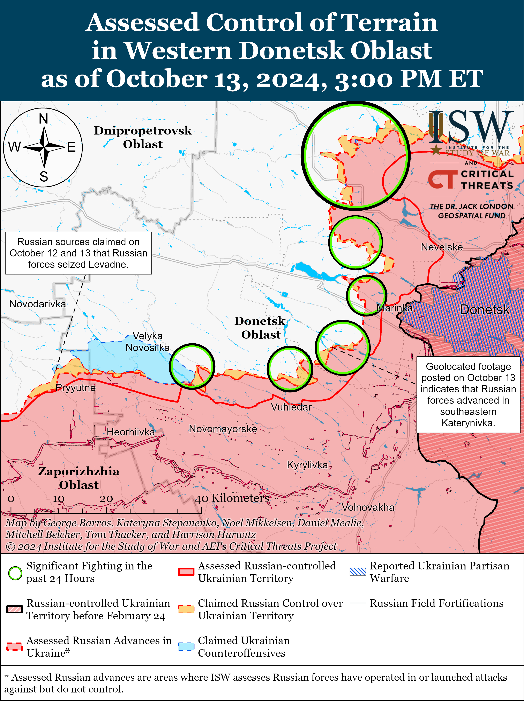
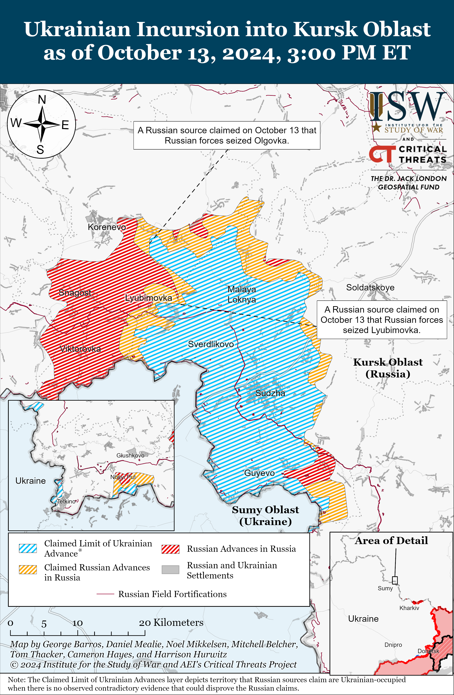
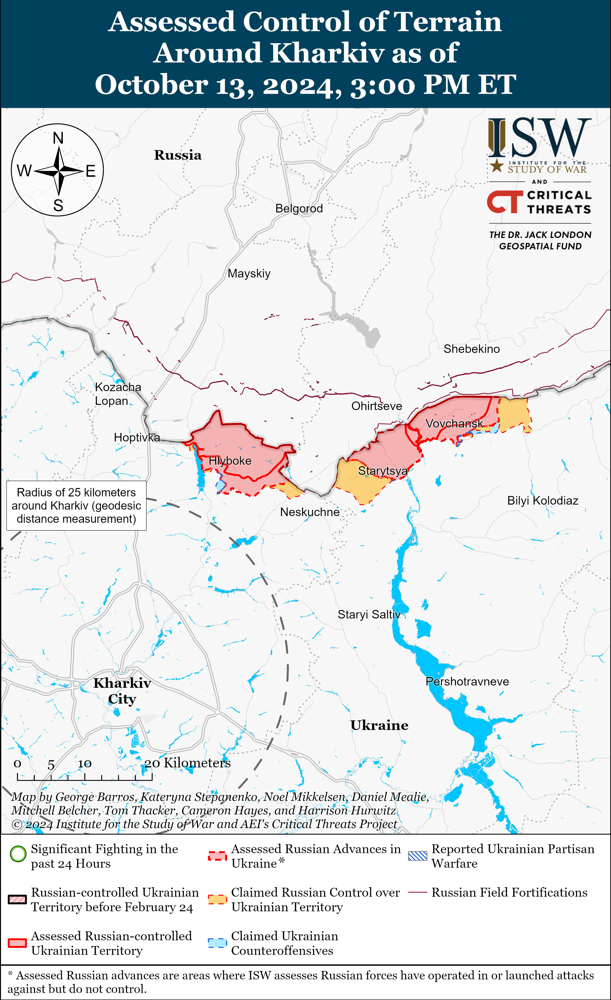
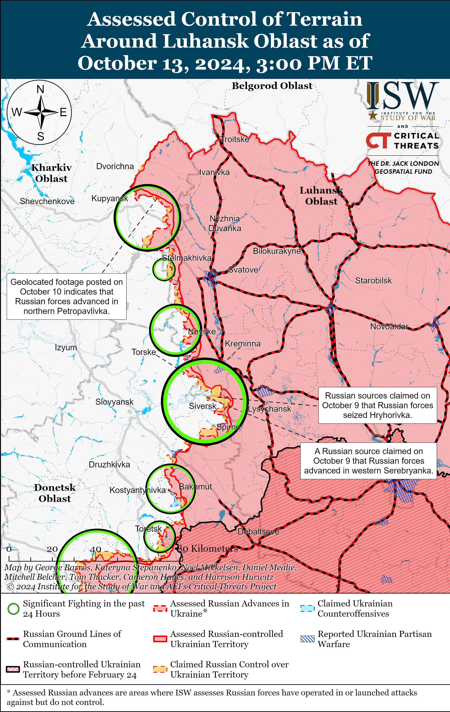
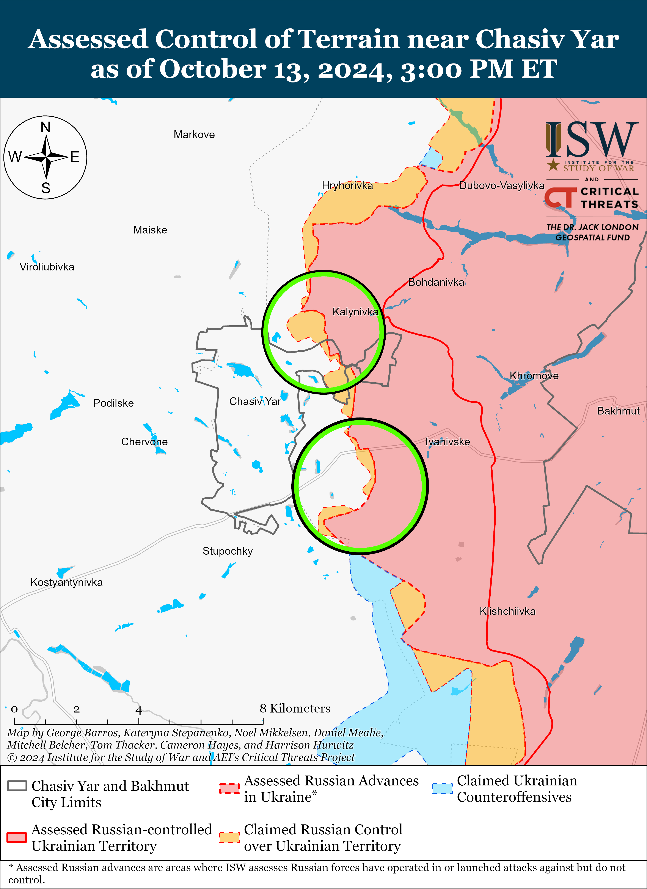
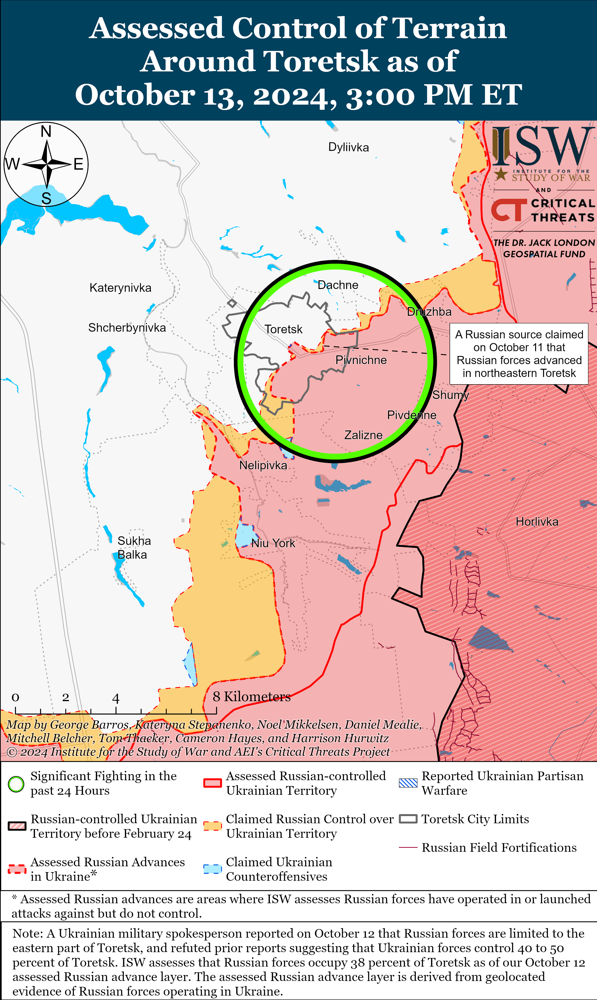
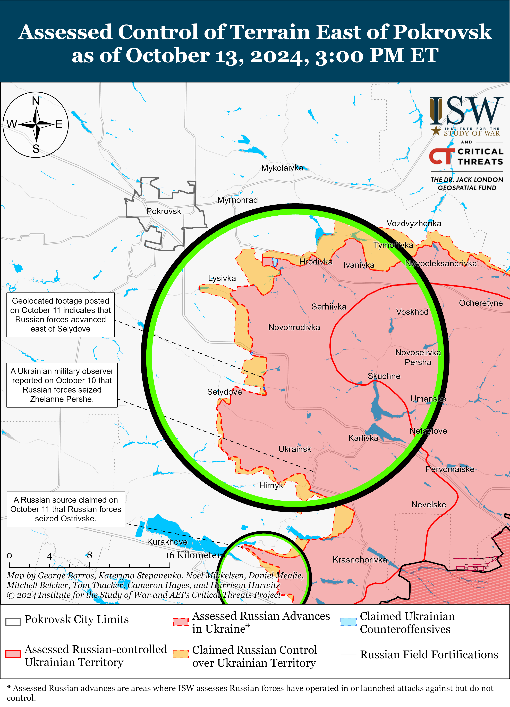
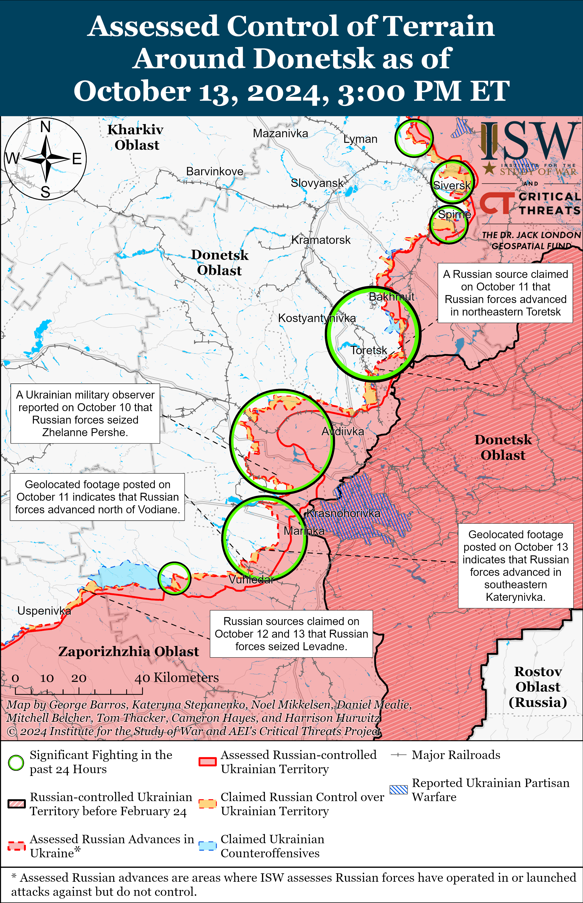
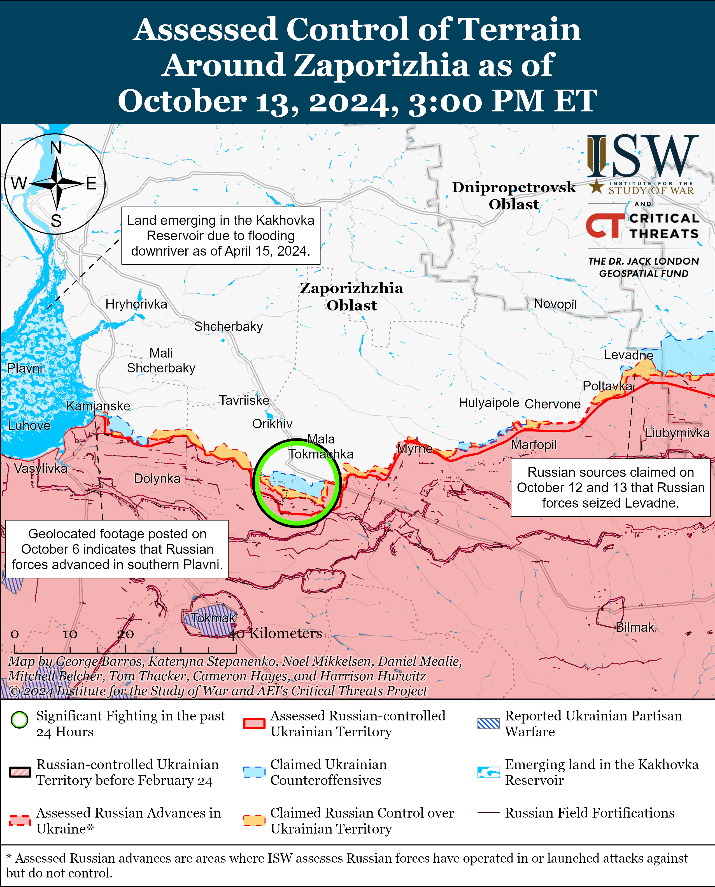
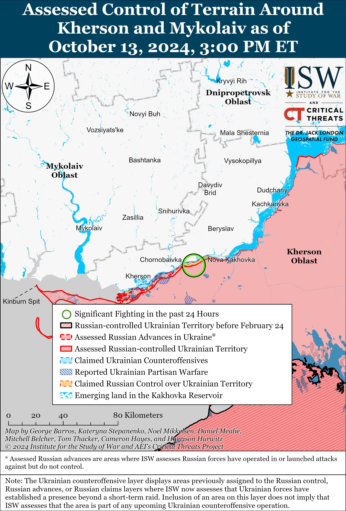

# Russian Offensive Campaign Assessment, October 13, 2024

**October 13, 2024, 4:05pm ET**

**Click** [**here**](https://storymaps.arcgis.com/stories/36a7f6a6f5a9448496de641cf64bd375) **to see ISW’s interactive map of the Russian invasion of Ukraine. This map is updated daily alongside the static maps present in this report.**

**Click** [**here**](https://storymaps.arcgis.com/stories/83a2f24901c941d581c0c523ecd2619b) **to see ISW's interactive map of Ukraine's offensive in Kursk Oblast.**

**Click** [**here**](https://understandingwar.maps.arcgis.com/apps/instant/3dviewer/index.html?appid=1602762dbcde419bb957dea358449580) **to see ISW’s 3D control of terrain topographic map of Ukraine. Use of a computer (not a mobile device) is strongly recommended for using this data-heavy tool.**

**Click** [**here**](https://storymaps.arcgis.com/stories/733fe90805894bfc8562d90b106aa895) **to access ISW’s archive of interactive time-lapse maps of the Russian invasion of Ukraine. These maps complement the static control-of-terrain map that ISW produces daily by showing a dynamic frontline. ISW will update this time-lapse map archive monthly.**

**Note: The data cut-off for this product was 11pm ET on October 13. ISW will cover subsequent reports in the October 14 Russian Offensive Campaign Assessment.**

**Russian forces have recently resumed tactical offensive attacks in the Donetsk-Zaporizhia Oblast border area and have made tactical gains in localized assaults, but this activity so far does not appear to be a part of a larger operational offensive effort to support the wider Russian offensive operation in western Donetsk Oblast.** Russian and Ukrainian sources stated on October 12 and 13 that elements of the Russian 336th Naval Infantry Brigade (Baltic Fleet, Leningrad Military District [LMD]) and the 394th Motorized Rifle Regiment (127th Motorized Rifle Division, 5th Combined Arms Army [CAA], Eastern Military District [EMD]) launched assaults near Levadne (southwest of Velyka Novosilka) and broke through Ukrainian defenses.[[1]](#_edn9749010cb1084448c58738c4ed2be0121) A Ukrainian military observer noted that Russian forces reached the outskirts of Levadne and advanced in the direction of Novodarivka (southwest of Novodarivka).[[2]](#_edn9749010cb1084448c58738c4ed2be0122) Russian milbloggers widely claimed that Russian forces seized Levadne and advanced up to the southern outskirts of Novodarivka, although ISW has not observed confirmation of these Russian claims.[[3]](#_edn9749010cb1084448c58738c4ed2be0123)

These tactical gains are not the result of a sudden or unexpected Russian breakthrough. The Ukrainian General Staff reported that Russian forces began conducting renewed ground assaults southwest of Velyka Novosilka beginning around October 11.[[4]](#_edn9749010cb1084448c58738c4ed2be0124) Ukrainian Khortytsia Group of Forces Spokesperson Colonel Vladyslav Voloshyn reported on October 3 that Russian forces were preparing assaults groups for offensive operations in Zaporizhia Oblast in the near future but that Ukrainian forces had not identified large Russian force concentrations in southern Ukraine.[[5]](#_edn9749010cb1084448c58738c4ed2be0125) Voloshyn added that the planned Russian offensive activity aimed to improve Russian tactical positions and establish tactical footholds for continued offensive actions.[[6]](#_edn9749010cb1084448c58738c4ed2be0126) Russian forces activated on a long dormant sector of the front in western Zaporizhia Oblast near Kamyanske (south of Stepnohirsk) in early October, but this activity has so far been limited and has resulted in only marginal tactical gains.[[7]](#_edn9749010cb1084448c58738c4ed2be0127) Russian forces may be reactivating in less active sectors of the front in southern Ukraine to divert Ukrainian attention away from Russia's priority offensive operations in Donetsk Oblast and to fix Ukrainian forces along the front in southern Ukraine and prevent Ukraine from redeploying forces to Donetsk Oblast.

Concerted Russian offensive operations in the Donetsk-Zaporizhia Oblast border area could theoretically support the ongoing Russian operational effort to eliminate the wider Ukrainian salient in western Donetsk Oblast and advance up to the H-15 (Donetsk City-Zaporizhzhia City) highway by pressing up the T-0518 (Velyka Novosilka-Bahatyr) highway and pressuring the western flank of the Ukrainian grouping in western Donetsk Oblast.[[8]](#_edn9749010cb1084448c58738c4ed2be0128) Russian forces have activated on the western bank of the Mokryi Yaly River that runs west along the T-0518 highway and the western outskirts of Velyka Novosilka, however, and are currently attempting to advance in areas that diverge from the western flank of the Ukrainian salient in western Donetsk Oblast. Russian forces would likely need to seize Velyka Novosilka in order to drive up the T-0518 highway and pursue significant advances into the western flank of the Ukrainian salient, which would require intensified offensive activity on the eastern bank of the Mokryi Yaly River immediately south of Velyka Novosilka. A prominent Kremlin-affiliated milblogger noted on October 13 that there has been a lull in Russian activity north of Staromayorske and Urozhaine (both south of Velyka Novosilka and immediately on the western and eastern banks of the Mokryi Yaly River, respectively).[[9]](#_edn9749010cb1084448c58738c4ed2be0129) Russian advances in the Levadne-Novodarivka area could theoretically aim to cut the road connecting Hulyaipole to Velyka Novosilka and degrade Ukrainian logistics to Velyka Novosilka ahead of hypothetical intensified Russian assaults to seize Velyka Novosilka. ISW has not observed reports that Russian forces are conducting notably large assaults in the Donetsk-Zaporizhia Oblast border area, however, or accumulating manpower and materiel for an intensified offensive effort comparable to the Russian offensive operations in eastern Ukraine. Russian forces, on the contrary, have redeployed forces that were previously in the Donetsk-Zaporizhia Oblast border area and elsewhere in southern Ukraine to respond to Ukraine’s incursion in Kursk.[[10]](#_edn9749010cb1084448c58738c4ed2be01210)

**Russian forces recently executed nine Ukrainian prisoners of war (POWs) in Kursk Oblast amid a theater-wide increase in Russian executions of Ukrainian POWs.** A Ukrainian open-source intelligence (OSINT) project reported on October 13 that Russian forces executed nine Ukrainian POWs near the village of Zeleny Shlyakh, Kursk Oblast on October 10.[[11]](#_edn9749010cb1084448c58738c4ed2be01211) Ukrainian drone operators reportedly unexpectedly encountered Russian forces in what they likely perceived to be a near rear area and came under Russian fire. The Ukrainian drone operators, facing limited ammunition, were compelled to surrender and Russian forces took them as POWs. An image of the aftermath of the execution suggests that Russian forces disarmed, lined, stripped, and shot the Ukrainian POWs — a clear indication of the premediated nature of the executions.[[12]](#_edn9749010cb1084448c58738c4ed2be01212) Ukrainian Human Rights Ombudsman Dmytro Lubinets condemned the executions on October 13 as a serious violation of the Geneva Convention on the Treatment of POWs and stated that he sent letters to the United Nations (UN) and the International Committee of the Red Cross (ICRC) regarding the case.[[13]](#_edn9749010cb1084448c58738c4ed2be01213) The Geneva Convention on POWs prohibits the execution of POWs or persons who are clearly rendered *hors de combat*.[[14]](#_edn9749010cb1084448c58738c4ed2be01214) The Ukrainian Prosecutor's Office also announced on October 13 that it launched an investigation into the reports of the execution of the nine Ukrainian POWs in Kursk Oblast.[[15]](#_edn9749010cb1084448c58738c4ed2be01215)

ISW has recently observed an increase in Russian forces executing Ukrainian POWs throughout the theater, and Russian commanders are likely writ large condoning, encouraging, or directly ordering the execution of Ukrainian POWs. Head of the Ukrainian Department for Combating Crimes in Conditions of Armed Conflict Yuri Bilousov stated on October 4 that Ukrainian sources documented evidence indicating that Russian forces have executed 93 Ukrainian POWs on the battlefield since the start of the full-scale invasion and that 80 percent of the recorded cases occurred in 2024.[[16]](#_edn9749010cb1084448c58738c4ed2be01216) The largest single-instance of execution of Ukrainian POWs occurred on October 1 when Russian forces executed 16 Ukrainian POWs in the Pokrovsk direction.[[17]](#_edn9749010cb1084448c58738c4ed2be01217) ISW continues to track footage and reports of Russian servicemembers executing Ukrainian POWs and has observed a wider trend of Russian abuses against Ukrainian POWs across various sectors of the front that appear to be enabled, if not explicitly endorsed, by individual Russian commanders.[[18]](#_edn9749010cb1084448c58738c4ed2be01218) The Kharkiv Oblast Prosecutor’s Office recently noted that Russian commanders directly ordered the execution of four Ukrainian POWs at the Vovchansk aggregate plant in Summer 2024.[[19]](#_edn9749010cb1084448c58738c4ed2be01219)

**Russian milbloggers largely glorified the Russian execution of the Ukrainian POWs, reinforcing a cultural norm to justify and celebrate war crimes within the broader Russian ultranationalist community.** Many Russian milbloggers not only justified but celebrated the Russian execution of the POWs in Kursk Oblast by claiming that the executions were deserved or that such executions are a common aspect of war.[[20]](#_edn9749010cb1084448c58738c4ed2be01220) Other Russian milbloggers specifically called on the Russian military to increase the execution of Ukrainian POWs throughout the theater.[[21]](#_edn9749010cb1084448c58738c4ed2be01221) Many of these Russian milbloggers have very large followings and are affiliated with the Kremlin, providing them with a sense of authority in establishing and reinforcing the accepted cultural norms within the Russian ultranationalist community. The *Rybar* Telegram channel, which celebrated the execution of POWs, has received awards from the Kremlin and has a following of roughly 1.3 million subscribers as of this publication, and *Rybar* founder Mikhail Zvinchuk regularly appears on Russian state television to comment on the war in Ukraine.[[22]](#_edn9749010cb1084448c58738c4ed2be01222) Other prominent ultranationalist milbloggers who praised and justified the October 10 execution include: *RVvoenkor* with about 1.62 million Telegram subscribers, *Dva Mayora* with roughly 1.17 million subscribers, *Starshe Edy* with about 627,000 subscribers, and *Zapisky Veterana* with about 357,000 subscribers as of this publication.[[23]](#_edn9749010cb1084448c58738c4ed2be01223) Many of these subscribers are Russian military personnel and volunteers currently fighting in the war, and Russian soldiers routinely interact with these channels through correspondences and crowdfunding efforts. Russian milbloggers have often glorified Russian atrocities and brutality in Ukraine since the start of the full-scale invasion, and this glorification underscores a broader culture that is likely encouraging the systemic execution of Ukrainian POWs.[[24]](#_edn9749010cb1084448c58738c4ed2be01224)

**Key Takeaways:**

- **Russian forces have recently resumed tactical offensive attacks in the Donetsk-Zaporizhia Oblast border area and have made tactical gains in localized assaults, but this activity so far does not appear to be a part of a larger operational offensive effort to support the wider Russian offensive operation in western Donetsk Oblast.**
- **Russian forces recently executed nine Ukrainian prisoners of war (POWs) in Kursk Oblast amid a theater-wide increase in Russian executions of Ukrainian POWs.**
- **Russian milbloggers largely glorified the Russian execution of the Ukrainian POWs, reinforcing a cultural norm to justify and celebrate war crimes within the broader Russian ultranationalist community.**
- **Ukrainian forces recently regained lost positions near Selydove, and Russian forces recently advanced near Toretsk, Donetsk City, and Velyka Novosilka.**

***We do not report in detail on Russian war crimes because these activities are well-covered in Western media and do not directly affect the military operations we are assessing and forecasting. We will continue to evaluate and report on the effects of these criminal activities on the Ukrainian military and the Ukrainian population and specifically on combat in Ukrainian urban areas. We utterly condemn Russian violations of the laws of armed conflict and the Geneva Conventions and crimes against humanity even though we do not describe them in these reports.***

- Ukrainian Operations in the Russian Federation
- Russian Main Effort – Eastern Ukraine (comprised of three subordinate main efforts)
- Russian Subordinate Main Effort #1 – Push Ukrainian forces back from the international border with Belgorod Oblast and approach to within tube artillery range of Kharkiv City
- Russian Subordinate Main Effort #2 – Capture the remainder of Luhansk Oblast and push westward into eastern Kharkiv Oblast and encircle northern Donetsk Oblast
- Russian Subordinate Main Effort #3 – Capture the entirety of Donetsk Oblast
- Russian Supporting Effort – Southern Axis
- Russian Air, Missile, and Drone Campaign
- Russian Mobilization and Force Generation Efforts
- Russian Technological Adaptations
- Activities in Russian-occupied areas
- Ukrainian Defense Industrial Base Efforts
- Russian Information Operations and Narratives
- Significant Activity in Belarus

**Ukrainian Operations in the Russian Federation**

Russian forces likely recently recaptured Matveevka (east of Korenevo) and reportedly advanced further into the main Ukrainian salient in Kursk Oblast on October 13. An image published on October 11 showing a Russian servicemember on the outskirts of Olgovka (immediately southeast of Matveevka) indicates that Russian forces likely seized Matveevka on a prior date.[[25]](#_edn9749010cb1084448c58738c4ed2be01225) Russian milbloggers claimed on October 13 that Russian forces recaptured Olgovka, Lyubimovka (southeast of Korenevo), and Tolsty Lug (immediately southeast of Lyubimovka) and most of Novoivanovka (east of Lyubimovka), though some milbloggers claimed that fighting is still ongoing within Olgovka and Lyubimovka.[[26]](#_edn9749010cb1084448c58738c4ed2be01226) A Russian milblogger claimed that Russian forces also pushed Ukrainian forces from Cherkasskaya Konopelka (southeast of Sudzha).[[27]](#_edn9749010cb1084448c58738c4ed2be01227) ISW has not observed visual confirmation of these Russian claims. Russian milbloggers claimed that Russian forces continued attacks in Malaya Loknya (north of Sudzha) and Mykhailovka (northeast of Sudzha), near Novoivanovka and Plekhovo (south of Sudzha), and towards Kolmakov and Agronom (both southeast of Sudzha).[[28]](#_edn9749010cb1084448c58738c4ed2be01228) A Russian milblogger claimed that Russian forces repelled a platoon-sized Ukrainian mechanized counterattack near Novoivanovka, and the Russian Ministry of Defense (MoD) claimed that Russian forces also repelled Ukrainian counterattacks towards Zeleny Shlyakh (immediately east of Lyubimovka), Nizhny Klin (southeast of Lyubimovka), and Pokrovsky (south of Lyubimovka).[[29]](#_edn9749010cb1084448c58738c4ed2be01229) Elements of the Russian 137th Airborne (VDV) Regiment (106th VDV Division) and unspecified naval infantry elements are reportedly operating within Lyubimovka.[[30]](#_edn9749010cb1084448c58738c4ed2be01230)

Russian sources claimed that Russian forces continued efforts to dislodge Ukrainian forces from Glushkovsky Raion (west of the main Ukrainian salient in Kursk Oblast) on October 13. A Russian milblogger claimed that Russian forces continue to advance from Veseloye towards the northern outskirts of Novy Put and near Medvezhye.[[31]](#_edn9749010cb1084448c58738c4ed2be01231) The Russian MoD claimed that Russian forces repelled a Ukrainian counterattack towards Novy Put.[[32]](#_edn9749010cb1084448c58738c4ed2be01232) Elements of the Russian 56th VDV Regiment (106th VDV Division) reportedly continue to operate in Glushkovsky Raion.[[33]](#_edn9749010cb1084448c58738c4ed2be01233)

Ukrainian officials continued to speak about intensified Russian offensive operations within Kursk Oblast on October 13. Ukrainian President Volodymyr Zelensky stated that Russian forces are attempting to push back Ukrainian forces but that Ukrainian forces are holding their positions.[[34]](#_edn9749010cb1084448c58738c4ed2be01234) Ukrainian Northern Group of Forces Spokesperson Colonel Vadym Mysnyk stated on October 13 that Russian forces are transferring unspecified units to Kursk Oblast and that the concentration of Russian forces in the area is high.[[35]](#_edn9749010cb1084448c58738c4ed2be01235)

**Russian Main Effort – Eastern Ukraine**

**Russian Subordinate Main Effort #1 – Kharkiv Oblast** **(Russian objective: Push Ukrainian forces back from the international border with Belgorod Oblast and approach to within tube artillery range of Kharkiv City)**

Russian and Ukrainian sources did not report any fighting in northern Kharkiv Oblast on October 13.[[36]](#_edn9749010cb1084448c58738c4ed2be01236) Elements of the Russian 9th Motorized Rifle Regiment (51st Combined Arms Army [CAA], formerly the 1st Donetsk People's Republic Army Corps [DNR AC]) are reportedly operating near Lyptsi (north of Kharkiv City).[[37]](#_edn9749010cb1084448c58738c4ed2be01237)

****

**Russian Subordinate Main Effort #2 – Luhansk Oblast (Russian objective: Capture the remainder of Luhansk Oblast and push westward into eastern Kharkiv Oblast and northern Donetsk Oblast)**

Russian forces continued offensive operations along the Kupyansk-Svatove-Kreminna line on October 13 but did not make any confirmed gains. Russian milbloggers claimed that Russian forces advanced closer to the Oskil River near Kruhlyakivka (northwest of Svatove), although ISW has not observed visual confirmation of this claim.[[38]](#_edn9749010cb1084448c58738c4ed2be01238) Russian forces continued offensive operations east of Kupyansk near Petropavlivka and Kucherivka; northwest of Svatove near Kolisnykivka, Kruhlyakivka, Stepova Novoselivka, Pishchane, Vyshneve, and Lozova; west of Svatove near Myasozharivka; northwest of Kreminna near Novomykhailivka, Druzhelyubivka, Hrekivka, Nevske, and Novosadove; and west of Kreminna near Torske and Terny on October 12 and 13.[[39]](#_edn9749010cb1084448c58738c4ed2be01239) Elements of the Russian 25th Motorized Rifle Brigade (6th Combined Arms Army [CAA], Leningrad Military District [LMD]) are reportedly operating in the Kupyansk direction, and elements of the 144th Motorized Rifle Division (20th CAA, Moscow Military District [MMD]) reportedly continue to operate in the Lyman direction.[[40]](#_edn9749010cb1084448c58738c4ed2be01240)

Ukrainian forces struck a Russian fuel and lubricants depot near occupied Rovenki, Luhansk Oblast on October 12. The Ukrainian General Staff reported that Ukraine's Main Military Intelligence Directorate (GUR) and Ukrainian forces struck the depot, and Russian sources claimed that Ukrainian forces struck a fuel tank at the depot with a drone.[[41]](#_edn9749010cb1084448c58738c4ed2be01241)

**Russian Subordinate Main Effort #3 – Donetsk Oblast (Russian objective: Capture the entirety of Donetsk Oblast, the claimed territory of Russia’s proxies in Donbas)**

Russian forces conducted offensive operations near Siversk on October 13, but there were no confirmed changes to the frontline. The Ukrainian General Staff reported that Russian forces conducted offensive operations east of Siversk near Verkhnokamyanske and southeast of Siversk near Ivano-Darivka and Vyimka on October 12 and 13.[[42]](#_edn9749010cb1084448c58738c4ed2be01242) A Russian source claimed that Russian forces advanced north of Verkhnokamyanske, but ISW has not observed confirmation of this claim.[[43]](#_edn9749010cb1084448c58738c4ed2be01243) Elements of the Russian 2nd Artillery Brigade (3rd Combined Arms Army [CAA], formerly 2nd Luhansk People's Republic [LNR] Army Corps [AC]) are reportedly operating near Verkhnokamyanske.[[44]](#_edn9749010cb1084448c58738c4ed2be01244)

Russian forces conducted offensive operations near Chasiv Yar on October 13, but there were no confirmed changes to the frontline. Russian forces conducted offensive operations near Chasiv Yar, north of Chasiv Yar near Kalynivka, and south of Chasiv Yar near Stupochky on October 12 and 13.[[45]](#_edn9749010cb1084448c58738c4ed2be01245) The spokesperson of a Ukrainian brigade operating near Chasiv Yar reported on October 13 that Russian forces are mostly conducting infantry assaults in small groups and are practically not conducting any mechanized assaults.[[46]](#_edn9749010cb1084448c58738c4ed2be01246) A Russian milblogger claimed that Ukrainian first-person view (FPV) drones are preventing Russian forces from advancing towards Stupochky.[[47]](#_edn9749010cb1084448c58738c4ed2be01247) Elements of the Russian 1442nd Motorized Rifle Regiment (6th Motorized Rifle Division, 3rd AC) are reportedly operating near Klishchiivka (southeast of Chasiv Yar).[[48]](#_edn9749010cb1084448c58738c4ed2be01248)

Russian forces recently made confirmed advances near Toretsk amid continued offensive operations in the area on October 13. Geolocated footage published on October 12 indicates that Russian forces recently marginally advanced within eastern Toretsk.[[49]](#_edn9749010cb1084448c58738c4ed2be01249) Russian forces conducted offensive operations near Toretsk and west of Toretsk near Shcherbynivka on October 12 and 13.[[50]](#_edn9749010cb1084448c58738c4ed2be01250) Ukrainian Luhansk Group of Forces Spokesperson Major Anastasiya Bobovnikova reported on October 12 that Russian forces are changing into civilian clothing during assault operations in Toretsk - a war crime, if confirmed.[[51]](#_edn9749010cb1084448c58738c4ed2be01251) Elements of the Russian 123rd Motorized Rifle Brigade (3rd CAA) and the "Lavina" Battalion (132nd Motorized Rifle Brigade, 51st CAA [formerly 1st Donetsk People's Republic AC], Southern Military District [SMD]) are reportedly operating within Toretsk.[[52]](#_edn9749010cb1084448c58738c4ed2be01252)

Ukrainian forces recently regained lost positions southeast of Pokrovsk amid continued Russian offensive operations in the area on October 13. Geolocated footage published on October 13 indicates that Ukrainian forces recently regained lost positions north of Selydove (southeast of Pokrovsk).[[53]](#_edn9749010cb1084448c58738c4ed2be01253) The Russian Ministry of Defense (MoD) claimed that Russian forces seized Mykhailivka (southeast of Pokrovsk and immediately east of Selydove), and ISW assessed that Russian forces seized the settlement as of September 22.[[54]](#_edn9749010cb1084448c58738c4ed2be01254) Russian milbloggers claimed that elements of the Russian 114th Motorized Rifle Brigade (51st CAA) seized Tsukuryne (southeast of Pokrovsk and south of Selydove), and ISW assessed that Russian forces seized the settlement as of October 7.[[55]](#_edn9749010cb1084448c58738c4ed2be01255) Russian forces conducted offensive operations east of Pokrovsk near Promin, Myrolyubivka, and Myrnohrad and southeast of Pokrovsk near Tsukuryne, Novodmytrivka, Sukhyi Yar, Lysivka, Selydove, Krutyi Yar, Kreminna Balka, Kurakhivka, Novoselydivka, Hirnyk, Zhelanne Druhe, Zoryane, and Izmailivka on October 12 and 13.[[56]](#_edn9749010cb1084448c58738c4ed2be01256) A Ukrainian servicemember operating in the Pokrovsk direction reported on October 13 that Russian forces are starting to use armored vehicles in assaults.[[57]](#_edn9749010cb1084448c58738c4ed2be01257) Russian sources claimed that Russian forces struck the Korotchenka Mine on the eastern outskirts of Selydove with a Kh-38ML air-to-surface missile.[[58]](#_edn9749010cb1084448c58738c4ed2be01258)

Russian forces conducted offensive operations near Kurakhove; east of Kurakhove near Maksymilyanivka and Heorhiivka; and south of Kurakhove near Dalne on October 12 and 13, but there were no confirmed changes to the frontline.[[59]](#_edn9749010cb1084448c58738c4ed2be01259) Elements of the Russian 238th Artillery Brigade (8th CAA, SMD) are reportedly operating near Hostre and Dalne.[[60]](#_edn9749010cb1084448c58738c4ed2be01260)

Russian forces recently made confirmed advances southwest of Donetsk City amid continued offensive operations in the area on October 13. Geolocated footage published on October 13 indicates that Russian forces recently advanced to southeastern Katerynivka.[[61]](#_edn9749010cb1084448c58738c4ed2be01261) Russian milbloggers claimed that Russian forces advanced north of Kostyantynivka, north of Vodyane, and further into central Katerynivka, but ISW has not observed confirmation of these claims.[[62]](#_edn9749010cb1084448c58738c4ed2be01262) Russian forces conducted offensive operations near Kostyantynivka, Antonivka, Katerynivka, Bohoyavlenka, and Zolota Nyva on October 12 and 13.[[63]](#_edn9749010cb1084448c58738c4ed2be01263) Elements of the Russian 11th Air Force and Air Defense Army (Russian Aerospace Forces [VKS] and Eastern Military District [EMD]) are reportedly operating near Bohoyavlenka.[[64]](#_edn9749010cb1084448c58738c4ed2be01264)

*Please see topline text for details on the Donetsk-Zaporizhia Oblast border area.*

**Russian Supporting Effort – Southern Axis (Russian objective: Maintain frontline positions and secure rear areas against Ukrainian strikes)**

Russian forces conducted ground assaults in western Zaporizhia Oblast near Robotyne on October 12 and 13 but did not make any confirmed gains.[[65]](#_edn9749010cb1084448c58738c4ed2be01265) The Russian Ministry of Defense (MoD) claimed that elements of the Russian BARS-32 (Russian Combat Army Reserve) detachment are operating in Zaporizhia Oblast, and elements of the Russian "Valykria" detachment (4th Military Base, 58th Combined Arms Army [CAA], Southern Military District [SMD]) reportedly continue to operate near Kamyanske (south of Stepnohirsk).[[66]](#_edn9749010cb1084448c58738c4ed2be01266)

The Ukrainian General Staff reported on October 12 and 13 that Russian forces conducted assaults in the Dnipro direction, likely referring to left (east) bank Kherson Oblast and islands in the Dnipro River Delta.[[67]](#_edn9749010cb1084448c58738c4ed2be01267) Ukrainian Southern Operational Command Spokesperson Vladyslav Voloshyn stated on October 12 that Russian forces have intensified offensive activities in the Dnipro direction in the past week and typically conduct five to seven assaults per day with small infantry groups.[[68]](#_edn9749010cb1084448c58738c4ed2be01268) Voloshyn added that Russian forces are accumulating weapons and equipment on the Kinburn Spit and suggested that Russian forces may launch assaults against nearby islands in the area where the Dniprovska Gulf meets the Black Sea.[[69]](#_edn9749010cb1084448c58738c4ed2be01269)

**Russian Air, Missile, and Drone Campaign (Russian Objective: Target Ukrainian military and civilian infrastructure in the rear and on the frontline)**

Russian forces conducted a series of missile and drone strikes against Ukraine on the night of October 12 to 13. The Ukrainian Air Force reported that Russian force launched two Iskander-M ballistic missiles from Kursk Oblast and occupied Crimea, two Kh-59 cruise missiles from airspace over Kursk Oblast, and 68 unspecified strike drones from Kursk and Oryol oblasts.[[70]](#_edn9749010cb1084448c58738c4ed2be01270) The Ukrainian Air Force reported that the two Kh-59 missile struck targets in Chernihiv and Sumy oblasts; that the two Iskander missiles struck Poltava and Odesa oblasts; and that Ukrainian forces shot down 31 Russian drones in Kyiv, Poltava, Chernihiv, Sumy, and Cherkasy oblasts.[[71]](#_edn9749010cb1084448c58738c4ed2be01271) The Ukrainian Air Force added that another 36 Russian drones were "lost in location," presumably as a result of Ukrainian electronic warfare (EW) countermeasures.[[72]](#_edn9749010cb1084448c58738c4ed2be01272)

Ukrainian President Volodymyr Zelensky stated on October 13 that Russian forces launched 900 glide bombs, 40 various missiles, and 400 strike drones at Ukraine in the past week (October 7 to 13).[[73]](#_edn9749010cb1084448c58738c4ed2be01273)

**Russian Mobilization and Force Generation Efforts (Russian objective: Expand combat power without conducting general mobilization)**

Nothing significant to report.

**Russian Technological Adaptations** **(Russian objective: Introduce technological innovations to optimize systems for use in Ukraine)**

Kalashnikov Concern, a subsidiary of Russian state-owned defense conglomerate Rostec, claimed on October 11 that Russian forces tested the new “Goliath” strike and reconnaissance drone in Ukraine.[[74]](#_edn9749010cb1084448c58738c4ed2be01274) The “Goliath” drone is reportedly designed to conduct real-time aerial reconnaissance, track targets designated by the operator, and destroy unarmored vehicles and personnel. Kalashnikov Concern claimed that the drone is equipped with a return mode in case the drone loses communication.

**Ukrainian Defense Industrial Efforts** **(Ukrainian objective: Develop its defense industrial base to become more self-sufficient in cooperation with US, European, and international partners)**

*ISW is suspending publishing coverage of Ukrainian defense industrial efforts until further notice.*

**Activities in Russian-occupied areas (Russian objective: Consolidate administrative control of annexed areas; forcibly integrate Ukrainian citizens into Russian sociocultural, economic, military, and governance systems)**

*ISW is not publishing reporting on activities in Russian-occupied areas today.*

**Russian Information Operations and Narratives**

Nothing significant to report.

**Significant activity in Belarus** **(Russian efforts to increase its military presence in Belarus and further integrate Belarus into Russian-favorable frameworks and Wagner Group activity in Belarus)**

Nothing significant to report.

**Note: ISW does not receive any classified material from any source, uses only publicly available information, and draws extensively on Russian, Ukrainian, and Western reporting and social media as well as commercially available satellite imagery and other geospatial data as the basis for these reports. References to all sources used are provided in the endnotes of each update.**

---

[[1]](#_edn9749010cb1084448c58738c4ed2be012ref1) https://t.me/RVvoenkor/78657 ; https://t.me/dva\_majors/54985 ; https://t.me/belarusian\_silovik/42697 ; https://t.me/motopatriot/28404 ; https://t.me/DnevnikDesantnika/17189 ; https://t.me/yurasumy/18536 ; https://t.me/boris\_rozhin/140606 ; <https://t.me/vanek_nikolaev/27516> ; https://t.me/stranaua/172583

[[2]](#_edn9749010cb1084448c58738c4ed2be012ref2) https://t.me/vanek\_nikolaev/27516

[[3]](#_edn9749010cb1084448c58738c4ed2be012ref3) <https://t.me/RVvoenkor/78657> ; https://t.me/dva\_majors/54985 ; <https://t.me/belarusian_silovik/42697> ; <https://t.me/motopatriot/28404> ; <https://t.me/DnevnikDesantnika/17189> ; <https://t.me/yurasumy/18536> ; <https://t.me/boris_rozhin/140606> ;

[[4]](#_edn9749010cb1084448c58738c4ed2be012ref4) <https://understandingwar.org/backgrounder/russian-offensive-campaign-assessment-october-11-2024> ; <https://www.facebook.com/GeneralStaff.ua/posts/pfbid02GTj9oFntwokbzwnQ88oCUNk3Pc946BQ7kUyuXAK6jjC2CFXaPJCpoqgNbf7oBQSAl>

[[5]](#_edn9749010cb1084448c58738c4ed2be012ref5) <https://understandingwar.org/backgrounder/russian-offensive-campaign-assessment-october-4-2024> ; https://armyinform dot com.ua/2024/10/03/vorozhi-shturmy-tryvayut-na-pivdni-chy-ye-oznaky-pidgotovky-rosiyan-do-velykogo-nastupu/ ;

[[6]](#_edn9749010cb1084448c58738c4ed2be012ref6) https://understandingwar.org/backgrounder/russian-offensive-campaign-assessment-october-4-2024 ; https://armyinform dot com.ua/2024/10/03/vorozhi-shturmy-tryvayut-na-pivdni-chy-ye-oznaky-pidgotovky-rosiyan-do-velykogo-nastupu/ ;

[[7]](#_edn9749010cb1084448c58738c4ed2be012ref7) <https://isw.pub/UkrWar100624> ; <https://isw.pub/UkrWar100724> ; <https://isw.pub/UkrWar100924>

[[8]](#_edn9749010cb1084448c58738c4ed2be012ref8) https://isw.pub/UkrWar090524

[[9]](#_edn9749010cb1084448c58738c4ed2be012ref9) https://t.me/rybar/64402

[[10]](#_edn9749010cb1084448c58738c4ed2be012ref10) <https://isw.pub/UkrWar082224>; https://www.understandingwar.org/backgrounder/russian-offensive-campaign-assessment-august-31-2024

[[11]](#_edn9749010cb1084448c58738c4ed2be012ref11) https://t.me/DeepStateUA/20493; https://suspilne dot media/856875-deepstate-u-kurskij-oblasti-rosiani-rozstrilali-9-ukrainskih-vijskovih-aki-zdalisa-v-polon/; https://meduza dot io/news/2024/10/13/blizkiy-k-minoborony-ukrainy-proekt-deep-state-zayavil-chto-rossiyskie-voennye-ubili-devyat-ukrainskih-voennoplennyh-v-kurskoy-oblasti-vlasti-ukrainy-obratilis-v-oon; <https://t.me/DeepStateUA/20493>; <https://t.me/severrealii/27715>; https://t.me/istories\_media/7828

[[12]](#_edn9749010cb1084448c58738c4ed2be012ref12) \* Graphic Content\* https://t.me/rybar/64399; https://t.me/DeepStateUA/20493

[[13]](#_edn9749010cb1084448c58738c4ed2be012ref13) <https://t.me/dmytro_lubinetzs/6952>; https://www.ohchr.org/en/instruments-mechanisms/instruments/geneva-convention-relative-treatment-prisoners-war

[[14]](#_edn9749010cb1084448c58738c4ed2be012ref14) https://www.ohchr.org/en/instruments-mechanisms/instruments/geneva-convention-relative-treatment-prisoners-war

[[15]](#_edn9749010cb1084448c58738c4ed2be012ref15) <https://www.pravda> dot com.ua/eng/news/2024/10/13/7479489/; <https://x.com/AndriyKostinUa/status/1845419576693014995>; https://t.me/pgo\_gov\_ua/26716; https://armyinform.com dot ua/2024/10/13/pravoohoronczi-rozsliduyut-jmovirnyj-rozstril-9-ukrayinskyh-vijskovopolonenyh-na-kurshhyni/

[[16]](#_edn9749010cb1084448c58738c4ed2be012ref16) https://armyinform.com dot ua/2024/10/04/93-ukrayinskyh-vijskovopolonenyh-stratyly-rosiyany-na-poli-boyu-80-czogo-roku/; https://suspilne dot media/851175-rosiani-stratili-na-poli-bou-93-ukrainskih-vijskovih-aki-zdalisa-u-polon-ofis-genprokurora/; https://www.voanews.com/a/kyiv-says-russia-has-executed-93-ukrainian-pows-since-start-of-war/7811441.html

[[17]](#_edn9749010cb1084448c58738c4ed2be012ref17) <https://www.understandingwar.org/backgrounder/russian-offensive-campaign-assessment-october-5-2024>; <https://kyivindependent> dot com/russian-forces-execute-16-ukrainian-pows-prosecutors-say/

[[18]](#_edn9749010cb1084448c58738c4ed2be012ref18) https://www.understandingwar.org/backgrounder/russian-offensive-campaign-assessment-june-19-2024 ; https://isw.pub/UkrWar122823 ; https://www.understandingwar.org/backgrounder/russian-offensive-campaign-assessment-june-3-2024 ; https://isw.pub/UkrWar032724 ; https://isw.pub/UkrWar052924 ; https://isw.pub/UkrWar090424 ; https://www.understandingwar.org/backgrounder/russian-offensive-campaign-assessment-july-10-2024 ; https://isw.pub/UkrWar062324

[[19]](#_edn9749010cb1084448c58738c4ed2be012ref19) <https://isw.pub/UkrWar100624> ; https://armyinform.com dot ua/2024/10/05/okupanty-stratyly-chotyroh-ukrayinskyh-vijskovyh-u-vovchansku-prokuratura/; https://suspilne dot media/kharkiv/848439-rosiani-stratili-cotiroh-ukrainskih-vijskovih-na-agregatnomu-zavodi-u-vovcansku-vlitku-2024-roku-prokuratura/

[[20]](#_edn9749010cb1084448c58738c4ed2be012ref20) Warning, graphic content: <https://t.me/rybar/64399>; <https://t.me/dva_majors/54979>; <https://t.me/rosgvardeez/10920>; <https://t.me/notes_veterans/19963>; https://t.me/vysokygovorit/17628

[[21]](#_edn9749010cb1084448c58738c4ed2be012ref21) <https://t.me/rosgvardeez/10920>; <https://t.me/vysokygovorit/17628>; <https://t.me/dva_majors/54978>; https://t.me/vysokygovorit/17628

[[22]](#_edn9749010cb1084448c58738c4ed2be012ref22) Graphic content: <https://t.me/rybar><https://www.understandingwar.org/backgrounder/russian-offensive-campaign-assessment-march-4-2024>; https://www.ndc.nato.int/research/research.php?icode=794

[[23]](#_edn9749010cb1084448c58738c4ed2be012ref23) Graphic content: <https://t.me/notes_veterans/19963>; <https://t.me/dva_majors/54979>; <https://t.me/vysokygovorit/17628>; https://t.me/RVvoenkor/78670

[[24]](#_edn9749010cb1084448c58738c4ed2be012ref24) <https://www.understandingwar.org/backgrounder/russian-offensive-campaign-assessment-april-12-2023>; <https://isw.pub/UkrWar021724>; <https://isw.pub/UkrWar041723>; <https://isw.pub/UkrWar040223>; https://isw.pub/UkrWar021323

[[25]](#_edn9749010cb1084448c58738c4ed2be012ref25) https://t.me/boris\_rozhin/140530

[[26]](#_edn9749010cb1084448c58738c4ed2be012ref26) <https://t.me/dva_majors/54962>; <https://t.me/voenkorKotenok/59544>; <https://t.me/yurasumy/18528>; <https://t.me/motopatriot/28405>; <https://t.me/boris_rozhin/140604>; <https://t.me/motopatriot/28434>; <https://t.me/DnevnikDesantnika/17219>; <https://t.me/wargonzo/22574>; https://t.me/DnevnikDesantnika/17178

[[27]](#_edn9749010cb1084448c58738c4ed2be012ref27) https://t.me/yurasumy/18528

[[28]](#_edn9749010cb1084448c58738c4ed2be012ref28) <https://t.me/yurasumy/18528>; <https://t.me/boris_rozhin/140604>; <https://t.me/rybar/64391>; https://t.me/dva\_majors/54962

[[29]](#_edn9749010cb1084448c58738c4ed2be012ref29) <https://t.me/yurasumy/18528>; https://t.me/mod\_russia/44455

[[30]](#_edn9749010cb1084448c58738c4ed2be012ref30) <https://t.me/DnevnikDesantnika/17178>; https://t.me/DnevnikDesantnika/17219

[[31]](#_edn9749010cb1084448c58738c4ed2be012ref31) https://t.me/DnevnikDesantnika/17199

[[32]](#_edn9749010cb1084448c58738c4ed2be012ref32) https://t.me/mod\_russia/44455

[[33]](#_edn9749010cb1084448c58738c4ed2be012ref33) https://t.me/DnevnikDesantnika/17219

[[34]](#_edn9749010cb1084448c58738c4ed2be012ref34) https://t.me/V\_Zelenskiy\_official/11997

[[35]](#_edn9749010cb1084448c58738c4ed2be012ref35) https://armyinform dot com.ua/2024/10/13/rosijski-dyversanty-koshmaryat-svoyih-spivgromadyan-na-kurshhyni-rechnyk-otu-siversk-vadym-mysnyk/; https://www.youtube.com/watch?v=CwQl49tDPTk&ab\_channel=%D0%A2%D0%B5%D0%BB%D0%B5%D0%BA%D0%B0%D0%BD%D0%B0%D0%BB%D0%A0%D0%B0%D0%B4%D0%B0

[[36]](#_edn9749010cb1084448c58738c4ed2be012ref36) <https://t.me/otukharkiv/2032> ; https://www.facebook.com/GeneralStaff.ua/posts/pfbid06oouw75r9KPu7PC8G4n4PHpYquyAU8ezTvzVCnDCQxHsECkBKZB7MofpoDmQdziCl

[[37]](#_edn9749010cb1084448c58738c4ed2be012ref37) https://t.me/boris\_rozhin/140562

[[38]](#_edn9749010cb1084448c58738c4ed2be012ref38) <https://t.me/Sladkov_plus/11570> ; https://t.me/z\_arhiv/28545

[[39]](#_edn9749010cb1084448c58738c4ed2be012ref39) https://www.facebook.com/GeneralStaff.ua/posts/pfbid06oouw75r9KPu7PC8G4n4PHpYquyAU8ezTvzVCnDCQxHsECkBKZB7MofpoDmQdziCl ; <https://www.facebook.com/GeneralStaff.ua/posts/pfbid02Geyd6botFEiXTQhrbCnBWDJCqudfexJrsqQv2LHpMDkjRRHDZCCDmaA42hUmdE4ol> ; https://www.facebook.com/GeneralStaff.ua/posts/pfbid0iCCGyqpQzdX5BDVh38Egg56f5yRgzHVdQm4AvAbCEfU2u6CP7KgQiX7vpvV3gng4l

[[40]](#_edn9749010cb1084448c58738c4ed2be012ref40) <https://t.me/dva_majors/54960> ; <https://t.me/boris_rozhin/140572>

[[41]](#_edn9749010cb1084448c58738c4ed2be012ref41) https://t.me/mchs\_official/23288; https://t.me/astrapress/66238 ; <https://t.me/tass_agency/278940> ; https://t.me/GeneralStaffZSU/17898; https://suspilne dot media/donbas/856421-zsu-vrazili-na-naftobazu-u-rovenkah-so-vidomo/; https://t.me/DIUkraine/4644

[[42]](#_edn9749010cb1084448c58738c4ed2be012ref42) <https://www.facebook.com/GeneralStaff.ua/posts/pfbid02Geyd6botFEiXTQhrbCnBWDJCqudfexJrsqQv2LHpMDkjRRHDZCCDmaA42hUmdE4ol>; <https://www.facebook.com/GeneralStaff.ua/posts/pfbid0iCCGyqpQzdX5BDVh38Egg56f5yRgzHVdQm4AvAbCEfU2u6CP7KgQiX7vpvV3gng4l>

[[43]](#_edn9749010cb1084448c58738c4ed2be012ref43) https://t.me/DnevnikDesantnika/17208

[[44]](#_edn9749010cb1084448c58738c4ed2be012ref44) <https://t.me/motopatriot/28427> ; <https://t.me/ragatka001/94>

[[45]](#_edn9749010cb1084448c58738c4ed2be012ref45) https://www.facebook.com/GeneralStaff.ua/posts/pfbid06oouw75r9KPu7PC8G4n4PHpYquyAU8ezTvzVCnDCQxHsECkBKZB7MofpoDmQdziCl ; <https://www.facebook.com/GeneralStaff.ua/posts/pfbid02Geyd6botFEiXTQhrbCnBWDJCqudfexJrsqQv2LHpMDkjRRHDZCCDmaA42hUmdE4ol> ;

https://www.facebook.com/GeneralStaff.ua/posts/pfbid0iCCGyqpQzdX5BDVh38Egg56f5yRgzHVdQm4AvAbCEfU2u6CP7KgQiX7vpvV3gng4l

[[46]](#_edn9749010cb1084448c58738c4ed2be012ref46) https://www.youtube.com/watch?v=CwQl49tDPTk&ab\_channel=%D0%A2%D0%B5%D0%BB%D0%B5%D0%BA%D0%B0%D0%BD%D0%B0%D0%BB%D0%A0%D0%B0%D0%B4%D0%B0; https://armyinform.com dot ua/2024/10/13/v-rajoni-chasovogo-yaru-rosiyany-roblyat-stavku-na-pihotni-shturmy-bez-zaluchennya-tehniky/

[[47]](#_edn9749010cb1084448c58738c4ed2be012ref47) https://t.me/motopatriot/28403

[[48]](#_edn9749010cb1084448c58738c4ed2be012ref48) https://t.me/motopatriot/28403

[[49]](#_edn9749010cb1084448c58738c4ed2be012ref49) <https://t.me/OBiloshytskiy/1003> ; <https://x.com/AudaxonX/status/1845215698802573386>

[[50]](#_edn9749010cb1084448c58738c4ed2be012ref50) https://www.facebook.com/GeneralStaff.ua/posts/pfbid06oouw75r9KPu7PC8G4n4PHpYquyAU8ezTvzVCnDCQxHsECkBKZB7MofpoDmQdziCl ; <https://www.facebook.com/GeneralStaff.ua/posts/pfbid02Geyd6botFEiXTQhrbCnBWDJCqudfexJrsqQv2LHpMDkjRRHDZCCDmaA42hUmdE4ol>; <https://www.facebook.com/GeneralStaff.ua/posts/pfbid0iCCGyqpQzdX5BDVh38Egg56f5yRgzHVdQm4AvAbCEfU2u6CP7KgQiX7vpvV3gng4l> ; https://t.me/wargonzo/22574

[[51]](#_edn9749010cb1084448c58738c4ed2be012ref51) https://armyinform dot com.ua/2024/10/12/virolomstvo-u-toreczku-rosijski-soldaty-perevdyagayutsya-u-czyvilnyj-odyag/; https://youtu.be/aDXWlQ2K0dM

[[52]](#_edn9749010cb1084448c58738c4ed2be012ref52) <https://t.me/RVvoenkor/78649> ; <https://t.me/wargonzo/22583> ; https://t.me/wargonzo/22585

[[53]](#_edn9749010cb1084448c58738c4ed2be012ref53) <https://t.me/rosgvardia67/44510> ; https://x.com/TuiteroMartin/status/1845425084669759569

[[54]](#_edn9749010cb1084448c58738c4ed2be012ref54) <https://t.me/mod_russia/44453>; https://www.understandingwar.org/backgrounder/russian-offensive-campaign-assessment-september-22-2024

[[55]](#_edn9749010cb1084448c58738c4ed2be012ref55) <https://t.me/dva_majors/54962>; <https://t.me/DnevnikDesantnika/17216;> <https://t.me/boris_rozhin/140616>; <https://t.me/z_arhiv/28548>; <https://t.me/motopatriot/28444>; https://understandingwar.org/backgrounder/russian-offensive-campaign-assessment-october-7-2024

[[56]](#_edn9749010cb1084448c58738c4ed2be012ref56) <https://www.facebook.com/GeneralStaff.ua/posts/pfbid06oouw75r9KPu7PC8G4n4PHpYquyAU8ezTvzVCnDCQxHsECkBKZB7MofpoDmQdziCl>; <https://www.facebook.com/GeneralStaff.ua/posts/pfbid02Geyd6botFEiXTQhrbCnBWDJCqudfexJrsqQv2LHpMDkjRRHDZCCDmaA42hUmdE4ol>; <https://www.facebook.com/GeneralStaff.ua/posts/pfbid0iCCGyqpQzdX5BDVh38Egg56f5yRgzHVdQm4AvAbCEfU2u6CP7KgQiX7vpvV3gng4l>; <https://t.me/DnevnikDesantnika/17206>; https://t.me/boris\_rozhin/140603

[[57]](#_edn9749010cb1084448c58738c4ed2be012ref57) <https://t.me/jagers68/285>; [https://armyinform](https://armyinform/) dot com.ua/2024/10/13/bronya-znovu-pochala-vyyizdyty-rozvidnyk-gus-pro-intensyvni-shturmy-voroga-na-pokrovskomu-napryamku/

[[58]](#_edn9749010cb1084448c58738c4ed2be012ref58) <https://t.me/milinfolive/132727>; https://t.me/motopatriot/28440

[[59]](#_edn9749010cb1084448c58738c4ed2be012ref59) <https://www.facebook.com/GeneralStaff.ua/posts/pfbid06oouw75r9KPu7PC8G4n4PHpYquyAU8ezTvzVCnDCQxHsECkBKZB7MofpoDmQdziCl>; <https://www.facebook.com/GeneralStaff.ua/posts/pfbid02Geyd6botFEiXTQhrbCnBWDJCqudfexJrsqQv2LHpMDkjRRHDZCCDmaA42hUmdE4ol> ; https://www.facebook.com/GeneralStaff.ua/posts/pfbid0iCCGyqpQzdX5BDVh38Egg56f5yRgzHVdQm4AvAbCEfU2u6CP7KgQiX7vpvV3gng4l

[[60]](#_edn9749010cb1084448c58738c4ed2be012ref60) <https://t.me/boris_rozhin/140587>; https://t.me/nm\_dnr/12814

[[61]](#_edn9749010cb1084448c58738c4ed2be012ref61) https://x.com/GirkinGirkin/status/1845456282603458595; <https://x.com/klinger66/status/1845503926038106450;> <https://t.me/odshbr79/395>

[[62]](#_edn9749010cb1084448c58738c4ed2be012ref62) <https://t.me/belarusian_silovik/42699> ; <https://t.me/z_arhiv/28539>

[[63]](#_edn9749010cb1084448c58738c4ed2be012ref63) <https://www.facebook.com/GeneralStaff.ua/posts/pfbid06oouw75r9KPu7PC8G4n4PHpYquyAU8ezTvzVCnDCQxHsECkBKZB7MofpoDmQdziCl>; <https://www.facebook.com/GeneralStaff.ua/posts/pfbid02Geyd6botFEiXTQhrbCnBWDJCqudfexJrsqQv2LHpMDkjRRHDZCCDmaA42hUmdE4ol> ; <https://www.facebook.com/GeneralStaff.ua/posts/pfbid0iCCGyqpQzdX5BDVh38Egg56f5yRgzHVdQm4AvAbCEfU2u6CP7KgQiX7vpvV3gng4l>; https://t.me/dva\_majors/54962

[[64]](#_edn9749010cb1084448c58738c4ed2be012ref64) https://t.me/boris\_rozhin/140545

[[65]](#_edn9749010cb1084448c58738c4ed2be012ref65) <https://www.facebook.com/GeneralStaff.ua/posts/pfbid02Geyd6botFEiXTQhrbCnBWDJCqudfexJrsqQv2LHpMDkjRRHDZCCDmaA42hUmdE4ol> ; <https://www.facebook.com/GeneralStaff.ua/posts/pfbid06oouw75r9KPu7PC8G4n4PHpYquyAU8ezTvzVCnDCQxHsECkBKZB7MofpoDmQdziCl> ; https://www.facebook.com/GeneralStaff.ua/posts/pfbid0iCCGyqpQzdX5BDVh38Egg56f5yRgzHVdQm4AvAbCEfU2u6CP7KgQiX7vpvV3gng4l

[[66]](#_edn9749010cb1084448c58738c4ed2be012ref66) <https://t.me/mod_russia/44443> ; https://t.me/DnevnikDesantnika/17201; https://t.me/boris\_rozhin/140538 ; https://t.me/boris\_rozhin/140582

[[67]](#_edn9749010cb1084448c58738c4ed2be012ref67) <https://www.facebook.com/GeneralStaff.ua/posts/pfbid06oouw75r9KPu7PC8G4n4PHpYquyAU8ezTvzVCnDCQxHsECkBKZB7MofpoDmQdziCl> ; <https://www.facebook.com/GeneralStaff.ua/posts/pfbid02Geyd6botFEiXTQhrbCnBWDJCqudfexJrsqQv2LHpMDkjRRHDZCCDmaA42hUmdE4ol> ; https://www.facebook.com/GeneralStaff.ua/posts/pfbid0iCCGyqpQzdX5BDVh38Egg56f5yRgzHVdQm4AvAbCEfU2u6CP7KgQiX7vpvV3gng4l

[[68]](#_edn9749010cb1084448c58738c4ed2be012ref68) https://armyinform dot com.ua/2024/10/12/vorog-proviv-rotacziyu-na-livoberezhzhi-hersonshhyny-namagayetsya-zagostryty-sytuacziyu/

[[69]](#_edn9749010cb1084448c58738c4ed2be012ref69) <https://armyinform.com> dot ua/2024/10/12/okupanty-aktyvizuvalysya-na-kinburnskij-kosi-u-sylah-oborony-poyasnyly-prychyny/

[[70]](#_edn9749010cb1084448c58738c4ed2be012ref70) https://t.me/kpszsu/21229

[[71]](#_edn9749010cb1084448c58738c4ed2be012ref71) https://t.me/kpszsu/21229

[[72]](#_edn9749010cb1084448c58738c4ed2be012ref72) https://t.me/kpszsu/21229

[[73]](#_edn9749010cb1084448c58738c4ed2be012ref73) https://www.facebook.com/share/v/fwP6A51gEFro3wmn/; https://armyinform.com dot ua/2024/10/13/za-tyzhden-rosiya-zastosuvala-ponad-40-raket-prezydent/

[[74]](#_edn9749010cb1084448c58738c4ed2be012ref74) <https://t.me/kalashnikovnews/2764>; https://t.me/boris\_rozhin/140571

View Citations
